<div class="content">

Siirrämme tässä osassa fokuksen backendiin eli palvelimella olevaan toiminnallisuuteen.

Backendin toteutusympäristönä käytämme [Node.js](https://nodejs.org/en/):ää, joka on melkein missä vaan, erityisesti palvelimilla ja omalla koneellasikin toimiva Googlen [V8](https://developers.google.com/v8/)-JavaScript-moottoriin perustuva JavaScriptin suoritusympäristö.

Kurssimateriaalia tehtäessä on ollut käytössä Node.js:n versio <i>v14.8.0</i>. Huolehdi, että omasi on vähintään yhtä tuore (ks. komentoriviltä _node -v_).

Kuten [osassa 1](/osa1/javascriptia) todettiin, selaimet eivät vielä osaa kaikkia uusimpia JavaScriptin ominaisuuksia, ja siksi selainpuolen koodi täytyy kääntää eli <i>transpiloida</i> esim [Babel](https://babeljs.io/):illa. Backendissa tilanne on kuitenkin toinen, koska uusin Node hallitsee riittävissä määrin myös JavaScriptin uusia versioita, joten suoritamme Nodella kirjoittamaamme koodia suoraan ilman transpilointivaihetta.

Tavoitteenamme on tehdä [osan 2](/osa2) muistiinpanosovellukseen sopiva backend. Aloitetaan kuitenkin ensin perusteiden läpikäyminen toteuttamalla perinteinen "hello world" -sovellus.

**Huomaa**, että tässä osassa ja sen tehtävissä luotavat sovellukset eivät ole Reactia, eli emme käytä <i>create-react-app</i>-sovellusta tämän osan sovellusten rungon alustamiseen.

Osassa 2 oli jo puhe [npm](/osa2/palvelimella_olevan_datan_hakeminen#npm):stä, eli JavaScript-projektien hallintaan liittyvästä, alunperin Node-ekosysteemistä kotoisin olevasta työkalusta. 

Mennään sopivaan hakemistoon ja luodaan projektimme runko komennolla _npm init_. Vastaillaan kysymyksiin sopivasti, ja tuloksena on hakemiston juureen sijoitettu projektin tietoja kuvaava tiedosto <i>package.json</i>:

```json
{
  "name": "notebackend",
  "version": "0.0.1",
  "description": "",
  "main": "index.js",
  "scripts": {
    "test": "echo \"Error: no test specified\" && exit 1"
  },
  "author": "Matti Luukkainen",
  "license": "MIT"
}
```

Tiedosto määrittelee mm., että ohjelmamme käynnistyspiste on tiedosto <i>index.js</i>.

Tehdään kenttään <i>scripts</i> pieni lisäys:

```bash
{
  // ...
  "scripts": {
    "start": "node index.js", // highlight-line
    "test": "echo \"Error: no test specified\" && exit 1"
  },
  // ...
}
```

Luodaan sitten sovelluksen ensimmäinen versio eli projektin juureen sijoitettava tiedosto <i>index.js</i> ja sille seuraava sisältö:

```js
console.log('hello world')
```

Voimme suorittaa ohjelman joko "suoraan" nodella, komentorivillä

```bash
node index.js
```

tai [npm-skriptinä](https://docs.npmjs.com/misc/scripts)

```bash
npm start
```

npm-skripti <i>start</i> toimii koska määrittelimme sen tiedostoon <i>package.json</i>:

```bash
{
  // ...
  "scripts": {
    "start": "node index.js",
    "test": "echo \"Error: no test specified\" && exit 1"
  },
  // ...
}
```

Vaikka esim. projektin suorittaminen onnistuukin suoraan käyttämällä komentoa _node index.js_, on npm-projekteille suoritettavat operaatiot yleensä tapana määritellä nimenomaan npm-skripteinä.

Oletusarvoinen <i>package.json</i> määrittelee valmiiksi myös toisen yleisesti käytetyn npm-skriptin eli _npm test_. Koska projektissamme ei ole vielä testikirjastoa, ei _npm test_ kuitenkaan tee vielä muuta kuin suorittaa komennon

```bash
echo "Error: no test specified" && exit 1
```

### Yksinkertainen web-palvelin

Muutetaan sovellus web-palvelimeksi:

```js
const http = require('http')

const app = http.createServer((request, response) => {
  response.writeHead(200, { 'Content-Type': 'text/plain' })
  response.end('Hello World')
})

const PORT = 3001
app.listen(PORT)
console.log(`Server running on port ${PORT}`)
```

Kun sovellus käynnistuu, konsoliin tulostuu

```bash
Server running on port 3001
```

Voimme avata selaimella osoitteessa <http://localhost:3001> olevan vaatimattoman sovelluksemme:

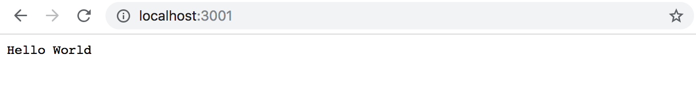

Palvelin toimii samalla tavalla riippumatta urlin loppuosasta, eli myös sivun <http://localhost:3001/foo/bar> sisältö on sama.

**HUOM:** jos koneesi portti 3001 on jo jonkun sovelluksen käytössä, aiheuttaa käynnistäminen virheen:

```bash
> notes-backend@1.0.0 start /Users/mluukkai/opetus/_koodi_fs/3/luento/notes-backend
> node index.js

Server running on port 3001
events.js:174
      throw er; // Unhandled 'error' event
      ^

Error: listen EADDRINUSE: address already in use :::3001
    at Server.setupListenHandle [as _listen2] (net.js:1280:14)
    at listenInCluster (net.js:1378:12)
```

Sulje portissa 3001 oleva sovellus (edellisessä osassa json-server käynnistettiin porttiin 3001) tai määrittele sovellukselle jokin toinen portti.

Tarkastellaan koodia hiukan. Ensimmäinen rivi

```js
const http = require('http')
```

ottaa käyttöön Noden sisäänrakennetun [web-palvelimen](https://nodejs.org/docs/latest-v8.x/api/http.html) määrittelevän moduulin. Kyse on käytännössä samasta asiasta kuin mihin olemme selainpuolen koodissa tottuneet, mutta syntaksiltaan hieman erilaisessa muodossa:

```js
import http from 'http'
```

Selaimen puolella käytetään (nykyään) ES6:n moduuleita, eli moduulit määritellään [exportilla](https://developer.mozilla.org/en-US/docs/Web/JavaScript/Reference/Statements/export) ja otetaan käyttöön [importilla](https://developer.mozilla.org/en-US/docs/Web/JavaScript/Reference/Statements/import).

Node.js kuitenkin käyttää ns. [CommonJS](https://en.wikipedia.org/wiki/CommonJS)-moduuleja. Syy tälle on siinä, että Node-ekosysteemillä oli tarve moduuleihin jo kauan ennen kuin JavaScript tuki moduuleja kielen tasolla. Node ei toistaiseksi tue ES-moduuleja, mutta tuki on todennäköisesti jossain vaiheessa [tulossa](https://nodejs.org/api/esm.html).

CommonJS-moduulit toimivat melko samaan tapaan kuin ES6-moduulit, ainakin tämän kurssin tarpeiden puitteissa.

Koodi jatkuu seuraavasti:

```js
const app = http.createServer((request, response) => {
  response.writeHead(200, { 'Content-Type': 'text/plain' })
  response.end('Hello World')
})
```

Koodi luo [http](https://nodejs.org/docs/latest-v8.x/api/http.html)-palvelimen metodilla _createServer_ web-palvelimen, jolle se rekisteröi <i>tapahtumankäsittelijän</i>, joka suoritetaan <i>jokaisen</i> osoitteen http://localhost:3001 alle tulevan HTTP-pyynnön yhteydessä.

Pyyntöön vastataan statuskoodilla 200, asettamalla <i>Content-Type</i>-headerille arvo <i>text/plain</i> ja asettamalla palautettavan sivun sisällöksi merkkijono <i>Hello World</i>.

Viimeiset rivit sitovat muuttujaan _app_ sijoitetun http-palvelimen kuuntelemaan porttiin 3001 tulevia HTTP-pyyntöjä:

```js
const PORT = 3001
app.listen(PORT)
console.log(`Server running on port ${PORT}`)
```

Koska tällä kurssilla palvelimen rooli on pääasiassa tarjota frontille JSON-muotoista "raakadataa", muutetaan palvelinta siten, että se palauttaa kovakoodatun listan JSON-muotoisia muistiinpanoja:

```js
const http = require('http')

// highlight-start
let notes = [
  {
    id: 1,
    content: "HTML is easy",
    date: "2020-01-10T17:30:31.098Z",
    important: true
  },
  {
    id: 2,
    content: "Browser can execute only Javascript",
    date: "2020-01-10T18:39:34.091Z",
    important: false
  },
  {
    id: 3,
    content: "GET and POST are the most important methods of HTTP protocol",
    date: "2020-01-10T19:20:14.298Z",
    important: true
  }
]

const app = http.createServer((request, response) => {
  response.writeHead(200, { 'Content-Type': 'application/json' })
  response.end(JSON.stringify(notes))
})
// highlight-end

const PORT = 3001
app.listen(PORT)
console.log(`Server running on port ${PORT}`)
```

Käynnistetään palvelin uudelleen (palvelin suljetaan painamalla konsolissa yhtä aikaa _ctrl_ + _c_) ja refreshataan selain.

Headerin <i>Content-Type</i> arvolla <i>application/json</i> kerrotaan, että kyse on JSON-muotoisesta datasta. Muuttujassa _notes_ oleva taulukko muutetaan JSON-muotoon metodilla <em>JSON.stringify(notes)</em>.

Kun avaamme selaimen, on tulostusasu sama kuin [osassa 2](/osa2/palvelimella_olevan_datan_hakeminen) käytetyn [json-serverin](https://github.com/typicode/json-server) tarjoamalla muistiinpanojen listalla:

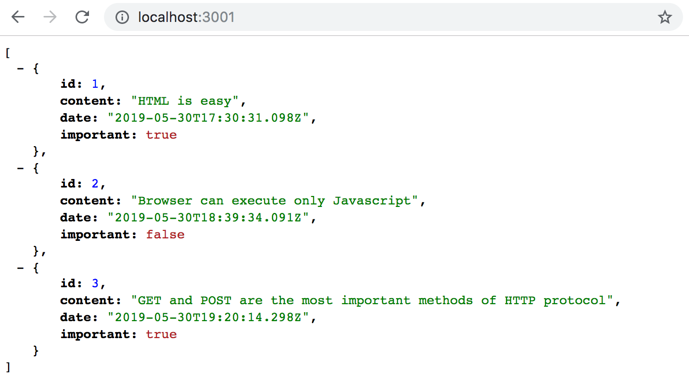

### Express

Palvelimen koodin tekeminen suoraan Noden sisäänrakennetun web-palvelimen [http](https://nodejs.org/docs/latest-v8.x/api/http.html):n päälle on mahdollista. Se on kuitenkin työlästä, erityisesti jos sovellus kasvaa hieman isommaksi.

Nodella tapahtuvaa web-sovellusten ohjelmointia helpottamaan onkin kehitelty useita _http_:tä miellyttävämmän ohjelmointirajapinnan tarjoavia kirjastoja. Näistä ylivoimaisesti suosituin on [Express](https://expressjs.com).

Otetaan Express käyttöön määrittelemällä se projektimme riippuvuudeksi komennolla

```bash
npm install express
```

Riippuvuus tulee nyt määritellyksi tiedostoon <i>package.json</i>:

```json
{
  // ...
  "dependencies": {
    "express": "^4.17.1"
  }
}

```

Riippuvuuden koodi asentuu kaikkien projektin riippuvuuksien tapaan projektin juuressa olevaan hakemistoon <i>node\_modules</i>. Hakemistosta löytyy Expressin lisäksi suuri määrä muutakin tavaraa:

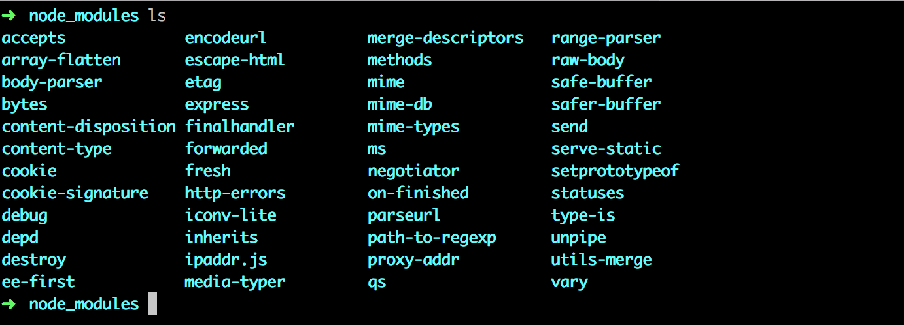

Kyseessä ovat Expressin riippuvuudet ja niiden riippuvuudet jne. eli projektimme [transitiiviset riippuvuudet](https://lexi-lambda.github.io/blog/2016/08/24/understanding-the-npm-dependency-model/).

Projektiin asentui Expressin versio 4.17.1. </i>package.json:issa</i> versiomerkinnän edessä on väkänen, eli muoto on

```json
"express": "^4.17.1"
```
  
npm:n yhteydessä käytetään ns. [semanttista versiointia](https://docs.npmjs.com/getting-started/semantic-versioning). Merkintä <i>^4.17.1</i> tarkoittaa, että jos projektin riippuvuudet päivitetään, asennetaan Expressistä versio, joka on vähintään <i>4.17.1</i>, mutta asennetuksi voi tulla versio, jonka <i>patch</i> eli viimeinen numero tai <i>minor</i> eli keskimmäinen numero voi olla suurempi. Pääversio eli <i>major</i> täytyy kuitenkin olla edelleen sama.

Voimme päivittää projektin riippuvuudet komennolla

```bash
npm update
```

Jos aloitamme projektin koodaamisen toisella koneella, saamme haettua ajantasaiset, <i>package.json</i>:in määrittelyn kanssa yhteensopivat riippuvuudet komennolla

```bash
npm install
```

Jos riippuvuuden <i>major</i>-versionumero ei muutu, uudempien versioiden pitäisi olla [taaksepäin yhteensopivia](https://en.wikipedia.org/wiki/Backward_compatibility), eli jos ohjelmamme käyttäisi tulevaisuudessa esim. Expressin versiota 4.99.175, tässä osassa tehtävän koodin pitäisi edelleen toimia ilman muutoksia. Sen sijaan tulevaisuudessa joskus julkaistava Express 5.0.0 [voi sisältää](https://expressjs.com/en/guide/migrating-5.html) sellaisia muutoksia, että koodimme ei enää toimisi.

### Web ja Express

Palataan taas sovelluksen ääreen ja muutetaan se muotoon

```js
const express = require('express')
const app = express()

let notes = [
  ...
]

app.get('/', (req, res) => {
  res.send('<h1>Hello World!</h1>')
})

app.get('/api/notes', (req, res) => {
  res.json(notes)
})

const PORT = 3001
app.listen(PORT, () => {
  console.log(`Server running on port ${PORT}`)
})
```

Jotta sovelluksen uusi versio saadaan käyttöön, on sovellus käynnistettävä uudelleen.

Sovellus ei muutu paljoa. Heti alussa otetaan käyttöön _express_, joka on tällä kertaa <i>funktio</i>, jota kutsumalla luodaan muuttujaan _app_ sijoitettava Express-sovellusta vastaava olio:

```js
const express = require('express')
const app = express()
```

Seuraavaksi määritellään sovellukselle kaksi <i>routea</i>. Näistä ensimmäinen määrittelee tapahtumankäsittelijän, joka hoitaa sovelluksen juureen eli polkuun <i>/</i> tulevia HTTP GET -pyyntöjä:

```js
app.get('/', (request, response) => {
  response.send('<h1>Hello World!</h1>')
})
```

Tapahtumankäsittelijäfunktiolla on kaksi parametria. Näistä ensimmäinen eli [request](http://expressjs.com/en/4x/api.html#req) sisältää kaikki HTTP-pyynnön tiedot ja toisen parametrin [response](http://expressjs.com/en/4x/api.html#res):n avulla määritellään, miten pyyntöön vastataan.

Koodissa pyyntöön vastataan käyttäen _response_-olion metodia [send](http://expressjs.com/en/4x/api.html#res.send), jonka kutsumisen seurauksena palvelin vastaa HTTP-pyyntöön lähettämällä selaimelle vastaukseksi _send_:in parametrina olevan merkkijonon <code>\<h1>Hello World!\</h1></code>. Koska parametri on merkkijono, asettaa Express vastauksessa <i>content-type</i>-headerin arvoksi <i>text/html</i>. Statuskoodiksi tulee oletusarvoisesti 200. 

Asian voi varmistaa konsolin välilehdeltä <i>Network</i>:

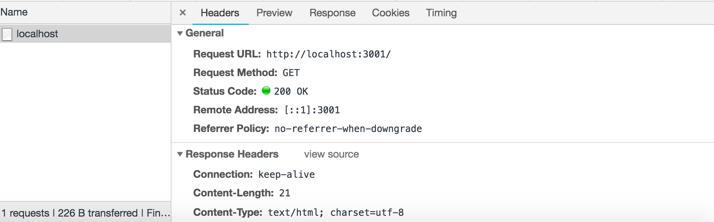

Routeista toinen määrittelee tapahtumankäsittelijän, joka hoitaa sovelluksen polkuun <i>/api/notes</i> tulevia HTTP GET -pyyntöjä:

```js
app.get('/api/notes', (request, response) => {
  response.json(notes)
})
```

Pyyntöön vastataan _response_-olion metodilla [json](http://expressjs.com/en/4x/api.html#res.json), joka lähettää HTTP-pyynnön vastaukseksi parametrina olevaa JavaScript-olioa eli taulukkoa _notes_ vastaavan JSON-muotoisen merkkijonon. Express asettaa headerin <i>Content-type</i> arvoksi <i>application/json</i>.

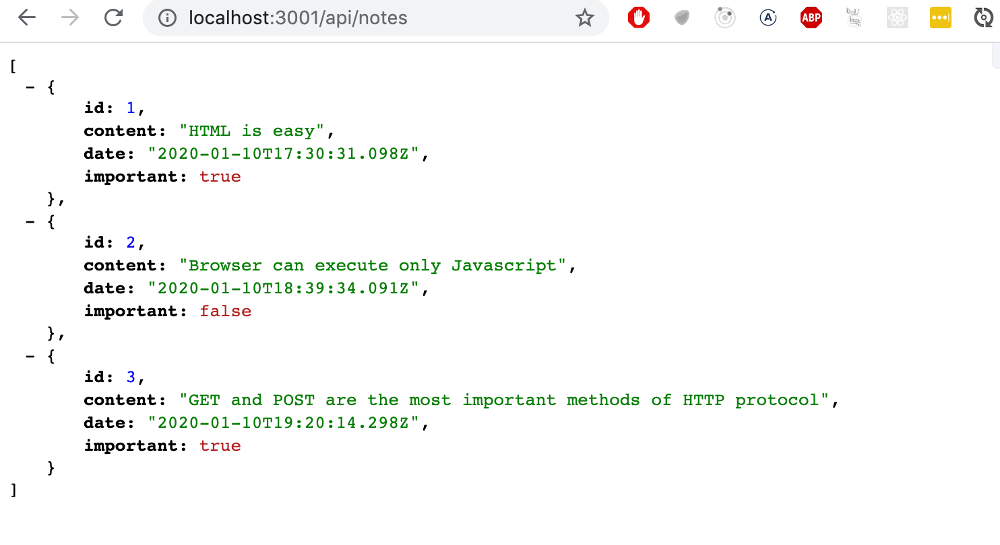

Pieni huomio JSON-muodossa palautettavasta datasta.

Aiemmassa, pelkkää Nodea käyttämässä versiossa, jouduimme muuttamaan palautettavan datan JSON-muotoon metodilla _JSON.stringify_:

```js
response.end(JSON.stringify(notes))
```

Expressiä käytettäessä tämä ei ole tarpeen, sillä muunnos tapahtuu automaattisesti.

Kannattaa huomata, että [JSON](https://en.wikipedia.org/wiki/JSON) on merkkijono, eikä JavaScript-olio kuten muuttuja _notes_.

Seuraava interaktiivisessa [node-repl](https://nodejs.org/docs/latest-v8.x/api/repl.html):issä suoritettu kokeilu havainnollistaa asiaa:

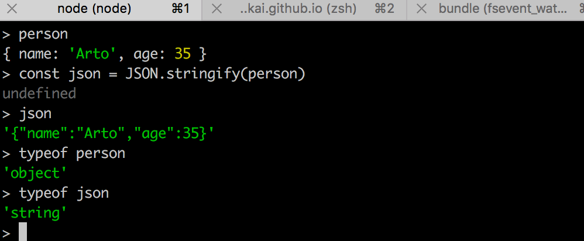

Saat käynnistettyä interaktiivisen node-repl:in kirjoittamalla komentoriville _node_. Komentojen toimivuutta on koodatessa kätevä kokeilla konsolissa, suosittelen!

### nodemon

Jos muutamme sovelluksen koodia, joudumme ensin sulkemaan sovelluksen konsolista (_ctrl_ + _c_) ja sitten käynnistämään sovelluksen uudelleen, jotta muutokset tulevat voimaan. Uudelleenkäynnistely tuntuu kömpelöltä verrattuna Reactin mukavaan workflow'hun, jossa selain päivittyi automaattisesti koodin muuttuessa.

Ongelmaan on ratkaisu nimeltä [nodemon](https://github.com/remy/nodemon):

> <i>nodemon will watch the files in the directory in which nodemon was started, and if any files change, nodemon will automatically restart your node application.</i>

Asennetaan nodemon määrittelemällä se <i>kehitysaikaiseksi riippuvuudeksi</i> (development dependency) komennolla:

```bash
npm install --save-dev nodemon
```

Tiedoston <i>package.json</i> sisältö muuttuu seuraavasti:

```json
{
  //...
  "dependencies": {
    "express": "^4.17.1"
  },
  "devDependencies": {
    "nodemon": "^2.0.7"
  }
}
```

Jos nodemon-riippuvuus kuitenkin meni sovelluksessasi normaaliin "dependencies"-ryhmään, päivitä <i>package.json</i> manuaalisesti vastaamaan yllä näkyvää (kuitenkin versiot säilyttäen).

Kehitysaikaisilla riippuvuuksilla tarkoitetaan työkaluja, joita tarvitaan ainoastaan sovellusta kehitettäessä esim. testaukseen tai sovelluksen automaattiseen uudelleenkäynnistykseen kuten <i>nodemon</i>.

Kun sovellusta suoritetaan tuotantomoodissa eli samoin kuin sitä tullaan suorittamaan tuotantopalvelimella (esim. Herokussa, johon tulemme kohta siirtämään sovelluksemme), ei kehitysaikaisia riippuvuuksia tarvita.

Voimme käynnistää ohjelman <i>nodemonilla</i> seuraavasti:

```bash
node_modules/.bin/nodemon index.js
```

Sovelluksen koodin muutokset aiheuttavat nyt automaattisen palvelimen uudelleenkäynnistymisen. Kannattaa huomata, että vaikka palvelin uudelleenkäynnistyy automaattisesti, selain täytyy kuitenkin refreshata, sillä toisin kuin Reactin yhteydessä, meillä ei nyt ole eikä tässä skenaariossa (jossa palautamme JSON-muotoista dataa) edes voisikaan olla selainta päivittävää [hot reload](https://gaearon.github.io/react-hot-loader/getstarted/) -toiminnallisuutta.

Komento on ikävä, joten määritellään sitä varten <i>npm-skripti</i> tiedostoon <i>package.json</i>:

```bash
{
  // ..
  "scripts": {
    "start": "node index.js",
    "dev": "nodemon index.js", // highlight-line
    "test": "echo \"Error: no test specified\" && exit 1"
  },
  // ..
}
```

Skriptissä ei ole tarvetta käyttää nodemonin polusta sen täydellistä muotoa <i>node\_modules/.bin/nodemon</i> sillä _npm_ osaa etsiä automaattisesti suoritettavaa tiedostoa kyseisestä hakemistosta.

Voimme nyt käynnistää palvelimen sovelluskehitysmoodissa komennolla

```bash
npm run dev
```

Toisin kuin skriptejä <i>start</i> tai <i>test</i> suoritettaessa, komennon tulee sisältää myös <i>run</i>.

### REST

Laajennetaan sovellusta siten, että se toteuttaa samanlaisen RESTful-periaatteeseen nojaavan HTTP-rajapinnan kuin [json-server](https://github.com/typicode/json-server#routes).

Representational State Transfer eli REST on Roy Fieldingin vuonna 2000 ilmestyneessä [väitöskirjassa](https://www.ics.uci.edu/~fielding/pubs/dissertation/rest_arch_style.htm) määritelty skaalautuvien web-sovellusten rakentamiseksi tarkoitettu arkkitehtuurityyli.

Emme nyt rupea määrittelemään REST:iä fieldingiläisittäin tai rupea väittelemään siitä mitä REST on tai mitä se ei ole. Otamme hieman [kapeamman näkökulman](https://en.wikipedia.org/wiki/Representational_state_transfer#Applied_to_web_services), jonka mukaan REST tai RESTful API:t yleensä tulkitaan web-sovelluksissa. Alkuperäinen REST-periaate ei sinänsä rajoitu web-sovelluksiin.

Mainitsimme jo [edellisessä osassa](/osa2/palvelimella_olevan_datan_muokkaaminen#rest), että yksittäisiä asioita, meidän tapauksessamme muistiinpanoja kutsutaan RESTful-ajattelussa <i>resursseiksi</i>. Jokaisella resurssilla on URL eli sen yksilöivä osoite.

Erittäin yleinen konventio on muodostaa resurssien yksilöivät URLit liittäen resurssityypin nimi ja resurssin yksilöivä tunniste.

Oletetaan, että palvelumme juuriosoite on <i>www.example.com/api</i>.

Jos nimitämme muistiinpanoja <i>note</i>-resursseiksi, yksilöidään yksittäinen muistiinpano, jonka tunniste on 10 URLilla <i>www.example.com/api/notes/10</i>.

Kaikkia muistiinpanoja edustavan kokoelmaresurssin URL taas on <i>www.example.com/api/notes</i>.

Resursseille voi suorittaa erilaisia operaatiota. Suoritettavan operaation määrittelee HTTP-operaation tyyppi, jota kutsutaan usein myös <i>verbiksi</i>:

| URL                   | verbi               | toiminnallisuus                                                  |
| --------------------- | ------------------- | ---------------------------------------------------------------- |
| notes/10 &nbsp;&nbsp; | GET                 | hakee yksittäisen resurssin                                      |
| notes                 | GET                 | hakee kokoelman kaikki resurssit                                 |
| notes                 | POST                | luo uuden resurssin pyynnön mukana olevasta datasta              |
| notes/10              | DELETE &nbsp;&nbsp; | poistaa yksilöidyn resurssin                                     |
| notes/10              | PUT                 | korvaa yksilöidyn resurssin pyynnön mukana olevalla datalla      |
| notes/10              | PATCH               | korvaa yksilöidyn resurssin osan pyynnön mukana olevalla datalla |
|                       |                     |                                                                  |

Näin määrittyy suurin piirtein asia, jota REST kutsuu nimellä [uniform interface](https://en.wikipedia.org/wiki/Representational_state_transfer#Architectural_constraints), eli jossain määrin yhtenäinen tapa määritellä rajapintoja, jotka mahdollistavat (tietyin tarkennuksin) järjestelmien yhteiskäytön.

Tämänkaltaista tapaa tulkita REST:iä on nimitetty kolmiportaisella asteikolla [kypsyystason 2](https://martinfowler.com/articles/richardsonMaturityModel.html) REST:iksi. REST:in kehittäjän Roy Fieldingin mukaan tällöin kyseessä ei vielä ole ollenkaan asia, jota tulisi kutsua [REST API:ksi](http://roy.gbiv.com/untangled/2008/rest-apis-must-be-hypertext-driven). Valtaosa maailman "REST" API -rajapinnoista ei täytäkään puhdasverisen fieldingiläisen REST API:n määritelmää.

Joissain yhteyksissä (ks. esim. [Richardson, Ruby: RESTful Web Services](http://shop.oreilly.com/product/9780596529260.do)) edellä esitellyn kaltaista suoraviivaisehkoa resurssien [CRUD](https://en.wikipedia.org/wiki/Create,_read,_update_and_delete)-tyylisen manipuloinnin mahdollistavaa API:a nimitetään REST:in sijaan [resurssipohjaiseksi](https://en.wikipedia.org/wiki/Resource-oriented_architecture) arkkitehtuurityyliksi. Emme nyt kuitenkaan takerru liian tarkasti määritelmällisiin asioihin vaan jatkamme sovelluksen parissa.

### Yksittäisen resurssin haku

Laajennetaan nyt sovellusta siten, että se tarjoaa muistiinpanojen operointiin REST-rajapinnan. Tehdään ensin [route](http://expressjs.com/en/guide/routing.html) yksittäisen resurssin katsomista varten.

Yksittäisen muistiinpanon identifioi URL, joka on muotoa <i>/api/notes/10</i>. Lopussa oleva luku vastaa resurssin muistiinpanon id:tä.

Voimme määritellä Expressin routejen poluille [parametreja](http://expressjs.com/en/guide/routing.html) käyttämällä kaksoispistesyntaksia:

```js
app.get('/api/notes/:id', (request, response) => {
  const id = request.params.id
  const note = notes.find(note => note.id === id)
  response.json(note)
})
```

Nyt <code>app.get('/api/notes/:id', ...)</code> käsittelee kaikki HTTP GET -pyynnöt, jotka ovat muotoa <i>/api/notes/JOTAIN</i>, jossa <i>JOTAIN</i> on mielivaltainen merkkijono.

Polun parametrin <i>id</i> arvoon päästään käsiksi pyynnön tiedot kertovan olion [request](http://expressjs.com/en/api.html#req) kautta:

```js
const id = request.params.id
```

Jo tutuksi tulleella taulukon _find_-metodilla haetaan taulukosta parametria vastaava muistiinpano ja palautetaan se pyynnön tekijälle.

Kun sovellusta testataan menemällä selaimella osoitteeseen <http://localhost:3001/api/notes/1>, havaitaan että se ei toimi, vaan selain näyttää tyhjältä. Tämä on tietenkin softadevaajan arkipäivää, ja on ruvettava debuggaamaan.

Vanha hyvä keino on alkaa lisäillä koodiin _console.log_-komentoja:

```js
app.get('/api/notes/:id', (request, response) => {
  const id = request.params.id
  console.log(id)
  const note = notes.find(note => note.id === id)
  console.log(note)
  response.json(note)
})
```

Kun selaimella mennään jälleen osoitteeseen <http://localhost:3001/api/notes/1>, konsoliin (eli siihen terminaaliin, johon sovellus on käynnistetty) tulostuu

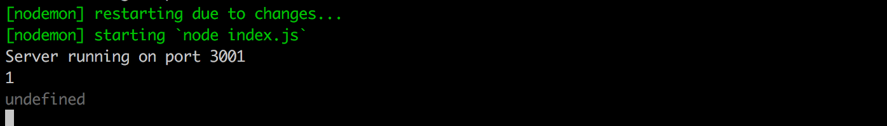

eli halutun muistiinpanon id välittyy sovellukseen aivan oikein, mutta _find_ komento ei löydä mitään.

Päätetään tulostella konsoliin myös _find_-komennon sisällä olevasta vertailijafunktiosta, mikä onnistuu helposti kun tiiviissä muodossa oleva funktio <em>note => note.id === id</em> kirjoitetaan eksplisiittisen returnin sisältävässä muodossa:

```js
app.get('/api/notes/:id', (request, response) => {
  const id = request.params.id
  const note = notes.find(note => {
    console.log(note.id, typeof note.id, id, typeof id, note.id === id)
    return note.id === id
  })
  console.log(note)
  response.json(note)
})
```

Vierailtaessa jälleen yksittäisen muistiinpanon sivulla jokaisesta vertailufunktion kutsusta tulostetaan nyt monta asiaa. Konsolin tulostus on seuraava:

<pre>
1 'number' '1' 'string' false
2 'number' '1' 'string' false
3 'number' '1' 'string' false
</pre>

Ongelman syy selviää. Muuttujassa _id_ on tallennettuna merkkijono '1' kun taas muistiinpanojen id:t ovat numeroita. JavaScriptissä === vertailu katsoo kaikki eri tyyppiset arvot oletusarvoisesti erisuuriksi, joten 1 ei ole '1'.

Korjataan ongelma muuttamalla parametrina oleva merkkijonomuotoinen id [numeroksi](https://developer.mozilla.org/en-US/docs/Web/JavaScript/Reference/Global_Objects/Number):

```js
app.get('/api/notes/:id', (request, response) => {
  const id = Number(request.params.id)
  const note = notes.find(note => note.id === id)
  response.json(note)
})
```

Nyt yksittäisen resurssin hakeminen toimii.

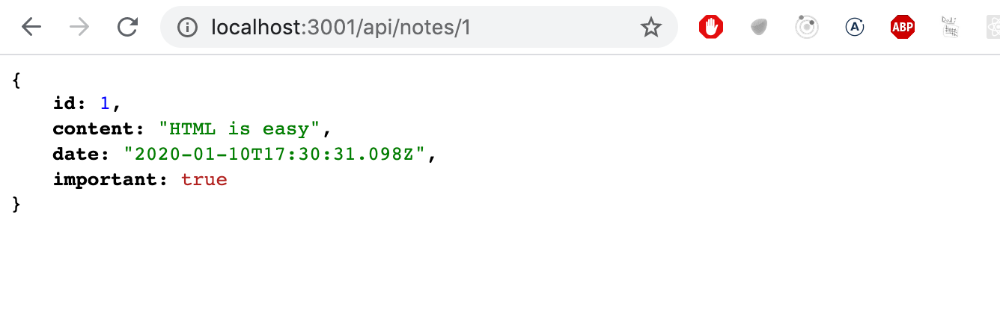

Toiminnallisuuteen jää kuitenkin pieni ongelma. Jos haemme muistiinpanoa sellaisella indeksillä, jota vastaavaa muistiinpanoa ei ole olemassa, vastaa palvelin seuraavasti:

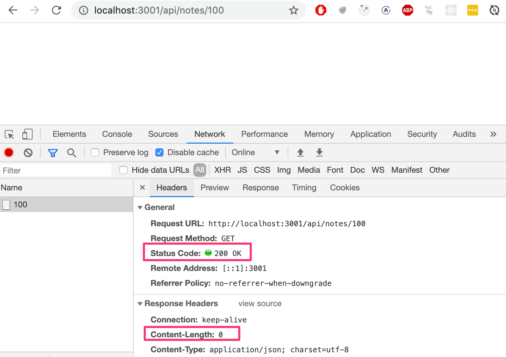

HTTP-statuskoodi on onnistumisesta kertova 200. Vastaukseen ei liity dataa, sillä headerin <i>content-length</i> arvo on 0, ja samaa todistaa selain: mitään ei näy.

Syynä tälle käyttäytymiselle on se, että muuttujan _note_ arvoksi tulee _undefined_ jos muistiinpanoa ei löydy. Tilanne tulee käsitellä palvelimella järkevämmin, eli statuskoodin 200 sijaan tulee vastata statuskoodilla [404 not found](https://www.w3.org/Protocols/rfc2616/rfc2616-sec10.html#sec10.4.5).

Tehdään koodiin muutos:

```js
app.get('/api/notes/:id', (request, response) => {
  const id = Number(request.params.id)
  const note = notes.find(note => note.id === id)
  
  // highlight-start
  if (note) {
    response.json(note)
  } else {
    response.status(404).end()
  }
  // highlight-end
})
```

Koska vastaukseen ei nyt liity mitään dataa, käytetään statuskoodin asettavan metodin [status](http://expressjs.com/en/4x/api.html#res.status) lisäksi metodia [end](http://expressjs.com/en/4x/api.html#res.end) ilmoittamaan siitä, että pyyntöön tulee vastata ilman dataa.

Koodin haarautumisessa hyväksikäytetään sitä, että mikä tahansa JavaScript-olio on [truthy](https://developer.mozilla.org/en-US/docs/Glossary/Truthy), eli katsotaan todeksi vertailuoperaatiossa. _undefined_ taas on [falsy](https://developer.mozilla.org/en-US/docs/Glossary/Falsy) eli epätosi.

Nyt sovellus palauttaa oikean virhekoodin. Sovellus ei kuitenkaan palauta mitään käyttäjälle näytettävää kuten web-sovellukset yleensä tekevät jos mennään osoitteeseen, jota ei ole olemassa. Emme kuitenkaan tarvitse nyt mitään näytettävää, sillä REST API:t ovat ohjelmalliseen käyttöön tarkoitettuja rajapintoja, ja pyyntöön liitetty virheestä kertova statuskoodi on riittävä.

### Resurssin poisto

Toteutetaan seuraavaksi resurssin poistava route. Poisto tapahtuu tekemällä HTTP DELETE -pyyntö resurssin urliin:

```js
app.delete('/api/notes/:id', (request, response) => {
  const id = Number(request.params.id)
  notes = notes.filter(note => note.id !== id)

  response.status(204).end()
})
```

Jos poisto onnistuu eli poistettava muistiinpano on olemassa, vastataan statuskoodilla [204 no content](https://www.w3.org/Protocols/rfc2616/rfc2616-sec10.html#sec10.2.5) sillä mukaan ei lähetetä mitään dataa.

Ei ole täyttä yksimielisyyttä siitä, mikä statuskoodi DELETE-pyynnöstä pitäisi palauttaa jos poistettavaa resurssia ei ole olemassa. Vaihtoehtoja ovat lähinnä 204 ja 404. Yksinkertaisuuden vuoksi sovellus palauttaa nyt molemmissa tilanteissa statuskoodin 204.

### Postman

HTTP GET -pyyntöjä on helppo testata selaimessa, mutta miten voimme testata poisto-operaatioita? Voisimme toki kirjoittaa JavaScript-koodin, joka testaa deletointia, mutta jokaiseen mahdolliseen tilanteeseen testikoodinkaan tekeminen ei ole aina paras ratkaisu.

On olemassa useita backendin testaamista helpottavia työkaluja, eräs näistä on [Postman](https://www.postman.com/), jota käytämme tällä kurssilla.

Asennetaan Postman ja kokeillaan:

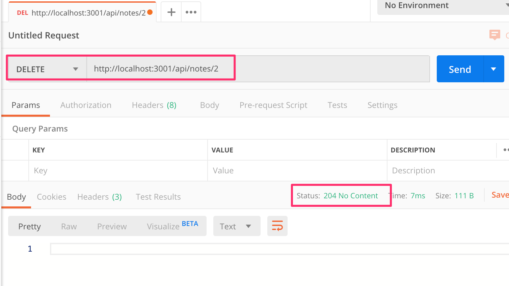

Postmanin käyttö on tässä tilanteessa suhteellisen yksinkertaista, riittää määritellä url ja valita oikea pyyntötyyppi.

Palvelin näyttää vastaavan oikein. Tekemällä HTTP GET osoitteeseen <http://localhost:3001/api/notes> selviää, että poisto-operaatio onnistui. Muistiinpanoa, jonka id on 2 ei ole enää listalla.

Koska muistiinpanot on talletettu palvelimen muistiin, uudelleenkäynnistys palauttaa tilanteen ennalleen.

### Visual Studio Coden REST client

Jos käytät Visual Studio Codea, voit Postmanin sijaan käyttää VS Coden
[REST client](https://marketplace.visualstudio.com/items?itemName=humao.rest-client) -pluginia.

Kun plugin on asennettu, on sen käyttö erittäin helppoa. Tehdään projektin juureen hakemisto <i>requests</i>, jonka sisään talletetaan REST Client -pyynnöt <i>.rest</i>-päätteisinä tiedostoina.

Luodaan kaikki muistiinpanot hakevan pyynnön määrittelevä tiedosto <i>get\_all\_notes.rest</i>:

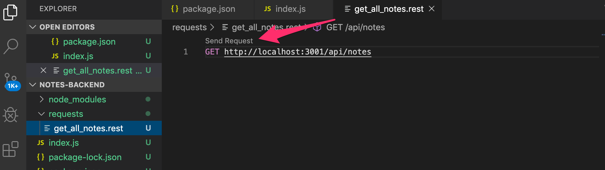

Klikkaamalla tekstiä <i>Send Request</i>, REST client suorittaa määritellyn HTTP-pyynnön, ja palvelimen vastaus avautuu editoriin:

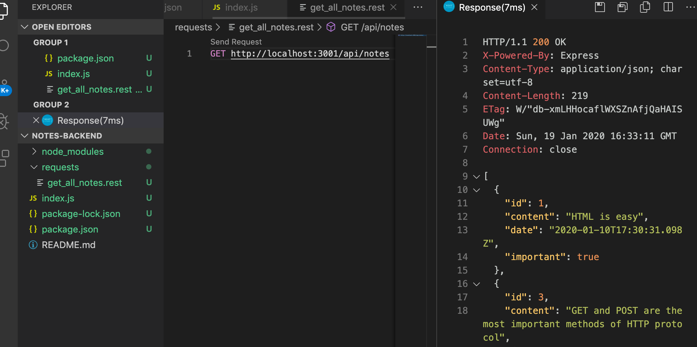

### Datan vastaanottaminen

Toteutetaan seuraavana uusien muistiinpanojen lisäys, joka siis tapahtuu tekemällä HTTP POST -pyyntö osoitteeseen http://localhost:3001/api/notes ja liittämällä pyynnön [bodyyn](https://www.w3.org/Protocols/rfc2616/rfc2616-sec7.html#sec7) luotavan muistiinpanon tiedot JSON-muodossa.

Jotta pääsisimme pyynnön mukana lähetettyyn dataan helposti käsiksi, tarvitsemme Expressin tarjoaman [json-parserin](https://expressjs.com/en/api.html) apua. Tämä tapahtuu lisäämällä koodiin komento _app.use(express.json())_.

Otetaan json-parseri käyttöön ja luodaan alustava määrittely HTTP POST -pyynnön käsittelyyn:

```js
const express = require('express')
const app = express()

app.use(express.json())  // highlight-line

//...

// highlight-start
app.post('/api/notes', (request, response) => {
  const note = request.body
  console.log(note)

  response.json(note)
})
// highlight-end
```

Tapahtumankäsittelijäfunktio pääsee dataan käsiksi olion _request_ kentän <i>body</i> avulla.

Ilman json-parserin lisäämistä eli komentoa _app.use(express.json())_ pyynnön kentän <i>body</i> arvo olisi ollut määrittelemätön. json-parserin toimintaperiaatteena on, että se ottaa pyynnön mukana olevan JSON-muotoisen datan, muuttaa sen JavaScript-olioksi ja sijoittaa _request_-olion kenttään <i>body</i> ennen kuin routen käsittelijää kutsutaan.

Toistaiseksi sovellus ei vielä tee vastaanotetulle datalle mitään muuta kuin tulostaa sen konsoliin ja palauttaa sen pyynnön vastauksessa.

Ennen toimintalogiikan viimeistelyä varmistetaan ensin Postmanilla, että lähetetty tieto menee varmasti perille. Pyyntötyypin ja urlin lisäksi on määriteltävä myös pyynnön mukana menevä data eli <i>body</i>:

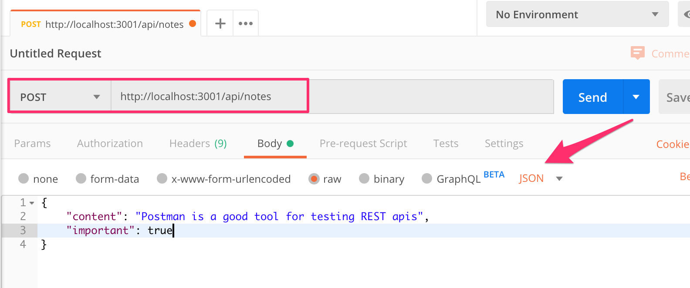

Sovellus tulostaa lähetetyn vastaanottamansa datan terminaaliin:

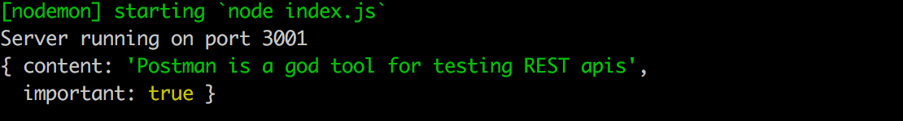

**HUOM:** Kun ohjelmoit backendia, <i>pidä sovellusta suorittava konsoli koko ajan näkyvillä</i>. Nodemonin ansiosta sovellus käynnistyy uudelleen jos koodiin tehdään muutoksia. Jos seuraat konsolia, huomaat välittömästi jos sovelluksen koodiin tulee virhe:

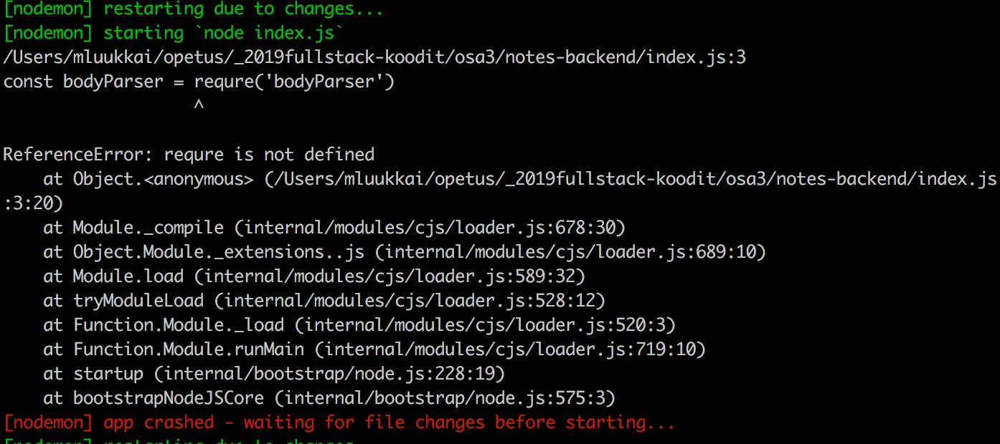

Konsolista kannattaa seurata myös, reagoiko backend odotetulla tavalla esim. kun sovellukselle lähetetään dataa metodilla HTTP POST. Backendiin kannattaa luonnollisesti lisäillä runsaat määrät <em>console.log</em>-komentoja kun sovellus on kehitysvaiheessa. 

Eräs ongelmanlähde on se, että dataa lähettäessä headerille <i>Content-Type</i> ei aseteta oikeaa arvoa. Näin tapahtuu esim. jos Postmanissa bodyn tyyppiä ei määritellä oikein:

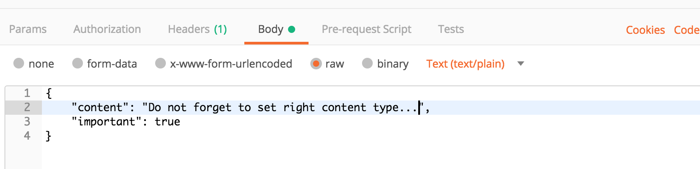

Headerin <i>Content-Type</i> arvoksi asettuu <i>text/plain</i>:

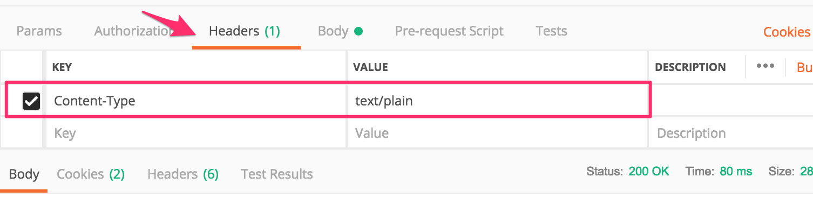

Palvelin näyttää vastaanottavan ainoastaan tyhjän olion:

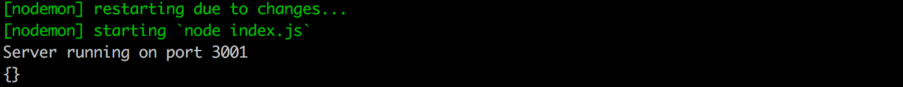

Ilman oikeaa headerin arvoa palvelin ei osaa parsia dataa oikeaan muotoon. Se ei edes yritä arvailla missä muodossa data on, sillä potentiaalisia datan siirtomuotoja eli <i>Content-Typejä</i> on olemassa [suuri määrä](https://developer.mozilla.org/en-US/docs/Web/HTTP/Basics_of_HTTP/MIME_types).

Jos käytät VS Codea, edellisessä luvussa esitelty REST client kannattaa asentaa viimeistään <i>nyt</i>. POST-pyyntö tehdään REST clientillä seuraavasti:

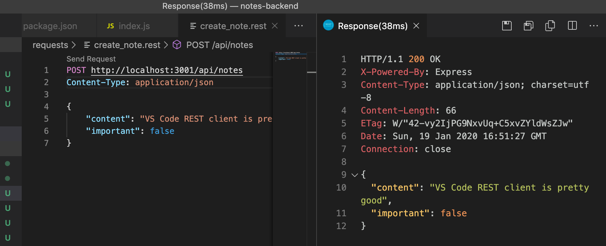

Pyyntöä varten on siis luotu oma tiedosto <i>create\_note.rest</i>. Pyyntö on muotoiltu [dokumentaation ohjetta](https://github.com/Huachao/vscode-restclient/blob/master/README.md#usage) noudatellen.

REST clientin eräs suuri etu Postmaniin verrattuna on se, että pyynnöt saa kätevästi talletettua projektin repositorioon ja tällöin ne ovat helposti koko kehitystiimin käytössä. Postmanillakin on mahdollista tallettaa pyyntöjä, mutta tilanne menee helposti kaoottiseksi etenkin jos työn alla on useita toisistaan riippumattomia projekteja.

> **Tärkeä sivuhuomio**
>
> Välillä debugatessa tulee vastaan tilanteita, joissa backendissä on tarve selvittää, mitä headereja HTTP-pyynnöille on asetettu. Eräs menetelmä tähän on _request_-olion melko kehnosti nimetty metodi [get](http://expressjs.com/en/4x/api.html#req.get), jonka avulla voi selvittää yksittäisen headerin arvon. _request_-oliolla on myös kenttä <i>headers</i>, jonka arvona ovat kaikki pyyntöön liittyvät headerit.
>
> Ongelmia voi syntyä esim., jos jätät vahingossa VS Coden REST clientillä ylimmän rivin ja headerit määrittelevien rivien väliin tyhjän rivin. Tällöin REST client tulkitsee, että millekään headerille ei aseteta arvoa ja näin backend ei osaa tulkita pyynnön mukana olevaa dataa JSON:iksi.
>
> Puuttuvan <i>content-type</i>-headerin ongelma selviää, kun backendissa tulostaa pyynnön headerit esim. komennolla _console.log(request.headers)_.

Palataan taas sovelluksen pariin. Kun tiedämme, että sovellus vastaanottaa tiedon oikein, voimme viimeistellä sovelluslogiikan:

```js
app.post('/api/notes', (request, response) => {
  const maxId = notes.length > 0
    ? Math.max(...notes.map(n => n.id)) 
    : 0

  const note = request.body
  note.id = maxId + 1

  notes = notes.concat(note)

  response.json(note)
})
```

Uudelle muistiinpanolle tarvitaan uniikki id. Ensin selvitetään olemassa olevista id:istä suurin muuttujaan _maxId_. Uuden muistiinpanon id:ksi asetetaan sitten _maxId + 1_. Tämä tapa ei ole kovin hyvä, mutta emme nyt välitä siitä, sillä tulemme pian korvaamaan tavan, jolla muistiinpanot talletetaan.

Tämänhetkisessä versiossa on vielä se ongelma, että voimme HTTP POST -pyynnöllä lisätä mitä tahansa kenttiä sisältäviä olioita. Parannellaan sovellusta siten, että kenttä <i>content</i> ei saa olla tyhjä. Kentille <i>important</i> ja <i>date</i> asetetaan oletusarvot. Kaikki muut kentät hylätään:

```js
const generateId = () => {
  const maxId = notes.length > 0
    ? Math.max(...notes.map(n => n.id))
    : 0
  return maxId + 1
}

app.post('/api/notes', (request, response) => {
  const body = request.body

  if (!body.content) {
    return response.status(400).json({ 
      error: 'content missing' 
    })
  }

  const note = {
    content: body.content,
    important: body.important || false,
    date: new Date(),
    id: generateId(),
  }

  notes = notes.concat(note)

  response.json(note)
})
```

Tunnisteena toimivan id-kentän arvon generointilogiikka on eriytetty funktioon _generateId_.

Jos vastaanotetulta datalta puuttuu sisältö kentästä <i>content</i>, vastataan statuskoodilla [400 bad request](https://www.w3.org/Protocols/rfc2616/rfc2616-sec10.html#sec10.4.1):

```js
if (!body.content) {
  return response.status(400).json({ 
    error: 'content missing' 
  })
}
```

Huomaa, että returnin kutsuminen on tärkeää. Ilman kutsua koodi jatkaisi suoritusta metodin loppuun asti, ja virheellinen muistiinpano tallettuisi!

Jos content-kentällä on arvo, luodaan muistiinpano syötteen perusteella. Kuten edellisessä osassa mainitsimme, aikaleimoja ei kannata luoda selaimen koodissa, sillä käyttäjän koneen kellonaikaan ei voi luottaa. Aikaleiman eli kentän <i>date</i> arvon generointi onkin nyt palvelimen vastuulla.

Jos kenttä <i>important</i> puuttuu, asetetaan sille oletusarvo <i>false</i>. Oletusarvo generoidaan nyt hieman erikoisella tavalla:

```js
important: body.important || false,
```

Jos sovelluksen vastaanottamassa muuttujaan _body_ talletetussa datassa on kenttä <i>important</i>, tulee lausekkeelle sen arvo. Jos kenttää ei ole olemassa, tulee lausekkeen arvoksi oikeanpuoleinen osa eli <i>false</i>.

> Jos ollaan tarkkoja, niin kentän <i>important</i> arvon ollessa <i>false</i>, tulee lausekkeen <em>body.important || false</em> arvoksi oikean puoleinen <i>false</i>...

Sovelluksen tämänhetkinen koodi on kokonaisuudessaan [GitHubissa](https://github.com/FullStack-HY/part3-notes-backend/tree/part3-1).

Tämän hetken koodi on branchissa [part3-1](https://github.com/FullStack-HY/part3-notes-backend/tree/part3-1):

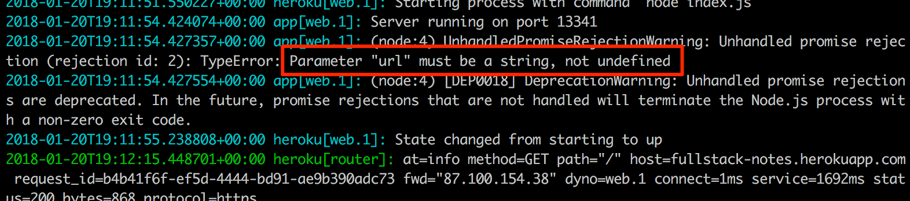

Jos kloonaat projektin itsellesi, suorita komento _npm install_ ennen käynnistämistä eli ennen komentoa _npm start_ tai _npm run dev_.

Vielä pieni huomio ennen tehtäviä. Uuden id:n generoiva funktio näyttää seuraavalta:

```js
const generateId = () => {
  const maxId = notes.length > 0
    ? Math.max(...notes.map(n => n.id))
    : 0
  return maxId + 1
}
```

Koodi sisältää hieman erikoisen näköisen rivin:

```js
Math.max(...notes.map(n => n.id))
```

Mitä rivillä tapahtuu? <em>notes.map(n => n.id)</em> muodostaa taulukon, joka koostuu muistiinpanojen id-kentistä. [Math.max](https://developer.mozilla.org/en-US/docs/Web/JavaScript/Reference/Global_Objects/Math/max) palauttaa maksimin sille parametrina annetuista luvuista. <em>notes.map(n => n.id)</em> on kuitenkin <i>taulukko</i>, joten se ei kelpaa parametriksi komennolle _Math.max_. Taulukko voidaan muuttaa yksittäisiksi luvuiksi käyttäen taulukon [spread](https://developer.mozilla.org/en-US/docs/Web/JavaScript/Reference/Operators/Spread_syntax)-syntaksia, eli kolmea pistettä <em>...taulukko</em>.

</div>

<div class="tasks">

### Tehtävät 3.1.-3.6.

**HUOM:** tämän osan tehtäväsarja kannattaa tehdä omaan Git-repositorioon ja suoraan repositorion juureen! Jos et tee näin, joudut ongelmiin tehtävässä 3.10

**HUOM2:** Koska nyt ei ole kyse frontendista ja Reactista, sovellusta <strong>ei luoda</strong> create-react-app:illa vaan komennolla <em>npm init</em>, kuten ylempänä tämän osan materiaalissa.


**Vahva suositus:** kun teet backendin koodia, pidä koko ajan silmällä, mitä palvelimen koodia suorittavassa konsolissa tapahtuu.

#### 3.1 puhelinluettelon backend step1

Tee Node-sovellus, joka tarjoaa osoitteessa <http://localhost:3001/api/persons> kovakoodatun taulukon puhelinnumerotietoja:

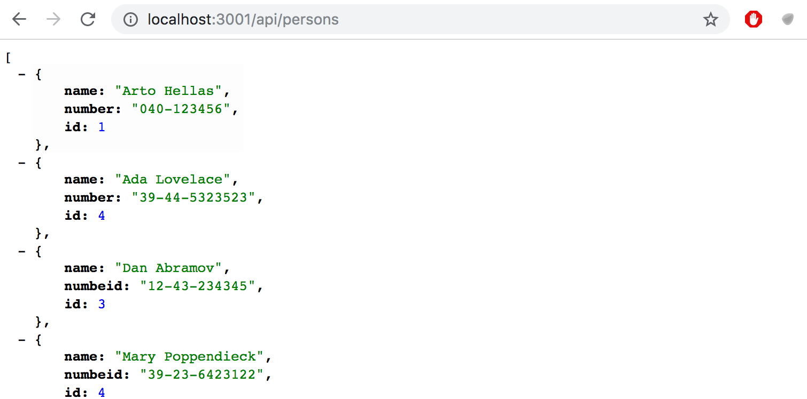

Huomaa, että Noden routejen määrittelyssä merkkijonon <i>api/persons</i> vinoviiva käyttäytyy kuten mikä tahansa muu merkki.

Sovellus pitää pystyä käynnistämään komennolla _npm start_.

Komennolla _npm run dev_ käynnistettäessa sovelluksen tulee käynnistyä uudelleen, kun koodiin tehdään muutoksia.

#### 3.2: puhelinluettelon backend step2

Tee sovelluksen osoitteeseen <http://localhost:3001/info> suunnilleen seuraavanlainen sivu

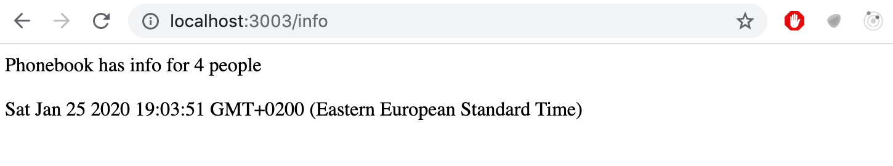

Sivun tulee siis kertoa pyynnön tekohetki sekä se, kuinka monta puhelinluettelotietoa sovelluksen muistissa olevassa taulukossa on.

#### 3.3: puhelinluettelon backend step3

Toteuta toiminnallisuus yksittäisen puhelinnumerotiedon näyttämiseen. Esim. id:n 5 omaavan numerotiedon url on <http://localhost:3001/api/persons/5>

Jos id:tä vastaavaa puhelinnumerotietoa ei ole, tulee palvelimen vastata asianmukaisella statuskoodilla.

#### 3.4: puhelinluettelon backend step4

Toteuta toiminnallisuus, jonka avulla puhelinnumerotieto on mahdollista poistaa numerotiedon yksilöivään URL:iin tehtävällä HTTP DELETE -pyynnöllä.

Testaa toiminnallisuus Postmanilla tai Visual Studio Coden REST clientillä.

#### 3.5: puhelinluettelon backend step5

Laajenna backendia siten, että uusia puhelintietoja on mahdollista lisätä osoitteeseen <http://localhost:3001/api/persons> tapahtuvalla HTTP POST -pyynnöllä.

Generoi uuden puhelintiedon tunniste funktiolla [Math.random](https://developer.mozilla.org/en-US/docs/Web/JavaScript/Reference/Global_Objects/Math/random). Käytä riittävän isoa arvoväliä, jotta arvottu id on riittävän suurella todennäköisyydellä sellainen, joka ei ole jo käytössä.

#### 3.6: puhelinluettelon backend step6

Tee uuden numeron lisäykseen virheiden käsittely. Pyyntö ei saa onnistua, jos
- nimi tai numero puuttuu
- lisättävä nimi on jo luettelossa

Vastaa asiaankuuluvalla statuskoodilla ja liitä vastaukseen mukaan myös tieto, joka kertoo virheen syyn, esim:

```js
{ error: 'name must be unique' }
```

</div>

<div class="content">

### Huomioita HTTP-pyyntötyyppien käytöstä

[HTTP-standardi](https://www.w3.org/Protocols/rfc2616/rfc2616-sec9.html) puhuu pyyntötyyppien yhteydessä kahdesta ominaisuudesta, **safe** ja **idempotent**.

HTTP-pyynnöistä GET:in tulisi olla <i>safe</i>:

> <i>In particular, the convention has been established that the GET and HEAD methods SHOULD NOT have the significance of taking an action other than retrieval. These methods ought to be considered "safe".</i>

Safety tarkoittaa siis, että pyynnön suorittaminen ei saa aiheuttaa palvelimelle <i>sivuvaikutuksia</i> eli esim. muuttaa palvelimen tietokannan tilaa. Pyynnön tulee ainoastaan palauttaa palvelimella olevaa dataa.

Mikään ei automaattisesti takaa, että GET-pyynnöt olisivat luonteeltaan <i>safe</i>. Kyseessä onkin HTTP-standardin suositus palvelimien toteuttajille. RESTful-periaatetta noudattaessa GET-pyyntöjä käytetäänkin aina siten, että ne ovat safe.

HTTP-standardi määrittelee myös pyyntötyypin [HEAD](https://www.w3.org/Protocols/rfc2616/rfc2616-sec9.html#sec9.4), jonka tulee olla safe. Käytännössä HEAD:in tulee toimia kuten GET, mutta se ei palauta vastauksenaan muuta kuin statuskoodin ja headerit. Viestin bodyä HEAD ei palauta ollenkaan.

HTTP-pyynnöistä muiden paitsi POST:in tulisi olla <i>idempotentteja</i>:

> <i>Methods can also have the property of "idempotence" in that (aside from error or expiration issues) the side-effects of N > 0 identical requests is the same as for a single request. The methods GET, HEAD, PUT and DELETE share this property</i>

Eli jos pyynnöllä on sivuvaikutuksia, lopputulos on sama suoritettaessa pyyntö yhden tai useamman kerran.

Esim. jos tehdään HTTP PUT -pyyntö osoitteeseen <i>/api/notes/10</i> ja pyynnön mukana on <em>{ content: "ei sivuvaikutuksia", important: true }</em>, on lopputulos sama riippumatta siitä, kuinka monta kertaa pyyntö suoritetaan.

Kuten metodin GET <i>safety</i> myös <i>idempotence</i> on HTTP-standardin suositus palvelimien toteuttajille. RESTful-periaatetta noudattaessa GET-, HEAD-, PUT- ja DELETE-pyyntöjä käytetäänkin aina siten, että ne ovat idempotentteja.

HTTP-pyyntötyypeistä POST on ainoa, joka ei ole <i>safe</i> eikä <i>idempotent</i>. Jos tehdään viisi kertaa HTTP POST -pyyntö osoitteeseen <i>/api/notes</i> siten että pyynnön mukana on <em>{ content: "monta samaa", important: true }</em>, tulee palvelimelle viisi saman sisältöistä muistiinpanoa.

### Middlewaret

Äsken käyttöönottamamme Expressin [json-parseri](https://expressjs.com/en/api.html) on terminologiassa niin sanottu [middleware](http://expressjs.com/en/guide/using-middleware.html).

Middlewaret ovat funktioita, joiden avulla voidaan käsitellä _request_- ja _response_-olioita.

Esim. json-parseri ottaa pyynnön mukana tulevan raakadatan _request_-oliosta, parsii sen JavaScript-olioksi ja sijoittaa olion _request_:in kenttään <i>body</i>

Middlewareja voi olla käytössä useita, jolloin ne suoritetaan peräkkäin siinä järjestyksessä, kuin ne on otettu koodissa käyttöön.

Toteutetaan itse yksinkertainen middleware, joka tulostaa konsoliin palvelimelle tulevien pyyntöjen perustietoja.

Middleware on funktio, joka saa kolme parametria:

```js
const requestLogger = (request, response, next) => {
  console.log('Method:', request.method)
  console.log('Path:  ', request.path)
  console.log('Body:  ', request.body)
  console.log('---')
  next()
}
```

Middleware kutsuu lopussa parametrina olevaa funktiota _next_, jolla se siirtää kontrollin seuraavalle middlewarelle.

Middleware otetaan käyttöön seuraavasti:

```js
app.use(requestLogger)
```

Middlewaret suoritetaan siinä järjestyksessä, jossa ne on otettu käyttöön sovellusolion metodilla _use_. Huomaa, että json-parseri tulee ottaa käyttöön ennen middlewarea _requestLogger_, muuten <i>request.body</i> ei ole vielä alustettu loggeria suoritettaessa!

Middlewaret tulee ottaa käyttöön ennen routeja, jos ne halutaan suorittaa ennen niitä. On myös eräitä tapauksia, joissa middleware tulee määritellä vasta routejen jälkeen. Käytännössä tällöin on kyse middlewareista, joita suoritetaan vain, jos mikään route ei käsittele HTTP-pyyntöä.

Lisätään <i>routejen jälkeen</i> seuraava middleware, jonka ansiosta saadaan routejen käsittelemättömistä virhetilanteista JSON-muotoinen virheilmoitus:

```js
const unknownEndpoint = (request, response) => {
  response.status(404).send({ error: 'unknown endpoint' })
}

app.use(unknownEndpoint)
```

Sovelluksen tämän hetkinen koodi on kokonaisuudessaan [GitHubissa](https://github.com/fullstack-hy/part3-notes-backend/tree/part3-2), branchissa <i>part3-2</i>.

</div>

<div class="tasks">

### Tehtävät 3.7.-3.8.

#### 3.7: puhelinluettelon backend step7

Lisää sovellukseesi loggausta tekevä middleware [morgan](https://github.com/expressjs/morgan). Konfiguroi se logaamaan konsoliin <i>tiny</i>-konfiguraation mukaisesti.

Morganin ohjeet eivät ole ehkä kaikkein selvimmät, ja joudut kenties miettimään hiukan. Toisaalta juuri koskaan dokumentaatio ei ole aivan itsestäänselvää, joten kryptisempiäkin asioita on hyvä oppia tulkitsemaan.

Morgan asennetaan kuten muutkin kirjastot, eli komennolla _npm install_ ja sen käyttöönotto tapahtuu kaikkien middlewarejen tapaan komennolla _app.use_

#### 3.8*: puhelinluettelon backend step8

Konfiguroi morgania siten, että se näyttää myös HTTP POST -pyyntöjen mukana tulevan datan:

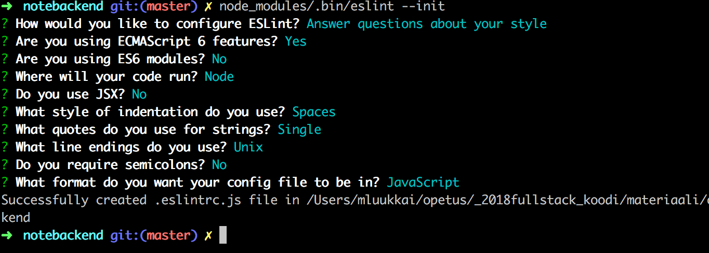

Tämä tehtävä on kohtuullisen haastava, vaikka koodia ei tarvitakaan paljoa. 

Tehtävän voi tehdä muutamallakin tavalla. Eräs näistä onnistuu hyödyntämällä seuraavia:
- [creating new tokens](https://github.com/expressjs/morgan#creating-new-tokens)
- [JSON.stringify](https://developer.mozilla.org/en-US/docs/Web/JavaScript/Reference/Global_Objects/JSON/stringify)

</div>
