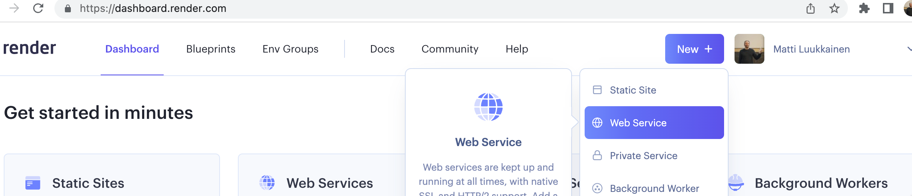
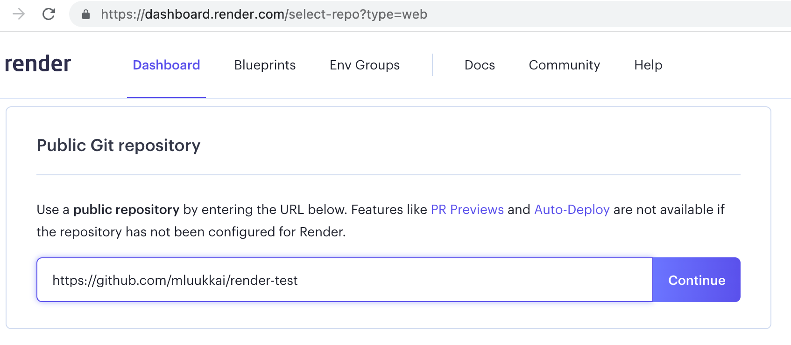
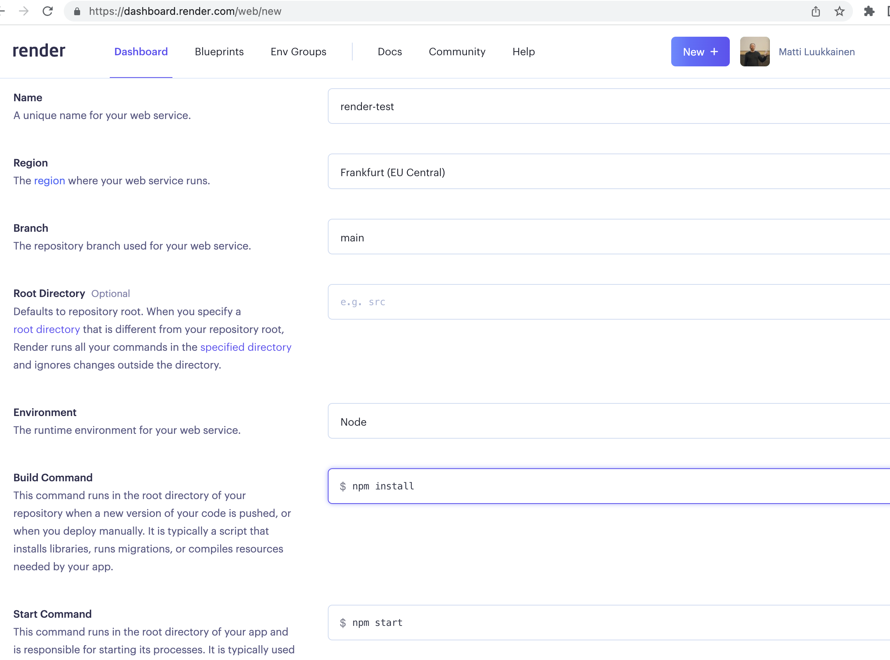
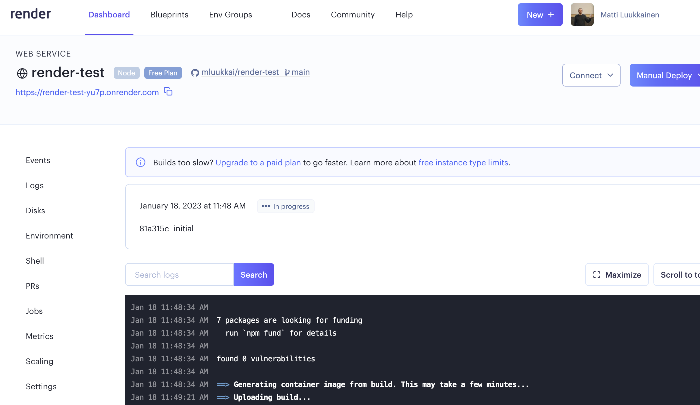
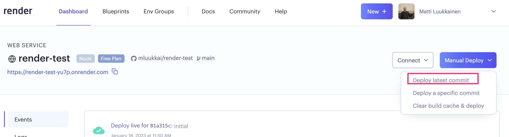
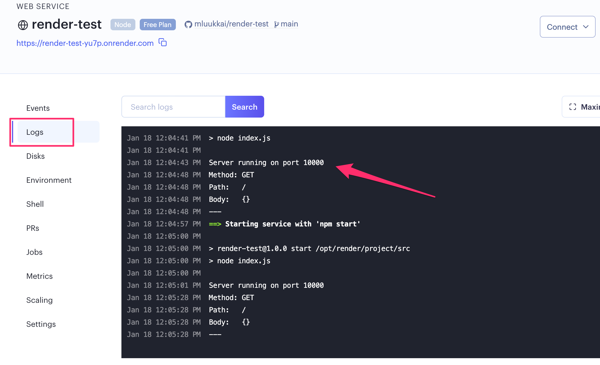
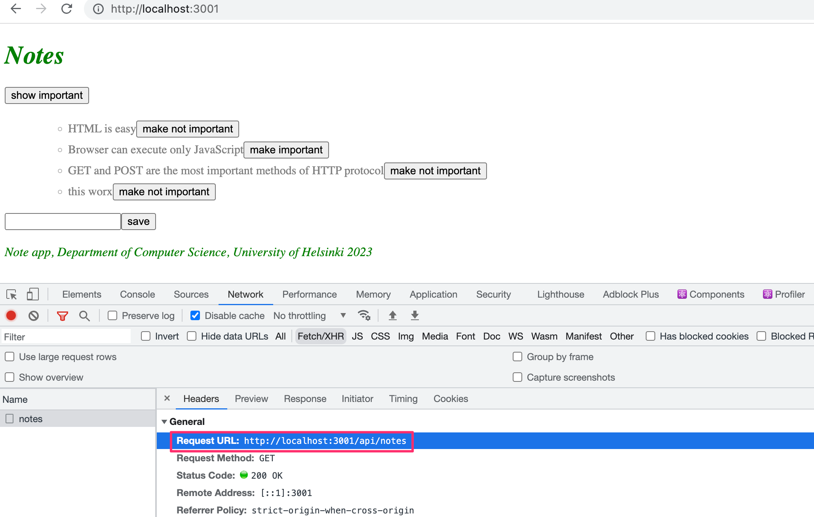
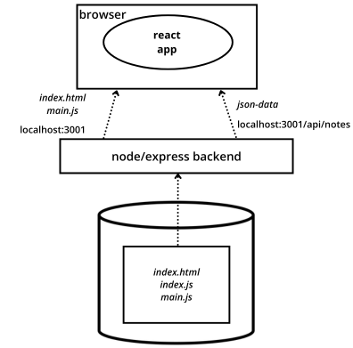
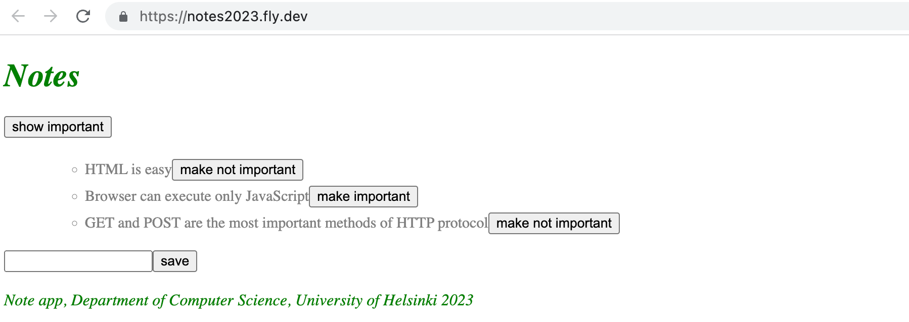
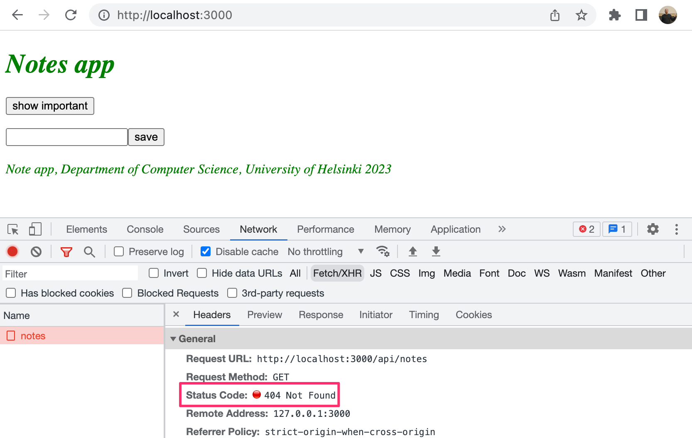

<div class="content">

Yhdistetään seuraavaksi [osassa 2](/osa2) tekemämme frontend omaan backendiimme. 

Edellisessä osassa backendinä toiminut JSON Server tarjosi muistiinpanojen listan osoitteessa http://localhost:3001/notes frontendin käyttöön. Backendimme urlien rakenne on hieman erilainen (muistiinpanot ovat osoitteessa http://localhost:3001/api/notes) eli muutetaan frontendin tiedostossa <i>src/services/notes.js</i> määriteltyä muuttujaa _baseUrl_ seuraavasti:

```js
import axios from 'axios'
const baseUrl = 'http://localhost:3001/api/notes' //highlight-line

const getAll = () => {
  const request = axios.get(baseUrl)
  return request.then(response => response.data)
}

// ...

export default { getAll, create, update }
```

Frontendin tekemä GET-pyyntö osoitteeseen <http://localhost:3001/api/notes> ei jostain syystä toimi:


Mistä on kyse? Backend toimii kuitenkin selaimesta ja postmanista käytettäessä ilman ongelmaa.

### Same origin policy ja CORS

Kyse on asiasta nimeltään CORS eli Cross-origin resource sharing. [Wikipedian](https://en.wikipedia.org/wiki/Cross-origin_resource_sharing) sanoin

> <i>Cross-origin resource sharing (CORS) is a mechanism that allows restricted resources (e.g. fonts) on a web page to be requested from another domain outside the domain from which the first resource was served. A web page may freely embed cross-origin images, stylesheets, scripts, iframes, and videos. Certain "cross-domain" requests, notably Ajax requests, are forbidden by default by the same-origin security policy.</i>

Lyhyesti sanottuna meidän kontekstissa kyse on seuraavasta: web-sovelluksen selaimessa suoritettava JavaScript-koodi saa oletusarvoisesti kommunikoida vain samassa [originissa](https://developer.mozilla.org/en-US/docs/Web/Security/Same-origin_policy) olevan palvelimen kanssa. Koska palvelin on localhostin portissa 3001 ja frontend localhostin portissa 3000, niiden origin ei ole sama.

Korostetaan vielä, että [same origin policy](https://developer.mozilla.org/en-US/docs/Web/Security/Same-origin_policy) ja CORS eivät ole mitenkään React- tai Node-spesifisiä asioita, vaan yleismaailmallisia periaatteita web-sovellusten toiminnasta.

Voimme sallia muista <i>origineista</i> tulevat pyynnöt käyttämällä Noden [cors](https://github.com/expressjs/cors)-middlewarea.

Asennetaan backendiin <i>cors</i> komennolla

```bash
npm install cors
```

Otetaan middleware käyttöön toistaiseksi sellaisella konfiguraatiolla, joka sallii kaikista origineista tulevat pyynnöt kaikkiin backendin Express routeihin:

```js
const cors = require('cors')

app.use(cors())
```

Nyt frontend toimii! Tosin muistiinpanojen tärkeäksi muuttavaa toiminnallisuutta backendissa ei vielä ole.

CORS:ista voi lukea tarkemmin esim. [Mozillan sivuilta](https://developer.mozilla.org/en-US/docs/Web/HTTP/CORS).

Sovelluksen suoritusympäristö näyttää nyt seuraavalta:


Selaimessa toimiva frontendin koodi siis hakee datan osoitteessa localhost:3001 olevalta Express-palvelimelta.

### Sovellus Internetiin

Kun koko "stäkki" on saatu vihdoin kuntoon, siirretään sovellus Internetiin.

Sovellusten hostaamiseen, eli "internettiin laittamiseen" on olemassa lukematon määrä erilaisia ratkaisuja. Helpoimpia näistä sovelluskehittäjän kannalta ovat ns PaaS (eli Platform as a Service) ‑palvelut, jotka huolehtivat sovelluskehittäjän puolesta tietokannan ja suoritusympäristön asentamisen.

Kymmenen vuoden ajan PaaS-ratkaisujen ykkönen on ollut [Heroku](http://heroku.com). Elokuun 2022 lopussa Heroku ilmoitti että 27.11.2022 alkaen alustan maksuttomat palvelut loppuvat. Jos olet valmis maksamaan hiukan, on Heroku edelleen varteenotettava vaihtoehto.

Esittelemme seuraavassa kaksi hieman uudempaa palvelua [Fly.io:n](https://fly.io/):n sekä [Renderin](https://render.com/). Molemmilla on tarjolla jonkin verran ilmaista laskenta-aikaa.

Hienoinen ikävä puoli Fly.io:ssa on se, että <i>saatat</i> joutua kertomaan palvelulle luottokorttitietosi vaikka <i>et käytä</i> palvelun maksullista osaa. Renderin käyttöönotto saattaa olla jossain tapauksissa helpompaa, sillä Render ei edellytä mitään asenuksia omalle koneelle.

Molempia ratkaisuja varten muutetaan tiedoston <i>index.js</i> lopussa olevaa sovelluksen käyttämän portin määrittelyä seuraavasti:

```js
const PORT = process.env.PORT || 3001  // highlight-line
app.listen(PORT, () => {
  console.log(`Server running on port ${PORT}`)
})
```

Nyt käyttöön tulee [ympäristömuuttujassa](https://en.wikipedia.org/wiki/Environment_variable) _PORT_ määritelty portti tai 3001, jos ympäristömuuttuja _PORT_ ei ole määritelty. Sekä Fly.io että Render konfiguroivat sovelluksen portin ympäristömuuttujan avulla.

#### Fly.io

Jos päätät käyttää [Fly.io](https://fly.io/):ta, aloita asentamalla Fly.io [tämän](https://fly.io/docs/hands-on/install-flyctl/) ohjeen mukaan ja luomalla itsellesi [tunnus](https://fly.io/docs/hands-on/sign-up/) palveluun.

Oletusarvoisesti saat käyttöösi kaksi ilmaista virtuaalikonetta, ja pystyt käynnistämään molempiin yhden sovelluksen.

Aloita [kirjautumalla](https://fly.io/docs/hands-on/sign-in/) komentoriviltä palveluun komennolla 

```bash
fly auth login
```

*HUOM* jos komento fly ei toimi, kokeile toimiiko sen pidempi muoto _flyctl_. Esim. Macissa toimivat komennon molemmat muodot.

Sovelluksen alustus tapahtuu seuraavasti. Mene sovelluksen juurihakemistoon ja anna komento

```bash
fly launch
```

Anna sovellukselle nimi, tai anna Fly.io:n generoida automaattinen nimi, valitse "region" eli alue minkä konesaliissa sovelluksesi toimii. Älä luo sovellukselle postgres- sekä Upstash Redis-tietokantaa. Lopuksi vielä kysytään "Would you like to deploy now?" eli haluatko että sovellus myös viedään tuotantoympäristöön. Valitse "Ei".

Fly.io luo hakemistoosi tiedoston <i>fly.toml</i>, joka sisältää sovelluksen tuotantoympäristön konfiguraation.

Jotta sovellus saadaan konfiguroitua oikein, tulee tiedostoon konfiguraatioon tehdä pieni lisäys osiin [env]

```bash
[build]

[env]
  PORT = "3000" # add this

[http_service]
  internal_port = 3000 # ensure that this is same as PORT
  force_https = true
  auto_stop_machines = true
  auto_start_machines = true
  min_machines_running = 0
  processes = ["app"]
```

Osaan [env] lisätään tarvittaessa (jos se ei jo siellä valmiiksi ole) määritelmä ympäristömuuttujalle PORT, jotta sovellus osaa käynnistää itsensä samaan samaan porttiin, missä Fly olettaa (määrittely kohdassa [services]) sen olevan käynnissä.

Sovellus voidaan nyt käynnistää komennolla

```bash
fly deploy
```

Jos kaikki menee hyvin, sovellus käynnistyy ja saat sen avattua selaimeen komennolla 

```bash
fly open
```

Tämän jälkeen aina kun teet muutoksia sovellukseen, saat vietyä uuden version tuotantoon komennolla 

```bash
fly deploy
```

Erittäin tärkeä komento on myös _fly logs_ jonka avulla voit seurata tuotantopalvelimen konsoliin tulostuvia logeja. Logit on viisainta pitää koko ajan näkyvillä.

#### Render

Ohje olettaa, että Renderiin on [kirjauduttu](https://dashboard.render.com/) GitHub-tunnuksen avulla.

Kirjautumisen jälkeen luodaan uusi "web service":



Yhdistetään sovelluksen repositorio Renderiin:



Yhdistäminen onnistuu ainakin jos repositorio on julkinen.

Määritellään sovelluksen tiedot. Jos sovellus <i>ei ole</i> repositorion juuressa, tulee oikea hakemisto määritellä kohtaan <i>Root directory</i>:



Tämän jälkeen sovellus käynnistyy Renderiin. Sovelluksen sivu kertoo sovelluksen tilan ja osoitteen, mihin sovellus on käynnistynyt:



Oletusarvoisella konfiguraatiolla sovelluksen pitäisi [uudelleenkäynnistyä](https://render.com/docs/deploys) jokaisen GitHubiin pushatun commitin myötä automaattisesti uudelleen. Jostain syystä tämä ei kuitenkaan toimi aina.

Sovelluksen saa myös uudelleenkäynnistettyä manuaalisesti:



Dashboardin kautta on myös mahdollista seurata sovelluksen lokia:



Huomaamme nyt lokista, että sovellus on käynnistynyt porttiin 10000. Sovellus saa käynnistysportin ympäristömuuttujan PORT kautta, eli on äärimmäisen tärkeää että tiedoston <i>index.js</i> loppu on päivitetty muotoon:

```js
const PORT = process.env.PORT || 3001  // highlight-line
app.listen(PORT, () => {
  console.log(`Server running on port ${PORT}`)
})
```

### Frontendin tuotantoversio

Olemme toistaiseksi suorittaneet React-koodia <i>sovelluskehitysmoodissa</i>, jossa sovellus on konfiguroitu antamaan havainnollisia virheilmoituksia, päivittämään koodiin tehdyt muutokset automaattisesti selaimeen ym.

Kun sovellus viedään tuotantoon, täytyy siitä tehdä [production build](https://vitejs.dev/guide/build.html) eli tuotantoa varten optimoitu versio.

Viten avulla tehdyistä sovelluksista saadaan tehtyä tuotantoversio komennolla [_npm run build_](https://vitejs.dev/guide/build.html).

Suoritetaan nyt komento <i>frontendin projektin juuressa</i>.

Komennon seurauksena syntyy hakemiston <i>dist</i> (joka sisältää jo sovelluksen ainoan html-tiedoston <i>index.html</i>) sisään hakemisto <i>assets</i>, jonka alle generoituu sovelluksen JavaScript-koodin [minifioitu](<https://en.wikipedia.org/wiki/Minification_(programming)>) versio. Vaikka sovelluksen koodi on kirjoitettu useaan tiedostoon, generoituu kaikki JavaScript yhteen tiedostoon. Samaan tiedostoon tulee  myös kaikkien sovelluksen koodin tarvitsemien riippuvuuksien koodi.

Minifioitu koodi ei ole miellyttävää luettavaa. Koodin alku näyttää seuraavalta:

```js
!function(e){function r(r){for(var n,f,i=r[0],l=r[1],a=r[2],c=0,s=[];c<i.length;c++)f=i[c],o[f]&&s.push(o[f][0]),o[f]=0;for(n in l)Object.prototype.hasOwnProperty.call(l,n)&&(e[n]=l[n]);for(p&&p(r);s.length;)s.shift()();return u.push.apply(u,a||[]),t()}function t(){for(var e,r=0;r<u.length;r++){for(var t=u[r],n=!0,i=1;i<t.length;i++){var l=t[i];0!==o[l]&&(n=!1)}n&&(u.splice(r--,1),e=f(f.s=t[0]))}return e}var n={},o={2:0},u=[];function f(r){if(n[r])return n[r].exports;var t=n[r]={i:r,l:!1,exports:{}};return e[r].call(t.exports,t,t.exports,f),t.l=!0,t.exports}f.m=e,f.c=n,f.d=function(e,r,t){f.o(e,r)||Object.defineProperty(e,r,{enumerable:!0,get:t})},f.r=function(e){"undefined"!==typeof Symbol&&Symbol.toStringTag&&Object.defineProperty(e,Symbol.toStringTag,{value:"Module"})
```

### Staattisten tiedostojen tarjoaminen backendistä

Eräs mahdollisuus frontendin tuotantoon viemiseen on kopioida tuotantokoodi eli hakemisto <i>build</i> backendin repositorion juureen ja määritellä backend näyttämään pääsivunaan frontendin <i>pääsivu</i> eli tiedosto <i>build/index.html</i>.

Aloitetaan kopioimalla frontendin tuotantokoodi backendin alle, projektin juureen. Omalla koneellani kopiointi tapahtuu frontendin hakemistosta käsin komennolla

```bash
cp -r dist ../backend
```

Backendin sisältävän hakemiston tulee nyt näyttää seuraavalta:


Jotta saamme Expressin näyttämään <i>staattista sisältöä</i> eli sivun <i>index.html</i> ja sen lataaman JavaScriptin ym. tarvitsemme Expressiin sisäänrakennettua middlewarea [static](http://expressjs.com/en/starter/static-files.html).

Kun lisäämme muiden middlewarejen määrittelyn yhteyteen seuraavan

```js
app.use(express.static('dist'))
```

tarkastaa Express GET-tyyppisten HTTP-pyyntöjen yhteydessä ensin löytyykö pyynnön polkua vastaavan nimistä tiedostoa hakemistosta <i>dist</i>. Jos löytyy, palauttaa Express tiedoston.

Nyt HTTP GET ‑pyyntö osoitteeseen <i>www.palvelimenosoite.com/index.html</i> tai <i>www.palvelimenosoite.com</i> näyttää Reactilla tehdyn frontendin. GET-pyynnön esim. osoitteeseen <i>www.palvelimenosoite.com/api/notes</i> hoitaa backendin koodi.

Koska tässä tapauksessa sekä frontend että backend toimivat samassa osoitteessa, voidaan React-sovelluksessa eli frontendin koodissa oleva palvelimen _baseUrl_ määritellä [suhteellisena](https://www.w3.org/TR/WD-html40-970917/htmlweb.html#h-5.1.2) URL:ina eli ilman palvelinta yksilöivää osaa:

```js
import axios from 'axios'
const baseUrl = '/api/notes' // highlight-line

const getAll = () => {
  const request = axios.get(baseUrl)
  return request.then(response => response.data)
}

// ...
```

Muutoksen jälkeen frontendistä on luotava uusi production build ja kopioitava se backendin repositorion juureen.

Sovellusta voidaan käyttää nyt <i>backendin</i> osoitteesta <http://localhost:3001>:


Sovelluksemme toiminta vastaa nyt täysin osan 0 luvussa [Single page app](/osa0/web_sovelluksen_toimintaperiaatteita#single-page-app) läpikäydyn esimerkkisovelluksen toimintaa.

Kun mennään selaimella osoitteeseen <http://localhost:3001> palauttaa palvelin hakemistossa <i>dist</i> olevan tiedoston <i>index.html</i>, jonka sisältö on seuraava:

```html
<!doctype html>
<html lang="en">
  <head>
    <meta charset="UTF-8" />
    <link rel="icon" type="image/svg+xml" href="/vite.svg" />
    <meta name="viewport" content="width=device-width, initial-scale=1.0" />
    <title>Vite + React</title>
    <script type="module" crossorigin src="/assets/index-5f6faa37.js"></script>
    <link rel="stylesheet" href="/assets/index-198af077.css">
  </head>
  <body>
    <div id="root"></div>
    
  </body>
</html>
```

Sivu sisältää ohjeen ladata sovelluksen tyylit määrittelevän CSS-tiedoston, sekä kaksi <i>script</i>-tagia, joiden ansiosta selain lataa sovelluksen JavaScript-koodin, eli varsinaisen React-sovelluksen.

React-koodi hakee palvelimelta muistiinpanot osoitteesta <http://localhost:3001/api/notes> ja renderöi ne ruudulle. Selaimen ja palvelimen kommunikaatio selviää tuttuun tapaan konsolin välilehdeltä <i>Network</i>:



Tuotantoa varten tehty suoritusympäristö näyttää siis seuraavalta:



Toisin kuin sovelluskehitysympäristössä, kaikki sovelluksen tarvitsema löytyy nyt node/express-palvelimelta osoitteesta localhost:3001. Kun osoitteeseen mennään, renderöi selain pääsivun <i>index.html</i> mikä taas aiheuttaa sen, että React-sovelluksen tuotantoversio haetaan palvelimelta ja selain alkaa suorittamaan sitä. Tämä taas saa aikaan sen, että ruudulla näytettävä JSON-muotoinen data haetaan osoitteesta localhost:3001/api/notes.

### Koko sovellus Internetiin

Kun sovelluksen "Internetiin vietävä" tuotantoversio todetaan toimivaksi paikallisesti, commitoidaan frontendin tuotantoversio backendin repositorioon ja pushataan koodi GitHubiin. Jos käytät Renderiä, saattaa automaattinen uudelleenkäynnistys toimia. Jos näin ei ole, käynnistä uusi versio itse dashboardin kautta tekemällä "manual deployment".

Fly.io:n tapauksessa sovelluksen uusi versio käynnistyy komennolla

```bash
fly deploy
```

Sovellus toimii moitteettomasti lukuun ottamatta vielä backendiin toteuttamatonta muistiinpanon tärkeyden muuttamista:



Sovelluksemme tallettama tieto ei ole ikuisesti pysyvää, sillä sovellus tallettaa muistiinpanot muuttujaan. Jos sovellus kaatuu tai se uudelleenkäynnistetään, kaikki tiedot katoavat.

Tarvitsemme sovelluksellemme tietokannan. Ennen tietokannan käyttöönottoa katsotaan kuitenkin vielä muutamaa asiaa.

Tuotannossa oleva sovellus näyttää seuraavalta:


Nyt siis node/express-backend sijaitsee Fly.io:n/Renderin palvelimella. Kun selaimella mennään sovelluksen "juuriosoitteeseen", alkaa selain suorittamaan React-koodia, joka taas hakee JSON-muotoisen datan Fly.io:sta/Renderistä.

### Frontendin deployauksen suoraviivaistus 

Jotta uuden frontendin version generointi onnistuisi jatkossa ilman turhia manuaalisia askelia, lisätään uusia skriptejä backendin <i>package.json</i>-tiedostoon.

#### Fly.io

Fly.io:n tapauksessa skriptit näyttävät seuraavalta:

```json
{
  "scripts": {
    // ...
    "build:ui": "rm -rf build && cd ../frontend/ && npm run build && cp -r build ../backend",
    "deploy": "fly deploy",
    "deploy:full": "npm run build:ui && npm run deploy",    
    "logs:prod": "fly logs"
  }
}
```
  
##### Huomautus Windows-käyttäjille
Huomaa, että näistä _build:ui_:n käyttämät shell-komennot eivät toimi natiivisti Windowsilla, jonka powershell käyttää eri komentoja. Tällöin skripti olisi
```json
"build:ui": "@powershell Remove-Item -Recurse -Force build && cd ../frontend && npm run build && @powershell Copy-Item build -Recurse ../backend",
```
  
Mikäli skripti ei toimi Windowsilla, tarkista, että terminaalisi sovelluskehitysympäristössäsi on Powershell eikä esimerkiksi Command Prompt. Jos olet asentanut Git Bash ‑terminaalin, tai muun Linuxia matkivan terminaalin tai ympäristön, saatat pystyä ajamaan Linuxin kaltaisia komentoja myös Windowsilla.


Skripteistä _npm run build:ui_ kääntää ui:n tuotantoversioksi ja kopioi sen. _npm run deploy_ julkaisee Fly.io:n.

_npm run deploy:full_ yhdistää molemmat edellä mainitut komennot. Lisätään lisäksi oma skripti _npm run logs:prod_ lokien lukemiseen, jolloin käytännössä kaikki toimii npm-skriptein.

Huomaa, että skriptissä <i>build:ui</i> olevat polut riippuvat repositorioiden sijainnista.

#### Render

Renderin tapauksessa skriptit näyttävät seuraavalta:

```json
{
  "scripts": {
    // ...
    "build:ui": "rm -rf build && cd ../frontend && npm run build && cp -r build ../backend",
    "deploy:full": "npm run build:ui && git add . && git commit -m uibuild && git push"
  }
}
```

Skripteistä _npm run build:ui_ kääntää ui:n tuotantoversioksi ja kopioi sen.

_npm run deploy:full_ sisältää edellisen lisää vaadittavat <i>git</i>-komennot versionhallinnan päivittämistä varten.

Huomaa, että skriptissä <i>build:ui</i> olevat polut riippuvat repositorioiden sijainnista.

### Proxy

Frontendiin tehtyjen muutosten seurauksena on nyt se, että kun suoritamme frontendiä sovelluskehitysmoodissa eli käynnistämällä sen komennolla _npm run dev_, yhteys backendiin ei toimi:



Syynä tälle on se, että backendin osoite muutettiin suhteellisesti määritellyksi:

```js
const baseUrl = '/api/notes'
```

Koska frontend toimii osoitteessa <i>localhost:3000</i>, menevät backendiin tehtävät pyynnöt väärään osoitteeseen <i>localhost:3000/api/notes</i>. Backend toimii kuitenkin osoitteessa <i>localhost:3001</i>.

Vitellä luoduissa projekteissa ongelma on helppo ratkaista. Riittää, että frontendin repositorion tiedostoon <i>vite.config.json</i> lisätään seuraava määritelmä:

```bash
import { defineConfig } from 'vite'
import react from '@vitejs/plugin-react'

// https://vitejs.dev/config/
export default defineConfig({
  plugins: [react()],
  // highlight-start
  server: {
    proxy: {
      '/api': {
        target: 'http://localhost:3001',
        changeOrigin: true,
      },
    }
  },
  // highlight-end
})

```

Uudelleenkäynnistyksen jälkeen Reactin sovelluskehitysympäristö toimii [proxynä](https://vitejs.dev/config/server-options.html#server-proxy). Jos React-koodi tekee HTTP-pyynnön palvelimen <i>http://localhost:3000</i> johonkin osoitteeseen, joka ei ole React-sovelluksen vastuulla (eli kyse ei ole esim. sovelluksen JavaScript-koodin tai CSS:n lataamisesta), lähetetään pyyntö edelleen osoitteessa <i>http://localhost:3001</i> olevalle palvelimelle.

Nyt myös frontend on kunnossa. Se toimii sekä sovelluskehitysmoodissa että tuotannossa yhdessä palvelimen kanssa.

Eräs negatiivinen puoli käyttämässämme lähestymistavassa on, että sovelluksen uuden version tuotantoon vieminen edellyttää erillisessä repositoriossa olevan frontendin koodin tuotantoversion generoimista. Tämä taas hankaloittaa automatisoidun [deployment pipelinen](https://martinfowler.com/bliki/DeploymentPipeline.html) toteuttamista. Deployment pipelinellä tarkoitetaan automatisoitua ja hallittua tapaa viedä koodi sovelluskehittäjän koneelta erilaisten testien ja laadunhallinnallisten vaiheiden kautta tuotantoympäristöön. Aiheeseen tutustutaan kurssin [osassa 11](https://fullstackopen.com/osa11).

Tähänkin on useita erilaisia ratkaisuja (esim. sekä frontendin että backendin [sijoittaminen samaan repositorioon](https://github.com/mars/heroku-cra-node)), emme kuitenkaan nyt mene niihin. Myös frontendin koodin deployaaminen omana sovelluksenaan voi joissain tilanteissa olla järkevää.

Sovelluksen tämänhetkinen koodi on kokonaisuudessaan [GitHubissa](https://github.com/fullstack-hy2020/part3-notes-backend/tree/part3-3), branchissa <i>part3-3</i>.

Frontendin koodiin tehdyt muutokset ovat [frontendin repositorion](https://github.com/fullstack-hy2020/part2-notes-frontend/tree/part3-1) branchissa <i>part3-1</i>.

</div>

<div class="tasks">

### Tehtävät 3.9.-3.11.

Seuraavissa tehtävissä koodia ei tarvita montaa riviä. Tehtävät ovat kuitenkin haastavia, sillä nyt on tarkalleen hallittava, missä tapahtuu mitäkin, ja kaikki konfiguraatiot on tehtävä täsmälleen oikein. 

#### 3.9 puhelinluettelon backend step9

Laita backend toimimaan edellisessä osassa tehdyn puhelinluettelon frontendin kanssa muilta osin paitsi mahdollisen puhelinnumeron muutoksen osalta, jonka vastaava toiminnallisuus toteutetaan backendiin vasta tehtävässä 3.17.

Joudut todennäköisesti tekemään frontendiin erinäisiä pieniä muutoksia ainakin backendin oletettujen urlien osalta. Muista pitää selaimen konsoli koko ajan auki. Jos jotkut HTTP-pyynnöt epäonnistuvat, kannattaa katsoa <i>Network</i>-välilehdeltä, mitä tapahtuu. Pidä myös silmällä, mitä palvelimen konsolissa tapahtuu. Jos et tehnyt edellistä tehtävää, kannattaa POST-pyyntöä käsittelevässä tapahtumankäsittelijässä tulostaa konsoliin mukana tuleva data eli <i>request.body</i>.

#### 3.10 puhelinluettelon backend step10

Vie sovelluksen backend Internetiin, esim. Fly.io:n tai Renderiin. 

Testaa selaimen ja Postmanin tai VS Coden REST-clientin avulla, että Internetissä oleva backend toimii.

**PRO TIP:** kun deployaat sovelluksen Fly.io:n tai Renderiin, kannattaa ainakin alkuvaiheissa pitää **KOKO AJAN** näkyvillä sovelluksen loki.

Tee repositorion juureen tiedosto README.md ja lisää siihen linkki Internetissä olevaan sovellukseesi.

#### 3.11 puhelinluettelo full stack

Generoi frontendistä tuotantoversio ja lisää se Internetissä olevaan sovellukseesi tässä osassa esiteltyä menetelmää noudattaen.

**HUOM:** eihän hakemisto <i>build</i> ole gitignoroituna projektissasi jos käytät Renderiä?

Huolehdi myös, että frontend toimii edelleen myös paikallisesti.

Jotta kaikki toimisi, tulee repositoriosi näyttää hakemistorakenteen suhteen samalta kuin [esimerkkisovelluksen repositorion](https://github.com/fullstack-hy2020/part3-notes-backend/tree/part3-3).

</div>
