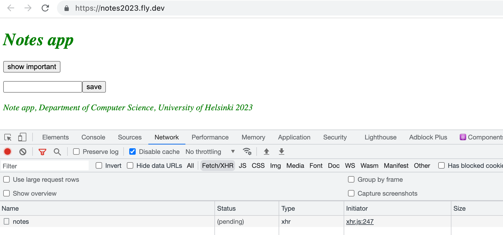
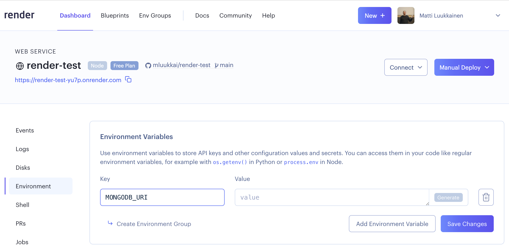
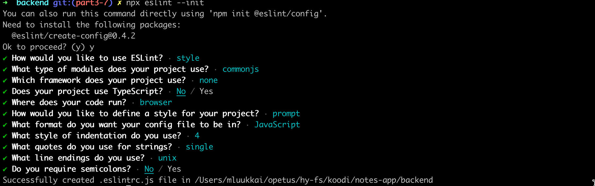

<div class="content">

Sovelluksen tietokantaan tallettamalle datan muodolle on usein tarve asettaa joitain ehtoja. Sovelluksemme ei hyväksy esim. muistiinpanoja, joiden sisältö eli <i>content</i>-kenttä puuttuu. Muistiinpanon oikeellisuus tarkastetaan sen luovassa metodissa:

```js
app.post('/api/notes', (request, response) => {
  const body = request.body
  // highlight-start
  if (body.content === undefined) {
    return response.status(400).json({ error: 'content missing' })
  }
  // highlight-end

  // ...
})
```

Eli jos muistiinpanolla ei ole kenttää <i>content</i>, vastataan pyyntöön statuskoodilla <i>400 Bad Request</i>. 

Routejen tapahtumakäsittelijöissä tehtävää tarkastusta järkevämpi tapa tietokantaan talletettavan tiedon oikean muodon määrittelylle ja tarkastamiselle on Mongoosen [validointitoiminnallisuuden](https://mongoosejs.com/docs/validation.html) käyttö.

Kullekin talletettavan datan kentälle voidaan määritellä validointisääntöjä skeemassa:

```js
const noteSchema = new mongoose.Schema({
  // highlight-start
  content: {
    type: String,
    minlength: 5,
    required: true
  },
    // highlight-end
  important: Boolean
})
```

Kentän <i>content</i> pituuden vaaditaan nyt olevan vähintään viisi merkkiä ja kentän arvo ei saa olla tyhjä. Kentälle <i>important</i> ei ole asetettu mitään ehtoa, joten se on määritelty edelleen yksinkertaisemmassa muodossa.

Esimerkissä käytetyt validaattorit <i>minlength</i> ja <i>required</i> ovat Mongooseen [sisäänrakennettuja](https://mongoosejs.com/docs/validation.html#built-in-validators) validointisääntöjä. Mongoosen [custom validator](https://mongoosejs.com/docs/validation.html#custom-validators) ‑ominaisuus mahdollistaa mielivaltaisten validaattorien toteuttamisen, jos valmiiden joukosta ei löydy tarkoitukseen sopivaa.

Jos tietokantaan yritetään tallettaa validointisäännön rikkova olio, heittää tallennusoperaatio poikkeuksen. Muutetaan uuden muistiinpanon luomisesta huolehtivaa käsittelijää siten, että se välittää mahdollisen poikkeuksen virheenkäsittelijämiddlewaren huolehdittavaksi:  

```js
app.post('/api/notes', (request, response, next) => { // highlight-line
  const body = request.body

  const note = new Note({
    content: body.content,
    important: body.important || false,
  })

  note.save()
    .then(savedNote => {
      response.json(savedNote)
    })
    .catch(error => next(error)) // highlight-line
})
```

Laajennetaan virheenkäsittelijää huomioimaan validointivirheet:

```js
const errorHandler = (error, request, response, next) => {
  console.error(error.message)

  if (error.name === 'CastError') {
    return response.status(400).send({ error: 'malformatted id' })
  } else if (error.name === 'ValidationError') { // highlight-line
    return response.status(400).json({ error: error.message }) // highlight-line
  }

  next(error)
}
```

Validoinnin epäonnistuessa palautetaan validaattorin oletusarvoinen virheviesti:


Huomaamme kuitenkin että sovelluksessa on pieni ongelma, validaatiota ei suoriteta muistiinpanojen päivityksen yhteydessä. [Dokumentaatio](https://github.com/blakehaswell/mongoose-unique-validator#find--updates) kertoo mistä on kyse, validaatiota ei suoriteta oletusarvoisesti metodin <i>findOneAndUpdate</i> suorituksen yhteydessä.

Korjaus on onneksi helppo. Muotoillaan routea muutenkin hieman siistimmäksi:

```js
app.put('/api/notes/:id', (request, response, next) => {
  const { content, important } = request.body // highlight-line

  Note.findByIdAndUpdate(
    request.params.id, 
    { content, important }, // highlight-line
    { new: true, runValidators: true, context: 'query' } // highlight-line
  ) 
    .then(updatedNote => {
      response.json(updatedNote)
    })
    .catch(error => next(error))
})
```

### Tietokantaa käyttävän version vieminen tuotantoon

Sovelluksen pitäisi toimia tuotannossa eli Fly.io:ssa tai Renderissä lähes sellaisenaan. Frontendin muutosten takia on tehtävä siitä uusi tuotantoversio ja kopioitava se backendiin. 

Huomaa, että vaikka määrittelimme sovelluskehitystä varten ympäristömuuttujille arvot tiedostossa <i>.env</i>, tietokantaurlin kertovan ympäristömuuttujan täytyy asettaa Fly.io:n tai Render vielä erikseen.

Fly.io:ssa komennolla _fly secrets set_:

```
fly secrets set MONGODB_URI='mongodb+srv://fullstack:<password>@cluster0.o1opl.mongodb.net/noteApp?retryWrites=true&w=majority'
```

Kun sovellus viedään tuotantoon, on hyvin tavanomaista että kaikki ei toimi odotusten mukaan. Esim. ensimmäinen tuotantoonvientiyritykseni päätyi seuraavaan:



Sovelluksessa ei toimi mikään.

Selaimen konsolin network-välilehti paljastaa että yritys muistiinpanojen hakemiseksi ei onnistu, pyyntö jää pitkäksi aikaa tilaan _pending_ ja lopulta epäonnistuu HTTP statuskoodilla 502.

Selaimen konsolia on siis tarkasteltava <i>koko ajan!</i>

Myös palvelimen lokien seuraaminen on elintärkeää. Ongelman syy selviääkin heti kun katsomme komennolla _fly logs_ mitä palvelimella tapahtuu:


Tietokannan osoite on siis _undefined_, eli komento *fly secrets set MONGODB\_URI* oli unohtunut.

Renderiä käytettäessä tietokannan osoitteen kertova ympäristömuuttuja määritellään dashboardista käsin:



Renderiä käytettäessä sovelluksen lokia on mahdollista tarkastella 
Dashboardin kautta:


Sovelluksen tämänhetkinen koodi on kokonaisuudessaan [GitHubissa](https://github.com/fullstack-hy2020/part3-notes-backend/tree/part3-6), branchissä <i>part3-6</i>.

</div>

<div class="tasks">

### Tehtävät 3.19.-3.21.
#### 3.19: puhelinluettelo ja tietokanta, step7

Laajenna validaatiota siten, että tietokantaan talletettavan nimen on oltava pituudeltaan vähintään kolme merkkiä. 

Laajenna sovelluksen frontendia siten, että se antaa jonkinlaisen virheilmoituksen validoinnin epäonnistuessa. Virheidenkäsittely hoidetaan lisäämällä <em>catch</em>-lohko uuden henkilön lisäämisen yhteyteen:

```js
personService
    .create({ ... })
    .then(createdPerson => {
      // ...
    })
    .catch(error => {
      // pääset käsiksi palvelimen palauttamaan virheilmoitusolioon näin
      console.log(error.response.data)
    })
```

Voit näyttää frontendissa käyttäjälle Mongoosen validoinnin oletusarvoisen virheilmoituksen vaikka ne eivät olekaan luettavuudeltaan parhaat mahdolliset:


#### 3.20*: puhelinluettelo ja tietokanta, step8

Toteuta sovelluksellesi validaatio, joka huolehtii, että backendiin voi tallettaa ainoastaan oikeassa muodossa olevia puhelinnumeroita. Puhelinnumeron täytyy olla
- vähintään 8 merkkiä pitkä
- koostua kahdesta väliviivalla erotetusta osasta joissa ensimmäisessä osassa on 2 tai 3 numeroa ja toisessa osassa riittävä määrä numeroita
  - esim. 09-1234556 ja 040-22334455 ovat oikeassa muodossa
  - esim. 1234556, 1-22334455 ja 10-22-334455 eivät ole kelvollisia

Toteuta validoinnin toinen osa [Custom validationina](https://mongoosejs.com/docs/validation.html#custom-validators).

Jos HTTP POST ‑pyyntö yrittää lisätä virheellistä numeroa, tulee vastata sopivalla statuskoodilla ja lisätä vastaukseen asianmukainen virheilmoitus.

#### 3.21 tietokantaa käyttävä versio Internetiin

Generoi päivitetystä sovelluksesta "full stack" ‑versio, eli tee frontendista uusi production build ja kopioi se backendin repositorioon. Varmista, että kaikki toimii paikallisesti käyttämällä koko sovellusta backendin osoitteesta <http://localhost:3001>.

Pushaa uusi versio Fly.io:n tai Renderiin ja varmista, että kaikki toimii myös siellä.

</div>

<div class="content">

### Lint

Ennen osan lopetusta katsomme vielä nopeasti paitsioon jäänyttä tärkeää työkalua [lintiä](<https://en.wikipedia.org/wiki/Lint_(software)>). Wikipedian sanoin:

> <i>Generically, lint or a linter is any tool that detects and flags errors in programming languages, including stylistic errors. The term lint-like behavior is sometimes applied to the process of flagging suspicious language usage. Lint-like tools generally perform static analysis of source code.</i>

Staattisesti tyypitetyissä, käännettävissä kielissä (esim. Javassa) ohjelmointiympäristöt, kuten NetBeans osaavat huomautella monista koodiin liittyvistä asioista, sellaisistakin, jotka eivät ole välttämättä käännösvirheitä. Erilaisten [staattisen analyysin](https://en.wikipedia.org/wiki/Static_program_analysis) lisätyökalujen, kuten [checkstylen](https://checkstyle.sourceforge.io/) avulla voidaan vielä laajentaa Javassa huomautettavien asioiden määrää koskemaan koodin tyylillisiä seikkoja, esim. sisentämistä.

JavaScript-maailmassa tämän hetken johtava työkalu staattiseen analyysiin eli "linttaukseen" on [ESLint](https://eslint.org/).

Asennetaan ESLint backendiin kehitysaikaiseksi riippuvuudeksi:

```bash
npm install eslint --save-dev
```

Tämän jälkeen voidaan muodostaa alustava ESLint-konfiguraatio:

```bash
npx eslint --init
```

Vastaillaan kysymyksiin:



Konfiguraatiot tallentuvat tiedostoon _.eslintrc.js_:

```js
module.exports = {
    'env': {
        'commonjs': true,
        'es2021': true,
        'node': true // highlight-line
    },
    'extends': 'eslint:recommended',
    'parserOptions': {
        'ecmaVersion': 'latest'
    },
    'rules': {
        'indent': [
            'error',
            4
        ],
        'linebreak-style': [
            'error',
            'unix'
        ],
        'quotes': [
            'error',
            'single'
        ],
        'semi': [
            'error',
            'never'
        ]
    }
}

```
Tarkista, että tiedostossa on rivi 'node': true kuvanmukaisesti ja lisää se tarvittaessa.
  
Muutetaan heti konfiguraatioista sisennystä määrittelevä sääntö siten, että sisennystaso on kaksi välilyöntiä:


```js
"indent": [
    "error",
    2
],
```

Esim tiedoston _index.js_ tarkastus tapahtuu komennolla:

```bash
npx eslint index.js
```

Kannattaa ehkä tehdä linttaustakin varten _npm-skripti_:

```json
{
  // ...
  "scripts": {
    "start": "node index.js",
    "dev": "nodemon index.js",
    // ...
    "lint": "eslint ." // highlight-line
  },
  // ...
}
```

Nyt komento _npm run lint_ suorittaa tarkastukset koko projektille.

Myös hakemistossa <em>build</em> oleva frontendin tuotantoversio tulee näin tarkastettua. Sitä emme kuitenkaan halua, eli tehdään projektin juureen tiedosto [.eslintignore](https://eslint.org/docs/user-guide/configuring/ignoring-code#the-eslintignore-file) ja sille seuraava sisältö:

```bash
build
```

Näin koko hakemiston <em>build</em> sisältö jätetään huomioimatta linttauksessa.

Lintillä on jonkin verran huomautettavaa koodistamme:


Ei kuitenkaan korjata ongelmia vielä.

Parempi vaihtoehto linttauksen suorittamiselle komentoriviltä on konfiguroida editorille <i>eslint-plugin</i>, joka suorittaa linttausta koko ajan. Näin pääset korjaamaan pienet virheet välittömästi. Tietoja esim. Visual Studion ESLint-pluginista on [täällä](https://marketplace.visualstudio.com/items?itemName=dbaeumer.vscode-eslint).

VS Coden ESLint-plugin alleviivaa tyylisääntöjä rikkovat kohdat punaisella:


Näin ongelmat on helppo korjata koodiin heti.
  
Komento _npm run lint -- --fix_ voi olla avuksi, jos koodissa on esim. useampia syntaksivirheitä.

ESLintille on määritelty suuri määrä [sääntöjä](https://eslint.org/docs/rules/), joita on helppo ottaa käyttöön muokkaamalla tiedostoa <i>.eslintrc.js</i>.

Otetaan käyttöön sääntö [eqeqeq](https://eslint.org/docs/rules/eqeqeq) joka varoittaa, jos koodissa yhtäsuuruutta verrataan muuten kuin käyttämällä kolmea = ‑merkkiä. Sääntö lisätään konfiguraatiotiedostoon kentän <i>rules</i> alle.

```js
{
  // ...
  'rules': {
    // ...
   'eqeqeq': 'error',
  },
}
```

Tehdään samalla muutama muukin muutos tarkastettaviin sääntöihin.

Estetään rivien lopussa olevat [turhat välilyönnit](https://eslint.org/docs/rules/no-trailing-spaces), vaaditaan että [aaltosulkeiden edessä/jälkeen on aina välilyönti](https://eslint.org/docs/rules/object-curly-spacing) ja vaaditaan myös konsistenttia välilyöntien käyttöä [nuolifunktioiden parametrien suhteen](https://eslint.org/docs/rules/arrow-spacing):

```js
{
  // ...
'rules': {
    // ...
    'eqeqeq': 'error',
    'no-trailing-spaces': 'error',
    'object-curly-spacing': [
        'error', 'always'
    ],
    'arrow-spacing': [
        'error', { 'before': true, 'after': true }
    ]
  },
}
```

Oletusarvoinen konfiguraatiomme ottaa käyttöön joukon valmiiksi määriteltyjä sääntöjä (<i>eslint:recommended</i>):

```bash
'extends': 'eslint:recommended',
```

Mukana on myös _console.log_-komennoista varoittava sääntö.
  
Yksittäinen sääntö on helppo kytkeä [pois päältä](https://eslint.org/docs/user-guide/configuring/rules#configuring-rules) määrittelemällä sen "arvoksi" konfiguraatiossa 0. Tehdään toistaiseksi näin säännölle <i>no-console</i>:

```js
{
  // ...
  'rules': {
      // ...
      'eqeqeq': 'error',
      'no-trailing-spaces': 'error',
      'object-curly-spacing': [
          'error', 'always'
      ],
      'arrow-spacing': [
          'error', { 'before': true, 'after': true }
      ],
      'no-console': 0, // highlight-line
    },
}
```

**HUOM:** Kun teet muutoksia tiedostoon <i>.eslintrc.js</i>, kannattaa muutosten jälkeen suorittaa linttaus komentoriviltä ja varmistaa, että konfiguraatio ei ole viallinen:


Jos konfiguraatiossa on jotain vikaa, voi editorin lint-plugin näyttää mitä sattuu.

Monissa yrityksissä on tapana määritellä yrityksen laajuiset koodausstandardit ja näiden käyttöä valvova ESLint-konfiguraatio. Pyörää ei kannata välttämättä keksiä uudelleen, ja voi olla hyvä idea ottaa omaan projektiin käyttöön joku jossain muualla hyväksi havaittu konfiguraatio. Viime aikoina monissa projekteissa on omaksuttu AirBnB:n [JavaScript](https://github.com/airbnb/javascript)-tyyliohjeet ottamalla käyttöön firman määrittelemä [ESLint](https://github.com/airbnb/javascript/tree/master/packages/eslint-config-airbnb)-konfiguraatio.

Sovelluksen tämänhetkinen koodi on kokonaisuudessaan [GitHubissa](https://github.com/fullstack-hy2020/part3-notes-backend/tree/part3-7), branchissa <i>part3-7</i>.

</div>

<div class="tasks">

### Tehtävä 3.22.

#### 3.22: lint-konfiguraatio

Ota sovellukseesi käyttöön ESLint, ja korjaa kaikki tyylivirheet.

Tämä oli osan viimeinen tehtävä, joten on aika pushata koodi GitHubiin sekä merkata tehdyt tehtävät [palautussovellukseen](https://studies.cs.helsinki.fi/stats/courses/fullstackopen).

</div>
