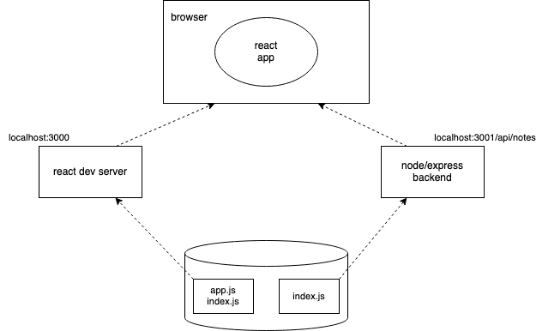
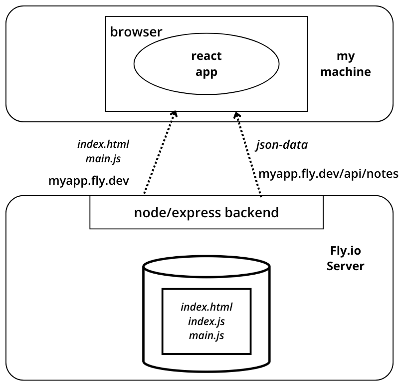

<div class="content">

Ensuite, nous allons connecter le frontend que nous avons créé dans la [partie 2](/fr/part2) à notre propre backend.

Dans la partie précédente, le frontend pouvait demander la liste des notes au serveur json que nous avions comme backend, à l'adresse http://localhost:3001/notes.
Notre backend a une structure d'url légèrement différente maintenant, puisque les notes peuvent être trouvées à http://localhost:3001/api/notes. Changeons l'attribut __baseUrl__ dans le <i>src/services/notes.js</i> comme ceci :

 ```js
import axios from 'axios'
const baseUrl = 'http://localhost:3001/api/notes' //highlight-line

const getAll = () => {
  const request = axios.get(baseUrl)
  return request.then(response => response.data)
}

// ...

export default { getAll, create, update }
```

<!-- Frontendin tekemä GET-pyyntö osoitteeseen <http://localhost:3001/api/notes> ei jostain syystä toimi : --> 
Maintenant la requête GET du frontend vers <http://localhost:3001/api/notes> ne fonctionne pas pour une raison quelconque :

 

 <!-- Mistä on kyse ? Backend toimii kuitenkin selaimesta ja postmanista käytettäessä ilman ongelmaa. --> 
Qu'est-ce qui se passe ici ? Nous pouvons accéder au backend depuis un navigateur et depuis postman sans aucun problème.

### Même politique d'origine et CORS

Le problème réside dans une chose appelée CORS, ou Cross-Origin Resource Sharing. 

Selon [Wikipedia](https://en.wikipedia.org/wiki/Cross-origin_resource_sharing):

> <i>Cross-origin resource sharing (CORS) est un mécanisme qui permet aux ressources restreintes (par exemple, les polices) d'une page Web d'être demandées à partir d'un autre domaine en dehors du domaine à partir duquel la première ressource a été servie. Une page Web peut librement intégrer des images, des feuilles de style, des scripts, des iframes et des vidéos d'origine croisée. Certaines requêtes "cross-domain", notamment les requêtes Ajax, sont interdites par défaut par la politique de sécurité same-origin.</i>

Dans notre contexte, le problème est que, par défaut, le code JavaScript d'une application qui s'exécute dans un navigateur ne peut communiquer qu'avec un serveur dans la même [origine](https://developer.mozilla.org/en-US/docs/Web/Security/Same-origin_policy). 
Parce que notre serveur est sur le port 3001 de localhost, et notre frontend sur le port 3000 de localhost, ils n'ont pas la même origine.

Gardez à l'esprit que la [politique de même origine](https://developer.mozilla.org/en-US/docs/Web/Security/Same-origin_policy) et CORS ne sont pas spécifiques à React ou Node. Ce sont en fait des principes universels du fonctionnement des applications web. 

Nous pouvons autoriser les demandes provenant d'autres <i>origines</i> en utilisant le middleware [cors](https://github.com/expressjs/cors) de Node.

Dans votre dépôt de backend, installez <i>cors</i> avec la commande

```bash
npm install cors
```

prenez le middleware à utiliser et autorisez les requêtes de toutes origines : 

```js 
const cors = require('cors')

app.use(cors())
```

Et le frontend fonctionne ! Cependant, la fonctionnalité permettant de modifier l'importance des notes n'a pas encore été implémentée dans le backend. 

Vous pouvez en savoir plus sur les CORS sur la [page Mozillas](https://developer.mozilla.org/en-US/docs/Web/HTTP/CORS).

La configuration de notre application est maintenant la suivante :

 

 L'application react qui s'exécute dans le navigateur va maintenant chercher les données dans le node/express-server qui s'exécute sur localhost:3001.
### Application vers l'Internet

Maintenant que toute la pile est prête, déplaçons notre application sur Internet. Nous allons utiliser le bon vieux [Heroku] (https://www.heroku.com) pour cela.

> Si vous n'avez jamais utilisé Heroku auparavant, vous pouvez trouver des instructions dans [Heroku documentation](https://devcenter.heroku.com/articles/getting-started-with-nodejs) ou en cherchant sur Google.

Ajoutez un fichier appelé <i>Procfile</i> à la racine du projet backend pour indiquer à Heroku comment démarrer l'application. 

```bash
web : node index.js
```

Changez la définition du port que notre application utilise en bas du fichier <i>index.js</i> comme suit : 

```js
const PORT = process.env.PORT || 3001  // highlight-line
app.listen(PORT, () => {
  console.log(`Server running on port ${PORT}`)
})
```

Nous utilisons maintenant le port défini dans la [variable d'environnement](https://en.wikipedia.org/wiki/Environment_variable) _PORT_ ou le port 3001 si la variable d'environnement _PORT_ est indéfinie. 
Heroku configure le port de l'application en fonction de la variable d'environnement. 

Créez un dépôt Git dans le répertoire du projet, et ajoutez <i>.gitignore</i> avec le contenu suivant

```bash
node_modules
```
Créez un compte Heroku dans https://devcenter.heroku.com/. 
Installez le paquet Heroku en utilisant la commande : npm install -g heroku. 
Créez une application Heroku avec la commande <i>heroku create</i>, commitez votre code sur le dépôt et déplacez-le sur Heroku avec la commande <i>git push heroku main</i>.

Si tout s'est bien passé, l'application fonctionne :


Si ce n'est pas le cas, le problème peut être trouvé en lisant les logs de heroku avec la commande <i>heroku logs</i>.

> **NB** Au moins au début, il est bon de garder un œil sur les logs heroku à tout moment. La meilleure façon de le faire est avec la commande <i>heroku logs -t</i> qui imprime les logs à la console chaque fois que quelque chose se passe sur le serveur. 

> **NB** Si vous déployez depuis un dépôt git où votre code n'est pas sur la branche principale (c'est-à-dire si vous modifiez le [dépôt notes](https://github.com/fullstack-hy2020/part3-notes-backend/tree/part3-2) de la dernière leçon), vous devrez exécuter _git push heroku HEAD:master_. Si vous avez déjà effectué un push sur heroku, vous devrez peut-être exécuter _git push heroku HEAD:main --force_.

Le frontend fonctionne aussi avec le backend sur Heroku. Vous pouvez le vérifier en changeant l'adresse du backend sur le frontend pour être l'adresse du backend dans Heroku au lieu de <i>http://localhost:3001</i>.

La question suivante est de savoir comment déployer le frontend sur Internet. Nous avons plusieurs options. Passons en revue l'une d'entre elles ensuite. 

### Construction de production du frontend

Jusqu'à présent, nous avons exécuté le code React en <i>mode développement</i>. En mode développement, l'application est configurée pour donner des messages d'erreur clairs, rendre immédiatement les changements de code au navigateur, et ainsi de suite. 

Lorsque l'application est déployée, nous devons créer un [production build](https://reactjs.org/docs/optimizing-performance.html#use-the-production-build) ou une version de l'application qui est optimisée pour la production. 

Une build de production des applications créées avec <i>create-react-app</i> peut être créée avec la commande [npm run build](https://github.com/facebookincubator/create-react-app#npm-run-build-or-yarn-build).

**NOTE:** au moment de la rédaction (20 janvier 2022) create-react-app avait un bug qui provoque l'erreur suivante _TypeError : MiniCssExtractPlugin n'est pas un constructeur_.

Un correctif possible est trouvé à partir d'[ici](https://github.com/facebook/create-react-app/issues/11930). Ajoutez ce qui suit au fichier <i>package.json</i>. 

```json
{
  // ...
  "resolutions": {
    "mini-css-extract-plugin": "2.4.5"
  }
}
```

et lancez les commandes

```
rm -rf package-lock.json
rm -rf node_modules
npm cache clean --force
npm install
```

Après ces commandes _npm run build_ devrait fonctionner.

Exécutons cette commande depuis la <i>racine du projet frontend</i>.

Cela crée un répertoire appelé <i>build</i> (qui contient le seul fichier HTML de notre application, <i>index.html</i> ) qui contient le répertoire <i>static</i>. La version [minifiée](<https://en.wikipedia.org/wiki/Minification_(programmation)>) du code JavaScript de notre application sera générée dans le répertoire <i>static</i>. Même si le code de l'application se trouve dans plusieurs fichiers, tout le JavaScript sera minifié en un seul fichier. En fait, tout le code de toutes les dépendances de l'application sera également minifié dans ce fichier unique. 

Le code minifié n'est pas très lisible. Le début du code ressemble à ceci : 

```js
!function(e){function r(r){for(var n,f,i=r[0],l=r[1],a=r[2],c=0,s=[];c<i.length;c++)f=i[c],o[f]&&s.push(o[f][0]),o[f]=0;for(n in l)Object.prototype.hasOwnProperty.call(l,n)&&(e[n]=l[n]);for(p&&p(r);s.length;)s.shift()();return u.push.apply(u,a||[]),t()}function t(){for(var e,r=0;r<u.length;r++){for(var t=u[r],n=!0,i=1;i<t.length;i++){var l=t[i];0!==o[l]&&(n=!1)}n&&(u.splice(r--,1),e=f(f.s=t[0]))}return e}var n={},o={2:0},u=[];function f(r){if(n[r])return n[r].exports;var t=n[r]={i:r,l:!1,exports:{}};return e[r].call(t.exports,t,t.exports,f),t.l=!0,t.exports}f.m=e,f.c=n,f.d=function(e,r,t){f.o(e,r)||Object.defineProperty(e,r,{enumerable:!0,get:t})},f.r=function(e){"undefined"!==typeof Symbol&&Symbol.toStringTag&&Object.defineProperty(e,Symbol.toStringTag,{value:"Module"})
```

### Servir des fichiers statiques à partir du backend

Une option pour déployer le frontend est de copier le build de production (le répertoire <i>build</i>) à la racine du dépôt du backend et de configurer le backend pour afficher le <i>main page</i> du frontend (le fichier <i>build/index.html</i>) comme page principale. 

Nous commençons par copier la build de production du frontend à la racine du backend. Avec un ordinateur Mac ou Linux, la copie peut être faite depuis le répertoire du frontend avec la commande

```bash
cp -r build ../notes-backend
```

Si vous utilisez un ordinateur Windows, vous pouvez utiliser la commande [copy](https://www.windows-commandline.com/windows-copy-command-syntax-examples/) ou [xcopy](https://www.windows-commandline.com/xcopy-command-syntax-examples/) à la place. Sinon, faites simplement un copier-coller. 

Le répertoire backend devrait maintenant ressembler à ceci :


Pour qu'express affiche le <i>contenu statique</i>, la page <i>index.html</i> et le JavaScript, etc., qu'il récupère, nous avons besoin d'un middleware intégré à express appelé [static](http://expressjs.com/en/starter/static-files.html).

Lorsque nous ajoutons ce qui suit au milieu des déclarations de middlewares 
```js
app.use(express.static('build'))
```

chaque fois qu'express reçoit une requête HTTP GET, il vérifie d'abord si le répertoire <i>build</i> contient un fichier correspondant à l'adresse de la requête. Si un fichier correct est trouvé, express le retournera. 

Maintenant, les requêtes HTTP GET vers l'adresse <i>www.serversaddress.com/index.html</i> ou <i>www.serversaddress.com</i> afficheront le frontend React. Les requêtes GET vers l'adresse <i>www.serversaddress.com/api/notes</i> seront traitées par le code du backend.

En raison de notre situation, le frontend et le backend sont tous deux à la même adresse, nous pouvons déclarer _baseUrl_ comme une URL [relative](https://www.w3.org/TR/WD-html40-970917/htmlweb.html#h-5.1.2). Cela signifie que nous pouvons laisser de côté la partie déclarant le serveur. 

```js
import axios from 'axios'
const baseUrl = '/api/notes' // highlight-line

const getAll = () => {
  const request = axios.get(baseUrl)
  return request.then(response => response.data)
}

// ...
```

Après le changement, nous devons créer un nouveau build de production et le copier à la racine du dépôt backend. 

L'application peut maintenant être utilisée depuis l'adresse <i>backend</i> <http://localhost:3001>:


Notre application fonctionne maintenant exactement comme l'application d'exemple [single-page app](/fr/part0/fundamentals_of_web_apps#single-page-app) que nous avons étudiée dans la partie 0. 

Lorsque nous utilisons un navigateur pour aller à l'adresse <http://localhost:3001>, le serveur renvoie le fichier <i>index.html</i> à partir du <i>build</i> du dépôt. Le contenu résumé de ce fichier est le suivant : 

```html
<head>
  <meta charset="utf-8"/>
  <title>React App</title>
  <link href="/static/css/main.f9a47af2.chunk.css" rel="stylesheet">
</head>
<body>
  <div id="root"></div>
  <script src="/static/js/1.578f4ea1.chunk.js"></script>
  <script src="/static/js/main.104ca08d.chunk.js"></script>
</body>
</html>
```

Le fichier contient des instructions pour récupérer une feuille de style CSS définissant les styles de l'application, et deux balises <i>script</i> qui indiquent au navigateur de récupérer le code JavaScript de l'application - l'application React réelle. 

Le code React va chercher les notes à l'adresse du serveur <http://localhost:3001/api/notes> et les rend à l'écran. Les communications entre le serveur et le navigateur peuvent être vues dans l'onglet <i>Réseau</i> de la console du développeur :


La configuration prête pour le déploiement du produit se présente comme suit :


Contrairement à ce qui s'est passé lors de l'exécution de l'application dans un environnement de développement, tout est maintenant dans le même node/express-backend qui s'exécute dans localhost:3001. Lorsque le navigateur se rend sur la page, le fichier <i>index.html</i> est rendu. Cela amène le navigateur à récupérer la version produit de l'application React. Une fois qu'elle commence à s'exécuter, elle récupère les données json de l'adresse localhost:3001/api/notes.

### L'application entière sur internet

Après vous être assuré que la version de production de l'application fonctionne localement, faites un commit du build de production du frontend dans le dépôt principal et faites à nouveau un push du code à Heroku. 

[L'application](https://obscure-harbor-49797.herokuapp.com/) fonctionne parfaitement, sauf que nous n'avons pas encore ajouté la fonctionnalité pour changer l'importance d'une note au backend. 


Notre application enregistre les notes dans une variable. Si l'application se plante ou est redémarrée, toutes les données disparaîtront. 

L'application a besoin d'une base de données. Avant d'en introduire une, passons en revue quelques éléments. 

La configuration ressemble maintenant à ce qui suit :



Le node/express-backend réside maintenant dans le serveur Heroku. Lorsque l'on accède à l'adresse racine qui est de la forme https://glacial-ravine-74819.herokuapp.com/, le navigateur charge et exécute l'application React qui récupère les données json du serveur Heroku.

### Rationalisation du déploiement du front-end 

Pour créer une nouvelle construction de production du frontend sans travail manuel supplémentaire, ajoutons quelques npm-scripts au <i>package.json</i> du dépôt du backend : 

```json
{
  "scripts": {
    //...
    "build:ui": "rm -rf build && cd ../part2-notes/ && npm run build && cp -r build ../notes-backend",
    "deploy": "git push heroku main",
    "deploy:full": "npm run build:ui && git add . && git commit -m uibuild && npm run deploy",    
    "logs:prod": "heroku logs --tail"
  }
}
```

Le script _npm run build:ui_ construit le frontend et copie la version de production sous le dépôt backend.  _npm run deploy_ libère le backend actuel sur Heroku. 

_npm run deploy:full_ combine ces deux-là et contient les commandes <i>git</i> nécessaires pour mettre à jour le dépôt backend. 

Il existe également un script _npm run logs:prod_ pour afficher les logs de heroku.

Notez que les chemins de répertoire dans le script <i>build:ui</i> dépendent de l'emplacement des dépôts dans le système de fichiers.

> **NB** Sous Windows, les scripts npm sont exécutés dans cmd.exe comme shell par défaut qui ne supporte pas les commandes bash. Pour que les commandes bash ci-dessus fonctionnent, vous pouvez changer le shell par défaut en Bash (dans l'installation par défaut de Git pour Windows) comme suit :

```md
npm config set script-shell "C:\\Program Files\\git\\bin\\bash.exe"
```

Une autre option est l'utilisation de [shx](https://www.npmjs.com/package/shx).

### Proxy

Des modifications apportées au frontend ont fait qu'il ne fonctionne plus en mode développement (lorsqu'il est lancé avec la commande _npm start_), car la connexion au backend ne fonctionne pas. 


Ceci est dû au changement de l'adresse du backend en une URL relative : 

```js
const baseUrl = '/api/notes'
```

Parce qu'en mode développement, le frontend est à l'adresse <i>localhost:3000</i>, les requêtes vers le backend vont à la mauvaise adresse <i>localhost:3000/api/notes</i>. Le backend se trouve à <i>localhost:3001</i>. 

Si le projet a été créé avec create-react-app, ce problème est facile à résoudre. Il suffit d'ajouter la déclaration suivante au fichier <i>package.json</i> du dépôt du frontend. 

```bash
{
  "dependencies": {
    // ...
  },
  "scripts": {
    // ...
  },
  "proxy": "http://localhost:3001"  // highlight-line
}
```

Après un redémarrage, l'environnement de développement React fonctionnera comme un [proxy](https://create-react-app.dev/docs/proxying-api-requests-in-development/). Si le code React fait une requête HTTP vers une adresse de serveur à <i>http://localhost:3000</i> non gérée par l'application React elle-même (c'est-à-dire lorsque les requêtes ne consistent pas à récupérer le CSS ou le JavaScript de l'application), la requête sera redirigée vers le serveur à <i>http://localhost:3001</i>. 

Maintenant, le frontend est aussi bien, travaillant avec le serveur à la fois en mode développement et en mode production. 

Un aspect négatif de notre approche est la complexité du déploiement du frontend. Le déploiement d'une nouvelle version nécessite de générer un nouveau build de production du frontend et de le copier dans le dépôt du backend. Cela rend la création d'un [pipeline de déploiement] automatisé (https://martinfowler.com/bliki/DeploymentPipeline.html) plus difficile. Un pipeline de déploiement est un moyen automatisé et contrôlé de faire passer le code de l'ordinateur du développeur à l'environnement de production en passant par différents tests et contrôles de qualité. La construction d'un pipeline de déploiement est le sujet de la [partie 11](https://fullstackopen.com/en/part11) de ce cours.

Il existe de multiples façons d'y parvenir (par exemple en plaçant le code backend et frontend [dans le même dépôt](https://github.com/mars/heroku-cra-node) ) mais nous ne nous y attarderons pas maintenant. 

Dans certaines situations, il peut être judicieux de déployer le code frontal comme une application à part entière. Avec les applications créées avec create-react-app, c'est [simple] (https://github.com/mars/create-react-app-buildpack).

Le code actuel du backend peut être trouvé sur [Github](https://github.com/fullstack-hy2020/part3-notes-backend/tree/part3-3), dans la branche <i>part3-3</i>. Les modifications du code du frontend se trouvent dans la branche <i>part3-1</i> du [dépôt du frontend](https://github.com/fullstack-hy2020/part2-notes/tree/part3-1).

</div>

<div class="tasks">

### Exercices 3.9.-3.11.

Les exercices suivants ne nécessitent pas beaucoup de lignes de code. Ils peuvent cependant constituer un défi, car vous devez comprendre exactement ce qui se passe et où, et les configurations doivent être justes. 

#### 3.9 backend du répertoire téléphonique étape9

Faites fonctionner le backend avec le frontend phonebook des exercices de la partie précédente. N'implémentez pas encore la fonctionnalité permettant de modifier les numéros de téléphone, qui sera implémentée dans l'exercice 3.17. 

Vous devrez probablement faire quelques petits changements au frontend, au moins aux URLs pour le backend. N'oubliez pas de garder la console de développement ouverte dans votre navigateur. Si certaines requêtes HTTP échouent, vous devriez vérifier à partir de l'onglet <i>Réseau</i> ce qui se passe. Gardez également un œil sur la console du backend. Si vous n'avez pas fait l'exercice précédent, il vaut la peine d'imprimer les données de la requête ou <i>request.body</i> à la console dans le gestionnaire d'événements responsable des requêtes POST. 

#### 3.10 backend répertoire téléphonique étape10

Déployez le backend sur internet, par exemple sur Heroku. 

**NB** la commande _heroku_ fonctionne sur les ordinateurs du département et les ordinateurs portables des étudiants de première année. Si pour une raison quelconque vous ne pouvez pas [installer](https://devcenter.heroku.com/articles/heroku-cli) Heroku sur votre ordinateur, vous pouvez utiliser la commande [npx heroku](https://www.npmjs.com/package/heroku).

Testez le backend déployé avec un navigateur et le client REST Postman ou VS Code pour vous assurer qu'il fonctionne. 

**PRO TIP:** Lorsque vous déployez votre application sur Heroku, il vaut la peine, au moins au début, de garder un œil sur les logs de l'application heroku **TOUT LE TEMPS** avec la commande <em>heroku logs -t</em>.

Ce qui suit est un log concernant un problème typique. Heroku ne peut pas trouver la dépendance d'application <i>express</i> :


La raison est que le paquet <i>express</i> n'a pas été installé avec la commande <em>npm install express</em>, donc les informations sur la dépendance n'ont pas été enregistrées dans le fichier <i>package.json</i>.

Un autre problème typique est que l'application n'est pas configurée pour utiliser le port défini dans la variable d'environnement <em>PORT</em> : 


Créez un README.md à la racine de votre dépôt, et ajoutez-y un lien vers votre application en ligne. 

#### 3.11 phonebook full stack

Générez un build de production de votre frontend, et ajoutez-le à l'application internet en utilisant la méthode introduite dans cette partie. 

**NB** Assurez-vous que le répertoire <i>build</i> n'est pas gitignored.

Assurez-vous également que le frontend fonctionne toujours localement (en mode développement lorsqu'il est lancé avec la commande _npm start_). 

Si vous avez des problèmes pour faire fonctionner l'application, assurez-vous que votre structure de répertoire correspond à celle de [l'application d'exemple](https://github.com/fullstack-hy2020/part3-notes-backend/tree/part3-3).

</div>
