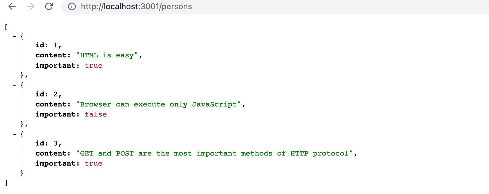
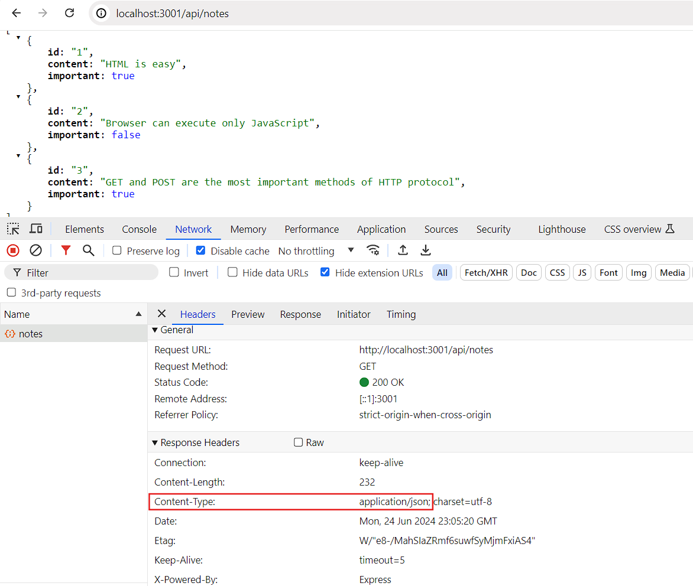
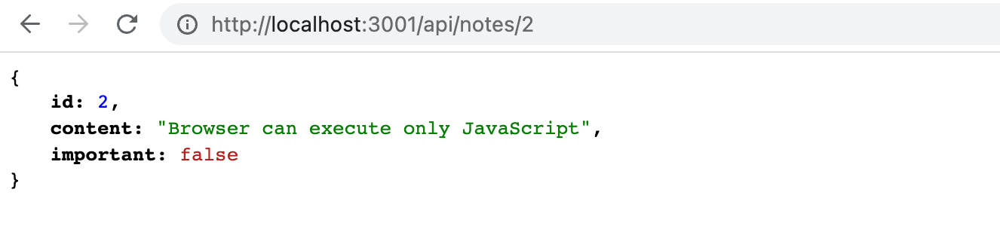
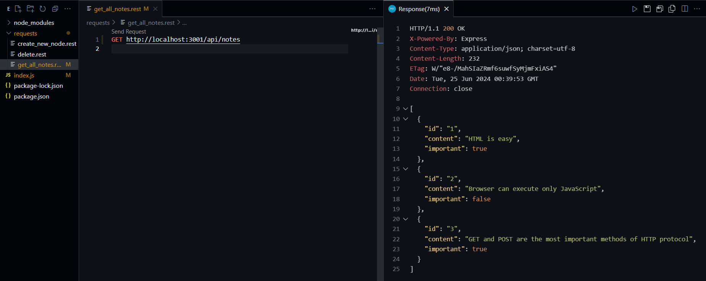
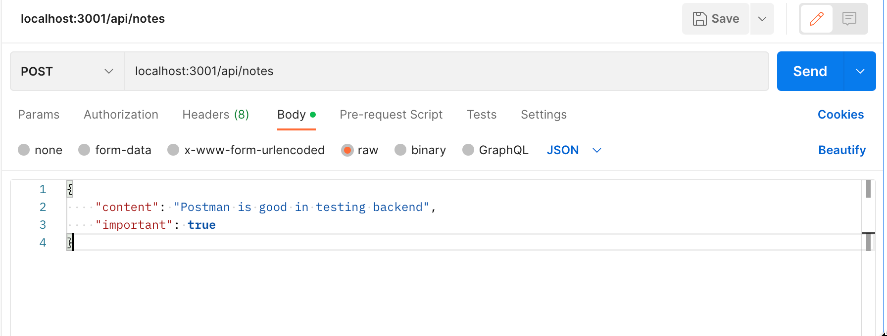
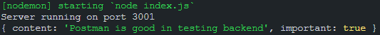
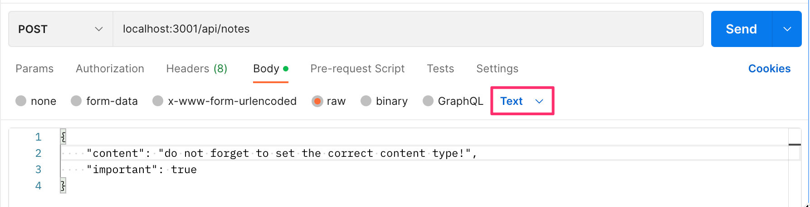
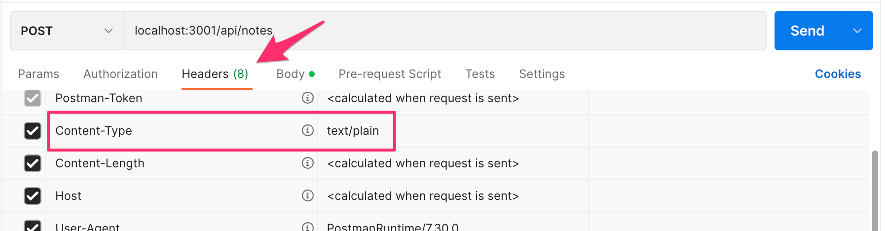
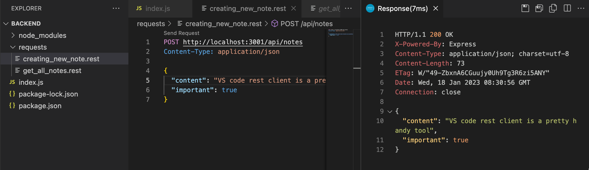

<div class="content">

Vamos focar no back-end nesta parte: ou seja, na implementação de funcionalidades no lado do servidor.

Estaremos construindo nosso back-end utilizando [NodeJS](https://nodejs.org/en/), que é um ambiente de execução JavaScript baseado no motor JavaScript [Chrome V8](https://developers.google.com/v8/) do Google.

O conteúdo desta parte do curso foi escrita com base na versão <i>v18.13.0</i> do Node.js. Certifique-se de que a versão do seu Node é pelo menos tão nova quanto a versão utilizada aqui (você pode verificar a versão executando _node -v_ na linha de comando).

Como mencionado na [Parte 1](/ptbr/part1/java_script), os navegadores ainda não suportam as novas funcionalidades de JavaScript, e é por isso que o código em execução no navegador deve ser <i>transpilado</i> com o [babel](https://babeljs.io/), por exemplo. Mas a situação é diferente com JavaScript em execução no back-end. A versão mais recente do Node suporta a maioria das últimas funcionalidades de JavaScript, então podemos usar as últimas funcionalidades sem ter que transpilar nosso código.

Nosso objetivo é implementar um back-end que funcione com a aplicação de notas da [Parte 2](/ptbr/part2/). No entanto, vamos começar com o básico implementando um clássico programa "Olá, mundo!".

**Observe** que nem todas as aplicações e exercícios nesta parte são aplicações React, e não usaremos o utilitário <i>create-react-app</i> para inicializar o projeto para esta aplicação.

Já tínhamos mencionado o [npm](/ptbr/part2/obtendo_dados_do_servidor#npm) na Parte 2, que é uma ferramenta usada para gerenciar pacotes JavaScript. Na verdade, o npm é originário do ecossistema Node.

Vamos navegar até um diretório apropriado e criar um novo modelo para nossa aplicação com o comando _npm init_. Vamos responder as perguntas apresentadas pelo utilitário, e o resultado será um arquivo <i>package.json</i> gerado automaticamente na raiz do projeto que contém as informações do projeto.

```json
{
  "name": "backend",
  "version": "0.0.1",
  "description": "",
  "main": "index.js",
  "scripts": {
    "test": "echo \"Error: no test specified\" && exit 1"
  },
  "author": "Matti Luukkainen",
  "license": "MIT"
}
```

O arquivo define, por exemplo, que o ponto de entrada da aplicação é o arquivo <i>index.js</i>.

Vamos fazer uma pequena alteração no objeto <i>scripts</i>:

```bash
{
  // ...
  "scripts": {
    "start": "node index.js", // highlight-line
    "test": "echo \"Error: no test specified\" && exit 1"
  },
  // ...
}
```

Agora, vamos criar a primeira versão da nossa aplicação adicionando um arquivo <i>index.js</i> à raiz do projeto com o seguinte código:

```js
console.log('hello world')
```

Podemos executar o programa diretamente com o Node a partir da linha de comando:

```bash
node index.js
```

Ou podemos executá-lo como um [script npm](https://docs.npmjs.com/misc/scripts):

```bash
npm start
```

O script npm <i>start</i> funciona porque o definimos no arquivo <i>package.json</i>:

```bash
{
  // ...
  "scripts": {
    "start": "node index.js",
    "test": "echo \"Error: no test specified\" && exit 1"
  },
  // ...
}
```

Embora a execução do projeto funcione quando ele é iniciado chamando _node index.js_ a partir da linha de comando, é costume de projetos npm executar tarefas como scripts npm.

Por padrão, o arquivo <i>package.json</i> também define outro script npm comumente usado chamado <i>npm test</i>. Como nosso projeto ainda não possui uma biblioteca de testes, o comando _npm test_ apenas executa o seguinte comando:

```bash
echo "Error: no test specified" && exit 1
```

### Um servidor web simples

Vamos transformar a aplicação em um servidor web editando o arquivo _index.js_ da seguinte maneira:

```js
const http = require('http')

const app = http.createServer((request, response) => {
  response.writeHead(200, { 'Content-Type': 'text/plain' })
  response.end('Hello World')
})

const PORT = 3001
app.listen(PORT)
console.log(`Server running on port ${PORT}`)
```

Uma vez que a aplicação está em execução, a seguinte mensagem é impressa no console:

```bash
Server running on port 3001
```

Podemos abrir nossa humilde aplicação no navegador entrando no endereço <http://localhost:3001>:


O servidor funciona da mesma maneira independentemente da última parte da URL, por isso o endereço <http://localhost:3001/foo/bar> exibirá o mesmo conteúdo.

**Obs.:** se a porta 3001 já estiver sendo usada por alguma outra aplicação, iniciar o servidor resultará na seguinte mensagem de erro:

```bash
➜  hello npm start

> hello@1.0.0 start /Users/mluukkai/opetus/_2019fullstack-code/part3/hello
> node index.js

Server running on port 3001
events.js:167
      throw er; // Unhandled 'error' event
      ^

Error: listen EADDRINUSE :::3001
    at Server.setupListenHandle [as _listen2] (net.js:1330:14)
    at listenInCluster (net.js:1378:12)
```

Você tem duas opções: ou encerre a aplicação usando a porta 3001 (o json-server na última parte do material estava usando a porta 3001), ou use uma porta diferente para esta aplicação.

Vamos olhar mais de perto na primeira linha do código:

```js
const http = require('http')
```

Na primeira linha, a aplicação importa o módulo integrado [web server](https://nodejs.org/docs/latest-v8.x/api/http.html) do Node. Isso é praticamente o que já estávamos fazendo em nosso código no lado do navegador, mas com uma sintaxe um pouco diferente:

```js
import http from 'http'
```

Hoje em dia, o código que roda no navegador usa módulos ES6. Os módulos são definidos com um [export](https://developer.mozilla.org/en-US/docs/Web/JavaScript/Reference/Statements/export) e usados com um [import](https://developer.mozilla.org/en-US/docs/Web/JavaScript/Reference/Statements/import).

No entanto, Node.js usa módulos chamados [CommonJS](https://en.wikipedia.org/wiki/CommonJS). A razão para isso é que o ecossistema Node teve a necessidade de usar módulos muito antes de JavaScript os suportar na especificação da linguagem. Node agora também suporta o uso de módulos ES6, mas como o suporte ainda [não é totalmente perfeito](https://nodejs.org/api/esm.html#modules-ecmascript-modules), vamos aderir aos módulos CommonJS.

Os módulos CommonJS funcionam quase exatamente como os módulos ES6, pelo menos no que diz respeito às nossas necessidades neste curso.

O próximo trecho em nosso código é assim:

```js
const app = http.createServer((request, response) => {
  response.writeHead(200, { 'Content-Type': 'text/plain' })
  response.end('Hello World')
})
```

O código usa o método _createServer_ ("criarServidor") do módulo [http](https://nodejs.org/docs/latest-v8.x/api/http.html) para criar um novo servidor web. Um <i>gerenciador de evento</i> é registrado no servidor que é chamado <i>sempre</i> que uma requisição HTTP é feita para o endereço http://localhost:3001 do servidor.

A requisição é respondida com o código de status 200, com o cabeçalho <i>Content-Type</i> definido como <i>text/plain</i>, e o conteúdo do site a ser retornado definido como <i>Hello World</i>.

As últimas linhas vinculam o servidor http atribuído à variável _app_ para ouvir as requisições HTTP enviadas à porta 3001:

```js
const PORT = 3001
app.listen(PORT)
console.log(`Server running on port ${PORT}`)
```

O objetivo principal do servidor back-end neste curso é oferecer dados brutos em formato JSON para o front-end. Por esse motivo, vamos imediatamente alterar nosso servidor para retornar uma lista codificada de notas no formato JSON:

```js
const http = require('http')

// highlight-start
let notes = [
  {
    id: 1,
    content: "HTML is easy",
    important: true
  },
  {
    id: 2,
    content: "Browser can execute only JavaScript",
    important: false
  },
  {
    id: 3,
    content: "GET and POST are the most important methods of HTTP protocol",
    important: true
  }
]

const app = http.createServer((request, response) => {
  response.writeHead(200, { 'Content-Type': 'application/json' })
  response.end(JSON.stringify(notes))
})
// highlight-end

const PORT = 3001
app.listen(PORT)
console.log(`Server running on port ${PORT}`)
```

Vamos reiniciar o servidor (você pode encerrá-lo pressionando _ctrl + c_ no console) e atualizar o navegador.

O valor <i>application/json</i> no cabeçalho <i>Content-Type</i> informa o receptor de que os dados estão no formato JSON. O array _notes_ é transformado em JSON com o método <em>JSON.stringify(notes)</em>.

Quando abrimos o navegador, o formato de exibição das notas é o mesmo que vimos na [Parte 2](/ptbr/part2/obtendo_dados_do_servidor) quando usamos o [json-server](https://github.com/typicode/json-server) para servir a lista de notas:



### Express

É possível implementar nosso código do servidor diretamente com o servidor web [http](https://nodejs.org/docs/latest-v8.x/api/http.html) integrado do Node. No entanto, isso é cansativo, especialmente quando a aplicação fica maior.

Muitas bibliotecas foram desenvolvidas para facilitar o desenvolvimento do lado do servidor com Node, oferecendo uma interface mais agradável para trabalhar com o módulo integrado http. Essas bibliotecas visam fornecer uma melhor abstração para casos de uso geral que normalmente exigimos para construir um servidor back-end. De longe, a biblioteca mais popular destinada a esse fim é o [Express](http://expressjs.com).

Vamos usar o Express definindo-o como uma dependência do projeto com o comando:

```bash
npm install express
```

A dependência também é adicionada ao nosso arquivo <i>package.json</i>:

```json
{
  // ...
  "dependencies": {
    "express": "^4.18.2"
  }
}
```

O código-fonte da dependência é instalado no diretório <i>node_modules</i> localizado na raiz do projeto. Além do Express, você pode encontrar uma grande quantidade de outras dependências no diretório:


Essas são as dependências da biblioteca Express e as dependências de todas as suas dependências e assim por diante. Elas são chamadas de [dependências transitivas](https://lexi-lambda.github.io/blog/2016/08/24/understanding-the-npm-dependency-model/) (transitive dependencies) do nosso projeto.

A versão 4.18.2 da biblioteca Express foi instalada em nosso projeto. O que significa esse acento circunflexo na frente do número de versão em <i>package.json</i>?

```json
"express": "^4.18.2"
```

O modelo de versionamento usado no npm é chamado de [versionamento semântico](https://docs.npmjs.com/getting-started/semantic-versioning) (semantic versioning).

O acento circunflexo na frente de <i>^4.18.2</i> significa que se e quando as dependências de um projeto forem atualizadas, a versão instalada do Express será pelo menos <i>4.18.2</i>. No entanto, a versão instalada do Express também pode ter um número de <i>patch</i> maior (o último número) ou um número <i>minor</i> maior (o número do meio). A versão principal da biblioteca indicada pelo primeiro número <i>major</i> deve ser a mesma.

Podemos atualizar as dependências do projeto com o comando:

```bash
npm update
```

Igualmente, se começarmos a trabalhar no projeto em outro computador, podemos instalar todas as dependências atualizadas do projeto definidas em <i>package.json</i> executando comando a seguir no diretório raiz do projeto:

```bash
npm install
```

Se o número <i>major</i> de uma dependência não mudar, então as novas versões devem ser [compatíveis com versões anteriores](https://en.wikipedia.org/wiki/Backward_compatibility). Isso significa que se nossa aplicação vier a usar a versão 4.99.175 do Express no futuro, então todo o código implementado nesta parte ainda terá que funcionar sem a necessidade de alterações no código. Em contraste, a futura versão 5.0.0 do Express [pode conter](https://expressjs.com/en/guide/migrating-5.html) alterações que farão com que nossa aplicação não funcione mais.

### Web e Express

Vamos voltar à nossa aplicação e fazer as seguintes alterações:

```js
const express = require('express')
const app = express()

let notes = [
  ...
]

app.get('/', (request, response) => {
  response.send('<h1>Hello World!</h1>')
})

app.get('/api/notes', (request, response) => {
  response.json(notes)
})

const PORT = 3001
app.listen(PORT, () => {
  console.log(`Server running on port ${PORT}`)
})
```

Para colocar a nova versão de nossa aplicação em uso, temos que reiniciar a aplicação.

A aplicação não mudou muito. Logo no início do nosso código, importamos o _express_ que desta vez é uma <i>função</i> usada para criar uma aplicação express armazenada na variável _app_:

```js
const express = require('express')
const app = express()
```

Em seguida, definimos duas <i>rotas</i> para a aplicação. A primeira define um gerenciador de evento que é usado para lidar com requisições HTTP GET feitas na raiz <i>/</i> da aplicação:

```js
app.get('/', (request, response) => {
  response.send('<h1>Hello World!</h1>')
})
```

A função de gerência de evento aceita dois parâmetros. O primeiro parâmetro [request](http://expressjs.com/en/4x/api.html#req) (requisição) contém todas as informações da requisição HTTP, e o segundo parâmetro [response](http://expressjs.com/en/4x/api.html#res) (resposta) é usado para definir como a requisição é respondida.

Em nosso código, a requisição é respondida usando o método [send](http://expressjs.com/en/4x/api.html#res.send) (enviar) do objeto _response_. Ao chamar o método, o servidor responde à requisição HTTP enviando uma resposta contendo a string <code>\<h1>Hello World!\</h1></code> que foi passada para o método _send_. Como o parâmetro é uma string, o express define automaticamente o valor do cabeçalho <i>Content-Type</i> como <i>text/html</i>. O código de status da resposta é definido como 200 por padrão.

Podemos verificar isso na guia <i>Rede</i> nas Ferramentas do Desenvolvedor:


A segunda rota define um gerenciador de evento que lida com requisições HTTP GET feitas no caminho <i>notes</i> da aplicação:

```js
app.get('/api/notes', (request, response) => {
  response.json(notes)
})
```

A requisição é respondida com o método [json](http://expressjs.com/en/4x/api.html#res.json) do objeto _response_. Quando chamado, o método enviará o array __notes__ que foi passado como uma string formatada em JSON. O express define automaticamente o cabeçalho <i>Content-Type</i> com o valor apropriado de <i>application/json</i>.



Em seguida, vamos dar uma olhada rápida nos dados enviados no formato JSON.

Na versão anterior do código em que estávamos usando apenas Node, tivemos que transformar os dados no formato JSON com o método _JSON.stringify_:

```js
response.end(JSON.stringify(notes))
```

Com Express isso se torna desnecessário, porque essa transformação acontece automaticamente.

Vale ressaltar que [JSON](https://en.wikipedia.org/wiki/JSON) (JavaScript Object Notation [Notação de Objeto JavaScript]) é uma string e não um objeto JavaScript como o valor que foi atribuído a _notes_.

O experimento mostrado abaixo ilustra esse ponto:


O experimento acima foi feito no [node-repl](https://nodejs.org/docs/latest-v8.x/api/repl.html) interativo. Você pode iniciar o node-repl interativo digitando _node_ no terminal. O repl é particularmente útil para testar como os comandos funcionam enquanto você está escrevendo o código da aplicação. Eu mais que recomendo o uso dessa ferramenta!

### nodemon

Se fizermos alterações no código da aplicação, precisamos reiniciá-la para ver as alterações. Reiniciamos a aplicação primeiro encerrando-a pressionando _ctrl + c_ e depois reiniciando-a. Se compararmos isso ao conveniente fluxo de trabalho em React, em que o navegador é recarregado automaticamente após as alterações serem feitas, parece até um pouco trabalhoso.

A solução para esse problema é o [nodemon](https://github.com/remy/nodemon):

> <i>nodemon irá monitorar os arquivos no diretório em que ele foi iniciado, e se houver alguma alteração nos arquivos, o nodemon reiniciará automaticamente sua aplicação Node.</i>

Vamos instalar o nodemon definindo-o como uma <i>dependência de desenvolvimento</i> (development dependency) com o comando:

```bash
npm install --save-dev nodemon
```

O conteúdo do arquivo <i>package.json</i> também foi alterado:

```json
{
  //...
  "dependencies": {
    "express": "^4.18.2"
  },
  "devDependencies": {
    "nodemon": "^2.0.20"
  }
}
```

Se você usou acidentalmente o comando errado e a dependência nodemon foi adicionada em "dependencies" em vez de "devDependencies", altere manualmente o conteúdo de <i>package.json</i> para que corresponda ao que é mostrado acima.

Por dependências de desenvolvimento, estamos nos referindo a ferramentas que são necessárias apenas durante o desenvolvimento da aplicação, por exemplo, para testar ou reiniciar automaticamente a aplicação, como o <i>nodemon</i>.

Essas dependências de desenvolvimento não são necessárias quando a aplicação é executada na fase de produção em um servidor de produção (Fly.io ou Heroku, por exemplo).

Podemos iniciar nossa aplicação com o <i>nodemon</i> assim:

```bash
node_modules/.bin/nodemon index.js
```

Alterações no código da aplicação agora fazem com que o servidor seja reiniciado automaticamente. Vale ressaltar que, embora o servidor back-end seja reiniciado automaticamente, o navegador ainda deve ser atualizado manualmente. Isso ocorre porque, ao contrário do que acontece ao trabalhar em React, não temos a funcionalidade [hot reload](https://gaearon.github.io/react-hot-loader/getstarted/) (grosso modo, "recarga rápida") necessária para recarregar automaticamente o navegador.

O comando é longo e bastante desagradável, portanto, vamos definir um <i>script npm</i> dedicado para ele no arquivo <i>package.json</i>:

```bash
{
  // ..
  "scripts": {
    "start": "node index.js",
    "dev": "nodemon index.js",  // highlight-line
    "test": "echo \"Error: no test specified\" && exit 1"
  },
  // ..
}
```

Não é necessário especificar  no script o caminho <i>node\_modules/.bin/nodemon</i> para o nodemon, pois o npm pesquisa automaticamente pelo arquivo nesse diretório.

Agora podemos iniciar o servidor no modo de desenvolvimento com o comando:

```bash
npm run dev
```

Ao contrário dos scripts <i>start</i> e <i>test</i>, também temos que adicionar <i>run</i> ao comando.

### REST

Vamos expandir nossa aplicação para que ela forneça a mesma API HTTP RESTful do [json-server](https://github.com/typicode/json-server#routes).

<i>Representational State Transfer</i>, também conhecido como REST, foi introduzido em 2000 na [dissertação de PhD](https://www.ics.uci.edu/~fielding/pubs/dissertation/rest_arch_style.htm) de Roy Fielding. REST é um estilo arquitetural destinado a construir aplicações web escaláveis.

Não vamos aprofundar a definição de REST de Fielding ou gastar tempo ponderando sobre o que é ou não RESTful. Em vez disso, adotamos uma visão mais [restrita](https://en.wikipedia.org/wiki/Representational_state_transfer#Applied_to_web_services), preocupando-nos apenas com a típica compreensão de APIs RESTful em aplicações web. A definição original de REST não se limita somente à aplicações web.

Mencionamos na [parte anterior](/ptbr/part2/alterando_dados_no_servidor#rest) que coisas singulares, como as notas no caso da nossa aplicação, são chamadas de <i>recursos</i> no modo RESTful de pensar. Cada recurso tem uma URL associada que é o endereço exclusivo do recurso.

Uma convenção para criar endereços exclusivos é combinar o nome do tipo de recurso com o identificador exclusivo do recurso.

Vamos assumir que a URL raiz do nosso serviço é <i>www.example.com/api</i>.

Se definirmos o tipo de recurso da nota como <i>notes</i>, então o endereço de um recurso de "note" com o identificador 10 tem o endereço exclusivo <i>www.example.com/api/notes/10</i>.

A URL para toda a coleção de todos os recursos de <i>notes</i> é <i>www.example.com/api/notes</i>.

Podemos executar diferentes operações em recursos. A operação a ser executada é definida pelo <i>verbo</i> HTTP:

| URL                   | verbo               | funcionalidade                                                       |
| --------------------- | ------------------- | ---------------------------------------------------------------------|
| notes/10              | GET                 | busca um único recurso                                               |
| notes                 | GET                 | busca todos os recursos na coleção                                   |
| notes                 | POST                | cria um novo recurso baseado nos dados requisitados                  |
| notes/10              | DELETE              | exclui um recurso identificado                                       |
| notes/10              | PUT                 | substitui todo o recurso identificado com os dados requisitados      |
| notes/10              | PATCH               | substitui uma parte do recurso identificado com os dados requisitados|
|                       |                     |                                                                      |

É assim que conseguimos definir aproximadamente o que REST chama de [interface uniforme](https://en.wikipedia.org/wiki/Representational_state_transfer#Architectural_constraints) (uniform interface), que significa uma maneira consistente de definir interfaces que tornam possível a cooperação entre sistemas.

Essa forma de interpretação do modelo REST se enquadra no [segundo nível de maturidade RESTful](https://martinfowler.com/articles/richardsonMaturityModel.html) (second level of RESTful maturity) no Modelo de Maturidade de Richardson. De acordo com a definição fornecida por Roy Fielding, ainda não definimos o que é uma [API REST](http://roy.gbiv.com/untangled/2008/rest-apis-must-be-hypertext-driven). Na verdade, a grande maioria das APIs "REST" do mundo não atende aos critérios originais de Fielding delineados em sua dissertação.

Em alguns lugares (ver, por exemplo, [Richardson, Ruby: RESTful Web Services](http://shop.oreilly.com/product/9780596529260.do)), verá nosso modelo para uma API [CRUD](https://en.wikipedia.org/wiki/Create,_read,_update_and_delete) simples será referenciado como um exemplo de [arquitetura orientada a recursos](https://en.wikipedia.org/wiki/Resource-oriented_architecture) (resource-oriented architecture) em vez de REST. Vamos evitar ficar presos discutindo semântica e, em vez disso, voltar a trabalhar em nossa aplicação.

### Buscando um único recurso

Vamos expandir nossa aplicação para que ela ofereça uma interface REST para operar em notas individuais. Primeiro, vamos criar uma [rota](http://expressjs.com/en/guide/routing.html) para buscar um único recurso.

O endereço único que usaremos para uma nota individual é na forma <i>notes/10</i>, onde o número no final refere-se ao número de identificação único da nota.

Podemos definir [parâmetros](http://expressjs.com/en/guide/routing.html#route-parameters) para rotas no Express usando a sintaxe de dois-pontos:

```js
app.get('/api/notes/:id', (request, response) => {
  const id = request.params.id
  const note = notes.find(note => note.id === id)
  response.json(note)
})
```

Agora, <code>app.get('/api/notes/:id', ...)</code> gerenciará todas as requisições HTTP GET que estão na forma <i>/api/notes/X</i>, onde <i>X</i> é uma string arbitrária.

O parâmetro <i>id</i> na rota de uma requisição pode ser acessado por meio do objeto [request](http://expressjs.com/en/api.html#req):

```js
const id = request.params.id
```

O agora familiar método de arrays _find_ é usado para encontrar a nota com um ID que corresponde ao parâmetro. A nota é então retornada ao remetente da requisição.

Quando testamos nossa aplicação acessando <http://localhost:3001/api/notes/1> em nosso navegador, percebemos que ela não parece funcionar, pois o navegador exibe uma página vazia. Isso não é surpresa para nós, desenvolvedores de software, pois é hora de depurar.

Adicionar comandos console.log em nosso código já é um truque comprovado pelo tempo:

```js
app.get('/api/notes/:id', (request, response) => {
  const id = request.params.id
  console.log(id)
  const note = notes.find(note => note.id === id)
  console.log(note)
  response.json(note)
})
```

Quando visitamos novamente o endereço <http://localhost:3001/api/notes/1> no navegador, o console — que é o terminal (neste caso) — exibirá o seguinte:


O parâmetro de id da rota é passado para nossa aplicação, mas o método _find_ não encontra uma nota correspondente.

Para aprofundar nossa investigação, também adicionamos um _console.log_ dentro da função de comparação passada para o método _find_. Para fazer isso, temos que nos livrar da sintaxe de função de seta compactada <em>note => note.id === id</em>, e usar a sintaxe com uma declaração explícita de retorno:

```js
app.get('/api/notes/:id', (request, response) => {
  const id = request.params.id
  const note = notes.find(note => {
    console.log(note.id, typeof note.id, id, typeof id, note.id === id)
    return note.id === id
  })
  console.log(note)
  response.json(note)
})
```

Quando visitamos a URL novamente no navegador, cada chamada à função de comparação imprime algumas coisas diferentes no console. A saída do console é a seguinte:

<pre>
1 'number' '1' 'string' false
2 'number' '1' 'string' false
3 'number' '1' 'string' false
</pre>

A causa do bug fica clara. A variável _id_ contém uma string '1', enquanto os ids das notas são números inteiros. Em JavaScript, o comparador de igualdade estrita <em>===</em> considera que todos os valores de tipos diferentes não são iguais por padrão, o que significa que 1 não é igual a '1'. 

Vamos corrigir o problema mudando o parâmetro id de uma string para um [Number](https://developer.mozilla.org/en/docs/Web/JavaScript/Reference/Global_Objects/Number) (construtor Number):

```js
app.get('/api/notes/:id', (request, response) => {
  const id = Number(request.params.id) // highlight-line
  const note = notes.find(note => note.id === id)
  response.json(note)
})
```

Agora, a busca de um recurso individual funciona.



No entanto, há outro problema com nossa aplicação.

Se procurarmos uma nota com um id que não existe, o servidor responde com:


O código de status HTTP retornado é 200, o que significa que a resposta teve sucesso. Não são retornados dados com a resposta, uma vez que o valor do cabeçalho <i>content-length</i> é 0, e o mesmo pode ser verificado no navegador.

A razão para esse comportamento é que a variável <i>note</i> é definida como "undefined" se nenhuma nota correspondente for encontrada. A situação precisa ser gerenciada no servidor de forma correta. Se nenhuma nota for encontrada, o servidor deve responder com o código de status [404 not found](https://www.rfc-editor.org/rfc/rfc9110.html#name-404-not-found) ("404 não encontrado(a)") em vez de 200.

Vamos fazer a seguinte alteração em nosso código:

```js
app.get('/api/notes/:id', (request, response) => {
  const id = Number(request.params.id)
  const note = notes.find(note => note.id === id)
  
  // highlight-start
  if (note) {
    response.json(note)
  } else {
    response.status(404).end()
  }
  // highlight-end
})
```

Como nenhum dado está anexado à resposta, usamos o método [status](http://expressjs.com/en/4x/api.html#res.status) para definir o status e o método [end](http://expressjs.com/en/4x/api.html#res.end) para responder à requisição sem enviar nenhum dado.

A condição <em>if</em> aproveita o fato de que todos os objetos JavaScript são [truthy](https://developer.mozilla.org/en-US/docs/Glossary/Truthy) (verdade/verdadeiro), o que significa que eles avaliam como verdadeiros em uma operação de comparação. No entanto, _undefined_ é [falsy](https://developer.mozilla.org/en-US/docs/Glossary/Falsy) (falso/falsidade), o que significa que ele avaliará como falso.

Nossa aplicação funciona e envia o código de status de erro se nenhuma nota for encontrada. No entanto, a aplicação não informa nada ao usuário — como as aplicações web normalmente fazem — quando visitamos uma página que não existe. Não precisamos exibir nada no navegador porque as APIs REST são interfaces destinadas ao uso programático, e o código de status de erro já é o necessário para o caso.

De qualquer forma, é possível dar uma pista sobre a razão para enviar um erro 404 [substituindo a mensagem padrão NOT FOUND](https://stackoverflow.com/questions/14154337/how-to-send-a-custom-http-status-message-in-node-express/36507614#36507614).

### Excluindo recursos

A seguir, vamos implementar uma rota para excluir recursos. A exclusão ocorre fazendo uma requisição HTTP DELETE para a URL do recurso:

```js
app.delete('/api/notes/:id', (request, response) => {
  const id = Number(request.params.id)
  notes = notes.filter(note => note.id !== id)

  response.status(204).end()
})
```

Se a exclusão do recurso for bem-sucedida, ou seja, se a nota existir e for removida, respondemos à requisição com o código de status [204 no content](https://www.rfc-editor.org/rfc/rfc9110.html#name-204-no-content) ("200 nenhum conteúdo") e não retornamos nenhum dado com a resposta.

Não há consenso sobre qual código de status deve ser retornado para uma requisição DELETE se o recurso não existir. As únicas duas opções são 204 e 404. Para simplificar, nossa aplicação responderá com 204 em ambos os casos.

### Postman

Então, como testar a operação de exclusão? As requisições HTTP GET são fáceis de fazer a partir do navegador. Poderíamos escrever algum JavaScript para testar a exclusão, mas escrever código de teste nem sempre é a melhor solução em todas as situações.

Existem muitas ferramentas para tornar mais fácil a realização de testes em back-ends. Uma delas é o programa de linha de comando [curl](https://curl.haxx.se). No entanto, em vez do curl, vamos dar uma olhada em como usar o [Postman](https://www.postman.com) para testar a aplicação.

Vamos baixar [deste site](https://www.postman.com/downloads/) o cliente desktop do Postman e testá-lo:


É bastante fácil usar o Postman nesta situação. É suficiente definir a URL e selecionar o tipo de requisição correta (DELETE).

O servidor back-end parece responder corretamente. Ao fazer uma requisição HTTP GET para <http://localhost:3001/api/notes>, vemos que a nota com o id 2 não está mais na lista, o que indica que a exclusão foi bem-sucedida.

Como as notas na aplicação são salvas apenas na memória, a lista de notas retornará ao seu estado original quando reiniciarmos a aplicação.

### O cliente REST do Visual Studio Code

Se quiser o usar o Visual Studio Code, é possível utilizar o plugin VS Code [REST client](https://marketplace.visualstudio.com/items?itemName=humao.rest-client) em vez do Postman.

É muito fácil usar o plugin depois de instalado. Criamos um diretório na raiz da aplicação chamado <i>requests</i>. Salvamos todas as requisições do cliente REST no diretório como arquivos que terminam com a extensão <i>.rest</i>.

Vamos criar um novo arquivo <i>get\_all\_notes.rest</i> e definir a requisição que busca todas as notas.


Ao clicar no texto <i>Send Request</i>, o cliente REST executará a requisição HTTP e a resposta do servidor será aberta no editor.



### O cliente HTTP do WebStorm

Se você usar o *IntelliJ WebStorm*, é possível fazer um procedimento semelhante com o Cliente HTTP integrado. Crie um novo arquivo com extensão `.rest` e o editor exibirá suas opções para criar e executar suas requisições. Saiba mais sobre o processo seguindo [este guia](https://www.jetbrains.com/help/webstorm/http-client-in-product-code-editor.html).

### Recebendo dados

Em seguida, vamos implementar a funcionalidade de adicionar novas notas ao servidor. É possível adicionar uma nota fazendo uma requisição HTTP POST para o endereço http://localhost:3001/api/notes e enviando todas as informações para a nova nota no [corpo](https://www.w3.org/Protocols/rfc2616/rfc2616-sec7.html#sec7) (body) da requisição em formato JSON.

Para que possamos acessar os dados facilmente, precisamos da ajuda do [json-parser](https://expressjs.com/en/api.html) do Express, que é usado com o comando _app.use(express.json())_.

Vamos ativar o json-parser e implementar um gerenciador inicial para lidar com requisições HTTP POST:

```js
const express = require('express')
const app = express()

app.use(express.json())  // highlight-line

//...

// highlight-start
app.post('/api/notes', (request, response) => {
  const note = request.body
  console.log(note)

  response.json(note)
})
// highlight-end
```

A função do gerenciador de evento pode acessar os dados da propriedade <i>body</i> do objeto _request_.

Sem o json-parser, a propriedade <i>body</i> seria indefinida. O json-parser funciona de forma que ele pega os dados JSON de uma requisição, transforma-os em um objeto JavaScript e, em seguida, anexa-os à propriedade <i>body</i> do objeto _request_ antes do gerenciador de rota ser chamado.

Por enquanto, a aplicação não faz nada com os dados recebidos, exceto imprimi-los no console e enviá-los de volta na resposta.

Antes de implementarmos o restante da lógica da aplicação, vamos verificar no Postman se os dados são recebidos pelo servidor. Além de definir a URL e o tipo de requisição no Postman, também temos que definir os dados enviados no <i>body</i>:



A aplicação imprime no console os dados que enviamos na requisição:



**Obs.:** <i>Mantenha o terminal visível o tempo todo enquanto a aplicação estiver sendo executada</i> quando estiver trabalhando no back-end. Graças ao Nodemon, quaisquer alterações que fizermos no código reiniciarão a aplicação. Se você prestar atenção no console, poderá identificar imediatamente os erros que ocorrem na aplicação:


Da mesma forma, é útil verificar o console para garantir que o back-end está se comportando da forma que esperamos em diferentes situações, como quando enviamos dados com uma requisição HTTP POST. Naturalmente, é uma boa ideia adicionar muitos comandos <em>console.log</em> ao código enquanto a aplicação ainda estiver sendo desenvolvida.

Uma possível causa de problemas é um cabeçalho <i>Content-Type</i> definido incorretamente em requisições. Isso pode acontecer com o Postman se o tipo <i>body</i> não estiver definido corretamente:



O cabeçalho <i>Content-Type</i> é definido como <i>text/plain</i>:



O servidor parece receber apenas um objeto vazio:


O servidor não será capaz de analisar corretamente os dados sem o valor correto no cabeçalho. Ele nem tentará adivinhar o formato dos dados, já que há uma [quantidade enorme](https://developer.mozilla.org/en-US/docs/Web/HTTP/Basics_of_HTTP/MIME_types) de potenciais <i>Content-Types</i>.

Se você estiver usando o VS Code, deverá instalar o cliente REST do capítulo anterior <i>agora, se ainda não tiver instalado</i>. A requisição POST pode ser enviada com o cliente REST assim:



Criamos um novo arquivo <i>create\_note.rest</i> para a requisição. A requisição é formatada de acordo com as [instruções da documentação](https://github.com/Huachao/vscode-restclient/blob/master/README.md#usage).

Uma vantagem que o cliente REST tem sobre o Postman é que as requisições estão disponíveis convenientemente na raiz do repositório do projeto e podem ser distribuídas para todos na equipe de desenvolvimento. Você também pode adicionar várias requisições no mesmo arquivo usando separadores `###`:

```
GET http://localhost:3001/api/notes/

###
POST http://localhost:3001/api/notes/ HTTP/1.1
content-type: application/json

{
    "name": "sample",
    "time": "Wed, 21 Oct 2015 18:27:50 GMT"
}
```

O Postman também permite que os usuários salvem requisições, mas a situação pode ficar bastante caótica, especialmente quando você está trabalhando em vários projetos não relacionados.

> **Observação importante**
>
> Às vezes, ao depurar, é possível que você queira descobrir quais cabeçalhos foram definidos na requisição HTTP. Uma maneira de fazer isso é através do método [get](http://expressjs.com/en/4x/api.html#req.get) do objeto _request_, que pode ser usado para obter o valor de um único cabeçalho. O objeto _request_ também possui a propriedade <i>headers</i>, que contém todos os cabeçalhos de uma requisição específica.
>

> Podem ocorrer problemas com o cliente REST do VS Code se você adicionar acidentalmente uma linha vazia entre a linha superior e a linha que especifica os cabeçalhos HTTP. Nessa situação, o cliente REST interpreta como se todos os cabeçalhos estivessem vazios, o que faz com que o servidor back-end não saiba que os dados que recebeu estão no formato JSON.
>

Você será capaz de identificar esse cabeçalho faltando <i>Content-Type</i> se em algum momento no seu código você imprimir todos os cabeçalhos da requisição com o comando _console.log(request.headers)_.

Vamos voltar para a aplicação. Depois de verificar se a aplicação recebe dados corretamente, é hora de finalizar o gerenciamento da requisição:

```js
app.post('/api/notes', (request, response) => {
  const maxId = notes.length > 0
    ? Math.max(...notes.map(n => n.id)) 
    : 0

  const note = request.body
  note.id = maxId + 1

  notes = notes.concat(note)

  response.json(note)
})
```

Precisamos de um id único para a nota. Primeiro, descobrimos o maior número de id na lista atual e o atribuímos à variável _maxId_. O id da nova nota é então definido como _maxId + 1_. Este método não é recomendado, mas vamos conviver com ele por enquanto, pois o substituiremos em breve.

A versão atual ainda tem o problema de que a requisição HTTP POST pode ser usada para adicionar objetos com propriedades arbitrárias. Vamos melhorar a aplicação definindo que a propriedade <i>content</i> não pode estar vazia. A propriedade <i>important</i> receberá o valor padrão <em>false</em>. Todas as outras propriedades são descartadas:

```js
const generateId = () => {
  const maxId = notes.length > 0
    ? Math.max(...notes.map(n => n.id))
    : 0
  return maxId + 1
}

app.post('/api/notes', (request, response) => {
  const body = request.body

  if (!body.content) {
    return response.status(400).json({ 
      error: 'content missing' 
    })
  }

  const note = {
    content: body.content,
    important: body.important || false,
    id: generateId(),
  }

  notes = notes.concat(note)

  response.json(note)
})
```

A lógica para gerar às notas um novo número de ID foi extraída para uma função separada _generateId_.

Se os dados recebidos estiverem faltando um valor para a propriedade <i>content</i>, o servidor responderá à requisição com o código de status [400 bad request](https://www.rfc-editor.org/rfc/rfc9110.html#name-400-bad-request) ("400 requisição inválida"):

```js
if (!body.content) {
  return response.status(400).json({ 
    error: 'content missing' 
  })
}
```

Observe que declarar o <em>return</em> é crucial porque, caso contrário, o código será executado até o final e a nota mal formatada será salva na aplicação.

Se a propriedade <i>content</i> tiver um valor, a nota será baseada nos dados recebidos.
Se estiver faltando a propriedade <i>important</i>, definimos o valor padrão como <i>false</i>. O valor padrão é gerado atualmente de uma forma bastante estranha:

```js
important: body.important || false,
```

Se os dados salvos na variável _body_ tiverem a propriedade <i>important</i>, a expressão resultará no seu valor. Se a propriedade não existir, a expressão resultará em <i>false</i>, que é definido no lado direito das barras verticais.

> Sendo mais preciso, quando a propriedade <i>important</i> é <i>false</i>, então a expressão <em>body.important || false</em> retornará de fato  o <i>false</i> do lado direito...

É possível encontrar o código atual completo da nossa aplicação na branch <i>part3-1</i> neste [repositório do GitHub](https://github.com/fullstack-hy2020/part3-notes-backend/tree/part3-1).

O código para o estado atual da aplicação é especificado na branch [part3-1](https://github.com/fullstack-hy2020/part3-notes-backend/tree/part3-1).


Se você clonar o projeto, execute o comando _npm install_ antes de iniciar a aplicação com _npm start_ ou _npm run dev_.

Mais uma coisa antes de prosseguirmos para os exercícios. A função para gerar IDs é esta:

```js
const generateId = () => {
  const maxId = notes.length > 0
    ? Math.max(...notes.map(n => n.id))
    : 0
  return maxId + 1
}
```

O corpo da função contém uma linha que parece um tanto intrigante:

```js
Math.max(...notes.map(n => n.id))
```

O que exatamente está acontecendo nessa linha de código? <em>notes.map(n => n.id)</em> cria um novo array que contém todos os IDs das notas. [Math.max](https://developer.mozilla.org/en-US/docs/Web/JavaScript/Reference/Global_Objects/Math/max) retorna o valor máximo dos números que lhe são passados. No entanto, <em>notes.map(n => n.id)</em> é um <i>array</i>, então ele não pode ser dado diretamente como parâmetro para Math.max. O array pode ser transformado em números individuais usando a sintaxe de espalhamento ou sintaxe de "três pontos" [spread](https://developer.mozilla.org/en-US/docs/Web/JavaScript/Reference/Operators/Spread_syntax) <em>...</em> 

</div>

<div class="tasks">

### Exercícios 3.1 a 3.6

**Obs.:** É recomendado fazer todos os exercícios desta parte em um novo repositório Git separado e colocar o código-fonte na raiz do repositório. Caso contrário, você terá problemas no exercício 3.10.

**Obs.:** Como este não é um projeto de front-end e não estamos trabalhando com React, a aplicação <strong>não é criada</strong> com "create-react-app". Inicializa-se este projeto com o comando <em>npm init</em> que foi demonstrado anteriormente nesta parte do material.

**Forte Recomendação:** quando você estiver trabalhando com código back-end, sempre fique de olho no que está acontecendo no terminal que está executando sua aplicação.

#### 3.1: Phonebook backend — 1º passo

Implemente uma aplicação Node que retorna uma lista de pessoas da lista telefônica a partir do endereço <http://localhost:3001/api/persons>.

Dados:
  
```js
[
    { 
      "id": 1,
      "name": "Arto Hellas", 
      "number": "040-123456"
    },
    { 
      "id": 2,
      "name": "Ada Lovelace", 
      "number": "39-44-5323523"
    },
    { 
      "id": 3,
      "name": "Dan Abramov", 
      "number": "12-43-234345"
    },
    { 
      "id": 4,
      "name": "Mary Poppendieck", 
      "number": "39-23-6423122"
    }
]
```

Saída no navegador após a requisição GET:


Observe que a barra comum na rota <i>api/persons</i> não é um caractere especial, sendo apenas como qualquer outro caractere na string.

A aplicação deve ser iniciada com o comando _npm start_.

A aplicação também deve disponibilizar um comando _npm run dev_ que executará a aplicação e reiniciará o servidor sempre que as alterações forem feitas e salvas em um arquivo no código-fonte.

#### 3.2: Phonebook backend — 2º passo

Implemente uma página no endereço <http://localhost:3001/info> que se pareça mais ou menos com isto:


A página deve mostrar a hora em que a requisição foi recebida e quantas entradas há na lista telefônica no momento do processamento da requisição.

#### 3.3: Phonebook backend — 3º passo

Implemente uma funcionalidade que exiba as informações de uma única entrada da lista telefônica. A URL para obter os dados de uma pessoa com o id 5 deve ser <http://localhost:3001/api/persons/5>.

Se uma entrada para o id fornecido não for encontrada, o servidor deverá responder com o código de status apropriado.

#### 3.4: Phonebook backend — 4º passo

Implemente uma funcionalidade que permita excluir uma única entrada da lista telefônica fazendo uma requisição HTTP DELETE para a URL exclusiva dessa entrada na lista telefônica.

Teste se sua funcionalidade funciona com o Postman ou com o cliente REST do Visual Studio Code.

#### 3.5: Phonebook backend — 5º passo

Expanda o back-end para que novas entradas da lista telefônica possam ser adicionadas fazendo requisições HTTP POST para o endereço <http://localhost:3001/api/persons>.

Gere um novo id para as entradas da lista telefônica com a função [Math.random](https://developer.mozilla.org/en-US/docs/Web/JavaScript/Reference/Global_Objects/Math/random). Use um intervalo grande o suficiente para seus valores aleatórios, para que a probabilidade de criar ids duplicados seja pequena.

#### 3.6: Phonebook backend — 6º passo

Implemente o gerenciamento de erro (error handling) para a criação de novas entradas. A requisição não pode ser bem-sucedida se:

- O nome ou o número estão faltando; e se
- O nome já existe na lista telefônica.

Responda a requisições como essas com o código de status apropriado e envie também informações que explicam o motivo do erro, como por exemplo:

```js
{ error: 'name must be unique' }
```

</div>

<div class="content">

### Sobre os tipos de requisição HTTP

O [padrão HTTP](https://www.rfc-editor.org/rfc/rfc9110.html#name-common-method-properties) fala sobre duas propriedades relacionadas aos tipos de requisição, **segurança** (safety) e **idempotência** (idempotency).

A requisição HTTP GET deve ser <i>segura</i>:

> <i>Em particular, a convenção estabelecida diz que os métodos GET e HEAD NÃO devem ter a importância de realizar uma ação além da recuperação. Esses métodos devem ser considerados "seguros".</i>

Segurança significa que a execução da requisição não deve causar quaisquer <i>efeitos colaterais</i> no servidor. Por efeitos colaterais, entendemos que o estado do banco de dados não deve mudar como resultado da requisição, e a resposta deve retornar apenas os dados que já existem no servidor.

Nada garante que uma requisição GET é <i>segura</i>, esta é apenas uma recomendação definida no padrão HTTP. Adotando os princípios RESTful em nossa API, as requisições GET são sempre usadas de forma que são <i>seguras</i>.

O padrão HTTP também define que o tipo de requisição [HEAD](https://www.rfc-editor.org/rfc/rfc9110.html#name-head) deve ser seguro. Na prática, o HEAD deve funcionar exatamente como o GET, mas não retorna nada além do código de status e dos cabeçalhos de resposta. O corpo da resposta não será retornado quando você fizer uma requisição HEAD.

Todas as requisições HTTP, exceto o POST, devem ser <i>idempotentes</i>:

> <i>Os métodos também podem ter a propriedade de "idempotência", no sentido de que (além de problemas de erro ou expiração) os efeitos colaterais de N > 0 requisições idênticas são os mesmos que para uma única requisição. Os métodos GET, HEAD, PUT e DELETE compartilham essa propriedade.</i>

Isso significa que se uma requisição não gera efeitos colaterais, o resultado deve ser o mesmo, independentemente de quantas vezes a requisição for enviada.

Se fizermos uma requisição HTTP PUT para a URL <i>/api/notes/10</i> e com a requisição enviarmos os dados <em>{ content: "sem efeitos colaterais!", important: true }</em>, o resultado será o mesmo, independentemente de quantas vezes a requisição for enviada.

Assim como <i>segurança</i> para a requisição GET, <i>idempotência</i> também é apenas uma recomendação no padrão HTTP e não algo que possa ser garantido simplesmente com base no tipo de requisição. No entanto, quando nossa API adere aos princípios RESTful, as requisições GET, HEAD, PUT e DELETE são usadas de forma que são idempotentes.

POST é o único tipo de requisição HTTP que não é nem <i>seguro</i> nem <i>idempotente</i>. Se enviarmos 5 requisições HTTP POST diferentes para <i>/api/notes</i> com um corpo de <em>
{ content: "muitas iguais", important: true }</em>, as 5 notas resultantes no servidor terão o mesmo conteúdo.

### Middleware

O [json-parser](https://expressjs.com/en/api.html) do Express que usamos anteriormente é um [middleware](http://expressjs.com/en/guide/using-middleware.html).

<i>Middleware</i> são funções que podem ser usadas para lidar com objetos de _request_ e _response_.

O json-parser que usamos anteriormente pega os dados brutos das requisições armazenadas no objeto _request_, os decompõe em um objeto JavaScript e os atribui ao objeto _request_ como uma nova propriedade <i>body</i>.

Na prática, é possível usar vários <i>middlewares</i> ao mesmo tempo. Quando você tem mais de um, eles são executados um por um na ordem em que foram adicionados no Express.

Vamos implementar nosso próprio <i>middleware</i> que imprime informações sobre cada requisição enviada ao servidor.

<i>Middleware</i> é uma função que recebe três parâmetros:

```js
const requestLogger = (request, response, next) => {
  console.log('Method:', request.method)
  console.log('Path:  ', request.path)
  console.log('Body:  ', request.body)
  console.log('---')
  next()
}
```

No final do corpo da função, a função _next_ que foi passada como parâmetro é chamada. A função _next_ cede o controle para o próximo <i>middleware</i>.

<i>Middleware</i> é usado assim:

```js
app.use(requestLogger)
```

Funções de <i>middleware</i> são chamadas na ordem em que são adicionadas ao objeto do servidor Express com o método _use_. Observe que o json-parser é adicionado antes do <i>middleware</i> _requestLogger_, caso contrário, <i>request.body</i> não será inicializado quando o registrador (logger) for executado!

Funções de <i>middleware</i> devem ser adicionadas antes das rotas se quisermos que sejam executadas antes que os gerenciadores de evento da rota sejam chamados. Também há situações em que queremos definir funções de <i>middleware</i> depois das rotas. Na prática, isso significa que estamos definindo funções de <i>middleware</i> que só são chamadas se nenhuma rota gerenciar a requisição HTTP.

Vamos adicionar o <i>middleware</i> a seguir depois das nossas rotas. Este <i>middleware</i> será usado para pegar requisições feitas para rotas inexistentes. Para essas requisições, o <i>middleware</i> retornará uma mensagem de erro no formato JSON.

```js
const unknownEndpoint = (request, response) => {
  response.status(404).send({ error: 'unknown endpoint' })
}

app.use(unknownEndpoint)
```

É possível encontrar o código da nossa aplicação atual na íntegra na branch <i>part3-2</i> neste [repositório do GitHub](https://github.com/fullstack-hy2020/part3-notes-backend/tree/part3-2).

</div>

<div class="tasks">

### Exercícios 3.7 a 3.8

#### 3.7: Phonebook backend — 7º passo

Adicione o <i>middleware</i> [morgan](https://github.com/expressjs/morgan) na sua aplicação para realizar o registro de logs (logging). Configure-o para que as mensagens sejam registradas no console com base na configuração <i>tiny</i>.

A documentação do Morgan não é a das melhores, e talvez você precise gastar algum tempo para descobrir como configurá-lo corretamente. No entanto, a maioria das documentações do mundo se enquadra na mesma categoria, então é bom aprender a decifrar e interpretar documentações crípticas de qualquer maneira.

Morgan é instalado da mesma forma que todas as outras bibliotecas com o comando _npm install_. O uso do Morgan ocorre da mesma forma que a configuração de qualquer outro <i>middleware</i>, usando o comando _app.use_.

#### 3.8*: Phonebook backend — 8º passo

Configure o Morgan para que também mostre os dados enviados em requisições HTTP POST:


Note que registrar dados, mesmo no console, pode ser perigoso, pois pode conter dados sensíveis e violar leis de privacidade locais (por exemplo, GDPR na UE) ou padrão de negócios. Você não precisa se preocupar com questões de privacidade neste exercício, porém, na prática, evite registrar quaisquer dados sensíveis.

Este exercício pode ser bastante desafiador, embora a solução não exija muito código.

Este exercício pode ser concluído de várias maneiras diferentes. Uma das soluções possíveis utiliza essas duas técnicas:

- [criando novos tokens](https://github.com/expressjs/morgan#creating-new-tokens)
- [JSON.stringify](https://developer.mozilla.org/en/docs/Web/JavaScript/Reference/Global_Objects/JSON/stringify)

</div>
