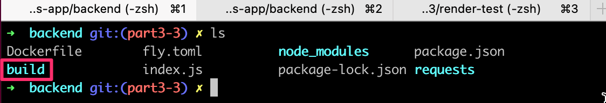

<div class="content">

Em seguida, vamos conectar o front-end que fizemos na [Parte 2](/ptbr/part2) ao nosso próprio back-end.

Na parte anterior, o front-end permitia requisições da lista de notas do json-server que tínhamos como back-end, a partir do endereço http://localhost:3001/notes.
A estrutura de URL do nosso back-end agora é um pouco diferente, pois as notas podem ser encontradas em http://localhost:3001/api/notes. Vamos alterar o atributo __baseUrl__ no <i>src/services/notes.js</i> assim:

```js
import axios from 'axios'
const baseUrl = 'http://localhost:3001/api/notes' //highlight-line

const getAll = () => {
  const request = axios.get(baseUrl)
  return request.then(response => response.data)
}

// ...

export default { getAll, create, update }
```

Porém, agora a requisição GET do front-end para <http://localhost:3001/api/notes> não funciona por algum motivo:


O que está acontecendo aqui? Podemos acessar o back-end através do navegador e do postman sem problemas.

### Política de Mesma Origem e CORS

O problema é uma coisa chamada `Política de Mesma Origem`. A origem de uma URL é definida pela combinação do protocolo (<i>protocol</i>, também conhecido como esquema (<i>scheme</i>)), do nome do host e da porta (<i>port</i>).

```text
http://example.com:80/index.html
  
protocol: http
host: example.com
port: 80
```

Quando você visita um site (ou seja, <http://catwebsites.com>), o navegador emite uma requisição para o servidor em que o site (catwebsites.com) está hospedado. A resposta enviada pelo servidor é um arquivo HTML que pode conter uma ou mais referências a recursos/ativos externos hospedados no mesmo servidor que <i>catwebsites.com</i> está hospedado ou em um site diferente. Quando o navegador vê referência(s) a uma URL no HTML de origem, ele emite uma requisição. Se a requisição for feita usando a URL na qual o HTML de origem foi obtido, o navegador processa a resposta sem problemas. No entanto, se o recurso for obtido usando uma URL que não compartilha a mesma origem (esquema, host, porta) que o HTML de origem, o navegador deverá verificar o cabeçalho de resposta _Access-Control-Allow-origin_ (CORS). Se ele contiver _*_ ou a URL do HTML de origem, o navegador processará a resposta, caso contrário, o navegador se recusará a processá-la e lançará um erro.
  
A <strong>Política de Mesma Origem</strong> é um mecanismo de segurança implementado pelos navegadores para impedir sequestro de sessão (session hijacking), entre outras vulnerabilidades de segurança.

Para permitir requisições legítimas de várias origens (requisições a URLs que não compartilham a mesma origem), a W3C criou um mecanismo chamado <strong>CORS</strong> (Cross-Origin Resource Sharing [Compartilhamento de Recursos de Origem Cruzada]). De acordo com a [Wikipedia](https://en.wikipedia.org/wiki/Cross-origin_resource_sharing):

> <i>Cross-Origin Resource Sharing ou CORS é um mecanismo que permite que recursos restritos em uma página web sejam recuperados por outro domínio fora do domínio ao qual pertence o recurso que será recuperado. Uma página web pode integrar livremente recursos de diferentes origens, como imagens, folhas de estilo, scripts, iframes e vídeos. Certas "requisições de domínio cruzado", em particular as requisições Ajax, são proibidas por padrão pela política de segurança de mesma origem.</i>

O problema é que, por padrão, o código JavaScript de uma aplicação que é executada em um navegador só pode se comunicar com um servidor na mesma [origem](https://developer.mozilla.org/en-US/docs/Web/Security/Same-origin_policy) (origin).
Como nosso servidor está em _localhost, porta 3001_, enquanto nosso front-end está em _localhost, porta 3000_, eles não possuem a mesma origem.

Lembre-se de que a [Política de Mesma Origem](https://developer.mozilla.org/en-US/docs/Web/Security/Same-origin_policy) (same-origin policy) e CORS não são específicos de React ou Node. São princípios universais referentes à operação segura de aplicações web.

Podemos permitir requisições de outras <i>origens</i> usando o <i>middleware</i> [cors](https://github.com/expressjs/cors) do Node.

No repositório do seu back-end, instale o <i>cors</i> com o comando...

```bash
npm install cors
```

... use o <i>middleware</i> e permita requisições de todas as origens:

```js
const cors = require('cors')

app.use(cors())
```

E o front-end funciona! No entanto, a funcionalidade para alternar a importância das notas ainda não foi implementada no back-end.

Você pode ler mais sobre o CORS na página da [Mozilla](https://developer.mozilla.org/en-US/docs/Web/HTTP/CORS).

A configuração de nosso aplicação agora é a seguinte:


A aplicação React sendo executada no navegador agora obtém os dados do servidor node/express que é executado em <em>localhost:3001</em>.

### A Aplicação na Internet

Agora que toda <i>stack</i> está pronta, vamos mover nossa aplicação para a internet.

Há um número cada vez maior de serviços que podem ser usados para hospedar uma aplicação na internet. Serviços voltados a desenvolvedores (developer-friendly services), como o PaaS (Platform as a Service [Plataforma como Serviço]), cuidam da instalação do ambiente de execução (Node.js, por exemplo) e também podem fornecer vários serviços, como bancos de dados.

Durante uma década, [Heroku](http://heroku.com) dominou a cena PaaS. Infelizmente, o plano gratuito do Heroku acabou em 27 de novembro de 2022. Muitos desenvolvedores ficaram tristes com isso, especialmente estudantes. O Heroku ainda é uma opção viável se você estiver disposto a gastar algum dinheiro. Eles também têm [um programa para estudantes](https://www.heroku.com/students) que fornece alguns créditos gratuitos.

Agora estamos apresentando dois serviços: [Fly.io](https://fly.io/) e [Render](https://render.com/), ambos possuem um plano gratuito (limitado). O Fly.io é nosso serviço de hospedagem "oficial", pois pode ser usado com certeza também nas Partes 11 e 13 do curso. O Render será bom pelo menos para as outras partes deste curso.

Observe que, apesar de usar apenas o plano gratuito, o Fly.io <i>pode</i> exigir que você insira suas informações de cartão de crédito. No momento, o Render pode ser usado sem um cartão de crédito.

O Render pode ser um pouco mais fácil de usar, pois não requer a instalação de nenhum software em sua máquina.

Também existem outras opções gratuitas de hospedagem que funcionam bem para este curso, para todas as partes exceto a Parte 11 (CI/CD), que tem um exercício complicado de se fazer em outras plataformas.

Alguns participantes do curso também usaram estes serviços:

- [Railway](https://railway.app/)
- [Cyclic](https://www.cyclic.sh/)
- [Replit](https://replit.com)
- [CodeSandBox](https://codesandbox.io)

Se você conhece outros serviços bons e fáceis de usar para hospedar NodeJS, por favor, nos avise!

Tanto para o Fly.io quanto para o Render, precisamos mudar, no final do arquivo <i>index.js</i>, a definição da porta que nossa aplicação usa:

```js
const PORT = process.env.PORT || 3001  // highlight-line
app.listen(PORT, () => {
  console.log(`Server running on port ${PORT}`)
})
```

Agora estamos usando a porta definida na [variável de ambiente](https://en.wikipedia.org/wiki/Environment_variable) _PORT_ ou a porta 3001 se a variável de ambiente _PORT_ estiver indefinida. O Fly.io e o Render configuram a porta da aplicação com base nessa variável de ambiente.

#### Fly.io

<i>Note que pode ser preciso fornecer seu número de cartão de crédito para o Fly.io, mesmo se estiver usando apenas o plano gratuito!</i> Na verdade, houve relatos conflitantes sobre isso. Fato é que alguns alunos deste curso estão usando o Fly.io sem informar as informações do cartão de crédito. No momento, [Render](https://render.com/) pode ser usado sem um cartão de crédito.

Por padrão, todos recebem duas máquinas virtuais gratuitas que podem ser usadas para executar duas aplicações ao mesmo tempo.

Se você decidir usar o [Fly.io](https://fly.io/), comece instalando seu executável _flyctl_ seguindo [este guia](https://fly.io/docs/hands-on/install-flyctl/). Após isso, você deve [criar uma conta Fly.io](https://fly.io/docs/hands-on/sign-up/).

Comece por [autenticar-se](https://fly.io/docs/hands-on/sign-in/) via linha de comando com o comando:

```bash
fly auth login
```

*Observação:* se o comando _fly_ não funcionar em sua máquina, você pode tentar a versão mais longa _flyctl_. Por exemplo, ambas as formas do comando funcionam no MacOS.

<i>Se você não conseguir fazer o _flyctl_ funcionar em sua máquina, é possível experimentar o Render (veja a próxima seção), que não requer nada a ser instalado em sua máquina.</i>

Inicializa-se uma aplicação executando o seguinte comando no diretório raiz do aplicação:

```bash
fly launch
```

Dê um nome à aplicação ou deixe que o Fly.io gere um automaticamente. Escolha uma região onde a aplicação será executada. Não crie um banco de dados Postgres e não crie um banco de dados Upstash Redis, pois eles não são necessários.

A última pergunta é "Você gostaria de implantar agora? (Would you like to deploy now?)". Devemos responder "não" porque ainda não estamos prontos.

Fly.io cria um arquivo <i>fly.toml</i> na raiz da sua aplicação onde a mesma é configurada. Para colocar a aplicação em funcionamento, <i>talvez</i> precisemos fazer uma pequena adição na parte [env] da configuração:

```bash
[env]
  PORT = "8080" # adicione isto

[experimental]
  auto_rollback = true

[[services]]
  http_checks = []
  internal_port = 8080 
  processes = ["app"]
```

Agora definimos na parte [env] que a variável de ambiente _PORT_ obterá a porta correta (definida na parte [services]) onde a aplicação deve criar o servidor. Observe que a definição pode já estar lá, mas às vezes ela falta.

Agora estamos prontos para implantar (deploy) a aplicação nos servidores Fly.io. Isso é feito com o seguinte comando:

```bash
fly deploy
```

Se tudo correr bem, a aplicação deverá estar em funcionamento. Você pode abri-la no navegador com o comando

```bash
fly open
```

Depois da configuração inicial, quando o código da aplicação for atualizado, poderá ser implantada na produção com o comando:

```bash
fly deploy
```

Um comando particularmente importante é _fly logs_. Este comando pode ser usado para visualizar os logs do servidor. É melhor manter os logs sempre visíveis!

**Atenção:** Em alguns casos (a causa é até agora desconhecida) executar comandos Fly.io, especialmente no Windows WSL, causou problemas. Se o seguinte comando simplesmente travar:

```bash
flyctl ping -o personal
```

seu computador não consegue, por algum motivo, se conectar ao Fly.io. Se isso acontecer com você, [aqui](https://github.com/fullstack-hy2020/misc/blob/master/fly_io_problem.md) encontra-se uma possível maneira de resolver o problema.

Se a saída do comando abaixo se parecer com isto:

```bash
$ flyctl ping -o personal
35 bytes from fdaa:0:8a3d::3 (gateway), seq=0 time=65.1ms
35 bytes from fdaa:0:8a3d::3 (gateway), seq=1 time=28.5ms
35 bytes from fdaa:0:8a3d::3 (gateway), seq=2 time=29.3ms
...
```

então não há problemas de conexão!

#### Render

Este serviço pressupõe que o [login](https://dashboard.render.com/) tenha sido feito com uma conta do GitHub.

Depois de fazer login, vamos criar um novo "Web Service":


O repositório da aplicação é então conectado ao Render:


A conexão parece exigir que o repositório da aplicação seja público.

A seguir, definiremos as configurações básicas. Se a aplicação <i>não</i> estiver na raiz do repositório, o <i>diretório raiz</i> precisa receber um valor apropriado:


Depois disso, a aplicação é iniciada no Render. O painel informa o estado da aplicação e a URL onde ela está sendo executada:


De acordo com a [documentação](https://render.com/docs/deploys), cada confirmação no GitHub deve fazer o redeploy (re-implantar) a aplicação. Por alguma razão, isso nem sempre funciona.

Felizmente, também é possível fazer o redeploy da aplicação manualmente:


Também é possível ver os logs da aplicação no painel:


Observamos nos logs que a aplicação foi iniciada na porta 10000. O código da aplicação obtém a porta correta por meio da variável de ambiente PORT, portanto, é essencial que o arquivo <i>index.js</i> tenha sido atualizado da seguinte maneira:

```js
const PORT = process.env.PORT || 3001  // highlight-line
app.listen(PORT, () => {
  console.log(`Server running on port ${PORT}`)
})
```

### Build de produção do front-end

Até agora, rodamos o código do React em <i>modo de desenvolvimento</i>. No modo de desenvolvimento, a aplicação é configurada para exibir mensagens de erro claras, renderizar imediatamente as mudanças de código para o navegador, e assim por diante.

Quando a aplicação é implantada (deployed), é necessário criar um [build de produção](https://reactjs.org/docs/optimizing-performance.html#use-the-production-build), ou seja, uma versão da aplicação otimizada para produção.

Um build de produção de aplicações gerado com <i>create-react-app</i> pode ser criado com o comando [npm run build](https://github.com/facebookincubator/create-react-app#npm-run-build-or-yarn-build).

Vamos executar esse comando a partir do <i>diretório raiz do projeto front-end de notas</i> que desenvolvemos na [Parte 2](/ptbr/part2).

Isso cria um diretório chamado <i>build</i> (que contém o único arquivo HTML da nossa aplicação, <i>index.html</i>) que contém o diretório <i>static</i>. Uma versão [minificada](<https://en.wikipedia.org/wiki/Minification_(programming)>) do código JavaScript da nossa aplicação será gerada no diretório <i>static</i>. Embora o código da aplicação esteja em vários arquivos, todo o JavaScript será minificado em um arquivo. Todo o código de todas as dependências da aplicação também será minificado neste único arquivo.

O código minificado não é muito legível. O início do código se parece com isso: 

```js
!function(e){function r(r){for(var n,f,i=r[0],l=r[1],a=r[2],c=0,s=[];c<i.length;c++)f=i[c],o[f]&&s.push(o[f][0]),o[f]=0;for(n in l)Object.prototype.hasOwnProperty.call(l,n)&&(e[n]=l[n]);for(p&&p(r);s.length;)s.shift()();return u.push.apply(u,a||[]),t()}function t(){for(var e,r=0;r<u.length;r++){for(var t=u[r],n=!0,i=1;i<t.length;i++){var l=t[i];0!==o[l]&&(n=!1)}n&&(u.splice(r--,1),e=f(f.s=t[0]))}return e}var n={},o={2:0},u=[];function f(r){if(n[r])return n[r].exports;var t=n[r]={i:r,l:!1,exports:{}};return e[r].call(t.exports,t,t.exports,f),t.l=!0,t.exports}f.m=e,f.c=n,f.d=function(e,r,t){f.o(e,r)||Object.defineProperty(e,r,{enumerable:!0,get:t})},f.r=function(e){"undefined"!==typeof Symbol&&Symbol.toStringTag&&Object.defineProperty(e,Symbol.toStringTag,{value:"Module"})
```

### Servindo arquivos estáticos a partir do back-end

Uma opção para implantar o front-end é copiar a versão de produção (o diretório <i>build</i>) para a raiz do repositório back-end e configurar o back-end para mostrar a <i>página principal</i> do front-end (o arquivo <i>build/index.html</i>) como sua página principal.

Começamos copiando o build de produção do front-end para a raiz do back-end. Com um computador Mac ou Linux, a cópia pode ser feita a partir do diretório do front-end com o comando:

```bash
cp -r build ../backend
```

Se estiver usando um computador Windows, é possível usar o comando [copy](https://www.windows-commandline.com/windows-copy-command-syntax-examples/) ou [xcopy](https://www.windows-commandline.com/xcopy-command-syntax-examples/). Caso contrário, basta copiar e colar.

O diretório do back-end deve ficar assim agora:



Para fazer o Express exibir <i>conteúdo estático</i> — a página <i>index.html</i> e o JavaScript, etc. — que ele busca, precisamos de um <i>middleware</i> embutido do Express chamado [static](http://expressjs.com/en/starter/static-files.html).

Quando adicionamos o seguinte código em meio às declarações dos <i>middlewares</i>...

```js
app.use(express.static('build'))
```

... sempre que o Express recebe uma requisição HTTP GET, ele primeiro verifica se o diretório <i>build</i> contém um arquivo correspondente ao endereço da requisição. Se um arquivo correto for encontrado, o Express o retornará.

Agora, as requisições HTTP GET para o endereço <i>www.serversaddress.com/index.html</i> ou <i>www.serversaddress.com</i> mostrarão o front-end do React. As requisições GET para o endereço <i>www.serversaddress.com/api/notes</i> serão gerenciadas pelo código do back-end.

Dada nossa situação atual, pelo fato de tanto o front-end quanto o back-end estarem no mesmo endereço, podemos declarar o _baseUrl_ como uma URL [relativa](https://www.w3.org/TR/WD-html40-970917/htmlweb.html#h-5.1.2) (relative URL). Isso significa que podemos deixar de fora a parte que declara o servidor.

```js
import axios from 'axios'
const baseUrl = '/api/notes' // highlight-line

const getAll = () => {
  const request = axios.get(baseUrl)
  return request.then(response => response.data)
}

// ...
```

Depois da alteração, temos que criar uma nova versão de produção e copiá-la para a raiz do repositório back-end.

A aplicação agora pode ser usada no endereço <http://localhost:3001> do <i>back-end</i>:


Nossa aplicação agora funciona exatamente como o exemplo de [Aplicação de Página Única](/ptbr/part0/fundamentos_de_aplicacoes_web#aplicacao-de-pagina-unica-spa-single-page-application) que estudamos na Parte 0. 

Quando usamos um navegador para acessar o endereço http://localhost:3001, o servidor retorna o arquivo <i>index.html</i> do repositório <i>build</i>. O conteúdo resumido do arquivo é o seguinte:

```html
<head>
  <meta charset="utf-8"/>
  <title>React App</title>
  <link href="/static/css/main.f9a47af2.chunk.css" rel="stylesheet">
</head>
<body>
  <div id="root"></div>
  <script src="/static/js/1.578f4ea1.chunk.js"></script>
  <script src="/static/js/main.104ca08d.chunk.js"></script>
</body>
</html>
```

O arquivo contém instruções para buscar uma folha de estilo CSS que define os estilos da aplicação, e duas tags <i>script</i> que instruem o navegador a buscar o código JavaScript da aplicação — a aplicação React real.

O código React busca notas do endereço do servidor <http://localhost:3001/api/notes> e as renderiza na tela. As comunicações entre o servidor e o navegador podem ser vistas na guia <i>Rede</i> das Ferramentas do Desenvolvedor:


A configuração que está pronta para implantação de produção é a seguinte:


Ao contrário do que acontece quando a aplicação é executada em um ambiente de desenvolvimento, tudo está agora no mesmo back-end Node/Express que é executado em <i>localhost:3001</i>. Quando o navegador vai até a página, o arquivo <i>index.html</i> é renderizado. Isso faz com que o navegador busque o build de produção da aplicação React. Assim que começa a ser executada, ela busca os dados json do endereço <i>localhost:3001/api/notes</i>.

### A aplicação toda na internet

Após garantir que a versão de produção da aplicação funciona localmente, confirme a versão de produção do front-end no repositório do back-end e envie o código para o GitHub novamente.

Se você estiver usando o Render, um "push" para o GitHub <i>pode</i> ser suficiente. Se a implantação automática não funcionar, selecione "manual deploy" (implantação manual) no painel do Render.

No caso do Fly.io, a nova implantação é feita com o comando:

```bash
fly deploy
```

A aplicação funciona perfeitamente, com exceção de que ainda não adicionamos a funcionalidade de alternar a importância de uma nota no back-end.


Nossa aplicação salva as notas em uma variável. Se a aplicação travar ou for reiniciada, todos os dados desaparecerão.

A aplicação precisa de um banco de dados. Antes de introduzirmos um, vamos passar por alguns pontos.

A configuração agora parece assim:


O back-end Node/Express agora reside no servidor Fly.io/Render. Quando o endereço raiz é acessado, o navegador carrega e executa a aplicação React que busca os dados json do servidor Fly.io/Render.

### Otimização da implantação do front-end

Para criar uma nova versão de produção do front-end sem trabalho manual adicional, vamos adicionar alguns scripts npm ao <i>package.json</i> do repositório do back-end.

#### Fly.io

O script fica assim:

```json
{
  "scripts": {
    // ...
    "build:ui": "rm -rf build && cd ../part2-notes/ && npm run build && cp -r build ../notes-backend",
    "deploy": "fly deploy",
    "deploy:full": "npm run build:ui && npm run deploy",    
    "logs:prod": "fly logs"
  }
}
```

O script _npm run build:ui_ constrói o front-end e copia a versão de produção no repositório do back-end. _npm run deploy_ libera a versão atual do back-end para o Fly.io.

_npm run deploy:full_ combina esses dois scripts.

Existe também um script _npm run logs:prod_ para mostrar os logs do Fly.io.

Observe que os caminhos de diretório no script <i>build:ui</i> dependem da localização dos repositórios no sistema de arquivos.

#### Render

No caso do Render, os scripts ficam assim:

```json
{
  "scripts": {
    //...
    "build:ui": "rm -rf build && cd ../frontend && npm run build && cp -r build ../backend",
    "deploy:full": "npm run build:ui && git add . && git commit -m uibuild && git push"
  }
}
```

O script _npm run build:ui_ constrói o front-end e copia a versão de produção no repositório do back-end. _npm run deploy:full_ contém também os comandos necessários <i>git</i> para atualizar o repositório do back-end.

Observe que os caminhos de diretório no script <i>build:ui</i> dependem da localização dos repositórios no sistema de arquivos.

>**Obs.:** No Windows, scripts npm são executados em cmd.exe como o shell padrão que não oferece suporte a comandos bash. Para que os comandos bash acima funcionem, é possível alterar o shell padrão para Bash (na instalação padrão do Git para Windows) da seguinte forma:

```md
npm config set script-shell "C:\\Program Files\\git\\bin\\bash.exe"
```

Outra opção é usar o [shx](https://www.npmjs.com/package/shx).

### Proxy

As alterações no front-end fizeram com que ele não funcionasse mais no modo de desenvolvimento (quando iniciado com o comando _npm start_), pois a conexão com o back-end não funciona.


Isso se deve à alteração do endereço do back-end para um URL relativo:

```js
const baseUrl = '/api/notes'
```

Como no modo de desenvolvimento o front-end está no endereço <i>localhost:3000</i>, as requisições ao back-end vão para o endereço errado <i>localhost:3000/api/notes</i>. O back-end está em <i>localhost:3001</i>.

Esse problema é fácil de resolver se o projeto foi criado com "create-react-app". Basta adicionar a seguinte declaração ao arquivo <i>package.json</i> do repositório do front-end.

```bash
{
  "dependencies": {
    // ...
  },
  "scripts": {
    // ...
  },
  "proxy": "http://localhost:3001"  // highlight-line
}
```

Após a reinicialização, o ambiente de desenvolvimento React funcionará como um [proxy](https://create-react-app.dev/docs/proxying-api-requests-in-development/). Se o código React fizer uma requisição HTTP para um endereço de servidor em <i>http://localhost:3000</i> não gerenciado pela aplicação React em si (ou seja, quando as requisições não se tratam de buscar o CSS ou JavaScript da aplicação), a requisição será redirecionada para o servidor em <i>http://localhost:3001</i>.

Agora o front-end já funciona bem: conecta-se ao servidor tanto no modo de desenvolvimento quanto no de produção.

Um aspecto negativo da nossa abordagem é o quão complicado é implantar o front-end. Implantar uma nova versão requer a geração de um novo build de produção do front-end e a cópia dele para o repositório do back-end. Isso torna a criação de um [pipeline de implantação](https://martinfowler.com/bliki/DeploymentPipeline.html) automatizado mais difícil. Pipeline de implantação refere-se a uma maneira automatizada e controlada de mover o código do computador do desenvolvedor por meio de diferentes testes e verificações de qualidade até o ambiente de produção. A criação de um pipeline de implantação é o tema da [Parte 11](/ptbr/part11) deste curso.

Existem várias maneiras de conseguir fazer isso (por exemplo, colocando o código do back-end e do front-end [no mesmo repositório](https://github.com/mars/heroku-cra-node)), mas não entraremos nesses detalhes agora.

Em algumas situações, é sensato implantar o código do front-end como sua própria aplicação. Fazer isso é [simples](https://github.com/mars/create-react-app-buildpack) com aplicações criadas com "create-react-app".

O código atual do back-end pode ser encontrado no [GitHub](https://github.com/fullstack-hy2020/part3-notes-backend/tree/part3-3), na branch <i>part3-3</i>. As alterações no código do frontend estão na branch <i>part3-1</i> do [repositório do front-end](https://github.com/fullstack-hy2020/part2-notes/tree/part3-1).

</div>

<div class="tasks">

### Exercícios 3.9 a 3.11

Os exercícios a seguir não exigem muitas linhas de código. No entanto, podem ser desafiadores, pois você deve entender exatamente o que e onde está acontecendo, e as configurações devem estar corretas.

#### 3.9: Phonebook backend — 9º passo

Faça com que o back-end funcione com o front-end da lista telefônica dos exercícios da parte anterior. Não implemente a funcionalidade para fazer alterações nos números de telefone ainda, porque isso será implementado no exercício 3.17.

Você provavelmente terá que fazer algumas pequenas alterações no front-end, pelo menos nas URLs para o back-end. Lembre-se de manter o Console do desenvolvedor aberto em seu navegador. Se algumas requisições HTTP falharem, você deve verificar na guia <i>Rede</i> o que está acontecendo. Fique de olho também no console do back-end. Se você não fez o exercício anterior, vale a pena imprimir no console os dados da requisição ou <i>request.body</i> no gerenciador de eventos responsável pelas requisições POST.

#### 3.10: Phonebook backend — 10º passo

Implante o back-end na internet; pode ser no Fly.io ou no Render, por exemplo.

Teste o recém-implantado back-end com um navegador, com o Postman ou com o cliente REST do VS Code para garantir que ele esteja funcionando.

**DICA PRO:** Quando você implantar sua aplicação na internet, é importante pelo menos no início ficar de olho nos logs da aplicação **A TODO MOMENTO**.

Crie um README.md na raiz do seu repositório e adicione um link de acesso à sua aplicação online.

**OBSERVAÇÃO** como dito, o deploy do BACKEND deve ser feito em um serviço de nuvem. Se você estiver usando o Fly.io, o comando deve ser executado no diretório raiz do backend (que é o mesmo diretório onde está o arquivo do backend chamado package.json). No caso de estar usando o Render, o backend deve estar na raiz do seu repositório.

Você NÃO deve fazer o deploy do frontend diretamente nesta parte. O deploy está sendo realizado apenas com o repositório do backend ao longo de toda esta parte do curso.

#### 3.11: Phonebook backend — 11º passo

Gere um build de produção do seu front-end e adicione-o à aplicação na internet utilizando o método introduzido nesta parte.

**Obs.:** Se você usar o Render, certifique-se de que o diretório <i>build</i> não esteja no <i>gitignored</i>.

Certifique-se também de que o front-end ainda funcione localmente (em modo de desenvolvimento quando iniciado com o comando _npm start_).

Se tiver problemas para fazer a aplicação funcionar, certifique-se de que a estrutura do seu diretório corresponda [à aplicação de exemplo](https://github.com/fullstack-hy2020/part3-notes-backend/tree/part3-3).

</div>
