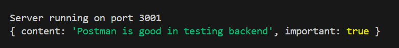
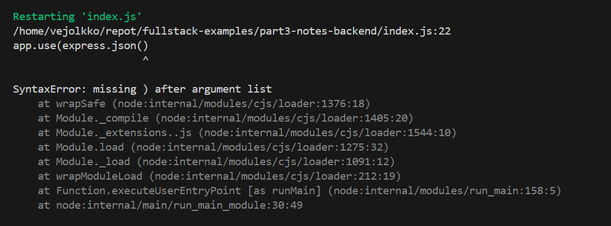
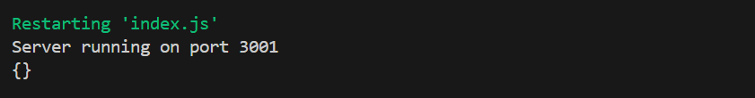

<div class="content">

<!-- In this part our focus shifts towards the backend: that is, towards implementing functionality on the server side of the stack.-->
在这一部分中，我们将重点转向后端，也就是在全栈中的服务端实现功能。

<!-- We will be building our backend on top of [NodeJS](https://nodejs.org/en/), which is a JavaScript runtime based on Google's [Chrome V8](https://developers.google.com/v8/) JavaScript engine.-->
我们将在 [NodeJS](https://nodejs.org/en/) 的基础上建立后端，NodeJS 是一个基于谷歌的 [Chrome V8](https://developers.google.com/v8/) JavaScript 引擎的 JavaScript 运行时。

<!-- This course material was written with version <i>v22.3.0</i> of Node.js. Please make sure that your version of Node is at least as new as the version used in the material (you can check the version by running _node -v_ in the command line). -->
本教材是用 Node.js 的 <i>v22.3.0</i> 版本编写的。请确保你的 Node 版本至少和教材中使用的版本一样新（你可以通过在命令行中运行 _node -v_ 来检查版本）。

<!-- As mentioned in [part 1](/en/part1/java_script), browsers don't yet support the newest features of JavaScript, and that is why the code running in the browser must be <i>transpiled</i> with e.g. [babel](https://babeljs.io/). The situation with JavaScript running in the backend is different. The newest version of Node supports a large majority of the latest features of JavaScript, so we can use the latest features without having to transpile our code.-->
正如[第 1 章节](/zh/part1/java_script)中提到的，浏览器还不支持 JavaScript 的最新功能，因此浏览器中运行的代码必须用例如 [babel](https://babeljs.io/) 进行<i>转译</i>。运行在后端的 JavaScript 的情况则不同。最新版本的 Node 支持绝大部分 JavaScript 的最新特性，所以我们无需转译代码即可使用最新的特性。

<!-- Our goal is to implement a backend that will work with the notes application from [part 2](/en/part2/). However, let's start with the basics by implementing a classic "hello world" application.-->
我们的目标是实现一个能与[第 2 章节](/zh/part2/)中的笔记应用一起运行的后端。然而，让我们从最基础的实现一个经典的“hello world”应用开始。

<!-- **Notice** that the applications and exercises in this part are not all React applications, and we will not use the <i>create vite@latest -- --template react</i> utility for initializing the project for this application. -->
**注意**本章节的应用和练习并不都是 React 应用，因此我们不会用 <i>create vite@latest -- --template react</i> 工具来初始化这些应用的项目。

<!-- We had already mentioned [npm](/en/part2/getting_data_from_server#npm) back in part 2, which is a tool used for managing JavaScript packages. In fact, npm originates from the Node ecosystem.-->
我们在第 2 章节已经提到了 [npm](/zh/part2/获取服务端的数据#npm)，它是一个用于管理 JavaScript 包的工具。事实上，npm 就是从 Node 生态发源的。

<!-- Let's navigate to an appropriate directory, and create a new template for our application with the _npm init_ command. We will answer the questions presented by the utility, and the result will be an automatically generated <i>package.json</i> file at the root of the project that contains information about the project.-->
让我们进入一个合适的目录，用 _npm init_ 命令为应用创建一个模板。回答完 npm 提出的问题后（译注：全部使用默认答案，也就是全部按回车），就会在项目的根目录自动生成一个包含项目信息的 <i>package.json</i> 文件。

```json
{
  "name": "backend",
  "version": "0.0.1",
  "description": "",
  "main": "index.js",
  "scripts": {
    "test": "echo \"Error: no test specified\" && exit 1"
  },
  "author": "Matti Luukkainen",
  "license": "MIT"
}
```

<!-- The file defines, for instance that the entry point of the application is the <i>index.js</i> file.-->
这个文件定义了，例如，应用的入口点是 <i>index.js</i> 文件。

<!-- Let's make a small change to the <i>scripts</i> object by adding a new script command. -->
让我们对 <i>scripts</i> 对象小小地改动一下，添加一条脚本命令。

```json
{
  // ...
  "scripts": {
    "start": "node index.js", // highlight-line
    "test": "echo \"Error: no test specified\" && exit 1"
  },
  // ...
}
```

<!-- Next, let's create the first version of our application by adding an <i>index.js</i> file to the root of the project with the following code:-->
接下来，让我们创建应用的第一个版本，在项目的根目录下添加一个 <i>index.js</i> 文件，代码如下：

```js
console.log('hello world')
```

<!-- We can run the program directly with Node from the command line:-->
我们可以直接用 Node 从命令行中运行该程序：

```bash
node index.js
```

<!-- Or we can run it as an [npm script](https://docs.npmjs.com/misc/scripts):-->
我们也可以用 [npm 脚本](https://docs.npmjs.com/misc/scripts)来运行它：

```bash
npm start
```

<!-- The <i>start</i> npm script works because we defined it in the <i>package.json</i> file:-->
因为我们在 <i>package.json</i> 文件中定义了 <i>start</i> npm 脚本，所以刚才可以运行：

```json
{
  // ...
  "scripts": {
    "start": "node index.js",
    "test": "echo \"Error: no test specified\" && exit 1"
  },
  // ...
}
```

<!-- Even though the execution of the project works when it is started by calling _node index.js_ from the command line, it's customary for npm projects to execute such tasks as npm scripts.-->
尽管可以通过从命令行调用 _node index.js_ 来启动项目，但对于 npm 项目，更习惯用 npm 脚本来执行这些任务。

<!-- By default, the <i>package.json</i> file also defines another commonly used npm script called <i>npm test</i>. Since our project does not yet have a testing library, the _npm test_ command simply executes the following command: -->
默认情况下，<i>package.json</i> 文件还定义了另一个常用的 npm 脚本，叫做 <i>npm test</i>。由于我们的项目还没有测试库，_npm test_ 命令只是简单地执行以下命令：

```bash
echo "Error: no test specified" && exit 1
```

<!-- ### Simple web server -->
### 简单的 web 服务端

<!-- Let's change the application into a web server by editing the _index.js_ files as follow:-->
让我们将应用变成一个网络服务端，将 _index.js_ 文件改成：

```js
const http = require('http')

const app = http.createServer((request, response) => {
  response.writeHead(200, { 'Content-Type': 'text/plain' })
  response.end('Hello World')
})

const PORT = 3001
app.listen(PORT)
console.log(`Server running on port ${PORT}`)
```

<!-- Once the application is running, the following message is printed in the console:-->
一旦应用运行，控制台将打印下列信息：

```bash
Server running on port 3001
```

<!-- We can open our humble application in the browser by visiting the address <http://localhost:3001>:-->
我们可以通过在浏览器中访问地址 <http://localhost:3001> 打开我们的简陋应用。


<!-- The server works the same way regardless of the latter part of the URL. Also the address <http://localhost:3001/foo/bar> will display the same content. -->
无论 URL 后面是什么，服务端的表现都是一样的。地址 <http://localhost:3001/foo/bar> 也将显示相同的内容。

<!-- **NB** If port 3001 is already in use by some other application, then starting the server will result in the following error message: -->
**注** 如果 3001 端口已经被其他应用使用，那么启动服务端会显示以下错误信息：

```bash
➜  hello npm start

> hello@1.0.0 start /Users/mluukkai/opetus/_2019fullstack-code/part3/hello
> node index.js

Server running on port 3001
events.js:167
      throw er; // Unhandled 'error' event
      ^

Error: listen EADDRINUSE :::3001
    at Server.setupListenHandle [as _listen2] (net.js:1330:14)
    at listenInCluster (net.js:1378:12)
```

<!-- You have two options. Either shut down the application using port 3001 (the JSON Server in the last part of the material was using port 3001), or use a different port for this application. -->
你有两个选择。要么关闭使用 3001 端口的应用（教材上一章节的 JSON Server 当时就运行在 3001 端口），要么让这个应用使用不同的端口。

<!-- Let's take a closer look at the first line of the code:-->
让我们仔细看看这段代码的第一行：

```js
const http = require('http')
```

<!-- In the first row, the application imports Node's built-in [web server](https://nodejs.org/docs/latest-v18.x/api/http.html) module. This is practically what we have already been doing in our browser-side code, but with a slightly different syntax: -->
在第一行中，应用导入了 Node 内置的 [web server](https://nodejs.org/docs/latest-v18.x/api/http.html) 模块。这实际上就是我们在浏览器端代码中已经在做的事情，只是语法略有不同：

```js
import http from 'http'
```

<!-- These days, code that runs in the browser uses ES6 modules. Modules are defined with an [export](https://developer.mozilla.org/en-US/docs/Web/JavaScript/Reference/Statements/export) and included in the current file with an [import](https://developer.mozilla.org/en-US/docs/Web/JavaScript/Reference/Statements/import). -->
现在，浏览器中运行的代码都使用 ES6 模块。模块用 [export](https://developer.mozilla.org/en-US/docs/Web/JavaScript/Reference/Statements/export) 来定义，用 [import](https://developer.mozilla.org/en-US/docs/Web/JavaScript/Reference/Statements/import) 来导入到当前文件。

<!-- Node.js uses [CommonJS](https://en.wikipedia.org/wiki/CommonJS) modules. The reason for this is that the Node ecosystem needed modules long before JavaScript supported them in the language specification. Currently, Node also supports the use of ES6 modules, but since the support is not quite perfect yet, we'll stick to CommonJS modules. -->
Node.js 使用的是 [CommonJS](https://en.wikipedia.org/wiki/CommonJS) 模块。其原因是，Node 生态早在 JavaScript 在语言规范中支持模块之前就有对模块的需求了。现在，Node 也支持使用 ES6 模块，但支持还不是很完善，所以我们将继续使用 CommonJS 模块。

<!-- CommonJS modules function almost exactly like ES6 modules, at least as far as our needs in this course are concerned.-->
CommonJS 模块的功能与 ES6 模块几乎完全一样，至少在本课程我们需要用到的地方都一样。

<!-- The next chunk in our code looks like this:-->
代码的下一部分如下所示：

```js
const app = http.createServer((request, response) => {
  response.writeHead(200, { 'Content-Type': 'text/plain' })
  response.end('Hello World')
})
```

<!-- The code uses the _createServer_ method of the [http](https://nodejs.org/docs/latest-v18.x/api/http.html) module to create a new web server. An <i>event handler</i> is registered to the server that is called <i>every time</i> an HTTP request is made to the server's address <http://localhost:3001>. -->
代码使用 [http](https://nodejs.org/docs/latest-v18.x/api/http.html) 模块的 _createServer_ 方法来创建一个网络服务端。服务端注册了一个<i>事件处理函数</i>，<i>每当</i>有 HTTP 请求发送到服务端地址 <http://localhost:3001> 时，就会调用该函数。

<!-- The request is responded to with the status code 200, with the <i>Content-Type</i> header set to <i>text/plain</i>, and the content of the site to be returned set to <i>Hello World</i>.-->
请求会以状态码 200 响应，响应的 <i>Content-Type</i> 标头设为 <i>text/plain</i>，要返回的网站内容设为 <i>Hello World</i>。

<!-- The last rows bind the http server assigned to the _app_ variable, to listen to HTTP requests sent to the port 3001:-->
最后几行将 http 服务端赋值给 _app_ 变量，再绑定到 3001 端口，以监听发送到 3001 端口的 HTTP 请求。

```js
const PORT = 3001
app.listen(PORT)
console.log(`Server running on port ${PORT}`)
```

<!-- The primary purpose of the backend server in this course is to offer raw data in JSON format to the frontend. For this reason, let's immediately change our server to return a hardcoded list of notes in the JSON format: -->
本课程中后端服务端的主要目的是向前端提供 JSON 格式的原始数据。因此，让我们立即改变服务端，让它以 JSON 格式返回一个硬编码的笔记列表。

```js
const http = require('http')

// highlight-start
let notes = [
  {
    id: "1",
    content: "HTML is easy",
    important: true
  },
  {
    id: "2",
    content: "Browser can execute only JavaScript",
    important: false
  },
  {
    id: "3",
    content: "GET and POST are the most important methods of HTTP protocol",
    important: true
  }
]

const app = http.createServer((request, response) => {
  response.writeHead(200, { 'Content-Type': 'application/json' })
  response.end(JSON.stringify(notes))
})
// highlight-end

const PORT = 3001
app.listen(PORT)
console.log(`Server running on port ${PORT}`)
```

<!-- Let's restart the server (you can shut the server down by pressing _Ctrl+C_ in the console) and let's refresh the browser.-->
让我们重启服务端（你可以在控制台中按 _Ctrl+C_ 来关闭服务端），然后刷新浏览器。

<!-- The <i>application/json</i> value in the <i>Content-Type</i> header informs the receiver that the data is in the JSON format. The _notes_ array gets transformed into JSON formatted string with the <em>JSON.stringify(notes)</em> method. This is necessary because the response.end() method expects a string or a buffer to send as the response body. -->
<i>Content-Type</i> 标头中的 <i>application/json</i> 值告诉接收者数据是 JSON 格式的。_notes_ 数组通过 <em>JSON.stringify(notes)</em> 方法转换为 JSON 格式的字符串。这一步是必要的，因为 response.end() 方法只接受一个字符串或缓冲区来作为响应体。

<!-- When we open the browser, the displayed format is exactly the same as in [part 2](/en/part2/getting_data_from_server/) where we used [json-server](https://github.com/typicode/json-server) to serve the list of notes:-->
当我们打开浏览器时，显示的格式与[第 2 章节](/zh/part2/获取服务端的数据)中我们使用 [json-server](https://github.com/typicode/json-server) 来提供的笔记列表完全一样：


### Express

<!-- Implementing our server code directly with Node's built-in [http](https://nodejs.org/docs/latest-v18.x/api/http.html) web server is possible. However, it is cumbersome, especially once the application grows in size. -->
直接用 Node 内置的 [http](https://nodejs.org/docs/latest-v8.x/api/http.html) web server 实现服务端代码是可行的。然而，这很麻烦，特别是一旦应用的规模扩大的话，就更麻烦了。

<!-- Many libraries have been developed to ease server-side development with Node, by offering a more pleasing interface to work with the built-in http module. These libraries aim to provide a better abstraction for general use cases we usually require to build a backend server. By far the most popular library intended for this purpose is [Express](http://expressjs.com). -->
已经有许多简化 Node 的服务端开发的库，这些库提供一个更好用的接口来与内置的 http 模块一起工作。这些库的目的是为我们建立后端服务端通常需要的通用情况提供更好的抽象概念。目前为止，用于这一目的的最流行的库是 [Express](http://expressjs.com)。

<!-- Let's take Express into use by defining it as a project dependency with the command: -->
让我们用下列命令将 Express 定义为项目的依赖项，然后来使用它：

```bash
npm install express
```

<!-- The dependency is also added to our <i>package.json</i> file:-->
这个依赖项也加进了 <i>package.json</i> 文件中：

```json
{
  // ...
  "dependencies": {
    "express": "^5.1.0"
  }
}
```

<!-- The source code for the dependency is installed to the <i>node\_modules</i> directory located in the root of the project. In addition to express, you can find a great amount of other dependencies in the directory:-->
依赖项的源码被安装到项目根目录下的 <i>node\_modules</i> 目录中。除了 Express 之外，你还可以在该目录中找到大量其他的依赖项：


<!-- These are the dependencies of the Express library and the dependencies of all of its dependencies, and so forth. These are called the [transitive dependencies](https://lexi-lambda.github.io/blog/2016/08/24/understanding-the-npm-dependency-model/) of our project. -->
这些实际上是 Express 库的依赖项，以及它所有依赖项的依赖项，等等。这些统称为我们项目的[传递性依赖项](https://lexi-lambda.github.io/blog/2016/08/24/understanding-the-npm-dependency-model/)。

<!-- Version 5.1.0 of Express was installed in our project. What does the caret in front of the version number in <i>package.json</i> mean? -->
项目中安装了 5.1.0 版本的 Express。在 <i>package.json</i> 中版本号前面的脱字号 *^* 是什么意思？

```json
"express": "^5.1.0"
```

<!-- The versioning model used in npm is called [semantic versioning](https://docs.npmjs.com/getting-started/semantic-versioning).-->
npm 中使用的版本模式称为[语义化版本](https://docs.npmjs.com/getting-started/semantic-versioning)。

<!-- The caret in the front of <i>^5.1.0</i> means that if and when the dependencies of a project are updated, the version of Express that is installed will be at least <i>5.1.0</i>. However, the installed version of Express can also have a larger <i>patch</i> number (the last number), or a larger <i>minor</i> number (the middle number). The major version of the library indicated by the first <i>major</i> number must be the same. -->
<i>^5.1.0</i> 前面的脱字符 *^* 意味着将来如果项目的依赖项更新了，安装的 Express 版本最低是 <i>5.1.0</i>。然而，安装的 Express 版本也可以有更大的<i>修订</i>号（最后一个数字），或者更大的<i>次版本</i>号（中间的数字）。第一个<i>主版本</i>数字表示的库的主版本必须是相同的。

<!-- We can update the dependencies of the project with the command:-->
我们可以用下列命令更新项目的依赖项：

```bash
npm update
```

<!-- Likewise, if we start working on the project on another computer, we can install all up-to-date dependencies of the project defined in <i>package.json</i> by running this next command in the project's root directory: -->
同样地，如果我们在另一台电脑上开始这个项目，我们可以在项目的根目录下用以下命令安装 <i>package.json</i> 中定义的项目所有最新的依赖项。

```bash
npm install
```

<!-- If the <i>major</i> number of a dependency does not change, then the newer versions should be [backwards compatible](https://en.wikipedia.org/wiki/Backward_compatibility). This means that if our application happened to use version 5.99.175 of Express in the future, then all the code implemented in this part would still have to work without making changes to the code. In contrast, the future 6.0.0 version of Express may contain changes that would cause our application to no longer work. -->
如果依赖项的<i>主版本</i>号没有改变，那么新版本应该是[向后兼容](https://en.wikipedia.org/wiki/Backward_compatibility)的。这意味着，如果我们的应用将来使用了 5.99.175 版本的 Express，那么本章节中实现的所有代码仍然能正确运行，无需修改。相反，未来 6.0.0 版本的 Express 可能包含会导致我们的应用无法正确运行的更改。

<!-- ### Web and Express -->
### Web 和 Express

<!-- Let's get back to our application and make the following changes:-->
让我们回到我们的应用，并做如下修改：

```js
const express = require('express')
const app = express()

let notes = [
  ...
]

app.get('/', (request, response) => {
  response.send('<h1>Hello World!</h1>')
})

app.get('/api/notes', (request, response) => {
  response.json(notes)
})

const PORT = 3001
app.listen(PORT, () => {
  console.log(`Server running on port ${PORT}`)
})
```

<!-- To get the new version of our application into use, first we have to restart it. -->
为了使用新版本的应用，首先必须重启应用。

<!-- The application did not change a whole lot. Right at the beginning of our code we're importing _express_, which this time is a <i>function</i> that is used to create an express application stored in the _app_ variable:-->
应用并没有发生很大的变化。在代码的开头，我们导入了 _express_，这次 _express_ 是一个<i>函数</i>，用来创建 Express 应用并将其存储在 _app_ 变量中。

```js
const express = require('express')
const app = express()
```

<!-- Next, we define two <i>routes</i> to the application. The first one defines an event handler that is used to handle HTTP GET requests made to the application's <i>/</i> root:-->
接下来，我们为应用定义了两个<i>路由</i>。第一个路由定义了处理向应用的 <i>/</i> 根发送的 HTTP GET 请求的事件处理函数。

```js
app.get('/', (request, response) => {
  response.send('<h1>Hello World!</h1>')
})
```

<!-- The event handler function accepts two parameters. The first [request](http://expressjs.com/en/4x/api.html#req) parameter contains all of the information of the HTTP request, and the second [response](http://expressjs.com/en/4x/api.html#res) parameter is used to define how the request is responded to.-->
该事件处理函数接受两个参数。第一个 [request](http://expressjs.com/en/4x/api.html#req) 参数包含 HTTP 请求的所有信息，第二个 [response](http://expressjs.com/en/4x/api.html#res) 参数用于定义如何对请求进行响应。

<!-- In our code, the request is answered by using the [send](http://expressjs.com/en/4x/api.html#res.send) method of the _response_ object. Calling the method makes the server respond to the HTTP request by sending a response containing the string <code>\<h1>Hello World!\</h1></code> that was passed to the _send_ method. Since the parameter is a string, Express automatically sets the value of the <i>Content-Type</i> header to be <i>text/html</i>. The status code of the response defaults to 200. -->
在我们的代码中，请求是通过使用 _response_ 对象的 [send](http://expressjs.com/en/4x/api.html#res.send) 方法响应的。调用该方法会使服务端响应 HTTP 请求，发送一个响应，内容包含传递给 _send_ 方法的 <code>\<h1>Hello World!\</h1></code> 字符串。由于参数是一个字符串，Express 自动将 <i>Content-Type</i> 标头的值设为 <i>text/html</i>。响应的状态码默认为 200。

<!-- We can verify this from the <i>Network</i> tab in developer tools:-->
我们可以在开发者工具中的<i>网络</i>标签页中验证：


<!-- The second route defines an event handler that handles HTTP GET requests made to the <i>notes</i> path of the application:-->
第二个路由定义了处理向应用的 <i>notes</i> 路径发送的 HTTP GET 请求的事件处理函数。

```js
app.get('/api/notes', (request, response) => {
  response.json(notes)
})
```

<!-- The request is responded to with the [json](http://expressjs.com/en/4x/api.html#res.json) method of the _response_ object. Calling the method will send the __notes__ array that was passed to it as a JSON formatted string. Express automatically sets the <i>Content-Type</i> header with the appropriate value of <i>application/json</i>.-->
请求是用 _response_ 对象的 [json](http://expressjs.com/en/4x/api.html#res.json) 方法响应的。调用该方法将以 JSON 格式的字符串发送传给它的 __notes__ 数组。Express 自动将 <i>Content-Type</i> 标头设为合适值 <i>application/json</i>。


<!-- Next, let's take a quick look at the data sent in the JSON format.-->
接下来，让我们快速浏览一下以 JSON 格式发送的数据。

<!-- In the earlier version where we were only using Node, we had to transform the data into the JSON format with the _JSON.stringify_ method:-->
在先前只使用 Node 的版本中，我们必须用 _JSON.stringify_ 方法将数据转换成 JSON 格式的字符串：

```js
response.end(JSON.stringify(notes))
```

<!-- With express, this is no longer required, because this transformation happens automatically.-->
有了 Express，就不再需要这么做了，这一转换会自动进行。

<!-- It's worth noting that [JSON](https://en.wikipedia.org/wiki/JSON) is a data format. However, it's often represented as a string and is not the same as a JavaScript object, like the value assigned to _notes_. -->
值得注意的是，[JSON](https://en.wikipedia.org/wiki/JSON) 是一种数据格式。然而，它常以字符串形式表示，并且不等同于 JavaScript 对象，比如赋给 _notes_ 的值。

<!-- The experiment shown below illustrates this point:-->
下面的实验说明了这一点：


<!-- The experiment above was done in the interactive [node-repl](https://nodejs.org/docs/latest-v8.x/api/repl.html). You can start the interactive node-repl by typing in _node_ in the command line. The repl is particularly useful for testing how commands work while you're writing application code. I highly recommend this!-->
上面的实验是在交互式 [node-repl](https://nodejs.org/docs/latest-v8.x/api/repl.html) 中完成的。你可以通过在命令行中输入 _node_ 来启动交互式 node-repl。在你写应用代码的时候，这个交互窗口对测试命令是如何运行的特别有用。我强烈推荐这一工具！

<!-- ### Automatic Change Tracking -->
### 自动跟踪更改

<!-- If we change the application's code, we first need to stop the application from the console (_ctrl_ + _c_) and then restart it for the changes to take effect. Restarting feels cumbersome compared to React's smooth workflow, where the browser automatically updates when the code changes. -->
如果我们更改了应用的代码，我们首先需要在终端中停止应用（_ctrl_ + _c_），然后再重启应用来使更改生效。相比 React 代码更改后，浏览器自动重新加载的丝滑的工作流，重启总感觉很麻烦。

<!-- You can make the server track our changes by starting it with the _--watch_ option: -->
你可以通过用 _--watch_ 选项启动应用来让服务端跟踪更改：

```bash
node --watch index.js
```

<!-- Now, changes to the application's code will cause the server to restart automatically. Note that although the server restarts automatically, you still need to refresh the browser. Unlike with React, we do not have, nor could we have, a hot reload functionality that updates the browser in this scenario (where we return JSON data). -->
现在，修改应用代码会自动重启服务端。注意即使服务端能自动重启，你仍然需要刷新浏览器。不同于 React，我们在这种情况（返回的是 JSON 数据）下没有，也无法有自动更新浏览器的热重载功能。

<!-- Let's define a custom <i>npm script</i> in the <i>package.json</i> file to start the development server: -->
让我们在 <i>package.json</i> 文件中自定义一个 <i>npm 脚本</i>来启动开发服务端。

```json
{
  // ..
  "scripts": {
    "start": "node index.js",
    "dev": "node --watch index.js", // highlight-line
    "test": "echo \"Error: no test specified\" && exit 1"
  },
  // ..
}
```

<!-- We can now start the server in development mode with the command -->
我们现在可以用以下命令在开发模式下启动服务端

```bash
npm run dev
```

<!-- Unlike when running the <i>start</i> or <i>test</i> scripts, the command must include <i>run</i>. -->
不同于运行 <i>start</i> 和 <i>test</i> 脚本，在运行 <i>dev</i> 脚本时，必须在命令中加入 <i>run</i>。

### REST

<!-- Let's expand our application so that it provides the same RESTful HTTP API as [json-server](https://github.com/typicode/json-server#routes).-->
让我们扩展我们的应用，使其提供与 [json-server](https://github.com/typicode/json-server#routes) 一样的 RESTful HTTP API。

<!-- Representational State Transfer, aka REST, was introduced in 2000 in Roy Fielding's [dissertation](https://www.ics.uci.edu/~fielding/pubs/dissertation/rest_arch_style.htm). REST is an architectural style meant for building scalable web applications.-->
表现层状态转换（Representational State Transfer），又称 REST，是 Roy Fielding 于 2000 年在[论文](https://www.ics.uci.edu/~fielding/pubs/dissertation/rest_arch_style.htm)中提出的。REST 是一种旨在建立可扩展的 web 应用的架构风格。

<!-- We are not going to dig into Fielding's definition of REST or spend time pondering about what is and isn't RESTful. Instead, we take a more [narrow view](https://en.wikipedia.org/wiki/Representational_state_transfer#Applied_to_web_services) by only concerning ourselves with how RESTful APIs are typically understood in web applications. The original definition of REST is not even limited to web applications. -->
我们不会深入研究 Fielding 对 REST 的定义，也不会花时间琢磨什么是 RESTful，什么不是。我们会把眼光放得[狭隘](https://en.wikipedia.org/wiki/Representational_state_transfer#Applied_to_web_services)点，只关注 web 应用中通常是如何理解 RESTful API 的。REST 的原始定义甚至不限于网络应用。

<!-- We mentioned in the [previous part](/en/part2/altering_data_in_server#rest) that singular things, like notes in the case of our application, are called <i>resources</i> in RESTful thinking. Every resource has an associated URL which is the resource's unique address.-->
我们在[前一章节](/zh/part2/修改服务端的数据#rest)中提到，单个事物，比如我们应用中的笔记，在 RESTful 思想中称为<i>资源</i>。每个资源都有与之相关的 URL，即资源的唯一地址。

<!-- One convention for creating unique addresses is to combine the name of the resource type with the resource's unique identifier. -->
创建资源唯一地址的一个惯例是将资源类型的名称和资源的唯一标识符结合起来。

<!-- Let's assume that the root URL of our service is <i>www.example.com/api</i>.-->
假设我们服务的根 URL 是 <i>www.example.com/api</i>。

<!-- If we define the resource type of note to be <i>notes</i>, then the address of a note resource with the identifier 10, has the unique address <i>www.example.com/api/notes/10</i>.-->
如果我们定义笔记的资源类型为 <i>notes</i>，那么标识符为 10 的笔记资源就有唯一地址 <i>www.example.com/api/notes/10</i>。

<!-- The URL for the entire collection of all note resources is <i>www.example.com/api/notes</i>.-->
所有笔记资源的整个集合的 URL 是 <i>www.example.com/api/notes</i>。

<!-- We can execute different operations on resources. The operation to be executed is defined by the HTTP <i>verb</i>:-->
我们可以对资源执行不同的操作。要执行的操作是通过 HTTP <i>动词</i>定义的：

<!--
| URL                   | verb                | functionality                                                    |
| --------------------- | ------------------- | -----------------------------------------------------------------|
| notes/10              | GET                 | fetches a single resource                                        |
| notes                 | GET                 | fetches all resources in the collection                          |
| notes                 | POST                | creates a new resource based on the request data                 |
| notes/10              | DELETE              | removes the identified resource                                  |
| notes/10              | PUT                 | replaces the entire identified resource with the request data    |
| notes/10              | PATCH               | replaces a part of the identified resource with the request data |
|                       |                     |                                                                  |
-->
| URL                   | 动词                | 功能                             |
| --------------------- | ------------------- | --------------------------------|
| notes/10              | GET                 | 获取单个资源                      |
| notes                 | POST                | 根据请求数据新建一个资源        |
| notes/10              | DELETE              | 删除指定标识符的资源                |
| notes/10              | PUT                 | 将指定标识符的资源整个替换为请求的数据 |
| notes/10              | PATCH               | 将指定标识符的资源部分替换为请求的数据 |
|                       |                     |                                 |

<!-- This is how we manage to roughly define what REST refers to as a [uniform interface](https://en.wikipedia.org/wiki/Representational_state_transfer#Architectural_constraints), which means a consistent way of defining interfaces that makes it possible for systems to cooperate. -->
这就是我们设法粗略定义的 REST 所指的 [统一接口](https://en.wikipedia.org/wiki/Representational_state_transfer#Architectural_constraints)，也就是一种一致的定义接口的方式，从而使不同系统之间可以合作。

<!-- This way of interpreting REST falls under the [second level of RESTful maturity](https://martinfowler.com/articles/richardsonMaturityModel.html) in the Richardson Maturity Model. According to the definition provided by Roy Fielding, we have not defined a [REST API](http://roy.gbiv.com/untangled/2008/rest-apis-must-be-hypertext-driven). In fact, a large majority of the world's purported "REST" APIs do not meet Fielding's original criteria outlined in his dissertation. -->
这种解释 REST 的方式属于 Richardson 成熟度模型中 [RESTful 成熟度的第二级](https://martinfowler.com/articles/richardsonMaturityModel.html)。根据 Roy Fielding 提供的定义，我们定义的还不是 [REST API](http://roy.gbiv.com/untangled/2008/rest-apis-must-be-hypertext-driven)。事实上，世界上绝大部分所谓的“REST” API 都不符合 Fielding 在其论文中列出的原始标准。

<!-- In some places (see e.g. [Richardson, Ruby: RESTful Web Services](http://shop.oreilly.com/product/9780596529260.do)) you will see our model for a straightforward [CRUD](https://en.wikipedia.org/wiki/Create,_read,_update_and_delete) API, being referred to as an example of [resource oriented architecture](https://en.wikipedia.org/wiki/Resource-oriented_architecture) instead of REST. We will avoid getting stuck arguing semantics and instead return to working on our application.-->
在某些地方（例如 [Richardson 的 Ruby: RESTful Web Services](http://shop.oreilly.com/product/9780596529260.do)），你会看到我们直接[增删改查](https://en.wikipedia.org/wiki/Create,_read,_update_and_delete)的 API 模型被称为是[面向资源架构](https://en.wikipedia.org/wiki/Resource-oriented_architecture)的示例，而非 REST 的。我们不要卡在咬文嚼字上，而是回到我们的应用。

<!-- ### Fetching a single resource -->
### 获取单个资源

<!-- Let's expand our application so that it offers a REST interface for operating on individual notes. First let's create a [route](http://expressjs.com/en/guide/routing.html) for fetching a single resource.-->
让我们扩展我们的应用，使其提供一个 REST 接口来操作单个笔记。首先，让我们创建一个用来获取单个资源的[路由](http://expressjs.com/en/guide/routing.html)。

<!-- The unique address we will use for an individual note is of the form <i>notes/10</i>, where the number at the end refers to the note's unique id number.-->
我们将为单个笔记使用的唯一地址的形式是 <i>notes/10</i>，其中末尾的数字指笔记的唯一 id。

<!-- We can define [parameters](http://expressjs.com/en/guide/routing.html#route-parameters) for routes in express by using the colon syntax:-->
在 Express 中，可以用冒号语法来为路由定义[参数](http://expressjs.com/en/guide/routing.html#route-parameters)：

```js
app.get('/api/notes/:id', (request, response) => {
  const id = request.params.id
  const note = notes.find(note => note.id === id)
  response.json(note)
})
```

<!-- Now <code>app.get('/api/notes/:id', ...)</code> will handle all HTTP GET requests that are of the form <i>/api/notes/SOMETHING</i>, where <i>SOMETHING</i> is an arbitrary string.-->
现在 <code>app.get('/api/notes/:id', ...)</code> 将处理所有形式为 <i>/api/notes/SOMETHING</i> 的 HTTP GET 请求，其中 <i>SOMETHING</i> 是一个任意的字符串。

<!-- The <i>id</i> parameter in the route of a request can be accessed through the [request](http://expressjs.com/en/api.html#req) object: -->
请求的路由中的 <i>id</i> 参数可以通过 [request](http://expressjs.com/en/api.html#req) 对象访问：

```js
const id = request.params.id
```

<!-- The now familiar _find_ method of arrays is used to find the note with an id that matches the parameter. The note is then returned to the sender of the request.-->
我们用现在已经熟悉了的数组的 _find_ 方法来寻找 id 与参数匹配的笔记。然后，该笔记被返回给请求的发送方。

<!-- We can now test our application by going to <http://localhost:3001/api/notes/1> in our browser: -->
现在我们可以在浏览器访问 <http://localhost:3001/api/notes/1> 来测试应用了：


<!-- However, there's another problem with our application.-->
然而，我们的应用还有一个问题。

<!-- If we search for a note with an id that does not exist, the server responds with:-->
如果我们搜索一个 id 不存在的笔记，服务端的响应是：


<!-- The HTTP status code that is returned is 200, which means that the response succeeded. There is no data sent back with the response, since the value of the <i>content-length</i> header is 0, and the same can be verified from the browser.-->
返回的 HTTP 状态码是 200，意味着响应成功。由于 <i>content-length</i> 标头的值为 0，所以该响应没有发回数据，这一点也可以从浏览器中验证。

<!-- The reason for this behavior is that the _note_ variable is set to _undefined_ if no matching note is found. The situation needs to be handled on the server in a better way. If no note is found, the server should respond with the status code [404 not found](https://www.rfc-editor.org/rfc/rfc9110.html#name-404-not-found) instead of 200. -->
出现这种行为的原因是，如果没有找到匹配的笔记，会将 _note_ 变量设为 _undefined_。服务端需要以更好的方式来处理这种情况。如果没有找到笔记，服务端应该响应状态码 [404 not found](https://www.rfc-editor.org/rfc/rfc9110.html#name-404-not-found)，而非 200。


<!-- Let's make the following change to our code:-->
让我们对代码做如下修改：

```js
app.get('/api/notes/:id', (request, response) => {
  const id = request.params.id
  const note = notes.find(note => note.id === id)

  // highlight-start
  if (note) {
    response.json(note)
  } else {
    response.status(404).end()
  }
  // highlight-end
})
```


<!-- Since no data is attached to the response, we use the [status](http://expressjs.com/en/4x/api.html#res.status) method for setting the status, and the [end](http://expressjs.com/en/4x/api.html#res.end) method for responding to the request without sending any data.-->
由于响应中没有数据，我们使用 [status](http://expressjs.com/en/4x/api.html#res.status) 方法来设置状态，并使用 [end](http://expressjs.com/en/4x/api.html#res.end) 方法来响应请求，而不发送任何数据。

<!-- The if-condition leverages the fact that all JavaScript objects are [truthy](https://developer.mozilla.org/en-US/docs/Glossary/Truthy), meaning that they evaluate to true in a comparison operation. However, _undefined_ is [falsy](https://developer.mozilla.org/en-US/docs/Glossary/Falsy) meaning that it will evaluate to false.-->
if 条件利用了这样一个事实——所有 JavaScript 对象都是[真值](https://developer.mozilla.org/en-US/docs/Glossary/Truthy)，也就是在比较操作中会被计算为 true。然而，_undefined_ 是[假值](https://developer.mozilla.org/en-US/docs/Glossary/Falsy)，也就是会被计算为 false。

<!-- Our application works and sends the error status code if no note is found. However, the application doesn't return anything to show to the user, like web applications normally do when we visit a page that does not exist. We do not need to display anything in the browser because REST APIs are interfaces that are intended for programmatic use, and the error status code is all that is needed. -->
现在我们的应用能在没有找到笔记的情况下正确运行并发送错误状态码。然而，应用并没有返回任何显示给用户的内容，正如 web 应用在我们访问不存在的页面时通常做的那样。因为 REST API 是用于编程的接口，我们不需要在浏览器中显示任何内容，只需要错误状态码就够了。

<!-- Anyway it's possible to give a clue about reason of sending 404 error by [overriding default NOT FOUND message](https://stackoverflow.com/questions/14154337/how-to-send-a-custom-http-status-message-in-node-express/36507614#36507614).-->
不过，我们可以通过[重载默认的 NOT FOUND 信息](https://stackoverflow.com/questions/14154337/how-to-send-a-custom-http-status-message-in-node-express/36507614#36507614)来提示关于发送 404 错误的原因。

<!-- ### Deleting resources -->
### 删除资源

<!-- Next let's implement a route for deleting resources. Deletion happens by making an HTTP DELETE request to the url of the resource:-->
接下来，让我们实现一个用于删除资源的路由。删除是通过向资源的 URL 发送 HTTP DELETE 请求进行的：

```js
app.delete('/api/notes/:id', (request, response) => {
  const id = request.params.id
  notes = notes.filter(note => note.id !== id)

  response.status(204).end()
})
```

<!-- If deleting the resource is successful, meaning that the note exists and is removed, we respond to the request with the status code [204 no content](https://www.rfc-editor.org/rfc/rfc9110.html#name-204-no-content) and return no data with the response. -->
如果删除资源成功，也就是笔记之前存在并且已删除，我们就以状态码 [204 no content](https://www.rfc-editor.org/rfc/rfc9110.html#name-204-no-content) 响应请求，并且在响应中不返回数据。

<!-- There's no consensus on what status code should be returned to a DELETE request if the resource does not exist. The only two options are 204 and 404. For the sake of simplicity, our application will respond with 204 in both cases. -->
对于资源不存在的情况下应该向 DELETE 请求返回什么状态码，目前还没有达成共识。仅有的两种选择是 204 和 404。为简单起见，我们的应用在这两种情况下都响应 204。

### Postman

<!-- So how do we test the delete operation? HTTP GET requests are easy to make from the browser. We could write some JavaScript for testing deletion, but writing test code is not always the best solution in every situation.-->
那么我们如何测试删除操作呢？HTTP GET 请求可以简单从浏览器发送。我们可以写一些 JavaScript 来测试删除操作，但写测试代码并不在每种情况下都是最佳解决方案。

<!-- Many tools exist for making the testing of backends easier. One of these is a command line program [curl](https://curl.haxx.se). However, instead of curl, we will take a look at using [Postman](https://www.postman.com) for testing the application.-->
有许多方便测试后端的工具。其中之一是命令行程序 [curl](https://curl.haxx.se)。但我们不用 curl，而是来看一下用 [Postman](https://www.postman.com) 来测试应用。

<!-- Let's install the Postman desktop client [from here](https://www.postman.com/downloads/)  and try it out:-->
让我们[从这里](https://www.postman.com/downloads/)安装 Postman 桌面客户端并尝试一下：


<!-- NB: Postman is also available on VS Code which can be downloaded from the Extension tab on the left -> search for Postman -> First result (Verified Publisher) -> Install -->
注：Postman 在 VS Code 中也可用，通过左侧的“扩展”选项卡 -> 搜索 Postman -> 第一个结果（已验证的发布者） -> 下载
<!-- You will then see an extra icon added on the activity bar below the extensions tab. Once you log in, you can follow the steps below  -->
然后你就可以在活动栏的“扩展”选项卡下面看到添加了一个额外的图标。一旦登录，你就可以照着下面的步骤做了

<!-- Using Postman is quite easy in this situation. It's enough to define the url and then select the correct request type (DELETE).-->
在这种情况下使用 Postman 非常简单。只要定义网址，然后选择正确的请求类型（DELETE）就可以了。

<!-- The backend server appears to respond correctly. By making an HTTP GET request to <http://localhost:3001/api/notes> we see that the note with the id 2 is no longer in the list, which indicates that the deletion was successful.-->
后端服务端正确显示了响应。通过向 <http://localhost:3001/api/notes> 发送 HTTP GET 请求，我们看到 id 为 2 的笔记已经不在列表中了，也就表明删除成功了。

<!-- Currently, the notes in the application are hard-coded and not yet saved in a database, so the list of notes will reset to its original state when we restart the application. -->
因为现在应用中的笔记是硬编码的，还没有存进数据库中，所以当重启应用时，笔记的列表将重置回原来的状态。

<!-- ### The Visual Studio Code REST client -->
### Visual Studio Code REST Client

<!-- If you use Visual Studio Code, you can use the VS Code [REST client](https://marketplace.visualstudio.com/items?itemName=humao.rest-client) plugin instead of Postman.-->
如果你使用 Visual Studio Code，你可以使用 VS Code [REST Client](https://marketplace.visualstudio.com/items?itemName=humao.rest-client) 插件来代替 Postman。

<!-- Once the plugin is installed, using it is very simple. We make a directory at the root of application named <i>requests</i>. We save all the REST client requests in the directory as files that end with the <i>.rest</i> extension.-->
一旦插件安装好后，用起来就非常简单。在应用的根目录新建一个名为 <i>requests</i> 的目录。将所有 REST 客户端请求作为以 <i>.rest</i> 扩展名结尾的文件保存进该目录中。

<!-- Let's create a new <i>get\_all\_notes.rest</i> file and define the request that fetches all notes.-->
让我们新建一个 <i>get\_all\_notes.rest</i> 文件并定义获取所有笔记的请求。


<!-- By clicking the <i>Send Request</i> text, the REST client will execute the HTTP request and response from the server is opened in the editor.-->
通过点击 <i>Send Request</i> 文本，REST 客户端将执行 HTTP 请求，然后在编辑器中打开服务端的响应。


<!-- ### The WebStorm HTTP Client -->
### WebStorm HTTP Client

<!-- If you use *IntelliJ WebStorm* instead, you can use a similar procedure with its built-in HTTP Client. Create a new file with extension `.rest` and the editor will display your options to create and run your requests. You can learn more about it by following [this guide](https://www.jetbrains.com/help/webstorm/http-client-in-product-code-editor.html). -->
如果你使用的是 *IntelliJ WebStorm*，你可以用其内置的 HTTP Client 进行类似的步骤。新建一个扩展名为 `.rest` 的文件，编辑器将显示创建和运行请求的选项。你可以按[本指南](https://www.jetbrains.com/help/webstorm/http-client-in-product-code-editor.html)了解更多信息。

<!-- ### Receiving data -->
### 获取数据

<!-- Next, let's make it possible to add new notes to the server. Adding a note happens by making an HTTP POST request to the address <http://localhost:3001/api/notes>, and by sending all the information for the new note in the request [body](https://www.rfc-editor.org/rfc/rfc9112#name-message-body) in JSON format. -->
接下来，让我们实现向服务端添加新笔记的功能。添加笔记是通过向地址 <http://localhost:3001/api/notes> 发送 HTTP POST 请求，并在请求[体](https://www.rfc-editor.org/rfc/rfc9112#name-message-body)中以 JSON 格式发送新笔记的所有信息来完成的。 

<!-- To access the data easily, we need the help of the Express [json-parser](https://expressjs.com/en/api.html) that we can use with the command _app.use(express.json())_. -->
为了方便地访问数据，我们需要借助 Express [json-parser](https://expressjs.com/en/api.html)，可以通过命令 _app.use(express.json())_ 来使用它。

<!-- Let's activate the json-parser and implement an initial handler for dealing with the HTTP POST requests:-->
让我们启用 json-parser 并实现处理 HTTP POST 请求的处理函数的初始版本。

```js
const express = require('express')
const app = express()

app.use(express.json())  // highlight-line

//...

// highlight-start
app.post('/api/notes', (request, response) => {
  const note = request.body
  console.log(note)

  response.json(note)
})
// highlight-end
```


<!-- The event handler function can access the data from the <i>body</i> property of the _request_ object.-->
事件处理函数可以从 _request_ 对象的 <i>body</i> 属性中获取数据。

<!-- Without the json-parser, the <i>body</i> property would be undefined. The json-parser takes the JSON data of a request, transforms it into a JavaScript object and then attaches it to the <i>body</i> property of the _request_ object before the route handler is called. -->
如果没有启用 json-parser，<i>body</i> 属性将是 undefined。json-parser 会获取请求的 JSON 数据，将其转化为 JavaScript 对象，然后在调用路由处理程序之前将该对象附加到 _request_ 对象的 <i>body</i> 属性上。

<!-- For the time being, the application does not do anything with the received data besides printing it to the console and sending it back in the response.-->
目前而言，应用只是将收到的数据打印到控制台并在响应中发回，并没有对数据做任何处理。

<!-- Before we implement the rest of the application logic, let's verify with Postman that the data is in fact received by the server. In addition to defining the URL and request type in Postman, we also have to define the data sent in the <i>body</i>: -->
在我们实现应用的其余逻辑之前，让我们用 Postman 验证服务端是否确实收到了数据。在 Postman 中，除了定义 URL 和请求类型外，我们还必须定义 <i>body</i> 中发送的数据：


<!-- The application prints the data that we sent in the request to the console:-->
应用将我们在请求中发送的数据打印到控制台：



<!-- **NOTE:** When programming the backend, <i>keep the console running the application visible at all times</i>. The development server will restart if changes are made to the code, so by monitoring the console, you will immediately notice if there is an error in the application's code: -->
**注：**在后端编程时，<i>始终保持应用运行的终端可见</i>。任何对代码的更改都会重启开发服务端，所以通过关注控制台，你可以立即注意到应用的代码是否出现了错误。



<!-- Similarly, it is useful to check the console to make sure that the backend behaves as we expect it to in different situations, like when we send data with an HTTP POST request. Naturally, it's a good idea to add lots of <em>console.log</em> commands to the code while the application is still being developed. -->
类似的，检查控制台也很有用，可以确保后端在不同的情况下，比如当我们用 HTTP POST 请求发送数据时，都像我们期望的那样运行。当然，在开发应用时，在代码中添加大量的 <em>console.log</em> 命令也是可取的。

<!-- A potential cause for issues is an incorrectly set <i>Content-Type</i> header in requests. This can happen with Postman if the type of body is not defined correctly:-->
可能造成问题的原因有请求中 <i>Content-Type</i> 标头的值不正确。如果在 Postman 上没有正确定义请求体的类型，这种情况就会发生：


<!-- The <i>Content-Type</i> header is set to <i>text/plain</i>:-->
<i>Content-Type</i> 标头的值会设为 <i>text/plain</i>：


<!-- The server appears to only receive an empty object:-->
服务端显示只收到一个空对象：



<!-- The server will not be able to parse the data correctly without the correct value in the header. It won't even try to guess the format of the data since there's a [massive amount](https://developer.mozilla.org/en-US/docs/Web/HTTP/Basics_of_HTTP/MIME_types) of potential <i>Content-Types</i>. -->
如果标头中没有正确的值，服务端就不能正确解析数据。服务端甚至不会尝试去猜数据的格式，因为 <i>Content-Types</i> 可能的值[太多](https://developer.mozilla.org/en-US/docs/Web/HTTP/Basics_of_HTTP/MIME_types)了。

<!-- If you are using VS Code, then you should install the REST client from the previous chapter <i>now, if you haven't already</i>. The POST request can be sent with the REST client like this:-->
如果你用的是 VS Code，但是<i>还没有安装上一章的 REST Client 的话</i>，那么你应该<i>现在</i>安装。可以这么使用 REST Client 发送 POST 请求：


<!-- We created a new <i>create\_note.rest</i> file for the request. The request is formatted according to the [instructions in the documentation](https://github.com/Huachao/vscode-restclient/blob/master/README.md#usage).-->
我们为请求新建了一个 <i>create\_note.rest</i> 文件。请求的格式按[文档中的说明](https://github.com/Huachao/vscode-restclient/blob/master/README.md#usage)。

<!-- One benefit that the REST client has over Postman is that the requests are handily available at the root of the project repository, and they can be distributed to everyone in the development team. You can also add multiple requests in the same file using `###` separators:-->
REST Client 相较于 Postman 的一个优点是，可以轻松在项目库的根目录获得请求，而且请求可以分发给开发团队的每个人。你还可以在一个文件中用 `###` 分隔符添加多个请求：

```
GET http://localhost:3001/api/notes/

###
POST http://localhost:3001/api/notes/ HTTP/1.1
content-type: application/json

{
    "name": "sample",
    "time": "Wed, 21 Oct 2015 18:27:50 GMT"
}
```

<!-- Postman also allows users to save requests, but the situation can get quite chaotic especially when you're working on multiple unrelated projects.-->
Postman 也允许用户保存请求，但情况可能变得相当混乱，特别是当你在同时处理多个不相关的项目时。

> <!-- **Important sidenote**-->
> **重要的附注**
> <!-- Sometimes when you're debugging, you may want to find out what headers have been set in the HTTP request. One way of accomplishing this is through the [get](http://expressjs.com/en/4x/api.html#req.get) method of the _request_ object, that can be used for getting the value of a single header. The _request_ object also has the <i>headers</i> property, that contains all of the headers of a specific request.-->
> 有时当你在调试时，你可能想找出 HTTP 请求中设了哪些标头。一种方法是通过 _request_ 对象的 [get](http://expressjs.com/en/4x/api.html#req.get) 方法获取单个标头的值。_request_ 对象还有 <i>headers</i> 属性，包含某个请求的所有标头。
> <!-- Problems can occur with the VS REST client if you accidentally add an empty line between the top row and the row specifying the HTTP headers. In this situation, the REST client interprets this to mean that all headers are left empty, which leads to the backend server not knowing that the data it has received is in the JSON format.-->
> 在 VS REST Client 中，如果你不小心在第一行和指定 HTTP 标头的行之间添加了一个空行，就会出现问题。在这种情况下，REST Client 会将其解释为所有的标头都是空的，这会导致后端服务端不知道收到的数据是 JSON 格式的。
> <!-- You will be able to spot this missing <i>Content-Type</i> header if at some point in your code you print all of the request headers with the _console.log(request.headers)_ command.-->
> 如果你在代码中的某处用 _console.log(request.headers)_ 命令打印请求的所有标头，你就能发现 <i>Content-Type</i> 标头丢失。

<!-- Let's return to the application. Once we know that the application receives data correctly, it's time to finalize the handling of the request:-->
让我们回到应用。一旦我们知道应用正确接收了数据，就可以完成处理请求的代码了：

```js
app.post('/api/notes', (request, response) => {
  const maxId = notes.length > 0
    ? Math.max(...notes.map(n => Number(n.id))) 
    : 0

  const note = request.body
  note.id = String(maxId + 1)

  notes = notes.concat(note)

  response.json(note)
})
```

<!-- We need a unique id for the note. First, we find out the largest id number in the current list and assign it to the _maxId_ variable. The id of the new note is then defined as _maxId + 1_ as a string. This method is not recommended, but we will live with it for now as we will replace it soon enough. -->
我们需要给这个笔记一个唯一的 id。首先，我们找出当前列表中最大的 id 号赋值给 _maxId_ 变量。然后将新笔记的 id 定义为 _maxId + 1_ 的字符串形式。这种方法并不推荐，但我们现在先这么用着，我们很快就会换另一种方法。

<!-- The current version still has the problem that the HTTP POST request can be used to add objects with arbitrary properties. Let's improve the application by defining that the <i>content</i> property may not be empty. The <i>important</i> property will be given a default value of false. All other properties are discarded: -->
目前的版本仍有问题，HTTP POST 请求可以用来添加具有任意属性的对象。让我们改进应用，定义 <i>content</i> 属性不得为空。<i>important</i> 属性默认赋 false 值。其他所有属性都丢弃：

```js
const generateId = () => {
  const maxId = notes.length > 0
    ? Math.max(...notes.map(n => Number(n.id)))
    : 0
  return String(maxId + 1)
}

app.post('/api/notes', (request, response) => {
  const body = request.body

  if (!body.content) {
    return response.status(400).json({
      error: 'content missing'
    })
  }

  const note = {
    content: body.content,
    important: body.important || false,
    id: generateId(),
  }

  notes = notes.concat(note)

  response.json(note)
})
```

<!-- The logic for generating the new id number for notes has been extracted into a separate _generateId_ function.-->
为笔记生成新 id 号的逻辑已经提取到专门的 _generateId_ 函数中。

<!-- If the received data is missing a value for the <i>content</i> property, the server will respond to the request with the status code [400 bad request](https://www.rfc-editor.org/rfc/rfc9110.html#name-400-bad-request): -->
如果收到的数据缺失 <i>content</i> 属性的值，服务端将以状态码 [400 bad request](https://www.rfc-editor.org/rfc/rfc9110.html#name-400-bad-request) 响应请求：

```js
if (!body.content) {
  return response.status(400).json({
    error: 'content missing'
  })
}
```

<!-- Notice that calling return is crucial because otherwise the code will execute to the very end and the malformed note gets saved to the application. -->
注意，调用 return 至关重要，否则代码会执行到最后，错误格式的笔记会被保存到应用中。

<!-- If the content property has a value, the note will be based on the received data. -->
如果 content 属性有值，将基于收到的数据新建笔记。

<!-- If the <i>important</i> property is missing, we will default the value to <i>false</i>. The default value is currently generated in a rather odd-looking way:-->
如果 <i>important</i> 属性丢失，我们将默认其值为 <i>false</i>。默认值目前是以一种看起来相当奇怪的方式生成的：

```js
important: body.important || false,
```

<!-- If the data saved in the _body_ variable has the <i>important</i> property, the expression will evaluate its value and convert it to a boolean value. If the property does not exist, then the expression will evaluate to false which is defined on the right-hand side of the vertical lines. -->
如果 _body_ 变量保存的数据有 <i>important</i> 属性，表达式将计算其值并转换为布尔值。如果 <i>important</i> 属性不存在，那么表达式将计算为竖线*||*右侧定义的  false。

<!-- > To be exact, when the <i>important</i> property is <i>false</i>, then the <em>body.important || false</em> expression will in fact return the <i>false</i> from the right-hand side...-->
> 准确地说，当 <i>important</i> 属性为 <i>false</i> 时，<em>body.important || false</em> 表达式实际上返回的是右边的 <i>false</i>……

<!-- You can find the code for our current application in its entirety in the <i>part3-1</i> branch of [this GitHub repository](https://github.com/fullstack-hy2020/part3-notes-backend/tree/part3-1).-->
你可以在[这个 GitHub 仓库](https://github.com/fullstack-hy2020/part3-notes-backend/tree/part3-1)的 <i>part3-1</i> 分支中找到我们当前应用的全部代码。


<!-- If you clone the project, run the _npm install_ command before starting the application with _npm start_ or _npm run dev_.-->
如果你克隆了这个项目，在用 _npm start_ 或 _npm run dev_ 启动应用之前，运行 _npm install_ 命令。

<!-- One more thing before we move onto the exercises. The function for generating IDs looks currently like this:-->
在我们开始练习之前还有一件事。生成 id 的函数目前看起来是这样的：

```js
const generateId = () => {
  const maxId = notes.length > 0
    ? Math.max(...notes.map(n => Number(n.id)))
    : 0
  return String(maxId + 1)
}
```

<!-- The function body contains a row that looks a bit intriguing:-->
函数体包含了一行看起来有点耐人寻味的内容：

```js
Math.max(...notes.map(n => Number(n.id)))
```

<!-- What exactly is happening in that line of code? <em>notes.map(n => Number(n.id))</em> creates a new array that contains all the ids of the notes in number form. [Math.max](https://developer.mozilla.org/en-US/docs/Web/JavaScript/Reference/Global_Objects/Math/max) returns the maximum value of the numbers that are passed to it. However, <em>notes.map(n => Number(n.id))</em> is an <i>array</i> so it can't directly be given as a parameter to _Math.max_. The array can be transformed into individual numbers by using the "three dot" [spread](https://developer.mozilla.org/en-US/docs/Web/JavaScript/Reference/Operators/Spread_syntax) syntax <em>...</em>. -->
这行代码中到底发生了什么？<em>notes.map(n => Number(n.id))</em> 新建了一个包含所有笔记 id 的数字形式的数组。[Math.max](https://developer.mozilla.org/en-US/docs/Web/JavaScript/Reference/Global_Objects/Math/max) 返回传递给它所有数字的最大值。然而，<em>notes.map(n => Number(n.id))</em> 是一个<i>数组</i>，所以它不能直接作为一个参数给 _Math.max_。数组可以通过使用“三点”[展开](https://developer.mozilla.org/en-US/docs/Web/JavaScript/Reference/Operators/Spread_syntax)语法 <em>...</em> 转换为各个数字。

</div>

<div class="tasks">

<!-- ### Exercises 3.1.-3.6. -->
### 练习 3.1.~3.6.

<!-- **NB:** Because this is not a frontend project and we are not working with React, the application <strong>is not created</strong> with create vite@latest -- --template react. You initialize this project with the <em>npm init</em> command that was demonstrated earlier in this part of the material. -->
**注：**因为这不是一个前端项目，我们也没有用 React，所以应用<strong>不是</strong>用 create vite@latest -- --template react <strong>创建</strong>的。用教材本章节前面演示过的 <em>npm init</em> 命令来初始化这个项目。

<!-- **NB:** Because the "node\_modules" is created using "npm init", it will not be excluded when you are trying to add your code to git using "git add .", therefore please create a file called ".gitignore" and write "node\_modules" so that git ignores it everytime you try to add, commit or push to a remote repo.  -->
**注意：**因为“node\_modules”是用“npm init”创建的，所以在你用“git add .”打算让 git 开始跟踪代码时，也会包含这个目录。因此，请创建一个名为“.gitignore”的文件并写入“node\_modules”，以便 git 在你每次尝试添加、提交或推送到远程仓库时都忽略这个目录。

<!-- **Strong recommendation:** When you are working on backend code, always keep an eye on what's going on in the terminal that is running your application.-->
**强烈建议：**当你在处理后端代码时，始终关注应用运行的终端中发生了什么。

<!-- #### 3.1: Phonebook backend step 1 -->
#### 3.1：电话簿后端 第 1 步

<!-- Implement a Node application that returns a hardcoded list of phonebook entries from the address <http://localhost:3001/api/persons>.-->
实现一个从地址 <http://localhost:3001/api/persons> 返回一个电话簿记录的硬编码列表的 Node 应用。

<!-- Data:-->
数据：

```js
[
    { 
      "id": "1",
      "name": "Arto Hellas", 
      "number": "040-123456"
    },
    { 
      "id": "2",
      "name": "Ada Lovelace", 
      "number": "39-44-5323523"
    },
    { 
      "id": "3",
      "name": "Dan Abramov", 
      "number": "12-43-234345"
    },
    { 
      "id": "4",
      "name": "Mary Poppendieck", 
      "number": "39-23-6423122"
    }
]
```

<!-- Output in browser after GET request:-->
GET 请求后浏览器中的输出：


<!-- Notice that the forward slash in the route <i>api/persons</i> is not a special character, and is just like any other character in the string.-->
注意路由 <i>api/persons</i> 中的正斜杠不是特殊字符，它和字符串中的其他字符一样。

<!-- The application must be started with the command _npm start_.-->
应用必须用 _npm start_ 命令启动。

<!-- The application must also offer an _npm run dev_ command that will run the application and restart the server whenever changes are made and saved to a file in the source code.-->
应用还必须提供一个 _npm run dev_ 命令来运行应用，并在源代码文件发生更改并保存时重启服务端。

<!-- #### 3.2: Phonebook backend step 2 -->
#### 3.2：电话簿 第 2 步

<!-- Implement a page at the address <http://localhost:3001/info> that looks roughly like this:-->
在地址 <http://localhost:3001/info> 上实现一个类似这样的页面：


<!-- The page has to show the time that the request was received and how many entries are in the phonebook at the time of processing the request.-->
该页面必须显示收到请求的时间，以及处理请求时，电话簿中有多少记录。

<!-- #### 3.3: Phonebook backend step 3 -->
#### 3.3：电话簿 第 3 步

<!-- Implement the functionality for displaying the information for a single phonebook entry. The url for getting the data for a person with the id 5 should be <http://localhost:3001/api/persons/5>-->
实现显示单个电话簿记录的信息的功能。获取 id 为 5 的人的数据的 URL 应该是 <http://localhost:3001/api/persons/5>

<!-- If an entry for the given id is not found, the server has to respond with the appropriate status code.-->
如果没有找到给定 id 的记录，服务端必须响应合适的状态码。

<!-- #### 3.4: Phonebook backend step 4 -->
#### 3.4：电话簿后端 第 4 步

<!-- Implement functionality that makes it possible to delete a single phonebook entry by making an HTTP DELETE request to the unique URL of that phonebook entry.-->
实现可以通过向电话簿记录的唯一 URL 发送 HTTP DELETE 请求来删除单个电话簿条目的功能。

<!-- Test that your functionality works with either Postman or the Visual Studio Code REST client.-->
用 Postman 或 Visual Studio Code REST Client 测试你的功能是否正确。

<!-- #### 3.5: Phonebook backend step 5 -->
#### 3.5：电话簿后端 第 5 步

<!-- Expand the backend so that new phonebook entries can be added by making HTTP POST requests to the address <http://localhost:3001/api/persons>.-->
扩展后端，使得可以通过向地址 <http://localhost:3001/api/persons> 发送 HTTP POST 请求添加电话簿记录。

<!-- Generate a new id for the phonebook entry with the [Math.random](https://developer.mozilla.org/en-US/docs/Web/JavaScript/Reference/Global_Objects/Math/random) function. Use a big enough range for your random values so that the likelihood of creating duplicate ids is small.-->
用 [Math.random](https://developer.mozilla.org/en-US/docs/Web/JavaScript/Reference/Global_Objects/Math/random) 函数为添加的电话簿记录生成一个新 id。让随机值的范围足够大，这样创建重复 id 的可能性就足够小。

<!-- #### 3.6: Phonebook backend step 6 -->
#### 3.6: 电话簿后端 第 6 步

<!-- Implement error handling for creating new entries. The request is not allowed to succeed, if:-->
实现新建记录的错误处理。如果出现下列情况，则请求失败：
<!-- - The name or number is missing-->
- 名字或号码缺失
<!-- - The name already exists in the phonebook-->
- 名字已经存在于电话簿中

<!-- Respond to requests like these with the appropriate status code, and also send back information that explains the reason for the error, e.g.:-->
对于这样的请求，用适当的状态码响应，同时发回解释错误原因的信息，例如：

```js
{ error: 'name must be unique' }
```

</div>

<div class="content">

<!-- ### About HTTP request types -->
### 关于 HTTP 请求类型

<!-- [The HTTP standard](https://www.rfc-editor.org/rfc/rfc9110.html#name-common-method-properties) talks about two properties related to request types, **safety** and **idempotency**. -->
[HTTP 标准](https://www.rfc-editor.org/rfc/rfc9110.html#name-common-method-properties)提到了关于请求类型的两个属性：**安全性**和**幂等性**。

<!-- The HTTP GET request should be <i>safe</i>:-->
HTTP GET 请求应该是<i>安全的</i>：

<!-- > <i>In particular, the convention has been established that the GET and HEAD methods SHOULD NOT have the significance of taking an action other than retrieval. These methods ought to be considered "safe".</i>-->
> <i>特别是已经约定俗成的，GET 和 HEAD 方法<strong>不应</strong>具有除获取数据以外的任何意义。GET 和 HEAD 方法应被认为是“安全的”。</i>

<!-- Safety means that the executing request must not cause any <i>side effects</i> on the server. By side effects, we mean that the state of the database must not change as a result of the request, and the response must only return data that already exists on the server. -->
安全性意味着执行这类请求不能在服务端引起任何<i>副作用</i>。这里的副作用是指数据库的状态不能因请求而改变，而且响应必须只返回服务端上已有的数据。

<!-- Nothing can ever guarantee that a GET request is <i>safe</i>, this is just a recommendation that is defined in the HTTP standard. By adhering to RESTful principles in our API, GET requests are always used in a way that they are <i>safe</i>. -->
还没有办法能保证 GET 请求是<i>安全的</i>，这只是 HTTP 标准定义的一个建议。通过在 API 中遵守 RESTful 原则，就总能以<i>安全</i>的方式使用 GET 请求。

<!-- The HTTP standard also defines the request type [HEAD](https://www.rfc-editor.org/rfc/rfc9110.html#name-head), which ought to be safe. In practice, HEAD should work exactly like GET but it does not return anything but the status code and response headers. The response body will not be returned when you make a HEAD request. -->
HTTP 标准定义的请求类型中，应该是安全的还有 [HEAD](https://www.rfc-editor.org/rfc/rfc9110.html#name-head)。实际上，HEAD 的效果应该与 GET 完全一样，但不返回除状态码和响应标头外的任何信息。当你发送 HEAD 请求时，不会有响应体返回。

<!-- All HTTP requests except POST should be <i>idempotent</i>:-->
除了 POST，所有 HTTP 请求都应该是<i>幂等的</i>。

<!-- > <i>Methods can also have the property of "idempotence" in that (aside from error or expiration issues) the side-effects of N > 0 identical requests is the same as for a single request. The methods GET, HEAD, PUT and DELETE share this property</i>-->
> <i> 方法也可以具有“幂等性”，即（除了错误或过期的问题） N > 0 个相同的请求的副作用与单个请求的副作用相同。GET、HEAD、PUT 和 DELETE 方法都有这一属性</i>

<!-- This means that if a request does generate side effects, then the result should be the same regardless of how many times the request is sent. -->
这意味着如果一个请求确实会产生副作用，那么无论发送多少次该请求，结果都应该是一样的。

<!-- If we make an HTTP PUT request to the URL <i>/api/notes/10</i> and with the request we send the data <em>{ content: "no side effects!", important: true }</em>, the result is the same regardless of how many times the request is sent. -->
如果我们向 URL <i>/api/notes/10</i> 发送 HTTP PUT 请求，并随请求发送数据 <em>{ content:"no side effects!", important: true }</em>，那么无论发送多少次请求，结果都应该是一样的。

<!-- Like <i>safety</i> for the GET request, <i>idempotence</i> is also just a recommendation in the HTTP standard and not something that can be guaranteed simply based on the request type. However, when our API adheres to RESTful principles, then GET, HEAD, PUT, and DELETE requests are used in such a way that they are idempotent.-->
和 GET 请求的<i>安全性</i>一样，<i>幂等性</i>也只是 HTTP 标准中的一个建议，并不是简单根据请求类型就能保证的。然而，当我们的 API 遵守 RESTful 原则时，就能以幂等的方式使用 GET、HEAD、PUT 和 DELETE 请求。

<!-- POST is the only HTTP request type that is neither <i>safe</i> nor <i>idempotent</i>. If we send 5 different HTTP POST requests to <i>/api/notes</i> with a body of <em>{content: "many same", important: true}</em>, the resulting 5 notes on the server will all have the same content.-->
POST 是唯一的既不<i>安全</i>也不<i>幂等</i>的 HTTP 请求类型。如果我们向 <i>/api/notes</i> 发送 5 个 HTTP POST 请求，每个请求的请求体都是 <em>{content:"many same", important: true}</em>，那么服务端会产生 5 个相同内容的笔记。

<!-- ### Middleware -->
### 中间件

<!-- The Express [json-parser](https://expressjs.com/en/api.html) used earlier is a [middleware](http://expressjs.com/en/guide/using-middleware.html). -->
之前使用的 Express [json-parser](https://expressjs.com/en/api.html) 是一个[中间件](http://expressjs.com/en/guide/using-middleware.html)。

<!-- Middleware are functions that can be used for handling _request_ and _response_ objects.-->
中间件是可以用来处理 _request_ 和 _response_ 对象的函数。

<!-- The json-parser we used earlier takes the raw data from the requests that are stored in the _request_ object, parses it into a JavaScript object and assigns it to the _request_ object as a new property <i>body</i>. -->
我们之前使用的 json-parser 从请求中获取存储在 _request_ 对象中的原始数据，将其解析为一个 JavaScript 对象，并将其赋值给 _request_ 对象作为其新属性 <i>body</i>。

<!-- In practice, you can use several middlewares at the same time. When you have more than one, they're executed one by one in the order that they were listed in the application code. -->
实际上，你可以同时使用多个中间件。当你有多个中间件时，它们会按照应用代码中的顺序一个一个地执行。

<!-- Let's implement our own middleware that prints information about every request that is sent to the server.-->
让我们来实现我们自己的中间件，来打印出发送到服务端的每个请求的信息。

<!-- Middleware is a function that receives three parameters:-->
中间件是一个接收三个参数的函数：

```js
const requestLogger = (request, response, next) => {
  console.log('Method:', request.method)
  console.log('Path:  ', request.path)
  console.log('Body:  ', request.body)
  console.log('---')
  next()
}
```

<!-- At the end of the function body the _next_ function that was passed as a parameter is called. The _next_ function yields control to the next middleware.-->
函数体在最后调用了作为参数传递的 _next_ 函数。_next_ 函数将控制权交给下一个中间件。

<!-- Middleware are taken into use like this:-->
中间件是这样用的：

```js
app.use(requestLogger)
```

<!-- Remember, middleware functions are called in the order that they're encountered by the JavaScript engine. Notice that _json-parser_ is listed before _requestLogger_ , because otherwise <i>request.body</i> will not be initialized when the logger is executed! -->
记住，中间件函数是按照 JavaScript 引擎遇到它们的顺序调用的。注意 _json-parser_ 要放在 _requestLogger_ 之前，否则在执行 _requestLogger_ 的时候，<i>request.body</i> 还没有初始化！

<!-- Middleware functions have to be used before routes when we want them to be executed by the route event handlers. Sometimes, we want to use middleware functions after routes. We do this when the middleware functions are only called if no route handler processes the HTTP request. -->
如果我们想让路由事件处理函数执行中间件函数，那么就必须在路由之前使用这些中间件函数。有时，我们想在路由之后才使用中间件函数。我们只在没有路由处理函数处理 HTTP 请求时才会调用路由之后的中间件函数。

<!-- Let's add the following middleware after our routes. This middleware will be used for catching requests made to non-existent routes. For these requests, the middleware will return an error message in the JSON format. -->
让我们在路由之后添加以下中间件，用于捕捉向不存在的路由发出的请求。对于这些请求，中间件将返回一个 JSON 格式的错误信息。

```js
const unknownEndpoint = (request, response) => {
  response.status(404).send({ error: 'unknown endpoint' })
}

app.use(unknownEndpoint)
```

<!-- You can find the code for our current application in its entirety in the <i>part3-2</i> branch of [this GitHub repository](https://github.com/fullstack-hy2020/part3-notes-backend/tree/part3-2).-->
你可以在[这个 GitHub 仓库](https://github.com/fullstack-hy2020/part3-notes-backend/tree/part3-2)的 <i>part3-2</i> 分支中找到我们当前应用的全部代码。

</div>

<div class="tasks">

<!-- ### Exercises 3.7.-3.8. -->
### 练习 3.7.~3.8.

<!-- #### 3.7: Phonebook backend step 7 -->
#### 3.7：电话簿后端 第 7 步

<!-- Add the [morgan](https://github.com/expressjs/morgan) middleware to your application for logging. Configure it to log messages to your console based on the <i>tiny</i> configuration.-->
将 [morgan](https://github.com/expressjs/morgan) 中间件添加到你的应用中来记录日志。将 morgan 配置成按 <i>tiny</i> 配置项将信息记录到你的控制台。

<!-- The documentation for Morgan is not the best, and you may have to spend some time figuring out how to configure it correctly. However, most documentation in the world falls under the same category, so it's good to learn to decipher and interpret cryptic documentation in any case.-->
morgan 的文档并非最好，你可能需要花一些时间来弄清楚如何正确配置它。然而，世界上的大多数文档都是这个样子，所以无论如何，学会理解和解释难解的文档都是件好事。

<!-- Morgan is installed just like all other libraries with the _npm install_ command. Taking morgan into use happens the same way as configuring any other middleware by using the _app.use_ command.-->
安装 morgan 的方式和其他所有库一样，都是用 _npm install_ 命令。使用 morgan 的方式和其他所有中间件一样，都是用 _app.use_ 命令。

<!-- #### 3.8*: Phonebook backend step 8 -->
#### 3.8*：电话簿后端 第 8 步

<!-- Configure morgan so that it also shows the data sent in HTTP POST requests:-->
配置 morgan，使它也显示 HTTP POST 请求中发送的数据：


<!-- Note that logging data even in the console can be dangerous since it can contain sensitive data and may violate local privacy law (e.g. GDPR in EU) or business-standard. In this exercise, you don't have to worry about privacy issues, but in practice, try not to log any sensitive data.-->
注意记录数据是危险的，即使是记录到控制台中也如此，因为数据中可能包含敏感数据，从而可能违反当地的隐私法规（如欧盟的 GDPR）或商业标准。在这道练习中，你不必担心隐私问题，但在工作中，尽量不要记录任何敏感数据。

<!-- This exercise can be quite challenging, even though the solution does not require a lot of code.-->
这个练习可能相当有挑战性，尽管答案不需要大量的代码。

<!-- This exercise can be completed in a few different ways. One of the possible solutions utilizes these two techniques:-->
这道练习可以用几种不同的方式完成。一种解法是利用这两项技巧：
<!-- - [creating new tokens](https://github.com/expressjs/morgan#creating-new-tokens)-->
- [新建词法单元](https://github.com/expressjs/morgan#creating-new-tokens)
<!-- - [JSON.stringify](https://developer.mozilla.org/en-US/docs/Web/JavaScript/Reference/Global_Objects/JSON/stringify)-->
- [JSON.stringify](https://developer.mozilla.org/en-US/docs/Web/JavaScript/Reference/Global_Objects/JSON/stringify)

</div>
