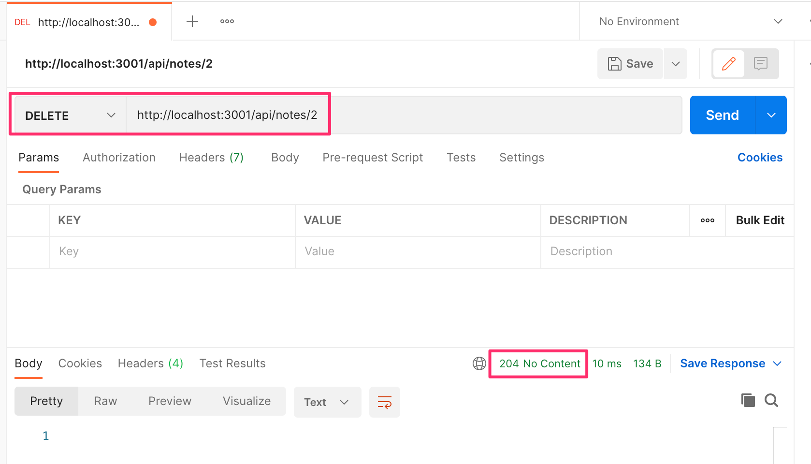
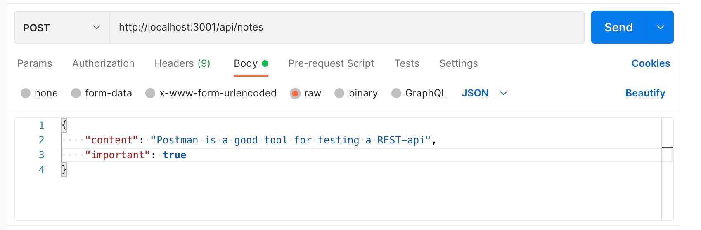
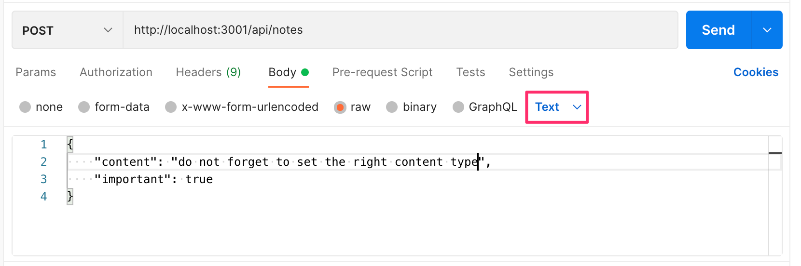
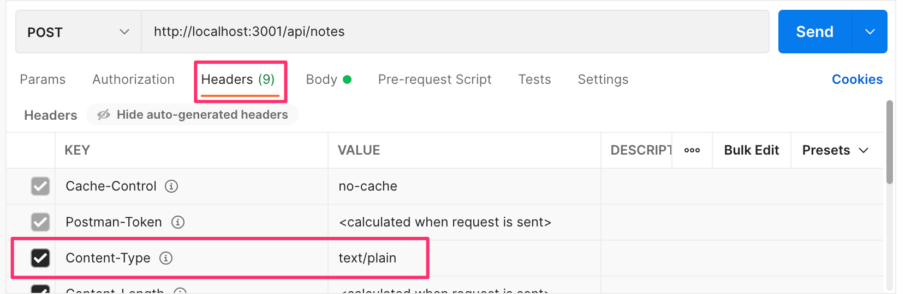

<div class="content">


<!-- In this part our focus shifts towards the backend: that is, towards implementing functionality on the server side of the stack.-->
 在这一部分中，我们的重点转向后端：也就是说，在堆栈的服务器端实现功能。


<!-- We will be building our backend on top of [NodeJS](https://nodejs.org/en/), which is a JavaScript runtime based on Google's [Chrome V8](https://developers.google.com/v8/) JavaScript engine.-->
我们将在 [NodeJS](https://nodejs.org/en/) 的基础上建立我们的后端，这是一个基于谷歌 [Chrome V8](https://developers.google.com/v8/) JavaScript 引擎的 JavaScript 运行时间。


<!-- This course material was written with the version <i>16.13.2</i> of Node.js. Please make sure that your version of Node is at least as new as the version used in the material (you can check the version by running _node -v_ in the command line).-->
 本课程材料是用 Node.js 的 <i>16.13.2</i> 版本编写的。请确保你的 Node 版本至少和教材中使用的版本一样新（你可以通过在命令行中运行 _node -v_ 来检查版本）。


<!-- As mentioned in [part 1](/en/part1/java_script), browsers don't yet support the newest features of JavaScript, and that is why the code running in the browser must be <i>transpiled</i> with e.g. [babel](https://babeljs.io/). The situation with JavaScript running in the backend is different. The newest version of Node supports a large majority of the latest features of JavaScript, so we can use the latest features without having to transpile our code.-->
 正如在 [第一章节](/en/part1/java_script) 中提到的，浏览器还不支持 JavaScript 的最新功能，这就是为什么在浏览器中运行的代码必须用例如 [babel](https://babeljs.io/) 进行 <i> 转写 </i>。在后端运行的 JavaScript 的情况则不同。最新版本的 Node 支持 JavaScript 的绝大部分最新特性，所以我们可以使用最新的特性，而不必转译我们的代码。


<!-- Our goal is to implement a backend that will work with the notes application from [part 2](/en/part2/). However, let's start with the basics by implementing a classic "hello world" application.-->
 我们的目标是实现一个能与 [第二章节](/en/part2/) 中的笔记应用一起工作的后端。然而，让我们从最基本的开始，实现一个经典的 "hello world " 应用。


<!-- **Notice** that the applications and exercises in this part are not all React applications, and we will not use the <i>create-react-app</i> utility for initializing the project for this application.-->
 **注意** 本章节的应用和练习并不都是 React 应用，而且我们不会使用 <i>create-react-app</i> 工具来初始化这个应用的项目。


<!-- We had already mentioned [npm](/en/part2/getting_data_from_server#npm) back in part 2, which is a tool used for managing JavaScript packages. In fact, npm originates from the Node ecosystem.-->
 我们在第二章节已经提到了 [npm](/en/part2/getting_data_from_server#npm)，它是一个用于管理 JavaScript 包的工具。事实上，npm 起源于 Node 生态系统。


<!-- Let's navigate to an appropriate directory, and create a new template for our application with the _npm init_ command. We will answer the questions presented by the utility, and the result will be an automatically generated <i>package.json</i> file at the root of the project that contains information about the project.-->
 让我们导航到一个合适的目录，用 _npm init_ 命令为我们的应用创建一个新模板。我们将回答该工具提出的问题，结果是在项目的根部自动生成一个包含项目信息的 <i>package.json</i> 文件。

```json
{
  "name": "backend",
  "version": "0.0.1",
  "description": "",
  "main": "index.js",
  "scripts": {
    "test": "echo \"Error: no test specified\" && exit 1"
  },
  "author": "Matti Luukkainen",
  "license": "MIT"
}
```


<!-- The file defines, for instance that the entry point of the application is the <i>index.js</i> file.-->
 该文件定义了，比如说，应用的入口点是 <i>index.js</i> 文件。


<!-- Let's make a small change to the <i>scripts</i> object:-->
 让我们对 <i>scripts</i> 对象做一个小小的改动。

```bash
{
  // ...
  "scripts": {
    "start": "node index.js", // highlight-line
    "test": "echo \"Error: no test specified\" && exit 1"
  },
  // ...
}
```


<!-- Next, let's create the first version of our application by adding an <i>index.js</i> file to the root of the project with the following code:-->
 接下来，让我们创建我们应用的第一个版本，在项目的根部添加一个 <i>index.js</i> 文件，代码如下。

```js
console.log('hello world')
```


<!-- We can run the program directly with Node from the command line:-->
 我们可以直接用 Node 从命令行中运行该程序。

```bash
node index.js
```


<!-- Or we can run it as an [npm script](https://docs.npmjs.com/misc/scripts):-->
 或者我们可以作为一个[npm脚本](https://docs.npmjs.com/misc/scripts)运行它。

```bash
npm start
```


<!-- The <i>start</i> npm script works because we defined it in the <i>package.json</i> file:-->
 <i>start</i> npm 脚本可以工作，因为我们在 <i>package.json</i> 文件中定义了它。

```bash
{
  // ...
  "scripts": {
    "start": "node index.js",
    "test": "echo \"Error: no test specified\" && exit 1"
  },
  // ...
}
```


<!-- Even though the execution of the project works when it is started by calling _node index.js_ from the command line, it's customary for npm projects to execute such tasks as npm scripts.-->
 尽管项目的执行在通过从命令行调用 _node index.js_ 来启动时是有效的，但 npm 项目习惯于以 npm 脚本来执行这样的任务。


<!-- By default the <i>package.json</i> file also defines another commonly used npm script called <i>npm test</i>. Since our project does not yet have a testing library, the _npm test_ command simply executes the following command:-->
 默认情况下，<i>package.json</i> 文件也定义了另一个常用的 npm 脚本，叫做< i>npm test</i>。由于我们的项目还没有一个测试库，_npm test_ 命令只是简单地执行以下命令。

```bash
echo "Error: no test specified" && exit 1
```


### Simple web server


<!-- Let's change the application into a web server by editing the _index.js_ files as follow:-->
 让我们通过编辑 _index.js_ 文件，将应用变成一个网络服务器，如下所示。

```js
const http = require('http')

const app = http.createServer((request, response) => {
  response.writeHead(200, { 'Content-Type': 'text/plain' })
  response.end('Hello World')
})

const PORT = 3001
app.listen(PORT)
console.log(`Server running on port ${PORT}`)
```

<!-- Once the application is running, the following message is printed in the console:-->
 一旦应用运行，下面的信息将被打印在控制台。

```bash
Server running on port 3001
```

<!-- We can open our humble application in the browser by visiting the address <http://localhost:3001>:-->
 我们可以通过访问 <http://localhost:3001> 地址，在浏览器中打开我们卑微的应用。


<!-- In fact, the server works the same way regardless of the latter part of the URL. Also the address <http://localhost:3001/foo/bar> will display the same content.-->
 事实上，无论 URL 的后半部分是什么，服务器的工作方式都是一样的。同样，地址 <http://localhost:3001/foo/bar> 将显示相同的内容。


<!-- **NB** if the port 3001 is already in use by some other application, then starting the server will result in the following error message:-->
 **NB*如果 3001 端口已经被其他应用使用，那么启动服务器将导致以下错误信息。

```bash
➜  hello npm start

> hello@1.0.0 start /Users/mluukkai/opetus/_2019fullstack-code/part3/hello
> node index.js

Server running on port 3001
events.js:167
      throw er; // Unhandled 'error' event
      ^

Error: listen EADDRINUSE :::3001
    at Server.setupListenHandle [as _listen2] (net.js:1330:14)
    at listenInCluster (net.js:1378:12)
```


<!-- You have two options. Either shut down the application using the port 3001 (the json-server in the last part of the material was using the port 3001), or use a different port for this application.-->
 你有两个选择。要么关闭使用 3001 端口的应用（材料最后部分的 json-server 使用的是 3001 端口），要么为这个应用使用一个不同的端口。

<!-- Let's take a closer look at the first line of the code:-->
 让我们仔细看看这段代码的第一行。

```js
const http = require('http')
```

<!-- In the first row, the application imports Node's built-in [web server](https://nodejs.org/docs/latest-v8.x/api/http.html) module. This is practically what we have already been doing in our browser-side code, but with a slightly different syntax:-->
 在第一行中，应用导入了 Node 的内置 [网络服务器](https://nodejs.org/docs/latest-v8.x/api/http.html) 模块。这实际上就是我们在浏览器端代码中已经在做的事情，但语法略有不同。

```js
import http from 'http'
```

<!-- These days, code that runs in the browser uses ES6 modules. Modules are defined with an [export](https://developer.mozilla.org/en-US/docs/Web/JavaScript/Reference/Statements/export) and taken into use with an [import](https://developer.mozilla.org/en-US/docs/Web/JavaScript/Reference/Statements/import).-->
 如今，在浏览器中运行的代码都使用 ES6 模块。模块用 [export](https://developer.mozilla.org/en-US/docs/Web/JavaScript/Reference/Statements/export) 来定义，用 [import](https://developer.mozilla.org/en-US/docs/Web/JavaScript/Reference/Statements/import) 来使用。

<!-- However, Node.js uses so-called [CommonJS](https://en.wikipedia.org/wiki/CommonJS) modules. The reason for this is that the Node ecosystem had a need for modules long before JavaScript supported them in the language specification. Node supports now also the use of ES6 modules, but since the support is yet [not quite perfect](https://nodejs.org/api/esm.html#modules-ecmascript-modules) we'll stick to CommonJS modules.-->
 然而，Node.js 使用所谓的 [CommonJS](https://en.wikipedia.org/wiki/CommonJS) 模块。其原因是，早在 JavaScript 在语言规范中支持模块之前，Node 生态系统就有了对模块的需求。Node 现在也支持使用 ES6 模块，但由于支持还 [不是很完善](https://nodejs.org/api/esm.html#modules-ecmascript-modules)，我们将坚持使用 CommonJS 模块。

<!-- CommonJS modules function almost exactly like ES6 modules, at least as far as our needs in this course are concerned.-->
 CommonJS 模块的功能几乎与 ES6 模块完全一样，至少就我们在本课程中的需求而言是如此。

<!-- The next chunk in our code looks like this:-->
我们的代码中的下一块如下所示：

```js
const app = http.createServer((request, response) => {
  response.writeHead(200, { 'Content-Type': 'text/plain' })
  response.end('Hello World')
})
```

<!-- The code uses the _createServer_ method of the [http](https://nodejs.org/docs/latest-v8.x/api/http.html) module to create a new web server. An <i>event handler</i> is registered to the server that is called <i>every time</i>  an HTTP request is made to the server's address http://localhost:3001.-->
 该代码使用 [http](https://nodejs.org/docs/latest-v8.x/api/http.html) 模块的 _createServer_ 方法来创建一个新的网络服务器。一个 <i> 事件处理程序 </i> 被注册到服务器上，<i>每当</i> HTTP 请求被发送到服务器的地址 <http://localhost:3001>，该程序就会被调用。


<!-- The request is responded to with the status code 200, with the <i>Content-Type</i> header set to <i>text/plain</i>, and the content of the site to be returned set to <i>Hello World</i>.-->
 该请求被响应，状态代码为 200，<i>Content-Type</i> 头设置为 <i>text/plain</i>，要返回的网站内容设置为 <i>Hello World</i>。


<!-- The last rows bind the http server assigned to the _app_ variable, to listen to HTTP requests sent to the port 3001:-->
 最后几行绑定了分配给 _app_ 变量的 http 服务器，以监听发送到 3001 端口的 HTTP 请求。

```js
const PORT = 3001
app.listen(PORT)
console.log(`Server running on port ${PORT}`)
```


<!-- The primary purpose of the backend server in this course is to offer raw data in the JSON format to the frontend. For this reason, let's immediately change our server to return a hardcoded list of notes in the JSON format:-->
 本课程中后端服务器的主要目的是向前端提供 JSON 格式的原始数据。出于这个原因，让我们立即改变我们的服务器以 JSON 格式返回一个硬编码的笔记列表。

```js
const http = require('http')

// highlight-start
let notes = [
  {
    id: 1,
    content: "HTML is easy",
    date: "2022-05-30T17:30:31.098Z",
    important: true
  },
  {
    id: 2,
    content: "Browser can execute only Javascript",
    date: "2022-05-30T18:39:34.091Z",
    important: false
  },
  {
    id: 3,
    content: "GET and POST are the most important methods of HTTP protocol",
    date: "2022-05-30T19:20:14.298Z",
    important: true
  }
]

const app = http.createServer((request, response) => {
  response.writeHead(200, { 'Content-Type': 'application/json' })
  response.end(JSON.stringify(notes))
})
// highlight-end

const PORT = 3001
app.listen(PORT)
console.log(`Server running on port ${PORT}`)
```

<!-- Let's restart the server (you can shut the server down by pressing _Ctrl+C_ in the console) and let's refresh the browser.-->
 让我们重新启动服务器（你可以在控制台中按 _Ctrl+C_ 来关闭服务器），让我们刷新浏览器。

<!-- The <i>application/json</i> value in the <i>Content-Type</i> header informs the receiver that the data is in the JSON format. The _notes_ array gets transformed into JSON with the <em>JSON.stringify(notes)</em> method.-->
 在 <i>Content-Type</i> 头中的 <i>application/json</i> 值通知接收者，数据是 JSON 格式的。_notes_ 数组通过 <em>JSON.stringify(notes)</em> 方法被转换为 JSON。

<!-- When we open the browser, the displayed format is exactly the same as in [part 2](/en/part2/getting_data_from_server/) where we used [json-server](https://github.com/typicode/json-server) to serve the list of notes:-->
 当我们打开浏览器时，显示的格式与 [第二章节](/en/part2/getting_data_from_server/) 中完全一样，在那里我们使用 [json-server](https://github.com/typicode/json-server) 来提供笔记的列表。


### Express

<!-- Implementing our server code directly with Node's built-in [http](https://nodejs.org/docs/latest-v8.x/api/http.html) web server is possible. However, it is cumbersome, especially once the application grows in size.-->
 用 Node 内置的 [http](https://nodejs.org/docs/latest-v8.x/api/http.html) 网络服务器直接实现我们的服务器代码是可行的。然而，这很麻烦，特别是一旦应用的规模扩大。

<!-- Many libraries have been developed to ease server side development with Node, by offering a more pleasing interface to work with the built-in http module. These libraries aim to provide a better abstraction for general use cases we usually require to build a backend server. By far the most popular library intended for this purpose is [express](http://expressjs.com).-->
 许多库已经被开发出来，通过提供一个更讨人喜欢的接口来与内置的 http 模块一起工作，从而缓解 Node 的服务器端开发。这些库的目的是为我们通常需要建立后端服务器的一般使用情况提供一个更好的抽象。到目前为止，用于这一目的的最流行的库是 [express](http://expressjs.com)。

<!-- Let's take express into use by defining it as a project dependency with the command:-->
 让我们用命令将 express 定义为项目的依赖关系来使用它。

```bash
npm install express
```

<!-- The dependency is also added to our <i>package.json</i> file:-->
 这个依赖关系也被添加到我们的 <i>package.json</i> 文件中。

```json
{
  // ...
  "dependencies": {
    "express": "^4.17.2"
  }
}

```


<!-- The source code for the dependency is installed to the <i>node\_modules</i> directory located in the root of the project. In addition to express, you can find a great amount of other dependencies in the directory:-->
 该依赖的源代码被安装到位于项目根部的 <i>node/modules</i> 目录中。除了 express 之外，你还可以在该目录中找到大量的其他依赖关系。


<!-- These are in fact the dependencies of the express library, and the dependencies of all of its dependencies, and so forth. These are called the [transitive dependencies](https://lexi-lambda.github.io/blog/2016/08/24/understanding-the-npm-dependency-model/) of our project.-->
 这些实际上是 express 库的依赖关系，以及它所有的依赖关系，等等。这些被称为我们项目的 [transitive dependencies](https://lexi-lambda.github.io/blog/2016/08/24/understanding-the-npm-dependency-model/)。


<!-- The version 4.17.2. of express was installed in our project. What does the caret in front of the version number in <i>package.json</i> mean?-->
 我们的项目中安装了 4.17.2. 版本的 express。在 <i>package.json</i> 中版本号前面的圆点是什么意思？

```json
"express": "^4.17.2"
```


<!-- The versioning model used in npm is called [semantic versioning](https://docs.npmjs.com/getting-started/semantic-versioning).-->
 npm 中使用的版本管理模式被称为 [语义版本管理](https://docs.npmjs.com/getting-started/semantic-versioning)。


<!-- The caret in the front of <i>^4.17.2</i> means that if and when the dependencies of a project are updated, the version of express that is installed will be at least <i>4.17.2</i>. However, the installed version of express can also be one that has a larger <i>patch</i> number (the last number), or a larger <i>minor</i> number (the middle number). The major version of the library indicated by the first <i>major</i> number must be the same.-->
 <i>^4.17.2</i> 前面的圆点意味着如果项目的依赖关系被更新，所安装的 express 版本将至少是 <i>4.17.2</i>。然而，安装的 express 版本也可以是具有更大的 <i>patch</i> 号（最后一个数字），或者更大的 <i>minor</i> 号（中间的数字）。第一个 <i>major</i> 数字所表示的库的主要版本必须是相同的。


<!-- We can update the dependencies of the project with the command:-->
 我们可以用命令更新项目的依赖关系。

```bash
npm update
```

<!-- Likewise, if we start working on the project on another computer, we can install all up-to-date dependencies of the project defined in <i>package.json</i> with the command:-->
 同样地，如果我们在另一台电脑上开始做这个项目，我们可以用命令安装 <i>package.json</i> 中定义的项目的所有最新的依赖项。

```bash
npm install
```

<!-- If the <i>major</i> number of a dependency does not change, then the newer versions should be [backwards compatible](https://en.wikipedia.org/wiki/Backward_compatibility). This means that if our application happened to use version 4.99.175 of express in the future, then all the code implemented in this part would still have to work without making changes to the code. In contrast, the future 5.0.0. version of express [may contain](https://expressjs.com/en/guide/migrating-5.html) changes that would cause our application to no longer work.-->
 如果一个依赖项的 <i>major</i> 号没有改变，那么较新的版本应该是 [向后兼容](https://en.wikipedia.org/wiki/Backward_compatibility)。这意味着，如果我们的应用在未来碰巧使用了 4.99.175 版本的 Express，那么这部分实现的所有代码仍然要工作，而无需对代码进行修改。相反，未来的 5.0.0. 版本的 express[可能包含](https://expressjs.com/en/guide/migrating-5.html) 变化，会导致我们的应用不再工作。

### Web and express

<!-- Let's get back to our application and make the following changes:-->
 让我们回到我们的应用，并做如下修改。

```js
const express = require('express')
const app = express()

let notes = [
  ...
]

app.get('/', (request, response) => {
  response.send('<h1>Hello World!</h1>')
})

app.get('/api/notes', (request, response) => {
  response.json(notes)
})

const PORT = 3001
app.listen(PORT, () => {
  console.log(`Server running on port ${PORT}`)
})
```


<!-- In order to get the new version of our application into use, we have to restart the application.-->
为了让我们的应用的新版本投入使用，我们必须重新启动应用。


<!-- The application did not change a whole lot. Right at the beginning of our code we're importing _express_, which this time is a <i>function</i> that is used to create an express application stored in the _app_ variable:-->
 应用并没有发生很大的变化。就在我们代码的开头，我们导入了 _express_，这次是一个 <i> 函数 </i>，用来创建一个存储在 _app_ 变量中的 Express 应用。

```js
const express = require('express')
const app = express()
```


<!-- Next, we define two <i>routes</i> to the application. The first one defines an event handler that is used to handle HTTP GET requests made to the application's <i>/</i> root:-->
 接下来，我们定义两个通往应用的 <i> 路径 </i>。第一个定义了一个事件处理程序，用来处理对应用 <i>/</i> 根的 HTTP GET 请求。

```js
app.get('/', (request, response) => {
  response.send('<h1>Hello World!</h1>')
})
```


<!-- The event handler function accepts two parameters. The first [request](http://expressjs.com/en/4x/api.html#req) parameter contains all of the information of the HTTP request, and the second [response](http://expressjs.com/en/4x/api.html#res) parameter is used to define how the request is responded to.-->
 该事件处理函数接受两个参数。第一个 [request](http://expressjs.com/en/4x/api.html#req) 参数包含 HTTP 请求的所有信息，第二个 [response](http://expressjs.com/en/4x/api.html#res) 参数用于定义如何对请求进行响应。


<!-- In our code, the request is answered by using the [send](http://expressjs.com/en/4x/api.html#res.send) method of the _response_ object. Calling the method makes the server respond to the HTTP request by sending a response containing the string <code>\<h1>Hello World!\</h1></code> that was passed to the _send_ method. Since the parameter is a string, express automatically sets the value of the <i>Content-Type</i> header to be <i>text/html</i>. The status code of the response defaults to 200.-->
 在我们的代码中，请求是通过使用 _response_ 对象的 [send](http://expressjs.com/en/4x/api.html#res.send) 方法回答的。调用该方法使服务器响应 HTTP 请求，发送一个响应，其中包含传递给 _send_ 方法的字符串 <code><h1>Hello World！</h1></code>。由于参数是一个字符串，Express 自动将 <i>Content-Type</i> 头的值设置为 <i>text/html</i>。响应的状态代码默认为 200。


<!-- We can verify this from the <i>Network</i> tab in developer tools:-->
 我们可以从开发者工具中的 <i> 网络 </i> 标签来验证这一点。


<!-- The second route defines an event handler that handles HTTP GET requests made to the <i>notes</i> path of the application:-->
 第二个路由定义了一个事件处理程序，处理向应用的 <i>notes</i> 路径发出的 HTTP GET 请求。

```js
app.get('/api/notes', (request, response) => {
  response.json(notes)
})
```


<!-- The request is responded to with the [json](http://expressjs.com/en/4x/api.html#res.json) method of the _response_ object. Calling the method will send the __notes__ array that was passed to it as a JSON formatted string. Express automatically sets the <i>Content-Type</i> header with the appropriate value of <i>application/json</i>.-->
 该请求用 _response_ 对象的 [json](http://expressjs.com/en/4x/api.html#res.json) 方法来响应。调用该方法将发送传给它的 __notes__ 数组，作为 JSON 格式的字符串。Express 自动将 <i>Content-Type</i> 头设置为 <i>application/json</i> 的适当值。


<!-- Next, let's take a quick look at the data sent in the JSON format.-->
 接下来，让我们快速浏览一下以 JSON 格式发送的数据。

<!-- In the earlier version where we were only using Node, we had to transform the data into the JSON format with the _JSON.stringify_ method:-->
 在早期版本中，我们只使用 Node，我们必须用 _JSON.stringify_ 方法将数据转换成 JSON 格式。

```js
response.end(JSON.stringify(notes))
```


<!-- With express, this is no longer required, because this transformation happens automatically.-->
 有了 Express，这就不再需要了，因为这种转换会自动发生。


<!-- It's worth noting that [JSON](https://en.wikipedia.org/wiki/JSON) is a string, and not a JavaScript object like the value assigned to _notes_.-->
 值得注意的是，[JSON](https://en.wikipedia.org/wiki/JSON) 是一个字符串，而不是像分配给 _notes_ 的值那样的一个 JavaScript 对象。


<!-- The experiment shown below illustrates this point:-->
 下面的实验说明了这一点。


<!-- The experiment above was done in the interactive [node-repl](https://nodejs.org/docs/latest-v8.x/api/repl.html). You can start the interactive node-repl by typing in _node_ in the command line. The repl is particularly useful for testing how commands work while you're writing application code. I highly recommend this!-->
 上面的实验是在交互式 [node-repl](https://nodejs.org/docs/latest-v8.x/api/repl.html) 中完成的。你可以通过在命令行中输入 _node_ 来启动交互式 node-repl。在你写应用代码的时候，这个副本对于测试命令如何工作特别有用。我强烈建议这样做 !

### nodemon

<!-- If we make changes to the application's code we have to restart the application in order to see the changes. We restart the application by first shutting it down by typing _Ctrl+C_ and then restarting the application. Compared to the convenient workflow in React where the browser automatically reloaded after changes were made, this feels slightly cumbersome.-->
 如果我们对应用的代码做了修改，我们必须重新启动应用，以便看到这些修改。我们重启应用的方法是：首先通过输入 _Ctrl+C_ 来关闭它，然后再重启应用。与 React 中方便的工作流程相比，即浏览器在发生变化后自动重新加载，这感觉有点麻烦。

<!-- The solution to this problem is [nodemon](https://github.com/remy/nodemon):-->
 解决这个问题的方法是 [nodemon](https://github.com/remy/nodemon)。

<!-- > <i>nodemon will watch the files in the directory in which nodemon was started, and if any files change, nodemon will automatically restart your node application.</i>-->
 > <i>nodemon 将观察 nodemon 启动时所在目录中的文件，如果有任何文件发生变化，nodemon 将自动重启你的 node 应用。


<!-- Let's install nodemon by defining it as a <i>development dependency</i> with the command:-->
 让我们用命令将 nodemon 定义为一个 <i> 开发依赖项 </i> 来安装它。

```bash
npm install --save-dev nodemon
```

<!-- The contents of <i>package.json</i> have also changed:-->
 <i>package.json</i> 的内容也有变化。

```json
{
  //...
  "dependencies": {
    "express": "^4.17.2",
  },
  "devDependencies": {
    "nodemon": "^2.0.15"
  }
}
```


<!-- If you accidentally used the wrong command and the nodemon dependency was added under "dependencies" instead of "devDependencies", then manually change the contents of <i>package.json</i> to match what is shown above.-->
 如果你不小心用错了命令，nodemon 依赖被添加到了 "dependencies " 下，而不是 "devDependencies " 下，那么请手动修改 <i>package.json</i> 的内容，以符合上面的内容。


<!-- By development dependencies, we are referring to tools that are needed only during the development of the application, e.g. for testing or automatically restarting the application, like <i>nodemon</i>.-->
 我们所说的开发依赖，指的是只在应用的开发过程中需要的工具，例如用于测试或自动重启应用，如 <i>nodemon</i>。


<!-- These development dependencies are not needed when the application is run in production mode on the production server (e.g. Heroku).-->
当应用在生产服务器（如 Heroku）上以生产模式运行时，不需要这些开发依赖性。


<!-- We can start our application with <i>nodemon</i> like this:-->
 我们可以像这样用 <i>nodemon</i> 启动我们的应用。

```bash
node_modules/.bin/nodemon index.js
```


<!-- Changes to the application code now cause the server to restart automatically. It's worth noting that even though the backend server restarts automatically, the browser still has to be manually refreshed. This is because unlike when working in React, we don't have the [hot reload](https://gaearon.github.io/react-hot-loader/getstarted/) functionality needed to automatically reload the browser.-->
现在对应用代码的修改会导致服务器自动重新启动。值得注意的是，即使后端服务器自动重启，浏览器仍然需要手动刷新。这是因为与在 React 中工作时不同，我们没有自动重新加载浏览器所需的 [hot reload](https://gaearon.github.io/react-hot-loader/getstarted/) 功能。


<!-- The command is long and quite unpleasant, so let's define a dedicated <i>npm script</i> for it in the <i>package.json</i> file:-->
 这个命令很长，而且很不讨人喜欢，所以让我们在 <i>package.json</i> 文件中为它定义一个专门的 <i>npm 脚本 </i>。

```bash
{
  // ..
  "scripts": {
    "start": "node index.js",
    "dev": "nodemon index.js",  // highlight-line
    "test": "echo \"Error: no test specified\" && exit 1"
  },
  // ..
}
```


<!-- In the script there is no need to specify the <i>node\_modules/.bin/nodemon</i> path to nodemon, because _npm_ automatically knows to search for the file from that directory.-->
 在脚本中不需要指定 nodemon 的 <i>node/_modules/.bin/nodemon</i> 路径，因为 _npm_ 自动知道从该目录中搜索该文件。


<!-- We can now start the server in the development mode with the command:-->
 我们现在可以用命令在开发模式下启动服务器。

```bash
npm run dev
```


<!-- Unlike with the <i>start</i> and <i>test</i> scripts, we also have to add <i>run</i> to the command.-->
 与 <i>start</i> 和 <i>test</i> 脚本不同，我们还必须在命令中加入 <i>run</i>。


### REST


<!-- Let's expand our application so that it provides the same RESTful HTTP API as [json-server](https://github.com/typicode/json-server#routes).-->
 让我们扩展我们的应用，使其提供与 [json-server](https://github.com/typicode/json-server#routes) 一样的 RESTful HTTP API。


<!-- Representational State Transfer, aka REST, was introduced in 2000 in Roy Fielding's [dissertation](https://www.ics.uci.edu/~fielding/pubs/dissertation/rest_arch_style.htm). REST is an architectural style meant for building scalable web applications.-->
 Representational State Transfer，又称 REST，于 2000 年在 Roy Fielding 的 [论文](https://www.ics.uci.edu/~fielding/pubs/dissertation/rest_arch_style.htm) 中提出。REST 是一种架构风格，旨在建立可扩展的网络应用。


<!-- We are not going to dig into Fielding's definition of REST or spend time pondering about what is and isn't RESTful. Instead, we take a more [narrow view](https://en.wikipedia.org/wiki/Representational_state_transfer#Applied_to_web_services) by only concerning ourselves with how RESTful APIs are typically understood in web applications. The original definition of REST is in fact not even limited to web applications.-->
 我们不打算深入研究 Fielding 对 REST 的定义，也不打算花时间去思考什么是 RESTful 和什么不是。相反，我们将采取一个更 [狭窄的观点](https://en.wikipedia.org/wiki/Representational_state_transfer#Applied_to_web_services)，只关注 RESTful APIs 在网络应用中的典型理解。事实上，REST 的原始定义甚至不限于网络应用。


<!-- We mentioned in the [previous part](/en/part2/altering_data_in_server#rest) that singular things, like notes in the case of our application, are called <i>resources</i> in RESTful thinking. Every resource has an associated URL which is the resource's unique address.-->
 我们在 [前一部分](/en/part2/altering_data_in_server#rest) 中提到，在 RESTful 思想中，单一的东西，如我们应用中的笔记，被称为 <i> 资源 </i>。每个资源都有一个相关的 URL，这是资源的唯一地址。


<!-- One convention is to create the unique address for resources by combining the name of the resource type with the resource's unique identifier.-->
 一个惯例是通过结合资源类型的名称和资源的唯一标识符来创建资源的唯一地址。


<!-- Let's assume that the root URL of our service is <i>www.example.com/api</i>.-->
 让我们假设我们的服务的根 URL 是 <i>www.example.com/api</i>。


<!-- If we define the resource type of note to be <i>notes</i>, then the address of a note resource with the identifier 10, has the unique address <i>www.example.com/api/notes/10</i>.-->
 如果我们把笔记的资源类型定义为 <i> 笔记 </i>，那么标识符为 10 的笔记资源的地址就有唯一的地址 <i>www.example.com/api/notes/10</i>。


<!-- The URL for the entire collection of all note resources is <i>www.example.com/api/notes</i>.-->
 所有笔记资源的整个集合的 URL 是 <i>www.example.com/api/notes</i>。


<!-- We can execute different operations on resources. The operation to be executed is defined by the HTTP <i>verb</i>:-->
我们可以对资源执行不同的操作。要执行的操作是由 HTTP <i>verb</i> 定义的。

| URL                   | verb                | functionality                                                    |
| --------------------- | ------------------- | -----------------------------------------------------------------|
| notes/10              | GET                 | fetches a single resource                                        |
| notes                 | GET                 | fetches all resources in the collection                          |
| notes                 | POST                | creates a new resource based on the request data                 |
| notes/10              | DELETE              | removes the identified resource                                  |
| notes/10              | PUT                 | replaces the entire identified resource with the request data    |
| notes/10              | PATCH               | replaces a part of the identified resource with the request data |
|                       |                     |                                                                  |


<!-- This is how we manage to roughly define what REST refers to as a [uniform interface](https://en.wikipedia.org/wiki/Representational_state_transfer#Architectural_constraints), which means a consistent way of defining interfaces that makes it possible for systems to co-operate.-->
 这就是我们如何设法粗略地定义 REST 所指的 [统一接口](https://en.wikipedia.org/wiki/Representational_state_transfer#Architectural_constraints)，这意味着一种定义接口的一致方式，使系统有可能合作。


<!-- This way of interpreting REST falls under the [second level of RESTful maturity](https://martinfowler.com/articles/richardsonMaturityModel.html) in the Richardson Maturity Model. According to the definition provided by Roy Fielding, we have not actually defined a [REST API](http://roy.gbiv.com/untangled/2008/rest-apis-must-be-hypertext-driven). In fact, a large majority of the world's purported "REST" APIs do not meet Fielding's original criteria outlined in his dissertation.-->
这种解释 REST 的方式属于 Richardson 成熟度模型中的 [RESTful 成熟度第二层次](https://martinfowler.com/articles/richardsonMaturityModel.html)。根据 Roy Fielding 提供的定义，我们实际上并没有定义一个 [REST API](http://roy.gbiv.com/untangled/2008/rest-apis-must-be-hypertext-driven)。事实上，世界上绝大部分所谓的 "REST "API 都不符合 Fielding 在其论文中列出的原始标准。


<!-- In some places (see e.g. [Richardson, Ruby: RESTful Web Services](http://shop.oreilly.com/product/9780596529260.do)) you will see our model for a straightforward [CRUD](https://en.wikipedia.org/wiki/Create,_read,_update_and_delete) API, being referred to as an example of [resource oriented architecture](https://en.wikipedia.org/wiki/Resource-oriented_architecture) instead of REST. We will avoid getting stuck arguing semantics and instead return to working on our application.-->
 在某些地方（例如见 [Richardson, Ruby: RESTful Web Services](http://shop.oreilly.com/product/9780596529260.do)），你会看到我们的直接 [CRUD](https://en.wikipedia.org/wiki/Create,_read,_update_and_delete)API 模型被称为 [面向资源架构](https://en.wikipedia.org/wiki/Resource-oriented_architecture) 的例子，而不是 REST。我们将避免陷入语义学的争论，而是回到我们的应用上工作。


### Fetching a single resource


<!-- Let's expand our application so that it offers a REST interface for operating on individual notes. First let's create a [route](http://expressjs.com/en/guide/routing.html) for fetching a single resource.-->
 让我们扩展我们的应用，使其提供一个 REST 接口来操作单个笔记。首先，让我们创建一个 [路由](http://expressjs.com/en/guide/routing.html) 来获取一个单一的资源。


<!-- The unique address we will use for an individual note is of the form <i>notes/10</i>, where the number at the end refers to the note's unique id number.-->
 我们将为单个笔记使用的唯一地址的形式是 <i>notes/10</i>，其中末尾的数字是指笔记的唯一 ID 号。


<!-- We can define [parameters](http://expressjs.com/en/guide/routing.html#route-parameters) for routes in express by using the colon syntax:-->
 我们可以通过使用冒号语法为 Express 中的路由定义 [参数](http://expressjs.com/en/guide/routing.html#route-parameters)。

```js
app.get('/api/notes/:id', (request, response) => {
  const id = request.params.id
  const note = notes.find(note => note.id === id)
  response.json(note)
})
```


<!-- Now <code>app.get('/api/notes/:id', ...)</code> will handle all HTTP GET requests that are of the form <i>/api/notes/SOMETHING</i>, where <i>SOMETHING</i> is an arbitrary string.-->
 现在 <code>app.get("/api/notes/:id", ...)</code> 将处理所有形式为 <i>/api/notes/SOMETHING</i> 的 HTTP GET 请求，其中 <i>SOMETHING</i> 是一个任意的字符串。


<!-- The <i>id</i> parameter in the route of a request, can be accessed through the [request](http://expressjs.com/en/api.html#req) object:-->
 请求路径中的 <i>id</i> 参数，可以通过 [request](http://expressjs.com/en/api.html#req) 对象访问。

```js
const id = request.params.id
```

<!-- The now familiar _find_ method of arrays is used to find the note with an id that matches the parameter. The note is then returned to the sender of the request.-->
 现在熟悉的数组的 _find_ 方法被用来寻找与参数相匹配的 id 的笔记。然后，该笔记被返回给请求的发送者。


<!-- When we test our application by going to <http://localhost:3001/api/notes/1> in our browser, we notice that it does not appear to work, as the browser displays an empty page. This comes as no surprise to us as software developers, and it's time to debug.-->
 当我们在浏览器中访问 <http://localhost:3001/api/notes/1> 来测试我们的应用时，我们注意到它似乎没有工作，因为浏览器显示的是一个空页面。这对我们这些软件开发者来说并不奇怪，是时候进行调试了。


<!-- Adding _console.log_ commands into our code is a time-proven trick:-->
 在我们的代码中添加 _console.log_ 命令是一个经过时间验证的技巧。

```js
app.get('/api/notes/:id', (request, response) => {
  const id = request.params.id
  console.log(id)
  const note = notes.find(note => note.id === id)
  console.log(note)
  response.json(note)
})
```


<!-- When we visit <http://localhost:3001/api/notes/1> again in the browser, the console which is the terminal in this case, will display the following:-->
当我们在浏览器中再次访问 <http://localhost:3001/api/notes/1> 时，控制台，也就是本例中的终端，将显示如下内容。


<!-- The id parameter from the route is passed to our application but the _find_ method does not find a matching note.-->
 路由中的 id 参数被传递给我们的应用，但 _find_ 方法没有找到一个匹配的笔记。


<!-- To further our investigation, we also add a console log inside the comparison function passed to the _find_ method. In order to do this, we have to get rid of the compact arrow function syntax <em>note => note.id === id</em>, and use the syntax with an explicit return statement:-->
 为了进一步调查，我们还在传递给 _find_ 方法的比较函数里面添加了一个控制台日志。为了做到这一点，我们必须摆脱紧凑的箭头函数语法 <em>note => note.id === id</em>，而使用带有明确返回语句的语法。

```js
app.get('/api/notes/:id', (request, response) => {
  const id = request.params.id
  const note = notes.find(note => {
    console.log(note.id, typeof note.id, id, typeof id, note.id === id)
    return note.id === id
  })
  console.log(note)
  response.json(note)
})
```


<!-- When we visit the URL again in the browser, each call to the comparison function prints a few different things to the console. The console output is the following:-->
 当我们在浏览器中再次访问这个 URL 时，每次调用比较函数都会向控制台打印一些不同的东西。控制台的输出如下。

<pre>
1 'number' '1' 'string' false
2 'number' '1' 'string' false
3 'number' '1' 'string' false
</pre>


<!-- The cause of the bug becomes clear. The _id_ variable contains a string '1', whereas the ids of notes are integers. In JavaScript, the "triple equals" comparison === considers all values of different types to not be equal by default, meaning that 1 is not '1'.-->
 错误的原因变得清晰了。_id_ 变量包含一个字符串 "1"，而笔记的 id 是整数。在 JavaScript 中，"triple equals " 比较 === 认为所有不同类型的值默认是不相等的，也就是说，1 不是 "1"。


<!-- Let's fix the issue by changing the id parameter from a string into a [number](https://developer.mozilla.org/en-US/docs/Web/JavaScript/Reference/Global_Objects/Number):-->
 让我们通过把 id 参数从一个字符串变成一个 [数字](https://developer.mozilla.org/en-US/docs/Web/JavaScript/Reference/Global_Objects/Number) 来解决这个问题。

```js
app.get('/api/notes/:id', (request, response) => {
  const id = Number(request.params.id) // highlight-line
  const note = notes.find(note => note.id === id)
  response.json(note)
})
```


<!-- Now fetching an individual resource works.-->
 现在获取一个单独的资源可以了。


<!-- However, there's another problem with our application.-->
 然而，我们的应用还有一个问题。


<!-- If we search for a note with an id that does not exist, the server responds with:-->
 如果我们搜索一个 id 不存在的笔记，服务器的反应是。


<!-- The HTTP status code that is returned is 200, which means that the response succeeded. There is no data sent back with the response, since the value of the <i>content-length</i> header is 0, and the same can be verified from the browser.-->
 返回的 HTTP 状态代码是 200，这意味着响应成功了。由于 <i>content-length</i> 头的值为 0，所以没有数据随响应一起被送回来，同样可以从浏览器中验证。


<!-- The reason for this behavior is that the _note_ variable is set to _undefined_ if no matching note is found. The situation needs to be handled on the server in a better way. If no note is found, the server should respond with the status code [404 not found](https://www.w3.org/Protocols/rfc2616/rfc2616-sec10.html#sec10.4.5) instead of 200.-->
 出现这种行为的原因是，如果没有找到匹配的笔记，_note_ 变量被设置为 _undefined_。这种情况需要在服务器上以更好的方式来处理。如果没有找到笔记，服务器应该用状态代码 [404 not found](https://www.w3.org/Protocols/rfc2616/rfc2616-sec10.html#sec10.4.5) 来响应，而不是 200。


<!-- Let's make the following change to our code:-->
 让我们对我们的代码做如下修改。

```js
app.get('/api/notes/:id', (request, response) => {
  const id = Number(request.params.id)
  const note = notes.find(note => note.id === id)

  // highlight-start
  if (note) {
    response.json(note)
  } else {
    response.status(404).end()
  }
  // highlight-end
})
```


<!-- Since no data is attached to the response, we use the [status](http://expressjs.com/en/4x/api.html#res.status) method for setting the status, and the [end](http://expressjs.com/en/4x/api.html#res.end) method for responding to the request without sending any data.-->
 由于响应中没有附加数据，我们使用 [status](http://expressjs.com/en/4x/api.html#res.status) 方法来设置状态，并使用 [end](http://expressjs.com/en/4x/api.html#res.end) 方法来响应请求，而不发送任何数据。


<!-- The if-condition leverages the fact that all JavaScript objects are [truthy](https://developer.mozilla.org/en-US/docs/Glossary/Truthy), meaning that they evaluate to true in a comparison operation. However, _undefined_ is [falsy](https://developer.mozilla.org/en-US/docs/Glossary/Falsy) meaning that it will evaluate to false.-->
 if 条件利用了这样一个事实，即所有的 JavaScript 对象都是 [truthy](https://developer.mozilla.org/en-US/docs/Glossary/Truthy)，意味着它们在比较操作中计算为真。然而，_undefined_ 是 [falsy](https://developer.mozilla.org/en-US/docs/Glossary/Falsy)，这意味着它将被计算为假。


<!-- Our application works and sends the error status code if no note is found. However, the application doesn't return anything to show to the user, like web applications normally do when we visit a page that does not exist. We do not actually need to display anything in the browser because REST APIs are interfaces that are intended for programmatic use, and the error status code is all that is needed.-->
 我们的应用工作了，如果没有找到笔记，就会发送错误状态代码。然而，应用并没有返回任何东西给用户看，就像 Web 应用在我们访问一个不存在的页面时通常做的那样。我们实际上不需要在浏览器中显示任何东西，因为 REST APIs 是用于编程的接口，而错误状态代码是需要的全部内容。

<!-- Anyway it's possible to give a clue about reason of sending 404 error by [overriding default NOT FOUND message](https://stackoverflow.com/questions/14154337/how-to-send-a-custom-http-status-message-in-node-express/36507614#36507614).-->
 无论如何，我们可以通过 [覆盖默认的 NOT FOUND 信息](https://stackoverflow.com/questions/14154337/how-to-send-a-custom-http-status-message-in-node-express/36507614#36507614) 来提供一个关于发送 404 错误的原因的线索。


### Deleting resources


<!-- Next let's implement a route for deleting resources. Deletion happens by making an HTTP DELETE request to the url of the resource:-->
 接下来让我们实现一个删除资源的路径。删除是通过向资源的 URL 发出 HTTP DELETE 请求来实现的。

```js
app.delete('/api/notes/:id', (request, response) => {
  const id = Number(request.params.id)
  notes = notes.filter(note => note.id !== id)

  response.status(204).end()
})
```

<!-- If deleting the resource is successful, meaning that the note exists and it is removed, we respond to the request with the status code [204 no content](https://www.w3.org/Protocols/rfc2616/rfc2616-sec10.html#sec10.2.5) and return no data with the response.-->
 如果删除资源是成功的，也就是说，笔记存在并且被删除了，我们用状态代码 [204 无内容](https://www.w3.org/Protocols/rfc2616/rfc2616-sec10.html#sec10.2.5) 来响应请求，并且在响应中不返回数据。


<!-- There's no consensus on what status code should be returned to a DELETE request if the resource does not exist. Really, the only two options are 204 and 404. For the sake of simplicity our application will respond with 204 in both cases.-->
 对于在资源不存在的情况下应该向 DELETE 请求返回什么状态码，目前还没有达成共识。实际上，唯一的两个选择是 204 和 404。为了简单起见，我们的应用在这两种情况下都会用 204 来响应。

### Postman

<!-- So how do we test the delete operation? HTTP GET requests are easy to make from the browser. We could write some JavaScript for testing deletion, but writing test code is not always the best solution in every situation.-->
 那么我们如何测试删除操作呢？HTTP GET 请求很容易从浏览器中发出。我们可以写一些 JavaScript 来测试删除操作，但写测试代码并不总是在每种情况下的最佳解决方案。

<!-- Many tools exist for making the testing of backends easier. One of these is a command line program [curl](https://curl.haxx.se). However, instead of curl, we will take a look at using [Postman](https://www.postman.com) for testing the application.-->
 有许多工具可以使后端测试更容易。其中之一是一个命令行程序 [curl](https://curl.haxx.se)。然而，我们将看一下使用 [Postman](https://www.postman.com) 来测试应用，而不是 curl。

<!-- Let's install the Postman desktop client [from here](https://www.postman.com/downloads/)  and try it out:-->
 让我们安装 Postman 桌面客户端 [从这里](https://www.postman.com/downloads/) 并尝试一下。



<!-- Using Postman is quite easy in this situation. It's enough to define the url and then select the correct request type (DELETE).-->
 在这种情况下，使用 Postman 是非常容易的。只需定义网址，然后选择正确的请求类型（DELETE）。

<!-- The backend server appears to respond correctly. By making an HTTP GET request to <http://localhost:3001/api/notes> we see that the note with the id 2 is no longer in the list, which indicates that the deletion was successful.-->
 后台服务器似乎反应正确。通过对 <http://localhost:3001/api/notes> 的 HTTP GET 请求，我们看到 id 为 2 的笔记已经不在列表中了，这表明删除成功了。

<!-- Because the notes in the application are only saved to memory, the list of notes will return to its original state when we restart the application.-->
 因为应用中的笔记只保存在内存中，所以当我们重新启动应用时，笔记的列表将恢复到原来的状态。

### The Visual Studio Code REST client

<!-- If you use Visual Studio Code, you can use the VS Code [REST client](https://marketplace.visualstudio.com/items?itemName=humao.rest-client) plugin instead of Postman.-->
 如果你使用 Visual Studio Code，你可以使用 VS Code [REST 客户端](https://marketplace.visualstudio.com/items?itemName=humao.rest-client) 插件，而不是 Postman。

<!-- Once the plugin is installed, using it is very simple. We make a directory at the root of application named <i>requests</i>. We save all the REST client requests in the directory as files that end with the <i>.rest</i> extension.-->
 一旦插件安装完毕，使用它就非常简单。我们在应用的根部建立一个名为 <i>requests</i> 的目录。我们将所有的 REST 客户端请求保存在该目录中，作为以 <i>.rest</i> 扩展名结尾的文件。

<!-- Let's create a new <i>get\_all\_notes.rest</i> file and define the request that fetches all notes.-->
 让我们创建一个新的 <i>get_all\_notes.rest</i> 文件并定义获取所有笔记的请求。


<!-- By clicking the <i>Send Request</i> text, the REST client will execute the HTTP request and response from the server is opened in the editor.-->
 通过点击 <i> 发送请求 </i> 文本，REST 客户端将执行 HTTP 请求，来自服务器的响应在编辑器中打开。


### The WebStorm HTTP Client

<!-- If you use *IntelliJ WebStorm* instead, you can use a similar procedure with its builtin HTTP Client. Create a new file with extension `.rest` and the editor will display you options to create and run your requests. You can learn more about it by following [this guide](https://www.jetbrains.com/help/webstorm/http-client-in-product-code-editor.html).-->
 如果你使用 *IntelliJ WebStorm*，你可以使用其内置的 HTTP 客户端的类似程序。创建一个扩展名为 ".rest " 的新文件，编辑器将显示你创建和运行请求的选项。你可以按照 [本指南](https://www.jetbrains.com/help/webstorm/http-client-in-product-code-editor.html) 来了解更多信息。

### Receiving data

<!-- Next, let's make it possible to add new notes to the server. Adding a note happens by making an HTTP POST request to the address http://localhost:3001/api/notes, and by sending all the information for the new note in the request [body](https://www.w3.org/Protocols/rfc2616/rfc2616-sec7.html#sec7) in the JSON format.-->
 接下来，让我们实现向服务器添加新笔记的功能。通过向 <http://localhost:3001/api/notes>，并在请求 [body](https://www.w3.org/Protocols/rfc2616/rfc2616-sec7.html#sec7) 中以 JSON 格式发送新笔记的所有信息，就可以添加一个笔记。
 

<!-- In order to access the data easily, we need the help of the express [json-parser](https://expressjs.com/en/api.html) that is taken to use with command _app.use(express.json())_.-->
 为了方便地访问数据，我们需要 express [json-parser](https://expressjs.com/en/api.html) 的帮助，它可以通过命令 _app.use(express.json())_ 来使用。

<!-- Let's activate the json-parser and implement an initial handler for dealing with the HTTP POST requests:-->
 让我们激活 json-parser 并实现一个初始处理程序来处理 HTTP POST 请求。

```js
const express = require('express')
const app = express()

app.use(express.json())  // highlight-line

//...

// highlight-start
app.post('/api/notes', (request, response) => {
  const note = request.body
  console.log(note)

  response.json(note)
})
// highlight-end
```


<!-- The event handler function can access the data from the <i>body</i> property of the _request_ object.-->
 事件处理函数可以访问 _request_ 对象的 <i>body</i> 属性中的数据。

<!-- Without the json-parser, the <i>body</i> property would be undefined. The json-parser functions so that it takes the JSON data of a request, transforms it into a JavaScript object and then attaches it to the <i>body</i> property of the _request_ object before the route handler is called.-->
 如果没有 json-parser，<i>body</i> 属性将是未定义的。json-parser 的功能是将请求的 JSON 数据转化为 JavaScript 对象，然后在调用路由处理程序之前将其附加到 _request_ 对象的 <i>body</i> 属性。

<!-- For the time being, the application does not do anything with the received data besides printing it to the console and sending it back in the response.-->
 就目前而言，应用除了将收到的数据打印到控制台并在响应中送回外，并没有对其做任何处理。

<!-- Before we implement the rest of the application logic, let's verify with Postman that the data is actually received by the server. In addition to defining the URL and request type in Postman, we also have to define the data sent in the <i>body</i>:-->
 在我们实现其余的应用逻辑之前，让我们用 Postman 验证数据是否真的被服务器收到。除了在 Postman 中定义 URL 和请求类型外，我们还必须定义在 <i>body</i> 中发送的数据。



<!-- The application prints the data that we sent in the request to the console:-->
 应用将我们在请求中发送的数据打印到控制台。


<!-- **NB** <i>Keep the terminal running the application visible at all times</i> when you are working on the backend. Thanks to Nodemon any changes we make to the code will restart the application. If you pay attention to the console, you will immediately be able to pick up on errors that occur in the application:-->
 **NB** <i> 当你在后端工作时，保持运行应用的终端始终可见 </i>。由于 Nodemon 的存在，我们对代码的任何改动都会重新启动应用。如果你关注控制台，你将立即能够发现应用中出现的错误。


<!-- Similarly, it is useful to check the console for making sure that the backend behaves like we expect it to in different situations, like when we send data with an HTTP POST request. Naturally, it's a good idea to add lots of <em>console.log</em> commands to the code while the application is still being developed.-->
 同样，检查控制台也很有用，可以确保后端在不同的情况下表现得像我们期望的那样，比如当我们用 HTTP POST 请求发送数据时。当然，当应用还在开发时，在代码中添加大量的 <em>console.log</em> 命令是个好主意。

<!-- A potential cause for issues is an incorrectly set <i>Content-Type</i> header in requests. This can happen with Postman if the type of body is not defined correctly:-->
 问题的一个潜在原因是请求中 <i>Content-Type</i> 头的设置不正确。如果正文的类型没有被正确定义，这种情况就会发生在 Postman 上。



<!-- The <i>Content-Type</i> header is set to <i>text/plain</i>:-->
 <i>Content-Type</i> 头被设置为 <i>text/plain</i>。



<!-- The server appears to only receive an empty object:-->
 服务器似乎只收到一个空对象。


<!-- The server will not be able to parse the data correctly without the correct value in the header. It won't even try to guess the format of the data, since there's a [massive amount](https://developer.mozilla.org/en-US/docs/Web/HTTP/Basics_of_HTTP/MIME_types) of potential <i>Content-Types</i>.-->
如果头中没有正确的值，服务器将不能正确地解析数据。它甚至不会尝试猜测数据的格式，因为有 [大量](https://developer.mozilla.org/en-US/docs/Web/HTTP/Basics_of_HTTP/MIME_types) 潜在的 <i>Content-Typees</i>。

<!-- If you are using VS Code, then you should install the REST client from the previous chapter <i>now, if you haven't already</i>. The POST request can be sent with the REST client like this:-->
 如果你使用的是 VS Code，那么你应该安装上一章的 REST 客户端 <i>，如果你还没有的话 </i>。可以用 REST 客户端发送 POST 请求，就像这样。


<!-- We created a new <i>create\_note.rest</i> file for the request. The request is formatted according to the [instructions in the documentation](https://github.com/Huachao/vscode-restclient/blob/master/README.md#usage).-->
 我们为这个请求创建了一个新的 <i>create\_note.rest</i> 文件。请求的格式是按照 [文档中的说明](https://github.com/Huachao/vscode-restclient/blob/master/README.md#usage)。

<!-- One benefit that the REST client has over Postman is that the requests are handily available at the root of the project repository, and they can be distributed to everyone in the development team. You can also add multiple requests in the same file using `###` separators:-->
 与 Postman 相比，REST 客户端的一个好处是，请求可以方便地在项目库的根部获得，而且可以分发给开发团队的每个人。你也可以使用`###`分隔符在同一个文件中添加多个请求。

```
GET http://localhost:3001/api/notes/

###
POST http://localhost:3001/api/notes/ HTTP/1.1
content-type: application/json

{
    "name": "sample",
    "time": "Wed, 21 Oct 2015 18:27:50 GMT"
}
```

<!-- Postman also allows users to save requests, but the situation can get quite chaotic especially when you're working on multiple unrelated projects.-->
 Postman 也允许用户保存请求，但情况可能变得相当混乱，特别是当你在多个不相关的项目上工作时。

<!-- > **Important sidenote**-->
 > ** 重要的附注 **。
<!-- >-->
 >
<!-- > Sometimes when you're debugging, you may want to find out what headers have been set in the HTTP request. One way of accomplishing this is through the [get](http://expressjs.com/en/4x/api.html#req.get) method of the _request_ object, that can be used for getting the value of a single header. The _request_ object also has the <i>headers</i> property, that contains all of the headers of a specific request.-->
 > 有时当你在调试时，你可能想找出在 HTTP 请求中设置了哪些头文件。实现这一目的的方法之一是通过 _request_ 对象的 [get](http://expressjs.com/en/4x/api.html#req.get) 方法，该方法可用于获取单个头的值。_request_ 对象也有 <i>headers</i> 属性，它包含一个特定请求的所有头信息。
<!-- >-->
 >

<!-- > Problems can occur with the VS REST client if you accidentally add an empty line between the top row and the row specifying the HTTP headers. In this situation, the REST client interprets this to mean that all headers are left empty, which leads to the backend server not knowing that the data it has received is in the JSON format.-->
 > 如果你不小心在顶行和指定 HTTP 头信息的行之间添加了一个空行，VS REST 客户端就会出现问题。在这种情况下，REST 客户端解释为所有的头信息都是空的，这导致后端服务器不知道它所收到的数据是 JSON 格式的。
<!-- >-->
 >

<!-- You will be able to spot this missing <i>Content-Type</i> header if at some point in your code you print all of the request headers with the _console.log(request.headers)_ command.-->
 如果在你的代码中的某个时刻，你用 _console.log(request.headers)_ 命令打印所有的请求头，你就能发现这个丢失的 <i>Content-Type</i> 头。


<!-- Let's return to the application. Once we know that the application receives data correctly, it's time to finalize the handling of the request:-->
 让我们回到应用。一旦我们知道应用正确地接收了数据，就是最后处理请求的时候了。

```js
app.post('/api/notes', (request, response) => {
  const maxId = notes.length > 0
    ? Math.max(...notes.map(n => n.id))
    : 0

  const note = request.body
  note.id = maxId + 1

  notes = notes.concat(note)

  response.json(note)
})
```


<!-- We need a unique id for the note. First, we find out the largest id number in the current list and assign it to the _maxId_ variable. The id of the new note is then defined as _maxId + 1_. This method is in fact not recommended, but we will live with it for now as we will replace it soon enough.-->
 我们需要一个唯一的 id 给这个笔记。首先，我们找出当前列表中最大的 ID 号码，并将其分配给 _maxId_ 变量。然后，新笔记的 id 被定义为 _maxId+1_。这种方法实际上是不推荐的，但我们现在将继续使用它，因为我们很快就会取代它。


<!-- The current version still has the problem that the HTTP POST request can be used to add objects with arbitrary properties. Let's improve the application by defining that the <i>content</i> property may not be empty. The <i>important</i> and <i>date</i> properties will be given default values. All other properties are discarded:-->
 目前的版本仍然有一个问题，即 HTTP POST 请求可以被用来添加具有任意属性的对象。让我们通过定义 <i>content</i> 属性不得为空来改进这个应用。<i>important</i> 和 <i>date</i> 属性将被赋予默认值。所有其他属性都被丢弃。

```js
const generateId = () => {
  const maxId = notes.length > 0
    ? Math.max(...notes.map(n => n.id))
    : 0
  return maxId + 1
}

app.post('/api/notes', (request, response) => {
  const body = request.body

  if (!body.content) {
    return response.status(400).json({
      error: 'content missing'
    })
  }

  const note = {
    content: body.content,
    important: body.important || false,
    date: new Date(),
    id: generateId(),
  }

  notes = notes.concat(note)

  response.json(note)
})
```


<!-- The logic for generating the new id number for notes has been extracted into a separate _generateId_ function.-->
 为笔记生成新的 ID 号码的逻辑已经被提取到一个单独的 _generateId_ 函数中。


<!-- If the received data is missing a value for the <i>content</i> property, the server will respond to the request with the status code [400 bad request](https://www.w3.org/Protocols/rfc2616/rfc2616-sec10.html#sec10.4.1):-->
 如果收到的数据缺少 <i>content</i> 属性的值，服务器将以状态代码 [400 bad request](https://www.w3.org/Protocols/rfc2616/rfc2616-sec10.html#sec10.4.1) 响应请求。

```js
if (!body.content) {
  return response.status(400).json({
    error: 'content missing'
  })
}
```


<!-- Notice that calling return is crucial, because otherwise the code will execute to the very end and the malformed note gets saved to the application.-->
 注意，调用 return 是至关重要的，因为否则代码会执行到最后，错误的笔记会被保存到应用中。


<!-- If the content property has a value, the note will be based on the received data. As mentioned previously, it is better to generate timestamps on the server than in the browser, since we can't trust that host machine running the browser has its clock set correctly. The generation of the <i>date</i> property is now done by the server.-->
 如果内容属性有一个值，笔记将基于收到的数据。如前所述，在服务器上生成时间戳比在浏览器中生成时间戳更好，因为我们不能相信运行浏览器的主机有正确的时钟设置。现在，<i>date</i> 属性的生成是由服务器完成的。


<!-- If the <i>important</i> property is missing, we will default the value to <i>false</i>. The default value is currently generated in a rather odd-looking way:-->
 如果 <i> 重要的 </i> 属性丢失，我们将默认其值为 <i> 假 </i>。默认值目前是以一种看起来相当奇怪的方式生成的。

```js
important: body.important || false,
```


<!-- If the data saved in the _body_ variable has the <i>important</i> property, the expression will evaluate to its value. If the property does not exist, then the expression will evaluate to false which is defined on the right-hand side of the vertical lines.-->
 如果保存在 _body_ 变量中的数据有 <i>important</i> 属性，表达式将计算为其值。如果该属性不存在，那么表达式将计算为 false，这在垂直线的右侧被定义。


<!-- > To be exact, when the <i>important</i> property is <i>false</i>, then the <em>body.important || false</em> expression will in fact return the <i>false</i> from the right-hand side...-->
 > 确切地说，当 <i> 重要 </i> 属性是 <i>false</i> 时，那么 <em>body.important || false</em> 表达式实际上将从右侧返回 <i>false</i>...


<!-- You can find the code for our current application in its entirety in the <i>part3-1</i> branch of [this GitHub repository](https://github.com/fullstack-hy2020/part3-notes-backend/tree/part3-1).-->
 你可以在 [这个 github 仓库](https://github.com/fullstack-hy2020/part3-notes-backend/tree/part3-1) 的 <i>part3-1</i> 分支中找到我们当前应用的全部代码。


<!-- The code for the current state of the application is specifically in branch [part3-1](https://github.com/fullstack-hy2020/part3-notes-backend/tree/part3-1).-->
目前应用状态的代码具体在分支 [part3-1](https://github.com/fullstack-hy2020/part3-notes-backend/tree/part3-1)。


<!-- If you clone the project, run the _npm install_ command before starting the application with _npm start_ or _npm run dev_.-->
如果你克隆了这个项目，在用 _npm start_ 或 _npm run dev_ 启动应用之前，运行 _npm install_ 命令。


<!-- One more thing before we move onto the exercises. The function for generating IDs looks currently like this:-->
 在我们进入练习之前还有一件事。生成 ID 的函数目前看起来是这样的。

```js
const generateId = () => {
  const maxId = notes.length > 0
    ? Math.max(...notes.map(n => n.id))
    : 0
  return maxId + 1
}
```


<!-- The function body contains a row that looks a bit intriguing:-->
 该函数主体包含了一行看起来有点耐人寻味的内容。

```js
Math.max(...notes.map(n => n.id))
```

<!-- What exactly is happening in that line of code? <em>notes.map(n => n.id)</em> creates a new array that contains all the ids of the notes. [Math.max](https://developer.mozilla.org/en-US/docs/Web/JavaScript/Reference/Global_Objects/Math/max) returns the maximum value of the numbers that are passed to it. However, <em>notes.map(n => n.id)</em> is an <i>array</i> so it can't directly be given as a parameter to _Math.max_. The array can be transformed into individual numbers by using the "three dot" [spread](https://developer.mozilla.org/en-US/docs/Web/JavaScript/Reference/Operators/Spread_syntax) syntax <em>...</em>.-->
 这一行代码到底发生了什么？<em>notes.map(n => n.id)</em> 创建一个新的数组，其中包含了所有笔记的 ID。[Math.max](https://developer.mozilla.org/en-US/docs/Web/JavaScript/Reference/Global_Objects/Math/max) 返回传递给它的数字的最大值。然而，<em>notes.map(n => n.id)</em> 是一个 <i> 数组 </i>，所以它不能直接作为一个参数给 _Math.max_。数组可以通过使用 " 三点 "[spread](https://developer.mozilla.org/en-US/docs/Web/JavaScript/Reference/Operators/Spread_syntax) 语法 <em>...<em> 转换为单个数字。

</div>

<div class="tasks">


### Exercises 3.1.-3.6.

<!-- **NB:** It's recommended to do all of the exercises from this part into a new dedicated git repository, and place your source code right at the root of the repository. Otherwise you will run into problems in exercise 3.10.-->
 **NB:** 建议将这部分的所有练习都放到一个新的专用 git 仓库中，并将你的源代码放在仓库的根部。否则你会在练习 3.10 中遇到问题。


<!-- **NB:** Because this is not a frontend project and we are not working with React, the application <strong>is not created</strong> with create-react-app. You initialize this project with the <em>npm init</em> command that was demonstrated earlier in this part of the material.-->
 **NB:** 因为这不是一个前端项目，而且我们没有使用 React，所以应用 <strong> 没有用 create-react-app 创建 </strong>。你用 <em>npm init</em> 命令来初始化这个项目，在这部分材料的前面已经演示过了。


<!-- **Strong recommendation:** When you are working on backend code, always keep an eye on what's going on in the terminal that is running your application.-->
 ** 强烈建议：** 当你在处理后端代码时，始终关注运行你的应用的终端中发生的事情。


#### 3.1: Phonebook backend step1


<!-- Implement a Node application that returns a hardcoded list of phonebook entries from the address <http://localhost:3001/api/persons>.-->
 实现一个 Node 应用，从地址 <http://localhost:3001/api/persons> 返回一个硬编码的电话簿条目列表。


<!-- Data:-->
数据。

```js
[
    {
      "id": 1,
      "name": "Arto Hellas",
      "number": "040-123456"
    },
    {
      "id": 2,
      "name": "Ada Lovelace",
      "number": "39-44-5323523"
    },
    {
      "id": 3,
      "name": "Dan Abramov",
      "number": "12-43-234345"
    },
    {
      "id": 4,
      "name": "Mary Poppendieck",
      "number": "39-23-6423122"
    }
]
```

<!-- Output in browser after GET request:-->
 GET 请求后在浏览器中的输出。


<!-- Notice that the forward slash in the route <i>api/persons</i> is not a special character, and is just like any other character in the string.-->
 注意路由 <i>api/persons</i> 中的正斜杠不是一个特殊字符，和字符串中的其他字符一样。

<!-- The application must be started with the command _npm start_.-->
 应用必须用 _npm start_ 命令启动。

<!-- The application must also offer an _npm run dev_ command that will run the application and restart the server whenever changes are made and saved to a file in the source code.-->
 应用还必须提供一个 _npm run dev_ 命令，该命令将运行应用，并在做出改变并保存到源代码中的文件时重新启动服务器。

#### 3.2: Phonebook backend step2

<!-- Implement a page at the address <http://localhost:3001/info> that looks roughly like this:-->
 在地址 <http://localhost:3001/info> 上实现一个页面，大致是这样的。


<!-- The page has to show the time that the request was received and how many entries are in the phonebook at the time of processing the request.-->
 该页面必须显示收到请求的时间和处理请求时电话簿中的条目数量。

#### 3.3: Phonebook backend step3


<!-- Implement the functionality for displaying the information for a single phonebook entry. The url for getting the data for a person with the id 5 should be <http://localhost:3001/api/persons/5>-->
 实现显示单个电话簿条目信息的功能。获取一个 ID 为 5 的人的数据的网址应该是 <http://localhost:3001/api/persons/5>。

<!-- If an entry for the given id is not found, the server has to respond with the appropriate status code.-->
 如果没有找到给定 ID 的条目，服务器必须以适当的状态码进行响应。

#### 3.4: Phonebook backend step4


<!-- Implement functionality that makes it possible to delete a single phonebook entry by making an HTTP DELETE request to the unique URL of that phonebook entry.-->
 实现功能，使其有可能通过向电话簿条目的唯一 URL 发出 HTTP DELETE 请求来删除单个电话簿条目。


<!-- Test that your functionality works with either Postman or the Visual Studio Code REST client.-->
 测试你的功能是否能与 Postman 或 Visual Studio Code REST 客户端一起工作。


#### 3.5: Phonebook backend step5


<!-- Expand the backend so that new phonebook entries can be added by making HTTP POST requests to the address <http://localhost:3001/api/persons>.-->
 扩展后端，使新的电话簿条目可以通过 HTTP POST 请求添加到地址 <http://localhost:3001/api/persons>。


<!-- Generate a new id for the phonebook entry with the [Math.random](https://developer.mozilla.org/en-US/docs/Web/JavaScript/Reference/Global_Objects/Math/random) function. Use a big enough range for your random values so that the likelihood of creating duplicate ids is small.-->
 用 [Math.random](https://developer.mozilla.org/en-US/docs/Web/JavaScript/Reference/Global_Objects/Math/random) 函数为电话簿条目生成一个新的 ID。为你的随机值使用一个足够大的范围，这样创建重复 ID 的可能性就很小。


#### 3.6: Phonebook backend step6


<!-- Implement error handling for creating new entries. The request is not allowed to succeed, if:-->
 实现创建新条目的错误处理。请求不允许成功，如果。
<!-- - The name or number is missing-->
 - 名称或数字缺失
<!-- - The name already exists in the phonebook-->
 - 名字已经存在于电话簿中


<!-- Respond to requests like these with the appropriate status code, and also send back information that explains the reason for the error, e.g.:-->
 用适当的状态代码响应类似这样的请求，同时发回解释错误原因的信息，例如。

```js
{ error: 'name must be unique' }
```

</div>

<div class="content">


### About HTTP request types

<!-- [The HTTP standard](https://www.w3.org/Protocols/rfc2616/rfc2616-sec9.html) talks about two properties related to request types, **safety** and **idempotence**.-->
 [HTTP 标准](https://www.w3.org/Protocols/rfc2616/rfc2616-sec9.html) 谈到了与请求类型有关的两个属性：** 安全 ** 和 ** 空闲 **。

<!-- The HTTP GET request should be <i>safe</i>:-->
 HTTP GET 请求应该是 <i> 安全的 </i>。

<!-- > <i>In particular, the convention has been established that the GET and HEAD methods SHOULD NOT have the significance of taking an action other than retrieval. These methods ought to be considered "safe".</i>-->
 > <i> 特别是，约定俗成的是，GET 和 HEAD 方法不应具有除检索以外的行动意义。这些方法应该被认为是 " 安全的 "。</i>。


<!-- Safety means that the executing request must not cause any <i>side effects</i> in the server. By side-effects we mean that the state of the database must not change as a result of the request, and the response must only return data that already exists on the server.-->
 安全意味着执行的请求不能在服务器中引起任何 <i> 副作用 </i>。我们所说的副作用是指数据库的状态不能因为请求而改变，而且响应必须只返回服务器上已经存在的数据。


<!-- Nothing can ever guarantee that a GET request is actually <i>safe</i>, this is in fact just a recommendation that is defined in the HTTP standard. By adhering to RESTful principles in our API, GET requests are in fact always used in a way that they are <i>safe</i>.-->
 没有什么能保证 GET 请求实际上是 <i> 安全的 </i>，这实际上只是 HTTP 标准中定义的一个建议。通过在我们的 API 中坚持 RESTful 原则，GET 请求实际上总是以一种 <i> 安全 </i> 的方式被使用。


<!-- The HTTP standard also defines the request type [HEAD](https://www.w3.org/Protocols/rfc2616/rfc2616-sec9.html#sec9.4), that ought to be safe. In practice HEAD should work exactly like GET but it does not return anything but the status code and response headers. The response body will not be returned when you make a HEAD request.-->
 HTTP 标准还定义了请求类型 [HEAD](https://www.w3.org/Protocols/rfc2616/rfc2616-sec9.html#sec9.4)，这应该是安全的。在实践中，HEAD 的工作方式应该与 GET 完全一样，但它不返回任何东西，只返回状态代码和响应头。当你发出 HEAD 请求时，响应体将不会被返回。


<!-- All HTTP requests except POST should be <i>idempotent</i>:-->
 除了 POST，所有的 HTTP 请求都应该是 <i>idempotent</i>。

<!-- > <i>Methods can also have the property of "idempotence" in that (aside from error or expiration issues) the side-effects of N > 0 identical requests is the same as for a single request. The methods GET, HEAD, PUT and DELETE share this property</i>-->
 > <i> 方法也可以具有 " 同位素 " 的属性，即（除了错误或过期问题）N>0 个相同的请求的副作用与单个请求相同。GET、HEAD、PUT 和 DELETE 等方法都有这个属性 </i>。


<!-- This means that if a request has side-effects, then the result should be the same regardless of how many times the request is sent.-->
 这意味着，如果一个请求有副作用，那么无论这个请求被发送多少次，结果都应该是一样的。


<!-- If we make an HTTP PUT request to the url <i>/api/notes/10</i> and with the request we send the data <em>{ content: "no side effects!", important: true }</em>, the result is the same regardless of how many times the request is sent.-->
 如果我们向 url <i>/api/notes/10</i> 发出 HTTP PUT 请求，并随请求发送数据 <em>{ content:"no side effects!", important: true }</em>，无论发送多少次请求，结果都是一样的。


<!-- Like <i>safety</i> for the GET request, <i>idempotence</i> is also just a recommendation in the HTTP standard and not something that can be guaranteed simply based on the request type. However, when our API adheres to RESTful principles, then GET, HEAD, PUT, and DELETE requests are used in such a way that they are idempotent.-->
 就像 GET 请求的 <i> 安全 </i> 一样，<i> 空闲 </i> 也只是 HTTP 标准中的一个建议，并不是简单地基于请求类型就能保证的。然而，当我们的 API 遵守 RESTful 原则时，那么 GET、HEAD、PUT 和 DELETE 请求的使用方式就是 idempotent。


<!-- POST is the only HTTP request type that is neither <i>safe</i> nor <i>idempotent</i>. If we send 5 different HTTP POST requests to <i>/api/notes</i> with a body of <em>{content: "many same", important: true}</em>, the resulting 5 notes on the server will all have the same content.-->
 POST 是唯一的 HTTP 请求类型，既不 <i> 安全 </i> 也不 <i> 空闲 </i>。如果我们向 <i>/api/notes</i> 发送 5 个不同的 HTTP POST 请求，其正文为 <em>{content:"many same", important: true}</em>，服务器上产生的 5 个笔记都会有相同的内容。


### Middleware

<!-- The express [json-parser](https://expressjs.com/en/api.html) we took into use earlier is a so-called [middleware](http://expressjs.com/en/guide/using-middleware.html).-->
 我们之前使用的快递 [json-parser](https://expressjs.com/en/api.html) 是一个所谓的 [中间件](http://expressjs.com/en/guide/using-middleware.html)。


<!-- Middleware are functions that can be used for handling _request_ and _response_ objects.-->
 中间件是可以用来处理 _request_ 和 _response_ 对象的函数。

<!-- The json-parser we used earlier takes the raw data from the requests that's stored in the _request_ object, parses it into a JavaScript object and assigns it to the _request_ object as a new property <i>body</i>.-->
 我们之前使用的 json-parser 从请求中获取原始数据，这些数据存储在 _request_ 对象中，将其解析为一个 JavaScript 对象，并将其作为一个新的属性 <i>body</i> 分配给 _request_ 对象。


<!-- In practice, you can use several middleware at the same time. When you have more than one, they're executed one by one in the order that they were taken into use in express.-->
 在实践中，你可以同时使用几个中间件。当你有多个中间件时，它们会按照在 Express 中被使用的顺序一个一个地被执行。


<!-- Let's implement our own middleware that prints information about every request that is sent to the server.-->
 让我们来实现我们自己的中间件，它可以打印出发送到服务器的每个请求的信息。


<!-- Middleware is a function that receives three parameters:-->
 中间件是一个接收三个参数的函数。

```js
const requestLogger = (request, response, next) => {
  console.log('Method:', request.method)
  console.log('Path:  ', request.path)
  console.log('Body:  ', request.body)
  console.log('---')
  next()
}
```

<!-- At the end of the function body the _next_ function that was passed as a parameter is called. The _next_ function yields control to the next middleware.-->
 在函数体的最后，调用作为参数传递的 _next_ 函数。这个 _next_ 函数将控制权交给下一个中间件。

<!-- Middleware are taken into use like this:-->
 中间件是这样被使用的。

```js
app.use(requestLogger)
```

<!-- Middleware functions are called in the order that they're taken into use with the express server object's _use_ method. Notice that json-parser is taken into use before the _requestLogger_ middleware, because otherwise <i>request.body</i> will not be initialized when the logger is executed!-->
 中间件函数的调用顺序是它们被 Express 服务器对象的 _use_ 方法所使用的顺序。请注意，json-parser 是在 _requestLogger_ 中间件之前被使用的，因为否则在执行记录器的时候，<i>request.body</i> 将不会被初始化。


<!-- Middleware functions have to be taken into use before routes if we want them to be executed before the route event handlers are called. There are also situations where we want to define middleware functions after routes. In practice, this means that we are defining middleware functions that are only called if no route handles the HTTP request.-->
 如果我们想让中间件函数在路由事件处理程序被调用前执行，那么就必须在路由之前使用这些中间件函数。也有一些情况，我们想在路由之后定义中间件函数。在实践中，这意味着我们要定义的中间件函数只有在没有路由处理 HTTP 请求时才会被调用。


<!-- Let's add the following middleware after our routes, that is used for catching requests made to non-existent routes. For these requests, the middleware will return an error message in the JSON format.-->
 让我们在路由之后添加以下中间件，用于捕捉向不存在的路由发出的请求。对于这些请求，中间件将返回一个 JSON 格式的错误信息。

```js
const unknownEndpoint = (request, response) => {
  response.status(404).send({ error: 'unknown endpoint' })
}

app.use(unknownEndpoint)
```


<!-- You can find the code for our current application in its entirety in the <i>part3-2</i> branch of [this GitHub repository](https://github.com/fullstack-hy2020/part3-notes-backend/tree/part3-2).-->
 你可以在 [这个 github 仓库](https://github.com/fullstack-hy2020/part3-notes-backend/tree/part3-2) 的 <i>part3-2</i> 分支中找到我们当前应用的全部代码。

</div>

<div class="tasks">

### Exercises 3.7.-3.8.

#### 3.7: Phonebook backend step7

<!-- Add the [morgan](https://github.com/expressjs/morgan) middleware to your application for logging. Configure it to log messages to your console based on the <i>tiny</i> configuration.-->
 将 [morgan](https://github.com/expressjs/morgan) 中间件添加到你的应用中进行记录。根据 <i>tiny</i> 配置，将信息记录到你的控制台。

<!-- The documentation for Morgan is not the best, and you may have to spend some time figuring out how to configure it correctly. However, most documentation in the world falls under the same category, so it's good to learn to decipher and interpret cryptic documentation in any case.-->
 Morgan 的文档不是最好的，你可能需要花一些时间来弄清楚如何正确地配置它。然而，世界上的大多数文档都属于同一类别，所以无论如何，学会破译和解释神秘的文档是件好事。


<!-- Morgan is installed just like all other libraries with the _npm install_ command. Taking morgan into use happens the same way as configuring any other middleware by using the _app.use_ command.-->
 摩根和其他所有的库一样，通过 _npm install_ 命令来安装。使用 Morgan 的方式和配置其他中间件一样，都是使用 _app.use_ 命令。


#### 3.8*: Phonebook backend step8


<!-- Configure morgan so that it also shows the data sent in HTTP POST requests:-->
 配置 morgan，使它也显示 HTTP POST 请求中发送的数据。


<!-- Note that logging data even in the console can be dangerous since it can contain sensitive data and may violate local privacy law (e.g. GDPR in EU) or business-standard. In this exercise, you don't have to worry about privacy issues, but in practice, try not to log any sensitive data.-->
 注意，即使在控制台中记录数据也是危险的，因为它可能包含敏感数据，并可能违反当地的隐私法（如欧盟的 GDPR）或商业标准。在这个练习中，你不必担心隐私问题，但在实践中，尽量不要记录任何敏感数据。

<!-- This exercise can be quite challenging, even though the solution does not require a lot of code.-->
 这个练习可能相当有挑战性，尽管解决方案不需要大量的代码。


<!-- This exercise can be completed in a few different ways. One of the possible solutions utilizes these two techniques:-->
 这个练习可以用几种不同的方式完成。其中一个可能的解决方案是利用这两种技术。
<!-- - [creating new tokens](https://github.com/expressjs/morgan#creating-new-tokens)-->
 - [创建新令牌](https://github.com/expressjs/morgan#creating-new-tokens)
<!-- - [JSON.stringify](https://developer.mozilla.org/en-US/docs/Web/JavaScript/Reference/Global_Objects/JSON/stringify)-->
 - [JSON.stringify](https://developer.mozilla.org/en-US/docs/Web/JavaScript/Reference/Global_Objects/JSON/stringify)

</div>
