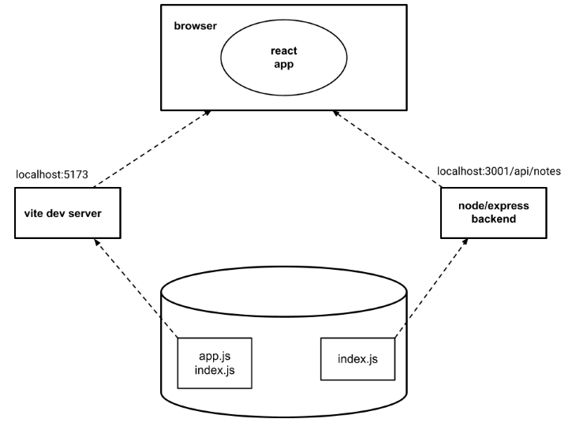

<div class="content">

<!-- Next let's connect the frontend we made in [part 2](/en/part2) to our own backend.-->
接下来让我们把后端和[第 2 章节](/zh/part2)中做的前端连接起来。

<!-- In the previous part, the frontend could ask for the list of notes from the json-server we had as a backend, from the address <http://localhost:3001/notes>. -->
在上一章节中，前端可以从作为后端的 json-server 中，也就是从地址 <http://localhost:3001/notes> 请求笔记列表。
<!-- Our backend has a slightly different URL structure now, as the notes can be found at <http://localhost:3001/api/notes>. Let's change the attribute __baseUrl__ in the frontend notes app at <i>src/services/notes.js</i> like so: -->
后端现在的 URL 结构稍有不同，可以找到笔记的地址是 <http://localhost:3001/api/notes>。让我们改变前端应用 <i>src/services/notes.js</i> 中的 __baseUrl__ 属性，如下：

```js
import axios from 'axios'
const baseUrl = 'http://localhost:3001/api/notes' //highlight-line

const getAll = () => {
  const request = axios.get(baseUrl)
  return request.then(response => response.data)
}

// ...

export default { getAll, create, update }
```

<!-- Now frontend's GET request to <http://localhost:3001/api/notes> does not work for some reason:-->
现在前端向 <http://localhost:3001/api/notes> 的 GET 请求由于某些原因无法进行：


<!-- What's going on here? We can access the backend from a browser and from postman without any problems.-->
这里发生了什么？我们明明可以从浏览器和 Postman 访问后端，没有任何问题。

<!-- ### Same origin policy and CORS -->
### 同源策略和 CORS

<!-- The issue lies with a thing called _same origin policy_. A URL's origin is defined by the combination of protocol (AKA scheme), hostname, and port. -->
问题在于一个叫做“_同源策略_”的东西。一个 URL 的“源”是由协议（又称“模式”）、主机名和端口组成的。

```text
http://example.com:80/index.html
  
protocol: http
host: example.com
port: 80
```

<!-- When you visit a website (e.g. <http://example.com>), the browser issues a request to the server on which the website (example.com) is hosted. The response sent by the server is an HTML file that may contain one or more references to external assets/resources hosted either on the same server that <i>example.com</i> is hosted on or a different website. When the browser sees reference(s) to a URL in the source HTML, it issues a request. If the request is issued using the URL that the source HTML was fetched from, then the browser processes the response without any issues. However, if the resource is fetched using a URL that doesn't share the same origin(scheme, host, port) as the source HTML, the browser will have to check the _Access-Control-Allow-origin_ response header. If it contains _*_ on the URL of the source HTML, the browser will process the response, otherwise the browser will refuse to process it and throws an error. -->
当你访问一个网站（如 <http://example.com>）时，浏览器会向托管该网站（example.com）的服务器发出请求。服务端发回的响应是一个 HTML 文件，HTML 文件可能包含一个或多个外部资源的引用，这些外部资源可能托管在与 <i>example.com</i> 相同的服务器上，也可能托管在其他网站上。当浏览器在 HTML 源码中看到 URL 引用时，就会发出请求。如果请求的 URL 与 HTML 源码的 URL 相同，浏览器便会正常处理响应。但如果所请求资源的 URL 与 HTML 源码的不同源（模式、主机、端口任一不同），浏览器就会检查 _Access-Control-Allow-Origin_ 响应标头。如果该标头包含 HTML 源码的 URL 和通配符 _*_，那么浏览器就会处理响应；否则浏览器会拒绝处理并抛出错误。

<!-- The <strong>same-origin policy</strong> is a security mechanism implemented by browsers in order to prevent session hijacking among other security vulnerabilities. -->
<strong>同源策略</strong>是浏览器实现的一种旨在防止会话劫持等其他安全漏洞的安全机制。

<!-- In order to enable legitimate cross-origin requests (requests to URLs that don't share the same origin) W3C came up with a mechanism called <strong>CORS</strong>(Cross-Origin Resource Sharing). According to [Wikipedia](https://en.wikipedia.org/wiki/Cross-origin_resource_sharing): -->
为了允许合法的跨源请求（请求不同源的 URL），W3C 提出了一种名为 <strong>CORS</strong>（跨源资源共享，Cross-Origin Resource Sharing）的机制。根据[维基百科](https://en.wikipedia.org/wiki/Cross-origin_resource_sharing)：

<!-- > <i>Cross-origin resource sharing (CORS) is a mechanism that allows restricted resources (e.g. fonts) on a web page to be requested from another domain outside the domain from which the first resource was served. A web page may freely embed cross-origin images, stylesheets, scripts, iframes, and videos. Certain "cross-domain" requests, notably Ajax requests, are forbidden by default by the same-origin security policy.</i>-->
> <i>跨源资源共享（CORS）是一种允许网页上的限制性资源（如字体）从所托管的域之外的域请求的机制。网页可以自由嵌入跨源图像、样式表、脚本、内联框架和视频。某些“跨域”请求，特别是 Ajax 请求，在默认情况下会被同源安全策略所禁止。</i>

<!-- The problem is that, by default, the JavaScript code of an application that runs in a browser can only communicate with a server in the same [origin](https://developer.mozilla.org/en-US/docs/Web/Security/Same-origin_policy). -->
问题在于，默认情况下，浏览器中运行的应用的 JavaScript 代码只能与同[源](https://developer.mozilla.org/en-US/docs/Web/Security/Same-origin_policy)的服务端通信。
<!-- Because our server is in localhost port 3001, while our frontend is in localhost port 5173, they do not have the same origin. -->
因为我们的服务端在 localhost 的 3001 端口，而我们的前端在 localhost 的 5173 端口，它们没有相同的源。

<!-- Keep in mind, that [same-origin policy](https://developer.mozilla.org/en-US/docs/Web/Security/Same-origin_policy) and CORS are not specific to React or Node. They are universal principles regarding the safe operation of web applications. -->
记住，[同源策略](https://developer.mozilla.org/en-US/docs/Web/Security/Same-origin_policy)和 CORS 并不是 React 或 Node 特有的。它们是关于 web 应用安全运行的通用原则。

<!-- We can allow requests from other <i>origins</i> by using Node's [cors](https://github.com/expressjs/cors) middleware.-->
我们可以通过使用 Node 的 [cors](https://github.com/expressjs/cors) 中间件来允许来自其他<i>源</i>的请求。

<!-- In your backend repository, install <i>cors</i> with the command-->
在你后端的仓库中，用下列命令安装 <i>cors</i>

```bash
npm install cors
```

<!-- take the middleware to use and allow for requests from all origins:-->
使用中间件，允许来自所有源的请求：

```js
const cors = require('cors')

app.use(cors())
```

<!-- **Note:** When you are enabling cors, you should think about how you want to configure it. In the case of our application, since the backend is not expected to be visible to the public in the production environment, it may make more sense to only enable cors from a specific origin (e.g. the front end).  -->
**注：**当你启用 cors 的时候，你应该考虑下打算怎么设置 cors。对于我们应用的情况，因为不希望把后端暴露给整个生产环境，所以让后端只对特定的源（如前端）启用 cors 会更合理。

<!-- Now most of the features in the frontend work! The functionality for changing the importance of notes has not yet been implemented on the backend so naturally that does not yet work in the frontend. We shall fix that later. -->
现在前端的大多数功能都能用了！后端还没有实现更改笔记重要性的功能，所以自然前端更改笔记重要性的功能还用不了。我们将在后面修复。

<!-- You can read more about CORS from [Mozilla's page](https://developer.mozilla.org/en-US/docs/Web/HTTP/CORS). -->
你可以在 [Mozilla 的网页](https://developer.mozilla.org/en-US/docs/Web/HTTP/CORS)上阅读更多关于 CORS 的信息。

<!-- The setup of our app looks now as follows:-->
我们现在应用的配置类似这样：



<!-- The react app running in the browser now fetches the data from node/express-server that runs in localhost:3001.-->
浏览器中运行的 React 应用现在从运行在 localhost:3001 的 Node/Express 后端获取数据。

<!-- ### Application to the Internet -->
### 把应用部署到互联网上

<!-- Now that the whole stack is ready, let's move our application to Internet. -->
既然全栈已经准备好了，让我们把应用部署到互联网上。

<!-- There is an ever-growing number of services that can be used to host an app on the internet. The developer-friendly services like PaaS (i.e. Platform as a Service) take care of installing the execution environment (eg. Node.js) and could also provide various services such as databases. -->
现今可用于在互联网上托管应用的服务日益增多。像 PaaS（平台即服务，Platform as a Service）这类对开发者友好的服务会负责安装运行环境（例如 Node.js），可能还会提供数据库等各种服务。

<!-- For a decade, [Heroku](http://heroku.com) was dominating the PaaS scene. Unfortunately the free tier Heroku ended at 27th November 2022. This is very unfortunate for many developers, especially students. Heroku is still very much a viable option if you are willing to spend some money. They also have [a student program](https://www.heroku.com/students) that provides some free credits. -->
在过去十几年里，[Heroku](http://heroku.com) 一直统治着 PaaS 领域。不幸的是，Heroku 的免费版服务在 2022 年 11 月 27 日结束了。这对许多开发者，尤其是学生，非常不利。如果你愿意花点钱，Heroku 仍然是非常切实可行的选择。他们也有[学生计划](https://www.heroku.com/students)来为学生提供一些免费额度。

<!-- We are now introducing two services [Fly.io](https://fly.io/) and [Render](https://render.com/). Fly.io offers more flexibility as a service, but it has also recently become paid. Render offers some free compute time, so if you want to complete the course without costs, choose Render. Setting up Render might also be easier in some cases, as Render does not require any installations on your own machine. -->
我们在此介绍两个服务：[Fly.io](https://fly.io/) 和 [Render](https://render.com/)。Fly.io 服务可以更灵活地配置，但最近也要付费了。Render 提供一定的免费计算时间，所以如果你想不花钱完成本课程，那就选 Render。在某些情况下 Render 也更易上手，因为 Render 不需要在你自己的机器上安装任何软件。

<!-- There are also some other free hosting options that work well for this course, at least for all parts other than part 11 (CI/CD) which might have one tricky exercise for other platforms. -->
还有一些其他免费的托管选项也可用于本课程，至少对于除了第 11 章节（CI/CD）以外的所有内容都没有问题，第 11 章节有一道练习可能会在其他平台上比较麻烦。

<!-- Some course participants have also used the following services: -->
部分课程参与者还使用过以下服务：

- [Replit](https://replit.com)
- [CodeSandBox](https://codesandbox.io)

<!-- If you know easy-to-use and free services for hosting NodeJS, please let us know! -->
如果你知道易用且免费的 Node.js 托管服务，请告诉我们！

<!-- For both Fly.io and Render, we need to change the definition of the port our application uses at the bottom of the <i>index.js</i> file in the backend like so: -->
不管是 Fly.io 还是 Render，我们都需要在后端 <i>index.js</i> 最下面，将应用使用端口的定义改成：

```js
const PORT = process.env.PORT || 3001  // highlight-line
app.listen(PORT, () => {
  console.log(`Server running on port ${PORT}`)
})
```

<!-- Now we are using the port defined in the [environment variable](https://en.wikipedia.org/wiki/Environment_variable) _PORT_ or port 3001 if the environment variable _PORT_ is undefined. It is possible to configure the application port based on the environment variable both in Fly.io and in Render. -->
现在我们使用的是[环境变量](https://en.wikipedia.org/wiki/Environment_variable) _PORT_ 中定义的端口，如果未定义环境变量 _PORT_，则使用端口 3001。Fly.io 和 Render 都可以基于环境变量设置应用的端口。

#### Fly.io

<!-- <i>Note that you may need to give your credit card number to Fly.io!</i> -->
<i>注意，你可能需要向 Fly.io 提供你的信用卡号！</i>

<!-- If you decide to use [Fly.io](https://fly.io/) begin by installing their flyctl executable following [this guide](https://fly.io/docs/hands-on/install-flyctl/). After that, you should [create a Fly.io account](https://fly.io/docs/hands-on/sign-up/). -->
如果你决定使用 [Fly.io](https://fly.io/)，那么从按照[这份指南](https://fly.io/docs/hands-on/install-flyctl/)安装 flyctl 可执行文件开始。然后，你需要[创建一个 Fly.io 账号](https://fly.io/docs/hands-on/sign-up/)。

<!-- Start by [authenticating](https://fly.io/docs/hands-on/sign-in/) via the command line with the command -->
从在命令行运行以下命令[登录](https://fly.io/docs/hands-on/sign-in/)开始

```bash
fly auth login
```

<!-- Note if the command _fly_ does not work on your machine, you can try the longer version _flyctl_. Eg. on MacOS, both forms of the command work. -->
注意如果你的电脑上命令 _fly_ 不可用，你可以试试更长的版本 _flyctl_。例如在 MacOS 上，两种命令都可用。

<!-- <i>If you do not get the flyctl to work in your machine, you could try Render (see next section), it does not require anything to be installed in your machine.</i> -->
<i>如果你无法在你的电脑上运行 flyctl，你可以试试 Render（见下节），它不需要你在电脑上安装任何软件。</i>

<!-- Initializing an app happens by running the following command in the root directory of the app -->
在应用的根目录运行下列命令来初始化应用

```bash
fly launch --no-deploy
```

<!-- Give the app a name or let Fly.io auto-generate one. Pick a region where the app will be run. Do not create a Postgres database for the app and do not create an Upstash Redis database, since these are not needed. -->
给应用取一个名字，或者让 Fly.io 自动生成一个。选择运行应用的服务器的地区。不要为应用创建 Postgres 数据库，也不要创建 Upstash Redis 数据库，这些都不需要。

<!-- Fly.io creates a file <i>fly.toml</i> in the root of your app where we can configure it. To get the app up and running we <i>might</i> need to do a small addition to the configuration: -->
Fly.io 会在应用的根目录创建一个名为 <i>fly.toml</i> 的文件，我们可以配置这个文件。为了让应用能正常启动并运行，我们<i>可能</i>需要对配置做一点小的补充：

```bash
[build]

[env]
  PORT = "3001" # add this

[http_service]
  internal_port = 3001 # ensure that this is same as PORT
  force_https = true
  auto_stop_machines = true
  auto_start_machines = true
  min_machines_running = 0
  processes = ["app"]
```

<!-- We have now defined in the part [env] that environment variable PORT will get the correct port (defined in part [http_service]) where the app should create the server.  -->
我们已经在 [env] 部分定义了环境变量 PORT，从而让应用使用正确的端口（在 [http_service] 中定义）来启动服务端。

<!-- We are now ready to deploy the app to the Fly.io servers. That is done with the following command: -->
现在可以把应用部署到 Fly.io 服务器了。使用以下命令：

```bash
fly deploy
```

<!-- If all goes well, the app should now be up and running. You can open it in the browser with the command -->
如果一切顺利，应用应该会启动并运行。可以用下列命令在浏览器中打开应用

```bash
fly apps open
```

<!-- A particularly important command is _fly logs_. This command can be used to view server logs. It is best to keep logs always visible! -->
一个特别重要的命令是 _fly logs_。该命令可以用来查看服务端日志。最好始终保持日志可见！

<!-- **Note:** Fly may create 2 machines for your app, if it does then the state of the data in your app will be inconsistent between requests, i.e. you would have two machines each with its own notes variable, you could POST to one machine then your next GET could go to another machine. You can check the number of machines by using the command "$ fly scale show", if the COUNT is greater than 1 then you can enforce it to be 1 with the command "$ fly scale count 1". The machine count can also be checked on the dashboard. -->
**注：**Fly 可能会为你的应用创建 2 台机器。如果出现这种情况，应用中的数据状态在不同请求间可能不一致，也就是说，你会有两台有各自独立的 notes 变量的机器，你可能 POST 到一台机器，然后下一次 GET 可能去到另一台机器。你可以用命令“$ fly scale show”检查机器数量，如果 COUNT 大于 1，则可以用“$ fly scale count 1”强制让 COUNT 为 1。也可以在仪表板上查看机器数量。

<!-- **Note:** In some cases (the cause is so far unknown) running Fly.io commands especially on Windows WSL (Windows Subsystem for Linux) has caused problems. If the following command just hangs -->
**注意：**在某些情况下（原因尚不明确），运行 Fly.io 命令有出现过问题，特别是在 Windows WSL（Windows Subsystem for Linux）上。如果以下命令只是挂起，没有任何反应

```bash
flyctl ping -o personal
```

<!-- your computer can not for some reason connect to Fly.io. If this happens to you, [this](https://github.com/fullstack-hy2020/misc/blob/master/fly_io_problem.md) describes one possible way to proceed. -->
说明你的电脑出于某种原因无法连接到 Fly.io。如果遇到这种情况，[这里](https://github.com/fullstack-hy2020/misc/blob/master/fly_io_problem.md) 有一种可能的解决办法。

<!-- If the output of the below command looks like this: -->
如果下面命令的输出类似这样：

```bash
$ flyctl ping -o personal
35 bytes from fdaa:0:8a3d::3 (gateway), seq=0 time=65.1ms
35 bytes from fdaa:0:8a3d::3 (gateway), seq=1 time=28.5ms
35 bytes from fdaa:0:8a3d::3 (gateway), seq=2 time=29.3ms
...
```

<!-- then there are no connection problems! -->
那么说明没有连接问题！

<!-- Whenever you make changes to the application, you can take the new version to production with a command -->
每当你对应用做出更改时，可以用命令把新版本部署到生产环境：

```bash
fly deploy
```

#### Render

<!-- <i>Note that you may need to give your credit card number to Render!</i> -->
<i>注意，你可能需要向 Render 提供信用卡号！</i>

<!-- The following assumes that the [sign in](https://dashboard.render.com/) has been made with a GitHub account. -->
下面假设你已经使用 GitHub 账号[登录](https://dashboard.render.com/)了。

<!-- After signing in, let us create a new "web service": -->
登录后，创建一个新“web service”：


<!-- The app repository is then connected to Render: -->
然后将应用的仓库连接到 Render：


<!-- The connection seems to require that the app repository is public. -->
看起来连接要求应用的仓库是公开的。

<!-- Next we will define the basic configurations. If the app is <i>not</i> at the root of the repository the <i>Root directory</i> needs to be given a proper value: -->
接下来定义基本配置。如果应用<i>不</i>在仓库的根目录下，则需在 <i>Root directory</i> 中填写正确的路径：


<!-- After this, the app starts up in the Render. The dashboard tells us the app state and the url where the app is running: -->
之后，应用将在 Render 上启动。仪表板会显示应用的状态和运行的 URL：


<!-- According to the [documentation](https://render.com/docs/deploys) every commit to GitHub should redeploy the app. For some reason this is not always working. -->
根据[文档](https://render.com/docs/deploys)，每次提交到 GitHub 都会自动重新部署应用。不过因为什么原因，不会总是重新部署。

<!-- Fortunately, it is also possible to manually redeploy the app: -->
幸运的是，也可以手动重新部署应用：


<!-- Also, the app logs can be seen in the dashboard: -->
同样，可以在仪表板中查看应用的日志：


<!-- We notice now from the logs that the app has been started in the port 10000. The app code gets the right port through the environment variable PORT so it is essential that the file <i>index.js</i> has been updated in the backend as follows: -->
我们现在从日志中发现应用在端口 10000 启动。应用的代码通过环境变量 PORT 获取正确的端口，因此必须将后端的 <i>index.js</i> 文件更新成：

```js
const PORT = process.env.PORT || 3001  // highlight-line
app.listen(PORT, () => {
  console.log(`Server running on port ${PORT}`)
})
```

<!-- ### Frontend production build -->
### 构建前端的生产版本

<!-- So far we have been running React code in <i>development mode</i>. In development mode the application is configured to give clear error messages, immediately render code changes to the browser, and so on.-->
目前为止，我们一直在<i>开发模式</i>中运行 React 代码。在开发模式下，应用会配置成给出清晰的错误信息，立即向浏览器渲染代码变化，等等。

<!-- When the application is deployed, we must create a [production build](https://vitejs.dev/guide/build.html) or a version of the application that is optimized for production. -->
当部署应用时，我们必须构建一个[生产版本](https://vitejs.dev/guide/build.html)或者说一个为生产优化的应用版本。

<!-- A production build for applications created with Vite can be created with the command [npm run build](https://vitejs.dev/guide/build.html). -->
用 Vite 创建的应用的生产版本可以用命令 [npm run build](https://vitejs.dev/guide/build.html) 构建。

<!-- Let's run this command from the <i>root of the notes frontend project</i> that we developed in [Part 2](/en/part2). -->
让我们在[第 2 章节](/zh/part2)开发的<i>笔记前端项目的根目录</i>运行这个命令。

<!-- This creates a directory called <i>dist</i> which contains the only HTML file of our application (<i>index.html</i>) and the directory <i>assets</i>. [Minified](<https://en.wikipedia.org/wiki/Minification_(programming)>) version of our application's JavaScript code will be generated in the <i>dist</i> directory. Even though the application code is in multiple files, all of the JavaScript will be minified into one file. All of the code from all of the application's dependencies will also be minified into this single file. -->
这会创建一个名为 <i>dist</i> 的目录，其中只包含应用的 HTML 文件（<i>index.html</i>）和目录 <i>assets</i>。应用的 JavaScript 代码的[极简化](<https://en.wikipedia.org/wiki/Minification_(programming)>)版本会在 <i>dist</i> 目录中生成。即使应用的代码在多个文件中，所有 JavaScript 都会被极简化进一个文件。应用所有依赖项的所有代码也会被极简化进这单个文件中。

<!-- The minified code is not very readable. The beginning of the code looks like this:-->
极简化的代码不是很可读。代码的开头类似这样：

```js
!function(e){function r(r){for(var n,f,i=r[0],l=r[1],a=r[2],c=0,s=[];c<i.length;c++)f=i[c],o[f]&&s.push(o[f][0]),o[f]=0;for(n in l)Object.prototype.hasOwnProperty.call(l,n)&&(e[n]=l[n]);for(p&&p(r);s.length;)s.shift()();return u.push.apply(u,a||[]),t()}function t(){for(var e,r=0;r<u.length;r++){for(var t=u[r],n=!0,i=1;i<t.length;i++){var l=t[i];0!==o[l]&&(n=!1)}n&&(u.splice(r--,1),e=f(f.s=t[0]))}return e}var n={},o={2:0},u=[];function f(r){if(n[r])return n[r].exports;var t=n[r]={i:r,l:!1,exports:{}};return e[r].call(t.exports,t,t.exports,f),t.l=!0,t.exports}f.m=e,f.c=n,f.d=function(e,r,t){f.o(e,r)||Object.defineProperty(e,r,{enumerable:!0,get:t})},f.r=function(e){"undefined"!==typeof Symbol&&Symbol.toStringTag&&Object.defineProperty(e,Symbol.toStringTag,{value:"Module"})
```

<!-- ### Serving static files from the backend -->
### 由后端提供静态文件

<!-- One option for deploying the frontend is to copy the production build (the <i>dist</i> directory) to the root of the backend directory and configure the backend to show the frontend's <i>main page</i> (the file <i>dist/index.html</i>) as its main page. -->
部署前端的一个选择是将构建的生产版本（<i>dist</i> 目录）复制到后端的根目录中，并配置后端来让主页显示为前端的<i>主页</i>（文件 <i>dist/index.html</i>）。

<!-- We begin by copying the production build of the frontend to the root of the backend. With a Mac or Linux computer, the copying can be done from the frontend directory with the command-->
我们首先把前端的生产版本复制到后端的根目录下。在 Mac 或 Linux 电脑上，可以在前端目录下用命令复制

```bash
cp -r build ../notes-backend
```

<!-- If you are using a Windows computer, you may use either [copy](https://www.windows-commandline.com/windows-copy-command-syntax-examples/) or [xcopy](https://www.windows-commandline.com/xcopy-command-syntax-examples/) command instead. Otherwise, simply do a copy and paste.-->
如果你使用的是 Windows 电脑，你可以用 [copy](https://www.windows-commandline.com/windows-copy-command-syntax-examples/) 或 [xcopy](https://www.windows-commandline.com/xcopy-command-syntax-examples/) 命令。再或者，直接复制粘贴。

<!-- The backend directory should now look as follows:-->
后端目录现在应该是这样的：


<!-- To make Express show <i>static content</i>, the page <i>index.html</i> and the JavaScript, etc., it fetches, we need a built-in middleware from Express called [static](http://expressjs.com/en/starter/static-files.html). -->
为了使 Express 显示获取的<i>静态内容</i>、页面 <i>index.html</i> 和 JavaScript 等，我们需要一个 Express 内置的中间件，叫做 [static](http://expressjs.com/en/starter/static-files.html)。

<!-- When we add the following amidst the declarations of middlewares-->
当我们在中间件的声明中加入以下内容时

```js
app.use(express.static('dist'))
```

<!-- whenever Express gets an HTTP GET request it will first check if the <i>dist</i> directory contains a file corresponding to the request's address. If a correct file is found, Express will return it. -->
每当 Express 收到一个 HTTP GET 请求时，它首先会检查 <i>dist</i> 目录是否包含与请求地址对应的文件。如果找到了正确的文件，Express 就会返回这个文件。

<!-- Now HTTP GET requests to the address <i>www.serversaddress.com/index.html</i> or <i>www.serversaddress.com</i> will show the React frontend. GET requests to the address <i>www.serversaddress.com/api/notes</i> will be handled by the backend code. -->
现在，对地址 <i>www.serversaddress.com/index.html</i> 或 <i>www.serversaddress.com</i> 的 HTTP GET 请求将显示 React 前端。对地址 <i>www.serversaddress.com/api/notes</i> 的 GET 请求将由后端代码处理。

<!-- Because of our situation, both the frontend and the backend are at the same address, we can declare _baseUrl_ as a [relative](https://www.w3.org/TR/WD-html40-970917/htmlweb.html#h-5.1.2) URL. This means we can leave out the part declaring the server.-->
由于我们前后端都在同一个地址的情况，我们可以将 _baseUrl_ 声明为一个[相对](https://www.w3.org/TR/WD-html40-970917/htmlweb.html#h-5.1.2) URL。这意味着我们可以省略声明服务端的部分。

```js
import axios from 'axios'
const baseUrl = '/api/notes' // highlight-line

const getAll = () => {
  const request = axios.get(baseUrl)
  return request.then(response => response.data)
}

// ...
```

<!-- After the change, we have to create a new production build of the frontend and copy it to the root of the backend directory. -->
更改后，我们必须重新构建前端的生产版本，并将其复制到后端的根目录。

<!-- The application can now be used from the <i>backend</i> address <http://localhost:3001>:-->
现在可以从<i>后端的</i>地址 <http://localhost:3001> 使用应用：


<!-- Our application now works exactly like the [single-page app](/en/part0/fundamentals_of_web_apps#single-page-app) example application we studied in part 0.-->
我们的应用现在的运行方式与我们在第 0 章节学习的[单页应用](/zh/part0/web_应用的基础设施#single-page-app)的示例应用完全相同。

<!-- When we use a browser to go to the address <http://localhost:3001>, the server returns the <i>index.html</i> file from the <i>dist</i> directory. The contents of the file are as follows: -->
当我们用浏览器进入 <http://localhost:3001> 地址时，服务端从 <i>dist</i> 目录返回 <i>index.html</i> 文件。文件内容如下：

```html
<!doctype html>
<html lang="en">
  <head>
    <meta charset="UTF-8" />
    <link rel="icon" type="image/svg+xml" href="/vite.svg" />
    <meta name="viewport" content="width=device-width, initial-scale=1.0" />
    <title>Vite + React</title>
    <script type="module" crossorigin src="/assets/index-5f6faa37.js"></script>
    <link rel="stylesheet" href="/assets/index-198af077.css">
  </head>
  <body>
    <div id="root"></div>
    
  </body>
</html>

```

<!-- The file contains instructions to fetch a CSS stylesheet defining the styles of the application, and one <i>script</i> tag that instructs the browser to fetch the JavaScript code of the application - the actual React application. -->
该文件包含获取定义应用样式的 CSS 样式表的指令，以及一个令浏览器获取应用的 JavaScript 代码——实际的 React 应用的 <i>script</i> 标签。

<!-- The React code fetches notes from the server address <http://localhost:3001/api/notes> and renders them to the screen. The communication between the server and the browser can be seen in the <i>Network</i> tab of the developer console: -->
React 代码从服务端地址 <http://localhost:3001/api/notes> 获取笔记，并将其渲染到屏幕上。服务端和浏览器之间的通信可以在开发者控制台的<i>网络</i>标签页中看到：


<!-- The setup that is ready for product deployment looks as follows:-->
准备用于产品部署的配置类似这样：


<!-- Unlike when running the app in a development environment, everything is now in the same node/express-backend that runs in localhost:3001. When the browser goes to the page, the file <i>index.html</i> is rendered. That causes the browser to fetch the production version of the React app. Once it starts to run, it fetches the json-data from the address localhost:3001/api/notes. -->
与在开发环境中运行应用时不同，现在所有东西都运行在 localhost:3001 的同一个 Node/Express 后端中。当浏览器进入页面时，文件 <i>index.html</i> 被渲染。这会让浏览器获取 React 应用的生产版本。一旦 React 应用开始运行，它就从地址 localhost:3001/api/notes 获取 JSON 数据。

<!-- ### The whole app to internet -->
### 把整个应用部署到互联网上

<!-- After ensuring that the production version of the application works locally, we are ready to move the whole application to the selected host service. -->
在确保应用的生产版本在本地正确运行后，我们就准备好将整个应用部署到选择的托管服务上了。

<!-- <strong>In the case of Fly.io</strong> the new deployment is done with the command -->
<strong>对于 Fly.io</strong>，用以下命令重新部署

```bash
fly deploy
```

<!-- <strong>NOTE:</strong> The _.dockerignore_ file in your project directory lists files not uploaded during deployment. The dist directory may be included by default. If that's the case, remove its reference from the .dockerignore file, ensuring your app is properly deployed. -->
<strong>注：</strong>项目目录下的 _.dockerignore_ 文件会列出不会在部署时上传的文件。可能会默认忽略 _dist_ 目录。如果出现这种情况，就从 _.dockerignore_ 文件中删除该目录的引用，以确保应用能正确部署。

<!-- <strong>In the case of Render</strong>, commit the changes, and push the code to GitHub again. Make sure the directory <i>dist</i> is not ignored by git on the backend. A push to GitHub <i>might</i> be enough. If the automatic deployment does not work, select the "manual deploy" from the Render dashboard. -->
<strong>对于 Render</strong>，在 git 中提交更改，并再次将代码推送到 GitHub。确保后端的 git 没有忽略 <i>dist</i> 目录。推送到 GitHub <i>可能</i>就可以了。如果没有自动部署，就在 Render 的仪表板中选择“manual deploy”。

<!-- The application works perfectly, except we haven't added the functionality for changing the importance of a note to the backend yet. -->
应用运行得很完美，只是我们还没有在后端添加改变笔记重要性的功能。


<!-- <i>**NOTE:** changing the importance DOES NOT work yet since the backend has no implementation for it yet.</i> -->
<i>**注：**还**无法**改变笔记的重要性，后端还没有实现这一功能。</i>

<!-- Our application saves the notes to a variable. If the application crashes or is restarted, all of the data will disappear.-->
我们的应用将所有笔记保存在一个变量中。如果应用崩溃或重启，所有数据就都会消失。

<!-- The application needs a database. Before we introduce one, let's go through a few things.-->
应用需要一个数据库。在我们引入数据库之前，让我们先仔细看一下几件事情。

<!-- The setup looks like now as follows:-->
现在的配置类似这样：


<!-- The node/express-backend now resides in the Fly.io/Render server. When the root address is accessed, the browser loads and executes the React app that fetches the json-data from the Fly.io/Render server. -->
Node/Express 后端现在在 Fly.io/Render 的服务器上。当访问根地址时，浏览器就会加载并执行 React 应用，React 应用又会从 Fly.io/Render 服务器获取 JSON 数据。

<!-- ###  Streamlining deploying of the frontend -->
### 优化前端的部署

<!-- To create a new production build of the frontend without extra manual work, let's add some npm-scripts to the <i>package.json</i> of the backend repository:-->
为了让构建一个新的前端生产版本不需要额外的手动操作，让我们在后端仓库的 <i>package.json</i> 中添加一些 npm 脚本。

<!-- #### Fly.io script -->
#### Fly.io 脚本

<!-- The scripts look like this: -->
脚本类似这样：

```json
{
  "scripts": {
    // ...
    "build:ui": "rm -rf dist && cd ../notes-frontend/ && npm run build && cp -r dist ../notes-backend",
    "deploy": "fly deploy",
    "deploy:full": "npm run build:ui && npm run deploy",
    "logs:prod": "fly logs"
  }
}
```

<!-- The script _npm run build:ui_ builds the frontend and copies the production version under the backend repository. The script _npm run deploy_ releases the current backend to Fly.io. -->
脚本 _npm run build:ui_ 构建前端，并将生产版本复制到后端仓库下。脚本 _npm run deploy_ 将当前的后端发布到 Fly.io。

<!-- _npm run deploy:full_ combines these two scripts, i.e., _npm run build:ui_ and _npm run deploy_. -->
_npm run deploy:full_ 结合了 _npm run build:ui_ 和 _npm run deploy_ 两个脚本。

<!-- There is also a script _npm run logs:prod_ to show the Fly.io logs. -->
还有一个脚本 _npm run logs:prod_ 来显示 Fly.io 的日志。

<!-- Note that the directory paths in the script <i>build:ui</i> depend on the location of the frontend and backend directories in the file system. -->
注意脚本 <i>build:ui</i> 中的目录路径取决于前后端目录在文件系统中的位置。

<!-- ##### Note for Windows users -->
##### Windows 用户注意事项

<!-- Note that the standard shell commands in `build:ui` do not natively work in Windows. Powershell in Windows works differently, in which case the script could be written as -->
注意 `build:ui` 中标准的 shell 命令无法在 Windows 中原生运行。Windows 的 Powershell 运行的方式不同，这时脚本应写成

```json
"build:ui": "@powershell Remove-Item -Recurse -Force dist && cd ../frontend && npm run build && @powershell Copy-Item dist -Recurse ../backend",
```

<!-- If the script does not work on Windows, confirm that you are using Powershell and not Command Prompt. If you have installed Git Bash or another Linux-like terminal, you may be able to run Linux-like commands on Windows as well. -->
如果脚本在 Windows 上还是无法运行，确保你使用的是 Powershell 而非命令提示符（cmd）。如果你安装过 Git Bash 或者其他类 Linux 的终端，你也可以在 Windows 上运行类 Linux 命令。

#### Render

<!-- Note: When you attempt to deploy your backend to Render, make sure you have a separate repository for the backend and deploy that github repo through Render, attempting to deploy through your Fullstackopen repository will often throw "ERR path ....package.json". -->
注意：当你尝试将后端部署到 Render 时，确保后端有一个专门的仓库并通过 Render 部署该 GitHub 仓库。尝试通过你的 Fullstackopen 仓库部署通常会抛出“ERR path ....package.json”错误。

对于 Render，脚本类似这样

```json
{
  "scripts": {
    //...
    "build:ui": "rm -rf dist && cd ../frontend && npm run build && cp -r dist ../backend",
    "deploy:full": "npm run build:ui && git add . && git commit -m uibuild && git push"
  }
}
```

<!-- The script _npm run build:ui_ builds the frontend and copies the production version under the backend repository. _npm run deploy:full_ contains also the necessary <i>git</i> commands to update the backend repository. -->
脚本 _npm run build:ui_ 会构建前端并将生产版本复制到后端仓库下。_npm run deploy:full_ 还包含更新后端仓库必要的 <i>git</i> 命令。

<!-- Note that the directory paths in the script <i>build:ui</i> depend on the location of the frontend and backend directories in the file system. -->
注意脚本 <i>build:ui</i> 中的目录路径取决于前后端目录在文件系统中的位置。

<!-- >**NB**  On Windows, npm scripts are executed in cmd.exe as the default shell which does not support bash commands. For the above bash commands to work, you can change the default shell to Bash (in the default Git for Windows installation) as follows:-->
>**注** 在 Windows 上，npm 脚本的默认 shell 是 cmd.exe，npm 脚本默认在 cmd.exe 中执行，不支持 bash 命令。为了让上述 bash 命令生效，你可以将默认 shell 改为（Git for Windows 默认安装的）Bash，方法如下：

```md
npm config set script-shell "C:\\Program Files\\git\\bin\\bash.exe"
```

<!-- Another option is the use of [shx](https://www.npmjs.com/package/shx).-->
另一个选择是使用 [shx](https://www.npmjs.com/package/shx)。

<!-- ### Proxy -->
### 代理

<!-- Changes on the frontend have caused it to no longer work in development mode (when started with command _npm run dev_), as the connection to the backend does not work. -->
对前端的更改导致它在开发模式下（用 _npm run dev_ 命令启动时）无法运行，因为前端无法与后端连接。


<!-- This is due to changing the backend address to a relative URL:-->
这是由于后端地址改成了相对 URL：

```js
const baseUrl = '/api/notes'
```

<!-- Because in development mode the frontend is at the address <i>localhost:5173</i>, the requests to the backend go to the wrong address <i>localhost:5173/api/notes</i>. The backend is at <i>localhost:3001</i>. -->
因为在开发模式下，前端的地址是 <i>localhost:5173</i>，对后端的请求会发送到错误的地址 <i>localhost:5173/api/notes</i>。而后端是在 <i>localhost:3001</i>。

<!-- If the project was created with Vite, this problem is easy to solve. It is enough to add the following declaration to the <i>vite.config.js</i> file of the frontend directory. -->
如果项目是用 Vite 创建的，那么问题很容易解决。只需在前端目录的 <i>vite.config.js</i>文件中添加以下声明就可以了：

```js
import { defineConfig } from 'vite'
import react from '@vitejs/plugin-react'

// https://vitejs.dev/config/
export default defineConfig({
  plugins: [react()],
  // highlight-start
  server: {
    proxy: {
      '/api': {
        target: 'http://localhost:3001',
        changeOrigin: true,
      },
    }
  },
  // highlight-end
})

```

<!-- After restarting, the React development environment will act as [proxy](https://vitejs.dev/config/server-options.html#server-proxy). If the React code makes an HTTP request to a path starting with <i>http://localhost:5173/api</i>, the request will be forwarded to the server at <i>http://localhost:3001</i>. Requests to other paths will be handled normally by the development server. -->
重启后，React 开发环境将充当[代理](https://vitejs.dev/config/server-options.html#server-proxy)。如果 React 代码向以 <i>http://localhost:5173/api</i> 开头的路径发送 HTTP 请求，那么请求将被转发到 <i>http://localhost:3001</i> 的服务端上。向其他路径发送的请求依然由开发服务端正常处理。

<!-- Now the frontend is also working correctly. It functions both in development mode and in production mode together with the server. Since from the frontend's perspective all requests are made to http://localhost:5173, which is the single origin, there is no longer a need for the backend's cors middleware. Therefore, we can remove references to the cors library from the backend's <i>index.js</i> file and remove <i>cors</i> from the project's dependencies: -->
现在前端也能正确运行。在开发模式和生产模式下都能与服务端一起运行。从前端的角度来看，因为所有的请求都是发送到 http://localhost:5173 的，也就是同源的，那么就不再需要后端的 cors 中间件了。因此，我们可以从后端的 <i>index.js</i> 文件中删除对 cors 库的引用，并从项目的依赖项中删除 <i>cors</i>：

```bash
npm remove cors
```

<!-- We have now successfully deployed the entire application to the internet. There are many other ways to implement deployments. For example, deploying the frontend code as its own application may be sensible in some situations, as it can facilitate the implementation of an automated [deployment pipeline](https://martinfowler.com/bliki/DeploymentPipeline.html). A deployment pipeline refers to an automated and controlled way to move code from the developer's machine through various tests and quality control stages to the production environment. This topic is covered in [part 11](/en/part11) of the course. -->
我们现在已经成功将整个应用部署到互联网上了。此外还有许多方法来实现部署。比如，将前端代码部署为自己的应用在某些情况下是一个明智的方法，因为这样可以方便实现自动化的[部署管道](https://martinfowler.com/bliki/DeploymentPipeline.html)。部署管道是指通过不同测试和质量检查，将代码从开发者的电脑转移到生产环境的一种自动化和可控的方式。本课程[第 11 章节](https://fullstackopen.com/en/part11)涵盖了这一话题。

<!-- Current code of the backend can be found on [Github](https://github.com/fullstack-hy2020/part3-notes-backend/tree/part3-3), in the branch <i>part3-3</i>. The changes in frontend code are in <i>part3-1</i> branch of the [frontend repository](https://github.com/fullstack-hy2020/part2-notes/tree/part3-1).-->
当前的后端代码可以在 [Github](https://github.com/fullstack-hy2020/part3-notes-backend/tree/part3-3) 的 <i>part3-3</i> 分支中找到。前端代码的更改在 [frontend repository](https://github.com/fullstack-hy2020/part2-notes/tree/part3-1) 的<i>part3-1</i>分支中。

</div>

<div class="tasks">

<!-- ### Exercises 3.9.-3.11 -->
### 练习 3.9.~3.11

<!-- The following exercises don't require many lines of code. They can however be challenging, because you must understand exactly what is happening and where, and the configurations must be just right.-->
下面的练习不需要很多行代码。但这些练习可能具有挑战性，因为你必须准确理解发生了什么事情，以及事情在哪里发生，并且配置必须正好正确。

<!-- #### 3.9 Phonebook backend step 9 -->
#### 3.9 电话簿后端 第 9 步

<!-- Make the backend work with the phonebook frontend from the exercises of the previous part. Do not implement the functionality for making changes to the phone numbers yet, that will be implemented in exercise 3.17.-->
使后端与上一章节练习中的电话簿前端一起运行。先不要实现更改电话号码的功能，我们会在练习 3.17 中实现。

<!-- You will probably have to do some small changes to the frontend, at least to the URLs for the backend. Remember to keep the developer console open in your browser. If some HTTP requests fail, you should check from the <i>Network</i>-tab what is going on. Keep an eye on the backend's console as well. If you did not do the previous exercise, it is worth it to print the request data or <i>request.body</i> to the console in the event handler responsible for POST requests.-->
你可能要对前端做一些小的改动，至少要更改后端的 URL。记得在浏览器中保持开发者控制台打开。如果一些 HTTP 请求失败了，你应该在<i>网络</i>标签页中检查发生了什么。也要留意后端的控制台。如果你还没有做前面的练习，那么值得在负责 POST 请求的事件处理函数中把请求数据或 <i>request.body</i> 打印到控制台。

<!-- #### 3.10 Phonebook backend step 10 -->
#### 3.10 电话簿后端 第 10 步

<!-- Deploy the backend to the internet, for example to Fly.io or Render. If you are using Fly.io the commands should be run in the root directory of the backend (that is, in the same directory where the backend package.json is). -->
将后端部署到互联网上，比如部署到 Fly.io 或 Render。如果你用的是 Fly.io，那么应该在后端的根目录（也就是在和后端 package.json 所在的同一个目录下）运行命令。

<!-- **PRO TIP:** When you deploy your application to Internet, it is worth it to at least in the beginning keep an eye on the logs of the application **AT ALL TIMES**. -->
**专业提示：**当你将应用部署到互联网时，至少在一开始时应**始终**留意应用的日志。

<!-- Test the deployed backend with a browser and Postman or VS Code REST client to ensure it works.-->
用浏览器和 Postman 或 VS Code REST Client 测试部署好的后端，确保其正常运行。

<!-- Create a README.md at the root of your repository, and add a link to your online application to it.-->
在你的仓库的根目录创建一个 README.md，并在其中添加在线应用的链接。

<!-- #### 3.11 Full Stack Phonebook -->
#### 3.11 全栈电话簿

<!-- Generate a production build of your frontend, and add it to the internet application using the method introduced in this part.-->
为你的前端构建一个生产版本，并使用本章节介绍的方法将其添加到部署到互联网的应用中。

<!-- Also, make sure that the frontend still works locally (in development mode when started with command _npm run dev_). -->
同时，确保前端在本地（用命令 _npm run dev_ 启动的开发模式中）仍然可以运行。

<!-- If you use Render, make sure the directory <i>dist</i> is not ignored by git on the backend. -->
如果你使用的是 Render，确保后端的 <i>dist</i> 目录没有在 .gitignore 中。

<!-- **NOTE:** You shall NOT be deploying the frontend directly at any stage of this part. Only the backend repository is deployed throughout the whole part. The frontend production build is added to the backend repository, and the backend serves it as described in the section [Serving static files from the backend](/en/part3/deploying_app_to_internet#serving-static-files-from-the-backend). -->
**注：**在本章节的任何阶段，你都**不**应直接部署前端。整个章节都只部署后端。将前端构建的生产版本添加到后端仓库中，然后让后端来提供，如同[由后端提供静态文件](/zh/part3/把应用部署到互联网上#由后端提供静态文件)一节中所描述的那样。

</div>
