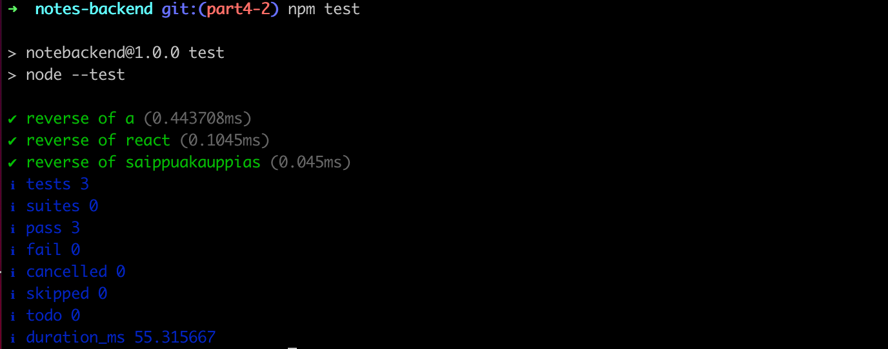
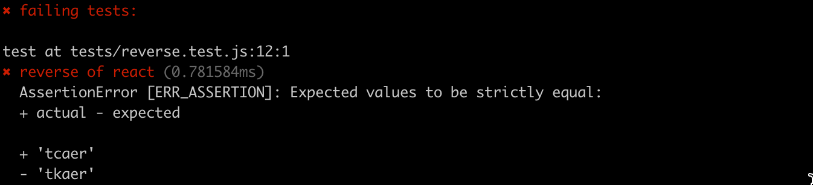
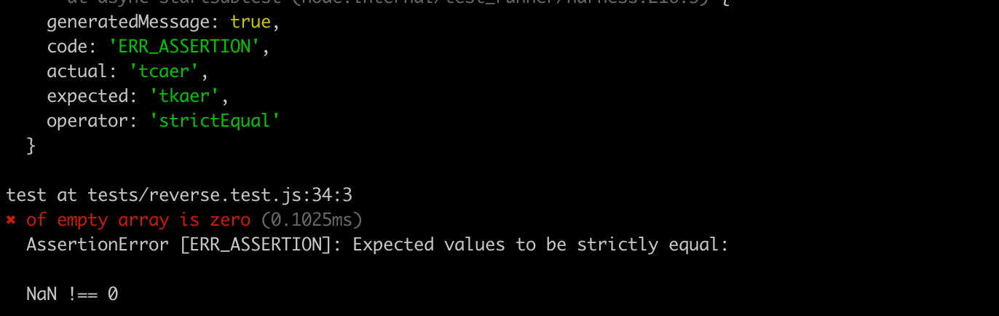
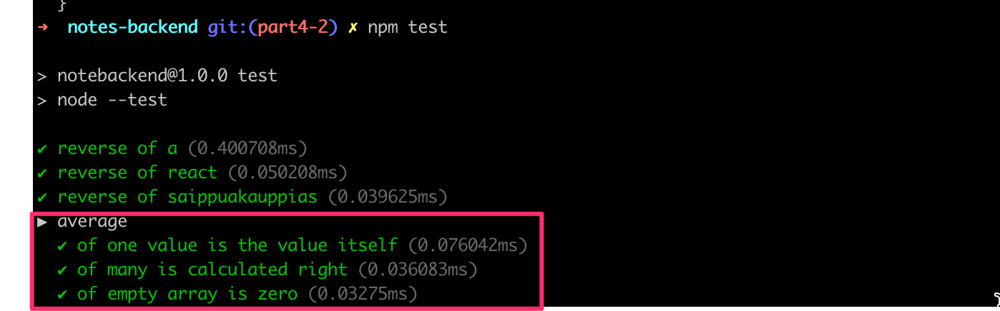

<div class="content">

Let's continue our work on the backend of the notes application we started in [part 3](/en/part3).

### Project structure

**Note** this course material was written with version v20.11.0 of Node.js. Please make sure that your version of Node is at least as new as the version used in the material (you can check the version by running node -v in the command line).

Before we move into the topic of testing, we will modify the structure of our project to adhere to Node.js best practices.

Once we make the changes to the directory structure of our project, we will end up with the following structure:

```bash
├── index.js
├── app.js
├── dist
│   └── ...
├── controllers
│   └── notes.js
├── models
│   └── note.js
├── package-lock.json
├── package.json
├── utils
│   ├── config.js
│   ├── logger.js
│   └── middleware.js  
```

So far we have been using <i>console.log</i> and <i>console.error</i> to print different information from the code.
However, this is not a very good way to do things.
Let's separate all printing to the console to its own module <i>utils/logger.js</i>:

```js
const info = (...params) => {
  console.log(...params)
}

const error = (...params) => {
  console.error(...params)
}

module.exports = {
  info, error
}
```

The logger has two functions, __info__ for printing normal log messages, and __error__ for all error messages. 

Extracting logging into its own module is a good idea in several ways. If we wanted to start writing logs to a file or send them to an external logging service like [graylog](https://www.graylog.org/) or [papertrail](https://papertrailapp.com) we would only have to make changes in one place.

The handling of environment variables is extracted into a separate <i>utils/config.js</i> file:

```js
require('dotenv').config()

const PORT = process.env.PORT
const MONGODB_URI = process.env.MONGODB_URI

module.exports = {
  MONGODB_URI,
  PORT
}
```

The other parts of the application can access the environment variables by importing the configuration module:

```js
const config = require('./utils/config')

logger.info(`Server running on port ${config.PORT}`)
```

The contents of the <i>index.js</i> file used for starting the application gets simplified as follows:

```js
const app = require('./app') // the actual Express application
const config = require('./utils/config')
const logger = require('./utils/logger')

app.listen(config.PORT, () => {
  logger.info(`Server running on port ${config.PORT}`)
})
```

The <i>index.js</i> file only imports the actual application from the <i>app.js</i> file and then starts the application. The function _info_ of the logger-module is used for the console printout telling that the application is running.

Now the Express app and the code taking care of the web server are separated from each other following the [best](https://dev.to/nermineslimane/always-separate-app-and-server-files--1nc7) practices. One of the advantages of this method is that the application can now be tested at the level of HTTP API calls without actually making calls via HTTP over the network, this makes the execution of tests faster.

The route handlers have also been moved into a dedicated module. The event handlers of routes are commonly referred to as <i>controllers</i>, and for this reason we have created a new <i>controllers</i> directory. All of the routes related to notes are now in the <i>notes.js</i> module under the <i>controllers</i> directory.

The contents of the <i>notes.js</i> module are the following:

```js
const notesRouter = require('express').Router()
const Note = require('../models/note')

notesRouter.get('/', (request, response) => {
  Note.find({}).then(notes => {
    response.json(notes)
  })
})

notesRouter.get('/:id', (request, response, next) => {
  Note.findById(request.params.id)
    .then(note => {
      if (note) {
        response.json(note)
      } else {
        response.status(404).end()
      }
    })
    .catch(error => next(error))
})

notesRouter.post('/', (request, response, next) => {
  const body = request.body

  const note = new Note({
    content: body.content,
    important: body.important || false,
  })

  note.save()
    .then(savedNote => {
      response.json(savedNote)
    })
    .catch(error => next(error))
})

notesRouter.delete('/:id', (request, response, next) => {
  Note.findByIdAndDelete(request.params.id)
    .then(() => {
      response.status(204).end()
    })
    .catch(error => next(error))
})

notesRouter.put('/:id', (request, response, next) => {
  const body = request.body

  const note = {
    content: body.content,
    important: body.important,
  }

  Note.findByIdAndUpdate(request.params.id, note, { new: true })
    .then(updatedNote => {
      response.json(updatedNote)
    })
    .catch(error => next(error))
})

module.exports = notesRouter
```

This is almost an exact copy-paste of our previous <i>index.js</i> file.

However, there are a few significant changes. At the very beginning of the file we create a new [router](http://expressjs.com/en/api.html#router) object:

```js
const notesRouter = require('express').Router()

//...

module.exports = notesRouter
```

The module exports the router to be available for all consumers of the module.

All routes are now defined for the router object, similar to what was done before with the object representing the entire application.

It's worth noting that the paths in the route handlers have shortened. In the previous version, we had:

```js
app.delete('/api/notes/:id', (request, response, next) => {
```

And in the current version, we have:

```js
notesRouter.delete('/:id', (request, response, next) => {
```

So what are these router objects exactly? The Express manual provides the following explanation:

> <i>A router object is an isolated instance of middleware and routes. You can think of it as a “mini-application,” capable only of performing middleware and routing functions. Every Express application has a built-in app router.</i>

The router is in fact a <i>middleware</i>, that can be used for defining "related routes" in a single place, which is typically placed in its own module.

The <i>app.js</i> file that creates the actual application takes the router into use as shown below:

```js
const notesRouter = require('./controllers/notes')
app.use('/api/notes', notesRouter)
```

The router we defined earlier is used <i>if</i> the URL of the request starts with <i>/api/notes</i>. For this reason, the notesRouter object must only define the relative parts of the routes, i.e. the empty path <i>/</i> or just the parameter <i>/:id</i>.

After making these changes, our <i>app.js</i> file looks like this:

```js
const config = require('./utils/config')
const express = require('express')
const app = express()
const cors = require('cors')
const notesRouter = require('./controllers/notes')
const middleware = require('./utils/middleware')
const logger = require('./utils/logger')
const mongoose = require('mongoose')

mongoose.set('strictQuery', false)

logger.info('connecting to', config.MONGODB_URI)

mongoose.connect(config.MONGODB_URI)
  .then(() => {
    logger.info('connected to MongoDB')
  })
  .catch((error) => {
    logger.error('error connecting to MongoDB:', error.message)
  })

app.use(cors())
app.use(express.static('dist'))
app.use(express.json())
app.use(middleware.requestLogger)

app.use('/api/notes', notesRouter)

app.use(middleware.unknownEndpoint)
app.use(middleware.errorHandler)

module.exports = app
```

The file takes different middleware into use, and one of these is the <i>notesRouter</i> that is attached to the <i>/api/notes</i> route.

Our custom middleware has been moved to a new <i>utils/middleware.js</i> module:

```js
const logger = require('./logger')

const requestLogger = (request, response, next) => {
  logger.info('Method:', request.method)
  logger.info('Path:  ', request.path)
  logger.info('Body:  ', request.body)
  logger.info('---')
  next()
}

const unknownEndpoint = (request, response) => {
  response.status(404).send({ error: 'unknown endpoint' })
}

const errorHandler = (error, request, response, next) => {
  logger.error(error.message)

  if (error.name === 'CastError') {
    return response.status(400).send({ error: 'malformatted id' })
  } else if (error.name === 'ValidationError') {
    return response.status(400).json({ error: error.message })
  }

  next(error)
}

module.exports = {
  requestLogger,
  unknownEndpoint,
  errorHandler
}
```

The responsibility of establishing the connection to the database has been given to the  <i>app.js</i> module. The <i>note.js</i> file under the <i>models</i> directory only defines the Mongoose schema for notes.

```js
const mongoose = require('mongoose')

const noteSchema = new mongoose.Schema({
  content: {
    type: String,
    required: true,
    minlength: 5
  },
  important: Boolean,
})

noteSchema.set('toJSON', {
  transform: (document, returnedObject) => {
    returnedObject.id = returnedObject._id.toString()
    delete returnedObject._id
    delete returnedObject.__v
  }
})

module.exports = mongoose.model('Note', noteSchema)
```

To recap, the directory structure looks like this after the changes have been made:

```bash
├── index.js
├── app.js
├── dist
│   └── ...
├── controllers
│   └── notes.js
├── models
│   └── note.js
├── package-lock.json
├── package.json
├── utils
│   ├── config.js
│   ├── logger.js
│   └── middleware.js  
```

For smaller applications, the structure does not matter that much. Once the application starts to grow in size, you are going to have to establish some kind of structure and separate the different responsibilities of the application into separate modules. This will make developing the application much easier.

There is no strict directory structure or file naming convention that is required for Express applications. In contrast, Ruby on Rails does require a specific structure. Our current structure simply follows some of the best practices that you can come across on the internet.

You can find the code for our current application in its entirety in the <i>part4-1</i> branch of [this GitHub repository](https://github.com/fullstack-hy2020/part3-notes-backend/tree/part4-1).

If you clone the project for yourself, run the _npm install_ command before starting the application with _npm run dev_.

### Note on exports

We have used two different kinds of exports in this part. Firstly, e.g. the file <i>utils/logger.js</i> does the export as follows:

```js
const info = (...params) => {
  console.log(...params)
}

const error = (...params) => {
  console.error(...params)
}

// highlight-start
module.exports = {
  info, error
}
// highlight-end
```

The file exports <i>an object</i> that has two fields, both of which are functions. The functions can be used in two different ways. The first option is to require the whole object and refer to functions through the object using the dot notation:

```js
const logger = require('./utils/logger')

logger.info('message')

logger.error('error message')
```

The other option is to destructure the functions to their own variables in the <i>require</i> statement:

```js
const { info, error } = require('./utils/logger')

info('message')
error('error message')
```

The second way of exporting may be preferable if only a small portion of the exported functions are used in a file.  E.g. in file <i>controller/notes.js</i> exporting happens as follows:

```js
const notesRouter = require('express').Router()
const Note = require('../models/note')

// ...

module.exports = notesRouter // highlight-line
```

In this case, there is just one "thing" exported, so the only way to use it is the following:

```js
const notesRouter = require('./controllers/notes')

// ...

app.use('/api/notes', notesRouter)
```

Now the exported "thing" (in this case a router object) is assigned to a variable and used as such.

#### Finding the usages of your exports with VS Code

VS Code has a handy feature that allows you to see where your modules have been exported. This can be very helpful for refactoring. For example, if you decide to split a function into two separate functions, your code could break if you don't modify all the usages. This is difficult if you don't know where they are. However, you need to define your exports in a particular way for this to work.

If you right-click on a variable in the location it is exported from and select "Find All References", it will show you everywhere the variable is imported. However, if you assign an object directly to module.exports, it will not work. A workaround is to assign the object you want to export to a named variable and then export the named variable. It also will not work if you destructure where you are importing; you have to import the named variable and then destructure, or just use dot notation to use the functions contained in the named variable.

The nature of VS Code bleeding into how you write your code is probably not ideal, so you need to decide for yourself if the trade-off is worthwhile.

</div>

<div class="tasks">

### Exercises 4.1.-4.2.

**Note** this course material was written with version v20.11.0 of Node.js. Please make sure that your version of Node is at least as new as the version used in the material (you can check the version by running node -v in the command line).

In the exercises for this part, we will be building a <i>blog list application</i>, that allows users to save information about interesting blogs they have stumbled across on the internet. For each listed blog we will save the author, title, URL, and amount of upvotes from users of the application.

#### 4.1 Blog List, step 1

Let's imagine a situation, where you receive an email that contains the following application body and instructions:

```js
const express = require('express')
const app = express()
const cors = require('cors')
const mongoose = require('mongoose')

const blogSchema = new mongoose.Schema({
  title: String,
  author: String,
  url: String,
  likes: Number
})

const Blog = mongoose.model('Blog', blogSchema)

const mongoUrl = 'mongodb://localhost/bloglist'
mongoose.connect(mongoUrl)

app.use(cors())
app.use(express.json())

app.get('/api/blogs', (request, response) => {
  Blog
    .find({})
    .then(blogs => {
      response.json(blogs)
    })
})

app.post('/api/blogs', (request, response) => {
  const blog = new Blog(request.body)

  blog
    .save()
    .then(result => {
      response.status(201).json(result)
    })
})

const PORT = 3003
app.listen(PORT, () => {
  console.log(`Server running on port ${PORT}`)
})
```

Turn the application into a functioning <i>npm</i> project. To keep your development productive, configure the application to be executed with <i>nodemon</i>. You can create a new database for your application with MongoDB Atlas, or use the same database from the previous part's exercises.

Verify that it is possible to add blogs to the list with Postman or the VS Code REST client and that the application returns the added blogs at the correct endpoint.

#### 4.2 Blog List, step 2

Refactor the application into separate modules as shown earlier in this part of the course material.

**NB** refactor your application in baby steps and verify that it works after every change you make. If you try to take a "shortcut" by refactoring many things at once, then [Murphy's law](https://en.wikipedia.org/wiki/Murphy%27s_law) will kick in and it is almost certain that something will break in your application. The "shortcut" will end up taking more time than moving forward slowly and systematically.

One best practice is to commit your code every time it is in a stable state. This makes it easy to rollback to a situation where the application still works.

If you're having issues with <i>content.body</i> being <i>undefined</i> for seemingly no reason, make sure you didn't forget to add <i>app.use(express.json())</i> near the top of the file.

</div>

<div class="content">

### Testing Node applications

We have completely neglected one essential area of software development, and that is automated testing.

Let's start our testing journey by looking at unit tests. The logic of our application is so simple, that there is not much that makes sense to test with unit tests. Let's create a new file <i>utils/for_testing.js</i> and write a couple of simple functions that we can use for test writing practice:

```js
const reverse = (string) => {
  return string
    .split('')
    .reverse()
    .join('')
}

const average = (array) => {
  const reducer = (sum, item) => {
    return sum + item
  }

  return array.reduce(reducer, 0) / array.length
}

module.exports = {
  reverse,
  average,
}
```

> The _average_ function uses the array [reduce](https://developer.mozilla.org/en-US/docs/Web/JavaScript/Reference/Global_Objects/Array/Reduce) method. If the method is not familiar to you yet, then now is a good time to watch the first three videos from the [Functional JavaScript](https://www.youtube.com/watch?v=BMUiFMZr7vk&list=PL0zVEGEvSaeEd9hlmCXrk5yUyqUag-n84) series on YouTube.

There are a large number of test libraries, or <i>test runners</i>, available for JavaScript.
The old king of test libraries is [Mocha](https://mochajs.org/), which was replaced a few years ago by [Jest](https://jestjs.io/). A newcomer to the libraries is [Vitest](https://vitest.dev/), which bills itself as a new generation of test libraries.

Nowadays, Node also has a built-in test library [node:test](https://nodejs.org/docs/latest/api/test.html), which is well suited to the needs of the course.


Let's define the <i>npm script _test_</i> for the test execution:

```bash
{
  //...
  "scripts": {
    "start": "node index.js",
    "dev": "nodemon index.js",
    "build:ui": "rm -rf build && cd ../frontend/ && npm run build && cp -r build ../backend",
    "deploy": "fly deploy",
    "deploy:full": "npm run build:ui && npm run deploy",
    "logs:prod": "fly logs",
    "lint": "eslint .",
    "test": "node --test" // highlight-line
  },
  //...
}
```


Let's create a separate directory for our tests called <i>tests</i> and create a new file called <i>reverse.test.js</i> with the following contents:

```js
const { test } = require('node:test')
const assert = require('node:assert')

const reverse = require('../utils/for_testing').reverse

test('reverse of a', () => {
  const result = reverse('a')

  assert.strictEqual(result, 'a')
})

test('reverse of react', () => {
  const result = reverse('react')

  assert.strictEqual(result, 'tcaer')
})

test('reverse of saippuakauppias', () => {
  const result = reverse('saippuakauppias')

  assert.strictEqual(result, 'saippuakauppias')
})
```

The test defines the keyword _test_ and the library [assert](https://nodejs.org/docs/latest/api/assert.html), which is used by the tests to check the results of the functions under test.

In the next row, the test file imports the function to be tested and assigns it to a variable called _reverse_:

```js
const reverse = require('../utils/for_testing').reverse
```

Individual test cases are defined with the _test_ function. The first parameter of the function is the test description as a string. The second parameter is a <i>function</i>, that defines the functionality for the test case. The functionality for the second test case looks like this:

```js
() => {
  const result = reverse('react')

  assert.strictEqual(result, 'tcaer')
}
```

First, we execute the code to be tested, meaning that we generate a reverse for the string <i>react</i>. Next, we verify the results with the the method [strictEqual](https://nodejs.org/docs/latest/api/assert.html#assertstrictequalactual-expected-message) of the [assert](https://nodejs.org/docs/latest/api/assert.html) library.

As expected, all of the tests pass:



The library node:test expects by default that the names of test files contain <i>.test</i>. In this course, we will follow the convention of naming our tests files with the extension <i>.test.js</i>.

Let's break the test:

```js
test('reverse of react', () => {
  const result = reverse('react')

  assert.strictEqual(result, 'tkaer')
})
```

Running this test results in the following error message:



Let output from the npm test with _average_ function, into a new file <i>tests/average.test.js</i>.

```js
const { test, describe } = require('node:test')

// ...

const average = require('../utils/for_testing').average

describe('average', () => {
  test('of one value is the value itself', () => {
    assert.strictEqual(average([1]), 1)
  })

  test('of many is calculated right', () => {
    assert.strictEqual(average([1, 2, 3, 4, 5, 6]), 3.5)
  })

  test('of empty array is zero', () => {
    assert.strictEqual(average([]), 0)
  })
})
```

The test reveals that the function does not work correctly with an empty array (this is because in JavaScript dividing by zero results in <i>NaN</i>):



Fixing the function is quite easy:

```js
const average = array => {
  const reducer = (sum, item) => {
    return sum + item
  }

  return array.length === 0
    ? 0
    : array.reduce(reducer, 0) / array.length
}
```

If the length of the array is 0 then we return 0, and in all other cases, we use the _reduce_ method to calculate the average.

There are a few things to notice about the tests that we just wrote. We defined a <i>describe</i> block around the tests that were given the name _average_:

```js
describe('average', () => {
  // tests
})
```

Describe blocks can be used for grouping tests into logical collections. The test output also uses the name of the describe block:



As we will see later on <i>describe</i> blocks are necessary when we want to run some shared setup or teardown operations for a group of tests.

Another thing to notice is that we wrote the tests in quite a compact way, without assigning the output of the function being tested to a variable:

```js
test('of empty array is zero', () => {
  assert.strictEqual(average([]), 0)
})
```

</div>

<div class="tasks">

### Exercises 4.3.-4.7.

Let's create a collection of helper functions that are best suited for working with the described sections of the blog list. Create the functions into a file called <i>utils/list_helper.js</i>. Write your tests into an appropriately named test file under the <i>tests</i> directory.

#### 4.3: Helper Functions and Unit Tests, step 1

First, define a _dummy_ function that receives an array of blog posts as a parameter and always returns the value 1. The contents of the <i>list_helper.js</i> file at this point should be the following:

```js
const dummy = (blogs) => {
  // ...
}

module.exports = {
  dummy
}
```

Verify that your test configuration works with the following test:

```js
const { test, describe } = require('node:test')
const assert = require('node:assert')
const listHelper = require('../utils/list_helper')

test('dummy returns one', () => {
  const blogs = []

  const result = listHelper.dummy(blogs)
  assert.strictEqual(result, 1)
})
```

#### 4.4: Helper Functions and Unit Tests, step 2

Define a new _totalLikes_ function that receives a list of blog posts as a parameter. The function returns the total sum of <i>likes</i> in all of the blog posts.

Write appropriate tests for the function. It's recommended to put the tests inside of a <i>describe</i> block so that the test report output gets grouped nicely:


Defining test inputs for the function can be done like this:

```js
describe('total likes', () => {
  const listWithOneBlog = [
    {
      _id: '5a422aa71b54a676234d17f8',
      title: 'Go To Statement Considered Harmful',
      author: 'Edsger W. Dijkstra',
      url: 'https://homepages.cwi.nl/~storm/teaching/reader/Dijkstra68.pdf',
      likes: 5,
      __v: 0
    }
  ]

  test('when list has only one blog, equals the likes of that', () => {
    const result = listHelper.totalLikes(listWithOneBlog)
    assert.strictEqual(result, 5)
  })
})
```

If defining your own test input list of blogs is too much work, you can use the ready-made list [here](https://github.com/fullstack-hy2020/misc/blob/master/blogs_for_test.md).

You are bound to run into problems while writing tests. Remember the things that we learned about [debugging](/en/part3/saving_data_to_mongo_db#debugging-node-applications) in part 3. You can print things to the console with _console.log_ even during test execution.

#### 4.5*: Helper Functions and Unit Tests, step 3

Define a new _favoriteBlog_ function that receives a list of blogs as a parameter. The function finds out which blog has the most likes. If there are many top favorites, it is enough to return one of them.

The value returned by the function could be in the following format:

```js
{
  title: "Canonical string reduction",
  author: "Edsger W. Dijkstra",
  likes: 12
}
```

**NB** when you are comparing objects, the [deepStrictEqual](https://nodejs.org/api/assert.html#assertdeepstrictequalactual-expected-message) method is probably what you want to use, since the [strictEqual](https://nodejs.org/api/assert.html#assertstrictequalactual-expected-message) tries to verify that the two values are the same value, and not just that they contain the same properties. For differences between various assert module functions, you can refer to [this Stack Overflow answer](https://stackoverflow.com/a/73937068/15291501).

Write the tests for this exercise inside of a new <i>describe</i> block. Do the same for the remaining exercises as well.

#### 4.6*: Helper Functions and Unit Tests, step 4

This and the next exercise are a little bit more challenging. Finishing these two exercises is not required to advance in the course material, so it may be a good idea to return to these once you're done going through the material for this part in its entirety.

Finishing this exercise can be done without the use of additional libraries. However, this exercise is a great opportunity to learn how to use the [Lodash](https://lodash.com/) library.

Define a function called _mostBlogs_ that receives an array of blogs as a parameter. The function returns the <i>author</i> who has the largest amount of blogs. The return value also contains the number of blogs the top author has:

```js
{
  author: "Robert C. Martin",
  blogs: 3
}
```

If there are many top bloggers, then it is enough to return any one of them.

#### 4.7*: Helper Functions and Unit Tests, step 5

Define a function called _mostLikes_ that receives an array of blogs as its parameter. The function returns the author, whose blog posts have the largest amount of likes. The return value also contains the total number of likes that the author has received:

```js
{
  author: "Edsger W. Dijkstra",
  likes: 17
}
```

If there are many top bloggers, then it is enough to show any one of them.

</div>
