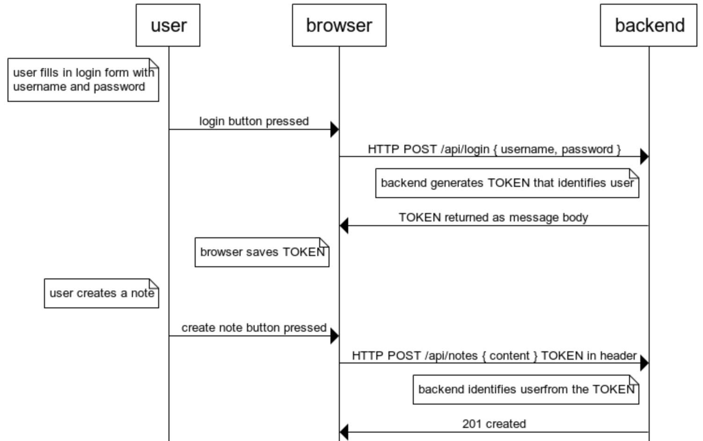
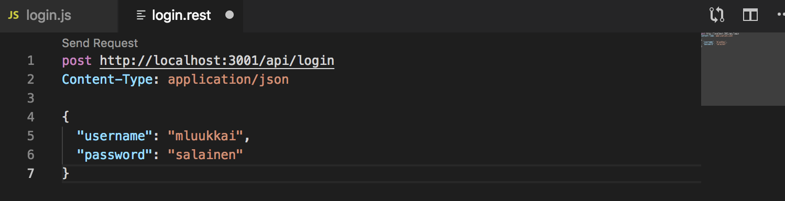
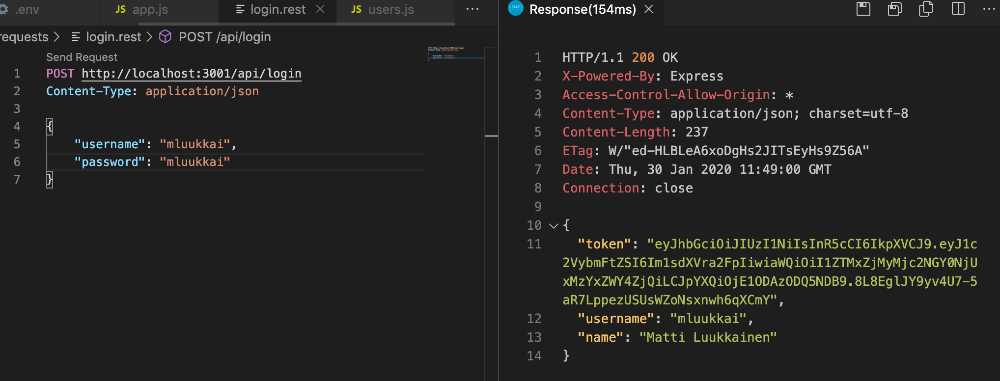
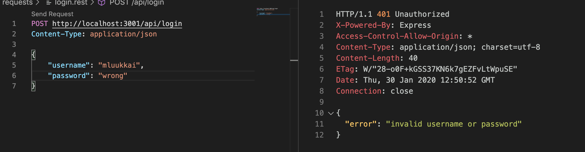
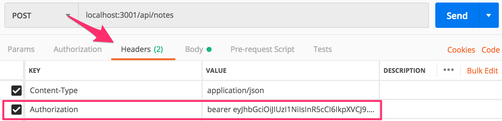
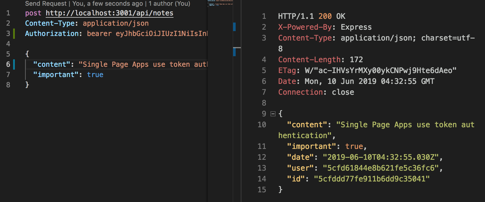
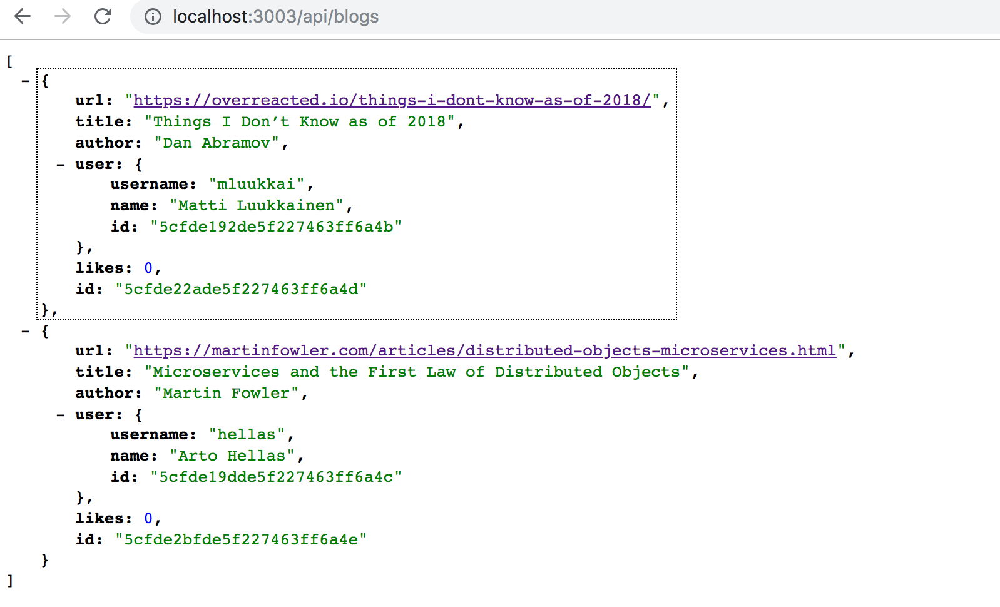
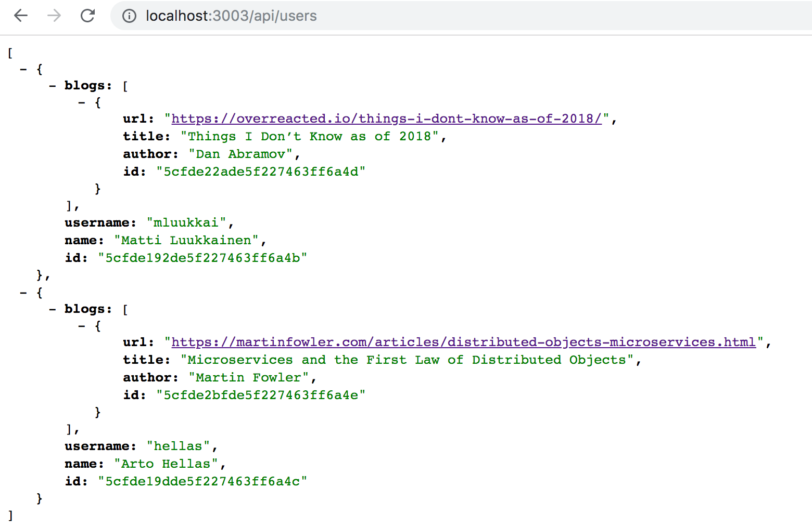

<div class="content">

Users must be able to log into our application, and when a user is logged in, their user information must automatically be attached to any new notes they create. 

We will now implement support for [token based authentication](https://scotch.io/tutorials/the-ins-and-outs-of-token-based-authentication#toc-how-token-based-works) to the backend. 

The principles of token based authentication are depicted in the following sequence diagram: 



- User starts by logging in using a login form implemented with React 
    - We will add the login form to the frontend in [part 5](/en/part5) 
- This causes the React code to send the username and the password to the server address <i>/api/login</i> as a HTTP POST request. 
- If the username and the password are correct, the server generates a <i>token</i> which somehow identifies the logged in user. 
    - The token is signed digitally, making it impossible to falsify (with cryptographic means)
- The backend responds with a status code indicating the operation was successful, and returns the token with the response.
- The browser saves the token, for example to the state of a React application. 
- When the user creates a new note (or does some other operation requiring identification), the React code sends the token to the server with the request.
- The server uses the token to identify the user

Let's first implement the functionality for logging in. Install the [jsonwebtoken](https://github.com/auth0/node-jsonwebtoken) library, which allows us to generate [JSON web tokens](https://jwt.io/).

```bash
npm install jsonwebtoken
```

The code for login functionality goes to the file controllers/login.js.


```js
const jwt = require('jsonwebtoken')
const bcrypt = require('bcrypt')
const loginRouter = require('express').Router()
const User = require('../models/user')

loginRouter.post('/', async (request, response) => {
  const body = request.body

  const user = await User.findOne({ username: body.username })
  const passwordCorrect = user === null
    ? false
    : await bcrypt.compare(body.password, user.passwordHash)

  if (!(user && passwordCorrect)) {
    return response.status(401).json({
      error: 'invalid username or password'
    })
  }

  const userForToken = {
    username: user.username,
    id: user._id,
  }

  const token = jwt.sign(userForToken, process.env.SECRET)

  response
    .status(200)
    .send({ token, username: user.username, name: user.name })
})

module.exports = loginRouter
```

The code starts by searching for the user from the database by the <i>username</i> attached to the request. 
Next, it checks the <i>password</i>, also attached to the request. 
Because the passwords themselves are not saved to the database, but <i>hashes</i> calculated from the passwords, the _bcrypt.compare_ method is used to check if the password is correct: 

```js
await bcrypt.compare(body.password, user.passwordHash)
```

If the user is not found, or the password is incorrect, the request is responded to with the status code [401 unauthorized](https://www.w3.org/Protocols/rfc2616/rfc2616-sec10.html#sec10.4.2). The reason for the failure is explained in the response body. 

If the password is correct, a token is created with the method  _jwt.sign_. The token contains the username and the user id in a digitally signed form. 

```js
const userForToken = {
  username: user.username,
  id: user._id,
}

const token = jwt.sign(userForToken, process.env.SECRET)
```

The token has been digitally signed using a string from the environment variable <i>SECRET</i> as the <i>secret</i>.
The digital signature ensures that only parties who know the secret can generate a valid token. 
The value for the environment variable must be set in the <i>.env</i> file. 

A successful request is responded to with the status code <i>200 OK</i>. The generated token and the username of the user are sent back in the response body. 

Now the code for login just has to be added to the application by adding the new router to <i>app.js</i>. 

```js
const loginRouter = require('./controllers/login')

//...

app.use('/api/login', loginRouter)
```

Let's try logging in using VS Code REST-client: 



It does not work. The following is printed to console: 

```bash
(node:32911) UnhandledPromiseRejectionWarning: Error: secretOrPrivateKey must have a value
    at Object.module.exports [as sign] (/Users/mluukkai/opetus/_2019fullstack-koodit/osa3/notes-backend/node_modules/jsonwebtoken/sign.js:101:20)
    at loginRouter.post (/Users/mluukkai/opetus/_2019fullstack-koodit/osa3/notes-backend/controllers/login.js:26:21)
(node:32911) UnhandledPromiseRejectionWarning: Unhandled promise rejection. This error originated either by throwing inside of an async function without a catch block, or by rejecting a promise which was not handled with .catch(). (rejection id: 2)
```

The command _jwt.sign(userForToken, process.env.SECRET)_ fails. We forgot to set a value to the environment variable <i>SECRET</i>. It can be any string. When we set the value in file <i>.env</i>, the login works. 

A successful login returns the user details and the token: 



A wrong username or password returns an error message and the proper status code:



### Limiting creating new notes to logged in users

Let's change creating new notes so that it is only possible if the post request has a valid token attached. 
The note is then saved to the notes list of the user identified by the token. 

There are several ways of sending the token from the browser to the server. We will use the [Authorization](https://developer.mozilla.org/en-US/docs/Web/HTTP/Headers/Authorization) header. The header also tells which [authentication scheme](https://developer.mozilla.org/en-US/docs/Web/HTTP/Authentication#Authentication_schemes) is used. This can be necessary if the server offers multiple ways to authenticate. 
Identifying the scheme tells the server how the attached credentials should be interpreted. 

The <i>Bearer</i> scheme is suitable to our needs. 

In practice, this means that if the token is for example, the string <i>eyJhbGciOiJIUzI1NiIsInR5c2VybmFtZSI6Im1sdXVra2FpIiwiaW</i>, the Authorization header will have the value: 

<pre>
Bearer eyJhbGciOiJIUzI1NiIsInR5c2VybmFtZSI6Im1sdXVra2FpIiwiaW
</pre>

Creating new notes will change like so: 

```js
const jwt = require('jsonwebtoken') //highlight-line

// ...
  //highlight-start
const getTokenFrom = request => {
  const authorization = request.get('authorization')
  if (authorization && authorization.toLowerCase().startsWith('bearer ')) {
    return authorization.substring(7)
  }
  return null
}
  //highlight-end

notesRouter.post('/', async (request, response) => {
  const body = request.body
//highlight-start
  const token = getTokenFrom(request)

  const decodedToken = jwt.verify(token, process.env.SECRET)
  if (!token || !decodedToken.id) {
    return response.status(401).json({ error: 'token missing or invalid' })
  }

  const user = await User.findById(decodedToken.id)
//highlight-end

  const note = new Note({
    content: body.content,
    important: body.important === undefined ? false : body.important,
    date: new Date(),
    user: user._id
  })

  const savedNote = await note.save()
  user.notes = user.notes.concat(savedNote._id)
  await user.save()

  response.json(savedNote)
})
```

The helper function _getTokenFrom_ isolates the token from the <i>authorization</i> header. The validity of the token is checked with _jwt.verify_. The method also decodes the token, or returns the Object which the token was based on: 

```js
const decodedToken = jwt.verify(token, process.env.SECRET)
```

The object decoded from the token contains the <i>username</i> and <i>id</i> fields, which tells the server who made the request. 

If there is no token, or the object decoded from the token does not contain the user's identity (_decodedToken.id_ is undefined), error status code [401 unauthorized](https://www.w3.org/Protocols/rfc2616/rfc2616-sec10.html#sec10.4.2) is returned and the reason for the failure is explained in the response body. 

```js
if (!token || !decodedToken.id) {
  return response.status(401).json({
    error: 'token missing or invalid'
  })
}
```

When the identity of the maker of the request is resolved, the execution continues as before. 

A new note can now be created using Postman if the <i>authorization</i> header is given the correct value, the string <i>bearer eyJhbGciOiJIUzI1NiIsInR5cCI6IkpXVCJ</i>, where the second value is the token returned by the <i>login</i> operation. 

Using Postman this looks as follows: 



and with Visual Studio Code REST client



### Error handling

Token verification can also cause a <i>JsonWebTokenError</i>. If we for example remove a few characters from the token and try creating a new note, this happens: 

```bash
JsonWebTokenError: invalid signature
    at /Users/mluukkai/opetus/_2019fullstack-koodit/osa3/notes-backend/node_modules/jsonwebtoken/verify.js:126:19
    at getSecret (/Users/mluukkai/opetus/_2019fullstack-koodit/osa3/notes-backend/node_modules/jsonwebtoken/verify.js:80:14)
    at Object.module.exports [as verify] (/Users/mluukkai/opetus/_2019fullstack-koodit/osa3/notes-backend/node_modules/jsonwebtoken/verify.js:84:10)
    at notesRouter.post (/Users/mluukkai/opetus/_2019fullstack-koodit/osa3/notes-backend/controllers/notes.js:40:30)
```

There are many possible reasons for a decoding error. The token can be faulty (like in our example), falsified, or expired. Let's extend our errorHandler middleware to take into account the different decoding errors. 

```js
const unknownEndpoint = (request, response) => {
  response.status(404).send({ error: 'unknown endpoint' })
}

const errorHandler = (error, request, response, next) => {
  if (error.name === 'CastError') {
    return response.status(400).send({
      error: 'malformatted id'
    })
  } else if (error.name === 'ValidationError') {
    return response.status(400).json({
      error: error.message 
    })
  } else if (error.name === 'JsonWebTokenError') {  // highlight-line
    return response.status(401).json({ // highlight-line
      error: 'invalid token' // highlight-line
    }) // highlight-line
  }

  logger.error(error.message)

  next(error)
}
```

Current application code can be found on [Github](https://github.com/fullstack-hy2020/part3-notes-backend/tree/part4-9), branch <i>part4-9</i>.

If the application has multiple interfaces requiring identification, JWT's validation should be separated into its own middleware. Some existing library like [express-jwt](https://www.npmjs.com/package/express-jwt) could also be used. 

### End notes

There have been many changes to the code which have caused a typical problem for a fast-paced software project: most of the tests have broken. Because this part of the course is already jammed with new information, we will leave fixing the tests to a non compulsory exercise. 

Usernames, passwords and applications using token authentication must always be used over [HTTPS](https://en.wikipedia.org/wiki/HTTPS). We could use a Node [HTTPS](https://nodejs.org/api/https.html) server in our application instead of the [HTTP](https://nodejs.org/docs/latest-v8.x/api/http.html) server (it requires more configuration). On the other hand, the production version of our application is in Heroku, so our application stays secure: Heroku routes all traffic between a browser and the Heroku server over HTTPS. 

We will implement login to the frontend in the [next part](/en/part5).

</div>

<div class="tasks">

### Exercises 4.15.-4.22.

In the next exercises, basics of user management will be implemented for the Bloglist application. The safest way is to follow the story from part 4 chapter [User administration](/en/part4/user_administration) to the chapter [Token-based authentication](/en/part4/token_authentication). You can of course also use your creativity. 

**One more warning:** If you notice you are mixing async/await and _then_ calls, it is 99% certain you are doing something wrong. Use either or, never both. 

#### 4.15: bloglist expansion, step3

Implement a way to create new users by doing a HTTP POST-request to address <i>api/users</i>. Users have <i>username, password and name</i>.

Do not save passwords to the database as clear text, but use the <i>bcrypt</i> library like we did in part 4 chapter [Creating new users](/en/part4/user_administration#creating-users).

**NB** Some Windows users have had problems with <i>bcrypt</i>. If you run into problems, remove the library with command 

```bash
npm uninstall bcrypt 
```

and install [bcryptjs](https://www.npmjs.com/package/bcryptjs) instead. 

Implement a way to see the details of all users by doing a suitable HTTP request. 

List of users can for example, look as follows: 


#### 4.16*: bloglist expansion, step4

Add a feature which adds the following restrictions to creating new users: Both username and password must be given. Both username and password must be at least 3 characters long. The username must be unique. 

The operation must respond with a suitable status code and some kind of an error message if invalid user is created. 

**NB** Do not test password restrictions with Mongoose validations. It is not a good idea because the password received by the backend and the password hash saved to the database are not the same thing. The password length should be validated in the controller like we did in [part 3](/en/part3/validation_and_es_lint) before using Mongoose validation. 

Also, implement tests which check that invalid users are not created and invalid add user operation returns a suitable status code and error message. 

#### 4.17: bloglist expansion, step5

Expand blogs so that each blog contains information on the creator of the blog. 

Modify adding new blogs so that when a new blog is created,  <i>any</i> user from the database is designated as its creator (for example the one found first). Implement this according to part 4 chapter [populate](/en/part4/user_administration#populate).
Which user is designated as the creator does not matter just yet. The functionality is finished in exercise 4.19. 

Modify listing all blogs so that the creator's user information is displayed with the blog: 



and listing all users also displays the blogs created by each user: 



#### 4.18: bloglist expansion, step6

Implement token-based authentication according to part 4 chapter [Token authentication](/en/part4/token_authentication).

#### 4.19: bloglist expansion, step7

Modify adding new blogs so that it is only possible if a valid token is sent with the HTTP POST request. The user identified by the token is designated as the creator of the blog. 

#### 4.20*: bloglist expansion, step8

[This example](/en/part4/token_authentication) from part 4 shows taking the token from the header with the _getTokenFrom_ helper function.

If you used the same solution, refactor taking the token to a [middleware](/en/part3/node_js_and_express#middleware). The middleware should take the token from the <i>Authorization</i> header and place it to the <i>token</i> field of the <i>request</i> object. 

In other words, if you register this middleware in the <i>app.js</i> file before all routes

```js
app.use(middleware.tokenExtractor)
```

routes can access the token with _request.token_:
```js
blogsRouter.post('/', async (request, response) => {
  // ..
  const decodedToken = jwt.verify(request.token, process.env.SECRET)
  // ..
})
```

Remember that a normal [middleware](/en/part3/node_js_and_express#middleware) is a function with three parameters, that at the end calls the last parameter <i>next</i> in order to move the control to next middleware:

```js
const tokenExtractor = (request, response, next) => {
  // code that extracts the token

  next()
}
```

#### 4.21*: bloglist expansion, step9

Change the delete blog operation so that a blog can be deleted only by the user who added the blog. Therefore, deleting a blog is possible only if the token sent with the request is the same as that of the blog's creator. 

If deleting a blog is attempted without a token or by a wrong user, the operation should return a suitable status code. 

Note that if you fetch a blog from the database,

```js
const blog = await Blog.findById(...)
```

the field <i>blog.user</i> does not contain a string, but an Object. So if you want to compare the id of the object fetched from the database and a string id, normal comparison operation does not work. The id fetched from the database must be parsed into a string first. 

```js
if ( blog.user.toString() === userid.toString() ) ...
```

#### 4.22*:  bloglist expansion, step10

After adding token based authentication the tests for adding a new blog broke down. Fix the tests. Also write a new test to ensure adding a blog fails with the proper status code <i>401 Unauthorized</i> if a token is not provided.

[This](https://github.com/visionmedia/supertest/issues/398) is most likely useful when doing the fix.

This is the last exercise for this part of the course and it's time to push your code to GitHub and mark all of your finished exercises to the [exercise submission system](https://studies.cs.helsinki.fi/stats/courses/fullstackopen).

<!---
note left of user
  user fills in login form with
  username and password
end note
user -> browser: login button pressed

browser -> backend: HTTP POST /api/login { username, password }
note left of backend
  backend generates TOKEN that identifies user 
end note
backend -> browser: TOKEN returned as message body 
note left of browser
  browser saves TOKEN
end note
note left of user
  user creates a note
end note
user -> browser: create note button pressed
browser -> backend: HTTP POST /api/notes { content } TOKEN in header
note left of backend
  backend identifies userfrom the TOKEN
end note

backend -> browser: 201 created

user -> user:
-->

</div>
