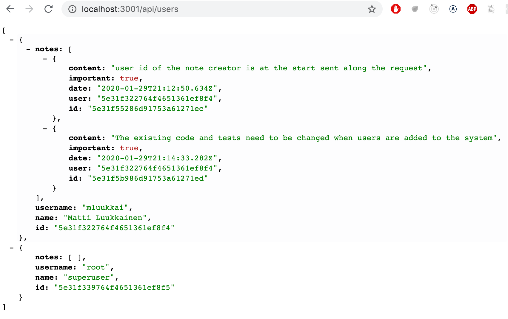
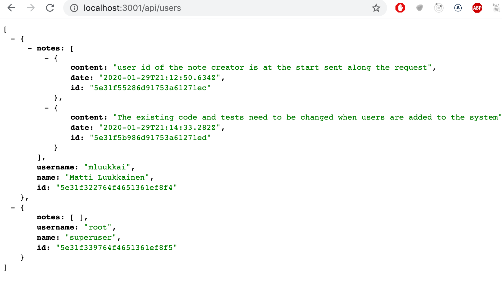
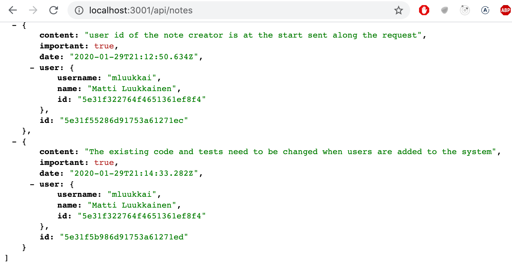

<div class="content">

Queremos agregar autenticación y autorización de usuario a nuestra aplicación. Los usuarios deben almacenarse en la base de datos y cada nota debe estar vinculada al usuario que la creó. La eliminación y edición de una nota solo debe permitirse para el usuario que la creó.

Comencemos agregando información sobre los usuarios a la base de datos. Existe una relación de uno a varios entre el usuario (<i>user</i>) y las notas (<i>Note</i>):


Si estuviéramos trabajando con una base de datos relacional, la implementación sería sencilla. Ambos recursos tendrían sus tablas de base de datos separadas, y la identificación del usuario que creó una nota se almacenaría en la tabla de notas como una clave externa.

Cuando se trabaja con bases de datos de documentos, la situación es un poco diferente, ya que hay muchas formas diferentes de modelar la situación.

La solución existente guarda todas las notas de la <i>colección de notas</i> en la base de datos. Si no queremos cambiar esta colección existente, entonces la opción natural es guardar a los usuarios en su propia colección, <i>users</i> por ejemplo.

Al igual que con todas las bases de datos de documentos, podemos usar ID de objeto en Mongo para hacer referencia a documentos en otras colecciones. Esto es similar al uso de claves externas en bases de datos relacionales.

Tradicionalmente, las bases de datos de documentos como Mongo no admiten <i>consultas de unión</i> que están disponibles en bases de datos relacionales, utilizadas para agregar datos de varias tablas. Sin embargo, a partir de la versión 3.2. Mongo ha admitido [consultas de agregación de búsqueda](https://docs.mongodb.com/manual/reference/operator/aggregation/lookup/). No examinaremos esta funcionalidad en este curso.

Si necesitamos una funcionalidad similar a unir consultas, la implementaremos en el código de nuestra aplicación realizando múltiples consultas. En determinadas situaciones, Mongoose puede encargarse de unir y agregar datos, lo que da la apariencia de una consulta de combinación. Sin embargo, incluso en estas situaciones, Mongoose realiza varias consultas a la base de datos en segundo plano.

### Referencias entre colecciones

Si estuviéramos usando una base de datos relacional, la nota contendría una <i>clave de referencia</i> para el usuario que la creó. En las bases de datos de documentos podemos hacer lo mismo.

Supongamos que la colección de <i>users</i> contiene dos usuarios:

```js
[
  {
    username: 'mluukkai',
    _id: 123456,
  },
  {
    username: 'hellas',
    _id: 141414,
  },
];
```

La colección <i>notes</i> contiene tres notas que tienen un campo <i>user</i> que hace referencia a un usuario en la colección <i>users</i>:

```js
[
  {
    content: 'HTML is easy',
    important: false,
    _id: 221212,
    user: 123456,
  },
  {
    content: 'The most important operations of HTTP protocol are GET and POST',
    important: true,
    _id: 221255,
    user: 123456,
  },
  {
    content: 'A proper dinosaur codes with Java',
    important: false,
    _id: 221244,
    user: 141414,
  },
]
```

Las bases de datos de documentos no exigen que la clave externa se almacene en los recursos de notas, podría <i>también</i> almacenarse en la colección de usuarios, o incluso ambos:

```js
[
  {
    username: 'mluukkai',
    _id: 123456,
    notes: [221212, 221255],
  },
  {
    username: 'hellas',
    _id: 141414,
    notes: [221244],
  },
]
```

Dado que los usuarios pueden tener muchas notas, los identificadores relacionados se almacenan en una matriz en el campo <i>notes</i>.

Las bases de datos de documentos también ofrecen una forma radicalmente diferente de organizar los datos: en algunas situaciones, podría ser beneficioso anidar todo el conjunto de notas como parte de los documentos en la colección de usuarios:

```js
[
  {
    username: 'mluukkai',
    _id: 123456,
    notes: [
      {
        content: 'HTML is easy',
        important: false,
      },
      {
        content: 'The most important operations of HTTP protocol are GET and POST',
        important: true,
      },
    ],
  },
  {
    username: 'hellas',
    _id: 141414,
    notes: [
      {
        content:
          'A proper dinosaur codes with Java',
        important: false,
      },
    ],
  },
]
```

En este esquema, las notas estarían estrechamente anidadas debajo de los usuarios y la base de datos no generaría identificadores para ellos.

La estructura y el esquema de la base de datos no es tan evidente como lo era con las bases de datos relacionales. El esquema elegido debe ser uno que admita mejor los casos de uso de la aplicación. Esta no es una decisión de diseño simple, ya que no se conocen todos los casos de uso de las aplicaciones cuando se toma la decisión de diseño.

Paradójicamente, las bases de datos sin esquema como Mongo requieren que los desarrolladores tomen decisiones de diseño mucho más radicales sobre la organización de datos al comienzo del proyecto que las bases de datos relacionales con esquemas. En promedio, las bases de datos relacionales ofrecen una forma más o menos adecuada de organizar datos para muchas aplicaciones.

### Esquema de Mongoose para usuarios

En este caso, tomamos la decisión de almacenar los ID de las notas creadas por el usuario en el documento de usuario. Definamos el modelo para representar a un usuario en el archivo <i>models/user.js</i> :

```js
const mongoose = require('mongoose')

const userSchema = new mongoose.Schema({
  username: String,
  name: String,
  passwordHash: String,
  notes: [
    {
      type: mongoose.Schema.Types.ObjectId,
      ref: 'Note'
    }
  ],
})

userSchema.set('toJSON', {
  transform: (document, returnedObject) => {
    returnedObject.id = returnedObject._id.toString()
    delete returnedObject._id
    delete returnedObject.__v
    // the passwordHash should not be revealed
    delete returnedObject.passwordHash
  }
})

const User = mongoose.model('User', userSchema)

module.exports = User
```

Los identificadores de las notas se almacenan dentro del documento del usuario como una matriz de ID de Mongo. La definición es la siguiente:

```js
{
  type: mongoose.Schema.Types.ObjectId,
  ref: 'Note'
}
```

El tipo de campo es <i>ObjectId</i> que hace referencia a documentos de estilo-<i>nota</i>. Mongo no sabe de manera inherente que este es un campo que hace referencia a notas, la sintaxis está puramente relacionada y definida por Mongoose.

Expandamos el esquema de la nota definida en el archivo <i>model/note.js</i> para que la nota contenga información sobre el usuario que la creó:

```js
const noteSchema = new mongoose.Schema({
  content: {
    type: String,
    required: true,
    minlength: 5
  },
  date: Date,
  important: Boolean,
  // highlight-start
  user: {
    type: mongoose.Schema.Types.ObjectId,
    ref: 'User'
  }
  // highlight-end
})
```

En marcado contraste con las convenciones de las bases de datos relacionales, <i>las referencias ahora se almacenan en ambos documentos</i>: la nota hace referencia al usuario que la creó, y el usuario tiene una serie de referencias a todas las notas creadas por ellos.

### Creando usuarios

Implementemos una ruta para crear nuevos usuarios. Los usuarios tienen un <i>nombre de usuario</i> único, un <i>nombre</i> y algo llamado <i>passwordHash</i>. El hash de la contraseña es el resultado de una [función hash unidireccional](https://en.wikipedia.org/wiki/Cryptographic_hash_function) aplicada a la contraseña del usuario. ¡Nunca es aconsejable almacenar contraseñas de texto plano sin cifrar en la base de datos!

Instalemos el paquete [bcrypt](https://github.com/kelektiv/node.bcrypt.js) para generar los hashes de contraseña:

```bash
npm install bcrypt
```

La creación de nuevos usuarios ocurre de acuerdo con las convenciones RESTful discutidas en la [parte 3](/es/part3/node_js_and_express#rest), al realizar una solicitud HTTP POST a la ruta <i>users</i>.

Definamos un <i>enrutador</i> separado para tratar con los usuarios en un nuevo archivo <i>controllers/users.js</i>. Usemos el enrutador en nuestra aplicación en el archivo <i>app.js</i>, de modo que maneje las solicitudes hechas a la URL <i>/api/users</i>:

```js
const usersRouter = require('./controllers/users')

// ...

app.use('/api/users', usersRouter)
```

El contenido del archivo que define el enrutador es el siguiente:

```js
const bcrypt = require('bcrypt')
const usersRouter = require('express').Router()
const User = require('../models/user')

usersRouter.post('/', async (request, response) => {
  const body = request.body

  const saltRounds = 10
  const passwordHash = await bcrypt.hash(body.password, saltRounds)

  const user = new User({
    username: body.username,
    name: body.name,
    passwordHash,
  })

  const savedUser = await user.save()

  response.json(savedUser)
})

module.exports = usersRouter
```

La contraseña enviada en la solicitud <i>no</i> se almacena en la base de datos. Almacenamos el <i>hash</i> de la contraseña que se genera con la función _bcrypt.hash_.

Los fundamentos de [almacenar contraseñas](https://codahale.com/how-to-safely-store-a-password/) están fuera del alcance de este material del curso. No discutiremos qué significa el número mágico 10 asignado a la variable [saltRounds](https://github.com/kelektiv/node.bcrypt.js/#a-note-on-rounds), pero puedes leer más sobre en el material vinculado.

Nuestro código actual no contiene ningún manejo de errores o validación de entrada para verificar que el nombre de usuario y la contraseña están en el formato deseado.

La nueva función puede y debe probarse inicialmente manualmente con una herramienta como Postman. Sin embargo, probar las cosas manualmente se volverá demasiado engorroso rápidamente, especialmente una vez que implementemos la funcionalidad que obliga a los nombres de usuario a ser únicos.

Se necesita mucho menos esfuerzo para escribir pruebas automatizadas y hará que el desarrollo de nuestra aplicación sea mucho más fácil.

Nuestras pruebas iniciales podrían verse así:

```js
const bcrypt = require('bcrypt')
const User = require('../models/user')

//...

describe('when there is initially one user in db', () => {
  beforeEach(async () => {
    await User.deleteMany({})

    const passwordHash = await bcrypt.hash('sekret', 10)
    const user = new User({ username: 'root', passwordHash })

    await user.save()
  })

  test('creation succeeds with a fresh username', async () => {
    const usersAtStart = await helper.usersInDb()

    const newUser = {
      username: 'mluukkai',
      name: 'Matti Luukkainen',
      password: 'salainen',
    }

    await api
      .post('/api/users')
      .send(newUser)
      .expect(200)
      .expect('Content-Type', /application\/json/)

    const usersAtEnd = await helper.usersInDb()
    expect(usersAtEnd).toHaveLength(usersAtStart.length + 1)

    const usernames = usersAtEnd.map(u => u.username)
    expect(usernames).toContain(newUser.username)
  })
})
```

Las pruebas utilizan la función auxiliar <i>usersInDb()</i> que implementamos en el archivo <i>tests/test_helper.js</i>. La función se utiliza para ayudarnos a verificar el estado de la base de datos después de que se crea un usuario:

```js
const User = require('../models/user')

// ...

const usersInDb = async () => {
  const users = await User.find({})
  return users.map(u => u.toJSON())
}

module.exports = {
  initialNotes,
  nonExistingId,
  notesInDb,
  usersInDb,
}
```

El bloque <i>beforeEach</i> agrega un usuario con el nombre de usuario <i>root</i> a la base de datos. La función se utiliza para ayudarnos a verificar el estado de la base de datos después de que se crea un usuario:

```js
describe('when there is initially one user in db', () => {
  // ...

  test('creation fails with proper statuscode and message if username already taken', async () => {
    const usersAtStart = await helper.usersInDb()

    const newUser = {
      username: 'root',
      name: 'Superuser',
      password: 'salainen',
    }

    const result = await api
      .post('/api/users')
      .send(newUser)
      .expect(400)
      .expect('Content-Type', /application\/json/)

    expect(result.body.error).toContain('`username` to be unique')

    const usersAtEnd = await helper.usersInDb()
    expect(usersAtEnd).toHaveLength(usersAtStart.length)
  })
})
```

El caso de prueba obviamente no pasará en este punto. Básicamente, estamos practicando [desarrollo impulsado por pruebas (TDD)](https://en.wikipedia.org/wiki/Test-driven_development), donde las pruebas para la nueva funcionalidad se escriben antes de implementar la funcionalidad.

Validemos la singularidad del nombre de usuario con la ayuda de los validadores de Mongoose. Como mencionamos en el ejercicio [3.19](/es/part3/validation_and_es_lint#ejercicios-3-19-3-21), Mongoose no tiene un validador incorporado para verificar la unicidad de un campo. Podemos encontrar una solución lista para esto en el paquete npm [mongoose-unique-validator](https://www.npmjs.com/package/mongoose-unique-validator). Vamos a instalarlo:

```bash
npm install mongoose-unique-validator
```

Debemos realizar los siguientes cambios en el esquema definido en el archivo <i>models/user.js</i>:

```js
const mongoose = require('mongoose')
const uniqueValidator = require('mongoose-unique-validator') // highlight-line

const userSchema = new mongoose.Schema({
  username: {
    type: String,
    unique: true  // highlight-line
  },
  name: String,
  passwordHash: String,
  notes: [
    {
      type: mongoose.Schema.Types.ObjectId,
      ref: 'Note'
    }
  ],
})

userSchema.plugin(uniqueValidator) // highlight-line

// ...
```

También podríamos implementar otras validaciones en la creación de usuarios. Podríamos comprobar que el nombre de usuario es lo suficientemente largo, que el nombre de usuario solo consta de caracteres permitidos o que la contraseña es lo suficientemente segura. La implementación de estas funcionalidades se deja como ejercicio opcional.

Antes de continuar, agreguemos una implementación inicial de un controlador de ruta que devuelve todos los usuarios en la base de datos:

```js
usersRouter.get('/', async (request, response) => {
  const users = await User.find({})
  response.json(users)
})
```

La lista se ve así:


Puede encontrar el código para nuestra aplicación actual en su totalidad en la rama <i>part4-7</i> de [este repositorio de github](https://github.com/fullstack-hy2020/part3-notes-backend/tree/part4-7).

### Creación de una nueva nota

El código para crear una nueva nota debe actualizarse para que la nota se asigne al usuario que la creó.

Expandamos nuestra implementación actual para que la información sobre el usuario que creó una nota se envíe en el campo <i>userId</i> del cuerpo de la solicitud:

```js
const User = require('../models/user') //highlight-line

//...

notesRouter.post('/', async (request, response, next) => {
  const body = request.body

  const user = await User.findById(body.userId) //highlight-line

  const note = new Note({
    content: body.content,
    important: body.important === undefined ? false : body.important,
    date: new Date(),
    user: user._id //highlight-line
  })

  const savedNote = await note.save()
  user.notes = user.notes.concat(savedNote._id) //highlight-line
  await user.save()  //highlight-line
  
  response.json(savedNote)
})
```

Vale observar que el objeto <i>user</i> también cambia. El <i>id</i> de la nota se almacena en el campo <i>notes</i>:

```js
const user = await User.findById(body.userId)

// ...

user.notes = user.notes.concat(savedNote._id)
await user.save()
```

Intentemos crear una nueva nota:


La operación parece funcionar.

Agreguemos una nota más y luego visitemos la ruta para buscar todos los usuarios:


Podemos ver que el usuario tiene dos notas.

Asimismo, los identificadores de los usuarios que crearon las notas se pueden ver cuando visitamos la ruta para buscar todas las notas:


### Poblar

Nos gustaría que nuestra API funcione de tal manera que cuando se realiza una solicitud HTTP GET a la ruta <i>/api/users</i>, los objetos de usuario también contengan el contenido de las notas del usuario, y no solo su identificación. En una base de datos relacional, esta funcionalidad se implementaría con una <i>consulta de combinación</i>.

Como se mencionó anteriormente, las bases de datos de documentos no admiten adecuadamente las consultas de combinación entre colecciones, pero la biblioteca Mongoose puede hacer algunas de estas uniones por nosotros. Mongoose logra la unión haciendo múltiples consultas, lo cual es diferente de las consultas de unión en bases de datos relacionales que son <i>transaccionales</i>, lo que significa que el estado de la base de datos no cambia durante el tiempo que se realiza la consulta. Con las consultas de unión en Mongoose, nada puede garantizar que el estado entre las colecciones que se están uniendo sea coherente, lo que significa que si hacemos una consulta que une al usuario y las colecciones de notas, el estado de las colecciones puede cambiar durante la consulta.

La unión de Mongoose se realiza con el método [populate](http://mongoosejs.com/docs/populate.html). Actualicemos la ruta que devuelve todos los usuarios primero:

```js
usersRouter.get('/', async (request, response) => {
  const users = await User  // highlight-line
    .find({}).populate('notes') // highlight-line

  response.json(users)
})
```

El método [populate](http://mongoosejs.com/docs/populate.html) se encadena después de que el método <i>find</i> realiza la consulta inicial. El parámetro dado al método populate define que los objetos <i>ids</i> que hacen referencia a <i>note</i> en el campo <i>notes</i> del documento <i>user</i> será reemplazado por los documentos de <i>note</i> referenciados.

El resultado es casi exactamente lo que queríamos:



Podemos usar el parámetro populate para elegir los campos que queremos incluir de los documentos. La selección de campos se realiza con la [sintaxis](https://docs.mongodb.com/manual/tutorial/project-fields-from-query-results/#return-the-specified-fields-and-the-id-field-only) de Mongo:

```js
usersRouter.get('/', async (request, response) => {
  const users = await User
    .find({}).populate('notes', { content: 1, date: 1 })

  response.json(users)
});
```

El resultado es ahora exactamente como queremos que sea:



También agreguemos una población adecuada de información de usuario a las notas:

```js
notesRouter.get('/', async (request, response) => {
  const notes = await Note
    .find({}).populate('user', { username: 1, name: 1 })

  response.json(notes)
});
```

Ahora la información del usuario se agrega al campo <i> usuario </i> de objetos de nota.



Es importante entender que la base de datos en realidad no sabe que los ID almacenados en el campo <i>user</i> de notas hacen referencia a documentos en el colección de usuario.

La funcionalidad del método <i>populate</i> de Mongoose se basa en el hecho de que hemos definido "tipos" para las referencias en el esquema de Mongoose con la opción <i>ref</i>:

```js
const noteSchema = new mongoose.Schema({
  content: {
    type: String,
    required: true,
    minlength: 5
  },
  date: Date,
  important: Boolean,
  user: {
    type: mongoose.Schema.Types.ObjectId,
    ref: 'User'
  }
})
```

Puede encontrar el código para nuestra aplicación actual en su totalidad en la rama <i>part4-8</i> de [este repositorio de github](https://github.com/fullstack-hy2020/part3-notes-backend/tree/part4-8).

</div>
