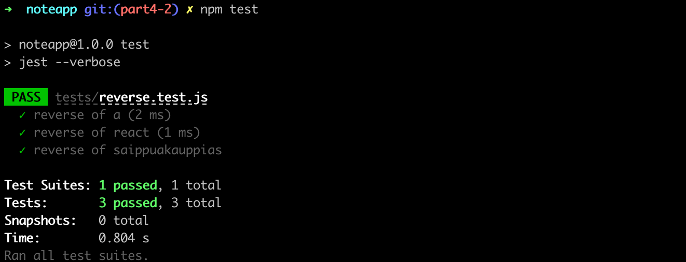
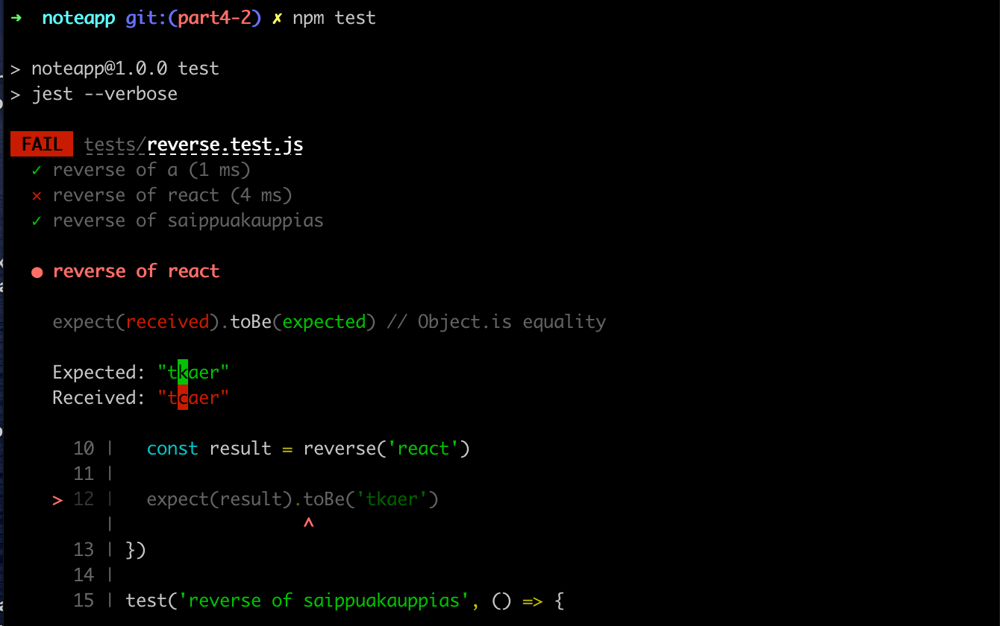
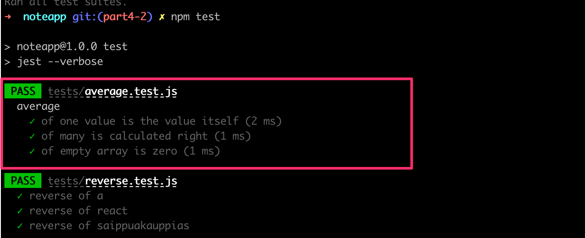

<div class="content">

Jatketaan [osassa 3](/osa3) tehdyn muistiinpanosovelluksen backendin kehittämistä.

### Sovelluksen rakenne

Ennen osan ensimmäistä isoa teemaa eli testaamista muutetaan sovelluksen rakennetta noudattamaan paremmin Noden yleisiä konventioita.

Seuraavassa läpikäytävien muutosten jälkeen sovelluksemme hakemistorakenne näyttää seuraavalta:

```bash
├── index.js
├── app.js
├── build
│   ├── ...
├── controllers
│   └── notes.js
├── models
│   └── note.js
├── package-lock.json
├── package.json
├── utils
│   ├── logger.js
│   ├── config.js
│   └── middleware.js  
```

Olemme toistaiseksi tulostelleet koodista erilaista loggaustietoa komennoilla <i>console.log</i> ja <i>console.error</i>, mutta tämä ei ole kovin järkevä käytäntö. Eristetään kaikki konsoliin tulostelu omaan moduliinsa <i>utils/logger.js</i>:

```js
const info = (...params) => {
  console.log(...params)
}

const error = (...params) => {
  console.error(...params)
}

module.exports = {
  info, error
}
```

Loggeri tarjoaa kaksi funktiota: normaaleihin logiviesteihin tarkoitetun funktion _info_ sekä virhetilanteisiin tarkoitetun funktion _error_.

Loggauksen eristäminen omaan moduuliinsa on monellakin tapaa järkevää. Jos esim. päätämme ruveta kirjoittamaan logeja tiedostoon tai keräämään niitä johonkin ulkoiseen palveluun kuten [Graylog](https://www.graylog.org/) tai [Papertrail](https://papertrailapp.com), on muutos helppo tehdä yhteen paikkaan.

Sovelluksen käynnistystiedosto <i>index.js</i> pelkistyy seuraavasti:

```js
const app = require('./app') // varsinainen Express-sovellus
const config = require('./utils/config')
const logger = require('./utils/logger')

app.listen(config.PORT, () => {
  logger.info(`Server running on port ${config.PORT}`)
})
```

<i>index.js</i> ainoastaan importtaa tiedostossa <i>app.js</i> olevan varsinaisen sovelluksen ja käynnistää sen. Käynnistymisestä kertova konsolitulostus tehdään logger-moduulin funktion _info_ avulla.

Nyt Express-sovellus sekä sen käynnistymisestä ja verkkoasetuksista huolehtiva koodi on eriytetty toisistaan [parhaita](https://dev.to/nermineslimane/always-separate-app-and-server-files--1nc7) [käytänteitä](https://nodejsbestpractices.com/sections/projectstructre/separateexpress) noudattaen. Eräs tämän tavan eduista on se, että sovelluksen toimintaa voi nyt testata API-tasolle tehtävien HTTP-kutsujen tasolla kuitenkaan tekemättä kutsuja varsinaisesti HTTP:llä verkon yli. Tämä tekee testien suorittamisesta nopeampaa.

Ympäristömuuttujien käsittely on eriytetty moduulin <i>utils/config.js</i> vastuulle:

```js
require('dotenv').config()

let PORT = process.env.PORT
let MONGODB_URI = process.env.MONGODB_URI

module.exports = {
  MONGODB_URI,
  PORT
}
```

Sovelluksen muut osat pääsevät ympäristömuuttujiin käsiksi importtaamalla konfiguraatiomoduulin:

```js
const config = require('./utils/config')

logger.info(`Server running on port ${config.PORT}`)
```

Routejen määrittely siirretään omaan tiedostoonsa, eli myös siitä tehdään moduuli. Routejen tapahtumankäsittelijöitä kutsutaan usein <i>kontrollereiksi</i>. Sovellukselle onkin luotu hakemisto <i>controllers</i> ja sinne tiedosto <i>notes.js</i>, johon kaikki muistiinpanoihin liittyvien reittien määrittelyt on siirretty:

```js
const notesRouter = require('express').Router()
const Note = require('../models/note')

notesRouter.get('/', (request, response) => {
  Note.find({}).then(notes => {
    response.json(notes)
  })
})

notesRouter.get('/:id', (request, response, next) => {
  Note.findById(request.params.id)
    .then(note => {
      if (note) {
        response.json(note)
      } else {
        response.status(404).end()
      }
    })
    .catch(error => next(error))
})

notesRouter.post('/', (request, response, next) => {
  const body = request.body

  const note = new Note({
    content: body.content,
    important: body.important || false,
  })

  note.save()
    .then(savedNote => {
      response.json(savedNote)
    })
    .catch(error => next(error))
})

notesRouter.delete('/:id', (request, response, next) => {
  Note.findByIdAndRemove(request.params.id)
    .then(() => {
      response.status(204).end()
    })
    .catch(error => next(error))
})

notesRouter.put('/:id', (request, response, next) => {
  const body = request.body

  const note = {
    content: body.content,
    important: body.important,
  }

  Note.findByIdAndUpdate(request.params.id, note, { new: true })
    .then(updatedNote => {
      response.json(updatedNote)
    })
    .catch(error => next(error))
})

module.exports = notesRouter
```

Kyseessä on käytännössä melkein suora copy-paste edellisen osan materiaalin tiedostosta <i>index.js</i>.

Muutoksia on muutama. Tiedoston alussa luodaan [router](http://expressjs.com/en/api.html#router)-olio:

```js
const notesRouter = require('express').Router()

//...

module.exports = notesRouter
```

Tiedosto eksporttaa moduulin käyttäjille määritellyn routerin.

Kaikki määriteltävät routet liitetään router-olioon, samaan tapaan kuin aiemmassa versiossa routet liitettiin sovellusta edustavaan olioon.

Huomionarvoinen seikka routejen määrittelyssä on se, että polut ovat typistyneet. Aiemmin määrittelimme esim.

```js
app.delete('/api/notes/:id', (request, response) => {
```

Nyt riittää määritellä

```js
notesRouter.delete('/:id', (request, response) => {
```

Mistä routereissa oikeastaan on kyse? Expressin manuaalin sanoin:

> <i>A router object is an isolated instance of middleware and routes. You can think of it as a “mini-application,” capable only of performing middleware and routing functions. Every Express application has a built-in app router.</i>

Router on siis <i>middleware</i>, jonka avulla on mahdollista määritellä joukko "toisiinsa liittyviä" routeja yhdessä paikassa, yleensä omassa moduulissaan.

Varsinaisen sovelluslogiikan määrittelevä tiedosto <i>app.js</i> ottaa määrittelemämme routerin käyttöön seuraavasti:

```js
const notesRouter = require('./controllers/notes')
app.use('/api/notes', notesRouter)
```

Näin määrittelemäämme routeria käytetään <i>jos</i> polun alkuosa on <i>/api/notes</i>. notesRouter-olion sisällä täytyy tämän takia käyttää ainoastaan polun loppuosia eli tyhjää polkua <i>/</i> tai pelkkää parametria <i>/:id</i>.

Sovelluksen määrittelevä <i>app.js</i> näyttää muutosten jälkeen seuraavalta:

```js
const config = require('./utils/config')
const express = require('express')
const app = express()
const cors = require('cors')
const notesRouter = require('./controllers/notes')
const middleware = require('./utils/middleware')
const logger = require('./utils/logger')
const mongoose = require('mongoose')

mongoose.set('strictQuery', false)

logger.info('connecting to', config.MONGODB_URI)

mongoose.connect(config.MONGODB_URI)
  .then(() => {
    logger.info('connected to MongoDB')
  })
  .catch((error) => {
    logger.error('error connection to MongoDB:', error.message)
  })

app.use(cors())
app.use(express.static('build'))
app.use(express.json())
app.use(middleware.requestLogger)

app.use('/api/notes', notesRouter)

app.use(middleware.unknownEndpoint)
app.use(middleware.errorHandler)

module.exports = app
```

Tiedostossa siis otetaan käyttöön joukko middlewareja, joista yksi on polkuun <i>/api/notes</i> kiinnitettävä <i>notesRouter</i> (tai notes-kontrolleri niin kuin jotkut sitä kutsuisivat).

Itse toteutettujen middlewarejen määrittely on siirretty tiedostoon <i>utils/middleware.js</i>:

```js
const logger = require('./logger')

const requestLogger = (request, response, next) => {
  logger.info('Method:', request.method)
  logger.info('Path:  ', request.path)
  logger.info('Body:  ', request.body)
  logger.info('---')
  next()
}

const unknownEndpoint = (request, response) => {
  response.status(404).send({ error: 'unknown endpoint' })
}

const errorHandler = (error, request, response, next) => {
  logger.error(error.message)

  if (error.name === 'CastError') {
    return response.status(400).send({ error: 'malformatted id' })
  } else if (error.name === 'ValidationError') {
    return response.status(400).json({ error: error.message })
  }

  next(error)
}

module.exports = {
  requestLogger,
  unknownEndpoint,
  errorHandler
}
```

Tietokantayhteyden muodostaminen on siirretty tiedoston <i>app.js</i>:n vastuulle. Hakemistossa <i>models</i> oleva tiedosto <i>note.js</i> sisältää nyt ainoastaan muistiinpanojen skeeman määrittelyn.

```js
const mongoose = require('mongoose')

const noteSchema = new mongoose.Schema({
  content: {
    type: String,
    required: true,
    minlength: 5
  },
  important: Boolean,
})

noteSchema.set('toJSON', {
  transform: (document, returnedObject) => {
    returnedObject.id = returnedObject._id.toString()
    delete returnedObject._id
    delete returnedObject.__v
  }
})

module.exports = mongoose.model('Note', noteSchema)
```

Sovelluksen hakemistorakenne näyttää siis refaktoroinnin jälkeen seuraavalta:

```bash
├── index.js
├── app.js
├── build
│   ├── ...
├── controllers
│   └── notes.js
├── models
│   └── note.js
├── package-lock.json
├── package.json
├── utils
│   ├── config.js
│   └── logger.js  
│   └── middleware.js  
```

Jos sovellus on pieni, ei rakenteella ole kovin suurta merkitystä. Sovelluksen kasvaessa sille kannattaa muodostaa jonkinlainen rakenne eli arkkitehtuuri ja jakaa erilaiset vastuut omiin moduuleihinsa. Tämä helpottaa huomattavasti ohjelman jatkokehitystä.

Express-sovelluksien rakenteelle eli hakemistojen ja tiedostojen nimeämiselle ei ole olemassa mitään yleismaailmallista standardia samaan tapaan kuin esim. Ruby on Railsissa. Tässä käyttämämme malli noudattaa eräitä Internetissä vastaan tulevia hyviä käytäntöjä.

Sovelluksen tämänhetkinen koodi on kokonaisuudessaan [GitHubissa](https://github.com/fullstack-hy2020/part3-notes-backend/tree/part4-1) branchissa <i>part4-1</i>.

Jos kloonaat projektin itsellesi, suorita komento _npm install_ ennen käynnistämistä eli komentoa _npm start_.

### Huomio eksporteista

Olemme käyttäneet tässä osassa kahta eri tapaa eksporttaukseen. Esimerkiksi tiedostossa <i>utils/logger.js</i> eksporttaus tapahtuu seuraavasti:

```js
const info = (...params) => {
  console.log(...params)
}

const error = (...params) => {
  console.error(...params)
}

// highlight-start
module.exports = {
  info, error
}
// highlight-end
```

Tiedosto eksporttaa olion, joka sisältää kenttinään kaksi funktiota. Funktioihin päästään käsiksi kahdella vaihtoehtoisella tavalla. Voidaan joko ottaa käyttöön koko eksportoitava olio, jolloin funktioihin viitataan olion kautta:

```js
const logger = require('./utils/logger')

logger.info('message')

logger.error('error message')
```

Toinen vaihtoehto on destrukturoida funktiot omiin muuttujiin <i>require</i>-kutsun yhteydessä:

```js
const { info, error } = require('./utils/logger')

info('message')
error('error message')
```

Jälkimäinen tapa voi olla selkeämpi erityisesti jos ollaan kiinnostunut ainoastaan joistain eksportatuista funktioista.

Tiedostossa <i>controller/notes.js</i> eksporttaus taas tapahtuu seuraavasti

```js
const notesRouter = require('express').Router()
const Note = require('../models/note')

// ...

module.exports = notesRouter // highlight-line
```

Tässä tapauksessa exportataan ainoastaan yksi "asia", joten mahdollisia käyttötapojakin on vain yksi:

```js
const notesRouter = require('./controllers/notes')

// ...

app.use('/api/notes', notesRouter)
```

Eli eksportoitava asia (tässä tilanteessa router-olio) sijoitetaan muuttujaan ja käytetään sitä sellaisenaan.

</div>

<div class="tasks">

### Tehtävät 4.1.-4.2.

Rakennamme tämän osan tehtävissä <i>blogilistasovellusta</i>, jonka avulla käyttäjien on mahdollista tallettaa tietoja Internetistä löytämistään mielenkiintoisista blogeista. Kustakin blogista talletetaan sen kirjoittaja (author), aihe (title), url sekä blogilistasovelluksen käyttäjien antamien äänien määrä.


#### 4.1 blogilista, step1

Kuvitellaan tilanne, jossa saat sähköpostitse seuraavan, yhteen tiedostoon koodatun sovellusrungon:

```js
const http = require('http')
const express = require('express')
const app = express()
const cors = require('cors')
const mongoose = require('mongoose')

const blogSchema = mongoose.Schema({
  title: String,
  author: String,
  url: String,
  likes: Number
})

const Blog = mongoose.model('Blog', blogSchema)

const mongoUrl = 'mongodb://localhost/bloglist'
mongoose.connect(mongoUrl)

app.use(cors())
app.use(express.json())

app.get('/api/blogs', (request, response) => {
  Blog
    .find({})
    .then(blogs => {
      response.json(blogs)
    })
})

app.post('/api/blogs', (request, response) => {
  const blog = new Blog(request.body)

  blog
    .save()
    .then(result => {
      response.status(201).json(result)
    })
})

const PORT = 3003
app.listen(PORT, () => {
  console.log(`Server running on port ${PORT}`)
})
```

Tee sovelluksesta toimiva <i>npm</i>-projekti. Jotta sovelluskehitys olisi sujuvaa, konfiguroi sovellus suoritettavaksi <i>nodemonilla</i>. Voit luoda sovellukselle uuden tietokannan MongoDB Atlasiin tai käyttää edellisen osan sovelluksen tietokantaa.

Varmista, että sovellukseen on mahdollista lisätä blogeja Postmanilla tai VS Code REST Clientilla ja että sovellus näyttää lisätyt blogit.

#### 4.2 blogilista, step2

Jaa sovelluksen koodi tämän osan alun tapaan useaan moduuliin.

**HUOM:** Etene todella pienin askelin ja varmistaen, että kaikki toimii koko ajan. Jos yrität "oikaista" tekemällä monta asiaa kerralla, on [Murphyn lain](https://fi.wikipedia.org/wiki/Murphyn_laki) perusteella käytännössä varmaa, että jokin menee pahasti pieleen ja "oikotien" takia maaliin päästään paljon myöhemmin kuin systemaattisin pienin askelin.

Paras käytänne on commitoida koodi aina stabiilissa tilanteessa. Tällöin on helppo palata aina toimivaan tilanteeseen jos koodi menee liian solmuun.

</div>

<div class="content">

### Node-sovellusten testaaminen

Olemme laiminlyöneet ikävästi yhtä oleellista ohjelmistokehityksen osa-aluetta, automatisoitua testaamista.

Aloitamme yksikkötestauksesta. Sovelluksemme logiikka on sen verran yksinkertaista, että siinä ei ole juurikaan mielekästä yksikkötestattavaa. Luodaan tiedosto <i>utils/for_testing.js</i> ja määritellään sinne pari yksinkertaista funktiota testattavaksi:

```js
const reverse = (string) => {
  return string
    .split('')
    .reverse()
    .join('')
}

const average = (array) => {
  const reducer = (sum, item) => {
    return sum + item
  }

  return array.reduce(reducer, 0) / array.length
}

module.exports = {
  reverse,
  average,
}
```

> Metodi _average_ käyttää taulukoiden metodia [reduce](https://developer.mozilla.org/en-US/docs/Web/JavaScript/Reference/Global_Objects/Array/Reduce). Jos metodi ei ole vieläkään tuttu, on korkea aika katsoa YouTubesta [Functional JavaScript](https://www.youtube.com/watch?v=BMUiFMZr7vk&list=PL0zVEGEvSaeEd9hlmCXrk5yUyqUag-n84) ‑sarjasta ainakin kolme ensimmäistä videoa.

JavaScriptiin on tarjolla runsaasti erilaisia testikirjastoja eli <i>test runnereita</i>. Käytämme tällä kurssilla Facebookin kehittämää ja sisäisesti käyttämää [Jest](https://jestjs.io/):iä, joka on toiminnaltaan ja syntaksiltaankin hyvin samankaltainen kuin testikirjastojen entinen kuningas [Mocha](https://mochajs.org/).

Jest on tälle kurssille luonteva valinta, sillä se sopii hyvin backendien testaamiseen, mutta suorastaan loistaa Reactilla tehtyjen frontendien testauksessa.

> <i>**Huomio Windows-käyttäjille:**</i> Jest ei välttämättä toimi, jos projektin hakemistopolulla on hakemisto, jonka nimessä on välilyöntejä.

Koska testejä on tarkoitus suorittaa ainoastaan sovellusta kehitettäessä, asennetaan Jest <i>kehitysaikaiseksi riippuvuudeksi</i> komennolla

```bash
npm install --save-dev jest
```

Määritellään npm-skripti <i>test</i> suorittamaan testaus Jestillä ja raportoimaan testien suorituksesta <i>verbose</i>-tyylillä:

```bash
{
  //...
  "scripts": {
    "start": "node index.js",
    "dev": "nodemon index.js",
    "build:ui": "rm -rf build && cd ../frontend/ && npm run build && cp -r build ../backend",
    "deploy": "fly deploy",
    "deploy:full": "npm run build:ui && npm run deploy",
    "logs:prod": "fly logs",
    "lint": "eslint .",
    "test": "jest --verbose" // highlight-line
  },
  //...
}
```

Jestille pitää vielä kertoa, että suoritusympäristönä on käytössä Node. Tämä tapahtuu esim. lisäämällä <i>package.json</i> tiedoston loppuun seuraavaa:

```js
{
 //...
 "jest": {
   "testEnvironment": "node"
 }
}
```

Tehdään testejä varten hakemisto <i>tests</i> ja sinne tiedosto <i>reverse.test.js</i>, jonka sisältö on seuraava:

```js
const reverse = require('../utils/for_testing').reverse

test('reverse of a', () => {
  const result = reverse('a')

  expect(result).toBe('a')
})

test('reverse of react', () => {
  const result = reverse('react')

  expect(result).toBe('tcaer')
})

test('reverse of saippuakauppias', () => {
  const result = reverse('saippuakauppias')

  expect(result).toBe('saippuakauppias')
})
```

Edellisessä osassa käyttöön ottamamme ESLint valittaa testien käyttämistä komennoista _test_ ja _expect_ sillä käyttämämme konfiguraatio kieltää <i>globaalina</i> määriteltyjen asioiden käytön. Poistetaan valitus lisäämällä <i>.eslintrc.js</i>-tiedoston kenttään <i>env</i> arvo <i>"jest": true</i>. Näin kerromme ESLintille, että käytämme projektissamme Jestiä ja sen globaaleja muuttujia.

```js
module.exports = {
  'env': {
    'commonjs': true,
    'es2021': true,
    'node': true,
    'jest': true, // highlight-line
  },
  // ...
}
```

Testi ottaa ensimmäisellä rivillä käyttöön testattavan funktion sijoittaen sen muuttujaan _reverse_:

```js
const reverse = require('../utils/for_testing').reverse
```

Yksittäiset testitapaukset määritellään funktion _test_ avulla. Ensimmäisenä parametrina on merkkijonomuotoinen testin kuvaus. Toisena parametrina on <i>funktio</i>, joka määrittelee testitapauksen toiminnallisuuden. Esim. toisen testitapauksen toiminnallisuus näyttää seuraavalta:

```js
() => {
  const result = reverse('react')

  expect(result).toBe('tcaer')
}
```

Ensin suoritetaan testattava koodi eli generoidaan merkkijonon <i>react</i> palindromi. Seuraavaksi varmistetaan tulos metodin [expect](https://jestjs.io/docs/expect#expectvalue) avulla. Expect käärii tuloksena olevan arvon olioon, joka tarjoaa joukon <i>matcher</i>-funktioita, joiden avulla tuloksen oikeellisuutta voidaan tarkastella. Koska kyse on kahden merkkijonon samuuden vertailusta, sopii tilanteeseen matcheri [toBe](https://jestjs.io/docs/expect#tobevalue).

Kuten odotettua, testit menevät läpi:



Jest olettaa oletusarvoisesti, että testitiedoston nimessä on merkkijono <i>.test</i>. Käytetään kurssilla konventiota, jossa testitiedostojen nimen loppu on <i>.test.js</i>.

Jestin antamat virheilmoitukset ovat hyviä. Rikotaan testi:

```js
test('reverse of react', () => {
  const result = reverse('react')

  expect(result).toBe('tkaer')
})
```

Seurauksena on seuraava virheilmoitus:



Lisätään tiedostoon <i>tests/average.test.js</i> muutama testi metodille _average_:

```js
const average = require('../utils/for_testing').average

describe('average', () => {
  test('of one value is the value itself', () => {
    expect(average([1])).toBe(1)
  })

  test('of many is calculated right', () => {
    expect(average([1, 2, 3, 4, 5, 6])).toBe(3.5)
  })

  test('of empty array is zero', () => {
    expect(average([])).toBe(0)
  })
})
```

Testi paljastaa, että metodi toimii väärin tyhjällä taulukolla (sillä nollalla jaon tulos on JavaScriptissä <i>NaN</i>):


Metodi on helppo korjata:

```js
const average = array => {
  const reducer = (sum, item) => {
    return sum + item
  }
  return array.length === 0
    ? 0 
    : array.reduce(reducer, 0) / array.length
}
```

Eli jos taulukon pituus on 0, palautetaan 0 ja muussa tapauksessa palautetaan metodin _reduce_ avulla laskettu keskiarvo.

Pari huomiota keskiarvon testeistä. Määrittelimme testien ympärille nimellä _average_ varustetun <i>describe</i>-lohkon:

```js
describe('average', () => {
  // tests
})
```

Describejen avulla yksittäisessä tiedostossa olevat testit voidaan jaotella loogisiin kokonaisuuksiin. Testituloste hyödyntää myös describe-lohkon nimeä:



Kuten myöhemmin tulemme näkemään, <i>describe</i>-lohkot ovat tarpeellisia, jos haluamme osalle yksittäisen testitiedoston testitapauksista joitain yhteisiä alustus- tai lopetustoimenpiteitä.

Toisena huomiona se, että kirjoitimme testit aavistuksen tiiviimmässä muodossa, ottamatta testattavan metodin tulosta erikseen apumuuttujaan:

```js
test('of empty array is zero', () => {
  expect(average([])).toBe(0)
})
```

</div>

<div class="tasks">

### Tehtävät 4.3.-4.7.

Tehdään joukko blogilistan käsittelyyn tarkoitettuja apufunktioita. Tee funktiot esim. tiedostoon <i>utils/list_helper.js</i>. Tee testit sopivasti nimettyyn tiedostoon hakemistoon <i>tests</i>.

#### 4.3: apufunktioita ja yksikkötestejä, step1

Määrittele ensin funktio _dummy_, joka saa parametrikseen taulukollisen blogeja ja palauttaa aina luvun 1. Tiedoston <i>list_helper.js</i> sisällöksi siis tulee tässä vaiheessa:

```js
const dummy = (blogs) => {
  // ...
}

module.exports = {
  dummy
}
```

Varmista testikonfiguraatiosi toimivuus seuraavalla testillä:

```js
const listHelper = require('../utils/list_helper')

test('dummy returns one', () => {
  const blogs = []

  const result = listHelper.dummy(blogs)
  expect(result).toBe(1)
})
```

#### 4.4: apufunktioita ja yksikkötestejä, step2

Määrittele funktio _totalLikes_, joka saa parametrikseen taulukollisen blogeja. Funktio palauttaa blogien yhteenlaskettujen tykkäysten eli <i>likejen</i> määrän.

Määrittele funktiolle sopivat testit. Funktion testit kannattaa laittaa <i>describe</i>-lohkoon jolloin testien tulostus ryhmittyy miellyttävästi:


Testisyötteiden määrittely onnistuu esim. seuraavaan tapaan:

```js
describe('total likes', () => {
  const listWithOneBlog = [
    {
      _id: '5a422aa71b54a676234d17f8',
      title: 'Go To Statement Considered Harmful',
      author: 'Edsger W. Dijkstra',
      url: 'http://www.u.arizona.edu/~rubinson/copyright_violations/Go_To_Considered_Harmful.html',
      likes: 5,
      __v: 0
    }
  ]

  test('when list has only one blog equals the likes of that', () => {
    const result = listHelper.totalLikes(listWithOneBlog)
    expect(result).toBe(5)
  })
})
```

Jos et viitsi itse määritellä testisyötteenä käytettäviä blogeja, saat valmiin listan [täältä](https://raw.githubusercontent.com/fullstack-hy2020/misc/master/blogs_for_test.md).

Törmäät testien tekemisen yhteydessä varmasti erinäisiin ongelmiin. Pidä mielessä osassa 3 käsitellyt [debuggaukseen](/osa3/tietojen_tallettaminen_mongo_db_tietokantaan#node-sovellusten-debuggaaminen) liittyvät asiat. Voit testejäkin suorittaessasi printtailla konsoliin komennolla _console.log_. Myös debuggerin käyttö testejä suorittaessa on mahdollista, ohje on [täällä](https://jestjs.io/docs/troubleshooting).

**HUOM:** Jos jokin testi ei mene läpi, ei ongelmaa korjatessa kannata suorittaa kaikkia testejä, vaan ainoastaan rikkinäistä testiä hyödyntäen [only](https://jestjs.io/docs/api#testonlyname-fn-timeout)-metodia. 

Toinen tapa suorittaa yksittäinen testi (tai describe-lohko) on määritellä suoritettava testi argumentin [-t](https://jestjs.io/docs/en/cli.html) avulla:

```js
npm test -- -t 'when list has only one blog, equals the likes of that'
```

#### 4.5*: apufunktioita ja yksikkötestejä, step3

Määrittele funktio _favoriteBlog_, joka saa parametrikseen taulukollisen blogeja. Funktio selvittää millä blogilla on eniten tykkäyksiä. Jos suosikkeja on monta, riittää että funktio palauttaa niistä jonkun.

Paluuarvo voi olla esim. seuraavassa muodossa:

```js
{
  title: "Canonical string reduction",
  author: "Edsger W. Dijkstra",
  likes: 12
}
```

**Huomaa**, että kun vertailet olioita, metodi [toEqual](https://jestjs.io/docs/expect#toequalvalue) on todennäköisesti se mitä haluat käyttää. [toBe](https://jestjs.io/docs/expect#tobevalue)-vertailu, joka sopii esim. lukujen ja merkkijonojen vertailuun, vaatisi olioiden vertailussa, että oliot ovat samat, pelkkä sama sisältö ei riitä.

Tee myös tämän ja seuraavien kohtien testit kukin oman <i>describe</i>-lohkonsa sisälle.

#### 4.6*: apufunktioita ja yksikkötestejä, step4

Tämä ja seuraava tehtävä ovat jo hieman haastavampia. Tehtävien tekeminen ei ole osan jatkon kannalta oleellista, eli voi olla hyvä idea palata näihin vasta kun muu osa on kahlattu läpi.

Tehtävän tekeminen onnistuu hyvin ilman mitään kirjastojakin, mutta tämä saattaa olla hyvä paikka tutustua kokoelmien käsittelyä suuresti helpottavaan [Lodash](https://lodash.com/)-kirjastoon.

Määrittele funktio _mostBlogs_, joka saa parametrikseen taulukollisen blogeja. Funktio selvittää <i>kirjoittajan</i>, jolla on eniten blogeja. Funktion paluuarvo kertoo myös ennätysbloggaajan blogien määrän:

```js
{
  author: "Robert C. Martin",
  blogs: 3
}
```

Jos ennätysbloggaajia on monta, riittää että funktio palauttaa niistä jonkun.

#### 4.7*: apufunktioita ja yksikkötestejä, step5

Määrittele funktio _mostLikes_, joka saa parametrikseen taulukollisen blogeja. Funktio selvittää kirjoittajan, jonka blogeilla on eniten tykkäyksiä. Funktion paluuarvo kertoo myös suosikkibloggaajan likejen yhteenlasketun määrän:

```js
{
  author: "Edsger W. Dijkstra",
  likes: 17
}
```

Jos suosikkibloggaajia on monta, riittää että funktio palauttaa niistä jonkun.

</div>
