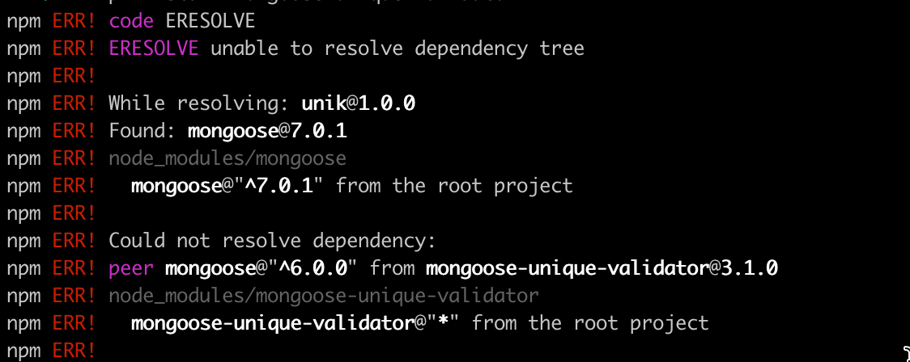
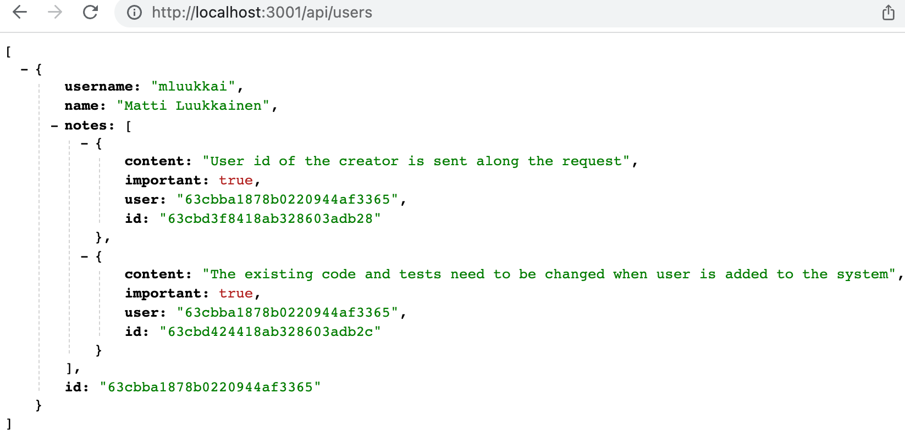
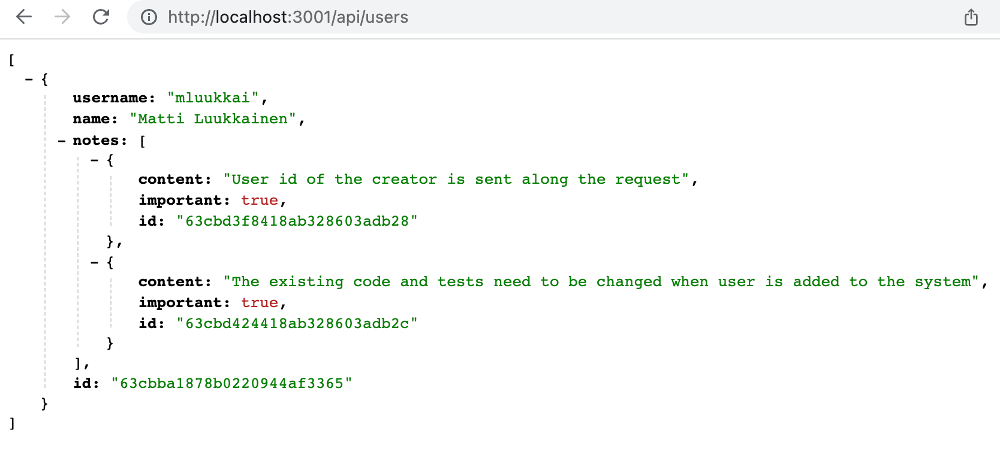
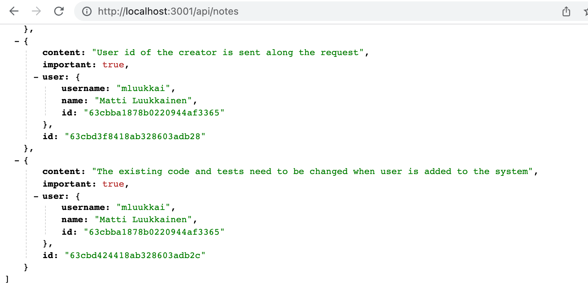

<div class="content">

Queremos adicionar autenticação e autorização do usuário ao nosso aplicativo. Os usuários devem ser armazenados no banco de dados e cada nota deve ser vinculada ao usuário que a criou. Excluir e editar uma nota só deve ser permitido para o usuário que a criou.

Vamos começar adicionando informações sobre usuários ao banco de dados. Existe uma relação um-para-muitos entre o usuário (<i>Usuário</i>) e as notas (<i>Nota</i>):


Se estivéssemos trabalhando com um banco de dados relacional, a implementação seria direta. Ambos os recursos teriam suas tabelas de banco de dados separadas e o id do usuário que criou uma nota seria armazenado na tabela notas como uma chave estrangeira.

Ao trabalhar com bancos de dados de documentos, a situação é um pouco diferente, pois há muitas maneiras diferentes de modelar a situação.

A solução existente salva cada nota na <i>coleção de notas</i> no banco de dados. Se não quisermos alterar essa coleção existente, a escolha natural é salvar os usuários em sua própria coleção, <i>usuários<i> por exemplo.

Como em todos os bancos de dados de documentos, podemos usar IDs de objeto no Mongo para fazer referência a documentos em outras coleções. Isso é semelhante ao uso de chaves estrangeiras em bancos de dados relacionais.

Tradicionalmente, os bancos de dados de documentos, como o Mongo, não oferecem suporte a <i>join queries</i> que estão disponíveis em bancos de dados relacionais, usados ​​para agregar dados de várias tabelas. No entanto, a partir da versão 3.2, o Mongo oferece suporte a [consultas de agregação de pesquisa](https://docs.mongodb.com/manual/reference/operator/aggregation/lookup/). Não veremos essa funcionalidade neste curso.

Se precisarmos de funcionalidade semelhante a consultas de junção, iremos implementá-la em nosso aplicativo fazendo várias consultas. Em certas situações, o Mongoose pode cuidar da junção e agregação de dados, o que dá a aparência de uma consulta de junção. No entanto, mesmo nessas situações, o Mongoose faz várias consultas ao banco de dados em segundo plano.

### Referências entre coleções

Se estivéssemos usando um banco de dados relacional, a nota conteria uma <i>chave estrangeira</i> para o usuário que a criou. Em bancos de dados de documentos, podemos fazer a mesma coisa.

Vamos supor que a coleção <i>users</i> contém dois usuários:

```js
[
  {
    username: 'mluukkai',
    _id: 123456,
  },
  {
    username: 'hellas',
    _id: 141414,
  },
]
```

A coleção <i>notes</i> contém três notas, todas elas com um campo <i>user</i> que faz referência a um usuário na coleção <i>users</i>:

```js
[
  {
    content: 'HTML is easy',
    important: false,
    _id: 221212,
    user: 123456,
  },
  {
    content: 'The most important operations of HTTP protocol are GET and POST',
    important: true,
    _id: 221255,
    user: 123456,
  },
  {
    content: 'A proper dinosaur codes with Java',
    important: false,
    _id: 221244,
    user: 141414,
  },
]
```

Os bancos de dados de documentos não exigem que a chave estrangeira seja armazenada nos recursos de nota, ela <i>também</i> pode ser armazenada na coleção users ou até mesmo em ambos:

```js
[
  {
    username: 'mluukkai',
    _id: 123456,
    notes: [221212, 221255],
  },
  {
    username: 'hellas',
    _id: 141414,
    notes: [221244],
  },
]
```

Como os usuários podem ter muitas notas, os IDs relacionados são armazenados em uma matriz no campo de <i>notas</i>.

Os bancos de dados de documentos também oferecem uma maneira radicalmente diferente de organizar os dados: em algumas situações, pode ser benéfico aninhar todo o array de notas como parte dos documentos na coleção users:

```js
[
  {
    username: 'mluukkai',
    _id: 123456,
    notes: [
      {
        content: 'HTML is easy',
        important: false,
      },
      {
        content: 'The most important operations of HTTP protocol are GET and POST',
        important: true,
      },
    ],
  },
  {
    username: 'hellas',
    _id: 141414,
    notes: [
      {
        content:
          'A proper dinosaur codes with Java',
        important: false,
      },
    ],
  },
]
```

Nesse esquema, as notas seriam fortemente aninhadas nos usuários e o banco de dados não geraria ids para eles.

A estrutura e o esquema do banco de dados não são tão evidentes como eram nos bancos de dados relacionais. O esquema escolhido deve oferecer o melhor suporte aos casos de uso do aplicativo. Esta não é uma decisão de design simples de ser tomada, pois todos os casos de uso dos aplicativos não são conhecidos quando a decisão de design é tomada.

Paradoxalmente, bancos de dados sem esquema como o Mongo exigem que os desenvolvedores tomem decisões de design muito mais radicais sobre a organização de dados no início do projeto do que bancos de dados relacionais com esquemas. Em média, os bancos de dados relacionais oferecem uma maneira mais ou menos adequada de organizar dados para muitos aplicativos.

### Esquema Mongoose para usuários

Neste caso, decidimos armazenar os ids das notas criadas pelo usuário no documento <i>user</i>. Vamos definir o modelo para representar um usuário no arquivo <i>models/user.js</i>:

```js
const mongoose = require('mongoose')

const userSchema = new mongoose.Schema({
  username: String,
  name: String,
  passwordHash: String,
  notes: [
    {
      type: mongoose.Schema.Types.ObjectId,
      ref: 'Note'
    }
  ],
})

userSchema.set('toJSON', {
  transform: (document, returnedObject) => {
    returnedObject.id = returnedObject._id.toString()
    delete returnedObject._id
    delete returnedObject.__v
    // the passwordHash should not be revealed
    delete returnedObject.passwordHash
  }
})

const User = mongoose.model('User', userSchema)

module.exports = User
```

Os ids das notas são armazenados no documento <i>user</i> como uma matriz de ids do Mongo. A definição é a seguinte:

```js
{
  type: mongoose.Schema.Types.ObjectId,
  ref: 'Note'
}
```

O tipo do campo é <i>ObjectId</i> que faz referência a documentos de estilo <i>Note</i>. O Mongo não sabe inerentemente que este é um campo que faz referência a notas, a sintaxe é puramente relacionada e definida pelo Mongoose.

Vamos expandir o esquema da nota definida no arquivo <i>models/note.js</i> de modo que que a nota contenha informações sobre o usuário que a criou:

```js
const noteSchema = new mongoose.Schema({
  content: {
    type: String,
    required: true,
    minlength: 5
  },
  important: Boolean,
  // highlight-start
  user: {
    type: mongoose.Schema.Types.ObjectId,
    ref: 'User'
  }
  // highlight-end
})
```

Em total contraste com as convenções dos bancos de dados relacionais, as <i>referências agora são armazenadas em ambos os documentos</i>: a nota faz referência ao usuário que a criou e o usuário tem um array de referências a todas as notas criadas por ele.

### Criando usuários

Vamos implementar uma rota para criar novos usuários. Os usuários têm um <i>username</i> exclusivo, um <i>name</i> e algo chamado <i>passwordHash</i>. O hash da senha é a saída de uma  [função hash unidirecional](https://en.wikipedia.org/wiki/Cryptographic_hash_function)  aplicada à senha do usuário. Nunca é aconselhável armazenar senhas de texto simples não criptografadas no banco de dados!

Vamos instalar o pacote [bcrypt](https://github.com/kelektiv/node.bcrypt.js) para gerar os hashes de senha:

```bash
npm install bcrypt
```

A criação de novos usuários ocorre em conformidade com as convenções RESTful discutidas na [part 3](/ptbr/part3/node_js_and_express#rest), fazendo uma solicitação HTTP POST para o caminho <i>users</i>.

Vamos definir um <i>roteador</i> separado para lidar com usuários em um novo arquivo <i>controllers/users.js</i>. Vamos colocar o roteador em uso em nossa aplicação no arquivo <i>app.js</i>, para que ele trate as solicitações feitas à url <i>/api/users</i>:

```js
const usersRouter = require('./controllers/users')

// ...

app.use('/api/users', usersRouter)
```

O conteúdo do arquivo que define o roteador é o seguinte:

```js
const bcrypt = require('bcrypt')
const usersRouter = require('express').Router()
const User = require('../models/user')

usersRouter.post('/', async (request, response) => {
  const { username, name, password } = request.body

  const saltRounds = 10
  const passwordHash = await bcrypt.hash(password, saltRounds)

  const user = new User({
    username,
    name,
    passwordHash,
  })

  const savedUser = await user.save()

  response.status(201).json(savedUser)
})

module.exports = usersRouter
```

A senha enviada na solicitação <i>não</i> é armazenada no banco de dados. Armazenamos o <i>hash</i> da senha que é gerada com a função _bcrypt.hash_.

Os fundamentos do [armazenamento de senhas](https://codahale.com/how-to-safely-store-a-password/) estão fora do escopo deste material do curso. Não discutiremos o que significa o número mágico 10 atribuído à variável [saltRounds](https://github.com/kelektiv/node.bcrypt.js/#a-note-on-rounds), mas você pode ler mais sobre isso no material vinculado.

Nosso código atual não contém nenhum tratamento de erro ou validação de entrada para verificar se o nome de usuário e a senha estão no formato desejado.

O novo recurso pode e deve inicialmente ser testado manualmente com uma ferramenta como o Postman. No entanto, testar as coisas manualmente rapidamente se tornará muito complicado, especialmente depois que implementarmos a funcionalidade que impõe que os nomes de usuário sejam exclusivos.

É preciso muito menos esforço para escrever testes automatizados e facilitará muito o desenvolvimento da nossa aplicação.

Nossos testes iniciais podem ficar assim:

```js
const bcrypt = require('bcrypt')
const User = require('../models/user')

//...

describe('when there is initially one user in db', () => {
  beforeEach(async () => {
    await User.deleteMany({})

    const passwordHash = await bcrypt.hash('sekret', 10)
    const user = new User({ username: 'root', passwordHash })

    await user.save()
  })

  test('creation succeeds with a fresh username', async () => {
    const usersAtStart = await helper.usersInDb()

    const newUser = {
      username: 'mluukkai',
      name: 'Matti Luukkainen',
      password: 'salainen',
    }

    await api
      .post('/api/users')
      .send(newUser)
      .expect(201)
      .expect('Content-Type', /application\/json/)

    const usersAtEnd = await helper.usersInDb()
    expect(usersAtEnd).toHaveLength(usersAtStart.length + 1)

    const usernames = usersAtEnd.map(u => u.username)
    expect(usernames).toContain(newUser.username)
  })
})
```

Os testes usam a função auxiliar <i>usersInDb()</i> que implementamos no arquivo <i>tests/test_helper.js</i>. A função é usada para nos ajudar a verificar o estado do banco de dados após um usuário for criado:

```js
const User = require('../models/user')

// ...

const usersInDb = async () => {
  const users = await User.find({})
  return users.map(u => u.toJSON())
}

module.exports = {
  initialNotes,
  nonExistingId,
  notesInDb,
  usersInDb,
}
```

O bloco <i>beforeEach</i> adiciona um usuário com o nome de usuário <i>root</i> ao banco de dados. Podemos escrever um novo teste que verifique se um novo usuário com o mesmo nome de usuário não pode ser criado:

```js
describe('when there is initially one user in db', () => {
  // ...

  test('creation fails with proper statuscode and message if username already taken', async () => {
    const usersAtStart = await helper.usersInDb()

    const newUser = {
      username: 'root',
      name: 'Superuser',
      password: 'salainen',
    }

    const result = await api
      .post('/api/users')
      .send(newUser)
      .expect(400)
      .expect('Content-Type', /application\/json/)

    expect(result.body.error).toContain('expected `username` to be unique')

    const usersAtEnd = await helper.usersInDb()
    expect(usersAtEnd).toEqual(usersAtStart)
  })
})
```

O caso de teste, obviamente, não passará neste ponto. Estamos essencialmente praticando o [desenvolvimento orientado a testes (TDD)](https://en.wikipedia.org/wiki/Test-driven_development), em que os testes para novas funcionalidades são escritos antes que a funcionalidade seja implementada.

O Mongoose não possui um validador integrado para verificar a exclusividade de um campo. Felizmente existe uma solução pronta para isso, a biblioteca [mongoose-unique-validator](https://www.npmjs.com/package/mongoose-unique-validator). Vamos instalar a biblioteca:

```bash
npm install mongoose-unique-validator
```

e amplie o código seguindo a documentação da biblioteca:

```js
const mongoose = require('mongoose')
const uniqueValidator = require('mongoose-unique-validator') // highlight-line

const userSchema = mongoose.Schema({
  // highlight-start
  username: {
    type: String,
    required: true,
    unique: true
  },
  // highlight-end
  name: String,
  passwordHash: String,
  notes: [
    {
      type: mongoose.Schema.Types.ObjectId,
      ref: 'Note'
    }
  ],
})

userSchema.plugin(uniqueValidator) // highlight-line

// ...
```

Nota: ao instalar a biblioteca mongoose-unique-validator, você pode encontrar a seguinte mensagem de erro:



A razão para isso é que a biblioteca ainda não é compatível com a versão 7 do Mongoose no momento da redação (13 de março de 2023). Se você encontrar um erro, poderá fazer o downgrade para uma versão mais antiga do Mongoose executando o comando

```js
npm install mongoose@6
```

Depois disso, você pode instalar a biblioteca mongoose-unique-validator sem problemas.

Também poderíamos implementar outras validações na criação do usuário. Poderíamos verificar se o nome de usuário é longo o suficiente, se o nome de usuário consiste apenas em caracteres permitidos ou se a senha é forte o suficiente. A implementação dessas funcionalidades é deixada como um exercício opcional.

Antes de prosseguirmos, vamos adicionar uma implementação inicial de um manipulador de rota que retorna todos os usuários do banco de dados:

```js
usersRouter.get('/', async (request, response) => {
  const users = await User.find({})
  response.json(users)
})
```
Para criar novos usuários em um ambiente de produção ou desenvolvimento, você pode enviar uma solicitação POST para ```/api/users/``` via Postman ou REST Client no seguinte formato:

```js
{
    "username": "root",
    "name": "Superuser",
    "password": "salainen"
}

```

A lista fica assim:


Você pode encontrar o código da nossa aplicação atual na íntegra na branch <i>part4-7</i> [deste repositório GitHub](https://github.com/fullstack-hy2020/part3-notes-backend/tree/part4-7).

### Criando uma nova nota

O código para criar uma nova nota deve ser atualizado para que a nota seja atribuída ao usuário que a criou.

Vamos expandir nossa implementação atual para que as informações sobre o usuário que criou uma nota sejam enviadas no campo <i>userId</i> do corpo da solicitação:

```js
const User = require('../models/user') //highlight-line

//...

notesRouter.post('/', async (request, response) => {
  const body = request.body

  const user = await User.findById(body.userId) //highlight-line

  const note = new Note({
    content: body.content,
    important: body.important === undefined ? false : body.important,
    user: user.id //highlight-line
  })

  const savedNote = await note.save()
  user.notes = user.notes.concat(savedNote._id) //highlight-line
  await user.save()  //highlight-line
  
  response.json(savedNote)
})
```

Vale a pena notar que o objeto do <i>usuário</i> também muda. O <i>id</i> da nota é armazenado no campo <i>notas</i>:

```js
const user = await User.findById(body.userId)

// ...

user.notes = user.notes.concat(savedNote._id)
await user.save()
```

Vamos tentar criar uma nova nota


A operação parece funcionar. Vamos adicionar mais uma nota e depois visitar a rota para buscar todos os usuários:


Podemos ver que o usuário tem duas notas.

Da mesma forma, os ids dos usuários que criaram as notas podem ser vistos quando visitamos a rota para buscar todas as notas:


### Popular

Gostaríamos que nossa API funcionasse de forma que, quando uma solicitação HTTP GET fosse feita para a rota <i>/api/users</i>, os objetos de usuário também contivessem o conteúdo das notas do usuário e não apenas seu id. Em um banco de dados relacional, essa funcionalidade seria implementada com uma <i>consulta de junção</i>.

Conforme mencionado anteriormente, os bancos de dados de documentos não oferecem suporte adequado a consultas de junção entre coleções, mas a biblioteca Mongoose pode fazer algumas dessas junções para nós. O Mongoose realiza a junção fazendo várias consultas, o que é diferente das consultas de junção em bancos de dados relacionais que são <i>transacionais</i>, o que significa que o estado do banco de dados não muda durante o tempo em que a consulta é feita. Com as consultas de junção no Mongoose, nada pode garantir que o estado entre as coleções que estão sendo unidas seja consistente, o que significa que se fizermos uma consulta que junte as coleções do usuário e das notas, o estado das coleções pode mudar durante a consulta.

A junção do Mongoose é feita com o método [populate](http://mongoosejs.com/docs/populate.html). Vamos atualizar a rota que retorna todos os usuários primeiro:

```js
usersRouter.get('/', async (request, response) => {
  const users = await User  // highlight-line
    .find({}).populate('notes') // highlight-line

  response.json(users)
})
```

O método [populate](http://mongoosejs.com/docs/populate.html) é encadeado após o método <i>find</i> fazer a consulta inicial. O parâmetro fornecido ao método populate define que os <i>ids</i> que fazem referência aos objetos de <i>nota</i> no campo de <i>notas</i> do documento do usuário serão substituídos pelos documentos de <i>nota</i> referenciados.

O resultado é quase exatamente o que queríamos:



Podemos usar o parâmetro populate para escolher os campos que queremos incluir nos documentos. Além do campo id:n, agora estamos interessados ​​apenas em <i>conteúdo</i> e <i>importante</i>.

A seleção dos campos é feita com a [syntax](https://docs.mongodb.com/manual/tutorial/project-fields-from-query-results/#return-the-specified-fields-and-the-id-field-only) do Mongo:


```js
usersRouter.get('/', async (request, response) => {
  const users = await User
    .find({}).populate('notes', { content: 1, important: 1 })

  response.json(users)
})
```

O resultado agora é exatamente como queremos que seja:



Vamos também adicionar uma população adequada de informações do usuário às notas:

```js
notesRouter.get('/', async (request, response) => {
  const notes = await Note
    .find({}).populate('user', { username: 1, name: 1 })

  response.json(notes)
})
```

Agora as informações do usuário são adicionadas ao campo de <i>usuário</i> dos objetos de nota.



É importante entender que o banco de dados não sabe que os ids armazenados no campo do <i>usuário</i> das notas fazem referência a documentos na coleção do usuário.

A funcionalidade do método <i>populate</i> do Mongoose é baseada no fato de termos definido "tipos" para as referências no esquema do Mongoose com a opção <i>ref</i>:

```js
const noteSchema = new mongoose.Schema({
  content: {
    type: String,
    required: true,
    minlength: 5
  },
  important: Boolean,
  user: {
    type: mongoose.Schema.Types.ObjectId,
    ref: 'User'
  }
})
```

Você pode encontrar o código da nossa aplicação atual na íntegra na ramificação <i>part4-8</i> [deste repositório GitHub](https://github.com/fullstack-hy2020/part3-notes-backend/tree/part4-8).

</div>
