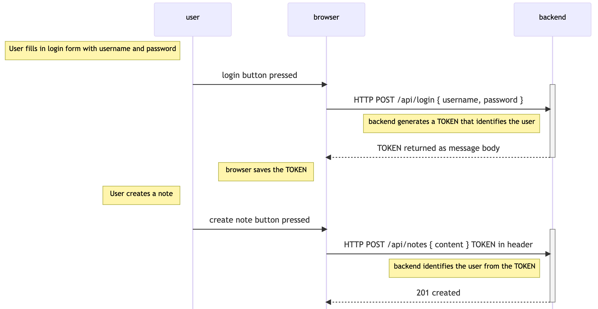

<div class="content">

Os usuários devem estar aptos a logarem na aplicação, e quando um usuário é logado, suas informações devem ser adicionadas automaticamente a qualquer nova nota que você criar.

Agora nós vamos implementar no backend uma [autenticação baseada em token](https://scotch.io/tutorials/the-ins-and-outs-of-token-based-authentication#toc-how-token-based-works).

Os princípios da autenticação baseada em token são apresentados no diagrama abaixo:



- Usuário começa a logar usando uma formulário de login implementado com React
    - Nós adicionamos o formulário no front-end ns [part 5](/ptbr/part5)
- O React code envia o nome de usuário e a senha para o endereço <i>/api/login</i> do servidor como uma requisição HTTP POST
- Se o usuário e a senha estiverem corretos, o servidor gera um <i>token</i> que de alguma forma identifica o usuário logado.
    - O token é assinado digitalmente, tornando-o impossível de falsificar (no sentido criptográfico)
- O backend responde com um código de status de operação bem sucedida e retorna o token com a resposta.
- O browser salva o token, como por exemplo em um estado (state) de uma aplicação React.
- Quando o usuário cria uma nova nota (ou outra operação que requer identificação), o código React envia o token para o servidor com a requisição.
- O servidor usa o token para identificar o usuário.

Vamos implementar a funcionalidade de login. Instale o [jsonwebtoken](https://github.com/auth0/node-jsonwebtoken) biblioteca, que permite gerar [JSON web tokens](https://jwt.io/).

```bash
npm install jsonwebtoken
```

O código para a funcionalidade de login está no arquivo controllers/login.js.

```js
const jwt = require('jsonwebtoken')
const bcrypt = require('bcrypt')
const loginRouter = require('express').Router()
const User = require('../models/user')

loginRouter.post('/', async (request, response) => {
  const { username, password } = request.body

  const user = await User.findOne({ username })
  const passwordCorrect = user === null
    ? false
    : await bcrypt.compare(password, user.passwordHash)

  if (!(user && passwordCorrect)) {
    return response.status(401).json({
      error: 'invalid username or password'
    })
  }

  const userForToken = {
    username: user.username,
    id: user._id,
  }

  const token = jwt.sign(userForToken, process.env.SECRET)

  response
    .status(200)
    .send({ token, username: user.username, name: user.name })
})

module.exports = loginRouter
```

O código inicia buscando o usuário no banco de dados pelo <i>username</i> anexado à requisição.
Em seguida, verifica a <i>senha</i>, também anexada à requisição.
Como as senhas não são armazenadas no banco de dados, mas sim <i>hashes</i> calculados a partir das senhas, o método _bcrypt.compare_ é usado para comparar se a senha está correta:

```js
await bcrypt.compare(body.password, user.passwordHash)
```

Se o usuário não for encontrado ou se a senha estiver incorreta, a requisição é respondida com o código de status [401 Unauthorized](https://www.w3.org/Protocols/rfc2616/rfc2616-sec10.html#sec10.4.2). O motivo para a falha é explicado no corpo da resposta.

Se a senha estiver correta, o token é gerado com o método _jwt.sign_. O token contém o nome de usuário e o ID do usuário assinado digitalmente.

```js
const userForToken = {
  username: user.username,
  id: user._id,
}

const token = jwt.sign(userForToken, process.env.SECRET)
```

O token é assinado digitalmente utilizando-se uma string passada pela variável de ambiente <i>SECRET</i> como o <i>segredo</i>. A assinatura digital garante que somente as partes que conhecem o segredo podem gerar o token válido.
O valor da variável de ambiente deve ser definido no arquivo <i>env</i>.

Uma requisição bem sucedida é respondida com o código de status <i>200 ok</i>. O token e o username do usuários são enviados de volta no corpo da resposta.

Agora basta adicionar o código do login na aplicação, por meio de uma nova rota no <i>app.js</i>

```js
const loginRouter = require('./controllers/login')

//...

app.use('/api/login', loginRouter)
```

Vamos tentar logar usando o VS Code REST-client:


Se não funcionar, a seguinte mensagem vai aparecer no console:

```bash
(node:32911) UnhandledPromiseRejectionWarning: Error: secretOrPrivateKey must have a value
    at Object.module.exports [as sign] (/Users/mluukkai/opetus/_2019fullstack-koodit/osa3/notes-backend/node_modules/jsonwebtoken/sign.js:101:20)
    at loginRouter.post (/Users/mluukkai/opetus/_2019fullstack-koodit/osa3/notes-backend/controllers/login.js:26:21)
(node:32911) UnhandledPromiseRejectionWarning: Unhandled promise rejection. This error originated either by throwing inside of an async function without a catch block, or by rejecting a promise which was not handled with .catch(). (rejection id: 2)
```

O comando _jwt.sign(userForToken, process.env.SECRET)_ falhou. Nós esquecemos de definir um valor para a variável de ambiente <i>SECRET</i>. Pode ser qualquer string. Quando definimos o valor no arquivo <i>env</i>, (e reiniciamos o servidor), o login funcionará.

Um login bem-sucedido retorna os detalhes do usuário e o token:


Um nome de usuário ou senha incorretos retorna uma messagem de erro e o código de status apropriado


### Limitando a criação de novas notas para somente usuários logados

Vamos modificar a criação de novas notas de forma que somente seja possível se a requisição post contiver um token válido. A nota será salva na lista de notas do usuário identificado pelo token.

Existem diversas formas de enviar o token do navegador para o servidor. Nós vamos utilizar o cabeçalho (header) [Authorization](https://developer.mozilla.org/pt-BR/docs/Web/HTTP/Headers/Authorization). O header também informa qual é o [esquema de autenticação](https://developer.mozilla.org/pt-BR/docs/Web/HTTP/Authentication#esquema_basic_de_autentica%C3%A7%C3%A3o) utilizado. Isso pode ser necessário se o servidor oferece múltiplas formas de autenticação.
Identificar o esquema revela ao servidor como as credenciais anexadas devem ser interpretadas.

O esquema <i>Bearer</i> é adequado às nossas necessidades.

Na prática, significa que se o token é a string  <i>eyJhbGciOiJIUzI1NiIsInR5c2VybmFtZSI6Im1sdXVra2FpIiwiaW</i>, por exemplo, o header de autorização (Authorization) terá o seguinte valor:

<pre>
Bearer eyJhbGciOiJIUzI1NiIsInR5c2VybmFtZSI6Im1sdXVra2FpIiwiaW
</pre>

O código para criação de novas notas deve ser alterado assim:

```js
const jwt = require('jsonwebtoken') //highlight-line

// ...
  //highlight-start
const getTokenFrom = request => {
  const authorization = request.get('authorization')
  if (authorization && authorization.startsWith('Bearer ')) {
    return authorization.replace('Bearer ', '')
  }
  return null
}
  //highlight-end

notesRouter.post('/', async (request, response) => {
  const body = request.body
//highlight-start
  const decodedToken = jwt.verify(getTokenFrom(request), process.env.SECRET)
  if (!decodedToken.id) {
    return response.status(401).json({ error: 'token invalid' })
  }

  const user = await User.findById(decodedToken.id)
//highlight-end

  const note = new Note({
    content: body.content,
    important: body.important === undefined ? false : body.important,
    user: user._id
  })

  const savedNote = await note.save()
  user.notes = user.notes.concat(savedNote._id)
  await user.save()

  response.json(savedNote)
})
```

A função auxiliar _getTokenFrom_ isola o token do header <i>authorization</i>. A validade do token é checada com _jwt.verify_. O método também decodifica o token, ou retorna o objeto no qual o token foi baseado.

```js
const decodedToken = jwt.verify(token, process.env.SECRET)
```

Se o token estiver faltando ou for inválido, a exceção <i>JsonWebTokenError</i> será lançada. Precisamos expandir o tratamento de erros do middleware para que também cuide desse caso em particular:

```js
const errorHandler = (error, request, response, next) => {
  logger.error(error.message)

  if (error.name === 'CastError') {
    return response.status(400).send({ error: 'malformatted id' })
  } else if (error.name === 'ValidationError') {
    return response.status(400).json({ error: error.message })
  } else if (error.name ===  'JsonWebTokenError') { // highlight-line
    return response.status(400).json({ error: error.message }) // highlight-line
  }

  next(error)
}
```

O objeto decodificado do token contém os campos <i>username</i> e <i>id</i>, os quais informar ao servidor quem fez a requisição.

Se o objeto decodificado do token não contiver a identidade do usuário (decodedToken.id é <i>undefined</i>), o código de status [401 unauthorized](https://www.w3.org/Protocols/rfc2616/rfc2616-sec10.html#sec10.4.2) será retornado e o motivo da falha será explicado no corpo da resposta.

```js
if (!decodedToken.id) {
  return response.status(401).json({
    error: 'token invalid'
  })
}
```

Se a identidade de quem fez a requisição for resolvida, a execução continuará como antes.

Uma nova nota pode agora ser criada utilizando o Postman se o header <i>authorization</i> fornecer o valor correto com a string <i>Bearer eyJhbGciOiJIUzI1NiIsInR5cCI6IkpXVCJ</i>, onde o segundo valor é o token retornado pela operação <i>login</i>.

Utilizando o Postman, seria assim:


já com o Visual Studio Code REST client:


A aplicação atual pode ser encontrada no [Github](https://github.com/fullstack-hy2020/part3-notes-backend/tree/part4-9), branch <i>part4-9</i>.

Se a aplicação possuir múltiplas interfaces requerendo identificação, a validação pelo JWT deve estar separada em seus próprio middleware. Uma biblioteca já existente também pode ser utilizada, como a [express-jwt](https://www.npmjs.com/package/express-jwt).

### O problema da autenticação baseada em token

Autenticação por token é muito fácil de implementar, mas possui um problema. Uma vez que o usuário da API, por exemplo um app React, obtém um token, a API confiará cegamente nele. E se o direito de acesso do token precisar ser revogado?

Há duas soluções para o problema. A mais fácil delas é limitar o período de validade do token.

```js
loginRouter.post('/', async (request, response) => {
  const { username, password } = request.body

  const user = await User.findOne({ username })
  const passwordCorrect = user === null
    ? false
    : await bcrypt.compare(password, user.passwordHash)

  if (!(user && passwordCorrect)) {
    return response.status(401).json({
      error: 'invalid username or password'
    })
  }

  const userForToken = {
    username: user.username,
    id: user._id,
  }

  // o token expira em uma hora (60*60 segundos)
  // highlight-start
  const token = jwt.sign(
    userForToken, 
    process.env.SECRET,
    { expiresIn: 60*60 }
  )
  // highlight-end

  response
    .status(200)
    .send({ token, username: user.username, name: user.name })
})
```

Uma vez expirado, o app cliente necessitará de um novo token. Normalmente, isso acontece forçando o usuário a logar novamente no app.

O tratamento de erro do middleware deve ser expandido para fornecer o erro apropriado no caso de um token expirado:

```js
const errorHandler = (error, request, response, next) => {
  logger.error(error.message)

  if (error.name === 'CastError') {
    return response.status(400).send({ error: 'malformatted id' })
  } else if (error.name === 'ValidationError') {
    return response.status(400).json({ error: error.message })
  } else if (error.name === 'JsonWebTokenError') {
    return response.status(401).json({
      error: 'invalid token'
    })
  // highlight-start  
  } else if (error.name === 'TokenExpiredError') {
    return response.status(401).json({
      error: 'token expired'
    })
  }
  // highlight-end

  next(error)
}
```

Quanto mais curto o tempo de expiração, mais segura é a solução. Portanto, se o token cair em mãos erradas ou se o acesso do usuário ao sistema precisar ser revogado, o token só poderá ser usado por um período limitado de tempo. Por outro lado, um tempo de expiração curto força o usuário a fazer login no sistema com mais frequência.

A outra solução é salvar informações sobre cada token no banco de dados do backend e verificar se o direito de acesso correspondente ao token ainda é válido para cada solicitação da API. Com esse esquema, os direitos de acesso podem ser revogados a qualquer momento. Esse tipo de solução é frequentemente chamado de <i>sessão do lado do servidor (server-side session)</i>.

O aspecto negativo das sessões do lado do servidor é o aumento da complexidade no backend e também o efeito na performance, uma vez que a validade do token precisa ser verificada para cada solicitação da API ao banco de dados. O acesso ao banco de dados é consideravelmente mais lento em comparação com a verificação da validade do próprio token. É por isso que é bastante comum salvar a sessão correspondente a um token em um <i>banco de dados chave-valor</i> como [Redis] (https://redis.io/), que é limitado em funcionalidade em comparação, por exemplo, ao MongoDB ou um banco de dados relacional, mas extremamente rápido em alguns cenários de uso.

Quando as sessões do lado do servidor são usadas, o token geralmente é apenas uma string aleatória que não inclui nenhuma informação sobre o usuário, como geralmente é o caso quando os tokens jwt são usados. Para cada solicitação da API, o servidor busca as informações relevantes sobre a identidade do usuário no banco de dados. Também é bastante comum que, em vez de usar o cabeçalho (header) Authorization, sejam usados <i>cookies</i> como mecanismo para transferir o token entre o cliente e o servidor.

### Notas finais

Foram realizadas muitas alterações no código que causaram um problema típico em projetos de software de ritmo acelerado: a maioria dos testes quebrou. Porque esta parte do curso já está cheia de informações novas, deixaremos a correção dos testes como um exercício não obrigatório.

Nomes de usuário, senhas e aplicações que usam autenticação por token devem sempre ser usados ​​por meio de [HTTPS] (https://en.wikipedia.org/wiki/HTTPS). Poderíamos usar um servidor Node [HTTPS] (https://pt.wikipedia.org/wiki/Hyper_Text_Transfer_Protocol_Secure) em nossa aplicação em vez do servidor [HTTP] (https://nodejs.org/docs/latest-v8.x/api/http.html) (ele requer mais configuração). Por outro lado, a versão de produção de nossa aplicação está no Heroku, portanto, nossa aplicação permanece segura: o Heroku direciona todo o tráfego entre um navegador e o servidor Heroku através de HTTPS.

Vamos implementar o login no frontend na próxima parte.

</div>

<div class="tasks">

### Exercício 4.15.-4.23.

No próximo exercício, o básico do gerenciamento de usuário será implementado na aplicação Bloglist. O jeito mais seguro é seguir os ensinamentos do capítulo 4 [Administração de usuário](ptbr/part4/administracao_de_usuarios) ao capítulo [Autenticação por token](/ptbr/part4/autenticacao_por_token). Você também pode usar sua criatividade.

**Mai um aviso:** Se você perceber que está misturando async/await com _then_, é 99% de certeza de que você está fazendo alguma coisa errada. Use um ou outro.

#### 4.15: Expansão na lista de Blog, passo3

Implemente uma maneira de criar novos usuários por meio de requisições HTTP POST para o endereço <i>/api/users</i>. Usuários devem ter um <i>username, password e name</i>

Não salva a senha no banco de dados como texto puro, mas sim utilize a biblioteca <i>bcrypt</i> como fizemos na parte 4, no capítulo [Criando usuários](ptbr/part4/administracao_de_usuarios#criando-usuarios).

**Obs.:** Alguns usuários de Windows podem ter problemas com o <i>bcrypt</i>. Se for o seu caso, removo a biblioteca com o comando

```bash
npm uninstall bcrypt 
```

e instale o [bcryptjs](https://www.npmjs.com/package/bcryptjs).

Implemente uma forma de ver os detalhes de todos os usuários por meio da requisição HTTP adequada.

A lista de usuários pode, por exemplo, parecer com o seguinte:


#### 4.16*: Expansão na lista de Blog, passo4

Implemente uma funcionalidade  que adicione as seguintes restrições na criação de novos usuários: O nome de usuário e a senha devem ser fornecidos. O nome de usuário e a senha devem ter pelo menos 3 caracteres. O nome de usuário dever único.

A operação deve retornar um código de status adequado e algum tipo de mensagem de erro caso um usuário inválido seja fornecido.

**Obs.:** Não teste as restrições da senha com as validações do Mongoose. Não é uma boa ideia, pois a senha recebida pelo backend e o hash da senha salvo no banco de dados não são a mesma coisa. O cumprimento da senha deve ser validado pelo controller, como fizemos na [parte 3](/ptbr/part3/node_js_e_express) antes de utilizarmos a validação do Mongoose.

Implemente também testes que assegurem que usuários inválidos não serão criados e que uma operação inválida para adicionar esse usuário retorne o código de status adequado e uma mensagem de erro.

#### 4.17: Expansão da lista de Blog, passo5

Expanda a aplicação de forma que cada blog contenha informação sobre o usuário que criou o blog.

Altere a adição de novos blogs de forma que quando um novo blog é criado,  <i>qualquer</i> usuário do banco de dados é designado como o criador (por exemplo, o primeiro usuário que for encontrado). Implemente isso conforme parte 4, capítulo [popular](ptbr/part4/administracao_de_usuarios#popular).
Qual usuário é designado como o criador não importa muito agora. A funcionalidade será finalizada no exercício 4.19.

Modifique a listagem de todos os blogs de forma que a informação sobre o usuário criador seja mostrada no blog:


e a listagem de todos os usuários também mostre os blogs criados por cada usuário:


#### 4.18: Expansão da lista de Blog, passo6

Implemente uma autenticação baseada em token conforme o capítulo [Autenticação por Token](/ptbr/part4/autenticacao_por_token).

#### 4.19: Expansão da lista de Blog, passo7

Altere o código para adicionar novos blogs de forma que somente seja possível adicionar se um token válido por enviado por uma requisição HTTP POST. O usuário identificado no tolen deverá ser designado como o criador do blog.

#### 4.20*: Expansão da lista de Blog, passo7

[Nesse exemplo](/ptbr/part4/autenticacao_por_token) da parte 4 é demonstrado como obter o token do cabeçalho (header) com a função auxiliar _getTokenFrom_.

Se você utilizou a mesma solução, refatore o código para obter o token por meio de um [middleware](/ptbr/part3/node_js_e_express#middleware). O middleware deve obter o token do cabeçalho <i>Autorization</i> e atribuí-lo no campo <i>token</i> do objeto <i>request</i>.

Em outras palavras, se você registrar este middleware no arquivo <i>app.js</i> antes de todas as rotas

```js
app.use(middleware.tokenExtractor)
```

Routes can access the token with _request.token_:

```js
blogsRouter.post('/', async (request, response) => {
  // ..
  const decodedToken = jwt.verify(request.token, process.env.SECRET)
  // ..
})
```

Lembre-se que uma [função middleware](/en/part3/node_js_and_express#middleware) normal é uma função com três parâmetros que ao final chamará o último parâmetro <i>next</i> para mover o controle para o próximo middleware: 

```js
const tokenExtractor = (request, response, next) => {
  // código que extrai o token

  next()
}
```

#### 4.21*: Expansão da lista de Blog, passo9

Altere o código que deleta um blog de forma que possa ser apagado somente pelo usuário que o adicionou. Além disso, deletar somente será possível se o token enviado com a requisição for o mesmo do criador do blog.

Se for feita uma tentativa de deletar um blog sem um token ou por um usuário inválido, a operação deve retornar um código de status adequado.

Note que se você buscar um blog no banco de dados,

```js
const blog = await Blog.findById(...)
```

o campo <i>blog.user</i> não conterá uma string, mas um objeto (Object). Logo, se você comparar o id do objeto buscado no banco de dados e a string id, uma comparação normal não funcionará. O id buscado no banco de dados deve ser convertido em string primeiro.

```js
if ( blog.user.toString() === userid.toString() ) ...
```

#### 4.22*:  Expansão da lista de Blog, passo10

Tanto a criação de um blog quanto a exclusão precisam descobrir a identidade do usuário que está realizando a operação. O middleware _tokenExtractor_ que fizemos no exercício 4.20 ajuda, mas ainda assim ambas operações <i>post</i> e <i>delete</i> precisam descobrir que usuário possui um determinado token.

Crie um middleware _userExtractor_, que descobre quem é o usuário e o atribui ao objeto da requisição. Quando for registrar o middlware no <i>app.js</i>

```js
app.use(middleware.userExtractor)
```

o usuário será atribuído ao campo _request.user_:

```js
blogsRouter.post('/', async (request, response) => {
  // get user do objeto requisição
  const user = request.user
  // ..
})

blogsRouter.delete('/:id', async (request, response) => {
  // get user do objeto requisição
  const user = request.user
  // ..
})
```

Observe que é possível registar o middlware somente para um rota determinada. Assim, ao invés de usar _userExtractor_ com todas as rotas 

```js
// utiliza o middleware em todas as rotas
app.use(userExtractor) // highlight-line

app.use('/api/blogs', blogsRouter)  
app.use('/api/users', usersRouter)
app.use('/api/login', loginRouter)
```

Poderíamos registrar para que seja usado somente na rota <i>/api/blogs</i>:

```js
// utiliza o middleware somente na rota /api/blogs
app.use('/api/blogs', userExtractor, blogsRouter) // highlight-line
app.use('/api/users', usersRouter)
app.use('/api/login', loginRouter)
```

Como pode ser visto, fazemos isso encadeando múltiplos middleware como parâmetro da função <i>use</i>. Também seria possível registrar um middlware para apenas uma operação específica.

```js
router.post('/', userExtractor, async (request, response) => {
  // ...
}
```

#### 4.23*: Expansão da lista de Blog, passo11 

Após adicionar a autenticação baseada em token, os testes para adicionar novo blog quebraram. Corrija os testes. Além disso, escreva um novo teste que certifique que a adição de um novo blog falhará com o código de status apropriado <i>401 Unauthorized</i> se um token não for provido. 

[Isso](https://github.com/visionmedia/supertest/issues/398) será muito útil para fazer a correção.

Esse é o último exercício dessa parte do curso e agora é hora de fazer o push do código para o GitHub e marcar todos os exercícios concluídos [no sistema de submissão de exercícios](https://studies.cs.helsinki.fi/stats/courses/fullstackopen).

</div>
