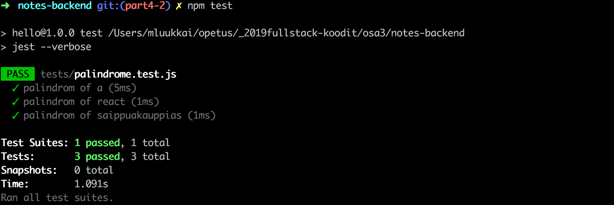
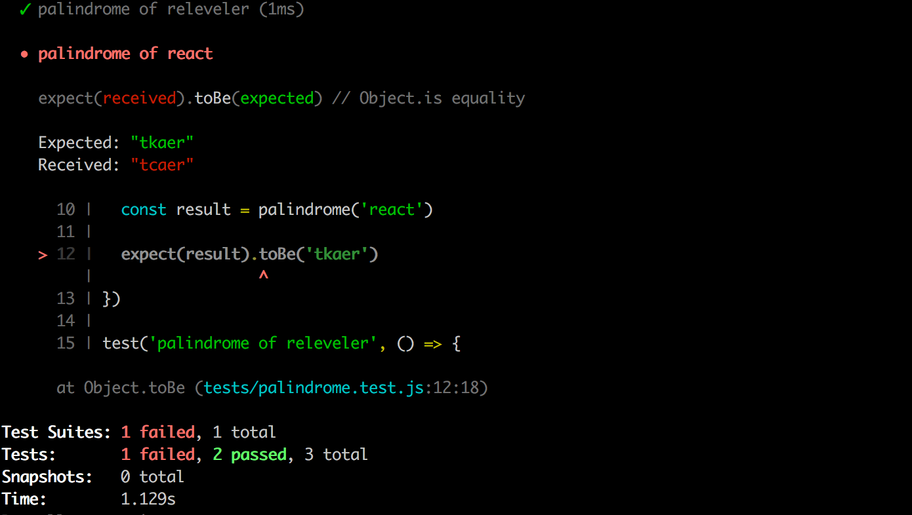
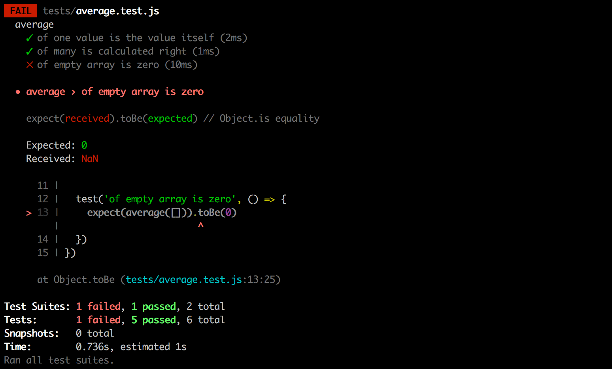
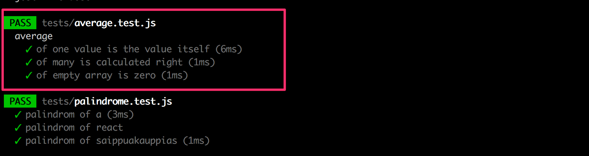
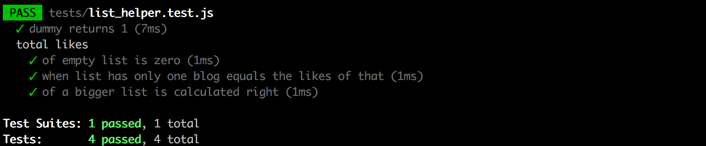

<div class="content">


<!-- Let's continue our work on the backend of the notes application we started in [第3章](/zh/part3).  -->
继续我们在[第3章](/zh/part3)中关于便笺应用的后端编码。


### Project structure
【项目结构】
<!-- Before we move into the topic of testing, we will modify the structure of our project to adhere to Node.js best practices. -->
在我们进入“测试”这个议题之前，我们将修改我们项目的结构，来遵循 Node.js 的最佳实践。

<!-- After making the changes to the directory structure of our project, we end up with the following structure: -->
在对我们项目的目录结构进行了优化之后，我们得到了如下结构:

```bash
├── index.js
├── app.js
├── build
│   └── ...
├── controllers
│   └── notes.js
├── models
│   └── note.js
├── package-lock.json
├── package.json
├── utils
│   ├── config.js
│   ├── logger.js
│   └── middleware.js  
```


<!-- So far we have been using <i>console.log</i> and <i>console.error</i> to print different information from the code.  -->
到目前为止，我们一直在使用<i>console.log</i> 和<i>console.error</i> 来打印代码中的变化信息。
<!-- However, this is not a very good way to do things.  -->
然而，这并不是一个很好的实践方式。
<!-- Let's separate all printing to the console to it's own module <i>utils/logger.js</i>: -->
让我们将所有到控制台的打印分离到它自己的模块 <i>utils/logger.js</i>

```js
const info = (...params) => {
  console.log(...params)
}

const error = (...params) => {
  console.error(...params)
}

module.exports = {
  info, error
}
```


<!-- The logger has two functions, __info__ for printing normal log messages, and __error__ for all error messages.  -->
日志记录器有两个功能，__info__ 用于打印正常的日志消息，__error__ 用于所有错误消息。

<!-- Extracting logging into its own module is a good idea in more ways than one. If we wanted to start writing logs to a file or send them to an external logging service like [graylog](https://www.graylog.org/) or [papertrail](https://papertrailapp.com) we would only have to make changes in one place. -->
将日志记录功能提取到一个单独的模块是个不错的实践。 如果我们后来想将日志写入一个文件，或者将它们发送到一个外部日志服务中，比如 [graylog](https://www.graylog.org/) 或者 [papertrail](https://papertrailapp.com)  ，我们只需要在一个地方进行修改就可以了。

<!-- The contents of the <i>index.js</i> file used for starting the application gets simplified as follows: -->
这样用于启动应用的<i>index.js</i> 文件的内容简化如下:

```js
const app = require('./app') // highlight-line
const http = require('http')
const config = require('./utils/config')
const logger = require('./utils/logger')

const server = http.createServer(app)

server.listen(config.PORT, () => {
  logger.info(`Server running on port ${config.PORT}`)
})
```

<!-- The <i>index.js</i> file only imports the actual application from the <i>app.js</i> file and then starts the application. The function _info_ of the logger- 模块 is used for the console printout telling that the application is running. -->
 <i>index.js</i> 文件只从 <i>app.js</i> 文件导入实际的应用，然后启动应用。 logger- 模块的功能用于控制台的打印输出，告诉应用的运行状态。

<!-- The handling of environment variables is extracted into a separate <i>utils/config.js</i> file: -->
环境变量的处理被提取到一个单独的<i>utils/config.js</i>  文件中:

```js
require('dotenv').config()

const PORT = process.env.PORT
const MONGODB_URI = process.env.MONGODB_URI

module.exports = {
  MONGODB_URI,
  PORT
}
```

<!-- The other parts of the application can access the environment variables by importing the configuration module: -->
应用的其他部分可以通过导入配置模块来访问环境变量:

```js
const config = require('./utils/config')

logger.info(`Server running on port ${config.PORT}`)
```

<!-- The route handlers have also been moved into a dedicated module. The event handlers of routes are commonly referred to as <i>controllers</i>, and for this reason we have created a new <i>controllers</i> directory. All of the routes related to notes are now in the <i>notes.js</i> module under the <i>controllers</i> directory. -->
路由处理程序也被移动到一个专用的模块中。 路由的事件处理程序通常称为<i>controllers</i>，出于这个原因，我们创建了一个新的<i>controllers</i> 目录。 所有与便笺相关的路由现在都在<i>controllers</i> 目录下的<i>notes.js</i> 模块中定义。

<!-- The contents of the <i>notes.js</i> module are the following: -->
模块的内容如下:

```js
const notesRouter = require('express').Router()
const Note = require('../models/note')

notesRouter.get('/', (request, response) => {
  Note.find({}).then(notes => {
    response.json(notes)
  })
})

notesRouter.get('/:id', (request, response, next) => {
  Note.findById(request.params.id)
    .then(note => {
      if (note) {
        response.json(note)
      } else {
        response.status(404).end()
      }
    })
    .catch(error => next(error))
})

notesRouter.post('/', (request, response, next) => {
  const body = request.body

  const note = new Note({
    content: body.content,
    important: body.important || false,
    date: new Date()
  })

  note.save()
    .then(savedNote => {
      response.json(savedNote)
    })
    .catch(error => next(error))
})

notesRouter.delete('/:id', (request, response, next) => {
  Note.findByIdAndRemove(request.params.id)
    .then(() => {
      response.status(204).end()
    })
    .catch(error => next(error))
})

notesRouter.put('/:id', (request, response, next) => {
  const body = request.body

  const note = {
    content: body.content,
    important: body.important,
  }

  Note.findByIdAndUpdate(request.params.id, note, { new: true })
    .then(updatedNote => {
      response.json(updatedNote)
    })
    .catch(error => next(error))
})

module.exports = notesRouter
```

<!-- This is almost an exact copy-paste of our previous <i>index.js</i> file. -->
这几乎是我们之前的<i>index.js</i> 文件的完整复制粘贴。

<!-- However, there are a few significant changes. At the very beginning of the file we create a new [router](http://expressjs.com/en/api.html#router) object: -->
然而，有一些重要的变化，在文件的开始我们创建了一个新的[router](http://expressjs.com/en/api.html#router) 对象:

```js
const notesRouter = require('express').Router()

//...

module.exports = notesRouter
```

<!-- The module exports the router to be available for all consumers of the module. -->
该模块将路由导出，该模块的所有消费者可用。

<!-- All routes are now defined for the router object, in a similar fashion to what we had previously done with the object representing the entire application. -->
现在已经为路由对象定义了所有路由，这与我们之前对展示整个应用的对象所做的工作类似。

<!-- It's worth noting that the paths in the route handlers have shortened. In the previous version, we had: -->
值得注意的是，路由处理程序中的路径已经缩短:

```js
app.delete('/api/notes/:id', (request, response) => {
```

<!-- And in the current version, we have: -->
在目前的版本中，代码为:

```js
notesRouter.delete('/:id', (request, response) => {
```

<!-- So what are these router objects exactly? The Express manual provides the following explanation: -->
那么这些路由对象到底是什么呢? Express手册提供了如下解释:

> <i>A router object is an isolated instance of middleware and routes. You can think of it as a “mini-application,” capable only of performing middleware and routing functions. Every Express application has a built-in app router.</i><br>
路由对象是中间件和路由的单例。 您可以把它看作是一个“迷你应用” ，只能执行中间件和路由功能。 每个 Express 应用都有一个内置的应用路由。 

<!-- The router is in fact a <i>middleware</i>, that can be used for defining "related routes" in a single place, that is typically placed in its own module. -->
路由实际上是一个<i>中间件</i>，可用于在某个位置定义“相关路由” ，通常放置在单独的模块中。

<!-- The <i>app.js</i> file that creates the actual application, takes the router into use as shown below: -->
下面的<i>app.js</i> 是一个创建实际应用的文件，对路由对象使用use方法，按如下方式使用:

```js
const notesRouter = require('./controllers/notes')
app.use('/api/notes', notesRouter)
```

<!-- The router we defined earlier is used <i>if</i> the URL of the request starts with <i>/api/notes</i>. For this reason, the notesRouter object must only define the relative parts of the routes, i.e. the empty path <i>/</i> or just the parameter <i>/:id</i>. -->
如果请求的 URL 以 <i>/api/notes</i>开头，则会使用之前定义的路由。 由于这个原因，notesRouter 对象必须只定义路由的相对部分，即空路径<i>/</i>或仅仅定义参数<i>/:id</i>。【TODO】


<!-- After making these changes, our <i>app.js</i> file looks like this: -->
在进行了这些更改之后，我们的<i>app.js</i> 文件如下所示:

```js
const config = require('./utils/config')
const express = require('express')
const app = express()
const cors = require('cors')
const notesRouter = require('./controllers/notes')
const middleware = require('./utils/middleware')
const logger = require('./utils/logger')
const mongoose = require('mongoose')

logger.info('connecting to', config.MONGODB_URI)

mongoose.connect(config.MONGODB_URI, { useNewUrlParser: true, useUnifiedTopology: true, useFindAndModify: false, useCreateIndex: true })
  .then(() => {
    logger.info('connected to MongoDB')
  })
  .catch((error) => {
    logger.error('error connecting to MongoDB:', error.message)
  })

app.use(cors())
app.use(express.static('build'))
app.use(express.json())
app.use(middleware.requestLogger)

app.use('/api/notes', notesRouter)

app.use(middleware.unknownEndpoint)
app.use(middleware.errorHandler)

module.exports = app
```

<!-- The file takes different middleware into use, and one of these is the <i>notesRouter</i> that is attached to the <i>/api/notes</i> route. -->
该文件将不同的中间件放到use中，其中之一是附加到 <i>/api/notes</i> 路由的<i>notesRouter</i>。

<!-- Our custom middleware has been moved to a new <i>utils/middleware.js</i> module: -->
我们的自定义中间件已经移动到一个新的 <i>utils/middleware.js</i> 模块:

```js
const logger = require('./logger')

const requestLogger = (request, response, next) => {
  logger.info('Method:', request.method)
  logger.info('Path:  ', request.path)
  logger.info('Body:  ', request.body)
  logger.info('---')
  next()
}

const unknownEndpoint = (request, response) => {
  response.status(404).send({ error: 'unknown endpoint' })
}

const errorHandler = (error, request, response, next) => {
  logger.error(error.message)

  if (error.name === 'CastError') {
    return response.status(400).send({ error: 'malformatted id' })
  } else if (error.name === 'ValidationError') {
    return response.status(400).json({ error: error.message })
  }

  next(error)
}

module.exports = {
  requestLogger,
  unknownEndpoint,
  errorHandler
}
```

<!-- The responsibility of establishing the connection to the database has been given to the  <i>app.js</i> module. The <i>note.js</i> file under the <i>models</i> directory only defines the Mongoose schema for notes. -->
建立到数据库的连接的责任已经交给了<i>app.js</i> 模块。<i>models</i> 目录下的<i>note.js</i> 文件只为 notes 定义了 Mongoose schema。

```js
const mongoose = require('mongoose')

const noteSchema = new mongoose.Schema({
  content: {
    type: String,
    required: true,
    minlength: 5
  },
  date: {
    type: Date,
    required: true,
  },
  important: Boolean,
})

noteSchema.set('toJSON', {
  transform: (document, returnedObject) => {
    returnedObject.id = returnedObject._id.toString()
    delete returnedObject._id
    delete returnedObject.__v
  }
})

module.exports = mongoose.model('Note', noteSchema)
```

<!-- To recap, the directory structure looks like this after the changes have been made: -->
总结一下，修改后的目录结构如下所示:

```bash
├── index.js
├── app.js
├── build
│   └── ...
├── controllers
│   └── notes.js
├── models
│   └── note.js
├── package-lock.json
├── package.json
├── utils
│   ├── config.js
│   ├── logger.js
│   └── middleware.js  
```

<!-- For smaller applications the structure does not matter that much. Once the application starts to grow in size, you are going to have to establish some kind of structure, and separate the different responsibilities of the application into separate modules. This will make developing the application much easier. -->
对于较小的应用，结构并不重要。 一旦应用开始增大，您就必须建立某种结构，并将应用的不同职责分离到单独的模块中。 这将使开发应用更加容易。

<!-- There is no strict directory structure or file naming convention that is required for Express applications. To contrast this, Ruby on Rails does require a specific structure. Our current structure simply follows some of the best practices you can come across on the internet. -->
对于 Express 应用，没有严格的目录结构或文件命名原则。 与此相对的，Ruby on Rails 就需要一个特定的结构。 我们目前的结构只是遵循一些你可以在互联网上遇到的最佳实践。

<!-- You can find the code for our current application in its entirety in the <i>part4-1</i> branch of [this Github repository](https://github.com/fullstack-hy2020/part3-notes-backend/tree/part4-1). -->
您可以在 [this Github repository](https://github.com/fullstack-hy2020/part3-notes-backend/tree/part4-1)的<i>part4-1</i> 分支中找到我们当前应用的全部代码。

<!-- If you clone the project for yourself, run the _npm install_ command before starting the application with _npm start_. -->
如果您自己克隆项目，请在启动应用之前运行 npm install 命令。

</div>


<div class="tasks">


### Exercises 4.1.-4.2.
<!-- In the exercises for this part we will be building a <i>blog list application</i>, that allows users to save information about interesting blogs they have stumbled across on the internet. For each listed blog we will save the author, title, url, and amount of upvotes from users of the application. -->
在这一章节的练习中，我们将构建一个【博客列表的应用】<i>blog list application</i>，它允许用户保存他们在互联网上偶然发现的有趣博客的信息。 对于每个列表中的博客，我们将保存作者、标题、 url 和点赞数。

#### 4.1 Blog list, 步骤1
<!-- Let's imagine a situation, where you receive an email that contains the following application body: -->
假设您收到一封包含如下应用代码的电子邮件:

```js
const http = require('http')
const express = require('express')
const app = express()
const cors = require('cors')
const mongoose = require('mongoose')

const blogSchema = new mongoose.Schema({
  title: String,
  author: String,
  url: String,
  likes: Number
})

const Blog = mongoose.model('Blog', blogSchema)

const mongoUrl = 'mongodb://localhost/bloglist'
mongoose.connect(mongoUrl, { useNewUrlParser: true, useUnifiedTopology: true, useFindAndModify: false, useCreateIndex: true })

app.use(cors())
app.use(express.json())

app.get('/api/blogs', (request, response) => {
  Blog
    .find({})
    .then(blogs => {
      response.json(blogs)
    })
})

app.post('/api/blogs', (request, response) => {
  const blog = new Blog(request.body)

  blog
    .save()
    .then(result => {
      response.status(201).json(result)
    })
})

const PORT = 3003
app.listen(PORT, () => {
  console.log(`Server running on port ${PORT}`)
})
```

<!-- Turn the application into a functioning <i>npm</i> project. In order to keep your development productive, configure the application to be executed with <i>nodemon</i>. You can create a new database for your application with MongoDB Atlas, or use the same database from the previous part's exercises. -->
将应用转换为一个正常运行的<i>npm</i> 项目。 为了保持您的开发效率，将应用配置为使用<i>nodemon</i> 执行。 您可以使用 MongoDB Atlas 为您的应用创建一个新的数据库，或者和前面章节练习中的数据库共用。

<!-- Verify that it is possible to add blogs to list with Postman or the VS Code REST client and that the application returns the added blogs at the correct endpoint. -->
验证是否可以将 blog 添加到list ，使用 Postman 或 VS Code REST 客户端进行验证，并验证应用是否在正确的端侧返回已添加的 blog。

#### 4.2 Blog list, 步骤2
<!-- Refactor the application into separate modules as shown earlier in this part of the course material. -->
将应用重构为单独的模块，如本课程教材前面所示。

<!-- **NB** refactor your application in baby steps and verify that the application works after every change you make. If you try to take a "shortcut" by refactoring many things at once, then [Murphy's law](https://en.wikipedia.org/wiki/Murphy%27s_law) will kick in and it is almost certain that something will break in your application. The "shortcut" will end up taking more time than moving forward slowly and systematically. -->
**注意** 重构您的应用时，步子不要迈得太大，并在每次更改后验证该应用是否正常工作。 如果你试图同时重构许多东西来走“捷径” ，那么[墨菲定律](https://en.wikipedia.org/wiki/Murphy%27s_law)就会生效，而且几乎可以肯定，某些东西会使你的应用中断 。**如果不是缓慢而系统地向前推进，“捷径”最终将花费更多的时间**

<!-- One best practice is to commit your code every time it is in a stable state. This makes it easy to rollback to a situation where the application still works. -->
一个最佳实践就是每次代码处于稳定状态时再提交它。 这样可以很容易地回滚到应用仍然可以工作的情况。

</div>


<div class="content">


### Testing Node applications 
【测试 Node 应用】
<!-- We have completely neglected one essential area of software development, and that is automated testing. -->
我们一直忽略了软件开发的一个重要环节，那就是自动化测试。

<!-- Let's start our testing journey by looking at unit tests. The logic of our application is so simple, that there is not much that makes sense to test with unit tests. Let's create a new file <i>utils/for_testing.js</i> and write a couple of simple functions that we can use for test writing practice: -->
让我们从单元测试开始我们的测试之旅。 我们应用的逻辑非常简单，使用单元测试来进行测试没有多大意义。 让我们创建一个新的文件<i>utils/for_testing.js</i> ，并编写几个简单的函数，可以用于实践测试:

```js
const palindrome = (string) => {
  return string
    .split('')
    .reverse()
    .join('')
}

const average = (array) => {
  const reducer = (sum, item) => {
    return sum + item
  }

  return array.reduce(reducer, 0) / array.length
}

module.exports = {
  palindrome,
  average,
}
```

<!-- >The _average_ function uses the array [reduce](https://developer.mozilla.org/en-US/docs/Web/JavaScript/Reference/Global_Objects/Array/Reduce) method. If the method is not familiar to you yet, then now is a good time to watch the first three videos from the [Functional Javascript](https://www.youtube.com/watch?v=BMUiFMZr7vk&list=PL0zVEGEvSaeEd9hlmCXrk5yUyqUag-n84) series on Youtube. -->
> _average_ 函数使用 array的 [reduce](https://developer.mozilla.org/en-us/docs/web/javascript/reference/global_objects/array/reduce)方法。 如果你对这个方法还不熟悉，是时候在 Youtube 上观看3个视频了，这3个视频来自[Functional Javascript](https://www.youtube.com/watch?v=BMUiFMZr7vk&list=PL0zVEGEvSaeEd9hlmCXrk5yUyqUag-n84)系列。

<!-- There are many different testing libraries or <i>test runners</i> available for JavaScript. In this course we will be using a testing library developed and used internally by Facebook called [jest](https://jestjs.io/), that resembles the previous king of JavaScript testing libraries [Mocha](https://mochajs.org/). Other alternatives do exist, like [ava](https://github.com/avajs/ava) that has gained popularity in some circles. -->
有许多不同的测试库或者<i>test runner</i> 可用于 JavaScript。 在本课程中，我们将使用一个由 Facebook 内部开发和使用的测试库，这个测试库名为[jest](https://jestjs.io/) ，类似于之前 JavaScript 测试库之王[Mocha](https://mochajs.org/)。 其他替代品也确实存在，比如在某些圈子里受欢迎的[ava](https://github.com/avajs/ava)。

<!-- Jest is a natural choice for this course, as it works well for testing backends, and it shines when it comes to testing React applications.  -->
对于本课程来说，Jest 是一个自然的选择，因为它可以很好地测试后端，并且在测试 React 应用时表现出色。


<!-- > <i>**Windows users:**</i> Jest may not work if the path of the project directory contains a directory that has spaces in its name. -->
> **Windows 用户: 如果项目目录的路径所包含的目录名称含有空格，** Jest 可能无法工作。 

<!-- Since tests are only executed during the development of our application, we will install <i>jest</i> as a development dependency with the command: -->
由于测试只在应用开发过程中执行，我们将使用下面的命令安装<i>jest</i>作为开发依赖项:

```bash
npm install --save-dev jest
```

<!-- Let's define the <i>npm script _test_</i> to execute tests with Jest and to report about the test execution with the <i>verbose</i> style: -->
让我们定义<i>npm script _test_</i>，用 Jest 执行测试，用<i>verbose</i> 样式报告测试执行情况:

```bash
{
  //...
  "scripts": {
    "start": "node index.js",
    "dev": "nodemon index.js",
    "build:ui": "rm -rf build && cd ../../../2/luento/notes && npm run build && cp -r build ../../../3/luento/notes-backend",
    "deploy": "git push heroku master",
    "deploy:full": "npm run build:ui && git add . && git commit -m uibuild && git push && npm run deploy",
    "logs:prod": "heroku logs --tail",
    "lint": "eslint .",
    "test": "jest --verbose" // highlight-line
  },
  //...
}
```

<!-- Jest requires one to specify that the execution environment is Node. This can be done by adding the following to the end of <i>package.json</i>: -->
Jest 需要指定执行环境为 Node。 可以通过在<i>package.json</i> 的末尾添加如下内容来实现: 

```js
{
 //...
 "jest": {
   "testEnvironment": "node"
 }
}
```

<!-- Alternatively, Jest can look for a configuration file with the default name <i>jest.config.js</i>, where we can define the execution environment like this: -->
或者，Jest 会查找默认名为 <i>jest.config.js</i>的配置文件，在这里我们可以这样定义执行环境:

```js
module.exports = {
  testEnvironment: 'node',
};
```

<!-- Let's create a separate directory for our tests called <i>tests</i> and create a new file called <i>palindrome.test.js</i> with the following contents: -->
让我们为我们的测试创建一个名为<i>tests</i> 的单独目录，并创建一个名为<i>palindrome.test.js</i> 的新文件，其内容如下:

```js
const palindrome = require('../utils/for_testing').palindrome

test('palindrome of a', () => {
  const result = palindrome('a')

  expect(result).toBe('a')
})

test('palindrome of react', () => {
  const result = palindrome('react')

  expect(result).toBe('tcaer')
})

test('palindrome of releveler', () => {
  const result = palindrome('releveler')

  expect(result).toBe('releveler')
})
```

<!-- The ESLint configuration we added to the project in the previous part complains about the _test_ and _expect_ commands in our test file, since the configuration does not allow <i>globals</i>. Let's get rid of the complaints by adding <i>"jest": true</i> to the <i>env</i> property in the <i>.eslintrc.js</i> file. -->
我们在上一章节中添加到项目中的 ESLint 配置会在我们的测试文件中提示 _test_ 和 _expect_ 命令，因为配置不允许<i>globals</i>。 让我们通过在<i>.eslintrc.js</i> 文件的env 属性中添加<i>"jest": true</i> <i>来消除这些提示。</i> 

```js
module.exports = {
  "env": {
    "commonjs": true 
    "es6": true,
    "node": true,
    "jest": true, // highlight-line
  },
  "extends": "eslint:recommended",
  "rules": {
    // ...
  },
};
```

<!-- In the first row, the test file imports the function to be tested and assigns it to a variable called _palindrome_: -->
在第一行，测试文件导入要测试的函数，并将其赋值给一个名为_palindrome_的变量:

```js
const palindrome = require('../utils/for_testing').palindrome
```

<!-- Individual test cases are defined with the _test_ function. The first parameter of the function is the test description as a string. The second parameter is a <i>function</i>, that defines the functionality for the test case. The functionality for the second test case looks like this: -->
单个测试用例是用测试函数定义的。 该函数的第一个参数是作为字符串的测试描述。 第二个参数是<i>function</i>，它定义了测试用例的功能。 第二个测试用例的功能如下:

```js
() => {
  const result = palindrome('react')

  expect(result).toBe('tcaer')
}
```

<!-- First we execute the code to be tested, meaning that we generate a palindrome for the string <i>react</i>. Next we verify the results with the [expect](https://facebook.github.io/jest/docs/en/expect.html#content) function. Expect wraps the resulting value into an object that offers a collection of <i>matcher</i> functions, that can be used for verifying the correctness of the result. Since in this test case we are comparing two strings, we can use the [toBe](https://facebook.github.io/jest/docs/en/expect.html#tobevalue) matcher. -->
首先执行要测试的代码，这意味着为字符串<i>react</i> 生成一个回文。 接下来，我们用[expect](https://facebook.github.io/jest/docs/en/expect.html#content)函数验证结果。 Expect 将结果值封装到一个对象中，该对象提供一组<i>matcher</i> 函数，可用于验证结果的正确性。 因为在这个测试用例中，我们要比较两个字符串，所以我们可以使用[toBe](https://facebook.github.io/jest/docs/en/expect.html#tobevalue)匹配器。

<!-- As expected, all of the tests pass: -->
正如所料，所有的测试都通过了:




<!-- Jest expects by default that the names of test files contain <i>.test</i>. In this course, we will follow the convention of naming our tests files with the extension <i>.test.js</i>. -->
Jest 默认情况下希望测试文件的名称包含 <i>.test</i>.  在本课程中，我们将遵循将测试文件命名为扩展名 <i>.test.js</i>的约定。 

<!-- Jest has excellent error messages, let's break the test to demonstrate this: -->
Jest有很友好的错误消息，让我们破坏这个测试来演示一下: 

```js
test('palindrom of react', () => {
  const result = palindrome('react')

  expect(result).toBe('tkaer')
})
```

<!-- Running the tests above results in the following error message: -->
运行上面的测试会产生如下错误消息:




<!-- Let's add a few tests for the _average_ function, into a new file <i>tests/average.test.js</i>. -->
让我们在一个新文件 <i>tests/average.test.js</i>.中添加一些对 average 函数的测试。

```js
const average = require('../utils/for_testing').average

describe('average', () => {
  test('of one value is the value itself', () => {
    expect(average([1])).toBe(1)
  })

  test('of many is calculated right', () => {
    expect(average([1, 2, 3, 4, 5, 6])).toBe(3.5)
  })

  test('of empty array is zero', () => {
    expect(average([])).toBe(0)
  })
})
```

<!-- The test reveals that the function does not work correctly with an empty array (this is because in JavaScript dividing by zero results in <i>NaN</i>): -->
测试显示，该函数在空数组中不能正常工作(这是因为在 JavaScript 中， 除以零的结果为<i>NaN</i> ) :




<!-- Fixing the function is quite easy: -->
修复这个函数非常简单:

```js
const average = array => {
  const reducer = (sum, item) => {
    return sum + item
  }

  return array.length === 0
    ? 0
    : array.reduce(reducer, 0) / array.length
}
```

<!-- If the length of the array is 0 then we return 0, and in all other cases we use the _reduce_ method to calculate the average. -->
如果数组的长度是0，那么我们返回0，在所有其他情况下，我们使用 _reduce_ 方法来计算平均值。

<!-- There's a few things to notice about the tests that we just wrote. We defined a <i>describe</i> block around the tests that was given the name _average_: -->
关于我们刚才写的测试，有一些事情需要注意。 我们在测试周围定义了一个<i>describe</i> 块，它的名字是 average:

```js
describe('average', () => {
  // tests
})
```

<!-- Describe blocks can be used for grouping tests into logical collections. The test output of Jest also uses the name of the describe block: -->
描述块可用于将测试分组为逻辑集合。 测试输出也使用了描述块的名称:




<!-- As we will see later on <i>describe</i> blocks are necessary when we want to run some shared setup or teardown operations for a group of tests. -->
正如我们将在后面看到的，当我们要为一组测试运行一些共享的安装或拆卸操作时，<i>describe</i>块是必要的。

<!-- Another thing to notice is that we wrote the tests in quite a compact way, without assigning the output of the function being tested to a variable: -->
另一件需要注意的事情是，我们用非常简洁的方式编写了测试，而没有将被测试函数的输出分配给一个变量:

```js
test('of empty array is zero', () => {
  expect(average([])).toBe(0)
})
```

</div>


<div class="tasks">


### Exercises 4.3.-4.7.

<!-- Let's create a collection of helper functions that are meant to assist dealing with the blog list. Create the functions into a file called <i>utils/list_helper.js</i>. Write your tests into an appropriately named test file under the <i>tests</i> directory. -->
让我们创建一个辅助函数的集合，这些函数用于帮助处理博客列表。 将函数创建到一个名为<i>utils/list_helper.js</i> 的文件中。 将您的测试写入<i>tests</i> 目录下，并给一个合适的测试文件名。


#### 4.3: helper functions and unit tests, 步骤1
<!-- First define a _dummy_ function that receives an array of blog posts as a parameter and always returns the value 1. The contents of the <i>list_helper.js</i> file at this point should be the following: -->
首先定义一个虚拟函数，它接收一个 blog posts 数组作为参数，并总是返回值1。 <i>list_helper.js</i> 文件应该是这样的:

```js
const dummy = (blogs) => {
  // ...
}

module.exports = {
  dummy
}
```

<!-- Verify that your test configuration works with the following test: -->
验证您的测试配置是否能用如下测试工作良好:

```js
const listHelper = require('../utils/list_helper')

test('dummy returns one', () => {
  const blogs = []

  const result = listHelper.dummy(blogs)
  expect(result).toBe(1)
})
```


#### 4.4: helper functions and unit tests, 步骤2
<!-- Define a new _totalLikes_ function that receives a list of blog posts as a parameter. The function returns the total sum of <i>likes</i> in all of the blog posts. -->
定义一个新的 _totalLikes_ 函数，该函数接收博客文章列表作为参数。 该函数返回所有博客文章中<i>likes</i> 的总和。

<!-- Write appropriate tests for the function. It's recommended to put the tests inside of a <i>describe</i> block, so that the test report output gets grouped nicely: -->
为函数编写适当的测试。 建议将测试放在<i>describe</i> 块中，这样测试报告输出就可以很好地分组:




<!-- Defining test inputs for the function can be done like this: -->
为函数定义测试用例可以这样做:

```js
describe('total likes', () => {
  const listWithOneBlog = [
    {
      _id: '5a422aa71b54a676234d17f8',
      title: 'Go To Statement Considered Harmful',
      author: 'Edsger W. Dijkstra',
      url: 'http://www.u.arizona.edu/~rubinson/copyright_violations/Go_To_Considered_Harmful.html',
      likes: 5,
      __v: 0
    }
  ]

  test('when list has only one blog, equals the likes of that', () => {
    const result = listHelper.totalLikes(listWithOneBlog)
    expect(result).toBe(5)
  })
})
```

<!-- If defining your own test input list of blogs is too much work, you can use the ready-made list [here](https://github.com/fullstack-hy2020/misc/blob/master/blogs_for_test.md). -->
如果觉得定义自己的博客测试列表用例工作量太大，可以使用现成的列表,[在这里](https://github.com/fullstack-hy2020/misc/blob/master/blogs_for_test.md)。

<!-- You are bound to run into problems while writing tests. Remember the things that we learned about [debugging](/zh/part3/将数据存入_mongo_db#debugging-node-applications) in part 3. You can print things to the console with _console.log_ even during test execution. It is even possible to use the debugger while running tests, you can find instructions for that [here](https://jestjs.io/docs/en/troubleshooting). -->
在编写测试时，您肯定会遇到问题。 还记得我们在第3章节中学到的关于[debugging](/zh/part3/将数据存入_mongo_db#debugging-node-applications)的知识吗。 即使在测试执行期间，也可以使用 console.log 将内容打印到控制台。 你甚至可以在运行测试的时候使用调试器，你可以在这里找到相关的指示 [here](https://jestjs.io/docs/en/troubleshooting)。

<!-- **NB:** if some test is failing, then it is recommended to only run that test while you are fixing the issue. You can run a single test with the [only](https://facebook.github.io/jest/docs/en/api.html#testonlyname-fn-timeout) method. -->
注意: 如果某个测试失败，那么建议在修复问题时只运行该测试。 您可以使用[only](https://facebook.github.io/jest/docs/en/api.html#testonlyname-fn-timeout)方法运行单个测试。

<!-- Another way of running a single test (or describe block) is to specify the name of the test to be run with the [-t](https://jestjs.io/docs/en/cli.html) flag: -->
运行单个测试(或描述块)的另一种方法是指定使用[-t](https://jestjs.io/docs/en/cli.html)标志运行，后面跟上测试的名称:

```js
npm test -- -t 'when list has only one blog, equals the likes of that'
```

#### 4.5*: helper functions and unit tests, 步骤3
<!-- Define a new _favoriteBlog_ function that receives a list of blogs as a parameter. The function finds out which blog has most likes. If there are many top favorites, it is enough to return one of them. -->
定义一个新的 _favoriteBlog_ 函数，该函数接收一个博客列表作为参数。 这个功能可以找出哪个博客有最多的likes。 如果有多个并列第一，返回其中一个就足够了。

<!-- The value returned by the function could be in the following format: -->
函数返回的值可以是如下格式:

```js
{
  title: "Canonical string reduction",
  author: "Edsger W. Dijkstra",
  likes: 12
}
```

<!-- **NB** when you are comparing objects, the [toEqual](https://jestjs.io/docs/en/expect#toequalvalue) method is probably what you want to use, since the [toBe](https://jestjs.io/docs/en/expect#tobevalue) tries to verify that the two values are the same value, and not just that they contain the same properties. -->
**注意** 当您比较对象时，[toEqual](https://jestjs.io/docs/en/expect#toequalvalue)方法可能是您所需要的，因为[toBe](https://jestjs.io/docs/en/expect#tobevalue)试图验证这两个值是否是相同的值，而不仅仅是它们是否包含相同值的属性。

<!-- Write the tests for this exercise inside of a new <i>describe</i> block. Do the same for the remaining exercises as well. -->
在一个新的<i>describe</i> 块中编写这个练习的测试。 对剩下的练习也做同样的操作。

#### 4.6*: helper functions and unit tests, 步骤4
<!-- This and the next exercise are a little bit more challenging. Finishing these two exercises is not required in order to advance in the course material, so it may be a good idea to return to these once you're done going through the material for this part in its entirety. -->
这个练习和下一个练习更有挑战性。 完成这两个练习并不是为了提前学习课程材料，所以一旦你完成了这一章节的全部材料，回到这些练习可能是一个好主意。

<!-- Finishing this exercise can be done without the use of additional libraries. However, this exercise is a great opportunity to learn how to use the [Lodash](https://lodash.com/) library. -->
可以在不使用其他库的情况下完成这个练习。 然而，这个练习是一个很好的机会来学习如何使用[Lodash](https://lodash.com/)。

<!-- Define a function called _mostBlogs_ that receives an array of blogs as a parameter. The function returns the <i>author</i> who has the largest amount of blogs. The return value also contains the number of blogs the top author has: -->
定义一个名为 mostBlogs 的函数，它接收一个 blog 数组作为参数。 该函数返回拥有最多博客的<i>author</i>。 返回值还包含了这个作者的博客数量:

```js
{
  author: "Robert C. Martin",
  blogs: 3
}
```

<!-- If there are many top bloggers, then it is enough to return any one of them. -->
如果有多个并列第一，那么只要返回其中的一个就足够了。


#### 4.7*: helper functions and unit tests, 步骤5
4.7 * : helper function and unit tests，步骤5

<!-- Define a function called _mostLikes_ that receives an array of blogs as its parameter. The function returns the author, whose blog posts have the largest amount of likes. The return value also contains the total number of likes that the author has received: -->
定义一个名为 mostLikes 的函数，该函数接收一个 blog 数组作为参数。 该函数返回其所有博客点赞最多的作者。 返回值还包含作者收到的赞总数:

```js
{
  author: "Edsger W. Dijkstra",
  likes: 17
}
```


<!-- If there are many top bloggers, then it is enough to show any one of them. -->
如果有多个并列第一，那么展示其中的一个就足够了。

</div>

