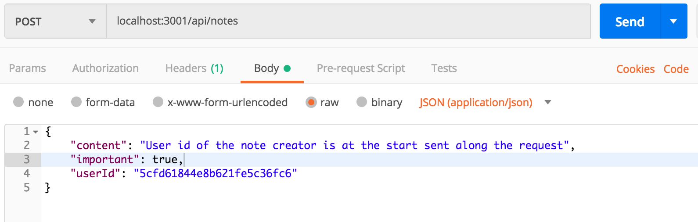
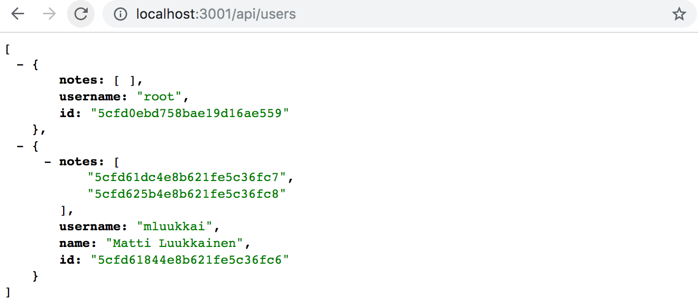
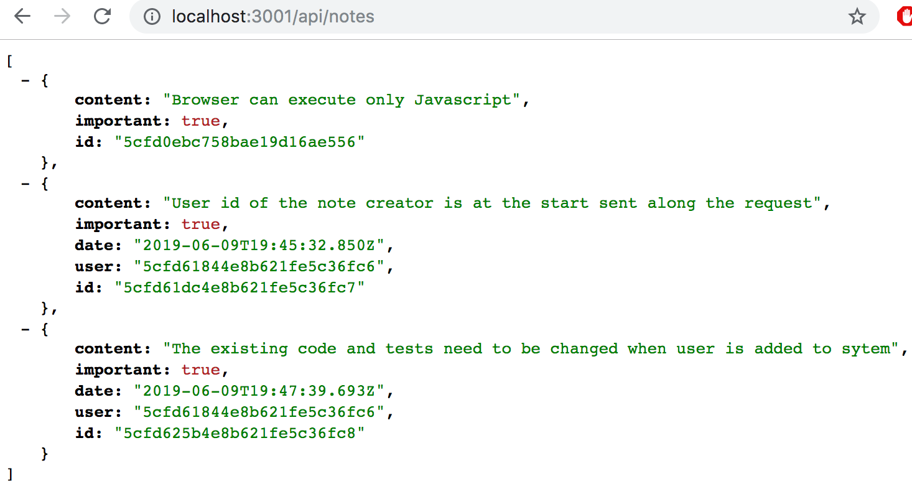
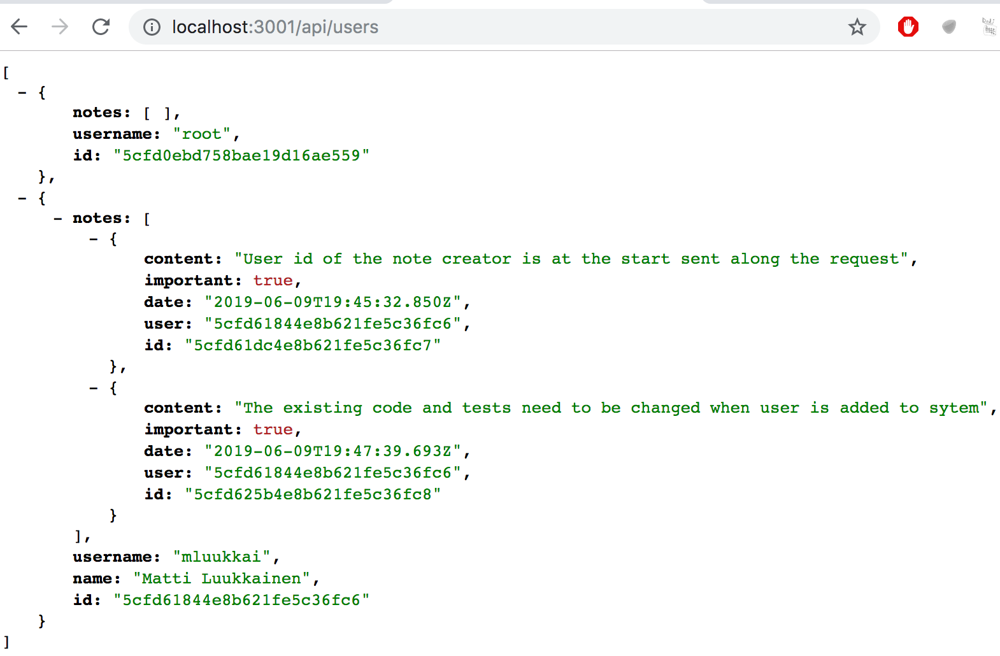
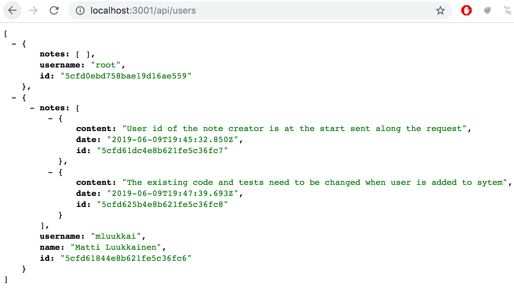

<div class="content">

<!-- We want to add user authentication and authorization to our application. Users should be stored in the database and every note should be linked to the user who created it. Deleting and editing a note should only be allowed for the user who created it. -->

我们想要为我们的应用增加用户认证和鉴权的功能。用户 应当存储在数据库中，并且每一个 便笺 应当被关联到创建它的 用户。只有 便笺 的创建者才拥有删除和编辑它的权利。

<!-- Let's start by adding information about users to the database. There is a one-to-many relationship between the user (<i>User</i>) and notes (<i>Note</i>): -->

让我们从向数据库添加用户信息开始。<i>User</i> 和 <i>Note</i> 是典型的一对多关系


<!-- If we were working with a relational database the implementation would be straightforward. Both resources would have their separate database tables, and the id of the user who created a note would be stored in the notes table as a foreign key. -->

如果我们用关系型数据库来实现会显得比较直白。每个资源都会有独立的数据库表，而创建 便笺 的 用户 ID 会作为 便笺 的外键进行存储。

<!-- When working with document databases the situation is a bit different, as there are many different ways of modeling the situation. -->

但如果我们使用文档数据库，就会有一些不同，体现在实现这种模型会有多种不同的方式。

<!-- The existing solution saves every note in the <i>notes collection</i> in the database. If we do not want to change this existing collection, then the natural choice is to save users in their own collection, <i>users</i> for example. -->

目前我们是将所有的 便笺 存储在了数据库的 <i>notes collection</i> 中。如果我们不想改变现有的 collection， 最自然的选择是将 用户 存储在另一个 collection 中， 比如<i>users</i> 这个 collection。

<!-- Like with all document databases, we can use object id's in Mongo to reference documents in other collections. This is similar to using foreign keys in relational databases. -->

与所有的文档数据库一样，我们可以使用 Mongo 的对象 id 来引用存储其他 collection 中的文档。这有点像关系型数据库的外键。

<!-- Traditionally document databases like Mongo do not support <i>join queries</i> that are available in relational databases, used for aggregating data from multiple tables. However starting from version 3.2. Mongo has supported [lookup aggregation queries](https://docs.mongodb.com/manual/reference/operator/aggregation/lookup/). We will not be taking a look at this functionality in this course. -->

传统的文档数据库，例如 Mongo 是不支持<i>join queries</i>的，但这在关系型数据库却很常见，用来聚合不同表中的数据。但从 Mongo 的 3.2 版本开始，它开始支持[lookup aggregation queries](https://docs.mongodb.com/manual/reference/operator/aggregation/lookup/)。但我们的课程并不会讲这个功能。

<!-- If we need a functionality similar to join queries, we will implement it in our application code by making multiple queries. In certain situations Mongoose can take care of joining and aggregating data, which gives the appearance of a join query. However, even in these situations Mongoose makes multiple queries to the database in the background. -->

如果我们需要一个类似 join queries 的功能，我们会在应用中利用 multiple queries 来实现这个需求。在特定的场景下，Mongoose 可以处理 join 和聚合数据，使它看起来像 join 查询 一样。但是 Mongoose 其实也是在后台数据库使用了 multiple query。

### References across collections
【跨 collection 引用】

<!-- If we were using a relational database the note would contain a <i>reference key</i> to the user who created it. In document databases we can do the same thing. -->

如果我们使用关系型数据库，Note 会包含一个<i>外键</i>来指向创建它的 User。在文档数据库中，我们也可以这么做。

<!-- Let's assume that the <i>users</i> collection contains two users: -->
我们假定<i>users</i> collection 包含两个 User

```js
[
  {
    username: 'mluukkai',
    _id: 123456,
  },
  {
    username: 'hellas',
    _id: 141414,
  },
];
```

<!-- The <i>notes</i> collection contains three notes that all have a <i>user</i> field that references a user in the <i>users</i> collection: -->

<i>notes</i> collection 包含三个 Note， 每个 Note 都有一个<i>user</i> 字段 来指向<i>users</i> collection 中的一个 user。

```js
[
  {
    content: 'HTML is easy',
    important: false,
    _id: 221212,
    user: 123456,
  },
  {
    content: 'The most important operations of HTTP protocol are GET and POST',
    important: true,
    _id: 221255,
    user: 123456,
  },
  {
    content: 'A proper dinosaur codes with Java',
    important: false,
    _id: 221244,
    user: 141414,
  },
]
```

<!-- Document databases do not demand the foreign key to be stored in the note resources, it could <i>also</i> be stored in the users collection, or even both: -->

文档型数据库并不要求外键存储在 Note 资源中，它<i>同样</i>可以存储在 User Collection 中，甚至可以在 Note 和 User 中都存一份。

```js
[
  {
    username: 'mluukkai',
    _id: 123456,
    notes: [221212, 221255],
  },
  {
    username: 'hellas',
    _id: 141414,
    notes: [221244],
  },
]
```

<!-- Since users can have many notes, the related ids are stored in an array in the <i>notes</i> field. -->

既然 User 可以包含许多个 Note， 那么存储 Note id 的 字段 就应该是一个数组。

<!-- Document databases also offer a radically different way of organizing the data: In some situations it might be beneficial to nest the entire notes array as a part of the documents in the users collection: -->

文档型数据库还提供了一个完全不同的方式组织数据：在某些情况下，这可能收益更大，那就是将所有的 note 以数组的形式作为每个文档的一部分嵌套在 user collection 中。

```js
[
  {
    username: 'mluukkai',
    _id: 123456,
    notes: [
      {
        content: 'HTML is easy',
        important: false,
      },
      {
        content: 'The most important operations of HTTP protocol are GET and POST',
        important: true,
      },
    ],
  },
  {
    username: 'hellas',
    _id: 141414,
    notes: [
      {
        content:
          'A proper dinosaur codes with Java',
        important: false,
      },
    ],
  },
]
```

<!-- In this schema notes would be tightly nested under users and the database would not generate ids for them. -->

这种 Shema 下 Note 会紧密地嵌套于 User 之中，数据库也不会为它们（指 Note）生成 ID

<!-- The structure and schema of the database is not as self-evident as it was with relational databases. The chosen schema must be one which supports the use cases of the application the best. This is not a simple design decision to make, as all use cases of the applications are not known when the design decision is made. -->

这种数据库结构和 schema 不像关系型数据库那样自我解释。所选择的 schema 必须最大化地支撑应用的用例。这并不是简单的设计决策，因为在设计决策时并不能对每一种用户用例都考虑周全。

<!-- Paradoxically, schema-less databases like Mongo require developers to make far more radical design decisions about data organization at the beginning of the project than relational databases with schemas. On average, relational databases offer a more-or-less suitable way of organizing data for many applications. -->

矛盾的是，与关系型数据库相比，像 Mongo 这种弱 Schema 类型的数据库要求开发者做更多的这种关于数据组织的设计决定，而且是在项目的开始阶段。一般来说，关系型数据库为应用提供的是一种或多或少合适可用的组织数据的方式。

### Mongoose schema for users

<!-- In this case, we make the decision to store the ids of the notes created by the user in the user document. Let's define the model for representing a user in the <i>models/user.js</i> file: -->

在这个例子中，我们将 note 的 id 以数组的形式存储到 user 当中。让我们定义一个 model 来表示 User 吧， <i>models/user.js</i> 代码如下：

```js
const mongoose = require('mongoose')

const userSchema = new mongoose.Schema({
  username: String,
  name: String,
  passwordHash: String,
  notes: [
    {
      type: mongoose.Schema.Types.ObjectId,
      ref: 'Note'
    }
  ],
})

userSchema.set('toJSON', {
  transform: (document, returnedObject) => {
    returnedObject.id = returnedObject._id.toString()
    delete returnedObject._id
    delete returnedObject.__v
    // the passwordHash should not be revealed
    delete returnedObject.passwordHash
  }
})

const User = mongoose.model('User', userSchema)

module.exports = User
```

<!-- The ids of the notes are stored within the user document as an array of Mongo ids. The definition is as follows: -->
Note 的 ID 以数组的形式存储在了 User 当中，定义如下： 

```js
{
  type: mongoose.Schema.Types.ObjectId,
  ref: 'Note'
}
```

<!-- The type of the field is <i>ObjectId</i> that references <i>note</i>-style documents. Mongo does not inherently know that this is a field that references notes, the syntax is purely related to and defined by Mongoose. -->
type 字段 是<i>ObjectId</i>，引用了 <i>note</i> 的文档类型。Mongo 
本质上并不知道这是一个引用 Note 的字段，这种语法完全是与 Mongoose 的定义有关。

<!-- Let's expand the schema of the note defined in the <i>model/note.js</i> file so that the note contains information about the user who created it: -->

让我们展开 <i>model/note.js</i> 文件中 note 的 schema，让 note 包含其创建者的信息。

```js
const noteSchema = new mongoose.Schema({
  content: {
    type: String,
    required: true,
    minlength: 5
  },
  date: Date,
  important: Boolean,
  // highlight-start
  user: {
    type: mongoose.Schema.Types.ObjectId,
    ref: 'User'
  }
  // highlight-end
})
```

<!-- In stark contrast to the conventions of relational databases, <i>references are now stored in both documents</i>: the note references the user who created it, and the user has an array of references to all of the notes created by them. -->

与关系型数据库形成鲜明对比，引用被同时存储在了两个 document 中。 Note 引用了创建它的 User， User 引用了它所创建的 Note 的数组。

### Creating users
【创建 User】

<!-- Let's implement a route for creating new users. Users have a unique <i>username</i>, a <i>name</i> and something called a <i>passwordHash</i>. The password hash is the output of a [one-way hash function](https://en.wikipedia.org/wiki/Cryptographic_hash_function) applied to the user's password. It is never wise to store unencrypted plaintext passwords in the database! -->

让我们来实现一个创建 User 的路由。User 拥有一个唯一的<i>username</i>, 一个<i>name</i> 以及一个<i>passwordHash</i>。 password 的 hash 是一个 [单向 Hash 函数](https://en.wikipedia.org/wiki/Cryptographic_hash_function)的输出，用来存储 User 的密码。永远不要以明文的方式将密码存储在数据库中。

<!-- Let's install the [bcrypt](https://github.com/kelektiv/node.bcrypt.js) package for generating the password hashes: -->
让我们来安装[bcrypt](https://github.com/kelektiv/node.bcrypt.js) 用来生成密码的哈希值。

```bash
npm install bcrypt
```

<!-- Creating new users happens in compliance with the RESTful conventions discussed in [第3章](/zh/part3/node_js_与_express#rest), by making an HTTP POST request to the <i>users</i> path. -->

通过 HTTP 向<i>users</i>发送 POST 请求，按照[第3章](/zh/part3/node_js_与_express#rest)讨论的 RESTful 约定创建用户。

<!-- Let's define a separate <i>router</i> for dealing with users in a new <i>controllers/users.js</i> file. Let's take the router into use in our application in the <i>app.js</i> file, so that it handles requests made to the <i>/api/users</i> url: -->

我们来定义一个独立的<i>router</i> 来处理<i>controllers/users.js</i> 中的 User。并在 app.js 中使用这个路由，这样就可以处理对 <i>/api/users</i> 发出的请求了。

```js
const usersRouter = require('./controllers/users')

// ...

app.use('/api/users', usersRouter)
```

<!-- The contents of the file that defines the router are as follows: -->
定义路由的代码如下：

```js
const bcrypt = require('bcrypt')
const usersRouter = require('express').Router()
const User = require('../models/user')

usersRouter.post('/', async (request, response) => {
  const body = request.body

  const saltRounds = 10
  const passwordHash = await bcrypt.hash(body.password, saltRounds)

  const user = new User({
    username: body.username,
    name: body.name,
    passwordHash,
  })

  const savedUser = await user.save()

  response.json(savedUser)
})

module.exports = usersRouter
```

<!-- The password sent in the request is <i>not</i> stored in the database. We store the <i>hash</i> of the password that is generated with the _bcrypt.hash_ function. -->

request 当中的密码并没有存储在数据库中。我们存储的是 _bcrypt.hash_ 函数生成的 hash 值 

<!-- The fundamentals of [storing passwords](https://codahale.com/how-to-safely-store-a-password/) is outside the scope of this course material. We will not discuss what the magic number 10 assigned to the [saltRounds](https://github.com/kelektiv/node.bcrypt.js/#a-note-on-rounds) variable means, but you can read more about it in the linked material. -->

[存储密码](https://codahale.com/how-to-safely-store-a-password/) 的基本原理超出了本课程的范围。我们也不会讨论赋值给[saltRounds](https://github.com/kelektiv/node.bcrypt.js/#a-note-on-rounds) 的魔法值 10 代表什么，但你可以在相关文章中找到它。

<!-- Our current code does not contain any error handling or input validation for verifying that the username and password are in the desired format. -->
我们的当前代码不包含任何用于验证用户名和密码的功能，如用户名和密码是否为所需格式等错误处理或输入校验。

<!-- The new feature can and should initially be tested manually with a tool like Postman. However testing things manually will quickly become too cumbersome, especially once we implement functionality that enforces usernames to be unique. -->
新特性可以并且应该首先使用 Postman 这样的工具进行手动测试。 然而，手动测试将很快变得过于繁琐，特别是一旦我们实现了强制用户名保持唯一等功能。

<!-- It takes much less effort to write automated tests, and it will make the development of our application much easier. -->
编写自动化测试所需的工作量要少得多，而且它将使应用的开发更加容易。

<!-- Our initial tests could look like this: -->
我们最初的测试可能是这样的:

```js
const bcrypt = require('bcrypt')
const User = require('../models/user')

//...

describe('when there is initially one user in db', () => {
  beforeEach(async () => {
    await User.deleteMany({})

    const passwordHash = await bcrypt.hash('sekret', 10)
    const user = new User({ username: 'root', passwordHash })

    await user.save()
  })

  test('creation succeeds with a fresh username', async () => {
    const usersAtStart = await helper.usersInDb()

    const newUser = {
      username: 'mluukkai',
      name: 'Matti Luukkainen',
      password: 'salainen',
    }

    await api
      .post('/api/users')
      .send(newUser)
      .expect(200)
      .expect('Content-Type', /application\/json/)

    const usersAtEnd = await helper.usersInDb()
    expect(usersAtEnd).toHaveLength(usersAtStart.length + 1)

    const usernames = usersAtEnd.map(u => u.username)
    expect(usernames).toContain(newUser.username)
  })
})
```

<!-- The tests use the <i>usersInDb()</i> helper function that we implemented in the <i>tests/test_helper.js</i> file. The function is used to help us verify the state of the database after a user is created: -->

测试使用了我们实现于<i>tests/test_helper.js</i> 文件中的 <i>usersInDb()</i> 这个辅助函数。这个函数用来帮助我们验证创建完一个用户后的数据库的状态。

```js
const User = require('../models/user')

// ...

const usersInDb = async () => {
  const users = await User.find({})
  return users.map(u => u.toJSON())
}

module.exports = {
  initialNotes,
  nonExistingId,
  notesInDb,
  usersInDb,
}
```

<!-- The <i>beforeEach</i> block adds a user with the username <i>root</i> to the database. We can write a new test that verifies that a new user with the same username can not be created: -->
<i>beforeEach</i> 代码块向数据库增加了一个用户名为<i>root</i> 的 User。我们可以写一个新的测试用来验证拥有相同用户名的用户不能被创建出来。

```js
describe('when there is initially one user in db', () => {
  // ...

  test('creation fails with proper statuscode and message if username already taken', async () => {
    const usersAtStart = await helper.usersInDb()

    const newUser = {
      username: 'root',
      name: 'Superuser',
      password: 'salainen',
    }

    const result = await api
      .post('/api/users')
      .send(newUser)
      .expect(400)
      .expect('Content-Type', /application\/json/)

    expect(result.body.error).toContain('`username` to be unique')

    const usersAtEnd = await helper.usersInDb()
    expect(usersAtEnd).toHaveLength(usersAtStart.length)
  })
})
```

<!-- The test case obviously will not pass at this point. We are essentially practicing [test-driven development (TDD)](https://en.wikipedia.org/wiki/Test-driven_development), where tests for new functionality are written before the functionality is implemented. -->

测试用例显然不会在这一点上通过。我们实际上是在实践[测试驱动开发 TDD](https://en.wikipedia.org/wiki/Test-driven_development),也就是在函数实现之前先写测试用例。

<!-- Let's validate the uniqueness of the username with the help of Mongoose validators. As we mentioned in exercise [3.19](/zh/part3/es_lint与代码检查#exercises), Mongoose does not have a built-in validator for checking the uniqueness of a field. We can find a ready-made solution for this from the [mongoose-unique-validator](https://www.npmjs.com/package/mongoose-unique-validator) npm package. Let's install it: -->

让我们在 Mongoose validator 的帮助下验证用户名的唯一性。正如我们在练习 [3.19](/zh/part3/es_lint与代码检查#exercises)中提到的，Mongoose 并没有内置的 validator 来检查某个字段的唯一性。我们可以使用一个现成的解决方案[mongoose-unique-validator](https://www.npmjs.com/package/mongoose-unique-validator) 这个 npm 包，先安装一下：

```bash
npm install mongoose-unique-validator
```

<!-- We must make the following changes to the schema defined in the <i>models/user.js</i> file: -->

我们必须对<i>models/user.js</i> 定义的 schema 做如下修改：

```js
const mongoose = require('mongoose')
const uniqueValidator = require('mongoose-unique-validator') // highlight-line

const userSchema = new mongoose.Schema({
  username: {
    type: String,
    unique: true  // highlight-line
  },
  name: String,
  passwordHash: String,
  notes: [
    {
      type: mongoose.Schema.Types.ObjectId,
      ref: 'Note'
    }
  ],
})

userSchema.plugin(uniqueValidator) // highlight-line

// ...
```

<!-- We could also implement other validations into the user creation. We could check that the username is long enough, that the username only consists of permitted characters, or that the password is strong enough. Implementing these functionalities is left as an optional exercise. -->

我们同样可以在创建 User 的时候实现其他验证。比如我们可以检查用户名的长度，检查仅可以使用合法字符，或者密码的强度是否足够。实现这些 validator 是一个可选的练习。

<!-- Before we move onward, let's add an initial implementation of a route handler that returns all of the users in the database: -->

在我们继续之前，让我们增加一个路由的初始实现，即返回数据库中的所有用户：

```js
usersRouter.get('/', async (request, response) => {
  const users = await User.find({})
  response.json(users)
})
```

<!-- The list looks like this: -->
这个列表看起来像这样：


<!-- You can find the code for our current application in its entirety in the <i>part4-7</i> branch of [this github repository](https://github.com/fullstack-hy2020/part3-notes-backend/tree/part4-7). -->
你也可以在[Github](https://github.com/fullstack-hy2020/part3-notes-backend/tree/part4-7)的 <i>part4-7</i> 分支中找到当前应用的代码。

### Creating a new note 
【创建一个新 Note】

<!-- The code for creating a new note has to be updated so that the note is assigned to the user who created it. -->

创建新 Note 的代码同样也需要更新了，以便 Note 指向创建它的 User。

<!-- Let's expand our current implementation so, that the information about the user who created a note is sent in the <i>userId</i> field of the request body: -->
让我们展开当前实现，以便在 request body 的<i>userId</i> 发送关于创建 Note 的信息。

```js
const User = require('../models/user') //highlight-line

//...

notesRouter.post('/', async (request, response, next) => {
  const body = request.body

  const user = await User.findById(body.userId) //highlight-line

  const note = new Note({
    content: body.content,
    important: body.important === undefined ? false : body.important,
    date: new Date(),
    user: user._id //highlight-line
  })

  const savedNote = await note.save()
  user.notes = user.notes.concat(savedNote._id) //highlight-line
  await user.save()  //highlight-line
  
  response.json(savedNote.)
})
```

<!-- It's worth noting that the <i>user</i> object also changes. The <i>id</i> of the note is stored in the <i>notes</i> field: -->
值得注意的是<i>user</i>同样变化了。Note 的 <i>id</i> 存储在了 <i>notes</i> field 中。

```js
const user = await User.findById(body.userId)

// ...

user.notes = user.notes.concat(savedNote._id)
await user.save()
```

<!-- Let's try to create a new note -->
让我们尝试创建一个新的 Note



<!-- The operation appears to work. Let's add one more note and then visit the route for fetching all users: -->
操作看起来起作用了。让我们增加另一个 Note ，并访问获取所有 User 的路由。



<!-- We can see that the user has two notes. -->
我们可以看到 User 拥有两个 Note 了。

<!-- Likewise, the ids of the users who created the notes can be seen when we visit the route for fetching all notes: -->
同样，User 的 id 同样创建在了 Note 中，我们通过访问获取所有 Note 的路由可以看到。



### Populate

<!-- We would like our API to work in such a way, that when an HTTP GET request is made to the <i>/api/users</i> route, the user objects would also contain the contents of the user's notes, and not just their id. In a relational database, this functionality would be implemented with a <i>join query</i>. -->

我们希望我们的 API 以这样的方式工作，即当一个 HTTP GET 请求到<i>/api/users</i> 路由时，User 对象同样包含其创建 Note 的内容，而不仅仅是 Note 的 id。 在关系型数据库中，这个功能需求可以通过 <i>join query</i> 实现。

<!-- As previously mentioned, document databases do not properly support join queries between collections, but the Mongoose library can do some of these joins for us. Mongoose accomplishes the join by doing multiple queries, which is different from join queries in relational databases which are <i>transactional</i>, meaning that the state of the database does not change during the time that the query is made. With join queries in Mongoose, nothing can guarantee that the state between the collections being joined is consistent, meaning that if we make a query that joins the user and notes collections, the state of the collections may change during the query. -->

如前所述，文档型数据库不能很好地支持 collection 之间的 join queries，但是 Mongoose 库可以做一些类似 join 的工作。Mongoose 是通过 multiple queries 来实现这种类 join 查询的，这与关系型数据库中的事务性 join 查询不同，也就是数据库的状态在查询执行期间并不改变。而使用 Mongoose 的 join 查询，并不能保证 collection 在 join 时的状态是一致的，也就是如果我们在进行 Note 和 User 的 join 查询后，在查询期间 collection 的状态可能发生变化。

<!-- The Mongoose join is done with the [populate](http://mongoosejs.com/docs/populate.html) method. Let's update the route that returns all users first: -->

Mongoose 的 join 是通过[populate](http://mongoosejs.com/docs/populate.html) 方法完成的。让我们更新返回所有 User 的路由： 

```js
usersRouter.get('/', async (request, response) => {
  const users = await User  // highlight-line
    .find({}).populate('notes') // highlight-line

  response.json(users)
})
```

<!-- The [populate](http://mongoosejs.com/docs/populate.html) method is chained after the <i>find</i> method making the initial query. The parameter given to the populate method defines that the <i>ids</i> referencing <i>note</i> objects in the <i>notes</i> field of the <i>user</i> document will be replaced by the referenced <i>note</i> documents. -->
[populate](http://mongoosejs.com/docs/populate.html) 方法是 <i>find</i> 方法这一初始查询方法后的一个链式调用。populate 方法的入参，定义了存储在 User 中的 Note id， 这些 id 指向了 Note Collection 的 Note，而这些 id 也会被真实的 Note 所替代。

<!-- The result is almost exactly what we wanted: -->
结果正如我们所预期的那样：



<!-- We can use the populate parameter for choosing the fields we want to include from the documents. The selection of fields is done with the Mongo [syntax](https://docs.mongodb.com/manual/tutorial/project-fields-from-query-results/#return-the-specified-fields-and-the-id-field-only): -->
我们可以使用 populate 的参数来选择我们想要包含的文档 field。field 的选择遵循 Mongo 的[语法](https://docs.mongodb.com/manual/tutorial/project-fields-from-query-results/#return-the-specified-fields-and-the-id-field-only):

```js
usersRouter.get('/', async (request, response) => {
  const users = await User
    .find({}).populate('notes', { content: 1, date: 1 })

  response.json(users)
});
```

<!-- The result is now exactly like we want it to be: -->
结果也如我们的预期：


<!-- Let's also add a suitable population of user information to notes: -->
让我们增加一组合适的 User 信息到 Note 中：

```js
notesRouter.get('/', async (request, response) => {
  const notes = await Note
    .find({}).populate('user', { username: 1, name: 1 })

  response.json(notes)
});
```

<!-- Now the user's information is added to the <i>user</i> field of note objects. -->
现在用户的信息已经被添加到 Note 对象的<i>user</i> field 中了。


<!-- It's important to understand that the database does not actually know that the ids stored in the <i>user</i> field of notes reference documents in the user collection. -->

数据库实际上并不知道 Note 中<i>user</i> field 中的 id 实际指向了 User collection 中的 User， 了解这一点十分重要。

<!-- The functionality of the <i>populate</i> method of Mongoose is based on the fact that we have defined "types" to the references in the Mongoose schema with the <i>ref</i> option: -->
Mongoose 中<i>populate</i> 方法的功能是基于这样一个事实，即我们已经用 ref 选项为 Mongoose Schema 中的引用定义了类型： 

```js
const noteSchema = new mongoose.Schema({
  content: {
    type: String,
    required: true,
    minlength: 5
  },
  date: Date,
  important: Boolean,
  user: {
    type: mongoose.Schema.Types.ObjectId,
    ref: 'User'
  }
})
```

<!-- You can find the code for our current application in its entirety in the <i>part4-8</i> branch of [this github repository](https://github.com/fullstack-hy2020/part3-notes-backend/tree/part4-8). -->
你可以在这个[分支](https://github.com/fullstack-hy2020/part3-notes-backend/tree/part4-8).中找到本节课的代码。

</div>