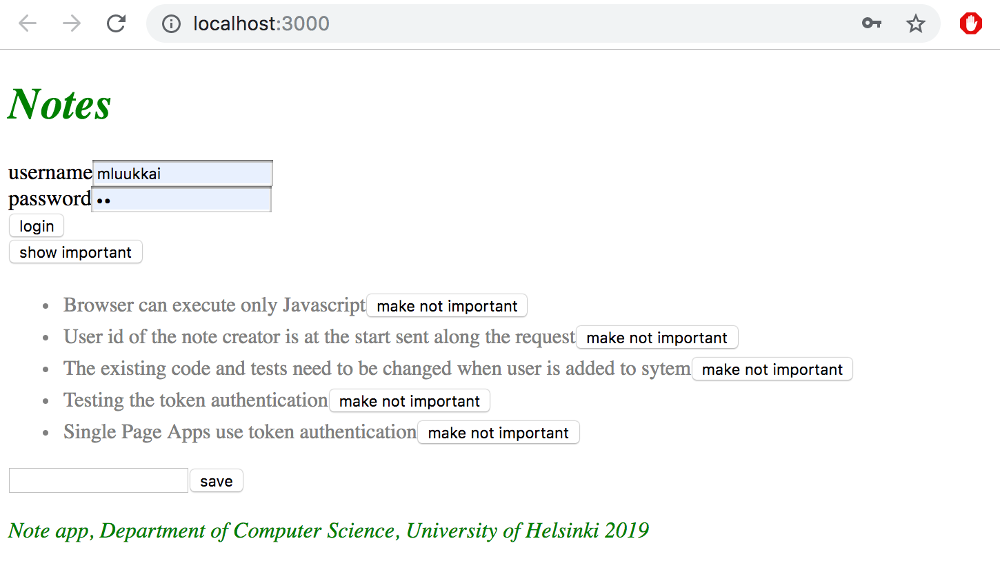
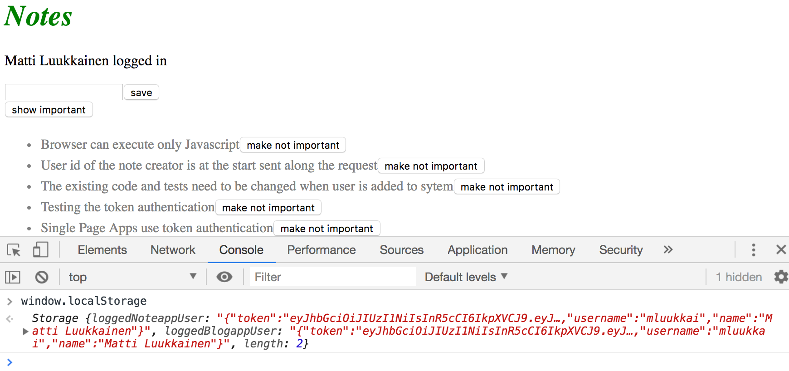
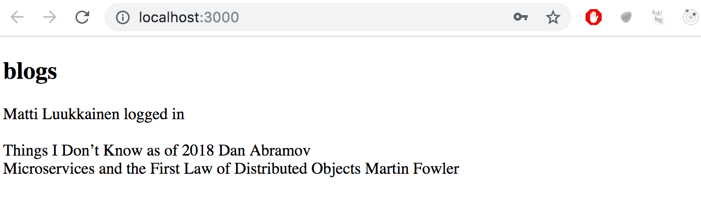
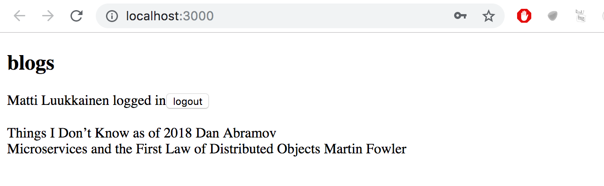
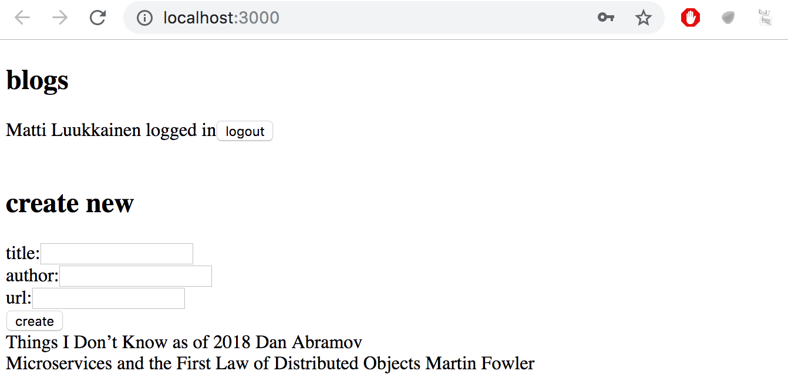
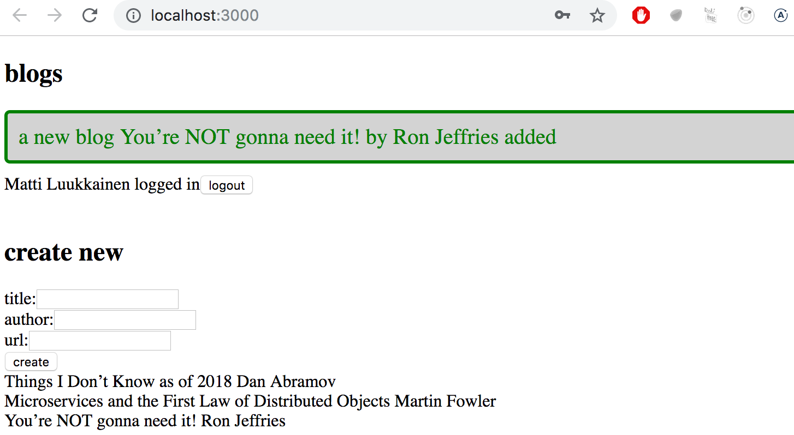
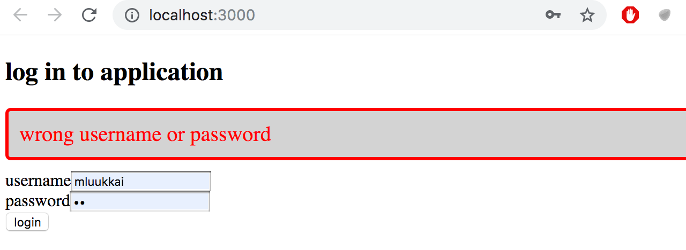

<div class="content">


In the last two parts, we have mainly concentrated on the backend, and the frontend does not yet support the user management we implemented to the backend in part 4.


At the moment the frontend shows existing notes, and lets users change the state of a note from important to not important and vice versa. New notes cannot be added anymore because of the changes made to the backend in part 4: the backend now expects that a token verifying a user's identity is sent with the new note. 


We'll now implement a part of the required user management functionality in the frontend. Let's begin with user login. Throughout this part we will assume that new users will not be added from the frontend. 


A login form has now been added to the top of the page. The form for adding new notes has also been moved to the top of the list of notes. 




The code of the <i>App</i> component now looks as follows: 

```js
const App = () => {
  const [notes, setNotes] = useState([]) 
  const [newNote, setNewNote] = useState('')
  const [showAll, setShowAll] = useState(true)
  const [errorMessage, setErrorMessage] = useState(null)
  // highlight-start
  const [username, setUsername] = useState('') 
  const [password, setPassword] = useState('') 
// highlight-end

  useEffect(() => {
    noteService
      .getAll().then(initialNotes => {
        setNotes(initialNotes)
      })
  }, [])

  // ...

// highlight-start
  const handleLogin = (event) => {
    event.preventDefault()
    console.log('logging in with', username, password)
  }
  // highlight-end

  return (
    <div>
      <h1>Notes</h1>

      <Notification message={errorMessage} />

      // highlight-start
      <form onSubmit={handleLogin}>
        <div>
          username
            <input
            type="text"
            value={username}
            name="Username"
            onChange={({ target }) => setUsername(target.value)}
          />
        </div>
        <div>
          password
            <input
            type="password"
            value={password}
            name="Password"
            onChange={({ target }) => setPassword(target.value)}
          />
        </div>
        <button type="submit">login</button>
      </form>
    // highlight-end

      // ...
    </div>
  )
}

export default App
```


Current application code can be found on [Github](https://github.com/fullstack-hy2020/part2-notes/tree/part5-1), branch <i>part5-1</i>.


The login form is handled the same way we handled forms in 
[part 2](/en/part2/forms). The app state has fields for  <i>username</i> and <i>password</i> to store the data from the form. The form fields have event handlers, which synchronize changes in the field to the state of the <i>App</i> component. The event handlers are simple: An object is given to them as a parameter, and they destructure the field <i>target</i> from the object and save its value to the state.

```js
({ target }) => setUsername(target.value)
```


The method _handleLogin_, which is  responsible for handling the data in the form, is yet to be implemented. 


Logging in is done by sending an HTTP POST request to server address <i>api/login</i>. Let's separate the code responsible for this request to its own module, to file <i>services/login.js</i>.


We'll use <i>async/await</i> syntax instead of promises for the HTTP request: 

```js
import axios from 'axios'
const baseUrl = '/api/login'

const login = async credentials => {
  const response = await axios.post(baseUrl, credentials)
  return response.data
}

export default { login }
```


The method for handling the login can be implemented as follows: 

```js
import loginService from './services/login' 

const App = () => {
  // ...
  const [username, setUsername] = useState('') 
  const [password, setPassword] = useState('') 
// highlight-start
  const [user, setUser] = useState(null)
// highlight-end

  const handleLogin = async (event) => {
    event.preventDefault()
    
    // highlight-start
    try {
      const user = await loginService.login({
        username, password,
      })

      setUser(user)
      setUsername('')
      setPassword('')
    } catch (exception) {
      setErrorMessage('Wrong credentials')
      setTimeout(() => {
        setErrorMessage(null)
      }, 5000)
    }
    // highlight-end
  }

  // ...
}
```


If the login is successful, the form fields are emptied <i>and</i> the server response (including a <i>token</i> and the user details) is saved to the <i>user</i> field of the application's state.


If the login fails, or running the function _loginService.login_ results in an error, the user is notified. 


The user is not notified about a successful login in any way. Let's modify the application to show the login form only <i>if the user is not logged-in</i> so when _user === null_. The form for adding new notes is shown only if the <i>user is logged-in</i>, so <i>user</i> contains the user details. 


Let's add two helper functions to the <i>App</i> component for generating the forms: 

```js
const App = () => {
  // ...

  const loginForm = () => (
    <form onSubmit={handleLogin}>
      <div>
        username
          <input
          type="text"
          value={username}
          name="Username"
          onChange={({ target }) => setUsername(target.value)}
        />
      </div>
      <div>
        password
          <input
          type="password"
          value={password}
          name="Password"
          onChange={({ target }) => setPassword(target.value)}
        />
      </div>
      <button type="submit">login</button>
    </form>      
  )

  const noteForm = () => (
    <form onSubmit={addNote}>
      <input
        value={newNote}
        onChange={handleNoteChange}
      />
      <button type="submit">save</button>
    </form>  
  )

  return (
    // ...
  )
}
```


and conditionally render them:

```js
const App = () => {
  // ...

  const loginForm = () => (
    // ...
  )

  const noteForm = () => (
    // ...
  )

  return (
    <div>
      <h1>Notes</h1>

      <Notification message={errorMessage} />

      {user === null && loginForm()} // highlight-line
      {user !== null && noteForm()} // highlight-line

      <div>
        <button onClick={() => setShowAll(!showAll)}>
          show {showAll ? 'important' : 'all'}
        </button>
      </div>
      <ul>
        {notesToShow.map((note, i) => 
          <Note
            key={i}
            note={note} 
            toggleImportance={() => toggleImportanceOf(note.id)}
          />
        )}
      </ul>

      <Footer />
    </div>
  )
}
```

A slightly odd looking, but commonly used [React trick](https://reactjs.org/docs/conditional-rendering.html#inline-if-with-logical--operator) is used to render the forms conditionally: 

```js
{
  user === null && loginForm()
}
```


If the first statement evaluates to false, or is [falsy](https://developer.mozilla.org/en-US/docs/Glossary/Falsy), the second statement (generating the form) is not executed at all. 

We can make this even more straightforward by using the [conditional operator](https://developer.mozilla.org/en-US/docs/Web/JavaScript/Reference/Operators/Conditional_Operator):

```js
return (
  <div>
    <h1>Notes</h1>

    <Notification message={errorMessage}/>

    {user === null ?
      loginForm() :
      noteForm()
    }

    <h2>Notes</h2>

    // ...

  </div>
)
```


If _user === null_ is [truthy](https://developer.mozilla.org/en-US/docs/Glossary/Truthy), _loginForm()_ is executed. If not, _noteForm()_ is.


Let's do one more modification. If the user is logged-in, their name is shown on the screen: 

```js
return (
  <div>
    <h1>Notes</h1>

    <Notification message={errorMessage} />

    {user === null ?
      loginForm() :
      <div>
        <p>{user.name} logged-in</p>
        {noteForm()}
      </div>
    }

    <h2>Notes</h2>

    // ...

  </div>
)
```


The solution isn't perfect, but we'll leave it for now. 


Our main component <i>App</i> is at the moment way too large. The changes we did now are a clear sign that the forms should be refactored into their own components. However, we will leave that for an optional exercise. 


Current application code can be found on [Github](https://github.com/fullstack-hy2020/part2-notes/tree/part5-2), branch <i>part5-2</i>.

### Creating new notes

The token returned with a successful login is saved to the application's state - the <i>user</i>'s field <i>token</i>:

```js
const handleLogin = async (event) => {
  event.preventDefault()
  try {
    const user = await loginService.login({
      username, password,
    })

    setUser(user) // highlight-line
    setUsername('')
    setPassword('')
  } catch (exception) {
    // ...
  }
}
```

Let's fix creating new notes so it works with the backend. This means adding the token of the logged-in user to the Authorization header of the HTTP request. 


The <i>noteService</i> module changes like so: 

```js
import axios from 'axios'
const baseUrl = '/api/notes'

let token = null // highlight-line

// highlight-start
const setToken = newToken => {
  token = `bearer ${newToken}`
}
// highlight-end

const getAll = () => {
  const request = axios.get(baseUrl)
  return request.then(response => response.data)
}

const create = async newObject => {
  // highlight-start
  const config = {
    headers: { Authorization: token },
  }
// highlight-end

  const response = await axios.post(baseUrl, newObject, config) // highlight-line
  return response.data
}

const update = (id, newObject) => {
  const request = axios.put(`${ baseUrl } /${id}`, newObject)
  return request.then(response => response.data)
}

export default { getAll, create, update, setToken } // highlight-line
```


The noteService module contains a private variable _token_. Its value can be changed with a function _setToken_, which is exported by the module. _create_, now with async/await syntax, sets the token to the <i>Authorization</i> header. The header is given to axios as the third parameter of the <i>post</i> method. 


The event handler responsible for login must be changed to call the method <code>noteService.setToken(user.token)</code> with a successful login: 

```js
const handleLogin = async (event) => {
  event.preventDefault()
  try {
    const user = await loginService.login({
      username, password,
    })

    noteService.setToken(user.token) // highlight-line
    setUser(user)
    setUsername('')
    setPassword('')
  } catch (exception) {
    // ...
  }
}
```


And now adding new notes works again!

### Saving the token to the browser's local storage


Our application has a flaw: when the page is rerendered, information of the user's login disappears. This also slows down development. For example when we test creating new notes, we have to login again every single time. 


This problem is easily solved by saving the login details to [local storage](https://developer.mozilla.org/en-US/docs/Web/API/Storage). Local Storage is a [key-value](https://en.wikipedia.org/wiki/Key-value_database) database in the browser. 


It is very easy to use. A <i>value</i> corresponding to a certain <i>key</i> is saved to the database with method [setItem](https://developer.mozilla.org/en-US/docs/Web/API/Storage/setItem). For example: 

```js
window.localStorage.setItem('name', 'juha tauriainen')
```


saves the string given as the second parameter as the value of key <i>name</i>. 


The value of a key can be found with method [getItem](https://developer.mozilla.org/en-US/docs/Web/API/Storage/getItem):

```js
window.localStorage.getItem('name')
```


and [removeItem](https://developer.mozilla.org/en-US/docs/Web/API/Storage/removeItem) removes a key. 


Values in the local storage are persisted even when the page is rerendered. The storage is [origin](https://developer.mozilla.org/en-US/docs/Glossary/Origin)-specific so each web application has its own storage. 


Let's extend our application so that it saves the details of a logged-in user to the local storage. 


Values saved to the storage are [DOMstrings](https://developer.mozilla.org/en-US/docs/Web/API/DOMString), so we cannot save a JavaScript object as is. The object has to be parsed to JSON first, with the method _JSON.stringify_. Correspondingly, when a JSON object is read from the local storage, it has to be parsed back to JavaScript with _JSON.parse_.


Changes to the login method are as follows: 

```js
  const handleLogin = async (event) => {
    event.preventDefault()
    try {
      const user = await loginService.login({
        username, password,
      })

      // highlight-start
      window.localStorage.setItem(
        'loggedNoteappUser', JSON.stringify(user)
      ) 
      // highlight-end
      noteService.setToken(user.token)
      setUser(user)
      setUsername('')
      setPassword('')
    } catch (exception) {
      // ...
    }
  }
```


The details of a logged-in user are now saved to the local storage, and they can be viewed on the console: 



You can also inspect the local storage using the developer tools. On Chrome, go to the <i>Application</i> tab and select <i>Local Storage</i> (more details [here](https://developers.google.com/web/tools/chrome-devtools/storage/localstorage)). On Firefox go to the <i>Storage</i> tab and select <i>Local Storage</i> (details [here](https://developer.mozilla.org/en-US/docs/Tools/Storage_Inspector)).


We still have to modify our application so that when we enter the page, the application checks if user details of a logged-in user can already be found on the local storage. If they can, the details are saved to the state of the application and to <i>noteService</i>.


The right way to do this is with an [effect hook](https://reactjs.org/docs/hooks-effect.html): a mechanism we first encountered in [part 2](/en/part2/getting_data_from_server#effect-hooks), and used to fetch notes from the server. 


We can have multiple effect hooks, so let's create a second one to handle the first loading of the page:

```js
const App = () => {
  const [notes, setNotes] = useState([]) 
  const [newNote, setNewNote] = useState('')
  const [showAll, setShowAll] = useState(true)
  const [errorMessage, setErrorMessage] = useState(null)
  const [username, setUsername] = useState('') 
  const [password, setPassword] = useState('') 
  const [user, setUser] = useState(null) 

  useEffect(() => {
    noteService
      .getAll().then(initialNotes => {
        setNotes(initialNotes)
      })
  }, [])

  // highlight-start
  useEffect(() => {
    const loggedUserJSON = window.localStorage.getItem('loggedNoteappUser')
    if (loggedUserJSON) {
      const user = JSON.parse(loggedUserJSON)
      setUser(user)
      noteService.setToken(user.token)
    }
  }, [])
  // highlight-end

  // ...
}
```


The empty array as the parameter of the effect ensures that the effect is executed only when the component is rendered [for the first time](https://reactjs.org/docs/hooks-reference.html#conditionally-firing-an-effect).


Now a user stays logged-in in the application forever. We should probably add a <i>logout</i> functionality which removes the login details from the local storage. We will however leave it for an exercise. 


It's possible to log out a user using the console, and that is enough for now. 
You can log out with the command:

```js
window.localStorage.removeItem('loggedNoteappUser')
```
or with the command which empties <i>localstorage</i> completely: 

```js
window.localStorage.clear()
```


Current application code can be found on [Github](https://github.com/fullstack-hy2020/part2-notes/tree/part5-3), branch <i>part5-3</i>.

</div>

<div class="tasks">

### Exercises 5.1.-5.4.


We will now create a frontend for the bloglist backend we created in the last part. You can use [this application](https://github.com/fullstack-hy2020/bloglist-frontend) from GitHub as the base of your solution. The application expects your backend to be running on port 3001. 

It is enough to submit your finished solution. You can do a commit after each exercise, but that is not necessary. 

The first few exercises revise everything we have learned about React so far. They can be challenging, especially if your backend is incomplete. 
It might be best to use the backend from model answers of part 4. 


While doing the exercises, remember all of the debugging methods we have talked about, especially keeping an eye on the console. 


**Warning:** If you notice you are mixing async/await and _then_ commands, it's 99.9%  certain you are doing something wrong. Use either or, never both. 

#### 5.1: bloglist frontend, step1


Clone the application from [Github](https://github.com/fullstack-hy2020/bloglist-frontend) with the command: 

```bash
git clone https://github.com/fullstack-hy2020/bloglist-frontend
```


<i>remove the git configuration of the cloned application</i>

```bash
cd bloglist-frontend   // go to cloned repository
rm -rf .git
```


The application is started the usual way, but you have to install its dependencies first: 

```bash
npm install
npm start
```


Implement login functionality to the frontend. The token returned with a successful login is saved to the application's state <i>user</i>.


If a user is not logged-in, <i>only</i> the login form is visible. 


If user is logged-in, the name of the user and a list of blogs is shown. 




User details of the logged-in user do not have to be saved to the local storage yet. 


**NB** You can implement the conditional rendering of the login form like this for example: 

```js
  if (user === null) {
    return (
      <div>
        <h2>Log in to application</h2>
        <form>
          //...
        </form>
      </div>
    )
  }

  return (
    <div>
      <h2>blogs</h2>
      {blogs.map(blog =>
        <Blog key={blog.id} blog={blog} />
      )}
    </div>
  )
}
```

#### 5.2: bloglist frontend, step2


Make the login 'permanent' by using the local storage. Also implement a way to log out. 



Ensure the browser does not remember the details of the user after logging out. 

#### 5.3: bloglist frontend, step3


Expand your application to allow  a logged-in user to add new blogs: 




#### 5.4*: bloglist frontend, step4

Implement notifications which inform the user about successful and unsuccessful operations at the top of the page. For example, when a new blog is added, the following notification can be shown: 




Failed login can show the following notification: 




The notifications must be visible for a few seconds. It is not compulsory to add colors. 

</div>
