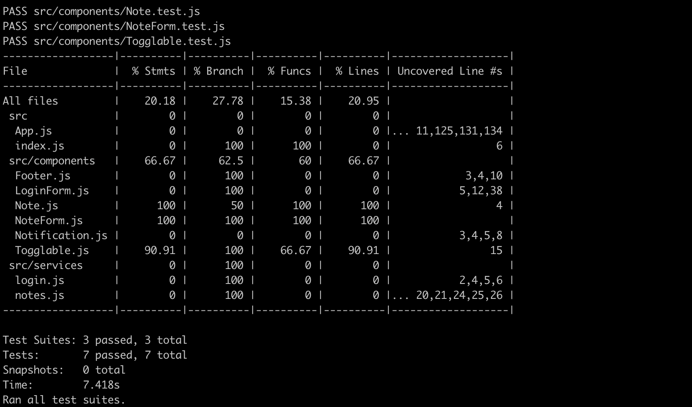
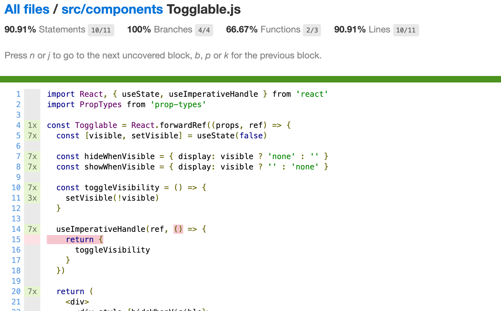

<div class="content">


There are many different ways of testing React applications. Let's take a look at them next.


Tests will be implemented with the same [Jest](http://jestjs.io/) testing library developed by Facebook that was used in the previous part. Jest is actually configured by default to applications created with create-react-app.

In addition to Jest, we also need another testing library that will help us render components for testing purposes. The current best option for this is [react-testing-library](https://github.com/testing-library/react-testing-library) which has seen rapid growth in popularity in recent times.


Let's install the library with the command:

```js
npm install --save-dev @testing-library/react @testing-library/jest-dom
```


Let's first write tests for the component that is responsible for rendering a note:

```js
const Note = ({ note, toggleImportance }) => {
  const label = note.important
    ? 'make not important'
    : 'make important'

  return (
    <li className='note'> // highlight-line
      {note.content}
      <button onClick={toggleImportance}>{label}</button>
    </li>
  )
}
```


Notice that the <i>li</i> element has the [CSS](https://reactjs.org/docs/dom-elements.html#classname) classname <i>note</i>, that is used to access the component in our tests.

### Rendering the component for tests

We will write our test in the <i>src/components/Note.test.js</i> file, which is in the same directory as the component itself.

The first test verifies that the component renders the contents of the note:

```js
import React from 'react'
import '@testing-library/jest-dom/extend-expect'
import { render } from '@testing-library/react'
import Note from './Note'

test('renders content', () => {
  const note = {
    content: 'Component testing is done with react-testing-library',
    important: true
  }

  const component = render(
    <Note note={note} />
  )

  expect(component.container).toHaveTextContent(
    'Component testing is done with react-testing-library'
  )
})
```


After the initial configuration, the test renders the component with the [render](https://testing-library.com/docs/react-testing-library/api#render) method provided by the react-testing-library:

```js
const component = render(
  <Note note={note} />
)
```

Normally React components are rendered to the <i>DOM</i>. The render method we used renders the components in a format that is suitable for tests without rendering them to the DOM.


_render_ returns an object that has several [properties](https://testing-library.com/docs/react-testing-library/api#render-result). One of the properties is called <i>container</i>, and it contains all of the HTML rendered by the component.


In the expectation, we verify that the component renders the correct text, which in this case is the content of the note:

```js
expect(component.container).toHaveTextContent(
  'Component testing is done with react-testing-library'
)
```


### Running tests


Create-react-app configures tests to be run in watch mode by default, which means that the _npm test_ command will not exit once the tests have finished, and will instead wait for changes to be made to the code. Once new changes to the code are saved, the tests are executed automatically after which Jest goes back to waiting for new changes to be made.


If you want to run tests "normally", you can do so with the command:

```js
CI=true npm test
```


**NB:** the console may issue a warning if you have not installed Watchman. Watchman is an application developed by Facebook that watches for changes that are made to files. The program speeds up the execution of tests and at least starting from macOS Sierra, running tests in watch mode issues some warnings to the console, that can be removed by installing Watchman.


Instructions for installing Watchman on different operating systems can be found on the official Watchman website: https://facebook.github.io/watchman/


### Test file location


In React there are (at least) [two different conventions](https://medium.com/@JeffLombardJr/organizing-tests-in-jest-17fc431ff850) for the test file's location. We created our test files according to the current standard by placing them in the same directory as the component being tested.


The other convention is to store the test files "normally" in their own separate directory. Whichever convention we choose, it is almost guaranteed to be wrong according to someone's opinion.


Personally, I do not like this way of storing tests and application code in the same directory. The reason we choose to follow this convention is that it is configured by default in applications created by create-react-app.


### Searching for content in a component


The react-testing-library package offers many different ways of investigating the content of the component being tested. Let's slightly expand our test:

```js
test('renders content', () => {
  const note = {
    content: 'Component testing is done with react-testing-library',
    important: true
  }

  const component = render(
    <Note note={note} />
  )

  // method 1
  expect(component.container).toHaveTextContent(
    'Component testing is done with react-testing-library'
  )

  // method 2
  const element = component.getByText(
    'Component testing is done with react-testing-library'
  )
  expect(element).toBeDefined()

  // method 3
  const div = component.container.querySelector('.note')
  expect(div).toHaveTextContent(
    'Component testing is done with react-testing-library'
  )
})
```


The first way uses method <i>toHaveTextContent</i> to search for a matching text from the entire HTML code rendered by the component.   
<i>toHaveTextContent</i> is one of many "matcher"-methods that are provided by the  [jest-dom](https://github.com/testing-library/jest-dom#tohavetextcontent) library.


The second way uses the [getByText](https://testing-library.com/docs/dom-testing-library/api-queries#bytext) method of the object returned by the render method. The method returns the element that contains the given text. An exception occurs if no such element exists. For this reason, we would technically not need to specify any additional expectation.

The third way is to search for a specific element that is rendered by the component with the [querySelector](https://developer.mozilla.org/en-US/docs/Web/API/Document/querySelector) method that receives a [CSS selector](https://developer.mozilla.org/en-US/docs/Web/CSS/CSS_Selectors) as its parameter.

<!-- Kaksi viimeistä tapaa siis hakevat metodien <i>getByText</i> ja <i>querySelector</i> avulla renderöidystä komponentista jonkin ehdon täyttävän elementin. Vastaavalla periaatteella toimivia "query"-metodeja, on tarjolla [lukuisia](https://testing-library.com/docs/dom-testing-library/api-queries). -->
The last two methods use the methods <i>getByText</i> and <i>querySelector</i> to find an element matching some condition from the rendered component. 
There are numerous similiar query methods [available](https://testing-library.com/docs/dom-testing-library/api-queries).

### Debugging tests


We typically run into many different kinds of problems when writing our tests.


The object returned by the render method has a [debug](https://testing-library.com/docs/react-testing-library/api#debug) method that can be used to print the HTML rendered by the component to the console. Let's try this out by making the following changes to our code:

```js
test('renders content', () => {
  const note = {
    content: 'Component testing is done with react-testing-library',
    important: true
  }

  const component = render(
    <Note note={note} />
  )

  component.debug() // highlight-line

  // ...
})
```


We can see the HTML generated by the component in the console:

```js
console.log node_modules/@testing-library/react/dist/index.js:90
  <body>
    <div>
      <li
        class="note"
      >
        Component testing is done with react-testing-library
        <button>
          make not important
        </button>
      </li>
    </div>
  </body>
```


It is also possible to search for a smaller part of the component and print its HTML code. In order to do this, we need the _prettyDOM_ method that can be imported from the <i>@testing-library/dom</i> package that is automatically installed with react-testing-library:

```js
import React from 'react'
import '@testing-library/jest-dom/extend-expect'
import { render } from '@testing-library/react'
import { prettyDOM } from '@testing-library/dom'  // highlight-line
import Note from './Note'

test('renders content', () => {
  const note = {
    content: 'Component testing is done with react-testing-library',
    important: true
  }

  const component = render(
    <Note note={note} />
  )
  const li = component.container.querySelector('li')
  
  console.log(prettyDOM(li)) // highlight-line
})
```


We used the selector to find the <i>li</i> element inside of the component, and printed its HTML to the console:

```js
console.log src/components/Note.test.js:21
  <li
    class="note"
  >
    Component testing is done with react-testing-library
    <button>
      make not important
    </button>
  </li>
```

### Clicking buttons in tests

In addition to displaying content, the <i>Note</i> component also makes sure that when the button associated with the note is pressed, the _toggleImportance_ event handler function gets called.

Testing this functionality can be accomplished like this:

```js
import React from 'react'
import { render, fireEvent } from '@testing-library/react' // highlight-line
import { prettyDOM } from '@testing-library/dom'
import Note from './Note'

// ...

test('clicking the button calls event handler once', () => {
  const note = {
    content: 'Component testing is done with react-testing-library',
    important: true
  }

  const mockHandler = jest.fn()

  const component = render(
    <Note note={note} toggleImportance={mockHandler} />
  )

  const button = component.getByText('make not important')
  fireEvent.click(button)

  expect(mockHandler.mock.calls).toHaveLength(1)
})
```

There's a few interesting things related to this test. The event handler is [mock](https://facebook.github.io/jest/docs/en/mock-functions.html) function defined with Jest:

```js
const mockHandler = jest.fn()
```

The test finds the button <i>based on the text</i> from the rendered component and clicks the element:

```js
const button = component.getByText('make not important')
fireEvent.click(button)
```

Clicking happens with the [fireEvent](https://testing-library.com/docs/api-events#fireevent) method.


The expectation of the test verifies that the <i>mock function</i> has been called exactly once.

```js
expect(mockHandler.mock.calls).toHaveLength(1)
```


[Mock objects and functions](https://en.wikipedia.org/wiki/Mock_object) are commonly used stub components in testing that are used for replacing dependencies of the components being tested. Mocks make it possible to return hardcoded responses, and to verify the number of times the mock functions are called and with what parameters.


In our example, the mock function is a perfect choice since it can be easily used for verifying that the method gets called exactly once.


### Tests for the <i>Togglable</i> component

Let's write a few tests for the <i>Togglable</i> component. Let's add the <i>togglableContent</i> CSS classname to the div that returns the child components.

```js
const Togglable = React.forwardRef((props, ref) => {
  // ...

  return (
    <div>
      <div style={hideWhenVisible}>
        <button onClick={toggleVisibility}>
          {props.buttonLabel}
        </button>
      </div>
      <div style={showWhenVisible} className="togglableContent"> // highlight-line
        {props.children}
        <button onClick={toggleVisibility}>cancel</button>
      </div>
    </div>
  )
})
```


The tests are shown below:

```js
import React from 'react'
import '@testing-library/jest-dom/extend-expect'
import { render, fireEvent } from '@testing-library/react'
import Togglable from './Togglable'

describe('<Togglable />', () => {
  let component

  beforeEach(() => {
    component = render(
      <Togglable buttonLabel="show...">
        <div className="testDiv" />
      </Togglable>
    )
  })

  test('renders its children', () => {
    expect(
      component.container.querySelector('.testDiv')
    ).not.toBe(null)
  })

  test('at start the children are not displayed', () => {
    const div = component.container.querySelector('.togglableContent')

    expect(div).toHaveStyle('display: none')
  })

  test('after clicking the button, children are displayed', () => {
    const button = component.getByText('show...')
    fireEvent.click(button)

    const div = component.container.querySelector('.togglableContent')
    expect(div).not.toHaveStyle('display: none')
  })

})
```


The _beforeEach_ function gets called before each test, which then renders the <i>Togglable</i> component into the _component_ variable.


The first test verifies that the <i>Togglable</i> component renders its child component `<div className="testDiv" />`.


The remaining tests use the [toHaveStyle](https://www.npmjs.com/package/@testing-library/jest-dom#tohavestyle) method to verify that the child component of the <i>Togglable</i> component is not visible initially, by checking that the style of the <i>div</i> element contains `{ display: 'none' }`. Another test verifies that when the button is pressed the component is visible, meaning that the style for hiding the component <i>is no longer</i> assigned to the component.


The button is searched for once again based on the text that it contains. The button could have been located also with the help of a CSS selector:

```js
const button = component.container.querySelector('button')
```


The component contains two buttons, but since [querySelector](https://developer.mozilla.org/en-US/docs/Web/API/Document/querySelector) returns the <i>first</i> matching button, we happen to get the button that we wanted.


Let's also add a test that can be used to verify that the visible content can be hidden by clicking the second button of the component:

```js
test('toggled content can be closed', () => {
  const button = component.container.querySelector('button')
  fireEvent.click(button)

  const closeButton = component.container.querySelector(
    'button:nth-child(2)'
  )
  fireEvent.click(closeButton)

  const div = component.container.querySelector('.togglableContent')
  expect(div).toHaveStyle('display: none')
})
```


We defined a selector that returns the second button `button:nth-child(2)`. It's not a wise move to depend on the order of the buttons in the component, and it is recommended to find the elements based on their text:

```js
test('toggled content can be closed', () => {
  const button = component.getByText('show...')
  fireEvent.click(button)

  const closeButton = component.getByText('cancel')
  fireEvent.click(closeButton)

  const div = component.container.querySelector('.togglableContent')
  expect(div).toHaveStyle('display: none')
})
```


The _getByText_ method that we used is just one of the many [queries](https://testing-library.com/docs/api-queries#queries) <i>react-testing-library</i> offers.


### Testing the forms

<!-- Käytimme jo edellisissä testeissä [fireEvent](https://testing-library.com/docs/api-events#fireevent)-funktiota nappien klikkaamiseen: -->
We already used the [fireEvent](https://testing-library.com/docs/api-events#fireevent) function in our previous tests to click buttons.

```js
const button = component.getByText('show...')
fireEvent.click(button)
```

<!-- Käytännössä siis loimme <i>fireEventin</i> avulla tapahtuman <i>click</i> nappia vastaavalle komponentille. Voimme myös simuloida lomakkeisiin kirjoittamista <i>fireEventin</i> avulla. -->
In practice we used the <i>fireEvent</i> to create a <i>click</i> event for the button component. 
We can also simulate text input with <i>fireEvent</i>.

<!-- Tehdään testi komponentille <i>NoteForm</i>. Lomakkeen koodi näyttää seuraavalta -->
Let's make a test for the <i>NoteForm</i> component. The code of the component is as follows.

```js
import React, { useState } from 'react'

const NoteForm = ({ createNote }) => {
  const [newNote, setNewNote] = useState('')

  const handleChange = (event) => {
    setNewNote(event.target.value)
  }

  const addNote = (event) => {
    event.preventDefault()
    createNote({
      content: newNote,
      important: Math.random() > 0.5,
    })

    setNewNote('')
  }

  return (
    <div className="formDiv"> // highlight-line
      <h2>Create a new note</h2>

      <form onSubmit={addNote}>
        <input
          value={newNote}
          onChange={handleChange}
        />
        <button type="submit">save</button>
      </form>
    </div>
  )
}

export default NoteForm
```

<!-- Lomakkeen toimintaperiaatteena on kutsua sille propsina välitettyä funktiota _createNote_ uuden muistiinpanon tiedot parametrina. -->
The form works by calling the _createNote_ function it received as props with the details of the new note.

<!-- Testi on seuraavassa: -->
The test is as follows:

```js
import React from 'react'
import { render, fireEvent } from '@testing-library/react'
import '@testing-library/jest-dom/extend-expect'
import NoteForm from './NoteForm'

test('<NoteForm /> updates parent state and calls onSubmit', () => {
  const createNote = jest.fn()

  const component = render(
    <NoteForm createNote={createNote} />
  )

  const input = component.container.querySelector('input')
  const form = component.container.querySelector('form')

  fireEvent.change(input, { 
    target: { value: 'testing of forms could be easier' } 
  })
  fireEvent.submit(form)

  expect(createNote.mock.calls).toHaveLength(1)
  expect(createNote.mock.calls[0][0].content).toBe('testing of forms could be easier' )
})
```

<!-- Syötekenttään <i>input</i> kirjoittamista simuloidaan tekemällä syötekenttään tapahtuma <i>change</i> ja määrittelemällä sopiva olio, joka määrittelee syötekenttään 'kirjoitetun' sisällön. -->
We can simulate writing to <i>input</i> fields by creating a <i>change</i> event to them, and defining an object, which contains the text 'written' to the field.

<!-- Lomake lähetetään simuloimalla tapahtuma <i>submit</i> lomakkeelle. -->
The form is sent by simulating the <i>submit</i> event to the form.

<!-- Testin ensimmäinen ekspektaatio varmistaa, että lomakkeen lähetys on aikaansaanut tapahtumankäsittelijän _createNote_ kutsumisen. Toinen ekspektaatio tarkistaa, että tapahtumankäsittelijää kutsutaan oikealla parametrilla, eli että luoduksi tulee saman sisältöinen muistiinpano kuin lomakkeelle kirjoitetaan. -->
The first test expectation ensures, that submitting the form calls the _createNote_ method. 
The second expectation checks, that the event handler is called with the right parameters - that a note with the correct content is created when the form is filled. 

### Test coverage

<!-- [Testauskattavuus](https://github.com/facebookincubator/create-react-app/blob/ed5c48c81b2139b4414810e1efe917e04c96ee8d/packages/react-scripts/template/README.md#coverage-reporting) saadaan helposti selville suorittamalla testit komennolla -->
We can easily find out the [coverage](https://github.com/facebookincubator/create-react-app/blob/ed5c48c81b2139b4414810e1efe917e04c96ee8d/packages/react-scripts/template/README.md#coverage-reporting)
of our tests by running them with the command.

```js
CI=true npm test -- --coverage
```



<!-- Melko primitiivinen HTML-muotoinen raportti generoituu hakemistoon <i>coverage/lcov-report</i>. HTML-muotoinen raportti kertoo mm. yksittäisen komponenttien testaamattomat koodirivit: -->
A quite primitive HTML report will be generated to the <i>coverage/lcov-report</i> directory. 
The report will tell us the lines of untested code in each component:




You can find the code for our current application in its entirety in the <i>part5-8</i> branch of [this Github repository](https://github.com/fullstack-hy/part2-notes/tree/part5-8).
</div>


<div class="tasks">

### Exercises 5.13.-5.16.

#### 5.13: Blog list tests, step1

<!-- Tee testi, joka varmistaa että blogin näyttävä komponentti renderöi blogin titlen, authorin mutta ei renderöi oletusarvoisesti urlia eikä likejen määrää. -->
Make a test which checks that the component displaying a blog renders the blog's title and author, but does not render its url or number of likes by default.

<!-- Lisää komponenttiin tarvittaessa testausta helpottavia CSS-luokkia. -->
Add CSS-classes to the component to help the testing as necessary. 

#### 5.14*: Blog list tests, step2

<!-- Tee testi, joka varmistaa että myös url ja likejen määrä näytetään kun blogin kaikki tiedot näyttävää nappia on painettu. -->
Make a test which checks that the blog's url and number of likes are shown when the button controlling the shown details has been clicked. 

#### 5.15*: Blog list tests, step3

<!-- Tee testi, joka varmistaa, että jos komponentin <i>like</i>-nappia painetaan kahdesti, komponentin propsina saamaa tapahtumankäsittelijäfunktiota kutsutaan kaksi kertaa. -->
Make a test which ensures that if the <i>like</i> button is clicked twice, the event handler the component received as props is called twice. 

#### 5.16*: Blog list tests, step4

<!-- Tee uuden blogin luomisesta huolehtivalle lomakkelle testi, joka varmistaa, että lomake kutsuu propseina saamaansa takaisinkutsufunktiota oikeilla tiedoilla siinä vaiheessa kun blogi luodaan. -->
Make a test for the new blog form. The test should check, that the form calls the event handler it received as props with the right details when a new blog is created. 

<!-- Jos esim. määrittelet <i>input</i>-elementille id:n 'author': -->
If, for example, you set an <i>input</i> element's id attribute as 'author':

```js
<input
  id='author'
  value={author}
  onChange={() => {}}
/>
```

<!-- saat haettua kentän testissä seuraavasti -->
You can access the contents of the field with:

```js
const author = component.container.querySelector('#author')
```

</div>

<div class="content">

### Frontend integration tests

In the previous part of the course material, we wrote integration tests for the backend that tested its logic and connected the database through the API provided by the backend. When writing these tests, we made the conscious decision not to write unit tests, as the code for that backend is fairly simple, and it is likely that bugs in our application occur in more complicated scenarios than unit tests are well suited for.

So far all of our tests for the frontend have been unit tests that have validated the correct functioning of individual components. Unit testing is useful at times, but even a comprehensive suite of unit tests is not enough to validate that the application works as a whole.

<!-- Voisimme tehdä myös frontendille useiden komponenttien yhteistoiminnallisuutta testaavia integraatiotestejä, mutta se on oleellisesti yksikkötestausta hankalampaa, sillä itegraatiotesteissä jouduttaisiin ottamaan kantaa mm. palvelimelta haettavan datan mockaamiseen. Päätämmekin keskittyä koko sovellusta testaavien end to end -testien tekemiseen, jonka parissa jatkamme tämän osan viimeisessä jaksossa. -->
We could also make integration tests for the frontend. Integration testing tests the collaboration of multiple components. It is considerably more difficult than unit testing, as we would have to for example mock data from the server. 
We chose to concentrate on making end to end tests in order to test the whole application. We will work on the end to end tests in the last chapter of this part.


### Snapshot testing

Jest offers a completely different alternative to "traditional" testing called [snapshot](https://facebook.github.io/jest/docs/en/snapshot-testing.html) testing. The interesting feature of snapshot testing is that developers do not need to define any tests themselves, it is simply enough to adopt snapshot testing. 

The fundamental principle is to compare the HTML code defined by the component after it has changed to the HTML code that existed before it was changed.

If the snapshot notices some change in the HTML defined by the component, then either it is new functionality or a "bug" caused by accident. Snapshot tests notify the developer if the HTML code of the component changes. The developer has to tell Jest if the change was desired or undesired. If the change to the HTML code is unexpected it strongly implies a bug, and the developer can become aware of these potential issues easily thanks to snapshot testing.

</div>
