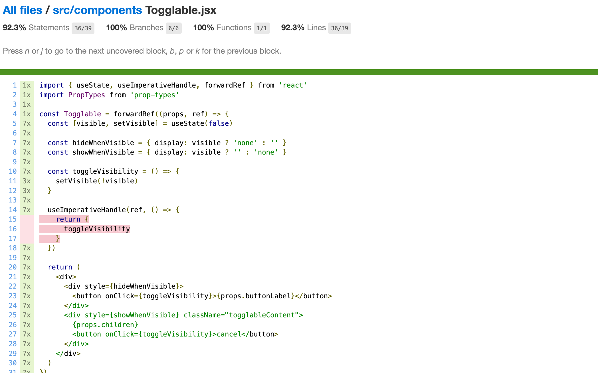

<div class="tasks">

The test library used in this part was changed on March 3, 2024 from Jest to Vitest. If you already started this part using Jest, you can see [here](https://github.com/fullstack-hy2020/fullstack-hy2020.github.io/blob/02d8be28b1c9190f48976fbbd2435b63261282df/src/content/5/en/part5c.md) the old content.

</div>

<div class="content">

There are many different ways of testing React applications. Let's take a look at them next.

The course previously used the [Jest](http://jestjs.io/) library developed by Facebook to test React components. We are now using the new generation of testing tools from Vite developers called [Vitest](https://vitest.dev/). Apart from the configurations, the libraries provide the same programming interface, so there is virtually no difference in the test code.

Let's start by installing Vitest and the [jsdom](https://github.com/jsdom/jsdom) library simulating a web browser:

```
npm install --save-dev vitest jsdom
```

In addition to Vitest, we also need another testing library that will help us render components for testing purposes. The current best option for this is [react-testing-library](https://github.com/testing-library/react-testing-library) which has seen rapid growth in popularity in recent times. It is also worth extending the expressive power of the tests with the library [jest-dom](https://github.com/testing-library/jest-dom).

Let's install the libraries with the command:

```js
npm install --save-dev @testing-library/react @testing-library/jest-dom
```

Before we can do the first test, we need some configurations.

We add a script to the <i>package.json</i> file to run the tests:

```js 
{
  "scripts": {
    // ...
    "test": "vitest run"
  }
  // ...
}
```

Let's create a file _testSetup.js_ in the project root with the following content

```js
import { afterEach } from 'vitest'
import { cleanup } from '@testing-library/react'
import '@testing-library/jest-dom/vitest'

afterEach(() => {
  cleanup()
})
```

Now, after each test, the function _cleanup_ is performed that resets the jsdom that is simulating the browser.

Expand the _vite.config.js_ file as follows

```js
export default defineConfig({
  // ...
  test: {
    environment: 'jsdom',
    globals: true,
    setupFiles: './testSetup.js', 
  }
})
```

With _globals: true_, there is no need to import keywords such as _describe_, _test_ and _expect_ into the tests.

Let's first write tests for the component that is responsible for rendering a note:

```js
const Note = ({ note, toggleImportance }) => {
  const label = note.important
    ? 'make not important'
    : 'make important'

  return (
    <li className='note'> // highlight-line
      {note.content}
      <button onClick={toggleImportance}>{label}</button>
    </li>
  )
}
```

Notice that the <i>li</i> element has the value <i>note</i> for the [CSS](https://react.dev/learn#adding-styles) attribute className, that could be used to access the component in our tests.

### Rendering the component for tests

We will write our test in the <i>src/components/Note.test.jsx</i> file, which is in the same directory as the component itself.

The first test verifies that the component renders the contents of the note:

```js
import { render, screen } from '@testing-library/react'
import Note from './Note'

test('renders content', () => {
  const note = {
    content: 'Component testing is done with react-testing-library',
    important: true
  }

  render(<Note note={note} />)

  const element = screen.getByText('Component testing is done with react-testing-library')
  expect(element).toBeDefined()
})
```

After the initial configuration, the test renders the component with the [render](https://testing-library.com/docs/react-testing-library/api#render) function provided by the react-testing-library:

```js
render(<Note note={note} />)
```

Normally React components are rendered to the [DOM](https://developer.mozilla.org/en-US/docs/Web/API/Document_Object_Model). The render method we used renders the components in a format that is suitable for tests without rendering them to the DOM.

We can use the object [screen](https://testing-library.com/docs/queries/about#screen) to access the rendered component. We use screen's method [getByText](https://testing-library.com/docs/queries/bytext) to search for an element that has the note content and ensure that it exists:

```js
  const element = screen.getByText('Component testing is done with react-testing-library')
  expect(element).toBeDefined()
```

The existence of an element is checked using Vitest's [expect](https://vitest.dev/api/expect.html#expect) command. Expect generates an assertion from its parameter, the validity of which can be tested using various condition functions. Now we used [toBeDefined](https://vitest.dev/api/expect.html#tobedefined) which tests whether the _element_ parameter of expect exists.

Run the test with command _npm test_:

```js
$ npm test

> notes-frontend@0.0.0 test
> vitest


 DEV  v1.3.1 /Users/mluukkai/opetus/2024-fs/part3/notes-frontend

 ✓ src/components/Note.test.jsx (1)
   ✓ renders content

 Test Files  1 passed (1)
      Tests  1 passed (1)
   Start at  17:05:37
   Duration  812ms (transform 31ms, setup 220ms, collect 11ms, tests 14ms, environment 395ms, prepare 70ms)


 PASS  Waiting for file changes...
```

Eslint complains about the keywords _test_ and _expect_ in the tests. The problem can be solved by installing [eslint-plugin-vitest-globals](https://www.npmjs.com/package/eslint-plugin-vitest-globals):

```
npm install --save-dev eslint-plugin-vitest-globals
```

and enable the plugin by editing the _.eslint.cjs_ file as follows: 

```js
module.exports = {
  root: true,
  env: {
    browser: true,
    es2020: true,
    "vitest-globals/env": true // highlight-line
  },
  extends: [
    'eslint:recommended',
    'plugin:react/recommended',
    'plugin:react/jsx-runtime',
    'plugin:react-hooks/recommended',
    'plugin:vitest-globals/recommended', // highlight-line
  ],
  // ...
}
```

### Test file location

In React there are (at least) [two different conventions](https://medium.com/@JeffLombardJr/organizing-tests-in-jest-17fc431ff850) for the test file's location. We created our test files according to the current standard by placing them in the same directory as the component being tested.

The other convention is to store the test files "normally" in a separate _test_ directory. Whichever convention we choose, it is almost guaranteed to be wrong according to someone's opinion.

I do not like this way of storing tests and application code in the same directory. The reason we choose to follow this convention is that it is configured by default in applications created by Vite or create-react-app.

### Searching for content in a component

The react-testing-library package offers many different ways of investigating the content of the component being tested. In reality, the _expect_ in our test is not needed at all:

```js
import { render, screen } from '@testing-library/react'
import Note from './Note'

test('renders content', () => {
  const note = {
    content: 'Component testing is done with react-testing-library',
    important: true
  }

  render(<Note note={note} />)

  const element = screen.getByText('Component testing is done with react-testing-library')

  expect(element).toBeDefined() // highlight-line
})
```

Test fails if _getByText_ does not find the element it is looking for.

We could also use [CSS-selectors](https://developer.mozilla.org/en-US/docs/Web/CSS/CSS_Selectors) to find rendered elements by using the method [querySelector](https://developer.mozilla.org/en-US/docs/Web/API/Document/querySelector) of the object [container](https://testing-library.com/docs/react-testing-library/api/#container-1) that is one of the fields returned by the render:

```js
import { render, screen } from '@testing-library/react'
import Note from './Note'

test('renders content', () => {
  const note = {
    content: 'Component testing is done with react-testing-library',
    important: true
  }

  const { container } = render(<Note note={note} />) // highlight-line

// highlight-start
  const div = container.querySelector('.note')
  expect(div).toHaveTextContent(
    'Component testing is done with react-testing-library'
  )
  // highlight-end
})
```

**NB:** A more consistent way of selecting elements is using a [data attribute](https://developer.mozilla.org/en-US/docs/Web/HTML/Global_attributes/data-*) that is specifically defined for testing purposes. Using _react-testing-library_, we can leverage the [getByTestId](https://testing-library.com/docs/queries/bytestid/) method to select elements with a specified _data-testid_ attribute.

### Debugging tests

We typically run into many different kinds of problems when writing our tests.

Object _screen_ has method [debug](https://testing-library.com/docs/dom-testing-library/api-debugging#screendebug) that can be used to print the HTML of a component to the terminal. If we change the test as follows:

```js
import { render, screen } from '@testing-library/react'
import Note from './Note'

test('renders content', () => {
  const note = {
    content: 'Component testing is done with react-testing-library',
    important: true
  }

  render(<Note note={note} />)

  screen.debug() // highlight-line

  // ...

})
```

the HTML gets printed to the console:

```js
console.log
  <body>
    <div>
      <li
        class="note"
      >
        Component testing is done with react-testing-library
        <button>
          make not important
        </button>
      </li>
    </div>
  </body>
```

It is also possible to use the same method to print a wanted element to console:

```js
import { render, screen } from '@testing-library/react'
import Note from './Note'

test('renders content', () => {
  const note = {
    content: 'Component testing is done with react-testing-library',
    important: true
  }

  render(<Note note={note} />)

  const element = screen.getByText('Component testing is done with react-testing-library')

  screen.debug(element)  // highlight-line

  expect(element).toBeDefined()
})
```

Now the HTML of the wanted element gets printed:

```js
  <li
    class="note"
  >
    Component testing is done with react-testing-library
    <button>
      make not important
    </button>
  </li>
```

### Clicking buttons in tests

In addition to displaying content, the <i>Note</i> component also makes sure that when the button associated with the note is pressed, the _toggleImportance_ event handler function gets called.

Let us install a library [user-event](https://testing-library.com/docs/user-event/intro) that makes simulating user input a bit easier:

```bash
npm install --save-dev @testing-library/user-event
```

Testing this functionality can be accomplished like this:

```js
import { render, screen } from '@testing-library/react'
import userEvent from '@testing-library/user-event' // highlight-line
import Note from './Note'

// ...

test('clicking the button calls event handler once', async () => {
  const note = {
    content: 'Component testing is done with react-testing-library',
    important: true
  }
  
  const mockHandler = vi.fn()  // highlight-line

  render(
    <Note note={note} toggleImportance={mockHandler} />  // highlight-line
  )

  const user = userEvent.setup()  // highlight-line
  const button = screen.getByText('make not important')  // highlight-line
  await user.click(button)  // highlight-line

  expect(mockHandler.mock.calls).toHaveLength(1)  // highlight-line
})
```

There are a few interesting things related to this test. The event handler is a [mock](https://vitest.dev/api/mock) function defined with Vitest:

```js
const mockHandler = vi.fn()
```

A [session](https://testing-library.com/docs/user-event/setup/) is started to interact with the rendered component:

```js
const user = userEvent.setup()
```

The test finds the button <i>based on the text</i> from the rendered component and clicks the element:

```js
const button = screen.getByText('make not important')
await user.click(button)
```

Clicking happens with the method [click](https://testing-library.com/docs/user-event/convenience/#click) of the userEvent-library.

The expectation of the test uses [toHaveLength](https://vitest.dev/api/expect.html#tohavelength) to verify that the <i>mock function</i> has been called exactly once:

```js
expect(mockHandler.mock.calls).toHaveLength(1)
```

The calls of the mock function are saved to the array [mock.calls](https://vitest.dev/api/mock#mock-calls) within the mock function object.

[Mock objects and functions](https://en.wikipedia.org/wiki/Mock_object) are commonly used [stub](https://en.wikipedia.org/wiki/Method_stub) components in testing that are used for replacing dependencies of the components being tested. Mocks make it possible to return hardcoded responses, and to verify the number of times the mock functions are called and with what parameters.

In our example, the mock function is a perfect choice since it can be easily used for verifying that the method gets called exactly once.

### Tests for the <i>Togglable</i> component

Let's write a few tests for the <i>Togglable</i> component. Let's add the <i>togglableContent</i> CSS classname to the div that returns the child components.

```js
const Togglable = forwardRef((props, ref) => {
  // ...

  return (
    <div>
      <div style={hideWhenVisible}>
        <button onClick={toggleVisibility}>
          {props.buttonLabel}
        </button>
      </div>
      <div style={showWhenVisible} className="togglableContent"> // highlight-line
        {props.children}
        <button onClick={toggleVisibility}>cancel</button>
      </div>
    </div>
  )
})
```

The tests are shown below:

```js

import { render, screen } from '@testing-library/react'
import userEvent from '@testing-library/user-event'
import Togglable from './Togglable'

describe('<Togglable />', () => {
  let container

  beforeEach(() => {
    container = render(
      <Togglable buttonLabel="show...">
        <div className="testDiv" >
          togglable content
        </div>
      </Togglable>
    ).container
  })

  test('renders its children', async () => {
    await screen.findAllByText('togglable content')
  })

  test('at start the children are not displayed', () => {
    const div = container.querySelector('.togglableContent')
    expect(div).toHaveStyle('display: none')
  })

  test('after clicking the button, children are displayed', async () => {
    const user = userEvent.setup()
    const button = screen.getByText('show...')
    await user.click(button)

    const div = container.querySelector('.togglableContent')
    expect(div).not.toHaveStyle('display: none')
  })
})
```

The _beforeEach_ function gets called before each test, which then renders the <i>Togglable</i> component and saves the field _container_ of the returned value.

The first test verifies that the <i>Togglable</i> component renders its child component

```js
<div className="testDiv">
  togglable content
</div>
```

The remaining tests use the [toHaveStyle](https://www.npmjs.com/package/@testing-library/jest-dom#tohavestyle) method to verify that the child component of the <i>Togglable</i> component is not visible initially, by checking that the style of the <i>div</i> element contains _{ display: 'none' }_. Another test verifies that when the button is pressed the component is visible, meaning that the style for hiding it <i>is no longer</i> assigned to the component.

Let's also add a test that can be used to verify that the visible content can be hidden by clicking the second button of the component:

```js
describe('<Togglable />', () => {

  // ...

  test('toggled content can be closed', async () => {
    const user = userEvent.setup()
    const button = screen.getByText('show...')
    await user.click(button)

    const closeButton = screen.getByText('cancel')
    await user.click(closeButton)

    const div = container.querySelector('.togglableContent')
    expect(div).toHaveStyle('display: none')
  })
})
```

### Testing the forms

We already used the _click_ function of the [user-event](https://testing-library.com/docs/user-event/intro) in our previous tests to click buttons.

```js
const user = userEvent.setup()
const button = screen.getByText('show...')
await user.click(button)
```

We can also simulate text input with <i>userEvent</i>.

Let's make a test for the <i>NoteForm</i> component. The code of the component is as follows.

```js
import { useState } from 'react'

const NoteForm = ({ createNote }) => {
  const [newNote, setNewNote] = useState('')

  const handleChange = (event) => {
    setNewNote(event.target.value)
  }

  const addNote = (event) => {
    event.preventDefault()
    createNote({
      content: newNote,
      important: true,
    })

    setNewNote('')
  }

  return (
    <div className="formDiv">
      <h2>Create a new note</h2>

      <form onSubmit={addNote}>
        <input
          value={newNote}
          onChange={handleChange}
        />
        <button type="submit">save</button>
      </form>
    </div>
  )
}

export default NoteForm
```

The form works by calling the function received as props _createNote_, with the details of the new note.

The test is as follows:

```js
import { render, screen } from '@testing-library/react'
import NoteForm from './NoteForm'
import userEvent from '@testing-library/user-event'

test('<NoteForm /> updates parent state and calls onSubmit', async () => {
  const createNote = vi.fn()
  const user = userEvent.setup()

  render(<NoteForm createNote={createNote} />)

  const input = screen.getByRole('textbox')
  const sendButton = screen.getByText('save')

  await user.type(input, 'testing a form...')
  await user.click(sendButton)

  expect(createNote.mock.calls).toHaveLength(1)
  expect(createNote.mock.calls[0][0].content).toBe('testing a form...')
})
```

Tests get access to the input field using the function [getByRole](https://testing-library.com/docs/queries/byrole).

The method [type](https://testing-library.com/docs/user-event/utility#type) of the userEvent is used to write text to the input field.

The first test expectation ensures that submitting the form calls the _createNote_ method.
The second expectation checks that the event handler is called with the right parameters - that a note with the correct content is created when the form is filled.

It's worth noting that the good old _console.log_ works as usual in the tests. For example, if you want to see what the calls stored by the mock-object look like, you can do the following

```js
test('<NoteForm /> updates parent state and calls onSubmit', async() => {
  const user = userEvent.setup()
  const createNote = vi.fn()

  render(<NoteForm createNote={createNote} />)

  const input = screen.getByRole('textbox')
  const sendButton = screen.getByText('save')

  await user.type(input, 'testing a form...')
  await user.click(sendButton)

  console.log(createNote.mock.calls) // highlight-line
})
```

In the middle of running the tests, the following is printed

```
[ [ { content: 'testing a form...', important: true } ] ]
```

### About finding the elements

Let us assume that the form has two input fields

```js
const NoteForm = ({ createNote }) => {
  // ...

  return (
    <div className="formDiv">
      <h2>Create a new note</h2>

      <form onSubmit={addNote}>
        <input
          value={newNote}
          onChange={handleChange}
        />
        // highlight-start
        <input
          value={...}
          onChange={...}
        />
        // highlight-end
        <button type="submit">save</button>
      </form>
    </div>
  )
}
```

Now the approach that our test uses to find the input field

```js
const input = screen.getByRole('textbox')
```

would cause an error:


The error message suggests using <i>getAllByRole</i>. The test could be fixed as follows:

```js
const inputs = screen.getAllByRole('textbox')

await user.type(inputs[0], 'testing a form...')
```

Method <i>getAllByRole</i> now returns an array and the right input field is the first element of the array. However, this approach is a bit suspicious since it relies on the order of the input fields.

Quite often input fields have a <i>placeholder</i> text that hints user what kind of input is expected. Let us add a placeholder to our form:

```js
const NoteForm = ({ createNote }) => {
  // ...

  return (
    <div className="formDiv">
      <h2>Create a new note</h2>

      <form onSubmit={addNote}>
        <input
          value={newNote}
          onChange={handleChange}
          placeholder='write note content here' // highlight-line 
        />
        <input
          value={...}
          onChange={...}
        />    
        <button type="submit">save</button>
      </form>
    </div>
  )
}
```

Now finding the right input field is easy with the method [getByPlaceholderText](https://testing-library.com/docs/queries/byplaceholdertext):

```js
test('<NoteForm /> updates parent state and calls onSubmit', () => {
  const createNote = vi.fn()

  render(<NoteForm createNote={createNote} />) 

  const input = screen.getByPlaceholderText('write note content here') // highlight-line 
  const sendButton = screen.getByText('save')

  userEvent.type(input, 'testing a form...')
  userEvent.click(sendButton)

  expect(createNote.mock.calls).toHaveLength(1)
  expect(createNote.mock.calls[0][0].content).toBe('testing a form...')
})
```

The most flexible way of finding elements in tests is the method <i>querySelector</i> of the _container_ object, which is returned by _render_, as was mentioned [earlier in this part](/en/part5/testing_react_apps#searching-for-content-in-a-component). Any CSS selector can be used with this method for searching elements in tests.

Consider eg. that we would define a unique _id_ to the input field:

```js
const NoteForm = ({ createNote }) => {
  // ...

  return (
    <div className="formDiv">
      <h2>Create a new note</h2>

      <form onSubmit={addNote}>
        <input
          value={newNote}
          onChange={handleChange}
          id='note-input' // highlight-line 
        />
        <input
          value={...}
          onChange={...}
        />    
        <button type="submit">save</button>
      </form>
    </div>
  )
}
```

The input element could now be found in the test as follows:

```js
const { container } = render(<NoteForm createNote={createNote} />)

const input = container.querySelector('#note-input')
```

However, we shall stick to the approach of using _getByPlaceholderText_ in the test.

Let us look at a couple of details before moving on. Let us assume that a component would render text to an HTML element as follows:

```js
const Note = ({ note, toggleImportance }) => {
  const label = note.important
    ? 'make not important' : 'make important'

  return (
    <li className='note'>
      Your awesome note: {note.content} // highlight-line
      <button onClick={toggleImportance}>{label}</button>
    </li>
  )
}

export default Note
```

the _getByText_ method that the test uses does <i>not</i> find the element

```js
test('renders content', () => {
  const note = {
    content: 'Does not work anymore :(',
    important: true
  }

  render(<Note note={note} />)

  const element = screen.getByText('Does not work anymore :(')

  expect(element).toBeDefined()
})
```

The _getByText_ method looks for an element that has the **same text** that it has as a parameter, and nothing more. If we want to look for an element that <i>contains</i> the text, we could use an extra option:

```js
const element = screen.getByText(
  'Does not work anymore :(', { exact: false }
)
```

or we could use the _findByText_ method:

```js
const element = await screen.findByText('Does not work anymore :(')
```

It is important to notice that, unlike the other _ByText_ methods, _findByText_ returns a promise!

There are situations where yet another form of the _queryByText_ method is useful. The method returns the element but <i>it does not cause an exception</i> if it is not found.

We could eg. use the method to ensure that something <i>is not rendered</i> to the component:

```js
test('does not render this', () => {
  const note = {
    content: 'This is a reminder',
    important: true
  }

  render(<Note note={note} />)

  const element = screen.queryByText('do not want this thing to be rendered')
  expect(element).toBeNull()
})
```

### Test coverage

We can easily find out the [coverage](https://vitest.dev/guide/coverage.html#coverage) of our tests by running them with the command.

```js
npm test -- --coverage
```

The first time you run the command, Vitest will ask you if you want to install the required library _@vitest/coverage-v8_. Install it, and run the command again:


A HTML report will be generated to the <i>coverage</i> directory.
The report will tell us the lines of untested code in each component:



You can find the code for our current application in its entirety in the <i>part5-8</i> branch of [this GitHub repository](https://github.com/fullstack-hy2020/part2-notes-frontend/tree/part5-8).

</div>

<div class="tasks">

### Exercises 5.13.-5.16.

#### 5.13: Blog List Tests, step 1

Make a test, which checks that the component displaying a blog renders the blog's title and author, but does not render its URL or number of likes by default.

Add CSS classes to the component to help the testing as necessary.

#### 5.14: Blog List Tests, step 2

Make a test, which checks that the blog's URL and number of likes are shown when the button controlling the shown details has been clicked.

#### 5.15: Blog List Tests, step 3

Make a test, which ensures that if the <i>like</i> button is clicked twice, the event handler the component received as props is called twice.

#### 5.16: Blog List Tests, step 4

Make a test for the new blog form. The test should check, that the form calls the event handler it received as props with the right details when a new blog is created.

</div>

<div class="content">

### Frontend integration tests

In the previous part of the course material, we wrote integration tests for the backend that tested its logic and connected the database through the API provided by the backend. When writing these tests, we made the conscious decision not to write unit tests, as the code for that backend is fairly simple, and it is likely that bugs in our application occur in more complicated scenarios than unit tests are well suited for.

So far all of our tests for the frontend have been unit tests that have validated the correct functioning of individual components. Unit testing is useful at times, but even a comprehensive suite of unit tests is not enough to validate that the application works as a whole.

We could also make integration tests for the frontend. Integration testing tests the collaboration of multiple components. It is considerably more difficult than unit testing, as we would have to for example mock data from the server.
We chose to concentrate on making end-to-end tests to test the whole application. We will work on the end-to-end tests in the last chapter of this part.

### Snapshot testing

Vitest offers a completely different alternative to "traditional" testing called [snapshot](https://vitest.dev/guide/snapshot) testing. The interesting feature of snapshot testing is that developers do not need to define any tests themselves, it is simple enough to adopt snapshot testing.

The fundamental principle is to compare the HTML code defined by the component after it has changed to the HTML code that existed before it was changed.

If the snapshot notices some change in the HTML defined by the component, then either it is new functionality or a "bug" caused by accident. Snapshot tests notify the developer if the HTML code of the component changes. The developer has to tell Jest if the change was desired or undesired. If the change to the HTML code is unexpected, it strongly implies a bug, and the developer can become aware of these potential issues easily thanks to snapshot testing.

</div>
