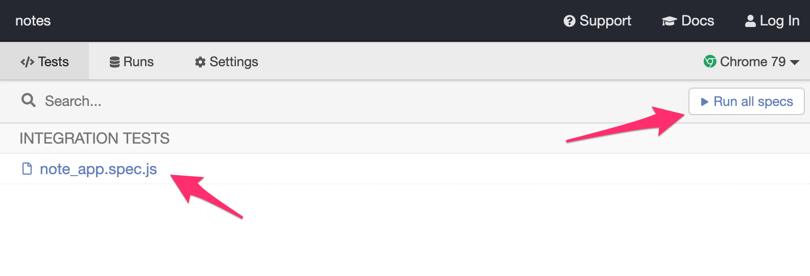
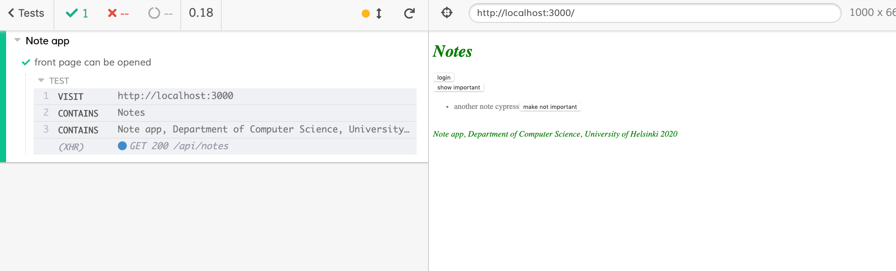
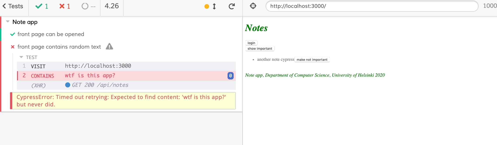
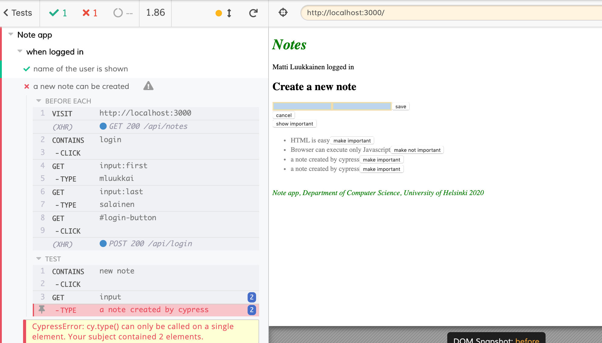
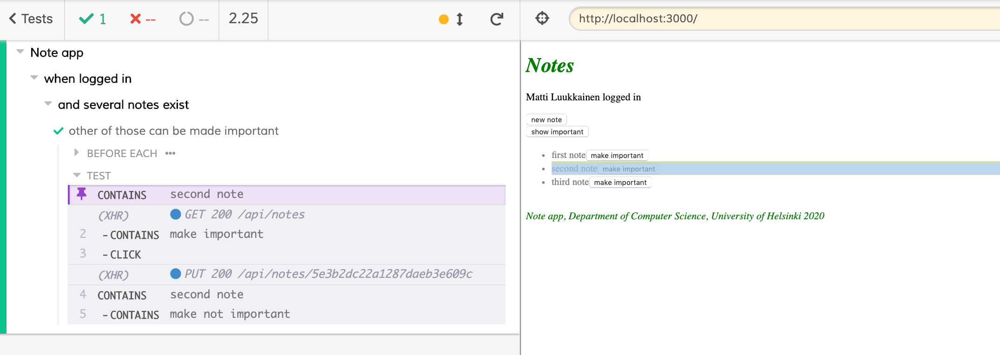
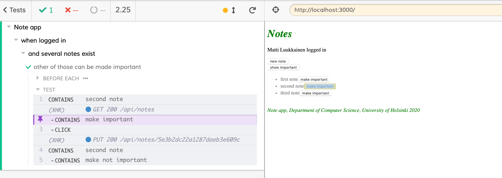
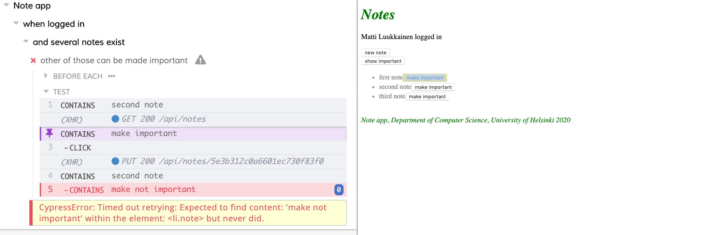
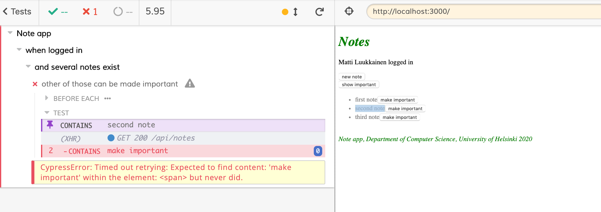
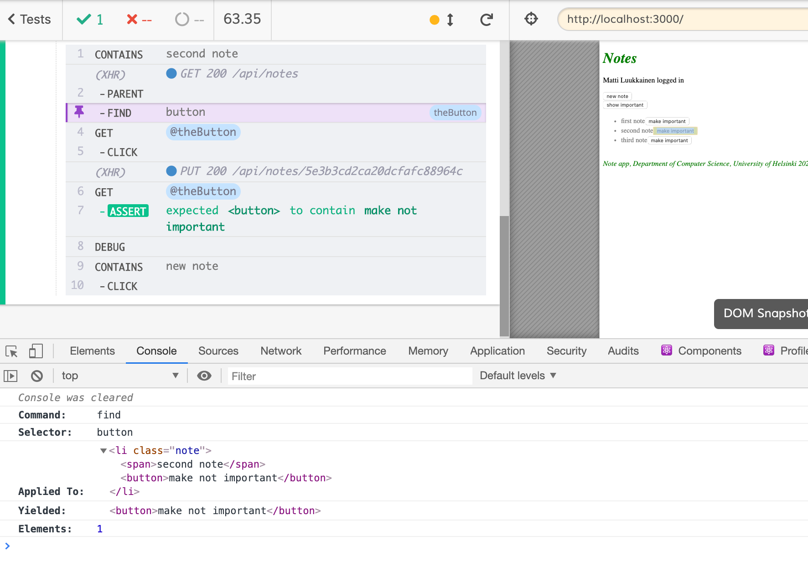
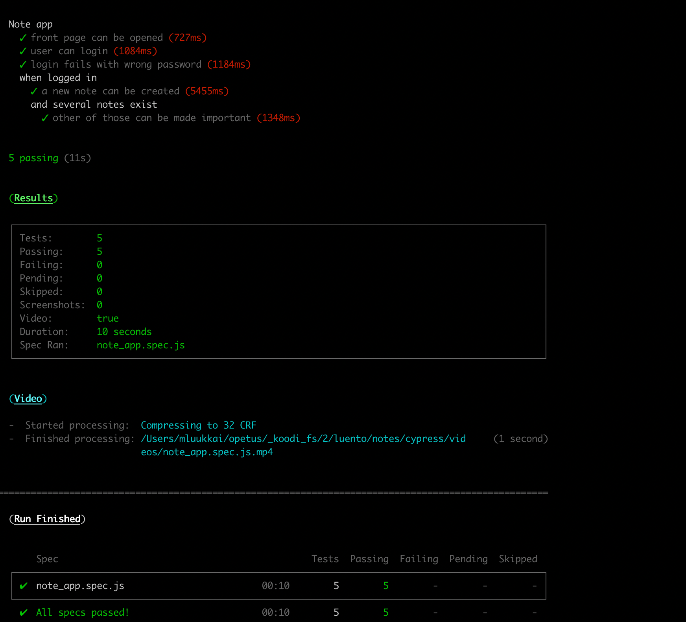

<div class="content">

<!-- Olemme tehneet backendille sitä apin tasolla kokonaisuutena testaavia integraatiotestejä ja frontendille yksittäisiä komponentteja testaavia yksikkötestejä.  -->
So far we have tested the backend as a whole on an API level using integration tests, and tested some frontend components using unit tests.

<!-- Katsotaan nyt erästä tapaa tehdä [järjestelmää kokonaisuutena](https://en.wikipedia.org/wiki/System_testing) tutkivia <i>End to End (E2E) -testejä</i>. -->
Next we will look into one way to test the [system as a whole](https://en.wikipedia.org/wiki/System_testing) using <i>End to End</i> (E2E) tests.

<!-- Web-sovellusten E2E-testaus tapahtuu käyttäen selainta jonkin kirjaston avulla. Ratkaisuja on tarjolla useita, esimerkiksi [Selenium](http://www.seleniumhq.org/), joka mahdollistaa testien automatisoinnin lähes millä tahansa selaimella. Toinen vaihtoehto on käyttää ns. [headless browseria](https://en.wikipedia.org/wiki/Headless_browser) eli selainta, jolla ei ole ollenkaan graafista käyttöliittymää. Esim. Chromea on mahdollista suorittaa Headless-moodissa. -->
We can do E2E testing of a web application using a browser and a testing library. There are multiple libraries available, for example [Selenium](http://www.seleniumhq.org/) which can be used with almost any browser. 
Another browser option are so called [headless browsers](https://en.wikipedia.org/wiki/Headless_browser), which are browsers with no graphical user interface. 
For example Chrome can be used in Headless-mode. 

<!-- E2E testit ovat potentiaalisesti kaikkein hyödyllisin testikategoria, sillä ne tutkivat järjestelmää saman rajapinnan kautta kuin todelliset käyttäjät. -->
E2E tests are potentially the most useful category of tests, because they test the system through the same interface as real users use. 

<!-- E2E-testeihin liittyy myös ikäviä puolia. Niiden konfigurointi on haastavampaa kuin yksikkö- ja integraatiotestien. E2E-testit ovat tyypillisesti myös melko hitaita ja isommassa ohjelmistossa niiden suoritusaika voi helposti nousta minuutteihin, tai jopa tunteihin. Tämä on ikävää sovelluskehityksen kannalta, sillä sovellusta koodatessa on erittäin hyödyllistä pystyä suorittamaan testejä mahdollisimman usein koodin [regressioiden](https://en.wikipedia.org/wiki/Regression_testing) varalta.  -->
They do have some drawbacks too. Configuring E2E tests is more challenging than unit or integration tests. They also tend to be quite slow, and with a large system their execution time can be minutes, even hours. This is bad for development, because during coding it is beneficial to be able to run tests as often as possible in case of code [regressions](https://en.wikipedia.org/wiki/Regression_testing).


E2E tests can also be [flaky](https://hackernoon.com/flaky-tests-a-war-that-never-ends-9aa32fdef359). 
Some tests might pass one time and fail another, even if the code does not change at all. 


### Cypress

<!-- [Cypress](https://www.cypress.io/)-niminen E2E-testaukseen soveltuva kirjasto on kasvattanut nopeasti suosiotaan viimeisen reilun vuoden aikana. Cypress on poikkeuksellisen helppokäyttöinen, kaikenlaisen säätämisen ja tunkkaamisen määrä esim. Seleniumin käyttöön verrattuna on lähes olematon. Cypressin toimintaperiaate poikkeaa radikaalisti useimmista E2E-testaukseen sopivista kirjastoista, sillä Cypress-testit ajetaan kokonaisuudessaan selaimen sisällä. Muissa lähestymistavoissa testit suoritetaan Node-prosessissa, joka on yhteydessä selaimeen  ohjelmointirajapintojen kautta. -->
E2E library [Cypress](https://www.cypress.io/) has become popular within the last year. Cypress is exceptionally easy to use, and when compared to Selenium, for example, it requires a lot less hassle and headache. 
Its operating principle is radically different than most E2E testing libraries, because Cypress tests are run completely within the browser.
Other libraries run the tests in a Node-process, which is connected to the browser through an API. 

Let's  make some end to end tests for our note application.

<!-- Aloitetaan asentamalla Cypress <i>frontendin</i> kehitysaikaiseksi riippuvuudeksi -->
We begin by installing Cypress to <i>the frontend</i> as development dependency

```js
npm install --save-dev cypress
```

<!-- ja määritellään npm-skripti käynnistämistä varten. -->
and by adding an npm-script to run it:

```js
{
  // ...
  "scripts": {
    "start": "react-scripts start",
    "build": "react-scripts build",
    "test": "react-scripts test",
    "eject": "react-scripts eject",
    "server": "json-server -p3001 db.json",
    "cypress:open": "cypress open"  // highlight-line
  },
  // ...
}
```

<!-- Toisin kuin esim. frontendin yksikkötestit, Cypress-testit voidaan sijoittaa joko frontendin tai backendin repositorioon, tai vaikka kokonaan omaan repositorioonsa.  -->
Unlike the frontend's unit tests, Cypress tests can be in the frontend or the backend repository, or even in their own separate repository. 

<!-- Cypress-testit olettavat että testattava järjestelmä on käynnissä kun testit suoritetaan, eli toisin kuin esim. backendin integraatiotestit, Cypress-testit <i>eivät käynnistä</i> testattavaa järjestelmää testauksen yhteydessä. -->
The tests require the tested system to be running. Unlike our backend integration tests, Cypress tests <i>do not start</i> the system when they are run. 

<!-- Tehdään <i>backendille</i> npm-skripti, jonka avulla se saadaan käynnistettyä testausmoodissa, eli siten, että <i>NODE\_ENV</i> saa arvon <i>test</i>. -->
Let's add an npm-script to <i>the backend</i> which starts it in test mode, or so that <i>NODE\_ENV</i> is <i>test</i>.

```js
{
  // ...
  "scripts": {
    "start": "cross-env NODE_ENV=production node index.js",
    "dev": "cross-env NODE_ENV=development nodemon index.js",
    "build:ui": "rm -rf build && cd ../../../2/luento/notes && npm run build && cp -r build ../../../3/luento/notes-backend",
    "deploy": "git push heroku master",
    "deploy:full": "npm run build:ui && git add . && git commit -m uibuild && git push && npm run deploy",
    "logs:prod": "heroku logs --tail",
    "lint": "eslint .",
    "test": "cross-env NODE_ENV=test jest --verbose --runInBand",
    "start:test": "cross-env NODE_ENV=test node index.js" // highlight-line
  },
  // ...
}
```

<!-- Kun backend ja frontend ovat käynnissä, voidaan käynnistää Cypress komennolla -->
When both backend and frontend are running, we can start Cypress with the command

```js
npm run cypress:open
```

<!-- Ensimmäisen käynnistyksen yhteydessä sovellukselle syntyy hakemisto <i>cypress</i>, jonka alihakemistoon <i>integrations</i> on tarkoitus sijoittaa testit. Cypress luo valmiiksi joukon esimerkkitestejä, poistetaan ne ja luodaan ensimmäinen oma testi tiedostoon <i>note\_app.spec.js</i>: -->
When we first run Cypress, it creates a <i>cypress</i> directory. It contains an <i>integration</i> subdirectory, where we will place our tests. Cypress creates a bunch of example tests for us in two subdirectories: the <i>integration/1-getting-started</i> and the <i>integration/2-advanced-examples</i> directory. We can delete both directories and make our own test in file <i>note\_app.spec.js</i>:

```js
describe('Note app', function() {
  it('front page can be opened', function() {
    cy.visit('http://localhost:3000')
    cy.contains('Notes')
    cy.contains('Note app, Department of Computer Science, University of Helsinki 2021')
  })
})
```

<!-- Testin suoritus käynnistetään avautuneesta ikkunasta: -->
We start the test from the opened window:



<!-- Testin suoritus avaa selaimen ja näyttää miten sovellus käyttäytyy testin edetessä: -->
Running the test opens your browser and shows how the application behaves as the test is run:



The structure of the test should look familiar. They use <i>describe</i> blocks to group different test cases like Jest does. The test cases have been defined with the <i>it</i> method. 
Cypress borrowed these parts from the [Mocha](https://mochajs.org/) testing library it uses under the hood. 

<!-- [cy.visit](https://docs.cypress.io/api/commands/visit.html) ja [cy.contains](https://docs.cypress.io/api/commands/contains.html) taas ovat Cypressin komentoja, joiden merkitys on aika ilmeinen. [cy.visit](https://docs.cypress.io/api/commands/visit.html) avaa testin käyttämään selaimeen parametrina määritellyn osoitteen ja [cy.contains](https://docs.cypress.io/api/commands/contains.html) etsii sivun sisältä parametrina annetun tekstin.  -->
[cy.visit](https://docs.cypress.io/api/commands/visit.html) and [cy.contains](https://docs.cypress.io/api/commands/contains.html) are Cypress commands, and their purpose is quite obvious.
[cy.visit](https://docs.cypress.io/api/commands/visit.html) opens the web address given to it as a parameter in the browser used by the test. [cy.contains](https://docs.cypress.io/api/commands/contains.html) searches for the string it received as a parameter from the page. 

<!-- Olisimme voineet määritellä testin myös käyttäen nuolifunktioita -->
We could have declared the test using an arrow function

```js
describe('Note app', () => { // highlight-line
  it('front page can be opened', () => { // highlight-line
    cy.visit('http://localhost:3000')
    cy.contains('Notes')
    cy.contains('Note app, Department of Computer Science, University of Helsinki 2021')
  })
})
```

<!-- Mochan dokumentaatio kuitenkin [suosittelee](https://mochajs.org/#arrow-functions) että nuolifunktioita ei käytetä, ne saattavat aiheuttaa ongelmia joissain tilanteissa. -->
However, Mocha [recommends](https://mochajs.org/#arrow-functions) that arrow functions are not used, because they might cause some issues in certain situations. 

<!-- Jos komento <i>cy.contains</i> ei löydä sivulta etsimäänsä tekstiä, testi ei mene läpi. Eli jos laajennamme testiä seuraavasti -->
If <i>cy.contains</i> does not find the text it is searching for, the test does not pass. 
So if we extend our test like so

```js
describe('Note app', function() {
  it('front page can be opened',  function() {
    cy.visit('http://localhost:3000')
    cy.contains('Notes')
    cy.contains('Note app, Department of Computer Science, University of Helsinki 2021')
  })

// highlight-start
  it('front page contains random text', function() {
    cy.visit('http://localhost:3000')
    cy.contains('wtf is this app?')
  })
// highlight-end
})
```

<!-- havaitsee Cypress ongelman -->
the test fails



<!-- Poistetaan virheeseen johtanut testi koodista. -->
Let's remove the failing code from the test. 

### Writing to a form

<!-- Laajennetaan testejä siten, että testi yrittää kirjautua sovellukseen. Oletetaan että backendin tietokantaan on tallennettu käyttäjä, jonka käyttäjätunnus on <i>mluukkai</i> ja salasana <i>salainen</i>.  -->
Let's extend our tests so that the test tries to log in to our application. 
We assume our backend contains a user with the username <i>mluukkai</i> and password <i>salainen</i>.

<!-- Aloitetaan kirjautumislomakkeen avaamisella. -->
The test begins by opening the login form. 

```js
describe('Note app',  function() {
  // ...

  it('login form can be opened', function() {
    cy.visit('http://localhost:3000')
    cy.contains('log in').click()
  })
})
```

<!-- Testi hakee ensin napin sen tekstin perusteella ja klikkaa nappia komennolla [cy.click](https://docs.cypress.io/api/commands/click.html#Syntax). -->
The test first searches for the login button by its text, and clicks the button with the command [cy.click](https://docs.cypress.io/api/commands/click.html#Syntax).

Both of our tests begin the same way, by opening the page <i>http://localhost:3000</i>, so we should 
separate the shared part into a <i>beforeEach</i> block run before each test:

```js
describe('Note app', function() {
  // highlight-start
  beforeEach(function() {
    cy.visit('http://localhost:3000')
  })
  // highlight-end

  it('front page can be opened', function() {
    cy.contains('Notes')
    cy.contains('Note app, Department of Computer Science, University of Helsinki 2021')
  })

  it('login form can be opened', function() {
    cy.contains('log in').click()
  })
})
```

<!-- Ilmoittautumislomake sisältää kaksi <i>input</i>-kenttää, joihin testin tulisi kirjoittaa. -->
The login field contains two <i>input</i> fields, which the test should write into. 

<!-- Komento [cy.get](https://docs.cypress.io/api/commands/get.html#Syntax) mahdollistaa elementtien etsimisen CSS-selektorien avulla. -->
The [cy.get](https://docs.cypress.io/api/commands/get.html#Syntax) command allows for searching elements by CSS selectors. 

<!-- Voimme hakea lomakkeen ensimmäisen ja viimeisen input-kentän ja kirjoittaa niihin komennolla [cy.type](https://docs.cypress.io/api/commands/type.html#Syntax) seuraavasti: -->
We can access the first and the last input field on the page, and write to them with the command [cy.type](https://docs.cypress.io/api/commands/type.html#Syntax) like so: 

```js
it('user can login', function () {
  cy.contains('log in').click()
  cy.get('input:first').type('mluukkai')
  cy.get('input:last').type('salainen')
})  
```

<!-- Testi toimii mutta on kuitenkin sikäli ongelmallinen, että jos sovellukseen tulee jossain vaiheessa lisää input-kenttiä, testi saattaa hajota, sillä se luottaa tarvitsemiensa kenttien olevan sivulla ensimmäisenä ja viimeisenä. -->
The test works. The problem is if we later add more input fields, the test will break because it expects the fields it needs to be the first and the last on the page. 

<!-- Parempi ratkaisu on määritellä kentille yksilöivät <i>id</i>-attribuutit ja hakea kentät testeissä niiden perusteella. Eli laajennetaan kirjautumislomaketta seuraavasti -->
It would be better to give our inputs unique <i>ids</i> and use those to find them. 
We change our login form like so:

```js
const LoginForm = ({ ... }) => {
  return (
    <div>
      <h2>Login</h2>
      <form onSubmit={handleSubmit}>
        <div>
          username
          <input
            id='username'  // highlight-line
            value={username}
            onChange={handleUsernameChange}
          />
        </div>
        <div>
          password
          <input
            id='password' // highlight-line
            type="password"
            value={password}
            onChange={handlePasswordChange}
          />
        </div>
        <button id="login-button" type="submit"> // highlight-line
          login
        </button>
      </form>
    </div>
  )
}
```

<!-- Myös lomakkeen napille on lisätty id, jonka perusteella se voidaan hakea testissä. -->
We also added an id to our submit button so we can access it in our tests. 

<!-- Testi muuttuu muotoon -->
The test becomes:

```js
describe('Note app',  function() {
  // ..
  it('user can log in', function() {
    cy.contains('log in').click()
    cy.get('#username').type('mluukkai')  // highlight-line    
    cy.get('#password').type('salainen')  // highlight-line
    cy.get('#login-button').click()  // highlight-line

    cy.contains('Matti Luukkainen logged in') // highlight-line
  })
})
```

<!-- Viimeinen rivi varmistaa, että kirjautuminen on onnistunut.  -->
The last row ensures that the login was successful. 

<!-- Huomaa, että CSS:n [id-selektori](https://developer.mozilla.org/en-US/docs/Web/CSS/ID_selectors) on risuaita, eli jos koodista etsitään elementtiä, jolla on id <i>username</i> on sitä vastaava CSS-selektori <i>#username</i>. -->
Note that the CSS [id-selector](https://developer.mozilla.org/en-US/docs/Web/CSS/ID_selectors) is #, so if we want to search for an element with the id <i>username</i> the CSS selector is <i>#username</i>.

### Some things to note

<!-- Testissä klikataan ensin kirjaantumislomakkeen avaavaa nappia seuraavasti -->
The test first clicks the button opening the login form like so

```js
cy.contains('log in').click()
```

<!-- Kun lomake on täytetty, lähetetään lomake klikkaamalla nappia -->
When the form has been filled, the form is submitted by clicking the submit button

```js
cy.get('#login-button').click()
```

<!-- Molemmissa napeissa on sama teksti <i>login</i>, mutta kyseessä on kaksi erillistä nappia. Molemmat napit ovat itse asiassa koko ajan sovelluksen DOM:issa, mutta niistä vain yksi kerrallaan on näkyvissä, sillä toiselle on lisätty tyylimääre <i>display: none</i>.  -->
Both buttons have the text <i>login</i>, but they are two separate buttons. 
Actually both buttons are in the application's DOM the whole time, but only one is visible at a time because of the <i>display:none</i> styling on one of them.

<!-- Jos haemme nappia tekstin perusteella, palauttaa komento [cy.contains](https://docs.cypress.io/api/commands/contains.html#Syntax) aina napeista ensimmäisen, eli lomakkeen avaavan napin. Näin tapahtuu siis vaikka nappi ei olisikaan näkyvillä. Tämän takia lomakkeen lähettävään nappiin on lisätty id <i>login-button</i>, jonka perusteella testi pääsee nappiin käsiksi. -->
If we search for a button by its text, [cy.contains](https://docs.cypress.io/api/commands/contains.html#Syntax) will return the first of them, or the one opening the login form. 
This will happen even if the button is not visible. 
To avoid name conflicts, we gave the submit button the id <i>login-button</i> we can use to access it.

<!-- Huomaamme, että testeissä käytetty muuttuja _cy_ aiheuttaa ikävän ESlint-virheen -->
Now we notice that the variable _cy_ our tests use gives us a nasty Eslint error


<!-- Siitä päästään eroon asentamalla [eslint-plugin-cypress](https://github.com/cypress-io/eslint-plugin-cypress) kehitysaikaiseksi riippuvuudeksi -->
We can get rid of it by installing [eslint-plugin-cypress](https://github.com/cypress-io/eslint-plugin-cypress) as a development dependency

```js
npm install eslint-plugin-cypress --save-dev
```

<!-- ja laajentamalla tiedostossa <i>.eslintrc.js</i> olevaa konfiguraatiota seuraavasti:  -->
and changing the configuration in <i>.eslintrc.js</i> like so:

```js
module.exports = {
    "env": {
        "browser": true,
        "es6": true,
        "jest/globals": true,
        "cypress/globals": true // highlight-line
    },
    "extends": [ 
      // ...
    ],
    "parserOptions": {
      // ...
    },
    "plugins": [
        "react", "jest", "cypress" // highlight-line
    ],
    "rules": {
      // ...
    }
}
```

### Testing new note form

<!-- Luodaan seuraavaksi testi, joka lisää sovellukseen uuden muistiinpanon: -->
Let's next add tests which test the "new note" functionality: 

```js
describe('Note app', function() {
  // ..
  // highlight-start
  describe('when logged in', function() {
    beforeEach(function() {
      cy.contains('log in').click()
      cy.get('input:first').type('mluukkai')
      cy.get('input:last').type('salainen')
      cy.get('#login-button').click()
    })
    // highlight-end

    // highlight-start
    it('a new note can be created', function() {
      cy.contains('new note').click()
      cy.get('input').type('a note created by cypress')
      cy.contains('save').click()

      cy.contains('a note created by cypress')
    })
  })
  // highlight-end
})
```

<!-- Testi on määritelty omana <i>describe</i>-lohkonaan. Muistiinpanon luominen edellyttää että käyttäjä on kirjaantuneena, ja kirjautuminen hoidetaan <i>beforeEach</i>-lohkossa.  -->
The test has been defined in its own <i>describe</i> block. 
Only logged-in users can create new notes, so we added logging in to the application to a <i>beforeEach</i> block. 

<!-- Testi luottaa siihen, että uutta muistiinpanoa luotaessa sivulla on ainoastaan yksi input-kenttä, eli se hakee kentän seuraavasti -->
The test trusts that when creating a new note the page contains only one input, so it searches for it like so:

```js
cy.get('input')
```

<!-- Jos kenttiä olisi useampia, testi hajoaisi -->
If the page contained more inputs, the test would break



<!-- Tämän takia olisi jälleen parempi lisätä lomakkeen kentälle <i>id</i> ja hakea kenttä testissä id:n perusteella. -->
Due to this it would again be better to give the input an <i>id</i> and search for the element by its id. 

<!-- Testien rakenne näyttää seuraavalta: -->
The structure of the tests looks like so:

```js
describe('Note app', function() {
  // ...

  it('user can log in', function() {
    cy.contains('log in').click()
    cy.get('#username').type('mluukkai')
    cy.get('#password').type('salainen')
    cy.get('#login-button').click()

    cy.contains('Matti Luukkainen logged in')
  })

  describe('when logged in', function() {
    beforeEach(function() {
      cy.contains('log in').click()
      cy.get('input:first').type('mluukkai')
      cy.get('input:last').type('salainen')
      cy.get('#login-button').click()
    })

    it('a new note can be created', function() {
      // ...
    })
  })
})
```

<!-- Cypress suorittaa testit siinä järjestyksessä, missä ne ovat testikoodissa. Eli ensin suoritetaan testi <i>user can log in</i>, missä käyttäjä kirjautuu sovellukseen, ja tämän jälkeen suoritetaan testi <i>a new note can be created</i>, jonka <i>beforeEach</i>-lohkossa myös suoritetaan kirjautuminen. Miksi näin tehdään, eikö käyttäjä jo ole kirjaantuneena aiemman testin ansiosta? Ei, sillä <i>jokaisen</i> testin suoritus alkaa selaimen kannalta "nollatilanteesta", kaikki edellisten testien selaimen tilaan tekemät muutokset nollaantuvat. -->
Cypress runs the tests in the order they are in the code. So first it runs <i>user can log in</i>, where the user logs in. Then cypress will run <i>a new note can be created</i> for which a <i>beforeEach</i> block logs in as well. 
Why do this? Isn't the user logged in after the first test? 
No, because <i>each</i> test starts from zero as far as the browser is concerned. 
All changes to the browser's state are reversed after each test.

### Controlling the state of the database

<!-- Jos testatessa on tarvetta muokata palvelimen tietokantaa, muuttuu tilanne heti haastavammaksi. Ideaalitilanteessa testauksen tulee aina lähteä liikkeelle palvelimen tietokannan suhteen samasta alkutilanteesta, jotta testeistä saadaan luotettavia ja helposti toistettavia. -->
If the tests need to be able to modify the server's database, the situation immediately becomes more complicated. Ideally, the server's database should be the same each time we run the tests, so our tests can be reliably and easily repeatable. 

<!-- Kuten yksikkö- integraatiotesteissä, on myös E2E-testeissä paras ratkaisu nollata tietokanta ja mahdollisesti alustaa se sopivasti aina ennen testien suorittamista. E2E-testauksessa lisähaasteen tuo se, että testeistä ei ole mahdollista päästä suoraan käsiksi tietokantaan. -->
As with unit and integration tests, with E2E tests it is the best to empty the database and possibly format it before the tests are run. The challenge with E2E tests is that they do not have access to the database. 

<!-- Ratkaistaan ongelma luomalla backendiin testejä varten API-endpoint, jonka avulla testit voivat tarvittaessa nollata kannan. Tehdään testejä varten oma <i>router</i> -->
The solution is to create API endpoints to the backend for the test. 
We can empty the database using these endpoints. 
Let's create a new <i>router</i> for the tests

```js
const router = require('express').Router()
const Note = require('../models/note')
const User = require('../models/user')

router.post('/reset', async (request, response) => {
  await Note.deleteMany({})
  await User.deleteMany({})

  response.status(204).end()
})

module.exports = router
```

<!-- ja lisätään se backendiin ainoastaan <i>jos sovellusta suoritetaan test-moodissa</i>: -->
and add it to the backend only <i>if the application is run on test-mode</i>:

```js
// ...

app.use('/api/login', loginRouter)
app.use('/api/users', usersRouter)
app.use('/api/notes', notesRouter)

// highlight-start
if (process.env.NODE_ENV === 'test') {
  const testingRouter = require('./controllers/testing')
  app.use('/api/testing', testingRouter)
}
// highlight-end

app.use(middleware.unknownEndpoint)
app.use(middleware.errorHandler)

module.exports = app
```

<!-- eli lisäyksen jälkeen HTTP POST -operaatio backendin endpointiin <i>/api/testing/reset</i> tyhjentää tietokannan. -->
After the changes, an HTTP POST request to the <i>/api/testing/reset</i> endpoint empties the database. Make sure your backend is running in test mode by starting it with this command (previously configured in the package.json file):
```js
  npm run start:test
```

<!-- Backendin testejä varten muokattu koodi on kokonaisuudessaan [githubissa](https://github.com/fullstack-hy/part3-notes-backend/tree/part5-1), branchissä <i>part5-1</i>. -->
The modified backend code can be found from [github](https://github.com/fullstack-hy/part3-notes-backend/tree/part5-1) branch <i>part5-1</i>.

<!-- Muutetaan nyt testien <i>beforeEach</i>-alustuslohkoa siten, että se nollaa palvelimen tietokannan aina ennen testien suorittamista. -->
Next we will change the <i>beforeEach</i> block so that it empties the server's database before tests are run. 

<!-- Tällä hetkellä sovelluksen käyttöliittymän kautta ei ole mahdollista luoda käyttäjiä, luodaankin testien alustuksessa testikäyttäjä suoraan backendiin. -->
Currently it is not possible to add new users through the frontend's UI, so we add a new user to the backend from the beforeEach block. 

```js
describe('Note app', function() {
   beforeEach(function() {
    // highlight-start
    cy.request('POST', 'http://localhost:3001/api/testing/reset')
    const user = {
      name: 'Matti Luukkainen',
      username: 'mluukkai',
      password: 'salainen'
    }
    cy.request('POST', 'http://localhost:3001/api/users/', user) 
    // highlight-end
    cy.visit('http://localhost:3000')
  })
  
  it('front page can be opened', function() {
    // ...
  })

  it('user can login', function() {
    // ...
  })

  describe('when logged in', function() {
    // ...
  })
})
```

<!-- Testi tekee alustuksen aikana HTTP-pyyntöjä backendiin komennolla [cy.request](https://docs.cypress.io/api/commands/request.html).  -->
During the formatting the test does HTTP requests to the backend with [cy.request](https://docs.cypress.io/api/commands/request.html).

<!-- Toisin kuin aiemmin, nyt testaus alkaa nyt myös backendin suhteen aina hallitusti samasta tilanteesta, eli tietokannassa on yksi käyttäjä ja ei yhtään muistiinpanoa. -->
Unlike earlier, now the testing starts with the backend in the same state every time. The backend will contain one user and no notes. 

<!-- Tehdään vielä testi, joka tarkastaa että muistiinpanojen tärkeyttä voi muuttaa.  Muutetaan ensin sovelluksen frontendia siten, että uusi muistiinpano on oletusarvoisesti epätärkeä, eli kenttä <i>important</i> saa arvon <i>false</i>: -->
Let's add one more test for checking that we can change the importance of notes. 
First we change the frontend so that a new note is unimportant by default, or the <i>important</i> field is <i>false</i>:

```js
const NoteForm = ({ createNote }) => {
  // ...

  const addNote = (event) => {
    event.preventDefault()
    createNote({
      content: newNote,
      important: false // highlight-line
    })

    setNewNote('')
  }
  // ...
} 
```

<!-- On useita eri tapoja testata asia. Seuraavassa etsitään ensin muistiinpano ja klikataan sen nappia <i>make important</i>. Tämän jälkeen tarkistetaan että muistiinpano sisältää napin <i>make not important</i>. -->
There are multiple ways to test this. In the following example we first search for a note and click its <i>make important</i> button. Then we check that the note now contains a <i>make not important</i> button. 

```js
describe('Note app', function() {
  // ...

  describe('when logged in', function() {
    // ...

    describe('and a note exists', function () {
      beforeEach(function () {
        cy.contains('new note').click()
        cy.get('input').type('another note cypress')
        cy.contains('save').click()
      })

      it('it can be made important', function () {
        cy.contains('another note cypress')
          .contains('make important')
          .click()

        cy.contains('another note cypress')
          .contains('make not important')
      })
    })
  })
})
```

<!-- Ensimmäinen komento etsii ensin komponentin, missä on teksti <i>another note cypress</i> ja sen sisältä painikkeen <i>make important</i> ja klikkaa sitä.  -->
The first command searches for a component containing the text <i>another note cypress</i>, and then for a <i>make important</i> button within it. It then clicks the button.

<!-- Toinen komento varmistaa, että saman napin teksti on vaihtunut muotoon <i>make not important</i>. -->
The second command checks that the text on the button has changed to <i>make not important</i>.

<!-- Testit ja frontendin tämänhetkinen koodi on kokonaisuudessaan [githubissa](https://github.com/fullstack-hy/part2-notes/tree/part5-9), branchissa <i>part5-9</i>. -->
The tests and the current frontend code can be found from [github](https://github.com/fullstack-hy/part2-notes/tree/part5-9) branch <i>part5-9</i>.

### Failed login test

Let's make a test to ensure that a login attempt fails if the password is wrong. 

Cypress will run all tests each time by default, and as the number of tests increases it starts to become quite time-consuming. 
When developing a new test or when debugging a broken test, we can define the test with <i>it.only</i> instead of <i>it</i>, so that Cypress will only run the required test.
When the test is working, we can remove <i>.only</i>.

First  version of our tests is as follows:

```js
describe('Note app', function() {
  // ...

  it.only('login fails with wrong password', function() {
    cy.contains('log in').click()
    cy.get('#username').type('mluukkai')
    cy.get('#password').type('wrong')
    cy.get('#login-button').click()

    cy.contains('wrong credentials')
  })

  // ...
)}
```

<!-- Testi siis varmistaa komennon [cy.contains](https://docs.cypress.io/api/commands/contains.html#Syntax) avulla, että sovellus tulostaa virheilmoituksen. -->
The test uses [cy.contains](https://docs.cypress.io/api/commands/contains.html#Syntax) to ensure that the application prints an error message. 

<!-- Sovellus renderöi virheilmoituksen CSS-luokan <i>error</i> sisältävään elementtiin: -->
The application renders the error message to a component with the CSS class <i>error</i>:

```js
const Notification = ({ message }) => {
  if (message === null) {
    return null
  }

  return (
    <div className="error"> // highlight-line
      {message}
    </div>
  )
}
```

<!-- Voisimmekin tarkentaa testiä varmistamaan, että virheilmoitus tulostuu nimenomaan oikeaan paikkaan, eli CSS-luokan <i>error</i> sisältävään elementtiin: -->
We could make the test ensure that the error message is rendered to the correct component, that is, the component with the CSS class <i>error</i>:


```js
it('login fails with wrong password', function() {
  // ...

  cy.get('.error').contains('wrong credentials') // highlight-line
})
```

<!-- Eli ensin etsitään komennolla [cy.get](https://docs.cypress.io/api/commands/get.html#Syntax) CSS-luokan <i>error</i> sisältävä komponentti ja sen jälkeen varmistetaan että virheilmoitus löytyy sen sisältä. Huomaa, että [luokan CSS-selektori](https://developer.mozilla.org/en-US/docs/Web/CSS/Class_selectors) alkaa pisteellä, eli luokan <i>error</i> selektori on <i>.error</i>. -->
First we use [cy.get](https://docs.cypress.io/api/commands/get.html#Syntax) to search for a component with the CSS class <i>error</i>. Then we check that the error message can be found from this component. 
Note that the [CSS class selector](https://developer.mozilla.org/en-US/docs/Web/CSS/Class_selectors) starts with a full stop, so the selector for the class <i>error</i> is <i>.error</i>.

<!-- Voisimme tehdä saman myös käyttäen [should](https://docs.cypress.io/api/commands/should.html)-syntaksia: -->
We could do the same using the [should](https://docs.cypress.io/api/commands/should.html) syntax:

```js
it('login fails with wrong password', function() {
  // ...

  cy.get('.error').should('contain', 'wrong credentials') // highlight-line
})
```

<!-- Shouldin käyttö on jonkin verran "hankalampaa" kuin komennon <i>contains</i>, mutta se mahdollistaa huomattavasti monipuolisemmat testit kuin pelkän tekstisisällön perusteella toimiva <i>contains</i>.  -->
Using should is a bit trickier than using <i>contains</i>, but it allows for more diverse tests than <i>contains</i> which works based on text content only. 

<!-- Lista yleisimmistä shouldin kanssa käytettävistä assertioista on [täällä](https://docs.cypress.io/guides/references/assertions.html#Common-Assertions). -->
A list of the most common assertions which can be used with should can be found [here](https://docs.cypress.io/guides/references/assertions.html#Common-Assertions).

<!-- Voimme esim. varmistaa, että virheilmoituksen väri on punainen, ja että sen ympärillä on border: -->
We can, for example, make sure that the error message is red and it has a border:

```js
it('login fails with wrong password', function() {
  // ...

  cy.get('.error').should('contain', 'wrong credentials') 
  cy.get('.error').should('have.css', 'color', 'rgb(255, 0, 0)')
  cy.get('.error').should('have.css', 'border-style', 'solid')
})
```

<!-- Värit on määriteltävä Cypressille [rgb](https://rgbcolorcode.com/color/red)-koodeina. -->
Cypress requires the colors to be given as [rgb](https://rgbcolorcode.com/color/red).

<!-- Koska kaikki tarkastukset kohdistuvat samaan komennolla [cy.get](https://docs.cypress.io/api/commands/get.html#Syntax) haettuun elementtiin, ne voidaan ketjuttaa komennon [and](https://docs.cypress.io/api/commands/and.html) avulla: -->
Because all tests are for the same component we accessed using [cy.get](https://docs.cypress.io/api/commands/get.html#Syntax), we can chain them using [and](https://docs.cypress.io/api/commands/and.html).

```js
it('login fails with wrong password', function() {
  // ...

  cy.get('.error')
    .should('contain', 'wrong credentials')
    .and('have.css', 'color', 'rgb(255, 0, 0)')
    .and('have.css', 'border-style', 'solid')
})
```

Let's finish the test so that it also checks that the application does not render the success message <i>'Matti Luukkainen logged in'</i>:

```js
it('login fails with wrong password', function() {
  cy.contains('log in').click()
  cy.get('#username').type('mluukkai')
  cy.get('#password').type('wrong')
  cy.get('#login-button').click()

  cy.get('.error')
    .should('contain', 'wrong credentials')
    .and('have.css', 'color', 'rgb(255, 0, 0)')
    .and('have.css', 'border-style', 'solid')

  cy.get('html').should('not.contain', 'Matti Luukkainen logged in') // highlight-line
})
```

<i>Should</i> should always be chained with <i>get</i> (or another chainable command).
We used <i>cy.get('html')</i> to access the whole visible content of the application. 

**NOTE:** Some CSS properties [behave differently on Firefox](https://github.com/cypress-io/cypress/issues/9349). If you run the tests with Firefox:
  
  
  
  then tests that involve, for example, `border-style`, `border-radius` and `padding`, will pass in Chrome or Electron, but fail in Firefox:
  
  


### Bypassing the UI

<!-- Sovelluksemme testit näyttävät tällä hetkellä seuraavalta: -->
Currently we have the following tests:

```js 
describe('Note app', function() {
  it('user can login', function() {
    cy.contains('log in').click()
    cy.get('#username').type('mluukkai')
    cy.get('#password').type('salainen')
    cy.get('#login-button').click()

    cy.contains('Matti Luukkainen logged in')
  })

  it('login fails with wrong password', function() {
    // ...
  })

  describe('when logged in', function() {
    beforeEach(function() {
      cy.contains('log in').click()
      cy.get('input:first').type('mluukkai')
      cy.get('input:last').type('salainen')
      cy.get('#login-button').click()
    })

    it('a new note can be created', function() {
      // ... 
    })
   
  })
})
```

<!-- Ensin siis testataan kirjautumistoimintoa. Tämän jälkeen omassa describe-lohkossa on joukko testejä, jotka olettavat että käyttäjä on kirjaantuneena, kirjaantuminen hoidetaan alustuksen tekevän <i>beforeEach</i>-lohkon sisällä.  -->
First we test logging in. Then, in their own describe block, we have a bunch of tests which expect the user to be logged in. User is logged in in the <i>beforeEach</i> block. 

<!-- Kuten aiemmin jo todettiin, jokainen testi suoritetaan alkutilasta, eli vaikka testi on koodissa alempana, se ei aloita samasta tilasta mihin ylempänä koodissa olevat testit ovat jääneet!   -->
As we said above, each test starts from zero! Tests do not start from the state where the previous tests ended. 

<!-- Cypressin dokumentaatio neuvoo meitä seuraavasti: [Fully test the login flow – but only once!](https://docs.cypress.io/guides/getting-started/testing-your-app.html#Logging-in). Eli sen sijaan että tekisimme <i>beforeEach</i>-lohkossa kirjaantumisen lomaketta käyttäen, suosittelee Cypress että kirjaantuminen tehdään [UI:n ohi](https://docs.cypress.io/guides/getting-started/testing-your-app.html#Bypassing-your-UI), tekemällä suoraan backendiin kirjaantumista vastaava HTTP-operaatio. Syynä tälle on se, että suoraan backendiin tehtynä kirjautuminen on huomattavasti nopeampi kuin lomakkeen täyttämällä.  -->
The Cypress documentation gives us the following advice: [Fully test the login flow – but only once!](https://docs.cypress.io/guides/getting-started/testing-your-app.html#Logging-in). 
So instead of logging in a user using the form in the <i>beforeEach</i> block, Cypress recommends that we [bypass the UI](https://docs.cypress.io/guides/getting-started/testing-your-app.html#Bypassing-your-UI) and do an HTTP request to the backend to log in. The reason for this is that logging in with an HTTP request is much faster than filling a form. 


<!-- Tilanteemme on hieman monimutkaisempi kuin Cypressin dokumentaation esimerkissä, sillä kirjautumisen yhteydessä sovelluksemme tallettaa kirjautuneen käyttäjän tiedot localStorageen. Sekin toki onnistuu. Koodi on seuraavassa -->
Our situation is a bit more complicated than in the example in the Cypress documentation, because when a user logs in, our application saves their details to the localStorage.
However Cypress can handle that as well. 
The code is the following

```js 
describe('when logged in', function() {
  beforeEach(function() {
    // highlight-start
    cy.request('POST', 'http://localhost:3001/api/login', {
      username: 'mluukkai', password: 'salainen'
    }).then(response => {
      localStorage.setItem('loggedNoteappUser', JSON.stringify(response.body))
      cy.visit('http://localhost:3000')
    })
    // highlight-end
  })

  it('a new note can be created', function() {
    // ...
  })

  // ...
})
```

<!-- Komennon [cy.request](https://docs.cypress.io/api/commands/request.html) tulokseen päästään käsiksi _then_-metodin avulla sillä sisäiseltä toteutukseltaan <i>cy.request</i> kuten muutkin Cypressin komennot ovat [eräänlaisia promiseja](https://docs.cypress.io/guides/core-concepts/introduction-to-cypress.html#Commands-Are-Promises). Käsittelijäfunktio tallettaa kirjautuneen käyttäjän tiedot localStorageen ja lataa sivun uudelleen. Tämän jälkeen käyttäjä on kirjautuneena sovellukseen samalla tavalla kuin jos kirjautuminen olisi tapahtunut kirjautumislomakkeen täyttämällä. -->
We can access the response to a [cy.request](https://docs.cypress.io/api/commands/request.html) with the _then_ method.  Under the hood <i>cy.request</i>, like all Cypress commands, are [promises](https://docs.cypress.io/guides/core-concepts/introduction-to-cypress.html#Commands-Are-Promises).
The callback function saves the details of a logged-in user to localStorage, and reloads the page. 
Now there is no difference to a user logging in with the login form. 

<!-- Jos ja kun sovellukselle kirjoitetaan lisää testejä, joudutaan kirjautumisen hoitavaa koodia soveltamaan useassa paikassa. Koodi kannattaakin eristää itse määritellyksi [komennoksi](https://docs.cypress.io/api/cypress-api/custom-commands.html). -->
If and when we write new tests to our application, we have to use the login code in multiple places.
We should make it a [custom command](https://docs.cypress.io/api/cypress-api/custom-commands.html).

<!-- Komennot määritellään tiedostoon <i>cypress/support/commands.js</i>. Kirjautumisen tekevä komento näyttää seuraavalta: -->
Custom commands are declared in <i>cypress/support/commands.js</i>.
The code for logging in is as follows:

```js 
Cypress.Commands.add('login', ({ username, password }) => {
  cy.request('POST', 'http://localhost:3001/api/login', {
    username, password
  }).then(({ body }) => {
    localStorage.setItem('loggedNoteappUser', JSON.stringify(body))
    cy.visit('http://localhost:3000')
  })
})
```

<!-- Komennon käyttö on helppoa, testi yksinkertaisuu ja selkeytyy: -->
Using our custom command is easy, and our test becomes cleaner:

```js 
describe('when logged in', function() {
  beforeEach(function() {
    // highlight-start
    cy.login({ username: 'mluukkai', password: 'salainen' })
    // highlight-end
  })

  it('a new note can be created', function() {
    // ...
  })

  // ...
})
```

<!-- Sama koskee oikeastaan myös uuden muistiinpanon luomista. Sitä varten on olemassa testi, joka luo muistiinpanon lomakkeen avulla. Myös muistiinpanon tärkeyden muuttamista testaavan testin <i>beforeEach</i>-alustuslohkossa luodaan muistiinpano lomakkeen avulla:  -->
The same applies to creating a new note now that we think about it. We have a test which makes a new note using the form. We also make a new note in the <i>beforeEach</i> block of the test testing changing the importance of a note: 

```js
describe('Note app', function() {
  // ...

  describe('when logged in', function() {
    it('a new note can be created', function() {
      cy.contains('new note').click()
      cy.get('input').type('a note created by cypress')
      cy.contains('save').click()

      cy.contains('a note created by cypress')
    })

    describe('and a note exists', function () {
      beforeEach(function () {
        cy.contains('new note').click()
        cy.get('input').type('another note cypress')
        cy.contains('save').click()
      })

      it('it can be made important', function () {
        // ...
      })
    })
  })
})
```

<!-- Eristetään myös muistiinpanon lisääminen omaksi komennoksi, joka tekee lisäämisen suoraan HTTP POST:lla: -->
Let's make a new custom command for making a new note. The command will make a new note with an HTTP POST request: 

```js
Cypress.Commands.add('createNote', ({ content, important }) => {
  cy.request({
    url: 'http://localhost:3001/api/notes',
    method: 'POST',
    body: { content, important },
    headers: {
      'Authorization': `bearer ${JSON.parse(localStorage.getItem('loggedNoteappUser')).token}`
    }
  })

  cy.visit('http://localhost:3000')
})
```

<!-- Komennon suoritus edellyttää, että käyttäjä on kirjaantuneena sovelluksessa ja käyttäjän tiedot talletettuna sovelluksen localStorageen. -->
The command expects the user to be logged in and the user's details to be saved to localStorage. 

<!-- Testin alustuslohko yksinkertaistuu seuraavasti: -->
Now the formatting block becomes:

```js
describe('Note app', function() {
  // ...

  describe('when logged in', function() {
    it('a new note can be created', function() {
      // ...
    })

    describe('and a note exists', function () {
      beforeEach(function () {
        // highlight-start
        cy.createNote({
          content: 'another note cypress',
          important: false
        })
        // highlight-end
      })

      it('it can be made important', function () {
        // ...
      })
    })
  })
})
```

<!-- Testit ja frontendin koodi on kokonaisuudessaan [githubissa](https://github.com/fullstack-hy/part2-notes/tree/part5-10), branchissa <i>part5-10</i>. -->
The tests and the frontend code can be found from [github](https://github.com/fullstack-hy/part2-notes/tree/part5-10) branch <i>part5-10</i>.

### Changing the importance of a note

<!-- Tarkastellaan vielä aiemmin tekemäämme testiä, joka varmistaa että muistiinpanon tärkeyttä on mahdollista muuttaa. Muutetaan testin alustuslohkoa siten, että se luo yhden sijaan kolme muistiinpanoa: -->
Lastly let's take a look at the test we did for changing the importance of a note. 
First we'll change the formatting block so that it creates three notes instead of one:

```js
describe('when logged in', function() {
  describe('and several notes exist', function () {
    beforeEach(function () {
      // highlight-start
      cy.createNote({ content: 'first note', important: false })
      cy.createNote({ content: 'second note', important: false })
      cy.createNote({ content: 'third note', important: false })
      // highlight-end
    })

    it('one of those can be made important', function () {
      cy.contains('second note')
        .contains('make important')
        .click()

      cy.contains('second note')
        .contains('make not important')
    })
  })
})
```

<!-- Miten komento [cy.contains](https://docs.cypress.io/api/commands/contains.html) tarkalleen ottaen toimii? -->
How does the [cy.contains](https://docs.cypress.io/api/commands/contains.html) command actually work?

<!-- Kun klikkaamme komentoa _cy.contains('second note')_ Cypressin [test runnerista](https://docs.cypress.io/guides/core-concepts/test-runner.htm) nähdään, että komento löytää elementin, jonka sisällä on teksti <i>second note</i>: -->
When we click the _cy.contains('second note')_ command in Cypress [Test Runner](https://docs.cypress.io/guides/core-concepts/test-runner.html), we see that the command searches for the element containing the text <i>second note</i>:




<!-- Klikkaamalla seuraavaa riviä _.contains('make important')_, nähdään että löydetään nimenomaan  -->
By clicking the next line _.contains('make important')_ we see that the test uses 
<!-- <i>second note</i>:a vastaava tärkeyden muutoksen tekevä nappi: -->
the 'make important' button corresponding to <i>second note</i>:



<!-- Peräkkäin ketjutettuna toisena oleva <i>contains</i>-komento siis <i>jatkaa</i> hakua ensimmäisen komennon löytämän komponentin sisältä. -->
When chained, the second <i>contains</i> command <i>continues</i> the search from within the component found by the first command. 

<!-- Jos emme ketjuttaisi komentoja, eli olisimme kirjoittaneet  -->
If we had not chained the commands, and instead wrote:

```js
cy.contains('second note')
cy.contains('make important').click()
```

<!-- tulos olisi ollut aivan erilainen, toinen rivi painaisi väärän muistiinpanon nappia:  -->
the result would have been totally different. The second line of the test would click the button of a wrong note:



<!-- Testejä tehdessä kannattaa siis ehdottomasti varmistaa test runnerista, että testit etsivät niitä elementtejä, joita niiden on tarkoitus tutkia! -->
When coding tests, you should check in the test runner that the tests use the right components!

<!-- Muutetaan komponenttia _Note_ siten, että muistiinpanon teksti renderöitään <i>span</i>-komponentin sisälle -->
Let's change the _Note_ component so that the text of the note is rendered to a <i>span</i>.

```js
const Note = ({ note, toggleImportance }) => {
  const label = note.important
    ? 'make not important' : 'make important'

  return (
    <li className='note'>
      <span>{note.content}</span> // highlight-line
      <button onClick={toggleImportance}>{label}</button>
    </li>
  )
}
```

<!-- Testit hajoavat! Kuten test runner paljastaa, komento _cy.contains('second note')_ palauttaakin nyt ainoastaan tekstin sisältävän komponentin, ja nappi on sen ulkopuolella: -->
Our tests break! As the test runner reveals,  _cy.contains('second note')_ now returns the component containing the text, and the button is not in it. 



<!-- Eräs tapa korjata ongelma on seuraavassa: -->
One way to fix this is the following:

```js
it('one of those can be made important', function () {
  cy.contains('second note').parent().find('button').click()
  cy.contains('second note').parent().find('button')
    .should('contain', 'make not important')
})
```

<!-- Ensimmäisellä rivillä etsitään komennon [parent](https://docs.cypress.io/api/commands/parent.htm) tekstin <i>second note</i> sisältävän elementin vanhemman alla oleva nappi ja painetaan sitä. Toinen rivi varmistaa, että napin teksti muuttuu. -->
In the first line, we use the [parent](https://docs.cypress.io/api/commands/parent.html) command to access the parent element of the element containing <i>second note</i> and find the button from within it. 
Then we click the button, and check that the text on it changes. 

<!-- Huomaa, että napin etsimiseen käytetään komentoa [find](https://docs.cypress.io/api/commands/find.html#Syntax). Komento [cy.get](https://docs.cypress.io/api/commands/get.html) ei sovellu tähän tilanteeseen, sillä se etsii elementtejä aina <i>koko</i> sivulta ja palauttaisi nyt kaikki sovelluksen viisi nappia. -->
Note that we use the command [find](https://docs.cypress.io/api/commands/find.html#Syntax) to search for the button. We cannot use [cy.get](https://docs.cypress.io/api/commands/get.html) here, because it always searches from the <i>whole</i> page and would return all 5 buttons on the page. 

<!-- Testissä on ikävästi copypastea, rivien alku eli napin etsivä koodi on sama.  -->
Unfortunately, we have some copy-paste in the tests now, because the code for searching for the right button is always the same. 
<!-- Tälläisissä tilanteissa on mahdollista hyödyntää komentoa [as](https://docs.cypress.io/api/commands/as.html):  -->
In these kinds of situations, it is possible to use the [as](https://docs.cypress.io/api/commands/as.html) command:

```js
it('one of those can be made important', function () {
  cy.contains('second note').parent().find('button').as('theButton')
  cy.get('@theButton').click()
  cy.get('@theButton').should('contain', 'make not important')
})
```

<!-- Nyt ensimmäinen rivi etsii oikean napin, ja tallentaa sen komennon <i>as</i> avulla nimellä <i>theButton</i>. Seuraavat rivit pääsevät nimettyyn elementtiin käsiksi komennolla <i>cy.get('@theButton')</i>. -->
Now the first line finds the right button, and uses <i>as</i> to save it as <i>theButton</i>. The following lines can use the named element with <i>cy.get('@theButton')</i>.

### Running and debugging the tests

Finally, some notes on how Cypress works and debugging your tests.

<!-- Cypressissä testien kirjoitusasu antaa vaikutelman, että testit ovat normaalia javascript-koodia, ja että voisimme esim. yrittää seuraavaa: -->
The form of the Cypress tests gives the impression that the tests are normal JavaScript code, and we could for example try this:

```js
const button = cy.contains('log in')
button.click()
debugger() 
cy.contains('logout').click()
```

<!-- Näin kirjoitettu koodi ei kuitenkaan toimi. Kun Cypress suorittaa testin, se lisää jokaisen _cy_-komennon suoroitusjonoon. Kun testimetodin koodi on suoritettu loppuun, suorittaa Cypress yksi kerrallaan suoritusjonoon lisätyt _cy_-komennot. -->
This won't work however. When Cypress runs a test, it adds each _cy_ command to an execution queue. 
When the code of the test method has been executed, Cypress will execute each command in the queue one by one. 

<!-- Cypressin komennot palauttavat aina _undefined_, eli yllä olevassa koodissa komento _button.click()_ aiheuttaisi virheen ja yritys käynnistää debuggeri ei pysäyttäisi koodia Cypress-komentojen suorituksen välissä, vaan jo ennen kuin yhtään Cypress-komentoa olisi suoritettu. -->
Cypress commands always return _undefined_, so _button.click()_ in the above code would cause an error. An attempt to start the debugger would not stop the code between executing the commands, but before any commands have been executed. 

<!-- Cypress-komennot ovat <i>promisen kaltaisia</i>, joten jos niiden palauttamia arvoja halutaan käsitellä, se tulee tehdä komennon [then](https://docs.cypress.io/api/commands/then.html) avulla. Esim. seuraava testi tulostaisi sovelluksen <i>kaikkien</i> nappien lukumäärän ja klikkaisi napeista ensimmäistä: -->
Cypress commands are <i>like promises</i>, so if we want to access their return values, we have to do it using the [then](https://docs.cypress.io/api/commands/then.html) command. 
For example, the following test would print the number of buttons in the application, and click the first button: 

```js
it('then example', function() {
  cy.get('button').then( buttons => {
    console.log('number of buttons', buttons.length)
    cy.wrap(buttons[0]).click()
  })
})
```

<!-- Myös testien suorituksen pysäyttäminen debuggeriin on [mahdollista](https://docs.cypress.io/api/commands/debug.html). Debuggeri käynnistyy vain jos Cypress test runnerin developer konsoli on auki.  -->
Stopping the test execution with the debugger is [possible](https://docs.cypress.io/api/commands/debug.html). The debugger starts only if Cypress test runner's developer console is open. 

The developer console is all sorts of useful when debugging your tests. 
You can see the HTTP requests done by the tests on the Network tab, and the console tab will show you information about your tests:



So far we have run our Cypress tests using the graphical test runner.
It is also possible to run them [from the command line](https://docs.cypress.io/guides/guides/command-line.html). We just have to add an npm script for it:

```js
  "scripts": {
    "start": "react-scripts start",
    "build": "react-scripts build",
    "test": "react-scripts test",
    "eject": "react-scripts eject",
    "server": "json-server -p3001 --watch db.json",
    "cypress:open": "cypress open",
    "test:e2e": "cypress run" // highlight-line
  },
```

Now we can run our tests from the command line with the command <i>npm run test:e2e</i>



Note that videos of the test execution will be saved to <i>cypress/videos/</i>, so you should probably git ignore this directory. 

The frontend and the test code can be found from [github](https://github.com/fullstack-hy/part2-notes/tree/part5-11) branch <i>part5-11</i>.

</div>

<div class="tasks">

### Exercises 5.17.-5.22.

In the last exercises of this part we will do some E2E tests for our blog application. 
The material of this part should be enough to complete the exercises. 
You should absolutely also check out the Cypress [documentation](https://docs.cypress.io/guides/overview/why-cypress.html#In-a-nutshell). It is probably the best documentation I have ever seen for an open source project. 

I especially recommend reading [Introduction to Cypress](https://docs.cypress.io/guides/core-concepts/introduction-to-cypress.html#Cypress-Can-Be-Simple-Sometimes), which states

> <i>This is the single most important guide for understanding how to test with Cypress. Read it. Understand it.</i>

#### 5.17: bloglist end to end testing, step1

Configure Cypress to your project. Make a test for checking that the application displays the login form by default.

The structure of the test must be as follows:

```js 
describe('Blog app', function() {
  beforeEach(function() {
    cy.request('POST', 'http://localhost:3003/api/testing/reset')
    cy.visit('http://localhost:3000')
  })

  it('Login form is shown', function() {
    // ...
  })
})
```

The <i>beforeEach</i> formatting blog must empty the database using for example the method we used in the [material](/en/part5/end_to_end_testing#controlling-the-state-of-the-database).

#### 5.18: bloglist end to end testing, step2

Make tests for logging in. Test both successful and unsuccessful login attempts. 
Make a new user in the <i>beforeEach</i> block for the tests.

The test structure extends like so:

```js 
describe('Blog app', function() {
  beforeEach(function() {
    cy.request('POST', 'http://localhost:3003/api/testing/reset')
    // create here a user to backend
    cy.visit('http://localhost:3000')
  })

  it('Login form is shown', function() {
    // ...
  })

  describe('Login',function() {
    it('succeeds with correct credentials', function() {
      // ...
    })

    it('fails with wrong credentials', function() {
      // ...
    })
  })
})
```

<i>Optional bonus exercise</i>: Check that the notification shown with unsuccessful login is displayed red. 

#### 5.19: bloglist end to end testing, step3

Make a test which checks that a logged-in user can create a new blog. 
The structure of the test could be as follows:

```js 
describe('Blog app', function() {
  // ...

  describe('When logged in', function() {
    beforeEach(function() {
      // log in user here
    })

    it('A blog can be created', function() {
      // ...
    })
  })

})
```

The test has to ensure that a new blog is added to the list of all blogs. 

#### 5.20*: bloglist end to end testing, step4

Make a test which checks that users can like a blog. 

#### 5.21*: bloglist end to end testing, step5

Make a test for ensuring that the user who created a blog can delete it. 

<i>Optional bonus exercise:</i> also check that other users cannot delete the blog. 

#### 5.22*: bloglist end to end testing, step6

Make a test which checks that the blogs are ordered according to likes with the blog with the most likes being first. 

This exercise might be a bit trickier. One solution is to find all of the blogs and then compare them in the callback function of a [then](https://docs.cypress.io/api/commands/then.html#DOM-element) command.

If you use a `map` on a selection from cypress, mind that it uses a [jQuery map](https://api.jquery.com/map/#map-callback). This means that the arguments of the callback function are swapped from an [ordinary Javascript map](https://developer.mozilla.org/en-US/docs/Web/JavaScript/Reference/Global_Objects/Array/map) (i.e. you use `(i, el) => {...}` instead of `(el, i) => {...}`).

Note that you might end up having problems if you click a like button many times in row. It might be that cypress does the clicking so fast that it does not have time to update the app state in between the clicks. One remedy for this is to wait for the number of likes to update in between all clicks.

This was the last exercise of this part, and it's time to push your code to github and mark the exercises you completed in the [exercise submission system](https://studies.cs.helsinki.fi/stats/courses/fullstackopen).

</div>
