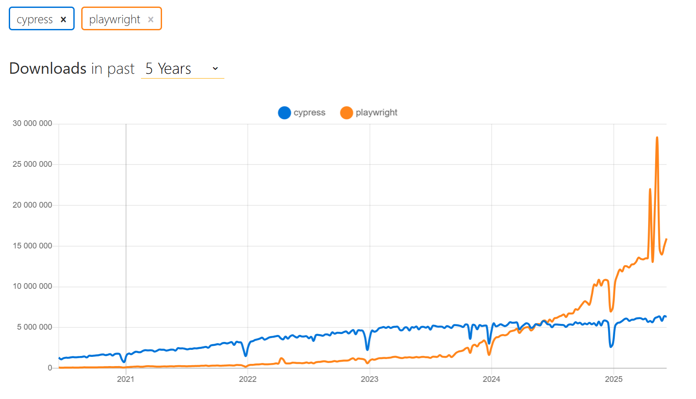
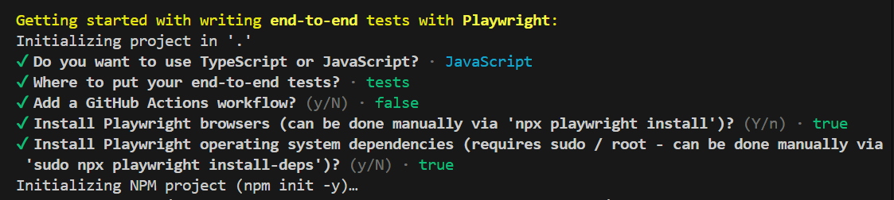
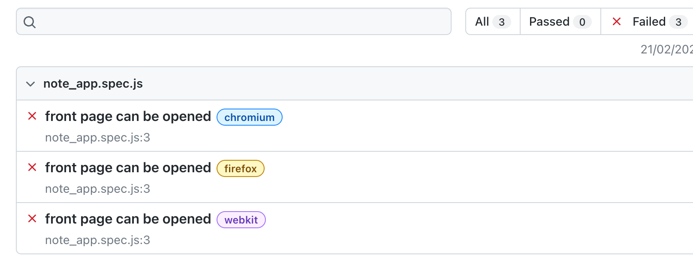
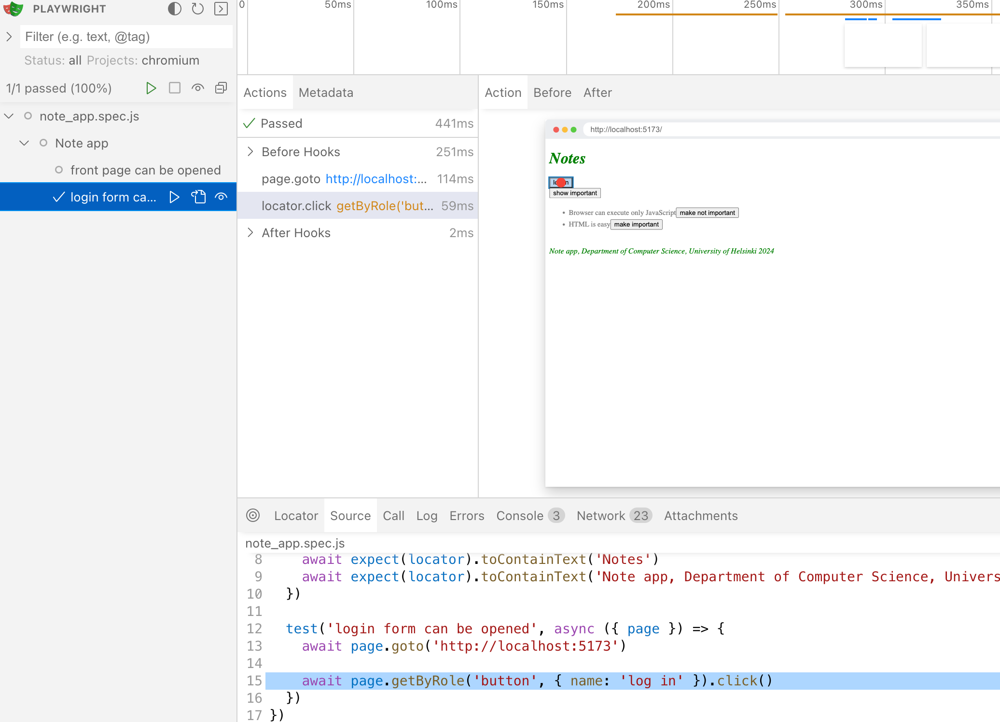
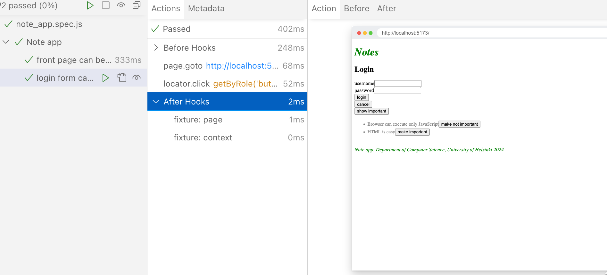
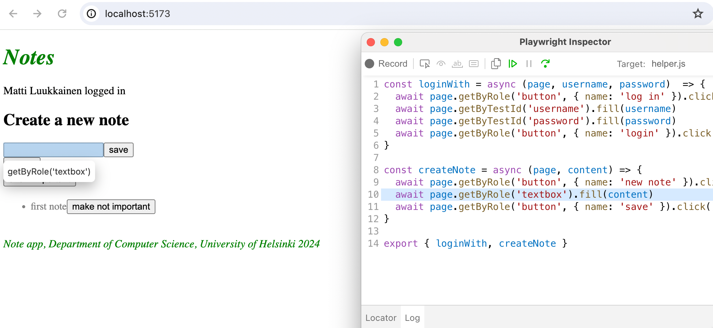
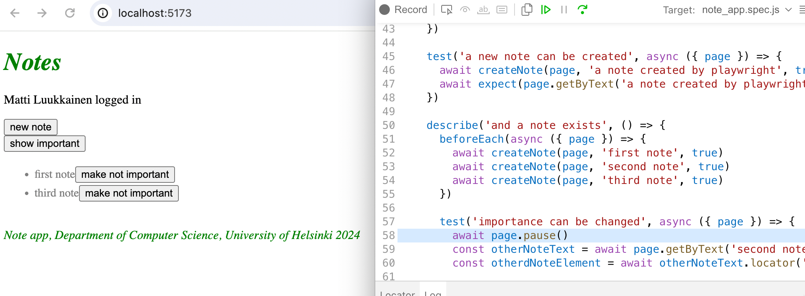
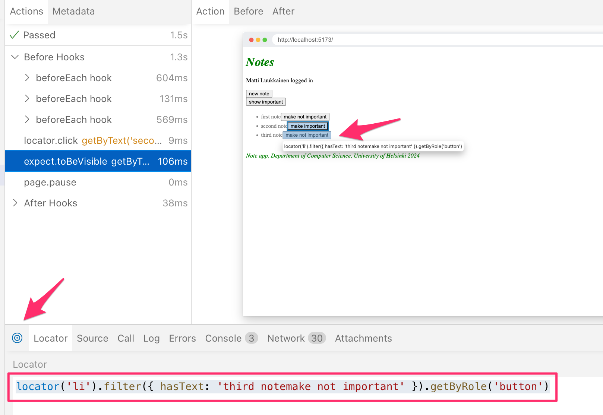
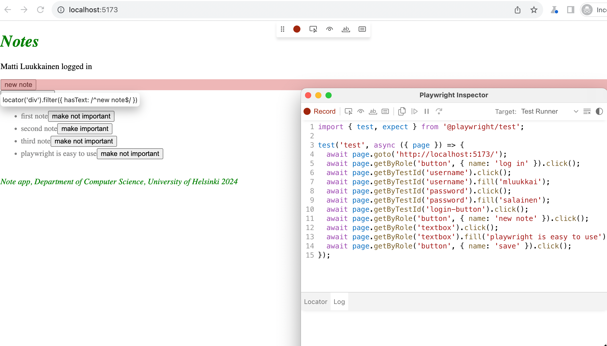

<div class="content">

So far we have tested the backend as a whole on an API level using integration tests and tested some frontend components using unit tests.

Next, we will look into one way to test the [system as a whole](https://en.wikipedia.org/wiki/System_testing) using <i>End to End</i> (E2E) tests.

We can do E2E testing of a web application using a browser and a testing library. There are multiple libraries available. One example is [Selenium](http://www.seleniumhq.org/), which can be used with almost any browser.
Another browser option is so-called [headless browsers](https://en.wikipedia.org/wiki/Headless_browser), which are browsers with no graphical user interface.
For example, Chrome can be used in headless mode.

E2E tests are potentially the most useful category of tests because they test the system through the same interface as real users use.

They do have some drawbacks too. Configuring E2E tests is more challenging than unit or integration tests. They also tend to be quite slow, and with a large system, their execution time can be minutes or even hours. This is bad for development because during coding it is beneficial to be able to run tests as often as possible in case of code [regressions](https://en.wikipedia.org/wiki/Regression_testing).

E2E tests can also be [flaky](https://hackernoon.com/flaky-tests-a-war-that-never-ends-9aa32fdef359).
Some tests might pass one time and fail another, even if the code does not change at all.

Perhaps the two easiest libraries for End to End testing at the moment are [Cypress](https://www.cypress.io/) and [Playwright](https://playwright.dev/).

From the statistics on [npmtrends.com](https://npmtrends.com/cypress-vs-playwright) we see that Cypress, which dominated the market for the last five years, is still clearly the number one, but Playwright is on a rapid rise:



This course has been using Cypress for years. Now Playwright is a new addition. You can choose whether to complete the E2E testing part of the course with Cypress or Playwright. The operating principles of both libraries are very similar, so your choice is not very important. However, Playwright is now the preferred E2E library for the course.

If your choice is Playwright, please proceed. If you end up using Cypress, go [here](/en/part5/end_to_end_testing_cypress).

### Playwright

So [Playwright](https://playwright.dev/) is a newcomer to the End to End tests, which started to explode in popularity towards the end of 2023. Playwright is roughly on a par with Cypress in terms of ease of use. The libraries are slightly different in terms of how they work.  Cypress is radically different from most libraries suitable for E2E testing, as Cypress tests are run entirely within the browser. Playwright's tests, on the other hand, are executed in the Node process, which is connected to the browser via programming interfaces.

Many blogs have been written about library comparisons, e.g. [this](https://www.lambdatest.com/blog/cypress-vs-playwright/) and [this](https://www.browserstack.com/guide/playwright-vs-cypress).

It is difficult to say which library is better. One advantage of Playwright is its browser support; Playwright supports Chrome, Firefox and Webkit-based browsers like Safari. Currently, Cypress includes support for all these browsers, although Webkit support is experimental and does not support all of Cypress features. At the time of writing (1.3.2024), my personal preference leans slightly towards Playwright.

Now let's explore Playwright.

### Initializing tests

Unlike the backend tests or unit tests done on the React front-end, End to End tests do not need to be located in the same npm project where the code is. Let's make a completely separate project for the E2E tests with the _npm init_ command. Then install Playwright by running in the new project directory the command:

```js
npm init playwright@latest
```

The installation script will ask a few questions, answer them as follows:



Let's define an npm script for running tests and test reports in _package.json_:

```js
{
  // ...
  "scripts": {
    "test": "playwright test",
    "test:report": "playwright show-report"
  },
  // ...
}
```

During installation, the following is printed to the console:

```
And check out the following files:
  - ./tests/example.spec.js - Example end-to-end test
  - ./tests-examples/demo-todo-app.spec.js - Demo Todo App end-to-end tests
  - ./playwright.config.js - Playwright Test configuration
```

that is, the location of a few example tests for the project that the installation has created.

Let's run the tests:

```bash
$ npm test

> notes-e2e@1.0.0 test
> playwright test


Running 6 tests using 5 workers
  6 passed (3.9s)

To open last HTML report run:

  npx playwright show-report
```

The tests pass. A more detailed test report can be opened either with the command suggested by the output, or with the npm script we just defined:

```
npm run test:report
```

Tests can also be run via the graphical UI with the command:

```
npm run test -- --ui
```

Sample tests look like this:

```js
const { test, expect } = require('@playwright/test');

test('has title', async ({ page }) => {
  await page.goto('https://playwright.dev/'); // highlight-line

  // Expect a title "to contain" a substring.
  await expect(page).toHaveTitle(/Playwright/);
});

test('get started link', async ({ page }) => {
  await page.goto('https://playwright.dev/');

  // Click the get started link.
  await page.getByRole('link', { name: 'Get started' }).click();

  // Expects page to have a heading with the name of Installation.
  await expect(page.getByRole('heading', { name: 'Installation' })).toBeVisible();
});
```

The first line of the test functions says that the tests are testing the page at https://playwright.dev/.

### Testing our own code

Now let's remove the sample tests and start testing our own application.

Playwright tests assume that the system under test is running when the tests are executed. Unlike, for example, backend integration tests, Playwright tests <i>do not start</i> the system under test during testing.

Let's make an npm script for the <i>backend</i>, which will enable it to be started in testing mode, i.e. so that <i>NODE\_ENV</i> gets the value <i>test</i>.

```js
{
  // ...
  "scripts": {
    "start": "NODE_ENV=production node index.js",
    "dev": "NODE_ENV=development nodemon index.js",
    "build:ui": "rm -rf build && cd ../frontend/ && npm run build && cp -r build ../backend",
    "deploy": "fly deploy",
    "deploy:full": "npm run build:ui && npm run deploy",
    "logs:prod": "fly logs",
    "lint": "eslint .",
    "test": "NODE_ENV=test node --test",
    "start:test": "NODE_ENV=test node index.js" // highlight-line
  },
  // ...
}
```

Let's start the frontend and backend, and create the first test file for the application <code>tests/note\_app.spec.js</code>:

```js
const { test, expect } = require('@playwright/test')

test('front page can be opened', async ({ page }) => {
  await page.goto('http://localhost:5173')

  const locator = await page.getByText('Notes')
  await expect(locator).toBeVisible()
  await expect(page.getByText('Note app, Department of Computer Science, University of Helsinki 2023')).toBeVisible()
})
```

First, the test opens the application with the method [page.goto](https://playwright.dev/docs/writing-tests#navigation). After this, it uses the [page.getByText](https://playwright.dev/docs/api/class-page#page-get-by-text) to get a [locator](https://playwright.dev/docs/locators) that corresponds to the element where the text <i>Notes</i> is found.

The method [toBeVisible](https://playwright.dev/docs/api/class-locatorassertions#locator-assertions-to-be-visible) ensures that the element corresponding to the locator is visible at the page.

The second check is done without using the auxiliary variable.

We notice that the year has changed. Let's change the test as follows:

```js
const { test, expect } = require('@playwright/test')

test('front page can be opened', async ({ page }) => {
  await page.goto('http://localhost:5173')

  const locator = await page.getByText('Notes')
  await expect(locator).toBeVisible()
  await expect(page.getByText('Note app, Department of Computer Science, University of Helsinki 2024')).toBeVisible() // highlight-line
})
```

As expected, the test fails. Playwright opens the test report in the browser and it becomes clear that Playwright has actually performed the tests with three different browsers: Chrome, Firefox and Webkit, i.e. the browser engine used by Safari:



By clicking on the report of one of the browsers, we can see a more detailed error message:


In the big picture, it is of course a very good thing that the testing takes place with all three commonly used browser engines, but this is slow, and when developing the tests it is probably best to carry them out mainly with only one browser. You can define the browser engine to be used with the command line parameter:

```js
npm test -- --project chromium
```

Now let's correct the outdated year in the frontend code that caused the error.

Before we continue, let's add a _describe_ block to the tests:

```js
const { test, describe, expect } = require('@playwright/test')

describe('Note app', () => {  // highlight-line
  test('front page can be opened', async ({ page }) => {
    await page.goto('http://localhost:5173')

    const locator = await page.getByText('Notes')
    await expect(locator).toBeVisible()
    await expect(page.getByText('Note app, Department of Computer Science, University of Helsinki 2024')).toBeVisible()
  })
})
```

Before we move on, let's break the tests one more time. We notice that the execution of the tests is quite fast when they pass, but much slower if the they do not pass. The reason for this is that Playwright's policy is to wait for searched elements until [they are rendered and ready for action](https://playwright.dev/docs/actionability). If the element is not found, a _TimeoutError_ is raised and the test fails. Playwright waits for elements by default for 5 or 30 seconds [depending on the functions used in testing](https://playwright.dev/docs/test-timeouts#introduction).

When developing tests, it may be wiser to reduce the waiting time to a few seconds. According to the [documentation](https://playwright.dev/docs/test-timeouts), this can be done by changing the file _playwright.config.js_ as follows:

```js
module.exports = defineConfig({
  timeout: 3000,
  fullyParallel: false, // highlight-line
  workers: 1, // highlight-line
  // ...
})
```

We also made two other changes to the file, and specified that all tests [be executed one at a time](https://playwright.dev/docs/test-parallel). With the default configuration, the execution happens in parallel, and since our tests use a database, parallel execution causes problems.

### Writing on the form

Let's write a new test that tries to log into the application. Let's assume that a user is stored in the database, with username <i>mluukkai</i> and password <i>salainen</i>.

Let's start by opening the login form.

```js
describe('Note app', () => {
  // ...

  test('login form can be opened', async ({ page }) => {
    await page.goto('http://localhost:5173')

    await page.getByRole('button', { name: 'log in' }).click()
  })
})
```

The test first uses the method [page.getByRole](https://playwright.dev/docs/api/class-page#page-get-by-role) to retrieve the button based on its text. The method returns the [Locator](https://playwright.dev/docs/api/class-locator) corresponding to the Button element. Pressing the button is performed using the Locator method [click](https://playwright.dev/docs/api/class-locator#locator-click).

When developing tests, you could use Playwright's [UI mode](https://playwright.dev/docs/test-ui-mode), i.e. the user interface version. Let's start the tests in UI mode as follows:

```
npm test -- --ui
```

We now see that the test finds the button



After clicking, the form will appear



When the form is opened, the test should look for the text fields and enter the username and password in them. Let's make the first attempt using the method [page.getByRole](https://playwright.dev/docs/api/class-page#page-get-by-role):

```js
describe('Note app', () => {
  // ...

  test('login form can be opened', async ({ page }) => {
    await page.goto('http://localhost:5173')

    await page.getByRole('button', { name: 'log in' }).click()
    await page.getByRole('textbox').fill('mluukkai')  // highlight-line
  })
})
```

This results to an error:

```bash
Error: locator.fill: Error: strict mode violation: getByRole('textbox') resolved to 2 elements:
  1) <input value=""/> aka locator('div').filter({ hasText: /^username$/ }).getByRole('textbox')
  2) <input value="" type="password"/> aka locator('input[type="password"]')
```

The problem now is that _getByRole_ finds two text fields, and calling the [fill](https://playwright.dev/docs/api/class-locator#locator-fill) method fails, because it assumes that there is only one text field found. One way around the problem is to use the methods [first](https://playwright.dev/docs/api/class-locator#locator-first) and [last](https://playwright.dev/docs/api/class-locator#locator-last):

```js
describe('Note app', () => {
  // ...

  test('login form can be opened', async ({ page }) => {
    await page.goto('http://localhost:5173')

    await page.getByRole('button', { name: 'log in' }).click()
    // highlight-start
    await page.getByRole('textbox').first().fill('mluukkai')
    await page.getByRole('textbox').last().fill('salainen')
    await page.getByRole('button', { name: 'login' }).click()
  
    await expect(page.getByText('Matti Luukkainen logged in')).toBeVisible()
    // highlight-end
  })
})
```

After writing in the text fields, the test presses the _login_ button and checks that the application renders the logged-in user's information on the screen.

If there were more than two text fields, using the methods _first_ and _last_ would not be enough. One possibility would be to use the [all](https://playwright.dev/docs/api/class-locator#locator-all) method, which turns the found locators into an array that can be indexed:

```js
describe('Note app', () => {
  // ...
  test('login form can be opened', async ({ page }) => {
    await page.goto('http://localhost:5173')

    await page.getByRole('button', { name: 'log in' }).click()
    // highlight-start
    const textboxes = await page.getByRole('textbox').all()

    await textboxes[0].fill('mluukkai')
    await textboxes[1].fill('salainen')
    // highlight-end

    await page.getByRole('button', { name: 'login' }).click()
  
    await expect(page.getByText('Matti Luukkainen logged in')).toBeVisible()
  })  
})
```

Both this and the previous version of the test work. However, both are problematic to the extent that if the registration form is changed, the tests may break, as they rely on the fields to be on the page in a certain order.

A better solution is to define unique test id attributes for the fields, to search for them in the tests using the method [getByTestId](https://playwright.dev/docs/api/class-page#page-get-by-test-id ).

Let's expand the login form as follows

```js
const LoginForm = ({ ... }) => {
  return (
    <div>
      <h2>Login</h2>
      <form onSubmit={handleSubmit}>
        <div>
          username
          <input
            data-testid='username'  // highlight-line
            value={username}
            onChange={handleUsernameChange}
          />
        </div>
        <div>
          password
          <input
            data-testid='password' // highlight-line
            type="password"
            value={password}
            onChange={handlePasswordChange}
          />
        </div>
        <button type="submit">
          login
        </button>
      </form>
    </div>
  )
}
```

Test changes as follows:

```js
describe('Note app', () => {
  // ...

  test('login form can be opened', async ({ page }) => {
    await page.goto('http://localhost:5173')

    await page.getByRole('button', { name: 'log in' }).click()
    await page.getByTestId('username').fill('mluukkai') // highlight-line
    await page.getByTestId('password').fill('salainen')  // highlight-line
  
    await page.getByRole('button', { name: 'login' }).click() 
  
    await expect(page.getByText('Matti Luukkainen logged in')).toBeVisible()
  })
})
```

Note that passing the test at this stage requires that there is a user in the <i>test</i> database of the backend with username <i>mluukkai</i> and password <i>salainen</i>. Create a user if needed!

Since both tests start in the same way, i.e. by opening the page <i>http://localhost:5173</i>, it is recommended to isolate the common part in the <i>beforeEach</i> block that is executed before each test:

```js
const { test, describe, expect, beforeEach } = require('@playwright/test')

describe('Note app', () => {
  // highlight-start
  beforeEach(async ({ page }) => {
    await page.goto('http://localhost:5173')
  })
  // highlight-end

  test('front page can be opened', async ({ page }) => {
    const locator = await page.getByText('Notes')
    await expect(locator).toBeVisible()
    await expect(page.getByText('Note app, Department of Computer Science, University of Helsinki 2024')).toBeVisible()
  })

  test('login form can be opened', async ({ page }) => {
    await page.getByRole('button', { name: 'log in' }).click()
    await page.getByTestId('username').fill('mluukkai')
    await page.getByTestId('password').fill('salainen')
    await page.getByRole('button', { name: 'login' }).click()
    await expect(page.getByText('Matti Luukkainen logged in')).toBeVisible()
  })
})
```

### Testing note creation

Next, let's create a test that adds a new note to the application:

```js
const { test, describe, expect, beforeEach } = require('@playwright/test')

describe('Note app', () => {
  // ...

  describe('when logged in', () => {
    beforeEach(async ({ page }) => {
      await page.getByRole('button', { name: 'log in' }).click()
      await page.getByTestId('username').fill('mluukkai')
      await page.getByTestId('password').fill('salainen')
      await page.getByRole('button', { name: 'login' }).click()
    })

    test('a new note can be created', async ({ page }) => {
      await page.getByRole('button', { name: 'new note' }).click()
      await page.getByRole('textbox').fill('a note created by playwright')
      await page.getByRole('button', { name: 'save' }).click()
      await expect(page.getByText('a note created by playwright')).toBeVisible()
    })
  })  
})
```

The test is defined in its own _describe_ block. Creating a note requires that the user is logged in, which is handled in the _beforeEach_ block.

The test trusts that when creating a new note, there is only one input field on the page, so it searches for it as follows:

```js
page.getByRole('textbox')
```

If there were more fields, the test would break. Because of this, it would be better to add a test-id to the form input and search for it in the test based on this id.

**Note:** the test will only pass the first time. The reason for this is that its expectation

```js
await expect(page.getByText('a note created by playwright')).toBeVisible()
```

causes problems when the same note is created in the application more than once. The problem will be solved in the next chapter.

The structure of the tests looks like this:

```js
const { test, describe, expect, beforeEach } = require('@playwright/test')

describe('Note app', () => {
  // ....

  test('user can log in', async ({ page }) => {
    await page.getByRole('button', { name: 'log in' }).click()
    await page.getByTestId('username').fill('mluukkai')
    await page.getByTestId('password').fill('salainen')
    await page.getByRole('button', { name: 'login' }).click()
    await expect(page.getByText('Matti Luukkainen logged in')).toBeVisible()
  })

  describe('when logged in', () => {
    beforeEach(async ({ page }) => {
      await page.getByRole('button', { name: 'log in' }).click()
      await page.getByTestId('username').fill('mluukkai')
      await page.getByTestId('password').fill('salainen')
      await page.getByRole('button', { name: 'login' }).click()
    })

    test('a new note can be created', async ({ page }) => {
      await page.getByRole('button', { name: 'new note' }).click()
      await page.getByRole('textbox').fill('a note created by playwright')
      await page.getByRole('button', { name: 'save' }).click()
      await expect(page.getByText('a note created by playwright')).toBeVisible()
    })
  })  
})
```

Since we have prevented the tests from running in parallel, Playwright runs the tests in the order they appear in the test code. That is, first the test <i>user can log in</i>, where the user logs into the application, is performed. After this the test <i>a new note can be created</i> gets executed, which also does a log in, in the <i>beforeEach</i> block. Why is this done, isn't the user already logged in thanks to the previous test? No, because the execution of <i>each</i> test starts from the browser's "zero state", all changes made to the browser's state by the previous tests are reset.

### Controlling the state of the database

If the tests need to be able to modify the server's database, the situation immediately becomes more complicated. Ideally, the server's database should be the same each time we run the tests, so our tests can be reliably and easily repeatable.

As with unit and integration tests, with E2E tests it is best to empty the database and possibly format it before the tests are run. The challenge with E2E tests is that they do not have access to the database.

The solution is to create API endpoints for the backend tests.
We can empty the database using these endpoints.
Let's create a new router for the tests inside the <i>controllers</i> folder, in the <i>testing.js</i> file

```js
const router = require('express').Router()
const Note = require('../models/note')
const User = require('../models/user')

router.post('/reset', async (request, response) => {
  await Note.deleteMany({})
  await User.deleteMany({})

  response.status(204).end()
})

module.exports = router
```

and add it to the backend only <i>if the application is run in test-mode</i>:

```js
// ...

app.use('/api/login', loginRouter)
app.use('/api/users', usersRouter)
app.use('/api/notes', notesRouter)

// highlight-start
if (process.env.NODE_ENV === 'test') {
  const testingRouter = require('./controllers/testing')
  app.use('/api/testing', testingRouter)
}
// highlight-end

app.use(middleware.unknownEndpoint)
app.use(middleware.errorHandler)

module.exports = app
```

After the changes, an HTTP POST request to the <i>/api/testing/reset</i> endpoint empties the database. Make sure your backend is running in test mode by starting it with this command (previously configured in the package.json file):

```js
  npm run start:test
```

The modified backend code can be found on the [GitHub](https://github.com/fullstack-hy2020/part3-notes-backend/tree/part5-1) branch <i>part5-1</i>.

Next, we will change the _beforeEach_ block so that it empties the server's database before tests are run.

Currently, it is not possible to add new users through the frontend's UI, so we add a new user to the backend from the beforeEach block.

```js
describe('Note app', () => {
  beforeEach(async ({ page, request }) => {
    await request.post('http:localhost:3001/api/testing/reset')
    await request.post('http://localhost:3001/api/users', {
      data: {
        name: 'Matti Luukkainen',
        username: 'mluukkai',
        password: 'salainen'
      }
    })

    await page.goto('http://localhost:5173')
  })
  
  test('front page can be opened',  () => {
    // ...
  })

  test('user can login', () => {
    // ...
  })

  describe('when logged in', () => {
    // ...
  })
})
```

During initialization, the test makes HTTP requests to the backend with the method [post](https://playwright.dev/docs/api/class-apirequestcontext#api-request-context-post) of the parameter _request_.

Unlike before, now the testing of the backend always starts from the same state, i.e. there is one user and no notes in the database.

Let's make a test that checks that the importance of the notes can be changed.

There are a few different approaches to taking the test.

In the following, we first look for a note and click on its button that has text <i>make not important</i>. After this, we check that the note contains the button with <i>make important</i>.

```js
describe('Note app', () => {
  // ...

  describe('when logged in', () => {
    // ...

    // highlight-start
    describe('and a note exists', () => {
      beforeEach(async ({ page }) => {
        await page.getByRole('button', { name: 'new note' }).click()
        await page.getByRole('textbox').fill('another note by playwright')
        await page.getByRole('button', { name: 'save' }).click()
      })
  
      test('importance can be changed', async ({ page }) => {
        await page.getByRole('button', { name: 'make not important' }).click()
        await expect(page.getByText('make important')).toBeVisible()
      })
    // highlight-end
    })
  })
})
```

The first command first searches for the component where there is the text <i>another note by playwright</i> and inside it the button <i>make not important</i> and clicks on it.

The second command ensures that the text of the same button has changed to <i>make important</i>.

The current code for the tests is on [GitHub](https://github.com/fullstack-hy2020/notes-e2e/tree/part5-1), in branch <i>part5-1</i>.

### Test for failed login 

Now let's do a test that ensures that the login attempt fails if the password is wrong.

The first version of the test looks like this:

```js
describe('Note app', () => {
  // ...

  test('login fails with wrong password', async ({ page }) => {
    await page.getByRole('button', { name: 'log in' }).click()
    await page.getByTestId('username').fill('mluukkai')
    await page.getByTestId('password').fill('wrong')
    await page.getByRole('button', { name: 'login' }).click()

    await expect(page.getByText('wrong credentials')).toBeVisible()
  })

  // ...
)}
```

The test verifies with the method [page.getByText](https://playwright.dev/docs/api/class-page#page-get-by-text) that the application prints an error message.

The application renders the error message to an element containing the CSS class <i>error</i>:

```js
const Notification = ({ message }) => {
  if (message === null) {
    return null
  }

  return (
    <div className="error"> // highlight-line
      {message}
    </div>
  )
}
```

We could refine the test to ensure that the error message is printed exactly in the right place, i.e. in the element containing the CSS class <i>error</i>:

```js
  test('login fails with wrong password', async ({ page }) => {
  // ...

  const errorDiv = page.locator('.error') // highlight-line
  await expect(errorDiv).toContainText('wrong credentials')
})
```

So the test uses the [page.locator](https://playwright.dev/docs/api/class-page#page-locator) method to find the component containing the CSS class <i>error</i> and stores it in a variable. The correctness of the text associated with the component can be verified with the expectation [toContainText](https://playwright.dev/docs/api/class-locatorassertions#locator-assertions-to-contain-text). Note that the [CSS class selector](https://developer.mozilla.org/en-US/docs/Web/CSS/Class_selectors) starts with a dot, so the <i>error</i> class selector is <i> .error</i>.

It is possible to test the application's CSS styles with matcher [toHaveCSS](https://playwright.dev/docs/api/class-locatorassertions#locator-assertions-to-have-css). We can, for example, make sure that the color of the error message is red, and that there is a border around it:

```js
  test('login fails with wrong password', async ({ page }) => {
  // ...

    const errorDiv = page.locator('.error')
    await expect(errorDiv).toContainText('wrong credentials')
    await expect(errorDiv).toHaveCSS('border-style', 'solid') // highlight-line
    await expect(errorDiv).toHaveCSS('color', 'rgb(255, 0, 0)') // highlight-line
})
```

Colors must be defined to Playwright as [rgb](https://rgbcolorcode.com/color/red) codes.

Let's finalize the test so that it also ensures that the application **does not render** the text describing a successful login <i>'Matti Luukkainen logged in'</i>:

```js
test('login fails with wrong password', async ({ page }) =>{
  await page.getByRole('button', { name: 'log in' }).click()
  await page.getByTestId('username').fill('mluukkai')
  await page.getByTestId('password').fill('wrong')
  await page.getByRole('button', { name: 'login' }).click()

  const errorDiv = page.locator('.error')
  await expect(errorDiv).toContainText('wrong credentials')
  await expect(errorDiv).toHaveCSS('border-style', 'solid')
  await expect(errorDiv).toHaveCSS('color', 'rgb(255, 0, 0)')

  await expect(page.getByText('Matti Luukkainen logged in')).not.toBeVisible() // highlight-line
})
```

### Running tests one by one

By default, Playwright always runs all tests, and as the number of tests increases, it becomes time-consuming. When developing a new test or debugging a broken one, the test can be defined instead than with the command <i>test</i>, with the command <i>test.only</i>, in which case Playwright will run only that test:

```js
describe(() => {
  // this is the only test executed!
  test.only('login fails with wrong password', async ({ page }) => {  // highlight-line
    // ...
  })

  // this test is skipped...
  test('user can login with correct credentials', async ({ page }) => {
    // ...
  }

  // ...
})
```

When the test is ready, <i>only</i> can and **should** be deleted.

Another option to run a single test is to use a command line parameter:

```
npm test -- -g "login fails with wrong password"
```

### Helper functions for tests

Our application tests currently look like this:

```js 
const { test, describe, expect, beforeEach } = require('@playwright/test')

describe('Note app', () => {
  // ...

  test('user can login with correct credentials', async ({ page }) => {
    await page.getByRole('button', { name: 'log in' }).click()
    await page.getByTestId('username').fill('mluukkai')
    await page.getByTestId('password').fill('salainen')
    await page.getByRole('button', { name: 'login' }).click()
    await expect(page.getByText('Matti Luukkainen logged in')).toBeVisible()
  })

  test('login fails with wrong password', async ({ page }) =>{
    // ...
  })

  describe('when logged in', () => {
    beforeEach(async ({ page, request }) => {
      await page.getByRole('button', { name: 'log in' }).click()
      await page.getByTestId('username').fill('mluukkai')
      await page.getByTestId('password').fill('salainen')
      await page.getByRole('button', { name: 'login' }).click()
    })

    test('a new note can be created', async ({ page }) => {
      // ...
    })
  
    // ...
  })  
})
```

First, the login function is tested. After this, another _describe_ block contains a set of tests that assume that the user is logged in, the login is handled inside the initializing _beforeEach_ block.

As already stated earlier, each test is executed starting from the initial state (where the database is cleared and one user is created there), so even though the test is defined after another test in the code, it does not start from the same state where the tests in the code executed earlier have left!

It is also worth striving for having non-repetitive code in tests. Let's isolate the code that handles the login as a helper function, which is placed e.g. in the file _tests/helper.js_:

```js 
const loginWith = async (page, username, password)  => {
  await page.getByRole('button', { name: 'log in' }).click()
  await page.getByTestId('username').fill(username)
  await page.getByTestId('password').fill(password)
  await page.getByRole('button', { name: 'login' }).click()
}

export { loginWith }
```

The test becomes simpler and clearer:

```js
const { loginWith } = require('./helper')

describe('Note app', () => {
  test('user can log in', async ({ page }) => {
    await loginWith(page, 'mluukkai', 'salainen') // highlight-line
    await expect(page.getByText('Matti Luukkainen logged in')).toBeVisible()
  })

  describe('when logged in', () => {
    beforeEach(async ({ page }) => {
      await loginWith(page, 'mluukkai', 'salainen') // highlight-line
    })

  test('a new note can be created', () => {
    // ...
  })

  // ...
})
```

Playwright also offers a [solution](https://playwright.dev/docs/auth) where the login is performed once before the tests, and each test starts from a state where the application is already logged in. In order for us to take advantage of this method, the initialization of the application's test data should be done a bit differently than now. In the current solution, the database is reset before each test, and because of this, logging in just once before the tests is impossible. In order for us to use the pre-test login provided by Playwright, the user should be initialized only once before the tests. We stick to our current solution for the sake of simplicity.

The corresponding repeating code actually also applies to creating a new note. For that, there is a test that creates a note using a form. Also in the _beforeEach_ initialization block of the test that tests changing the importance of the note, a note is created using the form:

```js
describe('Note app', function() {
  // ...

  describe('when logged in', () => {
    test('a new note can be created', async ({ page }) => {
      await page.getByRole('button', { name: 'new note' }).click()
      await page.getByRole('textbox').fill('a note created by playwright')
      await page.getByRole('button', { name: 'save' }).click()
      await expect(page.getByText('a note created by playwright')).toBeVisible()
    })
  
    describe('and a note exists', () => {
      beforeEach(async ({ page }) => {
        await page.getByRole('button', { name: 'new note' }).click()
        await page.getByRole('textbox').fill('another note by playwright')
        await page.getByRole('button', { name: 'save' }).click()
      })
  
      test('it can be made important', async ({ page }) => {
        // ...
      })
    })
  })
})
```

Creation of a note is also isolated as its helper function. The file _tests/helper.js_ expands as follows:

```js
const loginWith = async (page, username, password)  => {
  await page.getByRole('button', { name: 'log in' }).click()
  await page.getByTestId('username').fill(username)
  await page.getByTestId('password').fill(password)
  await page.getByRole('button', { name: 'login' }).click()
}

// highlight-start
const createNote = async (page, content) => {
  await page.getByRole('button', { name: 'new note' }).click()
  await page.getByRole('textbox').fill(content)
  await page.getByRole('button', { name: 'save' }).click()
}
// highlight-end

export { loginWith, createNote }
```

The tests are simplified as follows:

```js
describe('Note app', () => {
  // ...

  describe('when logged in', () => {
    beforeEach(async ({ page }) => {
      await loginWith(page, 'mluukkai', 'salainen')
    })

    test('a new note can be created', async ({ page }) => {
      await createNote(page, 'a note created by playwright', true) // highlight-line
      await expect(page.getByText('a note created by playwright')).toBeVisible()
    })

    describe('and a note exists', () => {
      beforeEach(async ({ page }) => {
        await createNote(page, 'another note by playwright', true) // highlight-line
      })
  
      test('importance can be changed', async ({ page }) => {
        await page.getByRole('button', { name: 'make not important' }).click()
        await expect(page.getByText('make important')).toBeVisible()
      })
    })
  })
})
```

There is one more annoying feature in our tests. The frontend address <i>http:localhost:5173</i> and the backend address <i>http:localhost:3001</i> are hardcoded for tests. Of these, the address of the backend is actually useless, because a proxy has been defined in the Vite configuration of the frontend, which forwards all requests made by the frontend to the address <i>http:localhost:5173/api</i> to the backend:

```js
export default defineConfig({
  server: {
    proxy: {
      '/api': {
        target: 'http://localhost:3001',
        changeOrigin: true,
      },
    }
  },
  // ...
})
```

So we can replace all the addresses in the tests from _http://localhost:3001/api/..._ to _http://localhost:5173/api/..._

We can now define the _baseUrl_ for the application in the tests configuration file <i>playwright.config.js</i>:

```js
module.exports = defineConfig({
  // ...
  use: {
    baseURL: 'http://localhost:5173',
  },
  // ...
}
```

All the commands in the tests that use the application url, e.g.

```js
await page.goto('http://localhost:5173')
await page.post('http://localhost:5173/api/tests/reset')
```

can be transformed into:

```js
await page.goto('/')
await page.post('/api/tests/reset')
```

The current code for the tests is on [GitHub](https://github.com/fullstack-hy2020/notes-e2e/tree/part5-2), branch <i>part5-2</i>.

### Note importance change revisited

Let's take a look at the test we did earlier, which verifies that it is possible to change the importance of a note.

Let's change the initialization block of the test so that it creates two notes instead of one:

```js
describe('when logged in', () => {
  // ...
  describe('and several notes exists', () => {
    beforeEach(async ({ page }) => {
      // highlight-start
      await createNote(page, 'first note', true)
      await createNote(page, 'second note', true)
      // highlight-end
    })

    test('one of those can be made nonimportant', async ({ page }) => {
      const otherNoteElement = await page.getByText('first note')

      await otherNoteElement
        .getByRole('button', { name: 'make not important' }).click()
      await expect(otherNoteElement.getByText('make important')).toBeVisible()
    })
  })
})
```

The test first searches for the element corresponding to the first created note using the method _page.getByText_ and stores it in a variable. After this, a button with the text _make not important_ is searched inside the element and the button is pressed. Finally, the test verifies that the button's text has changed to _make important_.

The test could also have been written without the auxiliary variable:

```js
test('one of those can be made nonimportant', async ({ page }) => {
  await page.getByText('first note')
    .getByRole('button', { name: 'make not important' }).click()

  await expect(page.getByText('first note').getByText('make important'))
    .toBeVisible()
})
```

Let's change the _Note_ component so that the note text is rendered inside a _span_ element

```js
const Note = ({ note, toggleImportance }) => {
  const label = note.important
    ? 'make not important' : 'make important'

  return (
    <li className='note'>
      <span>{note.content}</span> // highlight-line
      <button onClick={toggleImportance}>{label}</button>
    </li>
  )
}
```

Tests break! The reason for the problem is that the command _await page.getByText('second note')_ now returns a _span_ element containing only text, and the button is outside of it.

One way to fix the problem is as follows:

```js
test('one of those can be made nonimportant', async ({ page }) => {
  const otherNoteText = await page.getByText('first note') // highlight-line
  const otherNoteElement = await otherNoteText.locator('..') // highlight-line

  await otherNoteElement.getByRole('button', { name: 'make not important' }).click()
  await expect(otherNoteElement.getByText('make important')).toBeVisible()
})
```

The first line now looks for the _span_ element containing the text associated with the first created note. In the second line, the function _locator_ is used and _.._ is given as an argument, which retrieves the element's parent element. The locator function is very flexible, and we take advantage of the fact that accepts [as argument](https://playwright.dev/docs/locators#locate-by-css-or-xpath) not only CSS selectors but also [XPath](https://developer.mozilla.org/en-US/docs/Web/XPath) selector. It would be possible to express the same with CSS, but in this case XPath provides the simplest way to find the parent of an element.

Of course, the test can also be written using only one auxiliary variable:

```js
test('one of those can be made nonimportant', async ({ page }) => {
  const secondNoteElement = await page.getByText('second note').locator('..')
  await secondNoteElement.getByRole('button', { name: 'make not important' }).click()
  await expect(secondNoteElement.getByText('make important')).toBeVisible()
})
```

Let's change the test so that three notes are created, the importance is changed in the second created note:

```js
describe('when logged in', () => {
  beforeEach(async ({ page }) => {
    await loginWith(page, 'mluukkai', 'salainen')
  })

  test('a new note can be created', async ({ page }) => {
    await createNote(page, 'a note created by playwright', true)
    await expect(page.getByText('a note created by playwright')).toBeVisible()
  })

  describe('and a note exists', () => {
    beforeEach(async ({ page }) => {
      await createNote(page, 'first note', true)
      await createNote(page, 'second note', true)
      await createNote(page, 'third note', true) // highlight-line
    })

    test('importance can be changed', async ({ page }) => {
      const otherNoteText = await page.getByText('second note') // highlight-line
      const otherdNoteElement = await otherNoteText.locator('..')
    
      await otherdNoteElement.getByRole('button', { name: 'make not important' }).click()
      await expect(otherdNoteElement.getByText('make important')).toBeVisible()
    })
  })
}) 
```

For some reason the test starts working unreliably, sometimes it passes and sometimes it doesn't. It's time to roll up your sleeves and learn how to debug tests.

### Test development and debugging

If, and when the tests don't pass and you suspect that the fault is in the tests instead of in the code, you should run the tests in [debug](https://playwright.dev/docs/debug#run-in-debug-mode-1) mode.

The following command runs the problematic test in debug mode:

```
npm test -- -g'importance can be changed' --debug
```

Playwright-inspector shows the progress of the tests step by step. The arrow-dot button at the top takes the tests one step further. The elements found by the locators and the interaction with the browser are visualized in the browser:



By default, debug steps through the test command by command. If it is a complex test, it can be quite a burden to step through the test to the point of interest. This can be avoided by using the command _await page.pause()_:

```js
describe('Note app', () => {
  beforeEach(async ({ page, request }) => {
    // ...
  }

  describe('when logged in', () => {
    beforeEach(async ({ page }) => {
      // ...
    })

    describe('and several notes exists', () => {
      beforeEach(async ({ page }) => {
        await createNote(page, 'first note')
        await createNote(page, 'second note')
        await createNote(page, 'third note')
      })
  
      test('one of those can be made nonimportant', async ({ page }) => {
        await page.pause() // highlight-line
        const otherNoteText = await page.getByText('second note')
        const otherdNoteElement = await otherNoteText.locator('..')
      
        await otherdNoteElement.getByRole('button', { name: 'make not important' }).click()
        await expect(otherdNoteElement.getByText('make important')).toBeVisible()
      })
    })
  })
})
```

Now in the test you can go to _page.pause()_ in one step, by pressing the green arrow symbol in the inspector.

When we now run the test and jump to the _page.pause()_ command, we find an interesting fact:



It seems that the browser <i>does not render</i> all the notes created in the block _beforeEach_. What is the problem?

The reason for the problem is that when the test creates one note, it starts creating the next one even before the server has responded, and the added note is rendered on the screen. This in turn can cause some notes to be lost (in the picture, this happened to the second note created), since the browser is re-rendered when the server responds, based on the state of the notes at the start of that insert operation.

The problem can be solved by "slowing down" the insert operations by using the [waitFor](https://playwright.dev/docs/api/class-locator#locator-wait-for) command after the insert to wait for the inserted note to render:

```js
const createNote = async (page, content) => {
  await page.getByRole('button', { name: 'new note' }).click()
  await page.getByRole('textbox').fill(content)
  await page.getByRole('button', { name: 'save' }).click()
  await page.getByText(content).waitFor() // highlight-line
}
```

Instead of, or alongside debugging mode, running tests in UI mode can be useful. As already mentioned, tests are started in UI mode as follows:

```
npm run test -- --ui
```

Almost the same as UI mode is use of the Playwright's [Trace Viewer](https://playwright.dev/docs/trace-viewer-intro). The idea is that a "visual trace" of the tests is saved, which can be viewed if necessary after the tests have been completed. A trace is saved by running the tests as follows:

```
npm run test -- --trace on
```

If necessary, Trace can be viewed with the command

```
npx playwright show-report
```

or with the npm script we defined _npm run test:report_

Trace looks practically the same as running tests in UI mode.

UI mode and Trace Viewer also offer the possibility of assisted search for locators. This is done by pressing the double circle on the left side of the lower bar, and then by clicking on the desired user interface element. Playwright displays the element locator:



Playwright suggests the following as the locator for the third note

```js
page.locator('li').filter({ hasText: 'third note' }).getByRole('button')
```

The method [page.locator](https://playwright.dev/docs/api/class-page#page-locator) is called with the argument _li_, i.e. we search for all li elements on the page, of which there are three in total. After this, using the [locator.filter](https://playwright.dev/docs/api/class-locator#locator-filter) method, we narrow down to the li element that contains the text <i>third note</i> and the button element inside it is taken using the [locator.getByRole](https://playwright.dev/docs/api/class-locator#locator-get-by-role) method.

The locator generated by Playwright is somewhat different from the locator used by our tests, which was

```js
page.getByText('first note').locator('..').getByRole('button', { name: 'make not important' })
```

Which of the locators is better is probably a matter of taste.

Playwright also includes a [test generator](https://playwright.dev/docs/codegen-intro) that makes it possible to "record" a test through the user interface. The test generator is started with the command:

```
npx playwright codegen http://localhost:5173/
```

When the _Record_ mode is on, the test generator "records" the user's interaction in the Playwright inspector, from where it is possible to copy the locators and actions to the tests:



Instead of the command line, Playwright can also be used via the [VS Code](https://marketplace.visualstudio.com/items?itemName=ms-playwright.playwright) plugin. The plugin offers many convenient features, e.g. use of breakpoints when debugging tests.

To avoid problem situations and increase understanding, it is definitely worth browsing Playwright's high-quality [documentation](https://playwright.dev/docs/intro). The most important sections are listed below:
- the section about [locators](https://playwright.dev/docs/locators) gives good hints for finding elements in test
- section [actions](https://playwright.dev/docs/input) tells how it is possible to simulate the interaction with the browser in tests
- the section about [assertions](https://playwright.dev/docs/test-assertions) demonstrates the different expectations Playwright offers for testing

In-depth details can be found in the [API](https://playwright.dev/docs/api/class-playwright) description, particularly useful are the class [Page](https://playwright.dev/docs/api/class-page) corresponding to the browser window of the application under test, and the class [Locator](https://playwright.dev/docs/api/class-locator) corresponding to the elements searched for in the tests.

The final version of the tests is in full on [GitHub](https://github.com/fullstack-hy2020/notes-e2e/tree/part5-3), in branch <i>part5-3</i>.

The final version of the frontend code is in its entirety on [GitHub](https://github.com/fullstack-hy2020/part2-notes-frontend/tree/part5-9), in branch <i>part5-9</i>.

</div>

<div class="tasks">

### Exercises 5.17.-5.23.

In the last exercises of this part, let's do some E2E tests for the blog application. The material above should be enough to do most of the exercises. However, you should definitely read Playwright's [documentation](https://playwright.dev/docs/intro) and [API description](https://playwright.dev/docs/api/class-playwright), at least the sections mentioned at the end of the previous chapter.

#### 5.17: Blog List End To End Testing, step 1

Create a new npm project for tests and configure Playwright there.

Make a test to ensure that the application displays the login form by default.

The body of the test should be as follows:

```js 
const { test, expect, beforeEach, describe } = require('@playwright/test')

describe('Blog app', () => {
  beforeEach(async ({ page }) => {
    await page.goto('http://localhost:5173')
  })

  test('Login form is shown', async ({ page }) => {
    // ...
  })
})

```

#### 5.18: Blog List End To End Testing, step 2

Do the tests for login. Test both successful and failed login. For tests, create a user in the _beforeEach_ block.

The body of the tests expands as follows

```js 
const { test, expect, beforeEach, describe } = require('@playwright/test')

describe('Blog app', () => {
  beforeEach(async ({ page, request }) => {
    // empty the db here
    // create a user for the backend here
    // ...
  })

  test('Login form is shown', async ({ page }) => {
    // ...
  })

  describe('Login', () => {
    test('succeeds with correct credentials', async ({ page }) => {
      // ...
    })

    test('fails with wrong credentials', async ({ page }) => {
      // ...
    })
  })
})
```

The _beforeEach_ block must empty the database using, for example, the reset method we used in the [material](/en/part5/end_to_end_testing_playwright#controlling-the-state-of-the-database).

#### 5.19: Blog List End To End Testing, step 3

Create a test that verifies that a logged in user can create a blog. The body of the test may look like the following

```js 
describe('When logged in', () => {
  beforeEach(async ({ page }) => {
    // ...
  })

  test('a new blog can be created', async ({ page }) => {
    // ...
  })
})
```

The test should ensure that the created blog is visible in the list of blogs.

#### 5.20: Blog List End To End Testing, step 4

Do a test that makes sure the blog can be liked.

#### 5.21: Blog List End To End Testing, step 5

Make a test that ensures that the user who added the blog can delete the blog. If you use the _window.confirm_ dialog in the delete operation, you may have to Google how to use the dialog in the Playwright tests.

#### 5.22: Blog List End To End Testing, step 6

Make a test that ensures that only the user who added the blog sees the blog's delete button.

#### 5.23: Blog List End To End Testing, step 7

Do a test that ensures that the blogs are arranged in the order according to the likes, the blog with the most likes first.

<i>This task is significantly more challenging than the previous ones.</i>

This was the last task of the section and it's time to push the code to GitHub and mark the completed tasks in the [exercise submission system](https://studies.cs.helsinki.fi/stats/courses/fullstackopen).

</div>
