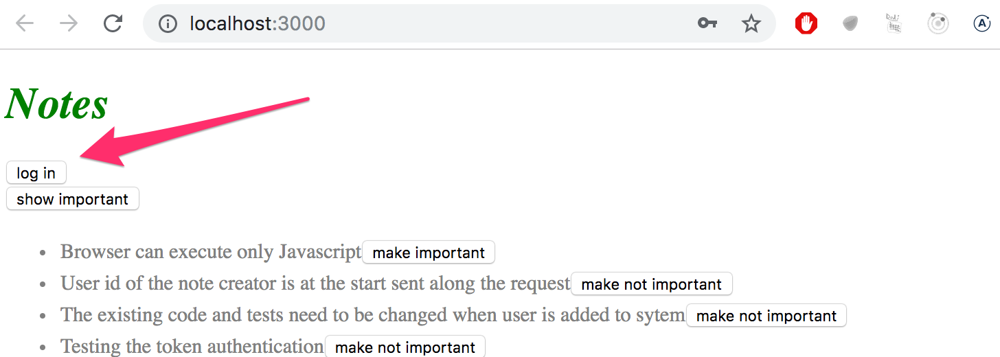
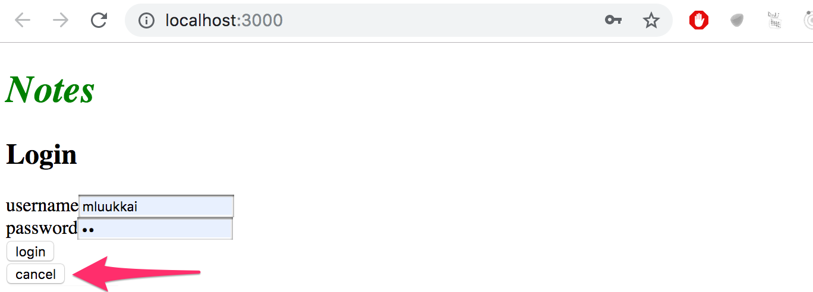
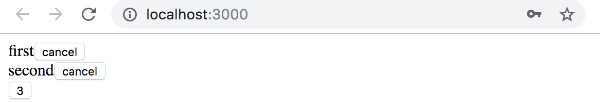
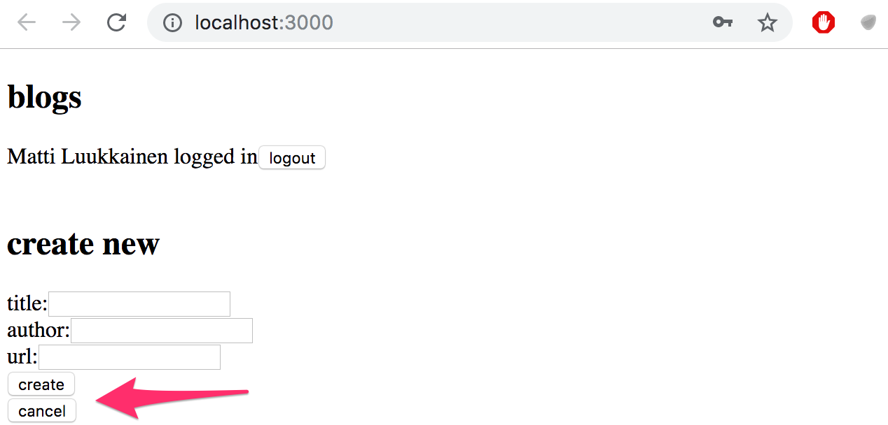
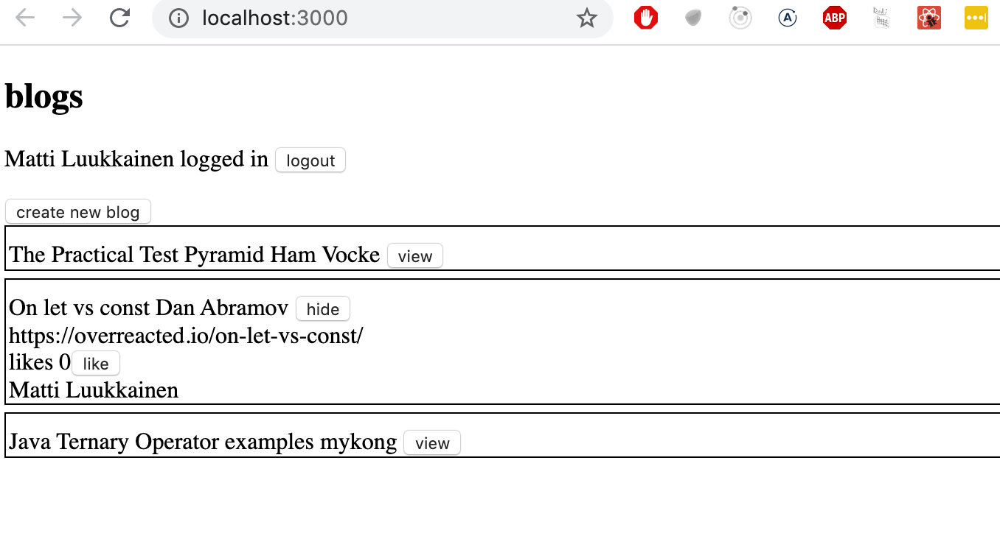
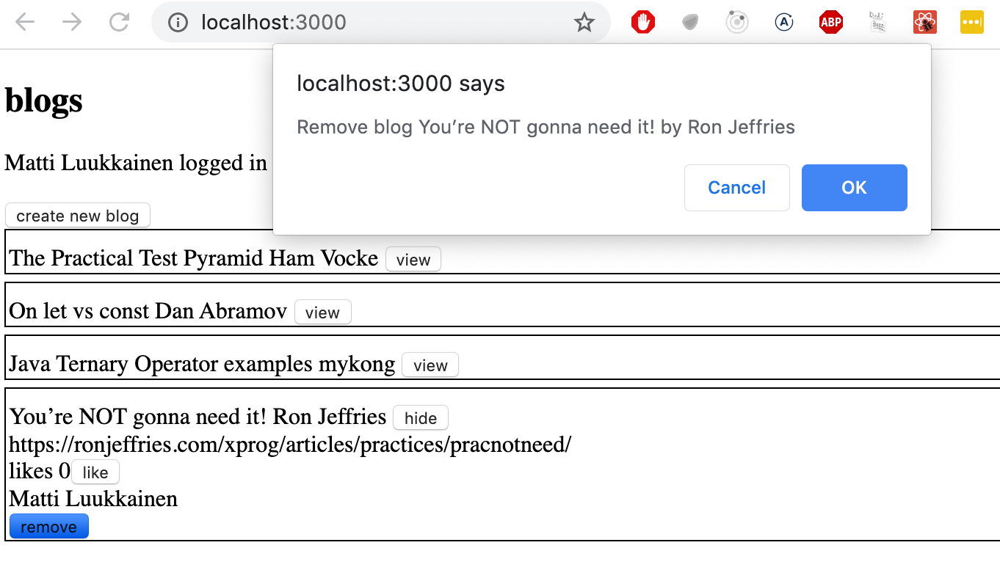
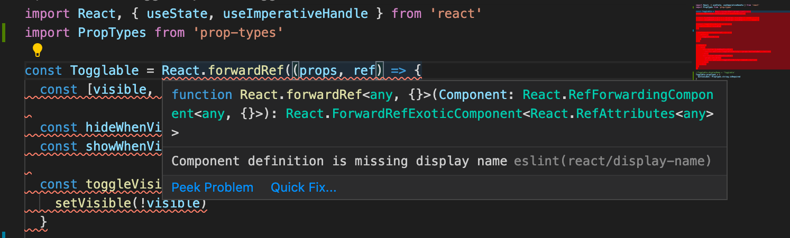
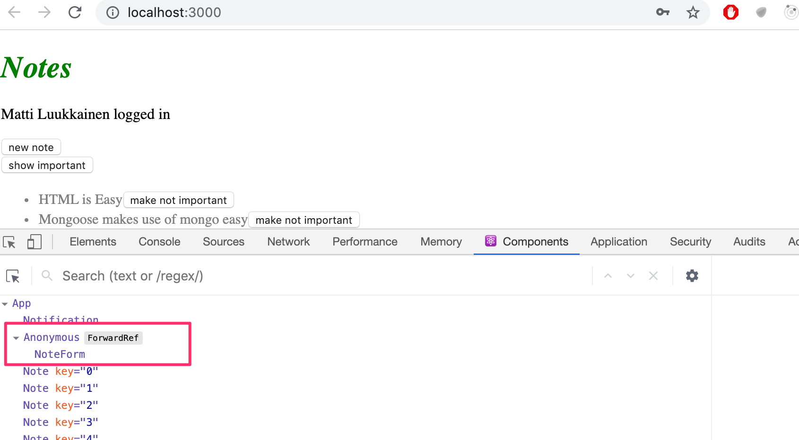

<div class="content">


### Mostrar el formulario de inicio de sesión solo cuando sea apropiado

Modifiquemos la aplicación para que el formulario de inicio de sesión no se muestre por defecto:




El formulario de inicio de sesión aparece cuando el usuario presiona el botón <i>login</i>:




El usuario puede cerrar el formulario de inicio de sesión haciendo clic en el botón <i>cancel</i>.

Comencemos extrayendo el formulario de inicio de sesión en su propio componente:

```js
import React from 'react'

const LoginForm = ({
   handleSubmit,
   handleUsernameChange,
   handlePasswordChange,
   username,
   password
  }) => {
  return (
    <div>
      <h2>Login</h2>

      <form onSubmit={handleSubmit}>
        <div>
          username
          <input
            value={username}
            onChange={handleUsernameChange}
          />
        </div>
        <div>
          password
          <input
            type="password"
            value={password}
            onChange={handlePasswordChange}
          />
      </div>
        <button type="submit">login</button>
      </form>
    </div>
  )
}

export default LoginForm
```


El estado y todas las funciones relacionadas con él se definen fuera del componente y se pasan al componente como props.

Tenga en cuenta que los props se asignan a las variables mediante la <i>desestructuración</i>, lo que significa que en lugar de escribir:

```js
const LoginForm = (props) => {
  return (
    <div>
      <h2>Login</h2>
      <form onSubmit={props.handleSubmit}>
        <div>
          username
          <input
            value={props.username}
            onChange={props.handleChange}
            name="username"
          />
        </div>
        // ...
        <button type="submit">login</button>
      </form>
    </div>
  )
}
```


donde se accede a las propiedades del objeto _props_ mediante, por ejemplo , _props.handleSubmit_, las propiedades se asignan directamente a sus propias variables.

Una forma rápida de implementar la funcionalidad es cambiar la función _loginForm_ del componente <i>App</i> así:

```js
const App = () => {
  const [loginVisible, setLoginVisible] = useState(false) // highlight-line

  // ...

  const loginForm = () => {
    const hideWhenVisible = { display: loginVisible ? 'none' : '' }
    const showWhenVisible = { display: loginVisible ? '' : 'none' }

    return (
      <div>
        <div style={hideWhenVisible}>
          <button onClick={() => setLoginVisible(true)}>log in</button>
        </div>
        <div style={showWhenVisible}>
          <LoginForm
            username={username}
            password={password}
            handleUsernameChange={({ target }) => setUsername(target.value)}
            handlePasswordChange={({ target }) => setPassword(target.value)}
            handleSubmit={handleLogin}
          />
          <button onClick={() => setLoginVisible(false)}>cancel</button>
        </div>
      </div>
    )
  }

  // ...
}
```


El estado de los componentes de <i>App</i> ahora contiene el booleano <i>loginVisible</i>, que define si el formulario de inicio de sesión se debe mostrar al usuario o no.

El valor de loginVisible se alterna con dos botones. Ambos botones tienen sus controladores de eventos definidos directamente en el componente:

```js
<button onClick={() => setLoginVisible(true)}>log in</button>

<button onClick={() => setLoginVisible(false)}>cancel</button>
```


La visibilidad del componente se define dándole al componente una regla de estilo [en línea](/es/part2/adding_styles_to_react_app#inline-styles), donde el valor de la propiedad [display](https://developer.mozilla.org/en-US/docs/Web/CSS/display) es <i>none</i> si no queremos que se muestre el componente:

```js
const hideWhenVisible = { display: loginVisible ? 'none' : '' }
const showWhenVisible = { display: loginVisible ? '' : 'none' }

<div style={hideWhenVisible}>
  // button
</div>

<div style={showWhenVisible}>
  // button
</div>
```


Una vez más estamos utilizando el operador ternario "signo de interrogación". Si _loginVisible_ es <i>true</i>, entonces la regla CSS del componente será:

```css
display: 'none';
```


Si _loginVisible_ es <i>false</i>, <i>display</i> no recibirá ningún valor relacionado con la visibilidad del componente.


### Los componentes hijos, también conocidos como props.children

El código relacionado con la gestión de la visibilidad del formulario de inicio de sesión podría considerarse su propia entidad lógica y, por esta razón, sería bueno extraerlo del componente <i>App</i> en su propio componente independiente.

Nuestro objetivo es implementar un nuevo componente <i>Togglable</i> que se pueda usar de la siguiente manera:

```js
<Togglable buttonLabel='login'>
  <LoginForm
    username={username}
    password={password}
    handleUsernameChange={({ target }) => setUsername(target.value)}
    handlePasswordChange={({ target }) => setPassword(target.value)}
    handleSubmit={handleLogin}
  />
</Togglable>
```


La forma en que se utiliza el componente es ligeramente diferente de nuestros componentes anteriores. El componente tiene etiquetas de apertura y cierre que rodean un componente <i>LoginForm</i>. En la terminología de React, <i>LoginForm</i> es un componente hijo de <i>Togglable</i>.

Podemos agregar cualquier elemento de React que queramos entre las etiquetas de apertura y cierre de <i>Togglable</i>, como este, por ejemplo:

```js
<Togglable buttonLabel="reveal">
  <p>this line is at start hidden</p>
  <p>also this is hidden</p>
</Togglable>
```


El código para el componente <i>Togglable</i> se muestra a continuación:

```js
import React, { useState } from 'react'

const Togglable = (props) => {
  const [visible, setVisible] = useState(false)

  const hideWhenVisible = { display: visible ? 'none' : '' }
  const showWhenVisible = { display: visible ? '' : 'none' }

  const toggleVisibility = () => {
    setVisible(!visible)
  }

  return (
    <div>
      <div style={hideWhenVisible}>
        <button onClick={toggleVisibility}>{props.buttonLabel}</button>
      </div>
      <div style={showWhenVisible}>
        {props.children}
        <button onClick={toggleVisibility}>cancel</button>
      </div>
    </div>
  )
}

export default Togglable
```


La parte nueva e interesante del código es [props.children](https://reactjs.org/docs/glossary.html#propschildren), que se utiliza para hacer referencia a los componentes hijos del componente. Los componentes hijos son los elementos de React que definimos entre las etiquetas de apertura y cierre de un componente.

Esta vez, los hijos se renderizan en el código que se utiliza para renderizar el componente en sí:

```js
<div style={showWhenVisible}>
  {props.children}
  <button onClick={toggleVisibility}>cancel</button>
</div>
```


A diferencia de los props "normales" que hemos visto antes, React agrega automáticamente <i>children</i> y siempre existe. Si un componente se define con una etiqueta _/>_ de cierre automático, como esta:

```js
<Note
  key={note.id}
  note={note}
  toggleImportance={() => toggleImportanceOf(note.id)}
/>
```


Entonces props.children es un array vacío.

El componente <i>Togglable</i> es reutilizable y podemos usarlo para agregar una funcionalidad de alternancia de visibilidad similar al formulario que se usa para crear nuevas notas.

Antes de hacer eso, extraigamos el formulario para crear notas en su propio componente:

```js
const NoteForm = ({ onSubmit, handleChange, value}) => {
  return (
    <div>
      <h2>Create a new note</h2>

      <form onSubmit={onSubmit}>
        <input
          value={value}
          onChange={handleChange}
        />
        <button type="submit">save</button>
      </form>
    </div>
  )
}
```

A continuación, definamos el componente de formulario dentro de un componente <i>Togglable</i>:

```js
<Togglable buttonLabel="new note">
  <NoteForm
    onSubmit={addNote}
    value={newNote}
    handleChange={handleNoteChange}
  />
</Togglable>
```


Puede encontrar el código para nuestra aplicación actual en su totalidad en la rama <i>part5-4</i> de [este repositorio de github](https://github.com/fullstack-hy2020/part2-notes/tree/part5-4).


### Estado de los formularios

El estado de la aplicación se encuentra actualmente en el componente _App_.

La documentación de React dice lo [siguiente](https://reactjs.org/docs/lifting-state-up.html) sobre dónde colocar el estado:

> <i>A menudo, varios componentes deben reflejar los mismos datos cambiantes. Recomendamos elevar el estado compartido a su antepasado común más cercano.</i>

Si pensamos en el estado de los formularios, por ejemplo, el contenido de una nueva nota antes de que se haya creado, el componente _App_ no lo necesita para nada. También podríamos mover el estado de los formularios a los componentes correspondientes.

El componente de una nota cambia así:

```js
import React, {useState} from 'react' 

const NoteForm = ({ createNote }) => {
  const [newNote, setNewNote] = useState('') 

  const handleChange = (event) => {
    setNewNote(event.target.value)
  }

  const addNote = (event) => {
    event.preventDefault()
    createNote({
      content: newNote,
      important: Math.random() > 0.5,
    })

    setNewNote('')
  }

  return (
    <div>
      <h2>Create a new note</h2>

      <form onSubmit={addNote}>
        <input
          value={newNote}
          onChange={handleChange}
        />
        <button type="submit">save</button>
      </form>
    </div>
  )
}

export default NoteForm
```

El atributo de estado <i>newNote</i>  y el controlador de eventos responsable de cambiarlo se han movido del componente _App_ al componente responsable del formulario de nota.

Solo queda una prop, la función _createNote_, que el formulario llama cuando se crea una nueva nota.

El componente _App_ se vuelve más simple ahora que nos hemos deshecho del estado <i>newNote</i> y su controlador de eventos. La función _addNote_ para crear nuevas notas recibe una nueva nota como parámetro, y la función es la única prop que enviamos al formulario:

```js
const App = () => {
  // ...
  const addNote = (noteObject) => {
    noteService
      .create(noteObject)
      .then(returnedNote => {
        setNotes(notes.concat(returnedNote))
      })
  }
  // ...
  const noteForm = () => (
    <Togglable buttonLabel='new note'>
      <NoteForm createNote={addNote} />
    </Togglable>
  )

  // ...
}
```

Podríamos hacer lo mismo con el formulario de inicio de sesión, pero lo dejaremos para un ejercicio opcional.

El código de la aplicación se puede encontrar en [github](https://github.com/fullstack-hy2020/part2-notes/tree/part5-5), rema <i>part5-5</i>.

### Referencias a componentes con ref

Nuestra implementación actual es bastante buena, pero tiene un aspecto que podría mejorarse.

Después de crear una nueva nota, tendría sentido ocultar el nuevo formulario de nota. Actualmente, el formulario permanece visible. Hay un pequeño problema al ocultar el formulario. La visibilidad se controla con la variable <i>visible</i> dentro del componente <i>Togglable</i>. ¿Cómo podemos acceder a él fuera del componente?

Hay muchas formas de implementar el cierre del formulario desde el componente padre, pero usemos el mecanismo [ref](https://reactjs.org/docs/refs-and-the-dom.html) de React, que ofrece una referencia al componente.

Hagamos los siguientes cambios en el componente <i>App</i>:

```js
import React, { useState, useRef } from 'react' // highlight-line

const App = () => {
  // ...
  const noteFormRef = useRef() // highlight-line

  const noteForm = () => (
    <Togglable buttonLabel='new note' ref={noteFormRef}>  // highlight-line
      <NoteForm createNote={addNote} />
    </Togglable>
  )

  // ...
}
```


El hook [useRef](https://reactjs.org/docs/hooks-reference.html#useref) se utiliza para crear una referencia <i>noteFormRef</i>, que se asigna al componente <i>Togglable</i> que contiene el formulario para crear la nota. La variable <i>noteFormRef</i> actúa como referencia al componente. Este hook asegura que se mantenga la misma referencia (ref) en todas las rerenderizaciones del componente.

También realizamos los siguientes cambios en el componente <i>Togglable</i>:

```js
import React, { useState, useImperativeHandle } from 'react' // highlight-line

const Togglable = React.forwardRef((props, ref) => { // highlight-line
  const [visible, setVisible] = useState(false)

  const hideWhenVisible = { display: visible ? 'none' : '' }
  const showWhenVisible = { display: visible ? '' : 'none' }

  const toggleVisibility = () => {
    setVisible(!visible)
  }

// highlight-start
  useImperativeHandle(ref, () => {
    return {
      toggleVisibility
    }
  })
// highlight-end

  return (
    <div>
      <div style={hideWhenVisible}>
        <button onClick={toggleVisibility}>{props.buttonLabel}</button>
      </div>
      <div style={showWhenVisible}>
        {props.children}
        <button onClick={toggleVisibility}>cancel</button>
      </div>
    </div>
  )
})  // highlight-line

export default Togglable
```


La función que crea el componente está envuelta dentro de una llamada de función [forwardRef](https://reactjs.org/docs/react-api.html#reactforwardref). De esta forma el componente puede acceder a la referencia que le está asignada.

El componente usa el hook [useImperativeHandle](https://reactjs.org/docs/hooks-reference.html#useimperativehandle) para que su función <i>toggleVisibility</i> esté disponible fuera del componente.

Ahora podemos ocultar el formulario llamando a n<i>noteFormRef.current.toggleVisibility()</i> después de que se haya creado una nueva nota:

```js
const App = () => {
  // ...
  const addNote = (noteObject) => {
    noteFormRef.current.toggleVisibility() // highlight-line
    noteService
      .create(noteObject)
      .then(returnedNote => {     
        setNotes(notes.concat(returnedNote))
      })
  }
  // ...
}
```

En resumen, la función [useImperativeHandle](https://reactjs.org/docs/hooks-reference.html#useimperativehandle) es un hook de React, que se usa para definir funciones en un componente que se puede invocar desde fuera del componente.

Este truco funciona para cambiar el estado de un componente, pero parece un poco desagradable. Podríamos haber logrado la misma funcionalidad con un código un poco más limpio usando los "viejos" componentes de clase de React. Analizaremos estos componentes de la clase durante la parte 7 del material del curso. Hasta ahora, esta es la única situación en la que el uso de hooks de React conduce a un código que no es más limpio que con los componentes de clase.

También [hay otros casos de uso](https://reactjs.org/docs/refs-and-the-dom.html) para las refs además de acceder a los componentes de React.

Puede encontrar el código para nuestra aplicación actual en su totalidad en la rama <i>part5-6</i> de [este repositorio de github](https://github.com/fullstack-hy2020/part2-notes/tree/part5-6).


### Un punto sobre los componentes

Cuando definimos un componente en React:

```js
const Togglable = () => ...
  // ...
}
```


Y lo usamos así:

```js
<div>
  <Togglable buttonLabel="1" ref={togglable1}>
    first
  </Togglable>

  <Togglable buttonLabel="2" ref={togglable2}>
    second
  </Togglable>

  <Togglable buttonLabel="3" ref={togglable3}>
    third
  </Togglable>
</div>
```

Creamos <i>tres instancias separadas del componente</i> que tienen su propio estado separado:




El atributo <i>ref</i> se utiliza para asignar una referencia a cada uno de los componentes en las variables <i>togglable1</i>, <i>togglable2</i> y <i>togglable3</i>.

</div>

<div class="tasks">


### Ejercicios 5.5.-5.10.


#### 5.5 Frontend de la lista de blogs, paso 5

Cambie el formulario para crear publicaciones de blog para que solo se muestre cuando sea apropiado. Utilice una funcionalidad similar a la que se mostró [anteriormente en esta parte del material del curso](/es/part5/props_children_and_proptypes#displaying-the-login-form-only-when-appropriate). Si desea hacerlo, puede utilizar el componente <i>Togglable</i> definido en la parte 5.

Por defecto, el formulario no es visible


Se expande cuando se hace clic en el botón <i>new note</i>



El formulario se cierra cuando se crea un nuevo blog.

#### 5.6 Frontend de la lista de blogs, paso 6

Separe el formulario para crear un nuevo blog en su propio componente (si aún no lo ha hecho) y mueva todos los estados necesarios para crear un nuevo blog a este componente.

El componente debe funcionar como el componente <i>NoteForm</i> del [material](/es/part5/props_children_and_proptypes) de esta pieza.

#### 5.7 * Frontend de la lista de blogs, paso 7

Agreguemos un botón a cada blog, que controla si se muestran o no todos los detalles sobre el blog.

Los detalles completos del blog se abren cuando se hace clic en el botón.



Y los detalles se ocultan cuando se vuelve a hacer clic en el botón.

En este punto, el botón <i>like</i> no necesita hacer nada.

La aplicación que se muestra en la imagen tiene un poco de CSS adicional para mejorar su apariencia.

Es fácil agregar estilos a la aplicación como se muestra en la parte 2 usando estilos [en línea](/es/part2/adding_styles_to_react_app#inline-styles):

```js
const Blog = ({ blog }) => {
  const blogStyle = {
    paddingTop: 10,
    paddingLeft: 2,
    border: 'solid',
    borderWidth: 1,
    marginBottom: 5
  }

  return (
    <div style={blogStyle}> // highlight-line
      <div>
        {blog.title} {blog.author}
      </div>
      // ...
  </div>
)}
```

**NB:** aunque la funcionalidad implementada en esta parte es casi idéntica a la funcionalidad proporcionada por el componente <i>Togglable</i>, el componente no se puede utilizar directamente para lograr el comportamiento deseado. La solución más sencilla será agregar un estado a la publicación del blog que controla el formulario mostrado de la publicación del blog.

#### 5.8 *: Frontend de la lista de blogs, paso 8

Implemente la funcionalidad para el botón like. Los likes aumentan al hacer un solicitud de HTTP _PUT_ a la dirección única de la publicación del blog en el backend.

Dado que la operación de backend reemplaza toda la publicación del blog, deberá enviar todos sus campos en el cuerpo de la solicitud. Si desea agregar un like a la siguiente publicación del blog:

```js
{
  _id: "5a43fde2cbd20b12a2c34e91",
  user: {
    _id: "5a43e6b6c37f3d065eaaa581",
    username: "mluukkai",
    name: "Matti Luukkainen"
  },
  likes: 0,
  author: "Joel Spolsky",
  title: "The Joel Test: 12 Steps to Better Code",
  url: "https://www.joelonsoftware.com/2000/08/09/the-joel-test-12-steps-to-better-code/"
},
```

Debería realizar una solicitud HTTP PUT a la dirección <i>/api/blogs/5a43fde2cbd20b12a2c34e91</i> con los siguientes datos de solicitud:

```js
{
  user: "5a43e6b6c37f3d065eaaa581",
  likes: 1,
  author: "Joel Spolsky",
  title: "The Joel Test: 12 Steps to Better Code",
  url: "https://www.joelonsoftware.com/2000/08/09/the-joel-test-12-steps-to-better-code/"
}
```

**Una última advertencia:** si nota que está usando async/await y el método _then_ en el mismo código, es casi seguro que está haciendo algo mal. Use uno u otro, y nunca uses ambos al mismo tiempo "por si acaso".

#### 5.9 *: Frontend de la lista de blogs, paso 9

Modifique la aplicación para enumerar las publicaciones del blog por el número de <i>likes</i>. La clasificación de las publicaciones del blog se puede hacer con el método de array [sort](https://developer.mozilla.org/en-US/docs/Web/JavaScript/Reference/Global_Objects/Array/sort).

#### 5.10 *: Frontend de la lista de blogs, paso 10

Agregue un nuevo botón para eliminar publicaciones de blog. También implemente la lógica para eliminar publicaciones del blog en el backend.

Su aplicación podría verse así:



El cuadro de diálogo de confirmación para eliminar una publicación de blog es fácil de implementar con la función [window.confirm](https://developer.mozilla.org/en-US/docs/Web/API/Window/confirm).

Muestre el botón para eliminar una publicación de blog solo si la publicación de blog fue agregada por el usuario.

</div>

<div class="content">

### PropTypes

El componente <i>Togglable</i> asume que se le da el texto para el botón a través del prop <i>buttonLabel</i>. Si nos olvidamos de definirlo al componente:

```js
<Togglable> buttonLabel forgotten... </Togglable>
```

La aplicación funciona, pero el navegador muestra un botón que no tiene texto del label.

Nos gustaría hacer cumplir que cuando se usa el componente <i>Togglable</i>, se debe dar un valor al prop de texto del label del botón.

Los props esperados y requeridos de un componente se pueden definir con el paquete [prop-types](https://github.com/facebook/prop-types). Instalemos el paquete:

```shell
npm install prop-types
```

Podemos definir el prop <i>buttonLabel</i> como un prop obligatorio o <i>required</i> de tipo string como se muestra a continuación:

```js
import PropTypes from 'prop-types'

const Togglable = React.forwardRef((props, ref) => {
  // ..
})

Togglable.propTypes = {
  buttonLabel: PropTypes.string.isRequired
}
```

La consola mostrará el siguiente mensaje de error si el prop se deja sin definir:


La aplicación todavía funciona y nada nos obliga a definir props a pesar de las definiciones de PropTypes. Eso sí, es extremadamente poco profesional dejar <i>cualquier</i> salida roja en la consola del navegador.

También definamos PropTypes para el componente <i>LoginForm</i>:

```js
import PropTypes from 'prop-types'

const LoginForm = ({
   handleSubmit,
   handleUsernameChange,
   handlePasswordChange,
   username,
   password
  }) => {
    // ...
  }

LoginForm.propTypes = {
  handleSubmit: PropTypes.func.isRequired,
  handleUsernameChange: PropTypes.func.isRequired,
  handlePasswordChange: PropTypes.func.isRequired,
  username: PropTypes.string.isRequired,
  password: PropTypes.string.isRequired
}
```

Si el tipo de un prop pasado es incorrecto, por ejemplo, si intentamos definir el prop <i>handleSubmit</i> como un string, esto resultará en la siguiente advertencia:


### ESlint

En la parte 3 configuramos la herramienta de estilo de código para el backend [ESlint](/es/part3/validation_and_es_lint#lint). Tomemos ESlint para usarlo también en el frontend.

Create-react-app ha instalado ESlint en el proyecto de forma predeterminada, por lo que todo lo que nos queda por hacer es definir nuestra configuración deseada en el archivo <i>.eslintrc.js</i>.

*NB:* no ejecute el comando _eslint --init_. ¡Instalará la última versión de ESlint que no es compatible con el archivo de configuración creado por create-react-app!

A continuación, comenzaremos a probar el frontend y para evitar errores de linter no deseados e irrelevantes instalaremos el paquete [eslint-plugin-jest](https://www.npmjs.com/package/eslint-plugin-jest):

```bash
npm install --save-dev eslint-plugin-jest
```

Creemos un archivo <i>.eslintrc.js</i>  con el siguiente contenido:

```js
module.exports = {
  "env": {
      "browser": true,
      "es6": true,
      "jest/globals": true 
  },
  "extends": [ 
      "eslint:recommended",
      "plugin:react/recommended"
  ],
  "parserOptions": {
      "ecmaFeatures": {
          "jsx": true
      },
      "ecmaVersion": 2018,
      "sourceType": "module"
  },
  "plugins": [
      "react", "jest"
  ],
  "rules": {
      "indent": [
          "error",
          2  
      ],
      "linebreak-style": [
          "error",
          "unix"
      ],
      "quotes": [
          "error",
          "single"
      ],
      "semi": [
          "error",
          "never"
      ],
      "eqeqeq": "error",
      "no-trailing-spaces": "error",
      "object-curly-spacing": [
          "error", "always"
      ],
      "arrow-spacing": [
          "error", { "before": true, "after": true }
      ],
      "no-console": 0,
      "react/prop-types": 0
  },
  "settings": {
    "react": {
      "version": "detect"
    }
  }
}
```

NOTA: Si está utilizando Visual Studio Code junto con el plugin ESLint, es posible que deba agregar una configuración de espacio de trabajo adicional para que funcione. Si ve ```Failed to load plugin react: Cannot find module 'eslint-plugin-react'```, necesita una configuración adicional. Agregar la línea ```"eslint.workingDirectories": [{ "mode": "auto" }]``` a settings.json en el espacio de trabajo parece funcionar. Ver [aqui](https://github.com/microsoft/vscode-eslint/issues/880#issuecomment-578052807) para obtener más información.

Vamos a crear un archivo [.eslintignore](https://eslint.org/docs/user-guide/configuring#ignoring-files-and-directories) con el siguiente contenido a la raíz del repositorio

```bash
node_modules
build
```

Ahora los directorios <em>build</em> y <em>node_modules</em> se omitirán al realizar el linting.

Creemos también un script npm para ejecutar el lint:

```js
{
  // ...
  {
    "scripts": {
    "start": "react-scripts start",
    "build": "react-scripts build",
    "test": "react-scripts test",
    "eject": "react-scripts eject",
    "server": "json-server -p3001 db.json",
    "eslint": "eslint ." // highlight-line
  },
  // ...
}
```

El Componente _Togglable_ provoca una advertencia de aspecto desagradable <i>Falta el nombre para mostrar de la definición del componente<i>:



React-devtools también revela que el componente no tiene nombre:



Afortunadamente, esto es fácil de solucionar.

```js
import React, { useState, useImperativeHandle } from 'react'
import PropTypes from 'prop-types'

const Togglable = React.forwardRef((props, ref) => {
  // ...
})

Togglable.displayName = 'Togglable' // highlight-line

export default Togglable
```

Puede encontrar el código para nuestra aplicación actual en su totalidad en la rama <i>part5-7</i> de [este repositorio de github](https://github.com/fullstack-hy2020/part2-notes/tree/part5-7).

</div>

<div class="tasks">

### Ejercicios 5.11.-5.12.

#### 5.11: Frontend de la lista de blogs, paso 11

Define PropTypes para uno de los componentes de su aplicación.

#### 5.12: Frontend de la lista de blogs, paso 12

Agregue ESlint al proyecto. Define la configuración a tu gusto. Corrija todos los errores de linter.

Create-react-app ha instalado ESlint en el proyecto de forma predeterminada, por lo que todo lo que le queda por hacer es definir la configuración deseada en el archivo <i>.eslintrc.js</i>.

*NB:* no ejecute el comando _eslint --init_. ¡Instalará la última versión de ESlint que no es compatible con el archivo de configuración creado por create-react-app!

</div>
