<div class="content">

La interfaz de usuario de nuestra aplicación es actualmente bastante básica:

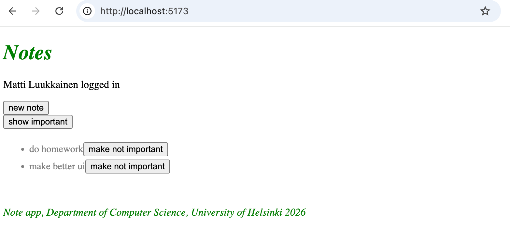

Queremos cambiar eso. Comencemos con la estructura de navegación de la aplicación.

Es muy común que las aplicaciones web tengan una barra de navegación que permite a los usuarios cambiar entre diferentes vistas dentro de la aplicación. Nuestra aplicación para tomar notas podría incluir una página de inicio:

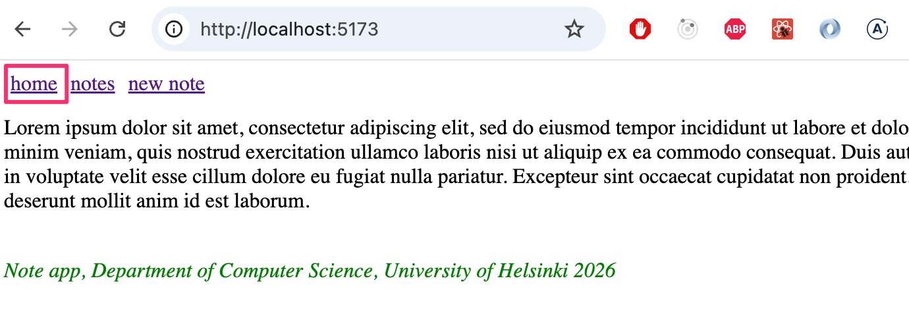

y una página separada para ver notas:


así como una página para crear notas:


[En una aplicación web tradicional](/es/part0/fundamentos_de_las_aplicaciones_web#aplicaciones-web-tradicionales), cambiar entre las páginas mostradas por la aplicación implicaba que el navegador enviara una nueva solicitud HTTP GET al servidor y luego renderizara el código HTML devuelto por el servidor, que correspondía a la nueva vista.

Sin embargo, en las aplicaciones de una sola página, en realidad estás en la misma página todo el tiempo y el código JavaScript ejecutado en el navegador crea la ilusión de diferentes "páginas". Si se realizan solicitudes HTTP al cambiar de vista, se utilizan únicamente para recuperar datos con formato JSON que pueden ser necesarios para mostrar la nueva vista.

Una aplicación con una barra de navegación y múltiples vistas sería fácil de implementar con React, por ejemplo, haciendo que el estado de la aplicación <i>page</i> recuerde en qué página se encuentra el usuario y muestre la vista correcta en función de esto:


```js
const App = () => {
  const [page, setPage] = useState('home')

 const  toPage = (page) => (event) => {
    event.preventDefault()
    setPage(page)
  }

  const content = () => {
    if (page === 'home') {
      return <Home />
    } else if (page === 'notes') {
      return <Notes />
    } else if (page === 'users') {
      return <Users />
    }
  }

  return (
    <div>
      <div>
        <a href="" onClick={toPage('home')} >
          home
        </a>
        <a href="" onClick={toPage('notes')}>
          notes
        </a>
        <a href="" onClick={toPage('users')} >
          users
        </a>
      </div>

      {content()}
    </div>
  )
}
```

Sin embargo, este método no es óptimo: la URL del sitio web sigue siendo la misma incluso cuando estás en una vista diferente. Sin embargo, cada vista debe tener su propia URL para que los usuarios puedan, por ejemplo, marcar páginas como favoritas. Además, el botón Atrás del navegador no funciona lógicamente si las páginas no tienen direcciones propias; es decir, hacer clic en el botón Atrás no lo llevará a la vista de la aplicación vista anteriormente, sino a otro lugar completamente diferente.

### React Router

Afortunadamente, la librería [React Router](https://reactrouter.com/) ofrece una excelente solución para gestionar la navegación en una aplicación React.

Instalemos React Router:

```bash
npm install react-router-dom
```

Creemos un nuevo componente que sirva como página principal de la aplicación.

```js
const Home = () => {
  return (
    <div>
      Lorem ipsum dolor sit amet, consectetur adipiscing elit, sed do eiusmod tempor incididunt ut labore et dolore magna aliqua. Ut enim ad minim veniam, quis nostrud exercitation ullamco laboris nisi ut aliquip ex ea commodo consequat. Duis aute irure dolor in reprehenderit in voluptate velit esse cillum dolore eu fugiat nulla pariatur. Excepteur sint occaecat cupidatat non proident, sunt in culpa qui officia deserunt mollit anim id est laborum.
    </div>
  )
}

export default Home
```

Extraeremos la vista principal anterior de la aplicación (que estaba en el componente <i>App</i>) a su propio componente, pero moveremos el manejo del estado de las notas fuera del componente:

```js
// list of notes passed as a parameter
const NoteList = ({ notes }) => { // highlight-line
  // content mostly the same as in the App component
  // reference to NoteForm is removed
}
```

El componente <i>App</i> ahora cambia de la siguiente manera


```js
import { useState, useEffect } from 'react'
import noteService from './services/notes'

import {
  BrowserRouter as Router,
  Routes, Route, Link
} from 'react-router-dom'
import NoteList from './components/NoteList'
import Home from './components/Home'
import Footer from './components/Footer'
import NoteForm from './components/NoteForm'

const App = () => {
  const [notes, setNotes] = useState([])

  useEffect(() => {
    noteService.getAll().then(initialNotes => {
      setNotes(initialNotes)
    })
  }, [])

  const addNote = noteObject => {
    noteService.create(noteObject).then(returnedNote => {
      setNotes(notes.concat(returnedNote))
    })
  }

  const padding = {
    padding: 5
  }

  return (
    // highlight-start
    <Router>
      <div>
        <Link style={padding} to="/">home</Link>
        <Link style={padding} to="/notes">notes</Link>
        <Link style={padding} to="/create">new note</Link>
      </div>
        // highlight-end  

    // highlight-start
      <Routes>
        <Route path="/notes" element={
          <NoteList notes={notes} />
        } />
        <Route path="/create" element={
          <NoteForm createNote={addNote}/>
        } />
        <Route path="/" element={<Home />} />
      </Routes>

      <Footer />
    </Router>
    // highlight-end
  )
}

export default App
```

El enrutamiento —es decir, el renderizado condicional de componentes según la <i>URL</i> del navegador— se habilita colocando los componentes como hijos de [Router](https://reactrouter.com/api/declarative-routers/Router), dentro de sus etiquetas.

Primero, la barra de navegación de la aplicación se define utilizando el componente [Link](https://reactrouter.com/api/components/Link). El atributo <i>to</i> especifica cómo se cambia la URL del navegador cuando se hace clic en el enlace:

```js
<div>
  <Link style={padding} to="/">home</Link>
  <Link style={padding} to="/notes">notes</Link>
  <Link style={padding} to="/create">new note</Link>
</div>
```

A continuación, el enrutamiento de la aplicación se define utilizando el componente [Routes](https://reactrouter.com/api/components/Routes). Dentro del componente usamos [Route](https://reactrouter.com/api/components/Route) para definir un conjunto de reglas y los componentes que se renderizarán para cada una:

```js
<Routes>
  <Route path="/notes" element={
    <NoteList notes={notes} />
  } />
  <Route path="/create" element={
    <NoteForm createNote={addNote}/>
  } />
  <Route path="/" element={<Home />} />
</Routes>
```

En la URL raíz de la aplicación se renderiza el componente <i>Home</i>:


Al hacer clic en "notas" en la barra de navegación, la dirección del navegador cambia a <i>notes</i> y se renderiza el componente <i>NoteList</i>:


De manera similar, al hacer clic en "nueva nota", la URL pasa a ser <i>create</i> y se renderiza el componente <i>NoteForm</i>.

En una página web normal, cambiar la dirección en la barra de direcciones del navegador hace que la página se vuelva a cargar. Sin embargo, cuando se usa React Router, esto no sucede; en cambio, el enrutamiento se maneja completamente a través de JavaScript en la interfaz.

El componente del enrutador que utilizamos es [BrowserRouter](https://reactrouter.com/en/main/router-components/browser-router):

```js
import {
  BrowserRouter as Router, // highlight-line
  Routes, Route, Link
} from 'react-router-dom'
```

Según la [documentación](https://reactrouter.com/en/main/router-components/browser-router)

> <i>BrowserRouter</i> es un <i>Router</i> que utiliza la API de historial HTML5 (pushState, replaceState y el evento popstate) para mantener su interfaz de usuario sincronizada con la URL.

<i>BrowserRouter</i> utiliza la [API de historial HTML5](https://css-tricks.com/using-the-html5-history-api/) para permitir que la URL en la barra de direcciones del navegador se use para el "enrutamiento" interno dentro de una aplicación React, lo que significa que incluso si la URL en la barra de direcciones cambia, el contenido de la página se manipula únicamente a través de JavaScript y el navegador no carga contenido nuevo desde el servidor. Sin embargo, el comportamiento del navegador con respecto a las funciones de avance y retroceso y los marcadores es intuitivo: funciona igual que en los sitios web tradicionales.

El código actual de la aplicación está disponible en su totalidad en [GitHub](https://github.com/fullstack-hy2020/part2-notes-frontend/tree/part5-10), en la rama <i>part5-10</i>.

### Ruta parametrizada

Movamos los detalles de una sola nota a su propia vista, a la que se puede acceder haciendo clic en el nombre de la nota:


La capacidad de hacer clic en el nombre se ha implementado en el componente <i>NoteList</i> de la siguiente manera:

```js
import { Link } from 'react-router-dom' // highlight-line

const NoteList = ({ notes }) => {
  // ...

  return (
    <div>
      <h1>Notes</h1>
      <Notification message={errorMessage} />

      {!user && loginForm()}

      <div>
        <button onClick={() => setShowAll(!showAll)}>
          show {showAll ? 'important' : 'all'}
        </button>
      </div>
      <ul>
        {notesToShow.map(note => (
          <li key={note.id}>
            <Link to={`/notes/${note.id}`}>{note.content}</Link> // highlight-line
          </li>
        ))}
      </ul>
    </div>
  )
}

export default NoteList
```

Así volvemos a utilizar [Link](https://reactrouter.com/api/components/Link). Por ejemplo, al hacer clic en el nombre de una nota cuyo <i>id</i> es 12345, la URL del navegador se actualiza a <i>notes/12345</i>.

La URL parametrizada se define en el enrutamiento dentro del componente <i>App</i> de la siguiente manera:

```js
<Router>
  // ...

  <Routes>
    // highlight-start
    <Route path="/notes/:id" element={
      <Note notes={notes} toggleImportanceOf={toggleImportanceOf} />
     } />
    // highlight-end
    <Route path="/notes" element={<Notes notes={notes} />} />   
    <Route path="/users" element={user ? <Users /> : <Navigate replace to="/login" />} />
    <Route path="/login" element={<Login onLogin={login} />} />
    <Route path="/" element={<Home />} />      
  </Routes>
</Router>
```

La ruta que representa la vista para una sola nota se define en el "estilo Express" marcando el parámetro de ruta con la notación <i>:id</i> de la siguiente manera:

```js
<Route path="/notes/:id" element={<Note notes={notes} ... />} />
```

Cuando el navegador navega a la URL única de una nota, por ejemplo, <i>/notes/12345</i>, se representa el componente <i>Note</i>, que ahora hemos tenido que modificar ligeramente:

```js
import { useParams } from 'react-router-dom' // highlight-line

const Note = ({ notes, toggleImportance }) => {
  // highlight-start
  const id = useParams().id
  const note = notes.find(n => n.id === id)
  // highlight-end

  const label = note.important ? 'make not important' : 'make important'

  return (
    <li className="note">
      <span>{note.content}</span>
      <button onClick={() => toggleImportance(id)}>{label}</button>
    </li>
  )
}

export default Note
```

A diferencia de antes, el componente <i>Note</i> ahora recibe todas las notas mediante la prop <i>notes</i> y puede acceder a la parte variable de la URL —en concreto, el <i>id</i> de la nota que se mostrará— mediante el hook [useParams](https://reactrouter.com/api/hooks/useParams) de React Router.

### useNavigate

El backend ya admite la eliminación de notas. Para implementar esto, agreguemos un botón a la página de notas individuales en la aplicación:

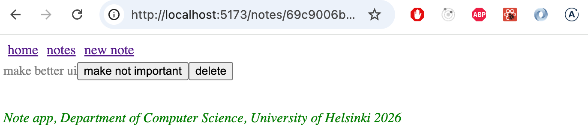

Agreguemos un controlador al componente <i>App</i> que realiza la eliminación y pasémoslo al componente <i>Note</i>:

```js
const App = () => {

  // highlight-start
  const deleteNote = (id) => {
    noteService.remove(id).then(() => {
      setNotes(notes.filter(n => n.id !== id))
    })
  }
  // highlight-end

  return (
      // ...

      <Routes>
        <Route path="/notes/:id" element={
          <Note 
            notes={notes}
            toggleImportanceOf={toggleImportanceOf}
            deleteNote={deleteNote} // highlight-line
          />
        } />
        <Route path="/notes" element={
          <NoteList notes={notes} />
        } />
        <Route path="/create" element={
          <NoteForm createNote={addNote}/>
        } />
        <Route path="/" element={<Home />} />
      </Routes>

      <Footer />
    </Router>
  )
}  
```

El componente <i>Note</i> cambia de la siguiente manera:

```js
import { useParams, useNavigate } from 'react-router-dom'

const Note = ({ notes, toggleImportanceOf, deleteNote }) => { // highlight-line
  const id = useParams().id
  const navigate = useNavigate()  // highlight-line
  const note = notes.find(n => n.id === id)

  const label = note.important ? 'make not important' : 'make important'

// highlight-start
  const handleDelete = () => {
    if (window.confirm(`Delete note "${note.content}"?`)) {
      deleteNote(id)
      navigate('/notes')
    }
  }
  // highlight-end

  return (
    <li className="note">
      <span>{note.content}</span>
      <button onClick={() => toggleImportanceOf(id)}>{label}</button>
      <button onClick={handleDelete}>delete</button>  // highlight-line
    </li>
  )
}

export default Note
```

Cuando se elimina una nota, el usuario regresa a la página que enumera todas las notas. Esto se hace llamando a la función devuelta por [useNavigate](https://reactrouter.com/api/components/Navigate) de React Router con la URL deseada: <i>navigate('/notes')</i>.

Las funciones [useParams](https://reactrouter.com/api/hooks/useParams) y [useNavigate](https://reactrouter.com/api/components/Navigate) de React Router son hooks, al igual que useState y useEffect, que ya hemos utilizado muchas veces. Como vimos en la parte 1, existen ciertas [reglas](/es/part1/un_estado_mas_complejo_depurando_aplicaciones_react#reglas-de-los-hooks) asociadas al uso de hooks.

Modifiquemos también el componente <i>NoteForm</i> para que después de agregar una nueva nota, el usuario acceda a la página que contiene todas las notas:

```js
import { useState } from 'react' 
import { useNavigate } from 'react-router-dom' // highlight-line

const NoteForm = ({ createNote }) => {
  const [newNote, setNewNote] = useState('')
  const navigate = useNavigate() // highlight-line

  const addNote = event => {
    event.preventDefault()
    createNote({
      content: newNote,
      important: true
    })

    navigate('/notes') // highlight-line
    setNewNote('')
  }

  return (
    <div>
      <h2>Create a new note</h2>

      <form onSubmit={addNote}>
        <input
          value={newNote}
          onChange={event => setNewNote(event.target.value)}
          placeholder="write note content here"
        />
        <button type="submit">save</button>
      </form>
    </div>
  )
}
```

### Ruta parametrizada revisada

Hay un problema ligeramente molesto con la aplicación. El componente _Note_ recibe <i>all notes</i> como props, aunque solo muestra aquella cuyo <i>id</i> coincide con la parte parametrizada de la URL:

```js
const Note = ({ notes, toggleImportance }) => { 
  const id = useParams().id
  const note = notes.find(n => n.id === Number(id))
  // ...
}
```

¿Sería posible modificar la aplicación para que _Note_ reciba solo la nota que se mostrará como prop?

```js
import { useParams, useNavigate } from 'react-router-dom'

const Note = ({ note, id, toggleImportanceOf, deleteNote }) => {  // highlight-line
  const id = useParams().id
  const navigate = useNavigate()

  // ...

  return (
    <li className="note">
      <span>{note.content}</span>
      <button onClick={() => toggleImportanceOf(id)}>{label}</button>
      <button onClick={handleDelete}>delete</button>
    </li>
  )
}

export default Note
```

Una posibilidad es determinar dentro del componente el <i>id</i> de la nota que se mostrará mediante el hook [useMatch](https://reactrouter.com/en/main/hooks/use-match) de React Router.

No es posible utilizar el hook <i>useMatch</i> en el mismo componente que define la parte enrutable de la aplicación. Movamos el componente <i>Router</i> fuera de <i>App</i>:

```js
ReactDOM.createRoot(document.getElementById('root')).render(
  <Router> // highlight-line
    <App />
  </Router> // highlight-line
)
```

El componente <i>App</i> se convierte en:

```js
import {
  // ...
  useMatch  // highlight-line
} from 'react-router-dom'

const App = () => {
  // ...

 // highlight-start
  const match = useMatch('/notes/:id')

  const note = match
    ? notes.find(note => note.id === match.params.id)
    : null
  // highlight-end

  return (
    <div>
      <div>
        <Link style={padding} to="/">home</Link>
        // ...
      </div>

      <Routes>
        <Route path="/notes/:id" element={
          <Note
            note={note} // highlight-line
            toggleImportanceOf={toggleImportanceOf}
            deleteNote={deleteNote}
          />
        } />
        <Route path="/notes" element={
          <NoteList notes={notes} />
        } />
        <Route path="/create" element={
          <NoteForm createNote={addNote}/>
        } />
        <Route path="/" element={<Home />} />
      </Routes>

      <div>
        <em>Note app, Department of Computer Science 2026</em>
      </div>
    </div>
  )
}    
```

Cada vez que se renderiza el componente <i>App</i> (lo que, en la práctica, ocurre cada vez que cambia la URL en la barra de direcciones del navegador) se ejecuta el siguiente comando

```js
const match = useMatch('/notes/:id')
```

Si la URL tiene el formato _/notes/:id_, es decir, corresponde a la URL de una sola nota, a la variable <i>match</i> se le asigna un objeto que puede usarse para determinar la parte parametrizada de la ruta, es decir, el <i>id</i> de la nota. Esto nos permite recuperar la nota a renderizar:

```js
const note = match 
  ? notes.find(note => note.id === match.params.id)
  : null
```


Todavía hay un pequeño error en nuestra aplicación. Si el navegador se recarga en una sola página de notas, se produce un error:


El problema surge porque se intenta representar la página antes de que se hayan obtenido las notas del backend. Podemos resolver este problema con renderizado condicional:

```js
const Note = ({ note, toggleImportanceOf, deleteNote }) => {
  const id = useParams().id
  const navigate = useNavigate()

// highlight-start
  if(!note) {
    return null
  }
  // highlight-end

  return (
    //...
  )
}
```

La aplicación tiene una característica más molesta: la lógica de inicio de sesión todavía está en la página que enumera las notas. Sin embargo, dejaremos la funcionalidad en este estado algo incompleto por ahora.

El código actual de la aplicación está disponible en su totalidad en [GitHub](https://github.com/fullstack-hy2020/part2-notes-frontend/tree/part5-11), en la rama <i>part5-11</i>.

</div>

<div class="tasks">

### Ejercicios 5.24–5.28.

#### 5.24: blogs enrutados, paso 1

Añade React Router a la aplicación de blogs para que los enlaces de la barra de navegación controlen qué vista se muestra.

En la raíz de la aplicación, es decir, la ruta _/_, se muestra una lista de todos los blogs:

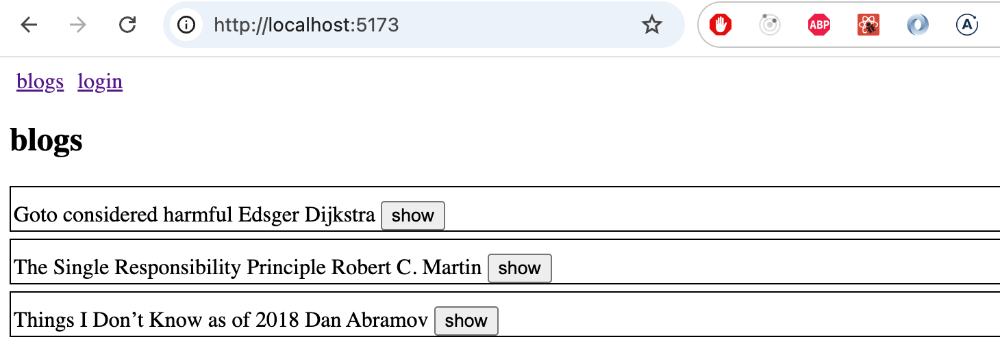

La ruta _/login_ permite a los usuarios iniciar sesión

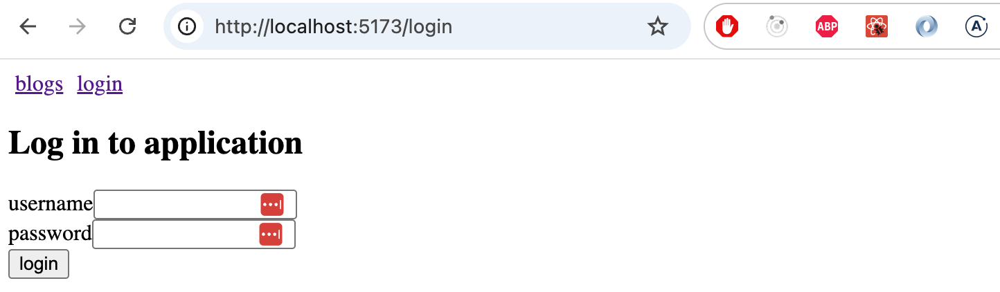

Si el usuario ha iniciado sesión, aparece un botón de cierre de sesión en la barra de navegación:

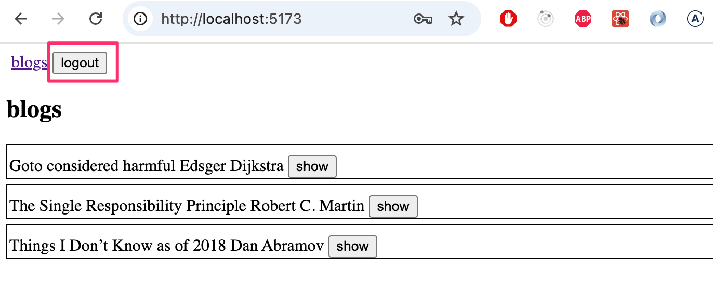

Después de iniciar y cerrar sesión, el usuario debe ser dirigido a la página que enumera todos los blogs.

En esta etapa, todavía no necesita preocuparse por crear blogs.

#### 5.25: blogs enrutados, paso 2

Implementa una vista que muestre la información de una única publicación del blog:


Los usuarios navegan a la vista de publicación de blog única desde la lista de blogs:

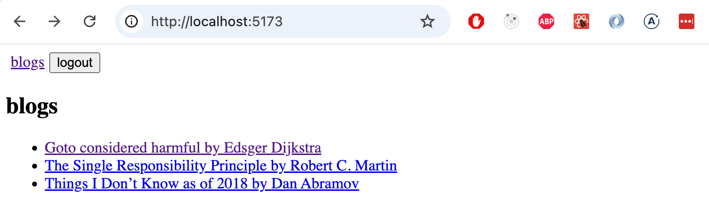

¡Asegúrate de que la función "Me gusta" para blogs todavía funcione! También modifique la funcionalidad para que sólo los usuarios que hayan iniciado sesión puedan darle "Me gusta" a un blog.

#### 5.26: blogs enrutados, paso 3

Crea una nueva vista para añadir blogs a la que puedan acceder desde la navegación los usuarios que hayan iniciado sesión:

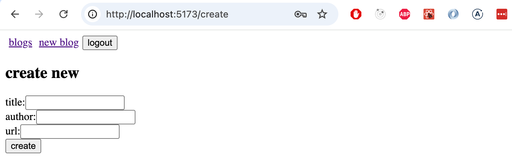

Agregar un blog nuevo y eliminar un blog existente debería redirigir al usuario a la vista de todos los blogs.

#### 5.27: blogs enrutados, paso 4

La usabilidad y apariencia de la aplicación ahora son mejores que antes. Desafortunadamente, algunas de las pruebas han fallado.

Ahora modifique las pruebas para la vista de blog única creada en Vitest de la siguiente manera
- La información del blog y la cantidad de Me gusta se muestran a los usuarios no autenticados, los botones no se muestran
- A los usuarios autenticados que no son los creadores del blog se les muestra solo el botón Me gusta.
- Al creador del blog también se le muestra el botón de eliminar.

#### 5.28: blogs enrutados, paso 5

El siguiente paso es arreglar las pruebas de un extremo a otro creadas con Playwright. Las pruebas que escribimos anteriormente no funcionan por completo y tendremos que realizarles cambios importantes.

Crea pruebas para los siguientes escenarios:
- El inicio de sesión se realizó correctamente con la combinación correcta de nombre de usuario y contraseña.
- El inicio de sesión falla si el nombre de usuario/contraseña es incorrecto
- Un usuario que haya iniciado sesión puede crear un blog.
- A un usuario que haya iniciado sesión le pueden gustar los blogs.
- Un usuario que haya iniciado sesión puede eliminar un blog.

Por lo tanto, la clasificación de blogs por Me gusta no se está probando en este momento.

</div>

<div class="content">

### Librerías de UI

En la parte 2 ya vimos dos formas de añadir estilos: mediante un [único archivo CSS](/es/part2/agregar_estilos_a_la_aplicacion_react) tradicional y mediante [estilos en línea](/es/part2/agregar_estilos_a_la_aplicacion_react#estilos-en-linea). En esta sección veremos algunas formas más.

Una forma de definir los estilos de una aplicación es utilizar un framework de UI, es decir, una librería de estilos para interfaces de usuario.

El primer framework de UI que alcanzó una gran popularidad fue [Bootstrap](https://getbootstrap.com/), desarrollado por Twitter. Durante los últimos años, los frameworks de UI han proliferado. La selección es tan amplia que ni siquiera merece la pena intentar enumerarlos todos aquí.

Muchos marcos de UI incluyen temas predefinidos para aplicaciones web, así como "componentes", como botones, menús y tablas. El término "componente" está escrito entre comillas arriba porque no se refiere a lo mismo que un componente de React. La mayoría de las veces, los marcos de UI se utilizan incluyendo las hojas de estilo CSS del marco y el código JavaScript en la aplicación.

Muchos marcos de UI se han adaptado a versiones compatibles con React, donde los "componentes" definidos por el marco de UI se han convertido en componentes de React. Por ejemplo, hay un par de versiones React de Bootstrap, la más popular de las cuales es [React-Bootstrap](https://react-bootstrap.github.io/).

En lugar de Bootstrap, veamos el que quizá sea actualmente el framework de UI más popular: la librería para React [Material UI](https://mui.com/), que implementa el lenguaje de diseño [Material Design](https://material.io/) de Google.

Instalemos la librería:

```bash
npm install @mui/material @emotion/react @emotion/styled
```

Cuando se utiliza Material UI, todo el contenido de la aplicación suele renderizarse dentro del componente [Container](https://mui.com/material-ui/react-container/):

```js
import { Container } from '@mui/material'

const App = () => {
  // ...
  return (
    <Container>
      // ...
    </Container>
  )
}
```

#### Tabla

Comencemos con el componente <i>NoteList</i> y rendericemos la lista de notas como una [tabla](https://mui.com/material-ui/react-table/#simple-table), que también muestra el usuario que creó cada nota:

```js
import { useState, useEffect } from 'react'

import { Table, TableBody, TableCell, TableContainer, TableHead, TableRow, Paper } from '@mui/material'

//...

const NoteList = ({ notes }) => {

  // ...

  return (
    <div>
      // ...
      <h2>Notes</h2>

      <TableContainer component={Paper}>
        <Table>
          <TableHead>
            <TableRow>
              <TableCell>content</TableCell>
              <TableCell>user</TableCell>
              <TableCell>important</TableCell>
            </TableRow>
          </TableHead>
          <TableBody>
            {notes.map(note => (
              <TableRow key={note.id}>
                <TableCell>
                  <Link to={`/notes/${note.id}`}>
                    {note.content}
                  </Link>
                </TableCell>
                <TableCell>
                  {note.user.name}
                </TableCell>
                <TableCell>
                  {note.important ? 'yes': ''}
                </TableCell>
              </TableRow>
            ))}
          </TableBody>
        </Table>
      </TableContainer>

    </div>
  )
}

export default NoteList
```

La tabla se ve así:

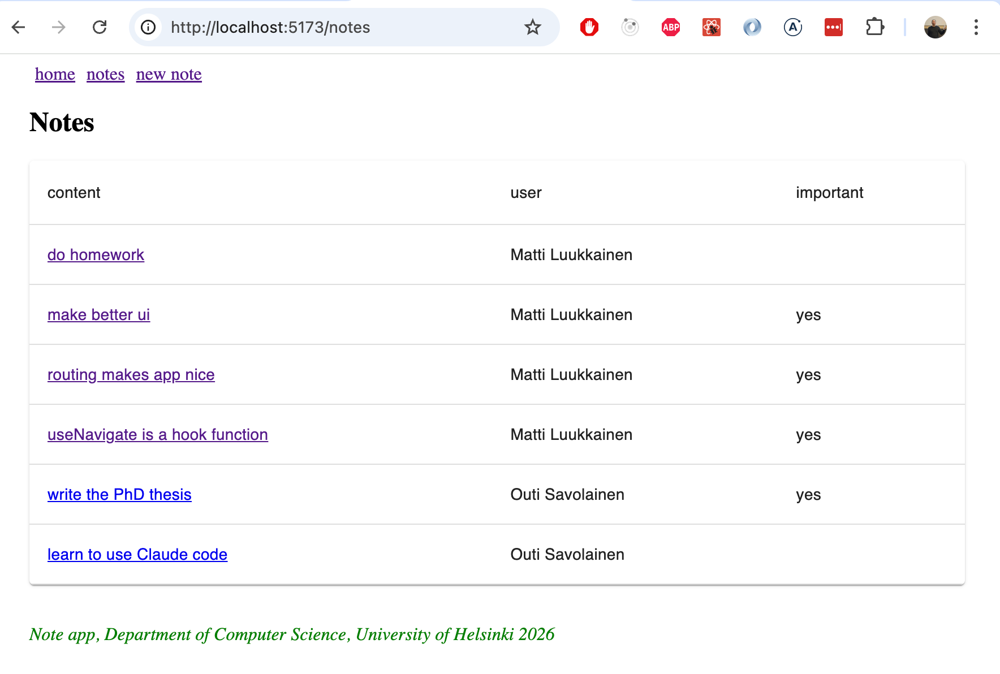


#### Formulario

A continuación, mejoremos la vista para crear una nueva nota <i>NoteForm</i> usando los componentes [TextField](https://mui.com/components/text-fields/) y [Button](https://mui.com/api/button/):

```js 
import { TextField, Button } from '@mui/material'

// ...

const NoteForm = ({ createNote }) => {
  // ...

  return (
    <div>
      <h2>Create a new note</h2>

      <form onSubmit={addNote}>
        <TextField
          label="note content"
          value={newNote}
          onChange={event => setNewNote(event.target.value)}
        />
        <div>
          <Button type="submit" variant="contained" style={{ marginTop: 10 }}>
            save
          </Button>
        </div>
      </form>
    </div>
  )
}

export default NoteForm

```

El resultado es elegante:


#### Notificaciones


Mejoremos el componente de notificación mediante el componente [Alert](https://mui.com/material-ui/react-alert/) de Material UI:

```js
import { Alert } from '@mui/material'

const Notification = ({ notification }) => {
  if (notification === null) {
    return null
  }

  return (
    <Alert style={{ marginTop: 10, marginBottom: 10 }} severity={notification.type}>
      {notification.text}
    </Alert>
  )
}

export default Notification
```

Mueva el componente de notificación y su gestión de estado al componente <i>App</i>:

```js
const App = () => {
  const [notes, setNotes] = useState([])
  const [notification, setNotification] = useState(null) // highlight-line

  // ...

  const addNote = noteObject => {
    noteService.create(noteObject).then(returnedNote => {
      setNotes(notes.concat(returnedNote))
      setNotification({ text: `Note '${returnedNote.content}' added!`, type: 'success' }) // highlight-line
      setTimeout(() => {
        setNotification(null)
      }, 5000)
    })
  }

  return (
    <Container>
      <div>
        <Link style={padding} to="/">home</Link>
        <Link style={padding} to="/notes">notes</Link>
        <Link style={padding} to="/create">new note</Link>
      </div>

      <Notification notification={notification} /> // highlight-line

      <Routes>
        <Route path="/notes/:id" element={
          <Note
            note={note}
            toggleImportanceOf={toggleImportanceOf}
            deleteNote={deleteNote}
          />
        } />
        <Route path="/notes" element={
          <NoteList notes={notes} setNotification={setNotification} />
        } />
        <Route path="/create" element={
          <NoteForm createNote={addNote} />
        } />
        <Route path="/" element={<Home />} />
      </Routes>

      <Footer />
    </Container>
  )
}
```

Alert tiene un diseño elegante:


#### Menú de navegación

El menú de navegación se implementa utilizando el componente [AppBar](https://mui.com/components/app-bar/).

Si aplicamos el ejemplo de la documentación directamente

```js
<AppBar position="static">
  <Toolbar>
    <Button color="inherit"><Link to="/">home</Link></Button>
    <Button color="inherit"><Link to="/notes">notes</Link></Button>
    <Button color="inherit"><Link to="/create">new note</Link></Button>
  </Toolbar>
</AppBar>
```

Esto proporciona una solución funcional, pero su apariencia no es la mejor posible:

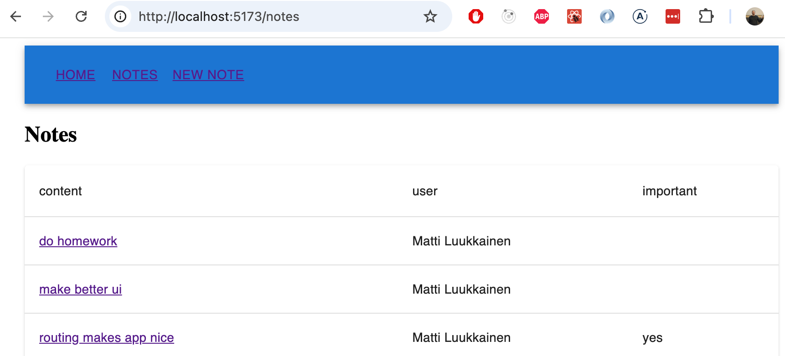

En la [documentación](https://mui.com/material-ui/guides/composition/#routing-libraries) encontramos una alternativa mejor: la [prop component](https://mui.com/material-ui/guides/composition/#component-prop), que permite cambiar cómo se renderiza el elemento raíz de un componente de Material UI.

Al definir

```js
<Button color="inherit" component={Link} to="/">
  home
</Button>
```

El componente <i>Button</i> se renderiza usando como raíz el componente <i>Link</i> de <i>react-router-dom</i>, al que se pasa la prop <i>to</i> que especifica la ruta.

El código completo para la barra de navegación es el siguiente

```js
<AppBar position="static">
  <Toolbar>
    <Button color="inherit" component={Link} to="/">home</Button>
    <Button color="inherit" component={Link} to="/notes">notes</Button>
    <Button color="inherit" component={Link} to="/create">new note</Button>
  </Toolbar>
</AppBar>
```

y el resultado se ve tal como queremos:

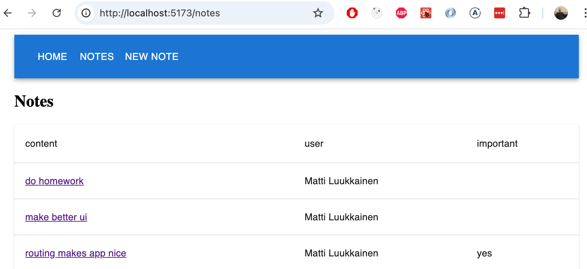

Sin embargo, notamos que cuando se mueve el mouse sobre la barra de navegación, el indicador de desplazamiento es demasiado sutil. Arreglemos esto definiendo un color de fondo ligeramente mejor para estas situaciones:

```js
const style = { '&:hover': { bgcolor: 'rgba(255,255,255,0.3)' } }

return (
  <Container>
    <AppBar position="static">
      <Toolbar>
        <Button color="inherit" component={Link} to="/" sx={style}>
          home
        </Button>
        <Button color="inherit" component={Link} to="/notes" sx={style}>
          notes
        </Button>
        <Button color="inherit" component={Link} to="/create" sx={style}>
          new note
        </Button>
      </Toolbar>
    </AppBar>

    // ...
)
```

Finalmente estamos satisfechos:


El código actual de la aplicación está disponible en su totalidad en [GitHub](https://github.com/fullstack-hy2020/part2-notes-frontend/tree/part5-12), en la rama <i>part5-12</i>.


### Styled Components

Además de lo que ya hemos visto, existen [otras formas](https://blog.bitsrc.io/5-ways-to-style-react-components-in-2019-30f1ccc2b5b) de aplicar estilos a una aplicación React.

La librería [styled-components](https://www.styled-components.com/), que utiliza la sintaxis [literal de plantilla etiquetada](https://developer.mozilla.org/en-US/docs/Web/JavaScript/Reference/Template_literals) de ES6, ofrece un enfoque interesante para definir estilos.

[Instalemos](https://styled-components.com/docs/basics#installation) Styled Components y utilicémoslo para realizar algunos cambios de estilo en la aplicación de notas (la versión anterior a la instalación de Material UI). Primero, creemos dos definiciones de estilo para los componentes que usaremos:

```js
import styled from 'styled-components'

const Button = styled.button`
  background: Bisque;
  font-size: 1em;
  margin: 1em;
  padding: 0.25em 1em;
  border: 2px solid Chocolate;
  border-radius: 3px;
`

const Input = styled.input`
  margin: 0.25em;
  width: 300px;  
`
```

El código crea versiones de los elementos HTML <i>button</i> y <i>input</i> con estilo y los asigna a las variables <i>Button</i> y <i>Input</i>.

La sintaxis para definir estilos es bastante interesante, ya que las definiciones CSS se colocan entre comillas invertidas. Esta es la sintaxis de los [literales de plantilla etiquetados](https://developer.mozilla.org/en-US/docs/Web/JavaScript/Reference/Template_literals) de ES6.

Los componentes definidos funcionan como elementos normales <i>button</i> y <i>input</i>, y se utilizan en la aplicación de la forma habitual:


```js
const NoteForm = ({ createNote }) => {
  // ...

  return (
    <div>
      <h2>Create a new note</h2>

      <form onSubmit={addNote}>
        <Input> // highlight-line
          value={newNote}
          onChange={event => setNewNote(event.target.value)}
          placeholder="write note content here"
        />
        <Button type="submit">save</Button> // highlight-line
      </form>
    </div>
  )
}
```

El formulario ahora se ve así:

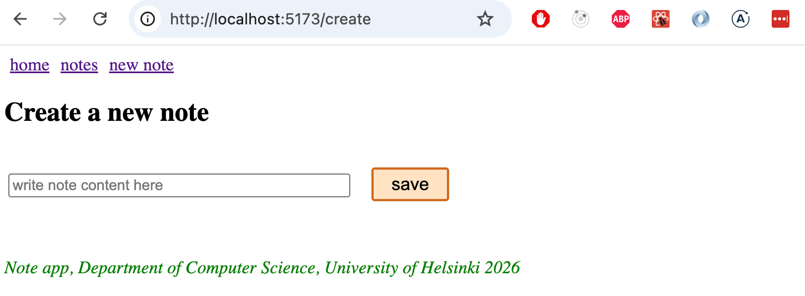

Definamos los siguientes componentes para agregar estilos, todos los cuales son versiones mejoradas de los elementos <i>div</i>:

```js
const Page = styled.div`
  padding: 1em;
  background: papayawhip;
`

const Navigation = styled.div`
  background: BurlyWood;
  padding: 1em;
`

const Footer = styled.div`
  background: Chocolate;
  padding: 1em;
  margin-top: 1em;
`
```

Los nuevos componentes ahora se pueden utilizar en la aplicación:

```js
const App = () => {
  // ...

  return (
    <Page> // highlight-line
      <Navigation> // highlight-line
        <Link style={padding} to="/">home</Link>
        <Link style={padding} to="/notes">notes</Link>
        <Link style={padding} to="/create">new note</Link>
      </Navigation> // highlight-line

      <Routes>
        <Route path="/notes/:id" element={
          <Note
            note={note}
            toggleImportanceOf={toggleImportanceOf}
            deleteNote={deleteNote}
          />
        } />
        <Route path="/notes" element={
          <NoteList notes={notes} />
        } />
        <Route path="/create" element={
          <NoteForm createNote={addNote}/>
        } />
        <Route path="/" element={<Home />} />
      </Routes>
// highlight-start
      <Footer>
         Note app, Department of Computer Science, University of Helsinki 2026
      </Footer>
    </Page>
    // highlight-end
  )
}
```

El resultado final es el siguiente:


Styled-Components ha ido ganando popularidad últimamente y actualmente parece que mucha gente lo considera la mejor manera de definir estilos para aplicaciones React.

</div>

<div class="tasks">

### Ejercicios 5.29–5.31

A continuación, mejora los estilos de la aplicación de blogs utilizando Material UI o Styled Components.

#### 5.29: blogs con estilo, paso 1

Añade estilos a los formularios de la aplicación.

Su solución podría verse así. Formulario de inicio de sesión:

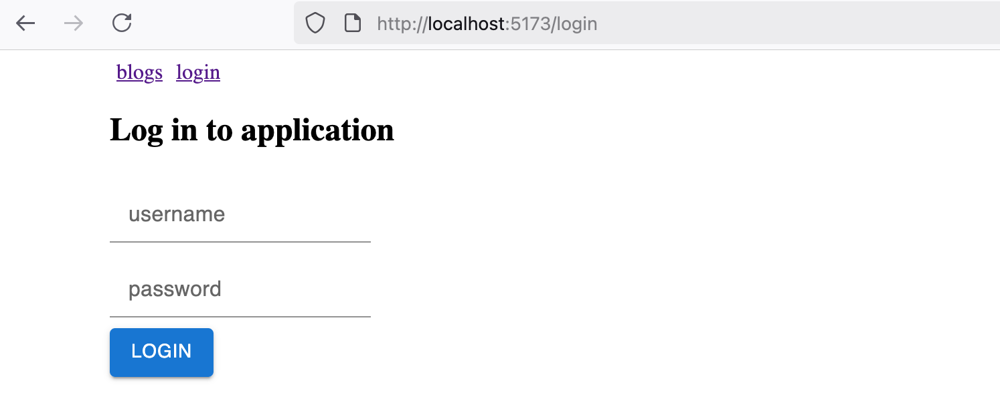

Creando un nuevo blog:


#### 5.30: blogs con estilo, paso 2

Ahora diseña la barra de navegación de la aplicación y el componente que muestra las notificaciones. El resultado podría verse así:


#### 5.31: blogs con estilo, paso 3

Personaliza como prefieras la apariencia del componente que muestra un único blog. Este es un ejemplo:


Este fue el último ejercicio de la sección; es hora de enviar el código a GitHub y marcar los ejercicios completados en el [sistema de envío de ejercicios](https://studies.cs.helsinki.fi/stats/courses/fullstackopen).

</div>
