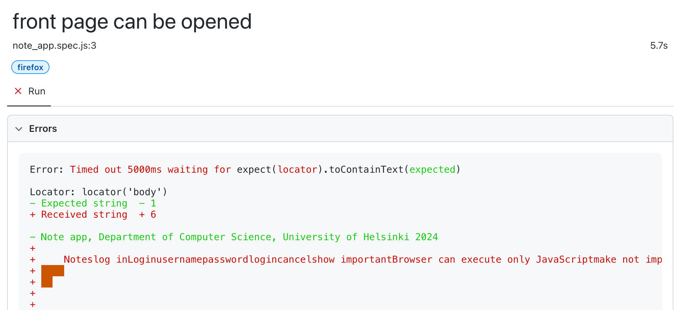
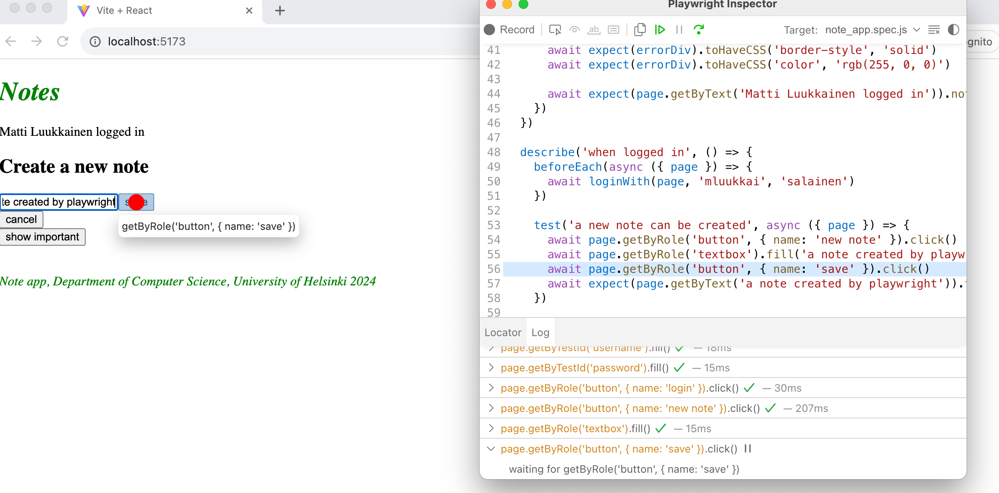
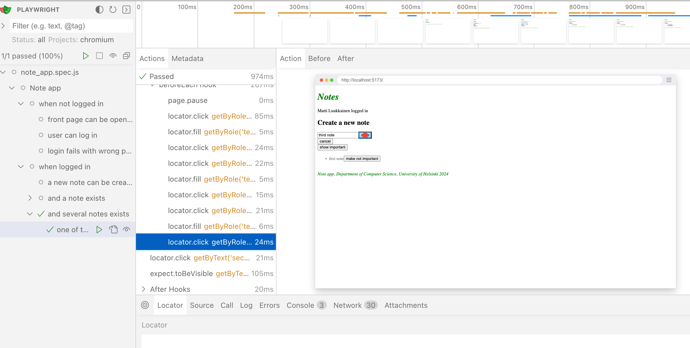

<div class="content">

[Playwright](https://playwright.dev/) on siis End to end -testien uusi tulokas, jonka suosio lähti vuoden 2023 loppupuolella räjähdysmäiseen nousuun. Playwright on käytön helppoudessa suurin piirtein Cypressin tasolla. Toimintaperiaatteeltaan kirjastot poikkeavat hieman toisistaan.  Cypressin toimintaperiaate poikkeaa radikaalisti useimmista E2E-testaukseen sopivista kirjastoista, sillä Cypress-testit ajetaan kokonaisuudessaan selaimen sisällä. Playwrightin testit suoritetaan Node-prosessissa, joka on yhteydessä selaimeen ohjelmointirajapintojen kautta.

Kirjastojen vertailuista on kirjoitettu monia blojeja, esim. [tämä](https://www.lambdatest.com/blog/cypress-vs-playwright/) ja [tämä](https://www.browserstack.com/guide/playwright-vs-cypress).

On vaikea sanoa kumpi kirjastoista on parempi. Eräs Playwrightin etu on sen selaintuki, Playwright tukee Chromea, Firefoxia ja Webkit-pohjaisia selaimia kuten Safaria. Nykyisin Cypress sisältää tuen kaikkiin näihin selaimiin, Webkit-tuki on tosin vasta kokeellinen ja ei tue kaikkia Cypressin ominaisuuksia.

Tutustutaan nyt Playwrightin käyttöön.

### Testien alustaminen

Toisin kuin React-frontille tehdyt yksikkötestit tai backendin tekstit, nyt tehtävien End to End -testien ei ei tarvitse sijaita samassa npm-projektissa missä koodi on. Tehdään nyt E2E-testeille kokonaan oma projekti komennolla _npm init_.  Asennetaan sitten Playwright suorittamalla suorittamalla uuden projektin hakemisstossa komento

```js
npm init playwright@latest
```

Asennusskripti kysyy muutamaa kysymystä, vastataan niihin seuraavasti:


Määritellään npm-skripti testien suorittamista sekä testiraportteja varten
```js
{
  // ...
  "scripts": {
    "test": "playwright test",
    "test:report": "playwright show-report"
  },
  // ...
}
```

Asennuksen yhteydessä konsoliin tulostui

```
And check out the following files:
  - ./tests/example.spec.js - Example end-to-end test
  - ./tests-examples/demo-todo-app.spec.js - Demo Todo App end-to-end tests
  - ./playwright.config.js - Playwright Test configuration
```

eli asennus valmiiksi muutaman esimerkkitestin. Suoritetaan testit:

```
$ npm test

> notes-e2e@1.0.0 test
> playwright test


Running 6 tests using 5 workers
  6 passed (3.9s)

To open last HTML report run:

  npx playwright show-report
```

Testit menevät läpi. Tarkempi testiraportti voidaa avata joko tulostuksen ehdottamalla komennolla, tai äsken määrittelemällämme npm-skriptillä:

```
npm run test:report
```

Testit voidaan myös suorittaa graafisen UI:n kautta komennolla

```
npm run test -- --ui
```

Esimerkkitestit näyttävät seuraavanlaisilta:

```js
const { test, expect } = require('@playwright/test');

test('has title', async ({ page }) => {
  await page.goto('https://playwright.dev/');

  // Expect a title "to contain" a substring.
  await expect(page).toHaveTitle(/Playwright/);
});

test('get started link', async ({ page }) => {
  await page.goto('https://playwright.dev/');

  // Click the get started link.
  await page.getByRole('link', { name: 'Get started' }).click();

  // Expects page to have a heading with the name of Installation.
  await expect(page.getByRole('heading', { name: 'Installation' })).toBeVisible();
});
```

Testit siis testaavat osoitteessa https://playwright.dev/ olevaa sivua.

### Oman koodin testaaminen

Poistetaan nyt esimerkkitestit ja aloitetaan oman sovelluksemme testaaminen.

Playwright-testit olettavat että testattava järjestelmä on käynnissä kun testit suoritetaan, eli toisin kuin esim. backendin integraatiotestit, Playwright-testit <i>eivät käynnistä</i> testattavaa järjestelmää testauksen yhteydessä.

Tehdään <i>backendille</i> npm-skripti, jonka avulla se saadaan käynnistettyä testausmoodissa, eli siten, että <i>NODE\_ENV</i> saa arvon <i>test</i>.

```js
{
  // ...
  "scripts": {
    "start": "NODE_ENV=production node index.js",
    "dev": "NODE_ENV=development nodemon index.js",
    "build:ui": "rm -rf build && cd ../frontend/ && npm run build && cp -r build ../backend",
    "deploy": "fly deploy",
    "deploy:full": "npm run build:ui && npm run deploy",
    "logs:prod": "fly logs",
    "lint": "eslint .",
    "test": "NODE_ENV=test node --test",
    "start:test": "NODE_ENV=test node index.js" // highlight-line
  },
  // ...
}
```

Käynnistetään frontend ja backend, ja luodaan sovellukselle ensimmäinen testi tiedotoon _tests/note_app.spec.js_:

```js
const { test, expect } = require('@playwright/test')

test('front page can be opened', async ({ page }) => {
  await page.goto('http://localhost:5173')

  const locator = await page.getByText('Notes')
  await expect(locator).toBeVisible()
  await expect(await page.getByText('Note app, Department of Computer Science, University of Helsinki 2023')).toBeVisible()
})
```

Ensin testi avaa sovelluksen metodilla [page.goto](https://playwright.dev/docs/writing-tests#navigation).

Tämän jälkeen testi etsii metodilla [page.getByText](https://playwright.dev/docs/api/class-page#page-get-by-text) [lokaattorin](https://playwright.dev/docs/api/class-locator) joka vastaa elementtiä missä esiintyy teksti _Notes_. 

Metodilla [toBeVisible](https://playwright.dev/docs/api/class-locatorassertions#locator-assertions-to-be-visible) varmistetaan, että lokaattoria vastaava elementti on renderöitynä näkyville.

Toinen tarkistus tehdään ilman apumuuttujan käyttöä.

Huomaamme, että vuosi on vaihtunut. Muutetaankin testiä seuraavasti:

```js
const { test, expect } = require('@playwright/test')

test('front page can be opened', async ({ page }) => {
  await page.goto('http://localhost:5173')

  const locator = await page.getByText('Notes')
  await expect(locator).toBeVisible()
  await expect(await page.getByText('Note app, Department of Computer Science, University of Helsinki 2023')).toBeVisible() // highlight-line
})
```

Kuten arvata saattaa, testi ei mene läpi. Playwright avaa testiraportin selaimeen ja siitä käy selväksi, että Playwright on itseasiassa suorittanut testit kolmella eri selaimella Chromella, yhden Firefoxilla sekä Webkitillä eli esim. Safarin käyttämällä selaimoottorilla:


Klikkaamalla jonkin selaimen raporttia näemme tarkemman virheilmoituksen:



Isossa kuvassa on tietysti oikein hyvä asia että testaus tapahtuu kaikilla kolmella selainmoottorilla, mutta tämä on hidasta, ja testejä kehittäessä kannattaa ehkä suorittaa pääosin vain yhdellä selaimella. Käytettävän selainmoottorin määrittely onnistuu komenentoriviparametrilla:

```js
npm test -- --project chromium
```

Korjataan nyt koodista virheen aiheuttanut vanhentunut vuosiluku.

Ennen kuin jatkamme, lisätään vielä testeihin _describe_-lohko:

```js
const { test, describe, expect } = require('@playwright/test')

describe('Note app', () => {
  test('front page can be opened', async ({ page }) => {
    await page.goto('http://localhost:5173')

    const locator = await page.getByText('Notes')
    await expect(locator).toBeVisible()
    await expect(page.getByText('Note app, Department of Computer Science, University of Helsinki 2024')).toBeVisible()
  })
})
```

Ennen kuin mennään eteenpäin, rikotaan testit vielä kertaalleen. Huomaamme, että testien suoritus on melko nopeaa kuin testit menevät läpi, mutta erittäin hidasta jos testit eivät mene läpi. Syynä tälle on se, että Playwrightin toimintaperiaatteena on odottaa etsittyjä elementtejä kunnes [ne ovat renderöityjä ja toimintaan valmiita](https://playwright.dev/docs/actionability). Jos elementtiä ei löydy, seurauksena on _TimeoutError_ ja testi ei mene läpi. Playwright odottaa elementtejä oletusarvoisesti 30 sekunnin ajan. Testejä kehitettäessä voi olla viisaampaa pienentää odotettavaa aikaa muutamaan sekuntiin. [Dokumentaation](https://playwright.dev/docs/test-timeouts) mukaan tämä onnistuu muuttamalla tiedostoa _playwright.config.js_ seuraavasti:

```js
module.exports = defineConfig({
  timeout: 3000,
  fullyParallel: false, // highlight-line
  // ...
})
```

Teimme tiedostoon toisenkin muutoksen, määrittelimme että testitiedostossa olevat testit [suoritetaan yksi kerrallaan](https://playwright.dev/docs/test-parallel#parallelize-tests-in-a-single-file). Oletusarvoisella konfiguraatiolla suoritus tapahtuu rinnakkain, ja koska testimme käyttävät tietokantaa, rinnakkainen suoritus aiheuttaa ongelmia.

### Lomakkeelle kirjoittaminen

Laajennetaan testejä siten, että testi yrittää kirjautua sovellukseen. Oletetaan että backendin tietokantaan on tallennettu käyttäjä, jonka käyttäjätunnus on <i>mluukkai</i> ja salasana <i>salainen</i>. 

Aloitetaan kirjautumislomakkeen avaamisella.

```js
describe('Note app', () => {
  // ...

  test('login form can be opened', async ({ page }) => {
    await page.goto('http://localhost:5173')

    await page.getByRole('button', { name: 'log in' }).click()
  })
})
```

Testi hakee ensin funktion [getByRole](https://playwright.dev/docs/api/class-page#page-get-by-role) avulla napin sen tekstin perusteella. Funktio palauttaa Button-elemennttiä vastaavan [Locatorin](https://playwright.dev/docs/api/class-locator). Napin painaminen suoritetaan Locatorin metodilla [click](https://playwright.dev/docs/api/class-locator#locator-click)

Testejä kehitettäessä kannattaa käyttää Playwrightin [UI-moodia](https://playwright.dev/docs/test-ui-mode), eli käyttöliittymällistä versiota. Käynnistetään testit UI-moodissa seuraavasti:

```
npm test -- --ui
```

Näeme nyt että testi löytää napin 


Klikkauksen jälkeen lomake tulee näkyviin


Kun lomake on avattu, testin tulisi etsiä siitä teksikentät ja kirjoittaa niihin käyttäjätunnus sekä salasana. Tehdään ensimmäinen yritys funktiota [page.getByRole](https://playwright.dev/docs/api/class-page#page-get-by-role) käyttäen:

```js
describe('Note app', () => {
  // ...

  test('login form can be opened', async ({ page }) => {
    await page.goto('http://localhost:5173')

    await page.getByRole('button', { name: 'log in' }).click()
    await page.getByRole('textbox').fill('mluukkai')
  })
})
```

Seurauksena on virheilmoitus:

```
Error: locator.fill: Error: strict mode violation: getByRole('textbox') resolved to 2 elements:
  1) <input value=""/> aka locator('div').filter({ hasText: /^username$/ }).getByRole('textbox')
  2) <input value="" type="password"/> aka locator('input[type="password"]')
```

Ongelmana on nyt se, että _getByRole_ löytää kaksi tekstikenttää, ja medotin [fill](https://playwright.dev/docs/api/class-locator#locator-fill) ei onnistu. Eräs tapa kiertää ongelma on käyttää metodjena [first](https://playwright.dev/docs/api/class-locator#locator-first) ja [last](https://playwright.dev/docs/api/class-locator#locator-last) tekstikentät:

```js
describe('Note app', () => {
  // ...

  test('login form can be opened', async ({ page }) => {
    await page.goto('http://localhost:5173')

    await page.getByRole('button', { name: 'log in' }).click()
    await page.getByRole('textbox').first().fill('mluukkai')
    await page.getByRole('textbox').last().fill('salainen')
    await page.getByRole('button', { name: 'login' }).click()
  
    await expect(page.getByText('Matti Luukkainen logged in')).toBeVisible()
  })
})
```

Kirjoitettuaan tekstikenttiin, testi painaa nappia _login_ ja tarkastaa, että sovellus renderöi kirjaantuneen käyttäjän tiedot ruudulle. 

Testi toimii mutta on kuitenkin sikäli ongelmallinen, että jos sovellukseen tulee jossain vaiheessa lisää input-kenttiä, testi saattaa hajota, sillä se luottaa tarvitsemiensa kenttien olevan sivulla ensimmäisenä ja viimeisenä.

Parempi ratkaisu on määritellä kentille yksilöivät testausta varten generoidut id-attribuutit ja hakea kentät testeissä niiden perusteella hyväksikäytten funktiota [getByTestId](https://playwright.dev/docs/api/class-page#page-get-by-test-id).

Eli laajennetaan kirjautumislomaketta seuraavasti

```js
const LoginForm = ({ ... }) => {
  return (
    <div>
      <h2>Login</h2>
      <form onSubmit={handleSubmit}>
        <div>
          username
          <input
            data-testid='username'  // highlight-line
            value={username}
            onChange={handleUsernameChange}
          />
        </div>
        <div>
          password
          <input
            data-testid='password' // highlight-line
            type="password"
            value={password}
            onChange={handlePasswordChange}
          />
        </div>
        <button type="submit">
          login
        </button>
      </form>
    </div>
  )
}
```

Testi muuttuu muotoon

```js
describe('Note app', () => {
  // ...

  test('login form can be opened', async ({ page }) => {
    await page.goto('http://localhost:5173')

    await page.getByRole('button', { name: 'log in' }).click()
    await page.getByTestId('username').fill('mluukkai') // highlight-line
    await page.getByTestId('password').fill('salainen')  // highlight-line
  
    await page.getByRole('button', { name: 'login' }).click() 
  
    await expect(await page.getByText('Matti Luukkainen logged in')).toBeVisible()
  })
})
```

Huomaa, että testin läpimeno tässä vaiheessa edellyttää, että backendin ympäristön <i>test</i> tietokannassa on käyttäjä, jonka username on <i>mluukkai</i> ja salasana <i>salainen</i>. Luo käyttäjä tarvittaessa!

### Testien alustus

Koska molemmat testit aloittavat samalla tavalla, eli avaamalla sivun <i>http://localhost:5173</i>, kannattaa yhteinen osa eristää ennen jokaista testiä suoritettavaan <i>beforeEach</i>-lohkoon:

```js
const { test, describe, expect, beforeEach } = require('@playwright/test')

describe('Note app', () => {
  // highlight-start
  beforeEach(async ({ page }) => {
    await page.goto('http://localhost:5173')
  })
  // highlight-end

  test('front page can be opened', async ({ page }) => {
    const locator = await page.getByText('Notes')
    await expect(locator).toBeVisible()
    await expect(await page.getByText('Note app, Department of Computer Science, University of Helsinki 2024')).toBeVisible()
  })

  test('login form can be opened', async ({ page }) => {
    await page.getByRole('button', { name: 'log in' }).click()
    await page.getByTestId('username').fill('mluukkai')
    await page.getByTestId('password').fill('salainen')
    await page.getByRole('button', { name: 'login' }).click()
    await expect(await page.getByText('Matti Luukkainen logged in')).toBeVisible()
  })
})

```

### Muistiinpanojen luomisen testaus

Luodaan seuraavaksi testi, joka lisää sovellukseen uuden muistiinpanon:

```js
const { test, describe, expect, beforeEach } = require('@playwright/test')

describe('Note app', () => {
  // ...

  describe('when logged in', () => {
    beforeEach(async ({ page }) => {
      await page.getByRole('button', { name: 'log in' }).click()
      await page.getByTestId('username').fill('mluukkai')
      await page.getByTestId('password').fill('salainen')
      await page.getByRole('button', { name: 'login' }).click()
    })

    test('a new note can be created', async ({ page }) => {
      await page.getByRole('button', { name: 'new note' }).click()
      await page.getByRole('textbox').fill('a note created by playwright')
      await page.getByRole('button', { name: 'save' }).click()
      await expect(await page.getByText('a note created by playwright')).toBeVisible()
    })
  })  
})

```

Testi on määritelty omana <i>describe</i>-lohkonaan. Muistiinpanon luominen edellyttää että käyttäjä on kirjaantuneena, ja kirjautuminen hoidetaan <i>beforeEach</i>-lohkossa. 

Testi luottaa siihen, että uutta muistiinpanoa luotaessa sivulla on ainoastaan yksi input-kenttä, eli se hakee kentän seuraavasti

```js
page.getByRole('textbox')
```

Jos kenttiä olisi useampia, testi hajoaisi Tämän takia olisi jälleen parempi lisätä lomakkeen kentälle testi-id ja hakea kenttä testissä id:n perusteella.

Testien rakenne näyttää seuraavalta:

```js
const { test, describe, expect, beforeEach } = require('@playwright/test')

describe('Note app', () => {
  // ....

  test('user can log in', async ({ page }) => {
    await page.getByRole('button', { name: 'log in' }).click()
    await page.getByTestId('username').fill('mluukkai')
    await page.getByTestId('password').fill('salainen')
    await page.getByRole('button', { name: 'login' }).click()
    await expect(await page.getByText('Matti Luukkainen logged in')).toBeVisible()
  })

  describe('when logged in', () => {
    beforeEach(async ({ page }) => {
      await page.getByRole('button', { name: 'log in' }).click()
      await page.getByTestId('username').fill('mluukkai')
      await page.getByTestId('password').fill('salainen')
      await page.getByRole('button', { name: 'login' }).click()
    })

    test('a new note can be created', async ({ page }) => {
      await page.getByRole('button', { name: 'new note' }).click()
      await page.getByRole('textbox').fill('a note created by playwright')
      await page.getByRole('button', { name: 'save' }).click()
      await expect(await page.getByText('a note created by playwright')).toBeVisible()
    })
  })  
})

```

Playwright suorittaa testit siinä järjestyksessä, missä ne ovat testikoodissa. Eli ensin suoritetaan testi <i>user can log in</i>, missä käyttäjä kirjautuu sovellukseen, ja tämän jälkeen suoritetaan testi <i>a new note can be created</i>, jonka <i>beforeEach</i>-lohkossa myös suoritetaan kirjautuminen. Miksi näin tehdään, eikö käyttäjä jo ole kirjaantuneena aiemman testin ansiosta? Ei, sillä <i>jokaisen</i> testin suoritus alkaa selaimen kannalta "nollatilanteesta", kaikki edellisten testien selaimen tilaan tekemät muutokset nollaantuvat.

### Tietokannan tilan kontrollointi

Jos testatessa on tarvetta muokata palvelimen tietokantaa, muuttuu tilanne heti haastavammaksi. Ideaalitilanteessa testauksen tulee aina lähteä liikkeelle palvelimen tietokannan suhteen samasta alkutilanteesta, jotta testeistä saadaan luotettavia ja helposti toistettavia.

Kuten yksikkö- integraatiotesteissä, on myös E2E-testeissä paras ratkaisu nollata tietokanta ja mahdollisesti alustaa se sopivasti aina ennen testien suorittamista. E2E-testauksessa lisähaasteen tuo se, että testeistä ei ole mahdollista päästä suoraan käsiksi tietokantaan.

Ratkaistaan ongelma luomalla backendiin testejä varten API-endpoint, jonka avulla testit voivat tarvittaessa nollata kannan. Tehdään testejä varten oma <i>router</i>

```js
const router = require('express').Router()
const Note = require('../models/note')
const User = require('../models/user')

router.post('/reset', async (request, response) => {
  await Note.deleteMany({})
  await User.deleteMany({})

  response.status(204).end()
})

module.exports = router
```

ja lisätään se backendiin ainoastaan <i>jos sovellusta suoritetaan test-moodissa</i>:

```js
// ...

app.use('/api/login', loginRouter)
app.use('/api/users', usersRouter)
app.use('/api/notes', notesRouter)

// highlight-start
if (process.env.NODE_ENV === 'test') {
  const testingRouter = require('./controllers/testing')
  app.use('/api/testing', testingRouter)
}
// highlight-end

app.use(middleware.unknownEndpoint)
app.use(middleware.errorHandler)

module.exports = app
```

eli lisäyksen jälkeen HTTP POST ‑operaatio backendin endpointiin <i>/api/testing/reset</i> tyhjentää tietokannan.

Backendin testejä varten muokattu koodi on kokonaisuudessaan [GitHubissa](https://github.com/fullstack-hy2020/part3-notes-backend/tree/part5-1), branchissä <i>part5-1</i>.

Muutetaan nyt testien <i>beforeEach</i>-alustuslohkoa siten, että se nollaa palvelimen tietokannan aina ennen testien suorittamista.

Tällä hetkellä sovelluksen käyttöliittymän kautta ei ole mahdollista luoda käyttäjiä, luodaankin testien alustuksessa testikäyttäjä suoraan backendiin:

```js
describe('Note app', () => {
  beforeEach(async ({ page, request }) => {
    await request.post('http:localhost:3001/api/testing/reset')
    await request.post('http://localhost:3001/api/users', {
      data: {
        name: 'Matti Luukkainen',
        username: 'mluukkai',
        password: 'salainen'
      }
    })

    await page.goto('http://localhost:5173')
  })
  
  test('front page can be opened',  () => {
    // ...
  })

  test('user can login', () => {
    // ...
  })

  describe('when logged in', () => {
    // ...
  })
})
```

Testi tekee alustuksen aikana HTTP-pyyntöjä backendiin parametrin _request_ metodilla [post](https://playwright.dev/docs/api/class-apirequestcontext#api-request-context-post). 

Toisin kuin aiemmin, nyt testaus alkaa nyt myös backendin suhteen aina hallitusti samasta tilanteesta, eli tietokannassa on yksi käyttäjä ja ei yhtään muistiinpanoa.

Tehdään vielä testi, joka tarkastaa että muistiinpanojen tärkeyttä voi muuttaa.

On useita eri tapoja testata asia. 

Seuraavassa etsitään ensin muistiinpano ja klikataan sen nappia <i>make not important</i>. Tämän jälkeen tarkistetaan että muistiinpano sisältää napin <i>make important</i>.

```js
describe('Note app', () => {
  // ...

  describe('when logged in', () => {
    // ...

    describe('and a note exists', () => {
      beforeEach(async ({ page }) => {
        await page.getByRole('button', { name: 'new note' }).click()
        await page.getByRole('textbox').fill('another note by playwright')
        await page.getByRole('button', { name: 'save' }).click()
      })
  
      test('it can be made important', async ({ page }) => {
        await page.getByRole('button', { name: 'make not important' }).click()
        await expect(await page.getByText('make important')).toBeVisible()
      })
  })
})
```

Ensimmäinen komento etsii ensin komponentin, missä on teksti <i>another note cypress</i> ja sen sisältä painikkeen <i>make not important</i> ja klikkaa sitä. 

Toinen komento varmistaa, että saman napin teksti on vaihtunut muotoon <i>make important</i>.

Testit ja frontendin tämänhetkinen koodi on kokonaisuudessaan [GitHubissa](https://github.com/fullstack-hy2020/part2-notes-frontend/tree/part5-9), branchissa <i>part5-9</i>.

### Epäonnistuneen kirjautumisen testi

Tehdään nyt testi joka varmistaa, että kirjautumisyritys epäonnistuu jos salasana on väärä.

Playwright suorittaa oletusarvoisesti aina kaikki testit, ja testien määrän kasvaessa se alkaa olla aikaavievää. Uutta testiä kehitellessä tai rikkinäistä testiä debugatessa voidaan määritellä testi komennon <i>test</i> sijaan komennolla <i>test.only</i>, jolloin Playwright suorittaa ainoastaan sen testin. Kun testi on valmiina, voidaan <i>only</i> poistaa.

Toinen vaihtoehto suorittaa yksittäinen testi, on käyttää komentoriviparametria

```
npm test -- -g "login fails with wrong password"
```

Testin ensimmäinen versio näyttää seuraavalta:

```js
describe('Note app', () => {
  // ...

  test('login fails with wrong password', async ({ page }) => {
    await page.getByRole('button', { name: 'log in' }).click()
    await page.getByTestId('username').fill('mluukkai')
    await page.getByTestId('password').fill('wrong')
    await page.getByRole('button', { name: 'login' }).click()

    await expect(await page.getByText('wrong credentials')).toBeVisible()
  })

  // ...
)}
```

Testi siis varmistaa komennon [getByText](https://playwright.dev/docs/api/class-page#page-get-by-text) avulla, että sovellus tulostaa virheilmoituksen.

Sovellus renderöi virheilmoituksen CSS-luokan <i>error</i> sisältävään elementtiin:

```js
const Notification = ({ message }) => {
  if (message === null) {
    return null
  }

  return (
    <div className="error"> // highlight-line
      {message}
    </div>
  )
}
```

Voisimmekin tarkentaa testiä varmistamaan, että virheilmoitus tulostuu nimenomaan oikeaan paikkaan, eli CSS-luokan <i>error</i> sisältävään elementtiin:


```js
  test('login fails with wrong password', async ({ page }) => {
  // ...

  const errorDiv = await page.locator('.error')
  await expect(errorDiv).toContainText('wrong credentials')
})
```

Testi siis etsitään metodilla [page.locator](https://playwright.dev/docs/api/class-page#page-locator) CSS-luokan <i>error</i> sisältävän komponentin ja tallennetaan sen muuttujaan muuttujaan. Komponenttiin liittyvän teksstin oikeellisuus voidaan varmistaa ekspektaatiolla [toContainText](https://playwright.dev/docs/api/class-locatorassertions#locator-assertions-to-contain-text). Huomaa, että [luokan CSS-selektori](https://developer.mozilla.org/en-US/docs/Web/CSS/Class_selectors) alkaa pisteellä, eli luokan <i>error</i> selektori on <i>.error</i>.

Ekspekaatiolla [toHaveCSS](https://playwright.dev/docs/api/class-locatorassertions#locator-assertions-to-have-css) on mahdollista testata tyylejä. Voimme esim. varmistaa, että virheilmoituksen väri on punainen, ja että sen ympärillä on border:

```js
  test('login fails with wrong password', async ({ page }) =>{
  // ...

    const errorDiv = await page.locator('.error')
    await expect(errorDiv).toContainText('wrong credentials')
    await expect(errorDiv).toHaveCSS('border-style', 'solid')
    await expect(errorDiv).toHaveCSS('color', 'rgb(255, 0, 0)')
})
```

Värit on määriteltävä Playwrightille [rgb](https://rgbcolorcode.com/color/red)-koodeina.


Viimeistellään testi vielä siten, että se varmistaa myös, että sovellus ei renderöi onnistunutta kirjautumista kuvaavaa tekstiä <i>'Matti Luukkainen logged in'</i>:

```js
test('login fails with wrong password', async ({ page }) =>{
  await page.getByRole('button', { name: 'log in' }).click()
  await page.getByTestId('username').fill('mluukkai')
  await page.getByTestId('password').fill('wrong')
  await page.getByRole('button', { name: 'login' }).click()

  const errorDiv = await page.locator('.error')
  await expect(errorDiv).toContainText('wrong credentials')
  await expect(errorDiv).toHaveCSS('border-style', 'solid')
  await expect(errorDiv).toHaveCSS('color', 'rgb(255, 0, 0)')

  await expect(await page.getByText('Matti Luukkainen logged in')).not.toBeVisible() // highlight-line
})
```

### Testien apufunktiot

Sovelluksemme testit näyttävät tällä hetkellä seuraavalta:

```js 
const { test, describe, expect, beforeEach } = require('@playwright/test')

describe('Note app', () => {
  // ...

  test('user can log in', async ({ page }) => {
    await page.getByRole('button', { name: 'log in' }).click()
    await page.getByTestId('username').fill('mluukkai')
    await page.getByTestId('password').fill('salainen')
    await page.getByRole('button', { name: 'login' }).click()
    await expect(await page.getByText('Matti Luukkainen logged in')).toBeVisible()
  })

  test('login fails with wrong password', async ({ page }) =>{
    // ...
  })

  describe('when logged in', () => {
    beforeEach(async ({ page, request }) => {
      await page.getByRole('button', { name: 'log in' }).click()
      await page.getByTestId('username').fill('mluukkai')
      await page.getByTestId('password').fill('salainen')
      await page.getByRole('button', { name: 'login' }).click()
    })

    test('a new note can be created', async ({ page }) => {
      // ...
    })
  
    // ...
  })  
})

```

Ensin siis testataan kirjautumistoimintoa. Tämän jälkeen omassa describe-lohkossa on joukko testejä, jotka olettavat että käyttäjä on kirjaantuneena, kirjaantuminen hoidetaan alustuksen tekevän <i>beforeEach</i>-lohkon sisällä. 

Kuten aiemmin jo todettiin, jokainen testi suoritetaan alkutilasta, eli vaikka testi on koodissa alempana, se ei aloita samasta tilasta mihin ylempänä koodissa olevat testit ovat jääneet!  

Myös testeissä kannattaa pyrkiä toisteettomaan koodiin. Eristetään kirjautumisen hoitava koodi apufunktioksi, joka sijoitetaan esim. tiedostoon _tests/helper.js_: 

```js 
const loginWith = async (page, username, password)  => {
  await page.getByRole('button', { name: 'log in' }).click()
  await page.getByTestId('username').fill(username)
  await page.getByTestId('password').fill(password)
  await page.getByRole('button', { name: 'login' }).click()
}

export { loginWith }
```

Testi yksinkertaistuu ja selkeytyy:

```js
describe('Note app', () => {
  test('user can log in', async ({ page }) => {
    await loginWith(page, 'mluukkai', 'salainen')
    await expect(await page.getByText('Matti Luukkainen logged in')).toBeVisible()
  })

  describe('when logged in', () => {
    beforeEach(async ({ page }) => {
      await loginWith(page, 'mluukkai', 'salainen')
    })

  test('a new note can be created', () => {
    // ...
  })

  // ...
})
```

Sama koskee oikeastaan myös uuden muistiinpanon luomista. Sitä varten on olemassa testi, joka luo muistiinpanon lomakkeen avulla. Myös muistiinpanon tärkeyden muuttamista testaavan testin <i>beforeEach</i>-alustuslohkossa luodaan muistiinpano lomakkeen avulla: 

```js
describe('Note app', function() {
  // ...

  describe('when logged in', () => {
    test('a new note can be created', async ({ page }) => {
      await page.getByRole('button', { name: 'new note' }).click()
      await page.getByRole('textbox').fill('a note created by playwright')
      await page.getByRole('button', { name: 'save' }).click()
      await expect(page.getByText('a note created by playwright')).toBeVisible()
    })
  
    describe('and a note exists', () => {
      beforeEach(async ({ page }) => {
        await page.getByRole('button', { name: 'new note' }).click()
        await page.getByRole('textbox').fill('another note by playwright')
        await page.getByRole('button', { name: 'save' }).click()
      })
  
      test('it can be made important', async ({ page }) => {
        // ...
      })
    })
  })
})
```

Playwright tarjoaa myös [ratkaisun](https://playwright.dev/docs/auth) missä kirjaantuminen suoritetaan kertaalleen ennen testejä, ja jokainen testi aloittaa tilanteeasta missä sovellukseen ollaan jo kirjaantuneena. Jotta voisimme hyödyntää tätä tapaa, tulisi sovelluksen testidata alustaminen tehdä hienojakoisemmin kuin nyt. Nykyisessä ratkaisussahan tietokanta nollataan ennen jokaista testiä, ja tämän takia kirjaantuminen ennen testejä on mahdotonta. Jotta voisimme käyttää Plywrightin tarjoamaa ennen testejä tehtävää kirjautumista, tulisi käyttäjä alustaa vain kertaalleen ennen testejä. Pitäydymme yksinkertaisuuden vuoksi nykyisessä ratkaisussamme.

Eristetään myös muistiinpanon lisääminen omaksi komennoksi, joka tekee lisäämisen suoraan HTTP POST:lla. Tiedosto _tests/helper.js_ laajenee seuraavasti:

```js
const loginWith = async (page, username, password)  => {
  await page.getByRole('button', { name: 'log in' }).click()
  await page.getByTestId('username').fill(username)
  await page.getByTestId('password').fill(password)
  await page.getByRole('button', { name: 'login' }).click()
}

// highlight-start
const createNote = async (page, content) => {
  await page.getByRole('button', { name: 'new note' }).click()
  await page.getByRole('textbox').fill(content)
  await page.getByRole('button', { name: 'save' }).click()
}
// highlight-end

export { loginWith, createNote }
```

Komennon suoritus edellyttää, että käyttäjä on kirjaantunut sovellukseen API:n kautta.

Testin alustuslohko yksinkertaistuu seuraavasti:

```js
describe('Note app', () => {
  // ...

  describe('when logged in',  () => {
    test('a new note can be created', ({ page }) => {
      // ...
    })

    describe('and a note exists', () => {
      beforeEach(async ({ page }) => {
        await createNote(page, 'another note by playwright', true)
      })

      test('it can be made important', ({ page }) => {
        // ...
      })
    })
  })
})
```

Testeissämme on vielä eräs ikävä piirre. Sovelluksen frontendin osoite <i>http:localhost:5173</i> sekä backendin osoite <i>http:localhost:3001</i> on kovakoodattuna testeihin. Näistä oikeastaan backendin osoite on turha, sillä frontendin Vite-konfiguraatioon on määritelty proxy, joka forwardoi kaikki osoitteeseen <i>http:localhost:5173/api</i> menevät frontendin tekemät pyynnöt backendiin:

```js
export default defineConfig({
  server: {
    proxy: {
      '/api': {
        target: 'http://localhost:3001',
        changeOrigin: true,
      },
    }
  },
  // ...
})
```

Voimme siis korvata testeissä kaikki osoitteet _http://localhost:3001/api/..._ osoitteella _http://localhost:5173/api/..._

Määrittellään sovellukselle <i>baseUrl</i>:in testien konfiguraatiotiedostoon <i>playwright.config.js</i>: 

```js
module.exports = defineConfig({
  // ...
  use: {
    baseURL: 'http://localhost:5173',
  },
  // ...
}
```

Kaikki testeissä olevat sovelluksen urlia käyttävät komennot esim.

```js
await page.goto('http://localhost:5173')
await page.post('http://localhost:5173/api/tests/reset')
```

voidaan muuttaa muotoon

```js
await page.goto('/')
await page.post('/api/tests/reset')
```

Testit ja frontendin koodi on kokonaisuudessaan [GitHubissa](https://github.com/fullstack-hy2020/part2-notes-frontend/tree/part5-10), branchissa <i>part5-10</i>.

### Muistiinpanon tärkeyden muutos

Tarkastellaan vielä aiemmin tekemäämme testiä, joka varmistaa että muistiinpanon tärkeyttä on mahdollista muuttaa. Muutetaan testin alustuslohkoa siten, että se luo yhden sijaan kolme muistiinpanoa:

```js
describe('when logged in', () => {
  // ...
  describe('and several notes exists', () => {
    beforeEach(async ({ page, request }) => {
      // highlight-start
      await createNote(page, request, 'first note', true)
      await createNote(page, request, 'second note', true)
      await createNote(page, request, 'third note', true)
      // highlight-end
    })

    test('one of those can be made important', async ({ page }) => {
      const secondNoteElement = await page.getByText('second note')

      await secondNoteElement.getByRole('button', { name: 'make not important' }).click()
      await expect(secondNoteElement.getByText('make important')).toBeVisible()
    })
  })
})
```

Testi etsii nyt metodin _getByRole_ avulla toisena luodun muistiinpanoa vastaavan elementin ja tallettaa sen muuttujaan. Tämän jälkeen elementin sisältä etsitään nappi missä on teksti _make not important_ ja painetaan sitä. Lopuksi teksi varmistaa että napin teksiksi on muuttunut _make important_.

Testi olisi voitu kirjoittaa myös ilman apumuuttujaa:

```js
test('one of those can be made important', async ({ page }) => {
  await page.getByText('second note').getByRole('button', { name: 'make not important' }).click()

  await expect(wait page.getByText('second note').getByText('make important')).toBeVisible()
})
```

Muutetaan komponenttia _Note_ siten, että muistiinpanon teksti renderöitään <i>span</i>-komponentin sisälle

```js
const Note = ({ note, toggleImportance }) => {
  const label = note.important
    ? 'make not important' : 'make important'

  return (
    <li className='note'>
      <span>{note.content}</span> // highlight-line
      <button onClick={toggleImportance}>{label}</button>
    </li>
  )
}
```

Testit hajoavat! Kuten test runner paljastaa, komento _await page.getByText('second note')_ palauttaakin nyt ainoastaan tekstin sisältävän komponentin, ja nappi on sen ulkopuolella.


Eräs tapa korjata ongelma on seuraavassa:

```js
test('one of those can be made important', async ({ page }) => {
  const secondNoteText = await page.getByText('second note') // highlight-line
  const secondNoteElement = await secondNoteText.locator('..') // highlight-line

  await secondNoteElement.getByRole('button', { name: 'make not important' }).click()
  await expect(secondNoteElement.getByText('make important')).toBeVisible()
})
```

Ensimmäinen rivi etsii nyt toiseen muistiinpanoon liittyvän tekstin sisältävän _span_-elementin. Toisella rivillä käytetään funktiota _locator_ ja annetaan parametriksi _.._, joka hakee elementin vanhempielementin. Funktio locator on hyvin joustava, ja hyödynnämme tässä sitä että se hyväksyy [parametrikseen](https://playwright.dev/docs/locators#locate-by-css-or-xpath) CSS-selektorien lisäksi myös [XPath](https://developer.mozilla.org/en-US/docs/Web/XPath)-muotoisen selektorin. Sama olisi mahdollista ilmaista myös CSS:n avulla, mutta tässä tapauksessa XPath tarjoaa yksinkertaisimman tavan elementin vanhemman etsimiseen.

Testi voidaan toki kirjoittaa myös ainoastaan yhtä apumuuttujaa käyttäen:

```js
test('one of those can be made important', async ({ page }) => {
  const secondNoteElement = await page.getByText('second note').locator('..')
  await secondNoteElement.getByRole('button', { name: 'make not important' }).click()
  await expect(secondNoteElement.getByText('make important')).toBeVisible()
})
```

### Testien kehittäminen ja debuggaaminen

Playwright tarjoaa muutamia melki hyviä testin kehittämistä ja debuggaamista auttavia työkaluja. [Dokumentaatiota](https://playwright.dev/docs/intro) kannattaa ehdottomasti selailla, eritysen tärkeitä ovat
-  [lokaattoreita](https://playwright.dev/docs/locators) kertova osa antaa hyviä vihjeitä testattavien elementtien etsimiseen
- osa [actions](https://playwright.dev/docs/input) kertoo miten selaimen kanssa käytävää vuorovaikutusta on mahdollista simuloida testeissä
- [assertioista](https://playwright.dev/docs/test-assertions) kertova osa demonstroi mitä erilaisia testauksessa käytettäviä ekspektaatioita Playwright tarjoaa

Tarkemmat detaljit löytyvät [API](https://playwright.dev/docs/api/class-playwright)-kuvauksesta, erityisen hyödyllisiä ovat testattavan sovelluksen selainikkunaa vastaavan komponentin [Page](https://playwright.dev/docs/api/class-page) kuvaus, sekä testeissä etsittyjä elementtejä vastaavan komponentin [Locator](https://playwright.dev/docs/api/class-locator)-kuvaus.

Jos/kun testit eivät mene läpi ja herää epäilys, että vika on koodin sijaan testeissä, kannattaa testejä suorittaa [debug](https://playwright.dev/docs/debug#run-in-debug-mode-1)-moodissa.

Seuraava komento suorittaa yksittäisen testin debug-moodissa:

```
npm test -- --debug -g 'a new note can be created'
```

Playwright-inspector näyttää testien etenemisen askel askeleelta. Yläreunan nuoli-piste-painike vie testejä yhden askeleen eteenpäin. Lokaattorien löytämät elementit sekä selaimen kanssa käyty interaktio visualisoituvat selaimeen:



Oletusarvoisesti debugatessa askelletaan testi läpi komento komennolta. Jos on kyse monimutkaisesta testistä, voi olla melko vaivalloista askeltaa testissä kiinnostavaan kohtaan asti. Liialta askellukselta voidaan välttyä lisäämällä juuri kiinnostavaa kohtaa ennen komento _await page.pause()_:

```js
describe('Note app', () => {
  beforeEach(async ({ page, request }) => {
    // ...
  }

  describe('when logged in', () => {
    beforeEach(async ({ page }) => {
      // ...
    })

    describe('and several notes exists', () => {
      beforeEach(async ({ page }) => {
        await createNote(page, 'first note')
        await createNote(page, 'second note')
        await createNote(page, 'third note')
      })
  
      test('one of those can be made important', async ({ page }) => {
        await page.pause() // highlight-line
        const secondNoteElement = await page.getByText('second note').locator('..')
        await secondNoteElement.getByRole('button', { name: 'make not important' }).click()
        await expect(secondNoteElement.getByText('make important')).toBeVisible()
      })
    })
  })
})
```

Nyt testissä voidaan siirtyä kiinnostavaan kohtaan yhdellä askelella, painamalla inspectorissa vihreää nuolisymbolia.

Debuggausmoodin sijaan tai rinnalla voi testien suorittaminen UI-moodissa olla hyödyllistä. 

```
npm run test -- --ui
```

Kun suoritamme testit, huomamme UI:ta tarkastelemalla mielenkiintoisen ilmiön:



Kyse on seuraavasta testistä:

```js
describe('and several notes exists', () => {
  beforeEach(async ({ page }) => {
    await createNote(page, 'first note')
    await createNote(page, 'second note')
    await createNote(page, 'third note')
  })

  test('one of those can be made important', async ({ page }) => {
    const secondNoteElement = await page.getByText('second note').locator('..')
    await secondNoteElement.getByRole('button', { name: 'make not important' }).click()
    await expect(secondNoteElement.getByText('make important')).toBeVisible()
  })
})
```

Testi menee kyllä läpi, mutta näyttää siltä, että selain ei renderöi kaikkia lohkossa _beforeEach_ luotuja muistiinpanoja. Mistä on kyse?

Syynä ongelmaan on se, että kun testi luo yhden muistiinpanon, se aloittaa seuraavan luomisen jo ennen kuin palvelin on vastannut, ja lisätty muistiinpano on renderöidään ruudulle. Tämä taas saattaa aiheuttaa sen, että jotain muistiinpanoja katoaa, sillä selain päivitetään palvelimen vastatessa perustuen siihen muistiinpanojen tilaan mikä kyseisen lisäysoperaation alussa oli.

Ongelma korjaantuu "hidastamalla" lisäysoperaatioita siten, että lisäyksen jälkeen odotetaan komennolla [waitFor](https://playwright.dev/docs/api/class-locator#locator-wait-for), että lisätty muistinpano ehditään renderöidä:

```js
const createNote = async (page, content) => {
  await page.getByRole('button', { name: 'new note' }).click()
  await page.getByRole('textbox').fill(content)
  await page.getByRole('button', { name: 'save' }).click()
  await page.getByText(content).waitFor() // hightlight-line
}
```

Lähes samaan tapaan kuin UI-moodi, toimii Playwrightin [Trace Viewer](https://playwright.dev/docs/trace-viewer-intro). Ideana siinä on, se että testeistä tallennetaan "visuaalinen jälki", jota voidaan tarkastella tarvittaessa testien suorituksen jälkeen. Trace tallennetaan suorittamalla testit seuraavasti:

```
npm run test -- --trace on
```

Tracen pääsee tarvittaessa katsomaan komennolla 

```
npx playwright show-report
```

tai määrittelemällämme npm-skriptillä _npm run test:report_

Trace näyttää käytännöss samalta kuin testien suoritus UI-moodissa.

UI-moodi tarjoaa myös mahdollisuuden avustettuun lokaattorien etsimiseen. Tämä tapahtuu painamalla alapalkin vasemmanpuoleista tuplaympyrää, ja sen jälkeen klikkaamalla haluttua käyttöliittymäelmenttiä. Playwright näyttää elementin lokaattorin:


Playwright ehdottaa siis kolmannen muistiinpanon lokaattoriksi seuraavaa

```js
page.locator('li').filter({ hasText: 'third notemake not important' }).getByRole('button')
```

Tämä poikkeaa jossain määrin testien käyttämästä lokaattorista, joka oli

```js
page.getByText('second note').locator('..').getByRole('button', { name: 'make not important' })
```

Lienee makuasia kumpi lokaattoreista on parempi. 

Playwright sisältää myös [testigeneraattorin](https://playwright.dev/docs/codegen-intro), jonka avulla on mahdollista "nauhottaa" käyttöliittymän kautta klikkailemalla testejä. Testigeneraattori käynnistyy komennolla

```
npx playwright codegen http://localhost:5173/
```

Testigeneraattori _Record_-tilan päälläollessa käyttäjän interaktion Playwright inspectoriin, mistä koodin käyttämät lokaattorit ja actionit voi sitten kopioida testeihin:


Komentorivin sijaan Playwrightiä voi käyttää myös [VS Code](https://marketplace.visualstudio.com/items?itemName=ms-playwright.playwright)-pluginin kautta. Plugin tarjoaa monia käteviä ominaisuuksia, mm. breakpointien käytön testejä debugatessa.

Testien lopullinen versio on kokonaisuudessaan [GitHubissa](https://github.com/fullstack-hy2020/part2-notes-frontend/tree/part5-11), branchissa <i>part5-11</i>.

</div>

<div class="tasks">

### Tehtävät 5.17.-5.23.

Tehdään osan lopuksi muutamia E2E-testejä blogisovellukseen. Yllä olevan materiaalin pitäisi riittää suurimman osan tehtävien tekemiseen. Playwrightin [dokumentaatiota]https://playwright.dev/docs/intro) ja [API-kuvausta](https://playwright.dev/docs/api/class-playwright) kannattaa ehdottomasti lukea, ainakin edellisessä luvussa mainitut osat.

#### 5.17: blogilistan end to end ‑testit, step1

Tee uusi npm-projekti testejä varten ja konfiguroi sinne Playwright.

Tee testi, joka varmistaa, että sovellus näyttää oletusarvoisesti kirjautumislomakkeen.

Testin rungon tulee olla seuraavanlainen

```js 
const { test, expect, beforeEach, describe } = require('@playwright/test')

describe('Note app', () => {
  beforeEach(async ({ page, request }) => {
    await request.post('http:localhost:3003/api/testing/reset')
    await request.post('http://localhost:3003/api/users', {
      data: {
        name: 'Matti Luukkainen',
        username: 'mluukkai',
        password: 'salainen'
      }
    })

    await page.goto('http://localhost:5173')
  })

  test('Login form is shown', async ({ page }) => {
    // ...
  })
})

```

Testin <i>beforeEach</i>-alustuslohkon tulee nollata tietokannan tilanne esim. [materiaalissa](/osa5/end_to_end_testaus_playwright#testien-alustus) näytetyllä tavalla.

#### 5.18: blogilistan end to end ‑testit, step2

Tee testit kirjautumiselle, testaa sekä onnistunut että epäonnistunut kirjautuminen. Luo testejä varten käyttäjä <i>beforeEach</i>-lohkossa. 

Testien runko laajenee seuraavasti

```js 
const { test, expect, beforeEach, describe } = require('@playwright/test')

describe('Note app', () => {
  beforeEach(async ({ page, request }) => {
    // ...
  })

  test('Login form is shown', async ({ page }) => {
    // ...
  })

  describe('Login', () => {
    test('succeeds with correct credentials', async ({ page }) => {
      // ...
    })

    test('fails with wrong credentials', async ({ page }) => {
      // ...
    })
  })
})
```

#### 5.19: blogilistan end to end ‑testit, step3

Tee testi, joka varmistaa, että kirjautunut käyttäjä pystyy luomaan blogin. Testin runko voi näyttää seuraavalta

```js 
describe('When logged in', () => {
  beforeEach(async ({ page }) => {
    // ...
  })

  test('a new blog can be created', async ({ page }) => {
    // ...
  })
})
```

Testin tulee varmistaa, että luotu blogi tulee näkyville blogien listalle.

#### 5.20: blogilistan end to end ‑testit, step4

Tee testi, joka varmistaa, että blogia voi likettää.

#### 5.21: blogilistan end to end ‑testit, step5

Tee testi, joka varmistaa, että blogin lisännyt käyttäjä voi poistaa blogin. Jos käytät poisto-operaation yhteydessä _window.confirm_-dialogia, saatat joutua hieman etsimään miten dialogin käyttö tapahtuu Playwright-testeistä käsin.

#### 5.22: blogilistan end to end ‑testit, step6

Tee testi, joka varmista, että vain blogin lisännyt käyttäjä näkee blogin poistonapin.

#### 5.23: blogilistan end to end ‑testit, step6

Tee testi, joka varmistaa, että blogit järjestetään likejen mukaiseen järjestykseen, eniten likejä saanut blogi ensin.

<i>Tämä tehtävä on edellisiä huomattavasti haastavampi.</i>

Tämä oli osan viimeinen tehtävä ja on aika pushata koodi GitHubiin sekä merkata tehdyt tehtävät [palautussovellukseen](https://studies.cs.helsinki.fi/stats/courses/fullstackopen).

</div>
