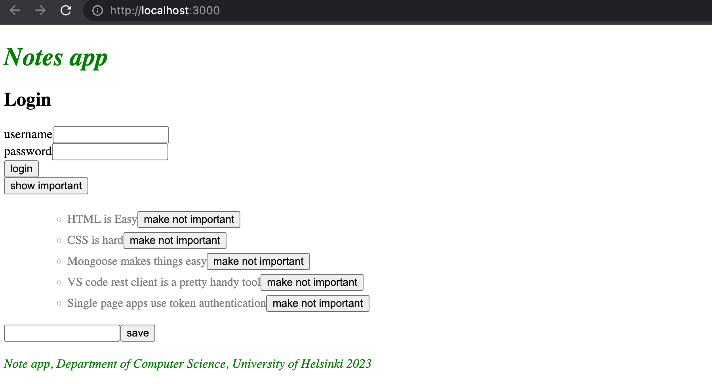
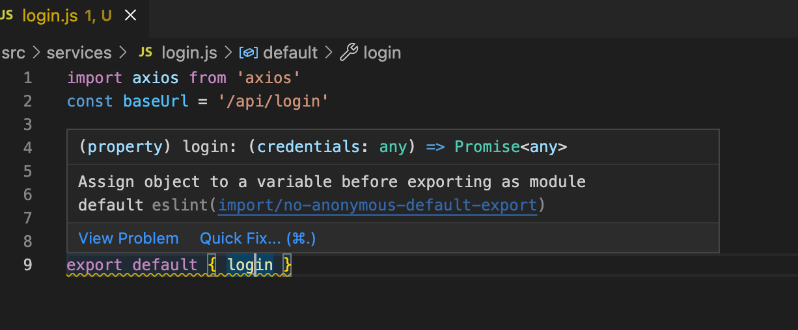

<div class="content">

Nas últimas duas partes, nós focamos principalmente no backend. O frontend que desenvolvemos na [parte 2](/ptbr/part2) ainda não suporta o gerenciamento de usuários que implementamos no backend na [parte 4](/ptbr/part4).

No momento, o frontend mostra as notas existentes e permite que os usuários mudem o estado de uma nota de importante para não importante e vice-versa. Novas notas não podem mais ser adicionadas por causa das mudanças feitas no backend na parte 4: o backend agora espera que um token contendo a identidade de um usuário seja enviado com a nova nota.

Agora nós iremos implementar uma parte da funcionalidade de gerenciamento de usuários necessária no frontend. Vamos começar com o login de usuário. Durante toda essa parte, nós iremos assumir que novos usuários não serão adicionados a partir do frontend.

### Gerenciando o login

Um formulário de login foi agora adicionado ao topo da página:



O código do componente <i>App</i> agora é o seguinte:

```js
const App = () => {
  const [notes, setNotes] = useState([]) 
  const [newNote, setNewNote] = useState('')
  const [showAll, setShowAll] = useState(true)
  const [errorMessage, setErrorMessage] = useState(null)
  // highlight-start
  const [username, setUsername] = useState('') 
  const [password, setPassword] = useState('') 
// highlight-end

  useEffect(() => {
    noteService
      .getAll().then(initialNotes => {
        setNotes(initialNotes)
      })
  }, [])

  // ...

// highlight-start
  const handleLogin = (event) => {
    event.preventDefault()
    console.log('logging in with', username, password)
  }
  // highlight-end

  return (
    <div>
      <h1>Notes</h1>

      <Notification message={errorMessage} />

      // highlight-start
      <form onSubmit={handleLogin}>
        <div>
          username
            <input
            type="text"
            value={username}
            name="Username"
            onChange={({ target }) => setUsername(target.value)}
          />
        </div>
        <div>
          password
            <input
            type="password"
            value={password}
            name="Password"
            onChange={({ target }) => setPassword(target.value)}
          />
        </div>
        <button type="submit">login</button>
      </form>
    // highlight-end

      // ...
    </div>
  )
}

export default App
```

O código atual da aplicação pode ser encontrado no [Github](https://github.com/fullstack-hy2020/part2-notes/tree/part5-1), branch <i>part5-1</i>. Se você clonar o repositório, não se esqueça de rodar _npm install_ antes de tentar iniciar o frontend.

O frontend não irá renderizar nenhuma nota se não estiver conectado ao backend. Você pode iniciar o backend através do comando _npm run dev_ em sua pasta da Parte 4. Isso iniciará o backend na porta 3001. Enquanto ele estiver ativo, você pode iniciar o frontend em uma janela de terminal separada com o comando _npm start_, e agora você pode ver as notas que foram salvas no seu banco de dados MongoDB da Parte 4.

Mantenha isso em mente de agora em diante.

O formulário de login é gerenciado da mesma forma que gerenciamos formulários na [parte 2](/ptbr/part2/forms). O estado do app tem campos de <i>username</i> e <i>password</i> para armazenar os dados do formulário. Os campos do formulário possuem gerenciadores de eventos, que sincronizam as alterações no campo e enviam o estado para o componente <i>App</i> . Os gerenciadores de eventos são simples: Um objeto é passado como parâmetro, e eles desestruturam o campo <i>target</i> do objeto e salvam seu valor no estado.

```js
({ target }) => setUsername(target.value)
```

O método _handleLogin_, que responsável por lidar com os dados no formulário, ainda será implementado.

O login é feito enviando uma requisição HTTP POST para o endereço do servidor <i>api/login</i>. Vamos separar o código responsável por essa requisição em seu próprio módulo, para o arquivo <i>services/login.js</i>.

Nós usaremos a sintaxe <i>async/await</i> ao invés de promises para a requisição HTTP:

```js
import axios from 'axios'
const baseUrl = '/api/login'

const login = async credentials => {
  const response = await axios.post(baseUrl, credentials)
  return response.data
}

export default { login }
```

Se você instalou o plugin eslint no VS Code, poderá ver agora o seguinte aviso:



Nós iremos retornar à configuração do eslint em breve. Você pode ignorar o erro por enquanto ou silenciá-lo adicionando a seguinte linha de código antes do aviso:

```js
// eslint-disable-next-line import/no-anonymous-default-export
export default { login }
```

O método para gerenciar o login pode ser implementado da seguinte forma:

```js
import loginService from './services/login' // highlight-line

const App = () => {
  // ...
  const [username, setUsername] = useState('') 
  const [password, setPassword] = useState('') 
// highlight-start
  const [user, setUser] = useState(null)
// highlight-end
  
  // highlight-start
  const handleLogin = async (event) => {
    event.preventDefault()
    
    try {
      const user = await loginService.login({
        username, password,
      })

      setUser(user)
      setUsername('')
      setPassword('')
    } catch (exception) {
      setErrorMessage('Wrong credentials')
      setTimeout(() => {
        setErrorMessage(null)
      }, 5000)
    }
    // highlight-end
  }

  // ...
}
```

Se o login for um sucesso, os campos do formulário serão apagados e o <i>e</i> a resposta do servidor (incluindo um <i>token</i> e os detalhes do usuário) será salva no campo do <i>usuário</i> no estado (state) da aplicação.

Se o login falhar ou a função _loginService.login_ resultar em erro, o usuário será notificado.

O usuário não é notificado sobre um login bem-sucedido de nenhuma forma. Vamos modificar a aplicação para mostrar o formulário de login apenas <i>se o usuário não estiver logado</i>, ou seja, _user === null_. O formulário para adicionar novas notas será mostrado apenas se o <i>usuário estiver logado</i>, ou seja, se <i>user</i> contiver os detalhes do usuário.

Vamos adicionar duas funções auxiliares ao componente <i>App</i> para gerar os formulários:

```js
const App = () => {
  // ...

  const loginForm = () => (
    <form onSubmit={handleLogin}>
      <div>
        username
          <input
          type="text"
          value={username}
          name="Username"
          onChange={({ target }) => setUsername(target.value)}
        />
      </div>
      <div>
        password
          <input
          type="password"
          value={password}
          name="Password"
          onChange={({ target }) => setPassword(target.value)}
        />
      </div>
      <button type="submit">login</button>
    </form>      
  )

  const noteForm = () => (
    <form onSubmit={addNote}>
      <input
        value={newNote}
        onChange={handleNoteChange}
      />
      <button type="submit">save</button>
    </form>  
  )

  return (
    // ...
  )
}
```

e condicionalmente renderizá-los:

```js
const App = () => {
  // ...

  const loginForm = () => (
    // ...
  )

  const noteForm = () => (
    // ...
  )

  return (
    <div>
      <h1>Notes</h1>

      <Notification message={errorMessage} />

      {user === null && loginForm()} // highlight-line
      {user !== null && noteForm()} // highlight-line

      <div>
        <button onClick={() => setShowAll(!showAll)}>
          show {showAll ? 'important' : 'all'}
        </button>
      </div>
      <ul>
        {notesToShow.map((note, i) => 
          <Note
            key={i}
            note={note} 
            toggleImportance={() => toggleImportanceOf(note.id)}
          />
        )}
      </ul>

      <Footer />
    </div>
  )
}
```


Um [truque](https://pt-br.reactjs.org/docs/conditional-rendering.html#inline-if-with-logical--operator) um pouco estranho, mas comumente usado no React, é usado para renderizar os formulários condicionalmente:


```js
{
  user === null && loginForm()
}
```

Se a primeira declaração for avaliada como falsa ou for [falsy](https://developer.mozilla.org/pt-BR/docs/Glossary/Falsy), a segunda declaração (gerando o formulário) não será executada.


Podemos tornar isso ainda mais simples usando o [operador condicional](https://developer.mozilla.org/pt-BR/docs/Web/JavaScript/Reference/Operators/Operador_Condicional):

```js
return (
  <div>
    <h1>Notes</h1>

    <Notification message={errorMessage}/>

    {user === null ?
      loginForm() :
      noteForm()
    }

    <h2>Notes</h2>

    // ...

  </div>
)
```

Se _user === null_ for igual a um valor [truthy](https://developer.mozilla.org/pt-BR/docs/Glossary/Truthy), _loginForm()_ será executado. Caso contrário, _noteForm()_ será executado.


Vamos fazer mais uma modificação. Se o usuário estiver logado, seu nome é exibido na tela:

```js
return (
  <div>
    <h1>Notes</h1>

    <Notification message={errorMessage} />

    {!user && loginForm()} 
    {user && <div>
       <p>{user.name} logged in</p>
         {noteForm()}
      </div>
    }

    <h2>Notes</h2>

    // ...

  </div>
)
```

A solução não é perfeita, mas vamos deixar assim por enquanto.


Nosso componente principal <i>App</i> está muito grande no momento. As mudanças que fizemos agora são um sinal claro de que os formulários devem ser refatorados em seus próprios componentes. No entanto, deixaremos isso como um exercício opcional.


O código atual da aplicação pode ser encontrado no [GitHub](https://github.com/fullstack-hy2020/part2-notes/tree/part5-2), branch <i>part5-2</i>.

### Criando novas notas

O token retornado com um login bem-sucedido é salvo no estado (state) da aplicação - o campo <i>token</i> do <i>usuário</i>:

```js
const handleLogin = async (event) => {
  event.preventDefault()
  try {
    const user = await loginService.login({
      username, password,
    })

    setUser(user) // highlight-line
    setUsername('')
    setPassword('')
  } catch (exception) {
    // ...
  }
}
```

Vamos corrigir a criação de novas notas para que funcione com o backend. Isso significa adicionar o token do usuário logado ao cabeçalho Authorization da solicitação HTTP.

O módulo <i>noteService</i> muda da seguinte forma:

```js
import axios from 'axios'
const baseUrl = '/api/notes'

let token = null // highlight-line

// highlight-start
const setToken = newToken => {
  token = `Bearer ${newToken}`
}
// highlight-end

const getAll = () => {
  const request = axios.get(baseUrl)
  return request.then(response => response.data)
}

const create = async newObject => {
  // highlight-start
  const config = {
    headers: { Authorization: token },
  }
// highlight-end

  const response = await axios.post(baseUrl, newObject, config) // highlight-line
  return response.data
}

const update = (id, newObject) => {
  const request = axios.put(`${ baseUrl }/${id}`, newObject)
  return request.then(response => response.data)
}

// eslint-disable-next-line import/no-anonymous-default-export
export default { getAll, create, update, setToken } // highlight-line
```

O módulo <i>noteService</i> contém uma variável privada <i>token</i>. Seu valor pode ser alterado com uma função <i>setToken</i>, que é exportada pelo módulo. A função <i>create</i>, agora com sintaxe async/await, define o token para o cabeçalho <i>Authorization</i>. O cabeçalho é fornecido ao axios como o terceiro parâmetro do método <i>post</i>.

O gerenciador de eventos responsável pelo login deve ser alterado para chamar o método <code>noteService.setToken(user.token)</code> com um login bem-sucedido:

```js
const handleLogin = async (event) => {
  event.preventDefault()
  try {
    const user = await loginService.login({
      username, password,
    })

    noteService.setToken(user.token) // highlight-line
    setUser(user)
    setUsername('')
    setPassword('')
  } catch (exception) {
    // ...
  }
}
```

E agora, a adição de novas notas funciona novamente!

### Salvando o token no local storage do navegador

Nossa aplicação tem uma pequena falha: se o navegador for atualizado (por exemplo, pressionando F5), as informações de login do usuário desaparecem.

Esse problema é facilmente resolvido salvando os detalhes de login no [local storage](https://developer.mozilla.org/pt-BR/docs/Web/API/Storage). O local storage é um banco de dados de [chave-valor](https://pt.wikipedia.org/wiki/Banco_de_dados_de_chave-valor) no navegador.

Ele é muito fácil de usar. Um <i>valor</i> correspondente a uma determinada <i>chave</i> é salvo no banco de dados com o método [setItem](https://developer.mozilla.org/pt-BR/docs/Web/API/Storage/setItem). Por exemplo:

```js
window.localStorage.setItem('name', 'juha tauriainen')
```


salva a string dada como segundo parâmetro como o valor da chave <i>name</i>.


O valor de uma chave pode ser encontrado com o método [getItem](https://developer.mozilla.org/pt-BR/docs/Web/API/Storage/getItem):

```js
window.localStorage.getItem('name')
```


e o método [removeItem](https://developer.mozilla.org/pt-BR/docs/Web/API/Storage/removeItem) remove uma chave.


Valores no local storage são persistidos mesmo quando a página é re-renderizada. O armazenamento é específico para [origem](https://developer.mozilla.org/pt-BR/docs/Glossary/Origin) , então cada aplicação web tem seu próprio armazenamento.

Vamos estender nossa aplicação para que ela salve os detalhes de um usuário logado no local storage.

Valores salvos no armazenamento são [DOMstrings](https://docs.w3cub.com/dom/domstring), então não podemos salvar um objeto JavaScript da forma como ele é. O objeto deve ser convertido para JSON primeiro, com o método _JSON.stringify_. Da mesma forma, quando um objeto JSON é lido do local storage, ele deve ser convertido de volta para JavaScript com _JSON.parse_.

As mudanças no método login são as seguintes:

```js
  const handleLogin = async (event) => {
    event.preventDefault()
    try {
      const user = await loginService.login({
        username, password,
      })

      // highlight-start
      window.localStorage.setItem(
        'loggedNoteappUser', JSON.stringify(user)
      ) 
      // highlight-end
      noteService.setToken(user.token)
      setUser(user)
      setUsername('')
      setPassword('')
    } catch (exception) {
      // ...
    }
  }
```

Os detalhes de um usuário logado agora são salvos no local storage e podem ser visualizados no console (digitando _window.localStorage_ no console):


Você também pode inspecionar o local storage usando as ferramentas de desenvolvedor. No Chrome, vá para a guia <i>Aplicativo</i> e selecione <i>local storage</i> (mais detalhes [aqui](https://developers.google.com/web/tools/chrome-devtools/storage/localstorage)). No Firefox, vá para a guia <i>Storage</i> e selecione <i>Local Storage</i> (detalhes [aqui](https://developer.mozilla.org/pt-BR/docs/Tools/Storage_Inspector)).

Nós ainda temos que modificar nossa aplicação para que, quando entrarmos na página, a aplicação verifique se os detalhes de um usuário logado já podem ser encontrados no local storage. Se eles puderem, os detalhes são salvos no estado da aplicação e no <i>noteService</i>.

O jeito certo de fazer isso é com um [effect hook](https://pt-br.reactjs.org/docs/hooks-effect.html): um mecanismo que conhecemos pela primeira vez na [parte 2](/ptbr/part2/obtendo_dados_do_servidor#effect-hooks), e usamos para buscar notas do servidor.

Nós podemos ter vários hooks de efeitos, então vamos criar um para lidar com o primeiro carregamento da página:

```js
const App = () => {
  const [notes, setNotes] = useState([]) 
  const [newNote, setNewNote] = useState('')
  const [showAll, setShowAll] = useState(true)
  const [errorMessage, setErrorMessage] = useState(null)
  const [username, setUsername] = useState('') 
  const [password, setPassword] = useState('') 
  const [user, setUser] = useState(null) 

  useEffect(() => {
    noteService
      .getAll().then(initialNotes => {
        setNotes(initialNotes)
      })
  }, [])

  // highlight-start
  useEffect(() => {
    const loggedUserJSON = window.localStorage.getItem('loggedNoteappUser')
    if (loggedUserJSON) {
      const user = JSON.parse(loggedUserJSON)
      setUser(user)
      noteService.setToken(user.token)
    }
  }, [])
  // highlight-end

  // ...
}
```

O array vazio como parâmetro do hook de efeito garante que o efeito seja executado apenas quando o componente for renderizado [pela primeira vez](https://pt-br.reactjs.org/docs/hooks-reference.html#conditionally-firing-an-effect).


Agora um usuário fica logado na aplicação para sempre. Provavelmente devemos adicionar uma funcionalidade de <i>logout</i>, que remove os detalhes de login do local storage. No entanto, deixaremos isso como um exercício.

É possível deslogar um usuário usando o console, e isso é o suficiente por enquanto.
Você pode deslogar com o comando:

```js
window.localStorage.removeItem('loggedNoteappUser')
```

ou com o comando que esvazia o <i>localstorage</i> completamente:

```js
window.localStorage.clear()
```

O código da aplicação atual pode ser encontrado no [GitHub](https://github.com/fullstack-hy2020/part2-notes/tree/part5-3), branch <i>part5-3</i>.

</div>

<div class="tasks">

### Exercícios 5.1.-5.4.

Nós agora criaremos um frontend para o backend do bloglist que criamos na última parte. Você pode usar [esta aplicação](https://github.com/fullstack-hy2020/bloglist-frontend) do GitHub como base para sua solução. A aplicação espera que seu backend esteja em execução na porta 3003.

É suficiente enviar sua solução final. Você pode fazer um commit após cada exercício, mas isso não é necessário.

Os primeiros exercícios revisam tudo o que aprendemos sobre React até agora. Eles podem ser desafiadores, especialmente se seu backend estiver incompleto. Pode ser melhor usar o backend que marcamos como resposta para a parte 4.

Enquanto faz os exercícios, lembre-se de todos os métodos de depuração que discutimos, especialmente prestando atenção no console.

**Aviso:** Se você perceber que está misturando os comandos das funções _async/await_ e _then_, é 99,9% certo que está fazendo algo errado. Use apenas um ou outro, nunca os dois.

#### 5.1: frontend do bloglist, passo 1

Clone a aplicação do [GitHub](https://github.com/fullstack-hy2020/bloglist-frontend) com o comando:

```bash
git clone https://github.com/fullstack-hy2020/bloglist-frontend
```

<i>remova a configuração do git da aplicação clonada</i>

```bash
cd bloglist-frontend   // vai para o repositório clonado
rm -rf .git
```

A aplicação é iniciada da maneira usual, mas você deve instalar suas dependências primeiro:

```bash
npm install
npm start
```

Implemente a funcionalidade de login no frontend. O token retornado com um login bem-sucedido é salvo no estado da aplicação <i>user</i>.

se um usuário não estiver logado, <i>apenas</i> o formulário de login pode ser visto.


Se um usuário estiver logado, o nome do usuário e uma lista de blogs são exibidos.


Detalhes do usuário logado não precisam ser salvos no local storage ainda.

**Obs.** Você pode implementar a renderização condicional do formulário de login da seguinte maneira, por exemplo:

```js
  if (user === null) {
    return (
      <div>
        <h2>Log in to application</h2>
        <form>
          //...
        </form>
      </div>
    )
  }

  return (
    <div>
      <h2>blogs</h2>
      {blogs.map(blog =>
        <Blog key={blog.id} blog={blog} />
      )}
    </div>
  )
}
```

### 5.2: frontend do bloglist, passo 2


Torne o login 'permanente' usando o local storage. Além disso, implemente uma maneira de deslogar.


Assegure-se de que o navegador não lembre os detalhes do usuário após o logout.

#### 5.3: frontend do bloglist, passo 3

Expanda sua aplicação para permitir que um usuário logado adicione novos blogs:


#### 5.4: frontend do bloglist, passo 4

Implemente notificações que informem o usuário sobre operações bem-sucedidas e mal-sucedidas no topo da página. Por exemplo, quando um novo blog é adicionado, a seguinte notificação pode ser exibida:


Um login mal-sucedido pode mostrar a seguinte notificação:


As notificações devem ser visíveis por alguns segundos. Não é obrigatório adicionar cores.

</div>

<div class="content">

### Uma nota sobre o uso do loca storagel


No [fim](/ptbr/part4/autenticacao_por_token#problemas-da-autenticacao-baseada-em-token) da última parte, nós mencionamos que o desafio da autenticação baseada em token é como lidar com a situação em que o acesso da API do titular do token à API precisa ser revogado.

Existem duas soluções para o problema. A primeira é limitar o período de validade de um token. Isso obriga o usuário a fazer login novamente no aplicativo assim que o token expirar. A outra abordagem é salvar as informações de validade de cada token no banco de dados do backend. Essa solução geralmente é chamada de <i>server-side session</i>.

Não importa como a validade dos tokens é verificada e garantida, salvar um token no local storage pode conter um risco de segurança se o aplicativo tiver uma vulnerabilidade de segurança que permita ataques [Cross Site Scripting (XSS)](https://owasp.org/www-community/attacks/xss/). Um ataque XSS é possível se o aplicativo permitir que um usuário injete código JavaScript arbitrário (por exemplo, usando um formulário) que o aplicativo então execute. Ao usar o React com sensatez, não deve ser possível aplicar esse ataque, pois o [React sanitiza](https://pt-br.reactjs.org/docs/introducing-jsx.html#jsx-prevents-injection-attacks) todo o texto que ele renderiza, o que significa que não está executando o conteúdo renderizado como JavaScript.

Se você quiser mais segurança, a melhor opção é não armazenar um token no local storage. Essa pode ser uma opção em situações em que vazar um token pode ter consequências trágicas.

Foi sugerido que a identidade de um usuário logado deve ser salva como [cookies httpOnly](https://developer.mozilla.org/pt-BR/docs/Web/HTTP/Cookies#restrict_access_to_cookies), para que o código JavaScript não tenha acesso ao token. A desvantagem dessa solução é que tornaria a implementação de aplicativos SPA um pouco mais complexa. Seria necessário implementar pelo menos uma página separada para fazer login.


No entanto, é bom notar que mesmo o uso de cookies httpOnly não garante nada. Até mesmo foi sugerido que os cookies httpOnly [não são mais seguros do que](https://academind.com/tutorials/localstorage-vs-cookies-xss/) o uso do local storage.

Então não importa a solução usada, o mais importante é [minimizar o risco](https://cheatsheetseries.owasp.org/cheatsheets/DOM_based_XSS_Prevention_Cheat_Sheet.html) de ataques XSS.

</div>
