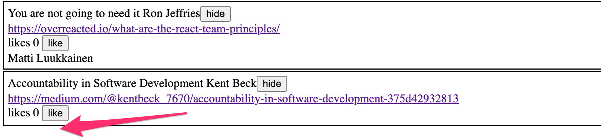

<div class="content">

### Mostrando o formulário de login apenas quando apropriado

Vamos modificar a aplicação para que o formulário de login não seja exibido por padrão:


O formulário de login aparece quando o usuário pressiona o botão <i>login</i>:


O usuário pode fechar o formulário de login clicando no botão <i>cancelar</i>.

Vamos começar extraindo o formulário de login para um componente próprio:

```js
const LoginForm = ({
   handleSubmit,
   handleUsernameChange,
   handlePasswordChange,
   username,
   password
  }) => {
  return (
    <div>
      <h2>Login</h2>

      <form onSubmit={handleSubmit}>
        <div>
          username
          <input
            value={username}
            onChange={handleUsernameChange}
          />
        </div>
        <div>
          password
          <input
            type="password"
            value={password}
            onChange={handlePasswordChange}
          />
      </div>
        <button type="submit">login</button>
      </form>
    </div>
  )
}

export default LoginForm
```

O estado e todas as funções relacionadas a ele são definidos fora do componente e são passados para o componente por meio de props.

Perceba que as props são atribuídas a variáveis ​​através de <i>destructuring</i>, o que significa que, em vez de escrever:

```js
const LoginForm = (props) => {
  return (
    <div>
      <h2>Login</h2>
      <form onSubmit={props.handleSubmit}>
        <div>
          username
          <input
            value={props.username}
            onChange={props.handleChange}
            name="username"
          />
        </div>
        // ...
        <button type="submit">login</button>
      </form>
    </div>
  )
}
```

Onde as propriedades do objeto _props_ são acessadas por meio de, por exemplo, _props.handleSubmit_, as propriedades são atribuídas diretamente às suas próprias variáveis.

Uma forma rápida de implementar a funcionalidade é alterar a função _loginForm_ do componente <i>App</i> da seguinte maneira:

```js
const App = () => {
  const [loginVisible, setLoginVisible] = useState(false) // highlight-line

  // ...

  const loginForm = () => {
    const hideWhenVisible = { display: loginVisible ? 'none' : '' }
    const showWhenVisible = { display: loginVisible ? '' : 'none' }

    return (
      <div>
        <div style={hideWhenVisible}>
          <button onClick={() => setLoginVisible(true)}>log in</button>
        </div>
        <div style={showWhenVisible}>
          <LoginForm
            username={username}
            password={password}
            handleUsernameChange={({ target }) => setUsername(target.value)}
            handlePasswordChange={({ target }) => setPassword(target.value)}
            handleSubmit={handleLogin}
          />
          <button onClick={() => setLoginVisible(false)}>cancel</button>
        </div>
      </div>
    )
  }

  // ...
}
```

O estado do componente <i>App</i> agora contém o boolean <i>loginVisible</i>, que define se o formulário de login deve ser exibido ao usuário ou não.

O valor de _loginVisible_ é alternado com dois botões. Ambos os botões têm seus gerenciadores de eventos definidos diretamente no componente:

```js
<button onClick={() => setLoginVisible(true)}>log in</button>

<button onClick={() => setLoginVisible(false)}>cancel</button>
```

A visibilidade do componente é definida atribuindo uma regra de estilo [inline](/ptbr/part2/adicionando_estilos_a_aplicacao_react#estilos-inline), onde o valor da propriedade [display](https://developer.mozilla.org/pt-BR/docs/Web/CSS/display) é <i>none</i> se não quisermos que o componente seja exibido:

```js
const hideWhenVisible = { display: loginVisible ? 'none' : '' }
const showWhenVisible = { display: loginVisible ? '' : 'none' }

<div style={hideWhenVisible}>
  // button
</div>

<div style={showWhenVisible}>
  // button
</div>
```

Nós estamos usando novamente o operador ternário "ponto de interrogação". Se _loginVisible_ for <i>true</i>, então a regra CSS do componente será:

```css
display: 'none';
```

Se _loginVisible_ for <i>false</i>, então <i>display</i> não receberá nenhum valor relacionado à visibilidade do componente.

### Os componentes filhos, conhecidos como props.children

O código relacionado ao gerenciamento da visibilidade do formulário de login poderia ser considerado uma entidade lógica própria, e por esse motivo, seria bom extrai-lo do componente <i>App</i> para um componente separado.

Nosso objetivo é implementar um novo componente <i>Togglable</i> que possa ser usado da seguinte maneira:

```js
<Togglable buttonLabel='login'>
  <LoginForm
    username={username}
    password={password}
    handleUsernameChange={({ target }) => setUsername(target.value)}
    handlePasswordChange={({ target }) => setPassword(target.value)}
    handleSubmit={handleLogin}
  />
</Togglable>
```

A maneira como o componente é usado é ligeiramente diferente dos nossos componentes anteriores. O componente tem tags de abertura e fechamento que cercam um componente <i>LoginForm</i>. Na terminologia React, <i>LoginForm</i> é um componente filho de <i>Togglable</i>.

Nós podemos adicionar qualquer elemento React que quisermos entre as tags de abertura e fechamento de <i>Togglable</i>, como este, por exemplo:

```js
<Togglable buttonLabel="reveal">
  <p>this line is at start hidden</p>
  <p>also this is hidden</p>
</Togglable>
```

O código do componente <i>Togglable</i> é mostrado abaixo:

```js
import { useState } from 'react'

const Togglable = (props) => {
  const [visible, setVisible] = useState(false)

  const hideWhenVisible = { display: visible ? 'none' : '' }
  const showWhenVisible = { display: visible ? '' : 'none' }

  const toggleVisibility = () => {
    setVisible(!visible)
  }

  return (
    <div>
      <div style={hideWhenVisible}>
        <button onClick={toggleVisibility}>{props.buttonLabel}</button>
      </div>
      <div style={showWhenVisible}>
        {props.children}
        <button onClick={toggleVisibility}>cancel</button>
      </div>
    </div>
  )
}

export default Togglable
```

A nova e interessante parte do código é a [props.children](https://pt-br.reactjs.org/docs/glossary.html#propschildren), que é usada para referenciar os componentes filhos do componente. Os componentes filhos são os elementos React que definimos entre as tags de abertura e fechamento de um componente.


Dessa vez, os <i>children</i> são renderizados no código que é usado para renderizar o próprio componente:

```js
<div style={showWhenVisible}>
  {props.children}
  <button onClick={toggleVisibility}>cancel</button>
</div>
```

Diferente das props "normais" que vimos antes, <i>children</i> é adicionada automaticamente pelo React e sempre existe na aplicação. Se um componente é definido com uma tag de fechamento automático _/>_, como este:

```js
<Note
  key={note.id}
  note={note}
  toggleImportance={() => toggleImportanceOf(note.id)}
/>
```

Então <i>props.children</i> é um array vazio.

O componente <i>Togglable</i> é reutilizável e podemos usá-lo para adicionar funcionalidade semelhante de alternância de visibilidade ao formulário usado para criar novas anotações.

Antes de fazermos isso, vamos extrair o formulário para criar notas em um componente:

```js
const NoteForm = ({ onSubmit, handleChange, value}) => {
  return (
    <div>
      <h2>Create a new note</h2>

      <form onSubmit={onSubmit}>
        <input
          value={value}
          onChange={handleChange}
        />
        <button type="submit">save</button>
      </form>
    </div>
  )
}
```

Depois vamos definir o componente do formulário dentro de um componente <i>Togglable</i>:


```js
<Togglable buttonLabel="new note">
  <NoteForm
    onSubmit={addNote}
    value={newNote}
    handleChange={handleNoteChange}
  />
</Togglable>
```

Você pode encontrar o código completo da nossa aplicação atual no branch <i>part5-4</i> [deste repositório do GitHub](https://github.com/fullstack-hy2020/part2-notes/tree/part5-4).

### Estado dos formulários

O estado da aplicação atualmente está no componente _App_.

A documentação do React diz o [seguinte](https://pt-br.reactjs.org/docs/lifting-state-up.html) sobre onde colocar o estado:

<i>Muitas vezes, vários componentes precisam refletir os mesmos dados em mudança. Recomendamos levantar o estado compartilhado até o ancestral comum mais próximo.</i>

Se pensarmos no estado dos formulários, como por exemplo o conteúdo de uma nova nota antes que ela tenha sido criada, o componente _App_ não precisa dele para nada.
Nós poderíamos simplesmente mover o estado dos formulários para os componentes correspondentes.

O componente para uma nota muda da seguinte maneira:

```js
import { useState } from 'react'

const NoteForm = ({ createNote }) => {
  const [newNote, setNewNote] = useState('')

  const addNote = (event) => {
    event.preventDefault()
    createNote({
      content: newNote,
      important: true
    })

    setNewNote('')
  }

  return (
    <div>
      <h2>Create a new note</h2>

      <form onSubmit={addNote}>
        <input
          value={newNote}
          onChange={event => setNewNote(event.target.value)}
        />
        <button type="submit">save</button>
      </form>
    </div>
  )
}

export default NoteForm
```

**NOTA** Ao mesmo tempo, mudamos o comportamento da aplicação para que as novas notas sejam importantes por padrão, ou seja, o campo <i>important</i> recebe o valor <i>true</i>.

O atributo de estado <i>newNote</i> e o gerenciador de eventos responsável por alterá-lo foram movidos do componente _App_ para o componente responsável pelo formulário de notas.

Há apenas uma prop restante, a função _createNote_, que o formulário chama quando uma nova nota é criada.

O componente _App_ fica mais simples agora que nós nos livramos do estado <i>newNote</i> e do seu gerenciador de eventos.
A função _addNote_ para criar novas notas recebe uma nova nota como parâmetro, e a função é a única prop que enviamos para o formulário:

```js
const App = () => {
  // ...
  const addNote = (noteObject) => { // highlight-line
    noteService
      .create(noteObject)
      .then(returnedNote => {
        setNotes(notes.concat(returnedNote))
      })
  }
  // ...
  const noteForm = () => (
    <Togglable buttonLabel='new note'>
      <NoteForm createNote={addNote} />
    </Togglable>
  )

  // ...
}
```

Nós poderíamos fazer o mesmo para o formulário de login, mas vamos deixar isso para um exercício opcional.


O código da aplicação pode ser encontrado no [GitHub](https://github.com/fullstack-hy2020/part2-notes/tree/part5-5),
branch <i>part5-5</i>.

### Referências para componentes com ref

Nossa implementação atual é muito boa; ela tem um aspecto que poderia ser melhorado.

Depois que uma nova nota é criada, faria sentido esconder o formulário de nova nota. Atualmente, o formulário permanece visível. Há um pequeno problema em ocultar o formulário. A visibilidade é controlada com a variável <i>visible</i> dentro do componente <i>Togglable</i>. Como podemos acessá-la fora do componente?

Há muitas maneiras de implementar o fechamento do formulário a partir do componente pai, mas vamos usar o mecanismo [ref](https://pt-br.reactjs.org/docs/refs-and-the-dom.html)

Vamos fazer as seguintes alterações no componente <i>App</i>:

```js
import { useState, useEffect, useRef } from 'react' // highlight-line

const App = () => {
  // ...
  const noteFormRef = useRef() // highlight-line

  const noteForm = () => (
    <Togglable buttonLabel='new note' ref={noteFormRef}>  // highlight-line
      <NoteForm createNote={addNote} />
    </Togglable>
  )

  // ...
}
```

O hook [useRef](https://pt-br.reactjs.org/docs/hooks-reference.html#useref) é usado para criar uma referência <i>noteFormRef</i>, que é atribuída ao componente <i>Togglable</i> que contém o formulário de criação de notas. A variável <i>noteFormRef</i> atua como uma referência ao componente. Este hook garante a mesma referência (ref) que é mantida durante as re-renderizações do componente.

Nós também fazemos as seguintes alterações no componente <i>Togglable</i>:

```js
import { useState, forwardRef, useImperativeHandle } from 'react' // highlight-line

const Togglable = forwardRef((props, refs) => { // highlight-line
  const [visible, setVisible] = useState(false)

  const hideWhenVisible = { display: visible ? 'none' : '' }
  const showWhenVisible = { display: visible ? '' : 'none' }

  const toggleVisibility = () => {
    setVisible(!visible)
  }

// highlight-start
  useImperativeHandle(refs, () => {
    return {
      toggleVisibility
    }
  })
// highlight-end

  return (
    <div>
      <div style={hideWhenVisible}>
        <button onClick={toggleVisibility}>{props.buttonLabel}</button>
      </div>
      <div style={showWhenVisible}>
        {props.children}
        <button onClick={toggleVisibility}>cancel</button>
      </div>
    </div>
  )
})  // highlight-line

export default Togglable
```

A função que cria o componente é envolvida dentro de uma chamada de função [forwardRef](https://pt-br.reactjs.org/docs/react-api.html#reactforwardref). Desta forma, o componente pode acessar a referência (ref) que é atribuída a ele.

O componente usa o hook [useImperativeHandle](https://pt-br.reactjs.org/docs/hooks-reference.html#useref) para tornar a função <i>toggleVisibility</i> disponível fora do componente.

Nós podemos agora ocultar o formulário chamando <i>noteFormRef.current.toggleVisibility()</i> após a criação de uma nova nota:

```js
const App = () => {
  // ...
  const addNote = (noteObject) => {
    noteFormRef.current.toggleVisibility() // highlight-line
    noteService
      .create(noteObject)
      .then(returnedNote => {     
        setNotes(notes.concat(returnedNote))
      })
  }
  // ...
}
```

Para recapitular, a função [useImperativeHandle](https://pt-br.reactjs.org/docs/hooks-reference.html#useimperativehandle) é um hook do React, que é usado para definir funções em um componente, que podem ser invocadas de fora do componente.

Esse truque funciona para alterar o estado de um componente, mas parece um pouco desagradável. Poderíamos ter conseguido a mesma funcionalidade com um código um pouco mais limpo usando componentes baseados em classe do "antigo React". Vamos dar uma olhada nesses componentes de classe durante a parte 7 do material do curso. Até agora, esta é a única situação em que o uso de hooks do React leva a um código que não é mais limpo do que com componentes de classe.

Existem também [outros casos de uso](https://pt-br.reactjs.org/docs/refs-and-the-dom.html) para referências além de acessar componentes React.

Você pode encontrar o código para nossa aplicação atual em sua totalidade na branch <i>part5-6</i> [deste repositório do GitHub](https://github.com/fullstack-hy2020/part2-notes/tree/part5-6).

### Um ponto sobre componentes

Quando definimos um componente no React:

```js
const Togglable = () => ...
  // ...
}
```

E o usamos assim:

```js
<div>
  <Togglable buttonLabel="1" ref={togglable1}>
    first
  </Togglable>

  <Togglable buttonLabel="2" ref={togglable2}>
    second
  </Togglable>

  <Togglable buttonLabel="3" ref={togglable3}>
    third
  </Togglable>
</div>
```

Nós criamos <i>três instâncias separadas do componente</i> que todas têm seu próprio estado:


O atributo <i>ref</i> é usado para atribuir uma referência a cada um dos componentes nas variáveis <i>togglable1</i>, <i>togglable2</i> e <i>togglable3</i>.

### O juramento atualizado do desenvolvedor full stack

O número de partes móveis aumenta. Ao mesmo tempo, a probabilidade de acabar em uma situação em que estamos procurando um bug no lugar errado aumenta. Portanto, precisamos ser ainda mais sistemáticos.

Então, devemos estender novamente nosso juramento:

Desenvolvimento Full Stack é <i>extremamente difícil</i>, por isso usarei todos os meios possíveis para torná-lo mais fácil

- Eu irei ter o meu console de desenvolvedor do navegador aberto o tempo todo
- Eu irei usar a aba "rede" das ferramentas de desenvolvedor do navegador para garantir que o frontend e o backend estejam se comunicando como eu espero
- Eu irei constantemente vigiar o estado do servidor para assegurar que os dados enviados lá pelo frontend sejam salvos como eu espero
- Eu irei ficar de olho no banco de dados: os dados salvos lá pelo backend estão no formato correto?
- Eu avanço com pequenos passos
- <i>Quando eu suspeito que há um bug no frontend, eu me certifico de que o backend funciona corretamente</i>
- <i>Quando eu suspeito que há um bug no backend, eu me certifico de que o frontend funciona corretamente</i>
- Eu irei escrever vários _console.log_ para me certificar de que eu entendo como o código e os testes se comportam e para ajudar a localizar problemas
- Se meu código não funciona, eu não escreverei mais código. Em vez disso, eu começo a apagar o código até que ele funcione ou apenas volte para um estado em que tudo ainda estava funcionando
- Se um teste não passa, eu me certifico de que a funcionalidade testada funciona com certeza na aplicação
- Quando eu peço ajuda no canal do Discord, Telegram do curso ou em outro lugar, eu formulo minhas perguntas corretamente, veja [aqui](/ptbr/part0/informacoes_gerais#como-pedir-ajuda-no-discord-telegram) como pedir ajuda

</div>

<div class="tasks"

### Exercícios 5.5. - 5.11.

#### 5.5 Frontend da lista de blogs, passo 5

Altere o formulário para criar posts de blog para que ele seja exibido apenas quando apropriado. Use uma funcionalidade semelhante ao que foi mostrado [anteriormente nesta parte do material do curso](/ptbr/part5/props_children_e_proptypes#mostrando-o-formulario-de-login-apenas-quando-apropriado). Se desejar, você pode usar o componente <i>Togglable</i> definido na parte 5.

Por padrão o formulário não é visível


Ele se expande quando o botão <i>create new blog</i> é clicado


O formulário fecha quando um novo blog é criado.

#### 5.6 Frontend da lista de blogs, passo 6

Separe o formulário para criar um novo blog em seu próprio componente (se você ainda não o fez) e mova todos os estados necessários para criar um novo blog para este componente.

O componente deve funcionar como o componente <i>NoteForm</i> do [material](/ptbr/part5/props_children_e_proptypes) desta parte.

#### 5.7 Frontend da lista de blogs, passo 7

Vamos adicionar um botão a cada blog, que controla se todos os detalhes sobre o blog são mostrados ou não.

Detalhes completos do blog abrem quando o botão é clicado.


E os detalhes são escondidos quando o botão é clicado novamente.

Neste ponto, o botão <i>like</i> não precisa fazer nada.

A aplicação mostrada na imagem tem um pouco de CSS adicional para melhorar sua aparência.

É fácil adicionar estilos à aplicação como mostrado na parte 2 usando [estilos inline](/ptbr/part2/adicionando_estilos_a_aplicacao_react#estilos-inline):

```js
const Blog = ({ blog }) => {
  const blogStyle = {
    paddingTop: 10,
    paddingLeft: 2,
    border: 'solid',
    borderWidth: 1,
    marginBottom: 5
  }

  return (
    <div style={blogStyle}> // highlight-line
      <div>
        {blog.title} {blog.author}
      </div>
      // ...
  </div>
)}
```

**Obs.:** mesmo que a funcionalidade implementada nesta parte seja quase idêntica à funcionalidade fornecida pelo componente <i>Togglable</i>, o componente não pode ser usado diretamente para obter o comportamento desejado. A solução mais fácil será adicionar um estado ao post do blog que controla o formulário exibido do post do blog.

#### 5.8: Frontend da lista de blogs, passo 8

Nós notamos que algo está errado. Quando um novo blog é criado na aplicação, o nome do usuário que adicionou o blog não é mostrado nos detalhes do blog:



Quando o navegador é recarregado, as informações da pessoa são exibidas. Isso não é aceitável, descubra onde está o problema e faça a correção necessária.

#### 5.9: Frontend da lista de blogs, passo 9

Implemente a funcionalidade para o botão like. Os likes são incrementados fazendo uma requisição HTTP _PUT_ para o endereço único do post do blog no backend.

Como a operação do backend substitui todo o post do blog, você terá que enviar todos os seus campos no corpo da requisição. Se você quisesse acicionar um like ao seguinte post do blog:

```js
{
  _id: "5a43fde2cbd20b12a2c34e91",
  user: {
    _id: "5a43e6b6c37f3d065eaaa581",
    username: "mluukkai",
    name: "Matti Luukkainen"
  },
  likes: 0,
  author: "Joel Spolsky",
  title: "The Joel Test: 12 Steps to Better Code",
  url: "https://www.joelonsoftware.com/2000/08/09/the-joel-test-12-steps-to-better-code/"
},
```

Você teria que fazer uma requisição HTTP PUT para o endereço <i>/api/blogs/5a43fde2cbd20b12a2c34e91</i> com a seguinte requisição de dados:

```js
{
  user: "5a43e6b6c37f3d065eaaa581",
  likes: 1,
  author: "Joel Spolsky",
  title: "The Joel Test: 12 Steps to Better Code",
  url: "https://www.joelonsoftware.com/2000/08/09/the-joel-test-12-steps-to-better-code/"
}
```

O backend também tem que ser atualizado para lidar com a referência do usuário.

**Um último aviso:** se você notar que está usando async/await e o método _then_ no mesmo código, é quase certo que você está fazendo algo errado. Fique com um ou outro, e nunca use os dois ao mesmo tempo "só por precaução".

#### 5.10: Frontend da lista de blogs, passo 10

Modifique a aplicação para listar os posts do blog pelo número de <i>likes</i>. Ordenar os posts do blog pode ser feito com o método [sort](https://developer.mozilla.org/pt-BR/docs/Web/JavaScript/Reference/Global_Objects/Array/sort) do array.

#### 5.11: Frontend da lista de blogs, passo 11

Adicione um novo botão para deletar posts do blog. Além disso, implemente a lógica para deletar posts do blog no frontend.

Sua aplicação pode parecer algo como isso:


O diálogo de confirmação para deletar um post do blog é fácil de implementar com a função [window.confirm](https://developer.mozilla.org/pt-BR/docs/Web/API/Window/confirm).

Exiba o botão para deletar um post do blog apenas se o post do blog foi adicionado pelo usuário.

</div>

<div class="content">

### PropTypes

O componente <i>Togglable</i> assume que ele recebe o texto para o botão via a prop <i>buttonLabel</i>. Se esquecermos de defini-lo para o componente:

```js
<Togglable> buttonLabel forgotten... </Togglable>
```

A aplicação funciona, mas o navegador renderiza um botão que não tem texto de label.

Nós gostaríamos de impor que quando o componente <i>Togglable</i> é usado, o texto do label do botão deve ter um valor atribuído a ele.

As props esperadas e obrigatórias de um componente podem ser definidas com o pacote [prop-types](https://github.com/facebook/prop-types). Vamos instalar o pacote:

```shell
npm install prop-types
```

Nós podemos definir a prop <i>buttonLabel</i> como uma prop do tipo string obrigatória como mostrado abaixo:

```js
import PropTypes from 'prop-types'

const Togglable = React.forwardRef((props, ref) => {
  // ..
})

Togglable.propTypes = {
  buttonLabel: PropTypes.string.isRequired
}
```

O console irá exibir a seguinte mensagem de erro se a prop for deixada indefinida:


A aplicação ainda funciona e nada nos força a definir props apesar das definições de PropTypes. Tenha em mente que é extremamente não profissional deixar <i>qualquer</i> saída vermelha no console do navegador.

Vamos também definir PropTypes para o componente <i>LoginForm</i>:

```js
import PropTypes from 'prop-types'

const LoginForm = ({
   handleSubmit,
   handleUsernameChange,
   handlePasswordChange,
   username,
   password
  }) => {
    // ...
  }

LoginForm.propTypes = {
  handleSubmit: PropTypes.func.isRequired,
  handleUsernameChange: PropTypes.func.isRequired,
  handlePasswordChange: PropTypes.func.isRequired,
  username: PropTypes.string.isRequired,
  password: PropTypes.string.isRequired
}
```

Se o tipo de uma prop passada estiver errado, por exemplo, se tentarmos definir a prop <i>handleSubmit</i> como uma string, então isso resultará no seguinte aviso:


### ESlint

Na parte 3 nós configuramos a ferramenta de estilo de código [ESlint](/ptbr/part3/validacao_e_eslint#lint) para o backend. Vamos usar o ESlint no frontend também.

Create-react-app instalou o ESlint no projeto por padrão, então tudo que precisamos fazer é definir nossa configuração desejada no arquivo <i>.eslintrc.js</i>.

*Obs.:* não execute o comando _eslint --init_. Ele irá instalar a última versão do ESlint que não é compatível com o arquivo de configuração criado pelo create-react-app!

Depois, nós iremos começar a testar o frontend e para evitar erros de linter indesejados e irrelevantes nós iremos instalar o pacote [eslint-plugin-jest](https://www.npmjs.com/package/eslint-plugin-jest):

```bash
npm install --save-dev eslint-plugin-jest
```

Vamos criar um arquivo <i>.eslintrc.js</i> com o seguinte conteúdo:

```js
/* eslint-env node */
module.exports = {
  "env": {
      "browser": true,
      "es6": true,
      "jest/globals": true 
  },
  "extends": [ 
      "eslint:recommended",
      "plugin:react/recommended"
  ],
  "parserOptions": {
      "ecmaFeatures": {
          "jsx": true
      },
      "ecmaVersion": 2018,
      "sourceType": "module"
  },
  "plugins": [
      "react", "jest"
  ],
  "rules": {
      "indent": [
          "error",
          2  
      ],
      "linebreak-style": [
          "error",
          "unix"
      ],
      "quotes": [
          "error",
          "single"
      ],
      "semi": [
          "error",
          "never"
      ],
      "eqeqeq": "error",
      "no-trailing-spaces": "error",
      "object-curly-spacing": [
          "error", "always"
      ],
      "arrow-spacing": [
          "error", { "before": true, "after": true }
      ],
      "no-console": 0,
      "react/prop-types": 0,
      "react/react-in-jsx-scope": "off"
  },
  "settings": {
    "react": {
      "version": "detect"
    }
  }
}
```

NOTA: Se estiver usando o Visual Studio Code junto com o plugin ESLint, você pode precisar adicionar uma configuração de workspace para que ele funcione. Se você estiver vendo ```Failed to load plugin react: Cannot find module 'eslint-plugin-react'```, uma configuração adicional é necessária. Adicionando a linha ```"eslint.workingDirectories": [{ "mode": "auto" }]``` em settings.json no workspace parece funcionar. Veja [aqui](https://github.com/microsoft/vscode-eslint/issues/880#issuecomment-578052807) para mais informações.

Vamos criar um arquivo [.eslintignore](https://eslint.org/docs/user-guide/configuring#ignoring-files-and-directories) com o seguinte conteúdo na raiz do repositório:

```bash
node_modules
build
.eslintrc.js
```

Agora os diretórios <em>build</em> e <em>node_modules</em> serão ignorados quando o lint for executado.

Vamos também criar um script npm para executar o lint:

```js
{
  // ...
  {
    "scripts": {
    "start": "react-scripts start",
    "build": "react-scripts build",
    "test": "react-scripts test",
    "eject": "react-scripts eject",
    "eslint": "eslint ." // highlight-line
  },
  // ...
}
```

```js
{
  // ...
  {
    "scripts": {
    "start": "react-scripts start",
    "build": "react-scripts build",
    "test": "react-scripts test",
    "eject": "react-scripts eject",
    "eslint": "eslint ." // highlight-line
  },
  // ...
}
```

O componente _Togglable_ causa um aviso desagradável <i>Component definition is missing display name</i>:


O react-devtools também revela que o componente não tem um nome:


Felizmente, isso é fácil de consertar

```js
import { useState, useImperativeHandle } from 'react'
import PropTypes from 'prop-types'

const Togglable = React.forwardRef((props, ref) => {
  // ...
})

Togglable.displayName = 'Togglable' // highlight-line

export default Togglable
```

Você pode encontrar o código para nossa aplicação atual na sua totalidade na branch <i>part5-7</i> [desse repositório do GitHub](https://github.com/fullstack-hy2020/part2-notes/tree/part5-7).


Note que o create-react-app também tem uma [configuração padrão do ESLint](https://www.npmjs.com/package/eslint-config-react-app), que nós agora substituímos. [A documentação](https://create-react-app.dev/docs/setting-up-your-editor/#extending-or-replacing-the-default-eslint-config) menciona que é ok substituir o padrão, mas não nos encoraja a fazê-lo: <i>Nós altamente recomendamos estender a configuração base, pois removê-la pode introduzir problemas difíceis de encontrar</i>.

</div>

<div class="tasks">

### Exercício 5.12.

#### 5.12: Frontend da lista de blogs, passo 12

Defina PropTypes para um dos componentes da sua aplicação e adicione o ESlint ao projeto. Defina a configuração de acordo com sua preferência. Corrija todos os erros do linter.

Create-react-app instalou o ESlint no projeto por padrão, então tudo que precisamos fazer é definir nossa configuração desejada no arquivo <i>.eslintrc.js</i>.

*Obs.:* não execute o comando _eslint --init_. Ele irá instalar a última versão do ESlint que não é compatível com o arquivo de configuração criado pelo create-react-app!

</div>
