<div class="content">

Até aqui, nós testamos o backend como um todo ao nível de API, usando testes de integração e testamos alguns componentes do frontend usando testes unitários.

Agora, vamos ver uma forma de testar [o sistema como um todo](https://en.wikipedia.org/wiki/System_testing) usando testes <i>End to End</i> (E2E).

Podemos realizar testes E2E  de aplicações web utilizando um navegador e uma biblioteca de test.  Existem muitas bibliotecas disponíveis. Um exemplo é [Selenium](http://www.seleniumhq.org/), que pode ser usado com quase todos os navegadores.
 Outra opção são os chamados [headless browsers](https://en.wikipedia.org/wiki/Headless_browser), que são navegadores sem nenhuma interface grafica. O Chrome, por exemplo, pode ser utilizado no modo headless.

Testes E2E são provavelmente a categoria mais útil de testes, pois permitem testar o sistema pela mesma interface de um usuário real.

Eles também têm algumas desvantagens. Configurar testes E2E é mais desafiador do que testes unitários ou de integração. Além disso, eles tendem a ser bastante lentos e, em um sistema grande, o tempo de execução pode ser de minutos ou até mesmo horas. Isso é ruim para o desenvolvimento, porque durante a codificação é benéfico poder executar os testes o máximo possível, caso ocorram [regressões](https://en.wikipedia.org/wiki/Regression_testing).

Os testes E2E também podem ser [instáveis](https://hackernoon.com/flaky-tests-a-war-that-never-ends-9aa32fdef359).
Alguns testes podem passar em uma ocasião e falhar em outra, mesmo que o código não seja alterado.

### Cypress

A biblioteca E2E [Cypress](https://www.cypress.io/) se tornou popular no último ano. O Cypress é extremamente fácil de usar e, quando comparado ao Selenium, por exemplo, dá muito menos problemas e dores de cabeça.
Seu princípio de funcionamento é radicalmente diferente da maioria das bibliotecas de teste E2E, pois os testes do Cypress são executados completamente dentro do navegador.
Outras bibliotecas executam os testes em um processo Node, que está conectado ao navegador por meio de uma API.

Vamos fazer alguns testes de end-to-end para o nosso aplicativo de notas.

Começamos instalando o Cypress no <i>frontend</i> como uma dependência de desenvolvimento

```js
npm install --save-dev cypress
```

e adicionando um npm-script para executá-lo:

```js
{
  // ...
  "scripts": {
    "start": "react-scripts start",
    "build": "react-scripts build",
    "test": "react-scripts test",
    "eject": "react-scripts eject",
    "cypress:open": "cypress open"  // highlight-line
  },
  // ...
}
```

Ao contrário dos testes unitários do frontend, os testes do Cypress podem estar no repositório do frontend ou do backend, ou até mesmo em seus próprios repositórios separados.

Os testes exigem que o sistema testado esteja em execução. Ao contrário de nossos testes de integração do backend, os testes do Cypress <i>não iniciam</i> o sistema quando são executados.

Vamos adicionar um script npm para <i>o backend</i> que o inicia no modo de teste, ou seja, para que <i>NODE\_ENV</i> seja <i>test</i>.

```js
{
  // ...
  "scripts": {
    "start": "NODE_ENV=production node index.js",
    "dev": "NODE_ENV=development nodemon index.js",
    "build:ui": "rm -rf build && cd ../frontend/ && npm run build && cp -r build ../backend",
    "deploy": "fly deploy",
    "deploy:full": "npm run build:ui && npm run deploy",
    "logs:prod": "fly logs",
    "lint": "eslint .",
    "test": "jest --verbose --runInBand",
    "start:test": "NODE_ENV=test node index.js" // highlight-line
  },
  // ...
}
```

**Obs.:** Para fazer o Cypress funcionar com o WSL2, talvez seja necessário fazer algumas configurações adicionais. Esses dois [links](https://docs.cypress.io/guides/getting-started/installing-cypress#Windows-Subsystem-for-Linux) são ótimos lugares para [começar](https://nickymeuleman.netlify.app/blog/gui-on-wsl2-cypress).

Quando tanto o backend quanto o frontend estiverem em execução, podemos iniciar o Cypress com o comando

```js
npm run cypress:open
```

O Cypress pergunta que tipo de testes estamos fazendo. Vamos responder "E2E Testing":

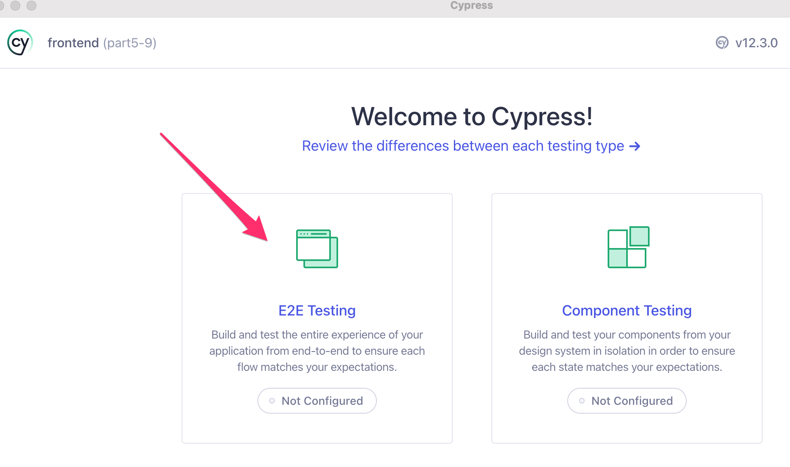

Em seguida, um navegador é selecionado (por exemplo, Chrome) e então clicamos em "Create new spec":

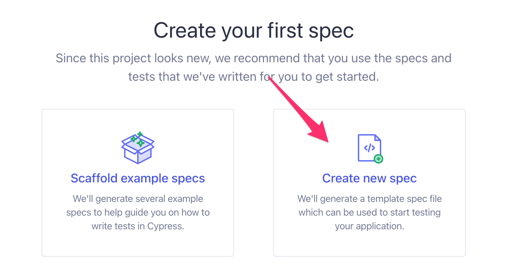

Vamos criar o arquivo de teste <i>cypress/e2e/note\_app.cy.js</i>:

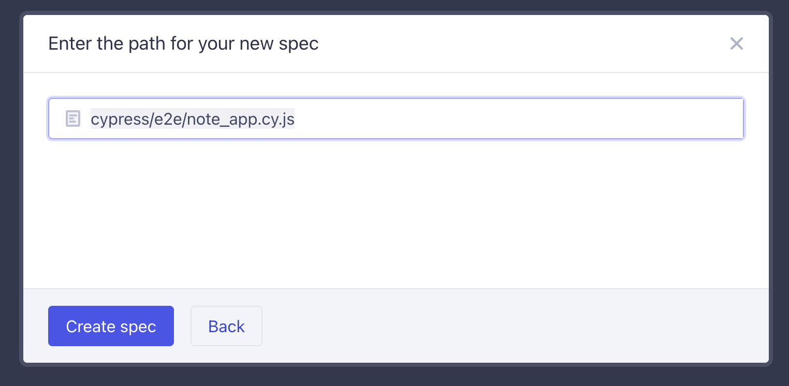

Poderíamos editar os testes no Cypress, mas vamos usar o VS Code:

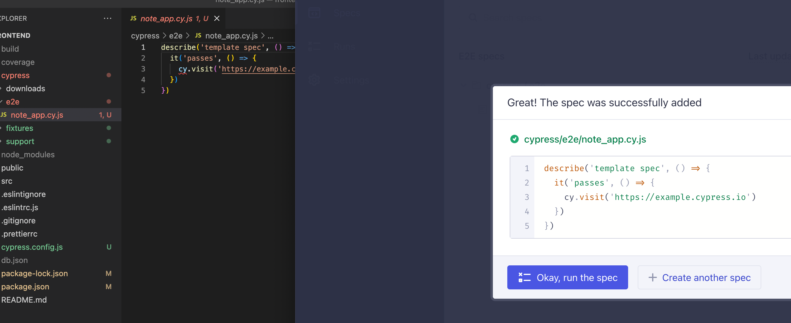

Agora podemos fechar a visualização de edição do Cypress.

Vamos alterar o conteúdo do teste da seguinte maneira:

```js
describe('Note app', function() {
  it('front page can be opened', function() {
    cy.visit('http://localhost:3000')
    cy.contains('Notes')
    cy.contains('Note app, Department of Computer Science, University of Helsinki 2023')
  })
})
```

O teste é executado clicando no teste no Cypress:

Executando o teste, podemos ver como a aplicação se comporta durante a execução do teste:

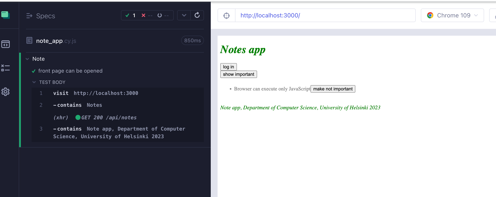

A estrutura do teste deve parecer familiar. Eles usam blocos <i>describe</i> para agrupar diferentes casos de teste, assim como o Jest. Os casos de teste foram definidos com o método <i>it</i>. O Cypress pegou essas partes da biblioteca de testes [Mocha](https://mochajs.org/), que ele usa internamente.

[cy.visit](https://docs.cypress.io/api/commands/visit.html) e [cy.contains](https://docs.cypress.io/api/commands/contains.html) são comandos do Cypress, e sua finalidade é bastante óbvia.
[cy.visit](https://docs.cypress.io/api/commands/visit.html) abre o endereço web fornecido a ele como parâmetro no navegador usado no teste. [cy.contains](https://docs.cypress.io/api/commands/contains.html) procura pela string que recebeu como parâmetro na página.

Poderíamos ter declarado o teste usando uma arrow function

```js
describe('Note app', () => { // highlight-line
  it('front page can be opened', () => { // highlight-line
    cy.visit('http://localhost:3000')
    cy.contains('Notes')
    cy.contains('Note app, Department of Computer Science, University of Helsinki 2023')
  })
})
```

No entanto, o Mocha [recomenda](https://mochajs.org/#arrow-functions) que as arrow functions não sejam usadas, pois podem causar alguns problemas em determinadas situações.

Se <i>cy.contains</i> não encontrar o texto que está procurando, o teste não passa. Portanto, se expandirmos nosso teste da seguinte maneira

```js
describe('Note app', function() {
  it('front page can be opened',  function() {
    cy.visit('http://localhost:3000')
    cy.contains('Notes')
    cy.contains('Note app, Department of Computer Science, University of Helsinki 2023')
  })

// highlight-start
  it('front page contains random text', function() {
    cy.visit('http://localhost:3000')
    cy.contains('wtf is this app?')
  })
// highlight-end
})
```

o teste falha

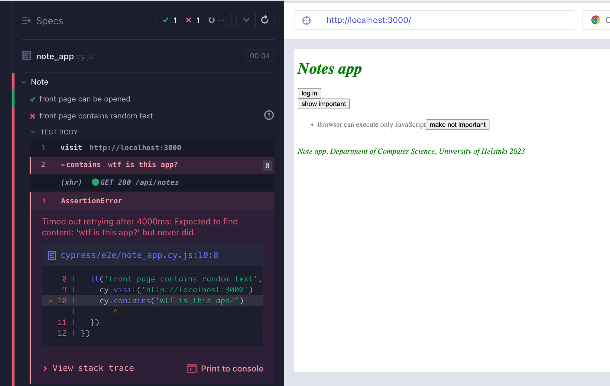

Vamos remover o código com falha do teste.

A variável _cy_ que nossos testes usam nos dá um erro desagradável do Eslint

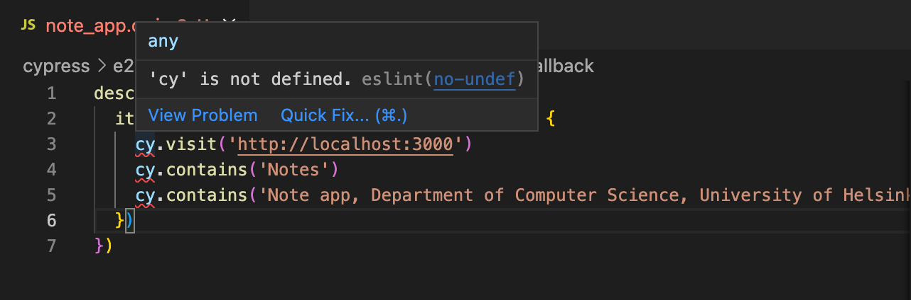

Podemos nos livrar disso instalando o [eslint-plugin-cypress](https://github.com/cypress-io/eslint-plugin-cypress) como uma dependência de desenvolvimento

```js
npm install eslint-plugin-cypress --save-dev
```

e alterando a configuração em <i>.eslintrc.js</i> da seguinte forma:

```js
module.exports = {
    "env": {
        "browser": true,
        "es6": true,
        "jest/globals": true,
        "cypress/globals": true // highlight-line
    },
    "extends": [ 
      // ...
    ],
    "parserOptions": {
      // ...
    },
    "plugins": [
        "react", "jest", "cypress" // highlight-line
    ],
    "rules": {
      // ...
    }
}
```

### Preenchendo um formulário

Vamos expandir nosso código para que o teste tente fazer login em nossa aplicação.
Vamos supor que nosso backend contenha um usuário com o nome de usuário <i>mluukkai</i> e senha <i>salainen</i>.

O teste começa abrindo o formulário de login.

```js
describe('Note app',  function() {
  // ...

  it('login form can be opened', function() {
    cy.visit('http://localhost:3000')
    cy.contains('log in').click()
  })
})
```

O teste procura primeiro o botão de login pelo seu texto e clica no botão com o comando [cy.click](https://docs.cypress.io/api/commands/click.html#Syntax).

Ambos os nossos testes começam da mesma maneira, abrindo a página <i><http://localhost:3000></i>, então devemos separar a parte compartilhada em um bloco <i>beforeEach</i> que é executado antes de cada teste:

```js
describe('Note app', function() {
  // highlight-start
  beforeEach(function() {
    cy.visit('http://localhost:3000')
  })
  // highlight-end

  it('front page can be opened', function() {
    cy.contains('Notes')
    cy.contains('Note app, Department of Computer Science, University of Helsinki 2023')
  })

  it('login form can be opened', function() {
    cy.contains('log in').click()
  })
})
```

O campo de login contém dois campos <i>input</i>, nos quais o teste deve escrever.

O comando [cy.get](https://docs.cypress.io/api/commands/get.html#Syntax) permite buscar elementos por seletores CSS.

Podemos acessar o primeiro e o último campo de entrada na página e escrever neles com o comando [cy.type](https://docs.cypress.io/api/commands/type.html#Syntax) assim:

```js
it('user can login', function () {
  cy.contains('log in').click()
  cy.get('input:first').type('mluukkai')
  cy.get('input:last').type('salainen')
})  
```

O teste funciona. O problema é que se adicionarmos mais campos de entrada posteriormente, o teste quebrará porque espera que os campos necessários sejam os primeiros e os últimos na página.

Seria melhor atribuir identificadores únicos aos nossos inputs e usá-los para encontrá-los.
Alteramos nosso formulário de login da seguinte forma:

```js
const LoginForm = ({ ... }) => {
  return (
    <div>
      <h2>Login</h2>
      <form onSubmit={handleSubmit}>
        <div>
          username
          <input
            id='username'  // highlight-line
            value={username}
            onChange={handleUsernameChange}
          />
        </div>
        <div>
          password
          <input
            id='password' // highlight-line
            type="password"
            value={password}
            onChange={handlePasswordChange}
          />
        </div>
        <button id="login-button" type="submit"> // highlight-line
          login
        </button>
      </form>
    </div>
  )
}
```

Também adicionamos um id ao nosso botão de envio para que possamos acessá-lo em nossos testes.

O teste fica assim:

```js
describe('Note app',  function() {
  // ..
  it('user can log in', function() {
    cy.contains('log in').click()
    cy.get('#username').type('mluukkai')  // highlight-line    
    cy.get('#password').type('salainen')  // highlight-line
    cy.get('#login-button').click()  // highlight-line

    cy.contains('Matti Luukkainen logged in') // highlight-line
  })
})
```

A última linha garante que o login foi bem-sucedido.

Observe que o seletor CSS para o [id-selector](https://developer.mozilla.org/en-US/docs/Web/CSS/ID_selectors) é #, então, se quisermos buscar um elemento com o id <i>username</i>, o seletor CSS é <i>#username</i>.

Note que passar no teste nesta etapa requer a existência de um usuário no banco de dados de teste do ambiente de backend, cujo nome de usuário é <i>mluukkai</i> e a senha é <i>salainen</i>. Crie um usuário, se necessário!

### Testando o formulário de nova nota

Agora vamos adicionar métodos de teste para testar a funcionalidade de "nova nota":

```js
describe('Note app', function() {
  // ..
  // highlight-start
  describe('when logged in', function() {
    beforeEach(function() {
      cy.contains('log in').click()
      cy.get('input:first').type('mluukkai')
      cy.get('input:last').type('salainen')
      cy.get('#login-button').click()
    })
    // highlight-end

    // highlight-start
    it('a new note can be created', function() {
      cy.contains('new note').click()
      cy.get('input').type('a note created by cypress')
      cy.contains('save').click()

      cy.contains('a note created by cypress')
    })
  })
  // highlight-end
})
```

O teste foi definido em seu próprio bloco <i>describe</i>.
Apenas usuários logados podem criar novas notas, então adicionamos o login à aplicação em um bloco <i>beforeEach</i>.

O teste pressupõe que, ao criar uma nova nota, a página contém apenas um campo de entrada, então ele o busca da seguinte maneira:

```js
cy.get('input')
```

Se a página contiver mais campos de entrada, o teste falhará.

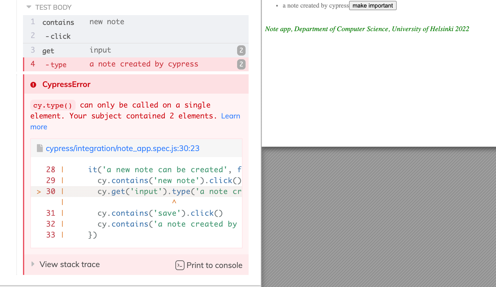

Devido a esse problema, seria melhor atribuir um <i>id</i> à entrada e pesquisar o elemento pelo seu id.

A estrutura dos testes é a seguinte:

```js
describe('Note app', function() {
  // ...

  it('user can log in', function() {
    cy.contains('log in').click()
    cy.get('#username').type('mluukkai')
    cy.get('#password').type('salainen')
    cy.get('#login-button').click()

    cy.contains('Matti Luukkainen logged in')
  })

  describe('when logged in', function() {
    beforeEach(function() {
      cy.contains('log in').click()
      cy.get('input:first').type('mluukkai')
      cy.get('input:last').type('salainen')
      cy.get('#login-button').click()
    })

    it('a new note can be created', function() {
      // ...
    })
  })
})
```

O Cypress executa os testes na ordem em que estão no código. Portanto, primeiro ele executa <i>user can log in</i> (usuário pode fazer login), onde o usuário faz login. Em seguida, o Cypress executará <i>a new note can be created</i> (uma nova nota pode ser criada), para o qual um bloco <i>beforeEach</i> também faz login.
Por que fazer isso? O usuário não está logado após o primeiro teste?
Não, porque <i>cada</i> teste começa do zero do ponto de vista do navegador.
Todas as alterações no estado do navegador são revertidas após cada teste.

### Controlando o estado do banco de dados

Se os testes precisarem ser capazes de modificar o banco de dados do servidor, a situação imediatamente se torna mais complicada. Idealmente, o banco de dados do servidor deve ser o mesmo sempre que executamos os testes, para que os testes possam ser reproduzíveis com confiabilidade e facilidade.

Assim como nos testes de unidade e integração, nos testes E2E é melhor esvaziar o banco de dados e possivelmente formatá-lo antes de executar os testes. O desafio nos testes E2E é que eles não têm acesso ao banco de dados.

A solução é criar endpoints de API para os testes do backend.
Podemos esvaziar o banco de dados usando esses endpoints.
Vamos criar um novo <i>router</i> para os testes:

```js
const testingRouter = require('express').Router()
const Note = require('../models/note')
const User = require('../models/user')

testingRouter.post('/reset', async (request, response) => {
  await Note.deleteMany({})
  await User.deleteMany({})

  response.status(204).end()
})

module.exports = testingRouter
```

e adicioná-lo ao backend somente <i>se a aplicação estiver em modo de teste</i>:

```js
// ...

app.use('/api/login', loginRouter)
app.use('/api/users', usersRouter)
app.use('/api/notes', notesRouter)

// highlight-start
if (process.env.NODE_ENV === 'test') {
  const testingRouter = require('./controllers/testing')
  app.use('/api/testing', testingRouter)
}
// highlight-end

app.use(middleware.unknownEndpoint)
app.use(middleware.errorHandler)

module.exports = app
```

Após as alterações, uma solicitação HTTP POST para o endpoint <i>/api/testing/reset</i> esvazia o banco de dados. Verifique se o backend está sendo executado no modo de teste iniciando-o com o seguinte comando (previamente configurado no arquivo package.json):

```js
  npm run start:test
```
O código backend modificado pode ser encontrado no [GitHub](https://github.com/fullstack-hy2020/part3-notes-backend/tree/part5-1), na branch <i>part5-1</i>.

Em seguida, vamos alterar o bloco <i>beforeEach</i> para que ele esvazie o banco de dados do servidor antes da execução dos testes.

Atualmente, não é possível adicionar novos usuários por meio da interface do usuário do frontend, então adicionamos um novo usuário ao backend a partir do bloco beforeEach.

```js
describe('Note app', function() {
   beforeEach(function() {
    // highlight-start
    cy.request('POST', 'http://localhost:3001/api/testing/reset')
    const user = {
      name: 'Matti Luukkainen',
      username: 'mluukkai',
      password: 'salainen'
    }
    cy.request('POST', 'http://localhost:3001/api/users/', user) 
    // highlight-end
    cy.visit('http://localhost:3000')
  })
  
  it('front page can be opened', function() {
    // ...
  })

  it('user can login', function() {
    // ...
  })

  describe('when logged in', function() {
    // ...
  })
})
```

Durante a formatação, o teste faz requisições HTTP para o backend com [cy.request](https://docs.cypress.io/api/commands/request.html).

Ao contrário do passado, agora os testes começam com o backend no mesmo estado todas as vezes. O backend conterá um usuário e nenhuma nota.

Vamos adicionar mais um teste para verificar se podemos alterar a importância das notas.

Algum tempo atrás nós alteramos o frontend de forma que uma nova nota é adicionada como importante por padrão, o campo <i>important</i> é <i>true</i>:

```js
const NoteForm = ({ createNote }) => {
  // ...

  const addNote = (event) => {
    event.preventDefault()
    createNote({
      content: newNote,
      important: true // highlight-line
    })

    setNewNote('')
  }
  // ...
} 
```

Há várias maneiras de testar isso. No exemplo a seguir, primeiro procuramos por uma nota e clicamos no botão <i>tornar não importante</i>. Em seguida, verificamos se a nota agora contém um botão <i>tornar importante</i>.

```js
describe('Note app', function() {
  // ...

  describe('when logged in', function() {
    // ...

    describe('and a note exists', function () {
      beforeEach(function () {
        cy.contains('new note').click()
        cy.get('input').type('another note cypress')
        cy.contains('save').click()
      })

      it('it can be made not important', function () {
        cy.contains('another note cypress')
          .contains('make not important')
          .click()

        cy.contains('another note cypress')
          .contains('make important')
      })
    })
  })
})
```

O primeiro comando procura por um componente que contém o texto <i>outra nota cypress</i>, e depois por um botão <i>tornar não importante</i> dentro dele. Em seguida, ele clica no botão.

O segundo comando verifica se o texto do botão foi alterado para <i>tornar importante</i>.

Os testes e o código frontend atual podem ser encontrados no [GitHub](https://github.com/fullstack-hy2020/part2-notes/tree/part5-9), na branch <i>part5-9</i>.

### Teste de falha de login

Vamos fazer um teste para garantir que uma tentativa de login falhe se a senha estiver incorreta.

O Cypress executará todos os testes a cada vez por padrão, e à medida que o número de testes aumenta, isso começa a consumir bastante tempo. Ao desenvolver um novo teste ou depurar um teste quebrado, podemos definir o teste com <i>it.only</i> em vez de <i>it</i>, para que o Cypress execute apenas o teste necessário. Quando o teste estiver funcionando, podemos remover o <i>.only</i>.

A primeira versão dos nossos testes é a seguinte:

```js
describe('Note app', function() {
  // ...

  it.only('login fails with wrong password', function() {
    cy.contains('log in').click()
    cy.get('#username').type('mluukkai')
    cy.get('#password').type('wrong')
    cy.get('#login-button').click()

    cy.contains('wrong credentials')
  })

  // ...
)}
```

O teste usa [cy.contains](https://docs.cypress.io/api/commands/contains.html#Syntax) para garantir que o aplicativo exiba uma mensagem de erro.

O aplicativo renderiza a mensagem de erro em um componente com a classe CSS <i>error</i>:

```js
const Notification = ({ message }) => {
  if (message === null) {
    return null
  }

  return (
    <div className="error"> // highlight-line
      {message}
    </div>
  )
}
```

Podemos fazer o teste garantir que a mensagem de erro seja renderizada no componente correto, ou seja, o componente com a classe CSS <i>error</i>:

```js
it('login fails with wrong password', function() {
  // ...

  cy.get('.error').contains('wrong credentials') // highlight-line
})
```

Primeiro, usamos [cy.get](https://docs.cypress.io/api/commands/get.html#Syntax) para procurar um componente com a classe CSS <i>error</i>. Em seguida, verificamos se a mensagem de erro pode ser encontrada a partir desse componente.
Observe que o [seletor de classe CSS](https://developer.mozilla.org/en-US/docs/Web/CSS/Class_selectors) começa com um ponto, então o seletor para a classe <i>error</i> é <i>.error</i>.

Podemos fazer o mesmo usando a sintaxe do [should](https://docs.cypress.io/api/commands/should.html):

```js
it('login fails with wrong password', function() {
  // ...

  cy.get('.error').should('contain', 'wrong credentials') // highlight-line
})
```

Usar o should é um pouco mais complicado do que usar <i>contains</i>, mas permite testes mais diversos do que <i>contains</i>, que funciona apenas com base no conteúdo de texto.

Uma lista das asserções mais comuns que podem ser usadas com o _should_ pode ser encontrada [aqui](https://docs.cypress.io/guides/references/assertions.html#Common-Assertions).

Por exemplo, podemos garantir que a mensagem de erro seja vermelha e tenha uma borda:

```js
it('login fails with wrong password', function() {
  // ...

  cy.get('.error').should('contain', 'wrong credentials') 
  cy.get('.error').should('have.css', 'color', 'rgb(255, 0, 0)')
  cy.get('.error').should('have.css', 'border-style', 'solid')
})
```

O Cypress requer que as cores sejam fornecidas em formato [rgb](https://rgbcolorcode.com/color/red).

Como todos os testes são para o mesmo componente que acessamos usando [cy.get](https://docs.cypress.io/api/commands/get.html#Syntax), podemos encadeá-los usando o [and](https://docs.cypress.io/api/commands/and.html).

```js
it('login fails with wrong password', function() {
  // ...

  cy.get('.error')
    .should('contain', 'wrong credentials')
    .and('have.css', 'color', 'rgb(255, 0, 0)')
    .and('have.css', 'border-style', 'solid')
})
```

Vamos concluir o teste para também verificar se o aplicativo não renderiza a mensagem de sucesso <i>'Matti Luukkainen logged in'</i>:

```js
it('login fails with wrong password', function() {
  cy.contains('log in').click()
  cy.get('#username').type('mluukkai')
  cy.get('#password').type('wrong')
  cy.get('#login-button').click()

  cy.get('.error')
    .should('contain', 'wrong credentials')
    .and('have.css', 'color', 'rgb(255, 0, 0)')
    .and('have.css', 'border-style', 'solid')

  cy.get('html').should('not.contain', 'Matti Luukkainen logged in') // highlight-line
})
```

O comando <i>should</i> é mais frequentemente usado encadeando-o após o comando <i>get</i> (ou outro comando similar que pode ser encadeado). O <i>cy.get('html')</i> usado no teste significa praticamente o conteúdo visível de todo o aplicativo.

Também podemos verificar o mesmo encadeando o comando <i>contains</i> com o comando <i>should</i> com um parâmetro ligeiramente diferente:

```js
cy.contains('Matti Luukkainen logged in').should('not.exist')
```

**NOTA:** Algumas propriedades CSS [comportam-se de forma diferente no Firefox](https://github.com/cypress-io/cypress/issues/9349). Se você executar os testes com o Firefox:
  
  
  
  então os testes que envolvem, por exemplo, `border-style`, `border-radius` e `padding`, serão aprovados no Chrome ou Electron, mas falharão no Firefox:
  
  

### Bypassando a interface de usuário

Atualmente, temos os seguintes testes:

```js
describe('Note app', function() {
  it('user can login', function() {
    cy.contains('log in').click()
    cy.get('#username').type('mluukkai')
    cy.get('#password').type('salainen')
    cy.get('#login-button').click()

    cy.contains('Matti Luukkainen logged in')
  })

  it('login fails with wrong password', function() {
    // ...
  })

  describe('when logged in', function() {
    beforeEach(function() {
      cy.contains('log in').click()
      cy.get('input:first').type('mluukkai')
      cy.get('input:last').type('salainen')
      cy.get('#login-button').click()
    })

    it('a new note can be created', function() {
      // ... 
    })
   
  })
})
```

Primeiro, testamos o login. Em seguida, em seu próprio bloco "describe", temos um monte de testes que esperam que o usuário esteja logado. O usuário é logado no bloco <i>beforeEach</i>.

Como mencionado acima, cada teste parte do zero! Os testes não iniciam a partir do estado em que os testes anteriores terminaram.

A documentação do Cypress nos dá o seguinte conselho: [Teste completamente o fluxo de login - mas apenas uma vez!](https://docs.cypress.io/guides/end-to-end-testing/testing-your-app#Fully-test-the-login-flow-but-only-once).
Portanto, em vez de fazer login de um usuário usando o formulário no bloco <i>beforeEach</i>, o Cypress recomenda que nós façamos o [bypass da interface de usuário](https://docs.cypress.io/guides/getting-started/testing-your-app.html#Bypassing-your-UI) e uma requisição HTTP ao backend para fazer o login. A razão para isso é que fazer login com uma requisição HTTP é muito mais rápido do que preencher um formulário.

Nossa situação é um pouco mais complicada do que no exemplo da documentação do Cypress porque, quando um usuário faz login, nossa aplicação salva seus detalhes no localStorage.
No entanto, o Cypress também pode lidar com isso.
O código é o seguinte:

```js
describe('when logged in', function() {
  beforeEach(function() {
    // highlight-start
    cy.request('POST', 'http://localhost:3001/api/login', {
      username: 'mluukkai', password: 'salainen'
    }).then(response => {
      localStorage.setItem('loggedNoteappUser', JSON.stringify(response.body))
      cy.visit('http://localhost:3000')
    })
    // highlight-end
  })

  it('a new note can be created', function() {
    // ...
  })

  // ...
})
```

Podemos acessar a resposta de uma [cy.request](https://docs.cypress.io/api/commands/request.html) com o método _then_. Por baixo dos panos, <i>cy.request</i>, assim como todos os comandos do Cypress, são [promessas](https://docs.cypress.io/guides/core-concepts/introduction-to-cypress.html#Commands-Are-Promises).
A função de retorno de chamada salva os detalhes de um usuário logado no localStorage e recarrega a página. Agora não há diferença para um usuário fazer login usando o formulário de login.

Se e quando escrevermos novos testes para nossa aplicação, teremos que usar o código de login em vários lugares.
Devemos transformá-lo em um [comando personalizado](https://docs.cypress.io/api/cypress-api/custom-commands.html).

Comandos personalizados são declarados em <i>cypress/support/commands.js</i>.
O código para fazer login é o seguinte:

```js
Cypress.Commands.add('login', ({ username, password }) => {
  cy.request('POST', 'http://localhost:3001/api/login', {
    username, password
  }).then(({ body }) => {
    localStorage.setItem('loggedNoteappUser', JSON.stringify(body))
    cy.visit('http://localhost:3000')
  })
})
```

Usar nosso comando personalizado é fácil e nosso teste fica mais limpo:

```js
describe('when logged in', function() {
  beforeEach(function() {
    // highlight-start
    cy.login({ username: 'mluukkai', password: 'salainen' })
    // highlight-end
  })

  it('a new note can be created', function() {
    // ...
  })

  // ...
})
```

O mesmo se aplica à criação de uma nova anotação, agora que pensamos sobre isso. Temos um teste que cria uma nova anotação usando o formulário. Também criamos uma nova anotação no bloco <i>beforeEach</i> do teste que testa a alteração da importância de uma anotação."


```js
describe('Note app', function() {
  // ...

  describe('when logged in', function() {
    it('a new note can be created', function() {
      cy.contains('new note').click()
      cy.get('input').type('a note created by cypress')
      cy.contains('save').click()

      cy.contains('a note created by cypress')
    })

    describe('and a note exists', function () {
      beforeEach(function () {
        cy.contains('new note').click()
        cy.get('input').type('another note cypress')
        cy.contains('save').click()
      })

      it('it can be made important', function () {
        // ...
      })
    })
  })
})
```

Vamos criar um novo comando personalizado para criar uma nova nota. O comando irá criar uma nova nota com uma requisição HTTP POST:

```js
Cypress.Commands.add('createNote', ({ content, important }) => {
  cy.request({
    url: 'http://localhost:3001/api/notes',
    method: 'POST',
    body: { content, important },
    headers: {
      'Authorization': `Bearer ${JSON.parse(localStorage.getItem('loggedNoteappUser')).token}`
    }
  })

  cy.visit('http://localhost:3000')
})
```

O comando espera que o usuário esteja logado e que os detalhes do usuário estejam salvos no localStorage.

Agora o bloco de formatação fica assim:

```js
describe('Note app', function() {
  // ...

  describe('when logged in', function() {
    it('a new note can be created', function() {
      // ...
    })

    describe('and a note exists', function () {
      beforeEach(function () {
        // highlight-start
        cy.createNote({
          content: 'another note cypress',
          important: true
        })
        // highlight-end
      })

      it('it can be made important', function () {
        // ...
      })
    })
  })
})
```

Existe mais uma característica irritante em nossos testes. O endereço da aplicação <i>http:localhost:3000</i> está codificado em vários lugares.

Vamos definir o <i>baseUrl</i> para a aplicação no [arquivo de configuração](https://docs.cypress.io/guides/references/configuration) <i>cypress.config.js</i>, que é pré-gerado do Cypress:

```js
const { defineConfig } = require("cypress")

module.exports = defineConfig({
  e2e: {
    setupNodeEvents(on, config) {
    },
    baseUrl: 'http://localhost:3000' // highlight-line
  },
})
```

Todos os comandos nos testes utilizam o endereço da aplicação

```js
cy.visit('http://localhost:3000' )
```

podem ser transformados em

```js
cy.visit('')
```

O endereço codificado da backend <i>http://localhost:3001</i> ainda está nos testes. A [documentation](https://docs.cypress.io/guides/guides/environment-variables) do Cypress recomenda definir outros endereços utilizados pelos testes como variáveis de ambiente.

Vamos expandir o arquivo de configuração <i>cypress.config.js</i> da seguinte maneira:

```js
const { defineConfig } = require("cypress")

module.exports = defineConfig({
  e2e: {
    setupNodeEvents(on, config) {
    },
    baseUrl: 'http://localhost:3000',
  },
  env: {
    BACKEND: 'http://localhost:3001/api' // highlight-line
  }
})
```

Vamos substituir todos os endereços do backend nos testes da seguinte maneira

```js
describe('Note ', function() {
  beforeEach(function() {

    cy.request('POST', `${Cypress.env('BACKEND')}/testing/reset`) // highlight-line
    const user = {
      name: 'Matti Luukkainen',
      username: 'mluukkai',
      password: 'secret'
    }
    cy.request('POST', `${Cypress.env('BACKEND')}/users`, user) // highlight-line
    cy.visit('')
  })
  // ...
})
```

Os testes e o código frontend podem ser encontrados no [GitHub](https://github.com/fullstack-hy2020/part2-notes/tree/part5-10) na branch <i>part5-10</i>.

### Alterando a importância de uma nota

Por último, vamos dar uma olhada no teste que fizemos para alterar a importância de uma nota.
Primeiro, vamos alterar o bloco de formatação para criar três notas em vez de uma:

```js
describe('when logged in', function() {
  describe('and several notes exist', function () {
    beforeEach(function () {
      // highlight-start
      cy.createNote({ content: 'first note', important: false })
      cy.createNote({ content: 'second note', important: false })
      cy.createNote({ content: 'third note', important: false })
      // highlight-end
    })

    it('one of those can be made important', function () {
      cy.contains('second note')
        .contains('make important')
        .click()

      cy.contains('second note')
        .contains('make not important')
    })
  })
})
```

Como o comando [cy.contains](https://docs.cypress.io/api/commands/contains.html) realmente funciona?

Quando clicamos no comando _cy.contains('segunda nota')_ no Cypress [Test Runner](https://docs.cypress.io/guides/core-concepts/test-runner.html), vemos que o comando busca pelo elemento que contém o texto <i>segunda nota</i>:

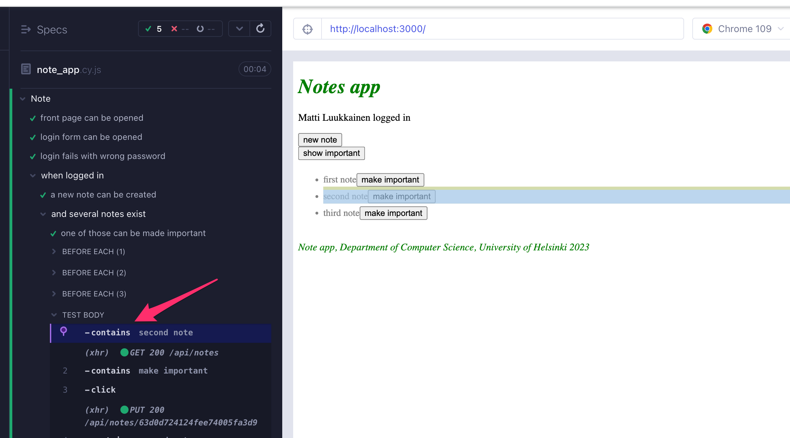

Ao clicar na linha seguinte _.contains('make important')_, vemos que o teste usa o botão 'make important' correspondente à <i>segunda nota</i>:

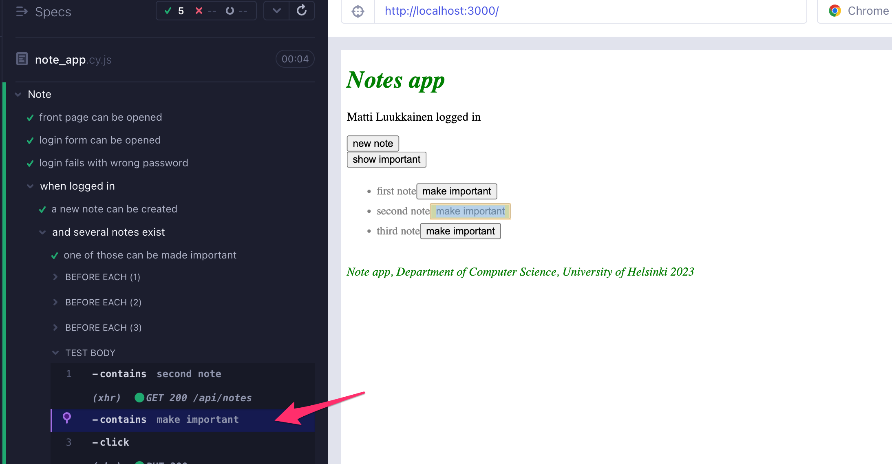

Quando encadeado, o segundo comando <i>contains</i> continua a busca a partir do componente encontrado pelo primeiro comando.

Se não tivéssemos encadeado os comandos e, em vez disso, escrevêssemos:

```js
cy.contains('second note')
cy.contains('make important').click()
```

o resultado teria sido completamente diferente. A segunda linha do teste clicaria no botão de uma nota errada:

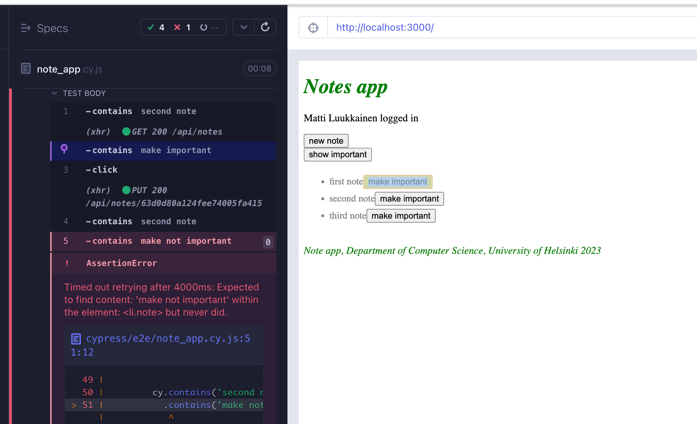

Ao codificar testes, você deve verificar no test runner se os testes usam os componentes corretos!

Vamos alterar o componente _Note_ para que o texto da nota seja renderizado em um elemento <i>span</i>.

```js
const Note = ({ note, toggleImportance }) => {
  const label = note.important
    ? 'make not important' : 'make important'

  return (
    <li className='note'>
      <span>{note.content}</span> // highlight-line
      <button onClick={toggleImportance}>{label}</button>
    </li>
  )
}
```

Nossos testes quebram! Como o test runner revela, _cy.contains('second note')_ agora retorna o componente que contém o texto, e o botão não está nele.

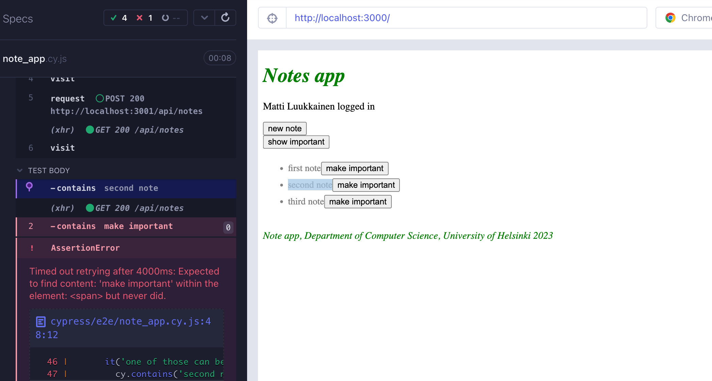

Uma maneira de corrigir isso é a seguinte:

```js
it('one of those can be made important', function () {
  cy.contains('second note').parent().find('button').click()
  cy.contains('second note').parent().find('button')
    .should('contain', 'make not important')
})
```

Na primeira linha, usamos o comando [parent](https://docs.cypress.io/api/commands/parent.html) para acessar o elemento pai do elemento que contém a <i>segunda nota</i> e encontrar o botão dentro dele.
Em seguida, clicamos no botão e verificamos se o texto nele muda.

Observe que usamos o comando [find](https://docs.cypress.io/api/commands/find.html#Syntax) para pesquisar o botão. Não podemos usar [cy.get](https://docs.cypress.io/api/commands/get.html) aqui, porque ele sempre procura em toda a página e retornaria todos os 5 botões na página.

Infelizmente, agora temos algum código duplicado nos testes, porque o código para procurar o botão correto é sempre o mesmo.

Nesses tipos de situações, é possível usar o comando [as](https://docs.cypress.io/api/commands/as.html):

```js
it('one of those can be made important', function () {
  cy.contains('second note').parent().find('button').as('theButton')
  cy.get('@theButton').click()
  cy.get('@theButton').should('contain', 'make not important')
})
```

Agora, a primeira linha encontra o botão correto e o salva como <i>theButton</i> usando o <i>as</i>. As linhas seguintes podem usar o elemento nomeado com <i>cy.get('@theButton')</i>.

### Executando e depurando os testes

Por fim, algumas observações sobre como o Cypress funciona e como depurar seus testes.

A forma dos testes do Cypress dá a impressão de que os testes são código JavaScript normal, e poderíamos, por exemplo, tentar o seguinte:

```js
const button = cy.contains('log in')
button.click()
debugger
cy.contains('logout').click()
```

No entanto, isso não funcionará. Quando o Cypress executa um teste, ele adiciona cada comando <i>cy</i> a uma fila de execução.
Quando o código do método de teste é executado, o Cypress executará cada comando na fila, um por um.

Os comandos do Cypress sempre retornam <i>undefined</i>, portanto, <i>button.click()</i> no código acima causaria um erro. Uma tentativa de iniciar o depurador não interromperia o código entre a execução dos comandos, mas sim antes que qualquer comando tenha sido executado.

Os comandos do Cypress são <i>como promessas</i>, então, se quisermos acessar seus valores de retorno, precisamos fazer isso usando o comando [then](https://docs.cypress.io/api/commands/then.html).
Por exemplo, o teste a seguir imprimiria o número de botões na aplicação e clicaria no primeiro botão:

```js
it('then example', function() {
  cy.get('button').then( buttons => {
    console.log('number of buttons', buttons.length)
    cy.wrap(buttons[0]).click()
  })
})
```

Interromper a execução do teste com o depurador é [possível](https://docs.cypress.io/api/commands/debug.html). O depurador só é iniciado se o console do Cypress test runner estiver aberto.

O console do desenvolvedor é extremamente útil ao depurar seus testes.
Você pode ver as solicitações HTTP feitas pelos testes na guia "Network" e a guia "Console" mostrará informações sobre seus testes:

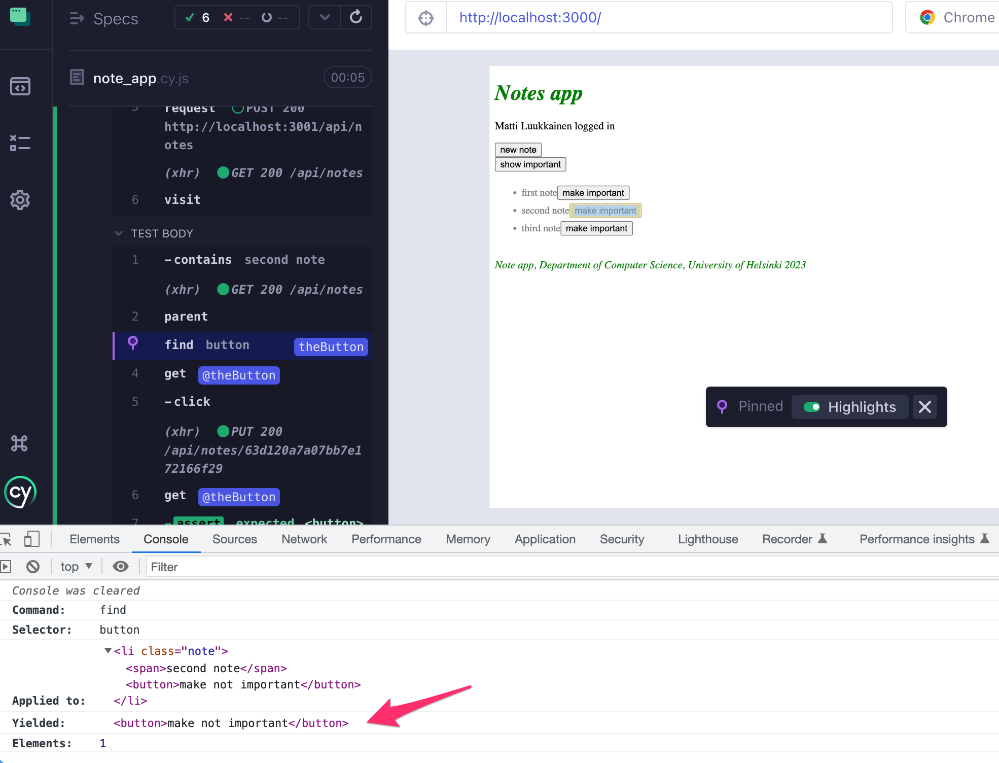

Até agora, executamos nossos testes Cypress usando o test runner gráfico.
Também é possível executá-los [a partir da linha de comando](https://docs.cypress.io/guides/guides/command-line.html). Só precisamos adicionar um script npm para isso:

```js
  "scripts": {
    "start": "react-scripts start",
    "build": "react-scripts build",
    "test": "react-scripts test",
    "eject": "react-scripts eject",
    "server": "json-server -p3001 --watch db.json",
    "cypress:open": "cypress open",
    "test:e2e": "cypress run" // highlight-line
  },
```

Agora podemos executar nossos testes a partir da linha de comando com o comando <i>npm run test:e2e</i>

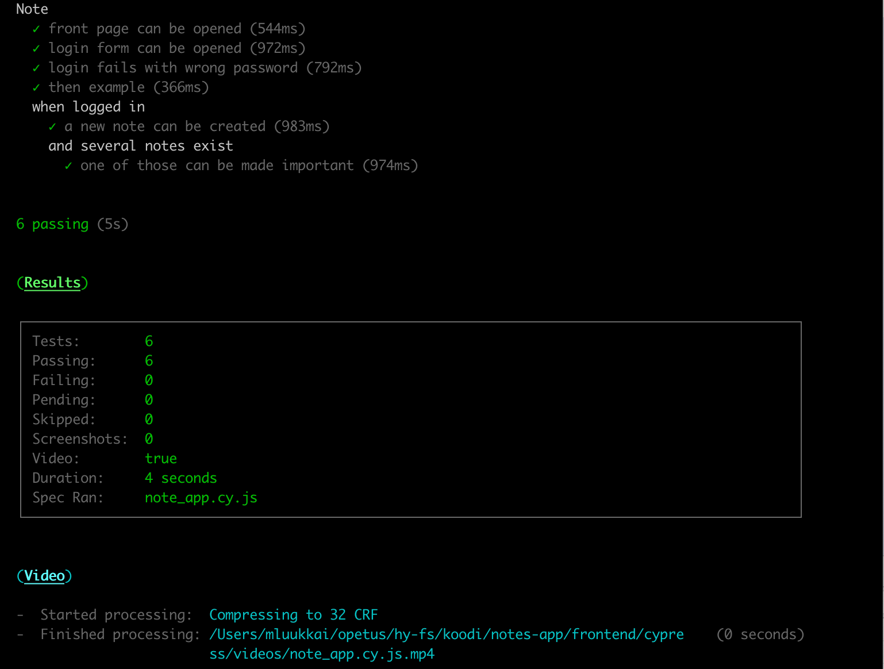

Observe que os vídeos da execução do teste serão salvos em <i>cypress/videos/</i>, portanto, você provavelmente deve ignorar esse diretório no git. Também é possível [desativar](https://docs.cypress.io/guides/guides/screenshots-and-videos#Videos) a criação de vídeos.

O código frontend e de teste pode ser encontrado no [GitHub](https://github.com/fullstack-hy2020/part2-notes/tree/part5-11) na branch <i>part5-11</i>.

</div>

<div class="tasks">

### Exercícios 5.17-5.23.

Nos últimos exercícios desta parte, faremos alguns testes E2E para nossa aplicação de blog.
O material desta parte deve ser suficiente para completar os exercícios.
Você **deve consultar a [documentação](https://docs.cypress.io/guides/overview/why-cypress.html#In-a-nutshell)** do Cypress. Provavelmente é a melhor documentação que já vi para um projeto de código aberto.

Recomendo especialmente a leitura de [Introdução ao Cypress](https://docs.cypress.io/guides/core-concepts/introduction-to-cypress.html#Cypress-Can-Be-Simple-Sometimes), que afirma:

> <i>Este é o guia mais importante para entender como testar com o Cypress. Leia. Entenda.</i>

#### 5.17: testes end-to-end do bloglist, etapa 1

Configure o Cypress para o seu projeto. Crie um teste para verificar se a aplicação exibe o formulário de login por padrão.

A estrutura do teste deve ser a seguinte:

```js
describe('Blog app', function() {
  beforeEach(function() {
    cy.request('POST', 'http://localhost:3003/api/testing/reset')
    cy.visit('http://localhost:3000')
  })

  it('Login form is shown', function() {
    // ...
  })
})
```

O bloco <i>beforeEach</i> deve esvaziar o banco de dados usando, por exemplo, o método que usamos no [material](/ptbr/part5/testes_end_to_end#controlando-o-estado-do-banco-de-dados).

#### 5.18: testes end-to-end do bloglist, etapa 2

Faça testes para fazer login. Teste tentativas de login bem-sucedidas e malsucedidas.
Crie um novo usuário no bloco <i>beforeEach</i> para os testes.

A estrutura do teste se estende da seguinte forma:

```js
describe('Aplicativo Blog', function() {
  beforeEach(function() {
    cy.request('POST', 'http://localhost:3003/api/testing/reset')
    // crie aqui um usuário para o backend
    cy.visit('http://localhost:3000')
  })

  it('Login form is shown', function() {
    // ...
  })

  describe('Login',function() {
    it('succeeds with correct credentials', function() {
      // ...
    })

    it('fails with wrong credentials', function() {
      // ...
    })
  })
})
```

Exercício bônus opcional: Verifique se a notificação exibida após uma tentativa de login malsucedida é exibida em vermelho.

#### 5.19: testes end-to-end do bloglist, etapa 3

Crie um teste que verifique se um usuário logado pode criar um novo blog.
A estrutura do teste pode ser a seguinte:

```js
describe('Blog app', function() {
  // ...

  describe('When logged in', function() {
    beforeEach(function() {
      // faça login do usuário aqui
    })

    it('A blog can be created', function() {
      // ...
    })
  })

})
```

"O teste deve garantir que um novo blog seja adicionado à lista de todos os blogs.

#### 5.20: Testes end-to-end do bloglist, passo 4

Crie um teste que confirme que os usuários podem curtir um blog.

#### 5.21: Testes end-to-end do bloglist, passo 5

Crie um teste para garantir que o usuário que criou um blog possa excluí-lo.

#### 5.22: Testes end-to-end do bloglist, passo 6

Crie um teste para garantir que outros usuários, exceto o criador, não vejam o botão de exclusão.

#### 5.23: Testes end-to-end do bloglist, passo 7

Crie um teste que verifique se os blogs estão ordenados de acordo com as curtidas, sendo o blog com mais curtidas o primeiro.

<i>Este exercício é um pouco mais complicado do que os anteriores.</i> Uma solução é adicionar uma determinada classe para o elemento que envolve o conteúdo do blog e usar o método [eq](https://docs.cypress.io/api/commands/eq#Syntax) para obter o elemento do blog em um índice específico:

```js
cy.get('.blog').eq(0).should('contain', 'The title with the most likes')
cy.get('.blog').eq(1).should('contain', 'The title with the second most likes')
```

Observe que você pode ter problemas se clicar no botão de curtir muitas vezes seguidas. Pode ser que o Cypress clique tão rapidamente que não tenha tempo para atualizar o estado do aplicativo entre os cliques. Uma solução para isso é aguardar a atualização do número de curtidas entre todos os cliques.

Este foi o último exercício desta parte, é hora de enviar seu código para o GitHub e marcar os exercícios que você completou no [sistema de envio de exercícios](https://studies.cs.helsinki.fi/stats/courses/fullstackopen).

</div>
