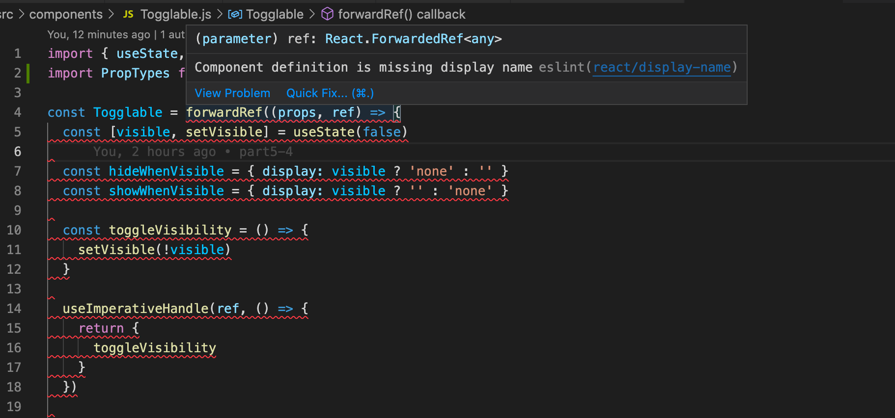

<div class="content">

### Displaying the login form only when appropriate

<!-- Let's modify the application so that the login form is not displayed by default:-->
 让我们修改应用，使其默认不显示登录表单。


<!-- The login form appears when the user presses the <i>login</i> button:-->
 当用户按下<i>login</i>按钮时，登录表单就会出现。


<!-- The user can close the login form by clicking the <i>cancel</i> button.-->
 用户可以通过点击<i>取消</i>按钮来关闭登录表格。

<!-- Let's start by extracting the login form into its own component:-->
 我们先把登录表单提取到它自己的组件中。

```js
const LoginForm = ({
   handleSubmit,
   handleUsernameChange,
   handlePasswordChange,
   username,
   password
  }) => {
  return (
    <div>
      <h2>Login</h2>

      <form onSubmit={handleSubmit}>
        <div>
          username
          <input
            value={username}
            onChange={handleUsernameChange}
          />
        </div>
        <div>
          password
          <input
            type="password"
            value={password}
            onChange={handlePasswordChange}
          />
      </div>
        <button type="submit">login</button>
      </form>
    </div>
  )
}

export default LoginForm
```


<!-- The state and all the functions related to it are defined outside of the component and are passed to the component as props.-->
 状态和所有与之相关的功能都是在组件之外定义的，并作为prop传递给组件。


<!-- Notice that the props are assigned to variables through <i>destructuring</i>, which means that instead of writing:-->
 注意，props是通过<i>destructuring</i>分配给变量的，这意味着不用再写。

```js
const LoginForm = (props) => {
  return (
    <div>
      <h2>Login</h2>
      <form onSubmit={props.handleSubmit}>
        <div>
          username
          <input
            value={props.username}
            onChange={props.handleChange}
            name="username"
          />
        </div>
        // ...
        <button type="submit">login</button>
      </form>
    </div>
  )
}
```


<!-- where the properties of the _props_ object are accessed through e.g. _props.handleSubmit_, the properties are assigned directly to their own variables.-->
通过例如_props.handleSubmit_来访问_props_对象的属性，而是直接将属性分配给它们自己的变量。


<!-- One fast way of implementing the functionality is to change the _loginForm_ function of the <i>App</i> component like so:-->
 实现该功能的一个快速方法是像这样改变<i>App</i>组件的_loginForm_函数。

```js
const App = () => {
  const [loginVisible, setLoginVisible] = useState(false) // highlight-line

  // ...

  const loginForm = () => {
    const hideWhenVisible = { display: loginVisible ? 'none' : '' }
    const showWhenVisible = { display: loginVisible ? '' : 'none' }

    return (
      <div>
        <div style={hideWhenVisible}>
          <button onClick={() => setLoginVisible(true)}>log in</button>
        </div>
        <div style={showWhenVisible}>
          <LoginForm
            username={username}
            password={password}
            handleUsernameChange={({ target }) => setUsername(target.value)}
            handlePasswordChange={({ target }) => setPassword(target.value)}
            handleSubmit={handleLogin}
          />
          <button onClick={() => setLoginVisible(false)}>cancel</button>
        </div>
      </div>
    )
  }

  // ...
}
```


<!-- The <i>App</i> components state now contains the boolean <i>loginVisible</i>, that defines if the login form should be shown to the user or not.-->
 <i>App</i>组件的状态现在包含布尔值<i>loginVisible</i>，它定义了登录表单是否应该显示给用户。


<!-- The value of loginVisible is toggled with two buttons. Both buttons have their event handlers defined directly in the component:-->
 loginVisible的值是通过两个按钮来切换的。这两个按钮的事件处理程序都直接定义在组件中。

```js
<button onClick={() => setLoginVisible(true)}>log in</button>

<button onClick={() => setLoginVisible(false)}>cancel</button>
```


<!-- The visibility of the component is defined by giving the component an [inline](/en/part2/adding_styles_to_react_app#inline-styles) style rule, where the value of the [display](https://developer.mozilla.org/en-US/docs/Web/CSS/display) property is <i>none</i> if we do not want the component to be displayed:-->
 组件的可见性是通过给组件一个[inline](/en/part2/adding_styles_to_react_app#inline-styles)样式规则来定义的，其中[display](https://developer.mozilla.org/en-US/docs/Web/CSS/display)属性的值是<i>none</i>如果我们不希望组件被显示。

```js
const hideWhenVisible = { display: loginVisible ? 'none' : '' }
const showWhenVisible = { display: loginVisible ? '' : 'none' }

<div style={hideWhenVisible}>
  // button
</div>

<div style={showWhenVisible}>
  // button
</div>
```


<!-- We are once again using the "question mark" ternary operator. If _loginVisible_ is <i>true</i>, then the CSS rule of the component will be:-->
 我们又一次使用了 "问号 "三元运算符。如果_loginVisible_是<i>true</i>，那么该组件的CSS规则将是。

```css
display: 'none';
```


<!-- If _loginVisible_ is <i>false</i>, then <i>display</i>  will not receive any value related to the visibility of the component.-->
 如果_loginVisible_是<i>false</i>，那么<i>display</i>将不会收到与该组件的可见性有关的任何值。


### The components children, aka. props.children


<!-- The code related to managing the visibility of the login form could be considered to be its own logical entity, and for this reason it would be good to extract it from the <i>App</i> component into its own separate component.-->
 与管理登录表单的可见性有关的代码可以被认为是它自己的逻辑实体，由于这个原因，最好把它从<i>App</i>组件中提取到它自己的独立组件中。


<!-- Our goal is to implement a new <i>Togglable</i> component that can be used in the following way:-->
 我们的目标是实现一个新的<i>Togglable</i>组件，可以按以下方式使用。

```js
<Togglable buttonLabel='login'>
  <LoginForm
    username={username}
    password={password}
    handleUsernameChange={({ target }) => setUsername(target.value)}
    handlePasswordChange={({ target }) => setPassword(target.value)}
    handleSubmit={handleLogin}
  />
</Togglable>
```


<!-- The way that the component is used is slightly different from our previous components. The component has both opening and closing tags which surround a <i>LoginForm</i> component. In React terminology <i>LoginForm</i> is a child component of <i>Togglable</i>.-->
 该组件的使用方式与我们以前的组件略有不同。该组件有开头和结尾标签，围绕着一个<i>LoginForm</i>组件。在React术语中，<i>LoginForm</i>是<i>Togglable</i>的一个子组件。


<!-- We can add any React elements we want between the opening and closing tags of <i>Togglable</i>, like this for example:-->
 我们可以在<i>Togglable</i>的开头和结尾标签之间添加任何我们想要的React元素，比如说这样。

```js
<Togglable buttonLabel="reveal">
  <p>this line is at start hidden</p>
  <p>also this is hidden</p>
</Togglable>
```


<!-- The code for the <i>Togglable</i> component is shown below:-->
 <i>Togglable</i>组件的代码如下所示。

```js
import { useState } from 'react'

const Togglable = (props) => {
  const [visible, setVisible] = useState(false)

  const hideWhenVisible = { display: visible ? 'none' : '' }
  const showWhenVisible = { display: visible ? '' : 'none' }

  const toggleVisibility = () => {
    setVisible(!visible)
  }

  return (
    <div>
      <div style={hideWhenVisible}>
        <button onClick={toggleVisibility}>{props.buttonLabel}</button>
      </div>
      <div style={showWhenVisible}>
        {props.children}
        <button onClick={toggleVisibility}>cancel</button>
      </div>
    </div>
  )
}

export default Togglable
```


<!-- The new and interesting part of the code is [props.children](https://reactjs.org/docs/glossary.html#propschildren), that is used for referencing the child components of the component. The child components are the React elements that we define between the opening and closing tags of a component.-->
 代码中新的和有趣的部分是[props.children](https://reactjs.org/docs/glossary.html#propschildren)，那是用来引用组件的子组件。子组件是我们在组件的打开和关闭标签之间定义的React元素。


<!-- This time the children are rendered in the code that is used for rendering the component itself:-->
 这一次，子组件是在用于渲染组件本身的代码中被渲染出来的。

```js
<div style={showWhenVisible}>
  {props.children}
  <button onClick={toggleVisibility}>cancel</button>
</div>
```


<!-- Unlike the "normal" props we've seen before, <i>children</i> is automatically added by React and always exists. If a component is defined with an automatically closing _/>_ tag, like this:-->
 与我们之前看到的 "普通 "prop不同，<i>children</i>是由React自动添加的，并且一直存在。如果一个组件被定义了一个自动关闭的_/>_标签，像这样。

```js
<Note
  key={note.id}
  note={note}
  toggleImportance={() => toggleImportanceOf(note.id)}
/>
```

<!-- Then <i>props.children</i> is an empty array.-->
 那么<i>props.children</i>就是一个空数组。

<!-- The <i>Togglable</i> component is reusable and we can use it to add similar visibility toggling functionality to the form that is used for creating new notes.-->
 <i>Togglable</i>组件是可重复使用的，我们可以用它来给用于创建新笔记的表单添加类似的可见性切换功能。

<!-- Before we do that, let's extract the form for creating notes into its own component:-->
 在我们这样做之前，让我们把创建笔记的表单提取到自己的组件中。

```js
const NoteForm = ({ onSubmit, handleChange, value}) => {
  return (
    <div>
      <h2>Create a new note</h2>

      <form onSubmit={onSubmit}>
        <input
          value={value}
          onChange={handleChange}
        />
        <button type="submit">save</button>
      </form>
    </div>
  )
}
```
<!-- Next let's define the form component inside of a <i>Togglable</i> component:-->
 接下来让我们在一个<i>Togglable</i>组件中定义这个表单组件。

```js
<Togglable buttonLabel="new note">
  <NoteForm
    onSubmit={addNote}
    value={newNote}
    handleChange={handleNoteChange}
  />
</Togglable>
```


<!-- You can find the code for our current application in its entirety in the <i>part5-4</i> branch of [this GitHub repository](https://github.com/fullstack-hy2020/part2-notes/tree/part5-4).-->
 你可以在[这个github仓库](https://github.com/fullstack-hy2020/part2-notes/tree/part5-4)的<i>part5-4</i>分支中找到我们当前应用的全部代码。


### State of the forms

<!-- The state of the application currently is in the _App_ component.-->
 目前应用的状态在_App_组件中。

<!-- React documentation says the [following](https://reactjs.org/docs/lifting-state-up.html) about where to place the state:-->
 React文档对放置状态的位置是这样说的[如下](https://reactjs.org/docs/lifting-state-up.html)。

<i>Often, several components need to reflect the same changing data. We recommend lifting the shared state up to their closest common ancestor.</i>

<!-- If we think about the state of the forms, so for example the contents of a new note before it has been created, the _App_ component does not actually need it for anything.-->
 如果我们考虑到表单的状态，例如一个新的笔记在创建之前的内容，_App_组件实际上并不需要它。
<!-- We could just as well move the state of the forms to the corresponding components.-->
 我们也可以把表单的状态移到相应的组件上。

<!-- The component for a note changes like so:-->
一个笔记的组件是这样变化的。

```js
import { useState } from 'react'

const NoteForm = ({ createNote }) => {
  const [newNote, setNewNote] = useState('')

  const handleChange = (event) => {
    setNewNote(event.target.value)
  }

  const addNote = (event) => {
    event.preventDefault()
    createNote({
      content: newNote,
      important: Math.random() > 0.5,
    })

    setNewNote('')
  }

  return (
    <div>
      <h2>Create a new note</h2>

      <form onSubmit={addNote}>
        <input
          value={newNote}
          onChange={handleChange}
        />
        <button type="submit">save</button>
      </form>
    </div>
  )
}

export default NoteForm
```

<!-- Tilan muuttuja <i>newNote</i> ja sen muutoksesta huolehtiva tapahtumankäsittelijä on siirretty komponentista _App_ lomakkeesta huolehtivaan komponenttiin. -->
<!-- The <i>newNote</i> state attribute and the event handler responsible for changing it have been moved from the _App_ component to the component responsible for the note form.-->
 <i>newNote</i>状态属性和负责改变它的事件处理程序已经从_App_组件移到负责笔记表单的组件。

<!-- Propseja on enää yksi, funktio _createNote_, jota lomake kutsuu kun uusi muistiinpano luodaan. -->
<!-- There is only one prop left, the _createNote_ function, which the form calls when a new note is created.-->
 只剩下一个prop，即_createNote_函数，当一个新的笔记被创建时，表单会调用它。

<!-- Komponentti _App_ yksintertaistuu, tilasta <i>newNote</i> ja sen käsittelijäfunktiosta on päästy eroon. Uuden muistiinpanon luomisesta huolehtiva funktio _addNote_ saa suoraan parametriksi uuden muistiinpanon ja funktio on ainoa props, joka välitetään lomakkeelle: -->
<!-- The _App_ component becomes simpler now that we have got rid of the <i>newNote</i> state and its event handler.-->
 现在我们已经摆脱了<i>newNote</i>状态和它的事件处理程序，_App_组件变得更简单。
<!-- The _addNote_ function for creating new notes receives a new note as a parameter, and the function is the only prop we send to the form:-->
 用于创建新笔记的_addNote_函数接收一个新笔记作为参数，并且这个函数是我们发送给表单的唯一prop。

```js
const App = () => {
  // ...
  const addNote = (noteObject) => {
    noteService
      .create(noteObject)
      .then(returnedNote => {
        setNotes(notes.concat(returnedNote))
      })
  }
  // ...
  const noteForm = () => (
    <Togglable buttonLabel='new note'>
      <NoteForm createNote={addNote} />
    </Togglable>
  )

  // ...
}
```

<!-- We could do the same for the log in form, but we'll leave that for an optional exercise.-->
 我们可以为登录表单做同样的事情，但我们会把它留给一个可选的练习。

<!-- The application code can be found from [github](https://github.com/fullstack-hy2020/part2-notes/tree/part5-5),-->
 应用的代码可以从[github](https://github.com/fullstack-hy2020/part2-notes/tree/part5-5)找到。
<!-- branch <i>part5-5</i>.-->
分支<i>part5-5</i>。

### References to components with ref

<!-- Our current implementation is quite good, it has one aspect that could be improved.-->
我们目前的实现是相当好的，它有一个方面可以改进。

<!-- After a new note is created, it would make sense to hide the new note form. Currently the form stays visible. There is a slight problem with hiding the form. The visibility is controlled with the <i>visible</i> variable inside of the <i>Togglable</i> component. How can we access it outside of the component?-->
 在一个新的笔记被创建后，隐藏新的笔记表格是有意义的。目前，该表格保持可见。隐藏表格有一个小问题。可见性是由<i>Togglable</i>组件中的<i>visible</i>变量控制的。我们怎样才能在组件之外访问它呢？

<!-- There are many ways to implement closing the form from the parent component, but let's use the [ref](https://reactjs.org/docs/refs-and-the-dom.html) mechanism of React, which offers a reference to the component.-->
 有很多方法可以实现从父组件关闭表单，但让我们使用React的[ref](https://reactjs.org/docs/refs-and-the-dom.html)机制，它提供了一个对组件的引用。

<!-- Let's make the following changes to the <i>App</i> component:-->
 让我们对<i>App</i>组件做如下修改。

```js
import { useState, useEffect, useRef } from 'react' // highlight-line

const App = () => {
  // ...
  const noteFormRef = useRef() // highlight-line

  const noteForm = () => (
    <Togglable buttonLabel='new note' ref={noteFormRef}>  // highlight-line
      <NoteForm createNote={addNote} />
    </Togglable>
  )

  // ...
}
```

<!-- The [useRef](https://reactjs.org/docs/hooks-reference.html#useref) hook is used to create a <i>noteFormRef</i> ref, that is assigned to the <i>Togglable</i> component containing the creation note form. The <i>noteFormRef</i> variable acts as a reference to the component. This hook ensures the same reference (ref) is kept throughout re-renders of the component.-->
 [useRef](https://reactjs.org/docs/hooks-reference.html#useref) 钩子被用来创建一个<i>noteFormRef</i>参考，它被分配给包含创建笔记表单的<i>Togglable</i>组件。<i>noteFormRef</i>变量作为该组件的引用。这个钩子确保了在组件的重新渲染过程中保持相同的引用（ref）。

<!-- We also make the following changes to the <i>Togglable</i> component:-->
 我们还对<i>Togglable</i>组件做了如下修改。

```js
import { useState, forwardRef, useImperativeHandle } from 'react' // highlight-line

const Togglable = forwardRef((props, ref) => { // highlight-line
  const [visible, setVisible] = useState(false)

  const hideWhenVisible = { display: visible ? 'none' : '' }
  const showWhenVisible = { display: visible ? '' : 'none' }

  const toggleVisibility = () => {
    setVisible(!visible)
  }

// highlight-start
  useImperativeHandle(ref, () => {
    return {
      toggleVisibility
    }
  })
// highlight-end

  return (
    <div>
      <div style={hideWhenVisible}>
        <button onClick={toggleVisibility}>{props.buttonLabel}</button>
      </div>
      <div style={showWhenVisible}>
        {props.children}
        <button onClick={toggleVisibility}>cancel</button>
      </div>
    </div>
  )
})  // highlight-line

export default Togglable
```


<!-- The function that creates the component is wrapped inside of a [forwardRef](https://reactjs.org/docs/react-api.html#reactforwardref) function call. This way the component can access the ref that is assigned to it.-->
 创建该组件的函数被包裹在一个[forwardRef](https://reactjs.org/docs/react-api.html#reactforwardref)函数调用中。这样，组件就可以访问分配给它的Ref。

<!-- The component uses the [useImperativeHandle](https://reactjs.org/docs/hooks-reference.html#useimperativehandle) hook to make its <i>toggleVisibility</i> function available outside of the component.-->
 该组件使用[useImperativeHandle](https://reactjs.org/docs/hooks-reference.html#useimperativehandle)钩子来使它的<i>toggleVisibility</i>函数在组件之外可用。

<!-- We can now hide the form by calling <i>noteFormRef.current.toggleVisibility()</i> after a new note has been created:-->
 我们现在可以在创建一个新的笔记后，通过调用<i>noteFormRef.current.toggleVisibility()</i>来隐藏这个表单。

```js
const App = () => {
  // ...
  const addNote = (noteObject) => {
    noteFormRef.current.toggleVisibility() // highlight-line
    noteService
      .create(noteObject)
      .then(returnedNote => {
        setNotes(notes.concat(returnedNote))
      })
  }
  // ...
}
```

<!-- To recap, the [useImperativeHandle](https://reactjs.org/docs/hooks-reference.html#useimperativehandle) function is a React hook, that is used for defining functions in a component which can be invoked from outside of the component.-->
 回顾一下，[useImperativeHandle](https://reactjs.org/docs/hooks-reference.html#useimperativehandle)函数是一个React钩子，用于在组件中定义可以从组件外部调用的函数。

<!-- This trick works for changing the state of a component, but it looks a bit unpleasant. We could have accomplished the same functionality with slightly cleaner code using "old React" class-based components. We will take a look at these class components during part 7 of the course material. So far this is the only situation where using React hooks leads to code that is not cleaner than with class components.-->
 这个技巧对于改变组件的状态是有效的，但它看起来有点不爽。我们可以使用 "老式React "基于类的组件，用稍微干净的代码完成同样的功能。我们将在教材的第7章节看一下这些类组件。到目前为止，这是唯一一种使用React钩子导致的代码不比使用类组件干净的情况。

<!-- There are also [other use cases](https://reactjs.org/docs/refs-and-the-dom.html) for refs than accessing React components.-->
除了访问React组件，还有[其他用例](https://reactjs.org/docs/refs-and-the-dom.html)的参考文献。

<!-- You can find the code for our current application in its entirety in the <i>part5-6</i> branch of [this GitHub repository](https://github.com/fullstack-hy2020/part2-notes/tree/part5-6).-->
你可以在[这个github仓库](https://github.com/fullstack-hy2020/part2-notes/tree/part5-6)的<i>part5-6</i>分支中找到我们当前应用的全部代码。

### One point about components


<!-- When we define a component in React:-->
当我们在React中定义一个组件。

```js
const Togglable = () => ...
  // ...
}
```


<!-- And use it like this:-->
 然后像这样使用它。

```js
<div>
  <Togglable buttonLabel="1" ref={togglable1}>
    first
  </Togglable>

  <Togglable buttonLabel="2" ref={togglable2}>
    second
  </Togglable>

  <Togglable buttonLabel="3" ref={togglable3}>
    third
  </Togglable>
</div>
```

<!-- We create <i>three separate instances of the component</i> that all have their own separate state:-->
 我们创建了<i>该组件的三个独立实例</i>，它们都有自己的独立状态。


<!-- The <i>ref</i> attribute is used for assigning a reference to each of the components in the variables <i>togglable1</i>, <i>togglable2</i> and <i>togglable3</i>.-->
 <i>ref</i>属性用于为变量<i>togglable1</i>、<i>togglable2</i>和<i>togglable3</i>中的每个组件分配一个引用。

</div>

<div class="tasks">

### Exercises 5.5.-5.10.

#### 5.5 Blog list frontend, step5

<!-- Change the form for creating blog posts so that it is only displayed when appropriate. Use functionality similar to what was shown [earlier in this part of the course material](/en/part5/props_children_and_proptypes#displaying-the-login-form-only-when-appropriate). If you wish to do so, you can use the <i>Togglable</i> component defined in part 5.-->
 改变创建博客文章的表格，使其只在适当的时候显示。使用类似于[在本章节教材的前面](/en/part5/props_children_and_proptypes#displaying-the-login-form-only-when-appropriate)所示的功能。如果你想这样做，你可以使用第五章节中定义的<i>Togglable</i>组件。

<!-- By default the form is not visible-->
默认情况下，表单是不可见的


<!-- It expands when button <i>create new blog</i> is clicked-->
 当点击<i>创建新博客</i>按钮时，它就会展开。


<!-- The form closes when a new blog is created.-->
当一个新的博客被创建时，该表单就会关闭。

#### 5.6 Blog list frontend, step6

<!-- Separate the form for creating a new blog into its own component (if you have not already done so), and move all the states required for creating a new blog to this component.-->
 把创建新博客的表单分离到它自己的组件中（如果你还没有这样做的话），并把创建新博客所需的所有状态移到这个组件中。

<!-- The component must work like the <i>NoteForm</i> component from the [material](/en/part5/props_children_and_proptypes) of this part.-->
该组件必须像本章节的[材料](/en/part5/props_children_and_proptypes)中的<i>NoteForm</i>组件那样工作。

#### 5.7* Blog list frontend, step7

<!-- Let's add a button to each blog, which controls whether all of the details about the blog are shown or not.-->
 让我们为每个博客添加一个按钮，它可以控制是否显示关于博客的所有细节。

<!-- Full details of the blog open when the button is clicked.-->
当按钮被点击时，博客的全部细节就会打开。


<!-- And the details are hidden when the button is clicked again.-->
当再次点击按钮时，细节就会隐藏。

<!-- At this point the <i>like</i> button does not need to do anything.-->
 此时，<i>喜欢</i>按钮不需要做任何事情。

<!-- The application shown in the picture has a bit of additional CSS to improve its appearance.-->
 图中所示的应用有一点额外的CSS来改善其外观。

<!-- It is easy to add styles to the application as shown in part 2 using [inline](/en/part2/adding_styles_to_react_app#inline-styles) styles:-->
 如第二章节所示，使用[inline](/en/part2/adding_styles_to_react_app#inline-styles)样式很容易为应用添加样式。

```js
const Blog = ({ blog }) => {
  const blogStyle = {
    paddingTop: 10,
    paddingLeft: 2,
    border: 'solid',
    borderWidth: 1,
    marginBottom: 5
  }

  return (
    <div style={blogStyle}> // highlight-line
      <div>
        {blog.title} {blog.author}
      </div>
      // ...
  </div>
)}
```

<!-- **NB:** even though the functionality implemented in this part is almost identical to the functionality provided by the <i>Togglable</i> component, the component can not be used directly to achieve the desired behavior. The easiest solution will be to add state to the blog post that controls the displayed form of the blog post.-->
 **NB:**尽管这部分实现的功能与<i>Togglable</i>组件提供的功能几乎相同，但不能直接使用该组件来实现所需的行为。最简单的解决方案是在博文中加入控制博文显示形式的状态。

#### 5.8: Blog list frontend, step8

<!-- Implement the functionality for the like button. Likes are increased by making an HTTP _PUT_ request to the unique address of the blog post in the backend.-->
 实现喜欢按钮的功能。通过向后台的博文的唯一地址发出HTTP _PUT_请求来增加赞。

<!-- Since the backend operation replaces the entire blog post, you will have to send all of its fields  in the request body. If you wanted to add a like to the following blog post:-->
 由于后端操作取代了整个博文，你必须在请求体中发送其所有字段。如果你想给下面的博文添加一个喜欢。

```js
{
  _id: "5a43fde2cbd20b12a2c34e91",
  user: {
    _id: "5a43e6b6c37f3d065eaaa581",
    username: "mluukkai",
    name: "Matti Luukkainen"
  },
  likes: 0,
  author: "Joel Spolsky",
  title: "The Joel Test: 12 Steps to Better Code",
  url: "https://www.joelonsoftware.com/2000/08/09/the-joel-test-12-steps-to-better-code/"
},
```

<!-- You would have to make an HTTP PUT request to the address <i>/api/blogs/5a43fde2cbd20b12a2c34e91</i> with the following request data:-->
 你必须向地址<i>/api/blogs/5a43fde2cbd20b12a2c34e91</i>发出一个HTTP PUT请求，请求数据如下。

```js
{
  user: "5a43e6b6c37f3d065eaaa581",
  likes: 1,
  author: "Joel Spolsky",
  title: "The Joel Test: 12 Steps to Better Code",
  url: "https://www.joelonsoftware.com/2000/08/09/the-joel-test-12-steps-to-better-code/"
}
```

<!-- **One last warning:** if you notice that you are using async/await and the _then_-method in the same code, it is almost certain that you are doing something wrong. Stick to using one or the other, and never use both at the same time "just in case".-->
 **最后一个警告：**如果你注意到你在同一段代码中使用async/await和_then_方法，几乎可以肯定你做错了什么。坚持使用其中一个，而不要同时使用两个，"以防万一"。

#### 5.9: Blog list frontend, step9

<!-- Modify the application to list the blog posts by the number of <i>likes</i>. Sorting the blog posts can be done with the array [sort](https://developer.mozilla.org/en-US/docs/Web/JavaScript/Reference/Global_Objects/Array/sort) method.-->
 修改应用，按<i>likes</i>的数量列出博客文章。对博客文章的排序可以用数组[sort](https://developer.mozilla.org/en-US/docs/Web/JavaScript/Reference/Global_Objects/Array/sort)方法完成。

#### 5.10: Blog list frontend, step10

<!-- Add a new button for deleting blog posts. Also implement the logic for deleting blog posts in the frontend.-->
 添加一个新的删除博客文章的按钮。同时在前台实现删除博文的逻辑。

<!-- Your application could look something like this:-->
你的应用可以如下所示：


<!-- The confirmation dialog for deleting a blog post is easy to implement with the [window.confirm](https://developer.mozilla.org/en-US/docs/Web/API/Window/confirm) function.-->
 用[window.confirm](https://developer.mozilla.org/en-US/docs/Web/API/Window/confirm)函数很容易实现删除博客文章的确认对话框。

<!-- Show the button for deleting a blog post only if the blog post was added by the user.-->
 只有当博文是由用户添加的，才显示删除博文的按钮。

</div>

<div class="content">

### PropTypes

<!-- The <i>Togglable</i> component assumes that it is given the text for the button via the <i>buttonLabel</i> prop. If we forget to define it to the component:-->
 <i>Togglable</i>组件假定它通过<i>buttonLabel</i>prop得到了按钮的文本。如果我们忘记向组件定义它。

```js
<Togglable> buttonLabel forgotten... </Togglable>
```

<!-- The application works, but the browser renders a button that has no label text.-->
 应用可以工作，但浏览器显示的按钮没有标签文本。

<!-- We would like to enforce that when the <i>Togglable</i> component is used, the button label text prop must be given a value.-->
 我们希望强制规定，当使用<i>Togglable</i>组件时，必须给按钮标签文本prop一个值。

<!-- The expected and required props of a component can be defined with the [prop-types](https://github.com/facebook/prop-types) package. Let's install the package:-->
 组件的预期和要求的prop可以用[prop-types](https://github.com/facebook/prop-types)包来定义。让我们安装这个包。

```shell
npm install prop-types
```

<!-- We can define the <i>buttonLabel</i> prop as a mandatory or <i>required</i> string-type prop as shown below:-->
 我们可以把<i>buttonLabel</i>prop定义为强制或<i>required</i>字符串型prop，如下所示。

```js
import PropTypes from 'prop-types'

const Togglable = React.forwardRef((props, ref) => {
  // ..
})

Togglable.propTypes = {
  buttonLabel: PropTypes.string.isRequired
}
```

<!-- The console will display the following error message if the prop is left undefined:-->
 如果该prop未被定义，控制台将显示以下错误信息。


<!-- The application still works and nothing forces us to define props despite the PropTypes definitions. Mind you, it is extremely unprofessional to leave <i>any</i> red output to the browser console.-->
 尽管有PropTypes的定义，应用仍然可以工作，没有任何东西强迫我们定义prop。提醒你，给浏览器控制台留下<i>任何</i>红色输出是非常不专业的。

<!-- Let's also define PropTypes to the <i>LoginForm</i> component:-->
 我们也给<i>LoginForm</i>组件定义PropTypes。

```js
import PropTypes from 'prop-types'

const LoginForm = ({
   handleSubmit,
   handleUsernameChange,
   handlePasswordChange,
   username,
   password
  }) => {
    // ...
  }

LoginForm.propTypes = {
  handleSubmit: PropTypes.func.isRequired,
  handleUsernameChange: PropTypes.func.isRequired,
  handlePasswordChange: PropTypes.func.isRequired,
  username: PropTypes.string.isRequired,
  password: PropTypes.string.isRequired
}
```

<!-- If the type of a passed prop is wrong, e.g. if we try to define the <i>handleSubmit</i> prop as a string, then this will result in the following warning:-->
 如果传递的prop的类型是错误的，例如，如果我们试图将<i>handleSubmit</i>prop定义为字符串，那么这将导致以下警告。


### ESlint

<!-- In part 3 we configured the [ESlint](/en/part3/validation_and_es_lint#lint) code style tool to the backend. Let's take ESlint to use in the frontend as well.-->
 在第三章节，我们将[ESlint](/en/part3/validation_and_es_lint#lint)代码风格工具配置到后台。让我们把ESlint也用在前台。

<!-- Create-react-app has installed ESlint to the project by default, so all that's left for us to do is to define our desired configuration in the <i>.eslintrc.js</i> file.-->
 Create-react-app已经默认安装了ESlint到项目中，所以我们要做的就是在<i>.eslintrc.js</i>文件中定义我们想要的配置。

<!-- *NB:* do not run the _eslint --init_ command. It will install the latest version of ESlint that is not compatible with the configuration file created by create-react-app!-->
 *NB:*不要运行_eslint --init_命令。它将安装最新版本的ESlint，而这个版本与create-react-app所创建的配置文件不兼容!

<!-- Next, we will start testing the frontend and in order to avoid undesired and irrelevant linter errors we will install the [eslint-plugin-jest](https://www.npmjs.com/package/eslint-plugin-jest) package:-->
 接下来，我们将开始测试前端，为了避免不想要的和不相关的linter错误，我们将安装[eslint-plugin-jest](https://www.npmjs.com/package/eslint-plugin-jest)包。

```bash
npm install --save-dev eslint-plugin-jest
```

<!-- Let's create a <i>.eslintrc.js</i> file with the following contents:-->
 让我们创建一个<i>.eslintrc.js</i>文件，内容如下。

```js
/* eslint-env node */
module.exports = {
  "env": {
      "browser": true,
      "es6": true,
      "jest/globals": true
  },
  "extends": [
      "eslint:recommended",
      "plugin:react/recommended"
  ],
  "parserOptions": {
      "ecmaFeatures": {
          "jsx": true
      },
      "ecmaVersion": 2018,
      "sourceType": "module"
  },
  "plugins": [
      "react", "jest"
  ],
  "rules": {
      "indent": [
          "error",
          2
      ],
      "linebreak-style": [
          "error",
          "unix"
      ],
      "quotes": [
          "error",
          "single"
      ],
      "semi": [
          "error",
          "never"
      ],
      "eqeqeq": "error",
      "no-trailing-spaces": "error",
      "object-curly-spacing": [
          "error", "always"
      ],
      "arrow-spacing": [
          "error", { "before": true, "after": true }
      ],
      "no-console": 0,
      "react/prop-types": 0,
      "react/react-in-jsx-scope": "off"
  },
  "settings": {
    "react": {
      "version": "detect"
    }
  }
}
```

<!-- NOTE: If you are using Visual Studio Code together with ESLint plugin, you might need to add additional workspace setting for it to work. If you are seeing ```Failed to load plugin react: Cannot find module 'eslint-plugin-react'``` additional configuration is needed. Adding the line ```"eslint.workingDirectories": [{ "mode": "auto" }]``` to settings.json in the workspace seems to work. See [here](https://github.com/microsoft/vscode-eslint/issues/880#issuecomment-578052807) for more information.-->
 注意：如果你将Visual Studio Code与ESLint插件一起使用，你可能需要添加额外的工作区设置，以便它能够工作。如果你看到````加载插件reaction失败。无法找到模块"eslint-plugin-react"````需要额外的配置。添加一行 ```"eslint.workingDirectories":[{ "mode": "auto" }]````到工作区的settings.json中，似乎可以工作。更多信息见[这里](https://github.com/microsoft/vscode-eslint/issues/880#issuecomment-578052807)。

<!-- Let's create [.eslintignore](https://eslint.org/docs/user-guide/configuring#ignoring-files-and-directories) file with the following contents to the repository root-->
 让我们创建[.eslintignore](https://eslint.org/docs/user-guide/configuring#ignoring-files-and-directories)文件，在版本库根目录中加入以下内容

```bash
node_modules
build
.eslintrc.js
```

<!-- Now the directories <em>build</em> and <em>node_modules</em> will be skipped when linting.-->
 现在目录<em>build</em>和<em>node_modules</em>将在检查时被跳过。

<!-- Let us also create a npm script to run the lint:-->
 让我们也创建一个npm脚本来运行lint。

```js
{
  // ...
  {
    "scripts": {
    "start": "react-scripts start",
    "build": "react-scripts build",
    "test": "react-scripts test",
    "eject": "react-scripts eject",
    "server": "json-server -p3001 db.json",
    "eslint": "eslint ." // highlight-line
  },
  // ...
}
```

<!-- Component _Togglable_ causes a nasty looking warning <i>Component definition is missing display name</i>:-->
 组件_Togglable_导致一个看起来很讨厌的警告 <i> 组件定义缺少显示名称</i>。



<!-- The react-devtools also reveals that the component does not have name:-->
 react-devtools也显示出该组件没有名字。


<!-- Fortunately this is easy to fix-->
 幸运的是，这很容易解决

```js
import { useState, useImperativeHandle } from 'react'
import PropTypes from 'prop-types'

const Togglable = React.forwardRef((props, ref) => {
  // ...
})

Togglable.displayName = 'Togglable' // highlight-line

export default Togglable
```

<!-- You can find the code for our current application in its entirety in the <i>part5-7</i> branch of [this GitHub repository](https://github.com/fullstack-hy2020/part2-notes/tree/part5-7).-->
 你可以在[这个github仓库](https://github.com/fullstack-hy2020/part2-notes/tree/part5-7)的<i>part5-7</i>分支中找到我们当前应用的全部代码。

<!-- Note that create-react-app has also a [default ESLint-configuration](https://www.npmjs.com/package/eslint-config-react-app), that we have now overridden. [The documentation](https://create-react-app.dev/docs/setting-up-your-editor/#extending-or-replacing-the-default-eslint-config) mentions that it is ok to replace the default but does not encourage to that:-->
 注意，create-react-app也有一个[默认的ESLint-configuration](https://www.npmjs.com/package/eslint-config-react-app)，我们现在已经覆盖了。[文档](https://create-react-app.dev/docs/setting-up-your-editor/#extending-or-replacing-the-default-eslint-config)提到可以替换默认值，但并不鼓励这样做。
<!--  <i>We highly recommend extending the base config, as removing it could introduce hard-to-find issues</i>.-->
 <i>我们强烈建议扩展基本配置，因为删除它可能会带来难以发现的问题</i>。

</div>

<div class="tasks">

### Exercises 5.11.-5.12.

#### 5.11: Blog list frontend, step11

<!-- Define PropTypes for one of the components of your application.-->
 为你应用的一个组件定义PropTypes。

#### 5.12: Blog list frontend, step12

<!-- Add ESlint to the project. Define the configuration according to your liking. Fix all of the linter errors.-->
 将ESlint添加到项目中。根据你的喜好来定义配置。修复所有的linter错误。

<!-- Create-react-app has installed ESlint to the project by default, so all that's left for you to do is to define your desired configuration in the <i>.eslintrc.js</i> file.-->
 Create-react-app已经默认安装了ESlint到项目中，所以你要做的就是在<i>.eslintrc.js</i>文件中定义你想要的配置。

<!-- *NB:* do not run the _eslint --init_ command. It will install the latest version of ESlint that is not compatible with the configuration file created by create-react-app!-->
 *NB:*不要运行_eslint --init_命令。它将安装最新版本的ESlint，而该版本与create-react-app所创建的配置文件不兼容

</div>
