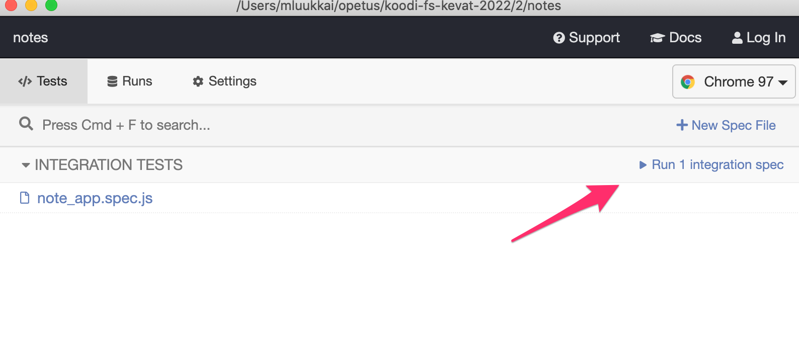
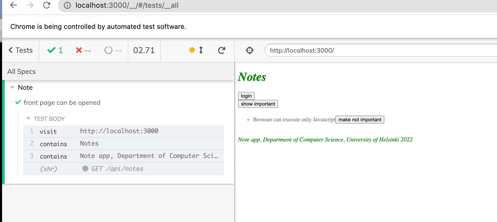
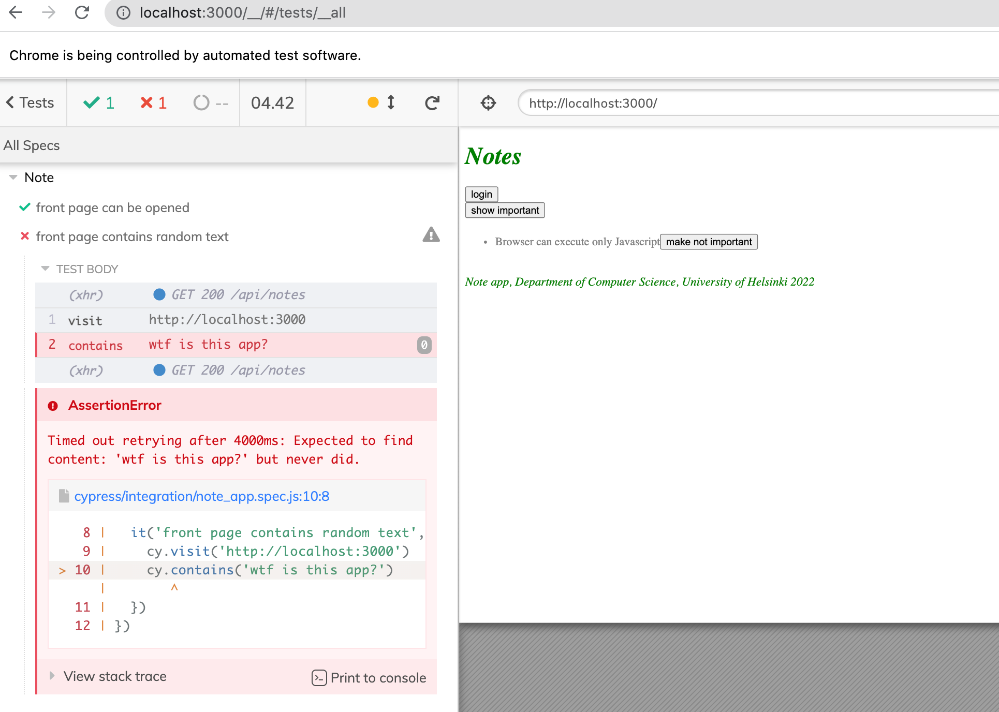
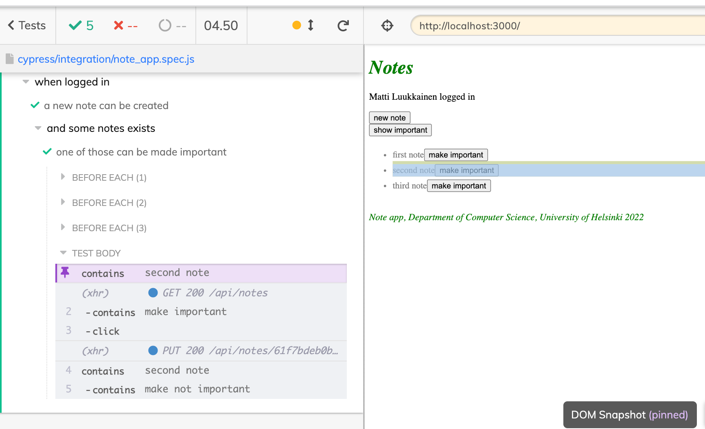
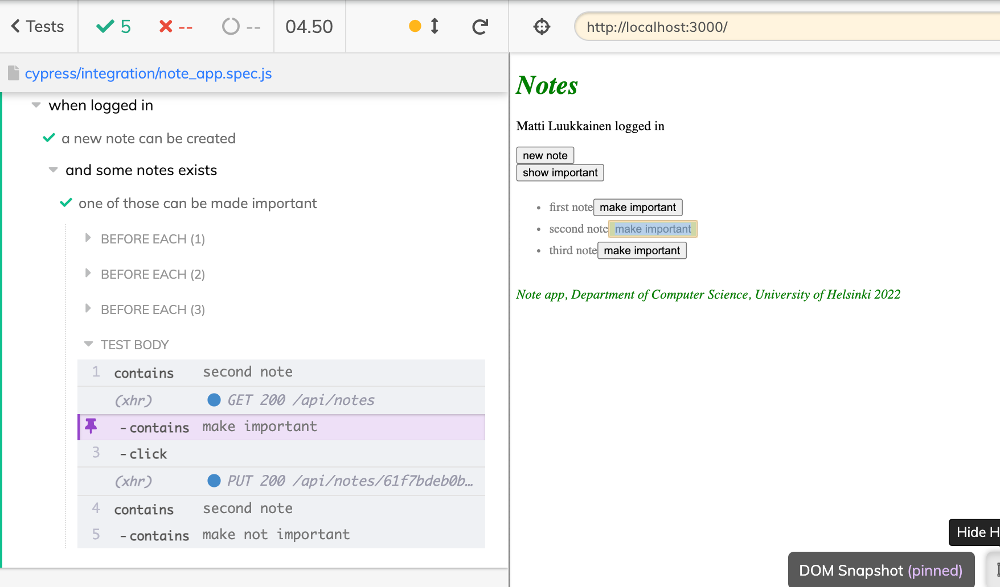
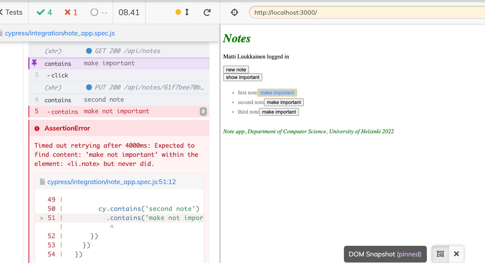
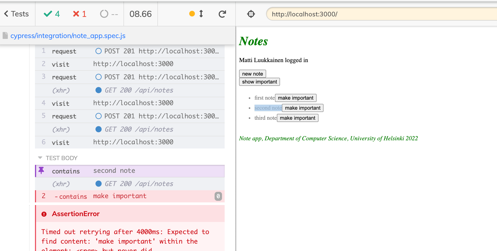
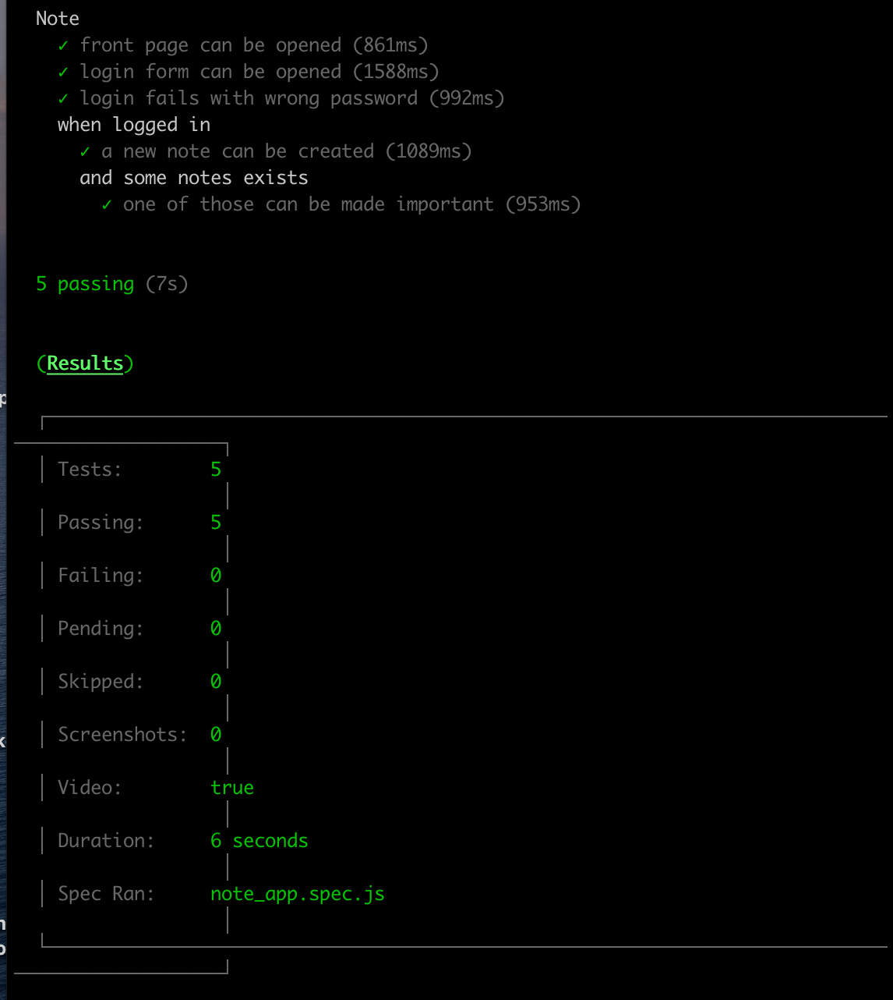

<div class="content">

<!-- So far we have tested the backend as a whole on an API level using integration tests, and tested some frontend components using unit tests.-->
 到目前为止，我们已经使用集成测试在API层面上测试了整个后端，并使用单元测试测试了一些前端组件。

<!-- Next we will look into one way to test the [system as a whole](https://en.wikipedia.org/wiki/System_testing) using <i>End to End</i> (E2E) tests.-->
接下来我们将研究一种方法，使用<i>端到端</i>（E2E）测试[系统整体](https://en.wikipedia.org/wiki/System_testing)。

<!-- We can do E2E testing of a web application using a browser and a testing library. There are multiple libraries available, for example [Selenium](http://www.seleniumhq.org/) which can be used with almost any browser.-->
 我们可以使用浏览器和测试库对网络应用进行E2E测试。有多种库可用，例如[Selenium](http://www.seleniumhq.org/)，几乎可以与任何浏览器一起使用。
<!-- Another browser option are so called [headless browsers](https://en.wikipedia.org/wiki/Headless_browser), which are browsers with no graphical user interface.-->
 另一个浏览器选项是所谓的[无头浏览器](https://en.wikipedia.org/wiki/Headless_browser)，它是没有图形用户界面的浏览器。
<!-- For example Chrome can be used in Headless-mode.-->
 例如，Chrome可以在无头模式下使用。

<!-- E2E tests are potentially the most useful category of tests, because they test the system through the same interface as real users use.-->
 E2E测试有可能是最有用的测试类别，因为它们通过与真实用户使用的相同界面来测试系统。

<!-- They do have some drawbacks too. Configuring E2E tests is more challenging than unit or integration tests. They also tend to be quite slow, and with a large system their execution time can be minutes, even hours. This is bad for development, because during coding it is beneficial to be able to run tests as often as possible in case of code [regressions](https://en.wikipedia.org/wiki/Regression_testing).-->
它们也有一些缺点。配置E2E测试比单元或集成测试更具挑战性。他们也倾向于相当慢，对于一个大系统，他们的执行时间可能是几分钟，甚至几小时。这对开发是不利的，因为在编码过程中，如果出现代码[回归](https://en.wikipedia.org/wiki/Regression_testing)，能够尽可能频繁地运行测试是有益的。

<!-- E2E tests can also be [flaky](https://hackernoon.com/flaky-tests-a-war-that-never-ends-9aa32fdef359).-->
 E2E测试也可能是[不稳定](https://hackernoon.com/flaky-tests-a-war-that-never-ends-9aa32fdef359)。
<!-- Some tests might pass one time and fail another, even if the code does not change at all.-->
 有些测试可能一次通过，另一次失败，即使代码根本没有变化。

### Cypress

<!-- E2E library [Cypress](https://www.cypress.io/) has become popular within the last year. Cypress is exceptionally easy to use, and when compared to Selenium, for example, it requires a lot less hassle and headache.-->
 E2E库[Cypress](https://www.cypress.io/)在去年开始流行。Cypress特别容易使用，与Selenium等相比，它需要的麻烦和头绪要少得多。
<!-- Its operating principle is radically different than most E2E testing libraries, because Cypress tests are run completely within the browser.-->
它的操作原理与大多数E2E测试库完全不同，因为Cypress测试完全在浏览器中运行。
<!-- Other libraries run the tests in a Node-process, which is connected to the browser through an API.-->
 其他库在一个Node进程中运行测试，该进程通过API与浏览器相连。

<!-- Let's  make some end to end tests for our note application.-->
 让我们为我们的笔记应用做一些端到端的测试。

<!-- We begin by installing Cypress to <i>the frontend</i> as development dependency-->
 我们首先将Cypress安装到<i>前端</i>作为开发依赖项

```js
npm install --save-dev cypress
```

<!-- and by adding an npm-script to run it:-->
 并添加一个npm-script来运行它。

```js
{
  // ...
  "scripts": {
    "start": "react-scripts start",
    "build": "react-scripts build",
    "test": "react-scripts test",
    "eject": "react-scripts eject",
    "server": "json-server -p3001 db.json",
    "cypress:open": "cypress open"  // highlight-line
  },
  // ...
}
```

<!-- Unlike the frontend's unit tests, Cypress tests can be in the frontend or the backend repository, or even in their own separate repository.-->
 与前端的单元测试不同，Cypress的测试可以在前端或后端仓库中，甚至可以在它们自己的独立仓库中。

<!-- The tests require the tested system to be running. Unlike our backend integration tests, Cypress tests <i>do not start</i> the system when they are run.-->
 测试需要被测系统正在运行。与我们的后端集成测试不同，Cypress测试在运行时<i>不会启动</i>系统。

<!-- Let's add an npm-script to <i>the backend</i> which starts it in test mode, or so that <i>NODE\_ENV</i> is <i>test</i>.-->
 让我们给<i>后端</i>添加一个npm-script，在测试模式下启动它，或者让<i>NODE\_ENV</i>成为<i>测试</i>。

```js
{
  // ...
  "scripts": {
    "start": "cross-env NODE_ENV=production node index.js",
    "dev": "cross-env NODE_ENV=development nodemon index.js",
    "build:ui": "rm -rf build && cd ../../../2/luento/notes && npm run build && cp -r build ../../../3/luento/notes-backend",
    "deploy": "git push heroku master",
    "deploy:full": "npm run build:ui && git add . && git commit -m uibuild && git push && npm run deploy",
    "logs:prod": "heroku logs --tail",
    "lint": "eslint .",
    "test": "cross-env NODE_ENV=test jest --verbose --runInBand",
    "start:test": "cross-env NODE_ENV=test node index.js" // highlight-line
  },
  // ...
}
```

<!-- NB! In order to get Cypress working with WSL2 one might need to do some additional configuring first. These two [links](https://docs.cypress.io/guides/getting-started/installing-cypress#Windows-Subsystem-for-Linux) are great places to [start](https://nickymeuleman.netlify.app/blog/gui-on-wsl2-cypress).-->
 NB!为了让Cypress与WSL2一起工作，可能需要先做一些额外的配置。这两个[链接](https://docs.cypress.io/guides/getting-started/installing-cypress#Windows-Subsystem-for-Linux)是[开始](https://nickymeuleman.netlify.app/blog/gui-on-wsl2-cypress)的好地方。

<!-- NB! For macbooks with m1 CPU instead of intel ones, cypress wouldn't work since it doesn't support m1 yet. To fix that, installing Rosetta 2 then configuring your terminal is a must. For step by step instructions follow [here](https://www.cypress.io/blog/2021/01/20/running-cypress-on-the-apple-m1-silicon-arm-architecture-using-rosetta-2/).-->
 NB!对于使用m1 CPU而不是intel CPU的macbook，cypress不能工作，因为它还不支持m1。要解决这个问题，安装Rosetta 2然后配置你的终端是必须的。关于一步一步的说明，请按照[这里](https://www.cypress.io/blog/2021/01/20/running-cypress-on-the-apple-m1-silicon-arm-architecture-using-rosetta-2/)。

<!-- When both backend and frontend are running, we can start Cypress with the command-->
 当后端和前端都在运行时，我们可以用以下命令启动Cypress

```js
npm run cypress:open
```

<!-- When we first run Cypress, it creates a <i>cypress</i> directory. It contains an <i>integration</i> subdirectory, where we will place our tests. Cypress creates a bunch of example tests for us in two subdirectories: the <i>integration/1-getting-started</i> and the <i>integration/2-advanced-examples</i> directory. We can delete both directories and make our own test in file <i>note\_app.spec.js</i>:-->
 当我们第一次运行Cypress时，它会创建一个<i>cypress</i>目录。它包含一个<i>integration</i>子目录，我们将在那里放置我们的测试。Cypress在两个子目录中为我们创建了一堆测试示例：<i>integration/1-getting-started</i>和<i>integration/2-advanced-examples</i>目录。我们可以删除这两个目录，在文件<i>note_app.spec.js</i>中做我们自己的测试。

```js
describe('Note app', function() {
  it('front page can be opened', function() {
    cy.visit('http://localhost:3000')
    cy.contains('Notes')
    cy.contains('Note app, Department of Computer Science, University of Helsinki 2022')
  })
})
```

<!-- We start the test from the opened window:-->
 我们从打开的窗口开始进行测试。



<!-- **NOTE**: you might need to restart Cypress after deleting the example tests.-->
 **注意**：删除示例测试后，你可能需要重新启动Cypress。

<!-- Running the test opens your browser and shows how the application behaves as the test is run:-->
 运行测试会打开你的浏览器，并显示应用在运行测试时的表现。



<!-- The structure of the test should look familiar. They use <i>describe</i> blocks to group different test cases like Jest does. The test cases have been defined with the <i>it</i> method.-->
 测试的结构应该看起来很熟悉。他们使用<i>describe</i>块来分组不同的测试用例，像Jest那样。测试用例已经用<i>it</i>方法进行了定义。
<!-- Cypress borrowed these parts from the [Mocha](https://mochajs.org/) testing library it uses under the hood.-->
 Cypress从它在引擎盖下使用的[Mocha](https://mochajs.org/)测试库中借用了这些部分。

<!-- [cy.visit](https://docs.cypress.io/api/commands/visit.html) and [cy.contains](https://docs.cypress.io/api/commands/contains.html) are Cypress commands, and their purpose is quite obvious.-->
 [cy.visit](https://docs.cypress.io/api/commands/visit.html)和[cy.contains](https://docs.cypress.io/api/commands/contains.html)是Cypress的命令，它们的目的非常明显。
<!-- [cy.visit](https://docs.cypress.io/api/commands/visit.html) opens the web address given to it as a parameter in the browser used by the test. [cy.contains](https://docs.cypress.io/api/commands/contains.html) searches for the string it received as a parameter from the page.-->
 [cy.visit](https://docs.cypress.io/api/commands/visit.html)在测试所使用的浏览器中打开作为参数给它的网页地址。[cy.contains](https://docs.cypress.io/api/commands/contains.html)搜索它从网页上收到的作为参数的字符串。

<!-- We could have declared the test using an arrow function-->
 我们可以用一个箭头函数来声明这个测试

```js
describe('Note app', () => { // highlight-line
  it('front page can be opened', () => { // highlight-line
    cy.visit('http://localhost:3000')
    cy.contains('Notes')
    cy.contains('Note app, Department of Computer Science, University of Helsinki 2022')
  })
})
```

<!-- However, Mocha [recommends](https://mochajs.org/#arrow-functions) that arrow functions are not used, because they might cause some issues in certain situations.-->
 然而，Mocha[建议](https://mochajs.org/#arrow-functions)不要使用箭头函数，因为它们在某些情况下可能导致一些问题。

<!-- If <i>cy.contains</i> does not find the text it is searching for, the test does not pass.  So if we extend our test like so-->
 如果<i>cy.contains</i>没有找到它要搜索的文本，测试就不会通过。  因此，如果我们像这样扩展我们的测试

```js
describe('Note app', function() {
  it('front page can be opened',  function() {
    cy.visit('http://localhost:3000')
    cy.contains('Notes')
    cy.contains('Note app, Department of Computer Science, University of Helsinki 2022')
  })

// highlight-start
  it('front page contains random text', function() {
    cy.visit('http://localhost:3000')
    cy.contains('wtf is this app?')
  })
// highlight-end
})
```

<!-- the test fails-->
 测试失败



<!-- Let's remove the failing code from the test.-->
 让我们从测试中删除失败的代码。

### Writing to a form

<!-- Let's extend our tests so that the test tries to log in to our application.-->
 让我们扩展我们的测试，使测试尝试登录到我们的应用。
<!-- We assume our backend contains a user with the username <i>mluukkai</i> and password <i>salainen</i>.-->
 我们假设我们的后端包含一个用户名<i>mluukkai</i>和密码<i>salainen</i>的用户。

<!-- The test begins by opening the login form.-->
测试从打开登录表单开始。

```js
describe('Note app',  function() {
  // ...

  it('login form can be opened', function() {
    cy.visit('http://localhost:3000')
    cy.contains('login').click()
  })
})
```

<!-- The test first searches for the login button by its text, and clicks the button with the command [cy.click](https://docs.cypress.io/api/commands/click.html#Syntax).-->
 测试首先通过文本搜索登录按钮，并通过命令[cy.click](https://docs.cypress.io/api/commands/click.html#Syntax)点击按钮。

<!-- Both of our tests begin the same way, by opening the page <i>http://localhost:3000</i>, so we should-->
 我们的两个测试都是以同样的方式开始的，打开<i>http://localhost:3000</i>页面，所以我们应该
<!-- separate the shared part into a <i>beforeEach</i> block run before each test:-->
将共享部分分离成一个<i>beforeEach</i>块，在每个测试前运行。

```js
describe('Note app', function() {
  // highlight-start
  beforeEach(function() {
    cy.visit('http://localhost:3000')
  })
  // highlight-end

  it('front page can be opened', function() {
    cy.contains('Notes')
    cy.contains('Note app, Department of Computer Science, University of Helsinki 2022')
  })

  it('login form can be opened', function() {
    cy.contains('login').click()
  })
})
```

<!-- The login field contains two <i>input</i> fields, which the test should write into.-->
 登录字段包含两个<i>输入</i>字段，测试应该把它们写进。

<!-- The [cy.get](https://docs.cypress.io/api/commands/get.html#Syntax) command allows for searching elements by CSS selectors.-->
 [cy.get](https://docs.cypress.io/api/commands/get.html#Syntax)命令允许通过CSS选择器搜索元素。

<!-- We can access the first and the last input field on the page, and write to them with the command [cy.type](https://docs.cypress.io/api/commands/type.html#Syntax) like so:-->
 我们可以访问页面上的第一个和最后一个输入字段，并通过[cy.type](https://docs.cypress.io/api/commands/type.html#Syntax)命令写入它们，就像这样。

```js
it('user can login', function () {
  cy.contains('login').click()
  cy.get('input:first').type('mluukkai')
  cy.get('input:last').type('salainen')
})
```

<!-- The test works. The problem is if we later add more input fields, the test will break because it expects the fields it needs to be the first and the last on the page.-->
 这个测试是有效的。问题是，如果我们以后添加更多的输入字段，测试就会中断，因为它期望它需要的字段是页面上的第一个和最后一个。

<!-- It would be better to give our inputs unique <i>ids</i> and use those to find them.-->
 最好是给我们的输入以唯一的<i>ids</i>，并使用这些来找到它们。
<!-- We change our login form like so:-->
我们像这样改变我们的登录表格。

```js
const LoginForm = ({ ... }) => {
  return (
    <div>
      <h2>Login</h2>
      <form onSubmit={handleSubmit}>
        <div>
          username
          <input
            id='username'  // highlight-line
            value={username}
            onChange={handleUsernameChange}
          />
        </div>
        <div>
          password
          <input
            id='password' // highlight-line
            type="password"
            value={password}
            onChange={handlePasswordChange}
          />
        </div>
        <button id="login-button" type="submit"> // highlight-line
          login
        </button>
      </form>
    </div>
  )
}
```

<!-- We also added an id to our submit button so we can access it in our tests.-->
 我们还为我们的提交按钮添加了一个ID，这样我们就可以在测试中访问它。

<!-- The test becomes:-->
 测试变成了。

```js
describe('Note app',  function() {
  // ..
  it('user can log in', function() {
    cy.contains('login').click()
    cy.get('#username').type('mluukkai')  // highlight-line
    cy.get('#password').type('salainen')  // highlight-line
    cy.get('#login-button').click()  // highlight-line

    cy.contains('Matti Luukkainen logged in') // highlight-line
  })
})
```

<!-- The last row ensures that the login was successful.-->
 最后一行确保登录成功。

<!-- Note that the CSS [id-selector](https://developer.mozilla.org/en-US/docs/Web/CSS/ID_selectors) is #, so if we want to search for an element with the id <i>username</i> the CSS selector is <i>#username</i>.-->
 注意CSS的[id-selector](https://developer.mozilla.org/en-US/docs/Web/CSS/ID_selectors)是#，所以如果我们想搜索一个id为<i>username</i>的元素，CSS选择器是<i>#username</i>。

### Some things to note

<!-- The test first clicks the button opening the login form like so-->
 测试首先点击按钮，打开登录表单，就像这样

```js
cy.contains('login').click()
```

<!-- When the form has been filled, the form is submitted by clicking the submit button-->
当表格填写完毕后，点击提交按钮，表格被提交。

```js
cy.get('#login-button').click()
```

<!-- Both buttons have the text <i>login</i>, but they are two separate buttons.-->
两个按钮都有文本<i>login</i>，但它们是两个独立的按钮。
<!-- Actually both buttons are in the application's DOM the whole time, but only one is visible at a time because of the <i>display:none</i> styling on one of them.-->
实际上两个按钮一直都在应用的DOM中，但由于其中一个按钮的<i>display:none</i>样式，每次只有一个是可见的。

<!-- If we search for a button by its text, [cy.contains](https://docs.cypress.io/api/commands/contains.html#Syntax) will return the first of them, or the one opening the login form.-->
 如果我们通过文本搜索一个按钮，[cy.contains](https://docs.cypress.io/api/commands/contains.html#Syntax)将返回其中的第一个，或打开登录表单的那个。
<!-- This will happen even if the button is not visible.-->
即使该按钮不可见，也会发生这种情况。
<!-- To avoid name conflicts, we gave the submit button the id <i>login-button</i> we can use to access it.-->
为了避免名称冲突，我们给了提交按钮一个id <i>login-button</i>，我们可以用它来访问。

<!-- Now we notice that the variable _cy_ our tests use gives us a nasty Eslint error-->
 现在我们注意到，我们测试使用的变量_cy_给了我们一个讨厌的Eslint错误


<!-- We can get rid of it by installing [eslint-plugin-cypress](https://github.com/cypress-io/eslint-plugin-cypress) as a development dependency-->
我们可以通过安装[eslint-plugin-cypress](https://github.com/cypress-io/eslint-plugin-cypress)作为开发依赖来摆脱它。

```js
npm install eslint-plugin-cypress --save-dev
```

<!-- and changing the configuration in <i>.eslintrc.js</i> like so:-->
 然后改变<i>.eslintrc.js</i>中的配置，像这样。

```js
module.exports = {
    "env": {
        "browser": true,
        "es6": true,
        "jest/globals": true,
        "cypress/globals": true // highlight-line
    },
    "extends": [
      // ...
    ],
    "parserOptions": {
      // ...
    },
    "plugins": [
        "react", "jest", "cypress" // highlight-line
    ],
    "rules": {
      // ...
    }
}
```

### Testing new note form

<!-- Let's next add tests which test the "new note" functionality:-->
 接下来我们添加测试 "新笔记 "功能的测试。

```js
describe('Note app', function() {
  // ..
  // highlight-start
  describe('when logged in', function() {
    beforeEach(function() {
      cy.contains('login').click()
      cy.get('input:first').type('mluukkai')
      cy.get('input:last').type('salainen')
      cy.get('#login-button').click()
    })
    // highlight-end

    // highlight-start
    it('a new note can be created', function() {
      cy.contains('new note').click()
      cy.get('input').type('a note created by cypress')
      cy.contains('save').click()

      cy.contains('a note created by cypress')
    })
  })
  // highlight-end
})
```

<!-- The test has been defined in its own <i>describe</i> block.-->
 这个测试已经被定义在它自己的<i>describe</i>块中。
<!-- Only logged-in users can create new notes, so we added logging in to the application to a <i>beforeEach</i> block.-->
 只有登录的用户才能创建新的笔记，所以我们在<i>beforeEach</i>块中加入了登录应用。

<!-- The test trusts that when creating a new note the page contains only one input, so it searches for it like so:-->
 测试相信当创建一个新的笔记时，页面只包含一个输入，所以它像这样搜索它。

```js
cy.get('input')
```

<!-- If the page contained more inputs, the test would break-->
 如果该页面包含更多的输入，测试就会中断。


<!-- Due to this it would again be better to give the input an <i>id</i> and search for the element by its id.-->
由于这个原因，最好还是给输入一个<i>id</i>，并通过它的id搜索元素。

<!-- The structure of the tests looks like so:-->
 测试的结构看起来是这样的。

```js
describe('Note app', function() {
  // ...

  it('user can log in', function() {
    cy.contains('login').click()
    cy.get('#username').type('mluukkai')
    cy.get('#password').type('salainen')
    cy.get('#login-button').click()

    cy.contains('Matti Luukkainen logged in')
  })

  describe('when logged in', function() {
    beforeEach(function() {
      cy.contains('login').click()
      cy.get('input:first').type('mluukkai')
      cy.get('input:last').type('salainen')
      cy.get('#login-button').click()
    })

    it('a new note can be created', function() {
      // ...
    })
  })
})
```

<!-- Cypress runs the tests in the order they are in the code. So first it runs <i>user can log in</i>, where the user logs in. Then cypress will run <i>a new note can be created</i> for which a <i>beforeEach</i> block logs in as well.-->
 Cypress按照代码中的顺序运行测试。因此，首先它运行<i>user can log in</i>，其中用户登录。然后，Cypress将运行<i>一个新的笔记可以被创建</i>，为此，一个<i>beforeEach</i>块也会登录。
<!-- Why do this? Isn't the user logged in after the first test?-->
 为什么这样做？用户在第一次测试后不是已经登录了吗？
<!-- No, because <i>each</i> test starts from zero as far as the browser is concerned.-->
不是，因为就浏览器而言，<i>每个</i>测试都是从零开始的。
<!-- All changes to the browser's state are reversed after each test.-->
每次测试后，对浏览器状态的所有改变都是相反的。

### Controlling the state of the database

<!-- If the tests need to be able to modify the server's database, the situation immediately becomes more complicated. Ideally, the server's database should be the same each time we run the tests, so our tests can be reliably and easily repeatable.-->
 如果测试需要能够修改服务器的数据库，情况会立即变得更加复杂。理想情况下，每次我们运行测试时，服务器的数据库应该是相同的，所以我们的测试可以可靠地、容易地重复。

<!-- As with unit and integration tests, with E2E tests it is the best to empty the database and possibly format it before the tests are run. The challenge with E2E tests is that they do not have access to the database.-->
 与单元和集成测试一样，对于E2E测试，最好是在测试运行前清空数据库，并可能将其格式化。E2E测试的挑战是他们不能访问数据库。

<!-- The solution is to create API endpoints to the backend for the test.-->
解决方法是为测试的后端创建API端点。
<!-- We can empty the database using these endpoints.-->
 我们可以使用这些端点清空数据库。
<!-- Let's create a new <i>router</i> for the tests-->
 让我们为测试创建一个新的<i>路由器</i>。

```js
const testingRouter = require('express').Router()
const Note = require('../models/note')
const User = require('../models/user')

testingRouter.post('/reset', async (request, response) => {
  await Note.deleteMany({})
  await User.deleteMany({})

  response.status(204).end()
})

module.exports = testingRouter
```

<!-- and add it to the backend only <i>if the application is run on test-mode</i>:-->
并将其添加到后端 <i>如果应用在测试模式下运行</i>。

```js
// ...

app.use('/api/login', loginRouter)
app.use('/api/users', usersRouter)
app.use('/api/notes', notesRouter)

// highlight-start
if (process.env.NODE_ENV === 'test') {
  const testingRouter = require('./controllers/testing')
  app.use('/api/testing', testingRouter)
}
// highlight-end

app.use(middleware.unknownEndpoint)
app.use(middleware.errorHandler)

module.exports = app
```

<!-- After the changes, an HTTP POST request to the <i>/api/testing/reset</i> endpoint empties the database. Make sure your backend is running in test mode by starting it with this command (previously configured in the package.json file):-->
 更改后，对<i>/api/testing/reset</i>端点的HTTP POST请求会清空数据库。确保你的后端在测试模式下运行，用这个命令启动它（之前在package.json文件中配置）。
```js
  npm run start:test
```

<!-- The modified backend code can be found from [GitHub](https://github.com/fullstack-hy2020/part3-notes-backend/tree/part5-1) branch <i>part5-1</i>.-->
 修改后的后端代码可以在[GitHub](https://github.com/fullstack-hy2020/part3-notes-backend/tree/part5-1)分支<i>part5-1</i>找到。

<!-- Next we will change the <i>beforeEach</i> block so that it empties the server's database before tests are run.-->
 接下来我们将修改<i>beforeEach</i>块，以便在运行测试之前清空服务器的数据库。

<!-- Currently it is not possible to add new users through the frontend's UI, so we add a new user to the backend from the beforeEach block.-->
 目前不可能通过前端的用户界面添加新用户，所以我们从beforeEach块向后端添加一个新用户。

```js
describe('Note app', function() {
   beforeEach(function() {
    // highlight-start
    cy.request('POST', 'http://localhost:3001/api/testing/reset')
    const user = {
      name: 'Matti Luukkainen',
      username: 'mluukkai',
      password: 'salainen'
    }
    cy.request('POST', 'http://localhost:3001/api/users/', user)
    // highlight-end
    cy.visit('http://localhost:3000')
  })

  it('front page can be opened', function() {
    // ...
  })

  it('user can login', function() {
    // ...
  })

  describe('when logged in', function() {
    // ...
  })
})
```

<!-- During the formatting the test does HTTP requests to the backend with [cy.request](https://docs.cypress.io/api/commands/request.html).-->
在格式化过程中，测试用[cy.request](https://docs.cypress.io/api/commands/request.html)向后端做HTTP请求。

<!-- Unlike earlier, now the testing starts with the backend in the same state every time. The backend will contain one user and no notes.-->
 与先前不同，现在测试开始时，后端每次都处于相同的状态。后台将包含一个用户，没有注释。

<!-- Let's add one more test for checking that we can change the importance of notes.-->
 让我们再增加一个测试，检查我们是否可以改变笔记的重要性。
<!-- First we change the frontend so that a new note is unimportant by default, or the <i>important</i> field is <i>false</i>:-->
 首先我们改变前台，使新的笔记默认为不重要，或者<i>重要</i>字段为<i>false</i>。

```js
const NoteForm = ({ createNote }) => {
  // ...

  const addNote = (event) => {
    event.preventDefault()
    createNote({
      content: newNote,
      important: false // highlight-line
    })

    setNewNote('')
  }
  // ...
}
```

<!-- There are multiple ways to test this. In the following example we first search for a note and click its <i>make important</i> button. Then we check that the note now contains a <i>make not important</i> button.-->
 有多种方法来测试。在下面的例子中，我们首先搜索一个笔记，并点击其<i>重要</i>按钮。然后我们检查该笔记现在是否包含一个<i>使之不重要</i>按钮。

```js
describe('Note app', function() {
  // ...

  describe('when logged in', function() {
    // ...

    describe('and a note exists', function () {
      beforeEach(function () {
        cy.contains('new note').click()
        cy.get('input').type('another note cypress')
        cy.contains('save').click()
      })

      it('it can be made important', function () {
        cy.contains('another note cypress')
          .contains('make important')
          .click()

        cy.contains('another note cypress')
          .contains('make not important')
      })
    })
  })
})
```

<!-- The first command searches for a component containing the text <i>another note cypress</i>, and then for a <i>make important</i> button within it. It then clicks the button.-->
 第一条命令搜索一个包含<i>另一个笔记cypress</i>文本的组件，然后搜索其中的<i>make important</i>按钮。然后它就点击这个按钮。

<!-- The second command checks that the text on the button has changed to <i>make not important</i>.-->
 第二个命令检查按钮上的文字是否已经变成了<i>使之不重要</i>。

<!-- The tests and the current frontend code can be found from [GitHub](https://github.com/fullstack-hy2020/part2-notes/tree/part5-9) branch <i>part5-9</i>.-->
 测试和当前的前端代码可以从[GitHub](https://github.com/fullstack-hy2020/part2-notes/tree/part5-9)分支<i>part5-9</i>找到。

### Failed login test

<!-- Let's make a test to ensure that a login attempt fails if the password is wrong.-->
 让我们做一个测试，确保在密码错误的情况下，登录尝试失败。

<!-- Cypress will run all tests each time by default, and as the number of tests increases it starts to become quite time-consuming.-->
 Cypress默认每次都会运行所有测试，随着测试数量的增加，它开始变得相当耗时。
<!-- When developing a new test or when debugging a broken test, we can define the test with <i>it.only</i> instead of <i>it</i>, so that Cypress will only run the required test.-->
 当开发一个新的测试或调试一个损坏的测试时，我们可以用<i>it.only</i>代替<i>it</i>来定义测试，这样Cypress将只运行所需的测试。
<!-- When the test is working, we can remove <i>.only</i>.-->
 当测试正常时，我们可以删除<i>.only</i>。

<!-- First  version of our tests is as follows:-->
我们测试的第一个版本如下。

```js
describe('Note app', function() {
  // ...

  it.only('login fails with wrong password', function() {
    cy.contains('login').click()
    cy.get('#username').type('mluukkai')
    cy.get('#password').type('wrong')
    cy.get('#login-button').click()

    cy.contains('wrong credentials')
  })

  // ...
)}
```

<!-- The test uses [cy.contains](https://docs.cypress.io/api/commands/contains.html#Syntax) to ensure that the application prints an error message.-->
 测试使用[cy.contains](https://docs.cypress.io/api/commands/contains.html#Syntax)来确保应用打印出错误信息。

<!-- The application renders the error message to a component with the CSS class <i>error</i>:-->
 应用将错误信息渲染到一个具有CSS类<i>error</i>的组件。

```js
const Notification = ({ message }) => {
  if (message === null) {
    return null
  }

  return (
    <div className="error"> // highlight-line
      {message}
    </div>
  )
}
```

<!-- We could make the test ensure that the error message is rendered to the correct component, that is, the component with the CSS class <i>error</i>:-->
 我们可以让测试确保错误信息被渲染到正确的组件，也就是具有CSS类<i>error</i>的组件。


```js
it('login fails with wrong password', function() {
  // ...

  cy.get('.error').contains('wrong credentials') // highlight-line
})
```

<!-- First we use [cy.get](https://docs.cypress.io/api/commands/get.html#Syntax) to search for a component with the CSS class <i>error</i>. Then we check that the error message can be found from this component.-->
 首先我们使用[cy.get](https://docs.cypress.io/api/commands/get.html#Syntax)来搜索一个具有CSS类<i>error</i>的组件。然后我们检查是否可以从这个组件中找到错误信息。
<!-- Note that the [CSS class selector](https://developer.mozilla.org/en-US/docs/Web/CSS/Class_selectors) starts with a full stop, so the selector for the class <i>error</i> is <i>.error</i>.-->
 注意[CSS类选择器](https://developer.mozilla.org/en-US/docs/Web/CSS/Class_selectors)以句号开头，所以<i>error</i>类的选择器是<i>.error</i>。

<!-- We could do the same using the [should](https://docs.cypress.io/api/commands/should.html) syntax:-->
 我们可以用[should](https://docs.cypress.io/api/commands/should.html)的语法做同样的事情。

```js
it('login fails with wrong password', function() {
  // ...

  cy.get('.error').should('contain', 'wrong credentials') // highlight-line
})
```

<!-- Using should is a bit trickier than using <i>contains</i>, but it allows for more diverse tests than <i>contains</i> which works based on text content only.-->
 使用should比使用<i>contains</i>要麻烦一些，但它允许比<i>contains</i>更多样化的测试，后者只基于文本内容工作。

<!-- A list of the most common assertions which can be used with should can be found [here](https://docs.cypress.io/guides/references/assertions.html#Common-Assertions).-->
 可以和should一起使用的最常见的断言列表可以在[这里](https://docs.cypress.io/guides/references/assertions.html#Common-Assertions)找到。

<!-- We can, for example, make sure that the error message is red and it has a border:-->
 例如，我们可以确保错误信息是红色的，并且有一个边框。

```js
it('login fails with wrong password', function() {
  // ...

  cy.get('.error').should('contain', 'wrong credentials')
  cy.get('.error').should('have.css', 'color', 'rgb(255, 0, 0)')
  cy.get('.error').should('have.css', 'border-style', 'solid')
})
```

<!-- Cypress requires the colors to be given as [rgb](https://rgbcolorcode.com/color/red).-->
 Cypress要求颜色以[rgb](https://rgbcolorcode.com/color/red)形式给出。

<!-- Because all tests are for the same component we accessed using [cy.get](https://docs.cypress.io/api/commands/get.html#Syntax), we can chain them using [and](https://docs.cypress.io/api/commands/and.html).-->
 因为所有的测试都是针对我们使用[cy.get](https://docs.cypress.io/api/commands/get.html#Syntax)访问的同一个组件，我们可以使用[and](https://docs.cypress.io/api/commands/and.html)将它们连锁起来。

```js
it('login fails with wrong password', function() {
  // ...

  cy.get('.error')
    .should('contain', 'wrong credentials')
    .and('have.css', 'color', 'rgb(255, 0, 0)')
    .and('have.css', 'border-style', 'solid')
})
```

<!-- Let's finish the test so that it also checks that the application does not render the success message <i>'Matti Luukkainen logged in'</i>:-->
 让我们完成这个测试，以便它也能检查应用是否渲染成功信息 <i>"Matti Luukkainen logged in"</i>。

```js
it('login fails with wrong password', function() {
  cy.contains('login').click()
  cy.get('#username').type('mluukkai')
  cy.get('#password').type('wrong')
  cy.get('#login-button').click()

  cy.get('.error')
    .should('contain', 'wrong credentials')
    .and('have.css', 'color', 'rgb(255, 0, 0)')
    .and('have.css', 'border-style', 'solid')

  cy.get('html').should('not.contain', 'Matti Luukkainen logged in') // highlight-line
})
```

<i>Should</i> should always be chained with <i>get</i> (or another chainable command).
<!-- We used <i>cy.get('html')</i> to access the whole visible content of the application.-->
 我们使用<i>cy.get("html")</i>来访问应用的整个可见内容。

<!-- **NOTE:** Some CSS properties [behave differently on Firefox](https://github.com/cypress-io/cypress/issues/9349). If you run the tests with Firefox:-->
 **注意：**一些CSS属性[在Firefox上的表现不同](https://github.com/cypress-io/cypress/issues/9349)。如果你用Firefox运行测试。

<!--   -->
 

<!--   then tests that involve, for example, `border-style`, `border-radius` and `padding`, will pass in Chrome or Electron, but fail in Firefox:-->
 那么涉及到 "border-style"、"border-radius "和 "padding "的测试，在Chrome或Electron上会通过，但在Firefox上会失败。

<!--   -->
 

### Bypassing the UI

<!-- Currently we have the following tests:-->
 目前我们有以下的测试。

```js
describe('Note app', function() {
  it('user can login', function() {
    cy.contains('login').click()
    cy.get('#username').type('mluukkai')
    cy.get('#password').type('salainen')
    cy.get('#login-button').click()

    cy.contains('Matti Luukkainen logged in')
  })

  it('login fails with wrong password', function() {
    // ...
  })

  describe('when logged in', function() {
    beforeEach(function() {
      cy.contains('login').click()
      cy.get('input:first').type('mluukkai')
      cy.get('input:last').type('salainen')
      cy.get('#login-button').click()
    })

    it('a new note can be created', function() {
      // ...
    })

  })
})
```

<!-- First we test logging in. Then, in their own describe block, we have a bunch of tests which expect the user to be logged in. User is logged in in the <i>beforeEach</i> block.-->
 首先我们测试登录。然后，在他们自己的描述块中，我们有一系列的测试，期望用户能够登录。用户在<i>beforeEach</i>块中被登录。

<!-- As we said above, each test starts from zero! Tests do not start from the state where the previous tests ended.-->
 正如我们上面所说的，每个测试都是从零开始的!测试不会从之前测试结束的状态开始。

<!-- The Cypress documentation gives us the following advice: [Fully test the login flow – but only once!](https://docs.cypress.io/guides/getting-started/testing-your-app.html#Logging-in).-->
 Cypress文档给了我们以下建议。[完全测试登录流程--但只测试一次！](https://docs.cypress.io/guides/getting-started/testing-your-app.html#Logging-in)。
<!-- So instead of logging in a user using the form in the <i>beforeEach</i> block, Cypress recommends that we [bypass the UI](https://docs.cypress.io/guides/getting-started/testing-your-app.html#Bypassing-your-UI) and do an HTTP request to the backend to log in. The reason for this is that logging in with an HTTP request is much faster than filling a form.-->
 因此，Cypress建议我们不要在<i>beforeEach</i>块中使用表单来登录用户，而是[绕过UI](https://docs.cypress.io/guides/getting-started/testing-your-app.html#Bypassing-your-UI)，向后端发出HTTP请求来登录。这样做的原因是，用HTTP请求登录要比填表快得多。

<!-- Our situation is a bit more complicated than in the example in the Cypress documentation, because when a user logs in, our application saves their details to the localStorage.-->
 我们的情况比Cypress文档中的例子要复杂一些，因为当用户登录时，我们的应用会将他们的详细信息保存到localStorage中。
<!-- However Cypress can handle that as well.-->
 然而，Cypress也可以处理这个问题。
<!-- The code is the following-->
代码如下

```js
describe('when logged in', function() {
  beforeEach(function() {
    // highlight-start
    cy.request('POST', 'http://localhost:3001/api/login', {
      username: 'mluukkai', password: 'salainen'
    }).then(response => {
      localStorage.setItem('loggedNoteappUser', JSON.stringify(response.body))
      cy.visit('http://localhost:3000')
    })
    // highlight-end
  })

  it('a new note can be created', function() {
    // ...
  })

  // ...
})
```

<!-- We can access the response to a [cy.request](https://docs.cypress.io/api/commands/request.html) with the _then_ method.  Under the hood <i>cy.request</i>, like all Cypress commands, are [promises](https://docs.cypress.io/guides/core-concepts/introduction-to-cypress.html#Commands-Are-Promises).-->
 我们可以用_then_方法访问[cy.request](https://docs.cypress.io/api/commands/request.html)的响应。  在引擎盖下<i>cy.request</i>，像所有的Cypress命令一样，是[promises](https://docs.cypress.io/guides/core-concepts/introduction-to-cypress.html#Commands-Are-Promises)。
<!-- The callback function saves the details of a logged-in user to localStorage, and reloads the page.-->
回调函数将登录用户的详细信息保存到localStorage，并重新加载页面。
<!-- Now there is no difference to a user logging in with the login form.-->
现在与用户用登录表格登录没有区别。

<!-- If and when we write new tests to our application, we have to use the login code in multiple places.-->
 如果我们给我们的应用写新的测试，我们必须在多个地方使用登录代码。
<!-- We should make it a [custom command](https://docs.cypress.io/api/cypress-api/custom-commands.html).-->
我们应该把它变成一个[自定义命令](https://docs.cypress.io/api/cypress-api/custom-commands.html)。

<!-- Custom commands are declared in <i>cypress/support/commands.js</i>.-->
自定义命令在<i>cypress/support/commands.js</i>中声明。
<!-- The code for logging in is as follows:-->
 登录的代码如下。

```js
Cypress.Commands.add('login', ({ username, password }) => {
  cy.request('POST', 'http://localhost:3001/api/login', {
    username, password
  }).then(({ body }) => {
    localStorage.setItem('loggedNoteappUser', JSON.stringify(body))
    cy.visit('http://localhost:3000')
  })
})
```

<!-- Using our custom command is easy, and our test becomes cleaner:-->
 使用我们的自定义命令很容易，我们的测试也变得更干净。

```js
describe('when logged in', function() {
  beforeEach(function() {
    // highlight-start
    cy.login({ username: 'mluukkai', password: 'salainen' })
    // highlight-end
  })

  it('a new note can be created', function() {
    // ...
  })

  // ...
})
```

<!-- The same applies to creating a new note now that we think about it. We have a test which makes a new note using the form. We also make a new note in the <i>beforeEach</i> block of the test testing changing the importance of a note:-->
 现在我们想想，这同样适用于创建一个新的笔记。我们有一个测试，使用表单制作一个新的笔记。我们也在测试改变笔记的重要性的<i>beforeEach</i>块中制作一个新的笔记。

```js
describe('Note app', function() {
  // ...

  describe('when logged in', function() {
    it('a new note can be created', function() {
      cy.contains('new note').click()
      cy.get('input').type('a note created by cypress')
      cy.contains('save').click()

      cy.contains('a note created by cypress')
    })

    describe('and a note exists', function () {
      beforeEach(function () {
        cy.contains('new note').click()
        cy.get('input').type('another note cypress')
        cy.contains('save').click()
      })

      it('it can be made important', function () {
        // ...
      })
    })
  })
})
```

<!-- Let's make a new custom command for making a new note. The command will make a new note with an HTTP POST request:-->
 让我们制作一个新的自定义命令来制作一个新的注释。该命令将通过HTTP POST请求制作一个新的笔记。

```js
Cypress.Commands.add('createNote', ({ content, important }) => {
  cy.request({
    url: 'http://localhost:3001/api/notes',
    method: 'POST',
    body: { content, important },
    headers: {
      'Authorization': `bearer ${JSON.parse(localStorage.getItem('loggedNoteappUser')).token}`
    }
  })

  cy.visit('http://localhost:3000')
})
```

<!-- The command expects the user to be logged in and the user's details to be saved to localStorage.-->
 该命令希望用户已经登录，并且用户的详细信息被保存到localStorage。

<!-- Now the formatting block becomes:-->
现在格式化块变成。

```js
describe('Note app', function() {
  // ...

  describe('when logged in', function() {
    it('a new note can be created', function() {
      // ...
    })

    describe('and a note exists', function () {
      beforeEach(function () {
        // highlight-start
        cy.createNote({
          content: 'another note cypress',
          important: false
        })
        // highlight-end
      })

      it('it can be made important', function () {
        // ...
      })
    })
  })
})
```

<!-- The tests and the frontend code can be found from [GitHub](https://github.com/fullstack-hy2020/part2-notes/tree/part5-10) branch <i>part5-10</i>.-->
 测试和前端代码可以从[GitHub](https://github.com/fullstack-hy2020/part2-notes/tree/part5-10)分支<i>part5-10</i>找到。

### Changing the importance of a note

<!-- Lastly let's take a look at the test we did for changing the importance of a note.-->
 最后让我们来看看我们为改变笔记的重要性所做的测试。
<!-- First we'll change the formatting block so that it creates three notes instead of one:-->
 首先，我们要改变格式化块，使其创建三个注释而不是一个。

```js
describe('when logged in', function() {
  describe('and several notes exist', function () {
    beforeEach(function () {
      // highlight-start
      cy.createNote({ content: 'first note', important: false })
      cy.createNote({ content: 'second note', important: false })
      cy.createNote({ content: 'third note', important: false })
      // highlight-end
    })

    it('one of those can be made important', function () {
      cy.contains('second note')
        .contains('make important')
        .click()

      cy.contains('second note')
        .contains('make not important')
    })
  })
})
```

<!-- How does the [cy.contains](https://docs.cypress.io/api/commands/contains.html) command actually work?-->
 [cy.contains](https://docs.cypress.io/api/commands/contains.html)命令实际上是如何工作的?

<!-- When we click the _cy.contains('second note')_ command in Cypress [Test Runner](https://docs.cypress.io/guides/core-concepts/test-runner.html), we see that the command searches for the element containing the text <i>second note</i>:-->
当我们在Cypress [Test Runner](https://docs.cypress.io/guides/core-concepts/test-runner.html)中点击_cy.contains("second note")_命令时，我们看到该命令在搜索包含文本<i>second note</i>的元素。



<!-- By clicking the next line _.contains('make important')_ we see that the test uses-->
 通过点击下一行_.contains("make important")_我们看到该测试使用了
<!-- the 'make important' button corresponding to <i>second note</i>:-->
对应于<i>第二个笔记</i>的"使重要"按钮。



<!-- When chained, the second <i>contains</i> command <i>continues</i> the search from within the component found by the first command.-->
当连锁时，第二个<i>contains</i>命令<i>继续</i>从第一个命令找到的组件中进行搜索。

<!-- If we had not chained the commands, and instead wrote:-->
 如果我们没有将这些命令连接起来，而是写成:

```js
cy.contains('second note')
cy.contains('make important').click()
```

<!-- the result would have been totally different. The second line of the test would click the button of a wrong note:-->
结果就会完全不同。测试的第二行会点击一个错误的笔记的按钮。



<!-- When coding tests, you should check in the test runner that the tests use the right components!-->
 在编写测试代码时，你应该在测试运行器中检查测试是否使用了正确的组件!

<!-- Let's change the _Note_ component so that the text of the note is rendered to a <i>span</i>.-->
 让我们改变_Note_组件，使笔记的文本被渲染成<i>span</i>。

```js
const Note = ({ note, toggleImportance }) => {
  const label = note.important
    ? 'make not important' : 'make important'

  return (
    <li className='note'>
      <span>{note.content}</span> // highlight-line
      <button onClick={toggleImportance}>{label}</button>
    </li>
  )
}
```

<!-- Our tests break! As the test runner reveals,  _cy.contains('second note')_ now returns the component containing the text, and the button is not in it.-->
 我们的测试失败了!正如测试运行器所显示的，_cy.contains("second note")_现在返回包含文本的组件，而按钮不在其中。



<!-- One way to fix this is the following:-->
 解决这个问题的一个方法是如下。

```js
it('one of those can be made important', function () {
  cy.contains('second note').parent().find('button').click()
  cy.contains('second note').parent().find('button')
    .should('contain', 'make not important')
})
```

<!-- In the first line, we use the [parent](https://docs.cypress.io/api/commands/parent.html) command to access the parent element of the element containing <i>second note</i> and find the button from within it.-->
 在第一行中，我们使用[parent](https://docs.cypress.io/api/commands/parent.html)命令来访问包含<i>second note</i>的元素的父元素，并从其中找到按钮。
<!-- Then we click the button, and check that the text on it changes.-->
 然后我们点击按钮，并检查上面的文字是否改变。

<!-- Note that we use the command [find](https://docs.cypress.io/api/commands/find.html#Syntax) to search for the button. We cannot use [cy.get](https://docs.cypress.io/api/commands/get.html) here, because it always searches from the <i>whole</i> page and would return all 5 buttons on the page.-->
 注意，我们使用命令[find](https://docs.cypress.io/api/commands/find.html#Syntax)来搜索按钮。我们不能在这里使用[cy.get](https://docs.cypress.io/api/commands/get.html)，因为它总是从<i>整个</i>页面搜索，并且会返回页面上的所有5个按钮。


<!-- Unfortunately, we have some copy-paste in the tests now, because the code for searching for the right button is always the same.-->
 不幸的是，我们现在有一些复制粘贴的测试，因为搜索右边按钮的代码总是相同的。

<!-- In these kinds of situations, it is possible to use the [as](https://docs.cypress.io/api/commands/as.html) command:-->
在这种情况下，可以使用[as](https://docs.cypress.io/api/commands/as.html)命令。

```js
it('one of those can be made important', function () {
  cy.contains('second note').parent().find('button').as('theButton')
  cy.get('@theButton').click()
  cy.get('@theButton').should('contain', 'make not important')
})
```

<!-- Now the first line finds the right button, and uses <i>as</i> to save it as <i>theButton</i>. The following lines can use the named element with <i>cy.get('@theButton')</i>.-->
 现在第一行找到了右边的按钮，并使用<i>as</i>将其保存为<i>theButton</i>。下面几行可以用<i>cy.get("@theButton")</i>来使用这个命名的元素。

### Running and debugging the tests

<!-- Finally, some notes on how Cypress works and debugging your tests.-->
 最后，关于Cypress如何工作和调试你的测试的一些说明。

<!-- The form of the Cypress tests gives the impression that the tests are normal JavaScript code, and we could for example try this:-->
 Cypress测试的形式给人的印象是测试是正常的JavaScript代码，例如我们可以这样尝试。

```js
const button = cy.contains('login')
button.click()
debugger()
cy.contains('logout').click()
```

<!-- This won't work however. When Cypress runs a test, it adds each _cy_ command to an execution queue.-->
 但这并不可行。当Cypress运行一个测试时，它将每个_cy_命令添加到一个执行队列中。
<!-- When the code of the test method has been executed, Cypress will execute each command in the queue one by one.-->
 当测试方法的代码被执行后，Cypress将逐一执行队列中的每个命令。

<!-- Cypress commands always return _undefined_, so _button.click()_ in the above code would cause an error. An attempt to start the debugger would not stop the code between executing the commands, but before any commands have been executed.-->
Cypress命令总是返回_undefined_，所以上述代码中的_button.click()_会导致一个错误。试图启动调试器不会在执行命令之间停止代码，而是在任何命令被执行之前。

<!-- Cypress commands are <i>like promises</i>, so if we want to access their return values, we have to do it using the [then](https://docs.cypress.io/api/commands/then.html) command.-->
Cypress命令<i>类似于承诺</i>，所以如果我们想访问它们的返回值，我们必须使用[then](https://docs.cypress.io/api/commands/then.html)命令来完成。
<!-- For example, the following test would print the number of buttons in the application, and click the first button:-->
 例如，下面的测试将打印应用中的按钮数量，并点击第一个按钮。

```js
it('then example', function() {
  cy.get('button').then( buttons => {
    console.log('number of buttons', buttons.length)
    cy.wrap(buttons[0]).click()
  })
})
```

<!-- Stopping the test execution with the debugger is [possible](https://docs.cypress.io/api/commands/debug.html). The debugger starts only if Cypress test runner's developer console is open.-->
用调试器停止测试的执行是[可能的](https://docs.cypress.io/api/commands/debug.html)。只有当Cypress test runner's developer console打开时，调试器才会启动。

<!-- The developer console is all sorts of useful when debugging your tests.-->
当调试你的测试时，开发者控制台是各种有用的。
<!-- You can see the HTTP requests done by the tests on the Network tab, and the console tab will show you information about your tests:-->
你可以在网络标签上看到测试所做的HTTP请求，控制台标签将显示你的测试信息。


<!-- So far we have run our Cypress tests using the graphical test runner.-->
 到目前为止，我们使用图形化的测试运行器运行我们的Cypress测试。
<!-- It is also possible to run them [from the command line](https://docs.cypress.io/guides/guides/command-line.html). We just have to add an npm script for it:-->
也可以[从命令行](https://docs.cypress.io/guides/guides/command-line.html)运行它们。我们只需要为它添加一个npm脚本。

```js
  "scripts": {
    "start": "react-scripts start",
    "build": "react-scripts build",
    "test": "react-scripts test",
    "eject": "react-scripts eject",
    "server": "json-server -p3001 --watch db.json",
    "cypress:open": "cypress open",
    "test:e2e": "cypress run" // highlight-line
  },
```

<!-- Now we can run our tests from the command line with the command <i>npm run test:e2e</i>-->
 现在我们可以用命令<i>npm run test:e2e</i>从命令行运行我们的测试。



<!-- Note that videos of the test execution will be saved to <i>cypress/videos/</i>, so you should probably git ignore this directory.-->
 注意，测试执行的视频将被保存到<i>cypress/videos/</i>，所以你可能应该git忽略这个目录。

<!-- The frontend and the test code can be found from [GitHub](https://github.com/fullstack-hy2020/part2-notes/tree/part5-11) branch <i>part5-11</i>.-->
 前端和测试代码可以从[GitHub](https://github.com/fullstack-hy2020/part2-notes/tree/part5-11)分支<i>part5-11</i>找到。

</div>

<div class="tasks">

### Exercises 5.17.-5.22.

<!-- In the last exercises of this part we will do some E2E tests for our blog application.-->
 在这部分的最后一个练习中，我们将为我们的博客应用做一些E2E测试。
<!-- The material of this part should be enough to complete the exercises.-->
 这一部分的材料应该足以完成练习。
<!-- You should absolutely also check out the Cypress [documentation](https://docs.cypress.io/guides/overview/why-cypress.html#In-a-nutshell). It is probably the best documentation I have ever seen for an open source project.-->
 你绝对应该看看Cypress的[文档](https://docs.cypress.io/guides/overview/why-cypress.html#In-a-nutshell)。这可能是我见过的最好的开源项目的文档。

<!-- I especially recommend reading [Introduction to Cypress](https://docs.cypress.io/guides/core-concepts/introduction-to-cypress.html#Cypress-Can-Be-Simple-Sometimes), which states-->
 我特别推荐阅读[Cypress简介](https://docs.cypress.io/guides/core-concepts/introduction-to-cypress.html#Cypress-Can-Be-Simple-Sometimes)，其中指出

<!-- > <i>This is the single most important guide for understanding how to test with Cypress. Read it. Understand it.</i>-->
 > <i>这是了解如何使用Cypress进行测试的唯一最重要的指南。阅读它。理解它。</i>

#### 5.17: bloglist end to end testing, step1

<!-- Configure Cypress to your project. Make a test for checking that the application displays the login form by default.-->
 为你的项目配置Cypress。做一个测试，检查应用是否默认显示登录表单。

<!-- The structure of the test must be as follows:-->
 该测试的结构必须如下。

```js
describe('Blog app', function() {
  beforeEach(function() {
    cy.request('POST', 'http://localhost:3003/api/testing/reset')
    cy.visit('http://localhost:3000')
  })

  it('Login form is shown', function() {
    // ...
  })
})
```

<!-- The <i>beforeEach</i> formatting blog must empty the database using for example the method we used in the [material](/en/part5/end_to_end_testing#controlling-the-state-of-the-database).-->
 <i>beforeEach</i> 格式化的博客必须清空数据库，例如使用我们在[材料](/en/part5/end_to_end_testing#controlling-the-state-of-the-database)中使用的方法。

#### 5.18: bloglist end to end testing, step2

<!-- Make tests for logging in. Test both successful and unsuccessful login attempts.-->
 进行登录测试。测试成功和不成功的登录尝试。
<!-- Make a new user in the <i>beforeEach</i> block for the tests.-->
 在测试的<i>beforeEach</i>块中制作一个新用户。

<!-- The test structure extends like so:-->
测试结构是这样扩展的。

```js
describe('Blog app', function() {
  beforeEach(function() {
    cy.request('POST', 'http://localhost:3003/api/testing/reset')
    // create here a user to backend
    cy.visit('http://localhost:3000')
  })

  it('Login form is shown', function() {
    // ...
  })

  describe('Login',function() {
    it('succeeds with correct credentials', function() {
      // ...
    })

    it('fails with wrong credentials', function() {
      // ...
    })
  })
})
```

<i>Optional bonus exercise</i>: Check that the notification shown with unsuccessful login is displayed red.

#### 5.19: bloglist end to end testing, step3

<!-- Make a test which checks that a logged-in user can create a new blog.-->
 做一个测试，检查一个登录的用户是否可以创建一个新的博客。
<!-- The structure of the test could be as follows:-->
测试的结构可以是这样的。

```js
describe('Blog app', function() {
  // ...

  describe('When logged in', function() {
    beforeEach(function() {
      // log in user here
    })

    it('A blog can be created', function() {
      // ...
    })
  })

})
```

<!-- The test has to ensure that a new blog is added to the list of all blogs.-->
 该测试必须确保一个新的博客被添加到所有博客的列表中。

#### 5.20: bloglist end to end testing, step4

<!-- Make a test which checks that users can like a blog.-->
做一个测试，检查用户是否可以喜欢一个博客。

#### 5.21: bloglist end to end testing, step5

<!-- Make a test for ensuring that the user who created a blog can delete it.-->
 做一个测试，确保创建博客的用户可以删除它。

<i>Optional bonus exercise:</i> also check that other users cannot delete the blog.

#### 5.22: bloglist end to end testing, step6

<!-- Make a test which checks that the blogs are ordered according to likes with the blog with the most likes being first.-->
 做一个测试，检查博客是否按照喜欢程度排序，喜欢最多的博客排在前面。

<!-- This exercise is quite a bit trickier than the previous ones. One solution is to add a certain class for the element which wraps the blog's content and use the [eq](https://docs.cypress.io/api/commands/eq#Syntax) method to get the blog element in a specific index:-->
 这个练习比之前的练习要棘手一些。一个解决方案是为包裹博客内容的元素添加一个特定的类，并使用[eq](https://docs.cypress.io/api/commands/eq#Syntax)方法来获取特定索引中的博客元素。

```js
cy.get('.blog').eq(0).should('contain', 'The title with the most likes')
cy.get('.blog').eq(1).should('contain', 'The title with the second most likes')
```

<!-- Note that you might end up having problems if you click a like button many times in row. It might be that cypress does the clicking so fast that it does not have time to update the app state in between the clicks. One remedy for this is to wait for the number of likes to update in between all clicks.-->
 注意，如果你连续多次点击一个喜欢的按钮，你可能最终会遇到问题。这可能是因为Cypress的点击速度太快了，以至于它没有时间在点击之间更新应用的状态。对此的一个补救措施是，在所有点击之间等待喜欢的数量更新。

<!-- This was the last exercise of this part, and it's time to push your code to github and mark the exercises you completed in the [exercise submission system](https://studies.cs.helsinki.fi/stats/courses/fullstackopen).-->
 这是本章节的最后一个练习，是时候将你的代码推送到github，并在[练习提交系统](https://studies.cs.helsinki.fi/stats/courses/fullstackopen)中标记你完成的练习。

</div>
