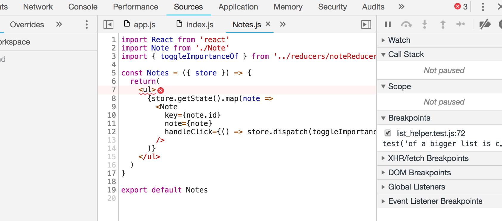
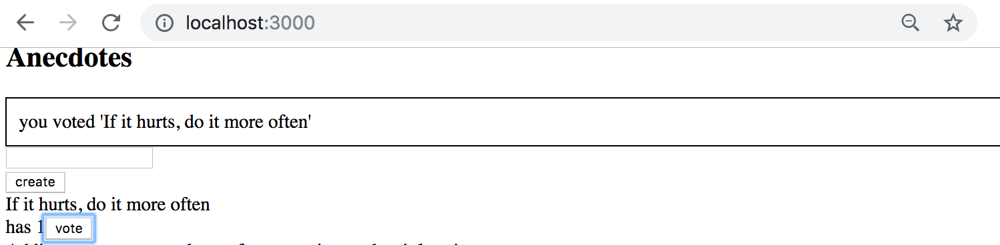
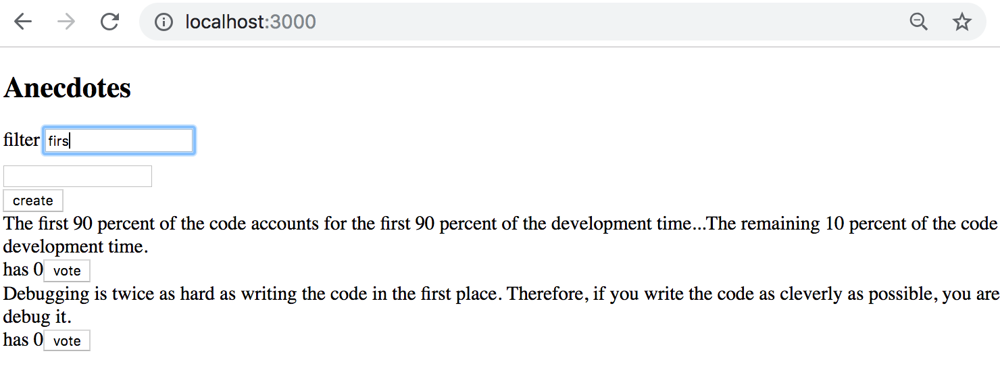

<div class="content">


Let's continue our work with the simplified [redux version](/en/part6/flux_architecture_and_redux#redux-notes) of our notes application.


In order to ease our development, let's change our reducer so that the store gets initialized with a state that contains a couple of notes:

```js
const initialState = [
  {
    content: 'reducer defines how redux store works',
    important: true,
    id: 1,
  },
  {
    content: 'state of store can contain any data',
    important: false,
    id: 2,
  },
]

const noteReducer = (state = initialState, action) => {
  // ...
}

// ...
export default noteReducer
```


### Store with complex state


Let's implement filtering for the notes that are displayed to the user. The user interface for the filters will be implemented with [radio buttons](https://developer.mozilla.org/en-US/docs/Web/HTML/Element/input/radio):


Let's start with a very simple and straightforward implementation:

```js
import React from 'react'
import NewNote from './components/NewNote'
import Notes from './components/Notes'

const App = (props) => {
  const store = props.store

//highlight-start
  const filterSelected = (value) => () => {
    console.log(value)
  }
//highlight-end

  return (
    <div>
      <NewNote store={store}/>
      <div>
        <div>
        //highlight-start
          all          <input type="radio" name="filter"
            onChange={filterSelected('ALL')} />
          important    <input type="radio" name="filter"
            onChange={filterSelected('IMPORTANT')} />
          nonimportant <input type="radio" name="filter"
            onChange={filterSelected('NONIMPORTANT')} />
          //highlight-end
        </div>
      </div>
      
      <Notes store={store} />
    </div>
  )
}
```


Since the <i>name</i> attribute of all the radio buttons is the same, they form a <i>button group</i> where only one option can be selected.


The buttons have a change handler that currently only prints the string associated with the clicked button to the console.


We decide to implement the filter functionality by storing <i>the value of the filter</i> in the redux store in addition to the notes themselves. The state of the store should look like this after making these changes:

```js
{
  notes: [
    { content: 'reducer defines how redux store works', important: true, id: 1},
    { content: 'state of store can contain any data', important: false, id: 2}
  ],
  filter: 'IMPORTANT'
}
```


Only the array of notes is stored in the state of the current implementation of our application. In the new implementation the state object has two properties, <i>notes</i> that contains the array of notes and <i>filter</i> that contains a string indicating which notes should be displayed to the user.

### Combined reducers


We could modify our current reducer to deal with the new shape of the state. However, a better solution in this situation is to define a new separate reducer for the state of the filter:

```js
const filterReducer = (state = 'ALL', action) => {
  switch (action.type) {
    case 'SET_FILTER':
      return action.filter
    default:
      return state
  }
}
```


The actions for changing the state of the filter look like this:

```js
{
  type: 'SET_FILTER',
  filter: 'IMPORTANT'
}
```


Let's also create a new _action creator_ function. We will write the code for the action creator in a new <i>src/reducers/filterReducer.js</i> module:

```js
const filterReducer = (state = 'ALL', action) => {
  // ...
}

export const filterChange = filter => {
  return {
    type: 'SET_FILTER',
    filter,
  }
}

export default filterReducer
```


We can create the actual reducer for our application by combining the two existing reducers with the [combineReducers](https://redux.js.org/api-reference/combinereducers) function.


Let's define the combined reducer in the <i>index.js</i> file:

```js
import React from 'react'
import ReactDOM from 'react-dom'
import { createStore, combineReducers } from 'redux' // highlight-line
import App from './App'
import noteReducer from './reducers/noteReducer'
import filterReducer from './reducers/filterReducer'  // highlight-line

 // highlight-start
const reducer = combineReducers({
  notes: noteReducer,
  filter: filterReducer
})
 // highlight-end

const store = createStore(reducer)  // highlight-line

console.log(store.getState())

ReactDOM.render(
  <div></div>,  // highlight-line
  document.getElementById('root')
)
```


Since our application breaks completely at this point, we render an empty <i>div</i> element instead of the <i>App</i> component.


The state of the store gets printed to the console:


As we can see from the output, the store has the exact shape we wanted it to!


Let's take a closer look at how the combined reducer is created:

```js
const reducer = combineReducers({
  notes: noteReducer,
  filter: filterReducer,
})
```


The state of the store defined by the reducer above is an object with two properties: <i>notes</i> and <i>filter</i>. The value of the <i>notes</i> property is defined by the <i>noteReducer</i>, which does not have to deal with the other properties of the state. Likewise, the <i>filter</i> property is managed by the <i>filterReducer</i>.


Before we make more changes to the code, let's take a look at how different actions change the state of the store defined by the combined reducer. Let's add the following to the <i>index.js</i> file:

```js
import { createNote } from './reducers/noteReducer'
import { filterChange } from './reducers/filterReducer'
//...
store.subscribe(() => console.log(store.getState()))
store.dispatch(filterChange('IMPORTANT'))
store.dispatch(createNote('combineReducers forms one reducer from many simple reducers'))
```


By simulating the creation of a note and changing the state of the filter in this fashion, the state of the store gets logged to the console after every change that is made to the store:


At this point it is good to become aware of a tiny but important detail. If we add a console log statement <i>to the beginning of both reducers</i>:

```js
const filterReducer = (state = 'ALL', action) => {
  console.log('ACTION: ', action)
  // ...
}
```


Based on the console output one might get the impression that every action gets duplicated:


Is there a bug in our code? No. The combined reducer works in such a way that every <i>action</i> gets handled in <i>every</i> part of the combined reducer. Typically only one reducer is interested in any given action, but there are situations where multiple reducers change their respective parts of the state based on the same action.


### Finishing the filters


Let's finish the application so that it uses the combined reducer. We start by changing the rendering of the application and hooking up the store to the application in the <i>index.js</i> file:

```js
ReactDOM.render(
  <App store={store} />,
  document.getElementById('root')
)
```


Next, let's fix a bug that is caused by the code expecting the application store to be an array of notes:




There is an easy fix for this. We simply have to change the reference to the array of notes from <i>store.getState()</i> to <i>store.getState()</i>.notes:

```js
const Notes = ({ store }) => {
  return(
    <ul>
      {store.getState().notes.map(note => // highlight-line
        <Note
          key={note.id}
          note={note}
          handleClick={() => store.dispatch(toggleImportanceOf(note.id))}
        />
      )}
    </ul>
  )
}
```


Let's extract the visibility filter into its own <i>src/components/VisibilityFilter.js</i> component:

```js
import React from 'react'
import { filterChange } from '../reducers/filterReducer'

const VisibilityFilter = (props) => {

  const filterClicked = (value) => {
    props.store.dispatch(filterChange(value))
  }

  return (
    <div>
      all    
      <input 
        type="radio" 
        name="filter" 
        onChange={() => filterClicked('ALL')}
      />
      important   
      <input
        type="radio"
        name="filter"
        onChange={() => filterClicked('IMPORTANT')}
      />
      nonimportant 
      <input
        type="radio"
        name="filter"
        onChange={() => filterClicked('NONIMPORTANT')}
      />
    </div>
  )
}

export default VisibilityFilter
```

With the new component <i>App</i> can be simplified as follows:

```js
import React from 'react'
import Notes from './components/Notes'
import NewNote from './components/NewNote'
import VisibilityFilter from './components/VisibilityFilter'

const App = (props) => {
  const store = props.store

  return (
    <div>
      <NewNote store={store} />
      <VisibilityFilter store={store} />
      <Notes store={store} />
    </div>
  )
}

export default App
```

The implementation is rather straightforward. Clicking the different radio buttons changes the state of the store's <i>filter</i> property.


Let's change the <i>Notes</i> component to incorporate the filter:

```js
const Notes = ({ store }) => {
  // highlight-start
  const { notes, filter } = store.getState()
  const notesToShow = () => {
    if ( filter === 'ALL' ) {
      return notes
    }

    return filter === 'IMPORTANT'
      ? notes.filter(note => note.important)
      : notes.filter(note => !note.important)
  }
  // highlight-end

  return(
    <ul>
      {notesToShow().map(note => // highlight-line
        <Note
          key={note.id}
          note={note}
          handleClick={() => store.dispatch(toggleImportanceOf(note.id))}
        />
      )}
    </ul>
  )
}
```


Notice how the properties of the store are assigned to helper variables with the destructuring syntax:

```js
const { notes, filter } = store.getState()
```


The syntax above is the same as if we were to write:

```js
const notes = store.getState().notes
const filter = store.getState().filter
```


You can find the code for our current application in its entirety in the <i>part6-2</i> branch of [this Github repository](https://github.com/fullstackopen-2019/redux-notes/tree/part6-2).


There is a slight cosmetic flaw in our application. Even though the filter is set to <i>ALL</i> by default, the associated radio button is not selected. Naturally this issue can be fixed, but since this is an unpleasant but ultimately harmless bug we will save the fix for later. 

</div>

<div class="tasks">


### Exercises


Let's continue working on the anecdote application using redux that we started in exercise 6.3. 


#### 6.9 Better anecdotes, step7


The application has a ready-made body for the <i>Notification</i> component:

```js
import React from 'react'

const Notification = () => {
  const style = {
    border: 'solid',
    padding: 10,
    borderWidth: 1
  }
  return (
    <div style={style}>
      render here notification...
    </div>
  )
}

export default Notification
```


Extend the component so that it renders the message stored in the redux store, making the component to take the form:

```js
return (
  <div style={style}>
    {props.store.getState()...}
  </div>
)
```


You will have to make changes to the application's existing reducer. Create a separate reducer for the new functionality and refactor the application so that it uses a combined reducer as shown in this part of the course material.


The application does not have to use the <i>Notification</i> component in any intelligent way at this point in the exercises. It is enough for the application to display the initial value set for the message in the <i>notificationReducer</i>.


#### 6.10 Better anecdotes, step8


Extend the application so that it uses the <i>Notification</i> component to display a message for the duration of five seconds when the user votes for an anecdote or creates a new anecdote:




It's recommended to create separate [action creators](https://redux.js.org/basics/actions#action-creators) for setting and removing notifications.


#### 6.11* Better anecdotes, step9


Implement filtering for the anecdotes that are displayed to the user.




Store the state of the filter in the redux store. It is recommended to create a new reducer and action creators for this purpose.


Create a new <i>Filter</i> component for displaying the filter. You can use the following code as a template for the component:

```js
import React from 'react'

const Filter = (props) => {
  const handleChange = (event) => {
    // input-field value is in variable event.target.value
  }
  const style = {
    marginBottom: 10
  }

  return (
    <div style={style}>
      filter <input onChange={handleChange} />
    </div>
  )
}

export default Filter
```

</div>

<div class="content">

### Connect

The structure of our current application is quite modular thanks to Redux. Naturally, there's still room for improvement.


One unpleasant aspect of our current implementation is that the Redux store has to be passed via props to all of the components that use it. The <i>App</i> component does not actually need Redux for any other purpose than passing it to its children:

```js
const App = (props) => {
  const store = props.store

  return (
    <div>
      <NewNote store={store}/>  
      <VisibilityFilter store={store} />    
      <Notes store={store} />
    </div>
  )
}
```


To get rid of this unpleasantness we will use the [connect](https://react-redux.js.org/api/connect) function provided by the [React Redux](https://github.com/reactjs/react-redux) library. This is currently the de facto solution for passing the Redux store to React components.


It takes some time to wrap your head around how connect works, but your efforts will be rewarded. Next, let's take a look at how connect is used in practice.

```js
npm install --save react-redux
```

In order to use the _connect_ function we have to define our application as the child of the [Provider](https://github.com/reduxjs/react-redux/blob/master/docs/api/Provider.md#provider) component that is provided by the React Redux library. Additionally, the <i>Provider</i> component must receive the Redux store of the application as its <i>store</i> attribute.

Let's make these changes to the <i>index.js</i> file of our application:

```js
import React from 'react'
import ReactDOM from 'react-dom'
import { createStore, combineReducers } from 'redux'
import { Provider } from 'react-redux' // highlight-line
import App from './App'
import noteReducer from './reducers/noteReducer'
import filterReducer from './reducers/filterReducer'

const reducer = combineReducers({
  notes: noteReducer,
  filter: filterReducer
})

const store = createStore(reducer)

ReactDOM.render(
  // highlight-start
  <Provider store={store}>
    <App />
  </Provider>,
  // highlight-end
  document.getElementById('root')
)
```


Let's start by taking a closer look at the <i>Notes</i> component. The _connect_ function can be used for transforming "regular" React components so that the state of the Redux store can be "mapped" into the component's props.


Let's first use the connect function to transform our <i>Notes</i> component into a <i>connected component</i>:

```js
import React from 'react'
import { connect } from 'react-redux' // highlight-line
import Note from './Note'
import { toggleImportanceOf } from '../reducers/noteReducer'

const Notes = ({ store }) => {
  // ...
}

const ConnectedNotes = connect()(Notes) // highlight-line
export default ConnectedNotes           // highlight-line
```


The module exports the <i>connected component</i> that works exactly like the previous regular component for now.


The component needs the list of notes and the value of the filter from the Redux store. The _connect_ function accepts a so-called [mapStateToProps](https://github.com/reduxjs/react-redux/blob/master/docs/api/connect.md#mapstatetoprops-state-ownprops--object) function as its first parameter. The function can be used for defining the props of the <i>connected component</i> that are based on the state of the Redux store.


If we define:

```js
const Notes = (props) => {
  // ...
}

const mapStateToProps = (state) => {
  return {
    notes: state.notes,
    filter: state.filter,
  }
}

const ConnectedNotes = connect(mapStateToProps)(Notes)

export default ConnectedNotes
```


The <i>Notes</i> component can access the state of the store directly, e.g. through <i>props.notes</i> that contains the list of notes. Contrast this to the previous <i>props.store.getState().notes</i> implementation that accessed the notes directly from the store. Similarly, <i>props.filter</i> references the value of the filter.


The component changes in the following way:

```js
const Notes = (props) => {  // highlight-line
  const notesToShow = () => {
    if ( props.filter === 'ALL' ) { // highlight-line
      return props.notes // highlight-line
    }

    return props.filter === 'IMPORTANT' // highlight-line
      ? props.notes.filter(note => note.important) // highlight-line
      : props.notes.filter(note => !note.important) // highlight-line
  }

  return(
    <ul>
      {notesToShow().map(note =>
        <Note
          key={note.id}
          note={note}
          handleClick={() =>
            props.store.dispatch(toggleImportanceOf(note.id))
          }
        />
      )}
    </ul>
  )
}
```


The situation that results from using <i>connect</i> with the <i>mapStateToProps</i> function we defined can be visualized like this:


The <i>Notes</i> component has "direct access" via <i>props.notes</i> and <i>props.filter</i> for inspecting the state of the Redux store.


The <i>Notes</i> component still uses the _dispatch_ function that it receives through its props to modify the state of the Redux store:

```js
<Note
  key={note.id}
  note={note}
  handleClick={() =>
    props.store.dispatch(toggleImportanceOf(note.id)) // highlight-line
  }
/>
```

The <i>store</i> prop no longer exists, so altering the state through the function is currently broken.


The second parameter of the _connect_ function can be used for defining [mapDispatchToProps](https://github.com/reduxjs/react-redux/blob/master/docs/api/connect.md#mapdispatchtoprops-object--dispatch-ownprops--object) which is a group of <i>action creator</i> functions passed to the connected component as props. Let's make the following changes to our existing connect operation:

```js
const mapStateToProps = (state) => {
  return {
    notes: state.notes,
    filter: state.filter,
  }
}

// highlight-start
const mapDispatchToProps = {
  toggleImportanceOf,
}
// highlight-end

const ConnectedNotes = connect(
  mapStateToProps,
  mapDispatchToProps // highlight-line
)(Notes)
```


Now the component can directly dispatch the action defined by the _toggleImportanceOf_ action creator by calling the function through its props:

```js
<Note
  key={note.id}
  note={note}
  handleClick={() => props.toggleImportanceOf(note.id)} // highlight-line
/>
```


This means that instead of dispatching the action like this:

```js
props.store.dispatch(toggleImportanceOf(note.id))
```


When using _connect_ we can simply do this:

```js
props.toggleImportanceOf(note.id)
```


There is no need to call the _dispatch_ function separately since _connect_ has already modified the _toggleImportanceOf_ action creator into a form that contains the dispatch.


It can take some to time to wrap your head around how _mapDispatchToProps_ works, especially once we take a look at an [alternative way of using it](/en/part6/many_reducers_connect#alternative-way-of-using-map-dispatch-to-props).


The resulting situation from using _connect_ can be visualized like this:


In addition to accessing the store's state via <i>props.notes</i> and <i>props.filter</i>, the component also references a function that can be used for dispatching <i>TOGGLE\_IMPORTANCE</i>-type actions via its <i>toggleImportanceOf</i> prop.


The code for the newly refactored <i>Notes</i> component looks like this:

```js
import React from 'react'
import { connect } from 'react-redux'
import Note from './Note'
import { toggleImportanceOf } from '../reducers/noteReducer'

const Notes = (props) => {
  const notesToShow = () => {
    if ( props.filter === 'ALL' ) {
      return props.notes
    }

    return props.filter === 'IMPORTANT'
      ? props.notes.filter(note => note.important)
      : props.notes.filter(note => !note.important)
  }

  return(
    <ul>
      {notesToShow().map(note =>
        <Note
          key={note.id}
          note={note}
          handleClick={() => props.toggleImportanceOf(note.id)}
        />
      )}
    </ul>
  )
}

const mapStateToProps = (state) => {
  return {
    notes: state.notes,
    filter: state.filter,
  }
}

const mapDispatchToProps = {
  toggleImportanceOf,
}

// we can export directly the component returned by connect
export default connect(
  mapStateToProps,
  mapDispatchToProps
)(Notes)
```


Let's also use _connect_ to create new notes:

```js
import React from 'react'
import { connect } from 'react-redux'
import { createNote } from '../reducers/noteReducer'

const NewNote = (props) => {
  const addNote = (event) => {
    event.preventDefault()
    const content = event.target.note.value
    event.target.note.value = ''
    props.createNote(content)
  }

  return (
    <form onSubmit={addNote}>
      <input name="note" />
      <button type="submit">add</button>
    </form>
  )
}

export default connect(
  null,
  { createNote }
)(NewNote)
```


Since the component does not need to access the store's state, we can simply pass <i>null</i> as the first parameter to _connect_. 


You can find the code for our current application in its entirety in the <i>part6-3</i> branch of [this Github repository](https://github.com/fullstackopen-2019/redux-notes/tree/part6-3).


### Referencing action creators passed as props


Let's direct our attention to one interesting detail in the <i>NewNote</i> component:

```js
import React from 'react'
import { connect } from 'react-redux'
import { createNote } from '../reducers/noteReducer' // highlight-line

const NewNote = (props) => {

  const addNote = (event) => {
    event.preventDefault()
    props.createNote(event.target.note.value) // highlight-line
    event.target.note.value = ''
  }
  // ...
}

export default connect(
  null,
  { createNote }
)(NewNote)
```


Developers who are new to connect may find it puzzling that there are two versions of the <i>createNote</i> action creator in the component.


The function must be referenced as <i>props.createNote</i> through the component's props, as this is the version that <i>contains the automatic dispatch</i> added by _connect_.


Due to the way that the action creator is imported:

```js
import { createNote } from './../reducers/noteReducer'
```


The action creator can also be referenced directly by calling _createNote_. You should not do this, since this is the unmodified version of the action creator that does not contain the added automatic dispatch.


If we print the functions to the console from the code (we have not yet looked at this useful debugging trick): 

```js
const NewNote = (props) => {
  console.log(createNote)
  console.log(props.createNote)

  const addNote = (event) => {
    event.preventDefault()
    props.createNote(event.target.note.value)
    event.target.note.value = ''
  }

  // ...
}
```


We can see the difference between the two functions:


The first function is a regular <i>action creator</i> whereas the second function contains the additional dispatch to the store that was added by connect.


Connect is an incredibly useful tool although it may seem difficult at first due to its level of abstraction.


### Alternative way of using mapDispatchToProps


We defined the function for dispatching actions from the connected <i>NewNote</i> component in the following way:

```js
const NewNote = () => {
  // ...
}

export default connect(
  null,
  { createNote }
)(NewNote)
```


The connect expression above enables the component to dispatch actions for creating new notes with the <code>props.createNote('a new note')</code> command.


The functions passed in <i>mapDispatchToProps</i> must be <i>action creators</i>, that is, functions that return Redux actions.


It is worth noting that the <i>mapDispatchToProps</i> parameter is a <i>JavaScript object</i>, as the definition:

```js
{
  createNote
}
```


Is just shorthand for defining the object literal:

```js
{
  createNote: createNote
}
```


Which is an object that has a single <i>createNote</i> property with the <i>createNote</i> function as its value.


Alternatively, we could pass the following <i>function</i> definition as the second parameter to _connect_:

```js
const NewNote = (props) => {
  // ...
}

// highlight-start
const mapDispatchToProps = dispatch => {
  return {
    createNote: value => {
      dispatch(createNote(value))
    },
  }
}
// highlight-end

export default connect(
  null,
  mapDispatchToProps
)(NewNote)
```


In this alternative definition, <i>mapDispatchToProps</i> is a function that _connect_ will invoke by passing it the _dispatch_-function as its parameter. The return value of the function is an object that defines a group of functions that get passed to the connected component as props. Our example defines the function passed as the <i>createNote</i> prop:

```js
value => {
  dispatch(createNote(value))
}
```


Which simply dispatches the action created with the <i>createNote</i> action creator.


The component then references the function through its props by calling <i>props.createNote</i>:

```js
const NewNote = (props) => {
  const addNote = (event) => {
    event.preventDefault()
    const content = event.target.note.value
    event.target.note.value = ''
    props.createNote(content)
  }

  return (
    <form onSubmit={addNote}>
      <input name="note" />
      <button type="submit">add</button>
    </form>
  )
}
```


The concept is quite complex and describing it through text is challenging. In most cases it is sufficient to use the simpler form of <i>mapDispatchToProps</i>. However, there are situations where the more complicated definition is necessary, like if the <i>dispatched actions</i> need to reference [the props of the component](https://github.com/gaearon/redux-devtools/issues/250#issuecomment-186429931).


The creator of Redux Dan Abramov has created a wonderful tutorial called [Getting started with Redux](https://egghead.io/courses/getting-started-with-redux) that you can find on Egghead.io. I highly recommend the tutorial to everyone. The last four videos discuss the _connect_ method, particularly the more "complicated" way of using it.

### Presentational/Container revisited

The <i>Notes</i> component uses the <i>notesToShow</i> helper method to construct the list of notes that are shown based on the selected filter:

```js
const Notes = (props) => {
  const notesToShow = () => {
    if ( props.filter === 'ALL' ) {
      return props.notes
    }

    return props.filter === 'IMPORTANT'
      ? props.notes.filter(note => note.important)
      : props.notes.filter(note => !note.important)
  }

  // ...
}
```


It is unnecessary for the component to contain all of this logic. Let's extract it outside of the component so that it is handled in <i>mapStateToProps</i>:

```js
import React from 'react'
import { connect } from 'react-redux'
import Note from './Note'
import { toggleImportanceOf } from '../reducers/noteReducer'

const Notes = (props) => {
  return(
    <ul>
      {props.visibleNotes.map(note => // highlight-line
        <Note
          key={note.id}
          note={note}
          handleClick={() => props.toggleImportanceOf(note.id)}
        />
      )}
    </ul>
  )
}

const notesToShow = ({ notes, filter }) => { // highlight-line
  if (filter === 'ALL') {
    return notes
  }
  return filter === 'IMPORTANT'
    ? notes.filter(note => note.important)
    : notes.filter(note => !note.important)
}

const mapStateToProps = (state) => {
  return {
    visibleNotes: notesToShow(state), // highlight-line
  }
}

const mapDispatchToProps = {
  toggleImportanceOf,
}

export default connect(
  mapStateToProps,
  mapDispatchToProps
)(Notes)
```


Previously <i>mapStateToProps</i> was simply used for selecting pieces of state from the store, but in this case we are also using the _notesToShow_ function to map the state into the desired filtered list of notes. The new version of _notesToShow_ receives the store's state in its entirety, and <i>selects</i> an appropriate piece of the store that is passed to the component. Functions like this are called [selectors](https://medium.com/@pearlmcphee/selectors-react-redux-reselect-9ab984688dd4).


Our new <i>Notes</i> component is almost entirely focused on rendering notes and is quite close to being a so-called [presentational component](https://medium.com/@dan_abramov/smart-and-dumb-components-7ca2f9a7c7d0). According to the [description](https://medium.com/@dan_abramov/smart-and-dumb-components-7ca2f9a7c7d0) provided by Dan Abramov, presentation components:

- Are concerned with how things look.
- May contain both presentational and container components inside, and usually have some DOM markup and styles of their own.
- Often allow containment via props.children.
- Have no dependencies on the rest of the app, such Redux actions or stores.
- Don’t specify how the data is loaded or mutated.
- Receive data and callbacks exclusively via props.
- Rarely have their own state (when they do, it’s UI state rather than data).
- Are written as functional components unless they need state, lifecycle hooks, or performance optimizations.


The _connected component_ that is created with the _connect_ function:

```js
const notesToShow = ({notes, filter}) => {
  // ...
}

const mapStateToProps = (state) => {
  return {
    visibleNotes: notesToShow(state),
  }
}

const mapDispatchToProps = {
  toggleImportanceOf,
}

export default connect(
  mapStateToProps,
  mapDispatchToProps
)(Notes)
```


Fits the description of a <i>container</i> component. According to the [description](https://medium.com/@dan_abramov/smart-and-dumb-components-7ca2f9a7c7d0) provided by Dan Abramov, container components:

- Are concerned with how things work.
- May contain both presentational and container components inside but usually don’t have any DOM markup of their own except for some wrapping divs, and never have any styles.
- Provide the data and behavior to presentational or other container components.
- Call Redux actions and provide these as callbacks to the presentational components.
- Are often stateful, as they tend to serve as data sources.
- Are usually generated using higher order components such as connect from React Redux, rather than written by hand.


Dividing the application into presentational and container components is one way of structuring React applications that has been deemed beneficial. The division may be a good design choice or it may not, it depends on the context.


Abramov attributes the following [benefits](https://medium.com/@dan_abramov/smart-and-dumb-components-7ca2f9a7c7d0) to the division:

- Better separation of concerns. You understand your app and your UI better by writing components this way.
- Better reusability. You can use the same presentational component with completely different state sources, and turn those into separate container components that can be further reused.
- Presentational components are essentially your app’s “palette”. You can put them on a single page and let the designer tweak all their variations without touching the app’s logic. You can run screenshot regression tests on that page.


Abramov mentions the term [high order component](https://reactjs.org/docs/higher-order-components.html). The <i>Notes</i> component is an example of a regular component, whereas the <i>connect</i> method provided by React-Redux is an example of a <i>high order component</i>. Essentially, a high order component is a function that accept a "regular" component as its parameter, that then returns a new "regular" component as its return value.


High order components, or HOCs, are a way of defining generic functionality that can be applied to components. This is a concept from functional programming that very slightly resembles inheritance in object oriented programming.


HOCs are in fact a generalization of the [High Order Function](https://en.wikipedia.org/wiki/Higher-order_function) (HOF) concept. HOFs are functions that either accept functions as parameters or return functions. We have actually been using HOFs throughout the course, e.g. all of the methods used for dealing with arrays like _map, filter and find_ are HOFs. 


You can find the code for our current application in its entirety in the <i>part6-4</i> branch of [this Github repository](https://github.com/fullstackopen-2019/redux-notes/tree/part6-4). 

Note the changes in the <i>VisibilityFilter</i> component and removal of all the props in the <i>App</i> component.

</div>

<div class="tasks">


### Exercises


#### 6.12 Better anecdotes, step10


The <i>redux store</i> is currently passed to all of the components through props.


Add the [react-redux](https://github.com/reactjs/react-redux) package to your application, and modify the <i>AnecdoteList</i> so that it accesses the store's state with the help of the _connect_ function.


Voting for and creating new anecdotes **does not need to work** after this exercise.


The <i>mapStateToProps</i> function you will need in this exercise is approximately the following:

```js
const mapStateToProps = (state) => {
  // sometimes it is useful to console log from mapStateToProps
  console.log(state)
  return {
    anecdotes: state.anecdotes,
    filter: state.filter
  }
}
```


#### 6.13 Better anecdotes, step11


Do the same for the <i>Filter</i> and <i>AnecdoteForm</i> components.


#### 6.14 Better anecdotes, step12.


Change the <i>AnecdoteList</i> component so that the voting for anecdotes works again, and also refactor the <i>Notification</i> component to use connect.


Remove the redundant passing of the store's state via props by simplifying the <i>App</i> component into the following form:

```js
const = () => {
  return (
    <div>
      <h1>Programming anecdotes</h1>
      <Notification />
      <AnecdoteForm />
      <AnecdoteList />
    </div>
  )
}
```


#### 6.15* Better anecdotes, step13


Change your application so that the <i>AnecdoteList</i> component only receives a single prop based on the store's state. Construct the filtered list of anecdotes as shown in the [Presentational/Container revisited](/en/part6/many_reducers_connect#presentational-container-revisited) section in this part of the course material.


As a result, the <i>AnecdoteList</i> component should get simplified into the following form:

```js
const AnecdoteList = (props) => {
  const vote = (id) => {
    // ...
  }

  return (
    <div>
      {props.anecdotesToShow.map(anecdote => // highlight-line
        <div key={anecdote.id}>
          <div>
            {anecdote.content}
          </div>
          <div>
            has {anecdote.votes}
            <button onClick={() => vote(anecdote.id)}>vote</button>
          </div>
        </div>
      )}
    </div>
  )
}
```

</div>
