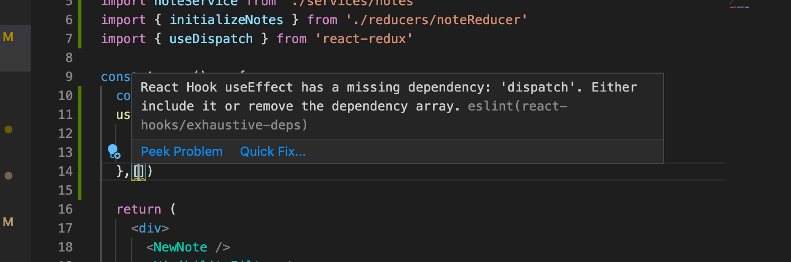

<div class="content">


Let's expand the application, such that the notes are stored to the backend. We'll use [json-server](/en/part2/getting_data_from_server), familiar from part 2.


The initial state of the database is stored into the file <i>db.json</i>, which is placed in the root of the project:

```json
{
  "notes": [
    {
      "content": "the app state is in redux store",
      "important": true,
      "id": 1
    },
    {
      "content": "state changes are made with actions",
      "important": false,
      "id": 2
    }
  ]
}
```


We'll install json-server for the project...

```js
npm install json-server --save-dev
```


and add the following line to the <i>scripts</i> part of the file <i>package.json</i>

```js
"scripts": {
  "server": "json-server -p3001 --watch db.json",
  // ...
}
```

Now let's launch json-server with the command _npm run server_.

Next we'll create a method into the file <i>services/notes.js</i>, which uses <i>axios</i> to fetch data from the backend

```js
import axios from 'axios'

const baseUrl = 'http://localhost:3001/notes'

const getAll = async () => {
  const response = await axios.get(baseUrl)
  return response.data
}

export default { getAll }
```

We'll add axios to the project

```bash
npm install axios
```

We'll change the initialization of the state in <i>noteReducer</i>, such that by default there are no notes:

```js
const noteReducer = (state = [], action) => {
  // ...
}
```

A quick way to initialize the state based on the data on the server is to fetch the notes in the file <i>index.js</i> and dispatch the action <i>NEW\_NOTE</i> for each of them:

```js
// ...
import noteService from './services/notes' // highlight-line

const reducer = combineReducers({
  notes: noteReducer,
  filter: filterReducer,
})

const store = createStore(reducer)

// highlight-start
noteService.getAll().then(notes =>
  notes.forEach(note => {
    store.dispatch({ type: 'NEW_NOTE', data: note })
  })
)
// highlight-end

// ...
```


Let's add support in the reducer for the action <i>INIT\_NOTES</i>, using which the initialization can be done by dispatching a single action. Let's also create an action creator function _initializeNotes_.

```js
// ...
const noteReducer = (state = [], action) => {
  console.log('ACTION:', action)
  switch (action.type) {
    case 'NEW_NOTE':
      return [...state, action.data]
    case 'INIT_NOTES':   // highlight-line
      return action.data // highlight-line
    // ...
  }
}

export const initializeNotes = (notes) => {
  return {
    type: 'INIT_NOTES',
    data: notes,
  }
}

// ...
```


<i>index.js</i> simplifies:

```js
import noteReducer, { initializeNotes } from './reducers/noteReducer'
// ...

noteService.getAll().then(notes =>
  store.dispatch(initializeNotes(notes))
)
```


> **NB:** why didn't we use await in place of promises and event handlers (registered to _then_-methods)?
>
> Await only works inside <i>async</i> functions, and the code in <i>index.js</i> is not inside a function, so due to the simple nature of the operation, we'll abstain from using <i>async</i> this time.

We do, however, decide to move the initialization of the notes into the <i>App</i> component, and, as usual when fetching data from a server, we'll use the <i>effect hook</i>. 

```js
import React, {useEffect} from 'react' // highlight-line
import NewNote from './components/NewNote'
import Notes from './components/Notes'
import VisibilityFilter from './components/VisibilityFilter'
import noteService from './services/notes'
import { initializeNotes } from './reducers/noteReducer' // highlight-line
import { useDispatch } from 'react-redux' // highlight-line

const App = () => {
  const dispatch = useDispatch()
  // highlight-start
  useEffect(() => {
    noteService
      .getAll().then(notes => dispatch(initializeNotes(notes)))
  }, [])
  // highlight-end

  return (
    <div>
      <NewNote />
      <VisibilityFilter />
      <Notes />
    </div>
  )
}

export default App
```

<!-- Hookin useEffect käyttö aiheuttaa eslint-varoituksen: -->
Using the useEffect hook causes an eslint-warning:



<!-- Pääsemme varoituksesta eroon seuraavasti: -->
We can get rid of it by doing the following:

```js
const App = () => {
  const dispatch = useDispatch()
  useEffect(() => {
    noteService
      .getAll().then(notes => dispatch(initializeNotes(notes)))
  }, [dispatch]) // highlight-line

  // ...
}
```

<!-- Nyt komponentin _App_ sisällä määritelty muuttuja <i>dispatch</i> eli käytännössä redux-storen dispatch-funktio on lisätty useEffectille parametrina annettuun taulukkoon. **Jos** dispatch-muuttujan sisältö muuttuisi ohjelman suoritusaikana, suoritettaisiin efekti uudelleen, näin ei kuitenkaan ole, eli varoitus on tässä tilanteessa oikeastaan aiheeton. -->
Now the variable <i>dispatch</i> we define in the _App_ component, which practically is the dispatch function of the redux-store, has been added to the array useEffect receives as a parameter.
**If** the value of the dispatch-variable would change during runtime, 
the effect would be executed again. This however cannot happen in our application, so the warning is unnecessary.

<!-- Toinen tapa päästä eroon varoituksesta olisi disabloida se kyseisen rivin kohdalta: -->
Another way to get rid of the warning would be to disable eslint on that line:

```js
const App = () => {
  const dispatch = useDispatch()
  useEffect(() => {
    noteService
      .getAll().then(notes => dispatch(initializeNotes(notes)))   
      // highlight-start
  },[]) // eslint-disable-line react-hooks/exhaustive-deps  
  // highlight-end

  // ...
}
```

<!-- Yleisesti ottaen eslint-virheiden disabloiminen ei ole hyvä idea, joten vaikka kyseisen eslint-säännön tarpeellisuus onkin aiheuttanut [kiistelyä](https://github.com/facebook/create-react-app/issues/6880), pitäydytään ylemmässä ratkaisussa.  -->
Generally disabling eslint when it throws a warning is not a good idea. Even though the eslint rule in question has caused some [arguments](https://github.com/facebook/create-react-app/issues/6880), we will use the first solution.

<!-- Lisää hookien riippuvuuksien määrittelyn tarpeesta [reactin dokumentaatiossa](https://reactjs.org/docs/hooks-faq.html#is-it-safe-to-omit-functions-from-the-list-of-dependencies). -->
More about the need to define the hooks dependencies in [the react documentation](https://reactjs.org/docs/hooks-faq.html#is-it-safe-to-omit-functions-from-the-list-of-dependencies).

We can do the same thing when it comes to creating a new note. Let's expand the code communicating with the server as follows:

```js
const baseUrl = 'http://localhost:3001/notes'

const getAll = async () => {
  const response = await axios.get(baseUrl)
  return response.data
}

// highlight-start
const createNew = async (content) => {
  const object = { content, important: false }
  const response = await axios.post(baseUrl, object)
  return response.data
}
// highlight-end

export default {
  getAll,
  createNew,
}
```

The method _addNote_ of the component <i>NewNote</i> changes slightly:

```js
import React from 'react'
import { useDispatch } from 'react-redux'
import { createNote } from '../reducers/noteReducer'
import noteService from '../services/notes' // highlight-line

const NewNote = (props) => {
  const dispatch = useDispatch()
  
  const addNote = async (event) => { // highlight-line
    event.preventDefault()
    const content = event.target.note.value
    event.target.note.value = ''
    const newNote = await noteService.createNew(content) // highlight-line
    dispatch(createNote(newNote)) // highlight-line
  }

  return (
    <form onSubmit={addNote}>
      <input name="note" />
      <button type="submit">add</button>
    </form>
  )
}

export default NewNote
```

Because the backend generates ids for the notes, we'll change the action creator _createNote_

```js
export const createNote = (data) => {
  return {
    type: 'NEW_NOTE',
    data,
  }
}
```

Changing the importance of notes could be implemented using the same principle, meaning making an asynchronous method call to the server and then dispatching an appropriate action.

The current state of the code for the application can be found on [github](https://github.com/fullstack-hy2020/redux-notes/tree/part6-3) in the branch <i>part6-3</i>.

</div>

<div class="tasks">

### Exercises 6.13.-6.14.

#### 6.13 Anecdotes and the backend, step1

When the application launches, fetch the anecdotes from the backend implemented using json-server.

As the initial backend data, you can use, e.g. [this](https://github.com/fullstack-hy2020/misc/blob/master/anecdotes.json).

#### 6.14 Anecdotes and the backend, step2

Modify the creation of new anecdotes, such that the anecdotes are stored in the backend.

</div>

<div class="content">

### Asynchronous actions and redux thunk

Our approach is OK, but it is not great that the communication with the server happens inside the functions of the components. It would be better if the communication could be abstracted away from the components, such that they don't have to do anything else but call the appropriate <i>action creator</i>. As an example, <i>App</i> would initialize the state of the application as follows:

```js
const App = () => {
  const dispatch = useDispatch()

  useEffect(() => {
    dispatch(initializeNotes()))  
  },[dispatch]) 

  // ...
}
```

and <i>NewNote</i> would create a new note as follows:

```js
const NewNote = () => {
  const dispatch = useDispatch()
  
  const addNote = async (event) => {
    event.preventDefault()
    const content = event.target.note.value
    event.target.note.value = ''
    dispatch(createNote(content))
  }

  // ...
}
```

Both components would only use the function provided to them as a prop without caring about the communication with the server that is happening in the background.

Now let's install the [redux-thunk](https://github.com/gaearon/redux-thunk)-library, which enables us to create <i>asynchronous actions</i>. Installation is done with the command:

```bash
npm install redux-thunk
```

The redux-thunk-library is a so-called <i>redux-middleware</i>, which must be initialized along with the initialization of the store. While we're here, let's extract the definition of the store into its own file <i>src/store.js</i>:

```js
import { createStore, combineReducers, applyMiddleware } from 'redux'
import thunk from 'redux-thunk' // highlight-line
import { composeWithDevTools } from 'redux-devtools-extension'

import noteReducer from './reducers/noteReducer'
import filterReducer from './reducers/filterReducer'

const reducer = combineReducers({
  notes: noteReducer,
  filter: filterReducer,
})

const store = createStore(
  reducer,
  composeWithDevTools(
    applyMiddleware(thunk) // highlight-line
  )
)

export default store
```

After the changes the file <i>src/index.js</i> looks like this

```js
import React from 'react'
import ReactDOM from 'react-dom'
import { Provider } from 'react-redux' 
import store from './store' // highlight-line
import App from './App'

ReactDOM.render(
  <Provider store={store}>
    <App />
  </Provider>,
  document.getElementById('root')
)
```

Thanks to redux-thunk, it is possible to define <i>action creators</i> so that they return a function having the <i>dispatch</i>-method of redux-store as its parameter. As a result of this, one can make asynchronous action creators, which first wait for some operation to finish, after which they then dispatch the real action.


Now we can define the action creator, <i>initializeNotes</i>, that initializes the state of the notes as follows:

```js
export const initializeNotes = () => {
  return async dispatch => {
    const notes = await noteService.getAll()
    dispatch({
      type: 'INIT_NOTES',
      data: notes,
    })
  }
}
```

In the inner function, meaning the <i>asynchronous action</i>, the operation first fetches all the notes from the server and then <i>dispatches</i> the notes to the action, which adds them to the store.

The component <i>App</i> can now be defined as follows:

```js
const App = () => {
  const dispatch = useDispatch()

  // highlight-start
  useEffect(() => {
    dispatch(initializeNotes()) 
  },[dispatch]) 
  // highlight-end

  return (
    <div>
      <NewNote />
      <VisibilityFilter />
      <Notes />
    </div>
  )
}
```

The solution is elegant. The initialization logic for the notes has been completely separated to outside the React component.

The action creator _createNote_, which adds a new note looks like this

```js
export const createNote = content => {
  return async dispatch => {
    const newNote = await noteService.createNew(content)
    dispatch({
      type: 'NEW_NOTE',
      data: newNote,
    })
  }
}
```

The principle here is the same: first an asynchronous operation is executed, after which the action changing the state of the store is <i>dispatched</i>.

The component <i>NewNote</i> changes as follows:

```js
const NewNote = () => {
  const dispatch = useDispatch()
  
  const addNote = async (event) => {
    event.preventDefault()
    const content = event.target.note.value
    event.target.note.value = ''
    dispatch(createNote(content)) //highlight-line
  }

  return (
    <form onSubmit={addNote}>
      <input name="note" />
      <button type="submit">lisää</button>
    </form>
  )
}
```

The current state of the code for the application can be found on [github](https://github.com/fullstack-hy2020/redux-notes/tree/part6-4) in the branch <i>part6-4</i>.

</div>

<div class="tasks">


### Exercises 6.15.-6.18.

#### 6.15 Anecdotes and the backend, step3

Modify the initialization of redux-store to happen using asynchronous action creators, which are made possible by the <i>redux-thunk</i>-library.

#### 6.16 Anecdotes and the backend, step4

Also modify the creation of a new anecdote to happen using asynchronous action creators, made possible by the <i>redux-thunk</i>-library.


#### 6.17 Anecdotes and the backend, step5

Voting does not yet save changes to the backend. Fix the situation with the help of the <i>redux-thunk</i>-library.

#### 6.18 Anecdotes and the backend, step6

The creation of notifications is still a bit tedious, since one has to do two actions and use the _setTimeout_ function:

```js
dispatch(setNotification(`new anecdote '${content}'`))
setTimeout(() => {
  dispatch(clearNotification())
}, 5000)
```

Make an asynchronous action creator, which enables one to provide the notification as follows:

```js
dispatch(setNotification(`you voted '${anecdote.content}'`, 10))
```

the first parameter is the text to be rendered and the second parameter is the time to display the notification given in seconds. 

Implement the use of this improved notification in your application.

</div>
