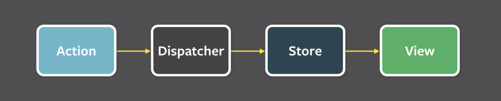
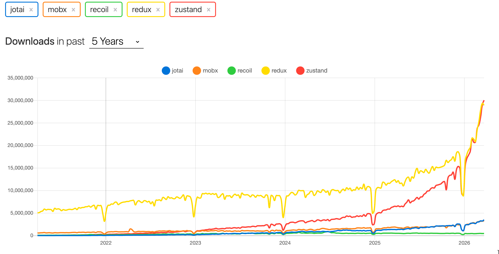
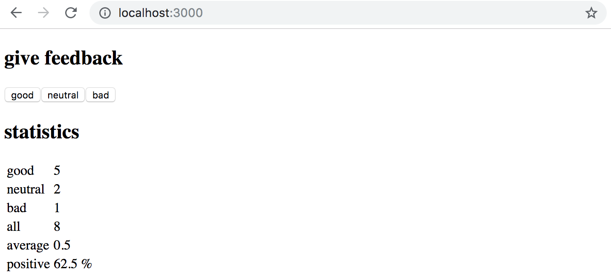

<div class="content">

Hemos seguido la práctica recomendada de React para gestionar el estado de la aplicación: definir el estado que necesitan varios componentes y las funciones que lo manejan en los componentes [situados más arriba](https://react.dev/learn/sharing-state-between-components) de la jerarquía. La mayor parte del estado y sus funciones suelen definirse directamente en el componente raíz y pasarse mediante props a los componentes que los necesitan. Esto funciona hasta cierto punto, pero, a medida que la aplicación crece, la gestión del estado se vuelve más difícil.

### Arquitectura Flux

Facebook desarrolló la arquitectura [Flux](https://facebookarchive.github.io/flux/docs/in-depth-overview) durante los primeros años de React para aliviar los problemas de gestión del estado. En Flux, la gestión del estado se separa por completo de los componentes de React y se traslada a <i>stores</i> externos. El estado del store no se modifica directamente, sino mediante <i>actions</i> específicas creadas para ello.

Cuando una acción cambia el estado del store, las vistas se vuelven a renderizar:



Si una interacción con la aplicación —por ejemplo, pulsar un botón— exige cambiar el estado, el cambio se realiza mediante una acción. Esto provoca que la vista vuelva a renderizarse:


Por lo tanto, Flux proporciona una forma estándar de cómo y dónde se mantiene el estado de la aplicación y de realizar cambios en ella.

### Redux

[Redux](https://redux.js.org), que sigue la arquitectura Flux, fue la solución de gestión de estado dominante para aplicaciones React durante casi una década. En este curso, Redux también se utilizó hasta la primavera de 2026. Redux siempre ha estado plagado de complejidad y una gran cantidad de código repetitivo. La situación mejoró significativamente con la introducción de [Redux Toolkit](https://redux-toolkit.js.org/), pero a pesar de esto, la comunidad continuó desarrollando soluciones alternativas de gestión del estado, como [MobX](https://mobx.js.org/), [Recoil](https://recoiljs.org/) y [Jotai](https://www.npmjs.com/package/jotai). Su popularidad ha variado.

El más interesante, y sin duda el más popular de los recién llegados, es [Zustand](https://zustand.docs.pmnd.rs/), y también es nuestra elección como solución de gestión del estado. Zustand parece haber alcanzado ya la popularidad de Redux:



### Zustand

Familiaricémonos con Zustand implementando una vez más una aplicación de contador:


Crea una nueva aplicación Vite e instala <i>Zustand</i>:

```bash
npm install zustand
```

La primera versión, donde sólo funciona el incremento del contador, es la siguiente:

```bash
import { create } from 'zustand'

const useCounterStore = create(set => ({
  counter: 0,
  increment: () => set(state => ({ counter: state.counter + 1 })),
}))

const App = () => {
  const counter = useCounterStore(state => state.counter)
  const increment = useCounterStore(state => state.increment)

  return (
    <div>
      <div>{counter}</div>
      <div>
        <button onClick={increment}>plus</button>
        <button>minus</button>
        <button>zero</button>
      </div>
      
    </div>
  )
}
```

La aplicación comienza creando un <i>store</i>, es decir, el estado global, mediante la función [create](https://zustand.docs.pmnd.rs/reference/apis/create) de Zustand:

```bash
import { create } from 'zustand'

const useCounterStore = create(set => ({
  counter: 0,
  increment: () => set(state => ({ counter: state.counter + 1 })),
}))
```

La función recibe como parámetro una <i>función</i> que devuelve el estado que se definirá para la aplicación. El parámetro es, por tanto, el siguiente:

```js
set => ({
  counter: 0,
  increment: () => set(state => ({ counter: state.counter + 1 })),
})
```

Por tanto, el estado tiene <i>counter</i> definido con un valor de cero y <i>increment</i> que es una función.

Los componentes de la aplicación pueden acceder a los valores y funciones definidos en el estado a través de la función <i>useCounterStore</i> definida usando <i>create</i> de Zustand. El componente <i>App</i> utiliza <i>selectors</i> para recuperar el valor <i>counter</i> y la función <i>increment</i> del estado:

```js
const App = () => {
  // highlight-start
  // using selector to pick right part of the store state
  const counter = useCounterStore(state => state.counter)
  const increment = useCounterStore(state => state.increment)
  // highlight-end

  return (
    <div>
      <div>{counter}</div> // highlight-line
      <div>
        <button onClick={increment}>plus</button>  // highlight-line
        <button>minus</button>
        <button>zero</button>
      </div>
      
    </div>
  )
}
```

El código almacena el valor del contador del store en una variable de la siguiente manera:

```js
const counter = useCounterStore(state => state.counter)
```

Se utiliza una función selectora <i>state => state.counter</i>, que determina lo que se devuelve del contenido del store. De la misma forma, la función almacenada en el store se recupera en la variable <i>increment</i>.

La función de estado <i>increment</i>, que se definió de la siguiente manera, se proporciona como controlador de clic para el botón "más":

```js
const useCounterStore = create(set => ({
  counter: 0,
  increment: () => set(state => ({ counter: state.counter + 1 })), // highlight-line
}))
```

Veamos la definición de la función por separado:

```js
() => set(state => ({ counter: state.counter + 1 }))
```

Esta es una función que llama a la función [set](https://zustand.docs.pmnd.rs/learn/guides/updating-state) dando otra función como parámetro. Esta función pasada como parámetro define cómo cambia el estado:

```js
state => ({ counter: state.counter + 1 })
```

que es una abreviatura de:

```js
state => {
  return { counter: state.counter + 1 }
}
```

La función devuelve un nuevo estado, que calcula en función del estado anterior al que puede acceder mediante el parámetro <i>state</i>. Entonces, si el antiguo estado es, por ejemplo:

```js
{
  counter: 1,
  increment: // function definition
}
```

el nuevo estado se convierte en:

```js
{
  counter: 2,
  increment: // function definition
}
```

El estado siempre contiene también la función de cambio de estado <i>increment</i>.

La función de transición de estado

```js
state => ({ counter: state.counter + 1 })
```

solo afecta el valor <i>counter</i> en el estado.

Nada impediría cambiar la función en el estado dentro de la función de transición de estado; por ejemplo, si lo definimos de la siguiente manera:

```js
state => {
  return {
    counter: state.counter + 1 ,
    increment: console.log('increment broken')
  }
}
```

el botón de incremento sólo funcionaría la primera vez; después de eso, presionar el botón solo imprimiría en la consola.

Cuando el nuevo estado se establece como:

```js
state => ({ counter: state.counter + 1 })
```

solo se actualiza el valor de la clave <i>counter</i> en el estado; el nuevo estado se obtiene fusionando el estado anterior con el valor devuelto por la función de cambio de estado. Es por eso que la siguiente función de transición de estado:

```js
state => ({})
```

No afecta en absoluto al estado.

Completemos también la solicitud para los botones restantes:

```js
const useCounterStore = create(set => ({
  counter: 0,
  increment: () => set(state => ({ counter: state.counter + 1 })),
  decrement: () => set(state => ({ counter: state.counter - 1 })),
  zero: () => set(() => ({ counter: 0 })),  
}))

const App = () => {
  const counter = useCounterStore(state => state.counter)
  const increment = useCounterStore(state => state.increment)
  const decrement = useCounterStore(state => state.decrement)
  const zero = useCounterStore(state => state.zero)

  return (
    <div>
      <div>{counter}</div>
      <div>
        <button onClick={increment}>plus</button>
        <button onClick={decrement}>minus</button>
        <button onClick={zero}>zero</button>
      </div>
      
    </div>
  )
}
```

> #### ¿De dónde vienen set y state?
>
> ¿De dónde viene <i>set</i>? Es una función auxiliar que proporciona <i>create</i> para actualizar el estado. <i>create</i> llama a la función que recibe como parámetro y le pasa <i>set</i> automáticamente. No necesitas llamarla ni importarla; Zustand se encarga de ello.
>
> ¿De dónde viene <i>state</i>? Cuando se proporciona una función como parámetro para <i>set</i> (en lugar de un nuevo objeto de estado directamente), Zustand llama a esa función con el estado actual del store como argumento. De esta manera, las funciones de actualización de estado pueden acceder al estado anterior para calcular el nuevo.

### Uso del estado desde distintos componentes

Refactoricemos la aplicación para que la definición del store se mueva a su propio archivo <i>store.js</i> y la vista se divida en varios componentes, cada uno definido en sus propios archivos.

El contenido de <i>store.js</i> es sencillo:

```js
export const useCounterStore = create(set => ({
  counter: 0,
  increment: () => set(state => ({ counter: state.counter + 1 })),
  decrement: () => set(state => ({ counter: state.counter - 1 })),
  zero: () => set(() => ({ counter: 0 })),  
}))
```

El componente <i>App</i> se simplifica de la siguiente manera:

```js
import Display from './Display'
import Controls from './Controls'

const App = () => {
  return (
    <div>
      <Display />
      <Controls />
    </div>
  )
}

export default App
```

Lo que es digno de mención aquí es que el componente <i>App</i> ya no pasa el estado a sus componentes secundarios. De hecho, el componente no afecta el estado de ninguna manera y la definición del store se ha separado completamente fuera del componente.

El componente que renderiza el valor del contador es sencillo:

```js
import { useCounterStore } from './store'

const Display = () => {
  const counter = useCounterStore(state => state.counter)

  return (
    <div>{counter}</div>
  )
}

export default Display
```

El componente accede al valor del contador a través de la función <i>useCounterStore</i> que define el store. Esto es conveniente en muchos sentidos, por ejemplo, no es necesario pasar el estado al componente a través de props.

El componente que define los botones tiene este aspecto:

```js
import { useCounterStore } from './store'

const Controls = () => {
  const increment = useCounterStore(state => state.increment)
  const decrement = useCounterStore(state => state.decrement)
  const zero = useCounterStore(state => state.zero)

  return (
    <div>
      <button onClick={increment}>plus</button>
      <button onClick={decrement}>minus</button>
      <button onClick={zero}>zero</button>
    </div>
  )
}

export default Controls
```

La función <i>useCounterStore</i> toma una función selectora como parámetro, que determina qué parte del estado usar. Por ejemplo:

```js
  const increment = useCounterStore(state => state.increment)
```

Aquí, la función selectora <i>state => state.increment</i> selecciona el valor de la clave <i>increment</i> del estado (la función que incrementa el contador) y lo almacena en la variable <i>increment</i>.

También podríamos acceder a todo el estado de la siguiente manera:

```js
  const state = useCounterStore()
  // does the same as useCounterStore(state => state), i.e., selects the entire state
```

Luego podríamos referirnos al valor del contador y las funciones usando notación de puntos, es decir, <i>state.counter</i> y <i>state.increment</i>.

Surge una pregunta natural: ¿sería posible utilizar múltiples partes del estado mediante la desestructuración?

```js
import { useCounterStore } from './store'

const Controls = () => {
  const { increment, decrement, zero } = useCounterStore() // highlight-line

  return (
    <div>
      <button onClick={increment}>plus</button>
      <button onClick={decrement}>minus</button>
      <button onClick={zero}>zero</button>
    </div>
  )
}

export default Controls
```

La solución funciona, pero tiene un inconveniente importante. La desestructuración hace que el componente <i>Controls</i> se vuelva a representar cada vez que cambia el valor del contador, aunque el componente solo muestra los botones y no el valor en sí.

Por lo tanto, la mejor práctica en Zustand es seleccionar del estado exactamente sólo aquellas piezas que se necesitan en el componente dado. Un componente se vuelve a renderizar solo cuando cambia la parte del estado que ha seleccionado. Cuando en lugar de escribir:

```js
  const { increment, decrement, zero } = useCounterStore() 
```

el componente ya no reacciona a los cambios en el valor del contador porque no lo ha seleccionado del estado.

### Reorganización del estado

Sin embargo, podemos obtener una solución bastante clara reorganizando el estado de la siguiente manera:

```js
export const useCounterStore = create(set => ({
  counter: 0,
  actions: {
    increment: () => set(state => ({ counter: state.counter + 1 })),
    decrement: () => set(state => ({ counter: state.counter - 1 })),
    zero: () => set(() => ({ counter: 0 })),
  }  
}))
```

Las funciones de cambio de estado ahora están agrupadas bajo su propia clave <i>actions</i>, y pueden seleccionarse como un todo y desestructurarse:

```js
const Controls = () => {
  
  const { increment, decrement, zero } = useCounterStore(state => state.actions)

  return (
    <div>
      <button onClick={increment}>plus</button>
      <button onClick={decrement}>minus</button>
      <button onClick={zero}>zero</button>
    </div>
  )
}
```

Ahora no se vuelve a renderizar, ya que solo se han seleccionado las funciones del estado y permanecen iguales durante toda la vida útil del store.

Según algunas [buenas prácticas](https://tkdodo.eu/blog/working-with-zustand#only-export-custom-hooks), no conviene exportar la función que da acceso al estado completo para utilizarla por toda la aplicación. Es preferible crear a partir de ella vistas más pequeñas que expongan solo las partes necesarias del estado. Modifiquemos <i>store.js</i> de la siguiente manera:

```js
import { create } from 'zustand'

const useCounterStore = create(set => ({
  counter: 0,
  actions: {
    increment: () => set(state => ({ counter: state.counter + 1 })),
    decrement: () => set(state => ({ counter: state.counter - 1 })),
    zero: () => set(() => ({ counter: 0 })),
  }  
}))

// the hook functions that are used elsewhere in app
export const useCounter = () => useCounterStore(state => state.counter)
export const useCounterControls = () => useCounterStore(state => state.actions)
```

Ahora, fuera del módulo que define el estado, están disponibles las funciones <i>useCounter</i>, que devuelve el valor del contador cuando se llama, y ​​<i>useCounterControls</i>, que devuelve las funciones que modifican el valor del contador. El uso cambia ligeramente:

```js
import { useCounter } from './store' // highlight-line

const Display = () => {
  const counter = useCounter() // highlight-line

  return (
    <div>{counter}</div>
  )
}
```

```js
import { useCounterControls } from './store' // highlight-line

const Controls = () => {
  const { increment, decrement, zero } = useCounterControls() // highlight-line

  return (
    <div>
      <button onClick={increment}>plus</button>
      <button onClick={decrement}>minus</button>
      <button onClick={zero}>zero</button>
    </div>
  )
}
```

Cuando se usa el estado de esta manera, ya no es necesario usar funciones selectoras, ya que su uso está oculto dentro de la definición de las nuevas funciones auxiliares.

Los más observadores han notado que las funciones relacionadas con Zustand se nombran comenzando con la palabra <i>use</i>. La razón de esto es que la función devuelta por la función <i>create</i> de Zustand (en nuestro ejemplo <i>useCounterStore</i>) es una función React [enganche personalizado](https://react.dev/learn/reusing-logic-with-custom-hooks). Nuestras propias funciones auxiliares <i>useCounter</i> y <i>useCounterControls</i> también son esencialmente hooks personalizados, porque ocultan el uso del hook personalizado <i>useCounterStore</i> dentro de ellas.

Los hooks personalizados están sujetos a una serie de reglas; por ejemplo, sus nombres deben comenzar siempre por <i>use</i>. Las [reglas de los hooks](https://react.dev/warnings/invalid-hook-call-warning) estudiadas en la [parte 1](/es/part1/un_estado_mas_complejo_depurando_aplicaciones_react#reglas-de-los-hooks) también se aplican a los hooks personalizados.

</div>

<div class="tasks">

### Ejercicio 6.1.

Hagamos una nueva versión del ejercicio de Unicafe de la parte 1. Gestionaremos el estado de la aplicación con Zustand.

Puedes utilizar el proyecto https://github.com/fullstack-hy2020/unicafe-zustand como base para tu aplicación.

<i>Comience eliminando la configuración de Git de la aplicación clonada e instalando las dependencias:</i>

```bash
cd unicafe-zustand   // go to the cloned repository directory
rm -rf .git
npm install
```

#### 6.1: Unicafé revisitado

Luego implemente la funcionalidad original completa de la aplicación.

La apariencia y la funcionalidad de tu aplicación deben ser las mismas que en la parte 1:



</div>

<div class="content">

### Notas de Zustand

Nuestro objetivo es crear una versión basada en Zustand de la antigua aplicación de notas.

La primera versión de la aplicación es la siguiente. El componente <i>App</i>:

```js
import { useNotes } from './store'

const App = () => {
  const notes = useNotes()

  return (
    <div>
      <ul>
        {notes.map(note => (
          <li key={note.id}>
            {note.important ? <strong>{note.content}</strong> : note.content}
          </li>
        ))}
      </ul>
    </div>
  )
}
export default App
```

El store se define inicialmente de la siguiente manera:

```js
import { create } from 'zustand'

const useNoteStore = create(set => ({
  notes: [
    {
      id: 1,
      content: 'Zustand is less complex than Redux',
      important: true,
    },
  ],
}))

export const useNotes = () => useNoteStore(state => state.notes)
```

Por ahora, la aplicación no permite añadir notas nuevas y el store tampoco lo admite todavía. El estado se ha inicializado con una nota para que podamos comprobar que la aplicación lo renderiza correctamente.

### Funciones puras y objetos inmutables

El primer intento de acción que añade una nota es el siguiente:

```js
note => set(
          state => {
            state.notes.push(note)
            return state
          }
        )
```

La función recibe una nota como parámetro y devuelve un estado en el que se ha agregado una nueva nota al estado anterior <i>state</i>.

Sin embargo, nuestro intento infringe las reglas. La [documentación de Zustand](https://zustand.docs.pmnd.rs/learn/guides/immutable-state-and-merging) indica que, al igual que con useState de React, debemos actualizar el estado de forma inmutable. Como sabemos, <i>state.notes.push</i> muta el objeto de estado, así que debemos modificar la solución.

La forma correcta es usar, por ejemplo, la función [Array.concat](https://developer.mozilla.org/en-US/docs/Web/JavaScript/Reference/Global_Objects/Array/concat), que no modifica el estado existente sino que crea una nueva copia del mismo con la nueva nota agregada:

```js
note => set(
          state => {
            return { notes: state.notes.concat(note) }
          }
        )
```

La definición de store ahora tiene el siguiente aspecto:

```js
import { create } from 'zustand'

const useNoteStore = create(set => ({
  notes: [],
  actions: {
    add: note => set(
      state => ({ notes: state.notes.concat(note) })
    )
  }
}))

export const useNotes = () => useNoteStore(state => state.notes)
export const useNoteActions = () => useNoteStore(state => state.actions)
```

> #### Sintaxis de extensión de array
>
> Otra forma comúnmente vista de hacer lo mismo es usar la sintaxis de array [spread](https://developer.mozilla.org/en-US/docs/Web/JavaScript/Reference/Operators/Spread_syntax):
>
> ```js
> state => ({ notes: [...state.notes, note] })
> ```
>
> Aquí se forma un array expandiendo los elementos del array <i>state.notes</i> mediante la sintaxis spread y añadiendo después la nueva nota al final. Elegir entre spread y <i>concat</i> es una cuestión de preferencia.

Técnicamente hablando, el estado creado con Zustand es [inmutable](https://developer.mozilla.org/en-US/docs/Glossary/Immutable), y las funciones de acción que modifican el estado deben ser [funciones puras](https://en.wikipedia.org/wiki/Pure_function).

Las funciones puras son aquellas que <i> no producen efectos secundarios </i> y siempre devuelven el mismo resultado cuando se llaman con los mismos parámetros.

### Formulario no controlado

Agreguemos la capacidad de crear nuevas notas a la aplicación:

```js
import { useNotes, useNoteActions } from './store'

const App = () => {
  const notes = useNotes()
  const { add } = useNoteActions() // highlight-line

  const generateId = () => Number((Math.random() * 1000000).toFixed(0))  // highlight-line

 // highlight-start
  const addNote = (e) => {
    e.preventDefault()
    const content = e.target.note.value
    add({ id: generateId(), content, important: false })
    e.target.reset()
  }
   // highlight-end

  return (
    <div>
     // highlight-start
      <form onSubmit={addNote}>
        <input name="note" />
        <button type="submit">add</button>
      </form>
       // highlight-end
      <ul>
        {notes.map(note => (
          <li key={note.id}>
            {note.important ? <strong>{note.content}</strong> : note.content}
          </li>
        ))}
      </ul>
    </div>
  )
}
```

La implementación es bastante sencilla. Lo que es digno de mención acerca de agregar una nueva nota es que, a diferencia de los formularios anteriores implementados con React, tenemos <i>not</i> vinculado el valor del campo del formulario al estado del componente <i>App</i>. React llama a dichas formas [incontroladas](https://react.dev/learn/sharing-state-between-components#controlled-and-uncontrolled-components).

> Las formas no controladas tienen ciertas limitaciones. No permiten, por ejemplo, proporcionar mensajes de validación sobre la marcha, desactivar el botón de envío según el contenido, etc. Sin embargo, esta vez son adecuados para nuestro caso de uso.
Si lo deseas, puedes leer más sobre el tema [aquí](https://goshakkk.name/controlled-vs-uncontrolled-inputs-react/).

El formulario es muy sencillo:

```js
<form onSubmit={addNote}>
  <input name="note" />
  <button type="submit">add</button>
</form>
```

Lo que llama la atención del formulario es que el campo de entrada tiene un nombre. Esto permite que la función del controlador acceda al valor del campo.

El controlador de sumas también es sencillo:

```js
  const addNote = (e) => {
    e.preventDefault()
    const content = e.target.note.value
    add({ id: generateId(), content, important: false })
    e.target.reset()
  }
```

El contenido se recupera del campo de texto del formulario usando <i>e.target.note.value</i> en una variable, que se usa como parámetro en la llamada a la función de agregar notas <i>add</i>.

La última línea, <i>e.target.reset()</i>, borra el formulario.

El código actual de la aplicación está disponible en su totalidad en [GitHub](https://github.com/fullstack-hy2020/zustand-notes/tree/part6-1), en la rama <i>part6-1</i>.

### Más componentes y funcionalidades

Dividamos la aplicación en más componentes. Separaremos la creación de una nueva nota, la lista de notas y la visualización de una sola nota en sus propios componentes.

El componente <i>App</i> después del cambio es simple:

```js
const App = () => (
  <div>
    <NoteForm />
    <NoteList />
  </div>
)
```

La creación de notas, es decir, <i>NoteForm</i>, no contiene nada dramático, por lo que el código no se muestra aquí.

El componente responsable de enumerar las notas, <i>NoteList</i>, tiene el siguiente aspecto:

```js
import { useNotes } from './store'
import Note from './Note'

const NoteList = () => {
  const notes = useNotes()

  return (
    <ul>
      {notes.map(note => (
        <Note key={note.id} note={note} />
      ))}
    </ul>
  )
}
```

El componente recupera la lista de notas del store y crea un componente <i>Note</i> correspondiente para cada una, pasando los datos de la nota como props:

```js
const Note = ({ note }) => (
  <li>
    {note.important ? <strong>{note.content}</strong> : note.content}
  </li>
)
```

Agreguemos también la capacidad de alternar la importancia de una nota. El componente después del cambio es el siguiente:

```js
import { useNoteActions } from './store'

const Note = ({ note }) => {
  const { toggleImportance } = useNoteActions() // highlight-line

  return (
    <li>
      {note.important ? <strong>{note.content}</strong> : note.content}
      // highlight-start
      <button onClick={() => toggleImportance(note.id)}>
        {note.important ? 'make not important' : 'make important'}
      </button>
      // highlight-end
    </li>
  )
}
```

El componente desestructura la función de alternancia de importancia a partir del valor de retorno de <i>useNoteActions</i> y la llama cuando se hace clic en el botón de alternancia.

La implementación de la función de cambio de importancia se parece a la siguiente:

```js
import { create } from 'zustand'

const useNoteStore = create(set => ({
  notes: [],
  actions: {
    add: note => set(
      state => ({ notes: state.notes.concat(note) })
    ),
    // highlight-start
    toggleImportance: id => set(
      state => ({
        notes: state.notes.map(note =>
          note.id === id ? { ...note, important: !note.important } : note
        )
      })
    )
     // highlight-end
  }
}))

```

La función recibe como parámetro el id de la nota a modificar. El nuevo estado se forma a partir del estado anterior utilizando la función <i>map</i> de modo que se incluyan todas las notas antiguas, excepto la nota que se va a modificar, para la cual se crea una versión donde se alterna su importancia:

```js
{ ...note, important: !note.important } 
```

El código actual de la aplicación está disponible en su totalidad en [GitHub](https://github.com/fullstack-hy2020/zustand-notes/tree/part6-2), en la rama <i>part6-2</i>.

</div>

<div class="tasks">

### Ejercicios 6.2.-6.6.

Implementemos una nueva versión de la aplicación de votación de anécdotas de la parte 1. Utiliza el proyecto https://github.com/fullstack-hy2020/zustand-anecdotes como base para tu solución.

Si clona el proyecto dentro de un repositorio Git existente, <i>elimine la configuración de Git de la aplicación clonada:</i>

```bash
cd zustand-anecdotes  // go to the cloned repository directory
rm -rf .git
```

La aplicación se inicia normalmente, pero primero debes instalar las dependencias:

```bash
npm install
npm run dev
```

Al completar los siguientes ejercicios, la aplicación debería verse así:


#### 6.2: anécdotas, paso 1

Implementar la posibilidad de votar por anécdotas. El número de votos debe almacenarse en el store de Zustand.

#### 6.3: anécdotas, paso 2

Añade la posibilidad de añadir nuevas anécdotas a la aplicación.

Puedes mantener el formulario para añadir anécdotas [sin controlar](/es/part6/arquitectura_flux_y_zustand#formulario-no-controlado), como en el ejemplo anterior.

#### 6.4: anécdotas, paso 3

Separe la creación de una nueva anécdota en su propio componente llamado <i>AnecdoteForm</i> y separe la visualización de la lista de anécdotas en su propio componente llamado <i>AnecdoteList</i>.

Después de este ejercicio, el componente <i>App</i> debería tener el siguiente aspecto:

```js
import AnecdoteForm from './components/AnecdoteForm'
import AnecdoteList from './components/AnecdoteList'

const App = () => {
  return (
    <div>
      <h2>Anecdotes</h2>
      <AnecdoteList />
      <AnecdoteForm />
    </div>
  )
}

export default App
```

#### 6.5: anécdotas, paso 4

Asegúrate de que las anécdotas se mantengan en orden descendente según su número de votos.

**NOTA** En este ejercicio es recomendable utilizar la función [Array.toSorted](https://developer.mozilla.org/en-US/docs/Web/JavaScript/Reference/Global_Objects/Array/toSorted), que no ordena el array original sino que crea una copia ordenada del mismo. ¡Esto se debe a que el estado de Zustand no debe sufrir mutaciones!

</div>
