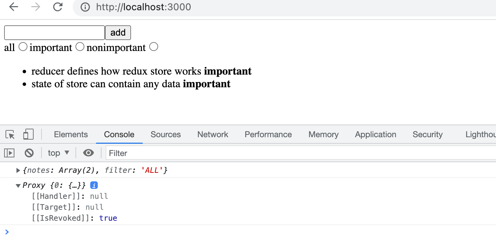
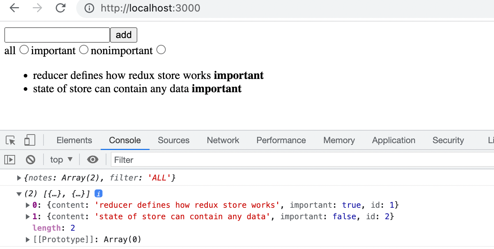
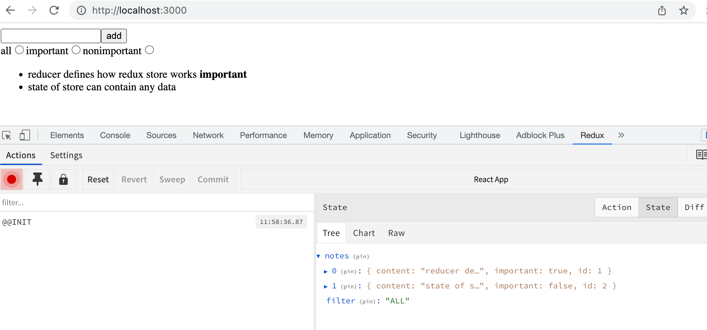
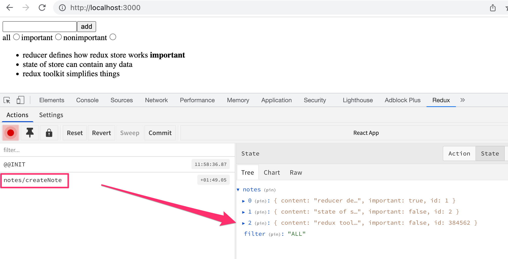
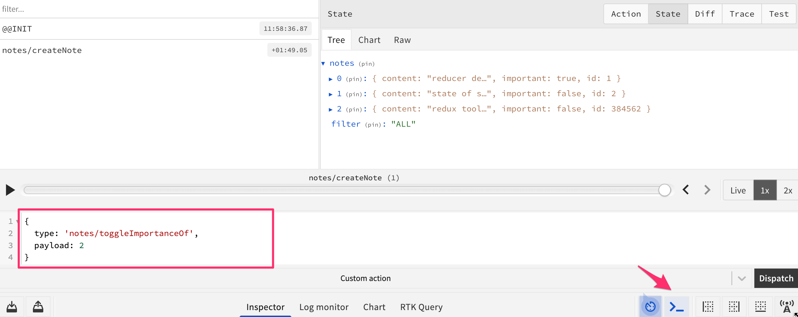

<div class="content">


Continuemos nuestro trabajo con la [versión redux](/es/part6/flux_architecture_y_redux#redux-notas) simplificada de nuestra aplicación de notas.


Para facilitar nuestro desarrollo, cambiemos nuestro reducer para que el store se inicialice con un estado que contenga un par de notas:

```js
const initialState = [
  {
    content: 'reducer defines how redux store works',
    important: true,
    id: 1,
  },
  {
    content: 'state of store can contain any data',
    important: false,
    id: 2,
  },
]

const noteReducer = (state = initialState, action) => {
  // ...
}

// ...
export default noteReducer
```


### Store con estado complejo


Implementemos el filtrado de las notas que se muestran al usuario. La interfaz de usuario para los filtros se implementará con [botones de radio](https://developer.mozilla.org/en-US/docs/Web/HTML/Element/input/radio):


Comencemos con una implementación muy simple y directa:

```js
import React from 'react'
import NewNote from './components/NewNote'
import Notes from './components/Notes'

const App = () => {
//highlight-start
  const filterSelected = (value) => {
    console.log(value)
  }
//highlight-end

  return (
    <div>
      <NewNote />
        //highlight-start
      <div>
        all          <input type="radio" name="filter"
          onChange={() => filterSelected('ALL')} />
        important    <input type="radio" name="filter"
          onChange={() => filterSelected('IMPORTANT')} />
        nonimportant <input type="radio" name="filter"
          onChange={() => filterSelected('NONIMPORTANT')} />
      </div>
      //highlight-end
      <Notes />
    </div>
  )
}
```


Dado que el atributo <i>name</i> de todos los botones de radio es el mismo, forman un <i>button group</i> (grupo de botones) en el que solo se puede seleccionar una opción.


Los botones tienen un controlador de cambios que actualmente solo imprime el string asociado con el botón en el que se hizo clic en la consola.


Decidimos implementar la funcionalidad del filtro almacenando <i>el valor del filtro</i> en el store redux además de las notas mismas. El estado del store debería verse así después de realizar estos cambios:

```js
{
  notes: [
    { content: 'reducer defines how redux store works', important: true, id: 1},
    { content: 'state of store can contain any data', important: false, id: 2}
  ],
  filter: 'IMPORTANT'
}
```


Solo el array de notas se almacena en el estado de la implementación actual de nuestra aplicación. En la nueva implementación, el objeto de estado tiene dos propiedades, <i>notes</i> que contienen el array de notas y <i>filter</i> que contiene un string que indica qué notas deben mostrarse al usuario.

### Reducers combinados


Podríamos modificar nuestro reducer actual para hacer frente a la nueva forma del estado. Sin embargo, una mejor solución en esta situación es definir un nuevo reducer separado para el estado del filtro:

```js
const filterReducer = (state = 'ALL', action) => {
  switch (action.type) {
    case 'SET_FILTER':
      return action.filter
    default:
      return state
  }
}
```


Las acciones para cambiar el estado del filtro se ven así:

```js
{
  type: 'SET_FILTER',
  filter: 'IMPORTANT'
}
```


Creemos también una nueva función de _action creator_ . Escribiremos el código para el creador de la acción en un nuevo módulo <i>src/reducers/filterReducer.js</i>:

```js
const filterReducer = (state = 'ALL', action) => {
  // ...
}

export const filterChange = filter => {
  return {
    type: 'SET_FILTER',
    filter,
  }
}

export default filterReducer
```


Podemos crear el reducer real para nuestra aplicación combinando los dos reducers existentes con la función [combineReducers](https://redux.js.org/api/combinereducers).

Definamos el reducer combinado en el archivo <i>index.js</i>:

```js
import React from 'react'
import ReactDOM from 'react-dom'
import { createStore, combineReducers } from 'redux' // highlight-line
import { Provider } from 'react-redux' 
import App from './App'

import noteReducer from './reducers/noteReducer'
import filterReducer from './reducers/filterReducer' // highlight-line

 // highlight-start
const reducer = combineReducers({
  notes: noteReducer,
  filter: filterReducer
})
 // highlight-end

const store = createStore(reducer)

console.log(store.getState())

ReactDOM.render(
  /*
  <Provider store={store}>
    <App />
  </Provider>,
  */
  <div />,
  document.getElementById('root')
)
```

Dado que nuestra aplicación se rompe por completo en este punto, representamos un elemento <i>div</i> vacío en lugar del componente <i>App</i>.


El estado del store se imprime en la consola:


Como podemos ver en el resultado, ¡el store tiene la forma exacta que queríamos!


Echemos un vistazo más de cerca a cómo se crea el reducer combinado:

```js
const reducer = combineReducers({
  notes: noteReducer,
  filter: filterReducer,
})
```


El estado del store definido por el reducer anterior es un objeto con dos propiedades: <i>notes</i> y <i>filter</i>. El valor de la propiedad <i>notes</i> está definido por el <i>noteReducer</i>, que no tiene que lidiar con las otras propiedades del estado. Asimismo, la propiedad <i>filter</i> es administrada por <i>filterReducer</i>.


Antes de realizar más cambios en el código, echemos un vistazo a cómo las diferentes acciones cambian el estado del store definida por el reducer combinado. Agreguemos lo siguiente al archivo <i>index.js</i>:

```js
import { createNote } from './reducers/noteReducer'
import { filterChange } from './reducers/filterReducer'
//...
store.subscribe(() => console.log(store.getState()))
store.dispatch(filterChange('IMPORTANT'))
store.dispatch(createNote('combineReducers forms one reducer from many simple reducers'))
```


Al simular la creación de una nota y cambiar el estado del filtro de esta manera, el estado del store se registra en la consola después de cada cambio que se realiza en el store:


En este punto es bueno darse cuenta de un pequeño pero importante detalle. Si agregamos una declaración de registro de la consola <i>al comienzo de ambos reduceres</i>:

```js
const filterReducer = (state = 'ALL', action) => {
  console.log('ACTION: ', action)
  // ...
}
```


Según el resultado de la consola, uno podría tener la impresión de que cada acción se duplica:


¿Hay algún error en nuestro código? No. El reducer combinado funciona de tal manera que cada <i>acción</i> se maneja en <i>cada</i> parte del reducer combinado. Normalmente, solo un reducer está interesado en una acción determinada, pero hay situaciones en las que varios reducers cambian sus respectivas partes del estado en función de la misma acción.

### Terminando los filtros


Terminemos la aplicación para que utilice el reducer combinado. Comenzamos cambiando la representación de la aplicación y conectando el store a la aplicación en el archivo <i>index.js</i>:

```js
ReactDOM.render(
  <Provider store={store}>
    <App />
  </Provider>,
  document.getElementById('root')
)
```

A continuación, solucionemos un error causado por el código que espera que la store de aplicaciones sea un array de notas:


Es una solución fácil. Debido a que las notas están en el campo <i>notes</i> del store, solo tenemos que hacer un pequeño cambio en la función de selector:

```js
const Notes = () => {
  const dispatch = useDispatch()
  const notes = useSelector(state => state.notes) // highlight-line

  return(
    <ul>
      {notes.map(note =>
        <Note
          key={note.id}
          note={note}
          handleClick={() => 
            dispatch(toggleImportanceOf(note.id))
          }
        />
      )}
    </ul>
  )
}
```

Anteriormente, la función de selector retornaba el estado completo del store:

```js
const notes = useSelector(state => state)
```

Y ahora devuelve solo su campo <i>notes</i>

```js
const notes = useSelector(state => state.notes)
```


Extraigamos el filtro de visibilidad en su propio componente <i>src/components/VisibilityFilter.js</i>:

```js
import React from 'react'
import { filterChange } from '../reducers/filterReducer'
import { useDispatch } from 'react-redux'

const VisibilityFilter = (props) => {
  const dispatch = useDispatch()

  return (
    <div>
      all    
      <input 
        type="radio" 
        name="filter" 
        onChange={() => dispatch(filterChange('ALL'))}
      />
      important   
      <input
        type="radio"
        name="filter"
        onChange={() => dispatch(filterChange('IMPORTANT'))}
      />
      nonimportant 
      <input
        type="radio"
        name="filter"
        onChange={() => dispatch(filterChange('NONIMPORTANT'))}
      />
    </div>
  )
}

export default VisibilityFilter
```

Con el nuevo componente, <i>App</i> se puede simplificar de la siguiente manera:

```js
import React from 'react'
import Notes from './components/Notes'
import NewNote from './components/NewNote'
import VisibilityFilter from './components/VisibilityFilter'

const App = () => {
  return (
    <div>
      <NewNote />
      <VisibilityFilter />
      <Notes />
    </div>
  )
}

export default App
```

La implementación es bastante sencilla. Al hacer clic en los diferentes radio buttons, cambia el estado de la propiedad <i>filter</i> del store.

Cambiemos el componente <i>Notes</i> para incorporar el filtro:

```js
const Notes = () => {
  const dispatch = useDispatch()
  // highlight-start
  const notes = useSelector(state => {
    if ( state.filter === 'ALL' ) {
      return state.notes
    }
    return state.filter  === 'IMPORTANT' 
      ? state.notes.filter(note => note.important)
      : state.notes.filter(note => !note.important)
  })
  // highlight-end

  return(
    <ul>
      {notes.map(note =>
        <Note
          key={note.id}
          note={note}
          handleClick={() => 
            dispatch(toggleImportanceOf(note.id))
          }
        />
      )}
    </ul>
  )
```

Solo realizamos cambios en la función de selector, que solía ser

```js
useSelector(state => state.notes)
```

Simplifiquemos el selector desestructurando los campos del estado que recibe como parámetro:

```js
const notes = useSelector(({ filter, notes }) => {
  if ( filter === 'ALL' ) {
    return notes
  }
  return filter  === 'IMPORTANT' 
    ? notes.filter(note => note.important)
    : notes.filter(note => !note.important)
})
```

Hay un pequeño defecto cosmético en nuestra aplicación. Aunque el filtro está configurado en <i>ALL</i> de forma predeterminada, el radio button asociado no está seleccionado. Naturalmente, este problema se puede solucionar, pero como se trata de un error desagradable pero, en última instancia, inofensivo, guardaremos la solución para más adelante.

</div>

<div class="tasks">

### Ejercicio 6.9

#### 6.9 Mejores anécdotas, paso 7

Implementa filtros para las anecdotas que se muestran al usuario. Se recomienda crear un nuevo reducer, action creators y un reducer commbinado para la store usando la función <i>combineReducers</i>.

Crea un nuevo componente <i>Filter</i> para mostrar los filtros. Puedes utilizar el suigiente código como punto de partida:

```js
const Filter = () => {
  const handleChange = (event) => {
    // input-field value is in variable event.target.value
  }
  const style = {
    marginBottom: 10
  }

  return (
    <div style={style}>
      filter <input onChange={handleChange} />
    </div>
  )
}

export default Filter
```

</div>

<div class="content">

### Redux Toolkit

Como hemos visto hasta ahora, la implementación de la gestión del estado y la configuración de Redux requiere bastante esfuerzo. Esto se manifiesta, por ejemplo, en el código relacionado con el reducer y el creador de acciones, que tiene un código un tanto repetitivo. [Redux Toolkit](https://redux-toolkit.js.org/) es una librería que resuelve estos problemas comunes relacionados con Redux. La librería, por ejemplo, simplifica enormemente la configuración de la store de Redux y ofrece una gran variedad de herramientas para facilitar la gestión del estado.

Comencemos a usar Redux Toolkit en nuestra aplicación refactorizando el código existente. Primero, necesitaremos instalar la biblioteca:

```
npm install @reduxjs/toolkit
```

A continuación, abra el archivo <i>index.js</i> que actualmente crea la store de Redux. En lugar de la función <em>createStore</em> de Redux, creemos la tienda usando la función [configureStore](https://redux-toolkit.js.org/api/configureStore) de Redux Toolkit:

```js
import React from 'react'
import ReactDOM from 'react-dom/client'
import { Provider } from 'react-redux'
import { configureStore } from '@reduxjs/toolkit' // highlight-line
import App from './App'

import noteReducer from './reducers/noteReducer'
import filterReducer from './reducers/filterReducer'

 // highlight-start
const store = configureStore({
  reducer: {
    notes: noteReducer,
    filter: filterReducer
  }
})
// highlight-end

console.log(store.getState())

ReactDOM.createRoot(document.getElementById('root')).render(
  <Provider store={store}>
    <App />
  </Provider>
)
```

Ya nos deshicimos de algunas líneas de código ahora que ya no necesitamos la función <em>combineReducers</em> para crear el reducer para la store de Redux. Pronto veremos que la función <em>configureStore</em> tiene muchos beneficios adicionales, como la integración sin esfuerzo de herramientas de desarrollo y muchas librerías de uso común sin necesidad de configuración adicional.

Pasemos a refactorizar los reducers, que representa uno de los beneficios de Redux Toolkit. Con Redux Toolkit, podemos crear fácilmente reducers y creadores de acciones relacionados usando la función [createSlice](https://redux-toolkit.js.org/api/createSlice). Podemos usar la función <em>createSlice</em> para refactorizar el reducer y los creadores de acciones en el archivo <i>reducers/noteReducer.js</i> de la siguiente manera:

```js
import { createSlice } from '@reduxjs/toolkit' // highlight-line

const initialState = [
  {
    content: 'reducer defines how redux store works',
    important: true,
    id: 1,
  },
  {
    content: 'state of store can contain any data',
    important: false,
    id: 2,
  },
]

const generateId = () =>
  Number((Math.random() * 1000000).toFixed(0))

// highlight-start
const noteSlice = createSlice({
  name: 'notes',
  initialState,
  reducers: {
    createNote(state, action) {
      const content = action.payload

      state.push({
        content,
        important: false,
        id: generateId(),
      })
    },
    toggleImportanceOf(state, action) {
      const id = action.payload

      const noteToChange = state.find(n => n.id === id)

      const changedNote = { 
        ...noteToChange, 
        important: !noteToChange.important 
      }

      return state.map(note =>
        note.id !== id ? note : changedNote 
      )     
    }
  },
})
// highlight-end
```

El parámetro <em>name</em> de la función <em>createSlice</em> define el prefijo que se utiliza en los valores de tipo de la acción. Por ejemplo, la acción <em>createNote</em> definida más adelante tendrá el valor de tipo <em>notes/createNote</em>. Es una buena práctica dar al parámetro un valor que sea único entre los reducers. De esta forma no habrá colisiones inesperadas entre los valores de tipo de acción de la aplicación. El parámetro <em>initialState</em> define el estado inicial del reducer. El parámetro <em>reducers</em> toma el propio reducer como un objeto, cuyas funciones manejan los cambios de estado causados por ciertas acciones. Tenga en cuenta que <em>action.payload</em> en la función contiene el argumento proporcionado al llamar al creador de la acción:

```js
dispatch(createNote('Redux Toolkit is awesome!'))
```

Esta llamada de <em>dispatch</em> responde al despacho del siguiente objeto:

```js
dispatch({ type: 'notes/createNote', payload: 'Redux Toolkit is awesome!' })
```

Si has seguido todo de cerca, es posible que hayas notado que dentro de la acción <em>createNote</em>, parece suceder algo que viola el principio de inmutabilidad de los reducers mencionado anteriormente:

```js
createNote(state, action) {
  const content = action.payload

  state.push({
    content,
    important: false,
    id: generateId(),
  })
}
```

Estamos mutando el arreglo del parámetro <em>state</em> llamando al método <em>push</em> en lugar de devolver una nueva instancia del arreglo. ¿De qué se trata todo esto?

Redux Toolkit utiliza la librería [Immer](https://immerjs.github.io/immer/) con reducers creados por la función <em>createSlice</em>, que hace posible mutar el parámetro del <em>estado</em> dentro del reducer. Immer usa el estado mutado para producir un nuevo estado inmutable y, por lo tanto, los cambios de estado permanecen inmutables. Tenga en cuenta que el <em>estado</em> se puede cambiar sin "mutarlo", como hemos hecho con la acción <em>toggleImportanceOf</em>. En este caso, la función <i>retorna</i> el nuevo estado. Sin embargo, mutar el estado a menudo será útil, especialmente cuando se necesita actualizar un estado complejo.

La función <em>createSlice</em> retorna un objeto que contiene el reducer así como los creadores de acciones definidos por el parámetro <em>reducers</em>. Se puede acceder al reducer mediante la propiedad <em>noteSlice.reducer</em>, mientras que a los creadores de acciones mediante la propiedad <em>noteSlice.actions</em>. Podemos producir las exportaciones del archivo de la siguiente manera:

```js
const noteSlice = createSlice(/* ... */)

// highlight-start
export const { createNote, toggleImportanceOf } = noteSlice.actions

export default noteSlice.reducer
// highlight-end
```

Las importaciones en otros archivos funcionarán igual que antes:

```js
import noteReducer, { createNote, toggleImportanceOf } from './reducers/noteReducer'
```

Necesitamos modificar los nombres de los tipos de acción en las pruebas debido a las convenciones de ReduxToolkit:

```js 
import noteReducer from './noteReducer'
import deepFreeze from 'deep-freeze'

describe('noteReducer', () => {
  test('returns new state with action notes/createNote', () => {
    const state = []
    const action = {
      type: 'notes/createNote', // highlight-line
      payload: 'the app state is in redux store', // highlight-line
    }

    deepFreeze(state)
    const newState = noteReducer(state, action)

    expect(newState).toHaveLength(1)
    expect(newState.map(s => s.content)).toContainEqual(action.payload)
  })

  test('returns new state with action notes/toggleImportanceOf', () => {
    const state = [
      {
        content: 'the app state is in redux store',
        important: true,
        id: 1
      },
      {
        content: 'state changes are made with actions',
        important: false,
        id: 2
      }]
  
    const action = {
      type: 'notes/toggleImportanceOf', // highlight-line
      payload: 2
    }
  
    deepFreeze(state)
    const newState = noteReducer(state, action)
  
    expect(newState).toHaveLength(2)
  
    expect(newState).toContainEqual(state[0])
  
    expect(newState).toContainEqual({
      content: 'state changes are made with actions',
      important: true,
      id: 2
    })
  })
})
```

### Redux Toolkit and console.log

Como hemos aprendido, console.log es una herramienta extremadamente poderosa, por lo general siempre nos salva de problemas.

Intentemos imprimir el estado de la store de Redux en la consola en medio del reductor creado con la función createSlice:

```js
const noteSlice = createSlice({
  name: 'notes',
  initialState,
  reducers: {
    // ...
    toggleImportanceOf(state, action) {
      const id = action.payload

      const noteToChange = state.find(n => n.id === id)

      const changedNote = { 
        ...noteToChange, 
        important: !noteToChange.important 
      }

      console.log(state) // highlight-line

      return state.map(note =>
        note.id !== id ? note : changedNote 
      )     
    }
  },
})
```

Lo siguiente se imprime en la consola



La salida es interesante pero no muy útil. Esto trata de la librería Immer mencionada anteriormente utilizada por Redux Toolkit, que ahora se usa internamente para guardar el estado de la Tienda.

El estado se puede convertir a un formato legible por humanos, e.j. convirtiéndolo en una cadena y de nuevo en un objeto JavaScript de la siguiente manera:

```js
console.log(JSON.parse(JSON.stringify(state))) // highlight-line
```

La salida de la consola ahora es legible para humanos



### Redux DevTools

[Redux DevTools](https://chrome.google.com/webstore/detail/redux-devtools/lmhkpmbekcpmknklioeibfkpmmfibljd) es una extension de Chrome, que ofrece útiles herramientas de desarrollo para Redux. Se puede usar, por ejemplo, para inspeccionar el estado del store de Redux y enviar acciones (dispatch) a través de la consola del navegador. Cuando el store se crea usando la función <em>configureStore</em> de Redux Toolkit, no se necesita ninguna configuración adicional para que Redux DevTools funcione.

Una vez instalado el complemento, al hacer clic en la pestaña de Redux en la consola del navegador deberia abrir las herramientas de desarrollo:



Puedes inspeccionar cómo el envío de una determinada acción cambia el estado haciendo clic en la acción:



También es posible enviar acciones (dispatch) a la store utilizando las herramientas de desarrollo:



El código actual de la aplicación estan en la rama <i>part6-3</i> de [este repositorio de Github](https://github.com/fullstack-hy2020/redux-notes/tree/part6-3).

</div>

<div class="tasks">


### Ejercicios 6.10.-6.13.

Continuemos trabajando en la aplicación de anécdotas que comenzamos en el ejercicio 6.3, usando Redux Toolkit.

#### 6.10 Mejores anécdotas, paso 8

Instale Redux Toolkit en el proyecto. Mueva la creacion de la store de redux a su propio archivo <i>store.js</i> y use la función <em>configureStore</em> para crear la store.

Cambie la definición del <i>Filter reducer y creación de acciones</i> para usar la función <em>createSlice</em> de Redux Toolkit.

Tambien, empiece a usar los Redux DevTools para depurar el estado de la aplicación facilmente.

#### 6.11 Mejores anécdotas, paso 9

Cambie también la definición de <i>Anecdote reducer y creación de acciones</i> para usar la función <em>createSlice</em> de Redux Toolkit.

#### 6.12 Mejores anécdotas, paso 10

La aplicación tiene un cuerpo listo para usar el componente <i>Notification</i>:

```js
const Notification = () => {
  const style = {
    border: 'solid',
    padding: 10,
    borderWidth: 1
  }
  return (
    <div style={style}>
      render here notification...
    </div>
  )
}

export default Notification
```

Extienda el componente para que muestre el mensaje almacenado en el store de redux, haciendo que el componente tome la siguiente forma:

```js
import { useSelector } from 'react-redux' // highlight-line

const Notification = () => {
  const notification = useSelector(/* something here */) // highlight-line
  const style = {
    border: 'solid',
    padding: 10,
    borderWidth: 1
  }
  return (
    <div style={style}>
      {notification} // highlight-line
    </div>
  )
}
```

Tendrá que realizar cambios en el reducer existente de la aplicación. Cree un reducer separado para la nueva funcionalidad usando la función <em>createSlice</em> de Redux Toolkit.

La aplicación no tiene que utilizar el componente <i>Notification</i> completamente en este punto de los ejercicios. Es suficiente con que la aplicación muestre el valor inicial establecido para el mensaje en el <i>notificationReducer</i>.

#### 6.13 Mejores anécdotas, paso 11

Extienda la aplicación para que utilice el componente <i>Notification</i> para mostrar un mensaje durante cinco segundos cuando el usuario vote por una anécdota o cree una nueva anécdota:


Se recomienda crear [creadores de acciones](https://redux-toolkit.js.org/api/createSlice#reducers) independientes para configurar y eliminar notificaciones.

</div>
