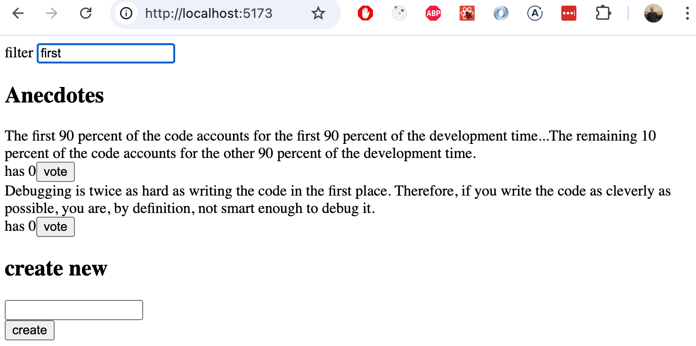
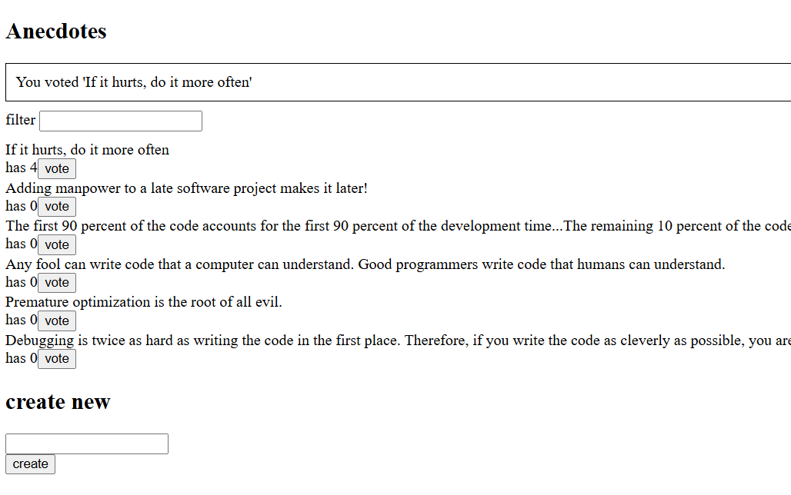

 
<div class="content">

Sigamos ampliando la versión Zustand de la aplicación de notas.

Para facilitar el desarrollo, cambiemos el estado inicial para que ya contenga algunas notas:

```js
// highlight-start
const initialNotes = [
    {
      id: 1,
      content: 'Zustand is less complex than Redux',
      important: true,
    }, {
      id: 2,
      content: 'React app benefits from custom hooks',
      important: false,
    }, {
      id: 3,
      content: 'Remember to sleep well',
      important: true,
    }
  ]


//highlight-end

const useNoteStore = create((set) => ({
  notes: initialNotes,
  // ...
}
```

### Estado más complejo

Implementemos el filtrado de las notas que se muestran en la aplicación, permitiendo restringir las notas visibles. El filtro se implementa mediante [botones de opción](https://developer.mozilla.org/en-US/docs/Web/HTML/Element/input/radio):


Surge la pregunta de cuál es la mejor forma de gestionar el estado del filtro. Hay dos opciones: crear un store de Zustand separado para el filtro o añadirlo al store existente. Ambas son razonables. Las [buenas prácticas](https://tkdodo.eu/blog/working-with-zustand#keep-the-scope-of-your-store-small) recomiendan mantener los elementos que no guardan relación en stores separados. Sin embargo, la lista de notas y el filtro están tan vinculados que colocaremos ambos en el mismo store:

```js
const useNoteStore = create((set) => ({
  notes: initialNotes,
  filter: 'all', // highlight-line
  actions: {
    add: note => set(
      state => ({ notes: state.notes.concat(note) })
    ),
    toggleImportance: id => set(
      state => ({
        notes: state.notes.map(note =>
          note.id === id ? { ...note, important: !note.important } : note
        )
      })
    ),
    setFilter: value => set(() => ({ filter: value })) // highlight-line
  }
}))

export const useNotes = () => useNoteStore((state) => state.notes)
export const useFilter = () => useNoteStore((state) => state.filter) // highlight-line
export const useNoteActions = () => useNoteStore((state) => state.actions)
```

El componente que establece el valor del filtro:

```js
import { useNoteActions } from './store'

const VisibilityFilter = () => {
  const { setFilter } = useNoteActions()

  return (
    <div>
      <input
        type="radio"
        name="filter"
        onChange={() => setFilter('all')}
        defaultChecked
      />
      all
      <input
        type="radio"
        name="filter"
        onChange={() => setFilter('important')}
      />
      important
      <input
        type="radio"
        name="filter"
        onChange={() => setFilter('nonimportant')}
      />
      not important
    </div>
  )
}

export default VisibilityFilter
```

El componente <i>App</i> renderiza el filtro:

```js
const App = () => (
  <div>
    <NoteForm />
    <VisibilityFilter /> // highlight-line
    <NoteList />
  </div>
)
```

El filtrado de las notas mostradas podría manejarse en el componente <i>NoteList</i>, por ejemplo de la siguiente manera:

```js
import { useNotes, useFilter } from './store'
import Note from './Note'

const NoteList = () => {
  const notes = useNotes()
  const filter = useFilter() // highlight-line

  // highlight-start
  const notesToShow = notes.filter(note => {
    if (filter === 'important') return note.important
    if (filter === 'nonimportant') return !note.important
    return true
  })
  // highlight-end

  return (
    <ul>
      {notesToShow.map(note => ( // highlight-line
        <Note key={note.id} note={note} />
      ))}
    </ul>
  )
}
```

Se llega a una mejor solución incluyendo la lógica de filtrado directamente en la función <i>useNotes</i> del store:

```js
import { create } from 'zustand'

const useNoteStore = create((set) => ({
  // ...
}))

// highlight-start
export const useNotes = () => {
  const notes = useNoteStore((state) => state.notes)
  const filter = useNoteStore((state) => state.filter)

  if (filter === 'important') return notes.filter(n => n.important)
  if (filter === 'nonimportant') return notes.filter(n => !n.important)

  return notes
}
// highlight-end
```

La función <i>useNotes</i> devuelve siempre una lista de notas filtradas de la forma deseada. El consumidor de la función, el componente <i>NoteList</i>, ni siquiera necesita ser consciente de la existencia del filtro:

```js
import { useNotes } from './store'
import Note from './Note'

const NoteList = () => {
  // component gets always the properly filtered set of notes
  const notes = useNotes()

  return (
    <ul>
      {notes.map(note => (
        <Note key={note.id} note={note} />
      ))}
    </ul>
  )
}
```

¡La solución es elegante!

> #### Una posible solución alternativa
>
> Una alternativa sería implementar el filtrado directamente dentro de una función selectora, de modo que tanto las notas como el filtro se lean en una sola llamada <i>useNoteStore</i>:
>
>```js
>export const useNotes = () => useNoteStore(({ notes, filter }) => {
>  if (filter === 'important') return notes.filter(n => n.important)
>  if (filter === 'nonimportant') return notes.filter(n => !n.important)
>  return notes
>})
>```
>
> Sin embargo, este enfoque no funciona, ya que conduce a un bucle infinito de renderizado cuando se cambia el filtro.
>
> El motivo es el siguiente: Zustand compara el valor de retorno del selector utilizando el operador <i>===</i>. Dado que <i>notes.filter(...)</i> crea una nueva array en cada renderizado, React siempre lo interpreta como un nuevo estado y activa otro renderizado, que nuevamente crea una nueva array, y así sucesivamente.
>
> La solución consiste en añadir [useShallow](https://zustand.docs.pmnd.rs/reference/hooks/use-shallow), que sustituye la comparación <i>===</i> por una comparación superficial: compara uno a uno los elementos del array. Si el contenido no ha cambiado, devuelve la referencia anterior en lugar de crear una nueva, por lo que React considera estable el estado y no vuelve a renderizar.
>
>```js
>import { useShallow } from 'zustand/react/shallow'
>
>//...
>
>export const useNotes = () => useNoteStore(useShallow(({ notes, filter }) => {
>  if (filter === 'important') return notes.filter(n => n.important)
>  if (filter === 'nonimportant') return notes.filter(n => !n.important)
>  return notes
>}))
>```
>
> La solución funciona, pero es un poco más difícil de entender. En el material del curso utilizamos la versión presentada anteriormente con dos llamadas <i>useNoteStore</i> independientes.

El código actual de la aplicación está disponible en su totalidad en [GitHub](https://github.com/fullstack-hy2020/zustand-notes/tree/part6-3), en la rama <i>part6-3</i>.

</div>

<div class="tasks">

### Ejercicio 6.6

Sigamos con la aplicación de anécdotas.

#### 6.6 anécdotas, paso 5

Implementar filtrado de las anécdotas mostradas en la aplicación:



Crea un componente <i>Filter</i> para mostrar el filtro en la pantalla. Puedes utilizar lo siguiente como punto de partida:

```js
const Filter = () => {
  const handleChange = (event) => {
    // the value of the input field is in event.target.value
  }
  const style = {
    marginBottom: 10
  }

  return (
    <div style={style}>
      filter <input onChange={handleChange} />
    </div>
  )
}

export default Filter
```

</div>

<div class="content">

### Datos al servidor

Extendamos la aplicación para que las notas se almacenen en un backend. Utilizaremos el [JSON Server](/es/part2/obteniendo_datos_del_servidor) que conocemos de la parte 2.

Guarde el estado inicial de la base de datos en el archivo <i>db.json</i> en la raíz del proyecto:

```json
{
  "notes": [
    {
      "id": 1,
      "content": "Zustand is less complex than Redux",
      "important": true
    },
    {
      "id": 2,
      "content": "React app benefits from custom hooks",
      "important": false
    },
    {
      "id": 3,
      "content": "Remember to sleep well",
      "important": true
    }
  ]
}
```

Instalar el servidor JSON:

```bash
npm install json-server --save-dev
```

y agregue la siguiente línea a la sección <i>scripts</i> de <i>package.json</i>:

```js
"scripts": {
  "server": "json-server -p 3001 db.json",
  // ...
}
```

Inicie el servidor JSON con el comando _npm run server_.

### Fetch API

En el desarrollo de software, a menudo hay que considerar si implementar una determinada característica utilizando una librería externa o aprovechar las soluciones nativas proporcionadas por el entorno. Ambos enfoques tienen sus propias ventajas y desafíos.

En partes anteriores del curso hemos utilizado la librería [Axios](https://axios-http.com/docs/intro) para realizar solicitudes HTTP. Veamos ahora una alternativa basada en la [Fetch API](https://developer.mozilla.org/en-US/docs/Web/API/Fetch_API) nativa.

Es típico que una librería externa como <i>Axios</i> se implemente utilizando otras librerías externas. Por ejemplo, si instala Axios en un proyecto con el comando <i>npm install axios</i>, la salida de la consola es:

```bash
$ npm install axios

added 23 packages, and audited 302 packages in 1s

71 packages are looking for funding
  run `npm fund` for details

found 0 vulnerabilities
```

Por lo tanto, el comando instalaría no solo la librería de Axios sino también más de 20 paquetes npm más que Axios necesita para funcionar.

La <i>Fetch API</i> permite realizar solicitudes HTTP de forma similar a Axios, pero sin instalar librerías externas. Mantener una aplicación resulta más sencillo cuando hay menos librerías que actualizar y la seguridad también mejora al reducirse su superficie de ataque potencial. La seguridad y el mantenimiento se tratan en la [parte 7](/es/part7/miscelanea#seguridad-en-aplicaciones-reactnode) del curso.

En la práctica, la realización de solicitudes se realiza mediante la función <i>fetch()</i>. La sintaxis utilizada tiene algunas diferencias respecto a Axios. Pronto también notaremos que Axios se encargó de algunas cosas por nosotros y nos hizo la vida más fácil. Sin embargo, ahora usaremos la API Fetch porque es una solución nativa ampliamente utilizada con la que todo desarrollador Full Stack debería estar familiarizado.

### Obtención de datos del servidor

Creemos una función que obtenga datos del backend en el archivo <i>src/services/notes.js</i>:

```js
const baseUrl = 'http://localhost:3001/notes'

const getAll = async () => {
  const response = await fetch(baseUrl)

  if (!response.ok) {
    throw new Error('Failed to fetch notes')
  }

  const data = await response.json()
  return data
}

export default { getAll }
```

Veamos más de cerca la implementación de la función <i>getAll</i>. Las notas ahora se obtienen del backend llamando a la función <i>fetch()</i>, a la que se le ha dado la URL del backend como argumento. El tipo de solicitud no se especifica por separado, por lo que <i>fetch</i> realiza la acción predeterminada, que es una solicitud GET.

Cuando llega la respuesta, comprobamos si la solicitud se realizó correctamente mirando el campo <i>response.ok</i> y arrojamos un error si es necesario:

```js
if (!response.ok) {
  throw new Error('Failed to fetch notes')
}
```

El atributo <i>response.ok</i> obtiene el valor <i>true</i> si la solicitud se realizó correctamente, es decir, si el código de estado de respuesta está en el rango 200-299. Para todos los demás códigos de estado, como 404 o 500, obtiene el valor <i>false</i>.

Ten en cuenta que <i>fetch</i> no genera automáticamente un error aunque el código de estado de la respuesta sea, por ejemplo, 404. El manejo de errores debe implementarse manualmente, como acabamos de hacer.

Si la solicitud tuvo éxito, los datos contenidos en la respuesta se convierten al formato JSON:

```js
const data = await response.json()
```

<i>fetch</i> no convierte automáticamente los datos que puedan acompañar a la respuesta al formato JSON; la conversión debe realizarse manualmente. También vale la pena señalar que <i>response.json()</i> es una función asincrónica, por lo que se debe usar la palabra clave <i>await</i> con ella.

Simplifiquemos un poco el código devolviendo los datos devueltos por la función <i>response.json()</i> directamente:

```js
const getAll = async () => {
  const response = await fetch(baseUrl)

  if (!response.ok) {
    throw new Error('Failed to fetch notes')
  }

  return await response.json() // highlight-line
}
```

Agreguemos una función al store que se puede usar para inicializar el estado con notas obtenidas del servidor:

```js
const useNoteStore = create((set) => ({
  notes: [], // highlight-line
  filter: '',
  actions: {
    // ...
    setFilter: value => set(() => ({ filter: value })),
    initialize: notes => set(() => ({ notes })) // highlight-line
  }
}))
```

Implementemos la inicialización de notas en el componente <i>App</i>; como es habitual al recuperar datos de un servidor, utilizamos el hook <i>useEffect</i>:

```js
const App = () => {
  const { initialize } = useNoteActions()

 // highlight-start
  useEffect(() => {
    noteService.getAll().then(notes => initialize(notes))
  }, [initialize])
 // highlight-end

  return (
    <div>
      <NoteForm />
      <VisibilityFilter />
      <NoteList />
    </div>
  )
}
```

Por lo tanto, las notas se obtienen del servidor usando la función <i>getAll()</i> que definimos y luego se almacenan usando la función <i>initialize</i> del store. Estas acciones se realizan en el hook <i>useEffect</i>, lo que significa que se ejecutan durante el primer renderizado del componente de la aplicación.

Veamos un pequeño detalle. Hemos añadido la función <i>initialize</i> al array de dependencias del hook <i>useEffect</i>. Si intentamos utilizar un array de dependencias vacío, ESLint muestra la advertencia <i>React Hook useEffect has a missing dependency: 'initialize'</i>. ¿Qué está ocurriendo?

El código funcionaría igual aunque utilizáramos un array de dependencias vacío, porque <i>initialize</i> hace referencia a la misma función durante toda la ejecución. Sin embargo, es una buena práctica incluir como dependencias todas las variables y funciones utilizadas por _useEffect_ que estén definidas dentro del componente. Esto ayuda a evitar errores inesperados.

### Envío de datos al servidor

A continuación, implementemos la funcionalidad para enviar una nueva nota al servidor. Al mismo tiempo podemos practicar cómo realizar una solicitud POST usando la función <i>fetch()</i>.

Extendamos el código de comunicación del servidor en <i>src/services/notes.js</i> de la siguiente manera:

```js
const baseUrl = 'http://localhost:3001/notes'

const getAll = async () => {
  const response = await fetch(baseUrl)

  if (!response.ok) {
    throw new Error('Failed to fetch notes')
  }

  return await response.json()
}

// highlight-start
const createNew = async (content) => {
  const response = await fetch(baseUrl, {
    method: 'POST',
    headers: { 'Content-Type': 'application/json' },
    body: JSON.stringify({ content, important: false }),
  })
  
  if (!response.ok) {
    throw new Error('Failed to create note')
  }
  
  return await response.json()
}
// highlight-end

export default { getAll, createNew } // highlight-line
```

Veamos más de cerca la implementación de la función <i>createNew</i>. El primer parámetro de la función <i>fetch()</i> especifica la URL a la que se realiza la solicitud. El segundo parámetro es un objeto que define los demás detalles de la solicitud, como el tipo de solicitud, los encabezados y los datos enviados con la solicitud. Podemos aclarar aún más el código almacenando el objeto que define los detalles de la solicitud en una variable auxiliar <i>options</i> separada:

```js
const createNew = async (content) => {
  // highlight-start
  const options = {
    method: 'POST',
    headers: { 'Content-Type': 'application/json' },
    body: JSON.stringify({ content, important: false }),
  }
  
  const response = await fetch(baseUrl, options)
  // highlight-end

  if (!response.ok) {
    throw new Error('Failed to create note')
  }
  
  return await response.json()
}
```

Miremos más de cerca el objeto <i>options</i>:

- <i>method</i> define el tipo de solicitud, que en este caso es <i>POST</i>
- <i>headers</i> define los encabezados de solicitud. Adjuntamos el encabezado <i>'Content-Type': 'application/json'</i> a la solicitud para que el servidor sepa que los datos incluidos con la solicitud están en formato JSON y pueda manejar la solicitud correctamente.
- <i>body</i> contiene los datos que se enviarán con la solicitud. El campo no puede contener directamente un objeto JavaScript; primero debe convertirse en una cadena JSON llamando a <i>JSON.stringify()</i>.

Al igual que con la solicitud GET, aquí también verificamos el código de estado de respuesta para detectar errores:

```js
if (!response.ok) {
  throw new Error('Failed to create note')
}
```

Si la solicitud tiene éxito, <i>JSON Server</i> devuelve la nota recién creada, para la cual también generó un <i>id</i> único. Los datos contenidos en la respuesta aún deben convertirse al formato JSON usando la función <i>response.json()</i>:

```js
return await response.json()
```

Luego cambiemos el componente <i>NoteForm</i> de nuestra aplicación para que se envíe una nueva nota al backend. La función <i>addNote</i> del componente cambia ligeramente:

```js
import { useNoteActions } from './store'
import noteService from './services/notes'

const NoteForm = () => {
  const { add } = useNoteActions()

  const addNote = async (e) => {
    e.preventDefault()
    const content = e.target.note.value
    const newNote = await noteService.createNew(content) // highlight-line
    add(newNote)
    e.target.reset()
  }

  return (
    <form onSubmit={addNote}>
      <input name="note" />
      <button type="submit">add</button>
    </form>
  )
}

export default NoteForm
```

Cuando se crea una nueva nota en el backend llamando a la función <i>createNew()</i>, obtenemos un objeto que describe la nota, para la cual el backend ha generado un <i>id</i>.

El código actual de la aplicación está disponible en su totalidad en [GitHub](https://github.com/fullstack-hy2020/zustand-notes/tree/part6-4), en la rama <i>part6-4</i>.

### Acciones asíncronas

Nuestro enfoque es bastante bueno, pero en cierto sentido desafortunado, ya que la comunicación con el servidor ocurre dentro del código de las funciones que definen los componentes. Sería mejor si la comunicación pudiera abstraerse de los componentes, de modo que solo necesiten llamar a una función apropiada que proporciona el store.

Queremos que <i>App</i> inicialice el estado de la aplicación de la siguiente manera:

```js
const App = () => {
  const { initialize } = useNoteActions()  // highlight-line

  useEffect(() => {
    initialize()  // highlight-line
  }, [initialize])

  return (
    <div>
      <NoteForm />
      <VisibilityFilter />
      <NoteList />
    </div>
  )
}
```


<i>NoteForm</i> a su vez crea una nueva nota como esta:

```js
const NoteForm = () => {
  const { add } = useNoteActions()  // highlight-line

  const addNote = async (e) => {
    e.preventDefault()
    const content = e.target.note.value
    await add(content)  // highlight-line
    e.target.reset()
  }

  return (
    <form onSubmit={addNote}>
      <input name="note" />
      <button type="submit">add</button>
    </form>
  )
}
```

El cambio a <i>store.js</i> es el siguiente:

```js
import { create } from 'zustand'
import noteService from './services/notes' // highlight-line

const useNoteStore = create((set) => ({
  notes: [],
  filter: '',
  actions: {
    add: async (content) => {  // highlight-line
      const newNote = await noteService.createNew(content)  // highlight-line
      set(state => ({ notes: state.notes.concat(newNote) })) 
    },
    initialize: async () => {  // highlight-line
      const notes = await noteService.getAll()  // highlight-line
      set(() => ({ notes }))
    },
    // ...
  }
}))
```

Las funciones <i>add</i> y <i>initialize</i> se han convertido en funciones asincrónicas, que primero llaman a la función noteService adecuada y luego actualizan el estado.

La solución es elegante; La gestión del estado y la comunicación con el servidor están completamente separadas fuera de los componentes de React.

Finalicemos la aplicación sincronizando el cambio de importancia con el servidor.

<i>noteService.js</i> se amplía de la siguiente manera:

```js
const update = async (id, note) => {
  const response = await fetch(`${baseUrl}/${id}`, {
    method: 'PUT',
    headers: { 'Content-Type': 'application/json' },
    body: JSON.stringify(note),
  })

  if (!response.ok) {
    throw new Error('Failed to update note')
  }

  return await response.json()
}

export default { getAll, createNew, update } 
```

El cambio a la función <i>toggleImportance</i> del store es el siguiente:

```js
const useNoteStore = create((set) => ({
  notes: [],
  filter: '',
  actions: {
    add: async (content) => {
      const newNote = await noteService.createNew(content)
      set(state => ({ notes: state.notes.concat(newNote) }))
    },
    // highlight-start
    toggleImportance: async (id) => {
      const note = useNoteStore.getState().notes.find(n => n.id === id)
      const updated = await noteService.update(
        id, { ...note, important: !note.important }
      )
      set(state => ({
        notes: state.notes.map(n => n.id === id ? updated : n)
      }))
    },
    // highlight-end
    setFilter: value => set(() => ({ filter: value })),
    initialize: async () => {
      const notes = await noteService.getAll()
      set(() => ({ notes }))
    }
  }
}))
```

Hay un detalle digno de mención en la nueva función. La función recibe el id de la nota como parámetro. Sin embargo, la nota modificada debe enviarse al backend. Se puede encontrar llamando a la función <i>getState</i> del store:

```js
const note = useNoteStore.getState().notes.find(n => n.id === id)
```

Los stores de Zustand también tienen otras [funciones auxiliares](https://zustand.docs.pmnd.rs/reference/apis/create#returns), que pueden resultar útiles en algunas situaciones.

Sin embargo, cambiemos también la definición del store para que también pasemos el parámetro <i>get</i> a la función dada a <i>create</i>, a través de la cual podemos acceder a los valores de estado cuando sea necesario:

```js
const useNoteStore = create((set, get) => ({ // highlight-line
  notes: [],
  filter: '',
  actions: {
    toggleImportance: async (id) => {
      const note = get().notes.find(n => n.id === id) // highlight-line
      const updated = await noteService.update(
        id, { ...note, important: !note.important }
      )
      set(state => ({
        notes: state.notes.map(n => n.id === id ? updated : n)
      }))
    },
    // ...
  }
}))
```

La función <i>get</i> devuelve el estado actual del store. Por ejemplo, la llamada <i>get().notes</i> proporciona las notas actuales del store. La función <i>get</i> es funcionalmente equivalente a llamar a <i>useNoteStore.getState()</i>, pero es la forma más idiomática de referirse al estado del store desde las propias funciones del store.

El código de la aplicación está en [GitHub](https://github.com/fullstack-hy2020/zustand-notes/tree/part6-5) en la rama <i>part6-5</i>.

</div>

<div class="tasks">

### Ejercicios 6.7.-6.11.

#### 6.7 anécdotas, paso 6

Obtén las anécdotas del backend de JSON Server cuando se inicie la aplicación. Utiliza la Fetch API para realizar la solicitud HTTP.

Puedes encontrar contenido inicial para el backend [aquí](https://github.com/fullstack-hy2020/misc/blob/master/anecdotes.json).

#### 6.8 anécdotas, paso 7

Modifica la creación de nuevas anécdotas para que se almacenen en el backend. Utiliza la Fetch API en tu implementación.

#### 6.9 anécdotas, paso 8

La votación aún no guarda los cambios en el backend. Arreglar la situación.

#### 6.10 anécdotas, paso 9

La aplicación tiene un esqueleto listo para usar para el componente <i>Notification</i>:

```js
const Notification = () => {
  const style = {
    border: 'solid',
    padding: 10,
    borderWidth: 1,
    marginBottom: 10
  }

  return (
    <div style={style}>
      render here notification...
    </div>
  )
}

export default Notification
```

Amplíe la aplicación para que muestre una notificación utilizando el componente <i>Notification</i> durante cinco segundos cuando se votan anécdotas o se crean nuevas anécdotas:



Utiliza Zustand para gestionar el estado de las notificaciones. Puede ser conveniente crear un store de Zustand separado para ellas, ya que su uso podría extenderse a otras áreas a medida que la aplicación crezca, como el inicio de sesión.

#### 6.11 anécdotas, paso 10

Notamos que algunas de las anécdotas añadidas por los usuarios no son muy buenas. Implementar una característica que permita eliminar anécdotas que tengan cero votos.

</div>

<div class="content">

### Middlewares

Al desarrollar una aplicación, a menudo nos encontramos con situaciones en las que es difícil entender por qué la aplicación se comporta de forma inesperada. El estado cambia como resultado de alguna llamada a una función de acción, pero no está claro qué llamada cambió qué y en qué orden. El registro tradicional de funciones individuales en la consola sólo ayuda de forma limitada.

Zustand admite los llamados middlewares, que se pueden utilizar para agregar funcionalidad a los stores de forma transparente, sin tocar la propia lógica del store. La idea del middleware es simple: "envuelve" el store y puede, por ejemplo, registrar automáticamente cada cambio de estado.

La forma de las funciones del middleware es algo críptica. A continuación se muestra un <i>logger</i> que siempre imprime el estado antiguo y nuevo del store cada vez que cambia el estado:

```js
const logger = (config) => (set, get) => config(
  (...args) => {
    console.log('prev state', get());
    set(...args);
    console.log('next state', get());
  },
  get
);
```

El middleware se activa "envolviendo" la función dada al <i>create</i> de Zustand como parámetro:

```js
const useNoteStore = create(logger((set, get) => ({ // highlight-line
  notes: [],
  filter: '',
  actions: {
    // ...
  }
}))) // highlight-line
```

Ahora, cada vez que cambia el estado del store, siempre podemos ver en la consola cómo cambia el estado:


En la práctica, nuestro middleware definido funciona reemplazando la función original <i>set</i> con la función

```js
  (...args) => {
    console.log('prev state', get());
    set(...args);
    console.log('next state', get());
  }
```

que además de llamar a <i>set</i>, también imprime el estado antiguo y nuevo (accesible a través de la función <i>get</i>) en la consola. El segundo parámetro es el antiguo <i>get</i> sin cambios.

Zustand también tiene un middleware <i>devtools</i> listo para usar que integra el store con la extensión [Redux DevTools](https://chromewebstore.google.com/detail/redux-devtools/lmhkpmbekcpmknklioeibfkpmmfibljd) del navegador. Devtools es una herramienta de desarrollo extremadamente útil, ya que le permite realizar un seguimiento visual de los cambios de estado.

La configuración es sencilla:

```js
import { create } from 'zustand'
import { devtools } from 'zustand/middleware' // highlight-line

const useNoteStore = create(devtools((set, get) => ({ // highlight-line
  notes: [],
  filter: '',
  actions: {
    // ...
  }
}))) // highlight-line
```

Cuando la extensión Redux DevTools está instalada en el navegador, el estado del store y sus cambios se pueden inspeccionar en las herramientas de desarrollo del navegador:


### Pruebas de los stores de Zustand

Finalmente, veamos cómo probar los stores de Zustand con Vitest.

Para simplificar, comencemos con el store del contador:

```js
import { create } from 'zustand'

const useCounterStore = create(set => ({
  counter: 0,
  actions: {
    increment: () => set(state => ({ counter: state.counter + 1 })),
    decrement: () => set(state => ({ counter: state.counter - 1 })),
    zero: () => set(() => ({ counter: 0 })),
  }  
}))

export const useCounter = () => useCounterStore(state => state.counter)
export const useCounterControls = () => useCounterStore(state => state.actions)

export default useCounterStore // highlight-line
```

Agregamos una exportación a la definición de las pruebas, a través de la cual la prueba puede acceder al store.

Instalemos Vitest:

```
npm install --save-dev vitest
```

Implementemos la prueba en el archivo <i>store.test.js</i>:

```js
import { beforeEach, describe, expect, it } from 'vitest'
import useCounterStore from './store'

beforeEach(() => {
  useCounterStore.setState({ counter: 0 })
})

describe('counter store', () => {
  it('initial state is 0', () => {
    expect(useCounterStore.getState().counter).toBe(0)
  })

  it('increment increases counter by 1', () => {
    useCounterStore.getState().actions.increment()
    expect(useCounterStore.getState().counter).toBe(1)
  })

  it('decrement decreases counter by 1', () => {
    useCounterStore.getState().actions.decrement()
    expect(useCounterStore.getState().counter).toBe(-1)
  })

  it('zero resets counter to 0', () => {
    useCounterStore.getState().actions.increment()
    useCounterStore.getState().actions.increment()
    useCounterStore.getState().actions.zero()
    expect(useCounterStore.getState().counter).toBe(0)
  })
})
```

Las pruebas son bastante sencillas y utilizan la función [getState](https://zustand.docs.pmnd.rs/reference/apis/create#returns) del store, que les permite leer el estado del store y ejecutar las funciones del store.

Antes de cada prueba, el store se restablece a su estado inicial en el bloque <i>beforeEach</i> usando la función [setState](https://zustand.docs.pmnd.rs/reference/apis/create#returns) del store.

En nuestro caso, restablecer el store a su estado inicial es sencillo, aunque no siempre lo es. La [documentación de Zustand](https://zustand.docs.pmnd.rs/learn/guides/testing#vitest) describe cómo crear una versión de los stores para las pruebas que se restablece automáticamente antes de cada una. Sin embargo, el método es lo bastante complejo e innecesario para nuestro caso como para omitirlo por ahora.

Por tanto, las pruebas utilizan el store directamente. Si se ha implementado una lógica más compleja mediante hooks personalizados, puede ser necesario escribir pruebas que también los utilicen. En el contador se accede al store mediante los hooks <i>useCounter</i> y <i>useCounterControls</i>:


```js
const useCounterStore = create(set => ({
  // ...
}))

// hightlight-start
export const useCounter = () => useCounterStore(state => state.counter)
export const useCounterControls = () => useCounterStore(state => state.actions)
// hightlight-end
```

En este caso, los hooks no contienen ninguna lógica, simplemente exponen por separado el valor almacenado en el store y las funciones del store. Por lo tanto, el método de prueba que utilizamos anteriormente es perfectamente correcto.

Sin embargo, hagamos otra versión de las pruebas a modo de ejemplo, donde el store se usa exactamente de la misma manera que la aplicación.

<i>useCounter</i> y <i>useCounterControls</i> son hooks de React, por lo que probarlos requiere la [Librería de prueba de React](https://github.com/testing-library/react-testing-library) y la librería [jsdom](https://github.com/jsdom/jsdom):

```
npm install --save-dev @testing-library/react jsdom
```

Agreguemos la configuración del entorno de prueba a <i>vite.config.js</i>:

```js
import { defineConfig } from 'vite'
import react from '@vitejs/plugin-react'

export default defineConfig({
  plugins: [react()],
  // highlight-start
  test: {
    environment: 'jsdom',
  },
   // highlight-end
})
```

Las pruebas son las siguientes:

```js
import { beforeEach, describe, expect, it } from 'vitest'
import { renderHook, act } from '@testing-library/react'
import useCounterStore, { useCounter, useCounterControls } from './store'

beforeEach(() => {
  useCounterStore.setState({ counter: 0 })
})

describe('counter hooks', () => {
  it('useCounter returns initial value of 0', () => {
    const { result } = renderHook(() => useCounter())
    expect(result.current).toBe(0)
  })

  it('increment updates counter', () => {
    const { result: counter } = renderHook(() => useCounter())
    const { result: controls } = renderHook(() => useCounterControls())

    act(() => controls.current.increment())

    expect(counter.current).toBe(1)
  })

  it('decrement updates counter', () => {
    const { result: counter } = renderHook(() => useCounter())
    const { result: controls } = renderHook(() => useCounterControls())

    act(() => controls.current.decrement())

    expect(counter.current).toBe(-1)
  })

  it('zero resets counter', () => {
    const { result: counter } = renderHook(() => useCounter())
    const { result: controls } = renderHook(() => useCounterControls())

    act(() => {
      controls.current.increment()
      controls.current.increment()
      controls.current.zero()
    })

    expect(counter.current).toBe(0)
  })
})
```

Hay algunas cosas interesantes en la prueba. Al comienzo de las pruebas, los hooks se representan usando la función [renderHook](https://testing-library.com/docs/react-testing-library/api/#renderhook):

```js
const { result: counter } = renderHook(() => useCounter())
const { result: controls } = renderHook(() => useCounterControls())
```

De esta forma la prueba obtiene acceso a los valores devueltos por los hooks, que se almacenan en las variables <i>counter</i> y <i>controls</i>.

Los hooks se llaman envolviendo la llamada dentro de la función [act](https://testing-library.com/docs/react-testing-library/api/#act):

```js
act(() => {
  controls.current.increment()
  controls.current.increment()
  controls.current.zero()
})
```

Finalmente, se produce la expectativa de la prueba:

```js
expect(counter.current).toBe(0)
```

Como podemos ver, para acceder al hook en sí aún necesitamos tomar el campo <i>current</i> del objeto devuelto por <i>renderHook</i>, que corresponde al valor actual del hook.

> #### ¿Qué es acto?
>
> <i>act</i> es una función auxiliar que garantiza que todas las actualizaciones de estado y sus efectos secundarios se hayan procesado antes de que continúe el código de prueba.
>
> Cuando se produce un cambio de estado en un componente o enlace de React, React no actualiza el estado inmediatamente sino que pone las actualizaciones en cola. act obliga a ejecutar estas actualizaciones en cola.
>
> Sin actuar, una prueba podría verificar el estado antes de que React haya tenido tiempo de actualizarlo, lo que provocaría que la prueba falle o dé resultados incorrectos.
>
> La librería de pruebas de React incluye muchas de sus funciones (como fireEvent, userEvent) automáticamente, pero cuando se prueban enlaces directamente, generalmente es necesario.

Las pruebas mediante hooks utilizan la librería de pruebas de React y representan los hooks en un contexto real de React usando jsdom. Este enfoque es considerablemente más lento que las pruebas que utilizan el store directamente, por lo que si los enlaces no contienen lógica compleja, puede ser suficiente ejecutar las pruebas utilizando el store directamente.

El código que contiene las pruebas de contador de Zustand está disponible en [GitHub](https://github.com/fullstack-hy2020/zustand-counter).

### Pruebas del store de notas

Probar el store de la aplicación de notas es un caso algo más desafiante, ya que el store contiene funciones asincrónicas que llaman al servidor:

```js
import { create } from 'zustand'
import noteService from './services/notes'

const useNoteStore = create(set => ({
  notes: [],
  filter: '',
  actions: {
    add: async (content) => {
      const newNote = await noteService.createNew(content) // highlight-line
      set(state => ({ notes: state.notes.concat(newNote) }))
    },
    toggleImportance: async (id) => {
      const note = useNoteStore.getState().notes.find(n => n.id === id)
      // highlight-start
      const updated = await noteService.update(
        id, { ...note, important: !note.important }
      )
       // highlight-end
      set(state => ({
        notes: state.notes.map(n => n.id === id ? updated : n)
      }))
    },
    setFilter: value => set(() => ({ filter: value })),
    initialize: async () => {
      const notes = await noteService.getAll() // highlight-line
      set(() => ({ notes }))
    }
  }
}))

export const useNotes = () => { 
  const notes = useNoteStore((state) => state.notes)
  const filter = useNoteStore((state) => state.filter)

  if (filter === 'important') return notes.filter(n => n.important)
  if (filter === 'nonimportant') return notes.filter(n => !n.important)
  return notes
}

export const useFilter = () => useNoteStore((state) => state.filter)
export const useNoteActions = () => useNoteStore((state) => state.actions)
```

Esta vez <i>useNotes</i> también contiene una cantidad significativa de lógica, por lo que las pruebas probablemente deberían realizarse mediante enlaces con la librería de pruebas React.

Instalemos las librerías necesarias:

```
npm install --save-dev vitest @testing-library/react jsdom
```

Agreguemos la configuración del entorno de prueba a <i>vite.config.js</i>:

```js
import { defineConfig } from 'vite'
import react from '@vitejs/plugin-react'

export default defineConfig({
  plugins: [react()],
  // highlight-start
  test: {
    environment: 'jsdom',
  },
   // highlight-end
})
```

La primera parte de las pruebas es la siguiente:

```js
import { describe, it, expect, beforeEach, vi } from 'vitest'
import { renderHook, act } from '@testing-library/react'

vi.mock('./services/notes', () => ({
  default: {
    getAll: vi.fn(),
    createNew: vi.fn(),
    update: vi.fn(),
  }
}))

import noteService from './services/notes'
import useNoteStore, { useNotes, useFilter, useNoteActions } from './store'

beforeEach(() => {
  useNoteStore.setState({ notes: [], filter: '' })
  vi.clearAllMocks()
})

describe('useNoteActions', () => {
  it('initialize loads notes from service', async () => {
    const mockNotes = [{ id: 1, content: 'Test', important: false }]
    noteService.getAll.mockResolvedValue(mockNotes)

    const { result } = renderHook(() => useNoteActions())

    await act(async () => {
      await result.current.initialize()
    })

    const { result: notesResult } = renderHook(() => useNotes())
    expect(notesResult.current).toEqual(mockNotes)
  })

  it('add appends a new note', async () => {
    const newNote = { id: 2, content: 'New note', important: false }
    noteService.createNew.mockResolvedValue(newNote)

    const { result } = renderHook(() => useNoteActions())

    await act(async () => {
      await result.current.add('New note')
    })

    const { result: notesResult } = renderHook(() => useNotes())
    expect(notesResult.current).toContainEqual(newNote)
  })

  it('toggleImportance flips important flag', async () => {
    const note = { id: 1, content: 'Test', important: false }
    useNoteStore.setState({ notes: [note] })
    noteService.update.mockResolvedValue({ ...note, important: true })

    const { result } = renderHook(() => useNoteActions())

    await act(async () => {
      await result.current.toggleImportance(1)
    })

    const { result: notesResult } = renderHook(() => useNotes())
    expect(notesResult.current[0].important).toBe(true)
  })
})
```

Hay mucho que digerir en las pruebas. Las pruebas crean, usando Vitest, una versión [simulada](https://vitest.dev/guide/mocking) del <i>noteService</i> responsable de comunicarse con el servidor:
 
```js
import { describe, it, expect, beforeEach, vi } from 'vitest'

vi.mock('./services/notes', () => ({
  default: {
    getAll: vi.fn(),
    createNew: vi.fn(),
    update: vi.fn(),
  }
}))
```

[vi.mock](https://vitest.dev/api/vi.html#vi-mock) reemplaza el <i>noteService</i> en el módulo <i>./services/notes</i> con su propia versión, donde todas las funciones se reemplazan con funciones simuladas devueltas por [vi.fn](https://vitest.dev/api/vi.html#vi-fn).

Antes de cada prueba, el store se restablece a su estado inicial y se borran las funciones simuladas:

```js
beforeEach(() => {
  useNoteStore.setState({ notes: [], filter: '' })
  vi.clearAllMocks()
})
```

Al comienzo de cada prueba, al <i>noteService</i> simulado se le indica a través de la función [mockResolvedValue](https://vitest.dev/api/mock.html#mockresolvedvalue) cómo debe comportarse en el contexto de la prueba:

```js
it('initialize loads notes from service', async () => {
  // highlight-start
  const mockNotes = [{ id: 1, content: 'Test', important: false }]
  noteService.getAll.mockResolvedValue(mockNotes)
  // highlight-end

  const { result } = renderHook(() => useNoteActions())

  await act(async () => {
    await result.current.initialize()
  })

  const { result: notesResult } = renderHook(() => useNotes())
  expect(notesResult.current).toEqual(mockNotes)
})
```

Primero, la prueba establece que, cuando se llama a <i>noteService.getAll</i>, se devuelven al store las notas del array <i>mockNotes</i>.

Lo que se está probando es la llamada a la función <i>initialize</i>:

```js
await act(async () => {
  await result.current.initialize()
})
```

Dado que se trata de una función asincrónica, se debe esperar la finalización de la llamada con la palabra clave <i>await</i>.

Finalmente, la prueba verifica que el estado del store contiene la misma lista de notas que devolvió la función simulada <i>noteService.getAll</i>:

```js
const { result: notesResult } = renderHook(() => useNotes())
expect(notesResult.current).toEqual(mockNotes)
```

Las otras pruebas siguen el mismo patrón: primero, se define lo que devuelve la función llamada <i>noteService</i> del store y luego se ejecuta la prueba real.

La segunda parte de las pruebas verifica que el filtrado funciona correctamente:

```js
describe('useNotes filtering', () => {
  const notes = [
    { id: 1, content: 'A', important: true },
    { id: 2, content: 'B', important: false },
  ]

  beforeEach(() => {
    useNoteStore.setState({ notes })
  })

  it('returns all notes with no filter', () => {
    const { result } = renderHook(() => useNotes())
    expect(result.current).toHaveLength(2)
  })

  it('filters important notes', () => {
    useNoteStore.setState({ notes, filter: 'important' })
    const { result } = renderHook(() => useNotes())
    expect(result.current).toEqual([notes[0]])
  })

  it('filters nonimportant notes', () => {
    useNoteStore.setState({ notes, filter: 'nonimportant' })
    const { result } = renderHook(() => useNotes())
    expect(result.current).toEqual([notes[1]])
  })
})
```

El estado se inicializa con dos notas, una de las cuales es importante y la otra no. Los tres casos de prueba verifican que <i>useNotes</i> devuelva las notas correctas para todos los valores de filtro.

El código final de la aplicación está en [GitHub](https://github.com/fullstack-hy2020/zustand-notes/tree/part6-6) en la rama <i>part6-6</i>.

</div>

<div class="tasks">

### Ejercicios 6.12.-6.15.

#### 6.12 Anécdotas, paso 11

Escribe una prueba que compruebe que el estado se inicializa con las anécdotas devueltas por el backend.

#### 6.13 Anécdotas, paso 12

Escribe una prueba que compruebe que el componente que muestra las anécdotas las recibe del store ordenadas por votos.

#### 6.14 Anécdotas, paso 13

Escribe una prueba que compruebe que el componente de React adecuado recibe una lista de anécdotas correctamente filtrada.

#### 6.15 Anécdotas, paso 14

Escribe una prueba que verifique que votar aumenta el número de votos para una anécdota.

</div>
