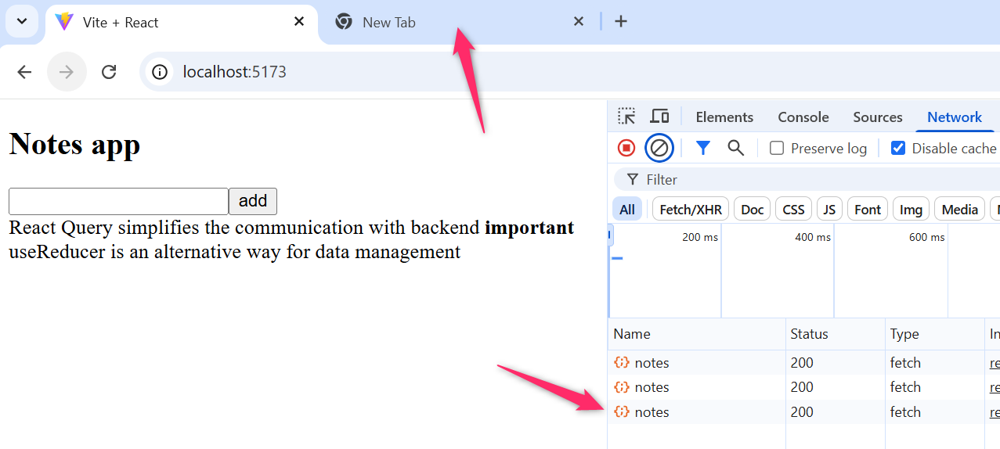

<div class="content">

Al final de esta parte, analizaremos algunas formas diferentes de administrar el estado de una aplicación.

Continuemos con la aplicación de notas. Nos centraremos en la comunicación con el servidor. Comencemos la aplicación desde cero. La primera versión es la siguiente:

```js
const App = () => {
  const addNote = async (event) => {
    event.preventDefault()
    const content = event.target.note.value
    event.target.note.value = ''
    console.log(content)
  }

  const toggleImportance = (note) => {
    console.log('toggle importance of', note.id)
  }

  const notes = []

  return (
    <div>
      <h2>Notes app</h2>
      <form onSubmit={addNote}>
        <input name="note" />
        <button type="submit">add</button>
      </form>
      {notes.map((note) => (
        <li key={note.id} onClick={() => toggleImportance(note)}>
          {note.content}
          <strong> {note.important ? 'important' : ''}</strong>
        </li>
      ))}
    </div>
  )
}

export default App
```

El código inicial está en GitHub en este [repositorio](https://github.com/fullstack-hy2020/query-notes/tree/part6-0), en la rama <i>part6-0</i>.

### Administrando datos en el servidor con la librería React Query

Ahora usaremos la librería [React Query](https://tanstack.com/query/latest) para almacenar y administrar los datos obtenidos del servidor. La última versión de la librería también es llamada TanStack Query, pero seguiremos usando su nombre tradicional.

Instala la librería con el comando

```bash
npm install @tanstack/react-query
```

Se necesitan agregar algunas cosas en el archivo <i>main.jsx</i> para pasar las funciones de la librería a toda la aplicación:

```js
import { createRoot } from 'react-dom/client'
import { QueryClient, QueryClientProvider } from '@tanstack/react-query' // highlight-line

import App from './App.jsx'

const queryClient = new QueryClient() // highlight-line

createRoot(document.getElementById('root')).render(
  <QueryClientProvider client={queryClient}> // highlight-line
    <App />
  </QueryClientProvider> // highlight-line
)
```

Usemos [JSON Server](https://github.com/typicode/json-server) como en las partes anteriores para simular el backend. JSON Server está preconfigurado en el proyecto de ejemplo, y la raíz del proyecto contiene un archivo <i>db.json</i> que por defecto tiene dos notas. Puedes iniciar el servidor con:

```js
npm run server
```

Ahora podemos recuperar las notas en el componente <i>App</i>. El código se expande de la siguiente manera:

```js
import { useQuery } from '@tanstack/react-query' // highlight-line

const App = () => {
  const addNote = async (event) => {
    event.preventDefault()
    const content = event.target.note.value
    event.target.note.value = ''
    console.log(content)
  }

  const toggleImportance = (note) => {
    console.log('toggle importance of', note.id)
  }

  // highlight-start
  const result = useQuery({
    queryKey: ['notes'],
    queryFn: async () => {
      const response = await fetch('http://localhost:3001/notes')
      if (!response.ok) {
        throw new Error('Failed to fetch notes')
      }
      return await response.json()
    }
  })
 
  console.log(JSON.parse(JSON.stringify(result)))
 
  if (result.isLoading) {
    return <div>loading data...</div>
  }
 
  const notes = result.data
  // highlight-end

  return (
    // ...
  )
}
```

La obtención de datos del servidor se realiza, como en el capítulo anterior, usando el método <i>fetch</i> de la Fetch API. Sin embargo, la llamada al método ahora está envuelta en una [query](https://tanstack.com/query/latest/docs/react/guides/queries) (consulta) formada con la función [useQuery](https://tanstack.com/query/latest/docs/react/reference/useQuery). La llamada a <i>useQuery</i> toma como parámetro un objeto con los campos <i>queryKey</i> y <i>queryFn</i>. El valor del campo <i>queryKey</i> es un array que contiene el string <i>notes</i>. Actúa como la [clave](https://tanstack.com/query/latest/docs/react/guides/query-keys) para la query definida, es decir, la lista de notas.

El valor devuelto por la función <i>useQuery</i> es un objeto que indica el estado de la query. La salida a la consola ilustra la situación:


Es decir, la primera vez que se renderiza el componente, la query todavía está en estado <i>loading</i>, es decir, la solicitud HTTP asociada está pendiente. En esta etapa, solo se procesa lo siguiente:

```html
<div>loading data...</div>
```

Sin embargo, la solicitud HTTP se completa tan rápido que ni siquiera Max Verstappen podría ver el texto. Cuando se completa la solicitud, el componente se renderiza de nuevo. La query está en el estado <i>success</i> en la segunda renderización, y el campo <i>data</i> del objeto de la query contiene los datos devueltos por la solicitud, es decir, la lista de notas que se muestran en la pantalla.

Entonces, la aplicación recupera datos del servidor y los renderiza en la pantalla sin usar los Hooks de React <i>useState</i> y <i>useEffect</i> utilizados en los capítulos 2-5. Los datos en el servidor ahora están completamente bajo la administración de la librería React Query, ¡y la aplicación no necesita el estado definido con el Hook de React <i>useState</i> en absoluto!

Movamos la función que realiza la solicitud HTTP a su propio archivo <i>src/requests.js</i>

```js
const baseUrl = 'http://localhost:3001/notes'

export const getNotes = async () => {
  const response = await fetch(baseUrl)
  if (!response.ok) {
    throw new Error('Failed to fetch notes')
  }
  return await response.json()
}
```

El componente <i>App</i> ahora se ha simplificado un poco:

```js
import { useQuery } from '@tanstack/react-query' 
import { getNotes } from './requests' // highlight-line

const App = () => {
  // ...

  const result = useQuery({
    queryKey: ['notes'],
    queryFn: getNotes // highlight-line
  })

  // ...
}
```

El código actual de la aplicación está en [GitHub](https://github.com/fullstack-hy2020/query-notes/tree/part6-1) en la rama <i>part6-1</i>.

### Sincronizando datos con el servidor usando React Query

Los datos ya se han recuperado correctamente del servidor. A continuación, nos aseguraremos de que los datos agregados y modificados se almacenen en el servidor. Comencemos agregando nuevas notas.

Hagamos una función <i>createNote</i> en el archivo <i>requests.js</i> para guardar nuevas notas:

```js
const baseUrl = 'http://localhost:3001/notes'

export const getNotes = async () => {
  const response = await fetch(baseUrl)
  if (!response.ok) {
    throw new Error('Failed to fetch notes')
  }
  return await response.json()
}

// highlight-start
export const createNote = async (newNote) => {
  const options = {
    method: 'POST',
    headers: { 'Content-Type': 'application/json' },
    body: JSON.stringify(newNote)
  }
 
  const response = await fetch(baseUrl, options)
 
  if (!response.ok) {
    throw new Error('Failed to create note')
  }
 
  return await response.json()
}
// highlight-end
```

El componente <i>App</i> cambiará de la siguiente manera

```js
import { useQuery, useMutation } from '@tanstack/react-query' // highlight-line
import { getNotes, createNote } from './requests' // highlight-line

const App = () => {
  //highlight-start
  const newNoteMutation = useMutation({
    mutationFn: createNote,
  })
  // highlight-end

  const addNote = async (event) => {
    event.preventDefault()
    const content = event.target.note.value
    event.target.note.value = ''
    newNoteMutation.mutate({ content, important: true }) // highlight-line
  }

  //

}
```

Para crear una nueva nota, se define una [mutación](https://tanstack.com/query/latest/docs/react/guides/mutations) usando la función [useMutation](https://tanstack.com/query/latest/docs/react/reference/useMutation):

```js
const newNoteMutation = useMutation({
  mutationFn: createNote,
})
```

El parámetro es la función que agregamos al archivo <i>requests.js</i>, que usa la Fetch API para enviar una nueva nota al servidor.

El controlador de eventos <i>addNote</i> realiza la mutación llamando a la función <i>mutate</i> del objeto de mutación y pasando la nueva nota como parámetro:

```js
newNoteMutation.mutate({ content, important: true })
```

Nuestra solución es buena. Excepto que no funciona. La nueva nota se guarda en el servidor, pero no se actualiza en la pantalla.

Para renderizar una nueva nota también, debemos decirle a React Query que el resultado antiguo de la query cuya clave es el string <i>notes</i> debe ser [invalidado](https://tanstack.com/query/latest/docs/react/guides/invalidations-from-mutations).

Afortunadamente, la invalidación es fácil, se puede hacer definiendo la función de callback <i>onSuccess</i> apropiada para la mutación:

```js
import { useQuery, useMutation, useQueryClient } from '@tanstack/react-query' // highlight-line
import { getNotes, createNote } from './requests'

const App = () => {
  const queryClient = useQueryClient() // highlight-line

  const newNoteMutation = useMutation({
    mutationFn: createNote,
    onSuccess: () => {  // highlight-line
      queryClient.invalidateQueries({ queryKey: ['notes'] }) // highlight-line
    }, // highlight-line
  })

  // ...
}
```

Ahora que la mutación se ha ejecutado con éxito, se realiza una llamada a la función

```js
queryClient.invalidateQueries({ queryKey: ['notes'] })
```

Esto a su vez hace que React Query actualice automáticamente una query con la clave <i>notes</i>, es decir, obtenga las notas del servidor. Como resultado, la aplicación renderiza el estado actualizado en el servidor, es decir, la nota agregada también se renderiza.

Implementemos también el cambio en la importancia de las notas. Se agrega una función para actualizar notas al archivo <i>requests.js</i>:

```js
export const updateNote = async (updatedNote) => {
  const options = {
    method: 'PUT',
    headers: { 'Content-Type': 'application/json' },
    body: JSON.stringify(updatedNote)
  }

  const response = await fetch(`${baseUrl}/${updatedNote.id}`, options)

  if (!response.ok) {
    throw new Error('Failed to update note')
  }

  return await response.json()
}
```

Actualizar la nota también se hace mediante una mutación. El componente <i>App</i> se expande de la siguiente manera:

```js
import { useQuery, useMutation, useQueryClient } from '@tanstack/react-query'
import { getNotes, createNote, updateNote } from './requests' // highlight-line

const App = () => {
  const queryClient = useQueryClient()

  const newNoteMutation = useMutation({
    mutationFn: createNote,
    onSuccess: () => {
      queryClient.invalidateQueries({ queryKey: ['notes'] })
    }
  })

  // highlight-start
  const updateNoteMutation = useMutation({
    mutationFn: updateNote,
    onSuccess: () => {
      queryClient.invalidateQueries({ queryKey: ['notes'] })
    }
  })
  // highlight-end

  const addNote = async (event) => {
    event.preventDefault()
    const content = event.target.note.value
    event.target.note.value = ''
    newNoteMutation.mutate({ content, important: true })
  }

  const toggleImportance = (note) => {
    updateNoteMutation.mutate({...note, important: !note.important }) // highlight-line
  }

  // ...
}
```

De nuevo, se creó una mutación que invalidó la query <i>notes</i> para que la nota actualizada se renderice correctamente. Usar mutaciones es fácil, el método <i>mutate</i> recibe una nota como parámetro, cuya importancia se cambia a la negación del valor antiguo.

El código actual de la aplicación está en [GitHub](https://github.com/fullstack-hy2020/query-notes/tree/part6-2) en la rama <i>part6-2</i>.

### Optimizando el rendimiento

La aplicación funciona bien y el código es relativamente simple. La facilidad para realizar cambios en la lista de notas es particularmente sorprendente. Por ejemplo, cuando cambiamos la importancia de una nota, invalidar la query <i>notes</i> es suficiente para que los datos de la aplicación se actualicen:

```js
const updateNoteMutation = useMutation({
  mutationFn: updateNote,
  onSuccess: () => {
    queryClient.invalidateQueries({ queryKey: ['notes'] }) // highlight-line
  }
})
```

La consecuencia de esto, por supuesto, es que después de la solicitud PUT que causa el cambio de nota, la aplicación realiza una nueva solicitud GET para recuperar los datos de la query desde el servidor:


Si la cantidad de datos obtenidos por la aplicación no es grande, realmente no importa. Después de todo, desde el punto de vista de la funcionalidad del lado del navegador, hacer una solicitud HTTP GET adicional realmente no importa, pero en algunas situaciones podría generar una carga en el servidor.

Si fuera necesario, es posible también [optimizar el rendimiento manualmente](https://tanstack.com/query/latest/docs/react/guides/updates-from-mutation-responses), actualizando el estado de la query mantenido por React Query.

El cambio para la mutación que agrega una nueva nota es el siguiente:

```js
const App = () => {
  const queryClient = useQueryClient()

  const newNoteMutation = useMutation({
    mutationFn: createNote,
    // highlight-start
    onSuccess: (newNote) => {
      const notes = queryClient.getQueryData(['notes'])
      queryClient.setQueryData(['notes'], notes.concat(newNote))
    // highlight-end
    }
  })

  // ...
}
```

Es decir, en el callback de <i>onSuccess</i>, el objeto <i>queryClient</i> primero lee el estado existente de <i>notes</i> de la query y lo actualiza agregando una nueva nota, que se obtiene como parámetro de la función de callback. El valor del parámetro es el valor devuelto por la función <i>createNote</i>, definida en el archivo <i>requests.js</i> de la siguiente manera:

```js
export const createNote = async (newNote) => {
  const options = {
    method: 'POST',
    headers: { 'Content-Type': 'application/json' },
    body: JSON.stringify(newNote)
  }

  const response = await fetch(baseUrl, options)

  if (!response.ok) {
    throw new Error('Failed to create note')
  }

  return await response.json()
}
```

Sería relativamente fácil hacer un cambio similar a una mutación que cambia la importancia de la nota, pero lo dejamos como un ejercicio opcional.

Finalmente, nota un detalle interesante. React Query vuelve a obtener todas las notas cuando cambiamos a otra pestaña del navegador y luego regresamos a la pestaña de la aplicación. Esto se puede observar en la pestaña de Red de la Consola de Desarrollador:



¿Qué está pasando? Al leer la [documentación](https://tanstack.com/query/latest/docs/react/reference/useQuery), nos damos cuenta de que la funcionalidad predeterminada de las queries de React Query es que las queries (cuyo estado es <i>stale</i>) se actualicen cuando cambia el <i>window focus</i>. Si queremos, podemos desactivar la funcionalidad creando una consulta de la siguiente manera:

```js
const App = () => {
  // ...
  const result = useQuery({
    queryKey: ['notes'],
    queryFn: getNotes,
    refetchOnWindowFocus: false // highlight-line
  })

  // ...
}
```

Si colocas un console.log en el código, podrás ver desde la consola del navegador cuántas veces React Query hace que la aplicación se vuelva a renderizar. La regla general es que el renderizado ocurre al menos cada vez que es necesario, es decir, cuando cambia el estado de la query. Puedes leer más al respecto por ejemplo [aquí](https://tkdodo.eu/blog/react-query-render-optimizations).

El código de la aplicación está en [GitHub](https://github.com/fullstack-hy2020/query-notes/tree/part6-3) en la rama <i>part6-3</i>.

React Query es una librería versátil que, basándonos en lo que ya hemos visto, simplifica la aplicación. ¿Hace React Query que soluciones de gestión de estado más complejas como Redux sean innecesarias? No. React Query puede reemplazar parcialmente el estado de la aplicación en algunos casos, pero como lo indica la [documentación](https://tanstack.com/query/latest/docs/react/guides/does-this-replace-client-state):

- React Query es una <i>librería de estado del servidor</i>, responsable de la gestión de operaciones asíncronas entre el servidor y el cliente
- Redux, etc. son <i>librerías de estado del cliente</i> que se pueden usar para almacenar datos asíncronos, aunque de manera menos eficiente cuando se comparan con una herramienta como React Query

Entonces, React Query es una librería que mantiene el <i>estado del servidor</i> en el frontend, es decir, actúa como una caché para lo que se almacena en el servidor. React Query simplifica el procesamiento de datos en el servidor y, en algunos casos, puede eliminar la necesidad de que los datos en el servidor se guarden en el estado del frontend.

La mayoría de las aplicaciones de React no necesitan solo una forma de almacenar temporalmente los datos servidos, sino también alguna solución para cómo se maneja el resto del estado del frontend (por ejemplo, el estado de los formularios o las notificaciones).

</div>

<div class="tasks">

### Ejercicios 6.20.-6.22.

Ahora hagamos una nueva versión de la aplicación de anécdotas que use la librería React Query. Usa [este proyecto](https://github.com/fullstack-hy2020/query-anecdotes) como punto de partida. El proyecto tiene un JSON Server instalado, la operación del cual se ha modificado ligeramente (Revisa el archivo _server.js_ para más detalles. Asegúrate de estar conectándote al _PORT_ correcto). Inicia el servidor con <i>npm run server</i>.

Usa la Fetch API para hacer las peticiones.

NOTA: La parte 6 se actualizó el 12 de octubre de 2025 para usar la Fetch API, que se introduce en la parte 6c. Si comenzaste a trabajar en esta parte antes de esa fecha, aún puedes usar Axios en los ejercicios si lo prefieres.

#### Ejercicio 6.20

Implementa la obtención de anécdotas del servidor usando React Query.

La aplicación debe funcionar de tal manera que si hay problemas para comunicarse con el servidor, solo se mostrará una página de error:


Puedes encontrar [aquí](https://tanstack.com/query/latest/docs/react/guides/queries) información sobre cómo detectar posibles errores.

Puedes simular un problema con el servidor apagando el JSON Server. Ten en cuenta que en una situación problemática, la consulta primero está en el estado <i>isLoading</i> durante un tiempo, porque si una solicitud falla, React Query intenta la solicitud varias veces antes de que indique que la solicitud no es exitosa. Opcionalmente, puedes especificar que no se realicen reintentos:

```js
const result = useQuery(
  {
    queryKey: ['anecdotes'],
    queryFn: getAnecdotes,
    retry: false
  }
)
```

o que la solicitud se vuelva a intentar solo una vez más:

```js
const result = useQuery(
  {
    queryKey: ['anecdotes'],
    queryFn: getAnecdotes,
    retry: 1
  }
)
```

#### Ejercicio 6.21

Implementa la adición de nuevas anécdotas al servidor usando React Query. La aplicación debe renderizar una nueva anécdota por defecto. Ten en cuenta que el contenido de la anécdota debe tener al menos 5 caracteres de longitud, de lo contrario el servidor rechazará la solicitud POST. No tienes que preocuparte por el control de errores ahora.

#### Ejercicio 6.22

Implementa la votación de anécdotas usando nuevamente React Query. La aplicación debe renderizar automáticamente el número aumentado de votos para la anécdota votada.

</div>

<div class="content">

### useReducer

Entonces, incluso si la aplicación usa React Query, generalmente se necesita alguna solución para manejar el resto del estado del frontend (por ejemplo, el estado de los formularios). Con bastante frecuencia, el estado creado con <i>useState</i> es una solución suficiente. Usar Redux es, por supuesto, posible, pero hay otras alternativas.

Veamos una aplicación de contador sencilla. La aplicación muestra el valor del contador y ofrece tres botones para actualizar su estado:


Ahora implementaremos la gestión del estado del contador usando un mecanismo de gestión de estado similar a Redux proporcionado por el hook integrado de React [useReducer](https://react.dev/reference/react/useReducer).

El código inicial de la aplicación está en [GitHub](https://github.com/fullstack-hy2020/hook-counter/tree/part6-1) en la rama <i>part6-1</i>. El archivo <i>App.jsx</i> se ve de la siguiente manera:

```js
import { useReducer } from 'react'

const counterReducer = (state, action) => {
  switch (action.type) {
    case 'INC':
      return state + 1
    case 'DEC':
      return state - 1
    case 'ZERO':
      return 0
    default:
      return state
  }
}

const App = () => {
  const [counter, counterDispatch] = useReducer(counterReducer, 0)

  return (
    <div>
      <div>{counter}</div>
      <div>
        <button onClick={() => counterDispatch({ type: 'INC' })}>+</button>
        <button onClick={() => counterDispatch({ type: 'DEC' })}>-</button>
        <button onClick={() => counterDispatch({ type: 'ZERO' })}>0</button>
      </div>
    </div>
  )
}

export default App
```

El hook [useReducer](https://react.dev/reference/react/useReducer) proporciona un mecanismo para crear un estado para la aplicación. El parámetro para crear un estado es la función del reducer que maneja los cambios de estado y el valor inicial del estado:

```js
const [counter, counterDispatch] = useReducer(counterReducer, 0)
```

La función del reducer que maneja los cambios de estado es similar a los reducers de Redux, es decir, la función obtiene como parámetros el estado actual y la acción que cambia el estado. La función devuelve el nuevo estado actualizado en función del tipo y el posible contenido de la acción:

```js
const counterReducer = (state, action) => {
  switch (action.type) {
    case 'INC':
      return state + 1
    case 'DEC':
      return state - 1
    case 'ZERO':
      return 0
    default:
      return state
  }
}
```

En nuestro ejemplo, las acciones no tienen nada más que un tipo. Si el tipo de acción es <i>INC</i>, aumenta el valor del contador en uno, etc. Como los reducers de Redux, las acciones también pueden contener datos arbitrarios, que generalmente se colocan en el campo <i>payload</i> de la acción.

La función <i>useReducer</i> devuelve un array que contiene un elemento para acceder al valor actual del estado (primer elemento del array) y una función <i>dispatch</i> (segundo elemento del array) para cambiar el estado:

```js
const App = () => {
  const [counter, counterDispatch] = useReducer(counterReducer, 0)  // highlight-line

  return (
    <div>
      <div>{counter}</div> // highlight-line
      <div>
        <button onClick={() => counterDispatch({ type: 'INC' })}>+</button> // highlight-line
        <button onClick={() => counterDispatch({ type: 'DEC' })}>-</button>
        <button onClick={() => counterDispatch({ type: 'ZERO' })}>0</button>
      </div>
    </div>
  )
}
```

Como se puede ver, el cambio de estado se realiza exactamente como en Redux, la función de dispatch recibe la acción apropiada para cambiar el estado como parámetro:

```js
counterDispatch({ type: "INC" })
```
### Pasando el estado via props

Cuando la aplicación se divide en varios componentes, el valor del contador y la función de dispatch utilizada para gestionarlo deben pasarse de alguna manera a los otros componentes también. Una solución es pasar estos como props de la manera habitual.

Definamos un componente <i>Display</i> separado para la aplicación, cuya responsabilidad es mostrar el valor del contador. El contenido del archivo <i>src/components/Display.jsx</i> debe ser:


```js
const Display = ({ counter }) => {
  return <div>{counter}</div>
}

export default Display
```
Además, definamos un componente <i>Button</i> que sea responsable de los botones de la aplicación:

```js
const Button = ({ dispatch, type, label }) => {
  return (
    <button onClick={() => dispatch({ type })}>
      {label}
    </button>
  )
}

export default Button
```

El archivo <i>App.jsx</i> cambia de la siguiente manera:

```js
import { useReducer } from 'react'

import Button from './components/Button' // highlight-line
import Display from './components/Display' // highlight-line

const counterReducer = (state, action) => {
  switch (action.type) {
    case 'INC':
      return state + 1
    case 'DEC':
      return state - 1
    case 'ZERO':
      return 0
    default:
      return state
  }
}

const App = () => {
  const [counter, counterDispatch] = useReducer(counterReducer, 0)

  return (
    <div>
      <Display counter={counter} /> // highlight-line
      <div>
        // highlight-start
        <Button dispatch={counterDispatch} type="INC" label="+" />
        <Button dispatch={counterDispatch} type="DEC" label="-" />
        <Button dispatch={counterDispatch} type="ZERO" label="0" />
        // highlight-end
      </div>
    </div>
  )
}
```
La aplicación ahora se ha dividido en varios componentes. La gestión del estado está definida en el archivo <i>App.jsx</i>, desde donde los valores y funciones necesarios para la gestión del estado se pasan a los componentes hijos como props.

La solución funciona, pero no es óptima. Si la estructura de los componentes se complica, por ejemplo, el despachador debe transmitirse usando props a través de muchos componentes para llegar a los componentes que lo necesitan, aunque los componentes intermedios en el árbol de componentes no necesiten al despachador. Este fenómeno se llama <i>prop drilling</i>.

### Usando context para pasar el estado a los componentes

La [API de Contexto](https://react.dev/learn/passing-data-deeply-with-context) integrada en React proporciona una solución para nosotros. El contexto de React es un tipo de estado global de la aplicación, al que se puede dar acceso directo a cualquier componente de la aplicación.

Creemos ahora un contexto en la aplicación que almacene la gestión de estado del contador.

El contexto se crea con el hook [createContext](https://react.dev/reference/react/createContext) de React. Creemos un contexto en el archivo <i>src/CounterContext.jsx</i>:

```js
import { createContext } from 'react'

const CounterContext = createContext()

export default CounterContext
```

El componente <i>App</i> ahora puede <i>proveer</i> un contexto a sus componentes hijos de la siguiente manera:

```js
import { useReducer } from 'react'

import Button from './components/Button'
import Display from './components/Display'
import CounterContext from './CounterContext' // highlight-line

// ...

const App = () => {
  const [counter, counterDispatch] = useReducer(counterReducer, 0)

  return (
    <CounterContext.Provider value={{ counter, counterDispatch }}>  // highlight-line
      <Display /> // highlight-line
      <div>
        // highlight-start
        <Button type="INC" label="+" />
        <Button type="DEC" label="-" />
        <Button type="ZERO" label="0" />
        // highlight-end
      </div>
    </CounterContext.Provider> // highlight-line
  )
}
```

Como se puede ver, proveer el contexto se realiza envolviendo los componentes hijos dentro del componente <i>CounterContext.Provider</i> y estableciendo un valor adecuado para el contexto.

El valor del contexto ahora es un objeto con los atributos <i>counter</i> y <i>counterDispatch</i>. El campo <i>counter</i> contiene el valor del contador y <i>counterDispatch</i> la función <i>dispatch</i> utilizada para cambiar el valor.

Otros componentes ahora pueden acceder al contexto utilizando el hook [useContext](https://react.dev/reference/react/useContext). El componente <i>Display</i> cambia de la siguiente manera:

```js
import { useContext } from 'react' // highlight-line
import CounterContext from './CounterContext' // highlight-line

const Display = () => {  // highlight-line
  const { counter } = useContext(CounterContext) // highlight-line

  return <div>{counter}</div>
}
```

Por lo tanto, el componente <i>Display</i> ya no necesita props; obtiene el valor del contador llamando al hook <i>useContext</i> con el objeto <i>CounterContext</i> como argumento.

De manera similar, el componente <i>Button</i> se convierte en:

```js
import { useContext } from 'react' // highlight-line
import CounterContext from './CounterContext' // highlight-line

const Button = ({ type, label }) => {  // highlight-line
  const { counterDispatch } = useContext(CounterContext) // highlight-line

  return (
    <button onClick={() => counterDispatch({ type })}> // highlight-line
      {label}
    </button>
  )
}
```

Por lo tanto, los componentes reciben el valor proporcionado por el proveedor de contexto. En este caso, el contexto es un objeto con un campo <i>counter</i> que representa el valor del contador y un campo <i>counterDispatch</i> que es la función dispatch utilizada para cambiar el estado del contador.

Los componentes acceden a los atributos que necesitan usando la sintaxis de desestructuración de JavaScript:

```js
const { counter } = useContext(CounterContext)
```

El código actual de la aplicación se encuentra en [GitHub](https://github.com/fullstack-hy2020/hook-counter/tree/part6-2) en la rama <i>part6-2</i>.

### Definiendo el contexto del contador en un archivo separado

Nuestra aplicación tiene una característica molesta, que la funcionalidad de la gestión del estado del contador está parcialmente definida en el componente <i>App</i>. Ahora vamos a mover todo lo relacionado con el contador al archivo <i>CounterContext.jsx</i>:

```js
import { createContext, useReducer } from 'react'

const counterReducer = (state, action) => {
  switch (action.type) {
    case 'INC':
      return state + 1
    case 'DEC':
      return state - 1
    case 'ZERO':
      return 0
    default:
      return state
  }
}

const CounterContext = createContext()

export const CounterContextProvider = (props) => {
  const [counter, counterDispatch] = useReducer(counterReducer, 0)

  return (
    <CounterContext.Provider value={{ counter, counterDispatch }}>
      {props.children}
    </CounterContext.Provider>
  )
}

export default CounterContext
```

El archivo ahora exporta, además del objeto <i>CounterContext</i> correspondiente al contexto, el componente <i>CounterContextProvider</i>, que es prácticamente un proveedor de contexto cuyo valor es un contador y un despachador utilizado para su gestión de estado.

Habilitemos el proveedor de contexto haciendo un cambio en <i>main.jsx</i>:

```js
import { StrictMode } from 'react'
import { createRoot } from 'react-dom/client'

import App from './App'
import { CounterContextProvider } from './CounterContext' // highlight-line

createRoot(document.getElementById('root')).render(
  <StrictMode>
    <CounterContextProvider> // highlight-line
      <App />
    </CounterContextProvider> // highlight-line
  </StrictMode>
)

```

Ahora el contexto que define el valor y la funcionalidad del contador está disponible para <i>todos</i> los componentes de la aplicación.

El componente <i>App</i> se simplifica a la siguiente forma:

```js
import Button from './components/Button'
import Display from './components/Display'

const App = () => {
  return (
    <div>
      <Display />
      <div>
        <Button type="INC" label="+" />
        <Button type="DEC" label="-" />
        <Button type="ZERO" label="0" />
      </div>
    </div>
  )
}

export default App
```

El contexto todavía se usa de la misma manera, y no se necesitan cambios en los otros componentes. Por ejemplo, el componente <i>Button</i> se define de la siguiente manera:

```js
import { useContext } from 'react'
import CounterContext from '../CounterContext'

const Button = ({ type, label }) => {
  const { counterDispatch } = useContext(CounterContext)

  return (
    <button onClick={() => counterDispatch({ type })}>
      {label}
    </button>
  )
}

export default Button
```

La solución es bastante elegante. Todo el estado de la aplicación, es decir, el valor del contador y el código para gestionarlo, ahora está aislado en el archivo <i>CounterContext</i>. Los componentes acceden a la parte del contexto que necesitan usando el hook <i>useContext</i> y la sintaxis de desestructuración de JavaScript.

El código final de la aplicación se encuentra en [GitHub](https://github.com/fullstack-hy2020/hook-counter/tree/part6-3) en la rama <i>part6-3</i>.

</div>

<div class="tasks">

### Ejercicios 6.23.-6.24.

#### Ejercicio 6.23.

La aplicación tiene un componente <i>Notification</i> para mostrar notificaciones al usuario.

Implementa la gestión del estado de las notificaciones de la aplicación utilizando el hook useReducer y el contexto. La notificación debe informar al usuario cuando se crea una nueva anécdota o cuando se vota por ella:


La notificación se muestra durante cinco segundos.

#### Ejercicio 6.24.

Como se indicó en el ejercicio 6.21, el servidor requiere que el contenido de la anécdota a agregar tenga al menos 5 caracteres de longitud. Ahora implementa el manejo de errores para la inserción. En la práctica, es suficiente mostrar una notificación al usuario en caso de una solicitud POST fallida:


La condición de error debe manejarse en la función de callback registrada para ello, consulta [aquí](https://tanstack.com/query/latest/docs/react/reference/useMutation) cómo registrar una función.

Este fue el último ejercicio para esta parte del curso y es hora de enviar tu código a GitHub y marcar todos tus ejercicios completados en el [sistema de envío de ejercicios](https://studies.cs.helsinki.fi/stats/courses/fullstackopen).

</div>

<div class="content">

### ¿Qué solución de gestión de estado elegir?

En los capítulos 1-5, toda la gestión de estado de la aplicación se realizó utilizando el hook de React <i>useState</i>. Las llamadas asíncronas al backend requerían el uso del hook <i>useEffect</i> en algunas situaciones. En principio, no se necesita nada más.

Un problema sutil con una solución basada en un estado creado con el hook <i>useState</i> es que si alguna parte del estado de la aplicación se necesita en varios componentes de la aplicación, el estado y las funciones para manipularlo deben pasarse via props a todos los componentes que manejan el estado. A veces, las props deben pasar por varios componentes, y los componentes a lo largo del camino pueden ni siquiera estar interesados en el estado de ninguna manera. Este fenómeno algo desagradable se llama <i>prop drilling</i>.

A lo largo de los años, se han desarrollado varias soluciones alternativas para la gestión de estado de aplicaciones React, que se pueden usar para aliviar situaciones problemáticas (por ejemplo, prop drilling). Sin embargo, ninguna solución ha sido "final", todas tienen sus propias ventajas y desventajas, y se están desarrollando nuevas soluciones todo el tiempo.

La situación puede confundir a un principiante e incluso a un desarrollador web experimentado. ¿Qué solución se debe usar?

Para una aplicación simple, <i>useState</i> es sin duda un buen punto de partida. Si la aplicación está comunicándose con el servidor, la comunicación se puede manejar de la misma manera que en los capítulos 1-5, utilizando el estado de la aplicación misma. Sin embargo, recientemente se ha vuelto más común mover la comunicación y la gestión asociada del estado al menos parcialmente bajo el control de React Query (o alguna otra librería similar). Si estás preocupado por useState y el prop drilling que conlleva, usar context puede ser una buena opción. También hay situaciones donde puede tener sentido manejar parte del estado con useState y parte con contextos.

La solución de gestión de estado más completa y robusta es Redux, que es una forma de implementar la llamada arquitectura [Flux](https://facebookarchive.github.io/flux/docs/in-depth-overview/). Redux es ligeramente más antigua que las soluciones presentadas en esta sección. La rigidez de Redux ha sido la motivación para muchas nuevas soluciones de gestión de estado, como el <i>useReducer</i> de React. Algunas de las críticas a la rigidez de Redux ya se han vuelto obsoletas gracias al [Redux Toolkit](https://redux-toolkit.js.org/).

A lo largo de los años, también se han desarrollado otras librerías de gestión de estado que son similares a Redux, como el recién llegado [Recoil](https://recoiljs.org/) y el ligeramente más antiguo [MobX](https://mobx.js.org/). Sin embargo, según [Npm trends](https://npmtrends.com/mobx-vs-recoil-vs-redux), Redux todavía domina claramente, y de hecho parece estar aumentando su ventaja:


También, Redux no tiene que ser usado en su totalidad en una aplicación. Puede tener sentido, por ejemplo, gestionar el estado de los formularios fuera de Redux, especialmente en situaciones donde el estado de un formulario no afecta al resto de la aplicación. También es perfectamente posible usar Redux y React Query juntos en la misma aplicación.

La pregunta de qué solución de gestión de estado se debe usar no es para nada sencilla. Es imposible dar una sola respuesta correcta. También es probable que la solución de gestión de estado seleccionada pueda resultar ser subóptima a medida que la aplicación crece hasta tal punto que la solución tenga que cambiarse incluso si la aplicación ya ha sido puesta en uso de producción.

</div>
