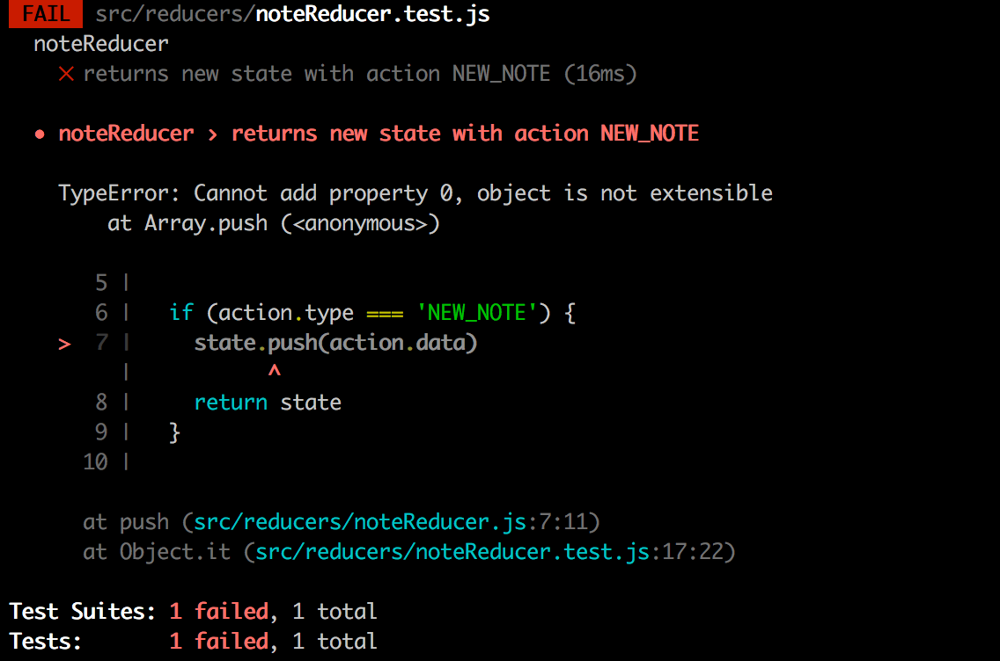
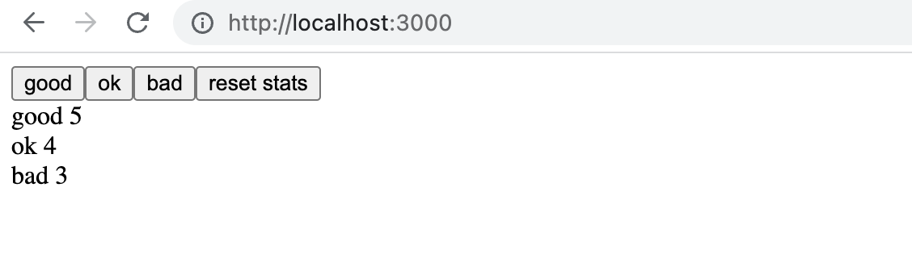
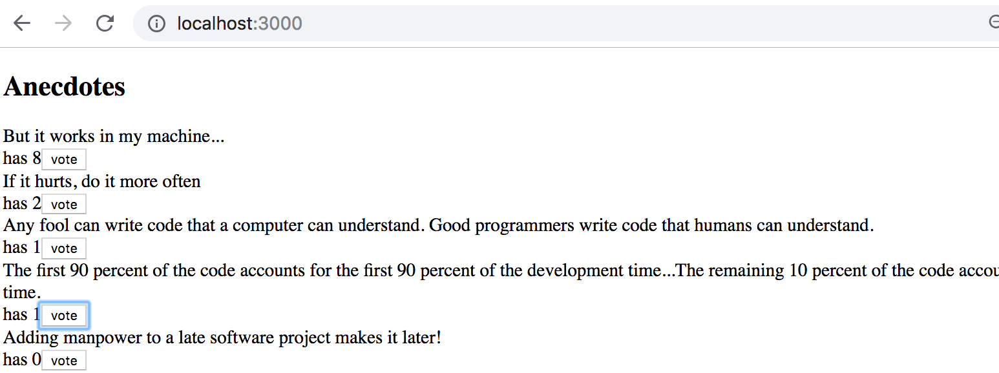
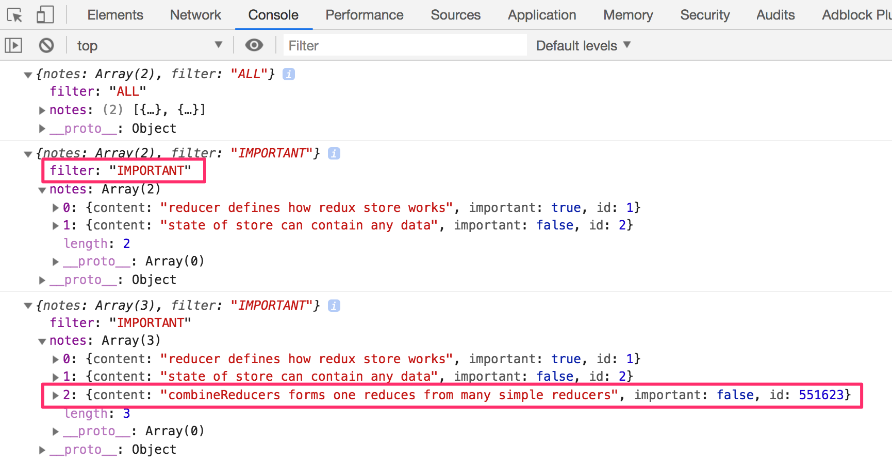
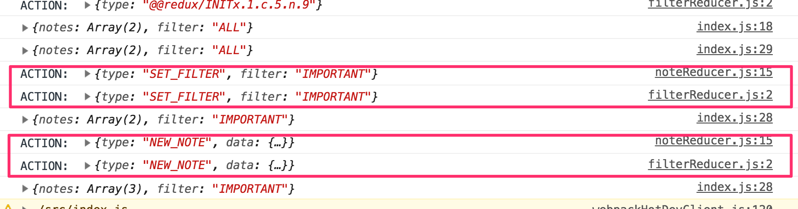
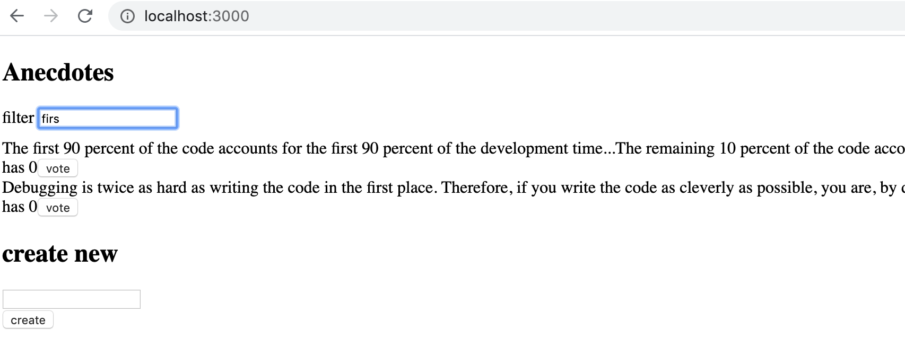
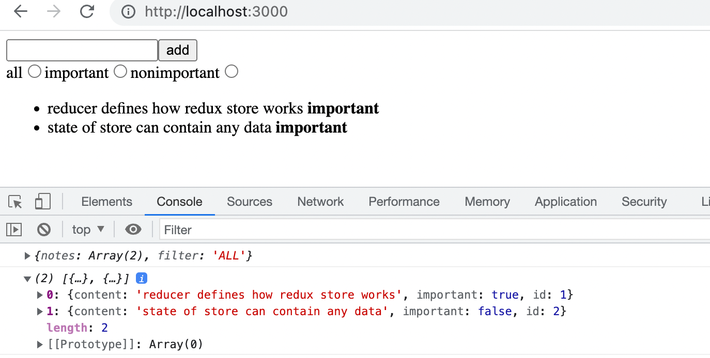
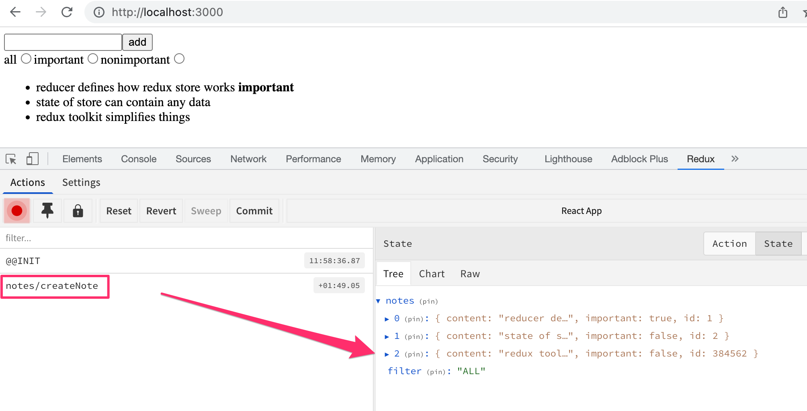

<div class="tasks">

Este es el material relacionado con Redux que se ha retirado del curso. Puedes continuar con este material y sus ejercicios si ya habías empezado esta parte utilizando Redux. En caso contrario, se recomienda seguir el material nuevo. Este material se eliminará en junio de 2026.

</div>

<div class="content">

Hasta ahora, hemos seguido las convenciones de gestión de estado recomendadas por React. Hemos colocado el estado y las funciones para manejarlo en el [nivel superior](https://es.react.dev/learn/sharing-state-between-components) de la estructura de componentes de la aplicación. A menudo, la mayoría del estado de la aplicación y los métodos para modificarlo residen directamente en el componente raíz. Luego, el estado y sus métodos de control se han pasado a otros componentes con props. Esto funciona hasta cierto punto, pero cuando las aplicaciones crecen, la gestión del estado se vuelve desafiante.

### Arquitectura de Flux

Facebook desarrolló la arquitectura [Flux](https://facebookarchive.github.io/flux/docs/in-depth-overview/) para facilitar la gestión del estado. En Flux, el estado se separa completamente de los componentes de React en sus propios <i>stores</i>(almacenes).
El estado en el store no se cambia directamente, sino con diferentes <i>actions</i>(acciones).

Cuando una acción cambia el estado de un store, las vistas se vuelven a generar:


Si alguna acción en la aplicación, por ejemplo presionar un botón, provoca la necesidad de cambiar el estado, el cambio se realiza con una acción.
Esto hace que se vuelva a renderizar la vista:


Flux ofrece una manera estándar de cómo y dónde se mantiene el estado de la aplicación y cómo se modifica.

### Redux

Facebook tiene una implementación para Flux, pero usaremos la librería [Redux](https://redux.js.org). Funciona con el mismo principio, pero es un poco más sencilla. Facebook también usa Redux ahora en lugar de su Flux original.

Conoceremos Redux implementando una aplicación de contador una vez más:


Crea una nueva aplicación Vite e instala <i>redux</i> con el comando

```bash
npm install redux
```

Como en Flux, en Redux el estado también se almacena en un [store](https://redux.js.org/tutorials/essentials/part-1-overview-concepts#store).

Todo el estado de la aplicación se almacena en <i>un</i> objeto JavaScript en el store. Debido a que nuestra aplicación solo necesita el valor del contador, lo guardaremos directamente en el store. Si el estado fuera más complicado, diferentes elementos del estado se guardarían como campos separados del objeto.

El estado del store se cambia con [acciones](https://redux.js.org/tutorials/essentials/part-1-overview-concepts#actions). Las acciones son objetos que tienen al menos un campo que determina el <i>tipo</i> de acción.
Nuestra aplicación necesita, por ejemplo, la siguiente acción:

```js
{
  type: 'INCREMENT'
}
```

Si hay datos relacionados con la acción, se pueden declarar otros campos según sea necesario. Sin embargo, nuestra aplicación de contador es tan simple que las acciones están bien con solo el campo de tipo.

El impacto de la acción sobre el estado de la aplicación se define mediante un [reducer](https://redux.js.org/tutorials/essentials/part-1-overview-concepts#reducers). En la práctica, un reducer es una función a la que se le da el estado actual y una acción como parámetros. <i>Devuelve</i> un nuevo estado.

Definamos ahora un reducer para nuestra aplicación:

```js
const counterReducer = (state, action) => {
  if (action.type === 'INCREMENT') {
    return state + 1
  } else if (action.type === 'DECREMENT') {
    return state - 1
  } else if (action.type === 'ZERO') {
    return 0
  }

  return state
}
```

El primer parámetro es el <i>estado</i> en el store. El reducer devuelve un <i>nuevo estado</i> basado en el tipo de _acción_. Entonces, por ejemplo, cuando el tipo de acción es <i>INCREMENT</i>, el estado obtiene el valor antiguo más uno. Si el tipo de acción es <i>ZERO</i>, el nuevo valor del estado es cero.

Cambiemos un poco el código. Hemos utilizado declaraciones if-else para responder a una acción y cambiar el estado. Sin embargo, la declaración [switch](https://developer.mozilla.org/es/docs/Web/JavaScript/Reference/Statements/switch) es el enfoque más común para escribir un reducer.

También definamos un [valor predeterminado](https://developer.mozilla.org/es/docs/Web/JavaScript/Reference/Functions/Default_parameters) de 0 para el parámetro <i>state</i>. Ahora, el reducer funciona incluso si el estado del store aún no se ha inicializado.

```js
// highlight-start
const counterReducer = (state = 0, action) => {
  // highlight-end
  switch (action.type) {
    case 'INCREMENT':
      return state + 1
    case 'DECREMENT':
      return state - 1
    case 'ZERO':
      return 0
    default: // if none of the above matches, code comes here
      return state
  }
}
```

El reducer nunca debe ser llamado directamente desde el código de la aplicación. Solo es proporcionado como parámetro a la función _createStore_ que crea el store:

```js
import { createStore } from 'redux' // highlight-line

const counterReducer = (state = 0, action) => {
  switch (action.type) {
    case 'INCREMENT':
      return state + 1
    case 'DECREMENT':
      return state - 1
    case 'ZERO':
      return 0
    default:
      return state
  }
}

const store = createStore(counterReducer) // highlight-line
```

El store ahora usa el reducer para manejar <i>acciones</i>, que son <i>dispatched</i> o 'enviadas' al store con su método [dispatch](https://redux.js.org/tutorials/essentials/part-1-overview-concepts#dispatch)(envío).

```js
store.dispatch({ type: 'INCREMENT' })
```

Puedes averiguar el estado del store utilizando el método [getState](https://redux.js.org/api/store#getstate).

Por ejemplo, el siguiente código:

```js
// ...

const store = createStore(counterReducer)

// highlight-start
console.log(store.getState())
store.dispatch({type: 'INCREMENT'})
store.dispatch({type: 'INCREMENT'})
store.dispatch({type: 'INCREMENT'})
console.log(store.getState())
store.dispatch({type: 'ZERO'})
store.dispatch({type: 'DECREMENT'})
console.log(store.getState())
// highlight-end
```

imprimiría lo siguiente en la consola

```
0
3
-1
```

porque al principio el estado del store es 0. Después de tres acciones <i>INCREMENT</i> el estado es 3. Al final, después de las acciones <i>ZERO</i> y <i>DECREMENT</i>, el estado es -1.

El tercer método importante que tiene el store es [subscribe](https://redux.js.org/api/store#subscribelistener), que se utiliza para crear funciones callback que el store llama cuando cambia su estado.

Si, por ejemplo, añadiéramos la siguiente función para suscribirnos, <i>todos los cambios en el store</i> se imprimirían en la consola.

```js
store.subscribe(() => {
  const storeNow = store.getState()
  console.log(storeNow)
})
```

entonces el código

```js
// ...

const store = createStore(counterReducer)

// highlight-start
store.subscribe(() => {
  const storeNow = store.getState()
  console.log(storeNow)
})
// highlight-end

// highlight-start
store.dispatch({ type: 'INCREMENT' })
store.dispatch({ type: 'INCREMENT' })
store.dispatch({ type: 'INCREMENT' })
store.dispatch({ type: 'ZERO' })
store.dispatch({ type: 'DECREMENT' })
// highlight-end
```

causaría que se imprima lo siguiente:

```
1
2
3
0
-1
```

El código de nuestra aplicación de contador es el siguiente. Todo el código se ha escrito en el mismo archivo, por lo que <i>store</i> está directamente disponible para el código React. Más adelante conoceremos mejores formas de estructurar el código React/Redux.

```js
import ReactDOM from 'react-dom/client'
import { createStore } from 'redux'

const counterReducer = (state = 0, action) => {
  switch (action.type) {
    case 'INCREMENT':
      return state + 1
    case 'DECREMENT':
      return state - 1
    case 'ZERO':
      return 0
    default:
      return state
  }
}

const store = createStore(counterReducer)

const App = () => {
  return (
    <div>
      <div>{store.getState()}</div>
      <button onClick={() => store.dispatch({ type: 'INCREMENT' })}>
        plus
      </button>
      <button onClick={() => store.dispatch({ type: 'DECREMENT' })}>
        minus
      </button>
      <button onClick={() => store.dispatch({ type: 'ZERO' })}>
        zero
      </button>
    </div>
  )
}

const root = ReactDOM.createRoot(document.getElementById('root'))

const renderApp = () => {
  root.render(<App />)
}

renderApp()
store.subscribe(renderApp)
```

Hay algunas cosas notables en el código.
<i>App</i> muestra el valor del contador solicitándolo al store con el método _store.getState()_. Los controladores de acciones de los botones envían (<i>dispatch</i>) las acciones correctas al store.

Cuando se cambia el estado del store, React no puede volver a re-renderizar automáticamente la aplicación. Por lo tanto, hemos registrado una función _renderApp_ , que renderiza toda la aplicación, para escuchar cambios en el store con el método _store.subscribe_. Ten en cuenta que tenemos que invocar inmediatamente al método _renderApp_. Sin la invocación, el primer renderizado de la aplicación nunca se produciría.

### Una nota sobre el uso de createStore

Los más atentos notarán que el nombre de la función createStore está tachado. Si pasas el mouse sobre el nombre, aparecerá una explicación


La explicación completa es la siguiente:

><i>Recomendamos utilizar el método configureStore del paquete @reduxjs/toolkit, que reemplaza a createStore.</i>
>
><i>Redux Toolkit es nuestro enfoque recomendado para escribir la lógica de Redux hoy, incluida la configuración de store, reducers, la obtención de datos y más.</i>
>
><i>Para obtener más detalles, lea esta página de documentación de Redux: <https://redux.js.org/introduction/why-rtk-is-redux-today></i>
>
><i>configureStore de Redux Toolkit es una versión mejorada de createStore que simplifica la configuración y ayuda a evitar errores comunes.</i>
>
><i>No deberías usar el paquete principal de redux por sí solo hoy en día, excepto con fines de aprendizaje. El método createStore del paquete core de redux no se eliminará, pero alentamos a todos los usuarios a migrar al uso de Redux Toolkit para todo el código de Redux.</i>

Entonces, en lugar de la función <i>createStore</i>, se recomienda usar la función un poco más "avanzada" <i>configureStore</i>, y también la usaremos cuando nos hayamos hecho cargo de la funcionalidad básica de Redux.

Nota adicional: <i>createStore</i> se define como "obsoleto", lo que generalmente significa que la función se eliminará en alguna versión más nueva de la librería. La explicación anterior y esta [discusión](https://stackoverflow.com/questions/71944111/redux-createstore-is-deprecated-cannot-get-state-from-getstate-in-redux-ac) revelan que <i>createStore</i> no se eliminará y se le ha dado el estado <i>obsoleto</i>, quizás por motivos ligeramente incorrectos. Por lo tanto, la función no está obsoleta, pero hoy en día existe una forma nueva y preferible de hacer casi lo mismo.

### Redux-notas

Nuestro objetivo es modificar nuestra aplicación de notas para utilizar Redux para la gestión del estado. Sin embargo, primero cubramos algunos conceptos clave a través de una aplicación de notas simplificada.

La primera versión de nuestra aplicación, escrita en el archivo <i>main.jsx</i>, se ve de la siguiente manera:

```js
import ReactDOM from 'react-dom/client'
import { createStore } from 'redux'

const noteReducer = (state = [], action) => {
  switch (action.type) {
    case 'NEW_NOTE':
      state.push(action.payload)
      return state
    default:
      return state
  }
}

const store = createStore(noteReducer)

store.dispatch({
  type: 'NEW_NOTE',
  payload: {
    content: 'the app state is in redux store',
    important: true,
    id: 1
  }
})

store.dispatch({
  type: 'NEW_NOTE',
  payload: {
    content: 'state changes are made with actions',
    important: false,
    id: 2
  }
})

const App = () => {
  return (
    <div>
      <ul>
        {store.getState().map(note => (
          <li key={note.id}>
            {note.content} <strong>{note.important ? 'important' : ''}</strong>
          </li>
        ))}
      </ul>
    </div>
  )
}

const root = ReactDOM.createRoot(document.getElementById('root'))

const renderApp = () => {
  root.render(<App />)
}

renderApp()
store.subscribe(renderApp)
```

Hasta el momento la aplicación no tiene la funcionalidad para agregar nuevas notas, aunque es posible hacerlo enviando acciones <i>NEW\_NOTE</i>.

Ahora las acciones tienen un tipo y un campo <i>payload</i> (carga), que contiene la nota a agregar:

```js
{
  type: 'NEW_NOTE',
  payload: {
    content: 'state changes are made with actions',
    important: false,
    id: 2
  }
}
```

La elección del nombre del campo es arbitraria. La convención es que las acciones tengan exactamente dos campos, <i>type</i> diciendo el tipo y <i>payload</i> conteniendo los datos incluidos en la acción.

### Funciones puras, inmutables

La versión inicial del reducer es muy sencilla:

```js
const noteReducer = (state = [], action) => {
  switch (action.type) {
    case 'NEW_NOTE':
      state.push(action.payload)
      return state
    default:
      return state
  }
}
```

El estado ahora es un Array. Las acciones de tipo <i>NEW\_NOTE</i> hacen que se agregue una nueva nota al estado con el método [push](https://developer.mozilla.org/es/docs/Web/JavaScript/Reference/Global_Objects/Array/push).

La aplicación parece estar funcionando, pero el reducer que hemos declarado es malo. Rompe el [supuesto básico](https://redux.js.org/tutorials/essentials/part-1-overview-concepts#reducers) de que los reducers deben ser [funciones puras](https://es.wikipedia.org/wiki/Programaci%C3%B3n_funcional#Funciones_puras).

Las funciones puras son aquellas que <i>no causan ningún efecto secundario</i> y siempre deben devolver la misma respuesta cuando se llaman con los mismos parámetros.

Agregamos una nueva nota al estado con el método _state.push(action.payload)_ que <i>cambia</i> el estado del objeto-estado. Esto no está permitido. El problema se resuelve fácilmente utilizando el método [concat](https://developer.mozilla.org/es/docs/Web/JavaScript/Reference/Global_Objects/Array/concat), que crea un <i>nuevo array</i>, que contiene todos los elementos del array anterior y el nuevo elemento:
 
```js
const noteReducer = (state = [], action) => {
  switch (action.type) {
    case 'NEW_NOTE':
      return state.concat(action.payload) // highlight-line
    default:
      return state
  }
}
```

El estado de un reducer debe estar compuesto por objetos [inmutables](https://es.wikipedia.org/wiki/Objeto_inmutable). Si hay un cambio en el estado, el objeto antiguo no se cambia, sino que se <i>reemplaza por un objeto nuevo modificado</i>. Esto es exactamente lo que hicimos con el nuevo reducer: el array anterior se reemplaza por el nuevo.

Ampliemos nuestro reducer para que pueda manejar el cambio de importancia de una nota:

```js
{
  type: 'TOGGLE_IMPORTANCE',
  payload: {
    id: 2
  }
}
```

Dado que todavía no tenemos ningún código que utilice esta funcionalidad, estamos expandiendo el reducer en la forma 'test driven' (guiada por pruebas). 

### Configurando el entorno de pruebas

Tenemos que configurar primero la biblioteca de pruebas [Vitest](https://vitest.dev/) para el proyecto. Vamos a instalarla como una dependencia de desarrollo para la aplicación:

```js
npm install --save-dev vitest
```

Expandamos <i>package.json</i> con un script para ejecutar las pruebas:

```json
{
  // ...
  "scripts": {
    "dev": "vite",
    "build": "vite build",
    "lint": "eslint .",
    "preview": "vite preview",
    "test": "vitest" // highlight-line
  },
  // ...
}
```

Para hacer las pruebas más fáciles, primero trasladaremos el código del reducer a su propio módulo, al archivo <i>src/reducers/noteReducer.js</i>:

```js
const noteReducer = (state = [], action) => {
  switch (action.type) {
    case 'NEW_NOTE':
      return state.concat(action.payload)
    default:
      return state
  }
}

export default noteReducer
```

El archivo <i>main.jsx</i> cambia de la siguiente manera:

```js
import ReactDOM from 'react-dom/client'
import { createStore } from 'redux'
import noteReducer from './reducers/noteReducer' // highlight-line

const store = createStore(noteReducer)

// ...
```

También agregaremos la librería [deep-freeze](https://www.npmjs.com/package/deep-freeze), que se puede usar para garantizar que el reducer se haya definido correctamente como una función inmutable.
Instalemos la librería como una dependencia de desarrollo:

```js
npm install --save-dev deep-freeze
```

Ahora estamos listos para escribir pruebas.

### Pruebas para noteReducer

Comencemos creando una prueba para manejar la acción <i>NEW\_NOTE</i>. La prueba, que definimos en el archivo <i>src/reducers/noteReducer.test.js</i>, tiene el siguiente contenido:

```js
import deepFreeze from 'deep-freeze'
import { describe, expect, test } from 'vitest'
import noteReducer from './noteReducer'

describe('noteReducer', () => {
  test('returns new state with action NEW_NOTE', () => {
    const state = []
    const action = {
      type: 'NEW_NOTE',
      payload: {
        content: 'the app state is in redux store',
        important: true,
        id: 1
      }
    }

    deepFreeze(state)
    const newState = noteReducer(state, action)

    expect(newState).toHaveLength(1)
    expect(newState).toContainEqual(action.payload)
  })
})
```

Ejecuta la prueba con <i>npm test</i>. La prueba asegura que el nuevo estado devuelto por el reducer es un array que contiene un solo elemento, que es el mismo objeto que el que está en el campo <i>payload</i> de la acción.

El comando <i>deepFreeze(state)</i> asegura que el reducer no cambie el estado del store que se le dio como parámetro. Si el reducer usa el comando _push_ para manipular el estado, la prueba no pasará



Ahora crearemos una prueba para la acción <i>TOGGLE\_IMPORTANCE</i>:

```js
test('returns new state with action TOGGLE_IMPORTANCE', () => {
  const state = [
    {
      content: 'the app state is in redux store',
      important: true,
      id: 1
    },
    {
      content: 'state changes are made with actions',
      important: false,
      id: 2
    }
  ]

  const action = {
    type: 'TOGGLE_IMPORTANCE',
    payload: {
      id: 2
    }
  }

  deepFreeze(state)
  const newState = noteReducer(state, action)

  expect(newState).toHaveLength(2)

  expect(newState).toContainEqual(state[0])

  expect(newState).toContainEqual({
    content: 'state changes are made with actions',
    important: true,
    id: 2
  })
})
```

Entonces la siguiente acción

```js
{
  type: 'TOGGLE_IMPORTANCE',
  payload: {
    id: 2
  }
}
```

tiene que cambiar la importancia de la nota con el id 2.

El reducer se expande de la siguiente manera

```js
const noteReducer = (state = [], action) => {
  switch(action.type) {
    case 'NEW_NOTE':
      return state.concat(action.payload)
    // highlight-start
    case 'TOGGLE_IMPORTANCE': {
      const id = action.payload.id
      const noteToChange = state.find(n => n.id === id)
      const changedNote = {
        ...noteToChange,
        important: !noteToChange.important
      }
      return state.map(note => (note.id !== id ? note : changedNote))
    }
    // highlight-end
    default:
      return state
  }
}
```

Creamos una copia de la nota cuya importancia ha cambiado con la sintaxis [de la parte 2](/es/part2/alterando_datos_en_el_servidor#cambiar-la-importancia-de-las-notas), y reemplazamos el estado con un nuevo estado que contiene todas las notas que no han cambiado y la copia de la nota cambiada <i>changedNote</i>.

Recapitulemos lo que sucede en el código. Primero, buscamos un objeto de nota específico, cuya importancia queremos cambiar:

```js
const noteToChange = state.find(n => n.id === id)
```

luego creamos un nuevo objeto, que es una <i>copia</i> de la nota original, solo el valor del campo <i>important</i> se ha cambiado a lo opuesto de lo que era:

```js
const changedNote = { 
  ...noteToChange, 
  important: !noteToChange.important 
}
```

Entonces se devuelve un nuevo estado. Lo creamos tomando todas las notas del estado anterior, excepto la nota deseada, que reemplazamos con su copia ligeramente alterada:

```js
state.map(note => (note.id !== id ? note : changedNote))
```

### Array spread syntax

Debido a que ahora tenemos pruebas bastante buenas para el reducer, podemos refactorizar el código de forma segura.

Agregar una nueva nota crea el estado devuelto por la función de Arrays _concat_. Echemos un vistazo a cómo podemos lograr lo mismo usando la sintaxis [array spread](https://developer.mozilla.org/es/docs/Web/JavaScript/Reference/Operators/Spread_syntax) de JavaScript:

```js
const noteReducer = (state = [], action) => {
  switch(action.type) {
    case 'NEW_NOTE':
      return [...state, action.payload] // highlight-line
    case 'TOGGLE_IMPORTANCE': {
      // ...
    }
    default:
    return state
  }
}
```

La sintaxis spread funciona de la siguiente manera. Si declaramos

```js
const numbers = [1, 2, 3]
```

<code>...numbers</code> divide el array en elementos individuales, que se pueden colocar en otro array.

```js
[...numbers, 4, 5]
```

y el resultado es un array <i>[1, 2, 3, 4, 5]</i>.

Si hubiéramos colocado el array en otro array sin el spread

```js
[numbers, 4, 5]
```

el resultado habría sido <i>[ [1, 2, 3], 4, 5]</i>.

Cuando tomamos elementos de un array mediante la [desestructuración](https://developer.mozilla.org/es/docs/Web/JavaScript/Reference/Operators/Destructuring_assignment), se usa una sintaxis similar para <i>juntar</i> el resto de los elementos:

```js
const numbers = [1, 2, 3, 4, 5, 6]

const [first, second, ...rest] = numbers

console.log(first)     // prints 1
console.log(second)   // prints 2
console.log(rest)     // prints [3, 4, 5, 6]
```

</div>

<div class="tasks">

### Ejercicios 6.1.-6.2.

Hagamos una versión simplificada del ejercicio unicafe de la parte 1. Manejemos la administración del estado con Redux.

Puedes tomar el código de este repositorio https://github.com/fullstack-hy2020/unicafe-redux para la base de tu proyecto.

<i>Comienza eliminando la configuración git del repositorio clonado e instalando dependencias</i>

```bash
cd unicafe-redux   // go to the directory of cloned repository
rm -rf .git
npm install
```

#### 6.1: Unicafe Revisitado, paso 1

Antes de implementar la funcionalidad de la UI(interfaz de usuario), implementemos la funcionalidad requerida por el store.

Tenemos que guardar el número de cada tipo de feedback en el store, por lo que la forma del estado en el store es:

```js
{
  good: 5,
  ok: 4,
  bad: 2
}
```

El proyecto tiene la siguiente base para un reducer:

```js
const initialState = {
  good: 0,
  ok: 0,
  bad: 0
}

const counterReducer = (state = initialState, action) => {
  console.log(action)
  switch (action.type) {
    case 'GOOD':
      return state
    case 'OK':
      return state
    case 'BAD':
      return state
    case 'RESET':
      return state
    default:
      return state
  }
}

export default counterReducer
```

y una base para sus pruebas

```js
import deepFreeze from 'deep-freeze'
import { describe, expect, test } from 'vitest'
import counterReducer from './reducer'

describe('unicafe reducer', () => {
  const initialState = {
    good: 0,
    ok: 0,
    bad: 0
  }

  test('should return a proper initial state when called with undefined state', () => {
    const action = {
      type: 'DO_NOTHING'
    }

    const newState = counterReducer(undefined, action)
    expect(newState).toEqual(initialState)
  })

  test('good is incremented', () => {
    const action = {
      type: 'GOOD'
    }
    const state = initialState

    deepFreeze(state)
    const newState = counterReducer(state, action)
    expect(newState).toEqual({
      good: 1,
      ok: 0,
      bad: 0
    })
  })
})
```

**Implementa el reducer y sus pruebas.**

En las pruebas, asegúrate de que el reducer sea una <i>función inmutable</i> con la librería <i>deep-freeze</i>.
Asegúrate de que la primera prueba proporcionada pase, porque Redux espera que el reducer devuelva el estado original cuando se llama con un primer parámetro - que representa el <i>estado</i> previo - con el valor <i>undefined</i>.

Comienza expandiendo el reducer para que pasen ambas pruebas. Luego agrega el resto de las pruebas y finalmente la funcionalidad que están probando.

Un buen modelo para el reducer es el ejemplo anterior de [redux-notas](/es/part6/redux_heredado#redux-notas).

#### 6.2: Unicafe Revisitado, paso 2

Ahora implementa la funcionalidad real de la aplicación.

Tu aplicación puede tener una apariencia modesta, nada más se necesitan 3 botones y el número de calificaciones para cada tipo:



</div>

<div class="content">

### Formulario no controlado

Agreguemos la funcionalidad para agregar nuevas notas y cambiar su importancia:

```js
// ...

const generateId = () => Number((Math.random() * 1000000).toFixed(0)) // highlight-line

const App = () => {
  // highlight-start
  const addNote = event => {
    event.preventDefault()
    const content = event.target.note.value
    event.target.note.value = ''
    store.dispatch({
      type: 'NEW_NOTE',
      payload: {
        content,
        important: false,
        id: generateId()
      }
    })
  }
    // highlight-end

  // highlight-start
  const toggleImportance = id => {
    store.dispatch({
      type: 'TOGGLE_IMPORTANCE',
      payload: { id }
    })
  }
    // highlight-end

  return (
    <div>
      // highlight-start
      <form onSubmit={addNote}>
        <input name="note" /> 
        <button type="submit">add</button>
      </form>
        // highlight-end
      <ul>
        {store.getState().map(note => (
          <li key={note.id} onClick={() => toggleImportance(note.id)}> // highlight-line
            {note.content} <strong>{note.important ? 'important' : ''}</strong>
          </li>
        ))}
      </ul>
    </div>
  )
}

// ...
```

La implementación de ambas funcionalidades es sencilla. Cabe señalar que <i>no hemos</i> vinculado el estado de los campos del formulario al estado del componente <i>App</i> como lo hicimos anteriormente. React llama a este tipo de formulario [no controlado](https://es.react.dev/reference/react-dom/components/input#controlling-an-input-with-a-state-variable).

>Los formularios no controlados tienen ciertas limitaciones (por ejemplo, no son posibles los mensajes de error dinámicos o la desactivación del botón de envío en función de input). Sin embargo, son adecuados para nuestras necesidades actuales.

Puedes leer más sobre formularios no controlados [aquí](https://goshakkk.name/controlled-vs-uncontrolled-inputs-react/).

El método para agregar nuevas notas es simple, simplemente envía la acción para agregar notas:

```js
addNote = event => {
  event.preventDefault()
  const content = event.target.note.value
  event.target.note.value = ''
  store.dispatch({
    type: 'NEW_NOTE',
    payload: {
      content,
      important: false,
      id: generateId()
    }
  })
}
```

Podemos obtener el contenido de la nueva nota directamente desde el campo del formulario. Debido a que el campo tiene un nombre, podemos acceder al contenido a través del objeto del evento <i>event.target.note.value</i>. 

```js
const content = event.target.note.value
```

```js
<form onSubmit={addNote}>
  <input name="note" /> // highlight-line
  <button type="submit">add</button>
</form>
```

La importancia de una nota se puede cambiar haciendo clic en su nombre. El controlador de eventos es muy simple:

```js
toggleImportance = id => {
  store.dispatch({
    type: 'TOGGLE_IMPORTANCE',
    payload: { id }
  })
}
```

### Action creators

Comenzamos a notar que, incluso en aplicaciones tan simples como la nuestra, usar Redux puede simplificar el código de la interfaz. Sin embargo, podemos hacerlo mucho mejor.

En realidad, no es necesario que los componentes de React conozcan los tipos y formas de acción de Redux.
Separemos la creación de acciones en sus propias funciones:

```js
const createNote = content => {
  return {
    type: 'NEW_NOTE',
    payload: {
      content,
      important: false,
      id: generateId()
    }
  }
}

const toggleImportanceOf = id => {
  return {
    type: 'TOGGLE_IMPORTANCE',
    payload: { id }
  }
}
```

Las funciones que crean acciones se denominan [action creators](https://redux.js.org/tutorials/essentials/part-1-overview-concepts#action-creators) (creadores de acciones).

El componente <i>App</i> ya no tiene que saber nada sobre la representación interna de las acciones, solo obtiene la acción correcta llamando a la función creadora:

```js
const App = () => {
  const addNote = event => {
    event.preventDefault()
    const content = event.target.note.value
    event.target.note.value = ''
    store.dispatch(createNote(content)) // highlight-line
    
  }
  
  const toggleImportance = id => {
    store.dispatch(toggleImportanceOf(id))// highlight-line
  }

  // ...
}
```

### Reenviando Redux-Store a varios componentes

Aparte del reducer, nuestra aplicación está en un solo archivo. Esto, por supuesto, no es sensato, y deberíamos separar <i>App</i> en su propio módulo.

Ahora la pregunta es, ¿cómo puede <i>App</i> acceder al store después de moverlo? Y en términos más generales, cuando un componente está compuesto por muchos componentes más pequeños, debe haber una forma para que todos los componentes accedan al store.
Hay varias formas de compartir el store redux con los componentes. Primero veremos la forma más nueva, y posiblemente la más fácil, usando la api de [hooks](https://react-redux.js.org/api/hooks) de la librería [react-redux](https://react-redux.js.org/).

Primero instalamos react-redux

```bash
npm install react-redux
```

A continuación, organicemos el código de la aplicación de forma más sensata en varios archivos. Después de los cambios, _main.jsx_ queda así:

```js
import ReactDOM from 'react-dom/client'
import { createStore } from 'redux'
import { Provider } from 'react-redux'

import App from './App'
import noteReducer from './reducers/noteReducer'

const store = createStore(noteReducer)

ReactDOM.createRoot(document.getElementById('root')).render(
  <Provider store={store}>
    <App />
  </Provider>
)
```

Ten en cuenta que la aplicación ahora se define como un elemento secundario de un componente [Provider](https://react-redux.js.org/api/provider) (proveedor) proporcionado por la librería react-redux.
El store de la aplicación se entrega al Provider como su atributo store.

```js
const store = createStore(noteReducer)

ReactDOM.createRoot(document.getElementById('root')).render(
  <Provider store={store}> // highlight-line
    <App />
  </Provider> // highlight-line
)
```

La definición de los action creators se ha movido al archivo  <i>reducers/noteReducer.js</i> donde se define el reducer. El archivo se ve así:

```js
const noteReducer = (state = [], action) => {
  switch (action.type) {
    case 'NEW_NOTE':
      return [...state, action.payload]
    case 'TOGGLE_IMPORTANCE': {
      const id = action.payload.id
      const noteToChange = state.find(n => n.id === id)
      const changedNote = {
        ...noteToChange,
        important: !noteToChange.important
      }
      return state.map(note => (note.id !== id ? note : changedNote))
    }
    default:
      return state
  }
}

const generateId = () =>
  Number((Math.random() * 1000000).toFixed(0))

export const createNote = (content) => {
  return {
    type: 'NEW_NOTE',
    payload: {
      content,
      important: false,
      id: generateId()
    }
  }
}

export const toggleImportanceOf = (id) => {
  return {
    type: 'TOGGLE_IMPORTANCE',
    payload: { id }
  }
}

export default noteReducer
```

Si la aplicación tiene muchos componentes que necesitan el store, el componente <i>App</i> debe pasar <i>store</i> como props a todos esos componentes.

El módulo ahora tiene varios comandos de [export](https://developer.mozilla.org/es/docs/Web/JavaScript/Reference/Statements/export).

La función del reducer todavía se devuelve con el comando de <i>export default</i>, por lo que el reducer se puede importar de la forma habitual:

```js
import noteReducer from './reducers/noteReducer'
```

Un módulo solo puede tener <i>un default export</i>, pero varias exportaciones "normales"

```js
export const createNote = (content) => {
  // ...
}

export const toggleImportanceOf = (id) => { 
  // ...
}
```

Las funciones exportadas normalmente (no como los default) se pueden importar con la sintaxis de llaves:

```js
import { createNote } from '../../reducers/noteReducer'
```

Código para el componente <i>App</i>

```js
import { createNote, toggleImportanceOf } from './reducers/noteReducer'
import { useSelector, useDispatch } from 'react-redux' 


const App = () => {
  const dispatch = useDispatch()
  const notes = useSelector(state => state)

  const addNote = (event) => {
    event.preventDefault()
    const content = event.target.note.value
    event.target.note.value = ''
    dispatch(createNote(content))
  }

  const toggleImportance = (id) => {
    dispatch(toggleImportanceOf(id))
  }

  return (
    <div>
      <form onSubmit={addNote}>
        <input name="note" /> 
        <button type="submit">add</button>
      </form>
      <ul>
        {notes.map(note => 
          <li
            key={note.id} 
            onClick={() => toggleImportance(note.id)}
          >
            {note.content} <strong>{note.important ? 'important' : ''}</strong>
          </li>
        )}
      </ul>
    </div>
  )
}

export default App
```

Hay algunas cosas a tener en cuenta en el código. Anteriormente, el código despachaba acciones invocando al método dispatch de redux-store:

```js
store.dispatch({
  type: 'TOGGLE_IMPORTANCE',
  payload: { id }
})
```

Ahora lo hace con la función <i>dispatch</i> del hook [useDispatch](https://react-redux.js.org/api/hooks#usedispatch).

```js
import { useSelector, useDispatch } from 'react-redux'  // highlight-line

const App = () => {
  const dispatch = useDispatch()  // highlight-line
  // ...

  const toggleImportance = (id) => {
    dispatch(toggleImportanceOf(id)) // highlight-line
  }

  // ...
}
```

El hook <i>useDispatch</i> proporciona acceso a cualquier componente de React a la función dispatch de redux-store definida en <i>main.jsx</i>. Esto permite que todos los componentes realicen cambios en el estado de Redux store.

El componente puede acceder a las notas almacenadas en el store con el hook [useSelector](https://react-redux.js.org/api/hooks#useselector) de la librería react-redux.

```js
import { useSelector, useDispatch } from 'react-redux'  // highlight-line

const App = () => {
  // ...
  const notes = useSelector(state => state)  // highlight-line
  // ...
}
```

<i>useSelector</i> recibe una función como parámetro. La función busca o selecciona datos del store de Redux.
Aquí necesitamos todas las notas, por lo que nuestra función de selector devuelve el estado completo:


```js
state => state
```

que es una abreviatura de

```js
(state) => {
  return state
}
```

Por lo general, las funciones de selector son un poco más interesantes y solo devuelven partes seleccionadas del contenido del store redux. Por ejemplo, podríamos devolver solo notas marcadas como importantes:

```js
const importantNotes = useSelector(state => state.filter(note => note.important))  
```

La versión actual de la aplicación se puede encontrar en [GitHub](https://github.com/fullstack-hy2020/redux-notes/tree/part6-0), en la rama <i>part6-0</i>.

### Más componentes

Separemos el formulario responsable de crear una nueva nota en su propio componente en el archivo <i>src/components/NoteForm.jsx</i>:

```js
import { useDispatch } from 'react-redux'
import { createNote } from '../reducers/noteReducer'

const NoteForm = () => {
  const dispatch = useDispatch()

  const addNote = (event) => {
    event.preventDefault()
    const content = event.target.note.value
    event.target.note.value = ''
    dispatch(createNote(content))
  }

  return (
    <form onSubmit={addNote}>
      <input name="note" />
      <button type="submit">add</button>
    </form>
  )
}

export default NoteForm
```

A diferencia del código de React que hicimos sin Redux, el controlador de eventos para cambiar el estado de la aplicación (que ahora vive en Redux) se ha movido de <i>App</i> a un componente hijo. La lógica para cambiar el estado en Redux todavía está claramente separada de toda la parte de React de la aplicación.

También separaremos la lista de notas y mostraremos una sola nota en sus propios componentes. Coloquemos ambos en el archivo <i>src/components/Notes.jsx</i>:

```js
import { useDispatch, useSelector } from 'react-redux'
import { toggleImportanceOf } from '../reducers/noteReducer'

const Note = ({ note, handleClick }) => {
  return (
    <li onClick={handleClick}>
      {note.content}
      <strong> {note.important ? 'important' : ''}</strong>
    </li>
  )
}

const Notes = () => {
  const dispatch = useDispatch()
  const notes = useSelector(state => state)

  return (
    <ul>
      {notes.map(note => (
        <Note
          key={note.id}
          note={note}
          handleClick={() => dispatch(toggleImportanceOf(note.id))}
        />
      ))}
    </ul>
  )
}

export default Notes
```

La lógica para cambiar la importancia de una nota ahora está en el componente que administra la lista de notas.

Solo queda una pequeña cantidad de código en el archivo <i>App.jsx</i>:

```js
import NoteForm from './components/NoteForm'
import Notes from './components/Notes'

const App = () => {
  return (
    <div>
      <NoteForm />
      <Notes />
    </div>
  )
}

export default App
```

<i>Note</i>, responsable de representar una sola nota, es muy simple y no es consciente de que el controlador de eventos que obtiene como props despacha una acción. Este tipo de componentes se denominan [presentacionales](https://medium.com/@dan_abramov/smart-and-dumb-components-7ca2f9a7c7d0) en la terminología de React.

<i>Notes</i>, por otro lado, es un componente [contenedor](https://medium.com/@dan_abramov/smart-and-dumb-components-7ca2f9a7c7d0), ya que contiene cierta lógica de aplicación: define lo que hacen los controladores de eventos de los componentes <i>Note</i> y coordina la configuración de los componentes <i>presentacionales</i>, es decir, los <i>Note</i>s.

El código de la aplicación Redux se puede encontrar en [GitHub](https://github.com/fullstack-hy2020/redux-notes/tree/part6-1), en la rama <i>part6-1</i>.

</div>

<div class="tasks">

### Ejercicios 6.3.-6.8.

Hagamos una nueva versión de la aplicación de votación de anécdotas de la parte 1. Toma el proyecto de este repositorio https://github.com/fullstack-hy2020/redux-anecdotes como base de tu solución.

Si clonas el proyecto en un repositorio de git existente, <i>elimina la configuración de git de la aplicación clonada:</i>

```bash
cd redux-anecdotes  // go to the cloned repository
rm -rf .git
```

La aplicación se puede iniciar como de costumbre, pero primero debes instalar las dependencias:

```bash
npm install
npm run dev
```

Después de completar estos ejercicios, tu aplicación debería verse así:



#### 6.3: Anécdotas, paso 1

Implementa la funcionalidad para votar anécdotas. La cantidad de votos debe guardarse en una store de Redux.

#### 6.4: Anécdotas, paso 2

Implementa la funcionalidad para agregar nuevas anécdotas.

Puedes mantener el formulario no controlado, como hicimos [antes](/es/part6/redux_heredado#formulario-no-controlado).

#### 6.5: Anécdotas, paso 3

Asegúrate de que las anécdotas estén ordenadas por número de votos.

#### 6.6: Anécdotas, paso 4

Si aún no lo has hecho, separa la creación de objetos de acción en funciones [action creator](https://read.reduxbook.com/markdown/part1/04-action-creators.html) y colócalas en el archivo <i>src/reducers/anecdoteReducer.js</i>, como hemos hecho desde la sección [action creators](/es/part6/redux_heredado#action-creators).

#### 6.7: Anécdotas, paso 5

Separa la creación de nuevas anécdotas en su propio componente llamado <i>AnecdoteForm</i>. Mueve toda la lógica para crear una nueva anécdota en este nuevo componente.

#### 6.8: Anécdotas, paso 6

Separa el renderizado de la lista de anécdotas en su propio componente llamado <i>AnecdoteList</i>. Mueve toda la lógica relacionada con la votación de una anécdota a este nuevo componente.

Ahora, el componente <i>App</i> debería verse así:

```js
import AnecdoteForm from './components/AnecdoteForm'
import AnecdoteList from './components/AnecdoteList'

const App = () => {
  return (
    <div>
      <h2>Anecdotes</h2>
      <AnecdoteList />
      <AnecdoteForm />
    </div>
  )
}

export default App
```

</div>

<div class="content">

Continuemos nuestro trabajo con la [versión Redux](/es/part6/redux_heredado#redux-notas) simplificada de nuestra aplicación de notas.

Para facilitar nuestro desarrollo, cambiemos nuestro reducer para que el store se inicialice con un estado que contenga un par de notas:

```js
// highlight-start
const initialState = [
  {
    content: 'reducer defines how redux store works',
    important: true,
    id: 1,
  },
  {
    content: 'state of store can contain any data',
    important: false,
    id: 2,
  },
]
//highlight-end

const noteReducer = (state = initialState, action) => { // highlight-line
  // ...
}

// ...

export default noteReducer
```

### Store con estado complejo

Implementemos el filtrado de las notas que se muestran al usuario. La interfaz de usuario para los filtros se implementará con [botones de radio](https://developer.mozilla.org/en-US/docs/Web/HTML/Element/input/radio):


Comencemos con una implementación muy simple y directa:

```js
import NoteForm from './components/NoteForm'
import Notes from './components/Notes'

const App = () => {
//highlight-start
  const filterSelected = (value) => {
    console.log(value)
  }
//highlight-end

  return (
    <div>
      <NoteForm />
      //highlight-start
      <div>
        <input
          type="radio"
          name="filter"
          onChange={() => filterSelected('ALL')}
        />
        all
        <input
          type="radio"
          name="filter"
          onChange={() => filterSelected('IMPORTANT')}
        />
        important
        <input
          type="radio"
          name="filter"
          onChange={() => filterSelected('NONIMPORTANT')}
        />
        nonimportant
      </div>
      //highlight-end
      <Notes />
    </div>
  )
}
```

Dado que el atributo <i>name</i> de todos los botones de radio es el mismo, estos forman un <i>button group</i> (grupo de botones) en el que solo se puede seleccionar una opción.

Los botones tienen un controlador de cambios que actualmente solo imprime el string asociado con el botón en el que se hizo clic en la consola.

En la siguiente sección, vamos a implementar el filtrado almacenando las notas y <i>el valor del filtro</i> en el store de redux. Cuando terminemos, nos gustaría que el estado del store se viera así:

```js
{
  notes: [
    { content: 'reducer defines how redux store works', important: true, id: 1},
    { content: 'state of store can contain any data', important: false, id: 2}
  ],
  filter: 'IMPORTANT'
}
```

Solo el array de notas se almacenaba en el estado de la implementación anterior de nuestra aplicación. En la nueva implementación, el objeto de estado tiene dos propiedades, <i>notes</i> que contienen el array de notas y <i>filter</i> que contiene un string que indica qué notas deben mostrarse al usuario.

### Reducers combinados

Podríamos modificar nuestro reducer actual para hacer frente a la nueva forma del estado. Sin embargo, una mejor solución en esta situación es definir un nuevo reducer separado para el estado del filtro:

```js
const filterReducer = (state = 'ALL', action) => {
  switch (action.type) {
    case 'SET_FILTER':
      return action.payload
    default:
      return state
  }
}

export const filterChange = filter => {
  return {
    type: 'SET_FILTER',
    payload: filter
  }
}

export default filterReducer
```

Las acciones para cambiar el estado del filtro se ven así:

```js
{
  type: 'SET_FILTER',
  payload: 'IMPORTANT'
}
```

Podemos crear el reducer que nuestra aplicación realmente utilizara al combinar los dos reducers existentes con la función [combineReducers](https://redux.js.org/api/combinereducers).

Definamos el reducer combinado en el archivo <i>main.jsx</i>:

```js
import ReactDOM from 'react-dom/client'
import { Provider } from 'react-redux'
import { createStore, combineReducers } from 'redux'

import App from './App'
import filterReducer from './reducers/filterReducer'
import noteReducer from './reducers/noteReducer'

const reducer = combineReducers({
  notes: noteReducer,
  filter: filterReducer
})

const store = createStore(reducer)

console.log(store.getState())

ReactDOM.createRoot(document.getElementById('root')).render(
  <Provider store={store}>
    <div />
  </Provider>
)
```

Dado que nuestra aplicación se rompe por completo en este punto, renderizamos un elemento <i>div</i> vacío en lugar del componente <i>App</i>.

El estado del store se imprime en la consola:


Como podemos ver en el resultado, ¡el store tiene la forma exacta que queríamos!

Echemos un vistazo más de cerca a cómo se crea el reducer combinado:

```js
const reducer = combineReducers({
  notes: noteReducer,
  filter: filterReducer,
})
```

El estado del store definido por este reducer es un objeto con dos propiedades: <i>notes</i> y <i>filter</i>. El valor de la propiedad <i>notes</i> es definido por <i>noteReducer</i>, que no tiene que lidiar con las otras propiedades del estado. Asimismo, la propiedad <i>filter</i> es administrada por <i>filterReducer</i>.

Antes de realizar más cambios en el código, echemos un vistazo a cómo las diferentes acciones cambian el estado del store definido por el reducer combinado. Agreguemos lo siguiente al archivo <i>main.jsx</i>:

```js
// ...

const store = createStore(reducer)

console.log(store.getState())

// highlight-start
import { createNote } from './reducers/noteReducer'
import { filterChange } from './reducers/filterReducer'
// highlight-end

// highlight-start
store.subscribe(() => console.log(store.getState()))
store.dispatch(filterChange('IMPORTANT'))
store.dispatch(createNote('combineReducers forms one reducer from many simple reducers'))
// highlight-end

ReactDOM.createRoot(document.getElementById('root')).render(
  <Provider store={store}>
    <div />
  </Provider>
)
```

Al simular la creación de una nota y cambiar el estado del filtro de esta manera, el estado del store se muestra en la consola después de cada cambio que se realiza en el store:



En este punto es bueno darse cuenta de un pequeño pero importante detalle. Si agregamos un console log <i>al comienzo de ambos reducers (noteReducer y filterReducer)</i>:

```js
const filterReducer = (state = 'ALL', action) => {
  console.log('ACTION: ', action) // highlight-line
  // ...
}
```

Según el resultado de la consola, uno podría tener la impresión de que cada acción se duplica:



¿Hay algún bug en nuestro código? No. El reducer combinado funciona de tal manera que cada <i>acción</i> es controlada en <i>cada</i> parte del reducer combinado, o en otras palabras, cada reducer "escucha" a todas las acciones despachadas y hace algo con ellas si así se lo hemos instruido. Normalmente, solo un reducer está interesado en una acción determinada, pero hay situaciones en las que varios reducers cambian sus respectivas partes del estado en función de la misma acción.

### Terminando los filtros

Terminemos la aplicación para que utilice el reducer combinado. Comenzamos cambiando la renderización de la aplicación y conectando el store a la aplicación en el archivo <i>main.jsx</i>:

```js
import ReactDOM from 'react-dom/client'
import { Provider } from 'react-redux'
import { createStore, combineReducers } from 'redux'

import App from './App'
import filterReducer from './reducers/filterReducer'
import noteReducer from './reducers/noteReducer'

const reducer = combineReducers({
  notes: noteReducer,
  filter: filterReducer
})

const store = createStore(reducer)

console.log(store.getState())

ReactDOM.createRoot(document.getElementById('root')).render(
  <Provider store={store}>
    <App />
  </Provider>
)
```

A continuación, solucionemos un error causado por el código que espera que la store de aplicaciones sea un array de notas:


Es una solución fácil. Debido a que las notas están en el campo <i>notes</i> del store, solo tenemos que hacer un pequeño cambio en la función de selector:

```js
const Notes = () => {
  const dispatch = useDispatch()
  const notes = useSelector(state => state.notes) // highlight-line

  return(
    <ul>
      {notes.map(note =>
        <Note
          key={note.id}
          note={note}
          handleClick={() => 
            dispatch(toggleImportanceOf(note.id))
          }
        />
      )}
    </ul>
  )
}
```

Anteriormente, la función de selector devolvía el estado completo del store:

```js
const notes = useSelector(state => state)
```

Y ahora devuelve solo su campo <i>notes</i>

```js
const notes = useSelector(state => state.notes)
```

Extraigamos el filtro de visibilidad en su propio componente <i>src/components/VisibilityFilter.jsx</i>:

```js
import { useDispatch } from 'react-redux'
import { filterChange } from '../reducers/filterReducer'

const VisibilityFilter = () => {
  const dispatch = useDispatch()

  return (
    <div>
      <input
        type="radio"
        name="filter"
        onChange={() => dispatch(filterChange('ALL'))}
      />
      all
      <input
        type="radio"
        name="filter"
        onChange={() => dispatch(filterChange('IMPORTANT'))}
      />
      important
      <input
        type="radio"
        name="filter"
        onChange={() => dispatch(filterChange('NONIMPORTANT'))}
      />
      nonimportant
    </div>
  )
}

export default VisibilityFilter
```

Con el nuevo componente, <i>App</i> se puede simplificar de la siguiente manera:

```js
import NoteForm from './components/NoteForm'
import Notes from './components/Notes'
import VisibilityFilter from './components/VisibilityFilter'

const App = () => {
  return (
    <div>
      <NoteForm />
      <VisibilityFilter />
      <Notes />
    </div>
  )
}

export default App
```

La implementación es bastante sencilla. Al hacer clic en los diferentes radio buttons, cambia el estado de la propiedad <i>filter</i> del store.

Cambiemos el componente <i>Notes</i> para incorporar el filtro:

```js
const Notes = () => {
  const dispatch = useDispatch()
  // highlight-start
  const notes = useSelector(state => {
    if (state.filter === 'ALL') {
      return state.notes
    }
    return state.filter === 'IMPORTANT'
      ? state.notes.filter(note => note.important)
      : state.notes.filter(note => !note.important)
  })
  // highlight-end

  return (
    <ul>
      {notes.map(note => (
        <Note
          key={note.id}
          note={note}
          handleClick={() => dispatch(toggleImportanceOf(note.id))}
        />
      ))}
    </ul>
  )
}
```

Solo realizamos cambios en la función de selector, que solía ser

```js
useSelector(state => state.notes)
```

Simplifiquemos el selector desestructurando los campos del estado que recibe como parámetro:

```js
const notes = useSelector(({ filter, notes }) => {
  if ( filter === 'ALL' ) {
    return notes
  }
  return filter  === 'IMPORTANT' 
    ? notes.filter(note => note.important)
    : notes.filter(note => !note.important)
})
```

Hay un pequeño defecto cosmético en nuestra aplicación. Aunque el filtro está configurado en <i>ALL</i> de forma predeterminada, el radio button asociado no está seleccionado. Naturalmente, este problema se puede solucionar, pero como se trata de un error desagradable pero, en última instancia, inofensivo, dejaremos la solución para más adelante.

La versión actual de la aplicación se puede encontrar en [GitHub](https://github.com/fullstack-hy2020/redux-notes/tree/part6-2), en la rama <i>part6-2</i>.

</div>

<div class="tasks">

### Ejercicio 6.9

#### 6.9 Mejores Anécdotas, paso 7

Implementa el filtrado para las anécdotas que se muestran al usuario.



Almacena el estado del filtro en el store de Redux. Se recomienda crear un nuevo reducer, action creators y un reducer combinado para el store utilizando la función <i>combineReducers</i>.

Crea un nuevo componente <i>Filter</i> para mostrar los filtros. Puedes utilizar el siguiente código como punto de partida:

```js
const Filter = () => {
  const handleChange = (event) => {
    // input-field value is in variable event.target.value
  }
  const style = {
    marginBottom: 10
  }

  return (
    <div style={style}>
      filter <input onChange={handleChange} />
    </div>
  )
}

export default Filter
```

</div>

<div class="content">

### Redux Toolkit y refactorizando la configuración del Store

Como hemos visto hasta ahora, la implementación de la gestión del estado y la configuración de Redux requiere bastante esfuerzo. Esto se manifiesta, por ejemplo, en el código relacionado con el reducer y el action creator, que tiene un código un tanto repetitivo. [Redux Toolkit](https://redux-toolkit.js.org/) es una librería que resuelve estos problemas comunes relacionados con Redux. La librería, por ejemplo, simplifica enormemente la configuración del store de Redux y ofrece una gran variedad de herramientas para facilitar la gestión del estado.

Comencemos a usar Redux Toolkit en nuestra aplicación refactorizando el código existente. Primero, necesitaremos instalar la librería:

```bash
npm install @reduxjs/toolkit
```

A continuación, abre el archivo <i>main.jsx</i> que actualmente crea la store de Redux. En lugar de la función <em>createStore</em> de Redux, creemos el Store usando la función [configureStore](https://redux-toolkit.js.org/api/configureStore) de Redux Toolkit:

```js
import ReactDOM from 'react-dom/client'
import { Provider } from 'react-redux'
import { configureStore } from '@reduxjs/toolkit' // highlight-line

import App from './App'
import filterReducer from './reducers/filterReducer'
import noteReducer from './reducers/noteReducer'

 // highlight-start
const store = configureStore({
  reducer: {
    notes: noteReducer,
    filter: filterReducer
  }
})
// highlight-end

console.log(store.getState())

ReactDOM.createRoot(document.getElementById('root')).render(
  <Provider store={store}>
    <App />
  </Provider>
)
```

Ya nos deshicimos de algunas líneas de código, ya no necesitamos la función <em>combineReducers</em> para crear el reducer del store. Pronto veremos que la función <em>configureStore</em> tiene muchos beneficios adicionales, como la integración sin esfuerzo de herramientas de desarrollo y muchas librerías de uso común sin necesidad de configuración adicional.

Limpiemos aún más el archivo <i>main.jsx</i> moviendo el código relacionado con la creación del store de Redux a su propio archivo. Creemos un nuevo archivo <i>src/store.js</i>:
```js
import { configureStore } from '@reduxjs/toolkit'

import noteReducer from './reducers/noteReducer'
import filterReducer from './reducers/filterReducer'

const store = configureStore({
  reducer: {
    notes: noteReducer,
    filter: filterReducer
  }
})

export default store
```

Después de los cambios, el contenido del archivo <i>main.jsx</i> es el siguiente:

```js
import ReactDOM from 'react-dom/client'
import { Provider } from 'react-redux'

import App from './App'
import store from './store'

ReactDOM.createRoot(document.getElementById('root')).render(
  <Provider store={store}>
    <App />
  </Provider>
)
```

### Redux Toolkit y refactorizando los reducers

Pasemos a refactorizar los reducers, lo que trae consigo los beneficios de Redux Toolkit. Con Redux Toolkit, podemos crear fácilmente reducers y action creators relacionados utilizando la función [createSlice](https://redux-toolkit.js.org/api/createSlice). Podemos usar la función <em>createSlice</em> para refactorizar el reducer y los action creators en el archivo <i>reducers/noteReducer.js</i> de la siguiente manera:

```js
import { createSlice } from '@reduxjs/toolkit' // highlight-line

const initialState = [
  {
    content: 'reducer defines how redux store works',
    important: true,
    id: 1,
  },
  {
    content: 'state of store can contain any data',
    important: false,
    id: 2,
  },
]

const generateId = () =>
  Number((Math.random() * 1000000).toFixed(0))

// highlight-start
const noteSlice = createSlice({
  name: 'notes',
  initialState,
  reducers: {
    createNote(state, action) {
      const content = action.payload

      state.push({
        content,
        important: false,
        id: generateId(),
      })
    },
    toggleImportanceOf(state, action) {
      const id = action.payload

      const noteToChange = state.find(n => n.id === id)

      const changedNote = { 
        ...noteToChange, 
        important: !noteToChange.important 
      }

      return state.map(note =>
        note.id !== id ? note : changedNote 
      )     
    }
  },
})
// highlight-end

// highlight-start
export const { createNote, toggleImportanceOf } = noteSlice.actions
export default noteSlice.reducer
// highlight-end
```

El parámetro <em>name</em> de la función <em>createSlice</em> define el prefijo que se utiliza en los valores de tipo de la acción. Por ejemplo, la acción <em>createNote</em> definida más adelante tendrá el valor de tipo <em>notes/createNote</em>. Es una buena práctica dar al parámetro un valor que sea único entre los reducers. De esta forma no habrá colisiones inesperadas entre los valores de tipo de acción de la aplicación.
El parámetro <em>initialState</em> define el estado inicial del reducer.
El parámetro <em>reducers</em> toma al propio reducer como un objeto, cuyas funciones manejan los cambios de estado causados por ciertas acciones. Ten en cuenta que <em>action.payload</em> en la función contiene el argumento proporcionado al llamar al creador de la acción:

```js
dispatch(createNote('Redux Toolkit is awesome!'))
```

Esta llamada a dispatch equivale a enviar el siguiente objeto:

```js
dispatch({ type: 'notes/createNote', payload: 'Redux Toolkit is awesome!' })
```

Si has prestado atención, es posible que hayas notado que dentro de la acción <em>createNote</em>, parece suceder algo que viola el principio de inmutabilidad de los reducers mencionado anteriormente:

```js
createNote(state, action) {
  const content = action.payload

  state.push({
    content,
    important: false,
    id: generateId(),
  })
}
```

Estamos mutando el array del argumento <em>state</em> al llamar al método <em>push</em> en lugar de devolver una nueva instancia del array. ¿De qué se trata todo esto?

Redux Toolkit utiliza la librería [Immer](https://immerjs.github.io/immer/) con reducers creados por la función <em>createSlice</em>, lo que hace posible mutar el argumento <em>state</em> dentro del reducer. Immer usa el estado mutado para producir un nuevo estado inmutable y, por lo tanto, los cambios de estado permanecen inmutables. Ten en cuenta que <em>state</em> se puede cambiar sin "mutarlo", como hemos hecho con la acción <em>toggleImportanceOf</em>. En este caso, la función <i>devuelve</i> el nuevo estado directamente. Sin embargo, mutar el estado a menudo será útil, especialmente cuando se necesita actualizar un estado complejo.

La función <em>createSlice</em> devuelve un objeto que contiene al reducer así como a los action creators definidos por el parámetro <em>reducers</em>. Se puede acceder al reducer mediante la propiedad <em>noteSlice.reducer</em>, mientras que a los action creators mediante la propiedad <em>noteSlice.actions</em>. Podemos producir las exportaciones del archivo de la siguiente manera:

```js
const noteSlice = createSlice({
  // ...
})

// highlight-start
export const { createNote, toggleImportanceOf } = noteSlice.actions
export default noteSlice.reducer
// highlight-end
```

Las importaciones en otros archivos funcionarán igual que antes:

```js
import noteReducer, { createNote, toggleImportanceOf } from './reducers/noteReducer'
```

Necesitamos modificar los nombres de los tipos de las acciones en las pruebas debido a las convenciones de ReduxToolkit:

```js 
import deepFreeze from 'deep-freeze'
import { describe, expect, test } from 'vitest'
import noteReducer from './noteReducer'

describe('noteReducer', () => {
  test('returns new state with action notes/createNote', () => { // highlight-line
    const state = []
    const action = {
      type: 'notes/createNote', // highlight-line
      payload: 'the app state is in redux store' // highlight-line
    }

    deepFreeze(state)
    const newState = noteReducer(state, action)

    expect(newState).toHaveLength(1)
    expect(newState.map(note => note.content)).toContainEqual(action.payload) // highlight-line
  })
})

test('returns new state with action notes/toggleImportanceOf', () => { // highlight-line
  const state = [
    {
      content: 'the app state is in redux store',
      important: true,
      id: 1
    },
    {
      content: 'state changes are made with actions',
      important: false,
      id: 2
    }
  ]

  const action = {
    type: 'notes/toggleImportanceOf', // highlight-line
    payload: 2 // highlight-line
  }

  deepFreeze(state)
  const newState = noteReducer(state, action)

  expect(newState).toHaveLength(2)

  expect(newState).toContainEqual(state[0])

  expect(newState).toContainEqual({
    content: 'state changes are made with actions',
    important: true,
    id: 2
  })
})
```

Puedes encontrar el código de nuestra aplicación actual en su totalidad en la rama <i>part6-3</i> de [este repositorio de GitHub](https://github.com/fullstack-hy2020/redux-notes/tree/part6-3).

### Redux Toolkit y console.log

Como hemos aprendido, console.log es una herramienta extremadamente poderosa, por lo general siempre nos salva de problemas.

Intentemos imprimir el estado del store de Redux en la consola en medio del reducer creado con la función createSlice:

```js
const noteSlice = createSlice({
  name: 'notes',
  initialState,
  reducers: {
    // ...
    toggleImportanceOf(state, action) {
      const id = action.payload

      const noteToChange = state.find(n => n.id === id)

      const changedNote = { 
        ...noteToChange, 
        important: !noteToChange.important 
      }

      console.log(state) // highlight-line

      return state.map(note =>
        note.id !== id ? note : changedNote 
      )     
    }
  },
})
```

Lo siguiente se imprime en la consola


Lo que vemos es interesante pero no muy útil. Esto tiene que ver con la librería Immer que mencionamos anteriormente y es utilizada por Redux Toolkit internamente para guardar el estado de la Tienda.

El estado se puede convertir a un formato legible por humanos utilizando la función [current](https://redux-toolkit.js.org/api/other-exports#current) de la librería immer.

Actualicemos las importaciones para incluir a la función "current" de la librería immer:

```js
import { current } from '@reduxjs/toolkit'
```

Luego actualicemos el llamado a la función console.log:

```js
console.log(current(state))
```

Ahora lo que imprime la consola es legible para humanos



### Redux DevTools

[Redux DevTools](https://chrome.google.com/webstore/detail/redux-devtools/lmhkpmbekcpmknklioeibfkpmmfibljd) es una extension de Chrome, que ofrece útiles herramientas de desarrollo para Redux. Se puede usar, por ejemplo, para inspeccionar el estado del store de Redux y enviar acciones (dispatch) a través de la consola del navegador. Cuando el store se crea usando la función <em>configureStore</em> de Redux Toolkit, no se necesita ninguna configuración adicional para que Redux DevTools funcione.

Una vez instalada la extension, al hacer clic en la pestaña de <i>Redux</i> en las herramientas de desarrollo del navegador, Redux DevTools debería abrirse:


Puedes inspeccionar cómo el envío de una determinada acción cambia el estado haciendo clic en la acción:



También es posible enviar acciones (dispatch) a la store utilizando las herramientas de desarrollo:


El código actual de la aplicación se puede encontrar en [GitHub](https://github.com/fullstack-hy2020/redux-notes/tree/part6-3), en la rama <i>part6-3</i>.

</div>

<div class="tasks">

### Ejercicios 6.10.-6.13.

Continuemos trabajando en la aplicación de anécdotas que comenzamos en el ejercicio 6.3, usando Redux Toolkit.

#### 6.10 Mejores Anécdotas, paso 8

Instala Redux Toolkit en el proyecto. Mueve la creación del store de Redux a su propio archivo <i>store.js</i> y utiliza la función <em>configureStore</em> para crear el store.

Cambia la definición del <i>filter reducer y sus action creators</i> para usar la función <em>createSlice</em> de Redux Toolkit.

También, comienza a utilizar Redux DevTools para depurar el estado de la aplicación fácilmente.

#### 6.11 Mejores Anécdotas, paso 9

Cambia también la definición de <i>anecdote reducer y sus action creators</i> para usar la función <em>createSlice</em> de Redux Toolkit.

#### 6.12 Mejores Anécdotas, paso 10

La aplicación tiene el esqueleto del componente <i>Notification</i> listo para utilizarlo:

```js
const Notification = () => {
  const style = {
    border: 'solid',
    padding: 10,
    borderWidth: 1,
    marginBottom: 10
  }

  return (
    <div style={style}>
      render here notification...
    </div>
  )
}

export default Notification
```

Extiende el componente para que muestre el mensaje almacenado en el store de Redux. Crea un reducer separado para la nueva funcionalidad mediante la función <em>createSlice</em> de Redux Toolkit.

La aplicación no tiene que utilizar el componente <i>Notification</i> completamente en este punto de los ejercicios. Es suficiente con que la aplicación muestre el valor inicial establecido para el mensaje en el <i>notificationReducer</i>.

#### 6.13 Mejores Anécdotas, paso 11

Extiende la aplicación para que utilice el componente <i>Notification</i> para mostrar un mensaje durante cinco segundos cuando el usuario vote por una anécdota o cree una nueva anécdota:


Se recomienda crear [action creators](https://redux-toolkit.js.org/api/createSlice#reducers) independientes para configurar y eliminar notificaciones.

</div>

<div class="content">

### Configuración de JSON Server

Expandamos la aplicación, de modo que las notas se almacenen en el backend. Usaremos [json-server](/es/part2/obteniendo_datos_del_servidor), de la parte 2.

El estado inicial de la base de datos se almacena en el archivo <i>db.json</i>, que se coloca en la raíz del proyecto:

```json
{
  "notes": [
    {
      "content": "the app state is in redux store",
      "important": true,
      "id": 1
    },
    {
      "content": "state changes are made with actions",
      "important": false,
      "id": 2
    }
  ]
}
```

Instalaremos json-server en nuestro proyecto...

```js
npm install json-server --save-dev
```

y agregaremos la siguiente línea a la parte de <i>scripts</i> del archivo <i>package.json</i>

```js
"scripts": {
  "server": "json-server -p 3001 db.json",
  // ...
}
```

Ahora iniciemos json-server con el comando _npm run server_.

### Fetch API

En el desarrollo de software, a menudo es necesario considerar si una cierta funcionalidad debe implementarse usando una librería externa o si es mejor utilizar las soluciones nativas proporcionadas por el entorno. Ambos enfoques tienen sus propias ventajas y desafíos.

En las partes anteriores de este curso, usamos la librería [Axios](https://axios-http.com/docs/intro) para hacer peticiones HTTP. Ahora, exploremos una forma alternativa de hacer peticiones HTTP usando la [Fetch API](https://developer.mozilla.org/es/docs/Web/API/Fetch_API) nativa.

Es típico que una librería externa como <i>Axios</i> se implemente usando otras librerías externas. Por ejemplo, si instalas Axios en tu proyecto con el comando _npm install axios_, la salida de la consola será:

```bash
$ npm install axios

added 23 packages, and audited 302 packages in 1s

71 packages are looking for funding
  run `npm fund` for details

found 0 vulnerabilities
```

Por lo tanto, además de la librería Axios, el comando instalaría más de 20 paquetes npm adicionales que Axios necesita para funcionar.

La <i>Fetch API</i> proporciona una forma similar de hacer peticiones HTTP como Axios, pero usar la Fetch API no requiere instalar ninguna librería externa. El mantenimiento de la aplicación se vuelve más fácil cuando hay menos librerías que actualizar, y la seguridad también mejora porque la superficie de ataque potencial de la aplicación se reduce. La seguridad y el mantenimiento de las aplicaciones se discute más a fondo en la [parte 7](https://fullstackopen.com/es/part7/class_components_miscellaneous#react-node-application-security) del curso.

En la práctica, las peticiones se realizan usando la función _fetch()_. La sintaxis utilizada difiere algo de Axios. También notaremos pronto que Axios se ha encargado de algunas cosas por nosotros y nos ha facilitado la vida. Sin embargo, ahora usaremos la Fetch API, ya que es una solución nativa ampliamente utilizada que todo desarrollador Full Stack debería conocer.

### Obteniendo datos del backend

Creemos un método para obtener datos del backend en el archivo <i>src/services/notes.js</i>:

```js
const baseUrl = 'http://localhost:3001/notes'

const getAll = async () => {
  const response = await fetch(baseUrl)

  if (!response.ok) {
    throw new Error('Failed to fetch notes')
  }

  const data = await response.json()
  return data
}

export default { getAll }
```

Examinemos más de cerca la implementación del método _getAll_. Las notas ahora se obtienen del backend llamando a la función _fetch()_, a la cual se le da la URL del backend como argumento. El tipo de petición no se define explícitamente, por lo que _fetch_ realiza su acción predeterminada, que es una petición GET.

Una vez que la respuesta ha llegado, se verifica el éxito de la petición usando la propiedad _response.ok_, y se lanza un error si es necesario:

```js
if (!response.ok) {
  throw new Error('Failed to fetch notes')
}
```

El atributo _response.ok_ se establece en _true_ si la petición fue exitosa, es decir, el código de estado de la respuesta está entre 200 y 299. Para todos los demás códigos de estado, como 404 o 500, se establece en _false_.

Ten en cuenta que _fetch_ no lanza automáticamente un error incluso si el código de estado de la respuesta es, por ejemplo, 404. El manejo de errores debe implementarse manualmente, como lo hemos hecho aquí.

Si la petición es exitosa, los datos contenidos en la respuesta se convierten a formato JSON:

```js
const data = await response.json()
```

_fetch_ no convierte automáticamente ningún dato incluido en la respuesta a formato JSON; la conversión debe hacerse manualmente. También es importante notar que _response.json()_ es un método asíncrono, por lo que se requiere la palabra clave <i>await</i>.

Simplifiquemos aún más el código devolviendo directamente los datos devueltos por el método _response.json()_:

```js
const getAll = async () => {
  const response = await fetch(baseUrl)

  if (!response.ok) {
    throw new Error('Failed to fetch notes')
  }

  return await response.json() // highlight-line
}
```

### Inicializando el store con datos obtenidos del servidor

Modifiquemos ahora nuestra aplicación para que el estado de la aplicación se inicialice con las notas obtenidas del servidor.

En el archivo <i>noteReducer.js</i>, cambiemos la inicialización del estado de las notas para que por defecto no haya notas:

```js
const noteSlice = createSlice({
  name: 'notes',
  initialState: [], // highlight-line
  // ...
})
```

Agreguemos un action creator llamado <em>setNotes</em>, que nos permita reemplazar directamente el array de notas. Podemos crear el action creator deseado usando la función <em>createSlice</em> de la siguiente manera:

```js
// ...

const noteSlice = createSlice({
  name: 'notes',
  initialState: [],
  reducers: {
    createNote(state, action) {
      const content = action.payload
      state.push({
        content,
        important: false,
        id: generateId()
      })
    },
    toggleImportanceOf(state, action) {
      const id = action.payload
      const noteToChange = state.find(n => n.id === id)
      const changedNote = {
        ...noteToChange,
        important: !noteToChange.important
      }
      return state.map(note => (note.id !== id ? note : changedNote))
    },
    // highlight-start
    setNotes(state, action) {
      return action.payload
    }
    // highlight-end
  }
})

export const { createNote, toggleImportanceOf, setNotes } = noteSlice.actions // highlight-line
export default noteSlice.reducer
```

Implementemos la inicialización de las notas en el componente <i>App</i>. Como es habitual al obtener datos de un servidor, usaremos el hook <i>useEffect</i>:


```js
import { useEffect } from 'react' // highlight-line
import { useDispatch } from 'react-redux' // highlight-line

import NoteForm from './components/NoteForm'
import Notes from './components/Notes'
import VisibilityFilter from './components/VisibilityFilter'
import { setNotes } from './reducers/noteReducer' // highlight-line
import noteService from './services/notes' // highlight-line

const App = () => {
  const dispatch = useDispatch() // highlight-line

  // highlight-start
  useEffect(() => {
    noteService.getAll().then(notes => dispatch(setNotes(notes)))
  }, [dispatch])
  // highlight-end

  return (
    <div>
      <NoteForm />
      <VisibilityFilter />
      <Notes />
    </div>
  )
}

export default App
```

### Enviando datos al backend

A continuación, implementemos la funcionalidad para enviar una nueva nota al servidor. Esto también nos dará una oportunidad de practicar cómo hacer una petición POST usando el método _fetch()_.

Expandamos el código en <i>src/services/notes.js</i> que maneja la comunicación con el servidor de la siguiente manera:

```js
const baseUrl = 'http://localhost:3001/notes'

const getAll = async () => {
  const response = await fetch(baseUrl)

  if (!response.ok) {
    throw new Error('Failed to fetch notes')
  }

  return await response.json()
}

// highlight-start
const createNew = async (content) => {
  const response = await fetch(baseUrl, {
    method: 'POST',
    headers: { 'Content-Type': 'application/json' },
    body: JSON.stringify({ content, important: false }),
  })
  
  if (!response.ok) {
    throw new Error('Failed to create note')
  }
  
  return await response.json()
}
// highlight-end

export default { getAll, createNew } // highlight-line
```

Examinemos más de cerca la implementación del método _createNew_. El primer parámetro de la función _fetch()_ especifica la URL a la que se realiza la petición. El segundo parámetro es un objeto que define otros detalles de la petición, como el tipo de petición, encabezados y los datos enviados con la petición. Podemos aclarar aún más el código almacenando el objeto que define los detalles de la petición en una variable <i>options</i> separada:

```js
const createNew = async (content) => {
  // highlight-start
  const options = {
    method: 'POST',
    headers: { 'Content-Type': 'application/json' },
    body: JSON.stringify({ content, important: false }),
  }
  
  const response = await fetch(baseUrl, options)
  // highlight-end

  if (!response.ok) {
    throw new Error('Failed to create note')
  }
  
  return await response.json()
}
```

Examinemos más de cerca el objeto <i>options</i>:

- <i>method</i> define el tipo de petición, que en este caso es <i>POST</i>
- <i>headers</i> define los encabezados de la petición. Agregamos el encabezado _'Content-Type': 'application/json'_ para informar al servidor que los datos enviados con la petición están en formato JSON, para que pueda manejar la petición correctamente
- <i>body</i> contiene los datos enviados con la petición. No puedes asignar directamente un objeto JavaScript a este campo; primero debe convertirse a una cadena JSON llamando a la función _JSON.stringify()_

Al igual que con una petición GET, el código de estado de la respuesta se verifica para detectar errores:

```js
if (!response.ok) {
  throw new Error('Failed to create note')
}
```

Si la petición es exitosa, <i>JSON Server</i> devuelve la nota recién creada, para la cual también ha generado un <i>id</i> único. Sin embargo, los datos contenidos en la respuesta aún deben convertirse a formato JSON usando el método _response.json()_:

```js
return await response.json()
```

Luego modificaremos el componente de nuestra aplicación <i>NoteForm</i> para que una nueva nota se envíe al backend. El método _addNote_ del componente cambiará ligeramente:

```js
import { useDispatch } from 'react-redux'
import { createNote } from '../reducers/noteReducer'
import noteService from '../services/notes' // highlight-line

const NoteForm = (props) => {
  const dispatch = useDispatch()
  
  const addNote = async (event) => { // highlight-line
    event.preventDefault()
    const content = event.target.note.value
    event.target.note.value = ''
    const newNote = await noteService.createNew(content) // highlight-line
    dispatch(createNote(newNote)) // highlight-line
  }

  return (
    <form onSubmit={addNote}>
      <input name="note" />
      <button type="submit">add</button>
    </form>
  )
}

export default NoteForm
```

Cuando se crea una nueva nota en el backend llamando al método _createNew()_, el valor de retorno es un objeto que representa la nota, al cual el backend ha generado un <i>id</i> único. Por lo tanto, modifiquemos el action creator <i>createNote</i> definido en <i>notesReducer.js</i> de la siguiente manera:

```js
const noteSlice = createSlice({
  name: 'notes',
  initialState: [],
  reducers: {
    createNote(state, action) {
      state.push(action.payload) // highlight-line
    },
    // ..
  },
})
```

El cambio de importancia de las notas podría implementarse utilizando el mismo principio, haciendo una llamada asíncrona al servidor y luego enviando una acción apropiada.

El estado actual del código para la aplicación se puede encontrar en [GitHub](https://github.com/fullstack-hy2020/redux-notes/tree/part6-4) en la rama <i>part6-4</i>.

</div>

<div class="tasks">

### Ejercicios 6.14.-6.15.

#### 6.14 Anécdotas y el Backend, paso 1

Cuando la aplicación se inicie, obtén las anécdotas del backend implementado usando json-server. Usa la Fetch API para hacer la petición HTTP.

Como datos de backend iniciales, puedes usar, por ejemplo, [esto](https://github.com/fullstack-hy2020/misc/blob/master/anecdotes.json).

#### 6.15 Anécdotas y el Backend, paso 2

Modifica la creación de nuevas anécdotas, de forma que las anécdotas se almacenen en el backend. Utiliza la Fetch API en tu implementación una vez más.

</div>

<div class="content">

### Acciones asíncronas y Redux Thunk

Nuestro enfoque es bastante bueno, pero no es muy bueno que la comunicación con el servidor suceda dentro de las funciones de los componentes. Sería mejor si la comunicación pudiera abstraerse de los componentes para que no tengan que hacer nada más que llamar al action creator apropiado. Como ejemplo, <i>App</i> inicializaría el estado de la aplicación de la siguiente manera:

```js
const App = () => {
  const dispatch = useDispatch()

  useEffect(() => {
    dispatch(initializeNotes())
  }, [dispatch]) 
  
  // ...
}
```

y <i>NoteForm</i> crearía una nueva nota de la siguiente manera:

```js
const NoteForm = () => {
  const dispatch = useDispatch()
  
  const addNote = async (event) => {
    event.preventDefault()
    const content = event.target.note.value
    event.target.note.value = ''
    dispatch(createNote(content))
  }

  // ...
}
```

En esta implementación, ambos componentes enviarían una acción sin necesidad de saber sobre la comunicación con el servidor que sucede detrás de escena. Estos tipos de <i>acciones asíncronas</i> se pueden implementar utilizando la librería [Redux Thunk](https://github.com/reduxjs/redux-thunk). El uso de la librería no requiere ninguna configuración adicional o incluso instalación cuando el store de Redux se ha creado utilizando la función <em>configureStore</em> del kit de herramientas de Redux (Redux Toolkit).

Con Redux Thunk, es posible implementar <i>action creators</i> que devuelven una función en lugar de un objeto. La función recibe los métodos <em>dispatch</em> y <em>getState</em> del store de Redux como parámetros. Esto permite, por ejemplo, implementaciones de action creators asíncronos, que primero esperan la finalización de una cierta operación asíncrona y luego despachan alguna acción, que cambia el estado del store.

Podemos definir un action creator llamado <em>initializeNotes</em> en el archivo <i>noteReducer.js</i>, que obtiene las notas iniciales del servidor, de la siguiente manera:

```js
import { createSlice } from '@reduxjs/toolkit'
import noteService from '../services/notes' // highlight-line

const noteSlice = createSlice({
  name: 'notes',
  initialState: [],
  reducers: {
    createNote(state, action) {
      state.push(action.payload)
    },
    toggleImportanceOf(state, action) {
      const id = action.payload
      const noteToChange = state.find((n) => n.id === id)
      const changedNote = {
        ...noteToChange,
        important: !noteToChange.important,
      }
      return state.map((note) => (note.id !== id ? note : changedNote))
    },
    setNotes(state, action) {
      return action.payload
    },
  },
})

const { setNotes } = noteSlice.actions // highlight-line

// highlight-start
export const initializeNotes = () => {
  return async (dispatch) => {
    const notes = await noteService.getAll()
    dispatch(setNotes(notes))
  }
}
// highlight-end

export const { createNote, toggleImportanceOf } = noteSlice.actions // highlight-line

export default noteSlice.reducer
```

En su función interna, es decir, en la <i>acción asíncrona</i>, la operación primero obtiene todas las notas del servidor y luego <i>despacha</i> la acción para agregarlas al store. Es importante destacar que Redux pasa automáticamente una referencia al método _dispatch_ como argumento a la función, por lo que el action creator _initializeNotes_ no requiere ningún parámetro.

El action creator _setNotes_ ya no se exporta fuera del módulo, ya que el estado inicial de las notas ahora se establecerá usando el action creator asíncrono _initializeNotes_ que creamos. Sin embargo, todavía usamos el action creator _setNotes_ dentro del módulo.

El componente <i>App</i> ahora puede definirse de la siguiente manera:

```js
import { useEffect } from 'react'
import { useDispatch } from 'react-redux'

import NoteForm from './components/NoteForm'
import Notes from './components/Notes'
import VisibilityFilter from './components/VisibilityFilter'
import { initializeNotes } from './reducers/noteReducer' // highlight-line

const App = () => {
  const dispatch = useDispatch()

  useEffect(() => {
    dispatch(initializeNotes()) // highlight-line
  }, [dispatch])

  return (
    <div>
      <NoteForm />
      <VisibilityFilter />
      <Notes />
    </div>
  )
}

export default App
```

La solución es bastante elegante. La lógica de inicialización de las notas se ha separado completamente del componente React.

A continuación, creemos un action creator asíncrono llamado _appendNote_:

```js
import { createSlice } from '@reduxjs/toolkit'
import noteService from '../services/notes'

const noteSlice = createSlice({
  name: 'notes',
  initialState: [],
  reducers: {
    createNote(state, action) {
      state.push(action.payload)
    },
    toggleImportanceOf(state, action) {
      const id = action.payload
      const noteToChange = state.find((n) => n.id === id)
      const changedNote = {
        ...noteToChange,
        important: !noteToChange.important,
      }
      return state.map((note) => (note.id !== id ? note : changedNote))
    },
    setNotes(state, action) {
      return action.payload
    },
  },
})

const { createNote, setNotes } = noteSlice.actions // highlight-line

export const initializeNotes = () => {
  return async (dispatch) => {
    const notes = await noteService.getAll()
    dispatch(setNotes(notes))
  }
}

// highlight-start
export const appendNote = (content) => {
  return async (dispatch) => {
    const newNote = await noteService.createNew(content)
    dispatch(createNote(newNote))
  }
}
// highlight-end

export const { toggleImportanceOf } = noteSlice.actions // highlight-line

export default noteSlice.reducer
```

El principio es el mismo una vez más. Primero se realiza una operación asíncrona y, una vez completada, se <i>despacha</i> una acción que actualiza el estado del store. El action creator _createNote_ ya no se exporta fuera del archivo; solo se usa internamente en la implementación de la función _appendNote_.

El componente <i>NoteForm</i> cambia de la siguiente manera:

```js
import { useDispatch } from 'react-redux'
import { appendNote } from '../reducers/noteReducer' // highlight-line

const NoteForm = () => {
  const dispatch = useDispatch()

  const addNote = async (event) => {
    event.preventDefault()
    const content = event.target.note.value
    event.target.note.value = ''
    dispatch(appendNote(content)) // highlight-line
  }

  return (
    <form onSubmit={addNote}>
      <input name="note" />
      <button type="submit">add</button>
    </form>
  )
}
```

El estado actual del código de la aplicación se puede encontrar en [GitHub](https://github.com/fullstack-hy2020/redux-notes/tree/part6-5) en la rama <i>part6-5</i>.

Redux Toolkit ofrece una gran cantidad de herramientas para simplificar la administración de estado asíncrono. Las herramientas adecuadas para este caso de uso son, por ejemplo, la función [createAsyncThunk](https://redux-toolkit.js.org/api/createAsyncThunk) y la API [RTK Query](https://redux-toolkit.js.org/rtk-query/overview).

</div>

<div class="tasks">

### Ejercicios 6.16.-6.19.

#### 6.16 Anécdotas y el Backend, paso 3

Modifica la inicialización de la store de Redux para que suceda utilizando action creators asíncronos, los cuales son posibles gracias a la librería Redux Thunk.

#### 6.17 Anécdotas y el Backend, paso 4

También modifica la creación de una nueva anécdota para que suceda usando action creators asíncronos, hecho posible por la librería Redux Thunk.

#### 6.18 Anécdotas y el Backend, paso 5

La votación aún no guarda los cambios en el backend. Arregla la situación con la ayuda de la librería Redux Thunk y la Fetch API.

#### 6.19 Anécdotas y el Backend, paso 6

La creación de notificaciones sigue siendo un poco tediosa, ya que hay que realizar dos acciones y utilizar la función _setTimeout_:

```js
dispatch(setNotification(`new anecdote '${content}'`))
setTimeout(() => {
  dispatch(clearNotification())
}, 5000)
```

Crea un action creator, que te permita proveer la notificación de la siguiente manera:

```js
dispatch(setNotification(`you voted '${anecdote.content}'`, 10))
```

El primer parámetro es el texto que sera renderizado y el segundo parámetro es el tiempo durante el cual se mostrara la notificación en segundos.

Implementa el uso de esta notificación mejorada en tu aplicación.

</div>
