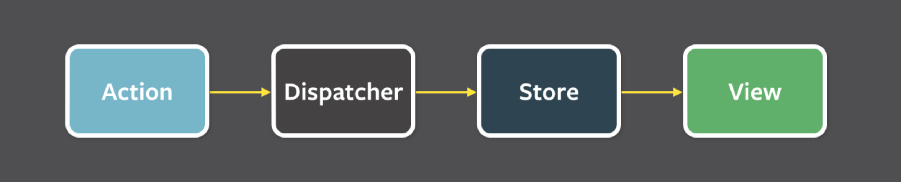
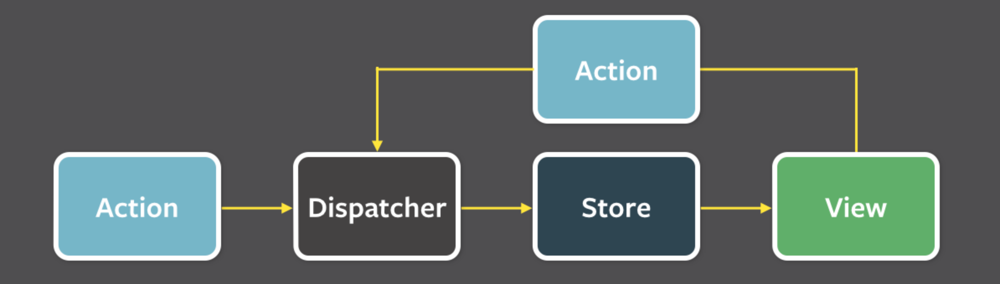
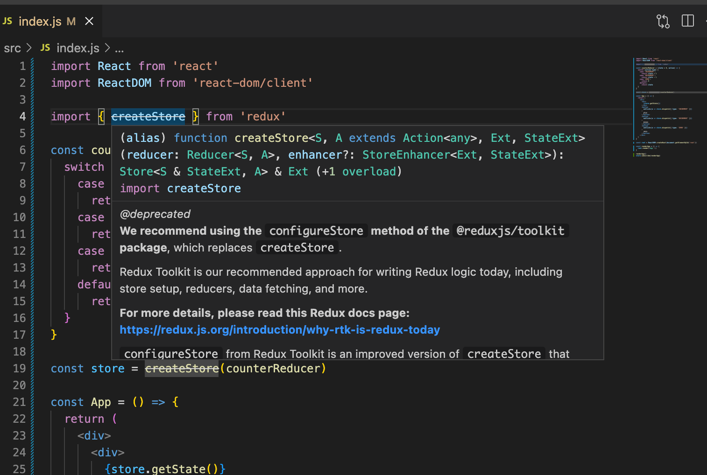
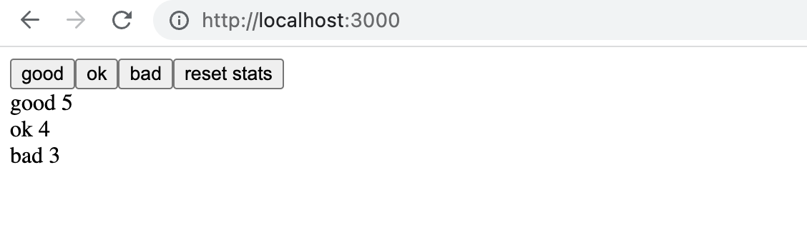

<div class="content">

Olemme noudattaneet sovelluksen tilan hallinnassa Reactin suosittelemaa käytäntöä määritellä useiden komponenttien tarvitsema tila ja sitä käsittelevät funktiot sovelluksen komponenttirakenteen [ylimmissä](https://reactjs.org/docs/lifting-state-up.html) kompontenteissa. Usein suurin osa tilaa ja sitä funktiot on määritelty sovelluksen juurikomponentissa. Tilaa ja sitä käsitteleviä funktioita on välitetty propsien avulla niitä tarvitseville komponenteille. Tämä toimii johonkin pisteeseen saakka, mutta sovelluksen kasvaessa tilan hallinta muuttuu haasteelliseksi.

### Flux-arkkitehtuuri

Facebook kehitti jo Reactin historian varhaisvaiheissa tilan hallinnan ongelmia helpottamaan [Flux](https://facebookarchive.github.io/flux/docs/in-depth-overview)-arkkitehtuurin. Fluxissa sovelluksen tilan hallinta erotetaan kokonaan Reactin komponenttien ulkopuolisiin varastoihin eli <i>storeihin</i>. Storessa olevaa tilaa ei muuteta suoraan, vaan tapahtumien eli <i>actionien</i> avulla.

Kun action muuttaa storen tilaa, renderöidään näkymät uudelleen:



Jos sovelluksen käyttö (esim. napin painaminen) aiheuttaa tarpeen tilan muutokseen, tehdään muutos actionin avulla. Tämä taas aiheuttaa uuden näytön renderöitymisen:



Flux tarjoaa siis standardin tavan sille miten ja missä sovelluksen tila pidetään sekä tavalle tehdä tilaan muutoksia.

### Redux

Facebookilla on olemassa valmis toteutus Fluxille, mutta käytämme kuitenkin saman periaatteen mukaan toimivaa mutta hieman yksinkertaisempaa [Redux](https://redux.js.org)-kirjastoa, jota myös Facebookilla käytetään nykyään alkuperäisen Flux-toteutuksen sijaan.

Tutustutaan Reduxiin tekemällä jälleen kerran laskurin toteuttava sovellus:


Tehdään uusi Create React App ‑sovellus ja asennetaan siihen <i>Redux</i>:

```bash
npm install redux
```

Fluxin tapaan Reduxissa sovelluksen tila talletetaan [storeen](https://redux.js.org/basics/store).

Koko sovelluksen tila talletetaan <i>yhteen</i> storen tallettamaan JavaScript-objektiin. Koska sovelluksemme ei tarvitse mitään muuta tilaa kuin laskurin arvon, talletetaan se storeen sellaisenaan. Jos sovelluksen tila olisi monimutkaisempi, talletettaisiin "eri asiat" storessa olevaan olioon erillisinä kenttinä.

Storen tilaa muutetaan [actionien](https://redux.js.org/basics/actions) avulla. Actionit ovat olioita, joilla on vähintään actionin <i>tyypin</i> määrittelevä kenttä <i>type</i>. Sovelluksessamme tarvitsemme esimerkiksi seuraavaa actionia:

```js
{
  type: 'INCREMENT'
}
```

Jos actioneihin liittyy dataa, määritellään niille tarpeen vaatiessa muitakin kenttiä. Laskurisovelluksemme on kuitenkin niin yksinkertainen, että actioneille riittää pelkkä tyyppikenttä.

Actionien vaikutus sovelluksen tilaan määritellään [reducerin](https://redux.js.org/basics/reducers) avulla. Käytännössä reducer on funktio, joka saa parametrikseen staten nykyisen tilan sekä actionin ja <i>palauttaa</i> staten uuden tilan.

Määritellään nyt sovelluksellemme reducer:

```js
const counterReducer = (state, action) => {
  if (action.type === 'INCREMENT') {
    return state + 1
  } else if (action.type === 'DECREMENT') {
    return state - 1
  } else if (action.type === 'ZERO') {
    return 0
  }

  return state
}
```

Ensimmäinen parametri on siis storessa oleva <i>tila</i>. Reducer palauttaa <i>uuden tilan</i> actionin tyypin mukaan. Eli esim. actionin tyypin ollessa <i>INCREMENT</i> tila saa arvokseen vanhan arvon plus yksi. Jos actionin tyyppi on <i>ZERO</i> tilan uusi arvo on nolla.

Muutetaan koodia vielä hiukan. Reducereissa on tapana käyttää if:ien sijaan [switch](https://developer.mozilla.org/en-US/docs/Web/JavaScript/Reference/Statements/switch)-komentoa.
Määritellään myös parametrille <i>state</i> [oletusarvoksi](https://developer.mozilla.org/en-US/docs/Web/JavaScript/Reference/Functions/Default_parameters) 0. Näin reducer toimii vaikka storen tilaa ei olisi vielä alustettu.

```js
const counterReducer = (state = 0, action) => {
  switch (action.type) {
    case 'INCREMENT':
      return state + 1
    case 'DECREMENT':
      return state - 1
    case 'ZERO':
      return 0
    default: // jos ei mikään ylläolevista tullaan tänne
    return state
  }
}
```

Reduceria ei ole tarkoitus kutsua koskaan suoraan sovelluksen koodista. Reducer ainoastaan annetaan parametrina storen luovalle _createStore_-funktiolle:

```js
import { createStore } from 'redux'

const counterReducer = (state = 0, action) => {
  // ...
}

const store = createStore(counterReducer)
```

Store käyttää nyt reduceria käsitelläkseen <i>actioneja</i>, jotka <i>dispatchataan</i> eli "lähetetään" storelle sen [dispatch](https://redux.js.org/api/store#dispatchaction)-metodilla:

```js
store.dispatch({type: 'INCREMENT'})
```

Storen tilan saa selville metodilla [getState](https://redux.js.org/api/store/#getstate).

Esim. seuraava koodi

```js
const store = createStore(counterReducer)
console.log(store.getState())
store.dispatch({type: 'INCREMENT'})
store.dispatch({type: 'INCREMENT'})
store.dispatch({type: 'INCREMENT'})
console.log(store.getState())
store.dispatch({type: 'ZERO'})
store.dispatch({type: 'DECREMENT'})
console.log(store.getState())
```

tulostaisi konsoliin

<pre>
0
3
-1
</pre>

sillä ensin storen tila on 0. Kolmen <i>INCREMENT</i>-actionin jälkeen tila on 3, ja lopulta actionien <i>ZERO</i> ja <i>DECREMENT</i> jälkeen -1.

Kolmas storen tärkeä metodi on [subscribe](https://redux.js.org/api/store#subscribelistener), jonka avulla voidaan määritellä takaisinkutsufunktioita, joita store kutsuu sen tilan muuttumisen yhteydessä.

Esimerkkinä voisimme tulostaa <i>jokaisen storen muutoksen</i> konsoliin näin:

```js
store.subscribe(() => {
  const storeNow = store.getState()
  console.log(storeNow)
})
```

Tällöin koodi

```js
const store = createStore(counterReducer)

store.subscribe(() => {
  const storeNow = store.getState()
  console.log(storeNow)
})

store.dispatch({ type: 'INCREMENT' })
store.dispatch({ type: 'INCREMENT' })
store.dispatch({ type: 'INCREMENT' })
store.dispatch({ type: 'ZERO' })
store.dispatch({ type: 'DECREMENT' })
```

tulostaisi

<pre>
1
2
3
0
-1
</pre>


Laskurisovelluksemme koodi on seuraavassa. Kaikki koodi on kirjoitettu samaan tiedostoon, joten <i>store</i> on suoraan React-koodin käytettävissä. Tutustumme React/Redux-koodin parempiin strukturointitapoihin myöhemmin.

```js
import React from 'react'
import ReactDOM from 'react-dom/client'

import { createStore } from 'redux'

const counterReducer = (state = 0, action) => {
  switch (action.type) {
    case 'INCREMENT':
      return state + 1
    case 'DECREMENT':
      return state - 1
    case 'ZERO':
      return 0
    default:
      return state
  }
}

const store = createStore(counterReducer)

const App = () => {
  return (
    <div>
      <div>
        {store.getState()}
      </div>
      <button 
        onClick={e => store.dispatch({ type: 'INCREMENT' })}
      >
        plus
      </button>
      <button
        onClick={e => store.dispatch({ type: 'DECREMENT' })}
      >
        minus
      </button>
      <button 
        onClick={e => store.dispatch({ type: 'ZERO' })}
      >
        zero
      </button>
    </div>
  )
}

const root = ReactDOM.createRoot(document.getElementById('root'))

const renderApp = () => {
  root.render(<App />)
}

renderApp()
store.subscribe(renderApp)
```

Koodissa on pari huomionarvoista seikkaa. <i>App</i> renderöi laskurin arvon kysymällä sitä storesta metodilla _store.getState()_. Nappien tapahtumankäsittelijät <i>dispatchaavat</i> suoraan oikean tyyppiset actionit storelle.

Kun storessa olevan tilan arvo muuttuu, ei React osaa automaattisesti renderöidä sovellusta uudelleen. Olemmekin rekisteröineet koko sovelluksen renderöinnin suorittavan funktion _renderApp_ kuuntelemaan storen muutoksia metodilla _store.subscribe_. Huomaa, että joudumme kutsumaan heti alussa metodia _renderApp_, sillä ilman kutsua sovelluksen ensimmäistä renderöintiä ei tapahdu ollenkaan.

### Huomautus funktion createStore käytöstä

Tarkkasilmäisimmät huomaavat, että funktion createStore nimen päällä on viiva. Jos hiiren vie nimen päälle, tulee asialle selitystä 



Selitys on kokonaisuudessaan seuraava

><i>We recommend using the configureStore method of the @reduxjs/toolkit package, which replaces createStore.</i>
>
><i>Redux Toolkit is our recommended approach for writing Redux logic today, including store setup, reducers, data fetching, and more.</i>
>
><i>For more details, please read this Redux docs page: https://redux.js.org/introduction/why-rtk-is-redux-today</i>
>
><i>configureStore from Redux Toolkit is an improved version of createStore that simplifies setup and helps avoid common bugs.</i>
>
><i>You should not be using the redux core package by itself today, except for learning purposes. The createStore method from the core redux package will not be removed, but we encourage all users to migrate to using Redux Toolkit for all Redux code.</i>

Funktion <i>createStore</i> sijaan siis suositellaan käytettäväksi hieman "kehittyneempää" funktiota <i>configureStore</i>, ja mekin tulemme ottamaan sen käyttöömme kun olemme ottaneet Reduxin perustoiminnallisuuden haltuun.

Sivuhuomio: <i>createStore</i> on määritelty olevan "deprecated", joka yleensä tarkoittaa sitä, että ominaisuus tulee poistumaan kirjaston jossain uudemmassa versiossa. Yllä oleva selitys ja [tämäkin](https://stackoverflow.com/questions/71944111/redux-createstore-is-deprecated-cannot-get-state-from-getstate-in-redux-ac) keskustelu paljastavat, että <i>createStore</i> ei tule poistumaan, ja sille onkin annettu ehkä hieman virheellisin perustein status <i>deprecated</i>. Funktio ei siis ole vanhentunut, mutta nykyään on olemassa suositeltavampi, uusi tapa tehdä suunilleen sama asia.

### Redux-muistiinpanot

Tavoitteenamme on muuttaa muistiinpanosovellus käyttämään tilanhallintaan Reduxia. Katsotaan kuitenkin ensin eräitä konsepteja hieman yksinkertaistetun muistiinpanosovelluksen kautta.

Sovelluksen ensimmäinen versio on seuraava:

```js
const noteReducer = (state = [], action) => {
  if (action.type === 'NEW_NOTE') {
    state.push(action.payload)
    return state
  }

  return state
}

const store = createStore(noteReducer)

store.dispatch({
  type: 'NEW_NOTE',
  payload: {
    content: 'the app state is in redux store',
    important: true,
    id: 1
  }
})

store.dispatch({
  type: 'NEW_NOTE',
  payload: {
    content: 'state changes are made with actions',
    important: false,
    id: 2
  }
})

const App = () => {
  return(
    <div>
      <ul>
        {store.getState().map(note=>
          <li key={note.id}>
            {note.content}
            <strong>{note.important ? 'important' : ''}</strong>
          </li>
        )}
        </ul>
    </div>
  )
}
```

Toistaiseksi sovelluksessa ei siis ole toiminnallisuutta uusien muistiinpanojen lisäämiseen, mutta voimme toteuttaa sen dispatchaamalla <i>NEW\_NOTE</i>-tyyppisiä actioneja koodista.

Actioneissa on nyt tyypin lisäksi kenttä <i>payload</i>, joka sisältää lisättävän muistiinpanon:

```js
{
  type: 'NEW_NOTE',
  payload: {
    content: 'state changes are made with actions',
    important: false,
    id: 2
  }
}
```

Kentän nimen valinta ei ole sattumanvarainen. Yleinen konventio on, että actioneilla on juurikin kaksi kenttää, tyypin kertova <i>type</i> ja actionin mukana olevan tiedon sisältävä <i>payload</i>.

### Puhtaat funktiot ja muuttumattomat (immutable) oliot

Reducerimme alustava versio on yksinkertainen:

```js
const noteReducer = (state = [], action) => {
  if (action.type === 'NEW_NOTE') {
    state.push(action.payload)
    return state
  }

  return state
}
```

Tila on nyt taulukko. <i>NEW\_NOTE</i>-tyyppisen actionin seurauksena tilaan lisätään uusi muistiinpano metodilla [push](https://developer.mozilla.org/en-US/docs/Web/JavaScript/Reference/Global_Objects/Array/push).

Sovellus näyttää toimivan, mutta määrittelemämme reduceri on huono, sillä se rikkoo Reduxin reducerien [perusolettamusta](https://redux.js.org/tutorials/essentials/part-1-overview-concepts#reducers) siitä, että reducerien tulee olla [puhtaita funktioita](https://en.wikipedia.org/wiki/Pure_function).

Puhtaat funktiot ovat sellaisia, että ne <i>eivät aiheuta mitään sivuvaikutuksia</i> ja ne palauttavat aina saman vastauksen samoilla parametreilla kutsuttaessa.

Lisäsimme tilaan uuden muistiinpanon metodilla _state.push(action.payload)_, joka <i>muuttaa</i> state-olion tilaa. Tämä ei ole sallittua. Ongelman voi korjata helposti käyttämällä metodia [concat](https://developer.mozilla.org/en-US/docs/Web/JavaScript/Reference/Global_Objects/Array/concat), joka luo <i>uuden taulukon</i>, jonka sisältönä on vanhan taulukon alkiot sekä lisättävä alkio:

```js
const noteReducer = (state = [], action) => {
  if (action.type === 'NEW_NOTE') {
    return state.concat(action.payload)
  }

  return state
}
```

Reducen tilan tulee koostua muuttumattomista eli [immutable](https://en.wikipedia.org/wiki/Immutable_object)-olioista. Jos tilaan tulee muutos, ei vanhaa oliota muuteta, vaan se <i>korvataan uudella muuttuneella oliolla</i>. Juuri näin toimimme uudistuneessa reducerissa, eli vanha taulukko korvaantuu uudella.

Laajennetaan reduceria siten, että se osaa käsitellä muistiinpanon tärkeyteen liittyvän muutoksen:

```js
{
  type: 'TOGGLE_IMPORTANCE',
  payload: {
    id: 2
  }
}
```

Koska meillä ei ole vielä koodia joka käyttää ominaisuutta, laajennetaan reduceria testivetoisesti. Aloitetaan tekemällä testi actionin <i>NEW\_NOTE</i> käsittelylle.

Konfiguroidaan sovellukseen [Jest](https://jestjs.io/). Aloitetaan asentamalla joukko kirjastoja:

```js
npm install --save-dev jest @babel/preset-env @babel/preset-react eslint-plugin-jest
```

Luodaan tiedosto <i>.babelrc</i>, jolla on seuraava sisältö:

```json
{
  "presets": [
    "@babel/preset-env",
    ["@babel/preset-react", { "runtime": "automatic" }]
  ]
}
```

Lisätään tiedostoon <i>package.json</i> testit suorittava skripti:

```json
{
  // ...
  "scripts": {
    "dev": "vite",
    "build": "vite build",
    "lint": "eslint . --ext js,jsx --report-unused-disable-directives --max-warnings 0",
    "preview": "vite preview",
    "test": "jest" // highlight-line
  },
  // ...
}
```

Tiedostoon <i>.eslintrc.cjs</i> tulee myös pieni lisäys:

```js
module.exports = {
  root: true,
  env: { 
    browser: true,
    es2020: true,
    "jest/globals": true // highlight-line
  },
  // ...
}
```

Jotta testaus olisi helpompaa, siirretään reducerin koodi ensin omaan moduuliinsa tiedostoon <i>src/reducers/noteReducer.js</i>. Otetaan lisäksi käyttöön kirjasto [deep-freeze](https://www.npmjs.com/package/deep-freeze), jonka avulla voimme varmistaa, että reducer on määritelty oikeaoppisesti puhtaana funktiona. Asennetaan kirjasto kehitysaikaiseksi riippuvuudeksi:

```js
npm install --save-dev deep-freeze
```

Määritellään testi tiedostoon <i>src/reducers/noteReducer.test.js</i>:

```js
import noteReducer from './noteReducer'
import deepFreeze from 'deep-freeze'

describe('noteReducer', () => {
  test('returns new state with action NEW_NOTE', () => {
    const state = []
    const action = {
      type: 'NEW_NOTE',
      payload: {
        content: 'the app state is in redux store',
        important: true,
        id: 1
      }
    }

    deepFreeze(state)
    const newState = noteReducer(state, action)

    expect(newState).toHaveLength(1)
    expect(newState).toContainEqual(action.payload)
  })
})
```

Testi siis varmistaa, että reducerin palauttama uusi tila on taulukko, joka sisältää yhden elementin, joka on sama kun actionin kentän <i>payload</i> sisältävä olio.

Komento <i>deepFreeze(state)</i> varmistaa, että reducer ei muuta parametrina olevaa storen tilaa. Jos reducer käyttää tilan manipulointiin komentoa _push_, testi ei mene läpi:


Tehdään sitten testi actionin <i>TOGGLE\_IMPORTANCE</i> käsittelylle:

```js
test('returns new state with action TOGGLE_IMPORTANCE', () => {
  const state = [
    {
      content: 'the app state is in redux store',
      important: true,
      id: 1
    },
    {
      content: 'state changes are made with actions',
      important: false,
      id: 2
    }]

  const action = {
    type: 'TOGGLE_IMPORTANCE',
    payload: {
      id: 2
    }
  }

  deepFreeze(state)
  const newState = noteReducer(state, action)

  expect(newState).toHaveLength(2)

  expect(newState).toContainEqual(state[0])

  expect(newState).toContainEqual({
    content: 'state changes are made with actions',
    important: true,
    id: 2
  })
})
```

Eli seuraavan actionin

```js
{
  type: 'TOGGLE_IMPORTANCE',
  payload: {
    id: 2
}
```

tulee muuttaa tärkeys muistiinpanolle, jonka id on 2.

Reducer laajenee seuraavasti:

```js
const noteReducer = (state = [], action) => {
  switch(action.type) {
    case 'NEW_NOTE':
      return state.concat(action.payload)
    case 'TOGGLE_IMPORTANCE':
      const id = action.payload.id
      const noteToChange = state.find(n => n.id === id)
      const changedNote = { 
        ...noteToChange, 
        important: !noteToChange.important 
      }
      return state.map(note =>
        note.id !== id ? note : changedNote 
      )
    default:
      return state
  }
}
```

Luomme tärkeyttä muuttaneesta muistiinpanosta kopion osasta 2 [tutulla syntaksilla](/osa2/palvelimella_olevan_datan_muokkaaminen#muistiinpanon-tarkeyden-muutos) ja korvaamme tilan uudella tilalla, johon otetaan muuttumattomat muistiinpanot ja muutettavasta sen muutettu kopio <i>changedNote</i>.

Kerrataan vielä mitä koodissa tapahtuu. Ensin etsitään olio, jonka tärkeys on tarkoitus muuttaa:

```js
const noteToChange = state.find(n => n.id === id)
```

Luodaan sitten uusi olio, joka on muuten <i>kopio</i> muuttuvasta oliosta mutta kentän <i>important</i> arvo on muutettu päinvastaiseksi:

```js
const changedNote = { 
  ...noteToChange, 
  important: !noteToChange.important 
}
```

Palautetaan uusi tila, joka saadaan ottamalla kaikki vanhan tilan muistiinpanot paitsi uusi juuri luotu olio tärkeydeltään muuttuvasta muistiinpanosta:

```js
state.map(note =>
  note.id !== id ? note : changedNote 
)
```

### Array spread ‑syntaksi

Koska reducerille on nyt suhteellisen hyvät testit, voimme refaktoroida koodia turvallisesti.

Uuden muistiinpanon lisäys luo palautettavan tilan taulukon _concat_-funktiolla. Katsotaan nyt miten voimme toteuttaa saman hyödyntämällä JavaScriptin [array spread](https://developer.mozilla.org/en-US/docs/Web/JavaScript/Reference/Operators/Spread_operator) ‑syntaksia:

```js
const noteReducer = (state = [], action) => {
  switch(action.type) {
    case 'NEW_NOTE':
      return [...state, action.payload]
    case 'TOGGLE_IMPORTANCE':
      // ...
    default:
    return state
  }
}
```

Spread-syntaksi toimii seuraavasti. Jos määrittelemme

```js
const luvut = [1, 2, 3]
```

niin <code>...luvut</code> hajottaa taulukon yksittäisiksi alkioiksi, eli voimme sijoittaa sen esim. toisen taulukon sisään:

```js
[...luvut, 4, 5]
```

ja lopputuloksena on taulukko, jonka sisältö on <i>[1, 2, 3, 4, 5]</i>.

Jos olisimme sijoittaneet taulukon toisen sisälle ilman spreadia, eli

```js
[luvut, 4, 5]
```

lopputulos olisi ollut <i>[[1, 2, 3], 4, 5]</i>.

Samannäköinen syntaksi toimii taulukosta [destrukturoimalla](https://developer.mozilla.org/en-US/docs/Web/JavaScript/Reference/Operators/Destructuring_assignment) alkioita otettaessa siten, että se <i>kerää</i> loput alkiot:

```js
const luvut = [1, 2, 3, 4, 5, 6]

const [eka, toka, ...loput] = luvut

console.log(eka)    // tulostuu 1
console.log(toka)   // tulostuu 2
console.log(loput)  // tulostuu [3, 4, 5, 6]
```

</div>

<div class="tasks">

### Tehtävät 6.1.-6.2.

Tehdään hieman yksinkertaistettu versio osan 1 Unicafe-tehtävästä. Hoidetaan sovelluksen tilan käsittely Reduxin avulla.

Voit ottaa sovelluksesi pohjaksi repositoriossa https://github.com/fullstack-hy2020/unicafe-redux olevan projektin.

<i>Aloita poistamalla kloonatun sovelluksen Git-konfiguraatio ja asentamalla riippuvuudet:</i>

```bash
cd unicafe-redux   // mene kloonatun repositorion hakemistoon
rm -rf .git
npm install
```

#### 6.1: Unicafe revisited, step1

Ennen sivulla näkyvää toiminnallisuutta toteutetaan storen edellyttämä toiminnallisuus.

Storeen täytyy tallettaa erikseen lukumäärä jokaisentyyppisestä palautteesta. Storen hallitsema tila on siis muotoa:

```js
{
  good: 5,
  ok: 4,
  bad: 2
}
```

Projektissa on seuraava runko reducerille:

```js
const initialState = {
  good: 0,
  ok: 0,
  bad: 0
}

const counterReducer = (state = initialState, action) => {
  console.log(action)
  switch (action.type) {
    case 'GOOD':
      return state
    case 'OK':
      return state
    case 'BAD':
      return state
    case 'ZERO':
      return state
  }
  return state
}

export default counterReducer
```

Testien runko on:

```js
import deepFreeze from 'deep-freeze'
import counterReducer from './reducer'

describe('unicafe reducer', () => {
  const initialState = {
    good: 0,
    ok: 0,
    bad: 0
  }

  test('should return a proper initial state when called with undefined state', () => {
    const state = {}
    const action = {
      type: 'DO_NOTHING'
    }

    const newState = counterReducer(undefined, action)
    expect(newState).toEqual(initialState)
  })

  test('good is incremented', () => {
    const action = {
      type: 'GOOD'
    }
    const state = initialState

    deepFreeze(state)
    const newState = counterReducer(state, action)
    expect(newState).toEqual({
      good: 1,
      ok: 0,
      bad: 0
    })
  })
})
```

**Toteuta reducer ja tee sille testit.**

Varmista testeissä <i>deep-freeze</i>-kirjaston avulla, että kyseessä on <i>puhdas funktio</i>. Huomaa, että valmiin ensimmäisen testin on syytä mennä läpi koska Redux olettaa, että reducer palauttaa järkevän alkutilan kun sitä kutsutaan siten että ensimmäinen parametri eli aiempaa tilaa edustava <i>state</i> on <i>undefined</i>.

Aloita laajentamalla reduceria siten, että molemmat testeistä menevät läpi. Lisää tämän jälkeen loput testit ja niitä vastaava toiminnallisuus.

Reducerin toteutuksessa kannattaa ottaa mallia yllä olevasta [Redux-muistiinpanot](/osa6/flux_arkkitehtuuri_ja_redux#puhtaat-funktiot-immutable)-esimerkistä.

#### 6.2: Unicafe revisited, step2

Toteuta sitten sovellukseen koko sen varsinainen toiminnallisuus. 

Sovelluksesi saa olla ulkoasultaan vaatimaton, muuta ei tarvita kuin napit ja tieto kunkin tyyppisen arvostelun lukumäärä: 



</div>

<div class="content">

### Ei-kontrolloitu lomake

Lisätään sovellukseen mahdollisuus uusien muistiinpanojen tekemiseen sekä tärkeyden muuttamiseen:

```js
const generateId = () =>
  Number((Math.random() * 1000000).toFixed(0))

const App = () => {
  // highlight-start
  const addNote = (event) => {
    event.preventDefault()
    const content = event.target.note.value
    event.target.note.value = ''
    store.dispatch({
      type: 'NEW_NOTE',
      payload: {
        content,
        important: false,
        id: generateId()
      }
    })
  }
    // highlight-end

  // highlight-start
  const toggleImportance = (id) => {
    store.dispatch({
      type: 'TOGGLE_IMPORTANCE',
      payload: { id }
    })
  }
    // highlight-end

  return (
    <div>
      // highlight-start
      <form onSubmit={addNote}>
        <input name="note" /> 
        <button type="submit">add</button>
      </form>
        // highlight-end
      <ul>
        {store.getState().map(note =>
          <li
            key={note.id} 
            onClick={() => toggleImportance(note.id)}   // highlight-line
          >
            {note.content} <strong>{note.important ? 'important' : ''}</strong>
          </li>
        )}
      </ul>
    </div>
  )
}
```

Molemmat toiminnallisuudet on toteutettu suoraviivaisesti. Huomionarvoista uuden muistiinpanon lisäämisessä on nyt se, että toisin kuin aiemmat Reactilla toteutetut lomakkeet, <i>emme ole</i> nyt sitoneet lomakkeen kentän arvoa komponentin <i>App</i> tilaan. React kutsuu tällaisia lomakkeita [ei-kontrolloiduiksi](https://reactjs.org/docs/uncontrolled-components.html).

> Ei-kontrolloiduilla lomakkeilla on tiettyjä rajoitteita. Ne eivät mahdollista esim. lennossa annettavia validointiviestejä, lomakkeen lähetysnapin disabloimista sisällön perusteella yms. Meidän käyttötapaukseemme ne kuitenkin tällä kertaa sopivat.
Voit halutessasi lukea aiheesta enemmän [täältä](https://goshakkk.name/controlled-vs-uncontrolled-inputs-react/).

Muistiinpanon lisäämisen käsittelevä metodi on yksinkertainen. Se ainoastaan dispatchaa muistiinpanon lisäävän actionin:

```js
addNote = (event) => {
  event.preventDefault()
  const content = event.target.note.value  // highlight-line
  event.target.note.value = ''
  store.dispatch({
    type: 'NEW_NOTE',
    payload: {
      content,
      important: false,
      id: generateId()
    }
  })
}
```

Uuden muistiinpanon sisältö saadaan suoraan lomakkeen syötekentästä, johon kentän nimeämisen ansiosta päästään käsiksi tapahtumaolion kautta (<i>event.target.note.value</i>). Kannattaa huomata, että syötekentällä on oltava nimi, jotta sen arvoon on mahdollista päästä käsiksi:

```js
<form onSubmit={addNote}>
  <input name="note" /> // highlight-line
  <button type="submit">add</button>
</form>
```

Tärkeys muutetaan klikkaamalla muistiinpanon nimeä. Käsittelijä on erittäin yksinkertainen:

```js
toggleImportance = (id) => {
  store.dispatch({
    type: 'TOGGLE_IMPORTANCE',
    payload: { id }
  })
}
```

### Action creatorit

Alamme huomata, että jo näinkin yksinkertaisessa sovelluksessa Reduxin käyttö yksinkertaistaa sovelluksen ulkoasusta vastaavaa koodia. Pystymme kuitenkin vielä paljon parempaan. 

React-komponenttien on oikeastaan tarpeetonta tuntea Reduxin actionien tyyppejä ja esitysmuotoja. Eristetään actioneiden luominen omiin funktioihinsa:

```js
const createNote = (content) => { return {
    type: 'NEW_NOTE',
    payload: {
      content,
      important: false,
      id: generateId()
    }
  }
}

const toggleImportanceOf = (id) => {
  return {
    type: 'TOGGLE_IMPORTANCE',
    payload: { id }
  }
}
```

Actioneja luovia funktioita kutsutaan [action creatoreiksi](https://read.reduxbook.com/markdown/part1/04-action-creators.html).

Komponentin <i>App</i> ei tarvitse enää tietää mitään actionien sisäisestä esitystavasta, vaan se saa sopivan actionin kutsumalla creator-funktiota:

```js
const App = () => {
  const addNote = (event) => {
    event.preventDefault()
    const content = event.target.note.value
    event.target.note.value = ''
    store.dispatch(createNote(content)) // highlight-line 
  }
  
  const toggleImportance = (id) => {
    store.dispatch(toggleImportanceOf(id))// highlight-line
  }

  // ...
}
```

### Redux-storen välittäminen eri komponenteille

Koko sovellus on toistaiseksi kirjoitettu yhteen tiedostoon minkä ansiosta joka puolelta sovellusta on päästy käsiksi Redux-storeen. Entä jos haluamme jakaa sovelluksen useisiin, omiin tiedostoihinsa sijoitettuihin komponentteihin? 

Tapoja välittää Redux-store sovelluksen komponenteille on useita. Tutustutaan ensin ehkä uusimpaan ja helpoimpaan tapaan eli [React Redux](https://react-redux.js.org/)-kirjaston tarjoamaan [hooks](https://react-redux.js.org/api/hooks)-rajapintaan.

Asennetaan react-redux:

```bash
npm install react-redux
```

Eriytetään komponentti _App_ tiedostoon _App.jsx_. Tarkastellaan kuitenkin ensin mitä sovelluksen muihin tiedostoihin tulee.

Tiedosto _main.jsx_ näyttää seuraavalta:

```js
import React from 'react'
import ReactDOM from 'react-dom/client'
import { createStore } from 'redux'
import { Provider } from 'react-redux' // highlight-line

import App from './App'
import noteReducer from './reducers/noteReducer'

const store = createStore(noteReducer)

ReactDOM.createRoot(document.getElementById('root')).render(
  <Provider store={store}>  // highlight-line
    <App />
  </Provider>  // highlight-line
)
```

Uutta tässä on se, että sovellus on määritelty React Redux ‑kirjaston tarjoaman [Provider](https://react-redux.js.org/api/provider)-komponentin lapsena ja että sovelluksen käyttämä store on annettu Provider-komponentin attribuutiksi <i>store</i>. 

Action creator ‑funktioiden määrittely on siirretty reducerin kanssa samaan tiedostoon <i>reducers/noteReducer.js</i>, joka näyttää seuraavalta:

```js
const noteReducer = (state = [], action) => {
  // ...
}

const generateId = () =>
  Number((Math.random() * 1000000).toFixed(0))

export const createNote = (content) => { // highlight-line
  return {
    type: 'NEW_NOTE',
    payload: {
      content,
      important: false,
      id: generateId()
    }
  }
}

export const toggleImportanceOf = (id) => { // highlight-line
  return {
    type: 'TOGGLE_IMPORTANCE',
    payload: { id }
  }
}

export default noteReducer
```

Moduulissa on nyt useita [export](https://developer.mozilla.org/en-US/docs/Web/JavaScript/Reference/Statements/export)-komentoja.

Reducer-funktio palautetaan edelleen komennolla <i>export default</i>. Tämän ansiosta reducer importataan tuttuun tapaan:

```js
import noteReducer from './reducers/noteReducer'
```

Moduulilla voi olla vain <i>yksi default export</i>, mutta useita "normaaleja" exporteja:

```js
export const createNote = (content) => {
  // ...
}

export const toggleImportanceOf = (id) => { 
  // ...
}
```

Normaalisti (eli ei defaultina) exportattujen funktioiden käyttöönotto tapahtuu aaltosulkusyntaksilla:

```js
import { createNote } from './../reducers/noteReducer'
```

Tiedoston _App.jsx_ sisältö on seuraava:

```js
import { createNote, toggleImportanceOf } from './reducers/noteReducer' // highlight-line
import { useSelector, useDispatch } from 'react-redux'  // highlight-line


const App = () => {
  const dispatch = useDispatch()  // highlight-line
  const notes = useSelector(state => state)  // highlight-line

  const addNote = (event) => {
    event.preventDefault()
    const content = event.target.note.value
    event.target.note.value = ''
    dispatch(createNote(content))  // highlight-line
  }

  const toggleImportance = (id) => {
    dispatch(toggleImportanceOf(id)) // highlight-line
  }

  return (
    <div>
      <form onSubmit={addNote}>
        <input name="note" /> 
        <button type="submit">add</button>
      </form>
      <ul>
        {notes.map(note =>  // highlight-line
          <li
            key={note.id} 
            onClick={() => toggleImportance(note.id)}
          >
            {note.content} <strong>{note.important ? 'important' : ''}</strong>
          </li>
        )}
      </ul>
    </div>
  )
}

export default App
```

Komponentin koodissa on muutama mielenkiintoinen seikka. Aiemmin koodi hoiti actionien dispatchaamisen kutsumalla Redux-storen metodia dispatch:

```js
store.dispatch({
  type: 'TOGGLE_IMPORTANCE',
  payload: { id }
})
```

Nyt sama tapahtuu [useDispatch](https://react-redux.js.org/api/hooks#usedispatch)-hookin avulla saatavan <i>dispatch</i>-funktion avulla:

```js
import { useSelector, useDispatch } from 'react-redux'  // highlight-line

const App = () => {
  const dispatch = useDispatch()  // highlight-line
  // ...

  const toggleImportance = (id) => {
    dispatch(toggleImportanceOf(id)) // highlight-line
  }

  // ...
}
```

React Redux ‑kirjaston tarjoama <i>useDispatch</i>-hook siis tarjoaa mille tahansa React-komponentille pääsyn tiedostossa <i>main.jsx</i> määritellyn Redux-storen dispatch-funktioon, jonka avulla komponentti pääsee tekemään muutoksia Redux-storen tilaan.

Storeen talletettuihin muistiinpanoihin komponentti pääsee käsiksi React Redux ‑kirjaston [useSelector](https://react-redux.js.org/api/hooks#useselector)-hookin kautta:


```js
import { useSelector, useDispatch } from 'react-redux'  // highlight-line

const App = () => {
  // ...
  const notes = useSelector(state => state)  // highlight-line
  // ...
}
```

<i>useSelector</i> saa parametrikseen funktion, joka hakee tai valitsee (engl. select) tarvittavan datan Redux-storesta. Tarvitsemme nyt kaikki muistiinpanot, eli selektorifunktiomme palauttaa koko staten, eli on muotoa:


```js
state => state
```

joka siis tarkoittaa samaa kuin

```js
(state) => {
  return state
}
```

Yleensä selektorifunktiot ovat mielenkiintoisempia ja valitsevat vain osan Redux-storen sisällöstä. Voisimme esimerkiksi hakea storesta ainoastaan tärkeät muistiinpanot seuraavasti:

```js
const importantNotes = useSelector(state => state.filter(note => note.important))  
```

Redux-sovelluksen tämänhetkinen koodi on kokonaisuudessaan [GitHubissa](https://github.com/fullstack-hy2020/redux-notes/tree/part6-0), branchissa <i>part6-0</i>.

### Lisää komponentteja

Eriytetään uuden muistiinpanon luominen omaksi komponentikseen: 

```js
import { useDispatch } from 'react-redux' // highlight-line
import { createNote } from '../reducers/noteReducer' // highlight-line

const NewNote = () => {
  const dispatch = useDispatch() // highlight-line

  const addNote = (event) => {
    event.preventDefault()
    const content = event.target.note.value
    event.target.note.value = ''
    dispatch(createNote(content)) // highlight-line
  }

  return (
    <form onSubmit={addNote}>
      <input name="note" />
      <button type="submit">add</button>
    </form>
  )
}

export default NewNote
```

Toisin kuin aiemmin ilman Reduxia tekemässämme React-koodissa, sovelluksen tilaa (joka on nyt siis Reduxissa) muuttava tapahtumankäsittelijä on siirretty pois <i>App</i>-komponentista, alikomponentin vastuulle. Itse tilaa muuttava logiikka on kuitenkin siististi Reduxissa eristettynä koko sovelluksen React-osuudesta.

Eriytetään vielä muistiinpanojen lista ja yksittäisen muistiinpanon esittäminen omiksi komponenteikseen (jotka molemmat sijoitetaan tiedostoon <i>Notes.jsx</i>):

```js
import { useDispatch, useSelector } from 'react-redux' // highlight-line
import { toggleImportanceOf } from '../reducers/noteReducer' // highlight-line

const Note = ({ note, handleClick }) => {
  return(
    <li onClick={handleClick}>
      {note.content} 
      <strong> {note.important ? 'important' : ''}</strong>
    </li>
  )
}

const Notes = () => {
  const dispatch = useDispatch() // highlight-line
  const notes = useSelector(state => state) // highlight-line

  return(
    <ul>
      {notes.map(note =>
        <Note
          key={note.id}
          note={note}
          handleClick={() => 
            dispatch(toggleImportanceOf(note.id))
          }
        />
      )}
    </ul>
  )
}

export default Notes
```

Muistiinpanon tärkeyttä muuttava logiikka on nyt muistiinpanojen listaa hallinnoivalla komponentilla.

Komponenttiin <i>App</i> jää vain vähän koodia:

```js
const App = () => {

  return (
    <div>
      <NewNote />
      <Notes />
    </div>
  )
}
```

Yksittäisen muistiinpanon renderöinnistä huolehtiva <i>Note</i> on erittäin yksinkertainen, eikä ole tietoinen siitä, että sen propsina saama tapahtumankäsittelijä dispatchaa actionin. Tällaisia komponentteja kutsutaan Reactin terminologiassa [presentational](https://medium.com/@dan_abramov/smart-and-dumb-components-7ca2f9a7c7d0)-komponenteiksi.

<i>Notes</i> taas on sellainen komponentti, jota kutsutaan [container](https://medium.com/@dan_abramov/smart-and-dumb-components-7ca2f9a7c7d0)-komponentiksi. Se sisältää sovelluslogiikkaa eli määrittelee mitä <i>Note</i>-komponenttien tapahtumankäsittelijät tekevät ja koordinoi <i>presentational</i>-komponenttien eli <i>Notejen</i> konfigurointia.

Palaamme presentational/container-jakoon tarkemmin myöhemmin tässä osassa.

Redux-sovelluksen tämänhetkinen koodi on kokonaisuudessaan [GitHubissa](https://github.com/fullstack-hy2020/redux-notes/tree/part6-1), branchissa <i>part6-1</i>.

</div>

<div class="tasks">

### Tehtävät 6.3.-6.8.

Toteutetaan nyt uusi versio ensimmäisen osan anekdoottien äänestyssovelluksesta. Ota ratkaisusi pohjaksi repositoriossa https://github.com/fullstack-hy2020/redux-anecdotes oleva projekti.

Jos kloonaat projektin olemassaolevan Git-repositorion sisälle, <i>poista kloonatun sovelluksen Git-konfiguraatio:</i>

```bash
cd redux-anecdotes  // mene kloonatun repositorion hakemistoon
rm -rf .git
```

Sovellus käynnistyy normaaliin tapaan, mutta joudut ensin asentamaan sen riippuvuudet:

```bash
npm install
npm start
```

Kun teet seuraavat tehtävät, tulisi sovelluksen näyttää seuraavalta:


#### 6.3: anekdootit, step1

Toteuta mahdollisuus anekdoottien äänestämiseen. Äänien määrä tulee tallettaa Redux-storeen.

#### 6.4: anekdootit, step2

Tee sovellukseen mahdollisuus uusien anekdoottien lisäämiselle.

Voit pitää lisäyslomakkeen aiemman esimerkin tapaan [ei-kontrolloituna](/osa6/flux_arkkitehtuuri_ja_redux#ei-kontrolloitu-lomake).

#### 6.5: anekdootit, step3

Huolehdi siitä, että anekdootit pysyvät äänten mukaisessa suuruusjärjestyksessä.

#### 6.6: anekdootit, step4

Jos et jo sitä tehnyt, eriytä action-olioiden luominen [action creator](https://redux.js.org/basics/actions#action-creators) ‑funktioihin ja sijoita ne tiedostoon <i>src/reducers/anecdoteReducer.js</i>. Toimi siis kuten materiaalin esimerkissä on toimittu kohdasta [action creator](/osa6/flux_arkkitehtuuri_ja_redux#action-creatorit) alkaen.

#### 6.7: anekdootit, step5

Eriytä uuden anekdootin luominen omaksi komponentikseen nimeltään <i>AnecdoteForm</i>. Siirrä kaikki anekdootin luomiseen liittyvä logiikka uuteen komponenttiin.

#### 6.8: anekdootit, step6

Eriytä anekdoottilistan näyttäminen omaksi komponentikseen nimeltään <i>AnecdoteList</i>. Siirrä kaikki anekdoottien äänestämiseen liittyvä logiikka uuteen komponenttiin.

Tämän tehtävän jälkeen komponentin <i>App</i> pitäisi näyttää seuraavalta:

```js
import AnecdoteForm from './components/AnecdoteForm'
import AnecdoteList from './components/AnecdoteList'

const App = () => {
  return (
    <div>
      <h2>Anecdotes</h2>
      <AnecdoteForm />
      <AnecdoteList />
    </div>
  )
}

export default App
```
</div>
