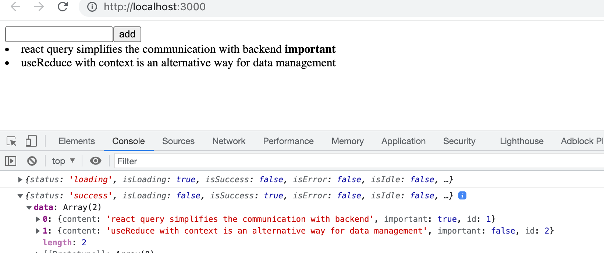
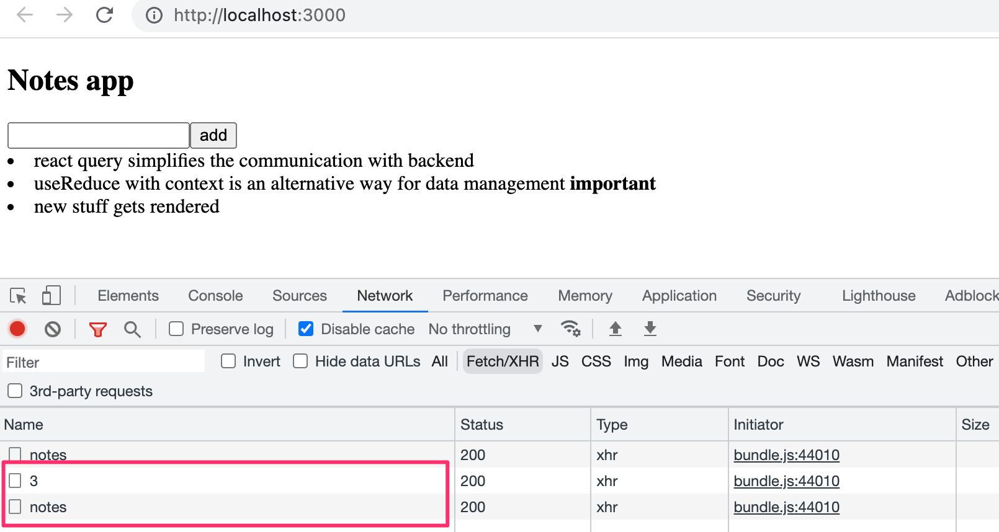
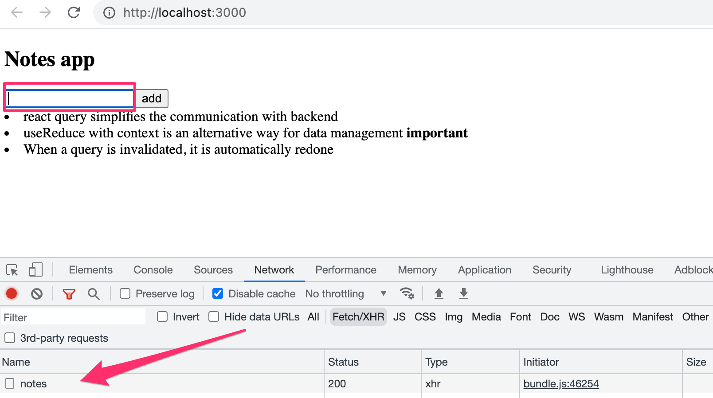
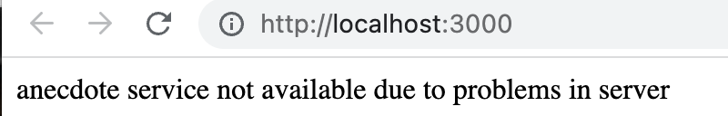
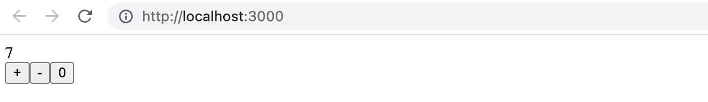
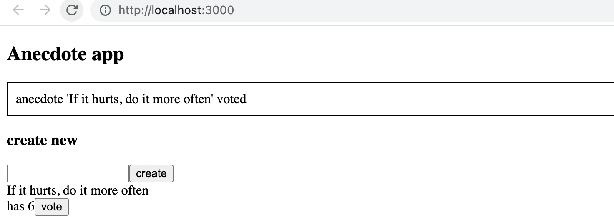
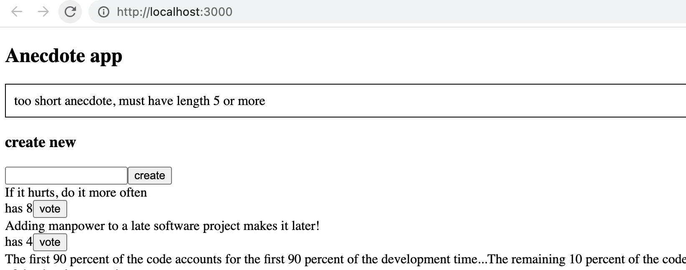
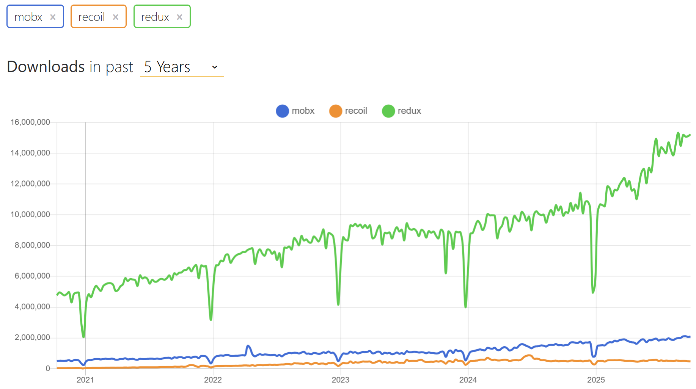

<div class="content">

Tarkastellaan osan lopussa vielä muutamaa erilaista tapaa sovelluksen tilan hallintaan.

Jatketaan muistiinpano-sovelluksen parissa. Otetaan fokukseen palvelimen kanssa tapahtuva kommunikointi. Aloitetaan sovellus puhtaalta pöydältä. Ensimmäinen versio on seuraava:

```js
const App = () => {
  const addNote = async (event) => {
    event.preventDefault()
    const content = event.target.note.value
    event.target.note.value = ''
    console.log(content)
  }

  const toggleImportance = (note) => {
    console.log('toggle importance of', note.id)
  }

  const notes = []

  return(
    <div>
      <h2>Notes app</h2>
      <form onSubmit={addNote}>
        <input name="note" />
        <button type="submit">add</button>
      </form>
      {notes.map(note =>
        <li key={note.id} onClick={() => toggleImportance(note)}>
          {note.content} 
          <strong> {note.important ? 'important' : ''}</strong>
        </li>
      )}
    </div>
  )
}

export default App
```

Alkuvaiheen koodi on GitHubissa repositorion [https://github.com/fullstack-hy2020/query-notes](https://github.com/fullstack-hy2020/query-notes/tree/part6-0) branchissa <i>part6-0</i>.

**Huom:** Oletuksena repon kloonaus antaa sinulle ainoastaan main-branchin. Kloonaa siis yllä mainittu repo käyttämällä seuraavaa komentoa, jotta saat part6-0 branchin sisällön.
```
git clone --branch part6-0 https://github.com/fullstack-hy2020/query-notes.git
```

### Palvelimella olevan datan hallinta React Query ‑kirjaston avulla

Hyödynnämme nyt [React Query](https://tanstack.com/query/latest) ‑kirjastoa palvelimelta haettavan datan säilyttämiseen ja hallinnointiin. Kirjaston uusimmasta versiosta käytetään myös nimitystä TanStack Query mutta pitäydymme vanhassa tutussa nimessä.

Asennetaan kirjasto komennolla

```bash
npm install @tanstack/react-query
```

Tiedostoon <i>main.jsx</i> tarvitaan muutama lisäys, jotta kirjaston funktiot saadaan välitettyä koko sovelluksen käyttöön:

```js
import ReactDOM from 'react-dom/client'
import { QueryClient, QueryClientProvider } from '@tanstack/react-query' // highlight-line

import App from './App'

const queryClient = new QueryClient() // highlight-line

ReactDOM.createRoot(document.getElementById('root')).render(
  <QueryClientProvider client={queryClient}> // highlight-line
    <App />
  </QueryClientProvider> // highlight-line
)
```

Voimme nyt hakea muistiinpanot komponentissa <i>App</i>. Koodi laajenee seuraavasti:

```js
import { useQuery } from '@tanstack/react-query'  // highlight-line
import axios from 'axios'  // highlight-line

const App = () => {
  // ...

   // highlight-start
  const result = useQuery({
    queryKey: ['notes'],
    queryFn: () => axios.get('http://localhost:3001/notes').then(res => res.data)
  })

  console.log(JSON.parse(JSON.stringify(result)))
  // highlight-end

  // highlight-start
  if ( result.isLoading ) {
    return <div>loading data...</div>
  }
  // highlight-end

  const notes = result.data  // highlight-line

  return (
    // ...
  )
}
```

Datan hakeminen palvelimelta tapahtuu edelleen tuttuun tapaan Axiosin <i>get</i>-metodilla. Axiosin metodikutsu on kuitenkin nyt kääritty [useQuery](https://tanstack.com/query/latest/docs/react/reference/useQuery)-funktiolla muodostetuksi [kyselyksi](https://tanstack.com/query/latest/docs/react/guides/queries). Funktiokutsun ensimmäisenä parametrina on merkkijono <i>notes</i> joka toimii [avaimena](https://tanstack.com/query/latest/docs/react/guides/query-keys) määriteltyyn kyselyyn, eli muistiinpanojen listaan.

Funktion <i>useQuery</i> paluuarvo on olio, joka kertoo kyselyn tilan. Konsoliin tehty tulostus havainnollistaa tilannetta: 



Eli ensimmäistä kertaa komponenttia renderöitäessä kysely on vielä tilassa <i>loading</i>, eli siihen liittyvä HTTP-pyyntö on kesken. Tässä vaiheessa renderöidään ainoastaan:

```
<div>loading data...</div>
```

HTTP-pyyntö kuitenkin valmistuu niin nopeasti, että tekstiä eivät edes tarkkasilmäisimmät ehdi näkemään. Kun pyyntö valmistuu, renderöidään komponentti uudelleen. Kysely on toisella renderöinnillä tilassa <i>success</i>, ja kyselyolion kenttä <i>data</i> sisältää pyynnön palauttaman datan, eli muistiinpanojen listan, joka renderöidään ruudulle.

Sovellus siis hakee datan palvelimelta ja renderöi sen ruudulle käyttämättä ollenkaan luvuissa 2-5 käytettyjä Reactin hookeja <i>useState</i> ja <i>useEffect</i>. Palvelimella oleva data on nyt kokonaisuudessaan React Query ‑kirjaston hallinnoinnin alaisuudessa, ja sovellus ei tarvitse ollenkaan Reactin <i>useState</i>-hookilla määriteltyä tilaa!

Siirretään varsinaisen HTTP-pyynnön tekevä funktio omaan tiedostoonsa <i>requests.js</i>:

```js
import axios from 'axios'

export const getNotes = () =>
  axios.get('http://localhost:3001/notes').then(res => res.data)
```

Komponentti <i>App</i> yksinkertaistuu nyt hiukan

```js
import { useQuery } from 'react-query' 
import { getNotes } from './requests' // highlight-line

const App = () => {
  // ...

  const result = useQuery({
    queryKey: ['notes'],
    queryFn: getNotes // highlight-line
  })

  // ...
}
```

Sovelluksen tämän hetken koodi on [GitHubissa](https://github.com/fullstack-hy2020/query-notes/tree/part6-1) branchissa <i>part6-1</i>.

### Datan vieminen palvelimelle React Queryn avulla

Data haetaan jo onnistuneesti palvelimelta. Huolehditaan seuraavaksi siitä, että lisätty ja muutettu data tallennetaan palvelimelle. Aloitetaan uusien muistiinpanojen lisäämisestä.

Tehdään tiedostoon <i>requests.js</i> funktio <i>createNote</i> uusien muistiinpanojen talletusta varten:

```js
import axios from 'axios'

const baseUrl = 'http://localhost:3001/notes'

export const getNotes = () =>
  axios.get(baseUrl).then(res => res.data)

export const createNote = newNote => // highlight-line
  axios.post(baseUrl, newNote).then(res => res.data) // highlight-line
```

Komponentti <i>App</i> muuttuu seuraavasti

```js
import { useQuery, useMutation } from 'react-query' // highlight-line
import { getNotes, createNote } from './requests' // highlight-line

const App = () => {
  const newNoteMutation = useMutation({ mutationFn: createNote }) // highlight-line

  const addNote = async (event) => {
    event.preventDefault()
    const content = event.target.note.value
    event.target.note.value = ''
    newNoteMutation.mutate({ content, important: true }) // highlight-line
  }

  // 

}
```

Uuden muistiinpanon luomista varten määritellään [mutaatio](https://tanstack.com/query/latest/docs/react/guides/mutations) funktion [useMutation](https://tanstack.com/query/latest/docs/react/reference/useMutatio) avulla:

```js
const newNoteMutation = useMutation({ mutationFn: createNote })
```

Parametrina on tiedostoon <i>requests.js</i> lisäämämme funktio, joka lähettää Axiosin avulla uuden muistiinpanon palvelille.

Tapahtumakäsittelijä <i>addNote</i> suorittaa mutaation kutsumalla mutaatio-olion funktiota <i>mutate</i> ja antamalla uuden muistiinpanon parametrina:

```js
newNoteMutation.mutate({ content, important: true })
```

Ratkaisumme on hyvä. Paitsi se ei toimi. Uusi muistiinpano kyllä tallettuu palvelimelle, mutta se ei päivity näytölle. 

Jotta saamme renderöityä myös uuden muistiinpanon, meidän on kerrottava React Querylle, että kyselyn, jonka avaimena on merkkijono <i>notes</i> vanha tulos tulee mitätöidä eli
[invalidoida](https://tanstack.com/query/latest/docs/react/guides/invalidations-from-mutations). 

Invalidointi on onneksi helppoa, se voidaan tehdä kytkemällä mutaatioon sopiva <i>onSuccess</i>-takaisinkutsufunktio:

```js
import { useQuery, useMutation, useQueryClient } from 'react-query' // highlight-line
import { getNotes, createNote } from './requests'

const App = () => {
  const queryClient = useQueryClient() // highlight-line

  const newNoteMutation = useMutation(createNote, {
    onSuccess: () => {  // highlight-line
      queryClient.invalidateQueries({ queryKey: ['notes'] }) // highlight-line
    },
  })

  // ...
}
```

Kun mutaatio on nyt suoritettu onnistuneesti, suoritetaan funktiokutsu

```js
queryClient.invalidateQueries('notes')
```

Tämä taas saa aikaan sen, että React Query päivittää automaattisesti kyselyn, jonka avain on  <i>notes</i> eli hakee muistiinpanot palvelimelta. Tämän seurauksena sovellus renderöi ajantasaisen palvelimella olevan tilan, eli myös lisätty muistiinpano renderöityy.

Toteutetaan vielä muistiinpanojen tärkeyden muutos. Lisätään tiedostoon <i>requests.js</i> muistiinpanojen päivityksen hoitava funktio:

```js
export const updateNote = updatedNote =>
  axios.put(`${baseUrl}/${updatedNote.id}`, updatedNote).then(res => res.data)
```

Myös muistiinpanon päivittäminen tapahtuu mutaation avulla. Komponentti <i>App</i> laajenee seuraavasti:

```js
import { useQuery, useMutation, useQueryClient } from 'react-query' 
import { getNotes, createNote, updateNote } from './requests' // highlight-line

const App = () => {
  // ...

  const updateNoteMutation = useMutation(updateNote, {
    onSuccess: () => {
      queryClient.invalidateQueries({ queryKey: ['notes'] })
    },
  })

  const toggleImportance = (note) => {
    updateNoteMutation.mutate({...note, important: !note.important })
  }

  // ...
}
```

Eli jälleen luotiin mutaatio, joka invalidoi kyselyn <i>notes</i>, jotta päivitetty muistiinpano saadaan renderöitymään oikein. Mutaation käyttö on helppoa, metodi <i>mutate</i> saa parametrikseen muistiinpanon, jonka tärkeys on vaihdettu vanhan arvon negaatioon.

Sovelluksen tämän hetken koodi on [GitHubissa](https://github.com/fullstack-hy2020/query-notes/tree/part6-2) branchissa <i>part6-2</i>.

### Suorituskyvyn optimointi

Sovellus toimii hyvin, ja koodikin on suhteellisen yksinkertaista. Erityisesti yllättää muistiinpanojen listan muutoksen toteuttamisen helppous. Esim. kun muutamme muistiinpanon tärkeyttä, riittää kyselyn <i>notes</i> invalidointi siihen, että sovelluksen data päivittyy:

```js
  const updateNoteMutation = useMutation(updateNote, {
    onSuccess: () => {
      queryClient.invalidateQueries('notes') // highlight-line
    },
  })
```

Tästä on toki seurauksena se, että sovellus tekee muistiinpanon muutoksen aiheuttavan PUT-pyynnön jälkeen uuden GET-pyynnön, jonka avulla se hakee palvelimelta kyselyn datan:



Jos sovelluksen hakema datamäärä ei ole suuri, ei asialla ole juurikaan merkitystä. Selainpuolen toiminnallisuuden kannaltahan ylimääräisen HTTP GET ‑pyynnön tekeminen ei juurikaan haittaa, mutta joissain tilanteissa se saattaa rasittaa palvelinta.

Tarvittaessa on myös mahdollista optimoida suorituskykyä [päivittämällä itse](https://tanstack.com/query/latest/docs/react/guides/updates-from-mutation-responses) React Queryn ylläpitämää kyselyn tilaa.

Muutos uuden muistiinpanon lisäävän mutaation osalta on seuraavassa:

```js
const App = () => {
  const queryClient =  useQueryClient() 

  const newNoteMutation = useMutation(createNote, {
    onSuccess: (newNote) => {
      const notes = queryClient.getQueryData('notes') // highlight-line
      queryClient.setQueryData('notes', notes.concat(newNote)) // highlight-line
    }
  })
  // ...
}
```

Eli <i>onSuccess</i>-takaisinkutsussa ensin luetaan <i>queryClient</i>-olion avulla olemassaoleva kyselyn <i>notes</i> tila ja päivitetään sitä lisäämällä mukaan uusi muistiinpano, joka saadaan takaisunkutsufunktion parametrina. Parametrin arvo on funktion <i>createNote</i> palauttama arvo, jonka määriteltiin tiedostossa <i>requests.js</i> seuraavasti:

```js
export const createNote = newNote =>
  axios.post(baseUrl, newNote).then(res => res.data)
```

Samankaltainen muutos olisi suhteellisen helppoa tehdä myös muistiinpanon tärkeyden muuttavaan mutaatioon, jätämme sen kuitenkin vapaaehtoiseksi harjoitustehtäväksi.

Jos seuraamme tarkasti selaimen network-välilehteä, huomaamme että React Query hakee kaikki muistiinpanot jo siinä vaiheessa kun viemme kursorin syötekenttään:



Mistä on kyse? Hieman [dokumentaatiota](https://tanstack.com/query/latest/docs/react/reference/useQuery)
tutkimalla huomataan, että React Queryn kyselyjen oletusarvoinen toiminnallisuus on se, että kyselyt (joiden tila on <i>stale</i>) päivitetään kun <i>window focus</i> eli sovelluksen käyttöliittymän aktiivinen elementti vaihtuu. Voimme halutessamme kytkeä toiminnallisuuden pois luomalla kyselyn seuraavasti:

```js
const App = () => {
  // ...
  const result = useQuery({
    queryKey: ['notes'],
    queryFn: getNotes,
    refetchOnWindowFocus: false // highlight-line
  })

  // ...
}
```

Konsoliin tehtävillä tulostuksilla voit tarkkailla sitä miten usein React Query aiheuttaa sovelluksen uudelleenrenderöinnin. Nyrkkisääntönä on se, että uudelleenrenderöinti tapahtuu vähintään aina kun sille on tarvetta, eli kun kyselyn tila muuttuu. Voit lukea lisää asiasta esim. [täältä](https://tkdodo.eu/blog/react-query-render-optimizations).

Sovelluksen lopullinen koodi on [GitHubissa](https://github.com/fullstack-hy2020/query-notes/tree/part6-3) branchissa <i>part6-3</i>.

React Query on monipuolinen kirjasto joka jo nyt nähdyn perusteella yksinkertaistaa sovellusta. Tekeekö React Query monimutkaisemmat tilanhallintaratkaisut kuten esim. Reduxin tarpeettomaksi? Ei. React Query voi joissain tapauksissa korvata osin sovelluksen tilan, mutta kuten [dokumentaatio](https://tanstack.com/query/latest/docs/react/guides/does-this-replace-client-state) toteaa

- React Query is a <i>server-state library</i>, responsible for managing asynchronous operations between your server and client
- Redux, etc. are <i>client-state libraries</i> that can be used to store asynchronous data, albeit inefficiently when compared to a tool like React Query

React Query on siis kirjasto, joka ylläpitää frontendissä <i>palvelimen tilaa</i>, eli toimii ikäänkuin välimuistina sille, mitä palvelimelle on talletettu. React Query yksinkertaistaa palvelimella olevan datan käsittelyä, ja voi joissain tapauksissa eliminoida tarpeen sille, että palvelimella oleva data haettaisiin frontendin tilaan. Useimmat React-sovellukset tarvitsevat palvelimella olevan datan tilapäisen tallettamisen lisäksi myös jonkun ratkaisun sille, miten frontendin muu tila (esim. lomakkeiden tai notifikaatioiden tila) käsitellään. 

</div>

<div class="tasks">

### Tehtävät 6.20.-6.22.

Tehdään nyt anekdoottisovelluksesta uusi, React Query ‑kirjastoa hyödyntävä versio. Ota lähtökohdaksesi
[täällä](https://github.com/fullstack-hy2020/query-anecdotes) oleva projekti. Projektissa on valmiina asennettuna JSON Server, jonka toimintaa on hieman modifioitu. Käynnistä palvelin komennolla <i>npm run server</i>.

#### Tehtävä 6.20

Toteuta anekdoottien hakeminen palvelimelta React Queryn avulla. 

Sovelluksen tulee toimia siten, että jos palvelimen kanssa kommunikoinnissa ilmenee ongelmia, tulee näkyviin ainoastaan virhesivu:



Löydät ohjeen virhetilanteen havaitsemiseen [täältä](https://tanstack.com/query/latest/docs/react/guides/queries). 

Voit simuloida palvelimen kanssa tapahtuvaa ongelmaa esim. sammuttamalla JSON Serverin. Huomaa, että kysely on ensin jonkin aikaa tilassa <i>isLoading</i> sillä epäonnistuessaan React Query yrittää pyyntöä muutaman kerran ennen kuin se toteaa, että pyyntö ei onnistu. Voit halutessasi määritellä, että uudelleenyrityksiä ei tehdä:

```js
const result = useQuery(
  {
    queryKey: ['anecdotes'],
    queryFn: getAnecdotes,
    retry: false
  }
)
```

tai, että pyyntöä yritetään uudelleen esim. vain kerran:

```js
const result = useQuery(
  {
    queryKey: ['anecdotes'],
    queryFn: getAnecdotes,
    retry: 1
  }
)
```

#### Tehtävä 6.21

Toteuta uusien anekdoottien lisääminen palvelimelle React Queryn avulla. Sovelluksen tulee automaattisesti renderöidä lisätty anekdootti. Huomaa, että anekdootin sisällön pitää olla vähintään 5 merkkiä pitkä, muuten palvelin ei hyväksy POST pyyntöä. Virheiden käsittelystä ei tarvitse nyt välittää.

#### Tehtävä 6.22

Toteuta anekdoottien äänestäminen hyödyntäen jälleen React Queryä. Sovelluksen tulee automaattisesti renderöidä äänestetyn anekdootin kasvatettu äänimäärä.

</div>

<div class="content">

### useReducer

Vaikka sovellus siis käyttäisi React Queryä, tarvitaan siis yleensä jonkinlainen ratkaisu selaimen muun tilan (esimerkiksi lomakkeiden) hallintaan. Melko usein <i>useState</i>:n avulla muodostettu tila on riittävä ratkaisu. Reduxin käyttö on toki mahdollista mutta on olemassa myös muita vaihtoehtoja.

Tarkastellaan yksinkertaista laskurisovellusta. Sovellus näyttää laskurin arvon, ja tarjoaa kolme nappia laskurin tilan päivittämiseen:



Toteutetaan laskurin tilan hallinta Reactin sisäänrakennetun [useReducer](https://react.dev/reference/react/useReducer)-hookin tarjoamalla Reduxin kaltaisella tilanhallintamekanismilla:


```js
import { useReducer } from 'react'

const counterReducer = (state, action) => {
  switch (action.type) {
    case "INC":
        return state + 1
    case "DEC":
        return state - 1
    case "ZERO":
        return 0
    default:
        return state
  }
}

const App = () => {
  const [counter, counterDispatch] = useReducer(counterReducer, 0)

  return (
    <div>
      <div>{counter}</div>
      <div>
        <button onClick={() => counterDispatch({ type: "INC"})}>+</button>
        <button onClick={() => counterDispatch({ type: "DEC"})}>-</button>
        <button onClick={() => counterDispatch({ type: "ZERO"})}>0</button>
      </div>
    </div>
  )
}

export default App
```

<i>useReducer</i> siis tarjoaa mekanismin, jonka avulla sovellukselle voidaan luoda tila. Parametrina tilaa luotaessa annetaan tilan muutosten hallinnan hoitava reduserifunktio, sekä tilan alkuarvo:

```js
const [counter, counterDispatch] = useReducer(counterReducer, 0)
```

Tilan muutokset hoitava reduserifunktio on täysin samanlainen Reduxin reducerien kanssa, eli funktio saa parametrikseen nykyisen tilan, sekä tilanmuutoksen tekemän actionin. Funktio palauttaa actionin tyypin ja mahdollisen sisällön perusteella päivitetyn uuden tilan:

```js
const counterReducer = (state, action) => {
  switch (action.type) {
    case "INC":
        return state + 1
    case "DEC":
        return state - 1
    case "ZERO":
        return 0
    default:
        return state
  }
}
```

Esimerkissämme actioneilla ei ole muuta kuin tyyppi. Jos actionin tyyppi on <i>INC</i>, kasvattaa se tilan arvoa yhdellä jne. Reduxin reducerien tapaan actionin mukana voi myös olla mielivaltaista dataa, joka yleensä laitetaan actionin kenttään <i>payload</i>.

Funktio <i>useReducer</i> palauttaa taulukon, jonka kautta päästään käsiksi tilan nykyiseen arvoon (taulukon ensimmäinen alkio), sekä <i>dispatch</i>-funktioon (taulukon toinen alkio), jonka avulla tilaa voidaan muuttaa:

```js
const App = () => {
  const [counter, counterDispatch] = useReducer(counterReducer, 0)  // highlight-line

  return (
    <div>
      <div>{counter}</div> // highlight-line
      <div>
        <button onClick={() => counterDispatch({ type: "INC" })}>+</button> // highlight-line
        <button onClick={() => counterDispatch({ type: "DEC" })}>-</button>
        <button onClick={() => counterDispatch({ type: "ZERO" })}>0</button>
      </div>
    </div>
  )
}
```

Tilan muutos tapahtuu siis täsmälleen kuten Reduxia käytettäessä, dispatch-funktiolle annetaan parametriksi sopiva tilaa muuttava action:

```js
counterDispatch({ type: "INC" })
```

Sovelluksen tämänhetkinen koodi on GitHubissa repositorion [https://github.com/fullstack-hy2020/hook-counter](https://github.com/fullstack-hy2020/hook-counter/tree/part6-1) branchissa <i>part6-1</i>.

### Kontekstin käyttö tilan välittämiseen

Jos haluamme jakaa sovelluksen useaan komponenttiin, on laskurin arvo sekä sen hallintaan käytettävä dispatch-funktio välitettävä myös muille komponenteille. Eräs ratkaisu olisi välittää nämä tuttuun tapaan propseina:

```js
const Display = ({ counter }) => {
  return <div>{counter}</div>
}

const Button = ({ dispatch, type, label }) => {
  return (
    <button onClick={() => dispatch({ type })}>
      {label}
    </button>
  )
}

const App = () => {
  const [counter, counterDispatch] = useReducer(counterReducer, 0)

  return (
    <div>
      <Display counter={counter}/> // highlight-line
      <div>
        // highlight-start
        <Button dispatch={counterDispatch} type='INC' label='+' />
        <Button dispatch={counterDispatch} type='DEC' label='-' />
        <Button dispatch={counterDispatch} type='ZERO' label='0' />
        // highlight-end
      </div>
    </div>
  )
}
```

Ratkaisu toimii, mutta ei ole optimaalinen. Jos komponenttirakenne monimutkaistuu, tulee esim dispatcheria välittää propsien avulla monen komponentin kautta sitä tarvitseville komponenteille siitäkin huolimatta, että komponenttipuussa välissä olevat komponentit eivät dispatcheria tarvitsisikaan. Tästä ilmiöstä käytetään nimitystä <i>prop drilling</i>. 

Reactin sisäänrakennettu [Context API](https://react.dev/learn/passing-data-deeply-with-context) tuo tilanteeseen ratkaisun. Reactin konteksti on eräänlainen sovelluksen globaali tila, johon on mahdollista antaa suora pääsy mille tahansa komponentille.

Luodaan sovellukseen nyt konteksti, joka tallettaa laskurin tilanhallinnan.

Konteksti luodaan Reactin hookilla [createContext](https://react.dev/reference/react/createContext). Luodaan konteksti tiedostoon <i>CounterContext.jsx</i>:

```js
import { createContext } from 'react'

const CounterContext = createContext()

export default CounterContext
```

Komponentti <i>App</i> voi nyt <i>tarjota</i> kontekstin sen alikomponenteille seuraavasti:

```js
import CounterContext from './CounterContext' // highlight-line

const App = () => {
  const [counter, counterDispatch] = useReducer(counterReducer, 0)

  return (
    <CounterContext.Provider value={[counter, counterDispatch]}>  // highlight-line
      <Display />
      <div>
        <Button type='INC' label='+' />
        <Button type='DEC' label='-' />
        <Button type='ZERO' label='0' />
      </div>
    </CounterContext.Provider> // highlight-line
  )
}
```

Kontekstin tarjoaminen siis tapahtuu käärimällä lapsikomponentit komponentin <i>CounterContext.Provider</i> sisälle ja asettamalla kontekstille sopiva arvo.

Kontekstin arvoksi annetaan nyt taulukko, joka sisältää laskimen arvon, sekä arvon muuttamiseen käytettävän <i>dispatch</i>-funktion.

Muut komponentit saavat nyt kontekstin käyttöön hookin [useContext](https://react.dev/reference/react/useContext) avulla:

```js
import { useContext } from 'react' // highlight-line
import CounterContext from './CounterContext'

const Display = () => {
  const [counter, dispatch] = useContext(CounterContext) // highlight-line
  return <div>
    {counter}
  </div>
}

const Button = ({ type, label }) => {
  const [counter, dispatch] = useContext(CounterContext) // highlight-line
  return (
    <button onClick={() => dispatch({ type })}>
      {label}
    </button>
  )
}
```

Komponentit saavat siis näin tietoonsa kontekstin tarjoajan siihen asettaman sisällön, joka on tällä kertaa taulukko mikä sisältää laskurin arvon, sekä laskurin tilaa muuttavan dispatch-funktion.

Sovelluksen tämänhetkinen koodi on GitHubissa repositorion [https://github.com/fullstack-hy2020/hook-counter](https://github.com/fullstack-hy2020/hook-counter/tree/part6-2) branchissa <i>part6-2</i>.

### Laskurikontekstin määrittely omassa tiedostossa

Sovelluksessamme on vielä sellainen ikävä piirre, että laskurin tilanhallinnan toiminnallisuus on määritelty osin komponentissa <i>App</i>. Siirretään nyt kaikki laskuriin liittyvä tiedostoon <i>CounterContext.jsx</i>:

```js
import { createContext, useReducer } from 'react'

const counterReducer = (state, action) => {
  switch (action.type) {
    case "INC":
        return state + 1
    case "DEC":
        return state - 1
    case "ZERO":
        return 0
    default:
        return state
  }
}

const CounterContext = createContext()

export const CounterContextProvider = (props) => {
  const [counter, counterDispatch] = useReducer(counterReducer, 0)

  return (
    <CounterContext.Provider value={[counter, counterDispatch] }>
      {props.children}
    </CounterContext.Provider>
  )
}

export default CounterContext
```

Tiedosto exporttaa nyt kontekstia vastaavan olion <i>CounterContext</i> lisäksi komponentin <i>CounterContextProvider</i> joka on käytännössä kontekstin tarjoaja (context provider), jonka arvona on laskuri ja sen tilanhallintaan käytettävä dispatcheri.

Otetaan kontekstin tarjoaja käyttöön tiedostossa <i>main.jsx</i>

```js
import ReactDOM from 'react-dom/client'
import App from './App'
import { CounterContextProvider } from './CounterContext' // highlight-line

ReactDOM.createRoot(document.getElementById('root')).render(
  <CounterContextProvider>  // highlight-line
    <App />
  </CounterContextProvider>  // highlight-line
)
```

Nyt laskurin arvon ja toiminnallisuuden määrittelevä konteksti on <i>kaikkien</i> sovelluksen komponenttien käytettävissä.

Komponentti <i>App</i> yksinkertaistuu seuraavaan muotoon:

```js
import Display from './components/Display'
import Button from './components/Button'

const App = () => {
  return (
    <div>
      <Display />
      <div>
        <Button type='INC' label='+' />
        <Button type='DEC' label='-' />
        <Button type='ZERO' label='0' />
      </div>
    </div>
  )
}

export default App
```

Kontekstia käytetään edelleen samalla tavalla, esim. komponentti <i>Button</i> on siis määritelty seuraavasti:

```js
import { useContext } from 'react'
import CounterContext from '../CounterContext'

const Button = ({ type, label }) => {
  const [counter, dispatch] = useContext(CounterContext)
  return (
    <button onClick={() => dispatch({ type })}>
      {label}
    </button>
  )
}

export default Button
```

Komponentti <i>Button</i> tarvitsee ainoastaan laskuriin liittyvää <i>dispatch</i>-funktiota, mutta se saa kontekstista funktion <i>useContext</i> avulla haltuunsa myös laskurin arvon (eli muuttujan <i>counter</i>):

```js
  const [counter, dispatch] = useContext(CounterContext)
```

Tämä ei ole suuri ongelma, mutta koodia on mahdollista muuttaa hieman miellyttävämpään ja ilmaisuvoimaisempaan suuntaan määrittelemällä tiedostoon <i>CounterContext</i> pari apufunktiota:

```js
import { createContext, useReducer, useContext } from 'react' // highlight-line

const CounterContext = createContext()

// ...

export const useCounterValue = () => {
  const counterAndDispatch = useContext(CounterContext)
  return counterAndDispatch[0]
}

export const useCounterDispatch = () => {
  const counterAndDispatch = useContext(CounterContext)
  return counterAndDispatch[1]
}

// ...
```

Näiden apufunktioiden avulla kontekstia käyttävien komponenttien on mahdollista saada haltuunsa juuri tarvitsemansa osa kontekstia. Komponentti <i>Display</i> muuttuu seuraavasti:

```js
import { useCounterValue } from '../CounterContext' // highlight-line

const Display = () => {
  const counter = useCounterValue() // highlight-line
  return <div>
    {counter}
  </div>
}


export default Display
```

Komponentti <i>Button</i> muuttuu muotoon:

```js
import { useCounterDispatch } from '../CounterContext' // highlight-line

const Button = ({ type, label }) => {
  const dispatch = useCounterDispatch() // highlight-line
  return (
    <button onClick={() => dispatch({ type })}>
      {label}
    </button>
  )
}

export default Button
```

Ratkaisu on varsin tyylikäs. Koko sovelluksen tila eli laskurin arvo ja sen hallintaan tarkoitettu koodi on nyt eristetty tiedostoon <i>CounterContext</i> joka tarjoaa komponenteille hyvin nimetyt ja helppokäyttöiset apufunktiot tilan käsittelyyn.

Sovelluksen lopullinen koodi on GitHubissa repositorion [https://github.com/fullstack-hy2020/hook-counter](https://github.com/fullstack-hy2020/hook-counter/tree/part6-3) branchissa <i>part6-3</i>.

Teknisenä yksityiskohtana todettakoon, että apufunktiot <i>useCounterValue</i> ja <i>useCounterDispatch</i> on määritelty ns. [custom hookeina](https://react.dev/learn/reusing-logic-with-custom-hooks), sillä funktion <i>useContext</i> kutsuminen [ei ole mahdollista](https://legacy.reactjs.org/docs/hooks-rules.html) muualta kuin React-komponenteista tai custom hookeista käsin. Custom hookit taas ovat JavaScript-funktioita joiden nimen pitää alkaa merkkijonolla _use_. Palaamme custom hookeihin hieman tarkemmin kurssin [osassa 7](/osa7/custom_hookit).

</div>


<div class="tasks">

### Tehtävät 6.23.-6.24.

#### Tehtävä 6.23.

Sovelluksessa on valmiina komponentti <i>Notification</i> käyttäjälle tehtävien notifikaatioiden näyttämistä varten.

Toteuta sovelluksen notifikaation tilan hallinta useReducer-hookin ja contextin avulla. Notifikaatio kertoo kun uusi anekdootti luodaan tai anekdoottia äänestetään:



Notifikaatio näytetään viiden sekunnin ajan.

#### Tehtävä 6.24.

Kuten tehtävässä 6.20 todettiin, palvelin vaatii, että lisättävän anekdootin sisällön pituus on vähintään 5 merkkiä. Toteuta nyt lisäämisen yhteyteen virheenkäsittely. Käytännössä riittää, että näytät epäonnistuneen lisäyksen yhteydessä käyttäjälle notifikaation:



Virhetilanne kannattaa käsitellä sille rekisteröidyssä takaisinkutsufunktiossa, ks 
[täältä](https://tanstack.com/query/latest/docs/react/reference/useMutation) miten rekisteröit funktion.

Tämä oli osan viimeinen tehtävä ja on aika pushata koodi GitHubiin sekä merkata tehdyt tehtävät [palautussovellukseen](https://studies.cs.helsinki.fi/stats/courses/fullstackopen).

</div>

<div class="content">

### Tilanhallintaratkaisun valinta

Luvuissa 1-5 kaikki sovelluksen tilanhallinta hoidettiin Reactin hookin <i>useState</i> avulla. Backendiin tehtävät asynkroniset kutsut edellyttivät joissain tilanteissa hookin <i>useEffect</i> käyttöä. Mitään muuta ei periaatteessa tarvita.

Hienoisena ongelmana <i>useState</i>-hookilla luotuun tilaan perustuvassa ratkaisussa on se, että jos jotain osaa sovelluksen tilasta tarvitaan useissa sovelluksen komponenteissa, tulee tila ja sen muuttamiseksi tarvittavat funktiot välittää propsien avulla kaikille tilaa käsitteleville komponenteille. Joskus propseja on välitettävä usean komponentin läpi, ja voi olla, että matkan varrella olevat komponentit eivät edes ole tilasta millään tavalla kiinnostuneita. Tästä hieman ikävästä ilmiöstä käytetään nimitystä <i>prop drilling</i>.

Aikojen saatossa React-sovellusten tilanhallintaan on kehitelty muutamiakin vaihtoehtoisia ratkaisuja, joiden avulla ongelmallisia tilanteinta (esim. prop drilling) saadaan helpotettua. Mikään ratkaisu ei kuitenkaan ole ollut "lopullinen", kaikilla on omat hyvät ja huonot puolensa, ja uusia ratkaisuja kehitellään koko ajan.

Aloittelijaa ja kokenuttakin web-kehittäjää tilanne saattaa hämmentää. Mitä ratkaisua tulisi käytää?

Yksinkertaisessa sovelluksessa <i>useState</i> on varmasti hyvä lähtökohta. Jos sovellus kommunikoi palvelimen kanssa, voi kommunikoinnin hoitaa lukujen 1-5 tapaan itse sovelluksen tilaa hyödyntäen. Viime aikoina on kuitenkin yleistynyt se, että kommunikointi ja siihen liittyvä tilanhallinta siirretään ainakin osin React Queryn (tai jonkun muun samantapaisen kirjaston) hallinnoitavaksi. Jos useState ja sen myötä aiheutuva prop drilling arveluttaa, voi kontekstin käyttö olla hyvä vaihtoehto. On myös tilanteita, joissa osa tilasta voi olla järkevää hoitaa useStaten ja osa kontekstien avulla.

Kaikkien kattavimman ja järeimmän tilanhallintaratkaisun tarjoaa Redux, joka on eräs tapa toteuttaa ns. [Flux](https://facebook.github.io/flux/)-arkkitehtuuri. Redux on hieman vanhempi kuin tässä aliosassa esitetyt ratkaisut. Reduxin jähmeys onkin ollut motivaationa monille uusille tilanhallintaratkaisuille kuten tässä osassa esittelemällemme Reactin <i>useReducer</i>:ille. Osa Reduxin jäykkyyteen kohdistuvasta kritiikistä tosin on jo vanhentunut [Redux Toolkit](https://redux-toolkit.js.org/):in ansiosta. 

Vuosien saatossa on myös kehitelty muita Reduxia vastaavia tilantahallintakirjastoja, kuten esim. uudempi tulokas [Recoil](https://recoiljs.org/) ja hieman iäkkäämpi [MobX](https://mobx.js.org/). [Npm trendsien](https://npmtrends.com/mobx-vs-recoil-vs-redux) perusteella Redux kuitenkin dominoi edelleen selvästi, ja näyttää itse asiassa vaan kasvattavan etumatkaansa:



Myöskään Reduxia ei ole pakko käyttää sovelluksessa kokonaisvaltaisesti. Saattaa olla mielekästä hoitaa esim. sovellusten lomakkeiden datan tallentaminen Reduxin ulkopuolella, erityisesti niissä tilanteissa, missä lomakkeen tila ei vaikuta muuhun sovellukseen. Myös Reduxin ja React Queryn yhteiskäyttö samassa sovellukssa on täysin mahdollista. 

Kysymys siitä mitä tilanhallintarkatkaisua tulisi käyttää ei ole ollenkaan suoraviivainen. Yhtä oikeaa vastausta on mahdotonta antaa, ja on myös todennäköistä, että valittu tilanhallintaratkaisu saattaa sovelluksen kasvaessa osoittautua siinä määrin epäoptimaaliseksi, että tilanhallinnan ratkaisuja täytyy vaihtaa vaikka sovellus olisi jo ehditty viedä tuotantokäyttöön.

</div>
