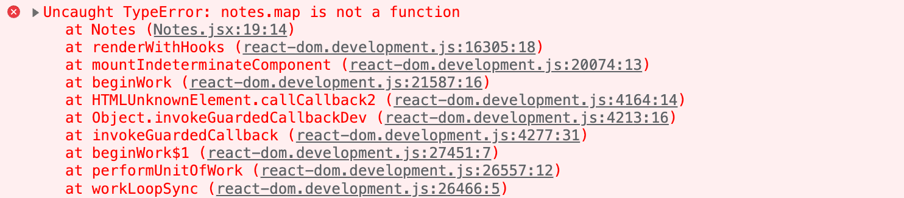

<div class="content">

Continuons notre travail avec la [version simplifiée Redux](/en/part6/flux_architecture_and_redux#redux-notes) de notre application de notes.

Pour faciliter notre développement, modifions notre reducer afin que le store soit initialisé avec un état contenant quelques notes:

```js
const initialState = [
  {
    content: 'reducer defines how redux store works',
    important: true,
    id: 1,
  },
  {
    content: 'state of store can contain any data',
    important: false,
    id: 2,
  },
]

const noteReducer = (state = initialState, action) => {
  // ...
}

// ...
export default noteReducer
```

### Store avec un état complexe

Implémentons un filtrage pour les notes affichées à l'utilisateur. L'interface utilisateur pour les filtres sera mise en oeuvre avec des [boutons radio](https://developer.mozilla.org/en-US/docs/Web/HTML/Element/input/radio):


Commençons par une mise en oeuvre très simple et directe:

```js
import NewNote from './components/NewNote'
import Notes from './components/Notes'

const App = () => {
//highlight-start
  const filterSelected = (value) => {
    console.log(value)
  }
//highlight-end

  return (
    <div>
      <NewNote />
        //highlight-start
      <div>
        all          <input type="radio" name="filter"
          onChange={() => filterSelected('ALL')} />
        important    <input type="radio" name="filter"
          onChange={() => filterSelected('IMPORTANT')} />
        nonimportant <input type="radio" name="filter"
          onChange={() => filterSelected('NONIMPORTANT')} />
      </div>
      //highlight-end
      <Notes />
    </div>
  )
}
```

Puisque l'attribut <i>name</i> de tous les boutons radio est le même, ils forment un <i>groupe de boutons</i> où une seule option peut être sélectionnée.

Les boutons ont un gestionnaire de changement qui imprime actuellement seulement la chaîne associée au bouton cliqué dans la console.

Nous décidons d'implémenter la fonctionnalité de filtre en stockant <i>la valeur du filtre</i> dans le store Redux en plus des notes elles-mêmes. L'état du store devrait ressembler à ceci après avoir effectué ces changements:

```js
{
  notes: [
    { content: 'reducer defines how redux store works', important: true, id: 1},
    { content: 'state of store can contain any data', important: false, id: 2}
  ],
  filter: 'IMPORTANT'
}
```

Dans l'implémentation actuelle de notre application, seul le tableau de notes est stocké dans l'état. Dans la nouvelle implémentation, l'objet d'état a deux propriétés, <i>notes</i> qui contient le tableau de notes et <i>filter</i> qui contient une chaîne indiquant quelles notes doivent être affichées à l'utilisateur.

### Reducers combinés

Nous pourrions modifier notre reducer actuel pour gérer la nouvelle forme de l'état. Cependant, une meilleure solution dans cette situation est de définir un nouveau reducer séparé pour l'état du filtre:

```js
const filterReducer = (state = 'ALL', action) => {
  switch (action.type) {
    case 'SET_FILTER':
      return action.payload
    default:
      return state
  }
}
```

Les actions pour changer l'état du filtre ressemblent à ceci:

```js
{
  type: 'SET_FILTER',
  payload: 'IMPORTANT'
}
```

Créons également une nouvelle fonction de _créateur d'action_. Nous écrirons le code pour le créateur d'action dans un nouveau module <i>src/reducers/filterReducer.js</i>:

```js
const filterReducer = (state = 'ALL', action) => {
  // ...
}

export const filterChange = filter => {
  return {
    type: 'SET_FILTER',
    payload: filter,
  }
}

export default filterReducer
```

Nous pouvons créer le reducer actuel pour notre application en combinant les deux reducers existants avec la fonction [combineReducers](https://redux.js.org/api/combinereducers).

Définissons le reducer combiné dans le fichier <i>main.jsx</i>:

```js
import React from 'react'
import ReactDOM from 'react-dom/client'
import { createStore, combineReducers } from 'redux' // highlight-line
import { Provider } from 'react-redux' 
import App from './App'

import noteReducer from './reducers/noteReducer'
import filterReducer from './reducers/filterReducer' // highlight-line

 // highlight-start
const reducer = combineReducers({
  notes: noteReducer,
  filter: filterReducer
})
 // highlight-end

const store = createStore(reducer) // highlight-line

console.log(store.getState())

/*
ReactDOM.createRoot(document.getElementById('root')).render(
  <Provider store={store}>
    <App />
  </Provider>
)*/

ReactDOM.createRoot(document.getElementById('root')).render(
  <Provider store={store}>
    <div />
  </Provider>
)
```

Puisque notre application se casse complètement à ce point, nous rendons un élément <i>div</i> vide au lieu du composant <i>App</i>.

L'état du store est imprimé dans la console:

[console devtools montrant les données du tableau de notes](../../images/6/4e.png)

Comme nous pouvons le voir dans la sortie, le store a exactement la forme que nous voulions!

Examinons de plus près comment le reducer combiné est créé:

```js
const reducer = combineReducers({
  notes: noteReducer,
  filter: filterReducer,
})
```

L'état du store défini par le reducer ci-dessus est un objet avec deux propriétés: <i>notes</i> et <i>filter</i>. La valeur de la propriété <i>notes</i> est définie par le <i>noteReducer</i>, qui n'a pas à gérer les autres propriétés de l'état. De même, la propriété <i>filter</i> est gérée par le <i>filterReducer</i>.

Avant de faire plus de changements dans le code, examinons comment différentes actions changent l'état du store défini par le reducer combiné. Ajoutons ce qui suit au fichier <i>main.jsx</i>:

```js
import { createNote } from './reducers/noteReducer'
import { filterChange } from './reducers/filterReducer'
//...
store.subscribe(() => console.log(store.getState()))
store.dispatch(filterChange('IMPORTANT'))
store.dispatch(createNote('combineReducers forms one reducer from many simple reducers'))
```

En simulant la création d'une note et en changeant l'état du filtre de cette manière, l'état du store est enregistré dans la console après chaque changement effectué dans le store:


À ce stade, il est bon de prendre conscience d'un petit mais important détail. Si nous ajoutons une instruction de log console <i>au début des deux reducers</i>:

```js
const filterReducer = (state = 'ALL', action) => {
  console.log('ACTION: ', action)
  // ...
}
```

D'après la sortie console, on pourrait avoir l'impression que chaque action est dupliquée:


Y a-t-il un bug dans notre code ? Non. Le reducer combiné fonctionne de telle manière que chaque <i>action</i> est gérée dans <i>chaque</i> partie du reducer combiné. Typiquement, un seul reducer est intéressé par une action donnée, mais il y a des situations où plusieurs reducers changent leurs parties respectives de l'état basées sur la même action.

### Finaliser les filtres

Terminons l'application de sorte qu'elle utilise le reducer combiné. Nous commençons par changer le rendu de l'application et en connectant le store à l'application dans le fichier <i>main.jsx</i>:

```js
ReactDOM.createRoot(document.getElementById('root')).render(
  <Provider store={store}>
    <App />
  </Provider>
)
```

Ensuite, corrigeons un bug causé par le code qui s'attend à ce que le store de l'application soit un tableau de notes:



C'est une correction facile. Étant donné que les notes se trouvent dans le champ <i>notes</i> du store, nous devons juste apporter un petit changement à la fonction de sélection:

```js
const Notes = () => {
  const dispatch = useDispatch()
  const notes = useSelector(state => state.notes) // highlight-line

  return(
    <ul>
      {notes.map(note =>
        <Note
          key={note.id}
          note={note}
          handleClick={() => 
            dispatch(toggleImportanceOf(note.id))
          }
        />
      )}
    </ul>
  )
}
```

Auparavant, la fonction sélecteur retournait l'intégralité de l'état du store:

```js
const notes = useSelector(state => state)
```

Et maintenant, elle retourne seulement son champ <i>notes</i>

```js
const notes = useSelector(state => state.notes)
```

Extrayons le filtre de visibilité dans son propre composant <i>src/components/VisibilityFilter.jsx</i>:

```js
import { filterChange } from '../reducers/filterReducer'
import { useDispatch } from 'react-redux'

const VisibilityFilter = (props) => {
  const dispatch = useDispatch()

  return (
    <div>
      all    
      <input 
        type="radio" 
        name="filter" 
        onChange={() => dispatch(filterChange('ALL'))}
      />
      important   
      <input
        type="radio"
        name="filter"
        onChange={() => dispatch(filterChange('IMPORTANT'))}
      />
      nonimportant 
      <input
        type="radio"
        name="filter"
        onChange={() => dispatch(filterChange('NONIMPORTANT'))}
      />
    </div>
  )
}

export default VisibilityFilter
```

Avec le nouveau composant <i>App</i> peut être simplifié comme suit:

```js
import Notes from './components/Notes'
import NewNote from './components/NewNote'
import VisibilityFilter from './components/VisibilityFilter'

const App = () => {
  return (
    <div>
      <NewNote />
      <VisibilityFilter />
      <Notes />
    </div>
  )
}

export default App
```

L'implémentation est plutôt simple. Cliquer sur les différents boutons radio change l'état de la propriété <i>filter</i> du store.

Changeons le composant <i>Notes</i> pour incorporer le filtre:

```js
const Notes = () => {
  const dispatch = useDispatch()
  // highlight-start
  const notes = useSelector(state => {
    if ( state.filter === 'ALL' ) {
      return state.notes
    }
    return state.filter  === 'IMPORTANT' 
      ? state.notes.filter(note => note.important)
      : state.notes.filter(note => !note.important)
  })
  // highlight-end

  return(
    <ul>
      {notes.map(note =>
        <Note
          key={note.id}
          note={note}
          handleClick={() => 
            dispatch(toggleImportanceOf(note.id))
          }
        />
      )}
    </ul>
  )
```

Nous ne faisons des modifications qu'à la fonction sélectrice, qui était auparavant

```js
useSelector(state => state.notes)
```

Let's simplify the selector by destructuring the fields from the state it receives as a parameter:

```js
const notes = useSelector(({ filter, notes }) => {
  if ( filter === 'ALL' ) {
    return notes
  }
  return filter  === 'IMPORTANT' 
    ? notes.filter(note => note.important)
    : notes.filter(note => !note.important)
})
```

Il y a un léger défaut cosmétique dans notre application. Même si le filtre est réglé sur <i>ALL</i> par défaut, le bouton radio associé n'est pas sélectionné. Naturellement, ce problème peut être résolu, mais puisqu'il s'agit d'un bug désagréable mais finalement inoffensif, nous allons reporter la correction à plus tard.

La version actuelle de l'application peut être trouvée sur [GitHub](https://github.com/fullstack-hy2020/redux-notes/tree/part6-2), branche <i>part6-2</i>.

</div>

<div class="tasks">

### Exercice 6.9

#### 6.9 Meilleures anecdotes, étape 7

Implémentez un filtrage pour les anecdotes qui sont affichées à l'utilisateur.


Stockez l'état du filtre dans le store redux. Il est recommandé de créer un nouveau reducer, des créateurs d'actions, et un reducer combiné pour le store en utilisant la fonction <i>combineReducers</i>.

Créez un nouveau composant <i>Filter</i> pour afficher le filtre. Vous pouvez utiliser le code suivant comme modèle pour le composant:

```js
const Filter = () => {
  const handleChange = (event) => {
    // input-field value is in variable event.target.value
  }
  const style = {
    marginBottom: 10
  }

  return (
    <div style={style}>
      filter <input onChange={handleChange} />
    </div>
  )
}

export default Filter
```

</div>

<div class="content">

### Redux Toolkit

Comme nous l'avons vu jusqu'à présent, la configuration de Redux et la mise en oeuvre de la gestion de l'état nécessitent pas mal d'efforts. Cela se manifeste, par exemple, dans le code lié aux reducers et aux créateurs d'actions, qui comprend un code modèle (boilerplate) quelque peu répétitif. [Redux Toolkit](https://redux-toolkit.js.org/) est une bibliothèque qui résout ces problèmes communs liés à Redux. La bibliothèque simplifie grandement, par exemple, la configuration du store Redux et offre une grande variété d'outils pour faciliter la gestion de l'état.

Commençons à utiliser Redux Toolkit dans notre application en refactorisant le code existant. Tout d'abord, nous devrons installer la bibliothèque:

```bash
npm install @reduxjs/toolkit
```

Ensuite, ouvrez le fichier <i>main.jsx</i> qui crée actuellement le store Redux. Au lieu de la fonction <em>createStore</em> de Redux, créons le store en utilisant la fonction [configureStore](https://redux-toolkit.js.org/api/configureStore) de Redux Toolkit:

```js
import React from 'react'
import ReactDOM from 'react-dom/client'
import { Provider } from 'react-redux'
import { configureStore } from '@reduxjs/toolkit' // highlight-line
import App from './App'

import noteReducer from './reducers/noteReducer'
import filterReducer from './reducers/filterReducer'

 // highlight-start
const store = configureStore({
  reducer: {
    notes: noteReducer,
    filter: filterReducer
  }
})
// highlight-end

console.log(store.getState())

ReactDOM.createRoot(document.getElementById('root')).render(
  <Provider store={store}>
    <App />
  </Provider>
)
```

Nous avons déjà éliminé quelques lignes de code maintenant que nous n'avons pas besoin de la fonction <em>combineReducers</em> pour créer le reducer pour le store. Nous verrons bientôt que la fonction <em>configureStore</em> offre de nombreux avantages supplémentaires, tels que l'intégration sans effort d'outils de développement et de nombreuses bibliothèques couramment utilisées sans avoir besoin de configuration supplémentaire.

Passons à la refonte des reducers, ce qui met en avant les avantages de Redux Toolkit. Avec Redux Toolkit, nous pouvons facilement créer des reducers et des créateurs d'actions associés en utilisant la fonction [createSlice](https://redux-toolkit.js.org/api/createSlice) . Nous pouvons utiliser la fonction <em>createSlice</em> pour refondre le reducer et les créateurs d'actions dans le fichier <i>reducers/noteReducer.js</i> de la manière suivante:

```js
import { createSlice } from '@reduxjs/toolkit' // highlight-line

const initialState = [
  {
    content: 'reducer defines how redux store works',
    important: true,
    id: 1,
  },
  {
    content: 'state of store can contain any data',
    important: false,
    id: 2,
  },
]

const generateId = () =>
  Number((Math.random() * 1000000).toFixed(0))

// highlight-start
const noteSlice = createSlice({
  name: 'notes',
  initialState,
  reducers: {
    createNote(state, action) {
      const content = action.payload

      state.push({
        content,
        important: false,
        id: generateId(),
      })
    },
    toggleImportanceOf(state, action) {
      const id = action.payload

      const noteToChange = state.find(n => n.id === id)

      const changedNote = { 
        ...noteToChange, 
        important: !noteToChange.important 
      }

      return state.map(note =>
        note.id !== id ? note : changedNote 
      )     
    }
  },
})
// highlight-end
```

La fonction <em>createSlice</em> utilise le paramètre <em>name</em> pour définir le préfixe utilisé dans les valeurs de type des actions. Par exemple, l'action <em>createNote</em> définie plus tard aura une valeur de type <em>notes/createNote</em>. Il est de bonne pratique de donner à ce paramètre une valeur qui est unique parmi les reducers. De cette façon, il n'y aura pas de collisions inattendues entre les valeurs de type d'action de l'application. Le paramètre <em>initialState</em> définit l'état initial du reducer. Le paramètre <em>reducers</em> prend le reducer lui-même comme un objet, dont les fonctions gèrent les changements d'état provoqués par certaines actions. Notez que l'<em>action.payload</em> dans la fonction contient l'argument fourni en appelant le créateur d'action:

```js
dispatch(createNote('Redux Toolkit is awesome!'))
```

Cet appel de dispatch réagit à la diffusion de l'objet suivant:

```js
dispatch({ type: 'notes/createNote', payload: 'Redux Toolkit is awesome!' })
```

Si vous avez suivi attentivement, vous avez peut-être remarqué que, à l'intérieur de l'action <em>createNote</em>, il semble se produire quelque chose qui enfreint le principe d'immutabilité des reducers mentionné précédemment:

```js
createNote(state, action) {
  const content = action.payload

  state.push({
    content,
    important: false,
    id: generateId(),
  })
}
```

Nous modifions le tableau de l'argument <em>state</em> en appelant la méthode <em>push</em> au lieu de retourner une nouvelle instance du tableau. De quoi s'agit-il?

Redux Toolkit utilise la bibliothèque [Immer](https://immerjs.github.io/immer/) avec les reducers créés par la fonction <em>createSlice</em>, ce qui rend possible la mutation de l'argument <em>state</em> à l'intérieur du reducer. Immer utilise l'état muté pour produire un nouvel état immuable et ainsi les changements d'état restent immuables. Notez que l'<em>state</em> peut être changé sans être "muté", comme nous l'avons fait avec l'action <em>toggleImportanceOf</em>. Dans ce cas, la fonction <i>retourne</i> le nouvel état. Néanmoins, muter l'état sera souvent pratique, en particulier lorsqu'un état complexe doit être mis à jour.

La fonction <em>createSlice</em> retourne un objet contenant le reducer ainsi que les créateurs d'actions définis par le paramètre <em>reducers</em>. Le reducer peut être accédé par la propriété <em>noteSlice.reducer</em>, tandis que les créateurs d'actions par la propriété <em>noteSlice.actions</em>. Nous pouvons produire les exports du fichier de la manière suivante:

```js
const noteSlice = createSlice(/* ... */)

// highlight-start
export const { createNote, toggleImportanceOf } = noteSlice.actions

export default noteSlice.reducer
// highlight-end
```

Les importations dans d'autres fichiers fonctionneront exactement comme avant:

```js
import noteReducer, { createNote, toggleImportanceOf } from './reducers/noteReducer'
```

Nous devons modifier les noms des types d'action dans les tests en raison des conventions de Redux Toolkit:

```js
import noteReducer from './noteReducer'
import deepFreeze from 'deep-freeze'

describe('noteReducer', () => {
  test('returns new state with action notes/createNote', () => {
    const state = []
    const action = {
      type: 'notes/createNote', // highlight-line
      payload: 'the app state is in redux store', // highlight-line
    }

    deepFreeze(state)
    const newState = noteReducer(state, action)

    expect(newState).toHaveLength(1)
    expect(newState.map(s => s.content)).toContainEqual(action.payload)
  })

  test('returns new state with action notes/toggleImportanceOf', () => {
    const state = [
      {
        content: 'the app state is in redux store',
        important: true,
        id: 1
      },
      {
        content: 'state changes are made with actions',
        important: false,
        id: 2
      }]
  
    const action = {
      type: 'notes/toggleImportanceOf', // highlight-line
      payload: 2
    }
  
    deepFreeze(state)
    const newState = noteReducer(state, action)
  
    expect(newState).toHaveLength(2)
  
    expect(newState).toContainEqual(state[0])
  
    expect(newState).toContainEqual({
      content: 'state changes are made with actions',
      important: true,
      id: 2
    })
  })
})
```

### Redux Toolkit et console.log

Comme nous l'avons appris, console.log est un outil extrêmement puissant; il nous sauve souvent des ennuis.

Essayons d'imprimer l'état du Store Redux dans la console au milieu du reducer créé avec la fonction createSlice:

```js
const noteSlice = createSlice({
  name: 'notes',
  initialState,
  reducers: {
    // ...
    toggleImportanceOf(state, action) {
      const id = action.payload

      const noteToChange = state.find(n => n.id === id)

      const changedNote = { 
        ...noteToChange, 
        important: !noteToChange.important 
      }

      console.log(state) // highlight-line

      return state.map(note =>
        note.id !== id ? note : changedNote 
      )     
    }
  },
})
```

Ce qui suit est imprimé dans la console


La sortie est intéressante mais pas très utile. Cela concerne la bibliothèque Immer mentionnée précédemment utilisée par Redux Toolkit, qui est maintenant utilisée en interne pour sauvegarder l'état du Store.

Le statut peut être converti en un format lisible par l'homme, par exemple en le convertissant en chaîne de caractères puis de nouveau en objet JavaScript comme suit:

```js
console.log(JSON.parse(JSON.stringify(state))) // highlight-line
```

La sortie de la console est maintenant lisible par l'humain


### Redux DevTools

[Redux DevTools](https://chrome.google.com/webstore/detail/redux-devtools/lmhkpmbekcpmknklioeibfkpmmfibljd) est une extension Chrome qui offre des outils de développement utiles pour Redux. Elle peut être utilisée, par exemple, pour inspecter l'état du store Redux et dispatcher des actions via la console du navigateur. Lorsque le store est créé en utilisant la fonction <em>configureStore</em> de Redux Toolkit, aucune configuration supplémentaire n'est nécessaire pour que Redux DevTools fonctionne.

Une fois l'extension installée, cliquer sur l'onglet <i>Redux</i> dans la console du navigateur devrait ouvrir les outils de développement:

[navigateur avec l'addon redux dans devtools](../../images/6/42new.png)

Vous pouvez inspecter comment le dispatching d'une action spécifique change l'état en cliquant sur l'action:


Il est également possible de dispatcher des actions vers le store en utilisant les outils de développement:


Vous pouvez trouver le code de notre application actuelle dans son intégralité dans la branche <i>part6-3</i> de ce [dépôt GitHub](https://github.com/fullstack-hy2020/redux-notes/tree/part6-3).

</div>

<div class="tasks">

### Exercices 6.10.-6.13.

Continuons à travailler sur l'application d'anecdotes utilisant Redux que nous avons commencée à l'exercice 6.3.

#### 6.10 Meilleures anecdotes, étape 8

Installez Redux Toolkit pour le projet. Déplacez la création du store Redux dans le fichier <i>store.js</i> et utilisez la fonction <em>configureStore</em> de Redux Toolkit pour créer le store.

Changez la définition du <i>reducer de filtre et des créateurs d'actions</i> pour utiliser la fonction <em>createSlice</em> de Redux Toolkit.

Commencez également à utiliser Redux DevTools pour déboguer plus facilement l'état de l'application.

#### 6.11 Meilleures anecdotes, étape 9

Changez également la définition du <i>reducer d'anecdotes et des créateurs d'actions</i> pour utiliser la fonction <em>createSlice</em> de Redux Toolkit.

#### 6.12 Meilleures anecdotes, étape 10

L'application a un corps prêt à l'emploi pour le composant <i>Notification</i>:

```js
const Notification = () => {
  const style = {
    border: 'solid',
    padding: 10,
    borderWidth: 1
  }
  return (
    <div style={style}>
      render here notification...
    </div>
  )
}

export default Notification
```

Étendez le composant pour qu'il affiche le message stocké dans le store Redux, de manière à ce que le composant prenne la forme suivante:

```js
import { useSelector } from 'react-redux' // highlight-line

const Notification = () => {
  const notification = useSelector(/* something here */) // highlight-line
  const style = {
    border: 'solid',
    padding: 10,
    borderWidth: 1
  }
  return (
    <div style={style}>
      {notification} // highlight-line
    </div>
  )
}
```

Vous devrez apporter des modifications au reducer existant de l'application. Créez un reducer séparé pour la nouvelle fonctionnalité en utilisant la fonction <em>createSlice</em> de Redux Toolkit.

À ce stade des exercices, il n'est pas nécessaire que l'application utilise le composant <i>Notification</i> de manière intelligente. Il suffit que l'application affiche la valeur initiale définie pour le message dans le <i>notificationReducer</i>.

#### 6.13 Better anecdotes, step11

Étendez l'application pour qu'elle utilise le composant <i>Notification</i> afin d'afficher un message pendant cinq secondes lorsque l'utilisateur vote pour une anecdote ou crée une nouvelle anecdote:


Il est recommandé de créer des [créateurs d'actions](https://redux-toolkit.js.org/api/createSlice#reducers) séparés pour définir et supprimer les notifications.

</div>