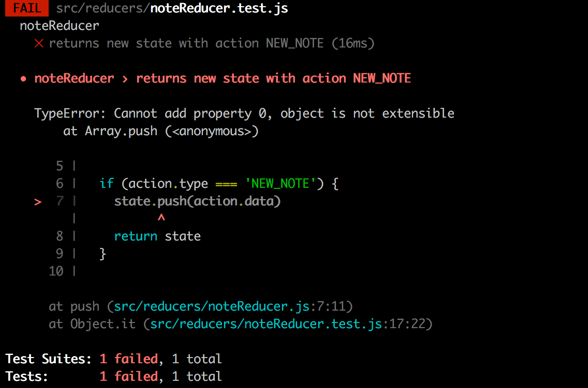
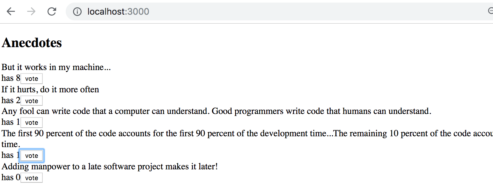

<div class="content">

<!-- So far, we have followed the state management conventions recommended by React. We have placed the state and the methods for handling it in to [the root component](https://reactjs.org/docs/lifting-state-up.html) of the application. The state and its handler methods have then been passed to other components with props. This works up to a certain point, but when applications grow larger, state management becomes challenging. -->

到目前为止，我们已经遵循了 React 推荐的状态管理约定。 我们已经将状态和处理它的方法放置到应用程序的[根组件](https://reactjs.org/docs/lifting-state-up.html) 中。 然后，状态及其处理程序方法通过属性传递给其他组件。 这在一定程度上是可行的，但是当应用程序变得更大时，状态管理就变得极具挑战性。

### Flux-architecture
【Flux-架构】

<!-- Facebook developed the [Flux](https://facebook.github.io/flux/docs/in-depth-overview/)- architecture to make state management easier. In Flux, the state is separated completely from the React-components into its own <i>stores</i>. -->
<!-- State in the store is not changed directly, but with different <i>actions</i>. -->

Facebook 开发了 [Flux](https://facebook.github.io/flux/docs/in-depth-overview/) 架构，使状态管理更加容易。 在 Flux 中，状态完全从 React-components 分离到自己的存储中。 存储中的状态不会直接更改，而是使用不同的 <i>actions</i>进行更改。 

<!-- When an action changes the state of the store, the views are rerendered: -->
当一个操作改变了存储的状态时，视图会被重新渲染:


<!-- If some action on the application, for example pushing a button, causes the need to change the state, the change is made with an action. -->
<!-- This causes rerendering the view again: -->
如果应用程序上的某个 Action(例如按下按钮)导致状态更改，则会通过一个 action 进行更改。 这将导致再次重新渲染视图:


<!-- Flux offers a standard way for how and where the application's state is kept and how it is modified. -->
Flux 提供了一种标准的方式来保存应用程序的状态以及如何修改它。 

### Redux

<!-- Facebook has an implementation for Flux, but we will be using the [Redux](https://redux.js.org) - library. It works with the same principle, but is a bit simpler. Facebook also uses Redux now instead of their original Flux. -->
Facebook 有一个 Flux 的实现，但是我们会使用 Redux 库。 它使用相同的原理，但是更简单一些。 Facebook 现在也使用 Redux 而不是原来的 Flux。 

<!-- We will get to know Redux by implementing a counter application yet again: -->
我们将通过再次实现一个计数器应用程序来了解 Redux:


<!-- Create a new create-react-app-application and install </i>redux</i> with the command -->
创建一个新的 create-react-app 应用 使用以下命令安装 redux

```bash
npm install redux
```

<!-- As in Flux, in Redux the state is also stored in a [store](https://redux.js.org/tutorials/fundamentals/part-4-store). -->
正如在 Flux 中一样，在 Redux 中，状态也存储在[store](https://redux.js.org/tutorials/fundamentals/part-4-store)中。

<!-- The whole state of the application is stored into <i>one</i> JavaScript-object in the store. Because our application only needs the value of the counter, we will save it straight to the store. If the state was more complicated, different things in the state would be saved as separate fields of the object. -->

应用程序的整个状态存储在 store 中的一个 javascript 对象中。 因为我们的应用程序只需要计数器的值，所以我们将它直接保存到存储中。 如果状态更复杂，那么状态中的不同内容将被保存为对象的不同字段

<!-- The state of the store is changed with [actions](https://redux.js.org/tutorials/fundamentals/part-3-state-actions-reducers#designing-actions). Actions are objects, which have at least a field determining the <i>type</i> of the action. -->
<!-- Our application needs for example the following action: -->

存储的状态通过 [actions](https://redux.js.org/tutorials/fundamentals/part-3-state-actions-reducers#designing-actions)改变。 Action 是对象，它至少有一个字段确定操作的类型。 例如，我们的应用程序需要以下操作:

```js
{
  type: 'INCREMENT'
}
```

<!-- If there is data involved with the action, other fields can be declared as needed. However, our counting app is so simple that the actions are fine with just the type field. -->

如果操作涉及数据，则可以根据需要声明其他字段。 然而，我们的计数应用程序很简单，只需要类型字段就可以了。

<!-- The impact of the action to the state of the application is defined using a [reducer](https://redux.js.org/tutorials/fundamentals/part-3-state-actions-reducers#writing-reducers). In practice, a reducer is a function which is given the current state and an action as parameters. It <i>returns</i> a new state. -->
Action 对应用程序状态的影响是通过使用一个 [reducer](https://redux.js.org/tutorials/fundamentals/part-3-state-actions-reducers#writing-reducers) 来定义的。 实际上，reducer 是一个函数，它以当前状态和 action 为参数。 它返回一个新的状态。 

<!-- Let's now define a reducer for our application: -->
现在让我们为我们的应用程序定义一个 reducer:

```js
const counterReducer = (state, action) => {
  if (action.type === 'INCREMENT') {
    return state + 1
  } else if (action.type === 'DECREMENT') {
    return state - 1
  } else if (action.type === 'ZERO') {
    return 0
  }

  return state
}
```

<!-- The first parameter is the <i>state</i> in the store. Reducer returns a <i>new state</i> based on the actions type. -->
第一个参数是 store 中的 state。 Reducer 返回一个基于 action 类型的新状态。

<!-- Let's change the code a bit. It is customary to use the [switch](https://developer.mozilla.org/en-US/docs/Web/JavaScript/Reference/Statements/switch) -command instead of ifs in a reducer. -->
让我们稍微修改一下代码。 在 reducer 中通常使用 [switch](https://developer.mozilla.org/en-US/docs/Web/JavaScript/Reference/Statements/switch)命令而不是 ifs。

<!-- Let's also define a [default value](https://developer.mozilla.org/en-US/docs/Web/JavaScript/Reference/Functions/Default_parameters) of 0 for the parameter <i>state</i>. Now the reducer works even if the store -state has not been primed yet. -->
我们还可以为参数状态定义一个默认值[default value](https://developer.mozilla.org/en-US/docs/Web/JavaScript/Reference/Functions/Default_parameters) 0。 现在 reducer 可以工作了，即使store-state尚未被载入。

```js
const counterReducer = (state = 0, action) => {
  switch (action.type) {
    case 'INCREMENT':
      return state + 1
    case 'DECREMENT':
      return state - 1
    case 'ZERO':
      return 0
    default: // if none of the above matches, code comes here
    return state
  }
}
```

<!-- Reducer is never supposed to be called directly from the application's code. Reducer is only given as a parameter to the _createStore_-function which creates the store: -->
Reducer 不应该直接从应用程序中调用。 Reducer 只作为创建store，即 _createStore_ 的一个参数给出: 

```js
import { createStore } from 'redux'

const counterReducer = (state = 0, action) => {
  // ...
}

const store = createStore(counterReducer)
```

<!-- The store now uses the reducer to handle <i>actions</i>, which are <i>dispatched</i> or 'sent' to the store with its [dispatch](https://redux.js.org/api-reference/store#dispatch-action)-method. -->
store 现在使用 reducer 来处理<i>actions</i>，这些action通过 [dispatch](https://redux.js.org/api-reference/store#dispatch-action)-方法 被分派或“发送”到 store 中。 

```js
store.dispatch({type: 'INCREMENT'})
```


<!-- You can find out the state of the store using the method [getState](https://redux.js.org/api/store#getstate). -->
您可以使用方法[getState](https://redux.js.org/api/store#getState)查找存储的状态。


<!-- For example the following code: -->
例如下面的代码:

```js
const store = createStore(counterReducer)
console.log(store.getState())
store.dispatch({type: 'INCREMENT'})
store.dispatch({type: 'INCREMENT'})
store.dispatch({type: 'INCREMENT'})
console.log(store.getState())
store.dispatch({type: 'ZERO'})
store.dispatch({type: 'DECREMENT'})
console.log(store.getState())
```

<!-- would print the following to the console -->
会在控制台上打印以下内容

<pre>
0
3
-1
</pre>
<!-- because at first the state of the store is 0. After three <i>INCREMENT</i>-actions the state is 3. In the end, after <i>ZERO</i> and <i>DECREMENT</i> actions, the state is -1. -->
因为一开始 store 的状态是 0。 在三个 INCREMENT-actions 之后，状态是 3。 最后，在 ZERO 和 DECREMENT 操作之后，状态是 -1。

<!-- The third important method the store has is [subscribe](https://redux.js.org/api/store#subscribelistener), which is used to create recall functions the store calls when its state is changed.  -->
store拥有的第三个重要方法是[订阅](https://redux.js.org/api/store#subscribelistener) ，它用于在store状态改变时创建调用的回调函数。 

<!-- If, for example, we would add the following function to subscribe, <i>every change in the store</i> would be printed to the console. -->
例如，如果我们要添加以下函数来订阅，那么存储中的每次更改都将被打印到控制台。

```js
store.subscribe(() => {
  const storeNow = store.getState()
  console.log(storeNow)
})
```

<!-- so the code -->
所以代码为

```js
const store = createStore(counterReducer)

store.subscribe(() => {
  const storeNow = store.getState()
  console.log(storeNow)
})

store.dispatch({ type: 'INCREMENT' })
store.dispatch({ type: 'INCREMENT' })
store.dispatch({ type: 'INCREMENT' })
store.dispatch({ type: 'ZERO' })
store.dispatch({ type: 'DECREMENT' })
```

<!-- would cause the following to be printed -->
会导致以下内容被打印出来

<pre>
1
2
3
0
-1
</pre>
<!-- The code of our counter application is the following. All of the code has been written in the same file, so <i>store</i> is straight available for the React-code. We will get to know better ways to structure React/Redux-code later. -->
我们的计数器应用代码如下。 所有代码都是在同一个文件中编写的，因此 React-代码的 store 是直接可用的。 稍后我们将了解构造 redux 代码的更好方法。

```js
import React from 'react'
import ReactDOM from 'react-dom'
import { createStore } from 'redux'

const counterReducer = (state = 0, action) => {
  switch (action.type) {
    case 'INCREMENT':
      return state + 1
    case 'DECREMENT':
      return state - 1
    case 'ZERO':
      return 0
    default:
      return state
  }
}

const store = createStore(counterReducer)

const App = () => {
  return (
    <div>
      <div>
        {store.getState()}
      </div>
      <button 
        onClick={e => store.dispatch({ type: 'INCREMENT' })}
      >
        plus
      </button>
      <button
        onClick={e => store.dispatch({ type: 'DECREMENT' })}
      >
        minus
      </button>
      <button 
        onClick={e => store.dispatch({ type: 'ZERO' })}
      >
        zero
      </button>
    </div>
  )
}

const renderApp = () => {
  ReactDOM.render(<App />, document.getElementById('root'))
}

renderApp()
store.subscribe(renderApp)
```

<!-- There are a few notable things in the code. -->
<!--<i>App</i> renders the value of the counter by asking it from the store with the method _store.getState()_. The actionhandlers of the buttons <i>dispatch</i> the right actions to the store.-->
代码中有一些值得注意的东西。 App 使用 _store.getState()_ 方法从 store 中请求计数器，从而渲染计数器的值。 按钮的action处理程序将正确的 action 分发到 store。

<!-- When the state in the store is changed, React is not able to automatically rerender the application. Thus we have registered a function _renderApp_, which renders the whole app, to listen for changes in the store with the _store.subscribe_ method. Note that we have to immediately call the _renderApp_ method. Without the call the first rendering of the app would never happen. -->
当 store 中的状态发生更改时，React 无法自动重新运行应用程序。 因此，我们注册了一个函数 _renderApp_，它呈现整个应用程序，用 store.subscribe 方法监听 store 中的更改。 注意，我们必须立即调用 _renderApp_ 方法。 没有这个调用，应用程序的第一次渲染将永远不会发生。

### Redux-notes

<!-- Our aim is to modify our note application to use Redux for state management. However, let's first cover a few key concepts through a simplified note application. -->
我们的目标是修改我们的 Note 应用程序，使用 Redux 进行状态管理。 但是，让我们首先通过一个简化的 Note 应用程序介绍一些关键概念。

<!-- The first version of our application is the following -->
我们应用程序的第一个版本如下

```js
const noteReducer = (state = [], action) => {
  if (action.type === 'NEW_NOTE') {
    state.push(action.data)
    return state
  }

  return state
}

const store = createStore(noteReducer)

store.dispatch({
  type: 'NEW_NOTE',
  data: {
    content: 'the app state is in redux store',
    important: true,
    id: 1
  }
})

store.dispatch({
  type: 'NEW_NOTE',
  data: {
    content: 'state changes are made with actions',
    important: false,
    id: 2
  }
})

const App = () => {
  return(
    <div>
      <ul>
        {store.getState().map(note=>
          <li key={note.id}>
            {note.content} <strong>{note.important ? 'important' : ''}</strong>
          </li>
        )}
        </ul>
    </div>
  )
}
```

<!-- So far the application does not have the functionality for adding new notes, although it is possible to do so by dispatching <i>NEW_NOTE</i> actions. -->
到目前为止，应用程序还没有添加新增 Note 的功能，尽管可以通过分派 <i>NEW_NOTE</i> action 来这样做。

<!-- Now the actions have a type and a field <i>data</i>, which contains the note to be added: -->
现在这些 action 有一个类型和一个<i>data</i>字段，其中包含要添加的 Note:

```js
{
  type: 'NEW_NOTE',
  data: {
    content: 'state changes are made with actions',
    important: false,
    id: 2
  }
}
```

### Pure functions, immutable
【纯函数、不可变】

<!-- The initial version of reducer is very simple: -->
reducer 的初始版本非常简单: 

```js
const noteReducer = (state = [], action) => {
  if (action.type === 'NEW_NOTE') {
    state.push(action.data)
    return state
  }

  return state
}
```

<!-- The state is now an Array. <i>NEW_NOTE</i>- type actions cause a new note to be added to the state with the [push](https://developer.mozilla.org/en-US/docs/Web/JavaScript/Reference/Global_Objects/Array/push) method. -->
该状态现在是一个数组。 <i>NEW\_NOTE</i> 类型的 action 将使用 [push](https://developer.mozilla.org/en-US/docs/Web/JavaScript/Reference/Global_Objects/Array/push) 方法向状态添加一个新的 Note。

<!-- The application seems to be working, but the reducer we have declared is bad. It breaks the [basic assumption](https://github.com/reactjs/redux/blob/master/docs/basics/Reducers.md#handling-actions) of Redux reducer that reducers must be [pure functions](https://en.wikipedia.org/wiki/Pure_function). -->
应用程序似乎正常工作，但我们声明的 reducer 并不优雅。 它打破了 Redux 的 reducer 必须是[纯函数](https://en.wikipedia.org/wiki/Pure_function)的[基本假设](https://redux.js.org/tutorials/fundamentals/part-3-state-actions-reducers#rules-of-reducers)
<!-- Pure functions are such, that they <i>do not cause any side effects</i> and they must always return the same response when called with the same parameters. -->
纯函数是这样的，它们不会引起任何副作用，当使用相同的参数调用时，它们必须始终返回相同的结果。

<!-- We added a new note to the state with the method _state.push(action.data)_ which <i>changes</i> the state of the state-object. This is not allowed. The problem is easily solved by using the [concat](https://developer.mozilla.org/en-US/docs/Web/JavaScript/Reference/Global_Objects/Array/concat) method, which creates a <i>new array</i>, which contains all the elements of the old array and the new element: -->
我们使用方法 _state.push(action.data)_ 向状态添加了一个新 note，该方法更改 state-对象的状态。 这是不允许的。 使用 concat 方法可以很容易地解决这个问题，它创建一个新数组，其中包含旧数组和新元素的所有元素:

```js
const noteReducer = (state = [], action) => {
  if (action.type === 'NEW_NOTE') {
    return state.concat(action.data)
  }

  return state
}
```

<!-- A reducer state must be composed of [immutable](https://en.wikipedia.org/wiki/Immutable_object) objects. If there is a change in the state, the old object is not changed, but it is <i>replaced with a new, changed, object</i>. This is exactly what we did with the new reducer: the old array is replaced with the new. -->
Reducer 状态必须由不可变 [immutable](https://en.wikipedia.org/wiki/Immutable_object) 对象组成。 如果状态发生了更改，则不会更改旧对象，而是将其替换为新的、已更改的对象。 这正是我们对新的 reducer 所做的: 用新的数组替换旧的数组。 

<!-- Let's expand our reducer so that it can handle the change of a notes importance: -->
让我们扩展我们的 reducer，这样它就可以处理一个 Note 的 importance:

```js
{
  type: 'TOGGLE_IMPORTANCE',
  data: {
    id: 2
  }
}
```

<!-- Since we do not have any code which uses this functionality yet, we are expanding the reducer in the 'test driven' way. -->
<!-- Let's start by creating a test for handling the action <i>NEW_NOTE</i>. -->
因为我们还没有任何代码使用这个功能，我们正在以测试驱动的方式扩展这个 reducer。 让我们首先创建一个用于处理 <i>NEW_NOTE</i> action的测试。

<!-- To make testing easier, we'll first move the reducer's code to its own module to file <i>src/reducers/noteReducer.js</i>. We'll also add the library [deep-freeze](https://github.com/substack/deep-freeze), which can be used to ensure that the reducer has been correctly defined as a immutable function. -->
为了使测试更容易，我们首先将 reducer 的代码移动到它自己的模块中，以便将 <i>src/reducers/noteReducer.js</i> 文件存储起来。 我们还将添加[deep-freeze](https://github.com/substack/deep-freeze)库 ，它可以用来确保 reducer 被正确定义为不可变函数。

<!-- Let's install the library as a development dependency -->
让我们将库安装为一个开发依赖

```js
npm install --save-dev deep-freeze
```

<!-- The test, which we define in file <i>src/reducers/noteReducer.test.js</i>, has the following content: -->
我们在文件 <i>src/reducers/noteReducer.test.js</i>中定义测试。 的内容如下:

```js
import noteReducer from './noteReducer'
import deepFreeze from 'deep-freeze'

describe('noteReducer', () => {
  test('returns new state with action NEW_NOTE', () => {
    const state = []
    const action = {
      type: 'NEW_NOTE',
      data: {
        content: 'the app state is in redux store',
        important: true,
        id: 1
      }
    }

    deepFreeze(state)
    const newState = noteReducer(state, action)

    expect(newState).toHaveLength(1)
    expect(newState).toContainEqual(action.data)
  })
})
```

<!-- The <i>deepFreeze(state)</i> command ensures that the reducer does not change the state of the store given to it as a parameter. If the reducer uses the _push_ command to manipulate the state, the test will not pass -->
<i>deepFreeze(state)</i>命令确保该 reducer 不会更改作为参数提供给它的存储的状态。 如果 reducer 使用 push 命令来操作状态，那么测试将不会通过




<!-- Now we'll create a test for the <i>TOGGLE\_IMPORTANCE</i> action: -->
现在我们为<i>TOGGLE\_IMPORTANCE</i>操作创建一个测试:

```js
test('returns new state with action TOGGLE_IMPORTANCE', () => {
  const state = [
    {
      content: 'the app state is in redux store',
      important: true,
      id: 1
    },
    {
      content: 'state changes are made with actions',
      important: false,
      id: 2
    }]

  const action = {
    type: 'TOGGLE_IMPORTANCE',
    data: {
      id: 2
    }
  }

  deepFreeze(state)
  const newState = noteReducer(state, action)

  expect(newState).toHaveLength(2)

  expect(newState).toContainEqual(state[0])

  expect(newState).toContainEqual({
    content: 'state changes are made with actions',
    important: true,
    id: 2
  })
})
```

<!-- So the following action -->
因此，接下来的 action

```js
{
  type: 'TOGGLE_IMPORTANCE',
  data: {
    id: 2
}
```

<!-- has to change the importance of the note with the id 2. -->
必须更改id为2的 Note 的重要性。

<!-- The reducer is expanded as follows -->
reducer 展开如下 

```js
const noteReducer = (state = [], action) => {
  switch(action.type) {
    case 'NEW_NOTE':
      return state.concat(action.data)
    case 'TOGGLE_IMPORTANCE':{
      const id = action.data.id
      const noteToChange = state.find(n => n.id === id)
      const changedNote = { 
        ...noteToChange, 
        important: !noteToChange.important 
      }
      return state.map(note =>
        note.id !== id ? note : changedNote 
      )
    }
    default:
      return state
  }
}
```

<!-- We create a copy of the note which importance has changed with the syntax [familiar from part 2](/zh/part2/在服务端将数据_alert出来#changing-the-importance-of-notes), and replace the state with a new state containing all the notes which have not changed and the copy of the changed note <i>changedNote</i>. -->

我们用[第 2 章节中熟悉的语法](/zh/part2/在服务端将数据_alert出来#changing-the-importance-of-notes)创建一个 impotance 已经改变的 Note 的副本，并用一个新的状态替换该状态，该状态包含所有未改变的 Note 以及<i>changedNote</i>的 Note 的副本。

<!-- Let's recap what goes on in the code. First, we search for a specific note object, the importance of which we want to change: -->
让我们回顾一下代码中发生了什么。 首先，我们搜索一个特定的 note 对象，我们想要改变它的重要性:

```js
const noteToChange = state.find(n => n.id === id)
```

<!-- then we create a new object, which is a <i>copy</i> of the original note, only the value of the <i>important</i> field has been changed to the opposite of what it was: -->
然后我们创建一个新对象，它是原始 Note 的副本，只有重要字段的值被改变为相反的值:

```js
const changedNote = { 
  ...noteToChange, 
  important: !noteToChange.important 
}
```

<!-- A new state is then returned. We create it by taking all of the notes from the old state except for the desired note, which we replace with its slightly altered copy: -->
然后返回一个新状态。 我们通过从旧的状态获取所有的笔记来创建它，除了需要的笔记，我们用稍微修改过的副本来替换它:

```js
state.map(note =>
  note.id !== id ? note : changedNote 
)
```

### Array spread syntax
【数组的展开语法】

<!-- Because we now have quite good tests for the reducer, we can refactor the code safely. -->
因为我们现在对这个 reducer 进行了很好的测试，所以我们可以安全地重构代码。

<!-- Adding a new note creates the state it returns with Arrays _concat_-function. Let's take a look at how we can achieve the same by using the JavaScript [array spread](https://developer.mozilla.org/en-US/docs/Web/JavaScript/Reference/Operators/Spread_operator) -syntax: -->
使用 数组的 _concat_ 函数创建一个新 Note， 并返回包含这个Note的状态。 让我们来看看如何通过使用 JavaScript 数组 spread-语法 [array spread](https://developer.mozilla.org/en-US/docs/Web/JavaScript/Reference/Operators/Spread_operator) 来达到同样的效果:

```js
const noteReducer = (state = [], action) => {
  switch(action.type) {
    case 'NEW_NOTE':
      return [...state, action.data]
    case 'TOGGLE_IMPORTANCE':
      // ...
    default:
    return state
  }
}
```

<!-- The spread -syntax works as follows. If we declare -->
Spread-语法的工作原理如下 

```js
const numbers = [1, 2, 3]
```

<!--<code>...numbers</code> breaks the array up into individual elements, which can be placed in another array.-->
<code>...numbers</code> 会将数组分解成单独的元素，这样就可以将它放到另一个数组中。

```js
[...numbers, 4, 5]
```

<!-- and the result is an array `[1, 2, 3, 4, 5]`. -->
结果是一个数组 `[1, 2, 3, 4, 5]`.

<!-- If we would have placed the array to another array without the spread -->

如果我们已经将数组放置到另一个数组而没有展开，即

```js
[numbers, 4, 5]
```

<!-- the result would have been `[ [1, 2, 3], 4, 5]`. -->
结果是 `[ [1, 2, 3], 4, 5]`。

<!-- When we take elements from an array by [destructuring](https://developer.mozilla.org/en-US/docs/Web/JavaScript/Reference/Operators/Destructuring_assignment), a similar looking syntax is used to <i>gather</i> the rest of the elements: -->
当我们通过解构[destructuring](https://developer.mozilla.org/en-US/docs/Web/JavaScript/Reference/Operators/Destructuring_assignment)的方式从数组中获取元素时，会使用类似的语法来收集其余的元素:

```js
const numbers = [1, 2, 3, 4, 5, 6]

const [first, second, ...rest] = numbers

console.log(first)     // prints 1
console.log(second)   // prints 2
console.log(rest)     // prints [3, 4, 5, 6]
```

</div>

<div class="tasks">


### Exercises 6.1.-6.2.
<!-- Let's make a simplified version of the unicafe-exercise from part 1. Let's handle the state management with Redux.  -->
让我们创建一个（第1章节） uniafe-exercise 的简化版本。

<!-- You can take the project from this repository https://github.com/fullstack-hy2020/unicafe-redux for the base of your project.  -->
你可以把这个项目从这个仓库中的 https://github.com/fullstack-hy/unicafe-redux 作为你的项目基础。

<!--<i>Start by removing the git-configuration of the cloned repository, and by installing dependencies</i>-->
先删除git 配置，然后安装 dependencies 

```bash
cd unicafe-redux   // go to the directory of cloned repository
rm -rf .git
npm install
```

#### 6.1: unicafe revisited, 步骤1
<!-- Before implementing the functionality of the UI, let's implement the functionality required by the store.  -->
在实现 UI 的功能之前，让我们先实现存储所需的功能。

<!-- We have to save the number of each kind of feedback to the store, so the form of the state in the store is:  -->
我们必须保存每种反馈到store的数量，因此store中状态的形式是:

```js
{
  good: 5,
  ok: 4,
  bad: 2
}
```


<!-- The project has the following base for a reducer:  -->
该项目具有如下reducer的基础:

```js
const initialState = {
  good: 0,
  ok: 0,
  bad: 0
}

const counterReducer = (state = initialState, action) => {
  console.log(action)
  switch (action.type) {
    case 'GOOD':
      return state
    case 'OK':
      return state
    case 'BAD':
      return state
    case 'ZERO':
      return state
  }
  return state
}

export default counterReducer
```

<!-- and a base for its tests -->
还有一个测试基础：

```js
import deepFreeze from 'deep-freeze'
import counterReducer from './reducer'

describe('unicafe reducer', () => {
  const initialState = {
    good: 0,
    ok: 0,
    bad: 0
  }

  test('should return a proper initial state when called with undefined state', () => {
    const state = {}
    const action = {
      type: 'DO_NOTHING'
    }

    const newState = counterReducer(undefined, action)
    expect(newState).toEqual(initialState)
  })

  test('good is incremented', () => {
    const action = {
      type: 'GOOD'
    }
    const state = initialState

    deepFreeze(state)
    const newState = counterReducer(state, action)
    expect(newState).toEqual({
      good: 1,
      ok: 0,
      bad: 0
    })
  })
})
```

<!-- **Implement the reducer and its tests.** -->
实现reducer及其测试

<!-- In the tests, make sure that the reducer is an <i>immutable function</i> with the <i>deep-freeze</i>-library.  -->
在测试中，利用<i>deep-freeze</i>-library，确保 reducer 是一个<i>不可变的函数</i> 。
<!-- Ensure that the provided first test passes, because Redux expects that the reducer returns a sensible original state when it is called so that the first parameter <i>state</i>, which represents the previous state, is  -->
确保提供的第一个测试通过，因为 Redux 希望在调用时，reducer 返回一个合理的初始状态，这样表示前一个状态的第一个参数<i>state</i> 就是 <i>undefined</i>.

<!-- Start by expanding the reducer so that both tests pass. Then add the rest of the tests, and finally the functionality which they are testing.  -->
从扩展reducer开始，这样两个测试都能通过。 然后添加其余的测试，最后是它们正在测试的功能。

<!-- A good model for the reducer is the [redux-notes](/zh/part6/flux架构与_redux#pure-functions-immutable) example above.  -->

这个reducer 一个很好的参考就是上述这个 [redux-notes](/zh/part6/flux架构与_redux#pure-functions-immutable) 例子。

#### 6.2: unicafe revisited, 步骤2
<!-- Now implement the actual functionality of the application.  -->
现在实现应用的实际功能。

<!-- Note that since all the code is in the file <i>index.js</i>, you have to manually reload the page after each change because the automatic reloading of the browser content does not work for that page! -->
注意由于所有的代码都在  <i>index.js</i> 文件，你需要手动重新加载页面因为，自动加载浏览器内容对这个页面并不起作用。

</div>


<div class="content">

### Uncontrolled form
【非受控表单】

<!-- Let's add the functionality for adding new notes and changing their importance: -->
让我们添加新增 Note 和改变其重要性的功能:

```js
const generateId = () =>
  Math.floor(Math.random() * 1000000)

const App = () => {
  const addNote = (event) => {
    event.preventDefault()
    const content = event.target.note.value
    event.target.note.value = ''
    store.dispatch({
      type: 'NEW_NOTE',
      data: {
        content,
        important: false,
        id: generateId()
      }
    })
  }

  const toggleImportance = (id) => {
    store.dispatch({
      type: 'TOGGLE_IMPORTANCE',
      data: { id }
    })
  }

  return (
    <div>
      <form onSubmit={addNote}>
        <input name="note" /> 
        <button type="submit">add</button>
      </form>
      <ul>
        {store.getState().map(note =>
          <li
            key={note.id} 
            onClick={() => toggleImportance(note.id)}
          >
            {note.content} 
            <strong>{note.important ? 'important' : ''}</strong>
          </li>
        )}
      </ul>
    </div>
  )
}
```

<!-- The implementation of both functionalities is straightforward. It is noteworthy that we <i>have not</i> bound the state of the form fields to the state of the <i>App</i> component like we have previously done. React calls this kind of form [uncontrolled](https://reactjs.org/docs/uncontrolled-components.html). -->
这两个功能的实现都很简单。 值得注意的是，我们没有像前面那样将表单字段的状态绑定到 App 组件的状态。 React 称这种形式为不受控的[uncontrolled](https://reactjs.org/docs/uncontrolled-components.html)。

> Uncontrolled forms have certain limitations (for example, dynamic error messages or disabling the submit button based on input are not possible). However they are suitable for our current needs.<br>
> 非受控的表单有某些限制(例如，不能发送动态错误消息或根据输入禁用提交按钮)。 然而，他们是适合我们目前需求的。

<!-- You can read more about uncontrolled forms [here](https://goshakkk.name/controlled-vs-uncontrolled-inputs-react/). -->
你可以在[这里](https://goshakkk.name/controlled-vs-uncontrolled-inputs-react/)阅读更多关于非受控表单的内容。

<!-- The method handling adding new notes is simple, it just dispatches the action for adding notes: -->
添加新 Note 的方法很简单，它只是分派添加便笺的 action:

```js
addNote = (event) => {
  event.preventDefault()
  const content = event.target.note.value  // highlight-line
  event.target.note.value = ''
  store.dispatch({
    type: 'NEW_NOTE',
    data: {
      content,
      important: false,
      id: generateId()
    }
  })
}
```

<!-- We can get the content of the new note straight from the form field. Because the field has a name, we can access the content via the event object <i>event.target.note.value</i>. -->
我们可以直接从表单栏获取新 Note 的内容。 因为字段有name，我们可以通过事件对象<i>event.target.note.value</i>访问内容。

```js
<form onSubmit={addNote}>
  <input name="note" /> // highlight-line
  <button type="submit">add</button>
</form>
```

<!-- A note's importance can be changed by clicking its name. The event handler is very simple: -->
可以通过点击它的名字来改变 Note 的重要性。事件处理程序非常简单:

```js
toggleImportance = (id) => {
  store.dispatch({
    type: 'TOGGLE_IMPORTANCE',
    data: { id }
  })
}
```

### Action creators
【Action 创造器】

<!-- We begin to notice that, even in applications as simple as ours, using Redux can simplify the frontend code. However, we can do a lot better. -->
我们开始注意到，即使在像我们这样简单的应用程序中，使用 Redux 也可以简化前端代码。 然而，我们可以做得更好。

<!-- It is actually not necessary for React-components to know the Redux action types and forms. -->
<!-- Let's separate creating actions into their own functions: -->
实际上，Redux 组件并不需要知道 Redux 操作的类型和形式。 让我们将创建行为分离到它们自己的功能中:

```js
const createNote = (content) => {
  return {
    type: 'NEW_NOTE',
    data: {
      content,
      important: false,
      id: generateId()
    }
  }
}

const toggleImportanceOf = (id) => {
  return {
    type: 'TOGGLE_IMPORTANCE',
    data: { id }
  }
}
```

<!-- Functions that create actions are called [action creators](https://redux.js.org/tutorials/fundamentals/part-7-standard-patterns#action-creators). -->
创建action的函数称为action创建器[action creators](https://redux.js.org/tutorials/fundamentals/part-7-standard-patterns#action-creators)。

<!-- The <i>App</i> component does not have to know anything about the inner representation of the actions anymore, it just gets the right action by calling the creator-function: -->
App 组件不再需要知道任何关于 action 的内部表示，它只需要调用 creator-函数就可以获得正确的操作: 

```js
const App = () => {
  const addNote = (event) => {
    event.preventDefault()
    const content = event.target.note.value
    event.target.note.value = ''
    store.dispatch(createNote(content)) // highlight-line
    
  }
  
  const toggleImportance = (id) => {
    store.dispatch(toggleImportanceOf(id))// highlight-line
  }

  // ...
}
```


### Forwarding Redux-Store to various components
【Redux-Store 到多种组件】

<!-- Aside from the reducer, our application is in one file. This is of course not sensible, and we should separate <i>App</i> into its own module.  -->
除了reducer，我们的应用是在一个文件。 这当然是不明智的，我们应该将<i>App</i> 分离到它自己的模块中。

<!-- Now the question is, how can the <i>App</i> access the store after the move? And more broadly, when a component is composed of many smaller components, there must be a way for all of the components to access the store.  -->
现在的问题是，移动后<i>App</i> 如何访问store？ 更广泛地说，当一个组件由许多较小的组件组成时，必须有一种方法让所有组件访问store。


<!-- There are multiple ways to share the redux-store with components. First we will look into the newest, and possibly the easiest way using the [hooks](https://react-redux.js.org/api/hooks)-api of the [react-redux](https://react-redux.js.org/) library. -->
有多种方法可以与组件共享 redux-store。 首先，我们将研究使用最新的，也是最简单的方法，即 [react-redux](https://react-redux.js.org/) 的[hooks](https://react-redux.js.org/api/hooks)-api  。


<!-- First we install react-redux -->
首先我们安装 react-redux

```js
npm install react-redux
```


<!-- Next we move the _App_ component into its own file _App.js_. Let's see how this affects the rest of the application files. -->
接下来，我们将 App 组件移动到它自己的文件 App.js 中。 让我们看看这将如何影响其余的应用文件。


<!-- The change to the <i>App</i> component is small. The store can now be accessed via <i>props</i> with <code>props.store</code>: -->
对 App 组件的更改很小。 这个 store 现在可以通过<code>props.store</code> 的属性进入:

```js
import React from 'react'
import ReactDOM from 'react-dom'
import { createStore } from 'redux'
import { Provider } from 'react-redux' // highlight-line
import App from './App'
import noteReducer from './reducers/noteReducer'

const store = createStore(noteReducer)

ReactDOM.render(
  <Provider store={store}>  // highlight-line
    <App />
  </Provider>,  // highlight-line
  document.getElementById('root')
)
```


<!-- Note, that the application is now defined as a child of a [Provider](https://github.com/reactjs/react-redux/blob/master/docs/api.md#provider-store) -component provided by the react redux library. -->
请注意，应用现在被定义为由 redux 库提供的[Provider](https://react-redux.js.org/api/provider)的子组件。
<!-- The application's store is given to the Provider as its attribute store. -->
应用的存储作为store属性提供给Provider

<!-- Defining the action creators has been moved to the reducer file -->
action创建器的定义已经移到了 reducer 文件中

```js
const noteReducer = (state = [], action) => {
  // ...
}

const generateId = () =>
  Number((Math.random() * 1000000).toFixed(0))

export const createNote = (content) => { // highlight-line
  return {
    type: 'NEW_NOTE',
    data: {
      content,
      important: false,
      id: generateId()
    }
  }
}

export const toggleImportanceOf = (id) => { // highlight-line
  return {
    type: 'TOGGLE_IMPORTANCE',
    data: { id }
  }
}

export default noteReducer
```

<!-- If the application has many components which need the store, the <i>App</i>-component must pass <i>store</i> as props to all of those components. -->
如果应用程序有许多需要存储的组件，那么<i>App</i>-组件必须将store作为所有这些组件的属性。

<!-- The module now has multiple [export](https://developer.mozilla.org/en-US/docs/Web/JavaScript/Reference/Statements/export) commands. -->
该模块现在有多个 [导出](https://developer.mozilla.org/en-US/docs/Web/JavaScript/Reference/Statements/export)命令。

<!-- The reducer function is still returned with the <i>export default</i> command, so the reducer can be imported the usual way: -->
函数仍然使用 <i>export default</i> 命令返回，因此可以使用通常的方式导入 reducer:

```js
import noteReducer from './reducers/noteReducer'
```

<!-- A module can have only <i>one default export</i>, but multiple "normal" exports -->
一个模块只能有一个默认导出 <i>one default export</i>，但是有多个“正常”导出

```js
export const createNote = (content) => {
  // ...
}

export const toggleImportanceOf = (id) => { 
  // ...
}
```

<!-- Normally (not as defaults) exported functions can be imported with the curly brace syntax: -->
导出的函数通常可以使用大括号语法导入:

```js
import { createNote } from './../reducers/noteReducer'
```


<!-- Code for the <i>App</i> component -->
 <i>App</i> 组件的代码

```js
import React from 'react'
import { createNote, toggleImportanceOf } from './reducers/noteReducer' // highlight-line
import { useSelector, useDispatch } from 'react-redux'  // highlight-line


const App = () => {
  const dispatch = useDispatch()  // highlight-line
  const notes = useSelector(state => state)  // highlight-line

  const addNote = (event) => {
    event.preventDefault()
    const content = event.target.note.value
    event.target.note.value = ''
    dispatch(createNote(content))  // highlight-line
  }

  const toggleImportance = (id) => {
    dispatch(toggleImportanceOf(id)) // highlight-line
  }

  return (
    <div>
      <form onSubmit={addNote}>
        <input name="note" /> 
        <button type="submit">add</button>
      </form>
      <ul>
        {notes.map(note =>  // highlight-line
          <li
            key={note.id} 
            onClick={() => toggleImportance(note.id)}
          >
            {note.content} <strong>{note.important ? 'important' : ''}</strong>
          </li>
        )}
      </ul>
    </div>
  )
}

export default App
```


<!-- There are a few things to note in the code. Previously the code dispatched actions by calling the dispatch method of the redux-store: -->
在代码中有一些事情需要注意。 在此之前，代码通过调用 redux-store 的 dispatch 方法来分派操作:

```js
store.dispatch({
  type: 'TOGGLE_IMPORTANCE',
  data: { id }
})
```


<!-- Now it does it with the <i>dispatch</i>-function from the [useDispatch](https://react-redux.js.org/api/hooks#usedispatch) -hook. -->
现在它使用[useDispatch](https://react-redux.js.org/api/hooks#useDispatch)-hook 中的<i>dispatch</i>-函数来完成。

```js
import { useSelector, useDispatch } from 'react-redux'  // highlight-line

const App = () => {
  const dispatch = useDispatch()  // highlight-line
  // ...

  const toggleImportance = (id) => {
    dispatch(toggleImportanceOf(id)) // highlight-line
  }

  // ...
}
```


<!-- The <i>useDispatch</i>-hook provides any React component access to the dispatch-function of the redux-store defined in <i>index.js</i>. -->
 <i>useDispatch</i>-hook 提供了所有 React 组件对dispatch-函数的访问，这个 redux-store 的 dispatch-函数是在<i>index.js</i> 中定义的 。
<!-- This allows all components to make changes to the state of the redux-store. -->
这就允许所有组件对 redux-store 的状态进行更改。


<!-- The component can access the notes stored in the store with the [useSelector](https://react-redux.js.org/api/hooks#useselector)-hook of the react-redux library. -->
该组件可以通过 react-redux 库的[useSelector](https://react-redux.js.org/api/hooks#useselector)-hook访问存储在store中的便笺。


```js
import { useSelector, useDispatch } from 'react-redux'  // highlight-line

const App = () => {
  // ...
  const notes = useSelector(state => state)  // highlight-line
  // ...
}
```


<!--<i>useSelector</i> receives a function as a paramter. The function either either searches for or selectes data from the redux-store.--> 
<i>useSelector</i>  接收一个函数作为参数，该函数可以搜索或选择来自 redux-store 的数据。
<!-- Here we need all of the notes, so our selector function returns the whole state: -->
这里我们需要所有的便笺，所以我们的 selector 函数返回整个状态:


```js
state => state
```


<!-- which is a shorthand for -->
也就是如下的简写

```js
(state) => {
  return state
}
```


<!-- Usually selector functions are a bit more interesting, and return only selected parts of the contents of the redux-store.  -->
通常选择器函数比较有趣，只返回 redux-store 内容的选定部分。
<!-- We could for example return only notes marked as important: -->
例如，我们可以只返回标记为重要的便笺:

```js
const importantNotes = useSelector(state => state.filter(note => note.important))  
```

<!-- Let's separate creating new notes into its own component. -->
让我们将新建 Note 分离到它自己的组件中。

```js
import React from 'react'
import { useDispatch } from 'react-redux' // highlight-line
import { createNote } from '../reducers/noteReducer' // highlight-line

const NewNote = (props) => {
  const dispatch = useDispatch() // highlight-line

  const addNote = (event) => {
    event.preventDefault()
    const content = event.target.note.value
    event.target.note.value = ''
    dispatch(createNote(content)) // highlight-line
  }

  return (
    <form onSubmit={addNote}>
      <input name="note" />
      <button type="submit">add</button>
    </form>
  )
}

export default NewNote
```

<!-- Unlike in the React code we did without Redux, the event handler for changing the state of the app (which now lives in Redux) has been moved away from the <i>App</i> to a child component. The logic for changing the state in Redux is still neatly separated from the whole React part of the application. -->
与我们在没有 Redux 的情况下所做的 React 代码不同，用于改变应用程序状态的事件处理程序(现在存在于 Redux 中)已经从 <i>App</i>移到了子组件。 在 Redux 中更改状态的逻辑仍然与应用程序的整个 React 部分完全分离。

<!-- We'll also separate the list of notes and displaying a single note into their own components (which will both be placed in the <i>Notes.js</i> file ): -->
我们还将分离便笺列表，并将一个便笺显示到它们自己的组件中(这两个组件都将放在<i>Notes.js</i> 文件中) :

```js
import React from 'react'
import { useDispatch, useSelector } from 'react-redux' // highlight-line
import { toggleImportanceOf } from '../reducers/noteReducer' // highlight-line

const Note = ({ note, handleClick }) => {
  return(
    <li onClick={handleClick}>
      {note.content} 
      <strong>{note.important ? 'important' : ''}</strong>
    </li>
  )
}

const Notes = () => {
  const dispatch = useDispatch() // highlight-line
  const notes = useSelector(state => state) // highlight-line

  return(
    <ul>
      {notes.map(note =>
        <Note
          key={note.id}
          note={note}
          handleClick={() => 
            dispatch(toggleImportanceOf(note.id))
          }
        />
      )}
    </ul>
  )
}

export default Notes
```

<!-- The logic for changing the importance of a note is now in the component managing the list of notes. -->
改变 Note 重要性的逻辑现在在管理 Note 列表的组件中。

<!-- There is not much code left in <i>App</i>: -->
<i>App</i> 中没有多少代码了:

```js
const App = () => {

  return (
    <div>
      <NewNote />
      <Notes  />
    </div>
  )
}
```

<i><!--Note</i>, responsible for rendering a single note, is very simple, and is not aware that the event handler it gets as props dispatches an action. These kind of components are called [presentational](https://medium.com/@dan_abramov/smart-and-dumb-components-7ca2f9a7c7d0) in React terminology.-->

<i>Note</i>，负责渲染单个note非常简单，并且不知道它获得的事件处理作为属性分派到 action。 在 React 术语中，这种类型的组件被称为[展示层presentational](https://medium.com/@dan_abramov/smart-and-dumb-components-7ca2f9a7c7d0) 。

<!--<i>Notes</i>, on the other hand, is a [container](https://medium.com/@dan_abramov/smart-and-dumb-components-7ca2f9a7c7d0) component, as it contains some application logic: it defines what the event handlers of the <i>Note</i> components do and coordinates the configuration of <i>presentational</i> components, that is, the <i>Note</i>s.-->
<i>Note</i>，从另一方面来说， 是一个[容器container](https://medium.com/@dan_abramov/smart-and-dumb-components-7ca2f9a7c7d0) 组件，因为它包含一些应用逻辑: 它定义 Note 组件的事件处理程序做什么，并协调表示 <i>presentational</i>组件的配置，即<i>Note</i>s。【TODO】

<!-- We will return to the presentational/container division later in this part. -->
我们将在本章节后面回顾表现层/容器部分。

<!-- The code of the Redux application can be found on [Github](https://github.com/fullstack-hy/redux-notes/tree/part6-1), branch <i>part6-1</i>. -->
Redux 应用的代码可以在[Github](https://Github.com/fullstack-hy/redux-notes/tree/part6-1) ，branch<i>part6-1</i> 上找到。 

</div>

<div class="tasks">


### Exercises 6.3.-6.8.
<!-- Let's make a new version of the anecdote voting application from part 1. Take the project from this repository https://github.com/fullstack-hy2020/redux-anecdotes to base your solution on.   -->
让我们从第1章节创建一个新版本的八卦投票应用。 把这个项目从这个资源库中 https://github.com/fullstack-hy/redux-anecdotes 拉取，你的解决方案基于这个库。

<!-- If you clone the project into an existing git-repository, <i>remove the git-configuration of the cloned application:</i>  -->
如果您将该项目克隆到现有的 git-repository 中，记得删除应用的git 配置

```bash
cd redux-anecdotes  // go to the cloned repository
rm -rf .git
```

<!-- The application can be started as usual, but you have to install the dependencies first:  -->
应用可以像平常一样启动，但是你必须先安装依赖项:

```bash
npm install
npm start
```

<!-- After completing these exercises, your application should look like this: -->
完成这些练习后，您的应用应该是这样的:




#### 6.3: anecdotes, 步骤1
<!-- Implement the functionality for voting anecdotes. The amount of votes must be saved to a Redux-store. -->
实现投票八卦的功能。投票数量必须保存到 redux 存储中。

#### 6.4: anecdotes, 步骤2

<!-- Implement the functionality for adding new anecdotes.  -->
实现添加八卦的功能。

<!-- You can keep the form uncontrolled, like we did [earlier](/zh/part6/flux架构与_redux#uncontrolled-form). -->
您可以保持表单不受控制，就像我们 [之前](/zh/part6/flux架构与_redux#uncontrolled-form)所做的。

#### 6.5*: anecdotes, 步骤3
<!-- Make sure that the anecdotes are ordered by the number of votes.  -->
确保这些八卦是按票数排序的。

#### 6.6: anecdotes, 步骤4
<!-- If you haven't done so already, separate the creation of action-objects to [action creator](https://redux.js.org/tutorials/fundamentals/part-7-standard-patterns#action-creators)-functions and place them in the <i>src/reducers/anecdoteReducer.js</i> file, as we have been doing since the chapter [action creators](/en/part6/flux_architecture_and_redux#action-creators). -->
如果你还没有这样做，将action对象的创建分离到[action创建器](https://redux.js.org/tutorials/fundamentals/part-7-standard-patterns#action-creators)-函数中，并将它们放在 <i>src/reducers/anecdoteReducer.js</i> 文件，就像我们在[action创建器](/zh/part6/flux_architecture_and_redux#action-creators)中所做的那样。

#### 6.7: anecdotes, 步骤5
<!-- Separate the creation of new anecdotes into its own component called <i>AnecdoteForm</i>. Move all logic for creating a new anecdote into this new component.  -->
将新八卦的创建分离到它自己的名为 <i>AnecdoteForm</i>的组件中。 将创建一个新八卦的所有逻辑移动到这个新组件中。

#### 6.8: anecdotes, 步骤6
<!-- Separate the rendering of the anecdote list into its own component called <i>AnecdoteList</i>. Move all logic related to voting for an anecdote to this new component.  -->
将这个八卦列表的渲染分离到它自己的<i>AnecdoteList</i>中。 将所有与投票选举八卦相关的逻辑移动到这个新组件中。


<!-- Now the <i>App</i> component should look like this:  -->
现在<i>App</i> 组件应该是这样的:

```js
import React from 'react'
import AnecdoteForm from './components/AnecdoteForm'
import AnecdoteList from './components/AnecdoteList'

const App = () => {
  return (
    <div>
      <h2>Anecdotes</h2>
      <AnecdoteForm />
      <AnecdoteList  />
    </div>
  )
}

export default App
```
</div>

