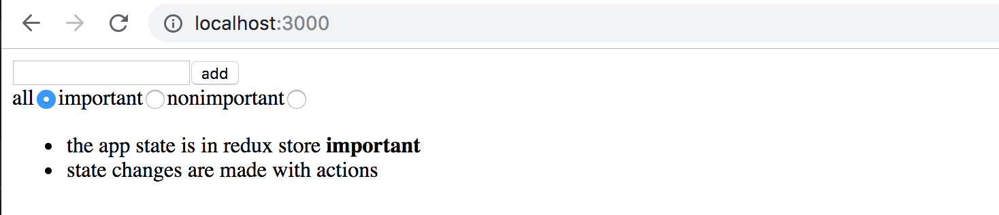
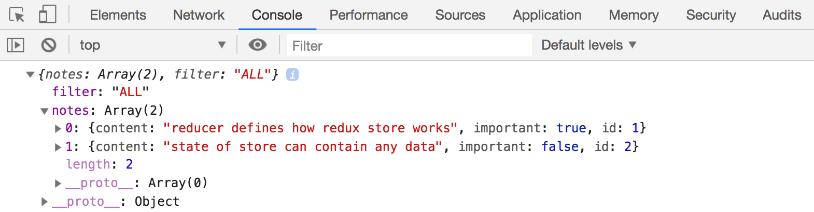
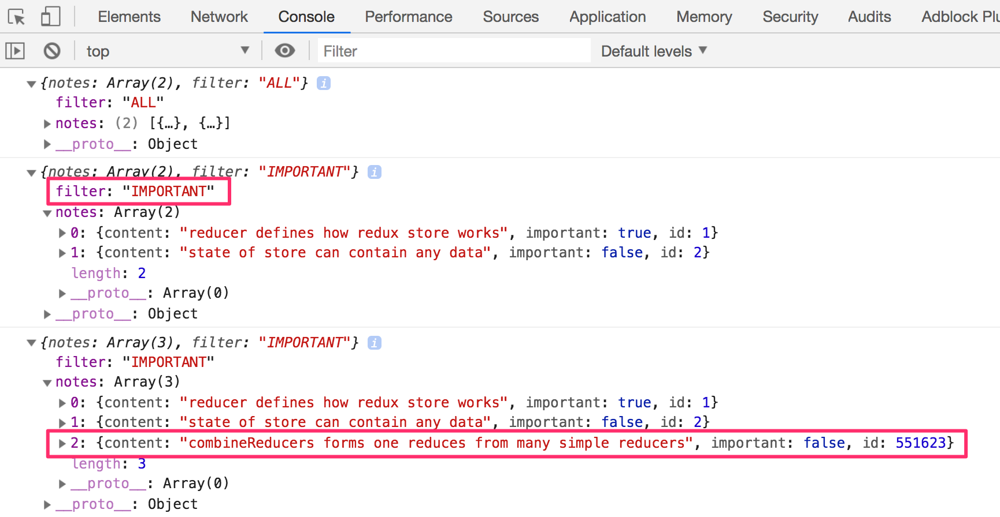
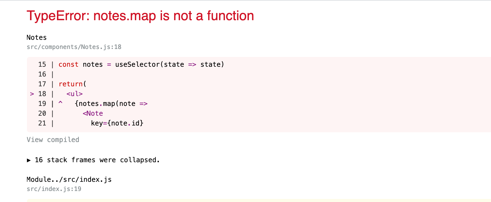
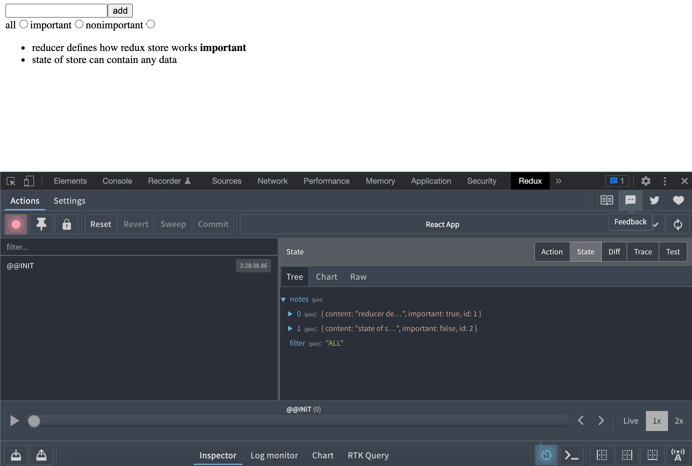
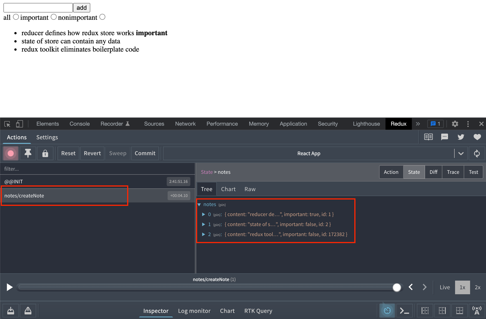
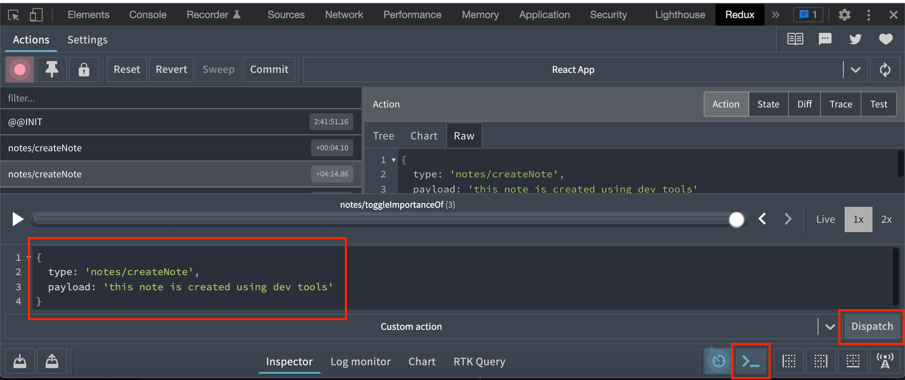
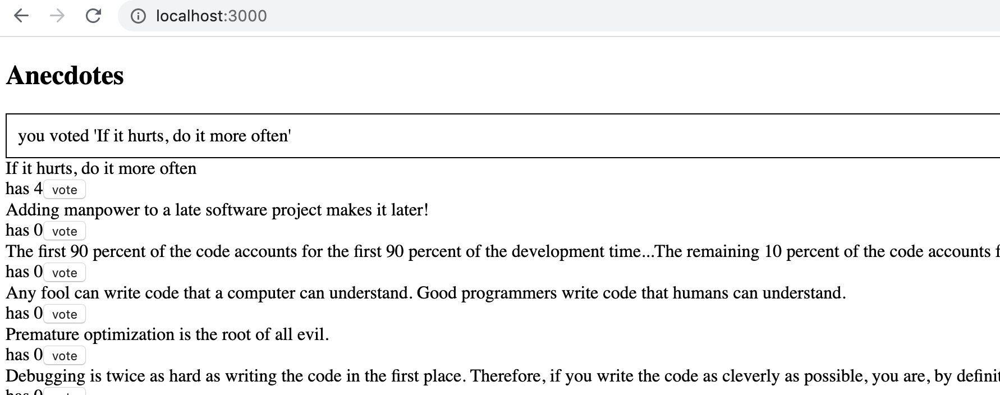
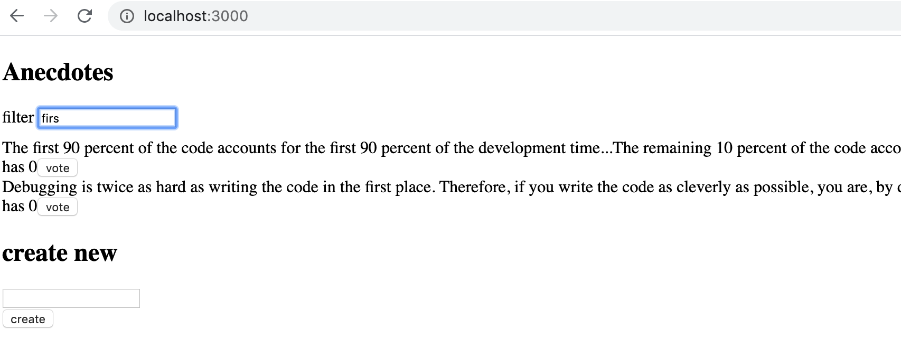

<div class="content">


<!-- Let's continue our work with the simplified [redux version](/zh/part6/flux架构与_redux#redux-notes) of our notes application. -->
让我们继续使用简化[redux 版本](/zh/part6/flux架构与_redux#redux-notes)的notes应用进行工作。

<!-- In order to ease our development, let's change our reducer so that the store gets initialized with a state that contains a couple of notes: -->
为了简化我们的开发，让我们改变我们的 reducer，这样store被初始化为一个包含两个便笺的状态:

```js
const initialState = [
  {
    content: 'reducer defines how redux store works',
    important: true,
    id: 1,
  },
  {
    content: 'state of store can contain any data',
    important: false,
    id: 2,
  },
]

const noteReducer = (state = initialState, action) => {
  // ...
}

// ...
export default noteReducer
```


### Store with complex state 
【复杂状态的储存】
<!-- Let's implement filtering for the notes that are displayed to the user. The user interface for the filters will be implemented with [radio buttons](https://developer.mozilla.org/en-US/docs/Web/HTML/Element/input/radio): -->
让我们实现对显示给用户的便笺的过滤。 用户界面的过滤器将利用[单选按钮](https://developer.mozilla.org/en-us/docs/web/html/element/input/radio) 实现:




<!-- Let's start with a very simple and straightforward implementation: -->
让我们从一个非常简单直接的实现开始:

```js
import React from 'react'
import NewNote from './components/NewNote'
import Notes from './components/Notes'

const App = () => {
//highlight-start
  const filterSelected = (value) => {
    console.log(value)
  }
//highlight-end

  return (
    <div>
      <NewNote />
        //highlight-start
      <div>
        all          <input type="radio" name="filter"
          onChange={() => filterSelected('ALL')} />
        important    <input type="radio" name="filter"
          onChange={() => filterSelected('IMPORTANT')} />
        nonimportant <input type="radio" name="filter"
          onChange={() => filterSelected('NONIMPORTANT')} />
      </div>
      //highlight-end
      <Notes />
    </div>
  )
}
```

<!-- Since the <i>name</i> attribute of all the radio buttons is the same, they form a <i>button group</i> where only one option can be selected. -->
由于所有单选按钮的<i>name</i> 属性都是相同的，所以它们形成了一个<i>按钮组</i>，其中只能选择一个选项。

<!-- The buttons have a change handler that currently only prints the string associated with the clicked button to the console. -->
这些按钮有一个更改处理程序，当前只将与单击按钮关联的字符串打印到控制台。

<!-- We decide to implement the filter functionality by storing <i>the value of the filter</i> in the redux store in addition to the notes themselves. The state of the store should look like this after making these changes: -->
我们决定通过将 filter 的值存储在 redux 存储中来实现这个过滤器功能。 store的状态在做了如下修改后应该是这样的:

```js
{
  notes: [
    { content: 'reducer defines how redux store works', important: true, id: 1},
    { content: 'state of store can contain any data', important: false, id: 2}
  ],
  filter: 'IMPORTANT'
}
```

<!-- Only the array of notes is stored in the state of the current implementation of our application. In the new implementation the state object has two properties, <i>notes</i> that contains the array of notes and <i>filter</i> that contains a string indicating which notes should be displayed to the user. -->
当前应用的实现，只有便笺数组存储在状态中。 在新实现中，state 对象有两个属性, <i>notes</i> 包含 notes 数组， <i>filter</i> 包含一个字符串，说明应该向用户显示哪些便笺。

### Combined reducers 
【复合reducer】
<!-- We could modify our current reducer to deal with the new shape of the state. However, a better solution in this situation is to define a new separate reducer for the state of the filter: -->
我们可以修改现有的reducer来适应新的状态。 不过，在这种情况下，一个更好的解决方案是为过滤器的状态定义一个新的单独的 reducer:

```js
const filterReducer = (state = 'ALL', action) => {
  switch (action.type) {
    case 'SET_FILTER':
      return action.filter
    default:
      return state
  }
}
```

<!-- The actions for changing the state of the filter look like this: -->
改变过滤器状态的action如下:

```js
{
  type: 'SET_FILTER',
  filter: 'IMPORTANT'
}
```

<!-- Let's also create a new _action creator_ function. We will write the code for the action creator in a new <i>src/reducers/filterReducer.js</i> module: -->
我们还要创建一个新的action创建函数。 我们将在一个新的<i>src/reducers/filterReducer.js</i>中为action创建器编写代码 模块:

```js
const filterReducer = (state = 'ALL', action) => {
  // ...
}

export const filterChange = filter => {
  return {
    type: 'SET_FILTER',
    filter,
  }
}

export default filterReducer
```

<!-- We can create the actual reducer for our application by combining the two existing reducers with the [combineReducers](https://redux.js.org/api/combinereducers) function. -->
我们可以为我们的应用创建实际的reducer，通过结合现有的两个reducer和[combineReducers](https://redux.js.org/api/combineReducers)函数。

<!-- Let's define the combined reducer in the <i>index.js</i> file: -->
让我们在<i>index.js</i> 文件中定义组合的 reducer:

```js
import React from 'react'
import ReactDOM from 'react-dom'
import { createStore, combineReducers } from 'redux' // highlight-line
import { Provider } from 'react-redux' 
import App from './App'

import noteReducer from './reducers/noteReducer'
import filterReducer from './reducers/filterReducer' // highlight-line

 // highlight-start
const reducer = combineReducers({
  notes: noteReducer,
  filter: filterReducer
})
 // highlight-end

const store = createStore(reducer, composeWithDevTools())

console.log(store.getState()) // highlight-line

ReactDOM.render(
  /*
  <Provider store={store}>
    <App />
  </Provider>,
  */
  <div />,
  document.getElementById('root')
)
```

<!-- Since our application breaks completely at this point, we render an empty <i>div</i> element instead of the <i>App</i> component. -->
由于我们的应用在这一点上完全中断，因此我们渲染一个空的<i>div</i> 元素，而不是<i>App</i> 组件。


<!-- The state of the store gets printed to the console: -->
存储的状态被打印到控制台:




<!-- As we can see from the output, the store has the exact shape we wanted it to! -->
正如我们可以看到的输出信息，store正是我们想要的！

<!-- Let's take a closer look at how the combined reducer is created: -->
让我们仔细看看组合reducer是如何创建的:

```js
const reducer = combineReducers({
  notes: noteReducer,
  filter: filterReducer,
})
```

<!-- The state of the store defined by the reducer above is an object with two properties: <i>notes</i> and <i>filter</i>. The value of the <i>notes</i> property is defined by the <i>noteReducer</i>, which does not have to deal with the other properties of the state. Likewise, the <i>filter</i> property is managed by the <i>filterReducer</i>. -->
上面由 reducer 定义的存储状态是一个具有两个属性的对象:<i>notes</i> 和<i>filter</i>。<i>notes</i> 属性的值由<i>noteReducer</i> 定义，它不必处理状态的其他属性。 类似地，<i>filter</i><i>属性由<i>filterReducer</i>管理。

<!-- Before we make more changes to the code, let's take a look at how different actions change the state of the store defined by the combined reducer. Let's add the following to the <i>index.js</i> file: -->
在对代码进行更多更改之前，让我们看看不同的action是如何更改由组合的 reducer 定义的存储状态的。 让我们在<i>index.js</i> 文件中添加如下内容:

```js
import { createNote } from './reducers/noteReducer'
import { filterChange } from './reducers/filterReducer'
//...
store.subscribe(() => console.log(store.getState()))
store.dispatch(filterChange('IMPORTANT'))
store.dispatch(createNote('combineReducers forms one reducer from many simple reducers'))
```

<!-- By simulating the creation of a note and changing the state of the filter in this fashion, the state of the store gets logged to the console after every change that is made to the store: -->
通过模拟创建一个便笺，并以这种方式更改过滤器的状态，在对存储进行每次更改后，存储的状态都会被记录到控制台:




<!-- At this point it is good to become aware of a tiny but important detail. If we add a console log statement <i>to the beginning of both reducers</i>: -->
在这一点上，意识到一个微小但重要的细节是很好的。 如果我们在 reducers 的开头添加一个控制台 log 语句:

```js
const filterReducer = (state = 'ALL', action) => {
  console.log('ACTION: ', action)
  // ...
}
```

<!-- Based on the console output one might get the impression that every action gets duplicated: -->
基于控制台输出，你可能会得到这样的感觉: 每个action都被复制了:


<!-- Is there a bug in our code? No. The combined reducer works in such a way that every <i>action</i> gets handled in <i>every</i> part of the combined reducer. Typically only one reducer is interested in any given action, but there are situations where multiple reducers change their respective parts of the state based on the same action. -->
我们的代码中有错误吗？ 没有。 组合reducer的工作方式使得每个<i>action</i> 在组合reducer的每个 部分都得到处理。 通常只有一个reducer对任何给定的action感兴趣，但是在有些情况下，多个reducer根据相同的action改变它们各自的状态部分。


### Finishing the filters
【完成过滤器】
<!-- Let's finish the application so that it uses the combined reducer. We start by changing the rendering of the application and hooking up the store to the application in the <i>index.js</i> file: -->
让我们完成应用，使用组合reducer。 我们首先修改应用的渲染方式，并在<i>index.js</i> 文件中将存储区挂到应用:

```js
ReactDOM.render(
  <Provider store={store}>
    <App />
  </Provider>,
  document.getElementById('root')
)
```

<!-- Next, let's fix a bug that is caused by the code expecting the application store to be an array of notes: -->
接下来，让我们修复一个错误，这个错误是由代码期望应用存储为一个便笺数组而引起的:




<!-- It's an easy fix. Because the notes are in the store's field <i>notes</i>, we only have to make a little change to the selector function: -->
解决起来很简单。 因为便笺在store的字段<i>notes</i> 中，所以我们只需要对选择器函数做一个小小的修改:

```js
const Notes = () => {
  const dispatch = useDispatch()
  const notes = useSelector(state => state.notes) // highlight-line

  return(
    <ul>
      {notes.map(note =>
        <Note
          key={note.id}
          note={note}
          handleClick={() => 
            dispatch(toggleImportanceOf(note.id))
          }
        />
      )}
    </ul>
  )
}
```


<!-- Previously the selector function returned the whole state of the store: -->
以前，selector 函数返回存储的整个状态:

```js
const notes = useSelector(state => state)
```


<!-- And now it returns only its field <i>notes</i> -->
现在它只返回字段<i>notes</i>

```js
const notes = useSelector(state => state.notes)
```

<!-- Let's extract the visibility filter into its own <i>src/components/VisibilityFilter.js</i> component: -->
让我们将可见性过滤器提取到它自己的 <i>src/components/VisibilityFilter.js</i>  组件中:

```js
import React from 'react'
import { filterChange } from '../reducers/filterReducer'
import { useDispatch } from 'react-redux'

const VisibilityFilter = () => {
  const dispatch = useDispatch()

  return (
    <div>
      all    
      <input 
        type="radio" 
        name="filter" 
        onChange={() => dispatch(filterChange('ALL'))}
      />
      important   
      <input
        type="radio"
        name="filter"
        onChange={() => dispatch(filterChange('IMPORTANT'))}
      />
      nonimportant 
      <input
        type="radio"
        name="filter"
        onChange={() => dispatch(filterChange('NONIMPORTANT'))}
      />
    </div>
  )
}

export default VisibilityFilter
```

<!-- With the new component <i>App</i> can be simplified as follows: -->
使用新的组件<i>App</i> 可以简化如下:

```js
import React from 'react'
import Notes from './components/Notes'
import NewNote from './components/NewNote'
import VisibilityFilter from './components/VisibilityFilter'

const App = () => {
  return (
    <div>
      <NewNote />
      <VisibilityFilter />
      <Notes />
    </div>
  )
}

export default App
```

<!-- The implementation is rather straightforward. Clicking the different radio buttons changes the state of the store's <i>filter</i> property. -->
实现相当简单。单击不同的单选按钮会改变存储区的<i>filter</i> 属性的状态。

<!-- Let's change the <i>Notes</i> component to incorporate the filter: -->
让我们改变<i>Notes</i> 组件来合并过滤器:

```js
const Notes = () => {
  const dispatch = useDispatch()
  // highlight-start
  const notes = useSelector(state => {
    if ( state.filter === 'ALL' ) {
      return state.notes
    }
    return state.filter  === 'IMPORTANT' 
      ? state.notes.filter(note => note.important)
      : state.notes.filter(note => !note.important)
  })
  // highlight-end

  return(
    <ul>
      {notes.map(note =>
        <Note
          key={note.id}
          note={note}
          handleClick={() => 
            dispatch(toggleImportanceOf(note.id))
          }
        />
      )}
    </ul>
  )
```


<!-- We only make changes to the selector function, which used to be -->
我们只对选择器函数进行更改，这个函数过去是

```js
useSelector(state => state.notes)
```


<!-- Let's simplify the selector by destructuring the fields from the state it receives as a parameter: -->
让我们通过将字段作为参数从它接收的状态中解构来简化选择器:

```js
const notes = useSelector(({ filter, notes }) => {
  if ( filter === 'ALL' ) {
    return notes
  }
  return filter  === 'IMPORTANT' 
    ? notes.filter(note => note.important)
    : notes.filter(note => !note.important)
})
```

<!-- There is a slight cosmetic flaw in our application. Even though the filter is set to <i>ALL</i> by default, the associated radio button is not selected. Naturally this issue can be fixed, but since this is an unpleasant but ultimately harmless bug we will save the fix for later.  -->
我们的应用中有一个小小的表面瑕疵。 即使在默认情况下将筛选器设置为<i>ALL</i>，也不会选择相关的单选按钮。 当然，这个问题是可以修复的，但是由于这是一个令人不快但是最终无害的错误，我们将把修复留到以后。

### Redux DevTools 
<!-- There is an extension [Redux DevTools](https://chrome.google.com/webstore/detail/redux-devtools/lmhkpmbekcpmknklioeibfkpmmfibljd) that can be installed on Chrome, in which the state of the Redux-store and the action that changes it can be monitored from the console of the browser. -->
有一个扩展[Redux DevTools](https://Chrome.google.com/webstore/detail/Redux-DevTools/lmhkpmbekcpmknklioeibfkpmmfibljd)可以安装在 Chrome 上，其中 Redux-store 的状态和改变它的action可以在浏览器的控制台上监视。

<!-- When debugging, in addition to the browser extension we also have the software library [redux-devtools-extension](https://www.npmjs.com/package/redux-devtools-extension). Let's install it using the command: -->
在调试时，除了浏览器扩展外，我们还有软件库[redux-devtools-extension](https://www.npmjs.com/package/redux-devtools-extension 扩展)。 让我们使用如下命令来安装它:

```js
npm install --save-dev redux-devtools-extension
```

<!-- We'll have to slightly change the definition of the store in `index.js` to get the library up and running: -->
我们不得不稍微改变`index.js` 文件中 store 的定义，以使库开始运行:

```js
// ...
import { createStore, combineReducers } from 'redux'
import { composeWithDevTools } from 'redux-devtools-extension' // highlight-line

// ...
import noteReducer from './reducers/noteReducer'
import filterReducer from './reducers/filterReducer'

const reducer = combineReducers({
  notes: noteReducer,
  filter: filterReducer
})

const store = createStore(
  reducer,
  // highlight-start
  composeWithDevTools()
  // highlight-end
)
      
// ...
```

<!-- Now when you open the console, the <i>redux</i> tab looks like this: -->
现在当你打开控制台，<i>redux</i> 标签看起来像这样:



<!-- The effect of each to the store can be easily observed  -->
每一种对store的影响都可以很容易地观察到



<!-- It's also possible to dispatch actions to the store using the console -->
还可以使用控制台将action分派到存储区



<!-- You can find the code for our current application in its entirety in the <i>part6-2</i> branch of [this Github repository](https://github.com/fullstack-hy/redux-notes/tree/part6-2). -->
您可以在[this Github repository](https://github.com/fullstack-hy/redux-notes/tree/part6-2)的<i>/ part6-2</i> 分支中找到我们当前应用的全部代码，

</div>

<div class="tasks">

### Exercises 6.9.-6.12.


<!-- Let's continue working on the anecdote application using redux that we started in exercise 6.3.  -->
让我们继续使用我们在6.3中使用redux创建的八卦应用。


#### 6.9 Better anecdotes, 步骤7
<!-- Start using React dev tools. Move defining the Redux-store into its own file <i>store.js</i>. -->
开始使用 Redux DevTools 工具，将 Redux-store 定义到它自己的文件<i>store.js</i> 中。

#### 6.10 Better anecdotes, 步骤8
<!-- The application has a ready-made body for the <i>Notification</i> component: -->
应用的<i>Notification</i> 组件有一个现成的body:

```js
import React from 'react'

const Notification = () => {
  const style = {
    border: 'solid',
    padding: 10,
    borderWidth: 1
  }
  return (
    <div style={style}>
      render here notification...
    </div>
  )
}

export default Notification
```

<!-- Extend the component so that it renders the message stored in the redux store, making the component to take the form: -->
扩展组件，使其渲染 redux 存储中存储的消息，使组件采用如下形式:

```js
import React from 'react'
import { useSelector } from 'react-redux' // highlight-line

const Notification = () => {
  const notification = useSelector(/*s omething here */) // highlight-line
  const style = {
    border: 'solid',
    padding: 10,
    borderWidth: 1
  }
  return (
    <div style={style}>
      {notification} // highlight-line
    </div>
  )
}
```

<!-- You will have to make changes to the application's existing reducer. Create a separate reducer for the new functionality and refactor the application so that it uses a [combined reducer](https://fullstackopen.com/en/part6/many_reducers#combined-reducers) as shown in this part of the course material. -->
您必须对应用现有的 reducer 进行更改。 为新的功能创建一个[combined reducer](https://fullstackopen.com/en/part6/many_reducers#combined-reducers) ，并重构应用，以便它使用一个组合的reducer，如教材的这一章节所教的那样。

<!-- The application does not have to use the <i>Notification</i> component in any intelligent way at this point in the exercises. It is enough for the application to display the initial value set for the message in the <i>notificationReducer</i>. -->
在练习的这一点上，应用不必以任何智能方式使用<i>Notification</i> 组件。 应用只需在<i>notificationReducer</i> 中显示消息的初始值集即可。

#### 6.11 Better anecdotes, 步骤9


<!-- Extend the application so that it uses the <i>Notification</i> component to display a message for the duration of five seconds when the user votes for an anecdote or creates a new anecdote: -->
扩展应用，以便在用户投票支持一个八卦或创建一个新八卦时，使用<i>Notification</i> 组件显示一条消息，持续时间为5秒钟:




<!-- It's recommended to create separate [action creators](https://redux.js.org/tutorials/fundamentals/part-7-standard-patterns#action-creators) for setting and removing notifications. -->
建议创建单独的[action creators](https://redux.js.org/tutorials/fundamentals/part-7-standard-patterns#action-creators) 来设置和删除通知 


#### 6.12* Better anecdotes, 步骤10

<!-- Implement filtering for the anecdotes that are displayed to the user. -->
对显示给用户的八卦进行筛选。




<!-- Store the state of the filter in the redux store. It is recommended to create a new reducer and action creators for this purpose. -->
在 redux 存储中存储过滤器的状态。 建议为此创建一个新的 reducer 和 action creators。


<!-- Create a new <i>Filter</i> component for displaying the filter. You can use the following code as a template for the component: -->
创建一个新的<i>Filter</i> 组件来显示过滤器。 您可以使用如下代码作为组件的模板:

```js
import React from 'react'

const Filter = () => {
  const handleChange = (event) => {
    // input-field value is in variable event.target.value
  }
  const style = {
    marginBottom: 10
  }

  return (
    <div style={style}>
      filter <input onChange={handleChange} />
    </div>
  )
}

export default Filter
```

</div>

