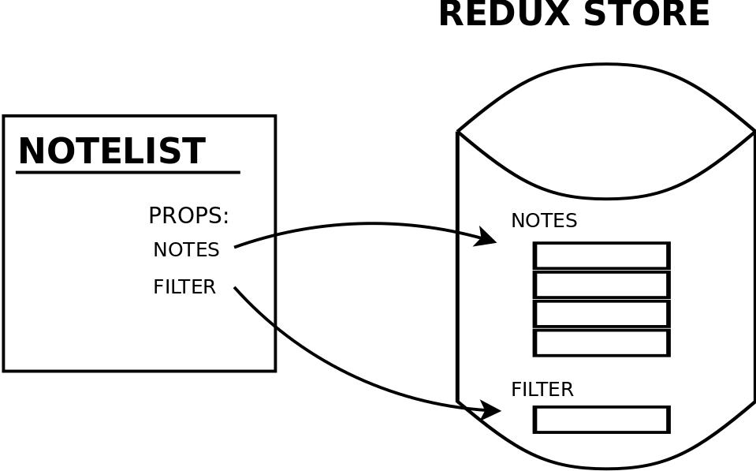
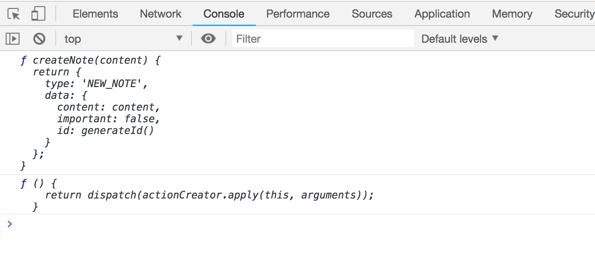

<div class="content">

【TODO】
<!-- So far we have used our redux-store with the help of the[hook](https://react-redux.js.org/api/hooks)-api from react-redux. -->
到目前为止，我们已经使用了 redux-store，借助于 redux 中的 [hook](https://react-redux.js.org/api/hooks)-api。
<!-- Practically this has meant using the [useSelector](https://react-redux.js.org/api/hooks#useselector) and [useDispatch](https://react-redux.js.org/api/hooks#usedispatch) functions. -->
实际上，这意味着使用了[useSelector](https://react-redux.js.org/api/hooks#useSelector)和[useDispatch](https://react-redux.js.org/api/hooks#useDispatch)函数。


<!-- To finish this part we will look into another older and  more complicated way to use redux, the [connect](https://github.com/reactjs/react-redux/blob/master/docs/api.md#connectmapstatetoprops-mapdispatchtoprops-mergeprops-options)-function provided by react-redux. -->
为了完成这一章节，我们将研究使用 redux 的另一种更古老、更复杂的方法，redux 提供的[connect](https://github.com/reduxjs/react-redux/blob/master/docs/api/connect.md)-函数。


<!-- In new applications you should absolutely use the hook-api, but knowing how to use connect is useful when maintaining older projects using redux. -->
在新的应用中，您绝对应该使用 hook-api，但是在使用 redux 维护老项目时，了解如何使用 connect 非常有用。

### Using the connect-function to share the redux store to components
【使用 connect-function 将 redux 存储共享给组件】 


<!-- Let's modify the <i>Notes</i> component so that instead of using the hook-api (the _useDispatch_ and  _useSelector_ functions ) it uses the _connect_-function.  -->
让我们修改<i>Notes</i> 组件，以便使用 connect-function 而不是 hook-api (useDispatch 和 useSelector 函数)。

<!-- We have to modify the following parts of the component: -->
我们必须修改组件的如下部分:

````js
import React from 'react'
import { useDispatch, useSelector } from 'react-redux' // highlight-line
import { toggleImportanceOf } from '../reducers/noteReducer'

const Notes = () => {
  // highlight-start
  const dispatch = useDispatch() 
  const notes = useSelector(({filter, notes}) => {
    if ( filter === 'ALL' ) {
      return notes
    }
    return filter  === 'IMPORTANT' 
      ? notes.filter(note => note.important)
      : notes.filter(note => !note.important)
  })
  // highlight-end

  return(
    <ul>
      {notes.map(note =>
        <Note
          key={note.id}
          note={note}
          handleClick={() => 
            dispatch(toggleImportanceOf(note.id)) // highlight-line
          }
        />
      )}
    </ul>
  )
}

export default Notes
````

<!-- The _connect_ function can be used for transforming "regular" React components so that the state of the Redux store can be "mapped" into the component's props. -->
Connect 函数可用于转换“常规” React 组件，以便将 Redux 存储的状态“映射”到组件的props中。 

<!-- Let's first use the connect function to transform our <i>Notes</i> component into a <i>connected component</i>: -->
让我们首先使用 connect 函数将<i>Notes</i> 组件转换为<i>连接组件</i>:

```js
import React from 'react'
import { connect } from 'react-redux' // highlight-line
import { toggleImportanceOf } from '../reducers/noteReducer'

const Notes = () => {
  // ...
}

const ConnectedNotes = connect()(Notes) // highlight-line
export default ConnectedNotes           // highlight-line
```

<!-- The module exports the <i>connected component</i> that works exactly like the previous regular component for now. -->
该模块导出的<i>连接组件</i> 与之前的常规组件工作方式完全相同。

<!-- The component needs the list of notes and the value of the filter from the Redux store. The _connect_ function accepts a so-called [mapStateToProps](https://github.com/reduxjs/react-redux/blob/master/docs/api/connect.md#mapstatetoprops-state-ownprops--object) function as its first parameter. The function can be used for defining the props of the <i>connected component</i> that are based on the state of the Redux store. -->
组件需要 Redux 存储中的便笺列表和筛选器的值。 Connect 函数接受所谓的[mapStateToProps](https://github.com/reduxjs/react-redux/blob/master/docs/api/connect.md#mapStateToProps-state-ownprops--object)函数作为它的第一个参数。 这个函数可以用来定义基于 Redux 存储状态的<i>连接组件</i> 的props。

<!-- If we define: -->
如果我们定义:


```js
const Notes = (props) => { // highlight-line
  const dispatch = useDispatch()

// highlight-start
  const notesToShow = () => {
    if ( props.filter === 'ALL ') {
      return props.notes
    }
    
    return props.filter  === 'IMPORTANT' 
      ? props.notes.filter(note => note.important)
      : props.notes.filter(note => !note.important)
  }
  // highlight-end

  return(
    <ul>
      {notesToShow().map(note => // highlight-line
        <Note
          key={note.id}
          note={note}
          handleClick={() => 
            dispatch(toggleImportanceOf(note.id))
          }
        />
      )}
    </ul>
  )
}

const mapStateToProps = (state) => {
  return {
    notes: state.notes,
    filter: state.filter,
  }
}

const ConnectedNotes = connect(mapStateToProps)(Notes) // highlight-line

export default ConnectedNotes
```

<!-- The <i>Notes</i> component can access the state of the store directly, e.g. through <i>props.notes</i> that contains the list of notes.  Similarly, <i>props.filter</i> references the value of the filter. -->
Notes组件可以直接访问存储的状态，例如通过包含便笺列表的 propss.Notes。 类似地，props.filter 引用了过滤器的值。 

<!-- The situation that results from using <i>connect</i> with the <i>mapStateToProps</i> function we defined can be visualized like this: -->
使用<i>connect</i> 和我们定义的<i>mapStateToProps</i> 函数的结果可以这样可视化:




<!-- The <i>Notes</i> component has "direct access" via <i>props.notes</i> and <i>props.filter</i> for inspecting the state of the Redux store. -->
Notes 组件通过 props.Notes 和<i>props.filter</i> 具有“直接访问”功能，用于检查 Redux 存储的状态。 

<!-- The _NoteList_ component actually does not need the information about which filter is selected, so we can move the filtering logic elsewhere. -->
Notelist 组件实际上不需要关于选择哪个过滤器的信息，因此我们可以将过滤逻辑移到其他位置。 
<!-- We just have to give it correctly filtered notes in the _notes_ prop: -->
我们只需要在便笺props中给它正确过滤的便笺:

```js
const Notes = (props) => { // highlight-line
  const dispatch = useDispatch()

  return(
    <ul>
      {props.notes.map(note =>
        <Note
          key={note.id}
          note={note}
          handleClick={() => 
            dispatch(toggleImportanceOf(note.id))
          }
        />
      )}
    </ul>
  )
}

// highlight-start
const mapStateToProps = (state) => {
  if ( state.filter === 'ALL' ) {
    return {
      notes: state.notes
    }
  }

  return {
    notes: (state.filter  === 'IMPORTANT' 
      ? state.notes.filter(note => note.important)
      : state.notes.filter(note => !note.important)
    )
  }
}
// highlight-end

const ConnectedNotes = connect(mapStateToProps)(Notes)
export default ConnectedNotes  
```

### mapDispatchToProps


<!-- Now we have gotten rid of _useSelector_, but <i>Notes</i> still uses the _useDispatch_ hook and the _dispatch_ function returning it: -->
现在我们已经摆脱了 useSelector，但是<i>Notes</i> 仍然使用 useDispatch Hook和 dispatch 函数返回它:

```js
const Notes = (props) => {
  const dispatch = useDispatch() // highlight-line

  return(
    <ul>
      {props.notes.map(note =>
        <Note
          key={note.id}
          note={note}
          handleClick={() => 
            dispatch(toggleImportanceOf(note.id)) // highlight-line
          }
        />
      )}
    </ul>
  )
}
```

<!-- The second parameter of the _connect_ function can be used for defining [mapDispatchToProps](https://github.com/reduxjs/react-redux/blob/master/docs/api/connect.md#mapdispatchtoprops-object--dispatch-ownprops--object) which is a group of <i>action creator</i> functions passed to the connected component as props. Let's make the following changes to our existing connect operation: -->
Connect 函数的第二个参数可用于定义[mapDispatchToProps](https://github.com/reduxjs/react-redux/blob/master/docs/api/connect.md#mapDispatchToProps-object--dispatch-ownprops--object) ，它是一组作为props传递给连接组件的<i> action creator</i> 函数。 让我们对现有的连接操作进行如下更改: 


```js
const mapStateToProps = (state) => {
  return {
    notes: state.notes,
    filter: state.filter,
  }
}

// highlight-start
const mapDispatchToProps = {
  toggleImportanceOf,
}
// highlight-end

const ConnectedNotes = connect(
  mapStateToProps,
  mapDispatchToProps // highlight-line
)(Notes)

export default ConnectedNotes
```

<!-- Now the component can directly dispatch the action defined by the _toggleImportanceOf_ action creator by calling the function through its props: -->
现在这个组件可以通过它的props调用函数直接调用_toggleImportanceOf_ action creator 定义的action:

```js
const Notes = (props) => {
  return(
    <ul>
      {props.notes.map(note =>
        <Note
          key={note.id}
          note={note}
          handleClick={() => props.toggleImportanceOf(note.id)}
        />
      )}
    </ul>
  )
}
```

<!-- This means that instead of dispatching the action like this: -->
这意味着不要像这样分派action:

```js
dispatch(toggleImportanceOf(note.id))
```

<!-- When using _connect_ we can simply do this: -->
当使用 connect 时，我们可以简单地这样做:

```js
props.toggleImportanceOf(note.id)
```

<!-- There is no need to call the _dispatch_ function separately since _connect_ has already modified the _toggleImportanceOf_ action creator into a form that contains the dispatch. -->
不需要单独调用 dispatch 函数，因为 connect 已经将 _toggleImportanceOf_  action creator 修改为包含 dispatch 的形式。

<!-- It can take some to time to wrap your head around how _mapDispatchToProps_ works, especially once we take a look at an [alternative way of using it](/zh/part6/connect方法#alternative-way-of-using-map-dispatch-to-props). -->
了解 mapDispatchToProps 的工作原理可能需要一些时间，特别是当我们了解了[使用它的替代方法](/zh/part6/connect方法#alternative-way-of-using-map-dispatch-to-props)之后。

<!-- The resulting situation from using _connect_ can be visualized like this: -->
使用连接产生的结果可以这样想象:


<!-- In addition to accessing the store's state via <i>props.notes</i> and <i>props.filter</i>, the component also references a function that can be used for dispatching <i>TOGGLE\_IMPORTANCE</i>-type actions via its <i>toggleImportanceOf</i> prop. -->
除了通过<i>props.notes</i> 和<i>props.filter</i> 访问存储的状态外，该组件还引用了一个函数，该函数可以通过其<i>toggleimportof</i>  prop 用于分派<i>TOGGLE  IMPORTANCE</i>-类型操作。

<!-- The code for the newly refactored <i>Notes</i> component looks like this: -->
新重构的<i>Notes</i> 组件的代码如下:

```js
import React from 'react'
import { connect } from 'react-redux' 
import { toggleImportanceOf } from '../reducers/noteReducer'

const Notes = (props) => {
  return(
    <ul>
      {props.notes.map(note =>
        <Note
          key={note.id}
          note={note}
          handleClick={() => props.toggleImportanceOf(note.id)}
        />
      )}
    </ul>
  )
}

const mapStateToProps = (state) => {
  if ( state.filter === 'ALL' ) {
    return {
      notes: state.notes
    }
  }

  return {
    notes: (state.filter  === 'IMPORTANT' 
    ? state.notes.filter(note => note.important)
    : state.notes.filter(note => !note.important)
    )
  }
}

const mapDispatchToProps = {
  toggleImportanceOf
}

// eksportoidaan suoraan connectin palauttama komponentti
export default connect(
  mapStateToProps,
  mapDispatchToProps
)(Notes)
```

<!-- Let's also use _connect_ to create new notes: -->
我们也可以使用 connect 来创建新便笺:

```js
import React from 'react'
import { connect } from 'react-redux' 
import { createNote } from '../reducers/noteReducer'

const NewNote = (props) => { // highlight-line
  
  const addNote = async (event) => {
    event.preventDefault()
    const content = event.target.note.value
    event.target.note.value = ''
    props.createNote(content) // highlight-line
  }

  return (
    <form onSubmit={addNote}>
      <input name="note" />
      <button type="submit">add</button>
    </form>
  )
}

// highlight-start
export default connect(
  null, 
  { createNote }
)(NewNote)
// highlight-end
```

<!-- Since the component does not need to access the store's state, we can simply pass <i>null</i> as the first parameter to _connect_.  -->
由于组件不需要访问存储的状态，我们可以简单地将<i>null</i> 作为连接的第一个参数。

<!-- You can find the code for our current application in its entirety in the <i>part6-5</i> branch of [this Github repository](https://github.com/fullstack-hy2020/redux-notes/tree/part6-5). -->
您可以在 [this Github repository](https://github.com/fullstack-hy2020/redux-notes/tree/part6-5)的<i>part6-5</i> 分支中找到我们当前应用的全部代码

### Referencing action creators passed as props
<!-- Let's direct our attention to one interesting detail in the <i>NewNote</i> component: -->
让我们把注意力转移到 newnote 组件中一个有趣的细节上:

```js
import React from 'react'
import { connect } from 'react-redux' 
import { createNote } from '../reducers/noteReducer'  // highlight-line

const NewNote = (props) => {
  
  const addNote = async (event) => {
    event.preventDefault()
    const content = event.target.note.value
    event.target.note.value = ''
    props.createNote(content)  // highlight-line
  }

  return (
    <form onSubmit={addNote}>
      <input name="note" />
      <button type="submit">add</button>
    </form>
  )
}

export default connect(
  null, 
  { createNote }  // highlight-line
)(NewNote)
```

<!-- Developers who are new to connect may find it puzzling that there are two versions of the <i>createNote</i> action creator in the component. -->
刚开始connect的开发人员可能会感到困惑，因为组件中有两个版本的 <i>createNote</i>action创建器。

<!-- The function must be referenced as <i>props.createNote</i> through the component's props, as this is the version that <i>contains the automatic dispatch</i> added by _connect_. -->
必须通过组件的 <i>props.createNote</i> 引用该函数，因为这是 包含由 connect 添加的<i>自动分派</i> 的版本。

<!-- Due to the way that the action creator is imported: -->
根据导入action创建器的方式:

```js
import { createNote } from './../reducers/noteReducer'
```
<!--The action creator can also be referenced directly by calling _createNote_. You should not do this, since this is the unmodified version of the action creator that does not contain the added automatic dispatch.-->

还可以通过调用 createNote 直接引用action创建者。 您不应该这样做，因为这是action创建者的未修改版本，不包含添加的自动分派。

<!-- If we print the functions to the console from the code (we have not yet looked at this useful debugging trick):  -->
如果我们从代码打印函数到控制台(我们还没有看到这个有用的调试技巧) :

```js
const NewNote = (props) => {
  console.log(createNote)
  console.log(props.createNote)

  const addNote = (event) => {
    event.preventDefault()
    const content = event.target.note.value
    event.target.note.value = ''
    props.createNote(content)
  }

  // ...
}
```

<!-- We can see the difference between the two functions: -->
我们可以看到这两个函数之间的区别:



<!-- The first function is a regular <i>action creator</i> whereas the second function contains the additional dispatch to the store that was added by connect. -->
第一个函数是一个常规的<i>action creator</i>，而第二个函数包含对由 connect 添加的存储的附加分派。

<!-- Connect is an incredibly useful tool although it may seem difficult at first due to its level of abstraction. -->
连接是一个非常有用的工具，尽管由于它的抽象级别，乍看起来可能很困难。

### Alternative way of using mapDispatchToProps 
【使用 mapDispatchToProps 的另一种方式】
<!-- We defined the function for dispatching actions from the connected <i>NewNote</i> component in the following way: -->
我们如下面的方式定义了从连接的<i>NewNote</i> 组件发送操作的函数:

```js
const NewNote = () => {
  // ...
}

export default connect(
  null,
  { createNote }
)(NewNote)
```

<!-- The connect expression above enables the component to dispatch actions for creating new notes with the <code>props.createNote('a new note')</code> command. -->
上面的 connect 表达式允许组件使用 <code>props.createNote('a new note')</code>  命令分派用于创建新便笺的操作。

<!-- The functions passed in <i>mapDispatchToProps</i> must be <i>action creators</i>, that is, functions that return Redux actions. -->
在<i>mapDispatchToProps</i> 中传递的函数必须是<i>action creators</i>，即返回 Redux 操作的函数。

<!-- It is worth noting that the <i>mapDispatchToProps</i> parameter is a <i>JavaScript object</i>, as the definition: -->
值得注意的是， <i>mapDispatchToProps</i>  参数是一个 <i>JavaScript object</i>，作为定义:

```js
{
  createNote
}
```

<!-- Is just shorthand for defining the object literal: -->
只是定义 object 语义的简写形式:

```js
{
  createNote: createNote
}
```

<!-- Which is an object that has a single <i>createNote</i> property with the <i>createNote</i> function as its value. -->
它是一个具有单个<i>createNote</i> 属性的对象，其值为<i>createNote</i> 函数。

<!-- Alternatively, we could pass the following <i>function</i> definition as the second parameter to _connect_: -->
或者，我们可以将下面的<i>function</i> 定义作为连接的第二个参数:

```js
const NewNote = (props) => {
  // ...
}

// highlight-start
const mapDispatchToProps = dispatch => {
  return {
    createNote: value => {
      dispatch(createNote(value))
    },
  }
}
// highlight-end

export default connect(
  null,
  mapDispatchToProps
)(NewNote)
```

<!-- In this alternative definition, <i>mapDispatchToProps</i> is a function that _connect_ will invoke by passing it the _dispatch_-function as its parameter. The return value of the function is an object that defines a group of functions that get passed to the connected component as props. Our example defines the function passed as the <i>createNote</i> prop: -->
在这个替代定义中， mapDispatchToProps是一个函数，它通过将 dispatch-function 作为参数传递给它来调用它。 函数的返回值是一个对象，它定义了一组作为props传递给连接组件的函数。 我们的示例将传递的函数定义为 createNote prop:

```js
value => {
  dispatch(createNote(value))
}
```

<!-- Which simply dispatches the action created with the <i>createNote</i> action creator. -->
它只是分发使用<i>createNote</i> action创建器创建的action。

<!-- The component then references the function through its props by calling <i>props.createNote</i>: -->
然后，该组件通过其 props.createNote  引用该函数:

```js
const NewNote = (props) => {
  const addNote = (event) => {
    event.preventDefault()
    const content = event.target.note.value
    event.target.note.value = ''
    props.createNote(content)
  }

  return (
    <form onSubmit={addNote}>
      <input name="note" />
      <button type="submit">add</button>
    </form>
  )
}
```

<!-- The concept is quite complex and describing it through text is challenging. In most cases it is sufficient to use the simpler form of <i>mapDispatchToProps</i>. However, there are situations where the more complicated definition is necessary, like if the <i>dispatched actions</i> need to reference [the props of the component](https://github.com/gaearon/redux-devtools/issues/250#issuecomment-186429931). -->
这个概念相当复杂，通过文本来描述它是具有挑战性的。 在大多数情况下，使用更简单的<i>mapDispatchToProps</i> 就足够了。 然而，在有些情况下，需要更复杂的定义，比如<i>分派的操作</i> 需要引用[组件的支持](https://github.com/gaearon/redux-devtools/issues/250#issuecomment-186429931)。

<!-- The creator of Redux Dan Abramov has created a wonderful tutorial called [Getting started with Redux](https://egghead.io/courses/getting-started-with-redux) that you can find on Egghead.io. I highly recommend the tutorial to everyone. The last four videos discuss the _connect_ method, particularly the more "complicated" way of using it. -->
Redux的创建者 Dan Abramov 创建了一个非常棒的教程，叫做 [Getting started with Redux](https://egghead.io/courses/getting-started-with-redux)  ，你可以在 [Egghead.io](https://Egghead.io/courses/Getting-started-with-Redux)上找到这个 。 我向每个人强烈推荐这个教程。 最后四个视频讨论了连接方法，特别是使用它的更“复杂”的方式。 

### Presentational/Container revisited
【复习表现层/容器】

<!-- The refactored <i>Notes</i> component is almost entirely focused on rendering notes and is quite close to being a so-called [presentational component](https://medium.com/@dan_abramov/smart-and-dumb-components-7ca2f9a7c7d0). According to the [description](https://medium.com/@dan_abramov/smart-and-dumb-components-7ca2f9a7c7d0) provided by Dan Abramov, presentation components: -->
重构的<i>Notes</i> 组件几乎完全集中在渲染便笺上，并且非常接近于所谓的[表示组件](https://medium.com/@dan_abramov/smart-and-dumb-components-7ca2f9a7c7d0)。 根据 Dan Abramov 提供的 [description](https://medium.com/@dan_abramov/smart-and-dumb-components-7ca2f9a7c7d0)，演示组件:

<!--Are concerned with how things look.-->
关心事物的外观。
<!--May contain both presentational and container components inside, and usually have some DOM markup and styles of their own.-->
- 可能包含表示和容器组件，并且通常有一些 DOM 标签和它们自己的样式。
<!--Often allow containment via props.children.-->
- 经常允许通过建筑物进行隔离。
<!--Have no dependencies on the rest of the app, such as Redux actions or stores.-->
- 不依赖于应用的其他部分，如 Redux 操作或store。
<!--Don’t specify how the data is loaded or mutated.-->
- 不要说明数据是如何加载或Mutation的。
<!--Receive data and callbacks exclusively via props.-->
- 只通过props接收数据和回调。
<!--Rarely have their own state (when they do, it’s UI state rather than data).-->
- 很少有自己的状态(当他们这样做时，是 UI 状态而不是数据)。
<!--Are written as functional components unless they need state, lifecycle hooks, or performance optimizations.-->
- 除非需要状态、生命周期Hook或性能优化，否则被编写为功能组件。

<!-- The _connected component_ that is created with the _connect_ function: -->
使用 connect 函数创建的连接组件 :

```js
const mapStateToProps = (state) => {
  if ( state.filter === 'ALL' ) {
    return {
      notes: state.notes
    }
  }

  return {
    notes: (state.filter  === 'IMPORTANT' 
    ? state.notes.filter(note => note.important)
    : state.notes.filter(note => !note.important)
    )
  }
}

const mapDispatchToProps = {
  toggleImportanceOf,
}

export default connect(
  mapStateToProps,
  mapDispatchToProps
)(Notes)
```

<!-- Fits the description of a <i>container</i> component. According to the [description](https://medium.com/@dan_abramov/smart-and-dumb-components-7ca2f9a7c7d0) provided by Dan Abramov, container components: -->
符合<i>容器</i> 组件的描述，根据 Dan Abramov 提供的[description](https://medium.com/@dan_abramov/smart-and-dumb-components-7ca2f9a7c7d0)，容器组件:

<!--Are concerned with how things work.-->
- 关心事物的运作方式。
<!--May contain both presentational and container components inside but usually don’t have any DOM markup of their own except for some wrapping divs, and never have any styles.-->
- 内部可能包含表示和容器组件，但通常没有它们自己的 DOM 标签，除了一些包装的 div，并且从来没有任何样式。
<!--Provide the data and behavior to presentational or other container components.-->
- 为表示或其他容器组件提供数据和行为。
<!--Call Redux actions and provide these as callbacks to the presentational components.-->
- 调用 Redux 操作，并将其作为表示组件的回调提供。
<!--Are often stateful, as they tend to serve as data sources.-->
通常是有状态的，因为它们倾向于作为数据源。
<!--Are usually generated using higher order components such as connect from React Redux, rather than written by hand.-->
- 通常使用高阶组件(如 React Redux 中的 connect)生成，而不是手写。

<!-- Dividing the application into presentational and container components is one way of structuring React applications that has been deemed beneficial. The division may be a good design choice or it may not, it depends on the context. -->
将应用划分为表示和容器组件是构造 React 应用的一种方法，这种方法被认为是有益的。 划分可能是一个很好的设计选择，也可能不是，这取决于上下文。

<!-- Abramov attributes the following [benefits](https://medium.com/@dan_abramov/smart-and-dumb-components-7ca2f9a7c7d0) to the division: -->
Abramov将如下[benefits](https://medium.com/@dan_abramov/smart-and-dumb-components-7ca2f9a7c7d0)归功于这个部分: 

<!--Better separation of concerns. You understand your app and your UI better by writing components this way.-->
- 更好的关注点分离。通过这种方式编写组件，你可以更好地理解你的应用和你的用户界面。
<!--Better reusability. You can use the same presentational component with completely different state sources, and turn those into separate container components that can be further reused.-->
- 更好的可重用性。 您可以使用具有完全不同状态源的相同表示组件，并将其转换为可以进一步重用的单独容器组件。
<!--Presentational components are essentially your app’s “palette”. You can put them on a single page and let the designer tweak all their variations without touching the app’s logic. You can run screenshot regression tests on that page.-->
- 表现组件本质上是你的应用的“调色板”。 你可以把它们放在一个页面上，让设计师在不触及应用逻辑的情况下调整它们的所有变化。 您可以在该页面上运行屏幕截图回归测试。

<!-- Abramov mentions the term [high order component](https://reactjs.org/docs/higher-order-components.html). The <i>Notes</i> component is an example of a regular component, whereas the <i>connect</i> method provided by React-Redux is an example of a <i>high order component</i>. Essentially, a high order component is a function that accept a "regular" component as its parameter, that then returns a new "regular" component as its return value. -->
阿布拉莫夫提到了术语[高阶组件](https://reactjs.org/docs/higher-order-components.html)。<i>Notes</i> 组件是常规组件的一个例子，而 React-Redux 提供的<i>connect</i> 方法是<i>高阶组件</i> 的一个例子。 从本质上讲，高阶组件是接受“ regular”组件作为参数的函数，然后返回一个新的“ regular”组件作为其返回值。

<!-- High order components, or HOCs, are a way of defining generic functionality that can be applied to components. This is a concept from functional programming that very slightly resembles inheritance in object oriented programming. -->
高阶组件(High order components，简称 hoc)是定义可应用于组件的通用功能的一种方法。 这是一个来自函数式编程的概念，非常类似于面向对象编程中的继承。

<!-- HOCs are in fact a generalization of the [High Order Function](https://en.wikipedia.org/wiki/Higher-order_function) (HOF) concept. HOFs are functions that either accept functions as parameters or return functions. We have actually been using HOFs throughout the course, e.g. all of the methods used for dealing with arrays like _map, filter and find_ are HOFs.  -->
Hoc 实际上是[高阶函数](https://en.wikipedia.org/wiki/higher-order_function)(HOF)概念的推广。 Hofs 是接受函数作为参数或返回函数的函数。 实际上我们在整个课程中一直在使用 HOFs，例如，所有用于处理数组如 map、 filter 和 find 的方法都是 HOFs。 


<!-- After the React hook-api was published, HOCs have become less and less popular. Almost all libraries which used to be based on HOCs have now been modified to use hooks. Most of the time hook based apis are a lot simpler than HOC based ones, as is the case with redux as well.  -->
React hook-api 发布之后，HOCs 变得越来越不受欢迎。 几乎所有过去基于 hoc 的库现在都被修改为使用Hook。 大多数基于Hook的 api 比基于 HOC 的 api 简单得多，redux 的情况也是如此。 

### Redux and the component state
【Redux 和组件状态】
<!-- We have come a long way in this course and, finally, we have come to the point at which we are using React "the right way", meaning React only focuses on generating the views, and the application state is separated completely from the React components and passed on to Redux, its actions, and its reducers. -->
我们在这个过程中已经走了很长的路，最后，我们已经到了我们使用 React“ the right way”的地步，意思是 React 只关注于生成视图，应用状态完全独立于 Redux 组件，并传递到 Redux、 Redux 的action和 Redux 的还原器。

<!-- What about the _useState_-hook, which provides components with their own state? Does it have any role if an application is using Redux or some other external state management solution? If the application has more complicated forms, it may be beneficial to implement their local state using the state provided by the _useState_ function. One can, of course, have Redux manage the state of the forms, however, if the state of the form is only relevant when filling the form (e.g. for validation) it may be wise to leave the management of state to the component responsible for the form. -->
那么 useState-hook 呢? 它为组件提供它们自己的状态？ 如果应用正在使用 Redux 或其他外部状态管理解决方案，它是否有任何作用？ 如果应用具有更复杂的形式，那么使用 useState 函数提供的状态实现它们的本地状态可能有益。 当然，可以让 Redux 管理表单的状态，但是，如果表单的状态只在填写表单时有关(例如用于验证) ，那么将状态的管理留给负责表单的组件可能是明智的。


<!-- Should we always use redux? Propably not. Dan Abramov, the developer of redux, discusses this in his article [You Might Not Need Redux](https://medium.com/@dan_abramov/you-might-not-need-redux-be46360cf367). -->
我们应该一直使用 redux 吗？ 可能不是。 Redux 的开发者 Dan Abramov 在他的文章 [You Might Not Need Redux](https://medium.com/@dan_abramov/you-might-not-need-redux-be46360cf367)中讨论了这个


<!-- Nowadays it is possible to implement redux-like state management without redux by using the React [context](https://reactjs.org/docs/context.html)-api and the [useReducer](https://reactjs.org/docs/hooks-reference.html#usereducer)-hook.  -->
现在，通过使用 React [context](https://reactjs.org/docs/context.html)-api 和[useReducer](https://reactjs.org/docs/hooks-reference.html#useReducer)-hook，不需要 redux 就可以实现类似 redux 的状态管理。
<!-- More about this [here](https://www.simplethread.com/cant-replace-redux-with-hooks/) and [here](https://hswolff.com/blog/how-to-usecontext-with-usereducer/). We will also practice this in  -->
更多关于这个[这里](https://www.simplethread.com/cant-replace-redux-with-hooks/)和[这里](https://hswolff.com/blog/how-to-usecontext-with-usereducer/)的内容，我们也会在[第9章](/zh/part9)中提及

</div>


<div class="tasks">


### Exercises 6.19.-6.21.
#### 6.19 anecdotes and connect, 步骤1
<!-- The <i>redux store</i> is currently being accessed by the components through the <em>useSelector</em> and <em>useDispatch</em> hooks. -->
<i>redux store</i> 目前通过 <em>useSelector</em> 和 <em>useDispatch</em> hooks传递给所有组件。

修改 <i>AnecdoteList</i> 组件，让它使用 _connect_ 函数而不是hooks。你可能需要实现你自己的 <i>mapStateToProps</i> 和 <i>mapDispatchToProps</i> 函数


#### 6.20 anecdotes and connect, 步骤2


<!-- Do the same for the <i>Filter</i> and <i>AnecdoteForm</i> components. -->
对<i>Filter</i> 和<i>embarriteform</i> 组件执行同样的操作。

#### 6.21 anecdotes, the grand finale
<!-- You (probably) have one nasty bug in your application. If the user clicks the vote button multiple times in a row, the notification is displayed funnily. For example if a user votes twice in three seconds,  -->
您(可能)在应用中有一个讨厌的 bug。 如果用户连续多次单击投票按钮，通知就会显示得非常有趣。 例如，如果一个用户在三秒内投票两次,
<!-- the last notification is only displayed for two seconds (assuming the notification is normally shown for 5 seconds). This happens because removing the first notification accidentally removes the second notification.  -->
最后一个通知只显示两秒钟(假设通知通常显示5秒钟)。 这是因为删除第一个通知时意外地删除了第二个通知。


<!-- Fix the bug so that after multiple votes in a row, the notification for the last vote is displayed for five seconds. -->
修正此 bug，以便在一行中进行多次投票后，最后一次投票的通知会显示5秒钟。
<!-- This can be done by cancelling the removal of the previous notification when a new notification is displayed whenever necessary.  -->
这可以通过在必要时显示新通知时取消删除以前的通知来实现。
<!-- The [documentation](https://developer.mozilla.org/en-US/docs/Web/API/WindowOrWorkerGlobalScope/setTimeout) for the setTimeout function might also be useful for this. -->
Settimeout 函数的[documentation](https://developer.mozilla.org/en-us/docs/web/api/windoworworkerglobalscope/setTimeout 文档)对此也很有用。 
<!-- This was the last exercise for this part of the course and it's time to push your code to GitHub and mark all of your finished exercises to the [exercise submission system](https://studies.cs.helsinki.fi/stats/courses/fullstackopen). -->
这是本课程这一章节的最后一个练习，现在是时候把你的代码推送到 GitHub，并将所有完成的练习标记到[练习提交系统](https://studies.cs.helsinki.fi/stats/courses/fullstackopen)。

</div>
