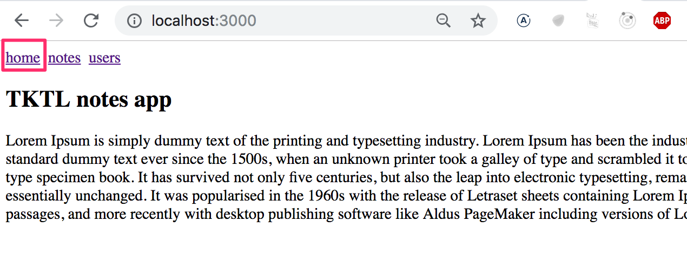
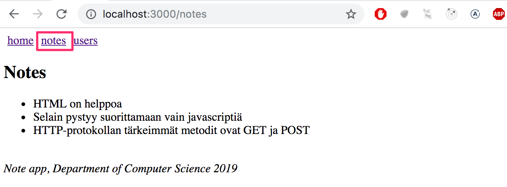
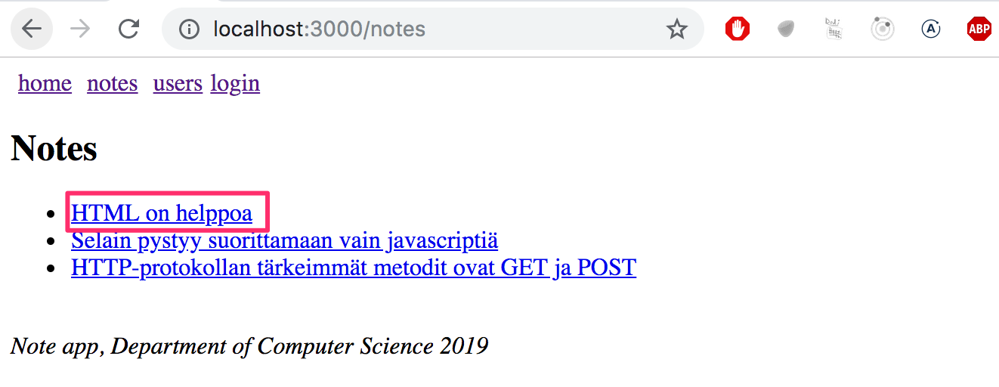
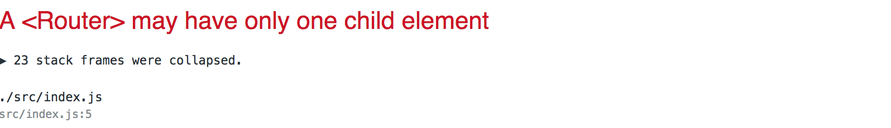

<div class="content">


The exercises in the seventh part of the course differ a bit from the ones before. In this chapter there is, as usual, [three exercises related to the theory in this chapter](/en/part7/react_router#exercises).


In addition to the exercises in this chapter there is a series of exercises, that revise what we've learned and apply some of the theory in this part, in which we expand the Bloglist-application we worked on in parts 4 and 5.


### The navigation structure of the application


Following part 6 we return to React without Redux.


It is very common for web-applications to have a navigation bar, which enables switching the view of application. 




and separate pages for showing the information of notes and users:




In an [old school web app](/en/part0/fundamentals_of_web_apps#traditional-web-applications) changing the page shown by the application would be accomplished by the browser making a HTTP GET request to the server and rendering the HTML representing the view that was returned.


In single page apps we are, in reality, always on the same page, and the Javascript code run by the browser creates an illusion of different "pages". If HTTP requests are made when switching view it is only for fetching JSON formatted data, which the new view might require for it to be shown.


The navigation bar and an application containing multiple views is very easy to implement using React.


Here is one way:

```js
import React, { useState } from 'react'
import ReactDOM from 'react-dom'

const Home = () => (
  <div> <h2>TKTL notes app</h2> </div>
)

const Notes = () => (
  <div> <h2>Notes</h2> </div>
)

const Users = () => (
  <div> <h2>Users</h2> </div>
)

const App = () => {
  const [page, setPage] = useState('home')

 const  toPage = (page) => (event) => {
    event.preventDefault()
    setPage(page)
  }

  const content = () => {
    if (page === 'home') {
      return <Home />
    } else if (page === 'notes') {
      return <Notes />
    } else if (page === 'users') {
      return <Users />
    }
  }

  const padding = {
    padding: 5
  }

  return (
    <div>
      <div>
        <a href="" onClick={toPage('home')} style={padding}>
          home
        </a>
        <a href="" onClick={toPage('notes')} style={padding}>
          notes
        </a>
        <a href="" onClick={toPage('users')} style={padding}>
          users
        </a>
      </div>

      {content()}
    </div>
  )
}

ReactDOM.render(<App />, document.getElementById('root'))
```


So each view is implemented as its own component and we store the information for which component representing a view should be shown below the menu bar in the application state called <i>page</i>.


However, the method is not very optimal. A we can see from the pictures, the address stays the same even though at times we are in different views. Each view should preferably have its own address, e.g to make bookmarking possible. The <i>back</i>-button doesn't work as expected for our application either, meaning that <i>back</i> doesn't move you to the previously displayed view of the application, but somewhere completely different. If the application were to grow even bigger and we wanted to e.g add their separate views for each user and note, then this self made <i>routing</i>, meaning the navigation management of the application, would get overly complicated.


Luckily, in React there exists a component [React router](https://github.com/ReactTraining/react-router), which provides an excellent solution to the navigation management of a React-application.


Lets change the above application to use React router. First we install React router with the command

```js
npm install --save react-router-dom
```


The routing provided by React router is enabled by changing the application as follows:

```js
import {
  BrowserRouter as Router,
  Route, Link, Redirect, withRouter
} from 'react-router-dom'

const App = () => {

  const padding = { padding: 5 }

  return (
    <div>
      <Router>
        <div>
          <div>
            <Link style={padding} to="/">home</Link>
            <Link style={padding} to="/notes">notes</Link>
            <Link style={padding} to="/users">users</Link>
          </div>
          <Route exact path="/" render={() => <Home />} />
          <Route path="/notes" render={() => <Notes />} />
          <Route path="/users" render={() => <Users />} />
        </div>
      </Router>
    </div>
  )
}
```


Routing, or the conditional rendering of components <i>based on the url</i> in the browser is used by placing components as children of the <i>Router</i> component, meaning inside <i>Router</i>-tags.


Notice, that even though the component is referred to by the name <i>Router</i> we are in fact talking about [BrowserRouter](https://reacttraining.com/react-router/web/api/BrowserRouter), because here the import happens by renaming the imported object:

```js
import {
  BrowserRouter as Router,
  Route, Link, Redirect, withRouter
} from 'react-router-dom'
```


According to the manual

> <i>BrowserRouter</i> is a <i>Router</i> that uses the HTML5 history API (pushState, replaceState and the popState event) to keep your UI in sync with the URL.


Normally the browser loads a new page when the url in the address bar changes. However, with the help of the [HTML5 history API](https://css-tricks.com/using-the-html5-history-api/) <i>BrowserRouter</i> enables us to use the url in the address bar of the browser for internal "routing" in a React-application. So even if the url in the address bar changes, the content of the page is only manipulated using Javascript, and the browser doesn't load new content form the server. Using the back- and forward-actions, as well as the making bookmarks, is still logical like on a traditional web page.


Inside the router we define <i>links</i> that modify the address bar with the help of the [Link](https://reacttraining.com/react-router/web/api/Link) component. E.g.

```js
<Link to="/notes">notes</Link>
```


creates a link in the application with the text <i>notes</i>, which when clicked changes the url in the address bar to <i>/notes</i>.


Components rendered based on the url of the browser are defined with the help of the component [Route](https://reacttraining.com/react-router/web/api/Route). E.g.

```js
<Route path="/notes" render={() => <Notes />} />
```


defines that if the address in the browser is <i>/notes</i>, then the component <i>Notes</i> is rendered.


The root of the application, or the address <code>/</code>, is defined to render the component <i>Home</i>:

```js
<Route exact path="/" render={() => <Home />} />
```


we have to use the modifier <i>exact</i> in front of the <i>path</i> attribute of the route. Otherwise <i>Home</i> is also rendered on all other paths, since the root <code>/</code> is included at the <i>start</i> of all other paths.


### Parameterized route


Lets examine the slightly modified version from the previous example. The code for the example can be found in full over [here](https://github.com/fullstackopen-2019/misc/blob/master/router-app.js).


The application now contains five different views, the display of which is controlled by the router. In addition to the components <i>Home</i>, <i>Notes</i> and <i>Users</i> familiar from the previous example we have <i>Login</i> representing the login view and <i>Note</i> representing the view of a single note.


<i>Home</i> and <i>Users</i> are unchanged from the previous exercise.  <i>Notes</i> is a bit more complicated. It renders the list of notes passed to it as props in such a way that the name of each note is clickable.




The ability to click a name is implemented with the component <i>Link</i>, and e.g. clicking the name of a note, whose id is 3 would trigger an event causing the address of the browser to turn into <i>notes/3</i>:

```js
const Notes = (props) => (
  <div>
    <h2>Notes</h2>
    <ul>
      {props.notes.map(note =>
        <li key={note.id}>
          <Link to={`/notes/${note.id}`}>{note.content}</Link>
        </li>
      )}
    </ul>
  </div>
)
```


When the browser transitions to the address singling out the specific note, e.g. <i>notes/3</i>, the component <i>Note</i> is rendered:

```js
const Note = ({ note }) => (
  <div>
    <h2>{note.content}</h2>
    <div>{note.user}</div>
    <div><strong>{note.important ? 'important' : ''}</strong></div>
  </div>
)
```


This happens by expanding the routing in the <i>App</i> component as follows:

```js
<Router>
  <div>
    <div>
      <Link style={padding} to="/">home</Link>
      <Link style={padding} to="/notes">notes</Link>
      <Link style={padding} to="/users">users</Link>
    </div>

    <Route exact path="/" render={() =>
      <Home />
    } />
    // highlight-start
    <Route exact path="/notes" render={() =>
      <Notes notes={notes} />
    } />
    <Route exact path="/notes/:id" render={({ match }) =>
      <Note note={noteById(match.params.id)} />
    } />
  </div>
  // highlight-end
</Router>
```


A modifier <i>exact path="/notes"</i> has been added to the route rendering all notes, because otherwise it would also be rendered for a path with the shape <i>/notes/3</i>.


The route rendering a single note is defined "in the style of express" by specifying the parameter of the route with the notation <i>:id</i>

```js
<Route exact path="/notes/:id" />
```


The render attribute, which defines the component to be rendered, can access the id using its parameter called [match](https://reacttraining.com/react-router/web/api/match) in the following way:

```js
render={({ match }) =>
  <Note note={noteById(match.params.id)} />}
```


The note corresponding to the id in <i>match.params.id</i> is resolved using a helper function _noteById_ 

```js
const noteById = (id) =>
  notes.find(note => note.id === Number(id))
```


and finally the <i>Note</i>-component being rendered gets the note singled out by the unique part of the url as one of its props.


### withRouter and history


We have also implemented a very simple login feature. If one is logged into the application we store the information about this user in the <i>App</i>'s state <i>user</i>


The option to navigate to the <i>Login</i>-view is rendered conditionally in the menu

```js
<Router>
  <div>
    <div>
      <Link style={padding} to="/">home</Link>
      <Link style={padding} to="/notes">notes</Link>
      <Link style={padding} to="/users">users</Link>
      // highlight-start
      {user
        ? <em>{user} logged in</em>

        : <Link to="/login">login</Link>
      }
      // highlight-end
    </div>
  </div>
</Router>
```


so if the user is already logged in, instead of displaying the link <i>Login</i> we show the username of the user:


The code of the component handling the login functionality is as follows 

```js
import {
  // ...
  withRouter // highlight-line
} from 'react-router-dom'

const LoginNoHistory = (props) => {
  const onSubmit = (event) => {
    event.preventDefault()
    props.onLogin('mluukkai')
    props.history.push('/') // highlight-line
  }

  return (
    <div>
      <h2>login</h2>
      <form onSubmit={onSubmit}>
        <div>
          username: <input />
        </div>
        <div>
          password: <input type='password' />
        </div>
        <button type="submit">login</button>
      </form>
    </div>
  )
}

const Login = withRouter(LoginNoHistory) // highlight-line
```


There are a few notable things about the implementation of the form. When logging in we call the function _onSubmit_, which calls a method called _push_ of the [history](https://reacttraining.com/react-router/web/api/history)-object received by the component as a prop. The command _props.history.push('/')_ results in the address bar of the browser changing its address to <code>/</code> and thereby makes the application render the respective component, which in this case is <i>Home</i>.


The component gets access to the <i>history</i>-prop after it is "wrapped" by the function [withRouter](https://github.com/ReactTraining/react-router/blob/master/packages/react-router/docs/api/withRouter.md).

### redirect


There is one more interesting detail about the <i>Users</i> route: 

```js
<Route path="/users" render={() =>
  user ? <Users /> : <Redirect to="/login" />
} />
```


If a user isn't logged in the <i>Users</i> is not rendered. Instead the user is <i>redirected</i> using the <i>Redirect</i>-component to the login view

```js
<Redirect to="/login" />
```


In reality it would perhaps be better to not even show links in the navigation bar requiring login if the user is not logged into the application.


Here is the <i>App</i> component in its entirety:

```js
const App = () => {
  const [notes, setNotes] = useState([
    {
      id: 1,
      content: 'HTML on helppoa',
      important: true,
      user: 'Matti Luukkainen'
    },
    // ...
  ])

  const [user, setUser] = useState(null)

  const login = (user) => {
    setUser(user)
  }

  const noteById = (id) =>
    notes.find(note => note.id === Number(id))

  const padding = { padding: 5 }

  return (
    <div>
      <Router>
        <div>
          <div>
            <Link style={padding} to="/">home</Link>
            <Link style={padding} to="/notes">notes</Link>
            <Link style={padding} to="/users">users</Link>
            {user
              ? <em>{user} logged in</em>
              : <Link to="/login">login</Link>
            }
          </div>

          <Route exact path="/" render={() =>
            <Home />
          } />
          <Route exact path="/notes" render={() =>
            <Notes notes={notes} />
          } />
          <Route exact path="/notes/:id" render={({ match }) =>
            <Note note={noteById(match.params.id)} />
          } />
          <Route path="/users" render={() =>
            user ? <Users /> : <Redirect to="/login" />
          } />
          <Route path="/login" render={() =>
            <Login onLogin={login} />
          } />
        </div>
      </Router>
      <div>
        <br />
        <em>Note app, Department of Computer Science 2019</em>
      </div>
    </div>
  )
}
```


We define an element common for modern web apps called <i>footer</i>, which defines the part at the bottom of the screen, outside of the <i>Router</i> so that it is shown regardless of the component shown in the routed part of the application.

</div>
<div class="tasks">


### Exercises


Lets return to working with anecdotes. Use the redux-free anecdote app found in the repository <https://github.com/fullstackopen-2019/routed-anecdotes> as the starting point for the exercises.


If you clone the project into an existing git repository remember to <i>delete the git configuration of the cloned application:</i>

```bash
cd routed-anecdotes   // go first to directory of the cloned repository
rm -rf .git
```


The application starts the usual way, but first you need to install the dependencies of the application:

```bash
npm install
npm start
```

#### 7.1: routed anecdotes, step1


Add React Router to the application so that by clicking links in the <i>Menu</i>-component the view can be changed.


At the root of the application, meaning the path _/_, show the list of anecdotes:


The <i>Footer</i>-component should always be visible at the bottom.


The creation of a new anecdote should happen e.g. in the path <i>create</i>:


NB: if you get the following error message




you can get rid of it by enclosing everything inside a <i>div</i>-element placed inside the Router-element:

```bash
<Router>
  <div>
    ...
  </div>
</Router>
```

#### 7.2: routed anecdotes, step2


Implement a view for showing a single anecdote:


Navigating to the page showing the single anecdote is done by clicking the name of that anecdote


#### 7.3: routed anecdotes, step3


The default functionality of the creation form is quite confusing, because after creating a new anecdote using the form nothing seems to be happening.


Improve the functionality such that after creating a new anecdote the application transitions automatically to showing the view for all anecdotes <i>and</i> the user is shown a notification informing them of this successful creation for the next 10 seconds:


</i>
