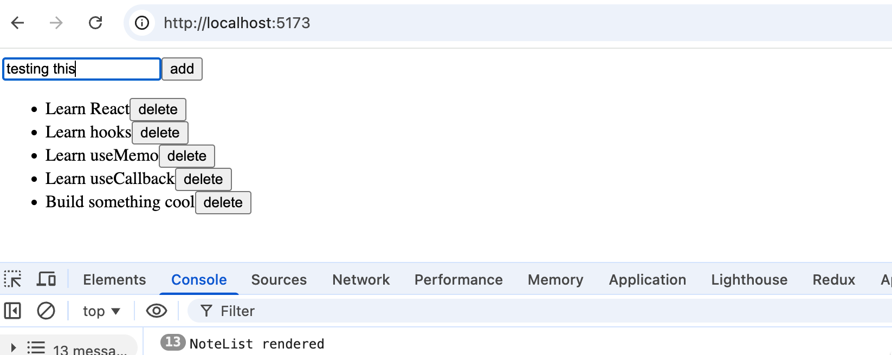
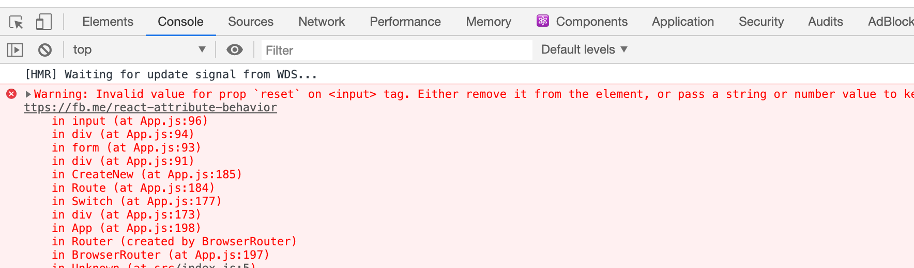

<div class="content">

The exercises in this part of the course differ a bit from the ones before. As usual, there are some exercises related to the theory of this chapter. The other chapters of this part do not have separate exercises. 

In addition, this part contains a larger exercise series that extends the BlogList application built in parts 4 and 5. Those exercises are found [here](/en/part7/exercises_extending_the_bloglist).

### React Hooks

React offers 18 different [built-in hooks](https://react.dev/reference/react/hooks), of which the most popular ones are the [useState](https://react.dev/reference/react/useState) and [useEffect](https://react.dev/reference/react/useEffect) hooks that we have already been using extensively.

In [part 5](/en/part5/props_children_and_component_refs#references-to-components-with-ref) we used the [useRef](https://react.dev/reference/react/useRef) and [useImperativeHandle](https://react.dev/reference/react/useImperativeHandle) which allowed a component to provide access to their functions to other components. In [part 6](/en/part6/react_query_use_reducer_and_the_context) we used [useContext](https://react.dev/reference/react/useContext) to implement a global state.

Within the last couple of years, hooks have become the standard way for libraries to expose their APIs. Throughout this course we have already seen several examples of this: [Zustand](https://zustand-demo.pmnd.rs/) provides <i>useStore</i> for accessing global state, [React Router](https://reactrouter.com/) exposes <i>useNavigate</i> and <i>useParams</i> for programmatic navigation and URL parameter access, and [React Query](https://tanstack.com/query/latest) offers <i>useQuery</i> and <i>useMutation</i> for server state management.

As mentioned in [part 1](/en/part1/a_more_complex_state_debugging_react_apps#rules-of-hooks), hooks are not normal functions, and when using these we have to adhere to certain [rules or limitations](https://react.dev/warnings/invalid-hook-call-warning#breaking-rules-of-hooks). Let's recap the rules of using hooks, copied verbatim from the official React documentation:

**Don’t call Hooks inside loops, conditions, or nested functions.** Instead, always use Hooks at the top level of your React function.

**You can only call Hooks while React is rendering a function component:**

- Call them at the top level in the body of a function component.
- Call them at the top level in the body of a custom Hook.

There's an existing [ESlint plugin](https://www.npmjs.com/package/eslint-plugin-react-hooks) that can be used to verify that the application uses hooks correctly:


Beyond the hooks we have already used, React provides several more built-in hooks that are worth knowing. In this section we look at two of them, <i>useMemo</i> and <i>useCallback</i> which are both concerned with performance optimisation. After that we move on to custom hooks, which let you package any combination of hooks into a reusable function of your own.

### useMemo

Every time a React component re-renders, the entire function body runs again. For most components this is fine, but occasionally a component performs an expensive computation, such as filtering a large list, sorting data, or deriving a complex value, and re-running it on every render wastes time.

[useMemo](https://react.dev/reference/react/useMemo) lets you cache the result of a calculation between renders. It accepts a function that performs the computation and a dependency array. React only re-runs the function when one of the dependencies changes; otherwise it returns the previously cached result.

Consider a component that renders a large list of items filtered by a search term:

```js
import { useState } from 'react'

const expensiveCalculation = () => {
  let sum = 0
  for (let i = 0; i < 100000; i++) sum += i
  return sum
}

const ITEMS = Array.from({ length: 10000 }, (_, i) => `item ${i + 1}`)

const FilteredList = () => {
  const [filter, setFilter] = useState('')
  const [darkMode, setDarkMode] = useState(false)

  console.log('filtering...')
  const filtered = ITEMS.filter(item => {
    expensiveCalculation()
    return item.includes(filter)
  })

  return (
    <div style={{ background: darkMode ? '#333' : '#fff' }}>
      <input
        value={filter}
        onChange={e => setFilter(e.target.value)}
        placeholder="filter items"
      />
      <button onClick={() => setDarkMode(!darkMode)}>toggle dark mode</button>
      <ul>
        {filtered.map(item => <li key={item}>{item}</li>)}
      </ul>
    </div>
  )
}

export default FilteredList
```

The filtering of the list takes now time, partly thanks to our artificial slowdown. 

The problem of the component is that clicking the dark mode button would re-filter all 10000 items even though the filter text has not changed. 

We can fix this with <i>useMemo</i>:


```js
import { useState, useMemo } from 'react' // highlight-line

const FilteredList = () => {
  const [filter, setFilter] = useState('')
  const [darkMode, setDarkMode] = useState(false)

  const filtered = useMemo(() => {  // highlight-line
    console.log('filtering...')
    return ITEMS.filter(item => {
      expensiveCalculation()
      return item.includes(filter)
    })
  }, [filter])  // highlight-line

  return (
    <div style={{ background: darkMode ? '#333' : '#fff' }}>
      //...
    </div>
  )
}
```

With <i>useMemo</i>, the expensive filtering only runs when <i>filter</i> changes. Toggling dark mode only updates the background color, and the cached filtered list is returned immediately.

The dependency array works exactly like the one in <i>useEffect</i>: React compares each value to the previous render. If all values are identical, the memo is reused. If any value differs, the function is re-run and the result is cached for the next render.

<i>useMemo</i> can also be used to memoize objects and arrays passed as props, preventing unnecessary re-renders of child components that use reference equality. For example:

```js
const App = () => {
  const [filter, setFilter] = useState('')

  // Without useMemo, 'options' is a new object on every render even if filter hasn't changed
  const options = useMemo(() => ({ caseSensitive: false, filter }), [filter]) // highlight-line

  return <SearchResults options={options} />
}
```

<i>useMemo</i> is a performance optimisation, you should not reach for it by default. [Premature memoisation](https://wiki.c2.com/?PrematureOptimization) adds complexity without benefit when the computation is fast. Measure first, and only add <i>useMemo</i> when you have confirmed that a particular calculation is a bottleneck.

### React.memo

While <i>useMemo</i> caches the result of a calculation inside a component, [React.memo](https://react.dev/reference/react/memo) takes a different angle: it caches the rendered output of an entire component. <i>React.memo</i> is not a hook but a higher-order component, and we cover it here because it complements <i>useMemo</i> well. When a component is wrapped in <i>React.memo</i>, React skips re-rendering it if its props have not changed since the last render.

```js
const MyComponent = React.memo(({ value }) => {
  console.log('rendered')
  return <div>{value}</div>
})
```

Without <i>React.memo</i>, <i>MyComponent</i> re-renders every time its parent renders, even if <i>value</i> is the same. With it, React compares the old and new props using shallow equality, and only re-renders when something has actually changed.

Note that <i>React.memo</i> only checks props. If the component uses a context value or its own state, it will still re-render when those change.

<i>React.memo</i> pairs naturally with <i>useMemo</i> that prevents expensive calculations from re-running, while <i>React.memo</i> prevents the component itself from re-rendering. 

If a memoised component receives a new function or object reference on every render, the memoisation is defeated, which is where <i>useCallback</i> comes in.

### useCallback

Functions defined inside a component are recreated as new objects on every render. This is normally harmless, but it becomes a problem in two specific situations:

- A child component wrapped in [React.memo](https://react.dev/reference/react/memo) receives the function as a prop. Because the function is a new object each time, the child always sees a changed prop and re-renders anyway, defeating the purpose of memoisation.
- A function is listed as a dependency of <i>useEffect</i> or <i>useMemo</i>. A newly created function on every render means the effect or memo re-runs on every render.

[useCallback](https://react.dev/reference/react/useCallback) solves this by caching the function itself between renders, returning the same function object as long as its dependencies have not changed. It accepts a function and a dependency array, identical in structure to <i>useMemo</i>.

Here is a concrete example. We have a <i>NoteList</i> component that is expensive to render, so we wrap it in <i>React.memo</i>:

```js
// React.memo makes this component skip re-rendering if its props haven't changed
const NoteList = memo(({ onDelete, notes }) => {
  console.log('NoteList rendered')
  return (
    <ul>
      {notes.map(note => (
        <li key={note.id}>
          {note.content}
          <button onClick={() => onDelete(note.id)}>delete</button>
        </li>
      ))}
    </ul>
  )
})

const App = () => {
  const [notes, setNotes] = useState([
    { id: 1, content: 'Learn React' },
    { id: 2, content: 'Learn hooks' },
    { id: 3, content: 'Learn useMemo' },
    { id: 4, content: 'Learn useCallback' },
    { id: 5, content: 'Build something cool' },
  ])
  const [newNote, setNewNote] = useState('')

  const handleDelete = (id) => {
    setNotes(notes => notes.filter(note => note.id !== id))
  }

  const handleAdd = () => {
    setNotes(notes => [...notes, { id: Date.now(), content: newNote }])
    setNewNote('')
  }

  return (
    <div>
      <input value={newNote} onChange={e => setNewNote(e.target.value)} />
      <button onClick={handleAdd}>add</button>
      <NoteList notes={notes} onDelete={handleDelete} />
    </div>
  )
}
```

The problem here is that <i>handleDelete</i> is defined as a plain function inside <i>App</i>. Every time <i>App</i> re-renders (which happens on each keystroke into the note input), a brand new function object is created and passed to <i>NoteList</i> as the <i>onDelete</i> prop.

From <i>React.memo</i>'s perspective the prop has changed, so <i>NoteList</i> re-renders even though the list itself is unchanged:



We can fix this with <i>useCallback</i>, which returns the same function object between renders as long as its dependencies have not changed:

```js
import { useState, useCallback, memo } from 'react'


const App = () => {
  const [notes, setNotes] = useState([])
  const [newNote, setNewNote] = useState('')

// highlight-start
  const handleDelete = useCallback((id) => { // highlight-line
    setNotes(notes => notes.filter(note => note.id !== id))
  }, []) // no external dependencies: this function never needs to change
// highlight-end

  // ...
  return (
    // ...
  )
}
```

Now <i>handleDelete</i> is stable: React returns the exact same function object on every render, so <i>React.memo</i> sees no change in the <i>onDelete</i> prop and skips the re-render of <i>NoteList</i> entirely.


Like <i>useMemo</i>, reach for <i>useCallback</i> only when you have a concrete problem, such as a memoised child re-rendering unnecessarily or a <i>useEffect</i> running too often because of a function dependency. Adding it everywhere makes code harder to read without delivering a performance benefit.

### Custom hooks

React offers the option to create [custom](https://react.dev/learn/reusing-logic-with-custom-hooks) hooks. According to React, the primary purpose of custom hooks is to facilitate the reuse of the logic used in components.

> <i>Building your own Hooks lets you extract component logic into reusable functions.</i>

Custom hooks are regular JavaScript functions that can use any other hooks, as long as they adhere to the [rules of hooks](/en/part1/a_more_complex_state_debugging_react_apps#rules-of-hooks). Additionally, the name of custom hooks must start with the word <i>use</i>.

The key insight is that any stateful logic you find yourself duplicating across components is a candidate for extraction into a custom hook. Each call to the same hook creates an independent piece of state. This is what distinguishes a custom hook from a plain utility function.

We have already implemented several custom hooks in part 6. The hooks <i>useNotes</i> and <i>useNoteActions</i> were created in the [Zustand](/en/part6/flux_architecture_and_zustand#zustand-notes) section, and <i>useCounter</i> was defined in the [React Query and Context](/en/part6/react_query_context_api#defining-the-counter-context-in-its-own-file) section.

#### Counter hook

We implemented a counter application in [part 1](/en/part1/component_state_event_handlers#event-handling) that can have its value incremented, decremented, or reset. The code of the application is as follows:

```js  
import { useState } from 'react'

const App = () => {
  const [counter, setCounter] = useState(0)

  return (
    <div>
      <div>{counter}</div>
      <button onClick={() => setCounter(counter + 1)}>
        plus
      </button>
      <button onClick={() => setCounter(counter - 1)}>
        minus
      </button>      
      <button onClick={() => setCounter(0)}>
        zero
      </button>
    </div>
  )
}
```

Let's extract the counter logic into a custom hook. The code for the hook is as follows:

```js
const useCounter = () => {
  const [value, setValue] = useState(0)

  const increase = () => {
    setValue(value + 1)
  }

  const decrease = () => {
    setValue(value - 1)
  }

  const zero = () => {
    setValue(0)
  }

  return {
    value, 
    increase,
    decrease,
    zero
  }
}
```

Our custom hook uses the <i>useState</i> hook internally to create its state. The hook returns an object, the properties of which include the value of the counter as well as functions for manipulating the value.

React components can use the hook as shown below:

```js
const App = () => {
  const counter = useCounter()

  return (
    <div>
      <div>{counter.value}</div>
      <button onClick={counter.increase}>
        plus
      </button>
      <button onClick={counter.decrease}>
        minus
      </button>      
      <button onClick={counter.zero}>
        zero
      </button>
    </div>
  )
}
```

By doing this we can extract the state of the <i>App</i> component and its manipulation entirely into the <i>useCounter</i> hook. Managing the counter state and logic is now the responsibility of the custom hook.


The same hook could be <i>reused</i> in the application that was keeping track of the number of clicks made to the left and right buttons:

```js

const App = () => {
  const left = useCounter()
  const right = useCounter()

  return (
    <div>
      {left.value}
      <button onClick={left.increase}>
        left
      </button>
      <button onClick={right.increase}>
        right
      </button>
      {right.value}
    </div>
  )
}
```

The application creates <i>two</i> completely separate counters. The first one is assigned to the variable <i>left</i> and the other to the variable <i>right</i>. Each call to <i>useCounter</i> creates its own independent piece of state.

#### Custom hooks and component re-rendering

A natural question at this point is: when does a component that uses a custom hook actually re-render?

The answer is straightforward once you understand what a custom hook really is. A custom hook is not a separate entity from the component's perspective. It is just a piece of the component's own logic that has been moved into a separate function. This means that all the state and effects defined inside the hook belong to the component that calls the hook, not to the hook itself.

As a consequence, the re-rendering rules are exactly the same as with built-in hooks. The component re-renders when state managed inside the hook changes, when a context value the hook subscribes to changes, or when any hook the custom hook internally calls causes a re-render.

On the other hand, things like plain variables being reassigned inside the hook, or the arguments passed to the hook changing on their own do not cause a re-render.

Arguments deserve a closer look though. Passing a new value to a hook does not by itself schedule a re-render, but if the hook uses that argument as a dependency in a <i>useEffect</i> or <i>useMemo</i>, then a change in the argument will trigger the effect or memo to re-run, and if that in turn calls a state setter, the component will re-render.

A helpful way to think about it: imagine copy-pasting all the code from inside your custom hook directly into the component. The re-rendering behaviour would be identical. The hook is just a way to organise that code, not a boundary that React treats specially.

```js
const useCounter = () => {
  const [count, setCount] = useState(0) // this state belongs to the calling component
  return { count, increment: () => setCount(c => c + 1) }
}

const MyComponent = () => {
  const { count, increment } = useCounter()
  // re-renders whenever the count state inside the hook is updated
}
```

#### Form field hook

Dealing with forms in React is somewhat tricky. The following application presents the user with a form that requires them to input their name, birthday, and height:

```js
const App = () => {
  const [name, setName] = useState('')
  const [born, setBorn] = useState('')
  const [height, setHeight] = useState('')

  return (
    <div>
      <form>
        name: 
        <input
          type='text'
          value={name}
          onChange={(event) => setName(event.target.value)} 
        /> 
        <br/> 
        birthdate:
        <input
          type='date'
          value={born}
          onChange={(event) => setBorn(event.target.value)}
        />
        <br /> 
        height:
        <input
          type='number'
          value={height}
          onChange={(event) => setHeight(event.target.value)}
        />
      </form>
      <div>
        {name} {born} {height} 
      </div>
    </div>
  )
}
```

Every field of the form has its own state. To keep the state of the form synchronized with the data provided by the user, we have to register an appropriate <i>onChange</i> handler for each of the <i>input</i> elements. The pattern is identical for every field, only the state variable name differs. This is exactly the kind of repetition that custom hooks are designed to eliminate.

Let's define our own custom <i>useField</i> hook that simplifies the state management of the form:

```js
const useField = (type) => {
  const [value, setValue] = useState('')

  const onChange = (event) => {
    setValue(event.target.value)
  }

  return {
    type,
    value,
    onChange
  }
}
```

The hook function receives the type of the input field as a parameter. It returns all of the attributes required by the <i>input</i>: its type, value and the onChange handler.

The hook can be used in the following way:

```js
const App = () => {
  const name = useField('text')
  // ...

  return (
    <div>
      <form>
        <input
          type={name.type}
          value={name.value}
          onChange={name.onChange} 
        /> 
        // ...
      </form>
// ...
      <div>
        {name.value} {born} {height}  // highlight-line
      </div>      
    </div>
  )
}
```

### Spread attributes

We could simplify things a bit further. Since the <i>name</i> object has exactly all of the attributes that the <i>input</i> element expects to receive as props, we can pass the props to the element using the [spread syntax](https://developer.mozilla.org/en-US/docs/Web/JavaScript/Reference/Operators/Spread_syntax) in the following way:

```js
<input {...name} /> 
```

As the [example](https://react.dev/learn/updating-objects-in-state#copying-objects-with-the-spread-syntax) in the React documentation states, the following two ways of passing props to a component achieve the exact same result:

```js
<Greeting firstName='Arto' lastName='Hellas' />

const person = {
  firstName: 'Arto',
  lastName: 'Hellas'
}

<Greeting {...person} />
```

The application gets simplified into the following format:

```js
const App = () => {
  const name = useField('text')
  const born = useField('date')
  const height = useField('number')

  return (
    <div>
      <form>
        name: 
        <input  {...name} /> 
        <br/> 
        birthdate:
        <input {...born} />
        <br /> 
        height:
        <input {...height} />
      </form>
      <div>
        {name.value} {born.value} {height.value}
      </div>
    </div>
  )
}
```

Dealing with forms is greatly simplified when the unpleasant nitty-gritty details related to synchronizing the state of the form are encapsulated inside our custom hook.

#### Persisting state with a custom hook

Custom hooks can combine several built-in hooks to encapsulate more complex behaviour. A commonly needed feature is persisting state to <i>localStorage</i> so that it survives a page refresh. Here is a <i>useLocalStorage</i> hook that wraps <i>useState</i> and keeps the value in sync with localStorage:

```js
import { useState } from 'react'

const useLocalStorage = (key, initialValue) => {
  const [storedValue, setStoredValue] = useState(() => {
    try {
      const item = window.localStorage.getItem(key)
      return item ? JSON.parse(item) : initialValue
    } catch (error) {
      return initialValue
    }
  })

  const setValue = (value) => {
    try {
      setStoredValue(value)
      window.localStorage.setItem(key, JSON.stringify(value))
    } catch (error) {
      console.error(error)
    }
  }

  return [storedValue, setValue]
}
```

The hook accepts a storage key and an initial value. On the first render it reads from localStorage, falling back to <i>initialValue</i> if nothing is stored yet. The returned setter updates both React state and localStorage at the same time.

A component using it looks exactly like one using plain <i>useState</i>:

```js
const App = () => {
  const [name, setName] = useLocalStorage('name', '')

  return (
    <div>
      <input value={name} onChange={e => setName(e.target.value)} />
      <p>Hello, {name}! (your name is stored in localStorage)</p>
    </div>
  )
}
```

The component has no idea that localStorage is involved. That concern is entirely hidden inside the hook.

### More about hooks

Custom hooks are not only a tool for reusing code; they also provide a better way for dividing it into smaller modular parts.

The internet is starting to fill up with more and more helpful material related to hooks. The following sources are worth checking out:

- [Awesome React Hooks Resources](https://github.com/rehooks/awesome-react-hooks)
- [Easy to understand React Hook recipes by Gabe Ragland](https://usehooks.com/)

</div>

<div class="tasks">

### Exercises 7.1.-7.6.

Let's once again return to working with anecdotes. Use the app found in the repository https://github.com/fullstack-hy2020/routed-anecdotes as the starting point for the exercises.

If you clone the project into an existing git repository, remember to delete the git configuration of the cloned application:

```bash
cd routed-anecdotes   // go first to directory of the cloned repository
rm -rf .git
```

The application starts the usual way, but first, you need to install its dependencies:

```bash
npm install
npm run dev
```

#### 7.1: useField hook

Copy the <i>useField</i> custom hook in the file <i>src/hooks/index.js</i>. The hook should manage the state of a single form input field and return an object with the following properties: <i>type</i>, <i>value</i>, and <i>onChange</i>.

If you use the [named export](https://developer.mozilla.org/en-US/docs/Web/JavaScript/Reference/Statements/export#Description) instead of the default export:

```js
import { useState } from 'react'

export const useField = (type) => { // highlight-line
  const [value, setValue] = useState('')

  const onChange = (event) => {
    setValue(event.target.value)
  }

  return {
    type,
    value,
    onChange
  }
}

// modules can have several named exports
export const useAnotherHook = () => { // highlight-line
  // ...
}
```

Then [importing](https://developer.mozilla.org/en-US/docs/Web/JavaScript/Reference/Statements/import) happens in the following way:

```js
import  { useField } from './hooks'

const App = () => {
  // ...
  const username = useField('text')
  // ...
}
```

Use the hook in the anecdote creation form.

#### 7.2: useField with reset

Add a button to the form that clears all input fields:


Expand the <i>useField</i> hook so that it exposes a <i>reset</i> function for clearing the field value.

Depending on your solution, you may see the following warning in your console:



We will return to this warning in the next exercise.

#### 7.3: Fixing the spread issue

If your solution did not cause a warning to appear in the console, you have already finished this exercise.

If you see the <i>Invalid value for prop \`reset\` on \<input\> tag</i> warning in the console, make the necessary changes to get rid of it.

The reason for this warning is that after making the changes to your application, the following expression:

```js
<input {...content}/>
```

Essentially, is the same as this:

```js
<input
  value={content.value} 
  type={content.type}
  onChange={content.onChange}
  reset={content.reset} // highlight-line
/>
```

The <i>input</i> element should not be given a <i>reset</i> attribute.

One simple fix would be to not use the spread syntax and write all of the forms like this:

```js
<input
  value={username.value} 
  type={username.type}
  onChange={username.onChange}
/>
```

If we were to do this, we would lose much of the benefit provided by the <i>useField</i> hook. Instead, come up with a solution that fixes the issue, but is still easy to use with the spread syntax.

#### 7.4: useAnecdotes, step1

The project has a JSON server already configured. You can start it with:

```bash
npm run server
```

This starts a JSON Server backend that exposes the anecdotes collection as a REST resource at <i>http://localhost:3001/anecdotes</i>.

The existing <i>services/anecdotes.js</i> file contains the functions needed to communicate with the backend (except for the last exercise). Note that the service uses the [Fetch API](https://developer.mozilla.org/en-US/docs/Web/API/Fetch_API) instead of Axios for HTTP requests. If you are unfamiliar with Fetch, have a look at [part 6](/en/part6/complex_state_fetch_testing#fetch-api) before continuing.


The typical pattern for fetching data from a server in React looks like this:

```js
import { useState, useEffect } from 'react'
import anecdoteService from './services/anecdotes'

const App = () => {
  const [anecdotes, setAnecdotes] = useState([])

  useEffect(() => {
    anecdoteService.getAll().then(data => setAnecdotes(data))
  }, [])

  // ...
}
```

Implement a custom hook <i>useAnecdotes</i> that encapsulates this server communication. For this exercise it is enough for the hook to fetch all anecdotes Adding new ones can be handled in the next exercise.

The hook should be used like this:

```js
// ...
import { useAnecdotes } from './hooks' // highlight-line

const App = () => {
  const { anecdotes } = useAnecdotes() // highlight-line

  const addAnecdote = () => {} // a dummy function to keep code from breaking

  return (
    <Router>
      <div>
        <h1>Software anecdotes</h1>
        <Menu />
        <Routes>
          <Route path="/" element={<AnecdoteList anecdotes={anecdotes} />} />
          <Route path="/create" element={<CreateNew addAnecdote={addAnecdote} />} />
          <Route path="/about" element={<About />} />
        </Routes>
        <Footer />
      </div>
    </Router>
  )
}

export default App
```

**A hint:** it was previously mentioned that

> A helpful way to think about it (that is, how a hook works): imagine copy-pasting all the code from inside your custom hook directly into the component. 

So now you should kind of do the opposite: copy-paste the relevant code from component to the hook. This includes both hooks <i>useState</i> and <i>useEffect</i>.

#### 7.5: useAnecdotes, step2

Extend the <i>useAnecdotes</i> hook so that it also supports creating new anecdotes. The hook should expose an <i>addAnecdote</i> function that sends the new anecdote to the server and updates the local state.

The hook should now be usable like this:

```js
const { anecdotes, addAnecdote } = useAnecdotes()
```

Update the <i>App</i> component to pass <i>addAnecdote</i> to the <i>CreateNew</i> component instead of the dummy function.

#### 7.6: useAnecdotes, step3

Extend the <i>useAnecdotes</i> hook with a <i>deleteAnecdote</i> function that removes an anecdote from the server and updates the local state. Add a delete button next to each anecdote in the list.

Also refactor the application so that neither the anecdote data nor the hook functions are passed down as props. Instead, the components that need them should call <i>useAnecdotes</i> directly. This means <i>App</i> no longer needs to act as an intermediary passing data and callbacks through the component tree.

After the refactoring, <i>App</i> should look like this:

```js
const App = () => {
  return (
    <Router>
      <div>
        <h1>Software anecdotes</h1>
        <Menu />
        <Routes>
          <Route path="/" element={<AnecdoteList />} />
          <Route path="/create" element={<CreateNew />} />
          <Route path="/about" element={<About />} />
        </Routes>
        <Footer />
      </div>
    </Router>
  )
}
```

</div>
