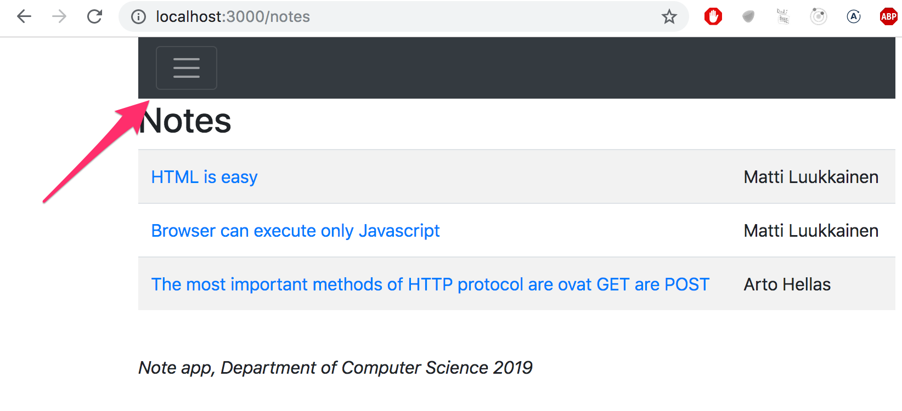
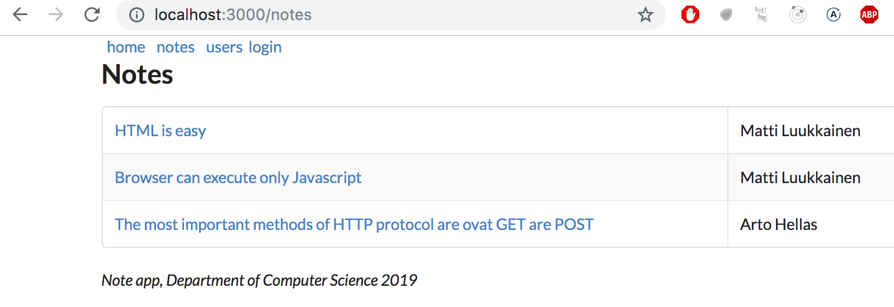

<div class="content">


In part 2 we examined two different ways of adding styles to our application: the old-school [single CSS](/en/part2/adding_styles_to_react_app) file and [inline-styles](/en/part2/adding_styles_to_react_app#inline-styles). In this part we will take a look at a few other ways. 


### Ready-made UI libraries


One approach to defining styles for an application is to use a ready-made "UI framework".


One of the first widely popular UI frameworks was the [Bootstrap](https://getbootstrap.com/) toolkit created by Twitter, that may still be the most popular framework. Recently there has been an explosion in the number of new UI frameworks that have entered the arena. In fact, the selection is so vast that there is little hope of creating an exhaustive list of options.


Many UI frameworks provide developers of web applications with ready-made themes and "components" like buttons, menus, and tables. We write components in quotes as in this context we are not talking about React components. Usually UI frameworks are used by including the CSS stylesheets and JavaScript code of the framework with the application.


There are React-friendly versions available of many UI frameworks, where the framework's "components" have been transformed into React components. There are a few different React versions of Bootstrap like [reactstrap](http://reactstrap.github.io/) and [react-bootstrap](https://react-bootstrap.github.io/).


Next we will take a closer look at two UI frameworks, Bootstrap and [Semantic UI](https://semantic-ui.com/). We will use both frameworks to add similar styles to the application we made in the [React-router](/en/part7/react_router) section of the course material.


### React Bootstrap


Let's start by taking a look at Bootstrap with the help of the [react-bootstrap](https://react-bootstrap.github.io/) package.


Let's install the package with the command:

```js
npm install --save react-bootstrap
```


Then let's add a link for loading the CSS stylesheet for Bootstrap inside of the <i>head</i> tag in the <i>public/index.html</i> file of the application:

```js
<head>
<link
  rel="stylesheet"
  href="https://maxcdn.bootstrapcdn.com/bootstrap/4.2.1/css/bootstrap.min.css"
  integrity="sha384-GJzZqFGwb1QTTN6wy59ffF1BuGJpLSa9DkKMp0DgiMDm4iYMj70gZWKYbI706tWS"
  crossorigin="anonymous"
/>
  // ...
</head>
```


When we reload the application we notice that it already looks a bit more stylish:


In Bootstrap, all of the content of the application is typically rendered inside of a [container](https://getbootstrap.com/docs/4.1/layout/overview/#containers). In practice this is accomplished by giving the root _div_ element of the application the  _container_ class attribute:

```js
const App = () => {
  // ...

  return (
    <div class="container"> // highlight-line
      // ...
    </div>
  )
}
```


We notice that this already has an effect on the appearance of the application. The content is no longer as close to the edges of the browser as it was earlier:


Next, let's make some changes to the <i>Notes</i> component so that it renders the list of notes as a [table](https://getbootstrap.com/docs/4.1/content/tables/). React Bootstrap provides a built-in [Table](https://react-bootstrap.github.io/components/table/) component for this purpose, so there is no need to define CSS classes separately.

```js
const Notes = (props) => (
  <div>
    <h2>Notes</h2>
    <Table striped>
      <tbody>
        {props.notes.map(note =>
          <tr key={note.id}>
            <td>
              <Link to={`/notes/${note.id}`}>
                {note.content}
              </Link>
            </td>
            <td>
              {note.user}
            </td>
          </tr>
        )}
      </tbody>
    </Table>
  </div>
)
```


The appearance of the application is quite stylish:


Notice that the React Bootstrap components have to be imported separately from the library as shown below:

```js
import { Table } from 'react-bootstrap'
```


#### Forms


Let's improve the form in the <i>Login</i> view with the help of Bootstrap [forms](https://getbootstrap.com/docs/4.1/components/forms/).


React Bootstrap provides built-in [components](https://react-bootstrap.github.io/components/forms/) for creating forms (although the documentation for them is slightly lacking):

```js
let Login = (props) => {
  // ...
  return (
    <div>
      <h2>login</h2>
      <Form onSubmit={onSubmit}>
        <Form.Group>
          <Form.Label>username:</Form.Label>
          <Form.Control
            type="text"
            name="username"
          />
          <Form.Label>password:</Form.Label>
          <Form.Control
            type="password"
          />
          <Button variant="primary" type="submit">
            login
          </Button>
        </Form.Group>
      </Form>
    </div>
)}
```


The number of components we need to import increases:

```js
import { Table, Form, Button } from 'react-bootstrap'
```


After switching over to the Bootstrap form, our improved application looks like this:


#### Notification


Now that the login form is in better shape, let's take a look at improving our application's notifications:


Let's add a message for the notification when a user logs in to the application. We will store it in the _message_ variable in the <i>App</i> component's state:

```js
const App = () => {
  const [notes, setNotes] = useState([
    // ...
  ])

  const [user, setUser] = useState(null)
  const [message, setMessage] = useState(null) // highlight-line

  const login = (user) => {
    setUser(user)
    // highlight-start
    setMessage(`welcome ${user}`)
    setTimeout(() => {
      setMessage(null)
    }, 10000)
    // highlight-end
  }
  // ...
}
```


We will render the message as a Bootstrap [Alert](https://getbootstrap.com/docs/4.1/components/alerts/) component. Once again, the React Bootstrap library provides us with a matching [React component](https://react-bootstrap.github.io/components/alerts/): 

```js
<div className="container">
  <Router>
    <div>
    // highlight-start
      {(message &&
        <Alert variant="success">
          {message}
        </Alert>
      )}
      // highlight-end
    //...
)}
```


#### Navigation structure


Lastly, let's alter the application's navigation menu to use Bootstrap's [Navbar](https://getbootstrap.com/docs/4.1/components/navbar/) component. The React Bootstrap library provides us with [matching built-in components](https://react-bootstrap.github.io/components/navbar/#navbars-mobile-friendly). Through trial and error, we end up with a working solution in spite of the cryptic documentation:

```js
<Navbar collapseOnSelect expand="lg" bg="dark" variant="dark">
  <Navbar.Toggle aria-controls="responsive-navbar-nav" />
  <Navbar.Collapse id="responsive-navbar-nav">
    <Nav className="mr-auto">
      <Nav.Link href="#" as="span">
        <Link style={padding} to="/">home</Link>
      </Nav.Link>
      <Nav.Link href="#" as="span">
        <Link style={padding} to="/notes">notes</Link>
      </Nav.Link>
      <Nav.Link href="#" as="span">
        <Link style={padding} to="/users">users</Link>
      </Nav.Link>
      <Nav.Link href="#" as="span">
        {user
          ? <em>{user} logged in</em>
          : <Link to="/login">login</Link>
        }
    </Nav.Link>
    </Nav>
  </Navbar.Collapse>
</Navbar>
```


The resulting layout has a very clean and pleasing appearance:


If the viewport of the browser is narrowed, we notice that the menu "collapses" and it can be expanded by clicking the "hamburger" button:




Bootstrap and a large majority of existing UI frameworks produce [responsive](https://en.wikipedia.org/wiki/Responsive_web_design) designs, meaning that the resulting applications render well on a variety of different screen sizes.


Chrome developer tools makes it possible to simulate using our application in the browser of different mobile clients:


You can find the complete code for the application [here](https://github.com/fullstackopen-2019/misc/blob/master/notes-bootstrap.js).

### Semantic UI


I have used Bootstrap for years but approximately a year ago I switched over to using [Semantic UI](https://semantic-ui.com/). The [exercise submission system](https://studies.cs.helsinki.fi/courses) that is used in this course has been made with Semantic and my experience has been reassuring. The [support for React](https://react.semantic-ui.com) is world class and the documentation is leagues above Bootstrap.


Let's continue working with the [React-router](/en/part7/react_router) example application we just styled with Bootstrap, but this time style it with Semantic UI.


We will start by installing the [semantic-ui-react](https://react.semantic-ui.com) package:

```js
npm install --save semantic-ui-react
```


Then let's add the link to the CSS stylesheet for Semantic UI inside the head tag of the application's <i>public/index.html</i> file (the link can be found [here](https://react.semantic-ui.com/usage#content-delivery-network-cdn)):

```js
<head>
  <link
    rel="stylesheet"
    href="//cdn.jsdelivr.net/npm/semantic-ui@2.4.2/dist/semantic.min.css"
  />
  // ...
</head>
```


We render all of the application's content inside of Semantic's [Container](https://react.semantic-ui.com/elements/container) component.


The documentation for Semantic UI contains several code examples for each component that makes it easy to see how each component is used in practice:


Let's swap the out root <i>div</i> element of App for a <i>Container</i> component:

```js
import { Container } from 'semantic-ui-react'

// ...

const App = () => {
  // ...
  return (
    <Container>
      // ...
    </Container>
  )
}
```


The content of the application is no longer attached to the edges of the browser.


Just like we did with Bootstrap, let's render the notes as a table with Semantic's [Table](https://react.semantic-ui.com/collections/table) component. The resulting code looks like this:

```js
import { Table } from 'semantic-ui-react'

const Notes = (props) => (
  <div>
    <h2>Notes</h2>
    <Table striped celled>
      <Table.Body>
        {props.notes.map(note =>
          <Table.Row key={note.id}>
            <Table.Cell>
              <Link to={`/notes/${note.id}`}>
                {note.content}
              </Link>
            </Table.Cell>
            <Table.Cell>
              {note.user}
            </Table.Cell>
          </Table.Row>
        )}
      </Table.Body>
    </Table>
  </div>
```


After making these changes, the list of notes looks like this:




#### Form


Let's use Semantic's [Form](https://react.semantic-ui.com/collections/form) component in the login view of the application:

```js
import { Form, Button } from 'semantic-ui-react'

let Login = (props) => {
  const onSubmit = (event) => {
    // ...
  }

  return (
    <Form onSubmit={onSubmit}>
      <Form.Field>
        <label>username</label>
        <input name='username' />
      </Form.Field>
      <Form.Field>
        <label>password</label>
        <input type='password' />
      </Form.Field>
      <Button type='submit'>login</Button>
    </Form>
  )
}
```


The appearance of the new login view looks like this:


#### Notification


Just like we did with the Bootstrap version, let's implement a styled <i>notification</i> that is displayed after a user logs in to the application:


As we did previously, let's store the message of the notification in the _message_ variable in the <i>App</i> component's state:

```js
const App = () => {
  // ...
  const [message, setMessage] = useState(null)

  const login = (user) => {
    setUser(user)
    setMessage(`welcome ${user}`)
    setTimeout(() => {
      setMessage(null)
    }, 10000)
  }

  // ...
}
```


And let's render the notification by using Semantic's [Message](https://react.semantic-ui.com/collections/message) component:

```js
<Container>
  {(message &&
    <Message success>
      {message}
    </Message>
  )}
  // ...
</Conteiner>
```


#### Navigation structure


The navigation bar of the application will be implemented with Semantic's [Menu](https://react.semantic-ui.com/collections/menu) component:

```js
<Router>
  <div>
    <Menu inverted>
      <Menu.Item link>
        <Link to="/">home</Link>
      </Menu.Item>
      <Menu.Item link>
        <Link to="/notes">notes</Link>
      </Menu.Item>
      <Menu.Item link>
        <Link to="/users">users</Link>
      </Menu.Item>
      <Menu.Item link>
        {user
          ? <em>{user} logged in</em>
          : <Link to="/login">login</Link>
        }
      </Menu.Item>
    </Menu>
    // ...
  </div>
</Router>
```


The result looks like this:


You can find the complete code for the application [here](https://github.com/fullstackopen-2019/misc/blob/master/notes-semantic.js).


### Closing thoughts


The difference between React-Bootstrap and Semantic-UI-React is not that big. Determining which one produces more aesthetically pleasing results comes down to a matter of taste. After years of using Bootstrap, the reasons that made me switch over to Semantic UI were its seamless integration with React, its wider selection of built-in components, and its overall better documentation. There has been some [uncertainty](https://github.com/Semantic-Org/Semantic-UI/issues/6109) regarding the future of Semantic UI, and it's recommended to keep your ear on the ground.


In the two previous examples we used the UI frameworks with the help of React-integration libraries.


Instead of using the [React Bootstrap](https://react-bootstrap.github.io/) library, we could have just as well used Bootstrap directly by defining CSS classes to our application's HTML elements. Instead of defining the table with the <i>Table</i> component:

```js
<Table striped>
  // ...
</Table>
```


We could have used a regular HTML <i>table</i> and added the required CSS class:

```js
<table className="table striped">
  // ...
</table>
```


The benefit of using the React Bootstrap library is not that evident from this example.


In addition to making the frontend code more compact and readable, another benefit of using React UI framework libraries is that they include the JavaScript that is needed to make specific components work. Some Bootstrap components require a few unpleasant [JavaScript dependencies](https://getbootstrap.com/docs/4.1/getting-started/introduction/#js) that we would prefer not to include in our React applications.


Some potential downsides to using UI frameworks through integration libraries instead of using them "directly", are that integration libraries may have unstable API's and poor documentation. The situation with [Semantic UI React](https://react.semantic-ui.com) is a lot better than with many other UI frameworks, as it is an official React integration library.


There is also the question of whether or not UI framework libraries should be used in the first place. It is up to everyone to form their own opinion, but for people lacking knowledge in CSS and web design they are very useful tools.


### Other UI frameworks


Here are some other UI frameworks for your consideration. If you do not see your favorite UI framework in the list, please make a pull request to the course material.

- <http://www.material-ui.com/>
- <https://bulma.io/>
- <https://ant.design/>
- <https://foundation.zurb.com/>

### Styled components


There are also [other ways](https://blog.bitsrc.io/5-ways-to-style-react-components-in-2019-30f1ccc2b5b) of styling React applications that we have not yet taken a look at.


The [styled components](https://www.styled-components.com/) library offers an interesting approach for defining styles through [tagged template literals](https://developer.mozilla.org/en-US/docs/Web/JavaScript/Reference/Template_literals) that were introduced in ES6.


Let's make a few changes to the styles of our application with the help of styled components. First, let's define two components for defining styles:

```js
import styled from 'styled-components'

const Button = styled.button`
  background: Bisque;
  font-size: 1em;
  margin: 1em;
  padding: 0.25em 1em;
  border: 2px solid Chocolate;
  border-radius: 3px;
`

const Input = styled.input`
  margin: 0.25em;
`
```


The code above creates styled versions of the <i>button</i> and <i>input</i> HTML elements and then assigns them to the <i>Button</i> and <i>Input</i> variables.


The syntax for defining the styles is quite interesting, as the CSS rules are defined inside of backticks.


The styled components that we defined work exactly like regular <i>button</i> and <i>input</i> elements, and they can be used the same way:

```js
const Login = (props) => {
  // ...
  return (
    <div>
      <h2>login</h2>
      <form onSubmit={onSubmit}>
        <div>
          username:
          <Input /> // highlight-line
        </div>
        <div>
          password:
          <Input type='password' /> // highlight-line
        </div>
        <Button type="submit" primary=''>login</Button> // highlight-line
      </form>
    </div>
  )
}
```


Let's create a few more components for styling that application, that are styled versions of <i>div</i> elements:

```js
const Page = styled.div`
  padding: 1em;
  background: papayawhip;
`

const Navigation = styled.div`
  background: BurlyWood;
  padding: 1em;
`

const Footer = styled.div`
  background: Chocolate;
  padding: 1em;
  margin-top: 1em;
`
```


Let's use the components in our application:

```js
const App = () => {
  // ...

  return (
    <Page> // highlight-line
      <Router>
        <div>
          <Navigation> // highlight-line
            <Link style={padding} to="/">home</Link>
            <Link style={padding} to="/notes">notes</Link>
            <Link style={padding} to="/users">users</Link>
            {user
              ? <em>{user} logged in</em>
              : <Link to="/login">login</Link>
            }
          </Navigation>

          <Route exact path="/" render={() => <Home />} />
          <Route exact path="/notes" render={() =>
            <Notes notes={notes} />}
          />
          <Route exact path="/notes/:id" render={({ match }) =>
            <Note note={noteById(match.params.id)} />}
          />
          <Route path="/users" render={() =>
            user ? <Users /> : <Redirect to="/login" />
          } />
          <Route path="/login" render={() =>
            <Login onLogin={login} />}
          />
        </div>
      </Router>
      <Footer> // highlight-line
        <em>Note app, Department of Computer Science 2019</em>
      </Footer>
    </Page>
  )
}
```


The appearance of the resulting application is shown below:


Styled components have seen a consistent growth in popularity in recent times, and quite a lot of people consider it to be the best way of defining styles to React applications.

</div>

<div class="tasks">


### Exercises


The exercises related to the topics presented here, can be found at the end of this course material section in the exercise set [for extending the blog list application](/en/part7/exercises_extending_the_bloglist).

</div>


