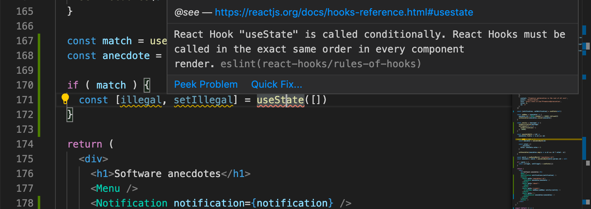
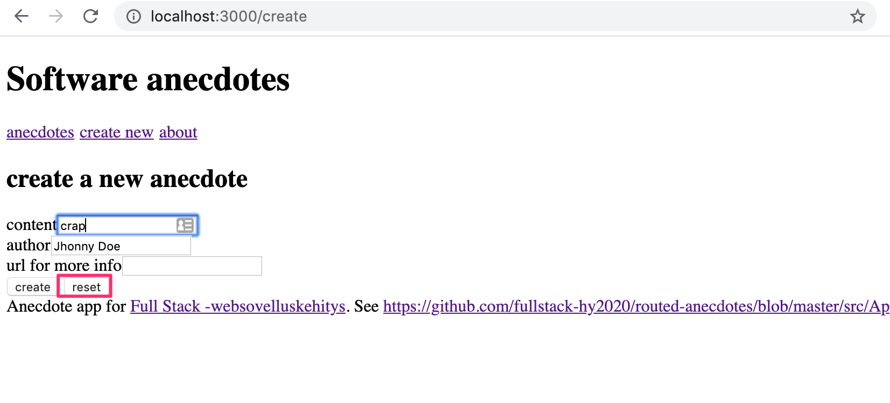
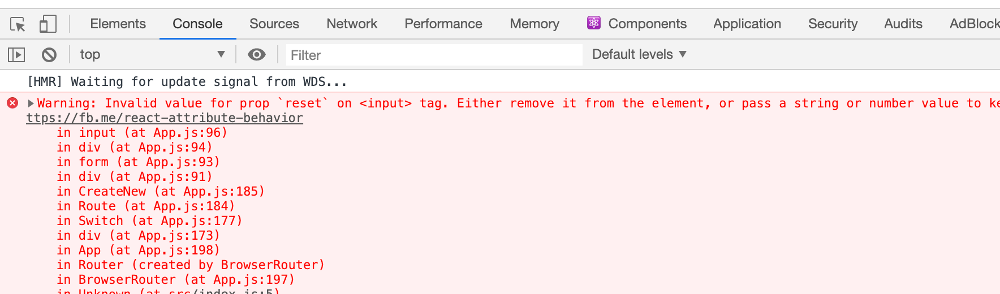
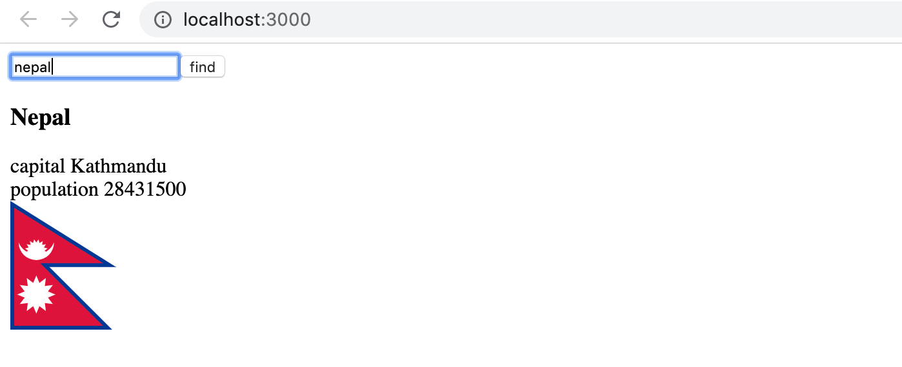
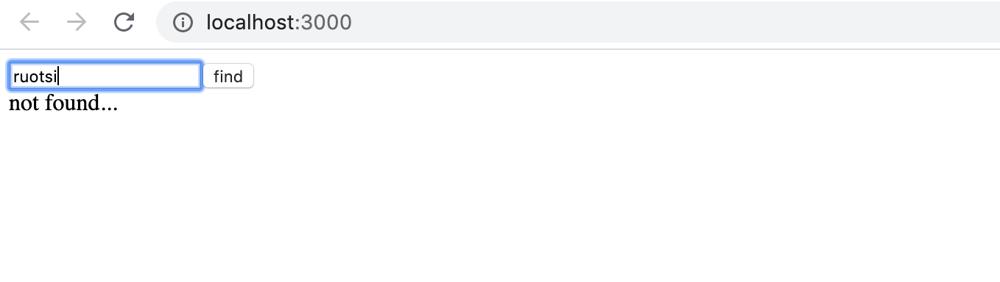
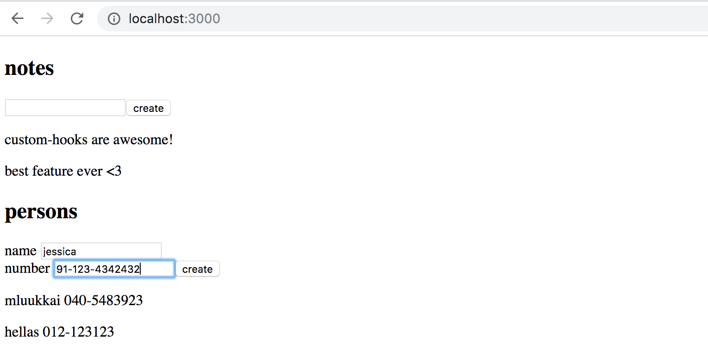

<div class="content">


The exercises in this part are a bit different than the exercises in the previous parts. The exercises in the previous part and the exercises in this part [are about the theory presented in this part](/en/part7/custom_hooks#exercises-7-4-7-8).


This part also contains a [series of exercises](/en/part7/exercises_extending_the_bloglist) in which we modify the Bloglist application from parts 4 and 5 to rehearse and apply the skills we have learned.

### Hooks

React offers 10 different [built-in hooks](https://reactjs.org/docs/hooks-reference.html), of which the most popular ones are the [useState](https://reactjs.org/docs/hooks-reference.html#usestate) and [useEffect](https://reactjs.org/docs/hooks-reference.html#useeffect) hooks that we have already been using extensively.

In [part 5](/en/part5/props_children_and_proptypes#references-to-components-with-ref) we used the [useImperativeHandle](https://reactjs.org/docs/hooks-reference.html#useimperativehandle) hook which allows for components to provide their functions to other components.

Within the last year many React libraries have begun to offer hook-based apis. [In part 6](/en/part6/flux_architecture_and_redux)
we used the [useSelector](https://react-redux.js.org/api/hooks#useselector) and [useDispatch](https://react-redux.js.org/api/hooks#usedispatch) hooks from the react-redux library to share our redux-store and dispatch function to our components. Redux's hook-based api is a lot easier to use than its older, still available, [connect](/en/part6/connect) api.

The [React-router's](https://reacttraining.com/react-router/web/guides) api we introduced in the [previous part](/en/part7/react_router) is also partially [hook](https://reacttraining.com/react-router/web/api/Hooks)-based. Its hooks can be used to access url parameters and the history object, which allows for manipulating the browser url programmatically.

As mentioned in [part 1](/en/part1/a_more_complex_state_debugging_react_apps#rules-of-hooks), hooks are not normal functions, and when using those we have to adhere to certain [rules or limitations](https://reactjs.org/docs/hooks-rules.html). Let's recap the rules of using hooks, copied verbatim from the official React documentation:

**Don’t call Hooks inside loops, conditions, or nested functions.** Instead, always use Hooks at the top level of your React function. 

**Don’t call Hooks from regular JavaScript functions.** Instead, you can:

- Call Hooks from React function components.
- Call Hooks from custom Hooks

There's an existing [ESlint](https://www.npmjs.com/package/eslint-plugin-react-hooks) rule that can be used to verify that the application uses hooks correctly. 

Create-react-app has the readily-configured rule [eslint-plugin-react-hooks](https://www.npmjs.com/package/eslint-plugin-react-hooks) that complains if hooks are used in an illegal manner:



### Custom hooks

React offers the option to create our own [custom](https://reactjs.org/docs/hooks-custom.html) hooks. According to React, the primary purpose of custom hooks is to facilitate the reuse of the logic used in components.

> <i>Building your own Hooks lets you extract component logic into reusable functions.</i>


Custom hooks are regular JavaScript functions that can use any other hooks, as long as they adhere to the [rules of hooks](/en/part1/a_more_complex_state_debugging_react_apps#rules-of-hooks). Additionally, the name of custom hooks must start with the word _use_.


We implemented a counter application in [part 1](/en/part1/component_state_event_handlers#event-handling) that can have its value incremented, decremented, or reset. The code of the application is as follows:

```js  
import React, { useState } from 'react'
const App = (props) => {
  const [counter, setCounter] = useState(0)

  return (
    <div>
      <div>{counter}</div>
      <button onClick={() => setCounter(counter + 1)}>
        plus
      </button>
      <button onClick={() => setCounter(counter - 1)}>
        minus
      </button>      
      <button onClick={() => setCounter(0)}>
        zero
      </button>
    </div>
  )
}
```

Let's extract the counter logic into its own custom hook. The code for the hook is as follows:

```js
const useCounter = () => {
  const [value, setValue] = useState(0)

  const increase = () => {
    setValue(value + 1)
  }

  const decrease = () => {
    setValue(value - 1)
  }

  const zero = () => {
    setValue(0)
  }

  return {
    value, 
    increase,
    decrease,
    zero
  }
}
```

Our custom hook uses the _useState_ hook internally to create its own state. The hook returns an object, the properties of which include the value of the counter as well as functions for manipulating the value.


React components can use the hook as shown below:

```js
const App = (props) => {
  const counter = useCounter()

  return (
    <div>
      <div>{counter.value}</div>
      <button onClick={counter.increase}>
        plus
      </button>
      <button onClick={counter.decrease}>
        minus
      </button>      
      <button onClick={counter.zero}>
        zero
      </button>
    </div>
  )
}
```


By doing this we can extract the state of the _App_ component and its manipulation entirely into the _useCounter_ hook. Managing the counter state and logic is now the responsibility of the custom hook.


The same hook could be <i>reused</i> in the application that was keeping track of the amount of clicks made to the left and right buttons:

```js

const App = () => {
  const left = useCounter()
  const right = useCounter()

  return (
    <div>
      {left.value}
      <button onClick={left.increase}>
        left
      </button>
      <button onClick={right.increase}>
        right
      </button>
      {right.value}
    </div>
  )
}
```


The application creates <i>two</i> completely separate counters. The first one is assigned to the variable _left_ and the other to the variable _right_.


Dealing with forms in React is somewhat tricky. The following application presents the user with a form that requests the user to input their name, birthday, and height:

```js
const App = () => {
  const [name, setName] = useState('')
  const [born, setBorn] = useState('')
  const [height, setHeight] = useState('')

  return (
    <div>
      <form>
        name: 
        <input
          type='text'
          value={name}
          onChange={(event) => setName(event.target.value)} 
        /> 
        <br/> 
        birthdate:
        <input
          type='date'
          value={born}
          onChange={(event) => setBorn(event.target.value)}
        />
        <br /> 
        height:
        <input
          type='number'
          value={height}
          onChange={(event) => setHeight(event.target.value)}
        />
      </form>
      <div>
        {name} {born} {height} 
      </div>
    </div>
  )
}
```


Every field of the form has its own state. In order to keep the state of the form synchronized with the data provided by the user, we have to register an appropriate <i>onChange</i> handler for each of the <i>input</i> elements.


Let's define our own custom _useField_ hook that simplifies the state management of the form:

```js
const useField = (type) => {
  const [value, setValue] = useState('')

  const onChange = (event) => {
    setValue(event.target.value)
  }

  return {
    type,
    value,
    onChange
  }
}
```


The hook function receives the type of the input field as a parameter. The function returns all of the attributes required by the <i>input</i>: its type, value and the onChange handler.


The hook can be used in the following way:

```js
const App = () => {
  const name = useField('text')
  // ...

  return (
    <div>
      <form>
        <input
          type={name.type}
          value={name.value}
          onChange={name.onChange} 
        /> 
        // ...
      </form>
    </div>
  )
}
```


### Spread attributes


We could simplify things a bit further. Since the _name_ object has exactly all of the attributes that the <i>input</i> element expects to receive as props, we can pass the props to the element using the [spread syntax](https://reactjs.org/docs/jsx-in-depth.html#spread-attributes) in the following way:

```js
<input {...name} /> 
```


As the [example](https://reactjs.org/docs/jsx-in-depth.html#spread-attributes) in the React documentation states, the following two ways of passing props to a component achieve the exact same result:

```js
<Greeting firstName='Arto' lastName='Hellas' />

const person = {
  firstName: 'Arto',
  lastName: 'Hellas'
}

<Greeting {...person} />
```


The application gets simplified into the following format:

```js
const App = () => {
  const name = useField('text')
  const born = useField('date')
  const height = useField('number')

  return (
    <div>
      <form>
        name: 
        <input  {...name} /> 
        <br/> 
        birthdate:
        <input {...born} />
        <br /> 
        height:
        <input {...height} />
      </form>
      <div>
        {name.value} {born.value} {height.value}
      </div>
    </div>
  )
}
```


Dealing with forms is greatly simplified when the unpleasant nitty-gritty details related to synchronizing the state of the form is encapsulated inside of our custom hook.


Custom hooks are clearly not only a tool for reuse, they also provide a better way for dividing our code into smaller modular parts.

### More about hooks

The internet is starting to fill up with more and more helpful material related to hooks. The following sources are worth checking out:

* [Awesome React Hooks Resources](https://github.com/rehooks/awesome-react-hooks)
* [Easy to understand React Hook recipes by Gabe Ragland](https://usehooks.com/)
* [Why Do React Hooks Rely on Call Order?](https://overreacted.io/why-do-hooks-rely-on-call-order/)

</div>

<div class="tasks">


### Exercises 7.4.-7.8.

We'll continue with the app from [exercises](/en/part7/react_router#exercises-7-1-7-3) of the chapter [react router](/en/part7/react_router). 

#### 7.4: anecdotes and hooks step1

Simplify the anecdote creation form of your application with the _useField_ custom hook we defined earlier.

One natural place to save the custom hooks of your application is in the <i>/src/hooks/index.js</i> file.


If you use the [named export](https://developer.mozilla.org/en-US/docs/Web/JavaScript/Reference/Statements/export#Description) instead of the default export:

```js
import { useState } from 'react'

export const useField = (type) => { // highlight-line
  const [value, setValue] = useState('')

  const onChange = (event) => {
    setValue(event.target.value)
  }

  return {
    type,
    value,
    onChange
  }
}

// modules can have several named exports
export const useAnotherHook = () => { // highlight-line
  // ...
}
```


Then [importing](https://developer.mozilla.org/en-US/docs/Web/JavaScript/Reference/Statements/import) happens in the following way:

```js
import  { useField } from './hooks'

const App = () => {
  // ...
  const username = useField('text')
  // ...
}
```


#### 7.5: anecdotes and hooks step2

Add a button to the form that you can use to clear all the input fields:



Expand the functionality of the <i>useField</i> hook so that it offers a new <i>reset</i> operation for clearing the field. 

Depending on your solution, you may see the following warning in your console:



We will return to this warning in the next exercise.

#### 7.6: anecdotes and hooks step3

If your solution did not cause a warning to appear in the console, you have already finished this exercise.

If you see the warning in the console, make the necessary changes to get rid of the _Invalid value for prop \`reset\` on \<input\> tag_ console warning. 

The reason for this warning is that after making the changes to your application, the following expression:

```js
<input {...content}/>
```


Essentially, is the same as this:

```js
<input
  value={content.value} 
  type={content.type}
  onChange={content.onChange}
  reset={content.reset} // highlight-line
/>
```


The <i>input</i> element should not be given a <i>reset</i> attribute.


One simple fix would be to not use the spread syntax and write all of the forms like this:

```js
<input
  value={username.value} 
  type={username.type}
  onChange={username.onChange}
/>
```


If we were to do this, we would lose much of the benefit provided by the <i>useField</i> hook. Instead, come up with a solution that fixes the issue, but is still easy to use with spread syntax.

#### 7.7: country hook

Let's return to the exercises [2.12-14](/en/part2/getting_data_from_server#exercises-2-11-2-14).

Use the code from https://github.com/fullstack-hy/country-hook as your starting point.

The application can be used to search for a country's details from the https://restcountries.com/ interface. If a country is found, the details of the country are displayed:



If no country is found, a message is displayed to the user:



The application is otherwise complete, but in this exercise you have to implement a custom hook _useCountry_, which can be used to search for the details of the country given to the hook as a parameter.

Use the api endpoint [full name (v2)](https://restcountries.com/#api-endpoints-v2-full-name) to fetch a country's details in a _useEffect_ hook within your custom hook.

Note that in this exercise it is essential to use useEffect's [second parameter](https://reactjs.org/docs/hooks-reference.html#conditionally-firing-an-effect) array to control when the effect function is executed.

#### 7.8: ultimate hooks

The code of the application responsible for communicating with the backend of the note application of the previous parts looks like this:

```js
import axios from 'axios'
const baseUrl = '/api/notes'

let token = null

const setToken = newToken => {
  token = `bearer ${newToken}`
}

const getAll = async () => {
  const response = await axios.get(baseUrl)
  return response.data
}

const create = async newObject => {
  const config = {
    headers: { Authorization: token },
  }

  const response = await axios.post(baseUrl, newObject, config)
  return response.data
}

const update = async (id, newObject) => {
  const response = await axios.put(`${ baseUrl } /${id}`, newObject)
  return response.data
}

export default { getAll, create, update, setToken }
```

We notice that the code is in no way specific to the fact that our application deals with notes. Excluding the value of the _baseUrl_ variable, the same code could be reused in the blog post application for dealing with the communication with the backend.

Extract the code for communicating with the backend into its own _useResource_ hook. It is sufficient to implement fetching all resources and creating a new resource.

You can do the exercise for the project found in the https://github.com/fullstack-hy/ultimate-hooks repository. The <i>App</i> component for the project is the following:

```js
const App = () => {
  const content = useField('text')
  const name = useField('text')
  const number = useField('text')

  const [notes, noteService] = useResource('http://localhost:3005/notes')
  const [persons, personService] = useResource('http://localhost:3005/persons')

  const handleNoteSubmit = (event) => {
    event.preventDefault()
    noteService.create({ content: content.value })
  }
 
  const handlePersonSubmit = (event) => {
    event.preventDefault()
    personService.create({ name: name.value, number: number.value})
  }

  return (
    <div>
      <h2>notes</h2>
      <form onSubmit={handleNoteSubmit}>
        <input {...content} />
        <button>create</button>
      </form>
      {notes.map(n => <p key={n.id}>{n.content}</p>)}

      <h2>persons</h2>
      <form onSubmit={handlePersonSubmit}>
        name <input {...name} /> <br/>
        number <input {...number} />
        <button>create</button>
      </form>
      {persons.map(n => <p key={n.id}>{n.name} {n.number}</p>)}
    </div>
  )
}
```

The _useResource_ custom hook returns an array of two items just like the state hooks. The first item of the array contains all of the individual resources and the second item of the array is an object that can be used for manipulating the resource collection, like creating new ones.

If you implement the hook correctly, it can be used for both notes and phone numbers (start the server with the _npm run server_ command at the port 3005).



</div>
