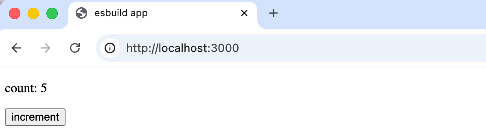
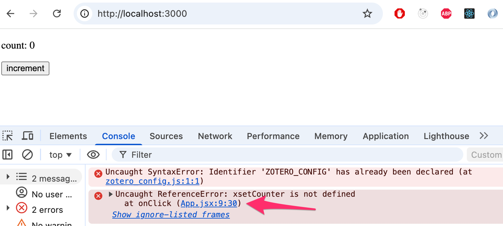

<div class="content">

In the early days, React was somewhat famous for being very difficult to configure the tools required for application development. To make the situation easier, [Create React App](https://github.com/facebookincubator/create-react-app) was developed, which eliminated configuration-related problems. [Vite](https://vitejs.dev/), that is used throughout this course, has since replaced Create React App as the standard for new React applications.

Both Vite and Create React App use <i>bundlers</i> to do the actual work. In this section we will take a closer look at what bundlers actually do, how Vite works under the hood, and how to configure it for different scenarios. We will also briefly examine [esbuild](https://esbuild.github.io/), a low-level bundler that Vite itself uses internally, understanding esbuild helps clarify what bundling fundamentally means.

> #### What about Webpack?
>
>Webpack was the dominant bundler for most of the 2010s and is still encountered in older and enterprise codebases. This course also covered Webpack until spring 2026.
>
> If you work on a legacy project, knowing that Webpack exists and uses the same core concepts (entry points, loaders/plugins, output) is useful. However, setting up a new project with Webpack in 2026 is not recommended. Its configuration is complex, and modern tools like Vite provide a dramatically better developer experience. We will not cover Webpack configuration in this course.

### Bundling

We have implemented our applications by dividing our code into separate modules that have been <i>imported</i> to places that require them. Even though ES6 modules are defined in the ECMAScript standard, not all execution environments handle module-based code automatically. Even modern browsers benefit from having dependencies pre-processed and optimized before delivery.

For this reason, code that is divided into modules is <i>bundled</i> for production, meaning that the source code files are transformed and combined into an optimized set of files that the browser can efficiently load. When we ran <i>npm run build</i> in earlier parts of this course, Vite performed this bundling. The output appears in the <i>dist</i> directory:

```
├── assets
│   ├── index-d526a0c5.css
│   ├── index-e92ae01e.js
│   └── react-35ef61ed.svg
├── index.html
└── vite.svg
```

The <i>index.html</i> at the root loads the bundled JavaScript with a <i>script</i> tag:

```html
<!doctype html>
<html lang="en">
  <head>
    <meta charset="UTF-8" />
    <link rel="icon" type="image/svg+xml" href="/vite.svg" />
    <meta name="viewport" content="width=device-width, initial-scale=1.0" />
    <title>Vite + React</title>
    <script type="module" crossorigin src="/assets/index-e92ae01e.js"></script> // highlight-line
    <link rel="stylesheet" href="/assets/index-d526a0c5.css">  // highlight-line
  </head>
  <body>
    <div id="root"></div>
  </body>
</html>
```

The CSS is also bundled into a single file.

In practice, bundling starts from an entry point, that is typically <i>main.jsx</i>. Vite includes not only the code from the entry point but also everything it imports, recursively, until the full dependency graph has been resolved.

Since part of the imported files are packages like React, Redux, and Axios, the bundled JavaScript file will also contain the contents of each of these libraries.

> Before bundlers were available, the old approach was based on the fact that the index.html file loaded all of the separate JavaScript files of the application with the help of script tags. This resulted in decreased performance, since the loading of each separate file results in some overhead. For this reason, these days the preferred method is to bundle the code into a single file. Bundling also  enables optimizations like minification and tree-shaking (removing unused code).

### How Vite works

Vite has two distinct operating modes that work quite differently.

**Development mode** (<i>npm run dev</i>) doesn't bundle your code at all. Instead, Vite starts a dev server that serves your source files as native ES modules, letting the browser resolve imports directly. This is why startup is nearly instant regardless of project size.
One exception: third-party dependencies from node_modules are pre-bundled by esbuild before the server starts. This handles two problems: many npm packages are still in CommonJS format (which browsers can't consume natively), and some libraries consist of hundreds of tiny internal files that would otherwise trigger hundreds of separate requests. esbuild converts and consolidates them, caches the result on disk, and subsequent starts are near-instant.

**Production mode** (<i>npm run build</i>) uses [Rollup](https://rollupjs.org/) for bundling with esbuild still handling other tasks such as transpilation (JSX, TypeScript) and minification. Rollup was designed from the ground up for ES modules, which makes it exceptionally good at <i>tree-shaking</i> that is a technique that statically analyzes which exports from each module are actually used and removes the rest from the final bundle. For example, if you import only one utility function from a large library, tree-shaking ensures that the rest of that library's code is not included in the bundle. This can significantly reduce bundle size.

The division of labor, esbuild for speed, Rollup for bundle quality, is central to Vite's design.

> You might wonder why Vite doesn't just use esbuild for production bundling too, given how fast it is. The reason is that esbuild's bundling output, while correct, produces less optimized results for advanced scenarios: it has limited support for code splitting, does not produce the same level of chunk optimization, and its plugin ecosystem for bundle-level transformations is still maturing. Rollup's output is more predictable and better tuned for the complex dependency graphs that real applications produce. Vite's authors [have stated](https://vitejs.dev/guide/why.html#why-not-bundle-with-esbuild) that they intend to switch to esbuild for production bundling once its capabilities close this gap.

### Understanding esbuild

To understand what bundling fundamentally involves, it is useful to work with [esbuild](https://esbuild.github.io/) directly, without the abstraction layer that Vite adds on top. Let us build a minimal React environment from scratch.

Let us now create a simple React app with the following directory structure:

```
├── dist
│   └── index.html
├── src
│   ├── main.jsx
│   └── App.jsx
└── package.json
```

We start by installing React and react-dom:

```bash
npm install react react-dom
```

We also need to install esbuild:

```bash
npm install --save-dev esbuild
```

At the start we add two scripts to the <i>package.json</i>:

```json
{
  "scripts": {
    "build": "esbuild src/main.jsx --bundle --outfile=dist/main.js --jsx=automatic",
    "serve": "npx serve dist"
  },
  // ...
}
```

For the app we need the file <i>dist/index.html</i> that loads the JavaScript bundle:

```html
<!DOCTYPE html>
<html lang="en">
  <head>
    <meta charset="UTF-8" />
    <title>esbuild app</title>
  </head>
  <body>
    <div id="root"></div>
    <script src="./main.js"></script>
  </body>
</html>
```

The entry point <i>src/main.jsx</i> is the typical one:

```jsx
import React from 'react'
import ReactDOM from 'react-dom/client'
import App from './App'

ReactDOM.createRoot(document.getElementById('root')).render(<App />)
```

The simple application component <i>src/App.jsx</i> is as follows:

```jsx
import React, { useState } from 'react'

const App = () => {
  const [counter, setCounter] = useState(0)

  return (
    <div>
      <p>count: {counter}</p>
      <button onClick={() => setCounter(counter + 1)}>increment</ button>
    </div>
  )
}

export default App
```

Now we can bundle the app:

```bash
npm run build
```

The output is a single <i>dist/main.js</i> that contains your application code along with the React library bundled together.

We can now run the bundled app with <i>npm run serve</i>. This uses the [serve](https://www.npmjs.com/package/serve) package to start a local static file server for the <i>dist</i> directory, making the application available at <i>http://localhost:3000</i>:



esbuild also supports [minification](https://en.wikipedia.org/wiki/Minification_(programming)) through command-line flags. Minification removes whitespace and comments, shortens variable names, and applies other size optimizations. The bundle will be notably large because it includes the full React library. Minification reduces its size significantly.

Let us now enable minification:

```json
{
  "scripts": {
    "build": "esbuild src/main.jsx --bundle --minify --outfile=dist/main.js --jsx=automatic",  // highlight-line
    "serve": "npx serve dist"
  }
}
```

Minification brings the bundle size down from around 1.1 MB to around 190 KB, a substantial reduction.

Minification has a catch: if the application throws a runtime error, the browser's developer tools will point to a line in the minified <i>main.js</i>, which is all but impossible to read:


The solution is a [source map](https://developer.mozilla.org/en-US/docs/Glossary/Source_map): a companion file (<i>dist/main.js.map</i>) that records how every line of the minified bundle corresponds to the original source. With it enabled, a stack trace points to the exact line in <i>App.jsx</i> or <i>main.jsx</i> instead of somewhere inside an unreadable wall of minified code.

We can enable source maps by adding the <i>--sourcemap</i> flag:

```json
{
  "scripts": {
    "build": "esbuild src/main.jsx --bundle --minify --sourcemap --outfile=dist/main.js --jsx=automatic",  // highlight-line
    "serve": "npx serve dist"
  }
}
```

Now the error makes sense:



Note that source maps are invaluable during development and debugging, but you may want to leave them out of a public production build. Because a source map contains your original source code, anyone who opens the browser's developer tools can read your unminified application logic. If that is a concern, simply omit the <i>--sourcemap</i> flag from the production build command.

### Transpilation

Alongside bundling, esbuild performs another essential task: <i>transpilation</i>. Transpilation means converting source code written in one form of JavaScript into another form, typically from modern or extended syntax into plain JavaScript that browsers can execute.

Browsers understand standard JavaScript, but JSX is not valid JavaScript, no browser can parse it directly. When we write:

```jsx
const element = <App />
```

it must be transpiled it into something the browser can run:

```js
const element = React.createElement(App, null)
```

This is why transpilation is a required step for any React project, not an optional optimization. esbuild performs it automatically during bundling. With the <i>--jsx=automatic</i> flag, esbuild handles JSX without any external tool. In the old Webpack-based workflow you had to install and configure [Babel](https://babeljs.io/) and related packages to transpile the JSX for the browser. With esbuild, files ending in <i>.jsx</i> are transpiled out of the box.

### Development environment

So far, every change requires running <i>npm run build</i> and manually refreshing the browser, a slow loop that quickly becomes tedious. esbuild's built-in [development server](https://esbuild.github.io/api/#serve) solves this. Add a <i>dev</i> script to <i>package.json</i>:

```json
{
  "scripts": {
    "build": "esbuild src/main.jsx --bundle --minify --sourcemap --outfile=dist/main.js --jsx=automatic",
    "serve": "npx serve dist",
    "dev": "esbuild src/main.jsx --bundle --outfile=dist/main.js --jsx=automatic --servedir=./dist --watch" // highlight-line
  }
}
```

Running <i>npm run dev</i> does two things at once. Firstly [--watch](https://esbuild.github.io/api/#watch) tells esbuild to watch all imported source files for changes and rebuild the bundle automatically whenever any of them is saved. Secondly [--servedir](https://esbuild.github.io/api/#serve) starts a lightweight HTTP server that serves the contents of the <i>dist</i> directory, your <i>index.html</i> and the freshly built <i>main.js</i> at <i>http://localhost:8000</i>.

The <i>--servedir</i> flag is what makes both pieces work together: without it, esbuild would only rebuild in watch mode but not serve anything. With it, the server always delivers the latest bundle so you only need to refresh the browser after saving a file.

Note that unlike Vite's dev server, esbuild does not support hot module replacement. Changes to your source code require a manual browser refresh to take effect.

The clarity of esbuild's interface illustrates what a bundler fundamentally does: it takes an entry point, follows all imports, and produces an optimized output. Vite builds on top of this foundation and adds the developer experience layer, a dev server, hot module replacement, and sensible defaults for React projects.

Now that we have a clearer picture of what bundling and transpilation fundamentally involve, let us return to Vite and look at how it can be configured.

### Vite configuration

For most React projects, Vite works without any configuration at all. However, when you do need to customize behavior, you edit <i>vite.config.js</i> (or <i>vite.config.ts</i>).

A minimal Vite configuration for a React project looks like this:

```js
import { defineConfig } from 'vite'
import react from '@vitejs/plugin-react'

export default defineConfig({
  plugins: [react()],
})
```

The <i>@vitejs/plugin-react</i> plugin enables JSX transformation, fast refresh (hot module replacement that preserves component state), and other React-specific features.

#### Development server configuration

You can configure the development server's port and other settings under the <i>server</i> key:

```js
export default defineConfig({
  plugins: [react()],
  server: {
    port: 3000,
    open: true,        // open browser automatically
  },
})
```

#### Proxying API requests

When developing locally, your React app typically runs on one port (e.g., 3000) while your backend runs on another (e.g., 3001). The browser's same-origin policy would normally block requests between them. Vite's proxy setting solves this without requiring CORS configuration on the backend:

```js
export default defineConfig({
  plugins: [react()],
  server: {
    port: 3000,
    proxy: {
      '/api': {
        target: 'http://localhost:3001',
        changeOrigin: true,
      },
    },
  },
})
```

With this configuration, any request your React app makes to <i>/api/notes</i> is automatically forwarded to <i>http://localhost:3001/api/notes</i> by Vite's dev server. Your frontend code never needs to include <i>localhost:3001</i> in its URLs during development.

#### Environment variables

Vite has built-in support for environment variables using <i>.env</i> files. This is the modern replacement for manually injecting constants into the bundle.

Create a <i>.env</i> file in the project root:

```
VITE_BACKEND_URL=http://localhost:3001/api/notes
```

And a <i>.env.production</i> file for production values:

```
VITE_BACKEND_URL=https://myapp.fly.dev/api/notes
```

**Important:** all environment variables exposed to the browser must be prefixed with <i>VITE_</i>. Variables without this prefix remain server-side only and are not included in the bundle. This is a deliberate security measure to prevent accidentally leaking secrets.

Access the variable in your application code via <i>import.meta.env</i>:

```js
const App = () => {
  const notes = useNotes(import.meta.env.VITE_BACKEND_URL)

  return (
    <div>
      {notes.length} notes on server {import.meta.env.VITE_BACKEND_URL}
    </div>
  )
}
```

Vite automatically selects the correct <i>.env</i> file based on the mode:

- <i>npm run dev</i> uses <i>.env</i> and <i>.env.development</i>
- <i>npm run build</i> uses <i>.env</i> and <i>.env.production</i>

Add <i>.env.production</i> to <i>.gitignore</i> if it contains sensitive values, and use <i>.env.example</i> to document what variables are required.

#### Transpilation

Vite handles code transpilation automatically. During development, esbuild transpiles your TypeScript and JSX on demand. It is fast enough to do this per-file without a noticeable delay. During production builds, Rollup handles the bundling while esbuild handles transpilation.

The default transpilation target in Vite is modern browsers that support native ES modules (Chrome 87+, Firefox 78+, Safari 14+, Edge 88+). If you need to support older browsers, you can configure the target explicitly and add the <i>@vitejs/plugin-legacy</i> plugin:

```bash
npm install --save-dev @vitejs/plugin-legacy
```

```js
import { defineConfig } from 'vite'
import react from '@vitejs/plugin-react'
import legacy from '@vitejs/plugin-legacy'

export default defineConfig({
  plugins: [
    react(),
    legacy({
      targets: ['defaults', 'not IE 11'],
    }),
  ],
})
```

The legacy plugin automatically generates a separate bundle for older browsers using Babel.

#### CSS

Vite handles CSS without any configuration. Simply import a CSS file from your JavaScript:

```js
import './index.css'
```

Vite will process it and include it in the build. In production, CSS is extracted into a separate file. During development, it is injected via <i>&lt;style&gt;</i> tags with hot reload support.

Vite also natively supports [CSS Modules](https://github.com/css-modules/css-modules) for scoped styles. Any file ending in <i>.module.css</i> is treated as a CSS Module:

```js
import styles from './App.module.css'

const App = () => (
  <div className={styles.container}>
    hello vite
  </div>
)
```

CSS preprocessors like [Sass](https://sass-lang.com/) can be added by simply installing the preprocessor, no plugin or configuration needed:

```bash
npm install --save-dev sass
```

After that, <i>.scss</i> files work automatically.

#### Minification

When running <i>npm run build</i>, Vite minifies the output. Minification removes whitespace and comments, shortens variable names, and applies other size optimizations. The result is a much smaller file that loads faster in the browser.

Vite uses esbuild for JavaScript minification and a built-in CSS minifier for stylesheets.

#### Source maps

Source maps allow browser developer tools to map errors and breakpoints back to your original source code rather than the minified bundle. Without them, a stack trace pointing to line 1 of <i>main.js</i> is nearly useless for debugging.

In development, Vite generates source maps automatically. For production builds, you can enable them explicitly:

```js
export default defineConfig({
  plugins: [react()],
  build: {
    sourcemap: true,
  },
})
```

Note that production source maps increase build time and expose your source code to anyone who looks at the network tab. In many cases it is better to upload source maps to an error monitoring service (such as Sentry) and keep them off the public server.

#### Plugins

Vite's functionality is extended through [plugins](https://vite.dev/plugins/). The plugin ecosystem has grown rapidly and covers most common needs. Some widely used plugins include:

- <i>@vitejs/plugin-react</i> — React support (JSX, fast refresh)
- <i>@vitejs/plugin-legacy</i> — legacy browser support
- <i>vite-plugin-svgr</i> — import SVG files as React components
- <i>rollup-plugin-visualizer</i> — bundle size analysis

Plugins are specified in the <i>plugins</i> array in <i>vite.config.js</i>. They follow the same interface as Rollup plugins, so many Rollup plugins also work with Vite.

#### Polyfills

A <i>polyfill</i> is code that implements a feature for browsers that do not natively support it. Transpilation alone is not sufficient for features that are syntactically valid but unimplemented. For example, a browser might parse <i>Promise</i> correctly but have no implementation of it.

With Vite, polyfills are handled by the plugin <i>@vitejs/plugin-legacy</i>, which automatically includes the necessary polyfills based on your browser targets. If you need a specific polyfill without the legacy plugin, you can install it directly and import it at the top of your entry file.

You can check browser support for specific APIs at [https://caniuse.com](https://caniuse.com) or [Mozilla's MDN documentation](https://developer.mozilla.org/).

</div>

