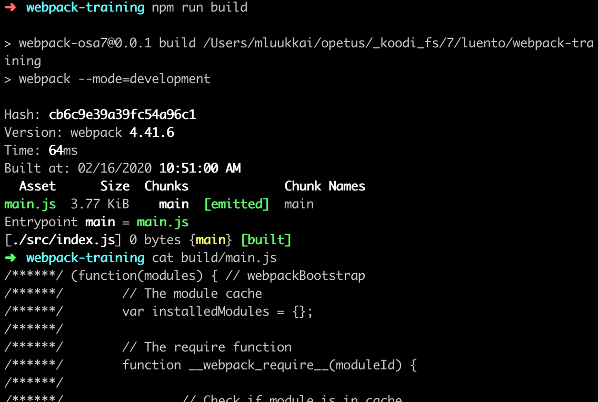
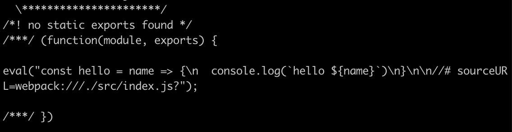
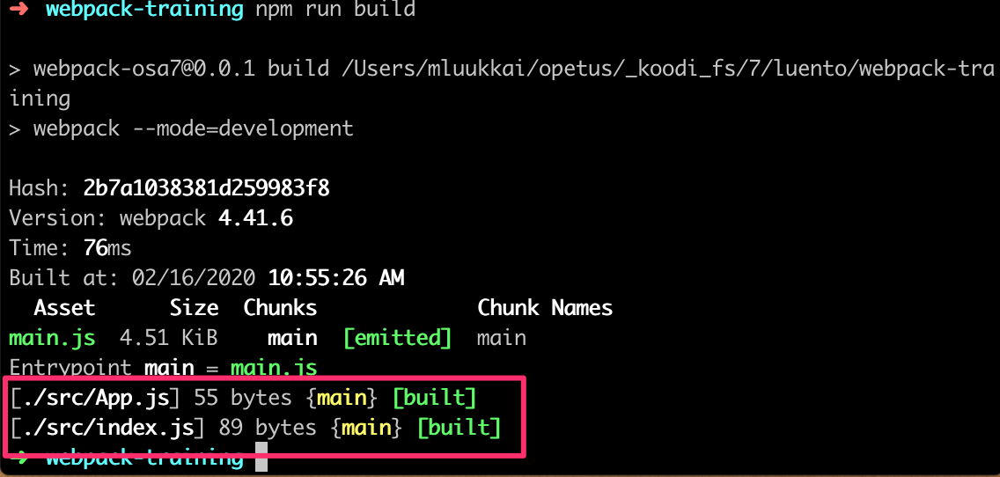
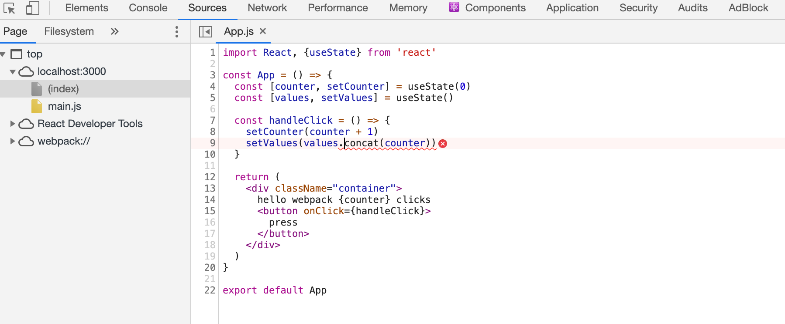

<div class="content">


Developing with React was notorious for requiring tools that were very difficult to configure. These days, getting started with React development is almost painless thanks to [create-react-app](https://github.com/facebookincubator/create-react-app). A better development workflow has probably never existed for browser-side JavaScript development.


We can not rely on the black magic of create-react-app forever and it's time for us to take a look under the hood. One of the key players in making React applications functional is a tool called [webpack](https://webpack.js.org/).


### Bundling


We have implemented our applications by dividing our code into separate modules that have been <i>imported</i> to places that require them. Even though ES6 modules are defined in the ECMAScript standard, no browser actually knows how to handle code that is divided into modules.


For this reason, code that is divided into modules must be <i>bundled</i> for browsers, meaning that all of the source code files are transformed into a single file that contains all of the application code. When we deployed our React frontend to production in [part 3](/en/part3/deploying_app_to_internet), we performed the bundling of our application with the _npm run build_ command. Under the hood, the npm script bundles the source code using webpack which produces the following collection of files in the <i>build</i> directory:

<pre>
├── asset-manifest.json
├── favicon.ico
├── index.html
├── manifest.json
├── precache-manifest.8082e70dbf004a0fe961fc1f317b2683.js
├── service-worker.js
└── static
    ├── css
    │   ├── main.f9a47af2.chunk.css
    │   └── main.f9a47af2.chunk.css.map
    └── js
        ├── 1.578f4ea1.chunk.js
        ├── 1.578f4ea1.chunk.js.map
        ├── main.8209a8f2.chunk.js
        ├── main.8209a8f2.chunk.js.map
        ├── runtime~main.229c360f.js
        └── runtime~main.229c360f.js.map
</pre>


The <i>index.html</i> file located at the root of the build directory is the "main file" of the application, that loads the bundled JavaScript file with a <i>script</i> tag (in fact there are two bundled JavaScript files):

```html
<!doctype html><html lang="en">
<head>
  <meta charset="utf-8"/>
  <title>React App</title>
  <link href="/static/css/main.f9a47af2.chunk.css" rel="stylesheet"></head>
<body>
  <div id="root"></div>
  <script src="/static/js/1.578f4ea1.chunk.js"></script>
  <script src="/static/js/main.8209a8f2.chunk.js"></script>
</body>
</html>
```


As we can see from the example application that was created with create-react-app, the build script also bundles the application's CSS files into a single <i>/static/css/main.f9a47af2.chunk.css</i> file.


In practice, bundling is done so that we define an entry point for the application, which typically is the <i>index.js</i> file. When webpack bundles the code, it includes all of the code that the entry point imports, and the code that its imports import, and so on.


Since part of the imported files are packages like React, Redux, and Axios, the bundled JavaScript file will also contain the contents of each of these libraries.


> The old way of dividing the application's code into multiple files was based on the fact that the <i>index.html</i> file loaded all of the separate JavaScript files of the application with the help of script tags. This resulted in  decreased performance, since the loading of each separate file results in some overhead. For this reason, these days the preferred method is to bundle the code into a single file.


Next, we will create a suitable webpack configuration for a React application by hand from scratch.


Let's create a new directory for the project with the following subdirectories (<i>build</i> and <i>src</i>) and files:

<pre>
├── build
├── package.json
├── src
│   └── index.js
└── webpack.config.js
</pre>


The contents of the <i>package.json</i> file can e.g. be the following:

```json
{
  "name": "webpack-part7",
  "version": "0.0.1",
  "description": "practising webpack",
  "scripts": {},
  "license": "MIT"
}
```


Let's install webpack with the command:

```js
npm install --save-dev webpack webpack-cli
```


We define the functionality of webpack in the <i>webpack.config.js</i> file, which we initialize with the following content:

```js
const path = require('path')

const config = {
  entry: './src/index.js',
  output: {
    path: path.resolve(__dirname, 'build'),
    filename: 'main.js'
  }
}
module.exports = config
```


We will then define a new npm script called <i>build</i> that will execute the bundling with webpack:

```js
// ...
"scripts": {
  "build": "webpack --mode=development"
},
// ...
```


Let's add some more code to the <i>src/index.js</i> file:

```js
const hello = name => {
  console.log(`hello ${name}`)
}
```


When we execute the _npm run build_ command our application code will be bundled by webpack. The operation will produce a new <i>main.js</i> file that is added under the <i>build</i> directory:



The file contains a lot of stuff that looks quite interesting. We can also see the code we wrote earlier at the end of the file:



Let's add a <i>App.js</i> file under the <i>src</i> directory with the following content:

```js
const App = () => {
  return null
}

export default App
```

Let's import and use the <i>App</i> module in the <i>index.js</i> file:

```js
import App from './App';

const hello = name => {
  console.log(`hello ${name}`)
}

App()
```

When we bundle the application again with the _npm run build_ command, we notice that webpack has acknowledged both files:



Our application code can be found at the end of the bundle file in a rather obscure format:

```js
/***/ "./src/App.js":
/*!********************!*\
  !*** ./src/App.js ***!
  \********************/
/*! exports provided: default */
/***/ (function(module, __webpack_exports__, __webpack_require__) {

"use strict";
eval("__webpack_require__.r(__webpack_exports__);\nconst App = () => {\n  return null\n}\n\n/* harmony default export */ __webpack_exports__[\"default\"] = (App);\n\n//# sourceURL=webpack:///./src/App.js?");

/***/ }),

/***/ "./src/index.js":
/*!**********************!*\
  !*** ./src/index.js ***!
  \**********************/
/*! no exports provided */
/***/ (function(module, __webpack_exports__, __webpack_require__) {

"use strict";
eval("__webpack_require__.r(__webpack_exports__);\n/* harmony import */ var _App__WEBPACK_IMPORTED_MODULE_0__ = __webpack_require__(/*! ./App */ \"./src/App.js\");\n\n\nconst hello = name => {\n  console.log(`hello ${name}`)\n};\n\nObject(_App__WEBPACK_IMPORTED_MODULE_0__[\"default\"])()\n\n//# sourceURL=webpack:///./src/index.js?");

/***/ })
```


### Configuration file


Let's take a closer look at the contents of our current <i>webpack.config.js</i> file:

```js
const path = require('path')

const config = {
  entry: './src/index.js',
  output: {
    path: path.resolve(__dirname, 'build'),
    filename: 'main.js'
  }
}

module.exports = config
```

The configuration file has been written in JavaScript and the configuration object is exported by using Node's module syntax. 


Our minimal configuration definition almost explains itself. The [entry](https://webpack.js.org/concepts/#entry) property of the configuration object specifies the file that will serve as the entry point for bundling the application.


The [output](https://webpack.js.org/concepts/#output) property defines the location where the bundled code will be stored. The target directory must be defined as an <i>absolute path</i> which is easy to create with the [path.resolve](https://nodejs.org/docs/latest-v8.x/api/path.html#path_path_resolve_paths) method. We also use [\_\_dirname](https://nodejs.org/docs/latest/api/globals.html#globals_dirname) which is a global variable in Node that stores the path to the current directory.

### Bundling React

Next, let's transform our application into a minimal React application. Let's install the required libraries:

```bash
npm install react react-dom
```

And let's turn our application into a React application by adding the familiar definitions in the <i>index.js</i> file:

```js
import React from 'react'
import ReactDOM from 'react-dom'
import App from './App'

ReactDOM.render(<App />, document.getElementById('root'))
```

We will also make the following changes to the <i>App.js</i> file:

```js
import React from 'react'

const App = () => (
  <div>hello webpack</div>
)

export default App
```

We still need the <i>build/index.html</i> file  that will serve as the "main page" of our application that will load our bundled JavaScript code with a <i>script</i> tag:

```html
<!DOCTYPE html>
<html lang="en">
  <head>
    <meta charset="utf-8" />
    <title>React App</title>
  </head>
  <body>
    <div id="root"></div>
    <script type="text/javascript" src="./main.js"></script>
  </body>
</html>
```


When we bundle our application, we run into the following problem:


### Loaders

The error message from webpack states that we may need an appropriate <i>loader</i> to bundle the <i>App.js</i> file correctly. By default, webpack only knows how to deal with plain JavaScript. Although we may have become unaware of it, we are actually using [JSX](https://facebook.github.io/jsx/) for rendering our views in React. To illustrate this, the following code is not regular JavaScript:

```js
const App = () => {
  return <div>hello webpack</div>
}
```


The syntax used above comes from JSX and it provides us with an alternative way of defining a React element for an html <i>div</i> tag.


We can use [loaders](https://webpack.js.org/concepts/loaders/) to inform webpack of the files that need to be processed before they are bundled.


Let's configure a loader to our application that transforms the JSX code into regular JavaScript:

```js
const config = {
  entry: './src/index.js',
  output: {
    path: path.resolve(__dirname, 'build'),
    filename: 'main.js',
  },
  // highlight-start
  module: {
    rules: [
      {
        test: /\.js$/,
        loader: 'babel-loader',
        options: {
          presets: ['@babel/preset-react'],
        },
      },
    ],
  },
  // highlight-end
}
```


Loaders are defined under the <i>module</i> property in the <i>rules</i> array.


The definition for a single loader consists of three parts:

```js
{
  test: /\.js$/,
  loader: 'babel-loader',
  options: {
    presets: ['@babel/preset-react']
  }
}
```

The <i>test</i> property specifies that the loader is for files that have names ending with <i>.js</i>. The <i>loader</i> property specifies that the processing for those files will be done with [babel-loader](https://github.com/babel/babel-loader). The <i>options</i> property is used for specifying parameters for the loader, that configure its functionality.

Let's install the loader and its required packages as a <i>development dependency</i>:

```js
npm install @babel/core babel-loader @babel/preset-react --save-dev
```

Bundling the application will now succeed.

If we make some changes to the <i>App</i> component and take a look at the bundled code, we notice that the bundled version of the component looks like this:

```js
const App = () =>
  react__WEBPACK_IMPORTED_MODULE_0___default.a.createElement(
    'div',
    null,
    'hello webpack'
  )
```

As we can see from the example above, the React elements that were written in JSX are now created with regular JavaScript by using React's [createElement](https://reactjs.org/docs/react-without-jsx.html) function.


You can test the bundled application by opening the <i>build/index.html</i> file with the <i>open file</i> functionality of your browser:


It's worth noting that if the bundled application's source code uses <i>async/await</i>, the browser will not render anything on some browsers. [Googling the error message in the console](https://stackoverflow.com/questions/33527653/babel-6-regeneratorruntime-is-not-defined) will shed some light on the issue. We have to install one more missing dependency, that is [@babel/polyfill](https://babeljs.io/docs/en/babel-polyfill):

```bash
npm install @babel/polyfill
```


Let's make the following changes to the <i>entry</i> property of the webpack configuration object in the <i>webpack.config.js</i> file:

```js
  entry: ['@babel/polyfill', './src/index.js']
```

Our configuration contains nearly everything that we need for React development.

### Transpilers

The process of transforming code from one form of JavaScript to another is called [transpiling](https://en.wiktionary.org/wiki/transpile). The general definition of the term is to compile source code by transforming it from one language to another.


By using the configuration from the previous section we are <i>transpiling</i> the code containing JSX into regular JavaScript with the help of [babel](https://babeljs.io/), which is currently the most popular tool for the job.


As mentioned in part 1, most browsers do not support the latest features that were introduced in ES6 and ES7, and for this reason the code is usually transpiled to a version of JavaScript that implements the ES5 standard.


The transpilation process that is executed by Babel is defined with <i>plugins</i>. In practice, most developers use ready-made [presets](https://babeljs.io/docs/plugins/) that are groups of pre-configured plugins.


Currently we are using the [@babel/preset-react](https://babeljs.io/docs/plugins/preset-react/) preset for transpiling the source code of our application:

```js
{
  test: /\.js$/,
  loader: 'babel-loader',
  options: {
    presets: ['@babel/preset-react'] // highlight-line
  }
}
```


Let's add the [@babel/preset-env](https://babeljs.io/docs/plugins/preset-env/) plugin that contains everything needed to take code using all of the latest features and transpile it to code that is compatible with the ES5 standard:

```js
{
  test: /\.js$/,
  loader: 'babel-loader',
  options: {
    presets: ['@babel/preset-env', '@babel/preset-react'] // highlight-line
  }
}
```


Let's install the preset with the command:

```js
npm install @babel/preset-env --save-dev
```


When we transpile the code it gets transformed into old-school JavaScript. The definition of the transformed <i>App</i> component looks like this:

```js
var App = function App() {
  return _react2.default.createElement('div', null, 'hello webpack')
};
```


As we can see, variables are declared with the _var_ keyword as ES5 JavaScript does not understand the _const_ keyword. Arrow functions are also not used, which is why the function definition used the _function_ keyword.

### CSS

Let's add some CSS to our application. Let's create a new <i>src/index.css</i> file:

```css
.container {
  margin: 10;
  background-color: #dee8e4;
}
```

Then let's use the style in the <i>App</i> component:

```js
const App = () => {
  return (
    <div className="container">
      hello webpack
    </div>
  )
}
```

And we import the style in the <i>index.js</i> file:

```js
import './index.css'
```


This will cause the transpilation process to break:


When using CSS, we have to use [css](https://webpack.js.org/loaders/css-loader/) and [style](https://webpack.js.org/loaders/style-loader/) loaders:

```js
{
  rules: [
    {
      test: /\.js$/,
      loader: 'babel-loader',
      options: {
        presets: ['@babel/preset-react', '@babel/preset-env'],
      },
    },
    // highlight-start
    {
      test: /\.css$/,
      use: ['style-loader', 'css-loader'],
    },
    // highlight-end
  ];
}
```

The job of the [css loader](https://webpack.js.org/loaders/css-loader/) is to load the <i>CSS</i> files and the job of the [style loader](https://webpack.js.org/loaders/style-loader/) is to generate and inject a <i>style</i> element that contains all of the styles of the application.

With this configuration the CSS definitions are included in the <i>main.js</i> file of the application. For this reason there is no need to separately import the <i>CSS</i> styles in the main <i>index.html</i> file of the application.

If needed, the application's CSS can also be generated into its own separate file by using the [mini-css-extract-plugin](https://github.com/webpack-contrib/mini-css-extract-plugin).

When we install the loaders:

```js
npm install style-loader css-loader --save-dev
```

The bundling will succeed once again and the application gets new styles. 

### Webpack-dev-server

The current configuration makes it possible to develop our application but the workflow is awful (to the point where it resembles the development workflow with Java). Every time we make a change to the code we have to bundle it and refresh the browser in order to test the code.

The [webpack-dev-server](https://webpack.js.org/guides/development/#using-webpack-dev-server) offers a solution to our problems. Let's install it with the command:

```js
npm install --save-dev webpack-dev-server
```

Let's define an npm script for starting the dev-server:

```js
{
  // ...
  "scripts": {
    "build": "webpack --mode=development",
    "start": "webpack serve --mode=development" // highlight-line
  },
  // ...
}
```

Let's also add a new <i>devServer</i> property to the configuration object in the <i>webpack.config.js</i> file:

```js
const config = {
  entry: './src/index.js',
  output: {
    path: path.resolve(__dirname, 'build'),
    filename: 'main.js',
  },
  // highlight-start
  devServer: {
    contentBase: path.resolve(__dirname, 'build'),
    compress: true,
    port: 3000,
  },
  // highlight-end
  // ...
};
```

The _npm start_ command will now start the dev-server at the port 3000, meaning that our application will be available by visiting <http://localhost:3000> in the browser. When we make changes to the code, the browser will automatically refresh the page.


The process for updating the code is fast. When we use the dev-server, the code is not bundled the usual way into the <i>main.js</i> file. The result of the bundling exists only in memory.


Let's extend the code by changing the definition of the <i>App</i> component as shown below:

```js
import React, {useState} from 'react'

const App = () => {
  const [counter, setCounter] = useState(0)

  return (
    <div className="container">
      hello webpack {counter} clicks
      <button onClick={() => setCounter(counter + 1)}>
        press
      </button>
    </div>
  )
}

export default App
```


It's worth noticing that the error messages don't show up the same way as they did with our applications that were made using create-react-app. For this reason we have to pay more attention to the console:


The application works nicely and the development workflow is quite smooth.


### Source maps


Let's extract the click handler into its own function and store the previous value of the counter into its own <i>values</i> state:

```js
const App = () => {
  const [counter, setCounter] = useState(0)
  const [values, setValues] = useState() // highlight-line

  const handleClick = () => {
    setCounter(counter + 1)
    setValues(values.concat(counter)) // highlight-line
  }

  return (
    <div className="container">
      hello webpack {counter} clicks
      <button onClick={handleClick}>
        press
      </button>
    </div>
  )
}
```


The application no longer works and the console will display the following error:


We know that the error is in the onClick method, but if the application was any larger the error message would be quite difficult to track down:

<pre>
App.js:27 Uncaught TypeError: Cannot read property 'concat' of undefined
    at handleClick (App.js:27)
</pre>

The location of the error indicated in the message does not match the actual location of the error in our source code. If we click the error message, we notice that the displayed source code does not resemble our application code:


Of course, we want to see our actual source code in the error message.

Luckily fixing the error message in this respect is quite easy. We will ask webpack to generate a so-called [source map](https://webpack.js.org/configuration/devtool/) for the bundle, that makes it possible to <i>map errors</i> that occur during the execution of the bundle to the corresponding part in the original source code.

The source map can be generated by adding a new <i>devtool</i> property to the configuration object with the value 'source-map':

```js
const config = {
  entry: './src/index.js',
  output: {
    // ...
  },
  devServer: {
    // ...
  },
  devtool: 'source-map', // highlight-line
  // ..
};
```


Webpack has to be restarted when we make changes to its configuration. It is also possible to make webpack watch for changes made to itself but we will not do that this time.


The error message is now a lot better 


since it refers to the code we wrote



Generating the source map also makes it possible to use the Chrome debugger:


Let's fix the bug by initializing the state of <i>values</i> as an empty array:

```js
const App = () => {
  const [counter, setCounter] = useState(0)
  const [values, setValues] = useState([])
  // ...
}
```

### Minifying the code


When we deploy the application to production, we are using the <i>main.js</i> code bundle that is generated by webpack. The size of the <i>main.js</i> file is 974473 bytes even though our application only contains a few lines of our own code. The large file size is due to the fact that the bundle also contains the source code for the entire React library. The size of the bundled code matters since the browser has to load the code when the application is first used. With high-speed internet connections 974473 bytes is not an issue, but if we were to keep adding more external dependencies, loading speeds could become an issue particularly for mobile users.

If we inspect the contents of the bundle file, we notice that it could be greatly optimized in terms of file size by removing all of the comments. There's no point in manually optimizing these files, as there are many existing tools for the job.

The optimization process for JavaScript files is called <i>minification</i>. One of the leading tools intended for this purpose is [UglifyJS](http://lisperator.net/uglifyjs/).

Starting from version 4 of webpack, the minification plugin does not require additional configuration to be used. It is enough to modify the npm script in the <i>package.json</i> file to specify that webpack will execute the bundling of the code in <i>production</i> mode:

```json
{
  "name": "webpack-part7",
  "version": "0.0.1",
  "description": "practising webpack",
  "scripts": {
    "build": "webpack --mode=production", // highlight-line
    "start": "webpack serve --mode=development"
  },
  "license": "MIT",
  "dependencies": {
    // ...
  },
  "devDependencies": {
    // ...
  }
}
```

When we bundle the application again, the size of the resulting <i>main.js</i> decreases substantially:

```js
$ ls -l build/main.js
-rw-r--r--  1 mluukkai  984178727  132299 Feb 16 11:33 build/main.js
```

The output of the minification process resembles old-school C code; all of the comments and even unnecessary whitespace and newline characters have been removed, and variable names have been replaced with a single character.

```js
function h(){if(!d){var e=u(p);d=!0;for(var t=c.length;t;){for(s=c,c=[];++f<t;)s&&s[f].run();f=-1,t=c.length}s=null,d=!1,function(e){if(o===clearTimeout)return clearTimeout(e);if((o===l||!o)&&clearTimeout)return o=clearTimeout,clearTimeout(e);try{o(e)}catch(t){try{return o.call(null,e)}catch(t){return o.call(this,e)}}}(e)}}a.nextTick=function(e){var t=new Array(arguments.length-1);if(arguments.length>1)
```

### Development and production configuration

Next, let's add a backend to our application by repurposing the now-familiar note application backend.


Let's store the following content in the <i>db.json</i> file:

```json
{
  "notes": [
    {
      "important": true,
      "content": "HTML is easy",
      "id": "5a3b8481bb01f9cb00ccb4a9"
    },
    {
      "important": false,
      "content": "Mongo can save js objects",
      "id": "5a3b920a61e8c8d3f484bdd0"
    }
  ]
}
```


Our goal is to configure the application with webpack in such a way that, when used locally, the application uses the json-server available in port 3001 as its backend.


The bundled file will then be configured to use the backend available at the <https://blooming-atoll-75500.herokuapp.com/api/notes> url.

We will install <i>axios</i>, start the json-server, and then make the necessary changes to the application. For the sake of changing things up, we will fetch the notes from the backend with our [custom hook](/en/part7/custom_hooks) called _useNotes_:

```js
import React, { useState, useEffect } from 'react'
import axios from 'axios'

// highlight-start
const useNotes = (url) => {
  const [notes, setNotes] = useState([])

  useEffect(() => {
    axios.get(url).then(response => {
      setNotes(response.data)
    })
  }, [url])

  return notes
}
// highlight-end

const App = () => {
  const [counter, setCounter] = useState(0)
  const [values, setValues] = useState([])
  const url = 'https://blooming-atoll-75500.herokuapp.com/api/notes'
  const notes = useNotes(url) // highlight-line

  const handleClick = () => {
    setCounter(counter + 1)
    setValues(values.concat(counter))
  }

  return (
    <div className="container">
      hello webpack {counter} clicks
      <button onClick={handleClick} >press</button>
      <div>{notes.length} notes on server {url}</div> // highlight-line
    </div>
  )
}

export default App
```


The address of the backend server is currently hardcoded in the application code. How can we change the address in a controlled fashion to point to the production backend server when the code is bundled for production?


Let's change the configuration object in the <i>webpack.config.js</i> file to be a function instead of an object:

```js
const path = require('path');

const config = (env, argv) => {
  return {
    entry: './src/index.js',
    output: {
      // ...
    },
    devServer: {
      // ...
    },
    devtool: 'source-map',
    module: {
      // ...
    },
    plugins: [
      // ...
    ],
  }
}

module.exports = config
```


The definition remains almost exactly the same, except for the fact that the configuration object is now returned by the function. The function receives the two parameters, <i>env</i> and <i>argv</i>, the second of which can be used for accessing the <i>mode</i> that is defined in the npm script. 


We can also use webpack's [DefinePlugin](https://webpack.js.org/plugins/define-plugin/) for defining <i>global default constants</i> that can be used in the bundled code. Let's define a new global constant <i>BACKEND\_URL</i>, that gets a different value depending on the environment that the code is being bundled for:

```js
const path = require('path')
const webpack = require('webpack') // highlight-line

const config = (env, argv) => {
  console.log('argv', argv.mode)

  // highlight-start
  const backend_url = argv.mode === 'production'
    ? 'https://blooming-atoll-75500.herokuapp.com/api/notes'
    : 'http://localhost:3001/api/notes'
  // highlight-end

  return {
    entry: './src/index.js',
    output: {
      path: path.resolve(__dirname, 'build'),
      filename: 'main.js'
    },
    devServer: {
      contentBase: path.resolve(__dirname, 'build'),
      compress: true,
      port: 3000,
    },
    devtool: 'source-map',
    module: {
      // ...
    },
    // highlight-start
    plugins: [
      new webpack.DefinePlugin({
        BACKEND_URL: JSON.stringify(backend_url)
      })
    ]
    // highlight-end
  }
}

module.exports = config
```


The global constant is used in the following way in the code:

```js
const App = () => {
  const [counter, setCounter] = useState(0)
  const [values, setValues] = useState([])
  const notes = useNotes(BACKEND_URL) // highlight-line

  // ...
  return (
    <div className="container">
      hello webpack {counter} clicks
      <button onClick={handleClick} >press</button>
      <div>{notes.length} notes on server {BACKEND_URL}</div> // highlight-line
    </div>
  )
}
```


If the configuration for development and production differs a lot, it may be a good idea to [separate the configuration](https://webpack.js.org/guides/production/) of the two into their own files.


We can inspect the bundled production version of the application locally by executing the following command in the <i>build</i> directory:

```js
npx static-server
```


By default the bundled application will be available at <http://localhost:9080>.

### Polyfill


Our application is finished and works with all relatively recent versions of modern browsers, with the exception of Internet Explorer. The reason for this is that because of _axios_ our code uses [Promises](https://developer.mozilla.org/en-US/docs/Web/JavaScript/Reference/Global_Objects/Promise), and no existing version of IE supports them:


There are many other things in the standard that IE does not support. Something as harmless as the [find](https://developer.mozilla.org/en-US/docs/Web/JavaScript/Reference/Global_Objects/Array/find) method of JavaScript arrays exceeds the capabilities of IE:


In these situations it is not enough to transpile the code, as transpilation simply transforms the code from a newer version of JavaScript to an older one with wider browser support. IE understands Promises syntactically but it simply has not implemented their functionality. The _find_ property of arrays in IE is simply <i>undefined</i>.


If we want the application to be IE-compatible we need to add a [polyfill](https://remysharp.com/2010/10/08/what-is-a-polyfill), which is code that adds the missing functionality to older browsers.


Polyfills can be added with the help of [webpack and Babel](https://babeljs.io/docs/usage/polyfill/) or by installing one of many existing polyfill libraries.


The polyfill provided by the [promise-polyfill](https://www.npmjs.com/package/promise-polyfill) library is easy to use, we simply have to add the following to our existing application code:

```js
import PromisePolyfill from 'promise-polyfill'

if (!window.Promise) {
  window.Promise = PromisePolyfill
}
```


If the global _Promise_ object does not exist, meaning that the browser does not support Promises, the polyfilled Promise is stored in the global variable. If the polyfilled Promise is implemented well enough, the rest of the code should work without issues.


One exhaustive list of existing polyfills can be found [here](https://github.com/Modernizr/Modernizr/wiki/HTML5-Cross-browser-Polyfills).


The browser compatibility of different API's can be checked by visiting [https://caniuse.com](https://caniuse.com) or [Mozilla's website](https://developer.mozilla.org/en-US/).

### Eject


The create-react-app tool uses webpack behind the scenes. If the default configuration is not enough, it is possible to [eject](https://create-react-app.dev/docs/available-scripts/#npm-run-eject) the project which will get rid of all of the black magic, and the default configuration files will be stored in the <i>config</i> directory and in a modified <i>package.json</i> file.


If you eject an application created with create-react-app, there is no return and all of the configuration will have to be maintained manually. The default configuration is not trivial, and instead of ejecting from a create-react-app application, a better alternative may be to write your own webpack configuration from the get-go.


Going through and reading the configuration files of an ejected application is still recommended and extremely educational.

</div>

<div class="tasks">


### Exercises


One exercise related to the topics presented here, can be found at the end of this course material section in the exercise set [for extending the blog list application](/en/part7/exercises_extending_the_bloglist).


</div>
