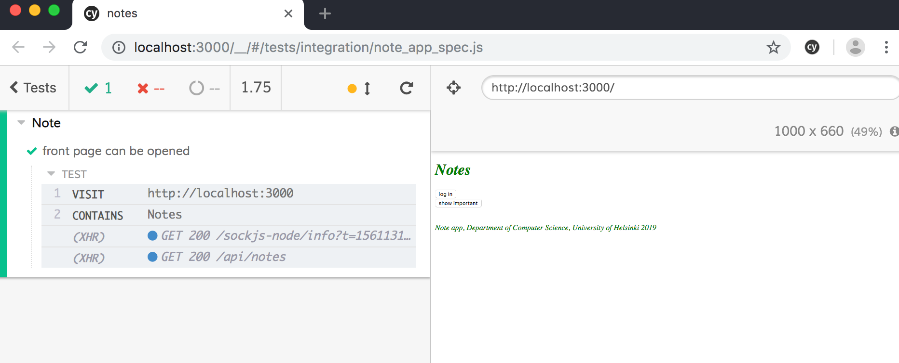
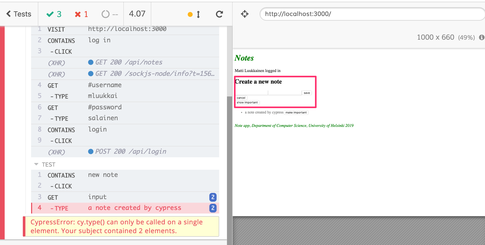

<div class="content">


During the course we have only used React components having been defined as Javascript functions. This was not possible without the [hook](https://reactjs.org/docs/hooks-intro.html)-functionality that came with version 16.8 of React. Before, when defining a component that uses state one had to define it using Javascript's [Class](https://reactjs.org/docs/state-and-lifecycle.html#converting-a-function-to-a-class)-syntax.


It is beneficial to at least be familiar with Class Components to some extent, since the world contains a lot of old React code, which will probably never be completely rewritten using the updated syntax.


### Class Components


Let's get to know the main features of Class Components by producing yet another very familiar anecdote application. We store the anecdotes in the file <i>db.json</i> using <i>json-server</i>. The contents of the file are lifted from [here](https://github.com/fullstackopen-2019/misc/blob/master/anecdotes.json).


The initial version of the Class Component look like this

```js
import React from 'react'

class App extends React.Component {
  constructor(props) {
    super(props)
  }

  render() {
    return (
      <div>
        <h1>anecdote of the day</h1>
      </div>
    )
  }
}

export default App
```


The component now has a [constructor](https://reactjs.org/docs/react-component.html#constructor), in which nothing happens at the moment, and contains the method [render](https://reactjs.org/docs/react-component.html#render). As one might guess, render defines how and what is rendered to the screen.


Let's define a state for the list of anecdotes and the currently visible anecdote. In contrast to when using the [useState](https://reactjs.org/docs/hooks-state.html)-hook Class Components only contain one state. So if the state is made up of multiple "parts" they should be stored as properties of the state. The state is initialized in the constructor:

```js
class App extends React.Component {
  constructor(props) {
    super(props)

    // highlight-start
    this.state = {
      anecdotes: [],
      current: 0
    }
    // highlight-end
  }

  render() {
    if (this.state.anecdotes.length == 0 ) { // highlight-line
      return <div>no anecdotes...</div>
    }

    return (
      <div>
        <h1>anecdote of the day</h1>
        <div>
          {this.state.anecdotes[this.state.current].content} // highlight-line
        </div>
        <button>next</button>
      </div>
    )
  }
}
```


The component state is in the instance variable _this.state_. The state is an object having two properties. <i>this.state.anecdotes</i> is the list of anecdotes and <i>this.state.current</i> is the index of the currently shown anecdote.


In Functional components the right place for fetching data from a server is inside an [effect hook](https://reactjs.org/docs/hooks-effect.html), which is executed when a component renders or less frequently if necessary, e.g. only in combination with the first render.


The [lifecycle-methods](https://reactjs.org/docs/state-and-lifecycle.html#adding-lifecycle-methods-to-a-class) of Class Components offer corresponding functionality. The correct place to trigger the fetching of data from a server is inside the lifecycle-method [componentDidMount](https://reactjs.org/docs/react-component.html#componentdidmount), which is executed once right after the first time a component renders:

```js
class App extends React.Component {
  constructor(props) {
    super(props)

    this.state = {
      anecdotes: [],
      current: 0
    }
  }

  // highlight-start
  componentDidMount = () => {
    axios.get('http://localhost:3001/anecdotes').then(response => {
      this.setState({ anecdotes: response.data })
    })
  }
  // highlight-end

  // ...
}
```


The callback function of the HTTP request updates the component state using the method [setState](https://reactjs.org/docs/react-component.html#setstate). The method only touches the keys that have been defined in the object passed to the method as an argument. The value for the key <i>current</i> remains unchanged.


Calling the method setState always trigger the rerender of the Class Component, i.e. calling the method _render_.


We'll finish off the the component with the ability to change the shown anecdote. The following is the code for the entire component with the addition highlighted:

```js
class App extends React.Component {
  constructor(props) {
    super(props)

    this.state = {
      anecdotes: [],
      current: 0
    }
  }

  componentDidMount = () => {
    axios.get('http://localhost:3001/anecdotes').then(response => {
      this.setState({ anecdotes: response.data })
    })
  }

  // highlight-start
  handleClick = () => {
    const current = Math.round(
      Math.random() * this.state.anecdotes.length
    )
    this.setState({ current })
  }
  // highlight-end

  render() {
    if (this.state.anecdotes.length === 0 ) {
      return <div>no anecdotes...</div>
    }

    return (
      <div>
        <h1>anecdote of the day</h1>
        <div>{this.state.anecdotes[this.state.current].content}</div>
        <button onClick={this.handleClick}>next</button> // highlight-line
      </div>
    )
  }
}
```


For comparison here is the same application as a Functional component:

```js
const App = () => {
  const [anecdotes, setAnecdotes] = useState([])
  const [current, setCurrent] = useState(0)

  useEffect(() =>{
    axios.get('http://localhost:3001/anecdotes').then(response => {
      setAnecdotes(response.data)
    })
  },[])

  const handleClick = () => {
    setCurrent(Math.round(Math.random() * anecdotes.length))
  }

  if (anecdotes.length === 0) {
    return <div>no anecdotes...</div>
  }

  return (
    <div>
      <h1>anecdote of the day</h1>
      <div>{anecdotes[current].content}</div>
      <button onClick={handleClick}>next</button>
    </div>
  )
}
```


In the case of our example the differences were minor. The biggest difference between Functional components and Class components is mainly that the state of a Class component is a single object, and that the state is updated using the method _setState_, while in Functional components the state can consist of multiple different variables, with all of them having their own update function.


In some more advanced use cases the effect hook offers a considerably better mechanism for controlling side effects compared to the lifecycle-methods of Class Components.


A notable benefit of using Functional components is not having to deal with the self referencing _this_-reference of the Javascript class.


In my opinion, and the opinion of many others, Class Components offer basically no benefits over Functional components enhanced with hooks, with the exception of the so-called [error boundary](https://reactjs.org/docs/error-boundaries.html) mechanism, which currently (21.6.2019) isn't yet in use by functional components.


When writing fresh code [there is no rational reason to use Class Components](https://reactjs.org/docs/hooks-faq.html#should-i-use-hooks-classes-or-a-mix-of-both) if the project is using React with a version number 16.8 or greater. On the other hand, [there is currently no need to rewrite all old React code](https://reactjs.org/docs/hooks-faq.html#do-i-need-to-rewrite-all-my-class-components) as Functional components.


### End to end testing of the application


Let's return to testing for a bit. In previous parts we wrote unit tests, as well as integration tests, for the applications. Now we take a look at a way to create <i>End to End (E2E) -tests</i> which inspect the [entire system](https://en.wikipedia.org/wiki/System_testing).


E2E-testing of web applications is done using the browser with the help of some library. There are plenty of solutions out there, e.g. [Selenium](http://www.seleniumhq.org/), which enables automatic tests using practically any browser. 


In the [previous version of this course](https://fullstackopen.github.io/osa7/) E2E-tests were done using the [puppeteer](https://pptr.dev/)-library, which provides a direct interface for using the [chrome](https://developers.google.com/web/updates/2017/04/headless-chrome) browser in a so-called [headless](https://en.wikipedia.org/wiki/Headless_browser)-mode, meaning the browser doesn't display its graphical user interface.


Even though E2E for web applications has been technologically possible for more than ten years it has been woefully difficult, especially when it comes to applications created using the Single Page App(SPA) -principle. SPA-tests have often been unreliable, or some might say [flaky](https://hackernoon.com/flaky-tests-a-war-that-never-ends-9aa32fdef359): sometimes particular tests pass and sometimes they don't, even though the code remains unchanged.


In the year 2018 a software library called [Cypress](https://www.cypress.io/) has quickly grown in favor in E2E-testing. Cypress is exceptionally easy to use. The amount of legwork one has to do compared to using, e.g. Selenium, is practically non existent. Cypress' way of operating differs radically from most libraries used for E2E-testing. This is because Cypress-tests are all run entirely within the browser. With other approaches the tests are in a Node-process, which is connected to the browser through the APIs that it offers.


Let's make a few tests for that notes application we made in parts 2-5.


We install cypress

```js
npm install --save-dev cypress
```


and then we define a npm-script for starting the tests.

```js
{
  // ...
  "scripts": {
    "start": "react-scripts start",
    "build": "react-scripts build",
    "test": "react-scripts test",
    "eject": "react-scripts eject",
    "server": "json-server -p3001 db.json",
    "cypress:open": "cypress open"  // highlight-line
  },
  // ...
}
```


Cypress-tests expect the system that is being tested to be running when running the tests. 


We make a npm-script for the backend so we can run it such that <i>NODE\_ENV</i> gets the value <i>test</i>

```js
{
  // ...
  "scripts": {
    "start": "cross-env NODE_ENV=production node index.js",
    "watch": "cross-env NODE_ENV=development nodemon index.js",
    "build:ui": "rm -rf build && cd ../../osa2/notes/ && npm run build --prod && cp -r build ../../osa3/backend/",
    "deploy": "git push heroku master",
    "deploy:full": "npm run build:ui && git add . && git commit -m uibuild && git push && npm run deploy",
    "logs:prod": "heroku logs --tail",
    "lint": "eslint .",
    "test": "cross-env NODE_ENV=test jest --verbose --runInBand",
    "start:test": "cross-env NODE_ENV=test node index.js" // highlight-line
  },
  // ...
}
```


When the backend and frontend are running we can start Cypress using the command

```js
npm run cypress:open
```

In the project there will appear a directory called <i>cypress</i>, in which there is a subdirectory <i>integrations</i> where the tests are to be placed. Cypress generates a set of example test. Let's remove them and create our first test into the file <i>note\_app\_spec.js</i>:

```js
describe('Note ', function() {
  it('front page can be opened', function() {
    cy.visit('http://localhost:3000')
    cy.contains('Notes')
  })
})
```

The execution of the test opens the browser and displays how the application behaves as the test progresses:




When it comes to the structure of the test it seems quite familiar. <i>describe</i>-blocks are used, just like with Jest, to group individual test cases having been defined using the <i>it</i>-method. These parts have been borrowed from the [Mocha](https://mochajs.org/) testing library, which Cypress uses internally. Mocha was the previous ruler of testing libraries and is still very popular, but Jest has clearly gotten ahead. On the other hand, [visit](https://docs.cypress.io/api/commands/visit.html#Syntax) and [contains](https://docs.cypress.io/api/commands/contains.html#Syntax) are Cypress commands, both of which have a fairly clear purpose.


We could have also defined the test using arrow functions

```js
describe('Note app', () => { // highlight-line
  it('front page can be opened', () => { // highlight-line
    cy.visit('http://localhost:3000')
    cy.contains('Notes')
  })
})
```


However, the documentation for Mocha [recommends](https://mochajs.org/#arrow-functions) not to use arrow functions, since they might cause issues in some cases.


The test doesn't pass if contains cannot find the text it is looking for on the page. So if we add the following test

```js
describe('Note app', function() {
  it('front page can be opened',  function() {
    cy.visit('http://localhost:3000')
    cy.contains('Notes')
  })

// highlight-start
  it('front page contains random text', function() {
    cy.visit('http://localhost:3000')
    cy.contains('wtf is this app?')
  })
// highlight-end
})
```


Cypress will detect the problem


Let's expand the test such that the test tries to log into the application. We begin by opening the login form.

```js
describe('Note app',  function() {
  // ...

  it('login form can be opened', function() {
    cy.visit('http://localhost:3000')
    cy.contains('log in')
      .click()
  })
})
```


The test first gets the button based on its content and clicks the button with the command [click](https://docs.cypress.io/api/commands/click.html#Syntax).


Because both tests start in the same way, by opening the page <i>http://localhost:3000</i>, it is advisable to separate the common part into the <i>beforeEach</i>-block, which is run before each test:

```js
describe('Note app', function() {
  // highlight-start
  beforeEach(function() {
    cy.visit('http://localhost:3000')
  })
  // highlight-end

  it('front page can be opened', function() {
    cy.contains('Notes')
  })

  it('login form can be opened', function() {
    cy.contains('log in')
      .click()
  })
})
```


The registration form contains two <i>input</i>-fields into which the tests need to input data.


The command [get](https://docs.cypress.io/api/commands/get.html#Syntax) enables the searching of elements using CSS-selectors.


We can get the first and last input-fields of the form and write text into them using the command [type](https://docs.cypress.io/api/commands/type.html#Syntax) as follows:

```js
it('user can login', function () {
  cy.contains('log in')
    .click()
  cy.get('input:first')
    .type('mluukkai')
  cy.get('input:last')
    .type('salainen')
  cy.contains('login')
    .click()
  cy.contains('Matti Luukkainen logged in')
})  
```


The test works but is problematic because if we add more input-fields to the application the test might break, since it expects the required fields to be the first and the last field.


A better (but not [optimal](https://docs.cypress.io/guides/references/best-practices.html#Selecting-Elements) according to the documentation) solution would be to define uniquely identifiable <i>id</i>-attributes for the fields and get the field based on that info in the tests. So we expand the login form as follows

```js
const LoginForm = ({ ... }) => {
  return (
    <div>
      <h2>Login</h2>
      <form onSubmit={handleSubmit}>
        <div>
          username
          <input
            id='username'  // highlight-line
            value={username}
            onChange={handleUsernameChange}
          />
        </div>
        <div>
          password
          <input
            id='password' // highlight-line
            type="password"
            value={password}
            onChange={handlePasswordChange}
          />
      </div>
        <button type="submit">login</button>
      </form>
    </div>
  )
}
```

The test changes like so

```js
describe('Note app',  function() {
  // ..
  it('user can login', function() {
    cy.contains('log in')
      .click()
    cy.get('#username')  // highlight-line
      .type('mluukkai')
    cy.get('#password')  // highlight-line
      .type('salainen')
    cy.contains('login')
      .click()
    cy.contains('Matti Luukkainen logged in')
  })
})
```


We create another test which adds a new note to the application:

```js
describe('Note app', function() {
  // ..
  describe('when logged in', function() {
    beforeEach(function() {
      cy.contains('log in')
        .click()
      cy.get('#username')
        .type('mluukkai')
      cy.get('#password')
        .type('salainen')
      cy.contains('login')
        .click()
    })

    it('name of the user is shown', function() {
      cy.contains('Matti Luukkainen logged in')
    })

    // highlight-start
    it('a new note can be created', function() {
      cy.contains('new note')
        .click()
      cy.get('input')
        .type('a note created by cypress')
      cy.contains('save')
        .click()
      cy.contains('a note created by cypress')
    })
    // highlight-end
  })
})
```


Because two of the tests expect a user to be logged in, their common part has again been separated into the <i>beforeEach</i>-block. The test expects there only being one input-field when creating a new note so it gets the field as follows:

```js
cy.get('input')
```

the test breaks if there would be multiple fields




For that reason it would have been better to add an <i>id</i> for the input-field in the form and get the field based on the id in the test.


### Controlling the state of the database


If there is a need to modify the database during the tests, the situation gets a bit more tricky. In an ideal situation the testing should always start from the same initial state, so that the tests are reliable and easily repeatable.


A common solution is to reset the database and possibly initialize it appropriately before running the tests. In E2E-testing there is the additional challenge of not having direct access to the database.


This problem can be solved by creating an API endpoint in the backend for the tests, in which the tests can reset the database if necessary. We make a <i>router</i> for the tests

```js
const router = require('express').Router()
const Note = require('../models/note')
const User = require('../models/user')

router.post('/reset', async (request, response) => {
  await Note.deleteMany({})
  await User.deleteMany({})

  response.status(204).end()
})

module.exports = router
```


and we use it in backend only <i>if the application is run in test-mode</i>: 

```js
// ...

app.use('/api/login', loginRouter)
app.use('/api/users', usersRouter)
app.use('/api/notes', notesRouter)

// highlight-start
if (process.env.NODE_ENV === 'test') {
  const testingRouter = require('./controllers/testing')
  app.use('/api/testing', testingRouter)
}
// highlight-end

app.use(middleware.unknownEndpoint)
app.use(middleware.errorHandler)

module.exports = app
```


so after the modification a HTTP POST request to the backend endpoint <i>/api/testing/reset</i> empties the database.


The code for the modified backend can be found in full on [github](https://github.com/fullstackopen-2019/part3-notes-backend/tree/part7-1), in the branch <i>part7-1</i>.


Right now the user interface of the application has no ability to add users to the system. Therefore we need to directly create a test-user to the backend when initializing the tests.

```js
describe('Note app', function() {
  beforeEach(function() {
    cy.request('POST', 'http://localhost:3001/api/testing/reset') // highlight-line
    const user = {
      name: 'Matti Luukkainen',
      username: 'mluukkai',
      password: 'salainen'
    }
    cy.request('POST', 'http://localhost:3001/api/users/', user)  // highlight-line
    cy.visit('http://localhost:3000')
  })

  it('front page can be opened', function() {
    cy.contains('Notes')
  })
})
```


During the initialization the test makes HTTP requests to the backend using the command [request](https://docs.cypress.io/api/commands/request.html). We move the previously created test for the creation of a note to the describe block

```js
describe('Note app', function() {
  // ...

  describe('when logged in', function() {
    beforeEach(function() {
      cy.contains('log in')
        .click()
      cy.get('#username')
        .type('mluukkai')
      cy.get('#password')
        .type('salainen')
      cy.contains('login')
        .click()
    })

    it('name of the user is shown', function() {
      cy.contains('Matti Luukkainen logged in')
    })

    it('a new note can be created', function() {
      cy.contains('new note')
        .click()
      cy.get('input')
        .type('a note created by cypress')
      cy.contains('save')
        .click()
      cy.contains('a note created by cypress')
    })
  })
})
```

Unlike before, now the testing always starts from an identical state: one user in the database and no notes.

Let's add one more test which makes sure the importance of notes can be changed. First we modify the frontend of the application so that a new note is unimportant by default, in other words the field <i>important</i> gets the value <i>false</i>: 

```js
const App = () => {
  // ...
  const addNote = (event) => {
    event.preventDefault()
    noteFormRef.current.toggleVisibility()
    const noteObject = {
      content: newNote,
      important: false  // highlight-line
    }

    noteService
      .create(noteObject).then(returnedNote => {
        setNotes(notes.concat(returnedNote))
        setNewNote('')
      })
  }

  // ...
}
```


There are several ways to test the case. In the following we first find the note and click its button <i>make important</i>. Then we make sure that the note contains the button <i>make not important</i>.

```js
describe('Note app', function() {
  // ...

  describe('when logged in', function() {
    // ...

    describe('and a note is created', function () {
      beforeEach(function () {
        cy.contains('new note')
          .click()
        cy.get('input')
          .type('another note cypress')
        cy.contains('save')
          .click()
      })

      it('it can be made important', function () {
        cy.contains('another note cypress')
          .contains('make important')
          .click()

        cy.contains('another note cypress')
          .contains('make not important')
      })
    })
  })
})
```


The tests and the code for the frontend can be found in full on [github](https://github.com/fullstackopen-2019/part3-notes-backend/tree/part7-1), in the branch <i>part7-1</i>.


Cypress provides fairly good ways of [debugging](https://docs.cypress.io/guides/getting-started/writing-your-first-test.html#Debugging) the tests. It is very easy to inspect the state of the DOM for each step of the execution.


The documentation for Cypress is exceptionally good. I strongly recommend trying Cypress!

</div>

<div class="tasks">


### Exercises


The exercises relating to End to end -testing are part of the [exercise series expanding on the bloglist application](/en/part7/exercises_extending_the_bloglist) at the end of this part. 

</div>
